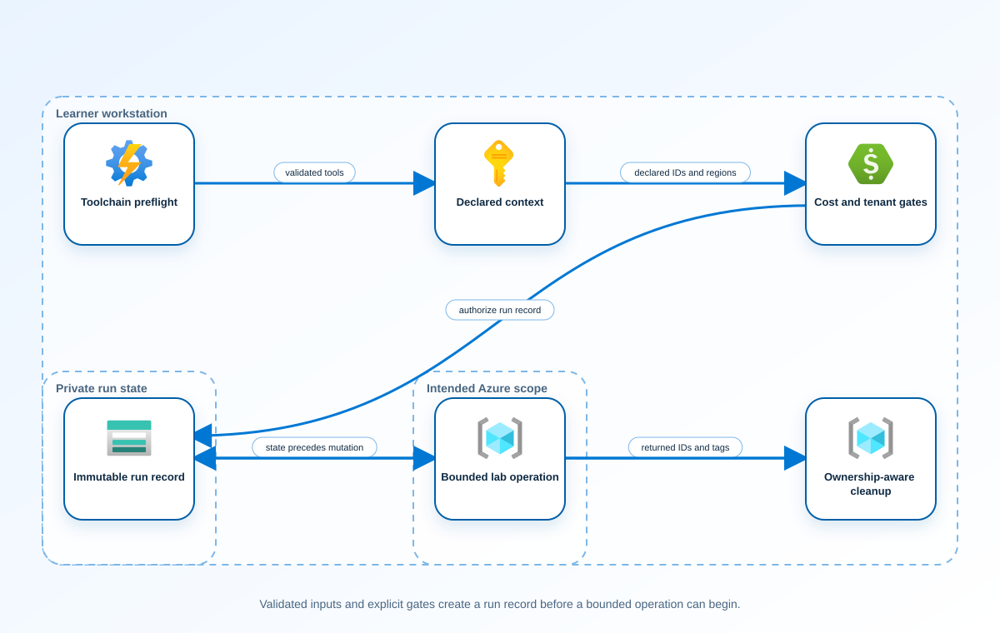

<!-- BEGIN GENERATED AZ305 V1 -->
# LAB-00 — Safe Bootstrap and Dual-Command Lab Contract

## 1. Navigation

[Lab catalog](../README.md) · [LAB-01 →](../01-centralized-logging-routing/README.md)

## 2. Scenario and completion contract

An architecture team needs a repeatable safety envelope before evaluating any Azure solution. Build an offline-first operating contract that validates tools, captures intended context without signing in, previews cost and permission gates, writes recovery state before a potential change, and proves cleanup ownership. The result must work with both Azure CLI and Azure PowerShell while keeping every live operation behind explicit switches.

- Architect role: Lead cloud solutions architect
- Outcome: A reusable safety contract that makes every later architecture exercise observable, recoverable, and deny-by-default.
- Duration: 90 minutes
- Difficulty: foundational
- Cost class: none
- Completion: all five checkpoint assertions, final validation, decision revision, and cleanup review are complete.

## 3. Objective-to-evidence map

| Objective | Requirement | Checkpoint |
| --- | --- | --- |
| `FD-TOOLS-01` | `LAB00-REQ-01` | [`LAB00-CP01`](#checkpoint-1) |
| `FD-CONTEXT-01` | `LAB00-REQ-02` | [`LAB00-CP02`](#checkpoint-2) |
| `FD-COST-01` | `LAB00-REQ-03` | [`LAB00-CP03`](#checkpoint-3) |
| `FD-SAFETY-01` | `LAB00-REQ-04` | [`LAB00-CP04`](#checkpoint-4) |
| `FD-CLEANUP-01` | `LAB00-REQ-05` | [`LAB00-CP05`](#checkpoint-5) |

## 4. Business and quality requirements

Business outcome: Reduce accidental cloud changes and make architecture experiments reproducible and independently auditable.

- `LAB00-REQ-01` — Required command families and pinned versions are reported without contacting Azure or Microsoft Graph.
- `LAB00-REQ-02` — Synthetic intended identifiers are recorded in run state before any execution path is considered.
- `LAB00-REQ-03` — Preview records which acknowledgements a later lab would require and performs no billable action.
- `LAB00-REQ-04` — The recovery record exists, validates, and predates the first possible mutation boundary.
- `LAB00-REQ-05` — Previewed dependency order and exact ownership checks produce a post-cleanup record with no active managed object.

Scenario facts:

- **Data:** Inputs and outputs are synthetic JSON documents; secrets, tokens, tenant identifiers, and live evidence are prohibited.
- **Scale:** The contract supports one isolated state directory per RunId and all twenty-eight fixed lab identifiers.
- **Latency:** No service-response target applies; state persistence must complete synchronously before a mutation adapter can be called.
- **Availability:** Bootstrap availability depends only on the copied lab files and frozen container, not on Azure or network reachability.
- **RTO:** Recovery from an interrupted preview is immediate after reopening the persisted run document; no cloud recovery objective applies.
- **RPO:** The recoverability target is zero lost recorded mutations because every returned identifier must be persisted immediately.
- **Budget:** Cloud spend is zero and the design does not expose a cost-acknowledgement path that can provision a resource.

Constraints:

- The bootstrap must write run state before any command that could mutate an external system.
- Design-simulation mode must refuse every Azure or Microsoft Graph request, even when Execute is supplied.
- Use only the Dual bootstrap command lane for learner implementation.
- Keep all live changes behind explicit execution and acknowledgement switches.
- Retain only sanitized command evidence and synthetic fixture identifiers.

Assumptions:

- The learner runs the copied lab inside the frozen dev container with no cached Azure context.
- Synthetic run identifiers are sufficient to exercise validation, recovery, and cleanup behavior.
- West Europe is the configurable primary example and North Europe is the configurable secondary example.
- The learner has administrator-level Azure operations knowledge but receives no pre-existing authenticated context.
- Offline fixtures demonstrate contract behavior rather than live Azure service behavior.

## 5. Architecture diagram and walkthrough



The flow begins with the business outcome, crosses five independently validated design capabilities, and ends with positive and negative evidence. The SVG is deterministically rendered from `diagrams/architecture.mmd`.

## 6. Concept primer and candidate architectures

Architecture decisions translate measurable requirements into a deliberate service and operating model. A candidate is viable only when every mandatory constraint is met; convenience or familiarity cannot compensate for a disqualifier.

- **Shared bootstrap contract with immutable run state and explicit execution gates** (eligible) — A state-first contract gives every copied lab the same recoverable boundary while explicit execution and acknowledgement gates remain locally testable.
- **Manual operator checklist without persisted state** (eligible) — A checklist is inexpensive and readable but cannot prove mutation ordering or recover after a partially completed command.
- **Central automation account that executes every lab on behalf of learners** (eligible) — Central execution can standardize runs, but it introduces a privileged shared identity and a runtime dependency on external automation.
- **Untracked shell snippets with implicit cached credentials** (ineligible) — Ad hoc snippets may be quick to type but neither establish ownership nor bind activity to the requested tenant, subscription, and run. Disqualifier: LAB00-REQ-01 requires explicit validated inputs and durable state before any potential mutation.

## 7. Decision, ADR, and Well-Architected review

Criteria weights are C1 30, C2 25, C3 20, C4 15, and C5 10. Weighted totals use `sum(weight × score) / 5`.

| Candidate | Eligible | C1 | C2 | C3 | C4 | C5 | Weighted /100 |
| --- | ---: | ---: | ---: | ---: | ---: | ---: | ---: |
| Shared bootstrap contract with immutable run state and explicit execution gates | yes | 5 | 5 | 5 | 4 | 4 | 95 |
| Manual operator checklist without persisted state | yes | 3 | 2 | 3 | 2 | 5 | 56 |
| Central automation account that executes every lab on behalf of learners | yes | 3 | 4 | 2 | 4 | 2 | 62 |
| Untracked shell snippets with implicit cached credentials | no | 1 | 1 | 1 | 2 | 5 | 31 |

Selected design: **Shared bootstrap contract with immutable run state and explicit execution gates**. `ADR-LAB00-001` records the accepted reasoning. Review Reliability, Security, Cost Optimization, Operational Excellence, and Performance Efficiency in `design/decision.yml`; no pillar is implied by another.

Rejected alternatives:

- **Manual operator checklist without persisted state:** Its low recovery and operating scores leave no machine-verifiable record of returned identifiers.
- **Central automation account that executes every lab on behalf of learners:** The shared privilege boundary conflicts with isolated self-paced operation and adds an unnecessary control plane.
- **Untracked shell snippets with implicit cached credentials:** The candidate is ineligible because it violates the state-first mandatory boundary.

Architecture risks:

- **Risk:** A malformed or reused RunId could merge evidence from unrelated exercises. **Mitigation:** Validate the RunId pattern and isolate every artifact beneath the exact run directory before command evaluation.
- **Risk:** A future author could add a cloud command to a simulation checkpoint. **Mitigation:** Parse command surfaces in CI and force design-simulation lifecycle scripts to exit before context discovery.

Well-Architected consequences:

- **Reliability:** Atomic state replacement and resumable status values preserve an intelligible recovery point after interruption.
- **Security:** Explicit tenant and subscription inputs eliminate reliance on cached identity context and sensitive fields are recursively rejected.
- **Cost Optimization:** An offline simulation produces the required evidence without standing cloud resources or idle automation accounts.
- **Operational Excellence:** One lifecycle contract, fixed exit codes, and schema-validated artifacts make faults reproducible across copied labs.
- **Performance Efficiency:** Local registry lookups and bounded JSON files avoid network latency and scale work only with the current run.

ADR consequences:

- Every lab carries duplicated lifecycle helpers so portability is favored over reducing repository line count.
- Authors must evolve schemas and generators together whenever the public run contract changes.

## 8. Inputs, permissions, licensing, cost, and analogue

Use configurable `Location` (`AZ305_LOCATION`, default West Europe) and `SecondaryLocation` (`AZ305_SECONDARY_LOCATION`, default North Europe). Every public input has an explicit `AZ305_*` fallback. Preview is the default; only Golden Lab 00 writes an intent-only `execute: false` preview record. Before an executed cloud command, the supplied subscription and tenant must exactly match the active CLI, Az, and—where applicable—Microsoft Graph contexts. `-Execute` crosses the execution boundary; cost-bearing and tenant-scoped paths also require their independent acknowledgement switches.

Safe analogue: Exercise state creation, injected failure, validation, and idempotent cleanup entirely against synthetic fixtures in the copied lab.

Permissions: No Azure role is needed; the exercise reads local registries and creates state only beneath the copied lab.

Licensing: No Azure service license is used because every checkpoint is an offline bootstrap-contract exercise.

Cost boundary: The lab has no cloud consumption; only local container compute and repository storage contribute cost.

## 9. Read-only preflight

```powershell
pwsh ./scripts/dual-bootstrap/Preflight.ps1 -RunId synthetic-000001
```

Synthetic sample: `{"labId":"LAB-00","track":"dual-bootstrap","result":"pass","note":"Local tool discovery only"}`. This is illustrative local output, not evidence captured from Azure.

## 10. Five guided checkpoints

### Checkpoint 1: Verify the offline tool contract

<a id="checkpoint-1"></a>

**Trace:** `FD-TOOLS-01` → `LAB00-REQ-01` → `LAB00-CP01`

```powershell
pwsh ./scripts/dual-bootstrap/Preflight.ps1 -RunId demo-000001
```

Expected evidence: Required command families and pinned versions are reported without contacting Azure or Microsoft Graph. Retain Local version output and registry validation results.

Positive assertion:

```powershell
pwsh -NoProfile -Command "$PSVersionTable.PSVersion.ToString()"
```

Negative assertion:

```powershell
pwsh -NoProfile -Command "if (Get-Module -ListAvailable Microsoft.Graph.Beta*) { exit 1 }"
```

Failure and retry: A required executable is absent or differs from the frozen compatible version. Rebuild the pinned development container and repeat the local check.

Cleanup dependency: No cloud object exists; remove only the run-specific local state after review.

WAF consequence: Operational Excellence creates a reproducible operator baseline and Security excludes unsupported modules.

### Checkpoint 2: Declare intended context without authentication

<a id="checkpoint-2"></a>

**Trace:** `FD-CONTEXT-01` → `LAB00-REQ-02` → `LAB00-CP02`

```powershell
pwsh ./scripts/dual-bootstrap/Setup.ps1 -SubscriptionId 00000000-0000-0000-0000-000000000305 -TenantId 00000000-0000-0000-0000-000000000306 -RunId demo-000001
```

Expected evidence: Synthetic intended identifiers are recorded in run state before any execution path is considered. Retain Schema-valid run.json with execute false and no sensitive fields.

Positive assertion:

```powershell
pwsh -NoProfile -Command "Test-Path .state/demo-000001/run.json"
```

Negative assertion:

```powershell
pwsh -NoProfile -Command "if (Test-Path .state/demo-000001/token.json) { exit 1 }"
```

Failure and retry: Input identifiers are malformed or the state directory cannot be written. Correct the synthetic input and rerun Setup with the same RunId.

Cleanup dependency: Retain the state through validation, then remove it only after the exercise is reviewed.

WAF consequence: Security separates intent from authenticated context and Reliability preserves recovery metadata.

### Checkpoint 3: Evaluate cost and tenant-change gates

<a id="checkpoint-3"></a>

**Trace:** `FD-COST-01` → `LAB00-REQ-03` → `LAB00-CP03`

```powershell
pwsh ./scripts/dual-bootstrap/Validate.ps1 -RunId demo-000001 -Mode Deployment
```

Expected evidence: Preview records which acknowledgements a later lab would require and performs no billable action. Retain Independent positive and negative assertions in validation.json.

Positive assertion:

```powershell
pwsh -NoProfile -Command "(Get-Content .state/demo-000001/run.json -Raw | ConvertFrom-Json).execute -eq $false"
```

Negative assertion:

```powershell
pwsh -NoProfile -Command "if ($env:AZ305_ACKNOWLEDGE_COST -eq 'true') { exit 1 }"
```

Failure and retry: An acknowledgement is required but absent for an explicitly requested execution. Review the cost and tenant scope, then supply acknowledgements only in an authorized environment.

Cleanup dependency: No billable resource is created by this checkpoint.

WAF consequence: Cost Optimization makes spend consent explicit and Security makes tenant changes independently explicit.

### Checkpoint 4: Prove state-before-mutation ordering

<a id="checkpoint-4"></a>

**Trace:** `FD-SAFETY-01` → `LAB00-REQ-04` → `LAB00-CP04`

```powershell
pwsh -NoProfile -Command "Get-Content .state/demo-000001/run.json -Raw | ConvertFrom-Json | Select-Object status,createdAt"
```

Expected evidence: The recovery record exists, validates, and predates the first possible mutation boundary. Retain File timestamp, schema result, and ordered operation log.

Positive assertion:

```powershell
pwsh -NoProfile -Command "(Get-Item .state/demo-000001/run.json).Length -gt 0"
```

Negative assertion:

```powershell
pwsh -NoProfile -Command "if (Test-Path .state/demo-000001/cloud-call.started) { exit 1 }"
```

Failure and retry: State serialization fails before the guarded execution branch. Repair local filesystem permissions; do not cross the execution boundary.

Cleanup dependency: Preserve failed state until recovery decisions are complete.

WAF consequence: Reliability supports partial-failure recovery and Operational Excellence makes ordering testable.

### Checkpoint 5: Exercise ownership-aware cleanup

<a id="checkpoint-5"></a>

**Trace:** `FD-CLEANUP-01` → `LAB00-REQ-05` → `LAB00-CP05`

```powershell
pwsh ./scripts/dual-bootstrap/Cleanup.ps1 -RunId demo-000001
```

Expected evidence: Previewed dependency order and exact ownership checks produce a post-cleanup record with no active managed object. Retain Schema-valid cleanup.json and PostCleanup validation.json.

Positive assertion:

```powershell
pwsh ./scripts/dual-bootstrap/Validate.ps1 -RunId demo-000001 -Mode PostCleanup
```

Negative assertion:

```powershell
pwsh -NoProfile -Command "if ((Get-Content .state/demo-000001/cleanup.json -Raw | ConvertFrom-Json).activeManagedObjects -ne 0) { exit 1 }"
```

Failure and retry: Ownership cannot be proven or a dependency cannot be safely removed. Reconcile state against authoritative IDs; never broaden discovery or automate purge.

Cleanup dependency: Delete only proven objects in reverse dependency order; local state remains as the audit record.

WAF consequence: Security prevents collateral deletion and Reliability makes cleanup idempotent.

## 11. Final validation and interpretation

Run `Validate.ps1 -Mode Deployment -Execute` only after an executed run has state and you are authorized to issue the ten read-only checkpoint inspections. Without `-Execute`, ordinary deployment validation records `partial` and exits `2`; Golden Lab 00 alone can validate its intent-only preview locally. Exit `0` means all required assertions pass, `1` means at least one failed, and `2` means the outcome is gated or partial. Positive and negative commands execute independently, so one failure never suppresses its paired assertion.

## 12. Material change request

Security now requires all labs to run from an isolated build worker. Revise the decision toward the shared bootstrap contract because its offline registries, state-first sequence, and explicit gates can be reproduced without tenant access.

Revised solution: select **Shared bootstrap contract with immutable run state and explicit execution gates**. LAB00-REQ-01 now requires isolated-worker reproducibility, which the local registries, persisted state, and pre-context simulation gate satisfy without tenant access.

Revised Well-Architected consequences:

- **Reliability:** The isolated worker can resume from the same run artifact after process loss.
- **Security:** Removing cached-context discovery narrows the trust boundary to explicit inputs and local files.
- **Cost Optimization:** No central worker service or cloud resource must remain allocated between exercises.
- **Operational Excellence:** The frozen container becomes the single repeatable execution surface for release validation.
- **Performance Efficiency:** Dependency checks execute locally and avoid remote discovery round trips.

## 13. Architect job challenge

Explain which evidence proves preview mode is safe when a learner has active credentials in the host environment.

## 14. Troubleshooting, cleanup, and residual verification

- Verify that the RunId contains only lowercase letters, digits, and hyphens.
- Confirm state files are created beneath the copied lab rather than a shared repository location.
- Use the pinned container when a host tool version does not match the frozen registry.

Cleanup previews nonempty state in reverse dependency order, writes `partial`, and exits `2`; an already empty run is completed locally and idempotently. Executed cleanup rechecks the exact live ID plus `purpose`, `labId`, `runId`, and `expiresOn` immediately before each removal, persists state after every absent or removed object, stops on the first dependency failure, and refuses unresolved pre-existing settings. It never automates purge. Finish with `Validate.ps1 -Mode PostCleanup`; the required residual count is zero.

## 15. Exam debrief, assessment, sources, and navigation

Explain the recommendation in terms of requirements, rejected alternatives, failure behavior, and all five WAF pillars. This foundation or capstone reinforces the curriculum and has no scored question bank.

- [Azure Well-Architected Framework](https://learn.microsoft.com/en-us/azure/well-architected/)
- [Azure Well-Architected Framework](https://learn.microsoft.com/en-us/azure/well-architected/)

[Lab catalog](../README.md) · [LAB-01 →](../01-centralized-logging-routing/README.md)

## 16. Synchronized lifecycle-script appendix

### Preflight.ps1

```powershell
[CmdletBinding()]
param(
    [string]$SubscriptionId = $env:AZ305_SUBSCRIPTION_ID,
    [string]$TenantId = $env:AZ305_TENANT_ID,
    [ValidatePattern('^[a-z0-9-]{6,64}$')][string]$RunId = $env:AZ305_RUN_ID,
    [string]$Location = $(if ($env:AZ305_LOCATION) { $env:AZ305_LOCATION } else { 'westeurope' }),
    [string]$SecondaryLocation = $(if ($env:AZ305_SECONDARY_LOCATION) { $env:AZ305_SECONDARY_LOCATION } else { 'northeurope' }),
    [string]$ResourceGroup = $(if ($env:AZ305_RESOURCE_GROUP) { $env:AZ305_RESOURCE_GROUP } else { "rg-az305-$RunId" }),
    [string]$WorkloadName = $(if ($env:AZ305_WORKLOAD_NAME) { $env:AZ305_WORKLOAD_NAME } else { "az305-$RunId" }),
    [string]$ExpiresOn = $(if ($env:AZ305_EXPIRES_ON) { $env:AZ305_EXPIRES_ON } else { (Get-Date).ToUniversalTime().AddDays(1).ToString('yyyy-MM-dd') }),
    [switch]$Execute,
    [switch]$AcknowledgeCost,
    [switch]$AcknowledgeTenantChange
)

$ErrorActionPreference = 'Stop'
$PSNativeCommandUseErrorActionPreference = $true
if (-not $RunId) { [Console]::Error.WriteLine('RunId or AZ305_RUN_ID is required.'); exit 2 }
# Every lifecycle entrypoint intentionally exposes the same public parameter contract.
@($SubscriptionId, $TenantId, $RunId, $Location, $SecondaryLocation, $ResourceGroup, $WorkloadName, $ExpiresOn, $Execute, $AcknowledgeCost, $AcknowledgeTenantChange) | Out-Null

$requiredCommands = @('pwsh')
$missing = @($requiredCommands | Where-Object { -not (Get-Command $_ -ErrorAction SilentlyContinue) })
if ($missing.Count -gt 0) {
    Write-Error "Missing local commands: $($missing -join ', ')"
    exit 1
}

[pscustomobject]@{
    labId = 'LAB-00'
    track = 'dual-bootstrap'
    implementationMode = 'design-simulation'
    result = 'pass'
    note = 'Local tool discovery only; no Azure or Microsoft Graph request was made.'
} | ConvertTo-Json
exit 0
```

### Setup.ps1

```powershell
[CmdletBinding()]
param(
    [string]$SubscriptionId = $env:AZ305_SUBSCRIPTION_ID,
    [string]$TenantId = $env:AZ305_TENANT_ID,
    [ValidatePattern('^[a-z0-9-]{6,64}$')][string]$RunId = $env:AZ305_RUN_ID,
    [string]$Location = $(if ($env:AZ305_LOCATION) { $env:AZ305_LOCATION } else { 'westeurope' }),
    [string]$SecondaryLocation = $(if ($env:AZ305_SECONDARY_LOCATION) { $env:AZ305_SECONDARY_LOCATION } else { 'northeurope' }),
    [string]$ResourceGroup = $(if ($env:AZ305_RESOURCE_GROUP) { $env:AZ305_RESOURCE_GROUP } else { "rg-az305-$RunId" }),
    [string]$WorkloadName = $(if ($env:AZ305_WORKLOAD_NAME) { $env:AZ305_WORKLOAD_NAME } else { "az305-$RunId" }),
    [string]$ExpiresOn = $(if ($env:AZ305_EXPIRES_ON) { $env:AZ305_EXPIRES_ON } else { (Get-Date).ToUniversalTime().AddDays(1).ToString('yyyy-MM-dd') }),
    [switch]$Execute,
    [switch]$AcknowledgeCost,
    [switch]$AcknowledgeTenantChange
)

$ErrorActionPreference = 'Stop'
$PSNativeCommandUseErrorActionPreference = $true
if (-not $RunId) { [Console]::Error.WriteLine('RunId or AZ305_RUN_ID is required.'); exit 2 }
# Every lifecycle entrypoint intentionally exposes the same public parameter contract.
@($SubscriptionId, $TenantId, $RunId, $Location, $SecondaryLocation, $ResourceGroup, $WorkloadName, $ExpiresOn, $Execute, $AcknowledgeCost, $AcknowledgeTenantChange) | Out-Null

$LabRoot = Split-Path (Split-Path $PSScriptRoot -Parent) -Parent
$StateRoot = Join-Path $LabRoot ".state/$RunId"
$StatePath = Join-Path $StateRoot 'run.json'

function Save-RunState {
    [CmdletBinding()]
    param([Parameter(Mandatory)]$State)
    $temporaryPath = "$StatePath.tmp"
    $State | ConvertTo-Json -Depth 20 | Set-Content -LiteralPath $temporaryPath -Encoding utf8NoBOM
    Move-Item -LiteralPath $temporaryPath -Destination $StatePath -Force
}

function Assert-SafeStateValue {
    [CmdletBinding()]
    param($Value)
    $serialized = $Value | ConvertTo-Json -Depth 12 -Compress
    if ($serialized -match '(?i)"(?:token|password|secret|certificate|connectionString|sas|clientSecret|accessToken|refreshToken|accountKey|privateKey)"\s*:') {
        throw 'A prohibited sensitive field name was returned; state capture is refused.'
    }
}

function Convert-CheckpointOutput {
    [CmdletBinding()]
    param($Value)
    if ($Value -is [string]) { $raw = [string]$Value }
    elseif ($Value -is [System.Collections.IEnumerable] -and @($Value | Where-Object { $_ -isnot [string] }).Count -eq 0) { $raw = @($Value) -join "`n" }
    else { return $Value }
    if ([string]::IsNullOrWhiteSpace($raw)) { return $null }
    try { return ($raw | ConvertFrom-Json -Depth 100) } catch { return $Value }
}

function Get-ReturnedResourceId {
    [CmdletBinding()]
    param($Value)
    $seen = [System.Collections.Generic.HashSet[string]]::new([System.StringComparer]::OrdinalIgnoreCase)
    $results = [System.Collections.Generic.List[string]]::new()
    function Add-ArmId {
        param($Candidate)
        if ($Candidate -is [string] -and $Candidate -match '^/subscriptions/[0-9a-f-]+/(?:resourceGroups/[^/]+(?:/providers/.+)?|providers/.+)$' -and $Candidate -notmatch '/providers/Microsoft\.Resources/deployments/') {
            if ($seen.Add($Candidate)) { $results.Add($Candidate) }
        }
    }
    function Find-DeploymentOutputId {
        param($Item, [int]$Depth)
        if ($null -eq $Item -or $Depth -gt 12) { return }
        if ($Item -is [string]) { Add-ArmId -Candidate $Item; return }
        if ($Item -is [System.Collections.IDictionary]) { foreach ($key in $Item.Keys) { Find-DeploymentOutputId -Item $Item[$key] -Depth ($Depth + 1) }; return }
        if ($Item -is [System.Collections.IEnumerable]) { foreach ($entry in $Item) { Find-DeploymentOutputId -Item $entry -Depth ($Depth + 1) }; return }
        foreach ($property in @($Item.PSObject.Properties | Where-Object { $_.MemberType -in @('NoteProperty', 'Property') })) { Find-DeploymentOutputId -Item $property.Value -Depth ($Depth + 1) }
    }
    foreach ($rootItem in @($Value)) {
        if ($rootItem -is [System.Collections.IDictionary]) {
            foreach ($name in @('id', 'resourceId')) { if ($rootItem.Contains($name)) { Add-ArmId -Candidate $rootItem[$name] } }
            if ($rootItem.Contains('properties') -and $rootItem.properties -and $rootItem.properties.outputs) { Find-DeploymentOutputId -Item $rootItem.properties.outputs -Depth 0 }
            continue
        }
        foreach ($name in @('Id', 'ResourceId')) {
            $property = $rootItem.PSObject.Properties[$name]
            if ($property) { Add-ArmId -Candidate $property.Value }
        }
        if ($rootItem.PSObject.Properties['Properties'] -and $rootItem.Properties -and $rootItem.Properties.outputs) {
            Find-DeploymentOutputId -Item $rootItem.Properties.outputs -Depth 0
        }
    }
    return @($results)
}

function Get-PlannedDeploymentResourceId {
    [CmdletBinding()]
    param($Value)
    $seen = [System.Collections.Generic.HashSet[string]]::new([System.StringComparer]::OrdinalIgnoreCase)
    $results = [System.Collections.Generic.List[string]]::new()
    foreach ($change in @($Value.changes)) {
        $candidate = [string]$change.resourceId
        if ($candidate -match '^/subscriptions/[0-9a-f-]+/(?:resourceGroups/[^/]+(?:/providers/.+)?|providers/.+)$' -and $candidate -notmatch '/providers/Microsoft\.Resources/deployments/' -and $seen.Add($candidate)) {
            $results.Add($candidate)
        }
    }
    return @($results)
}

function Assert-InputSubscriptionScope {
    [CmdletBinding()]
    param($Inputs, [string]$ExpectedSubscriptionId)
    $entries = if ($Inputs -is [System.Collections.IDictionary]) {
        @($Inputs.GetEnumerator())
    } else {
        @($Inputs.PSObject.Properties | ForEach-Object { [pscustomobject]@{ Key = $_.Name; Value = $_.Value } })
    }
    foreach ($entry in $entries) {
        if ($entry.Value -is [string] -and [string]$entry.Value -match '^/subscriptions/([^/]+)/') {
            if ($Matches[1] -ine $ExpectedSubscriptionId) { throw "Input $($entry.Key) belongs to a different subscription." }
        }
    }
}

function Assert-ManagedMutation {
    [CmdletBinding()]
    param($State, [string]$CheckpointId, [bool]$CarriesOwnership, [object[]]$TargetResourceIds)
    if ($CarriesOwnership) { return }
    $targets = @($TargetResourceIds | Where-Object { $_ -is [string] -and $_ -match '^/subscriptions/' })
    if ($targets.Count -eq 0) { throw "$CheckpointId refuses an untagged mutation because no exact ARM target ID was supplied." }
    $knownIds = @($State.managedObjects | ForEach-Object { [string]$_.id })
    if ($knownIds.Count -eq 0) { throw "$CheckpointId refuses to modify a pre-existing object because no run-owned parent has been recorded." }
    foreach ($target in $targets) {
        $related = @($knownIds | Where-Object { $target -ieq $_ -or $target.StartsWith("$_/", [System.StringComparison]::OrdinalIgnoreCase) -or $_.StartsWith("$target/", [System.StringComparison]::OrdinalIgnoreCase) }).Count -gt 0
        if (-not $related) { throw "$CheckpointId refuses a mutation outside the exact run-owned resource boundary." }
    }
}

$executionInputs = [ordered]@{ subscriptionId = $SubscriptionId; tenantId = $TenantId; location = $Location; secondaryLocation = $SecondaryLocation; resourceGroup = $ResourceGroup; workloadName = $WorkloadName; expiresOn = $ExpiresOn }
if (-not $Execute) {
    if (Test-Path -LiteralPath $StatePath) { [Console]::Error.WriteLine('Run state already exists; the intent record will not be overwritten.'); exit 2 }
    Assert-SafeStateValue -Value $executionInputs
    New-Item -ItemType Directory -Path $StateRoot -Force | Out-Null
    $state = [ordered]@{
        schemaVersion = '1.0.0'; labId = 'LAB-00'; runId = $RunId; track = 'dual-bootstrap'
        implementationMode = 'design-simulation'; status = 'planned'
        createdAt = (Get-Date).ToUniversalTime().ToString('o'); execute = $false
        parameters = $executionInputs; managedObjects = @(); originalSettings = @()
    }
    Save-RunState -State $state
    Write-Output '[preview] Offline intent state was written; no authentication or cloud command was used.'
    exit 0
}
if (-not $Execute) {
    Write-Output '[preview] No cloud command was called and no state was created.'
    Write-Output '[preview] Re-run with -Execute only in an authorized disposable environment.'
    exit 0
}
# This setup is compatible with the lab implementation mode.
# This default exercise does not require a cost acknowledgement.
# This lab does not perform a tenant-scoped change by default.
# This execution path has no additional required lab input.

try {
    # This offline-only execution path requires no authenticated context.
    Assert-InputSubscriptionScope -Inputs $executionInputs -ExpectedSubscriptionId $SubscriptionId
    Assert-SafeStateValue -Value $executionInputs
}
catch {
    [Console]::Error.WriteLine("Execution is gated by context or input validation: $($_.Exception.Message)")
    exit 2
}

# Recovery state is persisted before the first possible mutation below.
if (Test-Path -LiteralPath $StatePath) {
    [Console]::Error.WriteLine('Run state already exists. Choose a new RunId or complete the recorded cleanup; existing recovery state will not be overwritten.')
    exit 2
}
New-Item -ItemType Directory -Path $StateRoot -Force | Out-Null
$state = [ordered]@{
    schemaVersion = '1.0.0'; labId = 'LAB-00'; runId = $RunId; track = 'dual-bootstrap'
    implementationMode = 'design-simulation'; status = 'initialized'
    createdAt = (Get-Date).ToUniversalTime().ToString('o'); execute = $true
    parameters = $executionInputs
    managedObjects = @(); originalSettings = @()
}
Save-RunState -State $state
# Planning-only execution remains initialized until its bounded checks complete.

$originalLocation = Get-Location
try {
    Set-Location -LiteralPath $LabRoot
    # 00-CP01: Verify the offline tool contract
    $stepResult = & { pwsh ./scripts/dual-bootstrap/Preflight.ps1 -RunId demo-000001 }
    $null = $stepResult

    # 00-CP02: Declare intended context without authentication
    $stepResult = & { pwsh ./scripts/dual-bootstrap/Setup.ps1 -SubscriptionId 00000000-0000-0000-0000-000000000305 -TenantId 00000000-0000-0000-0000-000000000306 -RunId demo-000001 }
    $null = $stepResult

    # 00-CP03: Evaluate cost and tenant-change gates
    $stepResult = & { pwsh ./scripts/dual-bootstrap/Validate.ps1 -RunId demo-000001 -Mode Deployment }
    $null = $stepResult

    # 00-CP04: Prove state-before-mutation ordering
    $stepResult = & { pwsh -NoProfile -Command "Get-Content .state/demo-000001/run.json -Raw | ConvertFrom-Json | Select-Object status,createdAt" }
    $null = $stepResult

    # 00-CP05: Exercise ownership-aware cleanup
    $stepResult = & { pwsh ./scripts/dual-bootstrap/Cleanup.ps1 -RunId demo-000001 }
    $null = $stepResult

    $state.status = 'planned'
    Save-RunState -State $state
} catch {
    $state.status = 'failed'
    Save-RunState -State $state
    Write-Error $_
    exit 1
} finally {
    Set-Location -LiteralPath $originalLocation
}
exit 0
```

### Validate.ps1

```powershell
[CmdletBinding()]
param(
    [string]$SubscriptionId = $env:AZ305_SUBSCRIPTION_ID,
    [string]$TenantId = $env:AZ305_TENANT_ID,
    [ValidatePattern('^[a-z0-9-]{6,64}$')][string]$RunId = $env:AZ305_RUN_ID,
    [string]$Location = $(if ($env:AZ305_LOCATION) { $env:AZ305_LOCATION } else { 'westeurope' }),
    [string]$SecondaryLocation = $(if ($env:AZ305_SECONDARY_LOCATION) { $env:AZ305_SECONDARY_LOCATION } else { 'northeurope' }),
    [string]$ResourceGroup = $(if ($env:AZ305_RESOURCE_GROUP) { $env:AZ305_RESOURCE_GROUP } else { "rg-az305-$RunId" }),
    [string]$WorkloadName = $(if ($env:AZ305_WORKLOAD_NAME) { $env:AZ305_WORKLOAD_NAME } else { "az305-$RunId" }),
    [string]$ExpiresOn = $(if ($env:AZ305_EXPIRES_ON) { $env:AZ305_EXPIRES_ON } else { (Get-Date).ToUniversalTime().AddDays(1).ToString('yyyy-MM-dd') }),
    [ValidateSet('Deployment', 'PostCleanup')][string]$Mode = 'Deployment',
    [switch]$Execute,
    [switch]$AcknowledgeCost,
    [switch]$AcknowledgeTenantChange
)

$ErrorActionPreference = 'Stop'
$PSNativeCommandUseErrorActionPreference = $true
if (-not $RunId) { [Console]::Error.WriteLine('RunId or AZ305_RUN_ID is required.'); exit 2 }
# Every lifecycle entrypoint intentionally exposes the same public parameter contract.
@($SubscriptionId, $TenantId, $RunId, $Location, $SecondaryLocation, $ResourceGroup, $WorkloadName, $ExpiresOn, $Mode, $Execute, $AcknowledgeCost, $AcknowledgeTenantChange) | Out-Null

$LabRoot = Split-Path (Split-Path $PSScriptRoot -Parent) -Parent
$StateRoot = Join-Path $LabRoot ".state/$RunId"
$RunPath = Join-Path $StateRoot 'run.json'
$ValidationPath = Join-Path $StateRoot 'validation.json'


if (-not (Test-Path -LiteralPath $RunPath)) {
    Write-Warning 'No run state exists; validation is gated.'
    exit 2
}
$state = Get-Content -LiteralPath $RunPath -Raw | ConvertFrom-Json
$assertions = [System.Collections.Generic.List[object]]::new()
function Add-ValidationAssertion {
    [CmdletBinding()]
    param([string]$Id, [ValidateSet('positive', 'negative')][string]$Kind, [bool]$Passed, [string]$Message)
    $assertions.Add([pscustomobject]@{ id = $Id; kind = $Kind; passed = $Passed; message = $Message })
}

function Save-ValidationArtifact {
    [CmdletBinding()]
    param([ValidateSet('pass', 'partial', 'fail')][string]$Result)
    $artifact = [ordered]@{ schemaVersion = '1.0.0'; labId = 'LAB-00'; runId = $RunId; mode = $Mode; result = $Result; validatedAt = (Get-Date).ToUniversalTime().ToString('o'); assertions = @($assertions) }
    $artifact | ConvertTo-Json -Depth 12 | Set-Content -LiteralPath $ValidationPath -Encoding utf8NoBOM
}

function Test-PositiveEvidence {
    [CmdletBinding()]
    param($Value)
    if ($Value -is [bool]) { return $Value }
    if ($null -eq $Value) { return $false }
    if ($Value -is [string]) { return -not [string]::IsNullOrWhiteSpace($Value) }
    if ($Value -is [System.Collections.IEnumerable]) { return @($Value).Count -gt 0 }
    return $true
}

function Test-NegativeEvidence {
    [CmdletBinding()]
    param($Value)
    if ($Value -is [bool]) { return $Value }
    if ($null -eq $Value) { return $true }
    if ($Value -is [string]) { return [string]::IsNullOrWhiteSpace($Value) }
    if ($Value -is [System.Collections.IEnumerable]) { return @($Value).Count -eq 0 }
    $properties = @($Value.PSObject.Properties | Where-Object { $_.MemberType -in @('NoteProperty', 'Property') })
    if ($properties.Count -eq 0) { return $false }
    return @($properties | Where-Object { -not (Test-NegativeEvidence -Value $_.Value) }).Count -eq 0
}

function Test-ProhibitedStateField {
    [CmdletBinding()]
    param($Value)
    $serialized = $Value | ConvertTo-Json -Depth 20
    return $serialized -match '(?i)"(?:token|password|secret|certificate|connectionString|sas|clientSecret|accessToken|refreshToken|accountKey|privateKey)"\s*:'
}

function Assert-InputSubscriptionScope {
    [CmdletBinding()]
    param($Inputs, [string]$ExpectedSubscriptionId)
    $entries = if ($Inputs -is [System.Collections.IDictionary]) {
        @($Inputs.GetEnumerator())
    } else {
        @($Inputs.PSObject.Properties | ForEach-Object { [pscustomobject]@{ Key = $_.Name; Value = $_.Value } })
    }
    foreach ($entry in $entries) {
        if ($entry.Value -is [string] -and [string]$entry.Value -match '^/subscriptions/([^/]+)/' -and $Matches[1] -ine $ExpectedSubscriptionId) {
            throw "Input $($entry.Key) belongs to a different subscription."
        }
    }
}

$stateIdentityMatches = (
    $state.labId -ceq 'LAB-00' -and
    $state.runId -ceq $RunId -and
    $state.track -ceq 'dual-bootstrap' -and
    $state.implementationMode -ceq 'design-simulation' -and
    $true
)
Add-ValidationAssertion -Id 'LAB00-VAL-POS-01' -Kind positive -Passed $stateIdentityMatches -Message 'Run identity, implementation mode, command track, tenant, and subscription exactly match the copied lab and requested run.'
$hasSensitiveName = Test-ProhibitedStateField -Value $state
Add-ValidationAssertion -Id 'LAB00-VAL-NEG-01' -Kind negative -Passed (-not $hasSensitiveName) -Message 'State contains no prohibited sensitive field name.'

if ($Mode -eq 'PostCleanup') {
    $cleanupPath = Join-Path $StateRoot 'cleanup.json'
    $cleanup = if (Test-Path -LiteralPath $cleanupPath) { Get-Content -LiteralPath $cleanupPath -Raw | ConvertFrom-Json } else { $null }
    Add-ValidationAssertion -Id 'LAB00-VAL-POS-02' -Kind positive -Passed ($null -ne $cleanup -and $cleanup.labId -ceq 'LAB-00' -and $cleanup.runId -ceq $RunId -and $cleanup.result -eq 'pass' -and $cleanup.ownershipVerified) -Message 'The exact run cleanup completed with verified ownership.'
    Add-ValidationAssertion -Id 'LAB00-VAL-NEG-02' -Kind negative -Passed ($null -ne $cleanup -and $cleanup.activeManagedObjects -eq 0 -and @($state.managedObjects).Count -eq 0 -and @($state.originalSettings).Count -eq 0 -and $state.status -eq 'cleaned') -Message 'No active managed object or unresolved original setting remains in cleanup or run state.'
    $postCleanupPassed = @($assertions | Where-Object { -not $_.passed }).Count -eq 0
    Save-ValidationArtifact -Result $(if ($postCleanupPassed) { 'pass' } else { 'fail' })
    if ($postCleanupPassed) { exit 0 }
    exit 1
}

Add-ValidationAssertion -Id 'LAB00-VAL-POS-02' -Kind positive -Passed ($state.status -eq 'planned') -Message 'The planning-only setup completed and remains planned; no deployment is implied.'
Add-ValidationAssertion -Id 'LAB00-VAL-NEG-02' -Kind negative -Passed (@($state.managedObjects | Where-Object { $_.tags.purpose -ne 'az305-lab' -or $_.tags.labId -ne 'LAB-00' -or $_.tags.runId -ne $RunId }).Count -eq 0) -Message 'No recorded object has a foreign ownership tag.'

if (@($assertions | Where-Object { -not $_.passed }).Count -gt 0) {
    Save-ValidationArtifact -Result 'fail'
    exit 1
}
if (-not $Execute) {
    if ($state.status -eq 'planned') { $offlinePassed = @($assertions | Where-Object { -not $_.passed }).Count -eq 0; Save-ValidationArtifact -Result $(if ($offlinePassed) { 'pass' } else { 'fail' }); if ($offlinePassed) { exit 0 } else { exit 1 } }
    Save-ValidationArtifact -Result 'partial'
    Write-Warning 'Checkpoint validation is gated; re-run with -Execute after confirming the exact read-only context.'
    exit 2
}
# The validation surface is compatible with this lab implementation mode.
$missingValidationInputs = @()
if ($missingValidationInputs.Count -gt 0) {
    Add-ValidationAssertion -Id 'LAB00-VAL-POS-CONTEXT' -Kind positive -Passed $false -Message 'One or more required non-secret validation inputs are missing.'
    Save-ValidationArtifact -Result 'partial'
    exit 2
}
try {
    # This offline-only execution path requires no authenticated context.
    Assert-InputSubscriptionScope -Inputs $state.parameters -ExpectedSubscriptionId $SubscriptionId
    Add-ValidationAssertion -Id 'LAB00-VAL-POS-CONTEXT' -Kind positive -Passed $true -Message 'The active tenant and subscription exactly match the requested validation context.'
}
catch {
    Add-ValidationAssertion -Id 'LAB00-VAL-POS-CONTEXT' -Kind positive -Passed $false -Message 'Exact execution context could not be proven.'
    Save-ValidationArtifact -Result 'partial'
    exit 2
}

$originalLocation = Get-Location
try {
    Set-Location -LiteralPath $LabRoot
# LAB00-CP01: run both polarities even when one fails.
$positivePassed = $false
try {
    $global:LASTEXITCODE = 0
    $positiveEvidence = & { pwsh -NoProfile -Command "$PSVersionTable.PSVersion.ToString()" }
    $positivePassed = (Test-PositiveEvidence -Value $positiveEvidence)
    $null = $positiveEvidence
} catch { $positivePassed = $false }
Add-ValidationAssertion -Id 'LAB00-CP01-POS' -Kind positive -Passed $positivePassed -Message 'Required command families and pinned versions are reported without contacting Azure or Microsoft Graph.'

$negativePassed = $false
try {
    $global:LASTEXITCODE = 0
    $negativeEvidence = & { pwsh -NoProfile -Command "if (Get-Module -ListAvailable Microsoft.Graph.Beta*) { exit 1 }" }
    $negativePassed = $true
    $null = $negativeEvidence
} catch { $negativePassed = $false }
Add-ValidationAssertion -Id 'LAB00-CP01-NEG' -Kind negative -Passed $negativePassed -Message 'No beta Graph module or unregistered executable is accepted.'

# LAB00-CP02: run both polarities even when one fails.
$positivePassed = $false
try {
    $global:LASTEXITCODE = 0
    $positiveEvidence = & { pwsh -NoProfile -Command "Test-Path .state/demo-000001/run.json" }
    $positivePassed = (Test-PositiveEvidence -Value $positiveEvidence)
    $null = $positiveEvidence
} catch { $positivePassed = $false }
Add-ValidationAssertion -Id 'LAB00-CP02-POS' -Kind positive -Passed $positivePassed -Message 'Synthetic intended identifiers are recorded in run state before any execution path is considered.'

$negativePassed = $false
try {
    $global:LASTEXITCODE = 0
    $negativeEvidence = & { pwsh -NoProfile -Command "if (Test-Path .state/demo-000001/token.json) { exit 1 }" }
    $negativePassed = $true
    $null = $negativeEvidence
} catch { $negativePassed = $false }
Add-ValidationAssertion -Id 'LAB00-CP02-NEG' -Kind negative -Passed $negativePassed -Message 'No token, credential, account lookup, or implicit sign-in occurs.'

# LAB00-CP03: run both polarities even when one fails.
$positivePassed = $false
try {
    $global:LASTEXITCODE = 0
    $positiveEvidence = & { pwsh -NoProfile -Command "(Get-Content .state/demo-000001/run.json -Raw | ConvertFrom-Json).execute -eq $false" }
    $positivePassed = (Test-PositiveEvidence -Value $positiveEvidence)
    $null = $positiveEvidence
} catch { $positivePassed = $false }
Add-ValidationAssertion -Id 'LAB00-CP03-POS' -Kind positive -Passed $positivePassed -Message 'Preview records which acknowledgements a later lab would require and performs no billable action.'

$negativePassed = $false
try {
    $global:LASTEXITCODE = 0
    $negativeEvidence = & { pwsh -NoProfile -Command "if ($env:AZ305_ACKNOWLEDGE_COST -eq 'true') { exit 1 }" }
    $negativePassed = $true
    $null = $negativeEvidence
} catch { $negativePassed = $false }
Add-ValidationAssertion -Id 'LAB00-CP03-NEG' -Kind negative -Passed $negativePassed -Message 'Environment fallbacks do not silently convert a preview into execution.'

# LAB00-CP04: run both polarities even when one fails.
$positivePassed = $false
try {
    $global:LASTEXITCODE = 0
    $positiveEvidence = & { pwsh -NoProfile -Command "(Get-Item .state/demo-000001/run.json).Length -gt 0" }
    $positivePassed = (Test-PositiveEvidence -Value $positiveEvidence)
    $null = $positiveEvidence
} catch { $positivePassed = $false }
Add-ValidationAssertion -Id 'LAB00-CP04-POS' -Kind positive -Passed $positivePassed -Message 'The recovery record exists, validates, and predates the first possible mutation boundary.'

$negativePassed = $false
try {
    $global:LASTEXITCODE = 0
    $negativeEvidence = & { pwsh -NoProfile -Command "if (Test-Path .state/demo-000001/cloud-call.started) { exit 1 }" }
    $negativePassed = $true
    $null = $negativeEvidence
} catch { $negativePassed = $false }
Add-ValidationAssertion -Id 'LAB00-CP04-NEG' -Kind negative -Passed $negativePassed -Message 'A failed or partial run can never lack the identifiers required for recovery.'

# LAB00-CP05: run both polarities even when one fails.
$positivePassed = $false
try {
    $global:LASTEXITCODE = 0
    $positiveEvidence = & { pwsh ./scripts/dual-bootstrap/Validate.ps1 -RunId demo-000001 -Mode PostCleanup }
    $positivePassed = (Test-PositiveEvidence -Value $positiveEvidence)
    $null = $positiveEvidence
} catch { $positivePassed = $false }
Add-ValidationAssertion -Id 'LAB00-CP05-POS' -Kind positive -Passed $positivePassed -Message 'Previewed dependency order and exact ownership checks produce a post-cleanup record with no active managed object.'

$negativePassed = $false
try {
    $global:LASTEXITCODE = 0
    $negativeEvidence = & { pwsh -NoProfile -Command "if ((Get-Content .state/demo-000001/cleanup.json -Raw | ConvertFrom-Json).activeManagedObjects -ne 0) { exit 1 }" }
    $negativePassed = $true
    $null = $negativeEvidence
} catch { $negativePassed = $false }
Add-ValidationAssertion -Id 'LAB00-CP05-NEG' -Kind negative -Passed $negativePassed -Message 'Cleanup refuses any object whose ID or required ownership tag is absent or mismatched.'

}
finally {
    Set-Location -LiteralPath $originalLocation
}

$passed = @($assertions | Where-Object { -not $_.passed }).Count -eq 0
Save-ValidationArtifact -Result $(if ($passed) { 'pass' } else { 'fail' })
if ($passed) { exit 0 }
exit 1
```

### Cleanup.ps1

```powershell
[CmdletBinding()]
param(
    [string]$SubscriptionId = $env:AZ305_SUBSCRIPTION_ID,
    [string]$TenantId = $env:AZ305_TENANT_ID,
    [ValidatePattern('^[a-z0-9-]{6,64}$')][string]$RunId = $env:AZ305_RUN_ID,
    [string]$Location = $(if ($env:AZ305_LOCATION) { $env:AZ305_LOCATION } else { 'westeurope' }),
    [string]$SecondaryLocation = $(if ($env:AZ305_SECONDARY_LOCATION) { $env:AZ305_SECONDARY_LOCATION } else { 'northeurope' }),
    [string]$ResourceGroup = $(if ($env:AZ305_RESOURCE_GROUP) { $env:AZ305_RESOURCE_GROUP } else { "rg-az305-$RunId" }),
    [string]$WorkloadName = $(if ($env:AZ305_WORKLOAD_NAME) { $env:AZ305_WORKLOAD_NAME } else { "az305-$RunId" }),
    [string]$ExpiresOn = $(if ($env:AZ305_EXPIRES_ON) { $env:AZ305_EXPIRES_ON } else { (Get-Date).ToUniversalTime().AddDays(1).ToString('yyyy-MM-dd') }),
    [switch]$Execute,
    [switch]$AcknowledgeCost,
    [switch]$AcknowledgeTenantChange
)

$ErrorActionPreference = 'Stop'
$PSNativeCommandUseErrorActionPreference = $true
if (-not $RunId) { [Console]::Error.WriteLine('RunId or AZ305_RUN_ID is required.'); exit 2 }
# Every lifecycle entrypoint intentionally exposes the same public parameter contract.
@($SubscriptionId, $TenantId, $RunId, $Location, $SecondaryLocation, $ResourceGroup, $WorkloadName, $ExpiresOn, $Execute, $AcknowledgeCost, $AcknowledgeTenantChange) | Out-Null

$LabRoot = Split-Path (Split-Path $PSScriptRoot -Parent) -Parent
$StateRoot = Join-Path $LabRoot ".state/$RunId"
$RunPath = Join-Path $StateRoot 'run.json'
$CleanupPath = Join-Path $StateRoot 'cleanup.json'


function Save-RunState {
    [CmdletBinding()]
    param([Parameter(Mandatory)]$State)
    $temporaryPath = "$RunPath.tmp"
    $State | ConvertTo-Json -Depth 20 | Set-Content -LiteralPath $temporaryPath -Encoding utf8NoBOM
    Move-Item -LiteralPath $temporaryPath -Destination $RunPath -Force
}

function Save-CleanupArtifact {
    [CmdletBinding()]
    param(
        [ValidateSet('pass', 'partial', 'fail')][string]$Result,
        [bool]$OwnershipVerified
    )
    $artifact = [ordered]@{
        schemaVersion = '1.0.0'; labId = 'LAB-00'; runId = $RunId; result = $Result
        completedAt = (Get-Date).ToUniversalTime().ToString('o'); ownershipVerified = $OwnershipVerified
        activeManagedObjects = @($state.managedObjects).Count; actions = @($actions)
    }
    $temporaryPath = "$CleanupPath.tmp"
    $artifact | ConvertTo-Json -Depth 12 | Set-Content -LiteralPath $temporaryPath -Encoding utf8NoBOM
    Move-Item -LiteralPath $temporaryPath -Destination $CleanupPath -Force
}

function Assert-ExactLiveOwnership {
    [CmdletBinding()]
    param($Tags, $Managed)
    if ($null -eq $Tags) { throw 'Live resource has no ownership tags.' }
    $valid = (
        [string]$Tags.purpose -ceq 'az305-lab' -and
        [string]$Tags.labId -ceq 'LAB-00' -and
        [string]$Tags.runId -ceq $RunId -and
        [string]$Tags.expiresOn -ceq [string]$Managed.tags.expiresOn
    )
    if (-not $valid) { throw 'Live ownership tags do not exactly match run state.' }
}

function Complete-ManagedObject {
    [CmdletBinding()]
    param([Parameter(Mandatory)][string]$ManagedId, [ValidateSet('removed', 'absent')][string]$Result)
    $state.managedObjects = @($state.managedObjects | Where-Object { [string]$_.id -ine $ManagedId })
    # Settings for a deleted run-owned object or its descendants no longer need restoration.
    $state.originalSettings = @($state.originalSettings | Where-Object {
        $settingId = [string]$_.id
        -not ($settingId -ieq $ManagedId -or $settingId.StartsWith("$ManagedId/", [System.StringComparison]::OrdinalIgnoreCase))
    })
    Save-RunState -State $state
    $actions.Add([pscustomobject]@{ id = $ManagedId; result = $Result })
}

if (-not (Test-Path -LiteralPath $RunPath)) { Write-Warning 'No run state exists; cleanup is gated.'; exit 2 }
try { $state = Get-Content -LiteralPath $RunPath -Raw | ConvertFrom-Json -Depth 100 }
catch { [Console]::Error.WriteLine('Cleanup refused because run state is not valid JSON.'); exit 1 }
$actions = [System.Collections.Generic.List[object]]::new()
$identityValid = (
    $state.labId -ceq 'LAB-00' -and
    $state.runId -ceq $RunId -and
    $state.track -ceq 'dual-bootstrap' -and
    $state.implementationMode -ceq 'design-simulation'
)
if (-not $identityValid) {
    $actions.Add([pscustomobject]@{ id = 'identity-check'; result = 'refused' })
    Save-CleanupArtifact -Result fail -OwnershipVerified $false
    [Console]::Error.WriteLine('Cleanup refused because the lab, run, track, mode, tenant, or subscription does not exactly match run state.')
    exit 1
}

if (@($state.managedObjects).Count -gt 0 -and (
    [string]::IsNullOrWhiteSpace($SubscriptionId) -or
    [string]::IsNullOrWhiteSpace($TenantId) -or
    [string]$state.parameters.subscriptionId -ine $SubscriptionId -or
    [string]$state.parameters.tenantId -ine $TenantId
)) {
    $actions.Add([pscustomobject]@{ id = 'context-record'; result = 'refused' })
    Save-CleanupArtifact -Result fail -OwnershipVerified $false
    [Console]::Error.WriteLine('Cleanup refused because the requested tenant and subscription do not exactly match run state.')
    exit 1
}

$ownershipValid = $true
foreach ($managed in @($state.managedObjects)) {
    $valid = (
        $managed.id -and
        [string]$managed.id -match '^/subscriptions/([^/]+)/' -and
        $Matches[1] -ieq $SubscriptionId -and
        [string]$managed.tags.purpose -ceq 'az305-lab' -and
        [string]$managed.tags.labId -ceq 'LAB-00' -and
        [string]$managed.tags.runId -ceq $RunId -and
        -not [string]::IsNullOrWhiteSpace([string]$managed.tags.expiresOn) -and
        [string]$managed.tags.expiresOn -ceq [string]$state.parameters.expiresOn
    )
    if (-not $valid) { $ownershipValid = $false }
}
if (-not $ownershipValid) {
    $actions.Add([pscustomobject]@{ id = 'ownership-check'; result = 'refused' })
    Save-CleanupArtifact -Result fail -OwnershipVerified $false
    [Console]::Error.WriteLine('Cleanup refused because recorded IDs and ownership tags could not be proven exactly.')
    exit 1
}

if (@($state.managedObjects).Count -eq 0 -and @($state.originalSettings).Count -gt 0) {
    $state.status = 'failed'
    Save-RunState -State $state
    $actions.Add([pscustomobject]@{ id = 'original-settings'; result = 'refused' })
    Save-CleanupArtifact -Result fail -OwnershipVerified $false
    [Console]::Error.WriteLine('Cleanup refused because original settings remain without a run-owned object whose deletion can safely restore the boundary.')
    exit 1
}

if ($Execute -and @($state.managedObjects).Count -gt 0) { $actions.Add([pscustomobject]@{ id = 'implementation-mode'; result = 'refused' }); Save-CleanupArtifact -Result fail -OwnershipVerified $false; [Console]::Error.WriteLine('Design-simulation cleanup refuses cloud objects and will not issue a query or delete.'); exit 1 }

$orderedObjects = @($state.managedObjects)
[array]::Reverse($orderedObjects)
if (@($state.managedObjects).Count -eq 0) {
    $state.status = 'cleaned'
    Save-RunState -State $state
    Save-CleanupArtifact -Result pass -OwnershipVerified $true
    exit 0
}

if (-not $Execute) {
    foreach ($managed in $orderedObjects) { $actions.Add([pscustomobject]@{ id = $managed.id; result = 'planned' }) }
    Save-CleanupArtifact -Result partial -OwnershipVerified $true
    Write-Output '[preview] Dependency-aware cleanup plan written; no cloud command was called.'
    exit 2
}

try {
    # This offline-only execution path requires no authenticated context.
}
catch {
    $actions.Add([pscustomobject]@{ id = 'context-check'; result = 'refused' })
    Save-CleanupArtifact -Result partial -OwnershipVerified $false
    [Console]::Error.WriteLine("Cleanup is gated by exact context validation: $($_.Exception.Message)")
    exit 2
}

# Persist the cleanup transition before the first possible delete.
$state.status = 'cleaning'
Save-RunState -State $state
$cleanupFailed = $false
foreach ($managed in $orderedObjects) {
    try {
        # State is necessary but not sufficient: inspect the exact live ID and tags immediately before removal.
        throw 'An offline design-simulation run cannot own a cloud resource.'
    } catch {
        $actions.Add([pscustomobject]@{ id = $managed.id; result = 'failed' })
        $cleanupFailed = $true
        break
    }
}
if ($cleanupFailed -or @($state.managedObjects).Count -gt 0 -or @($state.originalSettings).Count -gt 0) {
    $state.status = 'failed'
    Save-RunState -State $state
    Save-CleanupArtifact -Result partial -OwnershipVerified $false
    exit 1
}
$state.status = 'cleaned'
Save-RunState -State $state
Save-CleanupArtifact -Result pass -OwnershipVerified $true
exit 0
```
<!-- END GENERATED AZ305 V1 -->
