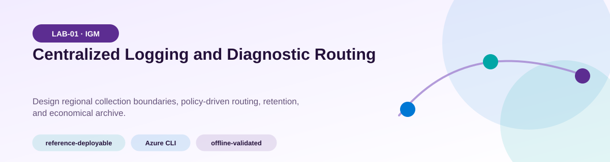
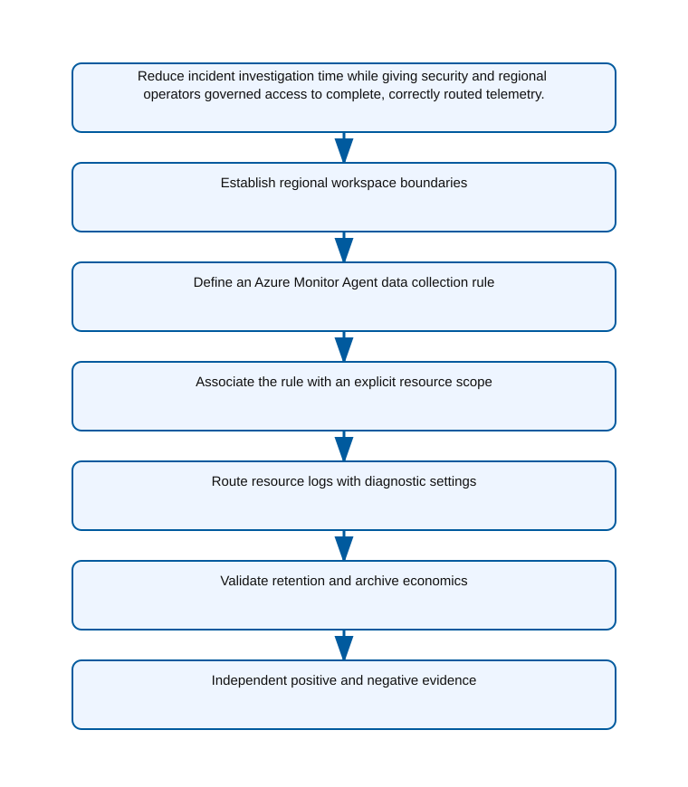
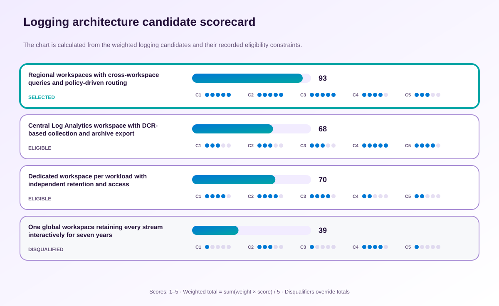

<!-- BEGIN GENERATED AZ305 V1 -->
# LAB-01 — Centralized Logging and Diagnostic Routing



<div class="az305-badges" aria-label="Lab classification">
  <span class="az305-mode-badge">reference-deployable</span>
  <span class="az305-lane-badge">Azure CLI</span>
  <span class="az305-status">offline-validated</span>
</div>

## 1. Navigation

[← LAB-00](../00-safe-architect-bootstrap/README.md) · [Lab catalog](../README.md) · [LAB-02 →](../02-monitoring-alerts-visibility/README.md)

## 2. Scenario and completion contract

Contoso Retail has acquired two regional brands whose Azure resources emit platform logs, application telemetry, and security events into unrelated destinations. Operations cannot correlate an incident across subscriptions, while the security team requires immutable export of selected control-plane records and regional teams need bounded access to their own data. You are the lead solutions architect. Design a centralized logging platform that uses Azure Monitor Agent, data collection rules and associations, resource diagnostic settings, and deliberate retention rather than a legacy agent. The design must limit duplicate ingestion, preserve data sovereignty, expose routing evidence through commands, and separate collection architecture from the alerting decisions owned by Lab 02.

- Architect role: Lead cloud solutions architect
- Outcome: A defensible centralized collection and routing design with independently verifiable destinations and no legacy monitoring agent.
- Duration: 150 minutes
- Difficulty: advanced
- Cost class: moderate
- Completion: all five checkpoint assertions, final validation, decision revision, and cleanup review are complete.

## 3. Objective-to-evidence map

| Objective | Requirement | Checkpoint |
| --- | --- | --- |
| `IGM-LOG-01` | `LAB01-REQ-01` | [`LAB01-CP01`](#checkpoint-1) |
| `IGM-LOG-02` | `LAB01-REQ-02` | [`LAB01-CP02`](#checkpoint-2) |
| `IGM-LOG-01` | `LAB01-REQ-03` | [`LAB01-CP03`](#checkpoint-3) |
| `IGM-LOG-02` | `LAB01-REQ-04` | [`LAB01-CP04`](#checkpoint-4) |
| `IGM-LOG-01` | `LAB01-REQ-05` | [`LAB01-CP05`](#checkpoint-5) |

## 4. Business and quality requirements

Business outcome: Reduce incident investigation time while giving security and regional operators governed access to complete, correctly routed telemetry.

- `LAB01-REQ-01` — The workspace is in the approved data boundary with thirty-day interactive retention and ownership tags.
- `LAB01-REQ-02` — The DCR maps only the required streams to a named Log Analytics destination.
- `LAB01-REQ-03` — The target has one intentional association to the approved DCR.
- `LAB01-REQ-04` — Supported log categories and metrics route to the intended regional workspace.
- `LAB01-REQ-05` — Interactive and total retention match the documented use case for each reviewed table.

Scenario facts:

- **Data:** Security records and application traces have different residency, retention, access, and evidentiary classifications.
- **Scale:** The estate spans multiple regions and operations teams; measured daily gigabytes per stream remain an owner-supplied sizing input.
- **Latency:** Security triage needs queryable recent records, while seven-year history may tolerate archive-search rehydration delay.
- **Availability:** Regional collection must continue if another region or its workspace is unavailable, with queries degrading to the reachable scope.
- **RTO:** Monitoring restoration time is an operational objective to be agreed with the security owner; the scenario specifies no numerical RTO.
- **RPO:** Loss tolerance for control-plane audit records is effectively zero after Azure accepts them into the monitoring pipeline.
- **Budget:** Differentiated table plans and retention are required to avoid paying interactive rates for seven years of low-access evidence.

Constraints:

- Security control-plane records must remain in their originating region for seven years.
- Application traces have a thirty-day searchable requirement and must not be duplicated into every workspace.
- Use only the Azure CLI command lane for learner implementation.
- Keep all live changes behind explicit execution and acknowledgement switches.
- Retain only sanitized command evidence and synthetic fixture identifiers.

Assumptions:

- Workloads already emit through Azure Monitor Agent and DCR-compatible sources rather than the legacy Log Analytics agent.
- Security analysts are permitted to query multiple regional workspaces through a governed workbook scope.
- West Europe is the configurable primary example and North Europe is the configurable secondary example.
- The learner has administrator-level Azure operations knowledge but receives no pre-existing authenticated context.
- Offline fixtures demonstrate contract behavior rather than live Azure service behavior.

## 5. Architecture diagram and walkthrough



Azure Monitor Agent and diagnostic settings route workload signals into regional workspaces and governed archive. The labelled nodes, boundaries, and edges are deterministically rendered from the portable `diagrams/architecture.mmd` source and the frozen visual registry.

## 6. Concept primer and candidate architectures

Architecture decisions translate measurable requirements into a deliberate service and operating model. A candidate is viable only when every mandatory constraint is met; convenience or familiarity cannot compensate for a disqualifier.

- **Regional workspaces with cross-workspace queries and policy-driven routing** (eligible) — Region-bound workspaces satisfy residency and isolate collection failure while DCR routing and cross-workspace views preserve a common operating experience.
- **Central Log Analytics workspace with DCR-based collection and archive export** (eligible) — Centralization simplifies queries and governance, but exporting after ingestion does not cure an in-region processing requirement.
- **Dedicated workspace per workload with independent retention and access** (eligible) — Workload isolation gives precise access and retention control but multiplies policy, query, commitment-tier, and incident-correlation overhead.
- **One global workspace retaining every stream interactively for seven years** (ineligible) — A global all-hot workspace is operationally familiar but crosses the residency boundary and applies the most expensive retention to low-value traces. Disqualifier: LAB01-REQ-01 requires the workspace boundary to remain in the approved data region with intentional retention.

## 7. Decision, ADR, and Well-Architected review

Criteria weights are C1 30, C2 25, C3 20, C4 15, and C5 10. Weighted totals use `sum(weight × score) / 5`.



| Candidate | Eligible | C1 | C2 | C3 | C4 | C5 | Weighted /100 |
| --- | ---: | ---: | ---: | ---: | ---: | ---: | ---: |
| Regional workspaces with cross-workspace queries and policy-driven routing | yes | 5 | 5 | 5 | 4 | 3 | 93 |
| Central Log Analytics workspace with DCR-based collection and archive export | yes | 3 | 3 | 3 | 5 | 4 | 68 |
| Dedicated workspace per workload with independent retention and access | yes | 4 | 4 | 4 | 2 | 2 | 70 |
| One global workspace retaining every stream interactively for seven years | no | 1 | 3 | 1 | 4 | 1 | 39 |

Selected design: **Regional workspaces with cross-workspace queries and policy-driven routing**. `ADR-LAB01-001` records the accepted reasoning. Review Reliability, Security, Cost Optimization, Operational Excellence, and Performance Efficiency in `design/decision.yml`; no pillar is implied by another.

Rejected alternatives:

- **Central Log Analytics workspace with DCR-based collection and archive export:** Its simpler operations do not compensate for weaker residency fit and a larger regional failure domain.
- **Dedicated workspace per workload with independent retention and access:** Workspace proliferation raises management and ingestion cost without improving the mandated regional boundary.
- **One global workspace retaining every stream interactively for seven years:** The candidate is disqualified by the regional security-record mandate.

Architecture risks:

- **Risk:** A DCR association omission can create a silent telemetry gap for one workload or region. **Mitigation:** Reconcile source inventory to DCR and DCRA resource IDs and fail the coverage assertion for any unmatched source.
- **Risk:** Cross-workspace permissions can expose regulated records to regional operators who need only application telemetry. **Mitigation:** Separate table access and workbook scopes, then test both an allowed query and a denied cross-boundary query.

Well-Architected consequences:

<div class="az305-waf-grid">
<article class="az305-waf-card"><h3>Reliability</h3><p>Independent regional ingestion limits correlated collection loss and makes partial query behavior explicit.</p></article>
<article class="az305-waf-card"><h3>Security</h3><p>Workspace and table boundaries enforce residency and least-privilege access for security evidence.</p></article>
<article class="az305-waf-card"><h3>Cost Optimization</h3><p>Thirty-day trace search and archived audit retention align price with access frequency instead of duplicating streams.</p></article>
<article class="az305-waf-card"><h3>Operational Excellence</h3><p>Policy-assigned DCRs and shared workbooks make coverage drift and incident handoffs observable.</p></article>
<article class="az305-waf-card"><h3>Performance Efficiency</h3><p>Regional ingestion reduces collection paths, while scoped cross-workspace queries avoid scanning unrelated tables.</p></article>
</div>

ADR consequences:

- Incident queries must name the intended regional workspace set and tolerate an unavailable region.
- Platform owners must govern DCR association coverage and table-specific retention as separate controls.

## 8. Inputs, permissions, licensing, cost, and analogue

Use configurable `Location` (`AZ305_LOCATION`, default West Europe) and `SecondaryLocation` (`AZ305_SECONDARY_LOCATION`, default North Europe). Every public input has an explicit `AZ305_*` fallback. Preview is the default; only Golden Lab 00 writes an intent-only `execute: false` preview record. Before an executed cloud command, the supplied subscription and tenant must exactly match the active CLI, Az, and—where applicable—Microsoft Graph contexts. `-Execute` crosses the execution boundary; cost-bearing and tenant-scoped paths also require their independent acknowledgement switches.

Safe analogue: The reference topology is deployable at bounded scope; preview remains the default and live verification is separate.

Permissions: Reader plus Log Analytics Reader is sufficient for inspection; an authorized deployment separately needs rights to create workspaces, DCRs, DCR associations, and diagnostic settings.

Licensing: Seven-year searchable or archived retention can incur Log Analytics commitment, retention, archive, and query charges that must be confirmed for each region.

Cost boundary: Cost is driven by regional ingestion volume, interactive-retention days, archive-retention years, cross-workspace queries, and export destinations.

## 9. Read-only preflight

```powershell
pwsh ./scripts/azure-cli/Preflight.ps1 -RunId synthetic-010001
```

Synthetic sample: `{"labId":"LAB-01","track":"azure-cli","result":"pass","note":"Local tool discovery only"}`. This is illustrative local output, not evidence captured from Azure.

## 10. Five guided checkpoints

<ol class="az305-checkpoint-timeline" aria-label="Five checkpoint learning path">
<li><a href="#checkpoint-1">Establish regional workspace boundaries</a><span>LAB01-REQ-01 · LAB01-CP01</span></li>
<li><a href="#checkpoint-2">Define an Azure Monitor Agent data collection rule</a><span>LAB01-REQ-02 · LAB01-CP02</span></li>
<li><a href="#checkpoint-3">Associate the rule with an explicit resource scope</a><span>LAB01-REQ-03 · LAB01-CP03</span></li>
<li><a href="#checkpoint-4">Route resource logs with diagnostic settings</a><span>LAB01-REQ-04 · LAB01-CP04</span></li>
<li><a href="#checkpoint-5">Validate retention and archive economics</a><span>LAB01-REQ-05 · LAB01-CP05</span></li>
</ol>

### Checkpoint 1: Establish regional workspace boundaries

<a id="checkpoint-1"></a>

**Trace:** `IGM-LOG-01` → `LAB01-REQ-01` → `LAB01-CP01`

```powershell
az monitor log-analytics workspace create --resource-group $ResourceGroup --workspace-name $WorkspaceName --location $Location --retention-time 30 --tags purpose=az305-lab labId=LAB-01 runId=$RunId expiresOn=$ExpiresOn
```

Expected evidence: The workspace is in the approved data boundary with thirty-day interactive retention and ownership tags. Retain Sanitized workspace name, region, retention, and resource ID.

Positive assertion:

```powershell
az monitor log-analytics workspace show --resource-group $ResourceGroup --workspace-name $WorkspaceName --query "{name:name,location:location,retention:retentionInDays}" -o json
```

Negative assertion:

```powershell
az monitor log-analytics workspace list --resource-group $ResourceGroup --query "[?name!='$WorkspaceName'].name" -o tsv
```

Failure and retry: A conflicting regional residency rule or unavailable workspace SKU blocks the chosen topology. Re-evaluate the approved region and pricing tier, retain the same RunId, and preview before execution.

Cleanup dependency: Remove diagnostic settings and DCR associations before deleting the workspace.

WAF consequence: Reliability: regional telemetry boundaries remain available and supportable during an incident.

### Checkpoint 2: Define an Azure Monitor Agent data collection rule

<a id="checkpoint-2"></a>

**Trace:** `IGM-LOG-02` → `LAB01-REQ-02` → `LAB01-CP02`

```powershell
az monitor data-collection rule create --resource-group $ResourceGroup --location $Location --name $DcrName --rule-file artifacts/dcr.json --tags purpose=az305-lab labId=LAB-01 runId=$RunId expiresOn=$ExpiresOn
```

Expected evidence: The DCR maps only the required streams to a named Log Analytics destination. Retain DCR resource ID, stream names, destinations, and source file hash.

Positive assertion:

```powershell
az monitor data-collection rule show --resource-group $ResourceGroup --name $DcrName --query "{streams:dataFlows[].streams,destinations:destinations.logAnalytics[].name}" -o json
```

Negative assertion:

```powershell
az monitor data-collection rule show --resource-group $ResourceGroup --name $DcrName --query "dataSources.extensions[?name=='LegacyAgent']" -o json
```

Failure and retry: A stream name is incompatible with the selected data source or destination. Correct artifacts/dcr.json against the current DCR schema and rerun the preview.

Cleanup dependency: Delete all DCR associations before deleting the DCR.

WAF consequence: Performance Efficiency: filtering noisy streams near the source protects ingestion and query capacity.

### Checkpoint 3: Associate the rule with an explicit resource scope

<a id="checkpoint-3"></a>

**Trace:** `IGM-LOG-01` → `LAB01-REQ-03` → `LAB01-CP03`

```powershell
az monitor data-collection rule association show --name $AssociationName --resource $TargetResourceId --query "{name:name,dcr:dataCollectionRuleId}" -o json --only-show-errors
```

Expected evidence: The target has one intentional association to the approved DCR. Retain Target resource ID, association name, and DCR ID without host or user data.

Positive assertion:

```powershell
az monitor data-collection rule association show --name $AssociationName --resource $TargetResourceId --query "{name:name,dcr:dataCollectionRuleId}" -o json
```

Negative assertion:

```powershell
az monitor data-collection rule association list --resource $TargetResourceId --query "[?dataCollectionRuleId!='$DcrId'].name" -o tsv
```

Failure and retry: The target resource type, region, or authorization scope does not support the association. Confirm the exact target ID and regional compatibility, then recreate only the missing association.

Cleanup dependency: Delete the association before its DCR or target resource.

WAF consequence: Security: explicit DCR associations limit collection to approved assets and destinations.

### Checkpoint 4: Route resource logs with diagnostic settings

<a id="checkpoint-4"></a>

**Trace:** `IGM-LOG-02` → `LAB01-REQ-04` → `LAB01-CP04`

```powershell
az monitor diagnostic-settings show --name $DiagnosticSettingName --resource $TargetResourceId --query "{workspace:workspaceId,logs:logs[?enabled].categoryGroup,metrics:metrics[?enabled].category}" -o json --only-show-errors
```

Expected evidence: Supported log categories and metrics route to the intended regional workspace. Retain Diagnostic-setting name, enabled categories, destination IDs, and export mode.

Positive assertion:

```powershell
az monitor diagnostic-settings show --name $DiagnosticSettingName --resource $TargetResourceId --query "{workspace:workspaceId,logs:logs[?enabled].categoryGroup,metrics:metrics[?enabled].category}" -o json
```

Negative assertion:

```powershell
az monitor diagnostic-settings show --name $DiagnosticSettingName --resource $TargetResourceId --query "{eventHub:eventHubAuthorizationRuleId,storage:storageAccountId}" -o json
```

Failure and retry: The chosen category group is unsupported by the resource provider. Query diagnostic categories, update the design artifact, and apply the smallest corrected setting.

Cleanup dependency: Delete the diagnostic setting before deleting either source or destination.

WAF consequence: Operational Excellence: diagnostic settings create a repeatable routing contract that teams can inspect.

### Checkpoint 5: Validate retention and archive economics

<a id="checkpoint-5"></a>

**Trace:** `IGM-LOG-01` → `LAB01-REQ-05` → `LAB01-CP05`

```powershell
az monitor log-analytics workspace table list --resource-group $ResourceGroup --workspace-name $WorkspaceName --query "[].{table:name,retention:retentionInDays,totalRetention:totalRetentionInDays}" -o json
```

Expected evidence: Interactive and total retention match the documented use case for each reviewed table. Retain Table-level retention summary and a synthetic monthly-ingestion estimate.

Positive assertion:

```powershell
az monitor log-analytics workspace table show --resource-group $ResourceGroup --workspace-name $WorkspaceName --name AzureActivity --query "{retention:retentionInDays,totalRetention:totalRetentionInDays}" -o json
```

Negative assertion:

```powershell
az monitor log-analytics workspace table list --resource-group $ResourceGroup --workspace-name $WorkspaceName --query '[?retentionInDays > `30` && name != ''SecurityEvent''].name' -o tsv
```

Failure and retry: Workspace defaults obscure a table-specific compliance or cost requirement. Recalculate retention by evidence class and update only the affected table plan.

Cleanup dependency: Export required sanitized evidence before removing the workspace; never retain customer log data.

WAF consequence: Cost Optimization: table-level retention aligns searchable and archived data with its continuing value.

## 11. Final validation and interpretation

Run `Validate.ps1 -Mode Deployment -Execute` only after an executed run has state and you are authorized to issue the ten read-only checkpoint inspections. Without `-Execute`, ordinary deployment validation records `partial` and exits `2`; Golden Lab 00 alone can validate its intent-only preview locally. Exit `0` means all required assertions pass, `1` means at least one failed, and `2` means the outcome is gated or partial. Positive and negative commands execute independently, so one failure never suppresses its paired assertion.

## 12. Material change request

A new regulator requires security control-plane records to remain in-region for seven years while application traces must stay searchable for only thirty days; revise routing and retention without duplicating every stream.

Revised solution: select **Regional workspaces with cross-workspace queries and policy-driven routing**. LAB01-REQ-05 makes the seven-year in-region evidence boundary mandatory, so the regional-workspace decision is retained with archive retention for security tables and thirty-day trace search.

Revised Well-Architected consequences:

- **Reliability:** Each region keeps collecting its own control-plane stream during a remote workspace outage.
- **Security:** Long-lived records never traverse the mandated regional boundary.
- **Cost Optimization:** Only the regulated stream receives seven-year retention and application traces remain thirty-day searchable.
- **Operational Excellence:** DCR and table-policy evidence reveals exactly which stream follows each rule.
- **Performance Efficiency:** Routine trace queries scan short-lived regional tables instead of the seven-year archive.

## 13. Architect job challenge

Defend whether a central security workspace plus regional operations workspaces is preferable to the selected topology after the regulator change.

## 14. Troubleshooting, cleanup, and residual verification

- Confirm the provider exposes a diagnostic category group before referencing allLogs.
- Check DCR stream-to-destination mappings when an association exists but data is absent.
- Investigate duplicate diagnostic settings and overlapping DCRs before increasing retention or ingestion capacity.

Cleanup previews nonempty state in reverse dependency order, writes `partial`, and exits `2`; an already empty run is completed locally and idempotently. Executed cleanup rechecks the exact live ID plus `purpose`, `labId`, `runId`, and `expiresOn` immediately before each removal, persists state after every absent or removed object, stops on the first dependency failure, and refuses unresolved pre-existing settings. It never automates purge. Finish with `Validate.ps1 -Mode PostCleanup`; the required residual count is zero.

## 15. Exam debrief, assessment, sources, and navigation

Explain the recommendation in terms of requirements, rejected alternatives, failure behavior, and all five WAF pillars. Complete `assessment/QUESTIONS.md`, then use the separately excluded answer key for remediation.

- [Diagnostic settings in Azure Monitor](https://learn.microsoft.com/en-us/azure/azure-monitor/platform/diagnostic-settings)
- [Azure Well-Architected Framework](https://learn.microsoft.com/en-us/azure/well-architected/)

[← LAB-00](../00-safe-architect-bootstrap/README.md) · [Lab catalog](../README.md) · [LAB-02 →](../02-monitoring-alerts-visibility/README.md)

## 16. Synchronized lifecycle-script appendix

### Preflight.ps1

```powershell
[CmdletBinding()]
param(
    [string]$SubscriptionId = $env:AZ305_SUBSCRIPTION_ID,
    [string]$TenantId = $env:AZ305_TENANT_ID,
    [ValidatePattern('^[a-z0-9-]{6,64}$')][string]$RunId = $env:AZ305_RUN_ID,
    [string]$Location = $(if ($env:AZ305_LOCATION) { $env:AZ305_LOCATION } else { 'westeurope' }),
    [string]$SecondaryLocation = $(if ($env:AZ305_SECONDARY_LOCATION) { $env:AZ305_SECONDARY_LOCATION } else { 'northeurope' }),
    [string]$ResourceGroup = $(if ($env:AZ305_RESOURCE_GROUP) { $env:AZ305_RESOURCE_GROUP } else { "rg-az305-$RunId" }),
    [string]$WorkloadName = $(if ($env:AZ305_WORKLOAD_NAME) { $env:AZ305_WORKLOAD_NAME } else { "az305-$RunId" }),
    [string]$ExpiresOn = $(if ($env:AZ305_EXPIRES_ON) { $env:AZ305_EXPIRES_ON } else { (Get-Date).ToUniversalTime().AddDays(1).ToString('yyyy-MM-dd') }),
    [string]$AssociationName = $env:AZ305_ASSOCIATION_NAME,
    [string]$DcrId = $env:AZ305_DCR_ID,
    [string]$DcrName = $env:AZ305_DCR_NAME,
    [string]$DiagnosticSettingName = $env:AZ305_DIAGNOSTIC_SETTING_NAME,
    [string]$TargetResourceId = $env:AZ305_TARGET_RESOURCE_ID,
    [string]$WorkspaceName = $env:AZ305_WORKSPACE_NAME,
    [switch]$Execute,
    [switch]$AcknowledgeCost,
    [switch]$AcknowledgeTenantChange
)

$ErrorActionPreference = 'Stop'
$PSNativeCommandUseErrorActionPreference = $true
if (-not $RunId) { [Console]::Error.WriteLine('RunId or AZ305_RUN_ID is required.'); exit 2 }
# Every lifecycle entrypoint intentionally exposes the same public parameter contract.
@($SubscriptionId, $TenantId, $RunId, $Location, $SecondaryLocation, $ResourceGroup, $WorkloadName, $ExpiresOn, $AssociationName, $DcrId, $DcrName, $DiagnosticSettingName, $TargetResourceId, $WorkspaceName, $Execute, $AcknowledgeCost, $AcknowledgeTenantChange) | Out-Null

$requiredCommands = @('az', 'pwsh')
$missing = @($requiredCommands | Where-Object { -not (Get-Command $_ -ErrorAction SilentlyContinue) })
if ($missing.Count -gt 0) {
    Write-Error "Missing local commands: $($missing -join ', ')"
    exit 1
}

[pscustomobject]@{
    labId = 'LAB-01'
    track = 'azure-cli'
    implementationMode = 'reference-deployable'
    result = 'pass'
    note = 'Local tool discovery only; no Azure or Microsoft Graph request was made.'
} | ConvertTo-Json
exit 0
```

### Setup.ps1

```powershell
[CmdletBinding()]
param(
    [string]$SubscriptionId = $env:AZ305_SUBSCRIPTION_ID,
    [string]$TenantId = $env:AZ305_TENANT_ID,
    [ValidatePattern('^[a-z0-9-]{6,64}$')][string]$RunId = $env:AZ305_RUN_ID,
    [string]$Location = $(if ($env:AZ305_LOCATION) { $env:AZ305_LOCATION } else { 'westeurope' }),
    [string]$SecondaryLocation = $(if ($env:AZ305_SECONDARY_LOCATION) { $env:AZ305_SECONDARY_LOCATION } else { 'northeurope' }),
    [string]$ResourceGroup = $(if ($env:AZ305_RESOURCE_GROUP) { $env:AZ305_RESOURCE_GROUP } else { "rg-az305-$RunId" }),
    [string]$WorkloadName = $(if ($env:AZ305_WORKLOAD_NAME) { $env:AZ305_WORKLOAD_NAME } else { "az305-$RunId" }),
    [string]$ExpiresOn = $(if ($env:AZ305_EXPIRES_ON) { $env:AZ305_EXPIRES_ON } else { (Get-Date).ToUniversalTime().AddDays(1).ToString('yyyy-MM-dd') }),
    [string]$AssociationName = $env:AZ305_ASSOCIATION_NAME,
    [string]$DcrId = $env:AZ305_DCR_ID,
    [string]$DcrName = $env:AZ305_DCR_NAME,
    [string]$DiagnosticSettingName = $env:AZ305_DIAGNOSTIC_SETTING_NAME,
    [string]$TargetResourceId = $env:AZ305_TARGET_RESOURCE_ID,
    [string]$WorkspaceName = $env:AZ305_WORKSPACE_NAME,
    [switch]$Execute,
    [switch]$AcknowledgeCost,
    [switch]$AcknowledgeTenantChange
)

$ErrorActionPreference = 'Stop'
$PSNativeCommandUseErrorActionPreference = $true
if (-not $RunId) { [Console]::Error.WriteLine('RunId or AZ305_RUN_ID is required.'); exit 2 }
# Every lifecycle entrypoint intentionally exposes the same public parameter contract.
@($SubscriptionId, $TenantId, $RunId, $Location, $SecondaryLocation, $ResourceGroup, $WorkloadName, $ExpiresOn, $AssociationName, $DcrId, $DcrName, $DiagnosticSettingName, $TargetResourceId, $WorkspaceName, $Execute, $AcknowledgeCost, $AcknowledgeTenantChange) | Out-Null

$LabRoot = Split-Path (Split-Path $PSScriptRoot -Parent) -Parent
$StateRoot = Join-Path $LabRoot ".state/$RunId"
$StatePath = Join-Path $StateRoot 'run.json'

function Invoke-AzCliJson {
    [CmdletBinding()]
    param([Parameter(Mandatory)][string[]]$ArgumentList)
    $savedNativePreference = $PSNativeCommandUseErrorActionPreference
    try {
        # Capture the exit code ourselves so a failed native command cannot be
        # mistaken for an empty but successful JSON response.
        $PSNativeCommandUseErrorActionPreference = $false
        $outputLines = @(& az @ArgumentList)
        $nativeExit = $LASTEXITCODE
    }
    finally {
        $PSNativeCommandUseErrorActionPreference = $savedNativePreference
    }
    if ($nativeExit -ne 0) { throw "Azure CLI exited with code $nativeExit." }
    $raw = @($outputLines) -join "`n"
    if ([string]::IsNullOrWhiteSpace($raw)) { return $null }
    try { return ($raw | ConvertFrom-Json -Depth 100) }
    catch { throw 'Azure CLI returned data that was not valid JSON.' }
}

function Assert-ExactExecutionContext {
    [CmdletBinding()]
    param([string]$ExpectedSubscriptionId, [string]$ExpectedTenantId)
    if ([string]::IsNullOrWhiteSpace($ExpectedSubscriptionId) -or [string]::IsNullOrWhiteSpace($ExpectedTenantId)) {
        throw 'SubscriptionId and TenantId are required before a cloud request.'
    }
    $context = Invoke-AzCliJson -ArgumentList @('account', 'show', '--output', 'json', '--only-show-errors')
    if (-not $context -or [string]$context.id -ine $ExpectedSubscriptionId -or [string]$context.tenantId -ine $ExpectedTenantId) {
        throw 'The active Azure CLI subscription or tenant does not exactly match the requested context.'
    }
}

function Save-RunState {
    [CmdletBinding()]
    param([Parameter(Mandatory)]$State)
    $temporaryPath = "$StatePath.tmp"
    $State | ConvertTo-Json -Depth 20 | Set-Content -LiteralPath $temporaryPath -Encoding utf8NoBOM
    Move-Item -LiteralPath $temporaryPath -Destination $StatePath -Force
}

function Assert-SafeStateValue {
    [CmdletBinding()]
    param($Value)
    $serialized = $Value | ConvertTo-Json -Depth 12 -Compress
    if ($serialized -match '(?i)"(?:token|password|secret|certificate|connectionString|sas|clientSecret|accessToken|refreshToken|accountKey|privateKey)"\s*:') {
        throw 'A prohibited sensitive field name was returned; state capture is refused.'
    }
}

function Convert-CheckpointOutput {
    [CmdletBinding()]
    param($Value)
    if ($Value -is [string]) { $raw = [string]$Value }
    elseif ($Value -is [System.Collections.IEnumerable] -and @($Value | Where-Object { $_ -isnot [string] }).Count -eq 0) { $raw = @($Value) -join "`n" }
    else { return $Value }
    if ([string]::IsNullOrWhiteSpace($raw)) { return $null }
    try { return ($raw | ConvertFrom-Json -Depth 100) } catch { return $Value }
}

function Get-ReturnedResourceId {
    [CmdletBinding()]
    param($Value)
    $seen = [System.Collections.Generic.HashSet[string]]::new([System.StringComparer]::OrdinalIgnoreCase)
    $results = [System.Collections.Generic.List[string]]::new()
    function Add-ArmId {
        param($Candidate)
        if ($Candidate -is [string] -and $Candidate -match '^/subscriptions/[0-9a-f-]+/(?:resourceGroups/[^/]+(?:/providers/.+)?|providers/.+)$' -and $Candidate -notmatch '/providers/Microsoft\.Resources/deployments/') {
            if ($seen.Add($Candidate)) { $results.Add($Candidate) }
        }
    }
    function Find-DeploymentOutputId {
        param($Item, [int]$Depth)
        if ($null -eq $Item -or $Depth -gt 12) { return }
        if ($Item -is [string]) { Add-ArmId -Candidate $Item; return }
        if ($Item -is [System.Collections.IDictionary]) { foreach ($key in $Item.Keys) { Find-DeploymentOutputId -Item $Item[$key] -Depth ($Depth + 1) }; return }
        if ($Item -is [System.Collections.IEnumerable]) { foreach ($entry in $Item) { Find-DeploymentOutputId -Item $entry -Depth ($Depth + 1) }; return }
        foreach ($property in @($Item.PSObject.Properties | Where-Object { $_.MemberType -in @('NoteProperty', 'Property') })) { Find-DeploymentOutputId -Item $property.Value -Depth ($Depth + 1) }
    }
    foreach ($rootItem in @($Value)) {
        if ($rootItem -is [System.Collections.IDictionary]) {
            foreach ($name in @('id', 'resourceId')) { if ($rootItem.Contains($name)) { Add-ArmId -Candidate $rootItem[$name] } }
            if ($rootItem.Contains('properties') -and $rootItem.properties -and $rootItem.properties.outputs) { Find-DeploymentOutputId -Item $rootItem.properties.outputs -Depth 0 }
            continue
        }
        foreach ($name in @('Id', 'ResourceId')) {
            $property = $rootItem.PSObject.Properties[$name]
            if ($property) { Add-ArmId -Candidate $property.Value }
        }
        if ($rootItem.PSObject.Properties['Properties'] -and $rootItem.Properties -and $rootItem.Properties.outputs) {
            Find-DeploymentOutputId -Item $rootItem.Properties.outputs -Depth 0
        }
    }
    return @($results)
}

function Get-PlannedDeploymentResourceId {
    [CmdletBinding()]
    param($Value)
    $seen = [System.Collections.Generic.HashSet[string]]::new([System.StringComparer]::OrdinalIgnoreCase)
    $results = [System.Collections.Generic.List[string]]::new()
    foreach ($change in @($Value.changes)) {
        $candidate = [string]$change.resourceId
        if ($candidate -match '^/subscriptions/[0-9a-f-]+/(?:resourceGroups/[^/]+(?:/providers/.+)?|providers/.+)$' -and $candidate -notmatch '/providers/Microsoft\.Resources/deployments/' -and $seen.Add($candidate)) {
            $results.Add($candidate)
        }
    }
    return @($results)
}

function Assert-InputSubscriptionScope {
    [CmdletBinding()]
    param($Inputs, [string]$ExpectedSubscriptionId)
    $entries = if ($Inputs -is [System.Collections.IDictionary]) {
        @($Inputs.GetEnumerator())
    } else {
        @($Inputs.PSObject.Properties | ForEach-Object { [pscustomobject]@{ Key = $_.Name; Value = $_.Value } })
    }
    foreach ($entry in $entries) {
        if ($entry.Value -is [string] -and [string]$entry.Value -match '^/subscriptions/([^/]+)/') {
            if ($Matches[1] -ine $ExpectedSubscriptionId) { throw "Input $($entry.Key) belongs to a different subscription." }
        }
    }
}

function Assert-ManagedMutation {
    [CmdletBinding()]
    param($State, [string]$CheckpointId, [bool]$CarriesOwnership, [object[]]$TargetResourceIds)
    if ($CarriesOwnership) { return }
    $targets = @($TargetResourceIds | Where-Object { $_ -is [string] -and $_ -match '^/subscriptions/' })
    if ($targets.Count -eq 0) { throw "$CheckpointId refuses an untagged mutation because no exact ARM target ID was supplied." }
    $knownIds = @($State.managedObjects | ForEach-Object { [string]$_.id })
    if ($knownIds.Count -eq 0) { throw "$CheckpointId refuses to modify a pre-existing object because no run-owned parent has been recorded." }
    foreach ($target in $targets) {
        $related = @($knownIds | Where-Object { $target -ieq $_ -or $target.StartsWith("$_/", [System.StringComparison]::OrdinalIgnoreCase) -or $_.StartsWith("$target/", [System.StringComparison]::OrdinalIgnoreCase) }).Count -gt 0
        if (-not $related) { throw "$CheckpointId refuses a mutation outside the exact run-owned resource boundary." }
    }
}

$executionInputs = [ordered]@{ subscriptionId = $SubscriptionId; tenantId = $TenantId; location = $Location; secondaryLocation = $SecondaryLocation; resourceGroup = $ResourceGroup; workloadName = $WorkloadName; expiresOn = $ExpiresOn; AssociationName = $AssociationName; DcrId = $DcrId; DcrName = $DcrName; DiagnosticSettingName = $DiagnosticSettingName; TargetResourceId = $TargetResourceId; WorkspaceName = $WorkspaceName }

if (-not $Execute) {
    Write-Output '[preview] No cloud command was called and no state was created.'
    Write-Output '[preview] Re-run with -Execute only in an authorized disposable environment.'
    exit 0
}
# This setup is compatible with the lab implementation mode.
if (-not $AcknowledgeCost) { [Console]::Error.WriteLine('Cost acknowledgement is required.'); exit 2 }
# This lab does not perform a tenant-scoped change by default.
$requiredLabInputs = [ordered]@{ AssociationName = $AssociationName; DcrName = $DcrName; DiagnosticSettingName = $DiagnosticSettingName; TargetResourceId = $TargetResourceId; WorkspaceName = $WorkspaceName }
$missingLabInputs = @($requiredLabInputs.GetEnumerator() | Where-Object { $_.Value -is [string] -and [string]::IsNullOrWhiteSpace([string]$_.Value) } | ForEach-Object Key)
if ($missingLabInputs.Count -gt 0) { [Console]::Error.WriteLine("Execution is gated; supply: $($missingLabInputs -join ', ')."); exit 2 }

try {
    Assert-ExactExecutionContext -ExpectedSubscriptionId $SubscriptionId -ExpectedTenantId $TenantId
    Assert-InputSubscriptionScope -Inputs $executionInputs -ExpectedSubscriptionId $SubscriptionId
    Assert-SafeStateValue -Value $executionInputs
}
catch {
    [Console]::Error.WriteLine("Execution is gated by context or input validation: $($_.Exception.Message)")
    exit 2
}

# Recovery state is persisted before the first possible mutation below.
if (Test-Path -LiteralPath $StatePath) {
    [Console]::Error.WriteLine('Run state already exists. Choose a new RunId or complete the recorded cleanup; existing recovery state will not be overwritten.')
    exit 2
}
New-Item -ItemType Directory -Path $StateRoot -Force | Out-Null
$state = [ordered]@{
    schemaVersion = '1.0.0'; labId = 'LAB-01'; runId = $RunId; track = 'azure-cli'
    implementationMode = 'reference-deployable'; status = 'initialized'
    createdAt = (Get-Date).ToUniversalTime().ToString('o'); execute = $true
    parameters = $executionInputs
    managedObjects = @(); originalSettings = @()
}
Save-RunState -State $state
$state.status = 'deploying'
Save-RunState -State $state

$originalLocation = Get-Location
try {
    Set-Location -LiteralPath $LabRoot
    # 01-CP01: Establish regional workspace boundaries
    Assert-ManagedMutation -State $state -CheckpointId 'LAB01-CP01' -CarriesOwnership:$true -TargetResourceIds @()
    $stepResult = & { az monitor log-analytics workspace create --resource-group $ResourceGroup --workspace-name $WorkspaceName --location $Location --retention-time 30 --tags purpose=az305-lab labId=LAB-01 runId=$RunId expiresOn=$ExpiresOn }
    if ($LASTEXITCODE -ne 0) { throw 'LAB01-CP01 native command exited with code ' + $LASTEXITCODE + '.' }
    $candidate = Convert-CheckpointOutput -Value $stepResult
    $returnedIds = @(Get-ReturnedResourceId -Value $candidate)
    if ($returnedIds.Count -eq 0) { throw 'LAB01-CP01 created an owned resource but returned no recoverable ARM resource ID.' }
    foreach ($returnedId in $returnedIds) {
        if ($returnedId -notmatch '^/subscriptions/([^/]+)/' -or $Matches[1] -ine $SubscriptionId) { throw 'A returned recovery ID belongs to a different subscription.' }
        if (@($state.managedObjects | Where-Object { $_.id -ieq $returnedId }).Count -eq 0) {
            $state.managedObjects += [pscustomobject]@{
                id = $returnedId
                type = 'azure-resource'
                tags = [ordered]@{ purpose = 'az305-lab'; labId = 'LAB-01'; runId = $RunId; expiresOn = $ExpiresOn }
            }
            Save-RunState -State $state
        }
    }
    $null = $stepResult

    # 01-CP02: Define an Azure Monitor Agent data collection rule
    Assert-ManagedMutation -State $state -CheckpointId 'LAB01-CP02' -CarriesOwnership:$true -TargetResourceIds @()
    $stepResult = & { az monitor data-collection rule create --resource-group $ResourceGroup --location $Location --name $DcrName --rule-file artifacts/dcr.json --tags purpose=az305-lab labId=LAB-01 runId=$RunId expiresOn=$ExpiresOn }
    if ($LASTEXITCODE -ne 0) { throw 'LAB01-CP02 native command exited with code ' + $LASTEXITCODE + '.' }
    $candidate = Convert-CheckpointOutput -Value $stepResult
    $returnedIds = @(Get-ReturnedResourceId -Value $candidate)
    if ($returnedIds.Count -eq 0) { throw 'LAB01-CP02 created an owned resource but returned no recoverable ARM resource ID.' }
    foreach ($returnedId in $returnedIds) {
        if ($returnedId -notmatch '^/subscriptions/([^/]+)/' -or $Matches[1] -ine $SubscriptionId) { throw 'A returned recovery ID belongs to a different subscription.' }
        if (@($state.managedObjects | Where-Object { $_.id -ieq $returnedId }).Count -eq 0) {
            $state.managedObjects += [pscustomobject]@{
                id = $returnedId
                type = 'azure-resource'
                tags = [ordered]@{ purpose = 'az305-lab'; labId = 'LAB-01'; runId = $RunId; expiresOn = $ExpiresOn }
            }
            Save-RunState -State $state
        }
    }
    $null = $stepResult

    # 01-CP03: Associate the rule with an explicit resource scope
    $stepResult = & { az monitor data-collection rule association show --name $AssociationName --resource $TargetResourceId --query "{name:name,dcr:dataCollectionRuleId}" -o json --only-show-errors }
    if ($LASTEXITCODE -ne 0) { throw 'LAB01-CP03 native command exited with code ' + $LASTEXITCODE + '.' }
    $null = $stepResult

    # 01-CP04: Route resource logs with diagnostic settings
    $stepResult = & { az monitor diagnostic-settings show --name $DiagnosticSettingName --resource $TargetResourceId --query "{workspace:workspaceId,logs:logs[?enabled].categoryGroup,metrics:metrics[?enabled].category}" -o json --only-show-errors }
    if ($LASTEXITCODE -ne 0) { throw 'LAB01-CP04 native command exited with code ' + $LASTEXITCODE + '.' }
    $null = $stepResult

    # 01-CP05: Validate retention and archive economics
    $stepResult = & { az monitor log-analytics workspace table list --resource-group $ResourceGroup --workspace-name $WorkspaceName --query "[].{table:name,retention:retentionInDays,totalRetention:totalRetentionInDays}" -o json }
    if ($LASTEXITCODE -ne 0) { throw 'LAB01-CP05 native command exited with code ' + $LASTEXITCODE + '.' }
    $null = $stepResult

    $state.status = 'deployed'
    Save-RunState -State $state
} catch {
    $state.status = 'failed'
    Save-RunState -State $state
    Write-Error $_
    exit 1
} finally {
    Set-Location -LiteralPath $originalLocation
}
exit 0
```

### Validate.ps1

```powershell
[CmdletBinding()]
param(
    [string]$SubscriptionId = $env:AZ305_SUBSCRIPTION_ID,
    [string]$TenantId = $env:AZ305_TENANT_ID,
    [ValidatePattern('^[a-z0-9-]{6,64}$')][string]$RunId = $env:AZ305_RUN_ID,
    [string]$Location = $(if ($env:AZ305_LOCATION) { $env:AZ305_LOCATION } else { 'westeurope' }),
    [string]$SecondaryLocation = $(if ($env:AZ305_SECONDARY_LOCATION) { $env:AZ305_SECONDARY_LOCATION } else { 'northeurope' }),
    [string]$ResourceGroup = $(if ($env:AZ305_RESOURCE_GROUP) { $env:AZ305_RESOURCE_GROUP } else { "rg-az305-$RunId" }),
    [string]$WorkloadName = $(if ($env:AZ305_WORKLOAD_NAME) { $env:AZ305_WORKLOAD_NAME } else { "az305-$RunId" }),
    [string]$ExpiresOn = $(if ($env:AZ305_EXPIRES_ON) { $env:AZ305_EXPIRES_ON } else { (Get-Date).ToUniversalTime().AddDays(1).ToString('yyyy-MM-dd') }),
    [string]$AssociationName = $env:AZ305_ASSOCIATION_NAME,
    [string]$DcrId = $env:AZ305_DCR_ID,
    [string]$DcrName = $env:AZ305_DCR_NAME,
    [string]$DiagnosticSettingName = $env:AZ305_DIAGNOSTIC_SETTING_NAME,
    [string]$TargetResourceId = $env:AZ305_TARGET_RESOURCE_ID,
    [string]$WorkspaceName = $env:AZ305_WORKSPACE_NAME,
    [ValidateSet('Deployment', 'PostCleanup')][string]$Mode = 'Deployment',
    [switch]$Execute,
    [switch]$AcknowledgeCost,
    [switch]$AcknowledgeTenantChange
)

$ErrorActionPreference = 'Stop'
$PSNativeCommandUseErrorActionPreference = $true
if (-not $RunId) { [Console]::Error.WriteLine('RunId or AZ305_RUN_ID is required.'); exit 2 }
# Every lifecycle entrypoint intentionally exposes the same public parameter contract.
@($SubscriptionId, $TenantId, $RunId, $Location, $SecondaryLocation, $ResourceGroup, $WorkloadName, $ExpiresOn, $AssociationName, $DcrId, $DcrName, $DiagnosticSettingName, $TargetResourceId, $WorkspaceName, $Mode, $Execute, $AcknowledgeCost, $AcknowledgeTenantChange) | Out-Null

$LabRoot = Split-Path (Split-Path $PSScriptRoot -Parent) -Parent
$StateRoot = Join-Path $LabRoot ".state/$RunId"
$RunPath = Join-Path $StateRoot 'run.json'
$ValidationPath = Join-Path $StateRoot 'validation.json'

function Invoke-AzCliJson {
    [CmdletBinding()]
    param([Parameter(Mandatory)][string[]]$ArgumentList)
    $savedNativePreference = $PSNativeCommandUseErrorActionPreference
    try {
        # Capture the exit code ourselves so a failed native command cannot be
        # mistaken for an empty but successful JSON response.
        $PSNativeCommandUseErrorActionPreference = $false
        $outputLines = @(& az @ArgumentList)
        $nativeExit = $LASTEXITCODE
    }
    finally {
        $PSNativeCommandUseErrorActionPreference = $savedNativePreference
    }
    if ($nativeExit -ne 0) { throw "Azure CLI exited with code $nativeExit." }
    $raw = @($outputLines) -join "`n"
    if ([string]::IsNullOrWhiteSpace($raw)) { return $null }
    try { return ($raw | ConvertFrom-Json -Depth 100) }
    catch { throw 'Azure CLI returned data that was not valid JSON.' }
}

function Assert-ExactExecutionContext {
    [CmdletBinding()]
    param([string]$ExpectedSubscriptionId, [string]$ExpectedTenantId)
    if ([string]::IsNullOrWhiteSpace($ExpectedSubscriptionId) -or [string]::IsNullOrWhiteSpace($ExpectedTenantId)) {
        throw 'SubscriptionId and TenantId are required before a cloud request.'
    }
    $context = Invoke-AzCliJson -ArgumentList @('account', 'show', '--output', 'json', '--only-show-errors')
    if (-not $context -or [string]$context.id -ine $ExpectedSubscriptionId -or [string]$context.tenantId -ine $ExpectedTenantId) {
        throw 'The active Azure CLI subscription or tenant does not exactly match the requested context.'
    }
}


if (-not (Test-Path -LiteralPath $RunPath)) {
    Write-Warning 'No run state exists; validation is gated.'
    exit 2
}
$state = Get-Content -LiteralPath $RunPath -Raw | ConvertFrom-Json
$assertions = [System.Collections.Generic.List[object]]::new()
function Add-ValidationAssertion {
    [CmdletBinding()]
    param([string]$Id, [ValidateSet('positive', 'negative')][string]$Kind, [bool]$Passed, [string]$Message)
    $assertions.Add([pscustomobject]@{ id = $Id; kind = $Kind; passed = $Passed; message = $Message })
}

function Save-ValidationArtifact {
    [CmdletBinding()]
    param([ValidateSet('pass', 'partial', 'fail')][string]$Result)
    $artifact = [ordered]@{ schemaVersion = '1.0.0'; labId = 'LAB-01'; runId = $RunId; mode = $Mode; result = $Result; validatedAt = (Get-Date).ToUniversalTime().ToString('o'); assertions = @($assertions) }
    $artifact | ConvertTo-Json -Depth 12 | Set-Content -LiteralPath $ValidationPath -Encoding utf8NoBOM
}

function Test-PositiveEvidence {
    [CmdletBinding()]
    param($Value)
    if ($Value -is [bool]) { return $Value }
    if ($null -eq $Value) { return $false }
    if ($Value -is [string]) { return -not [string]::IsNullOrWhiteSpace($Value) }
    if ($Value -is [System.Collections.IEnumerable]) { return @($Value).Count -gt 0 }
    return $true
}

function Test-NegativeEvidence {
    [CmdletBinding()]
    param($Value)
    if ($Value -is [bool]) { return $Value }
    if ($null -eq $Value) { return $true }
    if ($Value -is [string]) { return [string]::IsNullOrWhiteSpace($Value) }
    if ($Value -is [System.Collections.IEnumerable]) { return @($Value).Count -eq 0 }
    $properties = @($Value.PSObject.Properties | Where-Object { $_.MemberType -in @('NoteProperty', 'Property') })
    if ($properties.Count -eq 0) { return $false }
    return @($properties | Where-Object { -not (Test-NegativeEvidence -Value $_.Value) }).Count -eq 0
}

function Test-ProhibitedStateField {
    [CmdletBinding()]
    param($Value)
    $serialized = $Value | ConvertTo-Json -Depth 20
    return $serialized -match '(?i)"(?:token|password|secret|certificate|connectionString|sas|clientSecret|accessToken|refreshToken|accountKey|privateKey)"\s*:'
}

function Assert-InputSubscriptionScope {
    [CmdletBinding()]
    param($Inputs, [string]$ExpectedSubscriptionId)
    $entries = if ($Inputs -is [System.Collections.IDictionary]) {
        @($Inputs.GetEnumerator())
    } else {
        @($Inputs.PSObject.Properties | ForEach-Object { [pscustomobject]@{ Key = $_.Name; Value = $_.Value } })
    }
    foreach ($entry in $entries) {
        if ($entry.Value -is [string] -and [string]$entry.Value -match '^/subscriptions/([^/]+)/' -and $Matches[1] -ine $ExpectedSubscriptionId) {
            throw "Input $($entry.Key) belongs to a different subscription."
        }
    }
}

$stateIdentityMatches = (
    $state.labId -ceq 'LAB-01' -and
    $state.runId -ceq $RunId -and
    $state.track -ceq 'azure-cli' -and
    $state.implementationMode -ceq 'reference-deployable' -and
    ([string]$state.parameters.subscriptionId -ieq $SubscriptionId -and [string]$state.parameters.tenantId -ieq $TenantId)
)
Add-ValidationAssertion -Id 'LAB01-VAL-POS-01' -Kind positive -Passed $stateIdentityMatches -Message 'Run identity, implementation mode, command track, tenant, and subscription exactly match the copied lab and requested run.'
$hasSensitiveName = Test-ProhibitedStateField -Value $state
Add-ValidationAssertion -Id 'LAB01-VAL-NEG-01' -Kind negative -Passed (-not $hasSensitiveName) -Message 'State contains no prohibited sensitive field name.'

if ($Mode -eq 'PostCleanup') {
    $cleanupPath = Join-Path $StateRoot 'cleanup.json'
    $cleanup = if (Test-Path -LiteralPath $cleanupPath) { Get-Content -LiteralPath $cleanupPath -Raw | ConvertFrom-Json } else { $null }
    Add-ValidationAssertion -Id 'LAB01-VAL-POS-02' -Kind positive -Passed ($null -ne $cleanup -and $cleanup.labId -ceq 'LAB-01' -and $cleanup.runId -ceq $RunId -and $cleanup.result -eq 'pass' -and $cleanup.ownershipVerified) -Message 'The exact run cleanup completed with verified ownership.'
    Add-ValidationAssertion -Id 'LAB01-VAL-NEG-02' -Kind negative -Passed ($null -ne $cleanup -and $cleanup.activeManagedObjects -eq 0 -and @($state.managedObjects).Count -eq 0 -and @($state.originalSettings).Count -eq 0 -and $state.status -eq 'cleaned') -Message 'No active managed object or unresolved original setting remains in cleanup or run state.'
    $postCleanupPassed = @($assertions | Where-Object { -not $_.passed }).Count -eq 0
    Save-ValidationArtifact -Result $(if ($postCleanupPassed) { 'pass' } else { 'fail' })
    if ($postCleanupPassed) { exit 0 }
    exit 1
}

Add-ValidationAssertion -Id 'LAB01-VAL-POS-02' -Kind positive -Passed ($state.status -eq 'deployed') -Message 'The executed setup completed successfully; a failed setup can never validate as pass.'
Add-ValidationAssertion -Id 'LAB01-VAL-NEG-02' -Kind negative -Passed (@($state.managedObjects | Where-Object { $_.tags.purpose -ne 'az305-lab' -or $_.tags.labId -ne 'LAB-01' -or $_.tags.runId -ne $RunId }).Count -eq 0) -Message 'No recorded object has a foreign ownership tag.'

if (@($assertions | Where-Object { -not $_.passed }).Count -gt 0) {
    Save-ValidationArtifact -Result 'fail'
    exit 1
}
if (-not $Execute) {
    # This lab has no special intent-only validation path.
    Save-ValidationArtifact -Result 'partial'
    Write-Warning 'Checkpoint validation is gated; re-run with -Execute after confirming the exact read-only context.'
    exit 2
}
# The validation surface is compatible with this lab implementation mode.
$requiredValidationInputs = [ordered]@{ AssociationName = $AssociationName; DcrId = $DcrId; DcrName = $DcrName; DiagnosticSettingName = $DiagnosticSettingName; TargetResourceId = $TargetResourceId; WorkspaceName = $WorkspaceName }
$missingValidationInputs = @($requiredValidationInputs.GetEnumerator() | Where-Object { $_.Value -is [string] -and [string]::IsNullOrWhiteSpace([string]$_.Value) } | ForEach-Object Key)
if ($missingValidationInputs.Count -gt 0) {
    Add-ValidationAssertion -Id 'LAB01-VAL-POS-CONTEXT' -Kind positive -Passed $false -Message 'One or more required non-secret validation inputs are missing.'
    Save-ValidationArtifact -Result 'partial'
    exit 2
}
try {
    Assert-ExactExecutionContext -ExpectedSubscriptionId $SubscriptionId -ExpectedTenantId $TenantId
    Assert-InputSubscriptionScope -Inputs $state.parameters -ExpectedSubscriptionId $SubscriptionId
    Add-ValidationAssertion -Id 'LAB01-VAL-POS-CONTEXT' -Kind positive -Passed $true -Message 'The active tenant and subscription exactly match the requested validation context.'
}
catch {
    Add-ValidationAssertion -Id 'LAB01-VAL-POS-CONTEXT' -Kind positive -Passed $false -Message 'Exact execution context could not be proven.'
    Save-ValidationArtifact -Result 'partial'
    exit 2
}

$originalLocation = Get-Location
try {
    Set-Location -LiteralPath $LabRoot
# LAB01-CP01: run both polarities even when one fails.
$positivePassed = $false
try {
    $global:LASTEXITCODE = 0
    $positiveEvidence = & { az monitor log-analytics workspace show --resource-group $ResourceGroup --workspace-name $WorkspaceName --query "{name:name,location:location,retention:retentionInDays}" -o json }
    if ($LASTEXITCODE -ne 0) { throw 'LAB01-CP01 positive native command exited with code ' + $LASTEXITCODE + '.' }
    $positivePassed = (Test-PositiveEvidence -Value $positiveEvidence)
    $null = $positiveEvidence
} catch { $positivePassed = $false }
Add-ValidationAssertion -Id 'LAB01-CP01-POS' -Kind positive -Passed $positivePassed -Message 'The workspace is in the approved data boundary with thirty-day interactive retention and ownership tags.'

$negativePassed = $false
try {
    $global:LASTEXITCODE = 0
    $negativeEvidence = & { az monitor log-analytics workspace list --resource-group $ResourceGroup --query "[?name!='$WorkspaceName'].name" -o tsv }
    if ($LASTEXITCODE -ne 0) { throw 'LAB01-CP01 negative native command exited with code ' + $LASTEXITCODE + '.' }
    $negativePassed = (Test-NegativeEvidence -Value $negativeEvidence)
    $null = $negativeEvidence
} catch { $negativePassed = $false }
Add-ValidationAssertion -Id 'LAB01-CP01-NEG' -Kind negative -Passed $negativePassed -Message 'No unapproved workspace is selected as a destination for this run.'

# LAB01-CP02: run both polarities even when one fails.
$positivePassed = $false
try {
    $global:LASTEXITCODE = 0
    $positiveEvidence = & { az monitor data-collection rule show --resource-group $ResourceGroup --name $DcrName --query "{streams:dataFlows[].streams,destinations:destinations.logAnalytics[].name}" -o json }
    if ($LASTEXITCODE -ne 0) { throw 'LAB01-CP02 positive native command exited with code ' + $LASTEXITCODE + '.' }
    $positivePassed = (Test-PositiveEvidence -Value $positiveEvidence)
    $null = $positiveEvidence
} catch { $positivePassed = $false }
Add-ValidationAssertion -Id 'LAB01-CP02-POS' -Kind positive -Passed $positivePassed -Message 'The DCR maps only the required streams to a named Log Analytics destination.'

$negativePassed = $false
try {
    $global:LASTEXITCODE = 0
    $negativeEvidence = & { az monitor data-collection rule show --resource-group $ResourceGroup --name $DcrName --query "dataSources.extensions[?name=='LegacyAgent']" -o json }
    if ($LASTEXITCODE -ne 0) { throw 'LAB01-CP02 negative native command exited with code ' + $LASTEXITCODE + '.' }
    $negativePassed = (Test-NegativeEvidence -Value $negativeEvidence)
    $null = $negativeEvidence
} catch { $negativePassed = $false }
Add-ValidationAssertion -Id 'LAB01-CP02-NEG' -Kind negative -Passed $negativePassed -Message 'No legacy Log Analytics agent or unapproved stream is represented in the rule.'

# LAB01-CP03: run both polarities even when one fails.
$positivePassed = $false
try {
    $global:LASTEXITCODE = 0
    $positiveEvidence = & { az monitor data-collection rule association show --name $AssociationName --resource $TargetResourceId --query "{name:name,dcr:dataCollectionRuleId}" -o json }
    if ($LASTEXITCODE -ne 0) { throw 'LAB01-CP03 positive native command exited with code ' + $LASTEXITCODE + '.' }
    $positivePassed = (Test-PositiveEvidence -Value $positiveEvidence)
    $null = $positiveEvidence
} catch { $positivePassed = $false }
Add-ValidationAssertion -Id 'LAB01-CP03-POS' -Kind positive -Passed $positivePassed -Message 'The target has one intentional association to the approved DCR.'

$negativePassed = $false
try {
    $global:LASTEXITCODE = 0
    $negativeEvidence = & { az monitor data-collection rule association list --resource $TargetResourceId --query "[?dataCollectionRuleId!='$DcrId'].name" -o tsv }
    if ($LASTEXITCODE -ne 0) { throw 'LAB01-CP03 negative native command exited with code ' + $LASTEXITCODE + '.' }
    $negativePassed = (Test-NegativeEvidence -Value $negativeEvidence)
    $null = $negativeEvidence
} catch { $negativePassed = $false }
Add-ValidationAssertion -Id 'LAB01-CP03-NEG' -Kind negative -Passed $negativePassed -Message 'The target is not simultaneously associated with a competing lab DCR.'

# LAB01-CP04: run both polarities even when one fails.
$positivePassed = $false
try {
    $global:LASTEXITCODE = 0
    $positiveEvidence = & { az monitor diagnostic-settings show --name $DiagnosticSettingName --resource $TargetResourceId --query "{workspace:workspaceId,logs:logs[?enabled].categoryGroup,metrics:metrics[?enabled].category}" -o json }
    if ($LASTEXITCODE -ne 0) { throw 'LAB01-CP04 positive native command exited with code ' + $LASTEXITCODE + '.' }
    $positivePassed = (Test-PositiveEvidence -Value $positiveEvidence)
    $null = $positiveEvidence
} catch { $positivePassed = $false }
Add-ValidationAssertion -Id 'LAB01-CP04-POS' -Kind positive -Passed $positivePassed -Message 'Supported log categories and metrics route to the intended regional workspace.'

$negativePassed = $false
try {
    $global:LASTEXITCODE = 0
    $negativeEvidence = & { az monitor diagnostic-settings show --name $DiagnosticSettingName --resource $TargetResourceId --query "{eventHub:eventHubAuthorizationRuleId,storage:storageAccountId}" -o json }
    if ($LASTEXITCODE -ne 0) { throw 'LAB01-CP04 negative native command exited with code ' + $LASTEXITCODE + '.' }
    $negativePassed = (Test-NegativeEvidence -Value $negativeEvidence)
    $null = $negativeEvidence
} catch { $negativePassed = $false }
Add-ValidationAssertion -Id 'LAB01-CP04-NEG' -Kind negative -Passed $negativePassed -Message 'Event Hubs or storage are not silently configured as extra destinations.'

# LAB01-CP05: run both polarities even when one fails.
$positivePassed = $false
try {
    $global:LASTEXITCODE = 0
    $positiveEvidence = & { az monitor log-analytics workspace table show --resource-group $ResourceGroup --workspace-name $WorkspaceName --name AzureActivity --query "{retention:retentionInDays,totalRetention:totalRetentionInDays}" -o json }
    if ($LASTEXITCODE -ne 0) { throw 'LAB01-CP05 positive native command exited with code ' + $LASTEXITCODE + '.' }
    $positivePassed = (Test-PositiveEvidence -Value $positiveEvidence)
    $null = $positiveEvidence
} catch { $positivePassed = $false }
Add-ValidationAssertion -Id 'LAB01-CP05-POS' -Kind positive -Passed $positivePassed -Message 'Interactive and total retention match the documented use case for each reviewed table.'

$negativePassed = $false
try {
    $global:LASTEXITCODE = 0
    $negativeEvidence = & { az monitor log-analytics workspace table list --resource-group $ResourceGroup --workspace-name $WorkspaceName --query '[?retentionInDays > `30` && name != ''SecurityEvent''].name' -o tsv }
    if ($LASTEXITCODE -ne 0) { throw 'LAB01-CP05 negative native command exited with code ' + $LASTEXITCODE + '.' }
    $negativePassed = (Test-NegativeEvidence -Value $negativeEvidence)
    $null = $negativeEvidence
} catch { $negativePassed = $false }
Add-ValidationAssertion -Id 'LAB01-CP05-NEG' -Kind negative -Passed $negativePassed -Message 'High-volume tables do not inherit unjustified extended interactive retention.'

}
finally {
    Set-Location -LiteralPath $originalLocation
}

$passed = @($assertions | Where-Object { -not $_.passed }).Count -eq 0
Save-ValidationArtifact -Result $(if ($passed) { 'pass' } else { 'fail' })
if ($passed) { exit 0 }
exit 1
```

### Cleanup.ps1

```powershell
[CmdletBinding()]
param(
    [string]$SubscriptionId = $env:AZ305_SUBSCRIPTION_ID,
    [string]$TenantId = $env:AZ305_TENANT_ID,
    [ValidatePattern('^[a-z0-9-]{6,64}$')][string]$RunId = $env:AZ305_RUN_ID,
    [string]$Location = $(if ($env:AZ305_LOCATION) { $env:AZ305_LOCATION } else { 'westeurope' }),
    [string]$SecondaryLocation = $(if ($env:AZ305_SECONDARY_LOCATION) { $env:AZ305_SECONDARY_LOCATION } else { 'northeurope' }),
    [string]$ResourceGroup = $(if ($env:AZ305_RESOURCE_GROUP) { $env:AZ305_RESOURCE_GROUP } else { "rg-az305-$RunId" }),
    [string]$WorkloadName = $(if ($env:AZ305_WORKLOAD_NAME) { $env:AZ305_WORKLOAD_NAME } else { "az305-$RunId" }),
    [string]$ExpiresOn = $(if ($env:AZ305_EXPIRES_ON) { $env:AZ305_EXPIRES_ON } else { (Get-Date).ToUniversalTime().AddDays(1).ToString('yyyy-MM-dd') }),
    [string]$AssociationName = $env:AZ305_ASSOCIATION_NAME,
    [string]$DcrId = $env:AZ305_DCR_ID,
    [string]$DcrName = $env:AZ305_DCR_NAME,
    [string]$DiagnosticSettingName = $env:AZ305_DIAGNOSTIC_SETTING_NAME,
    [string]$TargetResourceId = $env:AZ305_TARGET_RESOURCE_ID,
    [string]$WorkspaceName = $env:AZ305_WORKSPACE_NAME,
    [switch]$Execute,
    [switch]$AcknowledgeCost,
    [switch]$AcknowledgeTenantChange
)

$ErrorActionPreference = 'Stop'
$PSNativeCommandUseErrorActionPreference = $true
if (-not $RunId) { [Console]::Error.WriteLine('RunId or AZ305_RUN_ID is required.'); exit 2 }
# Every lifecycle entrypoint intentionally exposes the same public parameter contract.
@($SubscriptionId, $TenantId, $RunId, $Location, $SecondaryLocation, $ResourceGroup, $WorkloadName, $ExpiresOn, $AssociationName, $DcrId, $DcrName, $DiagnosticSettingName, $TargetResourceId, $WorkspaceName, $Execute, $AcknowledgeCost, $AcknowledgeTenantChange) | Out-Null

$LabRoot = Split-Path (Split-Path $PSScriptRoot -Parent) -Parent
$StateRoot = Join-Path $LabRoot ".state/$RunId"
$RunPath = Join-Path $StateRoot 'run.json'
$CleanupPath = Join-Path $StateRoot 'cleanup.json'

function Invoke-AzCliJson {
    [CmdletBinding()]
    param([Parameter(Mandatory)][string[]]$ArgumentList)
    $savedNativePreference = $PSNativeCommandUseErrorActionPreference
    try {
        # Capture the exit code ourselves so a failed native command cannot be
        # mistaken for an empty but successful JSON response.
        $PSNativeCommandUseErrorActionPreference = $false
        $outputLines = @(& az @ArgumentList)
        $nativeExit = $LASTEXITCODE
    }
    finally {
        $PSNativeCommandUseErrorActionPreference = $savedNativePreference
    }
    if ($nativeExit -ne 0) { throw "Azure CLI exited with code $nativeExit." }
    $raw = @($outputLines) -join "`n"
    if ([string]::IsNullOrWhiteSpace($raw)) { return $null }
    try { return ($raw | ConvertFrom-Json -Depth 100) }
    catch { throw 'Azure CLI returned data that was not valid JSON.' }
}

function Assert-ExactExecutionContext {
    [CmdletBinding()]
    param([string]$ExpectedSubscriptionId, [string]$ExpectedTenantId)
    if ([string]::IsNullOrWhiteSpace($ExpectedSubscriptionId) -or [string]::IsNullOrWhiteSpace($ExpectedTenantId)) {
        throw 'SubscriptionId and TenantId are required before a cloud request.'
    }
    $context = Invoke-AzCliJson -ArgumentList @('account', 'show', '--output', 'json', '--only-show-errors')
    if (-not $context -or [string]$context.id -ine $ExpectedSubscriptionId -or [string]$context.tenantId -ine $ExpectedTenantId) {
        throw 'The active Azure CLI subscription or tenant does not exactly match the requested context.'
    }
}


function Invoke-AzCliCleanupCommand {
    [CmdletBinding()]
    param([Parameter(Mandatory)][string[]]$ArgumentList)
    $savedNativePreference = $PSNativeCommandUseErrorActionPreference
    try {
        $PSNativeCommandUseErrorActionPreference = $false
        $outputLines = @(& az @ArgumentList)
        $nativeExit = $LASTEXITCODE
    }
    finally {
        $PSNativeCommandUseErrorActionPreference = $savedNativePreference
    }
    return [pscustomobject]@{ ExitCode = $nativeExit; Output = @($outputLines) }
}


function Save-RunState {
    [CmdletBinding()]
    param([Parameter(Mandatory)]$State)
    $temporaryPath = "$RunPath.tmp"
    $State | ConvertTo-Json -Depth 20 | Set-Content -LiteralPath $temporaryPath -Encoding utf8NoBOM
    Move-Item -LiteralPath $temporaryPath -Destination $RunPath -Force
}

function Save-CleanupArtifact {
    [CmdletBinding()]
    param(
        [ValidateSet('pass', 'partial', 'fail')][string]$Result,
        [bool]$OwnershipVerified
    )
    $artifact = [ordered]@{
        schemaVersion = '1.0.0'; labId = 'LAB-01'; runId = $RunId; result = $Result
        completedAt = (Get-Date).ToUniversalTime().ToString('o'); ownershipVerified = $OwnershipVerified
        activeManagedObjects = @($state.managedObjects).Count; actions = @($actions)
    }
    $temporaryPath = "$CleanupPath.tmp"
    $artifact | ConvertTo-Json -Depth 12 | Set-Content -LiteralPath $temporaryPath -Encoding utf8NoBOM
    Move-Item -LiteralPath $temporaryPath -Destination $CleanupPath -Force
}

function Assert-ExactLiveOwnership {
    [CmdletBinding()]
    param($Tags, $Managed)
    if ($null -eq $Tags) { throw 'Live resource has no ownership tags.' }
    $valid = (
        [string]$Tags.purpose -ceq 'az305-lab' -and
        [string]$Tags.labId -ceq 'LAB-01' -and
        [string]$Tags.runId -ceq $RunId -and
        [string]$Tags.expiresOn -ceq [string]$Managed.tags.expiresOn
    )
    if (-not $valid) { throw 'Live ownership tags do not exactly match run state.' }
}

function Complete-ManagedObject {
    [CmdletBinding()]
    param([Parameter(Mandatory)][string]$ManagedId, [ValidateSet('removed', 'absent')][string]$Result)
    $state.managedObjects = @($state.managedObjects | Where-Object { [string]$_.id -ine $ManagedId })
    # Settings for a deleted run-owned object or its descendants no longer need restoration.
    $state.originalSettings = @($state.originalSettings | Where-Object {
        $settingId = [string]$_.id
        -not ($settingId -ieq $ManagedId -or $settingId.StartsWith("$ManagedId/", [System.StringComparison]::OrdinalIgnoreCase))
    })
    Save-RunState -State $state
    $actions.Add([pscustomobject]@{ id = $ManagedId; result = $Result })
}

if (-not (Test-Path -LiteralPath $RunPath)) { Write-Warning 'No run state exists; cleanup is gated.'; exit 2 }
try { $state = Get-Content -LiteralPath $RunPath -Raw | ConvertFrom-Json -Depth 100 }
catch { [Console]::Error.WriteLine('Cleanup refused because run state is not valid JSON.'); exit 1 }
$actions = [System.Collections.Generic.List[object]]::new()
$identityValid = (
    $state.labId -ceq 'LAB-01' -and
    $state.runId -ceq $RunId -and
    $state.track -ceq 'azure-cli' -and
    $state.implementationMode -ceq 'reference-deployable'
)
if (-not $identityValid) {
    $actions.Add([pscustomobject]@{ id = 'identity-check'; result = 'refused' })
    Save-CleanupArtifact -Result fail -OwnershipVerified $false
    [Console]::Error.WriteLine('Cleanup refused because the lab, run, track, mode, tenant, or subscription does not exactly match run state.')
    exit 1
}

if (@($state.managedObjects).Count -gt 0 -and (
    [string]::IsNullOrWhiteSpace($SubscriptionId) -or
    [string]::IsNullOrWhiteSpace($TenantId) -or
    [string]$state.parameters.subscriptionId -ine $SubscriptionId -or
    [string]$state.parameters.tenantId -ine $TenantId
)) {
    $actions.Add([pscustomobject]@{ id = 'context-record'; result = 'refused' })
    Save-CleanupArtifact -Result fail -OwnershipVerified $false
    [Console]::Error.WriteLine('Cleanup refused because the requested tenant and subscription do not exactly match run state.')
    exit 1
}

$ownershipValid = $true
foreach ($managed in @($state.managedObjects)) {
    $valid = (
        $managed.id -and
        [string]$managed.id -match '^/subscriptions/([^/]+)/' -and
        $Matches[1] -ieq $SubscriptionId -and
        [string]$managed.tags.purpose -ceq 'az305-lab' -and
        [string]$managed.tags.labId -ceq 'LAB-01' -and
        [string]$managed.tags.runId -ceq $RunId -and
        -not [string]::IsNullOrWhiteSpace([string]$managed.tags.expiresOn) -and
        [string]$managed.tags.expiresOn -ceq [string]$state.parameters.expiresOn
    )
    if (-not $valid) { $ownershipValid = $false }
}
if (-not $ownershipValid) {
    $actions.Add([pscustomobject]@{ id = 'ownership-check'; result = 'refused' })
    Save-CleanupArtifact -Result fail -OwnershipVerified $false
    [Console]::Error.WriteLine('Cleanup refused because recorded IDs and ownership tags could not be proven exactly.')
    exit 1
}

if (@($state.managedObjects).Count -eq 0 -and @($state.originalSettings).Count -gt 0) {
    $state.status = 'failed'
    Save-RunState -State $state
    $actions.Add([pscustomobject]@{ id = 'original-settings'; result = 'refused' })
    Save-CleanupArtifact -Result fail -OwnershipVerified $false
    [Console]::Error.WriteLine('Cleanup refused because original settings remain without a run-owned object whose deletion can safely restore the boundary.')
    exit 1
}

# This implementation mode may clean only exact run-owned cloud objects.

$orderedObjects = @($state.managedObjects)
[array]::Reverse($orderedObjects)
if (@($state.managedObjects).Count -eq 0) {
    $state.status = 'cleaned'
    Save-RunState -State $state
    Save-CleanupArtifact -Result pass -OwnershipVerified $true
    exit 0
}

if (-not $Execute) {
    foreach ($managed in $orderedObjects) { $actions.Add([pscustomobject]@{ id = $managed.id; result = 'planned' }) }
    Save-CleanupArtifact -Result partial -OwnershipVerified $true
    Write-Output '[preview] Dependency-aware cleanup plan written; no cloud command was called.'
    exit 2
}

try {
    Assert-ExactExecutionContext -ExpectedSubscriptionId $SubscriptionId -ExpectedTenantId $TenantId
}
catch {
    $actions.Add([pscustomobject]@{ id = 'context-check'; result = 'refused' })
    Save-CleanupArtifact -Result partial -OwnershipVerified $false
    [Console]::Error.WriteLine("Cleanup is gated by exact context validation: $($_.Exception.Message)")
    exit 2
}

# Persist the cleanup transition before the first possible delete.
$state.status = 'cleaning'
Save-RunState -State $state
$cleanupFailed = $false
foreach ($managed in $orderedObjects) {
    try {
        # State is necessary but not sufficient: inspect the exact live ID and tags immediately before removal.
        $showResult = Invoke-AzCliCleanupCommand -ArgumentList @('resource', 'show', '--ids', $managed.id, '--output', 'json', '--only-show-errors')
        if ($showResult.ExitCode -eq 3) {
            Complete-ManagedObject -ManagedId $managed.id -Result absent
            continue
        }
        if ($showResult.ExitCode -ne 0) { throw "Azure CLI ownership inspection exited with code $($showResult.ExitCode)." }
        $rawResource = @($showResult.Output) -join "`n"
        if ([string]::IsNullOrWhiteSpace($rawResource)) { throw 'Azure CLI ownership inspection returned no resource.' }
        try { $liveResource = $rawResource | ConvertFrom-Json -Depth 100 } catch { throw 'Azure CLI ownership inspection returned invalid JSON.' }
        if ([string]$liveResource.id -ine [string]$managed.id) { throw 'Live resource ID does not exactly match run state.' }
        Assert-ExactLiveOwnership -Tags $liveResource.tags -Managed $managed
        $deleteResult = Invoke-AzCliCleanupCommand -ArgumentList @('resource', 'delete', '--ids', $managed.id, '--only-show-errors')
        if ($deleteResult.ExitCode -ne 0) { throw "Azure CLI deletion exited with code $($deleteResult.ExitCode)." }
        Complete-ManagedObject -ManagedId $managed.id -Result removed
    } catch {
        $actions.Add([pscustomobject]@{ id = $managed.id; result = 'failed' })
        $cleanupFailed = $true
        break
    }
}
if ($cleanupFailed -or @($state.managedObjects).Count -gt 0 -or @($state.originalSettings).Count -gt 0) {
    $state.status = 'failed'
    Save-RunState -State $state
    Save-CleanupArtifact -Result partial -OwnershipVerified $false
    exit 1
}
$state.status = 'cleaned'
Save-RunState -State $state
Save-CleanupArtifact -Result pass -OwnershipVerified $true
exit 0
```
<!-- END GENERATED AZ305 V1 -->
