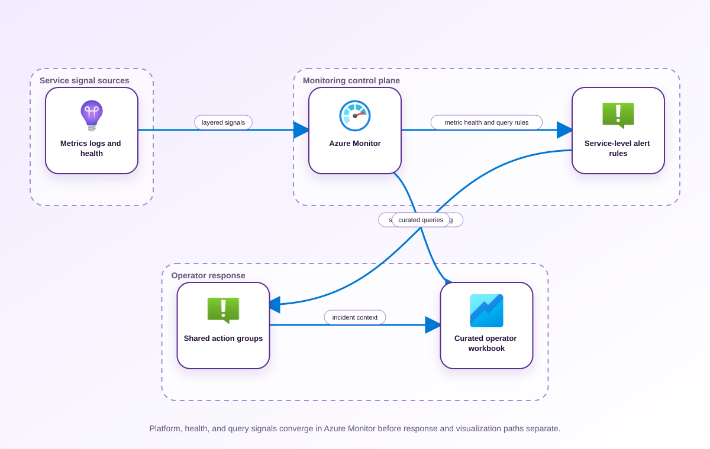

<!-- BEGIN GENERATED AZ305 V1 -->
# LAB-02 — Monitoring, Alerting, and Operational Visibility

## 1. Navigation

[← LAB-01](../01-centralized-logging-routing/README.md) · [Lab catalog](../README.md) · [LAB-03 →](../03-authentication-identity-design/README.md)

## 2. Scenario and completion contract

Fabrikam Payments has a centralized Log Analytics estate, but responders learn about customer impact from support tickets. Platform metrics, resource health events, query-based service-level indicators, and application telemetry are monitored by different teams with inconsistent thresholds. As the monitoring architect, design the health model, action routing, alert severity, suppression, and workbook views that turn the collection architecture from Lab 01 into actionable operational visibility. The solution must avoid noisy static thresholds, distinguish symptoms from causes, preserve independent positive and negative validation, and document ownership for every notification path without embedding personal addresses, secrets, or live incident data.

- Architect role: Monitoring and reliability architect
- Outcome: An actionable monitoring design that detects customer-impacting conditions, routes owned alerts, and proves noise controls.
- Duration: 140 minutes
- Difficulty: advanced
- Cost class: low
- Completion: all five checkpoint assertions, final validation, decision revision, and cleanup review are complete.

## 3. Objective-to-evidence map

| Objective | Requirement | Checkpoint |
| --- | --- | --- |
| `IGM-MON-01` | `LAB02-REQ-01` | [`LAB02-CP01`](#checkpoint-1) |
| `IGM-MON-01` | `LAB02-REQ-02` | [`LAB02-CP02`](#checkpoint-2) |
| `IGM-MON-01` | `LAB02-REQ-03` | [`LAB02-CP03`](#checkpoint-3) |
| `IGM-MON-01` | `LAB02-REQ-04` | [`LAB02-CP04`](#checkpoint-4) |
| `IGM-MON-01` | `LAB02-REQ-05` | [`LAB02-CP05`](#checkpoint-5) |

## 4. Business and quality requirements

Business outcome: Detect and triage material service degradation before customers report it while reducing unactionable alerts.

- `LAB02-REQ-01` — The design identifies platform, application, dependency, and business signals with explicit owners.
- `LAB02-REQ-02` — Resource Health and Service Health alerts are separated from routine administrative events and have owned severities.
- `LAB02-REQ-03` — The selected log alert evaluates an auditable customer-impact query over a suitable window and frequency.
- `LAB02-REQ-04` — The workbook leads from business health to dependencies and resource diagnostics without exposing sensitive dimensions.
- `LAB02-REQ-05` — Every actionable severity maps to a durable team-owned receiver and documented suppression rule.

Scenario facts:

- **Data:** Metric time series, log events, action-group delivery records, and workbook annotations form separate evidence sources.
- **Scale:** A scheduled promotion creates a threefold fifteen-minute demand spike; absolute baseline request volume is intentionally left for measurement.
- **Latency:** Detection must be fast enough to precede customer reports, but the exact alert window follows the approved payment-service SLO.
- **Availability:** Alert routing needs at least one tested receiver path when a team-specific channel or integration is unavailable.
- **RTO:** The incident-response RTO is not supplied; the exercise measures detection and notification delay for owner approval.
- **RPO:** Historical alert and deployment context must cover the investigation window; transactional payment RPO belongs to the workload design.
- **Budget:** The preferred design trades a small curated alert set for lower query and responder cost than resource-by-resource duplication.

Constraints:

- Legitimate promotion traffic can triple for fifteen minutes and cannot be treated automatically as an incident.
- Customer-impact signals must continue detecting real payment failure during the same burst window.
- Use only the Azure PowerShell command lane for learner implementation.
- Keep all live changes behind explicit execution and acknowledgement switches.
- Retain only sanitized command evidence and synthetic fixture identifiers.

Assumptions:

- The service emits request rate, latency, failure rate, dependency health, and deployment annotations with consistent dimensions.
- Service owners provide an approved SLO and action-group escalation roster before live alert changes.
- West Europe is the configurable primary example and North Europe is the configurable secondary example.
- The learner has administrator-level Azure operations knowledge but receives no pre-existing authenticated context.
- Offline fixtures demonstrate contract behavior rather than live Azure service behavior.

## 5. Architecture diagram and walkthrough



The flow begins with the business outcome, crosses five independently validated design capabilities, and ends with positive and negative evidence. The SVG is deterministically rendered from `diagrams/architecture.mmd`.

## 6. Concept primer and candidate architectures

Architecture decisions translate measurable requirements into a deliberate service and operating model. A candidate is viable only when every mandatory constraint is met; convenience or familiarity cannot compensate for a disqualifier.

- **Service-centric alerts with shared action groups and curated workbooks** (eligible) — SLO-oriented multi-signal alerts correlate customer impact, dependency state, and deployment context while reusable action groups control routing.
- **Resource-by-resource static thresholds with team-specific receivers** (eligible) — Static resource rules are easy to assign but amplify transient promotion noise and obscure end-to-end payment impact.
- **External monitoring only with Azure telemetry exported downstream** (eligible) — External correlation can provide an independent vantage point, although export delay and lost Azure resource context weaken first response.
- **One fixed latency threshold copied to every resource** (ineligible) — A copied threshold is cheap to create but cannot distinguish a planned demand surge from a failing dependency. Disqualifier: LAB02-REQ-03 requires a service-level query and evaluation window grounded in auditable customer impact.

## 7. Decision, ADR, and Well-Architected review

Criteria weights are C1 30, C2 25, C3 20, C4 15, and C5 10. Weighted totals use `sum(weight × score) / 5`.

| Candidate | Eligible | C1 | C2 | C3 | C4 | C5 | Weighted /100 |
| --- | ---: | ---: | ---: | ---: | ---: | ---: | ---: |
| Service-centric alerts with shared action groups and curated workbooks | yes | 5 | 4 | 4 | 5 | 4 | 89 |
| Resource-by-resource static thresholds with team-specific receivers | yes | 3 | 3 | 4 | 2 | 3 | 61 |
| External monitoring only with Azure telemetry exported downstream | yes | 3 | 3 | 3 | 3 | 2 | 58 |
| One fixed latency threshold copied to every resource | no | 1 | 2 | 3 | 2 | 4 | 42 |

Selected design: **Service-centric alerts with shared action groups and curated workbooks**. `ADR-LAB02-001` records the accepted reasoning. Review Reliability, Security, Cost Optimization, Operational Excellence, and Performance Efficiency in `design/decision.yml`; no pillar is implied by another.

Rejected alternatives:

- **Resource-by-resource static thresholds with team-specific receivers:** It scores poorly on operability because duplicated thresholds and receiver lists drift independently.
- **External monitoring only with Azure telemetry exported downstream:** Export-only detection adds latency and makes Azure-native dependency and deployment context harder to preserve.
- **One fixed latency threshold copied to every resource:** It is ineligible because it cannot meet the independent alert-quality acceptance criteria.

Architecture risks:

- **Risk:** Dynamic thresholds may learn a promotion spike and suppress a genuine payment-path failure. **Mitigation:** Combine demand-aware baselines with an invariant failed-transaction or availability SLO signal.
- **Risk:** A shared action group can become a single notification dependency. **Mitigation:** Configure and exercise independent receiver types, then retain delivery-status evidence for each route.

Well-Architected consequences:

- **Reliability:** Multi-signal service alerts detect degraded customer outcomes even when individual resources report healthy.
- **Security:** Least-privilege action-group maintenance and sanitized alert payloads limit exposure through notification channels.
- **Cost Optimization:** Curated rules reduce duplicate evaluations and the labor cost of unactionable pages.
- **Operational Excellence:** Workbooks join SLO, dependency, deployment, and alert evidence into one triage sequence.
- **Performance Efficiency:** Demand-relative thresholds absorb planned bursts while invariant failure signals protect sensitivity.

ADR consequences:

- Service owners must maintain SLO thresholds and promotion annotations as product behavior changes.
- Shared receiver governance becomes a platform responsibility with regular delivery tests.

## 8. Inputs, permissions, licensing, cost, and analogue

Use configurable `Location` (`AZ305_LOCATION`, default West Europe) and `SecondaryLocation` (`AZ305_SECONDARY_LOCATION`, default North Europe). Every public input has an explicit `AZ305_*` fallback. Preview is the default; only Golden Lab 00 writes an intent-only `execute: false` preview record. Before an executed cloud command, the supplied subscription and tenant must exactly match the active CLI, Az, and—where applicable—Microsoft Graph contexts. `-Execute` crosses the execution boundary; cost-bearing and tenant-scoped paths also require their independent acknowledgement switches.

Safe analogue: The reference topology is deployable at bounded scope; preview remains the default and live verification is separate.

Permissions: Reader and Monitoring Reader support inspection; changing alert rules, processing rules, action groups, or workbooks requires separately approved monitoring contributor rights.

Licensing: Metric alerts, log alerts, notification channels, and workbook queries have distinct Azure Monitor charging behavior that owners must validate.

Cost boundary: Evaluate alert-rule evaluation frequency, log-query volume, notification fan-out, and operator time lost to false positives.

## 9. Read-only preflight

```powershell
pwsh ./scripts/azure-powershell/Preflight.ps1 -RunId synthetic-020001
```

Synthetic sample: `{"labId":"LAB-02","track":"azure-powershell","result":"pass","note":"Local tool discovery only"}`. This is illustrative local output, not evidence captured from Azure.

## 10. Five guided checkpoints

### Checkpoint 1: Build a layered signal inventory

<a id="checkpoint-1"></a>

**Trace:** `IGM-MON-01` → `LAB02-REQ-01` → `LAB02-CP01`

```powershell
Get-AzMetricDefinition -ResourceId $TargetResourceId
```

Expected evidence: The design identifies platform, application, dependency, and business signals with explicit owners. Retain Metric namespace, aggregation, grain, owner, and business symptom mapping.

Positive assertion:

```powershell
Get-AzMetricDefinition -ResourceId $TargetResourceId | Where-Object { $_.Name.Value -eq $RequiredMetricName }
```

Negative assertion:

```powershell
Get-AzMetricDefinition -ResourceId $TargetResourceId | Where-Object { $_.Name.Value -eq $DeprecatedMetricName }
```

Failure and retry: A desired metric is unavailable at the resource SKU or namespace. Select a supported proxy signal and record the detection trade-off before continuing.

Cleanup dependency: No resource cleanup is required for this read-only inventory checkpoint.

WAF consequence: Performance Efficiency: signals aligned to saturation and latency expose capacity bottlenecks without indiscriminate telemetry.

### Checkpoint 2: Design platform and resource-health alerts

<a id="checkpoint-2"></a>

**Trace:** `IGM-MON-01` → `LAB02-REQ-02` → `LAB02-CP02`

```powershell
New-AzActivityLogAlert -Name $HealthAlertName -ResourceGroupName $ResourceGroup -Location global -Scope $TargetResourceId -Action (New-AzActivityLogAlertActionGroupObject -Id $ActionGroupResourceId) -Condition @((New-AzActivityLogAlertAlertRuleAnyOfOrLeafConditionObject -Field category -Equal ResourceHealth)) -Enabled $true -Tag @{purpose='az305-lab';labId='LAB-02';runId=$RunId;expiresOn=$ExpiresOn}
```

Expected evidence: Resource Health and Service Health alerts are separated from routine administrative events and have owned severities. Retain Alert scope, category, status, severity rationale, and owner alias using synthetic contacts.

Positive assertion:

```powershell
Get-AzActivityLogAlert -ResourceGroupName $ResourceGroup -Name $HealthAlertName
```

Negative assertion:

```powershell
Get-AzActivityLogAlert -ResourceGroupName $ResourceGroup | Where-Object { $_.ConditionAllOf.Field -eq 'category' -and $_.ConditionAllOf.Equals -eq 'Administrative' }
```

Failure and retry: Subscription scope or action authorization is narrower than the intended failure domain. Reduce scope to an authorized management boundary and document any coverage gap.

Cleanup dependency: Remove test activity-log alerts before action groups when cleanup is authorized.

WAF consequence: Reliability: resource and service-health signals cover failures outside the application process.

### Checkpoint 3: Define a query-based service-level alert

<a id="checkpoint-3"></a>

**Trace:** `IGM-MON-01` → `LAB02-REQ-03` → `LAB02-CP03`

```powershell
Get-AzScheduledQueryRule -ResourceGroupName $ResourceGroup -Name $ScheduledQueryRuleName
```

Expected evidence: The selected log alert evaluates an auditable customer-impact query over a suitable window and frequency. Retain Sanitized KQL fingerprint, window, frequency, threshold, severity, and failing-period configuration.

Positive assertion:

```powershell
Get-AzScheduledQueryRule -ResourceGroupName $ResourceGroup -Name $ScheduledQueryRuleName
```

Negative assertion:

```powershell
Get-AzScheduledQueryRule -ResourceGroupName $ResourceGroup | Where-Object { $_.WindowSize -lt $_.EvaluationFrequency }
```

Failure and retry: Query latency or ingestion delay exceeds the intended detection time. Test against synthetic fixtures, widen the window only as needed, and document slower detection.

Cleanup dependency: Delete the scheduled-query rule before deleting its action group or workspace dependency.

WAF consequence: Cost Optimization: query cadence balances detection value against repeated log-query consumption.

### Checkpoint 4: Curate an operator workbook

<a id="checkpoint-4"></a>

**Trace:** `IGM-MON-01` → `LAB02-REQ-04` → `LAB02-CP04`

```powershell
New-AzApplicationInsightsWorkbook -ResourceGroupName $ResourceGroup -Name $WorkbookResourceName -Location $Location -DisplayName $WorkbookDisplayName -SourceId $TargetResourceId -Category workbook -SerializedData $WorkbookJson -Tag @{purpose='az305-lab';labId='LAB-02';runId=$RunId;expiresOn=$ExpiresOn}
```

Expected evidence: The workbook leads from business health to dependencies and resource diagnostics without exposing sensitive dimensions. Retain Workbook resource ID, display name, query-purpose inventory, and accessibility review.

Positive assertion:

```powershell
Get-AzApplicationInsightsWorkbook -ResourceGroupName $ResourceGroup -Name $WorkbookResourceName
```

Negative assertion:

```powershell
Get-AzApplicationInsightsWorkbook -ResourceGroupName $ResourceGroup -Category workbook | Where-Object { [string]::IsNullOrWhiteSpace($_.DisplayName) }
```

Failure and retry: A cross-workspace query cannot resolve because the operator lacks access to one workspace. Validate workspace-scoped RBAC and replace inaccessible panels with an explicit coverage notice.

Cleanup dependency: Delete the workbook before its supporting workspace only when it was created by this run.

WAF consequence: Security: curated views expose only the telemetry dimensions operators need for diagnosis.

### Checkpoint 5: Verify action routing and noise controls

<a id="checkpoint-5"></a>

**Trace:** `IGM-MON-01` → `LAB02-REQ-05` → `LAB02-CP05`

```powershell
Get-AzActionGroup -ResourceGroupName $ResourceGroup
```

Expected evidence: Every actionable severity maps to a durable team-owned receiver and documented suppression rule. Retain Receiver type, synthetic endpoint label, severity routing table, suppression window, and owner.

Positive assertion:

```powershell
Get-AzActionGroup -ResourceGroupName $ResourceGroup -Name $ActionGroupName
```

Negative assertion:

```powershell
Get-AzActionGroup -ResourceGroupName $ResourceGroup | Where-Object { $_.EmailReceiver.EmailAddress -match '@(gmail|outlook)\.com$' }
```

Failure and retry: An action group exists but a receiver is disabled, unverified, or unsupported in the region. Correct the synthetic routing design and retest the alert-to-owner mapping without sending notifications.

Cleanup dependency: Delete alert rules before deleting the shared action group.

WAF consequence: Operational Excellence: severity and action routing send actionable work to durable, accountable teams.

## 11. Final validation and interpretation

Run `Validate.ps1 -Mode Deployment -Execute` only after an executed run has state and you are authorized to issue the ten read-only checkpoint inspections. Without `-Execute`, ordinary deployment validation records `partial` and exits `2`; Golden Lab 00 alone can validate its intent-only preview locally. Exit `0` means all required assertions pass, `1` means at least one failed, and `2` means the outcome is gated or partial. Positive and negative commands execute independently, so one failure never suppresses its paired assertion.

## 12. Material change request

The payment API adopts a bursty promotion model that triples legitimate traffic for fifteen minutes, so static latency and error-rate thresholds must be revised without masking genuine customer impact.

Revised solution: select **Service-centric alerts with shared action groups and curated workbooks**. LAB02-REQ-03 requires an auditable customer-impact query, so the promotion case uses demand-relative latency evaluation plus an invariant failure-rate signal rather than a static resource threshold.

Revised Well-Architected consequences:

- **Reliability:** Two independent signals prevent a benign traffic surge from hiding a true outage.
- **Security:** Receiver scopes and payload fields remain unchanged while alert logic evolves.
- **Cost Optimization:** Noise suppression avoids a threefold burst producing redundant pages and log queries.
- **Operational Excellence:** Promotion annotations give responders an auditable reason for changed baselines.
- **Performance Efficiency:** Multi-window evaluation reflects short bursts without permanently raising the latency threshold.

## 13. Architect job challenge

Propose a multi-window burn-rate alert and explain how it changes severity, evaluation frequency, and operator context.

## 14. Troubleshooting, cleanup, and residual verification

- Compare alert evaluation frequency, observation window, and ingestion delay before changing thresholds.
- Verify action-group receiver state and rule association separately when an alert fires without notification.
- Test workbook queries with the least-privileged operator role to expose hidden cross-workspace dependencies.

Cleanup previews nonempty state in reverse dependency order, writes `partial`, and exits `2`; an already empty run is completed locally and idempotently. Executed cleanup rechecks the exact live ID plus `purpose`, `labId`, `runId`, and `expiresOn` immediately before each removal, persists state after every absent or removed object, stops on the first dependency failure, and refuses unresolved pre-existing settings. It never automates purge. Finish with `Validate.ps1 -Mode PostCleanup`; the required residual count is zero.

## 15. Exam debrief, assessment, sources, and navigation

Explain the recommendation in terms of requirements, rejected alternatives, failure behavior, and all five WAF pillars. Complete `assessment/QUESTIONS.md`, then use the separately excluded answer key for remediation.

- [Azure Monitor best practices - Alerts and automated actions](https://learn.microsoft.com/en-us/azure/azure-monitor/best-practices-alerts)
- [Azure Well-Architected Framework](https://learn.microsoft.com/en-us/azure/well-architected/)

[← LAB-01](../01-centralized-logging-routing/README.md) · [Lab catalog](../README.md) · [LAB-03 →](../03-authentication-identity-design/README.md)

## 16. Synchronized lifecycle-script appendix

### Preflight.ps1

```powershell
[CmdletBinding()]
param(
    [string]$SubscriptionId = $env:AZ305_SUBSCRIPTION_ID,
    [string]$TenantId = $env:AZ305_TENANT_ID,
    [ValidatePattern('^[a-z0-9-]{6,64}$')][string]$RunId = $env:AZ305_RUN_ID,
    [string]$Location = $(if ($env:AZ305_LOCATION) { $env:AZ305_LOCATION } else { 'westeurope' }),
    [string]$SecondaryLocation = $(if ($env:AZ305_SECONDARY_LOCATION) { $env:AZ305_SECONDARY_LOCATION } else { 'northeurope' }),
    [string]$ResourceGroup = $(if ($env:AZ305_RESOURCE_GROUP) { $env:AZ305_RESOURCE_GROUP } else { "rg-az305-$RunId" }),
    [string]$WorkloadName = $(if ($env:AZ305_WORKLOAD_NAME) { $env:AZ305_WORKLOAD_NAME } else { "az305-$RunId" }),
    [string]$ExpiresOn = $(if ($env:AZ305_EXPIRES_ON) { $env:AZ305_EXPIRES_ON } else { (Get-Date).ToUniversalTime().AddDays(1).ToString('yyyy-MM-dd') }),
    [string]$ActionGroupName = $env:AZ305_ACTION_GROUP_NAME,
    [string]$ActionGroupResourceId = $env:AZ305_ACTION_GROUP_RESOURCE_ID,
    [string]$DeprecatedMetricName = $env:AZ305_DEPRECATED_METRIC_NAME,
    [string]$HealthAlertName = $env:AZ305_HEALTH_ALERT_NAME,
    [string]$RequiredMetricName = $env:AZ305_REQUIRED_METRIC_NAME,
    [string]$ScheduledQueryRuleName = $env:AZ305_SCHEDULED_QUERY_RULE_NAME,
    [string]$TargetResourceId = $env:AZ305_TARGET_RESOURCE_ID,
    [string]$WorkbookDisplayName = $env:AZ305_WORKBOOK_DISPLAY_NAME,
    [string]$WorkbookJson = $env:AZ305_WORKBOOK_JSON,
    [string]$WorkbookResourceName = $env:AZ305_WORKBOOK_RESOURCE_NAME,
    [switch]$Execute,
    [switch]$AcknowledgeCost,
    [switch]$AcknowledgeTenantChange
)

$ErrorActionPreference = 'Stop'
$PSNativeCommandUseErrorActionPreference = $true
if (-not $RunId) { [Console]::Error.WriteLine('RunId or AZ305_RUN_ID is required.'); exit 2 }
# Every lifecycle entrypoint intentionally exposes the same public parameter contract.
@($SubscriptionId, $TenantId, $RunId, $Location, $SecondaryLocation, $ResourceGroup, $WorkloadName, $ExpiresOn, $ActionGroupName, $ActionGroupResourceId, $DeprecatedMetricName, $HealthAlertName, $RequiredMetricName, $ScheduledQueryRuleName, $TargetResourceId, $WorkbookDisplayName, $WorkbookJson, $WorkbookResourceName, $Execute, $AcknowledgeCost, $AcknowledgeTenantChange) | Out-Null

$requiredCommands = @('pwsh')
$missing = @($requiredCommands | Where-Object { -not (Get-Command $_ -ErrorAction SilentlyContinue) })
if ($missing.Count -gt 0) {
    Write-Error "Missing local commands: $($missing -join ', ')"
    exit 1
}
$requiredCmdlets = @('Get-AzActionGroup', 'Get-AzActivityLogAlert', 'Get-AzApplicationInsightsWorkbook', 'Get-AzMetricDefinition', 'Get-AzScheduledQueryRule', 'New-AzActivityLogAlert', 'New-AzActivityLogAlertActionGroupObject', 'New-AzActivityLogAlertAlertRuleAnyOfOrLeafConditionObject', 'New-AzApplicationInsightsWorkbook')
$missingCmdlets = @($requiredCmdlets | Where-Object { -not (Get-Command $_ -ErrorAction SilentlyContinue) })
if ($missingCmdlets.Count -gt 0) {
    Write-Error "Missing local cmdlets: $($missingCmdlets -join ', ')"
    exit 1
}

[pscustomobject]@{
    labId = 'LAB-02'
    track = 'azure-powershell'
    implementationMode = 'reference-deployable'
    result = 'pass'
    note = 'Local tool discovery only; no Azure or Microsoft Graph request was made.'
} | ConvertTo-Json
exit 0
```

### Setup.ps1

```powershell
[CmdletBinding()]
param(
    [string]$SubscriptionId = $env:AZ305_SUBSCRIPTION_ID,
    [string]$TenantId = $env:AZ305_TENANT_ID,
    [ValidatePattern('^[a-z0-9-]{6,64}$')][string]$RunId = $env:AZ305_RUN_ID,
    [string]$Location = $(if ($env:AZ305_LOCATION) { $env:AZ305_LOCATION } else { 'westeurope' }),
    [string]$SecondaryLocation = $(if ($env:AZ305_SECONDARY_LOCATION) { $env:AZ305_SECONDARY_LOCATION } else { 'northeurope' }),
    [string]$ResourceGroup = $(if ($env:AZ305_RESOURCE_GROUP) { $env:AZ305_RESOURCE_GROUP } else { "rg-az305-$RunId" }),
    [string]$WorkloadName = $(if ($env:AZ305_WORKLOAD_NAME) { $env:AZ305_WORKLOAD_NAME } else { "az305-$RunId" }),
    [string]$ExpiresOn = $(if ($env:AZ305_EXPIRES_ON) { $env:AZ305_EXPIRES_ON } else { (Get-Date).ToUniversalTime().AddDays(1).ToString('yyyy-MM-dd') }),
    [string]$ActionGroupName = $env:AZ305_ACTION_GROUP_NAME,
    [string]$ActionGroupResourceId = $env:AZ305_ACTION_GROUP_RESOURCE_ID,
    [string]$DeprecatedMetricName = $env:AZ305_DEPRECATED_METRIC_NAME,
    [string]$HealthAlertName = $env:AZ305_HEALTH_ALERT_NAME,
    [string]$RequiredMetricName = $env:AZ305_REQUIRED_METRIC_NAME,
    [string]$ScheduledQueryRuleName = $env:AZ305_SCHEDULED_QUERY_RULE_NAME,
    [string]$TargetResourceId = $env:AZ305_TARGET_RESOURCE_ID,
    [string]$WorkbookDisplayName = $env:AZ305_WORKBOOK_DISPLAY_NAME,
    [string]$WorkbookJson = $env:AZ305_WORKBOOK_JSON,
    [string]$WorkbookResourceName = $env:AZ305_WORKBOOK_RESOURCE_NAME,
    [switch]$Execute,
    [switch]$AcknowledgeCost,
    [switch]$AcknowledgeTenantChange
)

$ErrorActionPreference = 'Stop'
$PSNativeCommandUseErrorActionPreference = $true
if (-not $RunId) { [Console]::Error.WriteLine('RunId or AZ305_RUN_ID is required.'); exit 2 }
# Every lifecycle entrypoint intentionally exposes the same public parameter contract.
@($SubscriptionId, $TenantId, $RunId, $Location, $SecondaryLocation, $ResourceGroup, $WorkloadName, $ExpiresOn, $ActionGroupName, $ActionGroupResourceId, $DeprecatedMetricName, $HealthAlertName, $RequiredMetricName, $ScheduledQueryRuleName, $TargetResourceId, $WorkbookDisplayName, $WorkbookJson, $WorkbookResourceName, $Execute, $AcknowledgeCost, $AcknowledgeTenantChange) | Out-Null

$LabRoot = Split-Path (Split-Path $PSScriptRoot -Parent) -Parent
$StateRoot = Join-Path $LabRoot ".state/$RunId"
$StatePath = Join-Path $StateRoot 'run.json'

function Assert-ExactExecutionContext {
    [CmdletBinding()]
    param([string]$ExpectedSubscriptionId, [string]$ExpectedTenantId)
    if ([string]::IsNullOrWhiteSpace($ExpectedSubscriptionId) -or [string]::IsNullOrWhiteSpace($ExpectedTenantId)) { throw 'SubscriptionId and TenantId are required before an Azure request.' }
    $azContext = Get-AzContext -ErrorAction Stop
    if (-not $azContext -or [string]$azContext.Subscription.Id -ine $ExpectedSubscriptionId -or [string]$azContext.Tenant.Id -ine $ExpectedTenantId) {
        throw 'The active Azure PowerShell subscription or tenant does not exactly match the requested context.'
    }
}

function Save-RunState {
    [CmdletBinding()]
    param([Parameter(Mandatory)]$State)
    $temporaryPath = "$StatePath.tmp"
    $State | ConvertTo-Json -Depth 20 | Set-Content -LiteralPath $temporaryPath -Encoding utf8NoBOM
    Move-Item -LiteralPath $temporaryPath -Destination $StatePath -Force
}

function Assert-SafeStateValue {
    [CmdletBinding()]
    param($Value)
    $serialized = $Value | ConvertTo-Json -Depth 12 -Compress
    if ($serialized -match '(?i)"(?:token|password|secret|certificate|connectionString|sas|clientSecret|accessToken|refreshToken|accountKey|privateKey)"\s*:') {
        throw 'A prohibited sensitive field name was returned; state capture is refused.'
    }
}

function Convert-CheckpointOutput {
    [CmdletBinding()]
    param($Value)
    if ($Value -is [string]) { $raw = [string]$Value }
    elseif ($Value -is [System.Collections.IEnumerable] -and @($Value | Where-Object { $_ -isnot [string] }).Count -eq 0) { $raw = @($Value) -join "`n" }
    else { return $Value }
    if ([string]::IsNullOrWhiteSpace($raw)) { return $null }
    try { return ($raw | ConvertFrom-Json -Depth 100) } catch { return $Value }
}

function Get-ReturnedResourceId {
    [CmdletBinding()]
    param($Value)
    $seen = [System.Collections.Generic.HashSet[string]]::new([System.StringComparer]::OrdinalIgnoreCase)
    $results = [System.Collections.Generic.List[string]]::new()
    function Add-ArmId {
        param($Candidate)
        if ($Candidate -is [string] -and $Candidate -match '^/subscriptions/[0-9a-f-]+/(?:resourceGroups/[^/]+(?:/providers/.+)?|providers/.+)$' -and $Candidate -notmatch '/providers/Microsoft\.Resources/deployments/') {
            if ($seen.Add($Candidate)) { $results.Add($Candidate) }
        }
    }
    function Find-DeploymentOutputId {
        param($Item, [int]$Depth)
        if ($null -eq $Item -or $Depth -gt 12) { return }
        if ($Item -is [string]) { Add-ArmId -Candidate $Item; return }
        if ($Item -is [System.Collections.IDictionary]) { foreach ($key in $Item.Keys) { Find-DeploymentOutputId -Item $Item[$key] -Depth ($Depth + 1) }; return }
        if ($Item -is [System.Collections.IEnumerable]) { foreach ($entry in $Item) { Find-DeploymentOutputId -Item $entry -Depth ($Depth + 1) }; return }
        foreach ($property in @($Item.PSObject.Properties | Where-Object { $_.MemberType -in @('NoteProperty', 'Property') })) { Find-DeploymentOutputId -Item $property.Value -Depth ($Depth + 1) }
    }
    foreach ($rootItem in @($Value)) {
        if ($rootItem -is [System.Collections.IDictionary]) {
            foreach ($name in @('id', 'resourceId')) { if ($rootItem.Contains($name)) { Add-ArmId -Candidate $rootItem[$name] } }
            if ($rootItem.Contains('properties') -and $rootItem.properties -and $rootItem.properties.outputs) { Find-DeploymentOutputId -Item $rootItem.properties.outputs -Depth 0 }
            continue
        }
        foreach ($name in @('Id', 'ResourceId')) {
            $property = $rootItem.PSObject.Properties[$name]
            if ($property) { Add-ArmId -Candidate $property.Value }
        }
        if ($rootItem.PSObject.Properties['Properties'] -and $rootItem.Properties -and $rootItem.Properties.outputs) {
            Find-DeploymentOutputId -Item $rootItem.Properties.outputs -Depth 0
        }
    }
    return @($results)
}

function Get-PlannedDeploymentResourceId {
    [CmdletBinding()]
    param($Value)
    $seen = [System.Collections.Generic.HashSet[string]]::new([System.StringComparer]::OrdinalIgnoreCase)
    $results = [System.Collections.Generic.List[string]]::new()
    foreach ($change in @($Value.changes)) {
        $candidate = [string]$change.resourceId
        if ($candidate -match '^/subscriptions/[0-9a-f-]+/(?:resourceGroups/[^/]+(?:/providers/.+)?|providers/.+)$' -and $candidate -notmatch '/providers/Microsoft\.Resources/deployments/' -and $seen.Add($candidate)) {
            $results.Add($candidate)
        }
    }
    return @($results)
}

function Assert-InputSubscriptionScope {
    [CmdletBinding()]
    param($Inputs, [string]$ExpectedSubscriptionId)
    $entries = if ($Inputs -is [System.Collections.IDictionary]) {
        @($Inputs.GetEnumerator())
    } else {
        @($Inputs.PSObject.Properties | ForEach-Object { [pscustomobject]@{ Key = $_.Name; Value = $_.Value } })
    }
    foreach ($entry in $entries) {
        if ($entry.Value -is [string] -and [string]$entry.Value -match '^/subscriptions/([^/]+)/') {
            if ($Matches[1] -ine $ExpectedSubscriptionId) { throw "Input $($entry.Key) belongs to a different subscription." }
        }
    }
}

function Assert-ManagedMutation {
    [CmdletBinding()]
    param($State, [string]$CheckpointId, [bool]$CarriesOwnership, [object[]]$TargetResourceIds)
    if ($CarriesOwnership) { return }
    $targets = @($TargetResourceIds | Where-Object { $_ -is [string] -and $_ -match '^/subscriptions/' })
    if ($targets.Count -eq 0) { throw "$CheckpointId refuses an untagged mutation because no exact ARM target ID was supplied." }
    $knownIds = @($State.managedObjects | ForEach-Object { [string]$_.id })
    if ($knownIds.Count -eq 0) { throw "$CheckpointId refuses to modify a pre-existing object because no run-owned parent has been recorded." }
    foreach ($target in $targets) {
        $related = @($knownIds | Where-Object { $target -ieq $_ -or $target.StartsWith("$_/", [System.StringComparison]::OrdinalIgnoreCase) -or $_.StartsWith("$target/", [System.StringComparison]::OrdinalIgnoreCase) }).Count -gt 0
        if (-not $related) { throw "$CheckpointId refuses a mutation outside the exact run-owned resource boundary." }
    }
}

$executionInputs = [ordered]@{ subscriptionId = $SubscriptionId; tenantId = $TenantId; location = $Location; secondaryLocation = $SecondaryLocation; resourceGroup = $ResourceGroup; workloadName = $WorkloadName; expiresOn = $ExpiresOn; ActionGroupName = $ActionGroupName; ActionGroupResourceId = $ActionGroupResourceId; DeprecatedMetricName = $DeprecatedMetricName; HealthAlertName = $HealthAlertName; RequiredMetricName = $RequiredMetricName; ScheduledQueryRuleName = $ScheduledQueryRuleName; TargetResourceId = $TargetResourceId; WorkbookDisplayName = $WorkbookDisplayName; WorkbookJson = $WorkbookJson; WorkbookResourceName = $WorkbookResourceName }

if (-not $Execute) {
    Write-Output '[preview] No cloud command was called and no state was created.'
    Write-Output '[preview] Re-run with -Execute only in an authorized disposable environment.'
    exit 0
}
# This setup is compatible with the lab implementation mode.
# This default exercise does not require a cost acknowledgement.
# This lab does not perform a tenant-scoped change by default.
$requiredLabInputs = [ordered]@{ ActionGroupResourceId = $ActionGroupResourceId; HealthAlertName = $HealthAlertName; ScheduledQueryRuleName = $ScheduledQueryRuleName; TargetResourceId = $TargetResourceId; WorkbookDisplayName = $WorkbookDisplayName; WorkbookJson = $WorkbookJson; WorkbookResourceName = $WorkbookResourceName }
$missingLabInputs = @($requiredLabInputs.GetEnumerator() | Where-Object { $_.Value -is [string] -and [string]::IsNullOrWhiteSpace([string]$_.Value) } | ForEach-Object Key)
if ($missingLabInputs.Count -gt 0) { [Console]::Error.WriteLine("Execution is gated; supply: $($missingLabInputs -join ', ')."); exit 2 }

try {
    Assert-ExactExecutionContext -ExpectedSubscriptionId $SubscriptionId -ExpectedTenantId $TenantId
    Assert-InputSubscriptionScope -Inputs $executionInputs -ExpectedSubscriptionId $SubscriptionId
    Assert-SafeStateValue -Value $executionInputs
}
catch {
    [Console]::Error.WriteLine("Execution is gated by context or input validation: $($_.Exception.Message)")
    exit 2
}

# Recovery state is persisted before the first possible mutation below.
if (Test-Path -LiteralPath $StatePath) {
    [Console]::Error.WriteLine('Run state already exists. Choose a new RunId or complete the recorded cleanup; existing recovery state will not be overwritten.')
    exit 2
}
New-Item -ItemType Directory -Path $StateRoot -Force | Out-Null
$state = [ordered]@{
    schemaVersion = '1.0.0'; labId = 'LAB-02'; runId = $RunId; track = 'azure-powershell'
    implementationMode = 'reference-deployable'; status = 'initialized'
    createdAt = (Get-Date).ToUniversalTime().ToString('o'); execute = $true
    parameters = $executionInputs
    managedObjects = @(); originalSettings = @()
}
Save-RunState -State $state
$state.status = 'deploying'
Save-RunState -State $state

$originalLocation = Get-Location
try {
    Set-Location -LiteralPath $LabRoot
    # 02-CP01: Build a layered signal inventory
    $stepResult = & { Get-AzMetricDefinition -ResourceId $TargetResourceId }
    $null = $stepResult

    # 02-CP02: Design platform and resource-health alerts
    Assert-ManagedMutation -State $state -CheckpointId 'LAB02-CP02' -CarriesOwnership:$true -TargetResourceIds @($ActionGroupResourceId, $TargetResourceId)
    $stepResult = & { New-AzActivityLogAlert -Name $HealthAlertName -ResourceGroupName $ResourceGroup -Location global -Scope $TargetResourceId -Action (New-AzActivityLogAlertActionGroupObject -Id $ActionGroupResourceId) -Condition @((New-AzActivityLogAlertAlertRuleAnyOfOrLeafConditionObject -Field category -Equal ResourceHealth)) -Enabled $true -Tag @{purpose='az305-lab';labId='LAB-02';runId=$RunId;expiresOn=$ExpiresOn} }
    $candidate = Convert-CheckpointOutput -Value $stepResult
    $returnedIds = @(Get-ReturnedResourceId -Value $candidate)
    if ($returnedIds.Count -eq 0) { throw 'LAB02-CP02 created an owned resource but returned no recoverable ARM resource ID.' }
    foreach ($returnedId in $returnedIds) {
        if ($returnedId -notmatch '^/subscriptions/([^/]+)/' -or $Matches[1] -ine $SubscriptionId) { throw 'A returned recovery ID belongs to a different subscription.' }
        if (@($state.managedObjects | Where-Object { $_.id -ieq $returnedId }).Count -eq 0) {
            $state.managedObjects += [pscustomobject]@{
                id = $returnedId
                type = 'azure-resource'
                tags = [ordered]@{ purpose = 'az305-lab'; labId = 'LAB-02'; runId = $RunId; expiresOn = $ExpiresOn }
            }
            Save-RunState -State $state
        }
    }
    $null = $stepResult

    # 02-CP03: Define a query-based service-level alert
    $stepResult = & { Get-AzScheduledQueryRule -ResourceGroupName $ResourceGroup -Name $ScheduledQueryRuleName }
    $null = $stepResult

    # 02-CP04: Curate an operator workbook
    Assert-ManagedMutation -State $state -CheckpointId 'LAB02-CP04' -CarriesOwnership:$true -TargetResourceIds @($TargetResourceId)
    $stepResult = & { New-AzApplicationInsightsWorkbook -ResourceGroupName $ResourceGroup -Name $WorkbookResourceName -Location $Location -DisplayName $WorkbookDisplayName -SourceId $TargetResourceId -Category workbook -SerializedData $WorkbookJson -Tag @{purpose='az305-lab';labId='LAB-02';runId=$RunId;expiresOn=$ExpiresOn} }
    $candidate = Convert-CheckpointOutput -Value $stepResult
    $returnedIds = @(Get-ReturnedResourceId -Value $candidate)
    if ($returnedIds.Count -eq 0) { throw 'LAB02-CP04 created an owned resource but returned no recoverable ARM resource ID.' }
    foreach ($returnedId in $returnedIds) {
        if ($returnedId -notmatch '^/subscriptions/([^/]+)/' -or $Matches[1] -ine $SubscriptionId) { throw 'A returned recovery ID belongs to a different subscription.' }
        if (@($state.managedObjects | Where-Object { $_.id -ieq $returnedId }).Count -eq 0) {
            $state.managedObjects += [pscustomobject]@{
                id = $returnedId
                type = 'azure-resource'
                tags = [ordered]@{ purpose = 'az305-lab'; labId = 'LAB-02'; runId = $RunId; expiresOn = $ExpiresOn }
            }
            Save-RunState -State $state
        }
    }
    $null = $stepResult

    # 02-CP05: Verify action routing and noise controls
    $stepResult = & { Get-AzActionGroup -ResourceGroupName $ResourceGroup }
    $null = $stepResult

    $state.status = 'deployed'
    Save-RunState -State $state
} catch {
    $state.status = 'failed'
    Save-RunState -State $state
    Write-Error $_
    exit 1
} finally {
    Set-Location -LiteralPath $originalLocation
}
exit 0
```

### Validate.ps1

```powershell
[CmdletBinding()]
param(
    [string]$SubscriptionId = $env:AZ305_SUBSCRIPTION_ID,
    [string]$TenantId = $env:AZ305_TENANT_ID,
    [ValidatePattern('^[a-z0-9-]{6,64}$')][string]$RunId = $env:AZ305_RUN_ID,
    [string]$Location = $(if ($env:AZ305_LOCATION) { $env:AZ305_LOCATION } else { 'westeurope' }),
    [string]$SecondaryLocation = $(if ($env:AZ305_SECONDARY_LOCATION) { $env:AZ305_SECONDARY_LOCATION } else { 'northeurope' }),
    [string]$ResourceGroup = $(if ($env:AZ305_RESOURCE_GROUP) { $env:AZ305_RESOURCE_GROUP } else { "rg-az305-$RunId" }),
    [string]$WorkloadName = $(if ($env:AZ305_WORKLOAD_NAME) { $env:AZ305_WORKLOAD_NAME } else { "az305-$RunId" }),
    [string]$ExpiresOn = $(if ($env:AZ305_EXPIRES_ON) { $env:AZ305_EXPIRES_ON } else { (Get-Date).ToUniversalTime().AddDays(1).ToString('yyyy-MM-dd') }),
    [string]$ActionGroupName = $env:AZ305_ACTION_GROUP_NAME,
    [string]$ActionGroupResourceId = $env:AZ305_ACTION_GROUP_RESOURCE_ID,
    [string]$DeprecatedMetricName = $env:AZ305_DEPRECATED_METRIC_NAME,
    [string]$HealthAlertName = $env:AZ305_HEALTH_ALERT_NAME,
    [string]$RequiredMetricName = $env:AZ305_REQUIRED_METRIC_NAME,
    [string]$ScheduledQueryRuleName = $env:AZ305_SCHEDULED_QUERY_RULE_NAME,
    [string]$TargetResourceId = $env:AZ305_TARGET_RESOURCE_ID,
    [string]$WorkbookDisplayName = $env:AZ305_WORKBOOK_DISPLAY_NAME,
    [string]$WorkbookJson = $env:AZ305_WORKBOOK_JSON,
    [string]$WorkbookResourceName = $env:AZ305_WORKBOOK_RESOURCE_NAME,
    [ValidateSet('Deployment', 'PostCleanup')][string]$Mode = 'Deployment',
    [switch]$Execute,
    [switch]$AcknowledgeCost,
    [switch]$AcknowledgeTenantChange
)

$ErrorActionPreference = 'Stop'
$PSNativeCommandUseErrorActionPreference = $true
if (-not $RunId) { [Console]::Error.WriteLine('RunId or AZ305_RUN_ID is required.'); exit 2 }
# Every lifecycle entrypoint intentionally exposes the same public parameter contract.
@($SubscriptionId, $TenantId, $RunId, $Location, $SecondaryLocation, $ResourceGroup, $WorkloadName, $ExpiresOn, $ActionGroupName, $ActionGroupResourceId, $DeprecatedMetricName, $HealthAlertName, $RequiredMetricName, $ScheduledQueryRuleName, $TargetResourceId, $WorkbookDisplayName, $WorkbookJson, $WorkbookResourceName, $Mode, $Execute, $AcknowledgeCost, $AcknowledgeTenantChange) | Out-Null

$LabRoot = Split-Path (Split-Path $PSScriptRoot -Parent) -Parent
$StateRoot = Join-Path $LabRoot ".state/$RunId"
$RunPath = Join-Path $StateRoot 'run.json'
$ValidationPath = Join-Path $StateRoot 'validation.json'

function Assert-ExactExecutionContext {
    [CmdletBinding()]
    param([string]$ExpectedSubscriptionId, [string]$ExpectedTenantId)
    if ([string]::IsNullOrWhiteSpace($ExpectedSubscriptionId) -or [string]::IsNullOrWhiteSpace($ExpectedTenantId)) { throw 'SubscriptionId and TenantId are required before an Azure request.' }
    $azContext = Get-AzContext -ErrorAction Stop
    if (-not $azContext -or [string]$azContext.Subscription.Id -ine $ExpectedSubscriptionId -or [string]$azContext.Tenant.Id -ine $ExpectedTenantId) {
        throw 'The active Azure PowerShell subscription or tenant does not exactly match the requested context.'
    }
}


if (-not (Test-Path -LiteralPath $RunPath)) {
    Write-Warning 'No run state exists; validation is gated.'
    exit 2
}
$state = Get-Content -LiteralPath $RunPath -Raw | ConvertFrom-Json
$assertions = [System.Collections.Generic.List[object]]::new()
function Add-ValidationAssertion {
    [CmdletBinding()]
    param([string]$Id, [ValidateSet('positive', 'negative')][string]$Kind, [bool]$Passed, [string]$Message)
    $assertions.Add([pscustomobject]@{ id = $Id; kind = $Kind; passed = $Passed; message = $Message })
}

function Save-ValidationArtifact {
    [CmdletBinding()]
    param([ValidateSet('pass', 'partial', 'fail')][string]$Result)
    $artifact = [ordered]@{ schemaVersion = '1.0.0'; labId = 'LAB-02'; runId = $RunId; mode = $Mode; result = $Result; validatedAt = (Get-Date).ToUniversalTime().ToString('o'); assertions = @($assertions) }
    $artifact | ConvertTo-Json -Depth 12 | Set-Content -LiteralPath $ValidationPath -Encoding utf8NoBOM
}

function Test-PositiveEvidence {
    [CmdletBinding()]
    param($Value)
    if ($Value -is [bool]) { return $Value }
    if ($null -eq $Value) { return $false }
    if ($Value -is [string]) { return -not [string]::IsNullOrWhiteSpace($Value) }
    if ($Value -is [System.Collections.IEnumerable]) { return @($Value).Count -gt 0 }
    return $true
}

function Test-NegativeEvidence {
    [CmdletBinding()]
    param($Value)
    if ($Value -is [bool]) { return $Value }
    if ($null -eq $Value) { return $true }
    if ($Value -is [string]) { return [string]::IsNullOrWhiteSpace($Value) }
    if ($Value -is [System.Collections.IEnumerable]) { return @($Value).Count -eq 0 }
    $properties = @($Value.PSObject.Properties | Where-Object { $_.MemberType -in @('NoteProperty', 'Property') })
    if ($properties.Count -eq 0) { return $false }
    return @($properties | Where-Object { -not (Test-NegativeEvidence -Value $_.Value) }).Count -eq 0
}

function Test-ProhibitedStateField {
    [CmdletBinding()]
    param($Value)
    $serialized = $Value | ConvertTo-Json -Depth 20
    return $serialized -match '(?i)"(?:token|password|secret|certificate|connectionString|sas|clientSecret|accessToken|refreshToken|accountKey|privateKey)"\s*:'
}

function Assert-InputSubscriptionScope {
    [CmdletBinding()]
    param($Inputs, [string]$ExpectedSubscriptionId)
    $entries = if ($Inputs -is [System.Collections.IDictionary]) {
        @($Inputs.GetEnumerator())
    } else {
        @($Inputs.PSObject.Properties | ForEach-Object { [pscustomobject]@{ Key = $_.Name; Value = $_.Value } })
    }
    foreach ($entry in $entries) {
        if ($entry.Value -is [string] -and [string]$entry.Value -match '^/subscriptions/([^/]+)/' -and $Matches[1] -ine $ExpectedSubscriptionId) {
            throw "Input $($entry.Key) belongs to a different subscription."
        }
    }
}

$stateIdentityMatches = (
    $state.labId -ceq 'LAB-02' -and
    $state.runId -ceq $RunId -and
    $state.track -ceq 'azure-powershell' -and
    $state.implementationMode -ceq 'reference-deployable' -and
    ([string]$state.parameters.subscriptionId -ieq $SubscriptionId -and [string]$state.parameters.tenantId -ieq $TenantId)
)
Add-ValidationAssertion -Id 'LAB02-VAL-POS-01' -Kind positive -Passed $stateIdentityMatches -Message 'Run identity, implementation mode, command track, tenant, and subscription exactly match the copied lab and requested run.'
$hasSensitiveName = Test-ProhibitedStateField -Value $state
Add-ValidationAssertion -Id 'LAB02-VAL-NEG-01' -Kind negative -Passed (-not $hasSensitiveName) -Message 'State contains no prohibited sensitive field name.'

if ($Mode -eq 'PostCleanup') {
    $cleanupPath = Join-Path $StateRoot 'cleanup.json'
    $cleanup = if (Test-Path -LiteralPath $cleanupPath) { Get-Content -LiteralPath $cleanupPath -Raw | ConvertFrom-Json } else { $null }
    Add-ValidationAssertion -Id 'LAB02-VAL-POS-02' -Kind positive -Passed ($null -ne $cleanup -and $cleanup.labId -ceq 'LAB-02' -and $cleanup.runId -ceq $RunId -and $cleanup.result -eq 'pass' -and $cleanup.ownershipVerified) -Message 'The exact run cleanup completed with verified ownership.'
    Add-ValidationAssertion -Id 'LAB02-VAL-NEG-02' -Kind negative -Passed ($null -ne $cleanup -and $cleanup.activeManagedObjects -eq 0 -and @($state.managedObjects).Count -eq 0 -and @($state.originalSettings).Count -eq 0 -and $state.status -eq 'cleaned') -Message 'No active managed object or unresolved original setting remains in cleanup or run state.'
    $postCleanupPassed = @($assertions | Where-Object { -not $_.passed }).Count -eq 0
    Save-ValidationArtifact -Result $(if ($postCleanupPassed) { 'pass' } else { 'fail' })
    if ($postCleanupPassed) { exit 0 }
    exit 1
}

Add-ValidationAssertion -Id 'LAB02-VAL-POS-02' -Kind positive -Passed ($state.status -eq 'deployed') -Message 'The executed setup completed successfully; a failed setup can never validate as pass.'
Add-ValidationAssertion -Id 'LAB02-VAL-NEG-02' -Kind negative -Passed (@($state.managedObjects | Where-Object { $_.tags.purpose -ne 'az305-lab' -or $_.tags.labId -ne 'LAB-02' -or $_.tags.runId -ne $RunId }).Count -eq 0) -Message 'No recorded object has a foreign ownership tag.'

if (@($assertions | Where-Object { -not $_.passed }).Count -gt 0) {
    Save-ValidationArtifact -Result 'fail'
    exit 1
}
if (-not $Execute) {
    # This lab has no special intent-only validation path.
    Save-ValidationArtifact -Result 'partial'
    Write-Warning 'Checkpoint validation is gated; re-run with -Execute after confirming the exact read-only context.'
    exit 2
}
# The validation surface is compatible with this lab implementation mode.
$requiredValidationInputs = [ordered]@{ ActionGroupName = $ActionGroupName; DeprecatedMetricName = $DeprecatedMetricName; HealthAlertName = $HealthAlertName; RequiredMetricName = $RequiredMetricName; ScheduledQueryRuleName = $ScheduledQueryRuleName; TargetResourceId = $TargetResourceId; WorkbookResourceName = $WorkbookResourceName }
$missingValidationInputs = @($requiredValidationInputs.GetEnumerator() | Where-Object { $_.Value -is [string] -and [string]::IsNullOrWhiteSpace([string]$_.Value) } | ForEach-Object Key)
if ($missingValidationInputs.Count -gt 0) {
    Add-ValidationAssertion -Id 'LAB02-VAL-POS-CONTEXT' -Kind positive -Passed $false -Message 'One or more required non-secret validation inputs are missing.'
    Save-ValidationArtifact -Result 'partial'
    exit 2
}
try {
    Assert-ExactExecutionContext -ExpectedSubscriptionId $SubscriptionId -ExpectedTenantId $TenantId
    Assert-InputSubscriptionScope -Inputs $state.parameters -ExpectedSubscriptionId $SubscriptionId
    Add-ValidationAssertion -Id 'LAB02-VAL-POS-CONTEXT' -Kind positive -Passed $true -Message 'The active tenant and subscription exactly match the requested validation context.'
}
catch {
    Add-ValidationAssertion -Id 'LAB02-VAL-POS-CONTEXT' -Kind positive -Passed $false -Message 'Exact execution context could not be proven.'
    Save-ValidationArtifact -Result 'partial'
    exit 2
}

$originalLocation = Get-Location
try {
    Set-Location -LiteralPath $LabRoot
# LAB02-CP01: run both polarities even when one fails.
$positivePassed = $false
try {
    $global:LASTEXITCODE = 0
    $positiveEvidence = & { Get-AzMetricDefinition -ResourceId $TargetResourceId | Where-Object { $_.Name.Value -eq $RequiredMetricName } }
    $positivePassed = (Test-PositiveEvidence -Value $positiveEvidence)
    $null = $positiveEvidence
} catch { $positivePassed = $false }
Add-ValidationAssertion -Id 'LAB02-CP01-POS' -Kind positive -Passed $positivePassed -Message 'The design identifies platform, application, dependency, and business signals with explicit owners.'

$negativePassed = $false
try {
    $global:LASTEXITCODE = 0
    $negativeEvidence = & { Get-AzMetricDefinition -ResourceId $TargetResourceId | Where-Object { $_.Name.Value -eq $DeprecatedMetricName } }
    $negativePassed = (Test-NegativeEvidence -Value $negativeEvidence)
    $null = $negativeEvidence
} catch { $negativePassed = $false }
Add-ValidationAssertion -Id 'LAB02-CP01-NEG' -Kind negative -Passed $negativePassed -Message 'No unsupported or deprecated metric is used as a release gate.'

# LAB02-CP02: run both polarities even when one fails.
$positivePassed = $false
try {
    $global:LASTEXITCODE = 0
    $positiveEvidence = & { Get-AzActivityLogAlert -ResourceGroupName $ResourceGroup -Name $HealthAlertName }
    $positivePassed = (Test-PositiveEvidence -Value $positiveEvidence)
    $null = $positiveEvidence
} catch { $positivePassed = $false }
Add-ValidationAssertion -Id 'LAB02-CP02-POS' -Kind positive -Passed $positivePassed -Message 'Resource Health and Service Health alerts are separated from routine administrative events and have owned severities.'

$negativePassed = $false
try {
    $global:LASTEXITCODE = 0
    $negativeEvidence = & { Get-AzActivityLogAlert -ResourceGroupName $ResourceGroup | Where-Object { $_.ConditionAllOf.Field -eq 'category' -and $_.ConditionAllOf.Equals -eq 'Administrative' } }
    $negativePassed = (Test-NegativeEvidence -Value $negativeEvidence)
    $null = $negativeEvidence
} catch { $negativePassed = $false }
Add-ValidationAssertion -Id 'LAB02-CP02-NEG' -Kind negative -Passed $negativePassed -Message 'Broad administrative activity does not page the reliability team without a material condition.'

# LAB02-CP03: run both polarities even when one fails.
$positivePassed = $false
try {
    $global:LASTEXITCODE = 0
    $positiveEvidence = & { Get-AzScheduledQueryRule -ResourceGroupName $ResourceGroup -Name $ScheduledQueryRuleName }
    $positivePassed = (Test-PositiveEvidence -Value $positiveEvidence)
    $null = $positiveEvidence
} catch { $positivePassed = $false }
Add-ValidationAssertion -Id 'LAB02-CP03-POS' -Kind positive -Passed $positivePassed -Message 'The selected log alert evaluates an auditable customer-impact query over a suitable window and frequency.'

$negativePassed = $false
try {
    $global:LASTEXITCODE = 0
    $negativeEvidence = & { Get-AzScheduledQueryRule -ResourceGroupName $ResourceGroup | Where-Object { $_.WindowSize -lt $_.EvaluationFrequency } }
    $negativePassed = (Test-NegativeEvidence -Value $negativeEvidence)
    $null = $negativeEvidence
} catch { $negativePassed = $false }
Add-ValidationAssertion -Id 'LAB02-CP03-NEG' -Kind negative -Passed $negativePassed -Message 'No rule uses an evaluation cadence that can systematically miss its own observation window.'

# LAB02-CP04: run both polarities even when one fails.
$positivePassed = $false
try {
    $global:LASTEXITCODE = 0
    $positiveEvidence = & { Get-AzApplicationInsightsWorkbook -ResourceGroupName $ResourceGroup -Name $WorkbookResourceName }
    $positivePassed = (Test-PositiveEvidence -Value $positiveEvidence)
    $null = $positiveEvidence
} catch { $positivePassed = $false }
Add-ValidationAssertion -Id 'LAB02-CP04-POS' -Kind positive -Passed $positivePassed -Message 'The workbook leads from business health to dependencies and resource diagnostics without exposing sensitive dimensions.'

$negativePassed = $false
try {
    $global:LASTEXITCODE = 0
    $negativeEvidence = & { Get-AzApplicationInsightsWorkbook -ResourceGroupName $ResourceGroup -Category workbook | Where-Object { [string]::IsNullOrWhiteSpace($_.DisplayName) } }
    $negativePassed = (Test-NegativeEvidence -Value $negativeEvidence)
    $null = $negativeEvidence
} catch { $negativePassed = $false }
Add-ValidationAssertion -Id 'LAB02-CP04-NEG' -Kind negative -Passed $negativePassed -Message 'No panel depends on personal data, raw secrets, or an undocumented cross-workspace permission.'

# LAB02-CP05: run both polarities even when one fails.
$positivePassed = $false
try {
    $global:LASTEXITCODE = 0
    $positiveEvidence = & { Get-AzActionGroup -ResourceGroupName $ResourceGroup -Name $ActionGroupName }
    $positivePassed = (Test-PositiveEvidence -Value $positiveEvidence)
    $null = $positiveEvidence
} catch { $positivePassed = $false }
Add-ValidationAssertion -Id 'LAB02-CP05-POS' -Kind positive -Passed $positivePassed -Message 'Every actionable severity maps to a durable team-owned receiver and documented suppression rule.'

$negativePassed = $false
try {
    $global:LASTEXITCODE = 0
    $negativeEvidence = & { Get-AzActionGroup -ResourceGroupName $ResourceGroup | Where-Object { $_.EmailReceiver.EmailAddress -match '@(gmail|outlook)\.com$' } }
    $negativePassed = (Test-NegativeEvidence -Value $negativeEvidence)
    $null = $negativeEvidence
} catch { $negativePassed = $false }
Add-ValidationAssertion -Id 'LAB02-CP05-NEG' -Kind negative -Passed $negativePassed -Message 'No personal mailbox or receiver without an accountable service owner is present.'

}
finally {
    Set-Location -LiteralPath $originalLocation
}

$passed = @($assertions | Where-Object { -not $_.passed }).Count -eq 0
Save-ValidationArtifact -Result $(if ($passed) { 'pass' } else { 'fail' })
if ($passed) { exit 0 }
exit 1
```

### Cleanup.ps1

```powershell
[CmdletBinding()]
param(
    [string]$SubscriptionId = $env:AZ305_SUBSCRIPTION_ID,
    [string]$TenantId = $env:AZ305_TENANT_ID,
    [ValidatePattern('^[a-z0-9-]{6,64}$')][string]$RunId = $env:AZ305_RUN_ID,
    [string]$Location = $(if ($env:AZ305_LOCATION) { $env:AZ305_LOCATION } else { 'westeurope' }),
    [string]$SecondaryLocation = $(if ($env:AZ305_SECONDARY_LOCATION) { $env:AZ305_SECONDARY_LOCATION } else { 'northeurope' }),
    [string]$ResourceGroup = $(if ($env:AZ305_RESOURCE_GROUP) { $env:AZ305_RESOURCE_GROUP } else { "rg-az305-$RunId" }),
    [string]$WorkloadName = $(if ($env:AZ305_WORKLOAD_NAME) { $env:AZ305_WORKLOAD_NAME } else { "az305-$RunId" }),
    [string]$ExpiresOn = $(if ($env:AZ305_EXPIRES_ON) { $env:AZ305_EXPIRES_ON } else { (Get-Date).ToUniversalTime().AddDays(1).ToString('yyyy-MM-dd') }),
    [string]$ActionGroupName = $env:AZ305_ACTION_GROUP_NAME,
    [string]$ActionGroupResourceId = $env:AZ305_ACTION_GROUP_RESOURCE_ID,
    [string]$DeprecatedMetricName = $env:AZ305_DEPRECATED_METRIC_NAME,
    [string]$HealthAlertName = $env:AZ305_HEALTH_ALERT_NAME,
    [string]$RequiredMetricName = $env:AZ305_REQUIRED_METRIC_NAME,
    [string]$ScheduledQueryRuleName = $env:AZ305_SCHEDULED_QUERY_RULE_NAME,
    [string]$TargetResourceId = $env:AZ305_TARGET_RESOURCE_ID,
    [string]$WorkbookDisplayName = $env:AZ305_WORKBOOK_DISPLAY_NAME,
    [string]$WorkbookJson = $env:AZ305_WORKBOOK_JSON,
    [string]$WorkbookResourceName = $env:AZ305_WORKBOOK_RESOURCE_NAME,
    [switch]$Execute,
    [switch]$AcknowledgeCost,
    [switch]$AcknowledgeTenantChange
)

$ErrorActionPreference = 'Stop'
$PSNativeCommandUseErrorActionPreference = $true
if (-not $RunId) { [Console]::Error.WriteLine('RunId or AZ305_RUN_ID is required.'); exit 2 }
# Every lifecycle entrypoint intentionally exposes the same public parameter contract.
@($SubscriptionId, $TenantId, $RunId, $Location, $SecondaryLocation, $ResourceGroup, $WorkloadName, $ExpiresOn, $ActionGroupName, $ActionGroupResourceId, $DeprecatedMetricName, $HealthAlertName, $RequiredMetricName, $ScheduledQueryRuleName, $TargetResourceId, $WorkbookDisplayName, $WorkbookJson, $WorkbookResourceName, $Execute, $AcknowledgeCost, $AcknowledgeTenantChange) | Out-Null

$LabRoot = Split-Path (Split-Path $PSScriptRoot -Parent) -Parent
$StateRoot = Join-Path $LabRoot ".state/$RunId"
$RunPath = Join-Path $StateRoot 'run.json'
$CleanupPath = Join-Path $StateRoot 'cleanup.json'

function Assert-ExactExecutionContext {
    [CmdletBinding()]
    param([string]$ExpectedSubscriptionId, [string]$ExpectedTenantId)
    if ([string]::IsNullOrWhiteSpace($ExpectedSubscriptionId) -or [string]::IsNullOrWhiteSpace($ExpectedTenantId)) { throw 'SubscriptionId and TenantId are required before an Azure request.' }
    $azContext = Get-AzContext -ErrorAction Stop
    if (-not $azContext -or [string]$azContext.Subscription.Id -ine $ExpectedSubscriptionId -or [string]$azContext.Tenant.Id -ine $ExpectedTenantId) {
        throw 'The active Azure PowerShell subscription or tenant does not exactly match the requested context.'
    }
}


function Save-RunState {
    [CmdletBinding()]
    param([Parameter(Mandatory)]$State)
    $temporaryPath = "$RunPath.tmp"
    $State | ConvertTo-Json -Depth 20 | Set-Content -LiteralPath $temporaryPath -Encoding utf8NoBOM
    Move-Item -LiteralPath $temporaryPath -Destination $RunPath -Force
}

function Save-CleanupArtifact {
    [CmdletBinding()]
    param(
        [ValidateSet('pass', 'partial', 'fail')][string]$Result,
        [bool]$OwnershipVerified
    )
    $artifact = [ordered]@{
        schemaVersion = '1.0.0'; labId = 'LAB-02'; runId = $RunId; result = $Result
        completedAt = (Get-Date).ToUniversalTime().ToString('o'); ownershipVerified = $OwnershipVerified
        activeManagedObjects = @($state.managedObjects).Count; actions = @($actions)
    }
    $temporaryPath = "$CleanupPath.tmp"
    $artifact | ConvertTo-Json -Depth 12 | Set-Content -LiteralPath $temporaryPath -Encoding utf8NoBOM
    Move-Item -LiteralPath $temporaryPath -Destination $CleanupPath -Force
}

function Assert-ExactLiveOwnership {
    [CmdletBinding()]
    param($Tags, $Managed)
    if ($null -eq $Tags) { throw 'Live resource has no ownership tags.' }
    $valid = (
        [string]$Tags.purpose -ceq 'az305-lab' -and
        [string]$Tags.labId -ceq 'LAB-02' -and
        [string]$Tags.runId -ceq $RunId -and
        [string]$Tags.expiresOn -ceq [string]$Managed.tags.expiresOn
    )
    if (-not $valid) { throw 'Live ownership tags do not exactly match run state.' }
}

function Complete-ManagedObject {
    [CmdletBinding()]
    param([Parameter(Mandatory)][string]$ManagedId, [ValidateSet('removed', 'absent')][string]$Result)
    $state.managedObjects = @($state.managedObjects | Where-Object { [string]$_.id -ine $ManagedId })
    # Settings for a deleted run-owned object or its descendants no longer need restoration.
    $state.originalSettings = @($state.originalSettings | Where-Object {
        $settingId = [string]$_.id
        -not ($settingId -ieq $ManagedId -or $settingId.StartsWith("$ManagedId/", [System.StringComparison]::OrdinalIgnoreCase))
    })
    Save-RunState -State $state
    $actions.Add([pscustomobject]@{ id = $ManagedId; result = $Result })
}

if (-not (Test-Path -LiteralPath $RunPath)) { Write-Warning 'No run state exists; cleanup is gated.'; exit 2 }
try { $state = Get-Content -LiteralPath $RunPath -Raw | ConvertFrom-Json -Depth 100 }
catch { [Console]::Error.WriteLine('Cleanup refused because run state is not valid JSON.'); exit 1 }
$actions = [System.Collections.Generic.List[object]]::new()
$identityValid = (
    $state.labId -ceq 'LAB-02' -and
    $state.runId -ceq $RunId -and
    $state.track -ceq 'azure-powershell' -and
    $state.implementationMode -ceq 'reference-deployable'
)
if (-not $identityValid) {
    $actions.Add([pscustomobject]@{ id = 'identity-check'; result = 'refused' })
    Save-CleanupArtifact -Result fail -OwnershipVerified $false
    [Console]::Error.WriteLine('Cleanup refused because the lab, run, track, mode, tenant, or subscription does not exactly match run state.')
    exit 1
}

if (@($state.managedObjects).Count -gt 0 -and (
    [string]::IsNullOrWhiteSpace($SubscriptionId) -or
    [string]::IsNullOrWhiteSpace($TenantId) -or
    [string]$state.parameters.subscriptionId -ine $SubscriptionId -or
    [string]$state.parameters.tenantId -ine $TenantId
)) {
    $actions.Add([pscustomobject]@{ id = 'context-record'; result = 'refused' })
    Save-CleanupArtifact -Result fail -OwnershipVerified $false
    [Console]::Error.WriteLine('Cleanup refused because the requested tenant and subscription do not exactly match run state.')
    exit 1
}

$ownershipValid = $true
foreach ($managed in @($state.managedObjects)) {
    $valid = (
        $managed.id -and
        [string]$managed.id -match '^/subscriptions/([^/]+)/' -and
        $Matches[1] -ieq $SubscriptionId -and
        [string]$managed.tags.purpose -ceq 'az305-lab' -and
        [string]$managed.tags.labId -ceq 'LAB-02' -and
        [string]$managed.tags.runId -ceq $RunId -and
        -not [string]::IsNullOrWhiteSpace([string]$managed.tags.expiresOn) -and
        [string]$managed.tags.expiresOn -ceq [string]$state.parameters.expiresOn
    )
    if (-not $valid) { $ownershipValid = $false }
}
if (-not $ownershipValid) {
    $actions.Add([pscustomobject]@{ id = 'ownership-check'; result = 'refused' })
    Save-CleanupArtifact -Result fail -OwnershipVerified $false
    [Console]::Error.WriteLine('Cleanup refused because recorded IDs and ownership tags could not be proven exactly.')
    exit 1
}

if (@($state.managedObjects).Count -eq 0 -and @($state.originalSettings).Count -gt 0) {
    $state.status = 'failed'
    Save-RunState -State $state
    $actions.Add([pscustomobject]@{ id = 'original-settings'; result = 'refused' })
    Save-CleanupArtifact -Result fail -OwnershipVerified $false
    [Console]::Error.WriteLine('Cleanup refused because original settings remain without a run-owned object whose deletion can safely restore the boundary.')
    exit 1
}

# This implementation mode may clean only exact run-owned cloud objects.

$orderedObjects = @($state.managedObjects)
[array]::Reverse($orderedObjects)
if (@($state.managedObjects).Count -eq 0) {
    $state.status = 'cleaned'
    Save-RunState -State $state
    Save-CleanupArtifact -Result pass -OwnershipVerified $true
    exit 0
}

if (-not $Execute) {
    foreach ($managed in $orderedObjects) { $actions.Add([pscustomobject]@{ id = $managed.id; result = 'planned' }) }
    Save-CleanupArtifact -Result partial -OwnershipVerified $true
    Write-Output '[preview] Dependency-aware cleanup plan written; no cloud command was called.'
    exit 2
}

try {
    Assert-ExactExecutionContext -ExpectedSubscriptionId $SubscriptionId -ExpectedTenantId $TenantId
}
catch {
    $actions.Add([pscustomobject]@{ id = 'context-check'; result = 'refused' })
    Save-CleanupArtifact -Result partial -OwnershipVerified $false
    [Console]::Error.WriteLine("Cleanup is gated by exact context validation: $($_.Exception.Message)")
    exit 2
}

# Persist the cleanup transition before the first possible delete.
$state.status = 'cleaning'
Save-RunState -State $state
$cleanupFailed = $false
foreach ($managed in $orderedObjects) {
    try {
        # State is necessary but not sufficient: inspect the exact live ID and tags immediately before removal.
        $liveResource = $null
        try { $liveResource = Get-AzResource -ResourceId $managed.id -ErrorAction Stop }
        catch {
            $lookupError = "$($_.FullyQualifiedErrorId) $($_.Exception.Message)"
            if ($lookupError -match '(?i)\b(?:ResourceNotFound|ResourceGroupNotFound|could not be found|was not found)\b') {
                Complete-ManagedObject -ManagedId $managed.id -Result absent
                continue
            }
            throw
        }
        if ($null -eq $liveResource) {
            Complete-ManagedObject -ManagedId $managed.id -Result absent
            continue
        }
        if ([string]$liveResource.ResourceId -ine [string]$managed.id) { throw 'Live resource ID does not exactly match run state.' }
        Assert-ExactLiveOwnership -Tags $liveResource.Tags -Managed $managed
        Remove-AzResource -ResourceId $managed.id -Force -ErrorAction Stop | Out-Null
        Complete-ManagedObject -ManagedId $managed.id -Result removed
    } catch {
        $actions.Add([pscustomobject]@{ id = $managed.id; result = 'failed' })
        $cleanupFailed = $true
        break
    }
}
if ($cleanupFailed -or @($state.managedObjects).Count -gt 0 -or @($state.originalSettings).Count -gt 0) {
    $state.status = 'failed'
    Save-RunState -State $state
    Save-CleanupArtifact -Result partial -OwnershipVerified $false
    exit 1
}
$state.status = 'cleaned'
Save-RunState -State $state
Save-CleanupArtifact -Result pass -OwnershipVerified $true
exit 0
```
<!-- END GENERATED AZ305 V1 -->
