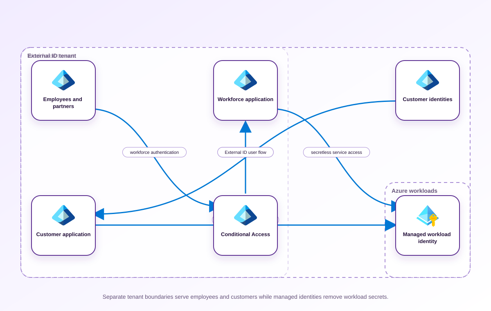

<!-- BEGIN GENERATED AZ305 V1 -->
# LAB-03 — Authentication and Identity Management Architecture

## 1. Navigation

[← LAB-02](../02-monitoring-alerts-visibility/README.md) · [Lab catalog](../README.md) · [LAB-04 →](../04-azure-hybrid-authorization/README.md)

## 2. Scenario and completion contract

Northwind Health is modernizing an employee application, a partner collaboration site, and a new patient-facing application. Architects disagree whether all identities belong in the workforce tenant and whether a historical Azure AD B2C pattern should be copied for the patient experience. You must recommend tenant boundaries, Microsoft Entra External ID for the new customer identity scenario, federation and authentication methods, Conditional Access, application registrations, and managed workload identities. The design must account for regulated attributes, self-service journeys, privileged administration, protocol compatibility, and lifecycle ownership. Use GA Microsoft Graph PowerShell inspection commands only and leave post-authentication Azure authorization decisions to Lab 04.

- Architect role: Identity and authentication architect
- Outcome: A tenant and authentication architecture that separates workforce, partner, customer, and workload identities with modern controls.
- Duration: 165 minutes
- Difficulty: advanced
- Cost class: low
- Completion: all five checkpoint assertions, final validation, decision revision, and cleanup review are complete.

## 3. Objective-to-evidence map

| Objective | Requirement | Checkpoint |
| --- | --- | --- |
| `IGM-AUTH-01` | `LAB03-REQ-01` | [`LAB03-CP01`](#checkpoint-1) |
| `IGM-AUTH-02` | `LAB03-REQ-02` | [`LAB03-CP02`](#checkpoint-2) |
| `IGM-AUTH-01` | `LAB03-REQ-03` | [`LAB03-CP03`](#checkpoint-3) |
| `IGM-AUTH-02` | `LAB03-REQ-04` | [`LAB03-CP04`](#checkpoint-4) |
| `IGM-AUTH-01` | `LAB03-REQ-05` | [`LAB03-CP05`](#checkpoint-5) |

## 4. Business and quality requirements

Business outcome: Provide secure low-friction sign-in for three populations while reducing credential and tenant-boundary risk.

- `LAB03-REQ-01` — Workforce, partner, customer, and workload identities have explicit tenant placement and data ownership.
- `LAB03-REQ-02` — Each application has a supported OIDC or SAML pattern, audience, redirect ownership, and least-privilege API consent plan.
- `LAB03-REQ-03` — Phishing-resistant workforce methods, customer journey methods, bootstrap, and account recovery are deliberately separated.
- `LAB03-REQ-04` — Baseline, privileged, workload, guest, and customer access controls have explicit scope, exclusions, and rollout mode.
- `LAB03-REQ-05` — Azure-hosted components use system- or user-assigned managed identities with documented lifecycle ownership.

Scenario facts:

- **Data:** Directory profiles contain identifiers and authentication attributes; regulated health facts remain in the application data boundary.
- **Scale:** Three identity populations have different issuers and lifecycle owners; monthly active customer count remains a sizing input.
- **Latency:** Interactive sign-in must avoid avoidable cross-system lookups, while profile enrichment occurs after token validation.
- **Availability:** Workforce and customer sign-in failure domains are separated so an external journey incident does not block employee administration.
- **RTO:** Identity-service recovery targets inherit the application access objective and require an owner decision before production approval.
- **RPO:** Directory object recovery and application-profile recovery are separate; no numerical identity RPO is supplied.
- **Budget:** Managed federation and External ID usage are compared with the support and security cost of custom credentials.

Constraints:

- Employees, partners, and customers require distinct trust, lifecycle, and authentication journeys.
- Health attributes must remain outside the external directory even when the mobile journey uses native authentication and social federation.
- Use only the PowerShell/Graph command lane for learner implementation.
- Keep all live changes behind explicit execution and acknowledgement switches.
- Retain only sanitized command evidence and synthetic fixture identifiers.

Assumptions:

- The application can resolve a directory subject to a profile held in an authorized health-data store.
- New customer identity design uses Microsoft Entra External ID rather than Azure AD B2C.
- West Europe is the configurable primary example and North Europe is the configurable secondary example.
- The learner has administrator-level Azure operations knowledge but receives no pre-existing authenticated context.
- Offline fixtures demonstrate contract behavior rather than live Azure service behavior.

## 5. Architecture diagram and walkthrough



The flow begins with the business outcome, crosses five independently validated design capabilities, and ends with positive and negative evidence. The SVG is deterministically rendered from `diagrams/architecture.mmd`.

## 6. Concept primer and candidate architectures

Architecture decisions translate measurable requirements into a deliberate service and operating model. A candidate is viable only when every mandatory constraint is met; convenience or familiarity cannot compensate for a disqualifier.

- **Workforce tenant plus a dedicated External ID external tenant and managed identities** (eligible) — Separate workforce and external directories establish clear policy boundaries while managed identities remove application secrets from service access.
- **Single workforce tenant for employees partners and customers** (eligible) — One tenant simplifies administration but couples customer journeys, workforce controls, and regulated profile exposure.
- **Separate workforce tenants with custom application-managed customer credentials** (eligible) — Multiple workforce tenants isolate organizations, but custom password storage transfers authentication defense and recovery to the application team.
- **New Azure AD B2C tenant storing patient profile attributes** (ineligible) — This legacy-oriented proposal combines a superseded new-design direction with prohibited health-profile storage. Disqualifier: LAB03-REQ-03 requires the current External ID service boundary and excludes regulated health attributes from directory profiles.

## 7. Decision, ADR, and Well-Architected review

Criteria weights are C1 30, C2 25, C3 20, C4 15, and C5 10. Weighted totals use `sum(weight × score) / 5`.

| Candidate | Eligible | C1 | C2 | C3 | C4 | C5 | Weighted /100 |
| --- | ---: | ---: | ---: | ---: | ---: | ---: | ---: |
| Workforce tenant plus a dedicated External ID external tenant and managed identities | yes | 5 | 4 | 5 | 4 | 4 | 90 |
| Single workforce tenant for employees partners and customers | yes | 3 | 4 | 2 | 4 | 4 | 66 |
| Separate workforce tenants with custom application-managed customer credentials | yes | 3 | 3 | 2 | 2 | 3 | 53 |
| New Azure AD B2C tenant storing patient profile attributes | no | 1 | 3 | 1 | 2 | 3 | 37 |

Selected design: **Workforce tenant plus a dedicated External ID external tenant and managed identities**. `ADR-LAB03-001` records the accepted reasoning. Review Reliability, Security, Cost Optimization, Operational Excellence, and Performance Efficiency in `design/decision.yml`; no pillar is implied by another.

Rejected alternatives:

- **Single workforce tenant for employees partners and customers:** Its weak trust-boundary score outweighs the operational convenience of one directory.
- **Separate workforce tenants with custom application-managed customer credentials:** Custom customer credentials create avoidable security and lifecycle ownership that managed External ID provides.
- **New Azure AD B2C tenant storing patient profile attributes:** It is disqualified by both the current-service and data-boundary requirements.

Architecture risks:

- **Risk:** Subject-to-profile mapping could expose health attributes in tokens or directory extension fields. **Mitigation:** Use an opaque subject key and assert that issued claims and external user objects contain no regulated fields.
- **Risk:** Social identity-provider failure can prevent a customer cohort from signing in. **Mitigation:** Define provider-specific monitoring, recovery communication, and an approved alternate authentication journey.

Well-Architected consequences:

- **Reliability:** Separate populations and provider-aware journeys contain authentication failure to the affected trust path.
- **Security:** External ID, minimal claims, managed identities, and isolated health profiles reduce credential and data exposure.
- **Cost Optimization:** Monthly-active-user billing and managed federation avoid funding custom password infrastructure.
- **Operational Excellence:** Lifecycle owners and journey-specific evidence make failed federation and provisioning easier to diagnose.
- **Performance Efficiency:** Tokens carry only authorization context and defer regulated profile retrieval to the workload data tier.

ADR consequences:

- Application teams must maintain the opaque link between external subjects and health profiles.
- Identity operations now own two tenant policy surfaces and provider-specific runbooks.

## 8. Inputs, permissions, licensing, cost, and analogue

Use configurable `Location` (`AZ305_LOCATION`, default West Europe) and `SecondaryLocation` (`AZ305_SECONDARY_LOCATION`, default North Europe). Every public input has an explicit `AZ305_*` fallback. Preview is the default; only Golden Lab 00 writes an intent-only `execute: false` preview record. Before an executed cloud command, the supplied subscription and tenant must exactly match the active CLI, Az, and—where applicable—Microsoft Graph contexts. `-Execute` crosses the execution boundary; cost-bearing and tenant-scoped paths also require their independent acknowledgement switches.

Safe analogue: Inspect synthetic tenant, app, claim, and lifecycle fixtures; do not connect to Graph or create any directory object.

Permissions: Directory Readers is sufficient for discovery; any External ID, application, federation, or consent change requires a dedicated approved directory role and tenant-change acknowledgement.

Licensing: External ID monthly active user pricing and workforce Conditional Access or governance entitlements must be assessed separately.

Cost boundary: Compare active external-user volume, federation operations, help-desk recovery load, and custom identity-code maintenance.

## 9. Read-only preflight

```powershell
pwsh ./scripts/azure-powershell/Preflight.ps1 -RunId synthetic-030001
```

Synthetic sample: `{"labId":"LAB-03","track":"azure-powershell","result":"pass","note":"Local tool discovery only"}`. This is illustrative local output, not evidence captured from Azure.

## 10. Five guided checkpoints

### Checkpoint 1: Establish identity population and tenant boundaries

<a id="checkpoint-1"></a>

**Trace:** `IGM-AUTH-01` → `LAB03-REQ-01` → `LAB03-CP01`

```powershell
Get-MgOrganization
```

Expected evidence: Workforce, partner, customer, and workload identities have explicit tenant placement and data ownership. Retain Synthetic tenant labels, boundary rationale, identity population, residency constraint, and administrative owner.

Positive assertion:

```powershell
Get-MgOrganization -Property Id,DisplayName,VerifiedDomains,TenantType
```

Negative assertion:

```powershell
Get-MgOrganization -Property VerifiedDomains | Where-Object { $_.VerifiedDomains.Name -like '*.invalid' }
```

Failure and retry: A business population has conflicting collaboration, residency, or branding requirements. Split the population decision and evaluate the constraint against a dedicated external tenant.

Cleanup dependency: This design checkpoint is read-only and creates no directory object.

WAF consequence: Reliability: explicit tenant ownership and emergency administration make each identity control plane recoverable.

### Checkpoint 2: Select protocols and application registrations

<a id="checkpoint-2"></a>

**Trace:** `IGM-AUTH-02` → `LAB03-REQ-02` → `LAB03-CP02`

```powershell
Get-MgApplication -Filter "displayName eq '$AppDisplayName'" -Property Id,AppId,DisplayName,SignInAudience,Web,Spa
```

Expected evidence: Each application has a supported OIDC or SAML pattern, audience, redirect ownership, and least-privilege API consent plan. Retain Synthetic application label, protocol, audience, redirect class, and permission rationale without credentials.

Positive assertion:

```powershell
Get-MgApplication -Filter "displayName eq '$AppDisplayName'" -Property AppId,SignInAudience,RequiredResourceAccess
```

Negative assertion:

```powershell
Get-MgApplication -Filter "displayName eq '$AppDisplayName'" -Property PasswordCredentials | Where-Object { $_.PasswordCredentials.EndDateTime -gt (Get-Date).AddYears(1) }
```

Failure and retry: A legacy application cannot support modern federation or secure redirect handling. Introduce an identity-aware modernization facade or isolate the legacy protocol with compensating controls.

Cleanup dependency: No application is removed automatically; tenant changes require explicit acknowledgement and exact object ownership.

WAF consequence: Performance Efficiency: standardized federation avoids duplicating credential validation and identity stores in each application.

### Checkpoint 3: Design authentication methods and recovery

<a id="checkpoint-3"></a>

**Trace:** `IGM-AUTH-01` → `LAB03-REQ-03` → `LAB03-CP03`

```powershell
Get-MgPolicyAuthenticationMethodPolicy
```

Expected evidence: Phishing-resistant workforce methods, customer journey methods, bootstrap, and account recovery are deliberately separated. Retain Method-class matrix, population scope, recovery owner, rollout dependency, and exception expiry.

Positive assertion:

```powershell
Get-MgPolicyAuthenticationMethodPolicy -Property Id,DisplayName,PolicyVersion,RegistrationEnforcement
```

Negative assertion:

```powershell
Get-MgPolicyAuthenticationMethodPolicyAuthenticationMethodConfiguration | Where-Object { $_.State -eq 'enabled' -and $_.Id -eq 'Email' }
```

Failure and retry: The target population lacks compatible devices or a safe bootstrap channel. Phase registration with Temporary Access Pass or an approved customer method and time-bound exceptions.

Cleanup dependency: No authentication-method policy is changed by this inspection-only checkpoint.

WAF consequence: Operational Excellence: phased registration and owned recovery paths make strong authentication supportable.

### Checkpoint 4: Evaluate Conditional Access architecture

<a id="checkpoint-4"></a>

**Trace:** `IGM-AUTH-02` → `LAB03-REQ-04` → `LAB03-CP04`

```powershell
Get-MgIdentityConditionalAccessPolicy -All
```

Expected evidence: Baseline, privileged, workload, guest, and customer access controls have explicit scope, exclusions, and rollout mode. Retain Synthetic policy matrix, included populations, excluded emergency accounts, grant controls, and rollout stage.

Positive assertion:

```powershell
Get-MgIdentityConditionalAccessPolicy -All | Where-Object { $_.State -in @('enabled','enabledForReportingButNotEnforced') }
```

Negative assertion:

```powershell
Get-MgIdentityConditionalAccessPolicy -All | Where-Object { $_.State -eq 'enabled' -and $_.Conditions.Users.IncludeUsers -contains 'All' -and $_.Conditions.Users.ExcludeUsers.Count -eq 0 }
```

Failure and retry: Overlapping policies create an untested lockout path or contradict a customer journey. Evaluate policies in report-only mode against synthetic personas and resolve overlap before enforcement.

Cleanup dependency: No policy mutation or deletion occurs; real tenant values are never retained.

WAF consequence: Security: contextual access policies strengthen verification while protecting an explicit emergency path.

### Checkpoint 5: Prefer managed workload identities

<a id="checkpoint-5"></a>

**Trace:** `IGM-AUTH-01` → `LAB03-REQ-05` → `LAB03-CP05`

```powershell
Get-MgServicePrincipal -Filter "displayName eq '$WorkloadIdentityName'" -Property Id,AppId,DisplayName,ServicePrincipalType,AlternativeNames
```

Expected evidence: Azure-hosted components use system- or user-assigned managed identities with documented lifecycle ownership. Retain Synthetic workload identity label, identity type, lifecycle owner, token audience, and downstream dependency.

Positive assertion:

```powershell
Get-MgServicePrincipal -Filter "displayName eq '$WorkloadIdentityName'" -Property Id,ServicePrincipalType,AccountEnabled
```

Negative assertion:

```powershell
Get-MgServicePrincipal -Filter "displayName eq '$WorkloadIdentityName'" -Property PasswordCredentials | Where-Object { $_.PasswordCredentials.Count -gt 0 }
```

Failure and retry: The destination service or hosting model does not support the required managed identity flow. Evaluate workload identity federation or a certificate credential stored in Key Vault with a short rotation interval.

Cleanup dependency: Directory objects are never deleted automatically; any future cleanup requires exact IDs and tenant-change acknowledgement.

WAF consequence: Cost Optimization: reusable user-assigned identities are introduced only when their independent lifecycle justifies administration.

## 11. Final validation and interpretation

Run `Validate.ps1 -Mode Deployment -Execute` only after an executed run has state and you are authorized to issue the ten read-only checkpoint inspections. Without `-Execute`, ordinary deployment validation records `partial` and exits `2`; Golden Lab 00 alone can validate its intent-only preview locally. Exit `0` means all required assertions pass, `1` means at least one failed, and `2` means the outcome is gated or partial. Positive and negative commands execute independently, so one failure never suppresses its paired assertion.

## 12. Material change request

A mobile patient application now requires native authentication and social federation while a regulator forbids health attributes from being stored in the customer directory; revise the journey and profile-data boundary.

Revised solution: select **Workforce tenant plus a dedicated External ID external tenant and managed identities**. LAB03-REQ-03 makes the native and social authentication journey mandatory, so External ID is retained with opaque subject claims that never write health attributes to the directory.

Revised Well-Architected consequences:

- **Reliability:** Provider-specific fallback and monitoring isolate a social federation disruption.
- **Security:** Opaque subject claims keep regulated data outside the external directory and tokens.
- **Cost Optimization:** Managed native authentication avoids developing and auditing a password service.
- **Operational Excellence:** Journey tests separately verify federation, token claims, and profile lookup.
- **Performance Efficiency:** Minimal tokens reduce sign-in payload and leave profile queries to the regional application store.

## 13. Architect job challenge

Compare browser-delegated and native authentication for the changed patient journey and justify where custom business logic executes.

## 14. Troubleshooting, cleanup, and residual verification

- Separate workforce B2B collaboration from customer CIAM when user types appear similar.
- Validate application audience, redirect type, and consent requirements as independent decisions.
- Preserve emergency access and report-only evaluation when diagnosing overlapping Conditional Access controls.

Cleanup previews nonempty state in reverse dependency order, writes `partial`, and exits `2`; an already empty run is completed locally and idempotently. Executed cleanup rechecks the exact live ID plus `purpose`, `labId`, `runId`, and `expiresOn` immediately before each removal, persists state after every absent or removed object, stops on the first dependency failure, and refuses unresolved pre-existing settings. It never automates purge. Finish with `Validate.ps1 -Mode PostCleanup`; the required residual count is zero.

## 15. Exam debrief, assessment, sources, and navigation

Explain the recommendation in terms of requirements, rejected alternatives, failure behavior, and all five WAF pillars. Complete `assessment/QUESTIONS.md`, then use the separately excluded answer key for remediation.

- [Overview of Microsoft Entra External ID in external tenants](https://learn.microsoft.com/en-us/entra/external-id/customers/overview-customers-ciam)
- [Azure Well-Architected Framework](https://learn.microsoft.com/en-us/azure/well-architected/)

[← LAB-02](../02-monitoring-alerts-visibility/README.md) · [Lab catalog](../README.md) · [LAB-04 →](../04-azure-hybrid-authorization/README.md)

## 16. Synchronized lifecycle-script appendix

### Preflight.ps1

```powershell
[CmdletBinding()]
param(
    [string]$SubscriptionId = $env:AZ305_SUBSCRIPTION_ID,
    [string]$TenantId = $env:AZ305_TENANT_ID,
    [ValidatePattern('^[a-z0-9-]{6,64}$')][string]$RunId = $env:AZ305_RUN_ID,
    [string]$Location = $(if ($env:AZ305_LOCATION) { $env:AZ305_LOCATION } else { 'westeurope' }),
    [string]$SecondaryLocation = $(if ($env:AZ305_SECONDARY_LOCATION) { $env:AZ305_SECONDARY_LOCATION } else { 'northeurope' }),
    [string]$ResourceGroup = $(if ($env:AZ305_RESOURCE_GROUP) { $env:AZ305_RESOURCE_GROUP } else { "rg-az305-$RunId" }),
    [string]$WorkloadName = $(if ($env:AZ305_WORKLOAD_NAME) { $env:AZ305_WORKLOAD_NAME } else { "az305-$RunId" }),
    [string]$ExpiresOn = $(if ($env:AZ305_EXPIRES_ON) { $env:AZ305_EXPIRES_ON } else { (Get-Date).ToUniversalTime().AddDays(1).ToString('yyyy-MM-dd') }),
    [string]$AppDisplayName = $env:AZ305_APP_DISPLAY_NAME,
    [string]$WorkloadIdentityName = $env:AZ305_WORKLOAD_IDENTITY_NAME,
    [switch]$Execute,
    [switch]$AcknowledgeCost,
    [switch]$AcknowledgeTenantChange
)

$ErrorActionPreference = 'Stop'
$PSNativeCommandUseErrorActionPreference = $true
if (-not $RunId) { [Console]::Error.WriteLine('RunId or AZ305_RUN_ID is required.'); exit 2 }
# Every lifecycle entrypoint intentionally exposes the same public parameter contract.
@($SubscriptionId, $TenantId, $RunId, $Location, $SecondaryLocation, $ResourceGroup, $WorkloadName, $ExpiresOn, $AppDisplayName, $WorkloadIdentityName, $Execute, $AcknowledgeCost, $AcknowledgeTenantChange) | Out-Null

$requiredCommands = @('pwsh')
$missing = @($requiredCommands | Where-Object { -not (Get-Command $_ -ErrorAction SilentlyContinue) })
if ($missing.Count -gt 0) {
    Write-Error "Missing local commands: $($missing -join ', ')"
    exit 1
}
$requiredCmdlets = @('Get-MgApplication', 'Get-MgIdentityConditionalAccessPolicy', 'Get-MgOrganization', 'Get-MgPolicyAuthenticationMethodPolicy', 'Get-MgPolicyAuthenticationMethodPolicyAuthenticationMethodConfiguration', 'Get-MgServicePrincipal')
$missingCmdlets = @($requiredCmdlets | Where-Object { -not (Get-Command $_ -ErrorAction SilentlyContinue) })
if ($missingCmdlets.Count -gt 0) {
    Write-Error "Missing local cmdlets: $($missingCmdlets -join ', ')"
    exit 1
}
if (Get-Module -ListAvailable -Name 'Microsoft.Graph.Beta*') { throw 'Microsoft.Graph Beta modules are not permitted.' }

[pscustomobject]@{
    labId = 'LAB-03'
    track = 'azure-powershell'
    implementationMode = 'safe-analogue'
    result = 'pass'
    note = 'Local tool discovery only; no Azure or Microsoft Graph request was made.'
} | ConvertTo-Json
exit 0
```

### Setup.ps1

```powershell
[CmdletBinding()]
param(
    [string]$SubscriptionId = $env:AZ305_SUBSCRIPTION_ID,
    [string]$TenantId = $env:AZ305_TENANT_ID,
    [ValidatePattern('^[a-z0-9-]{6,64}$')][string]$RunId = $env:AZ305_RUN_ID,
    [string]$Location = $(if ($env:AZ305_LOCATION) { $env:AZ305_LOCATION } else { 'westeurope' }),
    [string]$SecondaryLocation = $(if ($env:AZ305_SECONDARY_LOCATION) { $env:AZ305_SECONDARY_LOCATION } else { 'northeurope' }),
    [string]$ResourceGroup = $(if ($env:AZ305_RESOURCE_GROUP) { $env:AZ305_RESOURCE_GROUP } else { "rg-az305-$RunId" }),
    [string]$WorkloadName = $(if ($env:AZ305_WORKLOAD_NAME) { $env:AZ305_WORKLOAD_NAME } else { "az305-$RunId" }),
    [string]$ExpiresOn = $(if ($env:AZ305_EXPIRES_ON) { $env:AZ305_EXPIRES_ON } else { (Get-Date).ToUniversalTime().AddDays(1).ToString('yyyy-MM-dd') }),
    [string]$AppDisplayName = $env:AZ305_APP_DISPLAY_NAME,
    [string]$WorkloadIdentityName = $env:AZ305_WORKLOAD_IDENTITY_NAME,
    [switch]$Execute,
    [switch]$AcknowledgeCost,
    [switch]$AcknowledgeTenantChange
)

$ErrorActionPreference = 'Stop'
$PSNativeCommandUseErrorActionPreference = $true
if (-not $RunId) { [Console]::Error.WriteLine('RunId or AZ305_RUN_ID is required.'); exit 2 }
# Every lifecycle entrypoint intentionally exposes the same public parameter contract.
@($SubscriptionId, $TenantId, $RunId, $Location, $SecondaryLocation, $ResourceGroup, $WorkloadName, $ExpiresOn, $AppDisplayName, $WorkloadIdentityName, $Execute, $AcknowledgeCost, $AcknowledgeTenantChange) | Out-Null

$LabRoot = Split-Path (Split-Path $PSScriptRoot -Parent) -Parent
$StateRoot = Join-Path $LabRoot ".state/$RunId"
$StatePath = Join-Path $StateRoot 'run.json'

function Assert-ExactExecutionContext {
    [CmdletBinding()]
    param([string]$ExpectedSubscriptionId, [string]$ExpectedTenantId)
    # SubscriptionId remains part of the uniform lifecycle contract; Graph context is tenant-scoped.
    $null = $ExpectedSubscriptionId
    if ([string]::IsNullOrWhiteSpace($ExpectedTenantId)) { throw 'TenantId is required before a Microsoft Graph request.' }
    $graphContext = Get-MgContext -ErrorAction Stop
    if (-not $graphContext -or [string]$graphContext.TenantId -ine $ExpectedTenantId) {
        throw 'The active Microsoft Graph tenant does not exactly match the requested tenant.'
    }
}

function Save-RunState {
    [CmdletBinding()]
    param([Parameter(Mandatory)]$State)
    $temporaryPath = "$StatePath.tmp"
    $State | ConvertTo-Json -Depth 20 | Set-Content -LiteralPath $temporaryPath -Encoding utf8NoBOM
    Move-Item -LiteralPath $temporaryPath -Destination $StatePath -Force
}

function Assert-SafeStateValue {
    [CmdletBinding()]
    param($Value)
    $serialized = $Value | ConvertTo-Json -Depth 12 -Compress
    if ($serialized -match '(?i)"(?:token|password|secret|certificate|connectionString|sas|clientSecret|accessToken|refreshToken|accountKey|privateKey)"\s*:') {
        throw 'A prohibited sensitive field name was returned; state capture is refused.'
    }
}

function Convert-CheckpointOutput {
    [CmdletBinding()]
    param($Value)
    if ($Value -is [string]) { $raw = [string]$Value }
    elseif ($Value -is [System.Collections.IEnumerable] -and @($Value | Where-Object { $_ -isnot [string] }).Count -eq 0) { $raw = @($Value) -join "`n" }
    else { return $Value }
    if ([string]::IsNullOrWhiteSpace($raw)) { return $null }
    try { return ($raw | ConvertFrom-Json -Depth 100) } catch { return $Value }
}

function Get-ReturnedResourceId {
    [CmdletBinding()]
    param($Value)
    $seen = [System.Collections.Generic.HashSet[string]]::new([System.StringComparer]::OrdinalIgnoreCase)
    $results = [System.Collections.Generic.List[string]]::new()
    function Add-ArmId {
        param($Candidate)
        if ($Candidate -is [string] -and $Candidate -match '^/subscriptions/[0-9a-f-]+/(?:resourceGroups/[^/]+(?:/providers/.+)?|providers/.+)$' -and $Candidate -notmatch '/providers/Microsoft\.Resources/deployments/') {
            if ($seen.Add($Candidate)) { $results.Add($Candidate) }
        }
    }
    function Find-DeploymentOutputId {
        param($Item, [int]$Depth)
        if ($null -eq $Item -or $Depth -gt 12) { return }
        if ($Item -is [string]) { Add-ArmId -Candidate $Item; return }
        if ($Item -is [System.Collections.IDictionary]) { foreach ($key in $Item.Keys) { Find-DeploymentOutputId -Item $Item[$key] -Depth ($Depth + 1) }; return }
        if ($Item -is [System.Collections.IEnumerable]) { foreach ($entry in $Item) { Find-DeploymentOutputId -Item $entry -Depth ($Depth + 1) }; return }
        foreach ($property in @($Item.PSObject.Properties | Where-Object { $_.MemberType -in @('NoteProperty', 'Property') })) { Find-DeploymentOutputId -Item $property.Value -Depth ($Depth + 1) }
    }
    foreach ($rootItem in @($Value)) {
        if ($rootItem -is [System.Collections.IDictionary]) {
            foreach ($name in @('id', 'resourceId')) { if ($rootItem.Contains($name)) { Add-ArmId -Candidate $rootItem[$name] } }
            if ($rootItem.Contains('properties') -and $rootItem.properties -and $rootItem.properties.outputs) { Find-DeploymentOutputId -Item $rootItem.properties.outputs -Depth 0 }
            continue
        }
        foreach ($name in @('Id', 'ResourceId')) {
            $property = $rootItem.PSObject.Properties[$name]
            if ($property) { Add-ArmId -Candidate $property.Value }
        }
        if ($rootItem.PSObject.Properties['Properties'] -and $rootItem.Properties -and $rootItem.Properties.outputs) {
            Find-DeploymentOutputId -Item $rootItem.Properties.outputs -Depth 0
        }
    }
    return @($results)
}

function Get-PlannedDeploymentResourceId {
    [CmdletBinding()]
    param($Value)
    $seen = [System.Collections.Generic.HashSet[string]]::new([System.StringComparer]::OrdinalIgnoreCase)
    $results = [System.Collections.Generic.List[string]]::new()
    foreach ($change in @($Value.changes)) {
        $candidate = [string]$change.resourceId
        if ($candidate -match '^/subscriptions/[0-9a-f-]+/(?:resourceGroups/[^/]+(?:/providers/.+)?|providers/.+)$' -and $candidate -notmatch '/providers/Microsoft\.Resources/deployments/' -and $seen.Add($candidate)) {
            $results.Add($candidate)
        }
    }
    return @($results)
}

function Assert-InputSubscriptionScope {
    [CmdletBinding()]
    param($Inputs, [string]$ExpectedSubscriptionId)
    $entries = if ($Inputs -is [System.Collections.IDictionary]) {
        @($Inputs.GetEnumerator())
    } else {
        @($Inputs.PSObject.Properties | ForEach-Object { [pscustomobject]@{ Key = $_.Name; Value = $_.Value } })
    }
    foreach ($entry in $entries) {
        if ($entry.Value -is [string] -and [string]$entry.Value -match '^/subscriptions/([^/]+)/') {
            if ($Matches[1] -ine $ExpectedSubscriptionId) { throw "Input $($entry.Key) belongs to a different subscription." }
        }
    }
}

function Assert-ManagedMutation {
    [CmdletBinding()]
    param($State, [string]$CheckpointId, [bool]$CarriesOwnership, [object[]]$TargetResourceIds)
    if ($CarriesOwnership) { return }
    $targets = @($TargetResourceIds | Where-Object { $_ -is [string] -and $_ -match '^/subscriptions/' })
    if ($targets.Count -eq 0) { throw "$CheckpointId refuses an untagged mutation because no exact ARM target ID was supplied." }
    $knownIds = @($State.managedObjects | ForEach-Object { [string]$_.id })
    if ($knownIds.Count -eq 0) { throw "$CheckpointId refuses to modify a pre-existing object because no run-owned parent has been recorded." }
    foreach ($target in $targets) {
        $related = @($knownIds | Where-Object { $target -ieq $_ -or $target.StartsWith("$_/", [System.StringComparison]::OrdinalIgnoreCase) -or $_.StartsWith("$target/", [System.StringComparison]::OrdinalIgnoreCase) }).Count -gt 0
        if (-not $related) { throw "$CheckpointId refuses a mutation outside the exact run-owned resource boundary." }
    }
}

$executionInputs = [ordered]@{ subscriptionId = $SubscriptionId; tenantId = $TenantId; location = $Location; secondaryLocation = $SecondaryLocation; resourceGroup = $ResourceGroup; workloadName = $WorkloadName; expiresOn = $ExpiresOn; AppDisplayName = $AppDisplayName; WorkloadIdentityName = $WorkloadIdentityName }

if (-not $Execute) {
    Write-Output '[preview] No cloud command was called and no state was created.'
    Write-Output '[preview] Re-run with -Execute only in an authorized disposable environment.'
    exit 0
}
# This setup is compatible with the lab implementation mode.
# This default exercise does not require a cost acknowledgement.
if (-not $AcknowledgeTenantChange) { [Console]::Error.WriteLine('Tenant-change acknowledgement is required.'); exit 2 }
$requiredLabInputs = [ordered]@{ AppDisplayName = $AppDisplayName; WorkloadIdentityName = $WorkloadIdentityName }
$missingLabInputs = @($requiredLabInputs.GetEnumerator() | Where-Object { $_.Value -is [string] -and [string]::IsNullOrWhiteSpace([string]$_.Value) } | ForEach-Object Key)
if ($missingLabInputs.Count -gt 0) { [Console]::Error.WriteLine("Execution is gated; supply: $($missingLabInputs -join ', ')."); exit 2 }

try {
    Assert-ExactExecutionContext -ExpectedSubscriptionId $SubscriptionId -ExpectedTenantId $TenantId
    Assert-InputSubscriptionScope -Inputs $executionInputs -ExpectedSubscriptionId $SubscriptionId
    Assert-SafeStateValue -Value $executionInputs
}
catch {
    [Console]::Error.WriteLine("Execution is gated by context or input validation: $($_.Exception.Message)")
    exit 2
}

# Recovery state is persisted before the first possible mutation below.
if (Test-Path -LiteralPath $StatePath) {
    [Console]::Error.WriteLine('Run state already exists. Choose a new RunId or complete the recorded cleanup; existing recovery state will not be overwritten.')
    exit 2
}
New-Item -ItemType Directory -Path $StateRoot -Force | Out-Null
$state = [ordered]@{
    schemaVersion = '1.0.0'; labId = 'LAB-03'; runId = $RunId; track = 'azure-powershell'
    implementationMode = 'safe-analogue'; status = 'initialized'
    createdAt = (Get-Date).ToUniversalTime().ToString('o'); execute = $true
    parameters = $executionInputs
    managedObjects = @(); originalSettings = @()
}
Save-RunState -State $state
$state.status = 'deploying'
Save-RunState -State $state

$originalLocation = Get-Location
try {
    Set-Location -LiteralPath $LabRoot
    # 03-CP01: Establish identity population and tenant boundaries
    $stepResult = & { Get-MgOrganization }
    $null = $stepResult

    # 03-CP02: Select protocols and application registrations
    $stepResult = & { Get-MgApplication -Filter "displayName eq '$AppDisplayName'" -Property Id,AppId,DisplayName,SignInAudience,Web,Spa }
    $null = $stepResult

    # 03-CP03: Design authentication methods and recovery
    $stepResult = & { Get-MgPolicyAuthenticationMethodPolicy }
    $null = $stepResult

    # 03-CP04: Evaluate Conditional Access architecture
    $stepResult = & { Get-MgIdentityConditionalAccessPolicy -All }
    $null = $stepResult

    # 03-CP05: Prefer managed workload identities
    $stepResult = & { Get-MgServicePrincipal -Filter "displayName eq '$WorkloadIdentityName'" -Property Id,AppId,DisplayName,ServicePrincipalType,AlternativeNames }
    $null = $stepResult

    $state.status = 'deployed'
    Save-RunState -State $state
} catch {
    $state.status = 'failed'
    Save-RunState -State $state
    Write-Error $_
    exit 1
} finally {
    Set-Location -LiteralPath $originalLocation
}
exit 0
```

### Validate.ps1

```powershell
[CmdletBinding()]
param(
    [string]$SubscriptionId = $env:AZ305_SUBSCRIPTION_ID,
    [string]$TenantId = $env:AZ305_TENANT_ID,
    [ValidatePattern('^[a-z0-9-]{6,64}$')][string]$RunId = $env:AZ305_RUN_ID,
    [string]$Location = $(if ($env:AZ305_LOCATION) { $env:AZ305_LOCATION } else { 'westeurope' }),
    [string]$SecondaryLocation = $(if ($env:AZ305_SECONDARY_LOCATION) { $env:AZ305_SECONDARY_LOCATION } else { 'northeurope' }),
    [string]$ResourceGroup = $(if ($env:AZ305_RESOURCE_GROUP) { $env:AZ305_RESOURCE_GROUP } else { "rg-az305-$RunId" }),
    [string]$WorkloadName = $(if ($env:AZ305_WORKLOAD_NAME) { $env:AZ305_WORKLOAD_NAME } else { "az305-$RunId" }),
    [string]$ExpiresOn = $(if ($env:AZ305_EXPIRES_ON) { $env:AZ305_EXPIRES_ON } else { (Get-Date).ToUniversalTime().AddDays(1).ToString('yyyy-MM-dd') }),
    [string]$AppDisplayName = $env:AZ305_APP_DISPLAY_NAME,
    [string]$WorkloadIdentityName = $env:AZ305_WORKLOAD_IDENTITY_NAME,
    [ValidateSet('Deployment', 'PostCleanup')][string]$Mode = 'Deployment',
    [switch]$Execute,
    [switch]$AcknowledgeCost,
    [switch]$AcknowledgeTenantChange
)

$ErrorActionPreference = 'Stop'
$PSNativeCommandUseErrorActionPreference = $true
if (-not $RunId) { [Console]::Error.WriteLine('RunId or AZ305_RUN_ID is required.'); exit 2 }
# Every lifecycle entrypoint intentionally exposes the same public parameter contract.
@($SubscriptionId, $TenantId, $RunId, $Location, $SecondaryLocation, $ResourceGroup, $WorkloadName, $ExpiresOn, $AppDisplayName, $WorkloadIdentityName, $Mode, $Execute, $AcknowledgeCost, $AcknowledgeTenantChange) | Out-Null

$LabRoot = Split-Path (Split-Path $PSScriptRoot -Parent) -Parent
$StateRoot = Join-Path $LabRoot ".state/$RunId"
$RunPath = Join-Path $StateRoot 'run.json'
$ValidationPath = Join-Path $StateRoot 'validation.json'

function Assert-ExactExecutionContext {
    [CmdletBinding()]
    param([string]$ExpectedSubscriptionId, [string]$ExpectedTenantId)
    # SubscriptionId remains part of the uniform lifecycle contract; Graph context is tenant-scoped.
    $null = $ExpectedSubscriptionId
    if ([string]::IsNullOrWhiteSpace($ExpectedTenantId)) { throw 'TenantId is required before a Microsoft Graph request.' }
    $graphContext = Get-MgContext -ErrorAction Stop
    if (-not $graphContext -or [string]$graphContext.TenantId -ine $ExpectedTenantId) {
        throw 'The active Microsoft Graph tenant does not exactly match the requested tenant.'
    }
}


if (-not (Test-Path -LiteralPath $RunPath)) {
    Write-Warning 'No run state exists; validation is gated.'
    exit 2
}
$state = Get-Content -LiteralPath $RunPath -Raw | ConvertFrom-Json
$assertions = [System.Collections.Generic.List[object]]::new()
function Add-ValidationAssertion {
    [CmdletBinding()]
    param([string]$Id, [ValidateSet('positive', 'negative')][string]$Kind, [bool]$Passed, [string]$Message)
    $assertions.Add([pscustomobject]@{ id = $Id; kind = $Kind; passed = $Passed; message = $Message })
}

function Save-ValidationArtifact {
    [CmdletBinding()]
    param([ValidateSet('pass', 'partial', 'fail')][string]$Result)
    $artifact = [ordered]@{ schemaVersion = '1.0.0'; labId = 'LAB-03'; runId = $RunId; mode = $Mode; result = $Result; validatedAt = (Get-Date).ToUniversalTime().ToString('o'); assertions = @($assertions) }
    $artifact | ConvertTo-Json -Depth 12 | Set-Content -LiteralPath $ValidationPath -Encoding utf8NoBOM
}

function Test-PositiveEvidence {
    [CmdletBinding()]
    param($Value)
    if ($Value -is [bool]) { return $Value }
    if ($null -eq $Value) { return $false }
    if ($Value -is [string]) { return -not [string]::IsNullOrWhiteSpace($Value) }
    if ($Value -is [System.Collections.IEnumerable]) { return @($Value).Count -gt 0 }
    return $true
}

function Test-NegativeEvidence {
    [CmdletBinding()]
    param($Value)
    if ($Value -is [bool]) { return $Value }
    if ($null -eq $Value) { return $true }
    if ($Value -is [string]) { return [string]::IsNullOrWhiteSpace($Value) }
    if ($Value -is [System.Collections.IEnumerable]) { return @($Value).Count -eq 0 }
    $properties = @($Value.PSObject.Properties | Where-Object { $_.MemberType -in @('NoteProperty', 'Property') })
    if ($properties.Count -eq 0) { return $false }
    return @($properties | Where-Object { -not (Test-NegativeEvidence -Value $_.Value) }).Count -eq 0
}

function Test-ProhibitedStateField {
    [CmdletBinding()]
    param($Value)
    $serialized = $Value | ConvertTo-Json -Depth 20
    return $serialized -match '(?i)"(?:token|password|secret|certificate|connectionString|sas|clientSecret|accessToken|refreshToken|accountKey|privateKey)"\s*:'
}

function Assert-InputSubscriptionScope {
    [CmdletBinding()]
    param($Inputs, [string]$ExpectedSubscriptionId)
    $entries = if ($Inputs -is [System.Collections.IDictionary]) {
        @($Inputs.GetEnumerator())
    } else {
        @($Inputs.PSObject.Properties | ForEach-Object { [pscustomobject]@{ Key = $_.Name; Value = $_.Value } })
    }
    foreach ($entry in $entries) {
        if ($entry.Value -is [string] -and [string]$entry.Value -match '^/subscriptions/([^/]+)/' -and $Matches[1] -ine $ExpectedSubscriptionId) {
            throw "Input $($entry.Key) belongs to a different subscription."
        }
    }
}

$stateIdentityMatches = (
    $state.labId -ceq 'LAB-03' -and
    $state.runId -ceq $RunId -and
    $state.track -ceq 'azure-powershell' -and
    $state.implementationMode -ceq 'safe-analogue' -and
    ([string]$state.parameters.subscriptionId -ieq $SubscriptionId -and [string]$state.parameters.tenantId -ieq $TenantId)
)
Add-ValidationAssertion -Id 'LAB03-VAL-POS-01' -Kind positive -Passed $stateIdentityMatches -Message 'Run identity, implementation mode, command track, tenant, and subscription exactly match the copied lab and requested run.'
$hasSensitiveName = Test-ProhibitedStateField -Value $state
Add-ValidationAssertion -Id 'LAB03-VAL-NEG-01' -Kind negative -Passed (-not $hasSensitiveName) -Message 'State contains no prohibited sensitive field name.'

if ($Mode -eq 'PostCleanup') {
    $cleanupPath = Join-Path $StateRoot 'cleanup.json'
    $cleanup = if (Test-Path -LiteralPath $cleanupPath) { Get-Content -LiteralPath $cleanupPath -Raw | ConvertFrom-Json } else { $null }
    Add-ValidationAssertion -Id 'LAB03-VAL-POS-02' -Kind positive -Passed ($null -ne $cleanup -and $cleanup.labId -ceq 'LAB-03' -and $cleanup.runId -ceq $RunId -and $cleanup.result -eq 'pass' -and $cleanup.ownershipVerified) -Message 'The exact run cleanup completed with verified ownership.'
    Add-ValidationAssertion -Id 'LAB03-VAL-NEG-02' -Kind negative -Passed ($null -ne $cleanup -and $cleanup.activeManagedObjects -eq 0 -and @($state.managedObjects).Count -eq 0 -and @($state.originalSettings).Count -eq 0 -and $state.status -eq 'cleaned') -Message 'No active managed object or unresolved original setting remains in cleanup or run state.'
    $postCleanupPassed = @($assertions | Where-Object { -not $_.passed }).Count -eq 0
    Save-ValidationArtifact -Result $(if ($postCleanupPassed) { 'pass' } else { 'fail' })
    if ($postCleanupPassed) { exit 0 }
    exit 1
}

Add-ValidationAssertion -Id 'LAB03-VAL-POS-02' -Kind positive -Passed ($state.status -eq 'deployed') -Message 'The executed setup completed successfully; a failed setup can never validate as pass.'
Add-ValidationAssertion -Id 'LAB03-VAL-NEG-02' -Kind negative -Passed (@($state.managedObjects | Where-Object { $_.tags.purpose -ne 'az305-lab' -or $_.tags.labId -ne 'LAB-03' -or $_.tags.runId -ne $RunId }).Count -eq 0) -Message 'No recorded object has a foreign ownership tag.'

if (@($assertions | Where-Object { -not $_.passed }).Count -gt 0) {
    Save-ValidationArtifact -Result 'fail'
    exit 1
}
if (-not $Execute) {
    # This lab has no special intent-only validation path.
    Save-ValidationArtifact -Result 'partial'
    Write-Warning 'Checkpoint validation is gated; re-run with -Execute after confirming the exact read-only context.'
    exit 2
}
# The validation surface is compatible with this lab implementation mode.
$requiredValidationInputs = [ordered]@{ AppDisplayName = $AppDisplayName; WorkloadIdentityName = $WorkloadIdentityName }
$missingValidationInputs = @($requiredValidationInputs.GetEnumerator() | Where-Object { $_.Value -is [string] -and [string]::IsNullOrWhiteSpace([string]$_.Value) } | ForEach-Object Key)
if ($missingValidationInputs.Count -gt 0) {
    Add-ValidationAssertion -Id 'LAB03-VAL-POS-CONTEXT' -Kind positive -Passed $false -Message 'One or more required non-secret validation inputs are missing.'
    Save-ValidationArtifact -Result 'partial'
    exit 2
}
try {
    Assert-ExactExecutionContext -ExpectedSubscriptionId $SubscriptionId -ExpectedTenantId $TenantId
    Assert-InputSubscriptionScope -Inputs $state.parameters -ExpectedSubscriptionId $SubscriptionId
    Add-ValidationAssertion -Id 'LAB03-VAL-POS-CONTEXT' -Kind positive -Passed $true -Message 'The active tenant and subscription exactly match the requested validation context.'
}
catch {
    Add-ValidationAssertion -Id 'LAB03-VAL-POS-CONTEXT' -Kind positive -Passed $false -Message 'Exact execution context could not be proven.'
    Save-ValidationArtifact -Result 'partial'
    exit 2
}

$originalLocation = Get-Location
try {
    Set-Location -LiteralPath $LabRoot
# LAB03-CP01: run both polarities even when one fails.
$positivePassed = $false
try {
    $global:LASTEXITCODE = 0
    $positiveEvidence = & { Get-MgOrganization -Property Id,DisplayName,VerifiedDomains,TenantType }
    $positivePassed = (Test-PositiveEvidence -Value $positiveEvidence)
    $null = $positiveEvidence
} catch { $positivePassed = $false }
Add-ValidationAssertion -Id 'LAB03-CP01-POS' -Kind positive -Passed $positivePassed -Message 'Workforce, partner, customer, and workload identities have explicit tenant placement and data ownership.'

$negativePassed = $false
try {
    $global:LASTEXITCODE = 0
    $negativeEvidence = & { Get-MgOrganization -Property VerifiedDomains | Where-Object { $_.VerifiedDomains.Name -like '*.invalid' } }
    $negativePassed = (Test-NegativeEvidence -Value $negativeEvidence)
    $null = $negativeEvidence
} catch { $negativePassed = $false }
Add-ValidationAssertion -Id 'LAB03-CP01-NEG' -Kind negative -Passed $negativePassed -Message 'No production domain, tenant identifier, or live organization evidence is committed to the lab.'

# LAB03-CP02: run both polarities even when one fails.
$positivePassed = $false
try {
    $global:LASTEXITCODE = 0
    $positiveEvidence = & { Get-MgApplication -Filter "displayName eq '$AppDisplayName'" -Property AppId,SignInAudience,RequiredResourceAccess }
    $positivePassed = (Test-PositiveEvidence -Value $positiveEvidence)
    $null = $positiveEvidence
} catch { $positivePassed = $false }
Add-ValidationAssertion -Id 'LAB03-CP02-POS' -Kind positive -Passed $positivePassed -Message 'Each application has a supported OIDC or SAML pattern, audience, redirect ownership, and least-privilege API consent plan.'

$negativePassed = $false
try {
    $global:LASTEXITCODE = 0
    $negativeEvidence = & { Get-MgApplication -Filter "displayName eq '$AppDisplayName'" -Property PasswordCredentials | Where-Object { $_.PasswordCredentials.EndDateTime -gt (Get-Date).AddYears(1) } }
    $negativePassed = (Test-NegativeEvidence -Value $negativeEvidence)
    $null = $negativeEvidence
} catch { $negativePassed = $false }
Add-ValidationAssertion -Id 'LAB03-CP02-NEG' -Kind negative -Passed $negativePassed -Message 'No long-lived client secret or unnecessarily broad multitenant audience is accepted.'

# LAB03-CP03: run both polarities even when one fails.
$positivePassed = $false
try {
    $global:LASTEXITCODE = 0
    $positiveEvidence = & { Get-MgPolicyAuthenticationMethodPolicy -Property Id,DisplayName,PolicyVersion,RegistrationEnforcement }
    $positivePassed = (Test-PositiveEvidence -Value $positiveEvidence)
    $null = $positiveEvidence
} catch { $positivePassed = $false }
Add-ValidationAssertion -Id 'LAB03-CP03-POS' -Kind positive -Passed $positivePassed -Message 'Phishing-resistant workforce methods, customer journey methods, bootstrap, and account recovery are deliberately separated.'

$negativePassed = $false
try {
    $global:LASTEXITCODE = 0
    $negativeEvidence = & { Get-MgPolicyAuthenticationMethodPolicyAuthenticationMethodConfiguration | Where-Object { $_.State -eq 'enabled' -and $_.Id -eq 'Email' } }
    $negativePassed = (Test-NegativeEvidence -Value $negativeEvidence)
    $null = $negativeEvidence
} catch { $negativePassed = $false }
Add-ValidationAssertion -Id 'LAB03-CP03-NEG' -Kind negative -Passed $negativePassed -Message 'Weak recovery factors are not treated as equivalent to phishing-resistant authentication for privileged roles.'

# LAB03-CP04: run both polarities even when one fails.
$positivePassed = $false
try {
    $global:LASTEXITCODE = 0
    $positiveEvidence = & { Get-MgIdentityConditionalAccessPolicy -All | Where-Object { $_.State -in @('enabled','enabledForReportingButNotEnforced') } }
    $positivePassed = (Test-PositiveEvidence -Value $positiveEvidence)
    $null = $positiveEvidence
} catch { $positivePassed = $false }
Add-ValidationAssertion -Id 'LAB03-CP04-POS' -Kind positive -Passed $positivePassed -Message 'Baseline, privileged, workload, guest, and customer access controls have explicit scope, exclusions, and rollout mode.'

$negativePassed = $false
try {
    $global:LASTEXITCODE = 0
    $negativeEvidence = & { Get-MgIdentityConditionalAccessPolicy -All | Where-Object { $_.State -eq 'enabled' -and $_.Conditions.Users.IncludeUsers -contains 'All' -and $_.Conditions.Users.ExcludeUsers.Count -eq 0 } }
    $negativePassed = (Test-NegativeEvidence -Value $negativeEvidence)
    $null = $negativeEvidence
} catch { $negativePassed = $false }
Add-ValidationAssertion -Id 'LAB03-CP04-NEG' -Kind negative -Passed $negativePassed -Message 'No broad enforcement is accepted without emergency access exclusions and report-only evidence.'

# LAB03-CP05: run both polarities even when one fails.
$positivePassed = $false
try {
    $global:LASTEXITCODE = 0
    $positiveEvidence = & { Get-MgServicePrincipal -Filter "displayName eq '$WorkloadIdentityName'" -Property Id,ServicePrincipalType,AccountEnabled }
    $positivePassed = (Test-PositiveEvidence -Value $positiveEvidence)
    $null = $positiveEvidence
} catch { $positivePassed = $false }
Add-ValidationAssertion -Id 'LAB03-CP05-POS' -Kind positive -Passed $positivePassed -Message 'Azure-hosted components use system- or user-assigned managed identities with documented lifecycle ownership.'

$negativePassed = $false
try {
    $global:LASTEXITCODE = 0
    $negativeEvidence = & { Get-MgServicePrincipal -Filter "displayName eq '$WorkloadIdentityName'" -Property PasswordCredentials | Where-Object { $_.PasswordCredentials.Count -gt 0 } }
    $negativePassed = (Test-NegativeEvidence -Value $negativeEvidence)
    $null = $negativeEvidence
} catch { $negativePassed = $false }
Add-ValidationAssertion -Id 'LAB03-CP05-NEG' -Kind negative -Passed $negativePassed -Message 'No reusable application secret is selected where a managed identity can satisfy the trust boundary.'

}
finally {
    Set-Location -LiteralPath $originalLocation
}

$passed = @($assertions | Where-Object { -not $_.passed }).Count -eq 0
Save-ValidationArtifact -Result $(if ($passed) { 'pass' } else { 'fail' })
if ($passed) { exit 0 }
exit 1
```

### Cleanup.ps1

```powershell
[CmdletBinding()]
param(
    [string]$SubscriptionId = $env:AZ305_SUBSCRIPTION_ID,
    [string]$TenantId = $env:AZ305_TENANT_ID,
    [ValidatePattern('^[a-z0-9-]{6,64}$')][string]$RunId = $env:AZ305_RUN_ID,
    [string]$Location = $(if ($env:AZ305_LOCATION) { $env:AZ305_LOCATION } else { 'westeurope' }),
    [string]$SecondaryLocation = $(if ($env:AZ305_SECONDARY_LOCATION) { $env:AZ305_SECONDARY_LOCATION } else { 'northeurope' }),
    [string]$ResourceGroup = $(if ($env:AZ305_RESOURCE_GROUP) { $env:AZ305_RESOURCE_GROUP } else { "rg-az305-$RunId" }),
    [string]$WorkloadName = $(if ($env:AZ305_WORKLOAD_NAME) { $env:AZ305_WORKLOAD_NAME } else { "az305-$RunId" }),
    [string]$ExpiresOn = $(if ($env:AZ305_EXPIRES_ON) { $env:AZ305_EXPIRES_ON } else { (Get-Date).ToUniversalTime().AddDays(1).ToString('yyyy-MM-dd') }),
    [string]$AppDisplayName = $env:AZ305_APP_DISPLAY_NAME,
    [string]$WorkloadIdentityName = $env:AZ305_WORKLOAD_IDENTITY_NAME,
    [switch]$Execute,
    [switch]$AcknowledgeCost,
    [switch]$AcknowledgeTenantChange
)

$ErrorActionPreference = 'Stop'
$PSNativeCommandUseErrorActionPreference = $true
if (-not $RunId) { [Console]::Error.WriteLine('RunId or AZ305_RUN_ID is required.'); exit 2 }
# Every lifecycle entrypoint intentionally exposes the same public parameter contract.
@($SubscriptionId, $TenantId, $RunId, $Location, $SecondaryLocation, $ResourceGroup, $WorkloadName, $ExpiresOn, $AppDisplayName, $WorkloadIdentityName, $Execute, $AcknowledgeCost, $AcknowledgeTenantChange) | Out-Null

$LabRoot = Split-Path (Split-Path $PSScriptRoot -Parent) -Parent
$StateRoot = Join-Path $LabRoot ".state/$RunId"
$RunPath = Join-Path $StateRoot 'run.json'
$CleanupPath = Join-Path $StateRoot 'cleanup.json'

function Assert-ExactExecutionContext {
    [CmdletBinding()]
    param([string]$ExpectedSubscriptionId, [string]$ExpectedTenantId)
    if ([string]::IsNullOrWhiteSpace($ExpectedSubscriptionId) -or [string]::IsNullOrWhiteSpace($ExpectedTenantId)) { throw 'SubscriptionId and TenantId are required before an Azure request.' }
    $azContext = Get-AzContext -ErrorAction Stop
    if (-not $azContext -or [string]$azContext.Subscription.Id -ine $ExpectedSubscriptionId -or [string]$azContext.Tenant.Id -ine $ExpectedTenantId) {
        throw 'The active Azure PowerShell subscription or tenant does not exactly match the requested context.'
    }
}


function Save-RunState {
    [CmdletBinding()]
    param([Parameter(Mandatory)]$State)
    $temporaryPath = "$RunPath.tmp"
    $State | ConvertTo-Json -Depth 20 | Set-Content -LiteralPath $temporaryPath -Encoding utf8NoBOM
    Move-Item -LiteralPath $temporaryPath -Destination $RunPath -Force
}

function Save-CleanupArtifact {
    [CmdletBinding()]
    param(
        [ValidateSet('pass', 'partial', 'fail')][string]$Result,
        [bool]$OwnershipVerified
    )
    $artifact = [ordered]@{
        schemaVersion = '1.0.0'; labId = 'LAB-03'; runId = $RunId; result = $Result
        completedAt = (Get-Date).ToUniversalTime().ToString('o'); ownershipVerified = $OwnershipVerified
        activeManagedObjects = @($state.managedObjects).Count; actions = @($actions)
    }
    $temporaryPath = "$CleanupPath.tmp"
    $artifact | ConvertTo-Json -Depth 12 | Set-Content -LiteralPath $temporaryPath -Encoding utf8NoBOM
    Move-Item -LiteralPath $temporaryPath -Destination $CleanupPath -Force
}

function Assert-ExactLiveOwnership {
    [CmdletBinding()]
    param($Tags, $Managed)
    if ($null -eq $Tags) { throw 'Live resource has no ownership tags.' }
    $valid = (
        [string]$Tags.purpose -ceq 'az305-lab' -and
        [string]$Tags.labId -ceq 'LAB-03' -and
        [string]$Tags.runId -ceq $RunId -and
        [string]$Tags.expiresOn -ceq [string]$Managed.tags.expiresOn
    )
    if (-not $valid) { throw 'Live ownership tags do not exactly match run state.' }
}

function Complete-ManagedObject {
    [CmdletBinding()]
    param([Parameter(Mandatory)][string]$ManagedId, [ValidateSet('removed', 'absent')][string]$Result)
    $state.managedObjects = @($state.managedObjects | Where-Object { [string]$_.id -ine $ManagedId })
    # Settings for a deleted run-owned object or its descendants no longer need restoration.
    $state.originalSettings = @($state.originalSettings | Where-Object {
        $settingId = [string]$_.id
        -not ($settingId -ieq $ManagedId -or $settingId.StartsWith("$ManagedId/", [System.StringComparison]::OrdinalIgnoreCase))
    })
    Save-RunState -State $state
    $actions.Add([pscustomobject]@{ id = $ManagedId; result = $Result })
}

if (-not (Test-Path -LiteralPath $RunPath)) { Write-Warning 'No run state exists; cleanup is gated.'; exit 2 }
try { $state = Get-Content -LiteralPath $RunPath -Raw | ConvertFrom-Json -Depth 100 }
catch { [Console]::Error.WriteLine('Cleanup refused because run state is not valid JSON.'); exit 1 }
$actions = [System.Collections.Generic.List[object]]::new()
$identityValid = (
    $state.labId -ceq 'LAB-03' -and
    $state.runId -ceq $RunId -and
    $state.track -ceq 'azure-powershell' -and
    $state.implementationMode -ceq 'safe-analogue'
)
if (-not $identityValid) {
    $actions.Add([pscustomobject]@{ id = 'identity-check'; result = 'refused' })
    Save-CleanupArtifact -Result fail -OwnershipVerified $false
    [Console]::Error.WriteLine('Cleanup refused because the lab, run, track, mode, tenant, or subscription does not exactly match run state.')
    exit 1
}

if (@($state.managedObjects).Count -gt 0 -and (
    [string]::IsNullOrWhiteSpace($SubscriptionId) -or
    [string]::IsNullOrWhiteSpace($TenantId) -or
    [string]$state.parameters.subscriptionId -ine $SubscriptionId -or
    [string]$state.parameters.tenantId -ine $TenantId
)) {
    $actions.Add([pscustomobject]@{ id = 'context-record'; result = 'refused' })
    Save-CleanupArtifact -Result fail -OwnershipVerified $false
    [Console]::Error.WriteLine('Cleanup refused because the requested tenant and subscription do not exactly match run state.')
    exit 1
}

$ownershipValid = $true
foreach ($managed in @($state.managedObjects)) {
    $valid = (
        $managed.id -and
        [string]$managed.id -match '^/subscriptions/([^/]+)/' -and
        $Matches[1] -ieq $SubscriptionId -and
        [string]$managed.tags.purpose -ceq 'az305-lab' -and
        [string]$managed.tags.labId -ceq 'LAB-03' -and
        [string]$managed.tags.runId -ceq $RunId -and
        -not [string]::IsNullOrWhiteSpace([string]$managed.tags.expiresOn) -and
        [string]$managed.tags.expiresOn -ceq [string]$state.parameters.expiresOn
    )
    if (-not $valid) { $ownershipValid = $false }
}
if (-not $ownershipValid) {
    $actions.Add([pscustomobject]@{ id = 'ownership-check'; result = 'refused' })
    Save-CleanupArtifact -Result fail -OwnershipVerified $false
    [Console]::Error.WriteLine('Cleanup refused because recorded IDs and ownership tags could not be proven exactly.')
    exit 1
}

if (@($state.managedObjects).Count -eq 0 -and @($state.originalSettings).Count -gt 0) {
    $state.status = 'failed'
    Save-RunState -State $state
    $actions.Add([pscustomobject]@{ id = 'original-settings'; result = 'refused' })
    Save-CleanupArtifact -Result fail -OwnershipVerified $false
    [Console]::Error.WriteLine('Cleanup refused because original settings remain without a run-owned object whose deletion can safely restore the boundary.')
    exit 1
}

# This implementation mode may clean only exact run-owned cloud objects.

$orderedObjects = @($state.managedObjects)
[array]::Reverse($orderedObjects)
if (@($state.managedObjects).Count -eq 0) {
    $state.status = 'cleaned'
    Save-RunState -State $state
    Save-CleanupArtifact -Result pass -OwnershipVerified $true
    exit 0
}

if (-not $Execute) {
    foreach ($managed in $orderedObjects) { $actions.Add([pscustomobject]@{ id = $managed.id; result = 'planned' }) }
    Save-CleanupArtifact -Result partial -OwnershipVerified $true
    Write-Output '[preview] Dependency-aware cleanup plan written; no cloud command was called.'
    exit 2
}

try {
    Assert-ExactExecutionContext -ExpectedSubscriptionId $SubscriptionId -ExpectedTenantId $TenantId
}
catch {
    $actions.Add([pscustomobject]@{ id = 'context-check'; result = 'refused' })
    Save-CleanupArtifact -Result partial -OwnershipVerified $false
    [Console]::Error.WriteLine("Cleanup is gated by exact context validation: $($_.Exception.Message)")
    exit 2
}

# Persist the cleanup transition before the first possible delete.
$state.status = 'cleaning'
Save-RunState -State $state
$cleanupFailed = $false
foreach ($managed in $orderedObjects) {
    try {
        # State is necessary but not sufficient: inspect the exact live ID and tags immediately before removal.
        $liveResource = $null
        try { $liveResource = Get-AzResource -ResourceId $managed.id -ErrorAction Stop }
        catch {
            $lookupError = "$($_.FullyQualifiedErrorId) $($_.Exception.Message)"
            if ($lookupError -match '(?i)\b(?:ResourceNotFound|ResourceGroupNotFound|could not be found|was not found)\b') {
                Complete-ManagedObject -ManagedId $managed.id -Result absent
                continue
            }
            throw
        }
        if ($null -eq $liveResource) {
            Complete-ManagedObject -ManagedId $managed.id -Result absent
            continue
        }
        if ([string]$liveResource.ResourceId -ine [string]$managed.id) { throw 'Live resource ID does not exactly match run state.' }
        Assert-ExactLiveOwnership -Tags $liveResource.Tags -Managed $managed
        Remove-AzResource -ResourceId $managed.id -Force -ErrorAction Stop | Out-Null
        Complete-ManagedObject -ManagedId $managed.id -Result removed
    } catch {
        $actions.Add([pscustomobject]@{ id = $managed.id; result = 'failed' })
        $cleanupFailed = $true
        break
    }
}
if ($cleanupFailed -or @($state.managedObjects).Count -gt 0 -or @($state.originalSettings).Count -gt 0) {
    $state.status = 'failed'
    Save-RunState -State $state
    Save-CleanupArtifact -Result partial -OwnershipVerified $false
    exit 1
}
$state.status = 'cleaned'
Save-RunState -State $state
Save-CleanupArtifact -Result pass -OwnershipVerified $true
exit 0
```
<!-- END GENERATED AZ305 V1 -->
