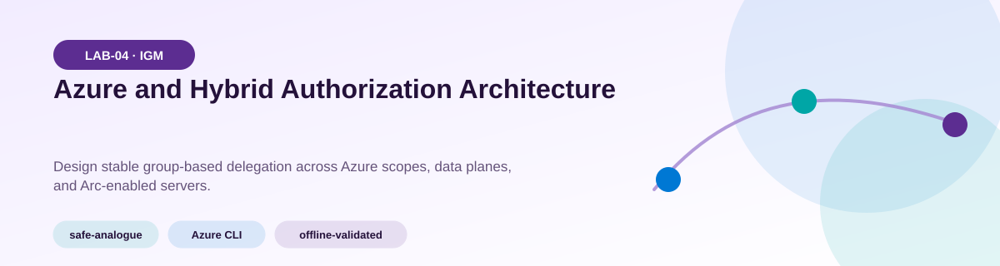
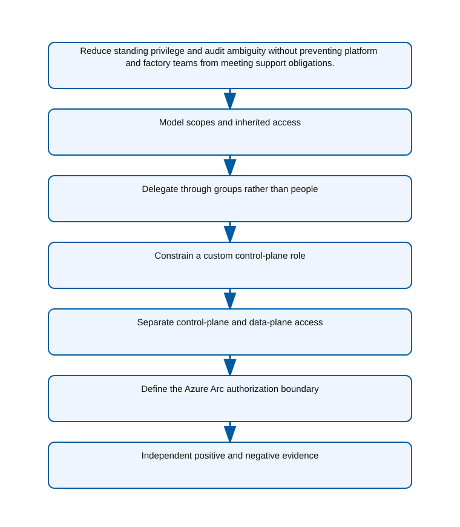
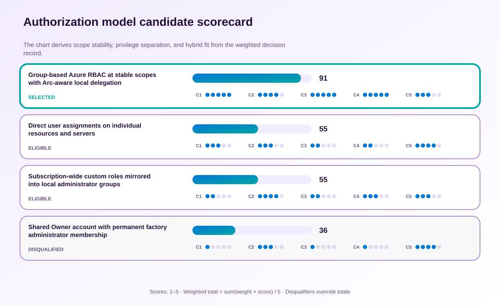

<!-- BEGIN GENERATED AZ305 V1 -->
# LAB-04 — Azure and Hybrid Authorization Architecture



<div class="az305-badges" aria-label="Lab classification">
  <span class="az305-mode-badge">safe-analogue</span>
  <span class="az305-lane-badge">Azure CLI</span>
  <span class="az305-status">offline-validated</span>
</div>

## 1. Navigation

[← LAB-03](../03-authentication-identity-design/README.md) · [Lab catalog](../README.md) · [LAB-05 →](../05-secrets-certificates-keys/README.md)

## 2. Scenario and completion contract

Adventure Works operates Azure subscriptions alongside factories whose Windows and Linux servers are projected through Azure Arc. Authentication is standardized, yet authorization grew through direct owner assignments, nested groups, and local administrator exceptions. Audit cannot explain why a principal can change a production resource or read a vault secret. As the authorization architect, create a scope and delegation model using Microsoft Entra groups, Azure RBAC, narrowly designed custom roles, resource-provider data-plane roles, and an explicit hybrid boundary. The design must preserve separation of duties, expose inherited access, avoid classic administrators, and distinguish Azure control-plane authorization from operating-system permissions on connected machines.

- Architect role: Hybrid authorization architect
- Outcome: A least-privilege Azure and hybrid authorization model with traceable scope, inheritance, and data-plane boundaries.
- Duration: 150 minutes
- Difficulty: advanced
- Cost class: low
- Completion: all five checkpoint assertions, final validation, decision revision, and cleanup review are complete.

## 3. Objective-to-evidence map

| Objective | Requirement | Checkpoint |
| --- | --- | --- |
| `IGM-AUTHZ-01` | `LAB04-REQ-01` | [`LAB04-CP01`](#checkpoint-1) |
| `IGM-AUTHZ-02` | `LAB04-REQ-02` | [`LAB04-CP02`](#checkpoint-2) |
| `IGM-AUTHZ-01` | `LAB04-REQ-03` | [`LAB04-CP03`](#checkpoint-3) |
| `IGM-AUTHZ-02` | `LAB04-REQ-04` | [`LAB04-CP04`](#checkpoint-4) |
| `IGM-AUTHZ-01` | `LAB04-REQ-05` | [`LAB04-CP05`](#checkpoint-5) |

## 4. Business and quality requirements

Business outcome: Reduce standing privilege and audit ambiguity without preventing platform and factory teams from meeting support obligations.

- `LAB04-REQ-01` — Stable management scopes and group assignments explain both direct and inherited effective access.
- `LAB04-REQ-02` — The operating team receives resource-group Contributor through an owned Microsoft Entra group.
- `LAB04-REQ-03` — The custom role contains only documented support actions and the minimum assignable scopes.
- `LAB04-REQ-04` — The workload identity can read secret values through a data-plane role without managing the vault.
- `LAB04-REQ-05` — Azure resource actions and guest operating-system privileges have separate accountable delegation paths.

Scenario facts:

- **Data:** The design handles directory groups, Azure role assignments, Arc machine scope, eligibility schedules, and access-review evidence.
- **Scale:** Delegation spans multiple factories and a changing provider roster; exact server and technician counts are inventory inputs.
- **Latency:** Emergency troubleshooting activation must meet the support response target while approval delay remains measured.
- **Availability:** A deputy approver and emergency process are required if the primary plant owner is unavailable.
- **RTO:** The service repair target is owned by plant operations; this lab measures privilege activation and revocation time rather than workload recovery.
- **RPO:** Authorization configuration must be reconstructable from exported assignments; application-data RPO is outside this decision.
- **Budget:** Time-bound group governance adds license cost but reduces recurring manual assignment and quarterly audit effort.

Constraints:

- The managed-service provider may troubleshoot factory servers for ninety days only.
- Provider identities cannot change subscription networking or retain permanent local administrator membership.
- Use only the Azure CLI command lane for learner implementation.
- Keep all live changes behind explicit execution and acknowledgement switches.
- Retain only sanitized command evidence and synthetic fixture identifiers.

Assumptions:

- Factory servers are represented through Azure Arc and have an accountable plant owner.
- Stable Entra groups can map provider personnel to approved Azure and machine-level duties.
- West Europe is the configurable primary example and North Europe is the configurable secondary example.
- The learner has administrator-level Azure operations knowledge but receives no pre-existing authenticated context.
- Offline fixtures demonstrate contract behavior rather than live Azure service behavior.

## 5. Architecture diagram and walkthrough



Stable groups receive narrow roles at durable scopes while control-plane, data-plane, and hybrid access remain distinct. The labelled nodes, boundaries, and edges are deterministically rendered from the portable `diagrams/architecture.mmd` source and the frozen visual registry.

## 6. Concept primer and candidate architectures

Architecture decisions translate measurable requirements into a deliberate service and operating model. A candidate is viable only when every mandatory constraint is met; convenience or familiarity cannot compensate for a disqualifier.

- **Group-based Azure RBAC at stable scopes with Arc-aware local delegation** (eligible) — Stable groups decouple personnel churn from role definitions and Arc-aware local delegation avoids granting subscription networking rights.
- **Direct user assignments on individual resources and servers** (eligible) — Direct grants can be narrowly scoped but are difficult to expire, review, and reconcile as technicians or factories change.
- **Subscription-wide custom roles mirrored into local administrator groups** (eligible) — A custom role can describe tasks precisely, yet subscription scope and permanent local mirroring enlarge the blast radius.
- **Shared Owner account with permanent factory administrator membership** (ineligible) — A shared powerful account may reduce activation steps but destroys individual attribution and least privilege. Disqualifier: LAB04-REQ-05 requires accountable separation between Azure actions and persistent guest operating-system privilege.

## 7. Decision, ADR, and Well-Architected review

Criteria weights are C1 30, C2 25, C3 20, C4 15, and C5 10. Weighted totals use `sum(weight × score) / 5`.



| Candidate | Eligible | C1 | C2 | C3 | C4 | C5 | Weighted /100 |
| --- | ---: | ---: | ---: | ---: | ---: | ---: | ---: |
| Group-based Azure RBAC at stable scopes with Arc-aware local delegation | yes | 5 | 4 | 5 | 5 | 3 | 91 |
| Direct user assignments on individual resources and servers | yes | 3 | 3 | 2 | 2 | 4 | 55 |
| Subscription-wide custom roles mirrored into local administrator groups | yes | 2 | 4 | 2 | 3 | 3 | 55 |
| Shared Owner account with permanent factory administrator membership | no | 1 | 3 | 1 | 1 | 4 | 36 |

Selected design: **Group-based Azure RBAC at stable scopes with Arc-aware local delegation**. `ADR-LAB04-001` records the accepted reasoning. Review Reliability, Security, Cost Optimization, Operational Excellence, and Performance Efficiency in `design/decision.yml`; no pillar is implied by another.

Rejected alternatives:

- **Direct user assignments on individual resources and servers:** Assignment sprawl and person-by-person expiry weaken both auditability and operations.
- **Subscription-wide custom roles mirrored into local administrator groups:** The broad scope gives the provider capabilities beyond factory troubleshooting and complicates revocation.
- **Shared Owner account with permanent factory administrator membership:** The candidate is ineligible because standing shared privilege violates the provider boundary.

Architecture risks:

- **Risk:** Azure role expiry may not remove a separately granted operating-system group membership. **Mitigation:** Reconcile cloud eligibility and Arc machine authorization as two explicit controls with the same end date.
- **Risk:** An unavailable approver could delay urgent factory recovery. **Mitigation:** Assign a trained deputy, document emergency activation, and review every emergency use after the incident.

Well-Architected consequences:

<div class="az305-waf-grid">
<article class="az305-waf-card"><h3>Reliability</h3><p>Deputy approval and scoped emergency access preserve support during an identity-owner absence.</p></article>
<article class="az305-waf-card"><h3>Security</h3><p>Group eligibility, minimal scopes, and Arc-specific delegation remove standing subscription and local-admin privilege.</p></article>
<article class="az305-waf-card"><h3>Cost Optimization</h3><p>Reusable groups reduce assignment administration while governance-license cost remains visible.</p></article>
<article class="az305-waf-card"><h3>Operational Excellence</h3><p>Expiry, access reviews, and assignment exports provide one auditable provider offboarding sequence.</p></article>
<article class="az305-waf-card"><h3>Performance Efficiency</h3><p>Stable group evaluation scales with personnel turnover without cloning role definitions per server.</p></article>
</div>

ADR consequences:

- Plant owners accept responsibility for time-bound activation and review decisions.
- Local machine authorization must be monitored separately from Azure RBAC because neither proves the other.

## 8. Inputs, permissions, licensing, cost, and analogue

Use configurable `Location` (`AZ305_LOCATION`, default West Europe) and `SecondaryLocation` (`AZ305_SECONDARY_LOCATION`, default North Europe). Every public input has an explicit `AZ305_*` fallback. Preview is the default; only Golden Lab 00 writes an intent-only `execute: false` preview record. Before an executed cloud command, the supplied subscription and tenant must exactly match the active CLI, Az, and—where applicable—Microsoft Graph contexts. `-Execute` crosses the execution boundary; cost-bearing and tenant-scoped paths also require their independent acknowledgement switches.

Safe analogue: Evaluate synthetic role assignments, eligibility schedules, and Arc server mappings with local fixtures; issue no Azure or Graph mutation.

Permissions: Reader, Role Based Access Control Reader, and Azure Connected Machine Resource Administrator discovery rights are separated from any role-assignment or local-access mutation.

Licensing: Azure Arc-enabled server features and Microsoft Entra governance or PIM licensing must be verified for time-bound delegation.

Cost boundary: Compare governance licensing and Arc management charges with the incident and audit cost of direct standing assignments.

## 9. Read-only preflight

```powershell
pwsh ./scripts/azure-cli/Preflight.ps1 -RunId synthetic-040001
```

Synthetic sample: `{"labId":"LAB-04","track":"azure-cli","result":"pass","note":"Local tool discovery only"}`. This is illustrative local output, not evidence captured from Azure.

## 10. Five guided checkpoints

<ol class="az305-checkpoint-timeline" aria-label="Five checkpoint learning path">
<li><a href="#checkpoint-1">Model scopes and inherited access</a><span>LAB04-REQ-01 · LAB04-CP01</span></li>
<li><a href="#checkpoint-2">Delegate through groups rather than people</a><span>LAB04-REQ-02 · LAB04-CP02</span></li>
<li><a href="#checkpoint-3">Constrain a custom control-plane role</a><span>LAB04-REQ-03 · LAB04-CP03</span></li>
<li><a href="#checkpoint-4">Separate control-plane and data-plane access</a><span>LAB04-REQ-04 · LAB04-CP04</span></li>
<li><a href="#checkpoint-5">Define the Azure Arc authorization boundary</a><span>LAB04-REQ-05 · LAB04-CP05</span></li>
</ol>

### Checkpoint 1: Model scopes and inherited access

<a id="checkpoint-1"></a>

**Trace:** `IGM-AUTHZ-01` → `LAB04-REQ-01` → `LAB04-CP01`

```powershell
az role assignment list --scope $Scope --include-inherited --all -o json
```

Expected evidence: Stable management scopes and group assignments explain both direct and inherited effective access. Retain Synthetic principal labels, role names, assignment scopes, inheritance path, and business owner.

Positive assertion:

```powershell
az role assignment list --scope $Scope --include-inherited --assignee-object-id $PrincipalObjectId --query "[].{role:roleDefinitionName,scope:scope}" -o json
```

Negative assertion:

```powershell
az role assignment list --scope $Scope --include-inherited --query "[?principalType=='User' && roleDefinitionName=='Owner'].{principal:principalName,scope:scope}" -o json
```

Failure and retry: A broad inherited assignment masks the intended resource-group delegation. Trace the assignment to its parent scope and redesign at the narrowest stable boundary.

Cleanup dependency: Remove child assignments before groups only when exact run-owned IDs and tags are proven.

WAF consequence: Operational Excellence: an explicit inheritance map makes effective access reviewable and supportable.

### Checkpoint 2: Delegate through groups rather than people

<a id="checkpoint-2"></a>

**Trace:** `IGM-AUTHZ-02` → `LAB04-REQ-02` → `LAB04-CP02`

```powershell
az role assignment list --assignee-object-id $GroupObjectId --scope $ResourceGroupId --include-inherited --query "[].{role:roleDefinitionName,scope:scope,principalType:principalType}" -o json
```

Expected evidence: The operating team receives resource-group Contributor through an owned Microsoft Entra group. Retain Synthetic group object ID, role definition, exact scope, owner, and access-review cadence.

Positive assertion:

```powershell
az role assignment list --assignee-object-id $GroupObjectId --scope $ResourceGroupId --query "[?roleDefinitionName=='Contributor'].id" -o tsv
```

Negative assertion:

```powershell
az role assignment list --scope $ResourceGroupId --query "[?principalType=='User' && roleDefinitionName=='Contributor'].id" -o tsv
```

Failure and retry: The caller cannot resolve the group or create assignments at the requested scope. Validate directory read access and role-assignment permissions without broadening the target scope.

Cleanup dependency: Delete the run-owned assignment before considering any group lifecycle action.

WAF consequence: Cost Optimization: group-based delegation reduces repetitive assignment and recertification effort.

### Checkpoint 3: Constrain a custom control-plane role

<a id="checkpoint-3"></a>

**Trace:** `IGM-AUTHZ-01` → `LAB04-REQ-03` → `LAB04-CP03`

```powershell
az role definition list --name $CustomRoleName --query "[0].{name:roleName,actions:permissions[0].actions,notActions:permissions[0].notActions,assignableScopes:assignableScopes}" -o json
```

Expected evidence: The custom role contains only documented support actions and the minimum assignable scopes. Retain Role definition hash, actions, notActions, dataActions, and assignable scopes.

Positive assertion:

```powershell
az role definition list --name $CustomRoleName --query "[0].{actions:permissions[0].actions,notActions:permissions[0].notActions,scopes:assignableScopes}" -o json
```

Negative assertion:

```powershell
az role definition list --name $CustomRoleName --query "[0].permissions[0].actions[?@=='*']" -o json
```

Failure and retry: An operational task depends on a hidden action not represented in provider operations. Capture the denied operation, add only its documented action, and repeat the privilege review.

Cleanup dependency: Remove assignments that reference the custom role before deleting the definition.

WAF consequence: Performance Efficiency: a task-focused role lets operators complete supported recovery work without broad authorization workflows.

### Checkpoint 4: Separate control-plane and data-plane access

<a id="checkpoint-4"></a>

**Trace:** `IGM-AUTHZ-02` → `LAB04-REQ-04` → `LAB04-CP04`

```powershell
az role assignment list --assignee-object-id $WorkloadPrincipalId --scope $VaultResourceId --include-inherited --query "[].{role:roleDefinitionName,scope:scope}" -o json
```

Expected evidence: The workload identity can read secret values through a data-plane role without managing the vault. Retain Synthetic workload principal, data-plane role, exact vault scope, and denied management operations.

Positive assertion:

```powershell
az role assignment list --assignee-object-id $WorkloadPrincipalId --scope $VaultResourceId --query "[?roleDefinitionName=='Key Vault Secrets User'].{role:roleDefinitionName,scope:scope}" -o json
```

Negative assertion:

```powershell
az role assignment list --assignee-object-id $WorkloadPrincipalId --scope $VaultResourceId --query "[?contains(['Owner','Contributor'],roleDefinitionName)].roleDefinitionName" -o tsv
```

Failure and retry: The vault still uses access policies or an inherited management role supplies unintended power. Document the authorization model, remove overlap in a controlled change, and validate both planes independently.

Cleanup dependency: Remove the exact run-owned role assignment; do not alter unrelated vault access.

WAF consequence: Reliability: data-plane roles let workloads consume dependencies without coupling service availability to vault administration.

### Checkpoint 5: Define the Azure Arc authorization boundary

<a id="checkpoint-5"></a>

**Trace:** `IGM-AUTHZ-01` → `LAB04-REQ-05` → `LAB04-CP05`

```powershell
az resource show --ids $ArcServerResourceId --api-version 2024-07-10 -o json
```

Expected evidence: Azure resource actions and guest operating-system privileges have separate accountable delegation paths. Retain Synthetic Arc resource ID, Azure role path, local-role owner, elevation mechanism, and review cadence.

Positive assertion:

```powershell
az role assignment list --scope $ArcServerResourceId --include-inherited --query "[].{role:roleDefinitionName,scope:scope}" -o json
```

Negative assertion:

```powershell
az role assignment list --scope $ArcServerResourceId --query "[?principalType=='User' && contains(roleDefinitionName,'Administrator')].id" -o tsv
```

Failure and retry: Teams conflate Arc resource management with guest configuration or local sign-in rights. Split the permission matrix by control plane, Arc extension action, and guest operating-system action.

Cleanup dependency: Remove only tagged run-owned Azure assignments; never alter a connected server or local group automatically.

WAF consequence: Security: the hybrid boundary prevents Azure control-plane access from being mistaken for guest administrator privilege.

## 11. Final validation and interpretation

Run `Validate.ps1 -Mode Deployment -Execute` only after an executed run has state and you are authorized to issue the ten read-only checkpoint inspections. Without `-Execute`, ordinary deployment validation records `partial` and exits `2`; Golden Lab 00 alone can validate its intent-only preview locally. Exit `0` means all required assertions pass, `1` means at least one failed, and `2` means the outcome is gated or partial. Positive and negative commands execute independently, so one failure never suppresses its paired assertion.

## 12. Material change request

A managed-service provider must troubleshoot factory servers for ninety days but may not change subscription networking or receive permanent local administrator membership; revise delegation and expiry controls.

Revised solution: select **Group-based Azure RBAC at stable scopes with Arc-aware local delegation**. LAB04-REQ-05 requires deterministic expiry and prohibited-network evidence, so the selected model adds ninety-day eligible group access plus independent Arc local-membership removal.

Revised Well-Architected consequences:

- **Reliability:** A deputy activation route supports incidents without keeping access permanently active.
- **Security:** Provider permissions end automatically and exclude subscription-network operations.
- **Cost Optimization:** Group-based renewal replaces repeated per-user assignment work.
- **Operational Excellence:** Cloud and server revocation assertions expose partial offboarding.
- **Performance Efficiency:** One stable role mapping supports the approved server fleet as technicians rotate.

## 13. Architect job challenge

Produce a responsibility matrix that distinguishes Azure RBAC, Arc extension permissions, just-in-time local elevation, and evidence ownership.

## 14. Troubleshooting, cleanup, and residual verification

- Resolve inherited assignments from parent scopes before adding a new role.
- Check control-plane Actions and data-plane DataActions separately when access appears inconsistent.
- Treat Azure Arc resource permissions and guest operating-system privileges as different authorization systems.

Cleanup previews nonempty state in reverse dependency order, writes `partial`, and exits `2`; an already empty run is completed locally and idempotently. Executed cleanup rechecks the exact live ID plus `purpose`, `labId`, `runId`, and `expiresOn` immediately before each removal, persists state after every absent or removed object, stops on the first dependency failure, and refuses unresolved pre-existing settings. It never automates purge. Finish with `Validate.ps1 -Mode PostCleanup`; the required residual count is zero.

## 15. Exam debrief, assessment, sources, and navigation

Explain the recommendation in terms of requirements, rejected alternatives, failure behavior, and all five WAF pillars. Complete `assessment/QUESTIONS.md`, then use the separately excluded answer key for remediation.

- [Best practices for Azure RBAC](https://learn.microsoft.com/en-us/azure/role-based-access-control/best-practices)
- [Azure Well-Architected Framework](https://learn.microsoft.com/en-us/azure/well-architected/)

[← LAB-03](../03-authentication-identity-design/README.md) · [Lab catalog](../README.md) · [LAB-05 →](../05-secrets-certificates-keys/README.md)

## 16. Synchronized lifecycle-script appendix

### Preflight.ps1

```powershell
[CmdletBinding()]
param(
    [string]$SubscriptionId = $env:AZ305_SUBSCRIPTION_ID,
    [string]$TenantId = $env:AZ305_TENANT_ID,
    [ValidatePattern('^[a-z0-9-]{6,64}$')][string]$RunId = $env:AZ305_RUN_ID,
    [string]$Location = $(if ($env:AZ305_LOCATION) { $env:AZ305_LOCATION } else { 'westeurope' }),
    [string]$SecondaryLocation = $(if ($env:AZ305_SECONDARY_LOCATION) { $env:AZ305_SECONDARY_LOCATION } else { 'northeurope' }),
    [string]$ResourceGroup = $(if ($env:AZ305_RESOURCE_GROUP) { $env:AZ305_RESOURCE_GROUP } else { "rg-az305-$RunId" }),
    [string]$WorkloadName = $(if ($env:AZ305_WORKLOAD_NAME) { $env:AZ305_WORKLOAD_NAME } else { "az305-$RunId" }),
    [string]$ExpiresOn = $(if ($env:AZ305_EXPIRES_ON) { $env:AZ305_EXPIRES_ON } else { (Get-Date).ToUniversalTime().AddDays(1).ToString('yyyy-MM-dd') }),
    [string]$ArcServerResourceId = $env:AZ305_ARC_SERVER_RESOURCE_ID,
    [string]$CustomRoleName = $env:AZ305_CUSTOM_ROLE_NAME,
    [string]$GroupObjectId = $env:AZ305_GROUP_OBJECT_ID,
    [string]$PrincipalObjectId = $env:AZ305_PRINCIPAL_OBJECT_ID,
    [string]$ResourceGroupId = $env:AZ305_RESOURCE_GROUP_ID,
    [string]$Scope = $env:AZ305_SCOPE,
    [string]$VaultResourceId = $env:AZ305_VAULT_RESOURCE_ID,
    [string]$WorkloadPrincipalId = $env:AZ305_WORKLOAD_PRINCIPAL_ID,
    [switch]$Execute,
    [switch]$AcknowledgeCost,
    [switch]$AcknowledgeTenantChange
)

$ErrorActionPreference = 'Stop'
$PSNativeCommandUseErrorActionPreference = $true
if (-not $RunId) { [Console]::Error.WriteLine('RunId or AZ305_RUN_ID is required.'); exit 2 }
# Every lifecycle entrypoint intentionally exposes the same public parameter contract.
@($SubscriptionId, $TenantId, $RunId, $Location, $SecondaryLocation, $ResourceGroup, $WorkloadName, $ExpiresOn, $ArcServerResourceId, $CustomRoleName, $GroupObjectId, $PrincipalObjectId, $ResourceGroupId, $Scope, $VaultResourceId, $WorkloadPrincipalId, $Execute, $AcknowledgeCost, $AcknowledgeTenantChange) | Out-Null

$requiredCommands = @('az', 'pwsh')
$missing = @($requiredCommands | Where-Object { -not (Get-Command $_ -ErrorAction SilentlyContinue) })
if ($missing.Count -gt 0) {
    Write-Error "Missing local commands: $($missing -join ', ')"
    exit 1
}

[pscustomobject]@{
    labId = 'LAB-04'
    track = 'azure-cli'
    implementationMode = 'safe-analogue'
    result = 'pass'
    note = 'Local tool discovery only; no Azure or Microsoft Graph request was made.'
} | ConvertTo-Json
exit 0
```

### Setup.ps1

```powershell
[CmdletBinding()]
param(
    [string]$SubscriptionId = $env:AZ305_SUBSCRIPTION_ID,
    [string]$TenantId = $env:AZ305_TENANT_ID,
    [ValidatePattern('^[a-z0-9-]{6,64}$')][string]$RunId = $env:AZ305_RUN_ID,
    [string]$Location = $(if ($env:AZ305_LOCATION) { $env:AZ305_LOCATION } else { 'westeurope' }),
    [string]$SecondaryLocation = $(if ($env:AZ305_SECONDARY_LOCATION) { $env:AZ305_SECONDARY_LOCATION } else { 'northeurope' }),
    [string]$ResourceGroup = $(if ($env:AZ305_RESOURCE_GROUP) { $env:AZ305_RESOURCE_GROUP } else { "rg-az305-$RunId" }),
    [string]$WorkloadName = $(if ($env:AZ305_WORKLOAD_NAME) { $env:AZ305_WORKLOAD_NAME } else { "az305-$RunId" }),
    [string]$ExpiresOn = $(if ($env:AZ305_EXPIRES_ON) { $env:AZ305_EXPIRES_ON } else { (Get-Date).ToUniversalTime().AddDays(1).ToString('yyyy-MM-dd') }),
    [string]$ArcServerResourceId = $env:AZ305_ARC_SERVER_RESOURCE_ID,
    [string]$CustomRoleName = $env:AZ305_CUSTOM_ROLE_NAME,
    [string]$GroupObjectId = $env:AZ305_GROUP_OBJECT_ID,
    [string]$PrincipalObjectId = $env:AZ305_PRINCIPAL_OBJECT_ID,
    [string]$ResourceGroupId = $env:AZ305_RESOURCE_GROUP_ID,
    [string]$Scope = $env:AZ305_SCOPE,
    [string]$VaultResourceId = $env:AZ305_VAULT_RESOURCE_ID,
    [string]$WorkloadPrincipalId = $env:AZ305_WORKLOAD_PRINCIPAL_ID,
    [switch]$Execute,
    [switch]$AcknowledgeCost,
    [switch]$AcknowledgeTenantChange
)

$ErrorActionPreference = 'Stop'
$PSNativeCommandUseErrorActionPreference = $true
if (-not $RunId) { [Console]::Error.WriteLine('RunId or AZ305_RUN_ID is required.'); exit 2 }
# Every lifecycle entrypoint intentionally exposes the same public parameter contract.
@($SubscriptionId, $TenantId, $RunId, $Location, $SecondaryLocation, $ResourceGroup, $WorkloadName, $ExpiresOn, $ArcServerResourceId, $CustomRoleName, $GroupObjectId, $PrincipalObjectId, $ResourceGroupId, $Scope, $VaultResourceId, $WorkloadPrincipalId, $Execute, $AcknowledgeCost, $AcknowledgeTenantChange) | Out-Null

$LabRoot = Split-Path (Split-Path $PSScriptRoot -Parent) -Parent
$StateRoot = Join-Path $LabRoot ".state/$RunId"
$StatePath = Join-Path $StateRoot 'run.json'

function Invoke-AzCliJson {
    [CmdletBinding()]
    param([Parameter(Mandatory)][string[]]$ArgumentList)
    $savedNativePreference = $PSNativeCommandUseErrorActionPreference
    try {
        # Capture the exit code ourselves so a failed native command cannot be
        # mistaken for an empty but successful JSON response.
        $PSNativeCommandUseErrorActionPreference = $false
        $outputLines = @(& az @ArgumentList)
        $nativeExit = $LASTEXITCODE
    }
    finally {
        $PSNativeCommandUseErrorActionPreference = $savedNativePreference
    }
    if ($nativeExit -ne 0) { throw "Azure CLI exited with code $nativeExit." }
    $raw = @($outputLines) -join "`n"
    if ([string]::IsNullOrWhiteSpace($raw)) { return $null }
    try { return ($raw | ConvertFrom-Json -Depth 100) }
    catch { throw 'Azure CLI returned data that was not valid JSON.' }
}

function Assert-ExactExecutionContext {
    [CmdletBinding()]
    param([string]$ExpectedSubscriptionId, [string]$ExpectedTenantId)
    if ([string]::IsNullOrWhiteSpace($ExpectedSubscriptionId) -or [string]::IsNullOrWhiteSpace($ExpectedTenantId)) {
        throw 'SubscriptionId and TenantId are required before a cloud request.'
    }
    $context = Invoke-AzCliJson -ArgumentList @('account', 'show', '--output', 'json', '--only-show-errors')
    if (-not $context -or [string]$context.id -ine $ExpectedSubscriptionId -or [string]$context.tenantId -ine $ExpectedTenantId) {
        throw 'The active Azure CLI subscription or tenant does not exactly match the requested context.'
    }
}

function Save-RunState {
    [CmdletBinding()]
    param([Parameter(Mandatory)]$State)
    $temporaryPath = "$StatePath.tmp"
    $State | ConvertTo-Json -Depth 20 | Set-Content -LiteralPath $temporaryPath -Encoding utf8NoBOM
    Move-Item -LiteralPath $temporaryPath -Destination $StatePath -Force
}

function Assert-SafeStateValue {
    [CmdletBinding()]
    param($Value)
    $serialized = $Value | ConvertTo-Json -Depth 12 -Compress
    if ($serialized -match '(?i)"(?:token|password|secret|certificate|connectionString|sas|clientSecret|accessToken|refreshToken|accountKey|privateKey)"\s*:') {
        throw 'A prohibited sensitive field name was returned; state capture is refused.'
    }
}

function Convert-CheckpointOutput {
    [CmdletBinding()]
    param($Value)
    if ($Value -is [string]) { $raw = [string]$Value }
    elseif ($Value -is [System.Collections.IEnumerable] -and @($Value | Where-Object { $_ -isnot [string] }).Count -eq 0) { $raw = @($Value) -join "`n" }
    else { return $Value }
    if ([string]::IsNullOrWhiteSpace($raw)) { return $null }
    try { return ($raw | ConvertFrom-Json -Depth 100) } catch { return $Value }
}

function Get-ReturnedResourceId {
    [CmdletBinding()]
    param($Value)
    $seen = [System.Collections.Generic.HashSet[string]]::new([System.StringComparer]::OrdinalIgnoreCase)
    $results = [System.Collections.Generic.List[string]]::new()
    function Add-ArmId {
        param($Candidate)
        if ($Candidate -is [string] -and $Candidate -match '^/subscriptions/[0-9a-f-]+/(?:resourceGroups/[^/]+(?:/providers/.+)?|providers/.+)$' -and $Candidate -notmatch '/providers/Microsoft\.Resources/deployments/') {
            if ($seen.Add($Candidate)) { $results.Add($Candidate) }
        }
    }
    function Find-DeploymentOutputId {
        param($Item, [int]$Depth)
        if ($null -eq $Item -or $Depth -gt 12) { return }
        if ($Item -is [string]) { Add-ArmId -Candidate $Item; return }
        if ($Item -is [System.Collections.IDictionary]) { foreach ($key in $Item.Keys) { Find-DeploymentOutputId -Item $Item[$key] -Depth ($Depth + 1) }; return }
        if ($Item -is [System.Collections.IEnumerable]) { foreach ($entry in $Item) { Find-DeploymentOutputId -Item $entry -Depth ($Depth + 1) }; return }
        foreach ($property in @($Item.PSObject.Properties | Where-Object { $_.MemberType -in @('NoteProperty', 'Property') })) { Find-DeploymentOutputId -Item $property.Value -Depth ($Depth + 1) }
    }
    foreach ($rootItem in @($Value)) {
        if ($rootItem -is [System.Collections.IDictionary]) {
            foreach ($name in @('id', 'resourceId')) { if ($rootItem.Contains($name)) { Add-ArmId -Candidate $rootItem[$name] } }
            if ($rootItem.Contains('properties') -and $rootItem.properties -and $rootItem.properties.outputs) { Find-DeploymentOutputId -Item $rootItem.properties.outputs -Depth 0 }
            continue
        }
        foreach ($name in @('Id', 'ResourceId')) {
            $property = $rootItem.PSObject.Properties[$name]
            if ($property) { Add-ArmId -Candidate $property.Value }
        }
        if ($rootItem.PSObject.Properties['Properties'] -and $rootItem.Properties -and $rootItem.Properties.outputs) {
            Find-DeploymentOutputId -Item $rootItem.Properties.outputs -Depth 0
        }
    }
    return @($results)
}

function Get-PlannedDeploymentResourceId {
    [CmdletBinding()]
    param($Value)
    $seen = [System.Collections.Generic.HashSet[string]]::new([System.StringComparer]::OrdinalIgnoreCase)
    $results = [System.Collections.Generic.List[string]]::new()
    foreach ($change in @($Value.changes)) {
        $candidate = [string]$change.resourceId
        if ($candidate -match '^/subscriptions/[0-9a-f-]+/(?:resourceGroups/[^/]+(?:/providers/.+)?|providers/.+)$' -and $candidate -notmatch '/providers/Microsoft\.Resources/deployments/' -and $seen.Add($candidate)) {
            $results.Add($candidate)
        }
    }
    return @($results)
}

function Assert-InputSubscriptionScope {
    [CmdletBinding()]
    param($Inputs, [string]$ExpectedSubscriptionId)
    $entries = if ($Inputs -is [System.Collections.IDictionary]) {
        @($Inputs.GetEnumerator())
    } else {
        @($Inputs.PSObject.Properties | ForEach-Object { [pscustomobject]@{ Key = $_.Name; Value = $_.Value } })
    }
    foreach ($entry in $entries) {
        if ($entry.Value -is [string] -and [string]$entry.Value -match '^/subscriptions/([^/]+)/') {
            if ($Matches[1] -ine $ExpectedSubscriptionId) { throw "Input $($entry.Key) belongs to a different subscription." }
        }
    }
}

function Assert-ManagedMutation {
    [CmdletBinding()]
    param($State, [string]$CheckpointId, [bool]$CarriesOwnership, [object[]]$TargetResourceIds)
    if ($CarriesOwnership) { return }
    $targets = @($TargetResourceIds | Where-Object { $_ -is [string] -and $_ -match '^/subscriptions/' })
    if ($targets.Count -eq 0) { throw "$CheckpointId refuses an untagged mutation because no exact ARM target ID was supplied." }
    $knownIds = @($State.managedObjects | ForEach-Object { [string]$_.id })
    if ($knownIds.Count -eq 0) { throw "$CheckpointId refuses to modify a pre-existing object because no run-owned parent has been recorded." }
    foreach ($target in $targets) {
        $related = @($knownIds | Where-Object { $target -ieq $_ -or $target.StartsWith("$_/", [System.StringComparison]::OrdinalIgnoreCase) -or $_.StartsWith("$target/", [System.StringComparison]::OrdinalIgnoreCase) }).Count -gt 0
        if (-not $related) { throw "$CheckpointId refuses a mutation outside the exact run-owned resource boundary." }
    }
}

$executionInputs = [ordered]@{ subscriptionId = $SubscriptionId; tenantId = $TenantId; location = $Location; secondaryLocation = $SecondaryLocation; resourceGroup = $ResourceGroup; workloadName = $WorkloadName; expiresOn = $ExpiresOn; ArcServerResourceId = $ArcServerResourceId; CustomRoleName = $CustomRoleName; GroupObjectId = $GroupObjectId; PrincipalObjectId = $PrincipalObjectId; ResourceGroupId = $ResourceGroupId; Scope = $Scope; VaultResourceId = $VaultResourceId; WorkloadPrincipalId = $WorkloadPrincipalId }

if (-not $Execute) {
    Write-Output '[preview] No cloud command was called and no state was created.'
    Write-Output '[preview] Re-run with -Execute only in an authorized disposable environment.'
    exit 0
}
# This setup is compatible with the lab implementation mode.
# This default exercise does not require a cost acknowledgement.
# This lab does not perform a tenant-scoped change by default.
$requiredLabInputs = [ordered]@{ ArcServerResourceId = $ArcServerResourceId; CustomRoleName = $CustomRoleName; GroupObjectId = $GroupObjectId; ResourceGroupId = $ResourceGroupId; Scope = $Scope; VaultResourceId = $VaultResourceId; WorkloadPrincipalId = $WorkloadPrincipalId }
$missingLabInputs = @($requiredLabInputs.GetEnumerator() | Where-Object { $_.Value -is [string] -and [string]::IsNullOrWhiteSpace([string]$_.Value) } | ForEach-Object Key)
if ($missingLabInputs.Count -gt 0) { [Console]::Error.WriteLine("Execution is gated; supply: $($missingLabInputs -join ', ')."); exit 2 }

try {
    Assert-ExactExecutionContext -ExpectedSubscriptionId $SubscriptionId -ExpectedTenantId $TenantId
    Assert-InputSubscriptionScope -Inputs $executionInputs -ExpectedSubscriptionId $SubscriptionId
    Assert-SafeStateValue -Value $executionInputs
}
catch {
    [Console]::Error.WriteLine("Execution is gated by context or input validation: $($_.Exception.Message)")
    exit 2
}

# Recovery state is persisted before the first possible mutation below.
if (Test-Path -LiteralPath $StatePath) {
    [Console]::Error.WriteLine('Run state already exists. Choose a new RunId or complete the recorded cleanup; existing recovery state will not be overwritten.')
    exit 2
}
New-Item -ItemType Directory -Path $StateRoot -Force | Out-Null
$state = [ordered]@{
    schemaVersion = '1.0.0'; labId = 'LAB-04'; runId = $RunId; track = 'azure-cli'
    implementationMode = 'safe-analogue'; status = 'initialized'
    createdAt = (Get-Date).ToUniversalTime().ToString('o'); execute = $true
    parameters = $executionInputs
    managedObjects = @(); originalSettings = @()
}
Save-RunState -State $state
$state.status = 'deploying'
Save-RunState -State $state

$originalLocation = Get-Location
try {
    Set-Location -LiteralPath $LabRoot
    # 04-CP01: Model scopes and inherited access
    $stepResult = & { az role assignment list --scope $Scope --include-inherited --all -o json }
    if ($LASTEXITCODE -ne 0) { throw 'LAB04-CP01 native command exited with code ' + $LASTEXITCODE + '.' }
    $null = $stepResult

    # 04-CP02: Delegate through groups rather than people
    $stepResult = & { az role assignment list --assignee-object-id $GroupObjectId --scope $ResourceGroupId --include-inherited --query "[].{role:roleDefinitionName,scope:scope,principalType:principalType}" -o json }
    if ($LASTEXITCODE -ne 0) { throw 'LAB04-CP02 native command exited with code ' + $LASTEXITCODE + '.' }
    $null = $stepResult

    # 04-CP03: Constrain a custom control-plane role
    $stepResult = & { az role definition list --name $CustomRoleName --query "[0].{name:roleName,actions:permissions[0].actions,notActions:permissions[0].notActions,assignableScopes:assignableScopes}" -o json }
    if ($LASTEXITCODE -ne 0) { throw 'LAB04-CP03 native command exited with code ' + $LASTEXITCODE + '.' }
    $null = $stepResult

    # 04-CP04: Separate control-plane and data-plane access
    $stepResult = & { az role assignment list --assignee-object-id $WorkloadPrincipalId --scope $VaultResourceId --include-inherited --query "[].{role:roleDefinitionName,scope:scope}" -o json }
    if ($LASTEXITCODE -ne 0) { throw 'LAB04-CP04 native command exited with code ' + $LASTEXITCODE + '.' }
    $null = $stepResult

    # 04-CP05: Define the Azure Arc authorization boundary
    $stepResult = & { az resource show --ids $ArcServerResourceId --api-version 2024-07-10 -o json }
    if ($LASTEXITCODE -ne 0) { throw 'LAB04-CP05 native command exited with code ' + $LASTEXITCODE + '.' }
    $null = $stepResult

    $state.status = 'deployed'
    Save-RunState -State $state
} catch {
    $state.status = 'failed'
    Save-RunState -State $state
    Write-Error $_
    exit 1
} finally {
    Set-Location -LiteralPath $originalLocation
}
exit 0
```

### Validate.ps1

```powershell
[CmdletBinding()]
param(
    [string]$SubscriptionId = $env:AZ305_SUBSCRIPTION_ID,
    [string]$TenantId = $env:AZ305_TENANT_ID,
    [ValidatePattern('^[a-z0-9-]{6,64}$')][string]$RunId = $env:AZ305_RUN_ID,
    [string]$Location = $(if ($env:AZ305_LOCATION) { $env:AZ305_LOCATION } else { 'westeurope' }),
    [string]$SecondaryLocation = $(if ($env:AZ305_SECONDARY_LOCATION) { $env:AZ305_SECONDARY_LOCATION } else { 'northeurope' }),
    [string]$ResourceGroup = $(if ($env:AZ305_RESOURCE_GROUP) { $env:AZ305_RESOURCE_GROUP } else { "rg-az305-$RunId" }),
    [string]$WorkloadName = $(if ($env:AZ305_WORKLOAD_NAME) { $env:AZ305_WORKLOAD_NAME } else { "az305-$RunId" }),
    [string]$ExpiresOn = $(if ($env:AZ305_EXPIRES_ON) { $env:AZ305_EXPIRES_ON } else { (Get-Date).ToUniversalTime().AddDays(1).ToString('yyyy-MM-dd') }),
    [string]$ArcServerResourceId = $env:AZ305_ARC_SERVER_RESOURCE_ID,
    [string]$CustomRoleName = $env:AZ305_CUSTOM_ROLE_NAME,
    [string]$GroupObjectId = $env:AZ305_GROUP_OBJECT_ID,
    [string]$PrincipalObjectId = $env:AZ305_PRINCIPAL_OBJECT_ID,
    [string]$ResourceGroupId = $env:AZ305_RESOURCE_GROUP_ID,
    [string]$Scope = $env:AZ305_SCOPE,
    [string]$VaultResourceId = $env:AZ305_VAULT_RESOURCE_ID,
    [string]$WorkloadPrincipalId = $env:AZ305_WORKLOAD_PRINCIPAL_ID,
    [ValidateSet('Deployment', 'PostCleanup')][string]$Mode = 'Deployment',
    [switch]$Execute,
    [switch]$AcknowledgeCost,
    [switch]$AcknowledgeTenantChange
)

$ErrorActionPreference = 'Stop'
$PSNativeCommandUseErrorActionPreference = $true
if (-not $RunId) { [Console]::Error.WriteLine('RunId or AZ305_RUN_ID is required.'); exit 2 }
# Every lifecycle entrypoint intentionally exposes the same public parameter contract.
@($SubscriptionId, $TenantId, $RunId, $Location, $SecondaryLocation, $ResourceGroup, $WorkloadName, $ExpiresOn, $ArcServerResourceId, $CustomRoleName, $GroupObjectId, $PrincipalObjectId, $ResourceGroupId, $Scope, $VaultResourceId, $WorkloadPrincipalId, $Mode, $Execute, $AcknowledgeCost, $AcknowledgeTenantChange) | Out-Null

$LabRoot = Split-Path (Split-Path $PSScriptRoot -Parent) -Parent
$StateRoot = Join-Path $LabRoot ".state/$RunId"
$RunPath = Join-Path $StateRoot 'run.json'
$ValidationPath = Join-Path $StateRoot 'validation.json'

function Invoke-AzCliJson {
    [CmdletBinding()]
    param([Parameter(Mandatory)][string[]]$ArgumentList)
    $savedNativePreference = $PSNativeCommandUseErrorActionPreference
    try {
        # Capture the exit code ourselves so a failed native command cannot be
        # mistaken for an empty but successful JSON response.
        $PSNativeCommandUseErrorActionPreference = $false
        $outputLines = @(& az @ArgumentList)
        $nativeExit = $LASTEXITCODE
    }
    finally {
        $PSNativeCommandUseErrorActionPreference = $savedNativePreference
    }
    if ($nativeExit -ne 0) { throw "Azure CLI exited with code $nativeExit." }
    $raw = @($outputLines) -join "`n"
    if ([string]::IsNullOrWhiteSpace($raw)) { return $null }
    try { return ($raw | ConvertFrom-Json -Depth 100) }
    catch { throw 'Azure CLI returned data that was not valid JSON.' }
}

function Assert-ExactExecutionContext {
    [CmdletBinding()]
    param([string]$ExpectedSubscriptionId, [string]$ExpectedTenantId)
    if ([string]::IsNullOrWhiteSpace($ExpectedSubscriptionId) -or [string]::IsNullOrWhiteSpace($ExpectedTenantId)) {
        throw 'SubscriptionId and TenantId are required before a cloud request.'
    }
    $context = Invoke-AzCliJson -ArgumentList @('account', 'show', '--output', 'json', '--only-show-errors')
    if (-not $context -or [string]$context.id -ine $ExpectedSubscriptionId -or [string]$context.tenantId -ine $ExpectedTenantId) {
        throw 'The active Azure CLI subscription or tenant does not exactly match the requested context.'
    }
}


if (-not (Test-Path -LiteralPath $RunPath)) {
    Write-Warning 'No run state exists; validation is gated.'
    exit 2
}
$state = Get-Content -LiteralPath $RunPath -Raw | ConvertFrom-Json
$assertions = [System.Collections.Generic.List[object]]::new()
function Add-ValidationAssertion {
    [CmdletBinding()]
    param([string]$Id, [ValidateSet('positive', 'negative')][string]$Kind, [bool]$Passed, [string]$Message)
    $assertions.Add([pscustomobject]@{ id = $Id; kind = $Kind; passed = $Passed; message = $Message })
}

function Save-ValidationArtifact {
    [CmdletBinding()]
    param([ValidateSet('pass', 'partial', 'fail')][string]$Result)
    $artifact = [ordered]@{ schemaVersion = '1.0.0'; labId = 'LAB-04'; runId = $RunId; mode = $Mode; result = $Result; validatedAt = (Get-Date).ToUniversalTime().ToString('o'); assertions = @($assertions) }
    $artifact | ConvertTo-Json -Depth 12 | Set-Content -LiteralPath $ValidationPath -Encoding utf8NoBOM
}

function Test-PositiveEvidence {
    [CmdletBinding()]
    param($Value)
    if ($Value -is [bool]) { return $Value }
    if ($null -eq $Value) { return $false }
    if ($Value -is [string]) { return -not [string]::IsNullOrWhiteSpace($Value) }
    if ($Value -is [System.Collections.IEnumerable]) { return @($Value).Count -gt 0 }
    return $true
}

function Test-NegativeEvidence {
    [CmdletBinding()]
    param($Value)
    if ($Value -is [bool]) { return $Value }
    if ($null -eq $Value) { return $true }
    if ($Value -is [string]) { return [string]::IsNullOrWhiteSpace($Value) }
    if ($Value -is [System.Collections.IEnumerable]) { return @($Value).Count -eq 0 }
    $properties = @($Value.PSObject.Properties | Where-Object { $_.MemberType -in @('NoteProperty', 'Property') })
    if ($properties.Count -eq 0) { return $false }
    return @($properties | Where-Object { -not (Test-NegativeEvidence -Value $_.Value) }).Count -eq 0
}

function Test-ProhibitedStateField {
    [CmdletBinding()]
    param($Value)
    $serialized = $Value | ConvertTo-Json -Depth 20
    return $serialized -match '(?i)"(?:token|password|secret|certificate|connectionString|sas|clientSecret|accessToken|refreshToken|accountKey|privateKey)"\s*:'
}

function Assert-InputSubscriptionScope {
    [CmdletBinding()]
    param($Inputs, [string]$ExpectedSubscriptionId)
    $entries = if ($Inputs -is [System.Collections.IDictionary]) {
        @($Inputs.GetEnumerator())
    } else {
        @($Inputs.PSObject.Properties | ForEach-Object { [pscustomobject]@{ Key = $_.Name; Value = $_.Value } })
    }
    foreach ($entry in $entries) {
        if ($entry.Value -is [string] -and [string]$entry.Value -match '^/subscriptions/([^/]+)/' -and $Matches[1] -ine $ExpectedSubscriptionId) {
            throw "Input $($entry.Key) belongs to a different subscription."
        }
    }
}

$stateIdentityMatches = (
    $state.labId -ceq 'LAB-04' -and
    $state.runId -ceq $RunId -and
    $state.track -ceq 'azure-cli' -and
    $state.implementationMode -ceq 'safe-analogue' -and
    ([string]$state.parameters.subscriptionId -ieq $SubscriptionId -and [string]$state.parameters.tenantId -ieq $TenantId)
)
Add-ValidationAssertion -Id 'LAB04-VAL-POS-01' -Kind positive -Passed $stateIdentityMatches -Message 'Run identity, implementation mode, command track, tenant, and subscription exactly match the copied lab and requested run.'
$hasSensitiveName = Test-ProhibitedStateField -Value $state
Add-ValidationAssertion -Id 'LAB04-VAL-NEG-01' -Kind negative -Passed (-not $hasSensitiveName) -Message 'State contains no prohibited sensitive field name.'

if ($Mode -eq 'PostCleanup') {
    $cleanupPath = Join-Path $StateRoot 'cleanup.json'
    $cleanup = if (Test-Path -LiteralPath $cleanupPath) { Get-Content -LiteralPath $cleanupPath -Raw | ConvertFrom-Json } else { $null }
    Add-ValidationAssertion -Id 'LAB04-VAL-POS-02' -Kind positive -Passed ($null -ne $cleanup -and $cleanup.labId -ceq 'LAB-04' -and $cleanup.runId -ceq $RunId -and $cleanup.result -eq 'pass' -and $cleanup.ownershipVerified) -Message 'The exact run cleanup completed with verified ownership.'
    Add-ValidationAssertion -Id 'LAB04-VAL-NEG-02' -Kind negative -Passed ($null -ne $cleanup -and $cleanup.activeManagedObjects -eq 0 -and @($state.managedObjects).Count -eq 0 -and @($state.originalSettings).Count -eq 0 -and $state.status -eq 'cleaned') -Message 'No active managed object or unresolved original setting remains in cleanup or run state.'
    $postCleanupPassed = @($assertions | Where-Object { -not $_.passed }).Count -eq 0
    Save-ValidationArtifact -Result $(if ($postCleanupPassed) { 'pass' } else { 'fail' })
    if ($postCleanupPassed) { exit 0 }
    exit 1
}

Add-ValidationAssertion -Id 'LAB04-VAL-POS-02' -Kind positive -Passed ($state.status -eq 'deployed') -Message 'The executed setup completed successfully; a failed setup can never validate as pass.'
Add-ValidationAssertion -Id 'LAB04-VAL-NEG-02' -Kind negative -Passed (@($state.managedObjects | Where-Object { $_.tags.purpose -ne 'az305-lab' -or $_.tags.labId -ne 'LAB-04' -or $_.tags.runId -ne $RunId }).Count -eq 0) -Message 'No recorded object has a foreign ownership tag.'

if (@($assertions | Where-Object { -not $_.passed }).Count -gt 0) {
    Save-ValidationArtifact -Result 'fail'
    exit 1
}
if (-not $Execute) {
    # This lab has no special intent-only validation path.
    Save-ValidationArtifact -Result 'partial'
    Write-Warning 'Checkpoint validation is gated; re-run with -Execute after confirming the exact read-only context.'
    exit 2
}
# The validation surface is compatible with this lab implementation mode.
$requiredValidationInputs = [ordered]@{ ArcServerResourceId = $ArcServerResourceId; CustomRoleName = $CustomRoleName; GroupObjectId = $GroupObjectId; PrincipalObjectId = $PrincipalObjectId; ResourceGroupId = $ResourceGroupId; Scope = $Scope; VaultResourceId = $VaultResourceId; WorkloadPrincipalId = $WorkloadPrincipalId }
$missingValidationInputs = @($requiredValidationInputs.GetEnumerator() | Where-Object { $_.Value -is [string] -and [string]::IsNullOrWhiteSpace([string]$_.Value) } | ForEach-Object Key)
if ($missingValidationInputs.Count -gt 0) {
    Add-ValidationAssertion -Id 'LAB04-VAL-POS-CONTEXT' -Kind positive -Passed $false -Message 'One or more required non-secret validation inputs are missing.'
    Save-ValidationArtifact -Result 'partial'
    exit 2
}
try {
    Assert-ExactExecutionContext -ExpectedSubscriptionId $SubscriptionId -ExpectedTenantId $TenantId
    Assert-InputSubscriptionScope -Inputs $state.parameters -ExpectedSubscriptionId $SubscriptionId
    Add-ValidationAssertion -Id 'LAB04-VAL-POS-CONTEXT' -Kind positive -Passed $true -Message 'The active tenant and subscription exactly match the requested validation context.'
}
catch {
    Add-ValidationAssertion -Id 'LAB04-VAL-POS-CONTEXT' -Kind positive -Passed $false -Message 'Exact execution context could not be proven.'
    Save-ValidationArtifact -Result 'partial'
    exit 2
}

$originalLocation = Get-Location
try {
    Set-Location -LiteralPath $LabRoot
# LAB04-CP01: run both polarities even when one fails.
$positivePassed = $false
try {
    $global:LASTEXITCODE = 0
    $positiveEvidence = & { az role assignment list --scope $Scope --include-inherited --assignee-object-id $PrincipalObjectId --query "[].{role:roleDefinitionName,scope:scope}" -o json }
    if ($LASTEXITCODE -ne 0) { throw 'LAB04-CP01 positive native command exited with code ' + $LASTEXITCODE + '.' }
    $positivePassed = (Test-PositiveEvidence -Value $positiveEvidence)
    $null = $positiveEvidence
} catch { $positivePassed = $false }
Add-ValidationAssertion -Id 'LAB04-CP01-POS' -Kind positive -Passed $positivePassed -Message 'Stable management scopes and group assignments explain both direct and inherited effective access.'

$negativePassed = $false
try {
    $global:LASTEXITCODE = 0
    $negativeEvidence = & { az role assignment list --scope $Scope --include-inherited --query "[?principalType=='User' && roleDefinitionName=='Owner'].{principal:principalName,scope:scope}" -o json }
    if ($LASTEXITCODE -ne 0) { throw 'LAB04-CP01 negative native command exited with code ' + $LASTEXITCODE + '.' }
    $negativePassed = (Test-NegativeEvidence -Value $negativeEvidence)
    $null = $negativeEvidence
} catch { $negativePassed = $false }
Add-ValidationAssertion -Id 'LAB04-CP01-NEG' -Kind negative -Passed $negativePassed -Message 'No individual user holds standing Owner at the reviewed production scope.'

# LAB04-CP02: run both polarities even when one fails.
$positivePassed = $false
try {
    $global:LASTEXITCODE = 0
    $positiveEvidence = & { az role assignment list --assignee-object-id $GroupObjectId --scope $ResourceGroupId --query "[?roleDefinitionName=='Contributor'].id" -o tsv }
    if ($LASTEXITCODE -ne 0) { throw 'LAB04-CP02 positive native command exited with code ' + $LASTEXITCODE + '.' }
    $positivePassed = (Test-PositiveEvidence -Value $positiveEvidence)
    $null = $positiveEvidence
} catch { $positivePassed = $false }
Add-ValidationAssertion -Id 'LAB04-CP02-POS' -Kind positive -Passed $positivePassed -Message 'The operating team receives resource-group Contributor through an owned Microsoft Entra group.'

$negativePassed = $false
try {
    $global:LASTEXITCODE = 0
    $negativeEvidence = & { az role assignment list --scope $ResourceGroupId --query "[?principalType=='User' && roleDefinitionName=='Contributor'].id" -o tsv }
    if ($LASTEXITCODE -ne 0) { throw 'LAB04-CP02 negative native command exited with code ' + $LASTEXITCODE + '.' }
    $negativePassed = (Test-NegativeEvidence -Value $negativeEvidence)
    $null = $negativeEvidence
} catch { $negativePassed = $false }
Add-ValidationAssertion -Id 'LAB04-CP02-NEG' -Kind negative -Passed $negativePassed -Message 'No equivalent direct-user assignment remains at the delegated scope.'

# LAB04-CP03: run both polarities even when one fails.
$positivePassed = $false
try {
    $global:LASTEXITCODE = 0
    $positiveEvidence = & { az role definition list --name $CustomRoleName --query "[0].{actions:permissions[0].actions,notActions:permissions[0].notActions,scopes:assignableScopes}" -o json }
    if ($LASTEXITCODE -ne 0) { throw 'LAB04-CP03 positive native command exited with code ' + $LASTEXITCODE + '.' }
    $positivePassed = (Test-PositiveEvidence -Value $positiveEvidence)
    $null = $positiveEvidence
} catch { $positivePassed = $false }
Add-ValidationAssertion -Id 'LAB04-CP03-POS' -Kind positive -Passed $positivePassed -Message 'The custom role contains only documented support actions and the minimum assignable scopes.'

$negativePassed = $false
try {
    $global:LASTEXITCODE = 0
    $negativeEvidence = & { az role definition list --name $CustomRoleName --query "[0].permissions[0].actions[?@=='*']" -o json }
    if ($LASTEXITCODE -ne 0) { throw 'LAB04-CP03 negative native command exited with code ' + $LASTEXITCODE + '.' }
    $negativePassed = (Test-NegativeEvidence -Value $negativeEvidence)
    $null = $negativeEvidence
} catch { $negativePassed = $false }
Add-ValidationAssertion -Id 'LAB04-CP03-NEG' -Kind negative -Passed $negativePassed -Message 'No wildcard action, role-assignment write, or destructive permission is granted.'

# LAB04-CP04: run both polarities even when one fails.
$positivePassed = $false
try {
    $global:LASTEXITCODE = 0
    $positiveEvidence = & { az role assignment list --assignee-object-id $WorkloadPrincipalId --scope $VaultResourceId --query "[?roleDefinitionName=='Key Vault Secrets User'].{role:roleDefinitionName,scope:scope}" -o json }
    if ($LASTEXITCODE -ne 0) { throw 'LAB04-CP04 positive native command exited with code ' + $LASTEXITCODE + '.' }
    $positivePassed = (Test-PositiveEvidence -Value $positiveEvidence)
    $null = $positiveEvidence
} catch { $positivePassed = $false }
Add-ValidationAssertion -Id 'LAB04-CP04-POS' -Kind positive -Passed $positivePassed -Message 'The workload identity can read secret values through a data-plane role without managing the vault.'

$negativePassed = $false
try {
    $global:LASTEXITCODE = 0
    $negativeEvidence = & { az role assignment list --assignee-object-id $WorkloadPrincipalId --scope $VaultResourceId --query "[?contains(['Owner','Contributor'],roleDefinitionName)].roleDefinitionName" -o tsv }
    if ($LASTEXITCODE -ne 0) { throw 'LAB04-CP04 negative native command exited with code ' + $LASTEXITCODE + '.' }
    $negativePassed = (Test-NegativeEvidence -Value $negativeEvidence)
    $null = $negativeEvidence
} catch { $negativePassed = $false }
Add-ValidationAssertion -Id 'LAB04-CP04-NEG' -Kind negative -Passed $negativePassed -Message 'The workload receives neither Owner nor Contributor at the vault or a parent scope.'

# LAB04-CP05: run both polarities even when one fails.
$positivePassed = $false
try {
    $global:LASTEXITCODE = 0
    $positiveEvidence = & { az role assignment list --scope $ArcServerResourceId --include-inherited --query "[].{role:roleDefinitionName,scope:scope}" -o json }
    if ($LASTEXITCODE -ne 0) { throw 'LAB04-CP05 positive native command exited with code ' + $LASTEXITCODE + '.' }
    $positivePassed = (Test-PositiveEvidence -Value $positiveEvidence)
    $null = $positiveEvidence
} catch { $positivePassed = $false }
Add-ValidationAssertion -Id 'LAB04-CP05-POS' -Kind positive -Passed $positivePassed -Message 'Azure resource actions and guest operating-system privileges have separate accountable delegation paths.'

$negativePassed = $false
try {
    $global:LASTEXITCODE = 0
    $negativeEvidence = & { az role assignment list --scope $ArcServerResourceId --query "[?principalType=='User' && contains(roleDefinitionName,'Administrator')].id" -o tsv }
    if ($LASTEXITCODE -ne 0) { throw 'LAB04-CP05 negative native command exited with code ' + $LASTEXITCODE + '.' }
    $negativePassed = (Test-NegativeEvidence -Value $negativeEvidence)
    $null = $negativeEvidence
} catch { $negativePassed = $false }
Add-ValidationAssertion -Id 'LAB04-CP05-NEG' -Kind negative -Passed $negativePassed -Message 'An Azure assignment is not assumed to grant local administrator access, and no direct-user exception is accepted.'

}
finally {
    Set-Location -LiteralPath $originalLocation
}

$passed = @($assertions | Where-Object { -not $_.passed }).Count -eq 0
Save-ValidationArtifact -Result $(if ($passed) { 'pass' } else { 'fail' })
if ($passed) { exit 0 }
exit 1
```

### Cleanup.ps1

```powershell
[CmdletBinding()]
param(
    [string]$SubscriptionId = $env:AZ305_SUBSCRIPTION_ID,
    [string]$TenantId = $env:AZ305_TENANT_ID,
    [ValidatePattern('^[a-z0-9-]{6,64}$')][string]$RunId = $env:AZ305_RUN_ID,
    [string]$Location = $(if ($env:AZ305_LOCATION) { $env:AZ305_LOCATION } else { 'westeurope' }),
    [string]$SecondaryLocation = $(if ($env:AZ305_SECONDARY_LOCATION) { $env:AZ305_SECONDARY_LOCATION } else { 'northeurope' }),
    [string]$ResourceGroup = $(if ($env:AZ305_RESOURCE_GROUP) { $env:AZ305_RESOURCE_GROUP } else { "rg-az305-$RunId" }),
    [string]$WorkloadName = $(if ($env:AZ305_WORKLOAD_NAME) { $env:AZ305_WORKLOAD_NAME } else { "az305-$RunId" }),
    [string]$ExpiresOn = $(if ($env:AZ305_EXPIRES_ON) { $env:AZ305_EXPIRES_ON } else { (Get-Date).ToUniversalTime().AddDays(1).ToString('yyyy-MM-dd') }),
    [string]$ArcServerResourceId = $env:AZ305_ARC_SERVER_RESOURCE_ID,
    [string]$CustomRoleName = $env:AZ305_CUSTOM_ROLE_NAME,
    [string]$GroupObjectId = $env:AZ305_GROUP_OBJECT_ID,
    [string]$PrincipalObjectId = $env:AZ305_PRINCIPAL_OBJECT_ID,
    [string]$ResourceGroupId = $env:AZ305_RESOURCE_GROUP_ID,
    [string]$Scope = $env:AZ305_SCOPE,
    [string]$VaultResourceId = $env:AZ305_VAULT_RESOURCE_ID,
    [string]$WorkloadPrincipalId = $env:AZ305_WORKLOAD_PRINCIPAL_ID,
    [switch]$Execute,
    [switch]$AcknowledgeCost,
    [switch]$AcknowledgeTenantChange
)

$ErrorActionPreference = 'Stop'
$PSNativeCommandUseErrorActionPreference = $true
if (-not $RunId) { [Console]::Error.WriteLine('RunId or AZ305_RUN_ID is required.'); exit 2 }
# Every lifecycle entrypoint intentionally exposes the same public parameter contract.
@($SubscriptionId, $TenantId, $RunId, $Location, $SecondaryLocation, $ResourceGroup, $WorkloadName, $ExpiresOn, $ArcServerResourceId, $CustomRoleName, $GroupObjectId, $PrincipalObjectId, $ResourceGroupId, $Scope, $VaultResourceId, $WorkloadPrincipalId, $Execute, $AcknowledgeCost, $AcknowledgeTenantChange) | Out-Null

$LabRoot = Split-Path (Split-Path $PSScriptRoot -Parent) -Parent
$StateRoot = Join-Path $LabRoot ".state/$RunId"
$RunPath = Join-Path $StateRoot 'run.json'
$CleanupPath = Join-Path $StateRoot 'cleanup.json'

function Invoke-AzCliJson {
    [CmdletBinding()]
    param([Parameter(Mandatory)][string[]]$ArgumentList)
    $savedNativePreference = $PSNativeCommandUseErrorActionPreference
    try {
        # Capture the exit code ourselves so a failed native command cannot be
        # mistaken for an empty but successful JSON response.
        $PSNativeCommandUseErrorActionPreference = $false
        $outputLines = @(& az @ArgumentList)
        $nativeExit = $LASTEXITCODE
    }
    finally {
        $PSNativeCommandUseErrorActionPreference = $savedNativePreference
    }
    if ($nativeExit -ne 0) { throw "Azure CLI exited with code $nativeExit." }
    $raw = @($outputLines) -join "`n"
    if ([string]::IsNullOrWhiteSpace($raw)) { return $null }
    try { return ($raw | ConvertFrom-Json -Depth 100) }
    catch { throw 'Azure CLI returned data that was not valid JSON.' }
}

function Assert-ExactExecutionContext {
    [CmdletBinding()]
    param([string]$ExpectedSubscriptionId, [string]$ExpectedTenantId)
    if ([string]::IsNullOrWhiteSpace($ExpectedSubscriptionId) -or [string]::IsNullOrWhiteSpace($ExpectedTenantId)) {
        throw 'SubscriptionId and TenantId are required before a cloud request.'
    }
    $context = Invoke-AzCliJson -ArgumentList @('account', 'show', '--output', 'json', '--only-show-errors')
    if (-not $context -or [string]$context.id -ine $ExpectedSubscriptionId -or [string]$context.tenantId -ine $ExpectedTenantId) {
        throw 'The active Azure CLI subscription or tenant does not exactly match the requested context.'
    }
}


function Invoke-AzCliCleanupCommand {
    [CmdletBinding()]
    param([Parameter(Mandatory)][string[]]$ArgumentList)
    $savedNativePreference = $PSNativeCommandUseErrorActionPreference
    try {
        $PSNativeCommandUseErrorActionPreference = $false
        $outputLines = @(& az @ArgumentList)
        $nativeExit = $LASTEXITCODE
    }
    finally {
        $PSNativeCommandUseErrorActionPreference = $savedNativePreference
    }
    return [pscustomobject]@{ ExitCode = $nativeExit; Output = @($outputLines) }
}


function Save-RunState {
    [CmdletBinding()]
    param([Parameter(Mandatory)]$State)
    $temporaryPath = "$RunPath.tmp"
    $State | ConvertTo-Json -Depth 20 | Set-Content -LiteralPath $temporaryPath -Encoding utf8NoBOM
    Move-Item -LiteralPath $temporaryPath -Destination $RunPath -Force
}

function Save-CleanupArtifact {
    [CmdletBinding()]
    param(
        [ValidateSet('pass', 'partial', 'fail')][string]$Result,
        [bool]$OwnershipVerified
    )
    $artifact = [ordered]@{
        schemaVersion = '1.0.0'; labId = 'LAB-04'; runId = $RunId; result = $Result
        completedAt = (Get-Date).ToUniversalTime().ToString('o'); ownershipVerified = $OwnershipVerified
        activeManagedObjects = @($state.managedObjects).Count; actions = @($actions)
    }
    $temporaryPath = "$CleanupPath.tmp"
    $artifact | ConvertTo-Json -Depth 12 | Set-Content -LiteralPath $temporaryPath -Encoding utf8NoBOM
    Move-Item -LiteralPath $temporaryPath -Destination $CleanupPath -Force
}

function Assert-ExactLiveOwnership {
    [CmdletBinding()]
    param($Tags, $Managed)
    if ($null -eq $Tags) { throw 'Live resource has no ownership tags.' }
    $valid = (
        [string]$Tags.purpose -ceq 'az305-lab' -and
        [string]$Tags.labId -ceq 'LAB-04' -and
        [string]$Tags.runId -ceq $RunId -and
        [string]$Tags.expiresOn -ceq [string]$Managed.tags.expiresOn
    )
    if (-not $valid) { throw 'Live ownership tags do not exactly match run state.' }
}

function Complete-ManagedObject {
    [CmdletBinding()]
    param([Parameter(Mandatory)][string]$ManagedId, [ValidateSet('removed', 'absent')][string]$Result)
    $state.managedObjects = @($state.managedObjects | Where-Object { [string]$_.id -ine $ManagedId })
    # Settings for a deleted run-owned object or its descendants no longer need restoration.
    $state.originalSettings = @($state.originalSettings | Where-Object {
        $settingId = [string]$_.id
        -not ($settingId -ieq $ManagedId -or $settingId.StartsWith("$ManagedId/", [System.StringComparison]::OrdinalIgnoreCase))
    })
    Save-RunState -State $state
    $actions.Add([pscustomobject]@{ id = $ManagedId; result = $Result })
}

if (-not (Test-Path -LiteralPath $RunPath)) { Write-Warning 'No run state exists; cleanup is gated.'; exit 2 }
try { $state = Get-Content -LiteralPath $RunPath -Raw | ConvertFrom-Json -Depth 100 }
catch { [Console]::Error.WriteLine('Cleanup refused because run state is not valid JSON.'); exit 1 }
$actions = [System.Collections.Generic.List[object]]::new()
$identityValid = (
    $state.labId -ceq 'LAB-04' -and
    $state.runId -ceq $RunId -and
    $state.track -ceq 'azure-cli' -and
    $state.implementationMode -ceq 'safe-analogue'
)
if (-not $identityValid) {
    $actions.Add([pscustomobject]@{ id = 'identity-check'; result = 'refused' })
    Save-CleanupArtifact -Result fail -OwnershipVerified $false
    [Console]::Error.WriteLine('Cleanup refused because the lab, run, track, mode, tenant, or subscription does not exactly match run state.')
    exit 1
}

if (@($state.managedObjects).Count -gt 0 -and (
    [string]::IsNullOrWhiteSpace($SubscriptionId) -or
    [string]::IsNullOrWhiteSpace($TenantId) -or
    [string]$state.parameters.subscriptionId -ine $SubscriptionId -or
    [string]$state.parameters.tenantId -ine $TenantId
)) {
    $actions.Add([pscustomobject]@{ id = 'context-record'; result = 'refused' })
    Save-CleanupArtifact -Result fail -OwnershipVerified $false
    [Console]::Error.WriteLine('Cleanup refused because the requested tenant and subscription do not exactly match run state.')
    exit 1
}

$ownershipValid = $true
foreach ($managed in @($state.managedObjects)) {
    $valid = (
        $managed.id -and
        [string]$managed.id -match '^/subscriptions/([^/]+)/' -and
        $Matches[1] -ieq $SubscriptionId -and
        [string]$managed.tags.purpose -ceq 'az305-lab' -and
        [string]$managed.tags.labId -ceq 'LAB-04' -and
        [string]$managed.tags.runId -ceq $RunId -and
        -not [string]::IsNullOrWhiteSpace([string]$managed.tags.expiresOn) -and
        [string]$managed.tags.expiresOn -ceq [string]$state.parameters.expiresOn
    )
    if (-not $valid) { $ownershipValid = $false }
}
if (-not $ownershipValid) {
    $actions.Add([pscustomobject]@{ id = 'ownership-check'; result = 'refused' })
    Save-CleanupArtifact -Result fail -OwnershipVerified $false
    [Console]::Error.WriteLine('Cleanup refused because recorded IDs and ownership tags could not be proven exactly.')
    exit 1
}

if (@($state.managedObjects).Count -eq 0 -and @($state.originalSettings).Count -gt 0) {
    $state.status = 'failed'
    Save-RunState -State $state
    $actions.Add([pscustomobject]@{ id = 'original-settings'; result = 'refused' })
    Save-CleanupArtifact -Result fail -OwnershipVerified $false
    [Console]::Error.WriteLine('Cleanup refused because original settings remain without a run-owned object whose deletion can safely restore the boundary.')
    exit 1
}

# This implementation mode may clean only exact run-owned cloud objects.

$orderedObjects = @($state.managedObjects)
[array]::Reverse($orderedObjects)
if (@($state.managedObjects).Count -eq 0) {
    $state.status = 'cleaned'
    Save-RunState -State $state
    Save-CleanupArtifact -Result pass -OwnershipVerified $true
    exit 0
}

if (-not $Execute) {
    foreach ($managed in $orderedObjects) { $actions.Add([pscustomobject]@{ id = $managed.id; result = 'planned' }) }
    Save-CleanupArtifact -Result partial -OwnershipVerified $true
    Write-Output '[preview] Dependency-aware cleanup plan written; no cloud command was called.'
    exit 2
}

try {
    Assert-ExactExecutionContext -ExpectedSubscriptionId $SubscriptionId -ExpectedTenantId $TenantId
}
catch {
    $actions.Add([pscustomobject]@{ id = 'context-check'; result = 'refused' })
    Save-CleanupArtifact -Result partial -OwnershipVerified $false
    [Console]::Error.WriteLine("Cleanup is gated by exact context validation: $($_.Exception.Message)")
    exit 2
}

# Persist the cleanup transition before the first possible delete.
$state.status = 'cleaning'
Save-RunState -State $state
$cleanupFailed = $false
foreach ($managed in $orderedObjects) {
    try {
        # State is necessary but not sufficient: inspect the exact live ID and tags immediately before removal.
        $showResult = Invoke-AzCliCleanupCommand -ArgumentList @('resource', 'show', '--ids', $managed.id, '--output', 'json', '--only-show-errors')
        if ($showResult.ExitCode -eq 3) {
            Complete-ManagedObject -ManagedId $managed.id -Result absent
            continue
        }
        if ($showResult.ExitCode -ne 0) { throw "Azure CLI ownership inspection exited with code $($showResult.ExitCode)." }
        $rawResource = @($showResult.Output) -join "`n"
        if ([string]::IsNullOrWhiteSpace($rawResource)) { throw 'Azure CLI ownership inspection returned no resource.' }
        try { $liveResource = $rawResource | ConvertFrom-Json -Depth 100 } catch { throw 'Azure CLI ownership inspection returned invalid JSON.' }
        if ([string]$liveResource.id -ine [string]$managed.id) { throw 'Live resource ID does not exactly match run state.' }
        Assert-ExactLiveOwnership -Tags $liveResource.tags -Managed $managed
        $deleteResult = Invoke-AzCliCleanupCommand -ArgumentList @('resource', 'delete', '--ids', $managed.id, '--only-show-errors')
        if ($deleteResult.ExitCode -ne 0) { throw "Azure CLI deletion exited with code $($deleteResult.ExitCode)." }
        Complete-ManagedObject -ManagedId $managed.id -Result removed
    } catch {
        $actions.Add([pscustomobject]@{ id = $managed.id; result = 'failed' })
        $cleanupFailed = $true
        break
    }
}
if ($cleanupFailed -or @($state.managedObjects).Count -gt 0 -or @($state.originalSettings).Count -gt 0) {
    $state.status = 'failed'
    Save-RunState -State $state
    Save-CleanupArtifact -Result partial -OwnershipVerified $false
    exit 1
}
$state.status = 'cleaned'
Save-RunState -State $state
Save-CleanupArtifact -Result pass -OwnershipVerified $true
exit 0
```
<!-- END GENERATED AZ305 V1 -->
