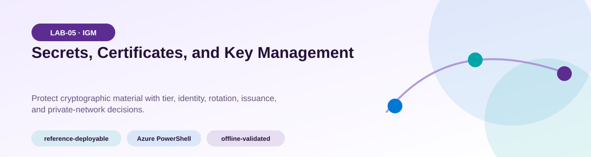
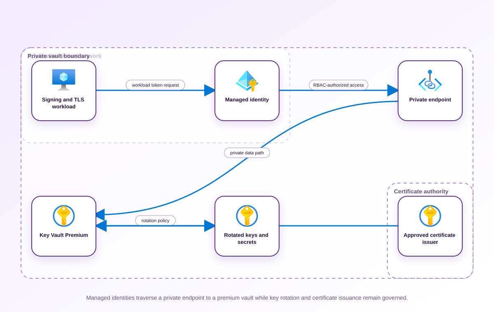
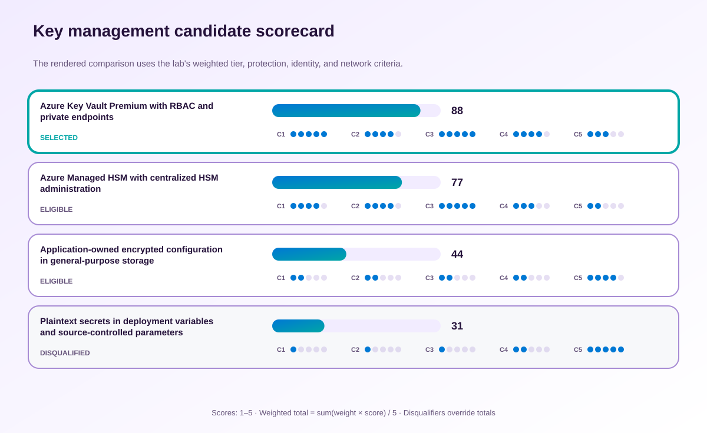

<!-- BEGIN GENERATED AZ305 V1 -->
# LAB-05 — Secrets, Certificates, and Key Management



<div class="az305-badges" aria-label="Lab classification">
  <span class="az305-mode-badge">reference-deployable</span>
  <span class="az305-lane-badge">Azure PowerShell</span>
  <span class="az305-status">offline-validated</span>
</div>

## 1. Navigation

[← LAB-04](../04-azure-hybrid-authorization/README.md) · [Lab catalog](../README.md) · [LAB-06 →](../06-resource-hierarchy-tag-governance/README.md)

## 2. Scenario and completion contract

Litware Financial runs signing, encryption, and TLS-dependent services across multiple subscriptions. Teams store secrets in separate vaults, rotate keys inconsistently, and confuse Key Vault Premium with Managed HSM. A planned payment service needs hardware-protected signing keys, short-lived certificates, managed-identity access, private connectivity, and evidence that recovery and rotation are configured without exporting sensitive material. As the cryptographic-services architect, select the appropriate vault boundaries and tiers, define ownership and separation of duties, and produce a command-verifiable lifecycle. The design must never place secret values, keys, certificates, access tokens, connection strings, or recovery material in repository state or retained evidence.

- Architect role: Cryptographic services architect
- Outcome: A governed Key Vault architecture for secrets, certificates, and keys with explicit rotation, access, and network controls.
- Duration: 160 minutes
- Difficulty: advanced
- Cost class: moderate
- Completion: all five checkpoint assertions, final validation, decision revision, and cleanup review are complete.

## 3. Objective-to-evidence map

| Objective | Requirement | Checkpoint |
| --- | --- | --- |
| `IGM-KEY-01` | `LAB05-REQ-01` | [`LAB05-CP01`](#checkpoint-1) |
| `IGM-KEY-01` | `LAB05-REQ-02` | [`LAB05-CP02`](#checkpoint-2) |
| `IGM-KEY-01` | `LAB05-REQ-03` | [`LAB05-CP03`](#checkpoint-3) |
| `IGM-KEY-01` | `LAB05-REQ-04` | [`LAB05-CP04`](#checkpoint-4) |
| `IGM-KEY-01` | `LAB05-REQ-05` | [`LAB05-CP05`](#checkpoint-5) |

## 4. Business and quality requirements

Business outcome: Protect payment cryptographic assets and reduce outage risk caused by unmanaged expiry or overprivileged access.

- `LAB05-REQ-01` — A Premium vault boundary satisfies HSM-backed key needs while keeping application secrets and certificates supportable.
- `LAB05-REQ-02` — The HSM-backed key has a ninety-day lifetime and rotates thirty days before expiry with a named application owner.
- `LAB05-REQ-03` — Issuer, subject, validity, renewal threshold, exportability, and application binding are documented and inspectable.
- `LAB05-REQ-04` — The workload identity receives only the data action needed to consume its secret at the vault boundary.
- `LAB05-REQ-05` — Approved private endpoint connectivity and private DNS support access from the intended workload network.

Scenario facts:

- **Data:** The inventory distinguishes secrets, certificates, encryption keys, HSM keys, owners, expiry dates, and recovery settings.
- **Scale:** Multiple applications share payment-vault operations, while the acquired processor introduces one separately governed HSM workload.
- **Latency:** Cryptographic calls remain on private network paths; the owner must benchmark workload-specific operation latency before sizing.
- **Availability:** Vault regional resiliency and application retry behavior are assessed separately from Managed HSM disaster-recovery procedures.
- **RTO:** Key-access restoration must fit the payment-service recovery objective, but no numerical value is supplied in the scenario.
- **RPO:** Cryptographic material must remain recoverable through soft delete and purge protection; rotation history loss is not accepted.
- **Budget:** Premium vaults suit shared application assets, while the fixed Managed HSM cost is justified only for the acquired regulated boundary.

Constraints:

- Payment secrets and keys require private access, RBAC authorization, rotation evidence, and recoverable deletion controls.
- The acquired card workload requires a single-tenant FIPS-validated HSM administration boundary separate from application vaults.
- Use only the Azure PowerShell command lane for learner implementation.
- Keep all live changes behind explicit execution and acknowledgement switches.
- Retain only sanitized command evidence and synthetic fixture identifiers.

Assumptions:

- Applications support managed identity and can rotate key or secret references without embedding credentials.
- Security owners approve emergency recovery responsibilities before enabling a production cryptographic boundary.
- West Europe is the configurable primary example and North Europe is the configurable secondary example.
- The learner has administrator-level Azure operations knowledge but receives no pre-existing authenticated context.
- Offline fixtures demonstrate contract behavior rather than live Azure service behavior.

## 5. Architecture diagram and walkthrough



Managed identities traverse a private endpoint to a premium vault while key rotation and certificate issuance remain governed. The labelled nodes, boundaries, and edges are deterministically rendered from the portable `diagrams/architecture.mmd` source and the frozen visual registry.

## 6. Concept primer and candidate architectures

Architecture decisions translate measurable requirements into a deliberate service and operating model. A candidate is viable only when every mandatory constraint is met; convenience or familiarity cannot compensate for a disqualifier.

- **Azure Key Vault Premium with RBAC and private endpoints** (eligible) — Premium vaults provide HSM-backed keys, secret and certificate management, managed-identity access, and a bounded private application interface.
- **Azure Managed HSM with centralized HSM administration** (eligible) — Managed HSM creates a single-tenant cryptographic boundary and distinct administration model, but does not replace general secret and certificate storage.
- **Application-owned encrypted configuration in general-purpose storage** (eligible) — Application encryption can protect stored values but transfers key hierarchy, rotation, audit, and recovery duties to each workload.
- **Plaintext secrets in deployment variables and source-controlled parameters** (ineligible) — Plaintext variables minimize initial setup but expose credentials to build logs, repositories, and broad deployment identities. Disqualifier: LAB05-REQ-02 requires nonexportable or protected cryptographic material with least-privilege access and rotation evidence.

## 7. Decision, ADR, and Well-Architected review

Criteria weights are C1 30, C2 25, C3 20, C4 15, and C5 10. Weighted totals use `sum(weight × score) / 5`.



| Candidate | Eligible | C1 | C2 | C3 | C4 | C5 | Weighted /100 |
| --- | ---: | ---: | ---: | ---: | ---: | ---: | ---: |
| Azure Key Vault Premium with RBAC and private endpoints | yes | 5 | 4 | 5 | 4 | 3 | 88 |
| Azure Managed HSM with centralized HSM administration | yes | 4 | 4 | 5 | 3 | 2 | 77 |
| Application-owned encrypted configuration in general-purpose storage | yes | 2 | 2 | 2 | 2 | 4 | 44 |
| Plaintext secrets in deployment variables and source-controlled parameters | no | 1 | 1 | 1 | 2 | 5 | 31 |

Selected design: **Azure Key Vault Premium with RBAC and private endpoints**. `ADR-LAB05-001` records the accepted reasoning. Review Reliability, Security, Cost Optimization, Operational Excellence, and Performance Efficiency in `design/decision.yml`; no pillar is implied by another.

Rejected alternatives:

- **Azure Managed HSM with centralized HSM administration:** The initial shared application scope does not justify moving every asset into a costlier key-only HSM pool.
- **Application-owned encrypted configuration in general-purpose storage:** It provides weaker centralized control and creates duplicated key-management code across payment applications.
- **Plaintext secrets in deployment variables and source-controlled parameters:** The proposal is ineligible because it cannot meet the mandatory secret-protection boundary.

Architecture risks:

- **Risk:** Enabling a private endpoint without validated name resolution can make the vault unreachable to payment workloads. **Mitigation:** Test private DNS resolution and a permitted managed-identity operation before disabling the public path.
- **Risk:** Separating Managed HSM administration can leave too few trained recovery officers. **Mitigation:** Assign independent deputies, rehearse quorum and recovery procedures, and monitor administrator-role expiry.

Well-Architected consequences:

<div class="az305-waf-grid">
<article class="az305-waf-card"><h3>Reliability</h3><p>Soft delete, purge protection, tested rotation, and explicit HSM recovery ownership reduce key-loss outages.</p></article>
<article class="az305-waf-card"><h3>Security</h3><p>RBAC, private endpoints, managed identities, and a separate single-tenant HSM boundary enforce cryptographic least privilege.</p></article>
<article class="az305-waf-card"><h3>Cost Optimization</h3><p>Premium vaults remain the economical shared service and Managed HSM is limited to the workload that mandates it.</p></article>
<article class="az305-waf-card"><h3>Operational Excellence</h3><p>Expiry inventory, rotation alerts, and recovery drills turn cryptographic lifecycle into an auditable runbook.</p></article>
<article class="az305-waf-card"><h3>Performance Efficiency</h3><p>Applications reuse managed identities and private endpoints while key-operation throughput is benchmarked per service.</p></article>
</div>

ADR consequences:

- Platform teams operate shared premium vaults while a separate security team owns Managed HSM administration.
- Private DNS and managed-identity readiness become deployment prerequisites for payment services.

## 8. Inputs, permissions, licensing, cost, and analogue

Use configurable `Location` (`AZ305_LOCATION`, default West Europe) and `SecondaryLocation` (`AZ305_SECONDARY_LOCATION`, default North Europe). Every public input has an explicit `AZ305_*` fallback. Preview is the default; only Golden Lab 00 writes an intent-only `execute: false` preview record. Before an executed cloud command, the supplied subscription and tenant must exactly match the active CLI, Az, and—where applicable—Microsoft Graph contexts. `-Execute` crosses the execution boundary; cost-bearing and tenant-scoped paths also require their independent acknowledgement switches.

Safe analogue: The reference topology is deployable at bounded scope; preview remains the default and live verification is separate.

Permissions: Key Vault Reader supports configuration inspection; vault, key, role-assignment, private-endpoint, or Managed HSM changes require separately approved data-plane and control-plane roles.

Licensing: Premium Key Vault HSM-backed keys and Managed HSM pools use different pricing, administration, and minimum-cost models.

Cost boundary: Include vault transactions, private connectivity, certificate renewal operations, and the continuously allocated Managed HSM pool.

## 9. Read-only preflight

```powershell
pwsh ./scripts/azure-powershell/Preflight.ps1 -RunId synthetic-050001
```

Synthetic sample: `{"labId":"LAB-05","track":"azure-powershell","result":"pass","note":"Local tool discovery only"}`. This is illustrative local output, not evidence captured from Azure.

## 10. Five guided checkpoints

<ol class="az305-checkpoint-timeline" aria-label="Five checkpoint learning path">
<li><a href="#checkpoint-1">Select vault boundary and service tier</a><span>LAB05-REQ-01 · LAB05-CP01</span></li>
<li><a href="#checkpoint-2">Define key protection and rotation</a><span>LAB05-REQ-02 · LAB05-CP02</span></li>
<li><a href="#checkpoint-3">Govern certificate issuance and renewal</a><span>LAB05-REQ-03 · LAB05-CP03</span></li>
<li><a href="#checkpoint-4">Grant managed-identity data-plane access</a><span>LAB05-REQ-04 · LAB05-CP04</span></li>
<li><a href="#checkpoint-5">Enforce a private network path</a><span>LAB05-REQ-05 · LAB05-CP05</span></li>
</ol>

### Checkpoint 1: Select vault boundary and service tier

<a id="checkpoint-1"></a>

**Trace:** `IGM-KEY-01` → `LAB05-REQ-01` → `LAB05-CP01`

```powershell
New-AzKeyVault -Name $VaultName -ResourceGroupName $ResourceGroup -Location $Location -Sku Premium -DisableRbacAuthorization:$false -Tag @{purpose='az305-lab';labId='LAB-05';runId=$RunId;expiresOn=$ExpiresOn}
```

Expected evidence: A Premium vault boundary satisfies HSM-backed key needs while keeping application secrets and certificates supportable. Retain Vault label, region, SKU, authorization model, business owner, and resource ID only.

Positive assertion:

```powershell
Get-AzKeyVault -VaultName $VaultName | Select-Object VaultName,Location,Sku,EnableRbacAuthorization,ResourceId
```

Negative assertion:

```powershell
Get-AzKeyVault -VaultName $VaultName | Where-Object { -not $_.EnableRbacAuthorization -or $_.Sku -ne 'Premium' }
```

Failure and retry: A requirement actually needs single-tenant HSM control or unsupported cryptographic functionality. Re-score Managed HSM and Key Vault Premium against key custody, API, availability, and cost requirements.

Cleanup dependency: Remove private endpoints, assignments, certificates, secrets, and keys before the vault; never automate purge.

WAF consequence: Cost Optimization: Key Vault Premium supplies required HSM-backed keys without unnecessary dedicated HSM capacity.

### Checkpoint 2: Define key protection and rotation

<a id="checkpoint-2"></a>

**Trace:** `IGM-KEY-01` → `LAB05-REQ-02` → `LAB05-CP02`

```powershell
Get-AzKeyVaultKeyRotationPolicy -VaultName $VaultName -Name $KeyName
```

Expected evidence: The HSM-backed key has a ninety-day lifetime and rotates thirty days before expiry with a named application owner. Retain Key name, key type, protection class, expiry date, rotation actions, and version count without key material.

Positive assertion:

```powershell
Get-AzKeyVaultKeyRotationPolicy -VaultName $VaultName -Name $KeyName
```

Negative assertion:

```powershell
Get-AzKeyVaultKey -VaultName $VaultName -Name $KeyName | Where-Object { -not $_.Enabled -or $_.Expires -eq $null }
```

Failure and retry: A dependent application pins a key version and cannot tolerate automated rotation. Test versionless key references and staged rollover before enabling automatic rotation.

Cleanup dependency: Disable and delete only run-owned key versions; retain recoverability and never purge.

WAF consequence: Reliability: scheduled rotation and versionless references turn rollover into an exercised application behavior.

### Checkpoint 3: Govern certificate issuance and renewal

<a id="checkpoint-3"></a>

**Trace:** `IGM-KEY-01` → `LAB05-REQ-03` → `LAB05-CP03`

```powershell
Get-AzKeyVaultCertificatePolicy -VaultName $VaultName -Name $CertificateName
```

Expected evidence: Issuer, subject, validity, renewal threshold, exportability, and application binding are documented and inspectable. Retain Certificate name, issuer class, expiry, non-secret thumbprint, renewal threshold, and consuming service.

Positive assertion:

```powershell
Get-AzKeyVaultCertificate -VaultName $VaultName -Name $CertificateName | Select-Object Name,Enabled,Expires,Thumbprint
```

Negative assertion:

```powershell
Get-AzKeyVaultCertificate -VaultName $VaultName | Where-Object { $_.Enabled -and $_.Expires -lt (Get-Date).AddDays(30) }
```

Failure and retry: The issuer cannot complete validation or the application does not reload a renewed certificate. Validate issuer permissions and exercise application rebinding with a synthetic certificate before production rollout.

Cleanup dependency: Delete only synthetic run-owned certificates and never purge recoverable versions.

WAF consequence: Operational Excellence: explicit renewal and rebind ownership prevents unmanaged certificate expiry.

### Checkpoint 4: Grant managed-identity data-plane access

<a id="checkpoint-4"></a>

**Trace:** `IGM-KEY-01` → `LAB05-REQ-04` → `LAB05-CP04`

```powershell
Get-AzRoleAssignment -ObjectId $WorkloadPrincipalId -Scope $VaultResourceId | Where-Object { $_.RoleDefinitionName -eq 'Key Vault Secrets User' }
```

Expected evidence: The workload identity receives only the data action needed to consume its secret at the vault boundary. Retain Synthetic principal ID, role name, exact scope, assignment ID, and access owner.

Positive assertion:

```powershell
Get-AzRoleAssignment -ObjectId $WorkloadPrincipalId -Scope $VaultResourceId | Where-Object { $_.RoleDefinitionName -eq 'Key Vault Secrets User' }
```

Negative assertion:

```powershell
Get-AzRoleAssignment -ObjectId $WorkloadPrincipalId -Scope $VaultResourceId | Where-Object { $_.RoleDefinitionName -in @('Owner','Contributor','Key Vault Administrator') }
```

Failure and retry: The application still relies on an access policy, shared principal, or embedded credential. Remove authorization-model overlap through a separately approved migration and retest the managed identity.

Cleanup dependency: Remove the exact assignment before deleting the run-owned identity or vault.

WAF consequence: Performance Efficiency: managed identity token handling removes custom secret distribution and refresh work from applications.

### Checkpoint 5: Enforce a private network path

<a id="checkpoint-5"></a>

**Trace:** `IGM-KEY-01` → `LAB05-REQ-05` → `LAB05-CP05`

```powershell
$vaultBeforeUpdate = Get-AzKeyVault -VaultName $VaultName -ResourceGroupName $ResourceGroup; if ($vaultBeforeUpdate.ResourceId -ine $VaultResourceId) { throw 'The supplied Key Vault ID is not the exact run-owned vault.' }; Update-AzKeyVault -VaultName $VaultName -ResourceGroupName $ResourceGroup -PublicNetworkAccess Disabled
```

Expected evidence: Approved private endpoint connectivity and private DNS support access from the intended workload network. Retain Vault resource ID, private endpoint ID, approval state, subnet, and private DNS zone label.

Positive assertion:

```powershell
Get-AzKeyVault -VaultName $VaultName -ResourceGroupName $ResourceGroup | Select-Object VaultName,ResourceId,PublicNetworkAccess
```

Negative assertion:

```powershell
Get-AzKeyVault -VaultName $VaultName | Where-Object { $_.PublicNetworkAccess -ne 'Disabled' }
```

Failure and retry: Name resolution returns the public endpoint or the private endpoint connection is pending. Correct DNS linking and approval independently before keeping public access disabled.

Cleanup dependency: Remove private DNS records and the private endpoint before the vault; preserve unrelated shared zones.

WAF consequence: Security: private endpoints and denied public access reduce vault exposure and exfiltration paths.

## 11. Final validation and interpretation

Run `Validate.ps1 -Mode Deployment -Execute` only after an executed run has state and you are authorized to issue the ten read-only checkpoint inspections. Without `-Execute`, ordinary deployment validation records `partial` and exits `2`; Golden Lab 00 alone can validate its intent-only preview locally. Exit `0` means all required assertions pass, `1` means at least one failed, and `2` means the outcome is gated or partial. Positive and negative commands execute independently, so one failure never suppresses its paired assertion.

## 12. Material change request

The acquired card-processing workload requires single-tenant FIPS-validated HSM administration and cannot share the payment application vault boundary; revise the selected service and operating model.

Revised solution: select **Azure Managed HSM with centralized HSM administration**. LAB05-REQ-01 makes the cryptographic service boundary a mandatory decision, so the acquired processor selects single-tenant Managed HSM while shared secrets and certificates remain in Key Vault.

Revised Well-Architected consequences:

- **Reliability:** Dedicated HSM recovery officers and drills become necessary for the acquired workload.
- **Security:** The processor receives a nonshared HSM trust and administration boundary.
- **Cost Optimization:** Only mandated processor keys incur the continuously allocated HSM cost.
- **Operational Excellence:** Two service inventories and escalation paths must be maintained without mixing ownership.
- **Performance Efficiency:** Processor key-operation throughput is sized independently from ordinary vault transactions.

## 13. Architect job challenge

Explain which assets remain in Key Vault and which move to Managed HSM, including role separation, backup ownership, cost, and application compatibility.

## 14. Troubleshooting, cleanup, and residual verification

- Distinguish control-plane RBAC from key, secret, and certificate data-plane permissions.
- Check private DNS resolution and endpoint approval separately when vault requests fail.
- Verify applications use versionless references before relying on automated key or certificate rollover.

Cleanup previews nonempty state in reverse dependency order, writes `partial`, and exits `2`; an already empty run is completed locally and idempotently. Executed cleanup rechecks the exact live ID plus `purpose`, `labId`, `runId`, and `expiresOn` immediately before each removal, persists state after every absent or removed object, stops on the first dependency failure, and refuses unresolved pre-existing settings. It never automates purge. Finish with `Validate.ps1 -Mode PostCleanup`; the required residual count is zero.

## 15. Exam debrief, assessment, sources, and navigation

Explain the recommendation in terms of requirements, rejected alternatives, failure behavior, and all five WAF pillars. Complete `assessment/QUESTIONS.md`, then use the separately excluded answer key for remediation.

- [Azure Key Vault best practices](https://learn.microsoft.com/en-us/azure/key-vault/general/best-practices)
- [Azure Well-Architected Framework](https://learn.microsoft.com/en-us/azure/well-architected/)

[← LAB-04](../04-azure-hybrid-authorization/README.md) · [Lab catalog](../README.md) · [LAB-06 →](../06-resource-hierarchy-tag-governance/README.md)

## 16. Synchronized lifecycle-script appendix

### Preflight.ps1

```powershell
[CmdletBinding()]
param(
    [string]$SubscriptionId = $env:AZ305_SUBSCRIPTION_ID,
    [string]$TenantId = $env:AZ305_TENANT_ID,
    [ValidatePattern('^[a-z0-9-]{6,64}$')][string]$RunId = $env:AZ305_RUN_ID,
    [string]$Location = $(if ($env:AZ305_LOCATION) { $env:AZ305_LOCATION } else { 'westeurope' }),
    [string]$SecondaryLocation = $(if ($env:AZ305_SECONDARY_LOCATION) { $env:AZ305_SECONDARY_LOCATION } else { 'northeurope' }),
    [string]$ResourceGroup = $(if ($env:AZ305_RESOURCE_GROUP) { $env:AZ305_RESOURCE_GROUP } else { "rg-az305-$RunId" }),
    [string]$WorkloadName = $(if ($env:AZ305_WORKLOAD_NAME) { $env:AZ305_WORKLOAD_NAME } else { "az305-$RunId" }),
    [string]$ExpiresOn = $(if ($env:AZ305_EXPIRES_ON) { $env:AZ305_EXPIRES_ON } else { (Get-Date).ToUniversalTime().AddDays(1).ToString('yyyy-MM-dd') }),
    [string]$CertificateName = $env:AZ305_CERTIFICATE_NAME,
    [string]$KeyName = $env:AZ305_KEY_NAME,
    [string]$VaultName = $env:AZ305_VAULT_NAME,
    [string]$VaultResourceId = $env:AZ305_VAULT_RESOURCE_ID,
    [string]$WorkloadPrincipalId = $env:AZ305_WORKLOAD_PRINCIPAL_ID,
    [switch]$Execute,
    [switch]$AcknowledgeCost,
    [switch]$AcknowledgeTenantChange
)

$ErrorActionPreference = 'Stop'
$PSNativeCommandUseErrorActionPreference = $true
if (-not $RunId) { [Console]::Error.WriteLine('RunId or AZ305_RUN_ID is required.'); exit 2 }
# Every lifecycle entrypoint intentionally exposes the same public parameter contract.
@($SubscriptionId, $TenantId, $RunId, $Location, $SecondaryLocation, $ResourceGroup, $WorkloadName, $ExpiresOn, $CertificateName, $KeyName, $VaultName, $VaultResourceId, $WorkloadPrincipalId, $Execute, $AcknowledgeCost, $AcknowledgeTenantChange) | Out-Null

$requiredCommands = @('pwsh')
$missing = @($requiredCommands | Where-Object { -not (Get-Command $_ -ErrorAction SilentlyContinue) })
if ($missing.Count -gt 0) {
    Write-Error "Missing local commands: $($missing -join ', ')"
    exit 1
}
$requiredCmdlets = @('Get-AzKeyVault', 'Get-AzKeyVaultCertificate', 'Get-AzKeyVaultCertificatePolicy', 'Get-AzKeyVaultKey', 'Get-AzKeyVaultKeyRotationPolicy', 'Get-AzRoleAssignment', 'New-AzKeyVault', 'Update-AzKeyVault')
$missingCmdlets = @($requiredCmdlets | Where-Object { -not (Get-Command $_ -ErrorAction SilentlyContinue) })
if ($missingCmdlets.Count -gt 0) {
    Write-Error "Missing local cmdlets: $($missingCmdlets -join ', ')"
    exit 1
}

[pscustomobject]@{
    labId = 'LAB-05'
    track = 'azure-powershell'
    implementationMode = 'reference-deployable'
    result = 'pass'
    note = 'Local tool discovery only; no Azure or Microsoft Graph request was made.'
} | ConvertTo-Json
exit 0
```

### Setup.ps1

```powershell
[CmdletBinding()]
param(
    [string]$SubscriptionId = $env:AZ305_SUBSCRIPTION_ID,
    [string]$TenantId = $env:AZ305_TENANT_ID,
    [ValidatePattern('^[a-z0-9-]{6,64}$')][string]$RunId = $env:AZ305_RUN_ID,
    [string]$Location = $(if ($env:AZ305_LOCATION) { $env:AZ305_LOCATION } else { 'westeurope' }),
    [string]$SecondaryLocation = $(if ($env:AZ305_SECONDARY_LOCATION) { $env:AZ305_SECONDARY_LOCATION } else { 'northeurope' }),
    [string]$ResourceGroup = $(if ($env:AZ305_RESOURCE_GROUP) { $env:AZ305_RESOURCE_GROUP } else { "rg-az305-$RunId" }),
    [string]$WorkloadName = $(if ($env:AZ305_WORKLOAD_NAME) { $env:AZ305_WORKLOAD_NAME } else { "az305-$RunId" }),
    [string]$ExpiresOn = $(if ($env:AZ305_EXPIRES_ON) { $env:AZ305_EXPIRES_ON } else { (Get-Date).ToUniversalTime().AddDays(1).ToString('yyyy-MM-dd') }),
    [string]$CertificateName = $env:AZ305_CERTIFICATE_NAME,
    [string]$KeyName = $env:AZ305_KEY_NAME,
    [string]$VaultName = $env:AZ305_VAULT_NAME,
    [string]$VaultResourceId = $env:AZ305_VAULT_RESOURCE_ID,
    [string]$WorkloadPrincipalId = $env:AZ305_WORKLOAD_PRINCIPAL_ID,
    [switch]$Execute,
    [switch]$AcknowledgeCost,
    [switch]$AcknowledgeTenantChange
)

$ErrorActionPreference = 'Stop'
$PSNativeCommandUseErrorActionPreference = $true
if (-not $RunId) { [Console]::Error.WriteLine('RunId or AZ305_RUN_ID is required.'); exit 2 }
# Every lifecycle entrypoint intentionally exposes the same public parameter contract.
@($SubscriptionId, $TenantId, $RunId, $Location, $SecondaryLocation, $ResourceGroup, $WorkloadName, $ExpiresOn, $CertificateName, $KeyName, $VaultName, $VaultResourceId, $WorkloadPrincipalId, $Execute, $AcknowledgeCost, $AcknowledgeTenantChange) | Out-Null

$LabRoot = Split-Path (Split-Path $PSScriptRoot -Parent) -Parent
$StateRoot = Join-Path $LabRoot ".state/$RunId"
$StatePath = Join-Path $StateRoot 'run.json'

function Assert-ExactExecutionContext {
    [CmdletBinding()]
    param([string]$ExpectedSubscriptionId, [string]$ExpectedTenantId)
    if ([string]::IsNullOrWhiteSpace($ExpectedSubscriptionId) -or [string]::IsNullOrWhiteSpace($ExpectedTenantId)) { throw 'SubscriptionId and TenantId are required before an Azure request.' }
    $azContext = Get-AzContext -ErrorAction Stop
    if (-not $azContext -or [string]$azContext.Subscription.Id -ine $ExpectedSubscriptionId -or [string]$azContext.Tenant.Id -ine $ExpectedTenantId) {
        throw 'The active Azure PowerShell subscription or tenant does not exactly match the requested context.'
    }
}

function Save-RunState {
    [CmdletBinding()]
    param([Parameter(Mandatory)]$State)
    $temporaryPath = "$StatePath.tmp"
    $State | ConvertTo-Json -Depth 20 | Set-Content -LiteralPath $temporaryPath -Encoding utf8NoBOM
    Move-Item -LiteralPath $temporaryPath -Destination $StatePath -Force
}

function Assert-SafeStateValue {
    [CmdletBinding()]
    param($Value)
    $serialized = $Value | ConvertTo-Json -Depth 12 -Compress
    if ($serialized -match '(?i)"(?:token|password|secret|certificate|connectionString|sas|clientSecret|accessToken|refreshToken|accountKey|privateKey)"\s*:') {
        throw 'A prohibited sensitive field name was returned; state capture is refused.'
    }
}

function Convert-CheckpointOutput {
    [CmdletBinding()]
    param($Value)
    if ($Value -is [string]) { $raw = [string]$Value }
    elseif ($Value -is [System.Collections.IEnumerable] -and @($Value | Where-Object { $_ -isnot [string] }).Count -eq 0) { $raw = @($Value) -join "`n" }
    else { return $Value }
    if ([string]::IsNullOrWhiteSpace($raw)) { return $null }
    try { return ($raw | ConvertFrom-Json -Depth 100) } catch { return $Value }
}

function Get-ReturnedResourceId {
    [CmdletBinding()]
    param($Value)
    $seen = [System.Collections.Generic.HashSet[string]]::new([System.StringComparer]::OrdinalIgnoreCase)
    $results = [System.Collections.Generic.List[string]]::new()
    function Add-ArmId {
        param($Candidate)
        if ($Candidate -is [string] -and $Candidate -match '^/subscriptions/[0-9a-f-]+/(?:resourceGroups/[^/]+(?:/providers/.+)?|providers/.+)$' -and $Candidate -notmatch '/providers/Microsoft\.Resources/deployments/') {
            if ($seen.Add($Candidate)) { $results.Add($Candidate) }
        }
    }
    function Find-DeploymentOutputId {
        param($Item, [int]$Depth)
        if ($null -eq $Item -or $Depth -gt 12) { return }
        if ($Item -is [string]) { Add-ArmId -Candidate $Item; return }
        if ($Item -is [System.Collections.IDictionary]) { foreach ($key in $Item.Keys) { Find-DeploymentOutputId -Item $Item[$key] -Depth ($Depth + 1) }; return }
        if ($Item -is [System.Collections.IEnumerable]) { foreach ($entry in $Item) { Find-DeploymentOutputId -Item $entry -Depth ($Depth + 1) }; return }
        foreach ($property in @($Item.PSObject.Properties | Where-Object { $_.MemberType -in @('NoteProperty', 'Property') })) { Find-DeploymentOutputId -Item $property.Value -Depth ($Depth + 1) }
    }
    foreach ($rootItem in @($Value)) {
        if ($rootItem -is [System.Collections.IDictionary]) {
            foreach ($name in @('id', 'resourceId')) { if ($rootItem.Contains($name)) { Add-ArmId -Candidate $rootItem[$name] } }
            if ($rootItem.Contains('properties') -and $rootItem.properties -and $rootItem.properties.outputs) { Find-DeploymentOutputId -Item $rootItem.properties.outputs -Depth 0 }
            continue
        }
        foreach ($name in @('Id', 'ResourceId')) {
            $property = $rootItem.PSObject.Properties[$name]
            if ($property) { Add-ArmId -Candidate $property.Value }
        }
        if ($rootItem.PSObject.Properties['Properties'] -and $rootItem.Properties -and $rootItem.Properties.outputs) {
            Find-DeploymentOutputId -Item $rootItem.Properties.outputs -Depth 0
        }
    }
    return @($results)
}

function Get-PlannedDeploymentResourceId {
    [CmdletBinding()]
    param($Value)
    $seen = [System.Collections.Generic.HashSet[string]]::new([System.StringComparer]::OrdinalIgnoreCase)
    $results = [System.Collections.Generic.List[string]]::new()
    foreach ($change in @($Value.changes)) {
        $candidate = [string]$change.resourceId
        if ($candidate -match '^/subscriptions/[0-9a-f-]+/(?:resourceGroups/[^/]+(?:/providers/.+)?|providers/.+)$' -and $candidate -notmatch '/providers/Microsoft\.Resources/deployments/' -and $seen.Add($candidate)) {
            $results.Add($candidate)
        }
    }
    return @($results)
}

function Assert-InputSubscriptionScope {
    [CmdletBinding()]
    param($Inputs, [string]$ExpectedSubscriptionId)
    $entries = if ($Inputs -is [System.Collections.IDictionary]) {
        @($Inputs.GetEnumerator())
    } else {
        @($Inputs.PSObject.Properties | ForEach-Object { [pscustomobject]@{ Key = $_.Name; Value = $_.Value } })
    }
    foreach ($entry in $entries) {
        if ($entry.Value -is [string] -and [string]$entry.Value -match '^/subscriptions/([^/]+)/') {
            if ($Matches[1] -ine $ExpectedSubscriptionId) { throw "Input $($entry.Key) belongs to a different subscription." }
        }
    }
}

function Assert-ManagedMutation {
    [CmdletBinding()]
    param($State, [string]$CheckpointId, [bool]$CarriesOwnership, [object[]]$TargetResourceIds)
    if ($CarriesOwnership) { return }
    $targets = @($TargetResourceIds | Where-Object { $_ -is [string] -and $_ -match '^/subscriptions/' })
    if ($targets.Count -eq 0) { throw "$CheckpointId refuses an untagged mutation because no exact ARM target ID was supplied." }
    $knownIds = @($State.managedObjects | ForEach-Object { [string]$_.id })
    if ($knownIds.Count -eq 0) { throw "$CheckpointId refuses to modify a pre-existing object because no run-owned parent has been recorded." }
    foreach ($target in $targets) {
        $related = @($knownIds | Where-Object { $target -ieq $_ -or $target.StartsWith("$_/", [System.StringComparison]::OrdinalIgnoreCase) -or $_.StartsWith("$target/", [System.StringComparison]::OrdinalIgnoreCase) }).Count -gt 0
        if (-not $related) { throw "$CheckpointId refuses a mutation outside the exact run-owned resource boundary." }
    }
}

$executionInputs = [ordered]@{ subscriptionId = $SubscriptionId; tenantId = $TenantId; location = $Location; secondaryLocation = $SecondaryLocation; resourceGroup = $ResourceGroup; workloadName = $WorkloadName; expiresOn = $ExpiresOn; CertificateName = $CertificateName; KeyName = $KeyName; VaultName = $VaultName; VaultResourceId = $VaultResourceId; WorkloadPrincipalId = $WorkloadPrincipalId }

if (-not $Execute) {
    Write-Output '[preview] No cloud command was called and no state was created.'
    Write-Output '[preview] Re-run with -Execute only in an authorized disposable environment.'
    exit 0
}
# This setup is compatible with the lab implementation mode.
if (-not $AcknowledgeCost) { [Console]::Error.WriteLine('Cost acknowledgement is required.'); exit 2 }
# This lab does not perform a tenant-scoped change by default.
$requiredLabInputs = [ordered]@{ CertificateName = $CertificateName; KeyName = $KeyName; VaultName = $VaultName; VaultResourceId = $VaultResourceId; WorkloadPrincipalId = $WorkloadPrincipalId }
$missingLabInputs = @($requiredLabInputs.GetEnumerator() | Where-Object { $_.Value -is [string] -and [string]::IsNullOrWhiteSpace([string]$_.Value) } | ForEach-Object Key)
if ($missingLabInputs.Count -gt 0) { [Console]::Error.WriteLine("Execution is gated; supply: $($missingLabInputs -join ', ')."); exit 2 }

try {
    Assert-ExactExecutionContext -ExpectedSubscriptionId $SubscriptionId -ExpectedTenantId $TenantId
    Assert-InputSubscriptionScope -Inputs $executionInputs -ExpectedSubscriptionId $SubscriptionId
    Assert-SafeStateValue -Value $executionInputs
}
catch {
    [Console]::Error.WriteLine("Execution is gated by context or input validation: $($_.Exception.Message)")
    exit 2
}

# Recovery state is persisted before the first possible mutation below.
if (Test-Path -LiteralPath $StatePath) {
    [Console]::Error.WriteLine('Run state already exists. Choose a new RunId or complete the recorded cleanup; existing recovery state will not be overwritten.')
    exit 2
}
New-Item -ItemType Directory -Path $StateRoot -Force | Out-Null
$state = [ordered]@{
    schemaVersion = '1.0.0'; labId = 'LAB-05'; runId = $RunId; track = 'azure-powershell'
    implementationMode = 'reference-deployable'; status = 'initialized'
    createdAt = (Get-Date).ToUniversalTime().ToString('o'); execute = $true
    parameters = $executionInputs
    managedObjects = @(); originalSettings = @()
}
Save-RunState -State $state
$state.status = 'deploying'
Save-RunState -State $state

$originalLocation = Get-Location
try {
    Set-Location -LiteralPath $LabRoot
    # 05-CP01: Select vault boundary and service tier
    Assert-ManagedMutation -State $state -CheckpointId 'LAB05-CP01' -CarriesOwnership:$true -TargetResourceIds @()
    $stepResult = & { New-AzKeyVault -Name $VaultName -ResourceGroupName $ResourceGroup -Location $Location -Sku Premium -DisableRbacAuthorization:$false -Tag @{purpose='az305-lab';labId='LAB-05';runId=$RunId;expiresOn=$ExpiresOn} }
    $candidate = Convert-CheckpointOutput -Value $stepResult
    $returnedIds = @(Get-ReturnedResourceId -Value $candidate)
    if ($returnedIds.Count -eq 0) { throw 'LAB05-CP01 created an owned resource but returned no recoverable ARM resource ID.' }
    foreach ($returnedId in $returnedIds) {
        if ($returnedId -notmatch '^/subscriptions/([^/]+)/' -or $Matches[1] -ine $SubscriptionId) { throw 'A returned recovery ID belongs to a different subscription.' }
        if (@($state.managedObjects | Where-Object { $_.id -ieq $returnedId }).Count -eq 0) {
            $state.managedObjects += [pscustomobject]@{
                id = $returnedId
                type = 'azure-resource'
                tags = [ordered]@{ purpose = 'az305-lab'; labId = 'LAB-05'; runId = $RunId; expiresOn = $ExpiresOn }
            }
            Save-RunState -State $state
        }
    }
    $null = $stepResult

    # 05-CP02: Define key protection and rotation
    $stepResult = & { Get-AzKeyVaultKeyRotationPolicy -VaultName $VaultName -Name $KeyName }
    $null = $stepResult

    # 05-CP03: Govern certificate issuance and renewal
    $stepResult = & { Get-AzKeyVaultCertificatePolicy -VaultName $VaultName -Name $CertificateName }
    $null = $stepResult

    # 05-CP04: Grant managed-identity data-plane access
    $stepResult = & { Get-AzRoleAssignment -ObjectId $WorkloadPrincipalId -Scope $VaultResourceId | Where-Object { $_.RoleDefinitionName -eq 'Key Vault Secrets User' } }
    $null = $stepResult

    # 05-CP05: Enforce a private network path
    Assert-ManagedMutation -State $state -CheckpointId 'LAB05-CP05' -CarriesOwnership:$false -TargetResourceIds @($VaultResourceId)
    # Capture the original non-secret projection before changing an exact run-owned object.
    $originalProjection = & { Get-AzKeyVault -VaultName $VaultName -ResourceGroupName $ResourceGroup | Select-Object VaultName,ResourceId,PublicNetworkAccess }
    Assert-SafeStateValue -Value $originalProjection
    foreach ($originalTargetId in @($VaultResourceId)) {
        $state.originalSettings += [pscustomobject]@{ id = $originalTargetId; setting = 'LAB05-CP05: Enforce a private network path'; value = $originalProjection }
    }
    Save-RunState -State $state
    $stepResult = & { $vaultBeforeUpdate = Get-AzKeyVault -VaultName $VaultName -ResourceGroupName $ResourceGroup; if ($vaultBeforeUpdate.ResourceId -ine $VaultResourceId) { throw 'The supplied Key Vault ID is not the exact run-owned vault.' }; Update-AzKeyVault -VaultName $VaultName -ResourceGroupName $ResourceGroup -PublicNetworkAccess Disabled }
    $null = $stepResult

    $state.status = 'deployed'
    Save-RunState -State $state
} catch {
    $state.status = 'failed'
    Save-RunState -State $state
    Write-Error $_
    exit 1
} finally {
    Set-Location -LiteralPath $originalLocation
}
exit 0
```

### Validate.ps1

```powershell
[CmdletBinding()]
param(
    [string]$SubscriptionId = $env:AZ305_SUBSCRIPTION_ID,
    [string]$TenantId = $env:AZ305_TENANT_ID,
    [ValidatePattern('^[a-z0-9-]{6,64}$')][string]$RunId = $env:AZ305_RUN_ID,
    [string]$Location = $(if ($env:AZ305_LOCATION) { $env:AZ305_LOCATION } else { 'westeurope' }),
    [string]$SecondaryLocation = $(if ($env:AZ305_SECONDARY_LOCATION) { $env:AZ305_SECONDARY_LOCATION } else { 'northeurope' }),
    [string]$ResourceGroup = $(if ($env:AZ305_RESOURCE_GROUP) { $env:AZ305_RESOURCE_GROUP } else { "rg-az305-$RunId" }),
    [string]$WorkloadName = $(if ($env:AZ305_WORKLOAD_NAME) { $env:AZ305_WORKLOAD_NAME } else { "az305-$RunId" }),
    [string]$ExpiresOn = $(if ($env:AZ305_EXPIRES_ON) { $env:AZ305_EXPIRES_ON } else { (Get-Date).ToUniversalTime().AddDays(1).ToString('yyyy-MM-dd') }),
    [string]$CertificateName = $env:AZ305_CERTIFICATE_NAME,
    [string]$KeyName = $env:AZ305_KEY_NAME,
    [string]$VaultName = $env:AZ305_VAULT_NAME,
    [string]$VaultResourceId = $env:AZ305_VAULT_RESOURCE_ID,
    [string]$WorkloadPrincipalId = $env:AZ305_WORKLOAD_PRINCIPAL_ID,
    [ValidateSet('Deployment', 'PostCleanup')][string]$Mode = 'Deployment',
    [switch]$Execute,
    [switch]$AcknowledgeCost,
    [switch]$AcknowledgeTenantChange
)

$ErrorActionPreference = 'Stop'
$PSNativeCommandUseErrorActionPreference = $true
if (-not $RunId) { [Console]::Error.WriteLine('RunId or AZ305_RUN_ID is required.'); exit 2 }
# Every lifecycle entrypoint intentionally exposes the same public parameter contract.
@($SubscriptionId, $TenantId, $RunId, $Location, $SecondaryLocation, $ResourceGroup, $WorkloadName, $ExpiresOn, $CertificateName, $KeyName, $VaultName, $VaultResourceId, $WorkloadPrincipalId, $Mode, $Execute, $AcknowledgeCost, $AcknowledgeTenantChange) | Out-Null

$LabRoot = Split-Path (Split-Path $PSScriptRoot -Parent) -Parent
$StateRoot = Join-Path $LabRoot ".state/$RunId"
$RunPath = Join-Path $StateRoot 'run.json'
$ValidationPath = Join-Path $StateRoot 'validation.json'

function Assert-ExactExecutionContext {
    [CmdletBinding()]
    param([string]$ExpectedSubscriptionId, [string]$ExpectedTenantId)
    if ([string]::IsNullOrWhiteSpace($ExpectedSubscriptionId) -or [string]::IsNullOrWhiteSpace($ExpectedTenantId)) { throw 'SubscriptionId and TenantId are required before an Azure request.' }
    $azContext = Get-AzContext -ErrorAction Stop
    if (-not $azContext -or [string]$azContext.Subscription.Id -ine $ExpectedSubscriptionId -or [string]$azContext.Tenant.Id -ine $ExpectedTenantId) {
        throw 'The active Azure PowerShell subscription or tenant does not exactly match the requested context.'
    }
}


if (-not (Test-Path -LiteralPath $RunPath)) {
    Write-Warning 'No run state exists; validation is gated.'
    exit 2
}
$state = Get-Content -LiteralPath $RunPath -Raw | ConvertFrom-Json
$assertions = [System.Collections.Generic.List[object]]::new()
function Add-ValidationAssertion {
    [CmdletBinding()]
    param([string]$Id, [ValidateSet('positive', 'negative')][string]$Kind, [bool]$Passed, [string]$Message)
    $assertions.Add([pscustomobject]@{ id = $Id; kind = $Kind; passed = $Passed; message = $Message })
}

function Save-ValidationArtifact {
    [CmdletBinding()]
    param([ValidateSet('pass', 'partial', 'fail')][string]$Result)
    $artifact = [ordered]@{ schemaVersion = '1.0.0'; labId = 'LAB-05'; runId = $RunId; mode = $Mode; result = $Result; validatedAt = (Get-Date).ToUniversalTime().ToString('o'); assertions = @($assertions) }
    $artifact | ConvertTo-Json -Depth 12 | Set-Content -LiteralPath $ValidationPath -Encoding utf8NoBOM
}

function Test-PositiveEvidence {
    [CmdletBinding()]
    param($Value)
    if ($Value -is [bool]) { return $Value }
    if ($null -eq $Value) { return $false }
    if ($Value -is [string]) { return -not [string]::IsNullOrWhiteSpace($Value) }
    if ($Value -is [System.Collections.IEnumerable]) { return @($Value).Count -gt 0 }
    return $true
}

function Test-NegativeEvidence {
    [CmdletBinding()]
    param($Value)
    if ($Value -is [bool]) { return $Value }
    if ($null -eq $Value) { return $true }
    if ($Value -is [string]) { return [string]::IsNullOrWhiteSpace($Value) }
    if ($Value -is [System.Collections.IEnumerable]) { return @($Value).Count -eq 0 }
    $properties = @($Value.PSObject.Properties | Where-Object { $_.MemberType -in @('NoteProperty', 'Property') })
    if ($properties.Count -eq 0) { return $false }
    return @($properties | Where-Object { -not (Test-NegativeEvidence -Value $_.Value) }).Count -eq 0
}

function Test-ProhibitedStateField {
    [CmdletBinding()]
    param($Value)
    $serialized = $Value | ConvertTo-Json -Depth 20
    return $serialized -match '(?i)"(?:token|password|secret|certificate|connectionString|sas|clientSecret|accessToken|refreshToken|accountKey|privateKey)"\s*:'
}

function Assert-InputSubscriptionScope {
    [CmdletBinding()]
    param($Inputs, [string]$ExpectedSubscriptionId)
    $entries = if ($Inputs -is [System.Collections.IDictionary]) {
        @($Inputs.GetEnumerator())
    } else {
        @($Inputs.PSObject.Properties | ForEach-Object { [pscustomobject]@{ Key = $_.Name; Value = $_.Value } })
    }
    foreach ($entry in $entries) {
        if ($entry.Value -is [string] -and [string]$entry.Value -match '^/subscriptions/([^/]+)/' -and $Matches[1] -ine $ExpectedSubscriptionId) {
            throw "Input $($entry.Key) belongs to a different subscription."
        }
    }
}

$stateIdentityMatches = (
    $state.labId -ceq 'LAB-05' -and
    $state.runId -ceq $RunId -and
    $state.track -ceq 'azure-powershell' -and
    $state.implementationMode -ceq 'reference-deployable' -and
    ([string]$state.parameters.subscriptionId -ieq $SubscriptionId -and [string]$state.parameters.tenantId -ieq $TenantId)
)
Add-ValidationAssertion -Id 'LAB05-VAL-POS-01' -Kind positive -Passed $stateIdentityMatches -Message 'Run identity, implementation mode, command track, tenant, and subscription exactly match the copied lab and requested run.'
$hasSensitiveName = Test-ProhibitedStateField -Value $state
Add-ValidationAssertion -Id 'LAB05-VAL-NEG-01' -Kind negative -Passed (-not $hasSensitiveName) -Message 'State contains no prohibited sensitive field name.'

if ($Mode -eq 'PostCleanup') {
    $cleanupPath = Join-Path $StateRoot 'cleanup.json'
    $cleanup = if (Test-Path -LiteralPath $cleanupPath) { Get-Content -LiteralPath $cleanupPath -Raw | ConvertFrom-Json } else { $null }
    Add-ValidationAssertion -Id 'LAB05-VAL-POS-02' -Kind positive -Passed ($null -ne $cleanup -and $cleanup.labId -ceq 'LAB-05' -and $cleanup.runId -ceq $RunId -and $cleanup.result -eq 'pass' -and $cleanup.ownershipVerified) -Message 'The exact run cleanup completed with verified ownership.'
    Add-ValidationAssertion -Id 'LAB05-VAL-NEG-02' -Kind negative -Passed ($null -ne $cleanup -and $cleanup.activeManagedObjects -eq 0 -and @($state.managedObjects).Count -eq 0 -and @($state.originalSettings).Count -eq 0 -and $state.status -eq 'cleaned') -Message 'No active managed object or unresolved original setting remains in cleanup or run state.'
    $postCleanupPassed = @($assertions | Where-Object { -not $_.passed }).Count -eq 0
    Save-ValidationArtifact -Result $(if ($postCleanupPassed) { 'pass' } else { 'fail' })
    if ($postCleanupPassed) { exit 0 }
    exit 1
}

Add-ValidationAssertion -Id 'LAB05-VAL-POS-02' -Kind positive -Passed ($state.status -eq 'deployed') -Message 'The executed setup completed successfully; a failed setup can never validate as pass.'
Add-ValidationAssertion -Id 'LAB05-VAL-NEG-02' -Kind negative -Passed (@($state.managedObjects | Where-Object { $_.tags.purpose -ne 'az305-lab' -or $_.tags.labId -ne 'LAB-05' -or $_.tags.runId -ne $RunId }).Count -eq 0) -Message 'No recorded object has a foreign ownership tag.'

if (@($assertions | Where-Object { -not $_.passed }).Count -gt 0) {
    Save-ValidationArtifact -Result 'fail'
    exit 1
}
if (-not $Execute) {
    # This lab has no special intent-only validation path.
    Save-ValidationArtifact -Result 'partial'
    Write-Warning 'Checkpoint validation is gated; re-run with -Execute after confirming the exact read-only context.'
    exit 2
}
# The validation surface is compatible with this lab implementation mode.
$requiredValidationInputs = [ordered]@{ CertificateName = $CertificateName; KeyName = $KeyName; VaultName = $VaultName; VaultResourceId = $VaultResourceId; WorkloadPrincipalId = $WorkloadPrincipalId }
$missingValidationInputs = @($requiredValidationInputs.GetEnumerator() | Where-Object { $_.Value -is [string] -and [string]::IsNullOrWhiteSpace([string]$_.Value) } | ForEach-Object Key)
if ($missingValidationInputs.Count -gt 0) {
    Add-ValidationAssertion -Id 'LAB05-VAL-POS-CONTEXT' -Kind positive -Passed $false -Message 'One or more required non-secret validation inputs are missing.'
    Save-ValidationArtifact -Result 'partial'
    exit 2
}
try {
    Assert-ExactExecutionContext -ExpectedSubscriptionId $SubscriptionId -ExpectedTenantId $TenantId
    Assert-InputSubscriptionScope -Inputs $state.parameters -ExpectedSubscriptionId $SubscriptionId
    Add-ValidationAssertion -Id 'LAB05-VAL-POS-CONTEXT' -Kind positive -Passed $true -Message 'The active tenant and subscription exactly match the requested validation context.'
}
catch {
    Add-ValidationAssertion -Id 'LAB05-VAL-POS-CONTEXT' -Kind positive -Passed $false -Message 'Exact execution context could not be proven.'
    Save-ValidationArtifact -Result 'partial'
    exit 2
}

$originalLocation = Get-Location
try {
    Set-Location -LiteralPath $LabRoot
# LAB05-CP01: run both polarities even when one fails.
$positivePassed = $false
try {
    $global:LASTEXITCODE = 0
    $positiveEvidence = & { Get-AzKeyVault -VaultName $VaultName | Select-Object VaultName,Location,Sku,EnableRbacAuthorization,ResourceId }
    $positivePassed = (Test-PositiveEvidence -Value $positiveEvidence)
    $null = $positiveEvidence
} catch { $positivePassed = $false }
Add-ValidationAssertion -Id 'LAB05-CP01-POS' -Kind positive -Passed $positivePassed -Message 'A Premium vault boundary satisfies HSM-backed key needs while keeping application secrets and certificates supportable.'

$negativePassed = $false
try {
    $global:LASTEXITCODE = 0
    $negativeEvidence = & { Get-AzKeyVault -VaultName $VaultName | Where-Object { -not $_.EnableRbacAuthorization -or $_.Sku -ne 'Premium' } }
    $negativePassed = (Test-NegativeEvidence -Value $negativeEvidence)
    $null = $negativeEvidence
} catch { $negativePassed = $false }
Add-ValidationAssertion -Id 'LAB05-CP01-NEG' -Kind negative -Passed $negativePassed -Message 'A software-only tier or legacy access-policy model is not silently substituted.'

# LAB05-CP02: run both polarities even when one fails.
$positivePassed = $false
try {
    $global:LASTEXITCODE = 0
    $positiveEvidence = & { Get-AzKeyVaultKeyRotationPolicy -VaultName $VaultName -Name $KeyName }
    $positivePassed = (Test-PositiveEvidence -Value $positiveEvidence)
    $null = $positiveEvidence
} catch { $positivePassed = $false }
Add-ValidationAssertion -Id 'LAB05-CP02-POS' -Kind positive -Passed $positivePassed -Message 'The HSM-backed key has a ninety-day lifetime and rotates thirty days before expiry with a named application owner.'

$negativePassed = $false
try {
    $global:LASTEXITCODE = 0
    $negativeEvidence = & { Get-AzKeyVaultKey -VaultName $VaultName -Name $KeyName | Where-Object { -not $_.Enabled -or $_.Expires -eq $null } }
    $negativePassed = (Test-NegativeEvidence -Value $negativeEvidence)
    $null = $negativeEvidence
} catch { $negativePassed = $false }
Add-ValidationAssertion -Id 'LAB05-CP02-NEG' -Kind negative -Passed $negativePassed -Message 'No enabled production key lacks an expiry and rotation policy.'

# LAB05-CP03: run both polarities even when one fails.
$positivePassed = $false
try {
    $global:LASTEXITCODE = 0
    $positiveEvidence = & { Get-AzKeyVaultCertificate -VaultName $VaultName -Name $CertificateName | Select-Object Name,Enabled,Expires,Thumbprint }
    $positivePassed = (Test-PositiveEvidence -Value $positiveEvidence)
    $null = $positiveEvidence
} catch { $positivePassed = $false }
Add-ValidationAssertion -Id 'LAB05-CP03-POS' -Kind positive -Passed $positivePassed -Message 'Issuer, subject, validity, renewal threshold, exportability, and application binding are documented and inspectable.'

$negativePassed = $false
try {
    $global:LASTEXITCODE = 0
    $negativeEvidence = & { Get-AzKeyVaultCertificate -VaultName $VaultName | Where-Object { $_.Enabled -and $_.Expires -lt (Get-Date).AddDays(30) } }
    $negativePassed = (Test-NegativeEvidence -Value $negativeEvidence)
    $null = $negativeEvidence
} catch { $negativePassed = $false }
Add-ValidationAssertion -Id 'LAB05-CP03-NEG' -Kind negative -Passed $negativePassed -Message 'No enabled certificate approaches expiry without an owned renewal path.'

# LAB05-CP04: run both polarities even when one fails.
$positivePassed = $false
try {
    $global:LASTEXITCODE = 0
    $positiveEvidence = & { Get-AzRoleAssignment -ObjectId $WorkloadPrincipalId -Scope $VaultResourceId | Where-Object { $_.RoleDefinitionName -eq 'Key Vault Secrets User' } }
    $positivePassed = (Test-PositiveEvidence -Value $positiveEvidence)
    $null = $positiveEvidence
} catch { $positivePassed = $false }
Add-ValidationAssertion -Id 'LAB05-CP04-POS' -Kind positive -Passed $positivePassed -Message 'The workload identity receives only the data action needed to consume its secret at the vault boundary.'

$negativePassed = $false
try {
    $global:LASTEXITCODE = 0
    $negativeEvidence = & { Get-AzRoleAssignment -ObjectId $WorkloadPrincipalId -Scope $VaultResourceId | Where-Object { $_.RoleDefinitionName -in @('Owner','Contributor','Key Vault Administrator') } }
    $negativePassed = (Test-NegativeEvidence -Value $negativeEvidence)
    $null = $negativeEvidence
} catch { $negativePassed = $false }
Add-ValidationAssertion -Id 'LAB05-CP04-NEG' -Kind negative -Passed $negativePassed -Message 'The workload cannot administer the vault, roles, keys, or certificates.'

# LAB05-CP05: run both polarities even when one fails.
$positivePassed = $false
try {
    $global:LASTEXITCODE = 0
    $positiveEvidence = & { Get-AzKeyVault -VaultName $VaultName -ResourceGroupName $ResourceGroup | Select-Object VaultName,ResourceId,PublicNetworkAccess }
    $positivePassed = (Test-PositiveEvidence -Value $positiveEvidence)
    $null = $positiveEvidence
} catch { $positivePassed = $false }
Add-ValidationAssertion -Id 'LAB05-CP05-POS' -Kind positive -Passed $positivePassed -Message 'Approved private endpoint connectivity and private DNS support access from the intended workload network.'

$negativePassed = $false
try {
    $global:LASTEXITCODE = 0
    $negativeEvidence = & { Get-AzKeyVault -VaultName $VaultName | Where-Object { $_.PublicNetworkAccess -ne 'Disabled' } }
    $negativePassed = (Test-NegativeEvidence -Value $negativeEvidence)
    $null = $negativeEvidence
} catch { $negativePassed = $false }
Add-ValidationAssertion -Id 'LAB05-CP05-NEG' -Kind negative -Passed $negativePassed -Message 'Public network access is not used as a fallback for DNS or routing mistakes.'

}
finally {
    Set-Location -LiteralPath $originalLocation
}

$passed = @($assertions | Where-Object { -not $_.passed }).Count -eq 0
Save-ValidationArtifact -Result $(if ($passed) { 'pass' } else { 'fail' })
if ($passed) { exit 0 }
exit 1
```

### Cleanup.ps1

```powershell
[CmdletBinding()]
param(
    [string]$SubscriptionId = $env:AZ305_SUBSCRIPTION_ID,
    [string]$TenantId = $env:AZ305_TENANT_ID,
    [ValidatePattern('^[a-z0-9-]{6,64}$')][string]$RunId = $env:AZ305_RUN_ID,
    [string]$Location = $(if ($env:AZ305_LOCATION) { $env:AZ305_LOCATION } else { 'westeurope' }),
    [string]$SecondaryLocation = $(if ($env:AZ305_SECONDARY_LOCATION) { $env:AZ305_SECONDARY_LOCATION } else { 'northeurope' }),
    [string]$ResourceGroup = $(if ($env:AZ305_RESOURCE_GROUP) { $env:AZ305_RESOURCE_GROUP } else { "rg-az305-$RunId" }),
    [string]$WorkloadName = $(if ($env:AZ305_WORKLOAD_NAME) { $env:AZ305_WORKLOAD_NAME } else { "az305-$RunId" }),
    [string]$ExpiresOn = $(if ($env:AZ305_EXPIRES_ON) { $env:AZ305_EXPIRES_ON } else { (Get-Date).ToUniversalTime().AddDays(1).ToString('yyyy-MM-dd') }),
    [string]$CertificateName = $env:AZ305_CERTIFICATE_NAME,
    [string]$KeyName = $env:AZ305_KEY_NAME,
    [string]$VaultName = $env:AZ305_VAULT_NAME,
    [string]$VaultResourceId = $env:AZ305_VAULT_RESOURCE_ID,
    [string]$WorkloadPrincipalId = $env:AZ305_WORKLOAD_PRINCIPAL_ID,
    [switch]$Execute,
    [switch]$AcknowledgeCost,
    [switch]$AcknowledgeTenantChange
)

$ErrorActionPreference = 'Stop'
$PSNativeCommandUseErrorActionPreference = $true
if (-not $RunId) { [Console]::Error.WriteLine('RunId or AZ305_RUN_ID is required.'); exit 2 }
# Every lifecycle entrypoint intentionally exposes the same public parameter contract.
@($SubscriptionId, $TenantId, $RunId, $Location, $SecondaryLocation, $ResourceGroup, $WorkloadName, $ExpiresOn, $CertificateName, $KeyName, $VaultName, $VaultResourceId, $WorkloadPrincipalId, $Execute, $AcknowledgeCost, $AcknowledgeTenantChange) | Out-Null

$LabRoot = Split-Path (Split-Path $PSScriptRoot -Parent) -Parent
$StateRoot = Join-Path $LabRoot ".state/$RunId"
$RunPath = Join-Path $StateRoot 'run.json'
$CleanupPath = Join-Path $StateRoot 'cleanup.json'

function Assert-ExactExecutionContext {
    [CmdletBinding()]
    param([string]$ExpectedSubscriptionId, [string]$ExpectedTenantId)
    if ([string]::IsNullOrWhiteSpace($ExpectedSubscriptionId) -or [string]::IsNullOrWhiteSpace($ExpectedTenantId)) { throw 'SubscriptionId and TenantId are required before an Azure request.' }
    $azContext = Get-AzContext -ErrorAction Stop
    if (-not $azContext -or [string]$azContext.Subscription.Id -ine $ExpectedSubscriptionId -or [string]$azContext.Tenant.Id -ine $ExpectedTenantId) {
        throw 'The active Azure PowerShell subscription or tenant does not exactly match the requested context.'
    }
}


function Save-RunState {
    [CmdletBinding()]
    param([Parameter(Mandatory)]$State)
    $temporaryPath = "$RunPath.tmp"
    $State | ConvertTo-Json -Depth 20 | Set-Content -LiteralPath $temporaryPath -Encoding utf8NoBOM
    Move-Item -LiteralPath $temporaryPath -Destination $RunPath -Force
}

function Save-CleanupArtifact {
    [CmdletBinding()]
    param(
        [ValidateSet('pass', 'partial', 'fail')][string]$Result,
        [bool]$OwnershipVerified
    )
    $artifact = [ordered]@{
        schemaVersion = '1.0.0'; labId = 'LAB-05'; runId = $RunId; result = $Result
        completedAt = (Get-Date).ToUniversalTime().ToString('o'); ownershipVerified = $OwnershipVerified
        activeManagedObjects = @($state.managedObjects).Count; actions = @($actions)
    }
    $temporaryPath = "$CleanupPath.tmp"
    $artifact | ConvertTo-Json -Depth 12 | Set-Content -LiteralPath $temporaryPath -Encoding utf8NoBOM
    Move-Item -LiteralPath $temporaryPath -Destination $CleanupPath -Force
}

function Assert-ExactLiveOwnership {
    [CmdletBinding()]
    param($Tags, $Managed)
    if ($null -eq $Tags) { throw 'Live resource has no ownership tags.' }
    $valid = (
        [string]$Tags.purpose -ceq 'az305-lab' -and
        [string]$Tags.labId -ceq 'LAB-05' -and
        [string]$Tags.runId -ceq $RunId -and
        [string]$Tags.expiresOn -ceq [string]$Managed.tags.expiresOn
    )
    if (-not $valid) { throw 'Live ownership tags do not exactly match run state.' }
}

function Complete-ManagedObject {
    [CmdletBinding()]
    param([Parameter(Mandatory)][string]$ManagedId, [ValidateSet('removed', 'absent')][string]$Result)
    $state.managedObjects = @($state.managedObjects | Where-Object { [string]$_.id -ine $ManagedId })
    # Settings for a deleted run-owned object or its descendants no longer need restoration.
    $state.originalSettings = @($state.originalSettings | Where-Object {
        $settingId = [string]$_.id
        -not ($settingId -ieq $ManagedId -or $settingId.StartsWith("$ManagedId/", [System.StringComparison]::OrdinalIgnoreCase))
    })
    Save-RunState -State $state
    $actions.Add([pscustomobject]@{ id = $ManagedId; result = $Result })
}

if (-not (Test-Path -LiteralPath $RunPath)) { Write-Warning 'No run state exists; cleanup is gated.'; exit 2 }
try { $state = Get-Content -LiteralPath $RunPath -Raw | ConvertFrom-Json -Depth 100 }
catch { [Console]::Error.WriteLine('Cleanup refused because run state is not valid JSON.'); exit 1 }
$actions = [System.Collections.Generic.List[object]]::new()
$identityValid = (
    $state.labId -ceq 'LAB-05' -and
    $state.runId -ceq $RunId -and
    $state.track -ceq 'azure-powershell' -and
    $state.implementationMode -ceq 'reference-deployable'
)
if (-not $identityValid) {
    $actions.Add([pscustomobject]@{ id = 'identity-check'; result = 'refused' })
    Save-CleanupArtifact -Result fail -OwnershipVerified $false
    [Console]::Error.WriteLine('Cleanup refused because the lab, run, track, mode, tenant, or subscription does not exactly match run state.')
    exit 1
}

if (@($state.managedObjects).Count -gt 0 -and (
    [string]::IsNullOrWhiteSpace($SubscriptionId) -or
    [string]::IsNullOrWhiteSpace($TenantId) -or
    [string]$state.parameters.subscriptionId -ine $SubscriptionId -or
    [string]$state.parameters.tenantId -ine $TenantId
)) {
    $actions.Add([pscustomobject]@{ id = 'context-record'; result = 'refused' })
    Save-CleanupArtifact -Result fail -OwnershipVerified $false
    [Console]::Error.WriteLine('Cleanup refused because the requested tenant and subscription do not exactly match run state.')
    exit 1
}

$ownershipValid = $true
foreach ($managed in @($state.managedObjects)) {
    $valid = (
        $managed.id -and
        [string]$managed.id -match '^/subscriptions/([^/]+)/' -and
        $Matches[1] -ieq $SubscriptionId -and
        [string]$managed.tags.purpose -ceq 'az305-lab' -and
        [string]$managed.tags.labId -ceq 'LAB-05' -and
        [string]$managed.tags.runId -ceq $RunId -and
        -not [string]::IsNullOrWhiteSpace([string]$managed.tags.expiresOn) -and
        [string]$managed.tags.expiresOn -ceq [string]$state.parameters.expiresOn
    )
    if (-not $valid) { $ownershipValid = $false }
}
if (-not $ownershipValid) {
    $actions.Add([pscustomobject]@{ id = 'ownership-check'; result = 'refused' })
    Save-CleanupArtifact -Result fail -OwnershipVerified $false
    [Console]::Error.WriteLine('Cleanup refused because recorded IDs and ownership tags could not be proven exactly.')
    exit 1
}

if (@($state.managedObjects).Count -eq 0 -and @($state.originalSettings).Count -gt 0) {
    $state.status = 'failed'
    Save-RunState -State $state
    $actions.Add([pscustomobject]@{ id = 'original-settings'; result = 'refused' })
    Save-CleanupArtifact -Result fail -OwnershipVerified $false
    [Console]::Error.WriteLine('Cleanup refused because original settings remain without a run-owned object whose deletion can safely restore the boundary.')
    exit 1
}

# This implementation mode may clean only exact run-owned cloud objects.

$orderedObjects = @($state.managedObjects)
[array]::Reverse($orderedObjects)
if (@($state.managedObjects).Count -eq 0) {
    $state.status = 'cleaned'
    Save-RunState -State $state
    Save-CleanupArtifact -Result pass -OwnershipVerified $true
    exit 0
}

if (-not $Execute) {
    foreach ($managed in $orderedObjects) { $actions.Add([pscustomobject]@{ id = $managed.id; result = 'planned' }) }
    Save-CleanupArtifact -Result partial -OwnershipVerified $true
    Write-Output '[preview] Dependency-aware cleanup plan written; no cloud command was called.'
    exit 2
}

try {
    Assert-ExactExecutionContext -ExpectedSubscriptionId $SubscriptionId -ExpectedTenantId $TenantId
}
catch {
    $actions.Add([pscustomobject]@{ id = 'context-check'; result = 'refused' })
    Save-CleanupArtifact -Result partial -OwnershipVerified $false
    [Console]::Error.WriteLine("Cleanup is gated by exact context validation: $($_.Exception.Message)")
    exit 2
}

# Persist the cleanup transition before the first possible delete.
$state.status = 'cleaning'
Save-RunState -State $state
$cleanupFailed = $false
foreach ($managed in $orderedObjects) {
    try {
        # State is necessary but not sufficient: inspect the exact live ID and tags immediately before removal.
        $liveResource = $null
        try { $liveResource = Get-AzResource -ResourceId $managed.id -ErrorAction Stop }
        catch {
            $lookupError = "$($_.FullyQualifiedErrorId) $($_.Exception.Message)"
            if ($lookupError -match '(?i)\b(?:ResourceNotFound|ResourceGroupNotFound|could not be found|was not found)\b') {
                Complete-ManagedObject -ManagedId $managed.id -Result absent
                continue
            }
            throw
        }
        if ($null -eq $liveResource) {
            Complete-ManagedObject -ManagedId $managed.id -Result absent
            continue
        }
        if ([string]$liveResource.ResourceId -ine [string]$managed.id) { throw 'Live resource ID does not exactly match run state.' }
        Assert-ExactLiveOwnership -Tags $liveResource.Tags -Managed $managed
        Remove-AzResource -ResourceId $managed.id -Force -ErrorAction Stop | Out-Null
        Complete-ManagedObject -ManagedId $managed.id -Result removed
    } catch {
        $actions.Add([pscustomobject]@{ id = $managed.id; result = 'failed' })
        $cleanupFailed = $true
        break
    }
}
if ($cleanupFailed -or @($state.managedObjects).Count -gt 0 -or @($state.originalSettings).Count -gt 0) {
    $state.status = 'failed'
    Save-RunState -State $state
    Save-CleanupArtifact -Result partial -OwnershipVerified $false
    exit 1
}
$state.status = 'cleaned'
Save-RunState -State $state
Save-CleanupArtifact -Result pass -OwnershipVerified $true
exit 0
```
<!-- END GENERATED AZ305 V1 -->
