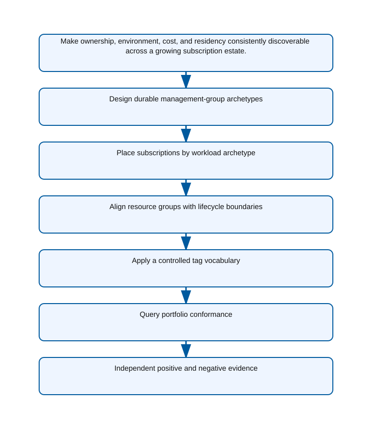

<!-- BEGIN GENERATED AZ305 V1 -->
# LAB-06 — Azure Resource Hierarchy and Tag Governance

## 1. Navigation

[← LAB-05](../05-secrets-certificates-keys/README.md) · [Lab catalog](../README.md) · [LAB-07 →](../07-compliance-identity-governance/README.md)

## 2. Scenario and completion contract

Contoso Manufacturing has one tenant, twelve subscriptions, and rapidly growing regional programs. Its current structure mirrors temporary project teams, tags use inconsistent names, and cost, ownership, residency, and environment cannot be queried reliably. The platform board wants a durable Cloud Adoption Framework-aligned hierarchy that delegates at stable boundaries without turning management groups into an organizational chart. As the governance architect, design management groups, subscription placement, resource-group lifecycles, and a controlled tag vocabulary. Demonstrate scope inheritance and portfolio queries through Azure CLI, but leave policy compliance evidence and identity lifecycle governance to Lab 07.

- Architect role: Enterprise governance architect
- Outcome: A stable Azure resource hierarchy and tag model that supports delegated operations, cost allocation, and residency decisions.
- Duration: 145 minutes
- Difficulty: advanced
- Cost class: low
- Completion: all five checkpoint assertions, final validation, decision revision, and cleanup review are complete.

## 3. Objective-to-evidence map

| Objective | Requirement | Checkpoint |
| --- | --- | --- |
| `IGM-GOV-01` | `LAB06-REQ-01` | [`LAB06-CP01`](#checkpoint-1) |
| `IGM-GOV-01` | `LAB06-REQ-02` | [`LAB06-CP02`](#checkpoint-2) |
| `IGM-GOV-01` | `LAB06-REQ-03` | [`LAB06-CP03`](#checkpoint-3) |
| `IGM-GOV-01` | `LAB06-REQ-04` | [`LAB06-CP04`](#checkpoint-4) |
| `IGM-GOV-01` | `LAB06-REQ-05` | [`LAB06-CP05`](#checkpoint-5) |

## 4. Business and quality requirements

Business outcome: Make ownership, environment, cost, and residency consistently discoverable across a growing subscription estate.

- `LAB06-REQ-01` — Platform, landing-zone, sandbox, and decommissioned archetypes reflect policy and delegation needs rather than team names.
- `LAB06-REQ-02` — The workload subscription is attached to the production landing-zone archetype with explicit platform dependencies.
- `LAB06-REQ-03` — Resources sharing deployment, ownership, and deletion lifecycles are grouped together and tagged consistently.
- `LAB06-REQ-04` — Required tags use canonical names and controlled values that serve ownership, cost, data, and environment decisions.
- `LAB06-REQ-05` — Resource Graph produces an explainable inventory grouped by ownership and cost dimensions.

Scenario facts:

- **Data:** The governance model classifies subscriptions and resources by owner, environment, residency, workload, and financial responsibility.
- **Scale:** Multiple business units and a separately billed subsidiary require hierarchy that grows by archetype instead of reporting-line depth.
- **Latency:** Policy evaluation is not an application latency control; remediation timing is measured as a governance compliance SLO.
- **Availability:** Moving or restructuring management groups must not create a window without inherited security and allowed-location controls.
- **RTO:** Governance restoration means reapplying the versioned hierarchy and assignments; a numerical business-service RTO is not applicable.
- **RPO:** Policy, initiative, exemption, and tag definitions require version-controlled recovery with no unrecorded production change.
- **Budget:** Subscription chargeback stays separate for the subsidiary and shared-platform cost is allocated with governed tags.

Constraints:

- Enterprise security guardrails must inherit across a growing subscription estate.
- The regulated subsidiary retains its own administrators and billing while resources remain exclusively in approved European regions.
- Use only the Azure CLI command lane for learner implementation.
- Keep all live changes behind explicit execution and acknowledgement switches.
- Retain only sanitized command evidence and synthetic fixture identifiers.

Assumptions:

- Subscriptions can be reorganized under management groups without changing workload resource identifiers.
- Ownership, environment, data classification, and cost-center values have accountable authoritative sources.
- West Europe is the configurable primary example and North Europe is the configurable secondary example.
- The learner has administrator-level Azure operations knowledge but receives no pre-existing authenticated context.
- Offline fixtures demonstrate contract behavior rather than live Azure service behavior.

## 5. Architecture diagram and walkthrough



The flow begins with the business outcome, crosses five independently validated design capabilities, and ends with positive and negative evidence. The SVG is deterministically rendered from `diagrams/architecture.mmd`.

## 6. Concept primer and candidate architectures

Architecture decisions translate measurable requirements into a deliberate service and operating model. A candidate is viable only when every mandatory constraint is met; convenience or familiarity cannot compensate for a disqualifier.

- **Archetype-based management groups with workload subscriptions and governed tags** (eligible) — Archetypes provide stable inheritance for platform, sandbox, and regulated workloads while subscription ownership preserves billing separation.
- **Management groups that mirror the corporate reporting hierarchy** (eligible) — A reporting hierarchy appears intuitive, but reorganizations force technical inheritance changes unrelated to workload risk.
- **One shared subscription with resource groups per application** (eligible) — Resource groups simplify the initial estate but cannot provide independent subscription billing and administrative isolation.
- **Resource-group-only tagging with no inherited policy boundary** (ineligible) — Tags without inherited enforcement describe intent but cannot prevent a disallowed deployment or preserve subsidiary separation. Disqualifier: LAB06-REQ-01 requires durable management-group archetypes that can inherit regional and security guardrails.

## 7. Decision, ADR, and Well-Architected review

Criteria weights are C1 30, C2 25, C3 20, C4 15, and C5 10. Weighted totals use `sum(weight × score) / 5`.

| Candidate | Eligible | C1 | C2 | C3 | C4 | C5 | Weighted /100 |
| --- | ---: | ---: | ---: | ---: | ---: | ---: | ---: |
| Archetype-based management groups with workload subscriptions and governed tags | yes | 5 | 5 | 5 | 3 | 4 | 92 |
| Management groups that mirror the corporate reporting hierarchy | yes | 3 | 3 | 4 | 2 | 3 | 61 |
| One shared subscription with resource groups per application | yes | 2 | 3 | 2 | 4 | 3 | 53 |
| Resource-group-only tagging with no inherited policy boundary | no | 1 | 2 | 2 | 2 | 4 | 38 |

Selected design: **Archetype-based management groups with workload subscriptions and governed tags**. `ADR-LAB06-001` records the accepted reasoning. Review Reliability, Security, Cost Optimization, Operational Excellence, and Performance Efficiency in `design/decision.yml`; no pillar is implied by another.

Rejected alternatives:

- **Management groups that mirror the corporate reporting hierarchy:** Organizational churn weakens policy stability and creates avoidable migration work.
- **One shared subscription with resource groups per application:** The model cannot preserve the subsidiary's required billing and administrator boundary at useful scope.
- **Resource-group-only tagging with no inherited policy boundary:** It is disqualified because metadata alone cannot enforce the mandatory hierarchy controls.

Architecture risks:

- **Risk:** Existing assignments at lower scopes can conflict with or dilute new inherited policies. **Mitigation:** Export effective policy state, resolve conflicts in a canary subscription, and move subscriptions only after both assertions pass.
- **Risk:** Tag inheritance can overwrite a valid workload-specific financial owner. **Mitigation:** Define precedence per tag key and test append, inherit, and deny behavior against representative resources.

Well-Architected consequences:

- **Reliability:** Stable archetypes keep critical guardrails attached through organizational change and subscription growth.
- **Security:** Inherited security and European-location policies establish a consistent subsidiary boundary.
- **Cost Optimization:** Separate billing plus governed allocation tags makes shared and workload cost attributable.
- **Operational Excellence:** Versioned hierarchy, policy, and exemption records expose drift and simplify onboarding.
- **Performance Efficiency:** Management-group evaluation scales across subscriptions without duplicating assignments at every resource group.

ADR consequences:

- Corporate reporting remains a metadata concern rather than controlling the technical hierarchy.
- Subsidiary administrators gain subscription autonomy but cannot bypass inherited regional and security policy.

## 8. Inputs, permissions, licensing, cost, and analogue

Use configurable `Location` (`AZ305_LOCATION`, default West Europe) and `SecondaryLocation` (`AZ305_SECONDARY_LOCATION`, default North Europe). Every public input has an explicit `AZ305_*` fallback. Preview is the default; only Golden Lab 00 writes an intent-only `execute: false` preview record. Before an executed cloud command, the supplied subscription and tenant must exactly match the active CLI, Az, and—where applicable—Microsoft Graph contexts. `-Execute` crosses the execution boundary; cost-bearing and tenant-scoped paths also require their independent acknowledgement switches.

Safe analogue: Score a synthetic tenant hierarchy and policy-state fixture, including conflicts and exemptions, without moving a subscription or assigning policy.

Permissions: Management Group Reader, Resource Policy Reader, and Cost Management Reader cover assessment; hierarchy, policy, or tag remediation needs separate governance authorization.

Licensing: Core management groups, tags, and Azure Policy do not require an add-on license, while Defender, Purview, or governance services referenced by policy may.

Cost boundary: Measure policy remediation activity, shared-platform subscriptions, logging obligations, and chargeback accuracy rather than only resource price.

## 9. Read-only preflight

```powershell
pwsh ./scripts/azure-cli/Preflight.ps1 -RunId synthetic-060001
```

Synthetic sample: `{"labId":"LAB-06","track":"azure-cli","result":"pass","note":"Local tool discovery only"}`. This is illustrative local output, not evidence captured from Azure.

## 10. Five guided checkpoints

### Checkpoint 1: Design durable management-group archetypes

<a id="checkpoint-1"></a>

**Trace:** `IGM-GOV-01` → `LAB06-REQ-01` → `LAB06-CP01`

```powershell
az account management-group list --query "[].{name:name,displayName:displayName}" -o json
```

Expected evidence: Platform, landing-zone, sandbox, and decommissioned archetypes reflect policy and delegation needs rather than team names. Retain Synthetic hierarchy tree, archetype purpose, owner, and inheritance rationale.

Positive assertion:

```powershell
az account management-group show --name $ManagementGroupId --expand --recurse --query "{name:name,displayName:displayName,children:children[].name}" -o json
```

Negative assertion:

```powershell
az account management-group show --name $ManagementGroupId --query "children[?type=='Microsoft.Management/managementGroups' && contains(displayName,'Team')]" -o json
```

Failure and retry: Existing scope limits or tenant-root permissions prevent the proposed parent relationship. Model the hierarchy offline, verify the authorized deployment level, and phase the move without creating duplicates.

Cleanup dependency: Move child subscriptions and management groups before removing a run-owned empty group.

WAF consequence: Reliability: archetype-based boundaries limit disruptive hierarchy churn as teams and reporting lines change.

### Checkpoint 2: Place subscriptions by workload archetype

<a id="checkpoint-2"></a>

**Trace:** `IGM-GOV-01` → `LAB06-REQ-02` → `LAB06-CP02`

```powershell
az account management-group show --name $ManagementGroupId --expand --recurse --query "{name:name,children:children[].name}" -o json
```

Expected evidence: The workload subscription is attached to the production landing-zone archetype with explicit platform dependencies. Retain Synthetic subscription label, parent management group, workload class, residency, and owner.

Positive assertion:

```powershell
az account management-group subscription show --name $ManagementGroupId --subscription $SubscriptionId -o json
```

Negative assertion:

```powershell
az account management-group show --name $SandboxManagementGroupId --expand --recurse --query "children[?name=='$SubscriptionId'].name" -o tsv
```

Failure and retry: The subscription has pending operations or the caller lacks rights at old and new parents. Verify current parent and permissions, then perform one controlled move using the same target.

Cleanup dependency: Restore the recorded original parent before deleting a run-owned management group.

WAF consequence: Security: correct subscription placement inherits the intended enterprise guardrails.

### Checkpoint 3: Align resource groups with lifecycle boundaries

<a id="checkpoint-3"></a>

**Trace:** `IGM-GOV-01` → `LAB06-REQ-03` → `LAB06-CP03`

```powershell
az group create --name $ResourceGroup --location $Location --tags purpose=az305-lab labId=LAB-06 runId=$RunId expiresOn=$ExpiresOn workload=$WorkloadName environment=learning
```

Expected evidence: Resources sharing deployment, ownership, and deletion lifecycles are grouped together and tagged consistently. Retain Resource-group name, region, lifecycle owner, required tags, and dependency summary.

Positive assertion:

```powershell
az group show --name $ResourceGroup --query "{name:name,location:location,tags:tags}" -o json
```

Negative assertion:

```powershell
az resource list --resource-group $ResourceGroup --query "[?tags.workload!='$WorkloadName'].id" -o tsv
```

Failure and retry: A shared dependency cannot follow the application release or deletion lifecycle. Move the dependency to a platform-owned resource group in the architecture before deployment.

Cleanup dependency: Delete only the exactly named and tagged run-owned resource group after child ownership verification.

WAF consequence: Operational Excellence: resource groups align deployment, ownership, and deletion into a repeatable lifecycle.

### Checkpoint 4: Apply a controlled tag vocabulary

<a id="checkpoint-4"></a>

**Trace:** `IGM-GOV-01` → `LAB06-REQ-04` → `LAB06-CP04`

```powershell
az tag update --resource-id $ResourceGroupId --operation Merge --tags owner=$OwnerAlias costCenter=$CostCenter dataClass=$DataClass environment=$Environment
```

Expected evidence: Required tags use canonical names and controlled values that serve ownership, cost, data, and environment decisions. Retain Tag dictionary version, sanitized values, inheritance rule, exception owner, and expiry.

Positive assertion:

```powershell
az tag list --resource-id $ResourceGroupId --query "properties.tags" -o json
```

Negative assertion:

```powershell
az tag list --resource-id $ResourceGroupId --query "{owner:properties.tags.owner,costCenter:properties.tags.costCenter,dataClass:properties.tags.dataClass,environment:properties.tags.environment}" -o json
```

Failure and retry: A resource type does not support tags or an inherited value conflicts with workload truth. Record the limitation and use the nearest supported scope or resource-graph join without fabricating coverage.

Cleanup dependency: Restore recorded original non-secret tags rather than deleting unrelated values.

WAF consequence: Cost Optimization: canonical ownership and cost-center tags support accountable allocation.

### Checkpoint 5: Query portfolio conformance

<a id="checkpoint-5"></a>

**Trace:** `IGM-GOV-01` → `LAB06-REQ-05` → `LAB06-CP05`

```powershell
az graph query -q "Resources | project id, type, location, owner=tostring(tags.owner), costCenter=tostring(tags.costCenter), dataClass=tostring(tags.dataClass)" -o json
```

Expected evidence: Resource Graph produces an explainable inventory grouped by ownership and cost dimensions. Retain Sanitized query text, row counts, missing-tag count, scope, and query timestamp.

Positive assertion:

```powershell
az graph query -q "Resources | where tags['purpose'] =~ 'az305-lab' and tags['labId'] =~ 'LAB-06' | summarize count() by tostring(tags.runId)" -o json
```

Negative assertion:

```powershell
az graph query -q "Resources | where tags['purpose'] =~ 'az305-lab' and (isempty(tags['owner']) or isempty(tags['costCenter'])) | project id" -o json
```

Failure and retry: Resource Graph indexing delay or query scope creates an incomplete inventory. Confirm subscription scope and retry after the documented indexing interval without adding duplicate tags.

Cleanup dependency: The query creates no resource; remove only run-owned artifacts found through exact ownership checks.

WAF consequence: Performance Efficiency: Resource Graph evaluates the portfolio without serial subscription-by-subscription enumeration.

## 11. Final validation and interpretation

Run `Validate.ps1 -Mode Deployment -Execute` only after an executed run has state and you are authorized to issue the ten read-only checkpoint inspections. Without `-Execute`, ordinary deployment validation records `partial` and exits `2`; Golden Lab 00 alone can validate its intent-only preview locally. Exit `0` means all required assertions pass, `1` means at least one failed, and `2` means the outcome is gated or partial. Positive and negative commands execute independently, so one failure never suppresses its paired assertion.

## 12. Material change request

A regulated subsidiary must retain its own administrators and billing while inheriting enterprise security guardrails and keeping resources exclusively in approved European regions; revise hierarchy and tagging decisions.

Revised solution: select **Archetype-based management groups with workload subscriptions and governed tags**. LAB06-REQ-01 requires the hierarchy to follow durable governance archetypes, so the subsidiary receives its own regulated branch beneath inherited European controls without mirroring reporting lines.

Revised Well-Architected consequences:

- **Reliability:** The subsidiary keeps the same guardrails when its corporate reporting line changes.
- **Security:** Approved-region and security initiatives inherit above the subsidiary subscription boundary.
- **Cost Optimization:** Billing remains directly attributable while shared services use governed allocation tags.
- **Operational Excellence:** A dedicated archetype documents onboarding, exemption, and administrator responsibilities.
- **Performance Efficiency:** One inherited policy set replaces repeated assignments across subsidiary workloads.

## 13. Architect job challenge

Defend whether the subsidiary needs a distinct management-group archetype, separate tenant, or only dedicated subscriptions.

## 14. Troubleshooting, cleanup, and residual verification

- Check the current management-group parent before proposing or performing a subscription move.
- Treat resource-group location as metadata and evaluate each resource's actual deployment region.
- Account for Resource Graph indexing delay before labeling a tag operation unsuccessful.

Cleanup previews nonempty state in reverse dependency order, writes `partial`, and exits `2`; an already empty run is completed locally and idempotently. Executed cleanup rechecks the exact live ID plus `purpose`, `labId`, `runId`, and `expiresOn` immediately before each removal, persists state after every absent or removed object, stops on the first dependency failure, and refuses unresolved pre-existing settings. It never automates purge. Finish with `Validate.ps1 -Mode PostCleanup`; the required residual count is zero.

## 15. Exam debrief, assessment, sources, and navigation

Explain the recommendation in terms of requirements, rejected alternatives, failure behavior, and all five WAF pillars. Complete `assessment/QUESTIONS.md`, then use the separately excluded answer key for remediation.

- [Azure landing zone design area - Resource organization](https://learn.microsoft.com/en-us/azure/cloud-adoption-framework/ready/landing-zone/design-area/resource-org)
- [Azure Well-Architected Framework](https://learn.microsoft.com/en-us/azure/well-architected/)

[← LAB-05](../05-secrets-certificates-keys/README.md) · [Lab catalog](../README.md) · [LAB-07 →](../07-compliance-identity-governance/README.md)

## 16. Synchronized lifecycle-script appendix

### Preflight.ps1

```powershell
[CmdletBinding()]
param(
    [string]$SubscriptionId = $env:AZ305_SUBSCRIPTION_ID,
    [string]$TenantId = $env:AZ305_TENANT_ID,
    [ValidatePattern('^[a-z0-9-]{6,64}$')][string]$RunId = $env:AZ305_RUN_ID,
    [string]$Location = $(if ($env:AZ305_LOCATION) { $env:AZ305_LOCATION } else { 'westeurope' }),
    [string]$SecondaryLocation = $(if ($env:AZ305_SECONDARY_LOCATION) { $env:AZ305_SECONDARY_LOCATION } else { 'northeurope' }),
    [string]$ResourceGroup = $(if ($env:AZ305_RESOURCE_GROUP) { $env:AZ305_RESOURCE_GROUP } else { "rg-az305-$RunId" }),
    [string]$WorkloadName = $(if ($env:AZ305_WORKLOAD_NAME) { $env:AZ305_WORKLOAD_NAME } else { "az305-$RunId" }),
    [string]$ExpiresOn = $(if ($env:AZ305_EXPIRES_ON) { $env:AZ305_EXPIRES_ON } else { (Get-Date).ToUniversalTime().AddDays(1).ToString('yyyy-MM-dd') }),
    [string]$CostCenter = $env:AZ305_COST_CENTER,
    [string]$DataClass = $env:AZ305_DATA_CLASS,
    [string]$Environment = $env:AZ305_ENVIRONMENT,
    [string]$ManagementGroupId = $env:AZ305_MANAGEMENT_GROUP_ID,
    [string]$OwnerAlias = $env:AZ305_OWNER_ALIAS,
    [string]$ResourceGroupId = $env:AZ305_RESOURCE_GROUP_ID,
    [string]$SandboxManagementGroupId = $env:AZ305_SANDBOX_MANAGEMENT_GROUP_ID,
    [switch]$Execute,
    [switch]$AcknowledgeCost,
    [switch]$AcknowledgeTenantChange
)

$ErrorActionPreference = 'Stop'
$PSNativeCommandUseErrorActionPreference = $true
if (-not $RunId) { [Console]::Error.WriteLine('RunId or AZ305_RUN_ID is required.'); exit 2 }
# Every lifecycle entrypoint intentionally exposes the same public parameter contract.
@($SubscriptionId, $TenantId, $RunId, $Location, $SecondaryLocation, $ResourceGroup, $WorkloadName, $ExpiresOn, $CostCenter, $DataClass, $Environment, $ManagementGroupId, $OwnerAlias, $ResourceGroupId, $SandboxManagementGroupId, $Execute, $AcknowledgeCost, $AcknowledgeTenantChange) | Out-Null

$requiredCommands = @('az', 'pwsh')
$missing = @($requiredCommands | Where-Object { -not (Get-Command $_ -ErrorAction SilentlyContinue) })
if ($missing.Count -gt 0) {
    Write-Error "Missing local commands: $($missing -join ', ')"
    exit 1
}

[pscustomobject]@{
    labId = 'LAB-06'
    track = 'azure-cli'
    implementationMode = 'safe-analogue'
    result = 'pass'
    note = 'Local tool discovery only; no Azure or Microsoft Graph request was made.'
} | ConvertTo-Json
exit 0
```

### Setup.ps1

```powershell
[CmdletBinding()]
param(
    [string]$SubscriptionId = $env:AZ305_SUBSCRIPTION_ID,
    [string]$TenantId = $env:AZ305_TENANT_ID,
    [ValidatePattern('^[a-z0-9-]{6,64}$')][string]$RunId = $env:AZ305_RUN_ID,
    [string]$Location = $(if ($env:AZ305_LOCATION) { $env:AZ305_LOCATION } else { 'westeurope' }),
    [string]$SecondaryLocation = $(if ($env:AZ305_SECONDARY_LOCATION) { $env:AZ305_SECONDARY_LOCATION } else { 'northeurope' }),
    [string]$ResourceGroup = $(if ($env:AZ305_RESOURCE_GROUP) { $env:AZ305_RESOURCE_GROUP } else { "rg-az305-$RunId" }),
    [string]$WorkloadName = $(if ($env:AZ305_WORKLOAD_NAME) { $env:AZ305_WORKLOAD_NAME } else { "az305-$RunId" }),
    [string]$ExpiresOn = $(if ($env:AZ305_EXPIRES_ON) { $env:AZ305_EXPIRES_ON } else { (Get-Date).ToUniversalTime().AddDays(1).ToString('yyyy-MM-dd') }),
    [string]$CostCenter = $env:AZ305_COST_CENTER,
    [string]$DataClass = $env:AZ305_DATA_CLASS,
    [string]$Environment = $env:AZ305_ENVIRONMENT,
    [string]$ManagementGroupId = $env:AZ305_MANAGEMENT_GROUP_ID,
    [string]$OwnerAlias = $env:AZ305_OWNER_ALIAS,
    [string]$ResourceGroupId = $env:AZ305_RESOURCE_GROUP_ID,
    [string]$SandboxManagementGroupId = $env:AZ305_SANDBOX_MANAGEMENT_GROUP_ID,
    [switch]$Execute,
    [switch]$AcknowledgeCost,
    [switch]$AcknowledgeTenantChange
)

$ErrorActionPreference = 'Stop'
$PSNativeCommandUseErrorActionPreference = $true
if (-not $RunId) { [Console]::Error.WriteLine('RunId or AZ305_RUN_ID is required.'); exit 2 }
# Every lifecycle entrypoint intentionally exposes the same public parameter contract.
@($SubscriptionId, $TenantId, $RunId, $Location, $SecondaryLocation, $ResourceGroup, $WorkloadName, $ExpiresOn, $CostCenter, $DataClass, $Environment, $ManagementGroupId, $OwnerAlias, $ResourceGroupId, $SandboxManagementGroupId, $Execute, $AcknowledgeCost, $AcknowledgeTenantChange) | Out-Null

$LabRoot = Split-Path (Split-Path $PSScriptRoot -Parent) -Parent
$StateRoot = Join-Path $LabRoot ".state/$RunId"
$StatePath = Join-Path $StateRoot 'run.json'

function Invoke-AzCliJson {
    [CmdletBinding()]
    param([Parameter(Mandatory)][string[]]$ArgumentList)
    $savedNativePreference = $PSNativeCommandUseErrorActionPreference
    try {
        # Capture the exit code ourselves so a failed native command cannot be
        # mistaken for an empty but successful JSON response.
        $PSNativeCommandUseErrorActionPreference = $false
        $outputLines = @(& az @ArgumentList)
        $nativeExit = $LASTEXITCODE
    }
    finally {
        $PSNativeCommandUseErrorActionPreference = $savedNativePreference
    }
    if ($nativeExit -ne 0) { throw "Azure CLI exited with code $nativeExit." }
    $raw = @($outputLines) -join "`n"
    if ([string]::IsNullOrWhiteSpace($raw)) { return $null }
    try { return ($raw | ConvertFrom-Json -Depth 100) }
    catch { throw 'Azure CLI returned data that was not valid JSON.' }
}

function Assert-ExactExecutionContext {
    [CmdletBinding()]
    param([string]$ExpectedSubscriptionId, [string]$ExpectedTenantId)
    if ([string]::IsNullOrWhiteSpace($ExpectedSubscriptionId) -or [string]::IsNullOrWhiteSpace($ExpectedTenantId)) {
        throw 'SubscriptionId and TenantId are required before a cloud request.'
    }
    $context = Invoke-AzCliJson -ArgumentList @('account', 'show', '--output', 'json', '--only-show-errors')
    if (-not $context -or [string]$context.id -ine $ExpectedSubscriptionId -or [string]$context.tenantId -ine $ExpectedTenantId) {
        throw 'The active Azure CLI subscription or tenant does not exactly match the requested context.'
    }
}

function Save-RunState {
    [CmdletBinding()]
    param([Parameter(Mandatory)]$State)
    $temporaryPath = "$StatePath.tmp"
    $State | ConvertTo-Json -Depth 20 | Set-Content -LiteralPath $temporaryPath -Encoding utf8NoBOM
    Move-Item -LiteralPath $temporaryPath -Destination $StatePath -Force
}

function Assert-SafeStateValue {
    [CmdletBinding()]
    param($Value)
    $serialized = $Value | ConvertTo-Json -Depth 12 -Compress
    if ($serialized -match '(?i)"(?:token|password|secret|certificate|connectionString|sas|clientSecret|accessToken|refreshToken|accountKey|privateKey)"\s*:') {
        throw 'A prohibited sensitive field name was returned; state capture is refused.'
    }
}

function Convert-CheckpointOutput {
    [CmdletBinding()]
    param($Value)
    if ($Value -is [string]) { $raw = [string]$Value }
    elseif ($Value -is [System.Collections.IEnumerable] -and @($Value | Where-Object { $_ -isnot [string] }).Count -eq 0) { $raw = @($Value) -join "`n" }
    else { return $Value }
    if ([string]::IsNullOrWhiteSpace($raw)) { return $null }
    try { return ($raw | ConvertFrom-Json -Depth 100) } catch { return $Value }
}

function Get-ReturnedResourceId {
    [CmdletBinding()]
    param($Value)
    $seen = [System.Collections.Generic.HashSet[string]]::new([System.StringComparer]::OrdinalIgnoreCase)
    $results = [System.Collections.Generic.List[string]]::new()
    function Add-ArmId {
        param($Candidate)
        if ($Candidate -is [string] -and $Candidate -match '^/subscriptions/[0-9a-f-]+/(?:resourceGroups/[^/]+(?:/providers/.+)?|providers/.+)$' -and $Candidate -notmatch '/providers/Microsoft\.Resources/deployments/') {
            if ($seen.Add($Candidate)) { $results.Add($Candidate) }
        }
    }
    function Find-DeploymentOutputId {
        param($Item, [int]$Depth)
        if ($null -eq $Item -or $Depth -gt 12) { return }
        if ($Item -is [string]) { Add-ArmId -Candidate $Item; return }
        if ($Item -is [System.Collections.IDictionary]) { foreach ($key in $Item.Keys) { Find-DeploymentOutputId -Item $Item[$key] -Depth ($Depth + 1) }; return }
        if ($Item -is [System.Collections.IEnumerable]) { foreach ($entry in $Item) { Find-DeploymentOutputId -Item $entry -Depth ($Depth + 1) }; return }
        foreach ($property in @($Item.PSObject.Properties | Where-Object { $_.MemberType -in @('NoteProperty', 'Property') })) { Find-DeploymentOutputId -Item $property.Value -Depth ($Depth + 1) }
    }
    foreach ($rootItem in @($Value)) {
        if ($rootItem -is [System.Collections.IDictionary]) {
            foreach ($name in @('id', 'resourceId')) { if ($rootItem.Contains($name)) { Add-ArmId -Candidate $rootItem[$name] } }
            if ($rootItem.Contains('properties') -and $rootItem.properties -and $rootItem.properties.outputs) { Find-DeploymentOutputId -Item $rootItem.properties.outputs -Depth 0 }
            continue
        }
        foreach ($name in @('Id', 'ResourceId')) {
            $property = $rootItem.PSObject.Properties[$name]
            if ($property) { Add-ArmId -Candidate $property.Value }
        }
        if ($rootItem.PSObject.Properties['Properties'] -and $rootItem.Properties -and $rootItem.Properties.outputs) {
            Find-DeploymentOutputId -Item $rootItem.Properties.outputs -Depth 0
        }
    }
    return @($results)
}

function Get-PlannedDeploymentResourceId {
    [CmdletBinding()]
    param($Value)
    $seen = [System.Collections.Generic.HashSet[string]]::new([System.StringComparer]::OrdinalIgnoreCase)
    $results = [System.Collections.Generic.List[string]]::new()
    foreach ($change in @($Value.changes)) {
        $candidate = [string]$change.resourceId
        if ($candidate -match '^/subscriptions/[0-9a-f-]+/(?:resourceGroups/[^/]+(?:/providers/.+)?|providers/.+)$' -and $candidate -notmatch '/providers/Microsoft\.Resources/deployments/' -and $seen.Add($candidate)) {
            $results.Add($candidate)
        }
    }
    return @($results)
}

function Assert-InputSubscriptionScope {
    [CmdletBinding()]
    param($Inputs, [string]$ExpectedSubscriptionId)
    $entries = if ($Inputs -is [System.Collections.IDictionary]) {
        @($Inputs.GetEnumerator())
    } else {
        @($Inputs.PSObject.Properties | ForEach-Object { [pscustomobject]@{ Key = $_.Name; Value = $_.Value } })
    }
    foreach ($entry in $entries) {
        if ($entry.Value -is [string] -and [string]$entry.Value -match '^/subscriptions/([^/]+)/') {
            if ($Matches[1] -ine $ExpectedSubscriptionId) { throw "Input $($entry.Key) belongs to a different subscription." }
        }
    }
}

function Assert-ManagedMutation {
    [CmdletBinding()]
    param($State, [string]$CheckpointId, [bool]$CarriesOwnership, [object[]]$TargetResourceIds)
    if ($CarriesOwnership) { return }
    $targets = @($TargetResourceIds | Where-Object { $_ -is [string] -and $_ -match '^/subscriptions/' })
    if ($targets.Count -eq 0) { throw "$CheckpointId refuses an untagged mutation because no exact ARM target ID was supplied." }
    $knownIds = @($State.managedObjects | ForEach-Object { [string]$_.id })
    if ($knownIds.Count -eq 0) { throw "$CheckpointId refuses to modify a pre-existing object because no run-owned parent has been recorded." }
    foreach ($target in $targets) {
        $related = @($knownIds | Where-Object { $target -ieq $_ -or $target.StartsWith("$_/", [System.StringComparison]::OrdinalIgnoreCase) -or $_.StartsWith("$target/", [System.StringComparison]::OrdinalIgnoreCase) }).Count -gt 0
        if (-not $related) { throw "$CheckpointId refuses a mutation outside the exact run-owned resource boundary." }
    }
}

$executionInputs = [ordered]@{ subscriptionId = $SubscriptionId; tenantId = $TenantId; location = $Location; secondaryLocation = $SecondaryLocation; resourceGroup = $ResourceGroup; workloadName = $WorkloadName; expiresOn = $ExpiresOn; CostCenter = $CostCenter; DataClass = $DataClass; Environment = $Environment; ManagementGroupId = $ManagementGroupId; OwnerAlias = $OwnerAlias; ResourceGroupId = $ResourceGroupId; SandboxManagementGroupId = $SandboxManagementGroupId }

if (-not $Execute) {
    Write-Output '[preview] No cloud command was called and no state was created.'
    Write-Output '[preview] Re-run with -Execute only in an authorized disposable environment.'
    exit 0
}
# This setup is compatible with the lab implementation mode.
# This default exercise does not require a cost acknowledgement.
# This lab does not perform a tenant-scoped change by default.
$requiredLabInputs = [ordered]@{ CostCenter = $CostCenter; DataClass = $DataClass; Environment = $Environment; ManagementGroupId = $ManagementGroupId; OwnerAlias = $OwnerAlias; ResourceGroupId = $ResourceGroupId }
$missingLabInputs = @($requiredLabInputs.GetEnumerator() | Where-Object { $_.Value -is [string] -and [string]::IsNullOrWhiteSpace([string]$_.Value) } | ForEach-Object Key)
if ($missingLabInputs.Count -gt 0) { [Console]::Error.WriteLine("Execution is gated; supply: $($missingLabInputs -join ', ')."); exit 2 }

try {
    Assert-ExactExecutionContext -ExpectedSubscriptionId $SubscriptionId -ExpectedTenantId $TenantId
    Assert-InputSubscriptionScope -Inputs $executionInputs -ExpectedSubscriptionId $SubscriptionId
    Assert-SafeStateValue -Value $executionInputs
}
catch {
    [Console]::Error.WriteLine("Execution is gated by context or input validation: $($_.Exception.Message)")
    exit 2
}

# Recovery state is persisted before the first possible mutation below.
if (Test-Path -LiteralPath $StatePath) {
    [Console]::Error.WriteLine('Run state already exists. Choose a new RunId or complete the recorded cleanup; existing recovery state will not be overwritten.')
    exit 2
}
New-Item -ItemType Directory -Path $StateRoot -Force | Out-Null
$state = [ordered]@{
    schemaVersion = '1.0.0'; labId = 'LAB-06'; runId = $RunId; track = 'azure-cli'
    implementationMode = 'safe-analogue'; status = 'initialized'
    createdAt = (Get-Date).ToUniversalTime().ToString('o'); execute = $true
    parameters = $executionInputs
    managedObjects = @(); originalSettings = @()
}
Save-RunState -State $state
$state.status = 'deploying'
Save-RunState -State $state

$originalLocation = Get-Location
try {
    Set-Location -LiteralPath $LabRoot
    # 06-CP01: Design durable management-group archetypes
    $stepResult = & { az account management-group list --query "[].{name:name,displayName:displayName}" -o json }
    if ($LASTEXITCODE -ne 0) { throw 'LAB06-CP01 native command exited with code ' + $LASTEXITCODE + '.' }
    $null = $stepResult

    # 06-CP02: Place subscriptions by workload archetype
    $stepResult = & { az account management-group show --name $ManagementGroupId --expand --recurse --query "{name:name,children:children[].name}" -o json }
    if ($LASTEXITCODE -ne 0) { throw 'LAB06-CP02 native command exited with code ' + $LASTEXITCODE + '.' }
    $null = $stepResult

    # 06-CP03: Align resource groups with lifecycle boundaries
    Assert-ManagedMutation -State $state -CheckpointId 'LAB06-CP03' -CarriesOwnership:$true -TargetResourceIds @()
    $stepResult = & { az group create --name $ResourceGroup --location $Location --tags purpose=az305-lab labId=LAB-06 runId=$RunId expiresOn=$ExpiresOn workload=$WorkloadName environment=learning }
    if ($LASTEXITCODE -ne 0) { throw 'LAB06-CP03 native command exited with code ' + $LASTEXITCODE + '.' }
    $candidate = Convert-CheckpointOutput -Value $stepResult
    $returnedIds = @(Get-ReturnedResourceId -Value $candidate)
    if ($returnedIds.Count -eq 0) { throw 'LAB06-CP03 created an owned resource but returned no recoverable ARM resource ID.' }
    foreach ($returnedId in $returnedIds) {
        if ($returnedId -notmatch '^/subscriptions/([^/]+)/' -or $Matches[1] -ine $SubscriptionId) { throw 'A returned recovery ID belongs to a different subscription.' }
        if (@($state.managedObjects | Where-Object { $_.id -ieq $returnedId }).Count -eq 0) {
            $state.managedObjects += [pscustomobject]@{
                id = $returnedId
                type = 'azure-resource'
                tags = [ordered]@{ purpose = 'az305-lab'; labId = 'LAB-06'; runId = $RunId; expiresOn = $ExpiresOn }
            }
            Save-RunState -State $state
        }
    }
    $null = $stepResult

    # 06-CP04: Apply a controlled tag vocabulary
    Assert-ManagedMutation -State $state -CheckpointId 'LAB06-CP04' -CarriesOwnership:$false -TargetResourceIds @()
    # Capture the original non-secret projection before changing an exact run-owned object.
    $originalProjection = & { az tag list --resource-id $ResourceGroupId --query "properties.tags" -o json }
    if ($LASTEXITCODE -ne 0) { throw 'LAB06-CP04 original-state native command exited with code ' + $LASTEXITCODE + '.' }
    Assert-SafeStateValue -Value $originalProjection
    foreach ($originalTargetId in @()) {
        $state.originalSettings += [pscustomobject]@{ id = $originalTargetId; setting = 'LAB06-CP04: Apply a controlled tag vocabulary'; value = $originalProjection }
    }
    Save-RunState -State $state
    $stepResult = & { az tag update --resource-id $ResourceGroupId --operation Merge --tags owner=$OwnerAlias costCenter=$CostCenter dataClass=$DataClass environment=$Environment }
    if ($LASTEXITCODE -ne 0) { throw 'LAB06-CP04 native command exited with code ' + $LASTEXITCODE + '.' }
    $null = $stepResult

    # 06-CP05: Query portfolio conformance
    $stepResult = & { az graph query -q "Resources | project id, type, location, owner=tostring(tags.owner), costCenter=tostring(tags.costCenter), dataClass=tostring(tags.dataClass)" -o json }
    if ($LASTEXITCODE -ne 0) { throw 'LAB06-CP05 native command exited with code ' + $LASTEXITCODE + '.' }
    $null = $stepResult

    $state.status = 'deployed'
    Save-RunState -State $state
} catch {
    $state.status = 'failed'
    Save-RunState -State $state
    Write-Error $_
    exit 1
} finally {
    Set-Location -LiteralPath $originalLocation
}
exit 0
```

### Validate.ps1

```powershell
[CmdletBinding()]
param(
    [string]$SubscriptionId = $env:AZ305_SUBSCRIPTION_ID,
    [string]$TenantId = $env:AZ305_TENANT_ID,
    [ValidatePattern('^[a-z0-9-]{6,64}$')][string]$RunId = $env:AZ305_RUN_ID,
    [string]$Location = $(if ($env:AZ305_LOCATION) { $env:AZ305_LOCATION } else { 'westeurope' }),
    [string]$SecondaryLocation = $(if ($env:AZ305_SECONDARY_LOCATION) { $env:AZ305_SECONDARY_LOCATION } else { 'northeurope' }),
    [string]$ResourceGroup = $(if ($env:AZ305_RESOURCE_GROUP) { $env:AZ305_RESOURCE_GROUP } else { "rg-az305-$RunId" }),
    [string]$WorkloadName = $(if ($env:AZ305_WORKLOAD_NAME) { $env:AZ305_WORKLOAD_NAME } else { "az305-$RunId" }),
    [string]$ExpiresOn = $(if ($env:AZ305_EXPIRES_ON) { $env:AZ305_EXPIRES_ON } else { (Get-Date).ToUniversalTime().AddDays(1).ToString('yyyy-MM-dd') }),
    [string]$CostCenter = $env:AZ305_COST_CENTER,
    [string]$DataClass = $env:AZ305_DATA_CLASS,
    [string]$Environment = $env:AZ305_ENVIRONMENT,
    [string]$ManagementGroupId = $env:AZ305_MANAGEMENT_GROUP_ID,
    [string]$OwnerAlias = $env:AZ305_OWNER_ALIAS,
    [string]$ResourceGroupId = $env:AZ305_RESOURCE_GROUP_ID,
    [string]$SandboxManagementGroupId = $env:AZ305_SANDBOX_MANAGEMENT_GROUP_ID,
    [ValidateSet('Deployment', 'PostCleanup')][string]$Mode = 'Deployment',
    [switch]$Execute,
    [switch]$AcknowledgeCost,
    [switch]$AcknowledgeTenantChange
)

$ErrorActionPreference = 'Stop'
$PSNativeCommandUseErrorActionPreference = $true
if (-not $RunId) { [Console]::Error.WriteLine('RunId or AZ305_RUN_ID is required.'); exit 2 }
# Every lifecycle entrypoint intentionally exposes the same public parameter contract.
@($SubscriptionId, $TenantId, $RunId, $Location, $SecondaryLocation, $ResourceGroup, $WorkloadName, $ExpiresOn, $CostCenter, $DataClass, $Environment, $ManagementGroupId, $OwnerAlias, $ResourceGroupId, $SandboxManagementGroupId, $Mode, $Execute, $AcknowledgeCost, $AcknowledgeTenantChange) | Out-Null

$LabRoot = Split-Path (Split-Path $PSScriptRoot -Parent) -Parent
$StateRoot = Join-Path $LabRoot ".state/$RunId"
$RunPath = Join-Path $StateRoot 'run.json'
$ValidationPath = Join-Path $StateRoot 'validation.json'

function Invoke-AzCliJson {
    [CmdletBinding()]
    param([Parameter(Mandatory)][string[]]$ArgumentList)
    $savedNativePreference = $PSNativeCommandUseErrorActionPreference
    try {
        # Capture the exit code ourselves so a failed native command cannot be
        # mistaken for an empty but successful JSON response.
        $PSNativeCommandUseErrorActionPreference = $false
        $outputLines = @(& az @ArgumentList)
        $nativeExit = $LASTEXITCODE
    }
    finally {
        $PSNativeCommandUseErrorActionPreference = $savedNativePreference
    }
    if ($nativeExit -ne 0) { throw "Azure CLI exited with code $nativeExit." }
    $raw = @($outputLines) -join "`n"
    if ([string]::IsNullOrWhiteSpace($raw)) { return $null }
    try { return ($raw | ConvertFrom-Json -Depth 100) }
    catch { throw 'Azure CLI returned data that was not valid JSON.' }
}

function Assert-ExactExecutionContext {
    [CmdletBinding()]
    param([string]$ExpectedSubscriptionId, [string]$ExpectedTenantId)
    if ([string]::IsNullOrWhiteSpace($ExpectedSubscriptionId) -or [string]::IsNullOrWhiteSpace($ExpectedTenantId)) {
        throw 'SubscriptionId and TenantId are required before a cloud request.'
    }
    $context = Invoke-AzCliJson -ArgumentList @('account', 'show', '--output', 'json', '--only-show-errors')
    if (-not $context -or [string]$context.id -ine $ExpectedSubscriptionId -or [string]$context.tenantId -ine $ExpectedTenantId) {
        throw 'The active Azure CLI subscription or tenant does not exactly match the requested context.'
    }
}


if (-not (Test-Path -LiteralPath $RunPath)) {
    Write-Warning 'No run state exists; validation is gated.'
    exit 2
}
$state = Get-Content -LiteralPath $RunPath -Raw | ConvertFrom-Json
$assertions = [System.Collections.Generic.List[object]]::new()
function Add-ValidationAssertion {
    [CmdletBinding()]
    param([string]$Id, [ValidateSet('positive', 'negative')][string]$Kind, [bool]$Passed, [string]$Message)
    $assertions.Add([pscustomobject]@{ id = $Id; kind = $Kind; passed = $Passed; message = $Message })
}

function Save-ValidationArtifact {
    [CmdletBinding()]
    param([ValidateSet('pass', 'partial', 'fail')][string]$Result)
    $artifact = [ordered]@{ schemaVersion = '1.0.0'; labId = 'LAB-06'; runId = $RunId; mode = $Mode; result = $Result; validatedAt = (Get-Date).ToUniversalTime().ToString('o'); assertions = @($assertions) }
    $artifact | ConvertTo-Json -Depth 12 | Set-Content -LiteralPath $ValidationPath -Encoding utf8NoBOM
}

function Test-PositiveEvidence {
    [CmdletBinding()]
    param($Value)
    if ($Value -is [bool]) { return $Value }
    if ($null -eq $Value) { return $false }
    if ($Value -is [string]) { return -not [string]::IsNullOrWhiteSpace($Value) }
    if ($Value -is [System.Collections.IEnumerable]) { return @($Value).Count -gt 0 }
    return $true
}

function Test-NegativeEvidence {
    [CmdletBinding()]
    param($Value)
    if ($Value -is [bool]) { return $Value }
    if ($null -eq $Value) { return $true }
    if ($Value -is [string]) { return [string]::IsNullOrWhiteSpace($Value) }
    if ($Value -is [System.Collections.IEnumerable]) { return @($Value).Count -eq 0 }
    $properties = @($Value.PSObject.Properties | Where-Object { $_.MemberType -in @('NoteProperty', 'Property') })
    if ($properties.Count -eq 0) { return $false }
    return @($properties | Where-Object { -not (Test-NegativeEvidence -Value $_.Value) }).Count -eq 0
}

function Test-ProhibitedStateField {
    [CmdletBinding()]
    param($Value)
    $serialized = $Value | ConvertTo-Json -Depth 20
    return $serialized -match '(?i)"(?:token|password|secret|certificate|connectionString|sas|clientSecret|accessToken|refreshToken|accountKey|privateKey)"\s*:'
}

function Assert-InputSubscriptionScope {
    [CmdletBinding()]
    param($Inputs, [string]$ExpectedSubscriptionId)
    $entries = if ($Inputs -is [System.Collections.IDictionary]) {
        @($Inputs.GetEnumerator())
    } else {
        @($Inputs.PSObject.Properties | ForEach-Object { [pscustomobject]@{ Key = $_.Name; Value = $_.Value } })
    }
    foreach ($entry in $entries) {
        if ($entry.Value -is [string] -and [string]$entry.Value -match '^/subscriptions/([^/]+)/' -and $Matches[1] -ine $ExpectedSubscriptionId) {
            throw "Input $($entry.Key) belongs to a different subscription."
        }
    }
}

$stateIdentityMatches = (
    $state.labId -ceq 'LAB-06' -and
    $state.runId -ceq $RunId -and
    $state.track -ceq 'azure-cli' -and
    $state.implementationMode -ceq 'safe-analogue' -and
    ([string]$state.parameters.subscriptionId -ieq $SubscriptionId -and [string]$state.parameters.tenantId -ieq $TenantId)
)
Add-ValidationAssertion -Id 'LAB06-VAL-POS-01' -Kind positive -Passed $stateIdentityMatches -Message 'Run identity, implementation mode, command track, tenant, and subscription exactly match the copied lab and requested run.'
$hasSensitiveName = Test-ProhibitedStateField -Value $state
Add-ValidationAssertion -Id 'LAB06-VAL-NEG-01' -Kind negative -Passed (-not $hasSensitiveName) -Message 'State contains no prohibited sensitive field name.'

if ($Mode -eq 'PostCleanup') {
    $cleanupPath = Join-Path $StateRoot 'cleanup.json'
    $cleanup = if (Test-Path -LiteralPath $cleanupPath) { Get-Content -LiteralPath $cleanupPath -Raw | ConvertFrom-Json } else { $null }
    Add-ValidationAssertion -Id 'LAB06-VAL-POS-02' -Kind positive -Passed ($null -ne $cleanup -and $cleanup.labId -ceq 'LAB-06' -and $cleanup.runId -ceq $RunId -and $cleanup.result -eq 'pass' -and $cleanup.ownershipVerified) -Message 'The exact run cleanup completed with verified ownership.'
    Add-ValidationAssertion -Id 'LAB06-VAL-NEG-02' -Kind negative -Passed ($null -ne $cleanup -and $cleanup.activeManagedObjects -eq 0 -and @($state.managedObjects).Count -eq 0 -and @($state.originalSettings).Count -eq 0 -and $state.status -eq 'cleaned') -Message 'No active managed object or unresolved original setting remains in cleanup or run state.'
    $postCleanupPassed = @($assertions | Where-Object { -not $_.passed }).Count -eq 0
    Save-ValidationArtifact -Result $(if ($postCleanupPassed) { 'pass' } else { 'fail' })
    if ($postCleanupPassed) { exit 0 }
    exit 1
}

Add-ValidationAssertion -Id 'LAB06-VAL-POS-02' -Kind positive -Passed ($state.status -eq 'deployed') -Message 'The executed setup completed successfully; a failed setup can never validate as pass.'
Add-ValidationAssertion -Id 'LAB06-VAL-NEG-02' -Kind negative -Passed (@($state.managedObjects | Where-Object { $_.tags.purpose -ne 'az305-lab' -or $_.tags.labId -ne 'LAB-06' -or $_.tags.runId -ne $RunId }).Count -eq 0) -Message 'No recorded object has a foreign ownership tag.'

if (@($assertions | Where-Object { -not $_.passed }).Count -gt 0) {
    Save-ValidationArtifact -Result 'fail'
    exit 1
}
if (-not $Execute) {
    # This lab has no special intent-only validation path.
    Save-ValidationArtifact -Result 'partial'
    Write-Warning 'Checkpoint validation is gated; re-run with -Execute after confirming the exact read-only context.'
    exit 2
}
# The validation surface is compatible with this lab implementation mode.
$requiredValidationInputs = [ordered]@{ ManagementGroupId = $ManagementGroupId; ResourceGroupId = $ResourceGroupId; SandboxManagementGroupId = $SandboxManagementGroupId }
$missingValidationInputs = @($requiredValidationInputs.GetEnumerator() | Where-Object { $_.Value -is [string] -and [string]::IsNullOrWhiteSpace([string]$_.Value) } | ForEach-Object Key)
if ($missingValidationInputs.Count -gt 0) {
    Add-ValidationAssertion -Id 'LAB06-VAL-POS-CONTEXT' -Kind positive -Passed $false -Message 'One or more required non-secret validation inputs are missing.'
    Save-ValidationArtifact -Result 'partial'
    exit 2
}
try {
    Assert-ExactExecutionContext -ExpectedSubscriptionId $SubscriptionId -ExpectedTenantId $TenantId
    Assert-InputSubscriptionScope -Inputs $state.parameters -ExpectedSubscriptionId $SubscriptionId
    Add-ValidationAssertion -Id 'LAB06-VAL-POS-CONTEXT' -Kind positive -Passed $true -Message 'The active tenant and subscription exactly match the requested validation context.'
}
catch {
    Add-ValidationAssertion -Id 'LAB06-VAL-POS-CONTEXT' -Kind positive -Passed $false -Message 'Exact execution context could not be proven.'
    Save-ValidationArtifact -Result 'partial'
    exit 2
}

$originalLocation = Get-Location
try {
    Set-Location -LiteralPath $LabRoot
# LAB06-CP01: run both polarities even when one fails.
$positivePassed = $false
try {
    $global:LASTEXITCODE = 0
    $positiveEvidence = & { az account management-group show --name $ManagementGroupId --expand --recurse --query "{name:name,displayName:displayName,children:children[].name}" -o json }
    if ($LASTEXITCODE -ne 0) { throw 'LAB06-CP01 positive native command exited with code ' + $LASTEXITCODE + '.' }
    $positivePassed = (Test-PositiveEvidence -Value $positiveEvidence)
    $null = $positiveEvidence
} catch { $positivePassed = $false }
Add-ValidationAssertion -Id 'LAB06-CP01-POS' -Kind positive -Passed $positivePassed -Message 'Platform, landing-zone, sandbox, and decommissioned archetypes reflect policy and delegation needs rather than team names.'

$negativePassed = $false
try {
    $global:LASTEXITCODE = 0
    $negativeEvidence = & { az account management-group show --name $ManagementGroupId --query "children[?type=='Microsoft.Management/managementGroups' && contains(displayName,'Team')]" -o json }
    if ($LASTEXITCODE -ne 0) { throw 'LAB06-CP01 negative native command exited with code ' + $LASTEXITCODE + '.' }
    $negativePassed = (Test-NegativeEvidence -Value $negativeEvidence)
    $null = $negativeEvidence
} catch { $negativePassed = $false }
Add-ValidationAssertion -Id 'LAB06-CP01-NEG' -Kind negative -Passed $negativePassed -Message 'Temporary projects or reporting-line names do not become durable management-group boundaries.'

# LAB06-CP02: run both polarities even when one fails.
$positivePassed = $false
try {
    $global:LASTEXITCODE = 0
    $positiveEvidence = & { az account management-group subscription show --name $ManagementGroupId --subscription $SubscriptionId -o json }
    if ($LASTEXITCODE -ne 0) { throw 'LAB06-CP02 positive native command exited with code ' + $LASTEXITCODE + '.' }
    $positivePassed = (Test-PositiveEvidence -Value $positiveEvidence)
    $null = $positiveEvidence
} catch { $positivePassed = $false }
Add-ValidationAssertion -Id 'LAB06-CP02-POS' -Kind positive -Passed $positivePassed -Message 'The workload subscription is attached to the production landing-zone archetype with explicit platform dependencies.'

$negativePassed = $false
try {
    $global:LASTEXITCODE = 0
    $negativeEvidence = & { az account management-group show --name $SandboxManagementGroupId --expand --recurse --query "children[?name=='$SubscriptionId'].name" -o tsv }
    if ($LASTEXITCODE -ne 0) { throw 'LAB06-CP02 negative native command exited with code ' + $LASTEXITCODE + '.' }
    $negativePassed = (Test-NegativeEvidence -Value $negativeEvidence)
    $null = $negativeEvidence
} catch { $negativePassed = $false }
Add-ValidationAssertion -Id 'LAB06-CP02-NEG' -Kind negative -Passed $negativePassed -Message 'The same subscription is not represented under the sandbox archetype.'

# LAB06-CP03: run both polarities even when one fails.
$positivePassed = $false
try {
    $global:LASTEXITCODE = 0
    $positiveEvidence = & { az group show --name $ResourceGroup --query "{name:name,location:location,tags:tags}" -o json }
    if ($LASTEXITCODE -ne 0) { throw 'LAB06-CP03 positive native command exited with code ' + $LASTEXITCODE + '.' }
    $positivePassed = (Test-PositiveEvidence -Value $positiveEvidence)
    $null = $positiveEvidence
} catch { $positivePassed = $false }
Add-ValidationAssertion -Id 'LAB06-CP03-POS' -Kind positive -Passed $positivePassed -Message 'Resources sharing deployment, ownership, and deletion lifecycles are grouped together and tagged consistently.'

$negativePassed = $false
try {
    $global:LASTEXITCODE = 0
    $negativeEvidence = & { az resource list --resource-group $ResourceGroup --query "[?tags.workload!='$WorkloadName'].id" -o tsv }
    if ($LASTEXITCODE -ne 0) { throw 'LAB06-CP03 negative native command exited with code ' + $LASTEXITCODE + '.' }
    $negativePassed = (Test-NegativeEvidence -Value $negativeEvidence)
    $null = $negativeEvidence
} catch { $negativePassed = $false }
Add-ValidationAssertion -Id 'LAB06-CP03-NEG' -Kind negative -Passed $negativePassed -Message 'A resource with a different lifecycle or owner is not hidden in the group.'

# LAB06-CP04: run both polarities even when one fails.
$positivePassed = $false
try {
    $global:LASTEXITCODE = 0
    $positiveEvidence = & { az tag list --resource-id $ResourceGroupId --query "properties.tags" -o json }
    if ($LASTEXITCODE -ne 0) { throw 'LAB06-CP04 positive native command exited with code ' + $LASTEXITCODE + '.' }
    $positivePassed = (Test-PositiveEvidence -Value $positiveEvidence)
    $null = $positiveEvidence
} catch { $positivePassed = $false }
Add-ValidationAssertion -Id 'LAB06-CP04-POS' -Kind positive -Passed $positivePassed -Message 'Required tags use canonical names and controlled values that serve ownership, cost, data, and environment decisions.'

$negativePassed = $false
try {
    $global:LASTEXITCODE = 0
    $negativeEvidence = & { az tag list --resource-id $ResourceGroupId --query "{owner:properties.tags.owner,costCenter:properties.tags.costCenter,dataClass:properties.tags.dataClass,environment:properties.tags.environment}" -o json }
    if ($LASTEXITCODE -ne 0) { throw 'LAB06-CP04 negative native command exited with code ' + $LASTEXITCODE + '.' }
    $negativePassed = (Test-NegativeEvidence -Value $negativeEvidence)
    $null = $negativeEvidence
} catch { $negativePassed = $false }
Add-ValidationAssertion -Id 'LAB06-CP04-NEG' -Kind negative -Passed $negativePassed -Message 'Free-form aliases, personal data, secrets, and conflicting case variants are absent.'

# LAB06-CP05: run both polarities even when one fails.
$positivePassed = $false
try {
    $global:LASTEXITCODE = 0
    $positiveEvidence = & { az graph query -q "Resources | where tags['purpose'] =~ 'az305-lab' and tags['labId'] =~ 'LAB-06' | summarize count() by tostring(tags.runId)" -o json }
    if ($LASTEXITCODE -ne 0) { throw 'LAB06-CP05 positive native command exited with code ' + $LASTEXITCODE + '.' }
    $positivePassed = (Test-PositiveEvidence -Value $positiveEvidence)
    $null = $positiveEvidence
} catch { $positivePassed = $false }
Add-ValidationAssertion -Id 'LAB06-CP05-POS' -Kind positive -Passed $positivePassed -Message 'Resource Graph produces an explainable inventory grouped by ownership and cost dimensions.'

$negativePassed = $false
try {
    $global:LASTEXITCODE = 0
    $negativeEvidence = & { az graph query -q "Resources | where tags['purpose'] =~ 'az305-lab' and (isempty(tags['owner']) or isempty(tags['costCenter'])) | project id" -o json }
    if ($LASTEXITCODE -ne 0) { throw 'LAB06-CP05 negative native command exited with code ' + $LASTEXITCODE + '.' }
    $negativePassed = (Test-NegativeEvidence -Value $negativeEvidence)
    $null = $negativeEvidence
} catch { $negativePassed = $false }
Add-ValidationAssertion -Id 'LAB06-CP05-NEG' -Kind negative -Passed $negativePassed -Message 'No in-scope lab resource lacks its required governance metadata.'

}
finally {
    Set-Location -LiteralPath $originalLocation
}

$passed = @($assertions | Where-Object { -not $_.passed }).Count -eq 0
Save-ValidationArtifact -Result $(if ($passed) { 'pass' } else { 'fail' })
if ($passed) { exit 0 }
exit 1
```

### Cleanup.ps1

```powershell
[CmdletBinding()]
param(
    [string]$SubscriptionId = $env:AZ305_SUBSCRIPTION_ID,
    [string]$TenantId = $env:AZ305_TENANT_ID,
    [ValidatePattern('^[a-z0-9-]{6,64}$')][string]$RunId = $env:AZ305_RUN_ID,
    [string]$Location = $(if ($env:AZ305_LOCATION) { $env:AZ305_LOCATION } else { 'westeurope' }),
    [string]$SecondaryLocation = $(if ($env:AZ305_SECONDARY_LOCATION) { $env:AZ305_SECONDARY_LOCATION } else { 'northeurope' }),
    [string]$ResourceGroup = $(if ($env:AZ305_RESOURCE_GROUP) { $env:AZ305_RESOURCE_GROUP } else { "rg-az305-$RunId" }),
    [string]$WorkloadName = $(if ($env:AZ305_WORKLOAD_NAME) { $env:AZ305_WORKLOAD_NAME } else { "az305-$RunId" }),
    [string]$ExpiresOn = $(if ($env:AZ305_EXPIRES_ON) { $env:AZ305_EXPIRES_ON } else { (Get-Date).ToUniversalTime().AddDays(1).ToString('yyyy-MM-dd') }),
    [string]$CostCenter = $env:AZ305_COST_CENTER,
    [string]$DataClass = $env:AZ305_DATA_CLASS,
    [string]$Environment = $env:AZ305_ENVIRONMENT,
    [string]$ManagementGroupId = $env:AZ305_MANAGEMENT_GROUP_ID,
    [string]$OwnerAlias = $env:AZ305_OWNER_ALIAS,
    [string]$ResourceGroupId = $env:AZ305_RESOURCE_GROUP_ID,
    [string]$SandboxManagementGroupId = $env:AZ305_SANDBOX_MANAGEMENT_GROUP_ID,
    [switch]$Execute,
    [switch]$AcknowledgeCost,
    [switch]$AcknowledgeTenantChange
)

$ErrorActionPreference = 'Stop'
$PSNativeCommandUseErrorActionPreference = $true
if (-not $RunId) { [Console]::Error.WriteLine('RunId or AZ305_RUN_ID is required.'); exit 2 }
# Every lifecycle entrypoint intentionally exposes the same public parameter contract.
@($SubscriptionId, $TenantId, $RunId, $Location, $SecondaryLocation, $ResourceGroup, $WorkloadName, $ExpiresOn, $CostCenter, $DataClass, $Environment, $ManagementGroupId, $OwnerAlias, $ResourceGroupId, $SandboxManagementGroupId, $Execute, $AcknowledgeCost, $AcknowledgeTenantChange) | Out-Null

$LabRoot = Split-Path (Split-Path $PSScriptRoot -Parent) -Parent
$StateRoot = Join-Path $LabRoot ".state/$RunId"
$RunPath = Join-Path $StateRoot 'run.json'
$CleanupPath = Join-Path $StateRoot 'cleanup.json'

function Invoke-AzCliJson {
    [CmdletBinding()]
    param([Parameter(Mandatory)][string[]]$ArgumentList)
    $savedNativePreference = $PSNativeCommandUseErrorActionPreference
    try {
        # Capture the exit code ourselves so a failed native command cannot be
        # mistaken for an empty but successful JSON response.
        $PSNativeCommandUseErrorActionPreference = $false
        $outputLines = @(& az @ArgumentList)
        $nativeExit = $LASTEXITCODE
    }
    finally {
        $PSNativeCommandUseErrorActionPreference = $savedNativePreference
    }
    if ($nativeExit -ne 0) { throw "Azure CLI exited with code $nativeExit." }
    $raw = @($outputLines) -join "`n"
    if ([string]::IsNullOrWhiteSpace($raw)) { return $null }
    try { return ($raw | ConvertFrom-Json -Depth 100) }
    catch { throw 'Azure CLI returned data that was not valid JSON.' }
}

function Assert-ExactExecutionContext {
    [CmdletBinding()]
    param([string]$ExpectedSubscriptionId, [string]$ExpectedTenantId)
    if ([string]::IsNullOrWhiteSpace($ExpectedSubscriptionId) -or [string]::IsNullOrWhiteSpace($ExpectedTenantId)) {
        throw 'SubscriptionId and TenantId are required before a cloud request.'
    }
    $context = Invoke-AzCliJson -ArgumentList @('account', 'show', '--output', 'json', '--only-show-errors')
    if (-not $context -or [string]$context.id -ine $ExpectedSubscriptionId -or [string]$context.tenantId -ine $ExpectedTenantId) {
        throw 'The active Azure CLI subscription or tenant does not exactly match the requested context.'
    }
}


function Invoke-AzCliCleanupCommand {
    [CmdletBinding()]
    param([Parameter(Mandatory)][string[]]$ArgumentList)
    $savedNativePreference = $PSNativeCommandUseErrorActionPreference
    try {
        $PSNativeCommandUseErrorActionPreference = $false
        $outputLines = @(& az @ArgumentList)
        $nativeExit = $LASTEXITCODE
    }
    finally {
        $PSNativeCommandUseErrorActionPreference = $savedNativePreference
    }
    return [pscustomobject]@{ ExitCode = $nativeExit; Output = @($outputLines) }
}


function Save-RunState {
    [CmdletBinding()]
    param([Parameter(Mandatory)]$State)
    $temporaryPath = "$RunPath.tmp"
    $State | ConvertTo-Json -Depth 20 | Set-Content -LiteralPath $temporaryPath -Encoding utf8NoBOM
    Move-Item -LiteralPath $temporaryPath -Destination $RunPath -Force
}

function Save-CleanupArtifact {
    [CmdletBinding()]
    param(
        [ValidateSet('pass', 'partial', 'fail')][string]$Result,
        [bool]$OwnershipVerified
    )
    $artifact = [ordered]@{
        schemaVersion = '1.0.0'; labId = 'LAB-06'; runId = $RunId; result = $Result
        completedAt = (Get-Date).ToUniversalTime().ToString('o'); ownershipVerified = $OwnershipVerified
        activeManagedObjects = @($state.managedObjects).Count; actions = @($actions)
    }
    $temporaryPath = "$CleanupPath.tmp"
    $artifact | ConvertTo-Json -Depth 12 | Set-Content -LiteralPath $temporaryPath -Encoding utf8NoBOM
    Move-Item -LiteralPath $temporaryPath -Destination $CleanupPath -Force
}

function Assert-ExactLiveOwnership {
    [CmdletBinding()]
    param($Tags, $Managed)
    if ($null -eq $Tags) { throw 'Live resource has no ownership tags.' }
    $valid = (
        [string]$Tags.purpose -ceq 'az305-lab' -and
        [string]$Tags.labId -ceq 'LAB-06' -and
        [string]$Tags.runId -ceq $RunId -and
        [string]$Tags.expiresOn -ceq [string]$Managed.tags.expiresOn
    )
    if (-not $valid) { throw 'Live ownership tags do not exactly match run state.' }
}

function Complete-ManagedObject {
    [CmdletBinding()]
    param([Parameter(Mandatory)][string]$ManagedId, [ValidateSet('removed', 'absent')][string]$Result)
    $state.managedObjects = @($state.managedObjects | Where-Object { [string]$_.id -ine $ManagedId })
    # Settings for a deleted run-owned object or its descendants no longer need restoration.
    $state.originalSettings = @($state.originalSettings | Where-Object {
        $settingId = [string]$_.id
        -not ($settingId -ieq $ManagedId -or $settingId.StartsWith("$ManagedId/", [System.StringComparison]::OrdinalIgnoreCase))
    })
    Save-RunState -State $state
    $actions.Add([pscustomobject]@{ id = $ManagedId; result = $Result })
}

if (-not (Test-Path -LiteralPath $RunPath)) { Write-Warning 'No run state exists; cleanup is gated.'; exit 2 }
try { $state = Get-Content -LiteralPath $RunPath -Raw | ConvertFrom-Json -Depth 100 }
catch { [Console]::Error.WriteLine('Cleanup refused because run state is not valid JSON.'); exit 1 }
$actions = [System.Collections.Generic.List[object]]::new()
$identityValid = (
    $state.labId -ceq 'LAB-06' -and
    $state.runId -ceq $RunId -and
    $state.track -ceq 'azure-cli' -and
    $state.implementationMode -ceq 'safe-analogue'
)
if (-not $identityValid) {
    $actions.Add([pscustomobject]@{ id = 'identity-check'; result = 'refused' })
    Save-CleanupArtifact -Result fail -OwnershipVerified $false
    [Console]::Error.WriteLine('Cleanup refused because the lab, run, track, mode, tenant, or subscription does not exactly match run state.')
    exit 1
}

if (@($state.managedObjects).Count -gt 0 -and (
    [string]::IsNullOrWhiteSpace($SubscriptionId) -or
    [string]::IsNullOrWhiteSpace($TenantId) -or
    [string]$state.parameters.subscriptionId -ine $SubscriptionId -or
    [string]$state.parameters.tenantId -ine $TenantId
)) {
    $actions.Add([pscustomobject]@{ id = 'context-record'; result = 'refused' })
    Save-CleanupArtifact -Result fail -OwnershipVerified $false
    [Console]::Error.WriteLine('Cleanup refused because the requested tenant and subscription do not exactly match run state.')
    exit 1
}

$ownershipValid = $true
foreach ($managed in @($state.managedObjects)) {
    $valid = (
        $managed.id -and
        [string]$managed.id -match '^/subscriptions/([^/]+)/' -and
        $Matches[1] -ieq $SubscriptionId -and
        [string]$managed.tags.purpose -ceq 'az305-lab' -and
        [string]$managed.tags.labId -ceq 'LAB-06' -and
        [string]$managed.tags.runId -ceq $RunId -and
        -not [string]::IsNullOrWhiteSpace([string]$managed.tags.expiresOn) -and
        [string]$managed.tags.expiresOn -ceq [string]$state.parameters.expiresOn
    )
    if (-not $valid) { $ownershipValid = $false }
}
if (-not $ownershipValid) {
    $actions.Add([pscustomobject]@{ id = 'ownership-check'; result = 'refused' })
    Save-CleanupArtifact -Result fail -OwnershipVerified $false
    [Console]::Error.WriteLine('Cleanup refused because recorded IDs and ownership tags could not be proven exactly.')
    exit 1
}

if (@($state.managedObjects).Count -eq 0 -and @($state.originalSettings).Count -gt 0) {
    $state.status = 'failed'
    Save-RunState -State $state
    $actions.Add([pscustomobject]@{ id = 'original-settings'; result = 'refused' })
    Save-CleanupArtifact -Result fail -OwnershipVerified $false
    [Console]::Error.WriteLine('Cleanup refused because original settings remain without a run-owned object whose deletion can safely restore the boundary.')
    exit 1
}

# This implementation mode may clean only exact run-owned cloud objects.

$orderedObjects = @($state.managedObjects)
[array]::Reverse($orderedObjects)
if (@($state.managedObjects).Count -eq 0) {
    $state.status = 'cleaned'
    Save-RunState -State $state
    Save-CleanupArtifact -Result pass -OwnershipVerified $true
    exit 0
}

if (-not $Execute) {
    foreach ($managed in $orderedObjects) { $actions.Add([pscustomobject]@{ id = $managed.id; result = 'planned' }) }
    Save-CleanupArtifact -Result partial -OwnershipVerified $true
    Write-Output '[preview] Dependency-aware cleanup plan written; no cloud command was called.'
    exit 2
}

try {
    Assert-ExactExecutionContext -ExpectedSubscriptionId $SubscriptionId -ExpectedTenantId $TenantId
}
catch {
    $actions.Add([pscustomobject]@{ id = 'context-check'; result = 'refused' })
    Save-CleanupArtifact -Result partial -OwnershipVerified $false
    [Console]::Error.WriteLine("Cleanup is gated by exact context validation: $($_.Exception.Message)")
    exit 2
}

# Persist the cleanup transition before the first possible delete.
$state.status = 'cleaning'
Save-RunState -State $state
$cleanupFailed = $false
foreach ($managed in $orderedObjects) {
    try {
        # State is necessary but not sufficient: inspect the exact live ID and tags immediately before removal.
        $showResult = Invoke-AzCliCleanupCommand -ArgumentList @('resource', 'show', '--ids', $managed.id, '--output', 'json', '--only-show-errors')
        if ($showResult.ExitCode -eq 3) {
            Complete-ManagedObject -ManagedId $managed.id -Result absent
            continue
        }
        if ($showResult.ExitCode -ne 0) { throw "Azure CLI ownership inspection exited with code $($showResult.ExitCode)." }
        $rawResource = @($showResult.Output) -join "`n"
        if ([string]::IsNullOrWhiteSpace($rawResource)) { throw 'Azure CLI ownership inspection returned no resource.' }
        try { $liveResource = $rawResource | ConvertFrom-Json -Depth 100 } catch { throw 'Azure CLI ownership inspection returned invalid JSON.' }
        if ([string]$liveResource.id -ine [string]$managed.id) { throw 'Live resource ID does not exactly match run state.' }
        Assert-ExactLiveOwnership -Tags $liveResource.tags -Managed $managed
        $deleteResult = Invoke-AzCliCleanupCommand -ArgumentList @('resource', 'delete', '--ids', $managed.id, '--only-show-errors')
        if ($deleteResult.ExitCode -ne 0) { throw "Azure CLI deletion exited with code $($deleteResult.ExitCode)." }
        Complete-ManagedObject -ManagedId $managed.id -Result removed
    } catch {
        $actions.Add([pscustomobject]@{ id = $managed.id; result = 'failed' })
        $cleanupFailed = $true
        break
    }
}
if ($cleanupFailed -or @($state.managedObjects).Count -gt 0 -or @($state.originalSettings).Count -gt 0) {
    $state.status = 'failed'
    Save-RunState -State $state
    Save-CleanupArtifact -Result partial -OwnershipVerified $false
    exit 1
}
$state.status = 'cleaned'
Save-RunState -State $state
Save-CleanupArtifact -Result pass -OwnershipVerified $true
exit 0
```
<!-- END GENERATED AZ305 V1 -->
