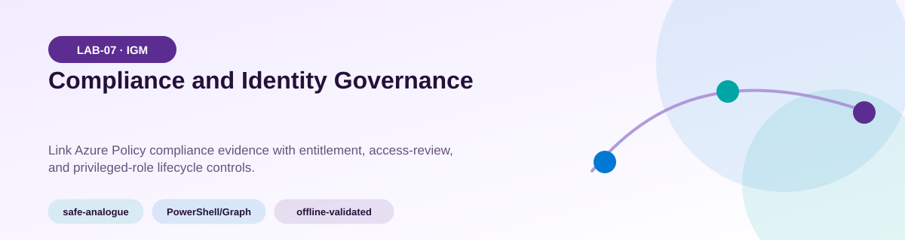
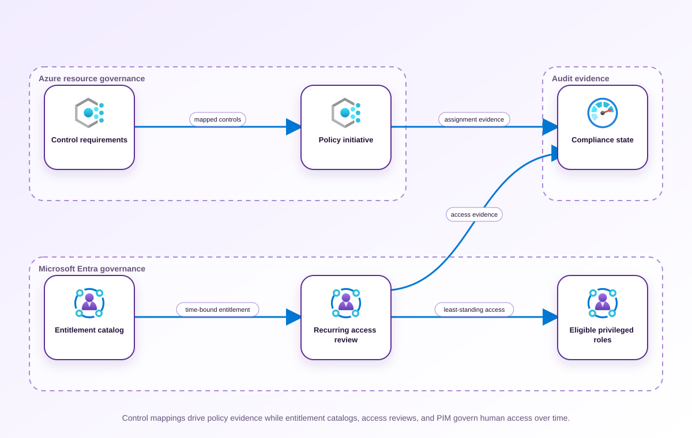
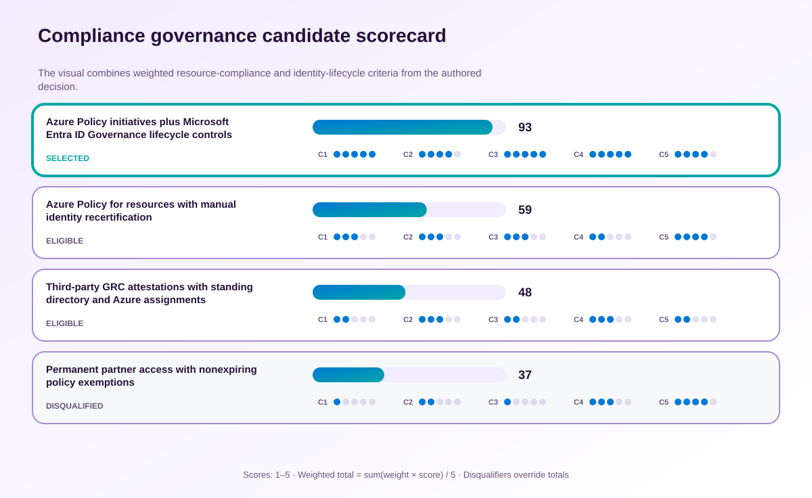

<!-- BEGIN GENERATED AZ305 V1 -->
# LAB-07 — Compliance and Identity Governance



<div class="az305-badges" aria-label="Lab classification">
  <span class="az305-mode-badge">safe-analogue</span>
  <span class="az305-lane-badge">PowerShell/Graph</span>
  <span class="az305-status">offline-validated</span>
</div>

## 1. Navigation

[← LAB-06](../06-resource-hierarchy-tag-governance/README.md) · [Lab catalog](../README.md) · [LAB-08 →](../08-relational-platform-tier-selection/README.md)

## 2. Scenario and completion contract

Tailwind Traders can organize Azure resources, but control owners still exchange spreadsheets to prove compliance and retain partner access indefinitely. The organization needs Azure Policy evidence for resource controls and Microsoft Entra ID Governance for entitlement, access review, and privileged-role lifecycle. As the compliance and identity-governance architect, design initiative assignments, exemptions, remediation ownership, access-package catalogs, recurring reviews, and eligible rather than standing privileged access. Work exclusively through GA Az and Microsoft Graph PowerShell inspection surfaces in the lab. The design must explain licensing, delegated permissions, evidence retention, exception expiry, and the boundary between detecting noncompliance and changing a production tenant.

- Architect role: Compliance and identity governance architect
- Outcome: A continuous compliance and identity lifecycle design with accountable exceptions, review evidence, and least standing privilege.
- Duration: 170 minutes
- Difficulty: advanced
- Cost class: moderate
- Completion: all five checkpoint assertions, final validation, decision revision, and cleanup review are complete.

## 3. Objective-to-evidence map

| Objective | Requirement | Checkpoint |
| --- | --- | --- |
| `IGM-GOV-02` | `LAB07-REQ-01` | [`LAB07-CP01`](#checkpoint-1) |
| `IGM-GOV-03` | `LAB07-REQ-02` | [`LAB07-CP02`](#checkpoint-2) |
| `IGM-GOV-02` | `LAB07-REQ-03` | [`LAB07-CP03`](#checkpoint-3) |
| `IGM-GOV-03` | `LAB07-REQ-04` | [`LAB07-CP04`](#checkpoint-4) |
| `IGM-GOV-02` | `LAB07-REQ-05` | [`LAB07-CP05`](#checkpoint-5) |

## 4. Business and quality requirements

Business outcome: Replace manual attestations with repeatable technical evidence while ensuring access ends when business need ends.

- `LAB07-REQ-01` — Each applicable control maps to an initiative definition, effect, evaluation scope, owner, and evidence source.
- `LAB07-REQ-02` — Assignment scope, noncompliant resources, exemption category, expiry, and remediation owner are reviewable independently.
- `LAB07-REQ-03` — A business-owned catalog contains only approved groups, applications, and sites for the partner population.
- `LAB07-REQ-04` — Guest, access-package, and privileged populations have recurring reviews with named reviewers and deny-by-default handling.
- `LAB07-REQ-05` — Administrators are eligible for scoped, time-bound activation with approval and auditable justification where risk warrants it.

Scenario facts:

- **Data:** Policy compliance, exemption expiry, access-package assignments, review decisions, and lifecycle events form the evidence chain.
- **Scale:** External partners and regulated resources change continuously; exact user and assignment counts are inventory-derived.
- **Latency:** Revocation must follow a denied or expired review promptly, with the acceptable processing window owned by compliance.
- **Availability:** Reviewer absence needs escalation to a deputy so a quarterly campaign cannot silently auto-approve access.
- **RTO:** Restoring the evidence workflow is a governance objective; production workload RTO is not governed by this decision.
- **RPO:** Review decisions and exemption history must not be lost between quarterly attestations because they support audit reconstruction.
- **Budget:** Governance automation is justified by recurring campaigns and expiring exceptions rather than a one-time compliance snapshot.

Constraints:

- External partner access must be reviewed quarterly by the accountable resource owner.
- Every compliance exemption must have an expiry no later than ninety days and an escalation path.
- Use only the PowerShell/Graph command lane for learner implementation.
- Keep all live changes behind explicit execution and acknowledgement switches.
- Retain only sanitized command evidence and synthetic fixture identifiers.

Assumptions:

- Each regulated resource and access package maps to a named business owner.
- Evidence can store immutable identifiers and outcomes without retaining personal or secret fields.
- West Europe is the configurable primary example and North Europe is the configurable secondary example.
- The learner has administrator-level Azure operations knowledge but receives no pre-existing authenticated context.
- Offline fixtures demonstrate contract behavior rather than live Azure service behavior.

## 5. Architecture diagram and walkthrough



Control mappings drive policy evidence while entitlement catalogs, access reviews, and PIM govern human access over time. The labelled nodes, boundaries, and edges are deterministically rendered from the portable `diagrams/architecture.mmd` source and the frozen visual registry.

## 6. Concept primer and candidate architectures

Architecture decisions translate measurable requirements into a deliberate service and operating model. A candidate is viable only when every mandatory constraint is met; convenience or familiarity cannot compensate for a disqualifier.

- **Azure Policy initiatives plus Microsoft Entra ID Governance lifecycle controls** (eligible) — Policy evaluates resource state while access packages, reviews, and workflows assign accountable identity lifecycle decisions.
- **Azure Policy for resources with manual identity recertification** (eligible) — Resource compliance is automatable, but spreadsheet recertification leaves expiry, escalation, and revocation weakly coupled.
- **Third-party GRC attestations with standing directory and Azure assignments** (eligible) — GRC attestations centralize reporting but do not themselves remove standing Azure or directory access.
- **Permanent partner access with nonexpiring policy exemptions** (ineligible) — Permanent exceptions reduce renewal work but defeat the stated review, revocation, and expiry outcomes. Disqualifier: LAB07-REQ-04 requires time-bounded access and exceptions with independently verified expiry.

## 7. Decision, ADR, and Well-Architected review

Criteria weights are C1 30, C2 25, C3 20, C4 15, and C5 10. Weighted totals use `sum(weight × score) / 5`.



| Candidate | Eligible | C1 | C2 | C3 | C4 | C5 | Weighted /100 |
| --- | ---: | ---: | ---: | ---: | ---: | ---: | ---: |
| Azure Policy initiatives plus Microsoft Entra ID Governance lifecycle controls | yes | 5 | 4 | 5 | 5 | 4 | 93 |
| Azure Policy for resources with manual identity recertification | yes | 3 | 3 | 3 | 2 | 4 | 59 |
| Third-party GRC attestations with standing directory and Azure assignments | yes | 2 | 3 | 2 | 3 | 2 | 48 |
| Permanent partner access with nonexpiring policy exemptions | no | 1 | 2 | 1 | 3 | 4 | 37 |

Selected design: **Azure Policy initiatives plus Microsoft Entra ID Governance lifecycle controls**. `ADR-LAB07-001` records the accepted reasoning. Review Reliability, Security, Cost Optimization, Operational Excellence, and Performance Efficiency in `design/decision.yml`; no pillar is implied by another.

Rejected alternatives:

- **Azure Policy for resources with manual identity recertification:** Manual identity evidence cannot reliably prove quarterly owner action and timely revocation at scale.
- **Third-party GRC attestations with standing directory and Azure assignments:** The evidence system remains detached from enforcement and permits reviewed findings to stay active.
- **Permanent partner access with nonexpiring policy exemptions:** The approach is ineligible because neither partner access nor exemptions end deterministically.

Architecture risks:

- **Risk:** A resource owner can ignore a review campaign until access is implicitly retained. **Mitigation:** Configure explicit denial or escalation behavior, named deputies, and an assertion for overdue decisions.
- **Risk:** Policy exemptions can be recreated with a new identifier to evade the ninety-day limit. **Mitigation:** Query all effective exemptions by scope and owner, then flag overlapping replacements in the evidence ledger.

Well-Architected consequences:

<div class="az305-waf-grid">
<article class="az305-waf-card"><h3>Reliability</h3><p>Deputy reviewers and deterministic campaign outcomes prevent governance from stalling on one unavailable owner.</p></article>
<article class="az305-waf-card"><h3>Security</h3><p>Expiring access packages and exemptions reduce standing privilege and policy bypass duration.</p></article>
<article class="az305-waf-card"><h3>Cost Optimization</h3><p>Automated recurring evidence replaces manual quarterly reconciliation while license scope remains explicit.</p></article>
<article class="az305-waf-card"><h3>Operational Excellence</h3><p>One trace joins policy state, review decisions, revocation, owners, and escalation timestamps.</p></article>
<article class="az305-waf-card"><h3>Performance Efficiency</h3><p>Campaign scoping and incremental compliance queries avoid reevaluating unrelated identities and resources.</p></article>
</div>

ADR consequences:

- Resource owners become accountable for both access reviews and policy-exemption business justification.
- Identity and Azure governance evidence must be correlated without assuming either system proves the other.

## 8. Inputs, permissions, licensing, cost, and analogue

Use configurable `Location` (`AZ305_LOCATION`, default West Europe) and `SecondaryLocation` (`AZ305_SECONDARY_LOCATION`, default North Europe). Every public input has an explicit `AZ305_*` fallback. Preview is the default; only Golden Lab 00 writes an intent-only `execute: false` preview record. Before an executed cloud command, the supplied subscription and tenant must exactly match the active CLI, Az, and—where applicable—Microsoft Graph contexts. `-Execute` crosses the execution boundary; cost-bearing and tenant-scoped paths also require their independent acknowledgement switches.

Safe analogue: Use synthetic policy, exemption, access-review, and lifecycle fixtures to prove joins and expiry handling without a Graph or Azure request.

Permissions: Resource Policy Reader and directory governance read roles support assessment; policy assignments, access packages, reviews, and lifecycle workflows require separate approved roles and tenant acknowledgement.

Licensing: Microsoft Entra ID Governance capabilities can require per-user licensing; Azure Policy remediation may also create workload-specific service charges.

Cost boundary: Compare governance licenses and evidence retention with manual attestation labor, exception chasing, and the risk of orphaned access.

## 9. Read-only preflight

```powershell
pwsh ./scripts/azure-powershell/Preflight.ps1 -RunId synthetic-070001
```

Synthetic sample: `{"labId":"LAB-07","track":"azure-powershell","result":"pass","note":"Local tool discovery only"}`. This is illustrative local output, not evidence captured from Azure.

## 10. Five guided checkpoints

<ol class="az305-checkpoint-timeline" aria-label="Five checkpoint learning path">
<li><a href="#checkpoint-1">Map controls to policy initiatives</a><span>LAB07-REQ-01 · LAB07-CP01</span></li>
<li><a href="#checkpoint-2">Evaluate assignments exemptions and compliance state</a><span>LAB07-REQ-02 · LAB07-CP02</span></li>
<li><a href="#checkpoint-3">Design entitlement-management catalogs</a><span>LAB07-REQ-03 · LAB07-CP03</span></li>
<li><a href="#checkpoint-4">Require recurring access reviews</a><span>LAB07-REQ-04 · LAB07-CP04</span></li>
<li><a href="#checkpoint-5">Minimize standing privileged roles</a><span>LAB07-REQ-05 · LAB07-CP05</span></li>
</ol>

### Checkpoint 1: Map controls to policy initiatives

<a id="checkpoint-1"></a>

**Trace:** `IGM-GOV-02` → `LAB07-REQ-01` → `LAB07-CP01`

```powershell
Get-AzPolicySetDefinition | Where-Object { $_.Properties.Metadata.category -eq $PolicyCategory }
```

Expected evidence: Each applicable control maps to an initiative definition, effect, evaluation scope, owner, and evidence source. Retain Initiative ID, control mappings, definition references, effect classes, and owner aliases.

Positive assertion:

```powershell
Get-AzPolicySetDefinition -Name $InitiativeName | Select-Object Name,ResourceId,Properties
```

Negative assertion:

```powershell
Get-AzPolicySetDefinition | Where-Object { $_.Properties.PolicyDefinitions.Count -eq 0 }
```

Failure and retry: A policy alias or effect cannot evaluate the required resource property. Replace unsupported automation with a documented manual control and preserve the coverage gap.

Cleanup dependency: Definitions are read-only in this checkpoint and are never removed automatically.

WAF consequence: Performance Efficiency: grouped initiatives evaluate shared controls consistently instead of duplicating assignments at every resource.

### Checkpoint 2: Evaluate assignments exemptions and compliance state

<a id="checkpoint-2"></a>

**Trace:** `IGM-GOV-03` → `LAB07-REQ-02` → `LAB07-CP02`

```powershell
Get-AzPolicyState -Filter "ComplianceState eq 'NonCompliant'" -Top 100
```

Expected evidence: Assignment scope, noncompliant resources, exemption category, expiry, and remediation owner are reviewable independently. Retain Sanitized counts by state, assignment ID, exemption ID, expiry, justification, and owner.

Positive assertion:

```powershell
Get-AzPolicyAssignment -Name $PolicyAssignmentName -Scope $PolicyScope
```

Negative assertion:

```powershell
Get-AzPolicyExemption -Scope $PolicyScope | Where-Object { $_.ExpiresOn -eq $null -or $_.ExpiresOn -lt (Get-Date) }
```

Failure and retry: Compliance data is stale or a managed identity lacks permissions needed for remediation. Wait for evaluation, inspect assignment identity and scope, and keep detection separate from remediation execution.

Cleanup dependency: Do not delete shared assignments; remove only an exact run-owned exemption after dependency review.

WAF consequence: Reliability: evaluation timestamps and scoped exemptions distinguish stale evidence from an active control failure.

### Checkpoint 3: Design entitlement-management catalogs

<a id="checkpoint-3"></a>

**Trace:** `IGM-GOV-02` → `LAB07-REQ-03` → `LAB07-CP03`

```powershell
Get-MgEntitlementManagementCatalog -All -Property Id,DisplayName,Description,State,IsExternallyVisible
```

Expected evidence: A business-owned catalog contains only approved groups, applications, and sites for the partner population. Retain Synthetic catalog ID, display name, state, external visibility, resource classes, and sponsor.

Positive assertion:

```powershell
Get-MgEntitlementManagementCatalog -AccessPackageCatalogId $CatalogId -Property Id,DisplayName,State,IsExternallyVisible
```

Negative assertion:

```powershell
Get-MgEntitlementManagementCatalog -All | Where-Object { $_.IsExternallyVisible -and $_.State -ne 'published' }
```

Failure and retry: Resources lack an accountable owner or cannot be added with the delegated Graph permission. Resolve resource ownership and least-privileged permissions before designing access packages.

Cleanup dependency: Never delete a tenant catalog automatically; future changes require explicit tenant acknowledgement and exact IDs.

WAF consequence: Cost Optimization: governed catalogs focus premium identity-governance licensing and administration on populations that require it.

### Checkpoint 4: Require recurring access reviews

<a id="checkpoint-4"></a>

**Trace:** `IGM-GOV-03` → `LAB07-REQ-04` → `LAB07-CP04`

```powershell
Get-MgIdentityGovernanceAccessReviewDefinition -All -Property Id,DisplayName,Status,Scope,Settings
```

Expected evidence: Guest, access-package, and privileged populations have recurring reviews with named reviewers and deny-by-default handling. Retain Synthetic definition ID, scope class, reviewer role, recurrence, fallback behavior, and evidence-retention period.

Positive assertion:

```powershell
Get-MgIdentityGovernanceAccessReviewDefinition -AccessReviewScheduleDefinitionId $ReviewDefinitionId -Property Id,DisplayName,Status,Settings
```

Negative assertion:

```powershell
Get-MgIdentityGovernanceAccessReviewDefinition -All | Where-Object { $_.Status -eq 'InProgress' -and -not $_.Settings.Recurrence }
```

Failure and retry: Reviewer selection creates self-review or has no fallback when the sponsor leaves. Assign resource owners or independent reviewers and add an escalation path before scheduling.

Cleanup dependency: Access-review definitions are not deleted automatically; record the owner and proposed retirement process.

WAF consequence: Operational Excellence: recurring reviews, fallback reviewers, and default decisions make recertification repeatable.

### Checkpoint 5: Minimize standing privileged roles

<a id="checkpoint-5"></a>

**Trace:** `IGM-GOV-02` → `LAB07-REQ-05` → `LAB07-CP05`

```powershell
Get-MgRoleManagementDirectoryRoleEligibilitySchedule -All -Property Id,PrincipalId,RoleDefinitionId,DirectoryScopeId,ScheduleInfo
```

Expected evidence: Administrators are eligible for scoped, time-bound activation with approval and auditable justification where risk warrants it. Retain Synthetic principal label, role, scope, eligibility window, activation controls, and review owner.

Positive assertion:

```powershell
Get-MgRoleManagementDirectoryRoleAssignmentScheduleInstance -All | Where-Object { $_.AssignmentType -eq 'Activated' }
```

Negative assertion:

```powershell
Get-MgRoleManagementDirectoryRoleAssignmentScheduleInstance -All | Where-Object { $_.AssignmentType -eq 'Assigned' -and $_.EndDateTime -eq $null }
```

Failure and retry: A break-glass or service dependency cannot use just-in-time activation. Document the exception, constrain scope, monitor use, and set a review and expiry rather than weakening all roles.

Cleanup dependency: Never remove a live privileged assignment automatically; tenant mutation requires separate approval and recovery planning.

WAF consequence: Security: eligible, scoped, time-bound roles minimize standing privilege while retaining explicit emergency exceptions.

## 11. Final validation and interpretation

Run `Validate.ps1 -Mode Deployment -Execute` only after an executed run has state and you are authorized to issue the ten read-only checkpoint inspections. Without `-Execute`, ordinary deployment validation records `partial` and exits `2`; Golden Lab 00 alone can validate its intent-only preview locally. Exit `0` means all required assertions pass, `1` means at least one failed, and `2` means the outcome is gated or partial. Positive and negative commands execute independently, so one failure never suppresses its paired assertion.

## 12. Material change request

A regulator now requires quarterly evidence that external partner access was reviewed by the resource owner and that every exemption expired within ninety days; revise evidence flow and escalation.

Revised solution: select **Azure Policy initiatives plus Microsoft Entra ID Governance lifecycle controls**. LAB07-REQ-04 requires recurring owner-attributed access review, so linked Policy and Entra governance evidence adds quarterly partner decisions alongside independently bounded ninety-day exemptions.

Revised Well-Architected consequences:

- **Reliability:** Deputy review and escalation prevent a campaign from failing because one owner is absent.
- **Security:** Access and exemptions terminate automatically when their approved period ends.
- **Cost Optimization:** Targeted licensed governance replaces broad manual evidence collection.
- **Operational Excellence:** Correlated timestamps demonstrate review, expiry, revocation, and escalation outcomes.
- **Performance Efficiency:** Owner-scoped campaigns limit review volume and focus compliance queries on exceptions.

## 13. Architect job challenge

Design the minimum licensing and Graph permission model for auditors to read results without managing access packages or reviews.

## 14. Troubleshooting, cleanup, and residual verification

- Separate policy evaluation delay from a genuinely noncompliant resource state.
- Verify Graph permission, license, and object ownership independently when governance objects are absent.
- Detect self-review and missing fallback reviewers before an access review is scheduled.

Cleanup previews nonempty state in reverse dependency order, writes `partial`, and exits `2`; an already empty run is completed locally and idempotently. Executed cleanup rechecks the exact live ID plus `purpose`, `labId`, `runId`, and `expiresOn` immediately before each removal, persists state after every absent or removed object, stops on the first dependency failure, and refuses unresolved pre-existing settings. It never automates purge. Finish with `Validate.ps1 -Mode PostCleanup`; the required residual count is zero.

## 15. Exam debrief, assessment, sources, and navigation

Explain the recommendation in terms of requirements, rejected alternatives, failure behavior, and all five WAF pillars. Complete `assessment/QUESTIONS.md`, then use the separately excluded answer key for remediation.

- [What is Microsoft Entra ID Governance?](https://learn.microsoft.com/en-us/entra/id-governance/identity-governance-overview)
- [Azure Well-Architected Framework](https://learn.microsoft.com/en-us/azure/well-architected/)

[← LAB-06](../06-resource-hierarchy-tag-governance/README.md) · [Lab catalog](../README.md) · [LAB-08 →](../08-relational-platform-tier-selection/README.md)

## 16. Synchronized lifecycle-script appendix

### Preflight.ps1

```powershell
[CmdletBinding()]
param(
    [string]$SubscriptionId = $env:AZ305_SUBSCRIPTION_ID,
    [string]$TenantId = $env:AZ305_TENANT_ID,
    [ValidatePattern('^[a-z0-9-]{6,64}$')][string]$RunId = $env:AZ305_RUN_ID,
    [string]$Location = $(if ($env:AZ305_LOCATION) { $env:AZ305_LOCATION } else { 'westeurope' }),
    [string]$SecondaryLocation = $(if ($env:AZ305_SECONDARY_LOCATION) { $env:AZ305_SECONDARY_LOCATION } else { 'northeurope' }),
    [string]$ResourceGroup = $(if ($env:AZ305_RESOURCE_GROUP) { $env:AZ305_RESOURCE_GROUP } else { "rg-az305-$RunId" }),
    [string]$WorkloadName = $(if ($env:AZ305_WORKLOAD_NAME) { $env:AZ305_WORKLOAD_NAME } else { "az305-$RunId" }),
    [string]$ExpiresOn = $(if ($env:AZ305_EXPIRES_ON) { $env:AZ305_EXPIRES_ON } else { (Get-Date).ToUniversalTime().AddDays(1).ToString('yyyy-MM-dd') }),
    [string]$CatalogId = $env:AZ305_CATALOG_ID,
    [string]$InitiativeName = $env:AZ305_INITIATIVE_NAME,
    [string]$PolicyAssignmentName = $env:AZ305_POLICY_ASSIGNMENT_NAME,
    [string]$PolicyCategory = $env:AZ305_POLICY_CATEGORY,
    [string]$PolicyScope = $env:AZ305_POLICY_SCOPE,
    [string]$ReviewDefinitionId = $env:AZ305_REVIEW_DEFINITION_ID,
    [switch]$Execute,
    [switch]$AcknowledgeCost,
    [switch]$AcknowledgeTenantChange
)

$ErrorActionPreference = 'Stop'
$PSNativeCommandUseErrorActionPreference = $true
if (-not $RunId) { [Console]::Error.WriteLine('RunId or AZ305_RUN_ID is required.'); exit 2 }
# Every lifecycle entrypoint intentionally exposes the same public parameter contract.
@($SubscriptionId, $TenantId, $RunId, $Location, $SecondaryLocation, $ResourceGroup, $WorkloadName, $ExpiresOn, $CatalogId, $InitiativeName, $PolicyAssignmentName, $PolicyCategory, $PolicyScope, $ReviewDefinitionId, $Execute, $AcknowledgeCost, $AcknowledgeTenantChange) | Out-Null

$requiredCommands = @('pwsh')
$missing = @($requiredCommands | Where-Object { -not (Get-Command $_ -ErrorAction SilentlyContinue) })
if ($missing.Count -gt 0) {
    Write-Error "Missing local commands: $($missing -join ', ')"
    exit 1
}
$requiredCmdlets = @('Get-AzPolicyAssignment', 'Get-AzPolicyExemption', 'Get-AzPolicySetDefinition', 'Get-AzPolicyState', 'Get-MgEntitlementManagementCatalog', 'Get-MgIdentityGovernanceAccessReviewDefinition', 'Get-MgRoleManagementDirectoryRoleAssignmentScheduleInstance', 'Get-MgRoleManagementDirectoryRoleEligibilitySchedule')
$missingCmdlets = @($requiredCmdlets | Where-Object { -not (Get-Command $_ -ErrorAction SilentlyContinue) })
if ($missingCmdlets.Count -gt 0) {
    Write-Error "Missing local cmdlets: $($missingCmdlets -join ', ')"
    exit 1
}
if (Get-Module -ListAvailable -Name 'Microsoft.Graph.Beta*') { throw 'Microsoft.Graph Beta modules are not permitted.' }

[pscustomobject]@{
    labId = 'LAB-07'
    track = 'azure-powershell'
    implementationMode = 'safe-analogue'
    result = 'pass'
    note = 'Local tool discovery only; no Azure or Microsoft Graph request was made.'
} | ConvertTo-Json
exit 0
```

### Setup.ps1

```powershell
[CmdletBinding()]
param(
    [string]$SubscriptionId = $env:AZ305_SUBSCRIPTION_ID,
    [string]$TenantId = $env:AZ305_TENANT_ID,
    [ValidatePattern('^[a-z0-9-]{6,64}$')][string]$RunId = $env:AZ305_RUN_ID,
    [string]$Location = $(if ($env:AZ305_LOCATION) { $env:AZ305_LOCATION } else { 'westeurope' }),
    [string]$SecondaryLocation = $(if ($env:AZ305_SECONDARY_LOCATION) { $env:AZ305_SECONDARY_LOCATION } else { 'northeurope' }),
    [string]$ResourceGroup = $(if ($env:AZ305_RESOURCE_GROUP) { $env:AZ305_RESOURCE_GROUP } else { "rg-az305-$RunId" }),
    [string]$WorkloadName = $(if ($env:AZ305_WORKLOAD_NAME) { $env:AZ305_WORKLOAD_NAME } else { "az305-$RunId" }),
    [string]$ExpiresOn = $(if ($env:AZ305_EXPIRES_ON) { $env:AZ305_EXPIRES_ON } else { (Get-Date).ToUniversalTime().AddDays(1).ToString('yyyy-MM-dd') }),
    [string]$CatalogId = $env:AZ305_CATALOG_ID,
    [string]$InitiativeName = $env:AZ305_INITIATIVE_NAME,
    [string]$PolicyAssignmentName = $env:AZ305_POLICY_ASSIGNMENT_NAME,
    [string]$PolicyCategory = $env:AZ305_POLICY_CATEGORY,
    [string]$PolicyScope = $env:AZ305_POLICY_SCOPE,
    [string]$ReviewDefinitionId = $env:AZ305_REVIEW_DEFINITION_ID,
    [switch]$Execute,
    [switch]$AcknowledgeCost,
    [switch]$AcknowledgeTenantChange
)

$ErrorActionPreference = 'Stop'
$PSNativeCommandUseErrorActionPreference = $true
if (-not $RunId) { [Console]::Error.WriteLine('RunId or AZ305_RUN_ID is required.'); exit 2 }
# Every lifecycle entrypoint intentionally exposes the same public parameter contract.
@($SubscriptionId, $TenantId, $RunId, $Location, $SecondaryLocation, $ResourceGroup, $WorkloadName, $ExpiresOn, $CatalogId, $InitiativeName, $PolicyAssignmentName, $PolicyCategory, $PolicyScope, $ReviewDefinitionId, $Execute, $AcknowledgeCost, $AcknowledgeTenantChange) | Out-Null

$LabRoot = Split-Path (Split-Path $PSScriptRoot -Parent) -Parent
$StateRoot = Join-Path $LabRoot ".state/$RunId"
$StatePath = Join-Path $StateRoot 'run.json'

function Assert-ExactExecutionContext {
    [CmdletBinding()]
    param([string]$ExpectedSubscriptionId, [string]$ExpectedTenantId)
    if ([string]::IsNullOrWhiteSpace($ExpectedSubscriptionId) -or [string]::IsNullOrWhiteSpace($ExpectedTenantId)) { throw 'SubscriptionId and TenantId are required before an Azure request.' }
    $azContext = Get-AzContext -ErrorAction Stop
    if (-not $azContext -or [string]$azContext.Subscription.Id -ine $ExpectedSubscriptionId -or [string]$azContext.Tenant.Id -ine $ExpectedTenantId) {
        throw 'The active Azure PowerShell subscription or tenant does not exactly match the requested context.'
    }
    if ([string]::IsNullOrWhiteSpace($ExpectedTenantId)) { throw 'TenantId is required before a Microsoft Graph request.' }
    $graphContext = Get-MgContext -ErrorAction Stop
    if (-not $graphContext -or [string]$graphContext.TenantId -ine $ExpectedTenantId) {
        throw 'The active Microsoft Graph tenant does not exactly match the requested tenant.'
    }
}

function Save-RunState {
    [CmdletBinding()]
    param([Parameter(Mandatory)]$State)
    $temporaryPath = "$StatePath.tmp"
    $State | ConvertTo-Json -Depth 20 | Set-Content -LiteralPath $temporaryPath -Encoding utf8NoBOM
    Move-Item -LiteralPath $temporaryPath -Destination $StatePath -Force
}

function Assert-SafeStateValue {
    [CmdletBinding()]
    param($Value)
    $serialized = $Value | ConvertTo-Json -Depth 12 -Compress
    if ($serialized -match '(?i)"(?:token|password|secret|certificate|connectionString|sas|clientSecret|accessToken|refreshToken|accountKey|privateKey)"\s*:') {
        throw 'A prohibited sensitive field name was returned; state capture is refused.'
    }
}

function Convert-CheckpointOutput {
    [CmdletBinding()]
    param($Value)
    if ($Value -is [string]) { $raw = [string]$Value }
    elseif ($Value -is [System.Collections.IEnumerable] -and @($Value | Where-Object { $_ -isnot [string] }).Count -eq 0) { $raw = @($Value) -join "`n" }
    else { return $Value }
    if ([string]::IsNullOrWhiteSpace($raw)) { return $null }
    try { return ($raw | ConvertFrom-Json -Depth 100) } catch { return $Value }
}

function Get-ReturnedResourceId {
    [CmdletBinding()]
    param($Value)
    $seen = [System.Collections.Generic.HashSet[string]]::new([System.StringComparer]::OrdinalIgnoreCase)
    $results = [System.Collections.Generic.List[string]]::new()
    function Add-ArmId {
        param($Candidate)
        if ($Candidate -is [string] -and $Candidate -match '^/subscriptions/[0-9a-f-]+/(?:resourceGroups/[^/]+(?:/providers/.+)?|providers/.+)$' -and $Candidate -notmatch '/providers/Microsoft\.Resources/deployments/') {
            if ($seen.Add($Candidate)) { $results.Add($Candidate) }
        }
    }
    function Find-DeploymentOutputId {
        param($Item, [int]$Depth)
        if ($null -eq $Item -or $Depth -gt 12) { return }
        if ($Item -is [string]) { Add-ArmId -Candidate $Item; return }
        if ($Item -is [System.Collections.IDictionary]) { foreach ($key in $Item.Keys) { Find-DeploymentOutputId -Item $Item[$key] -Depth ($Depth + 1) }; return }
        if ($Item -is [System.Collections.IEnumerable]) { foreach ($entry in $Item) { Find-DeploymentOutputId -Item $entry -Depth ($Depth + 1) }; return }
        foreach ($property in @($Item.PSObject.Properties | Where-Object { $_.MemberType -in @('NoteProperty', 'Property') })) { Find-DeploymentOutputId -Item $property.Value -Depth ($Depth + 1) }
    }
    foreach ($rootItem in @($Value)) {
        if ($rootItem -is [System.Collections.IDictionary]) {
            foreach ($name in @('id', 'resourceId')) { if ($rootItem.Contains($name)) { Add-ArmId -Candidate $rootItem[$name] } }
            if ($rootItem.Contains('properties') -and $rootItem.properties -and $rootItem.properties.outputs) { Find-DeploymentOutputId -Item $rootItem.properties.outputs -Depth 0 }
            continue
        }
        foreach ($name in @('Id', 'ResourceId')) {
            $property = $rootItem.PSObject.Properties[$name]
            if ($property) { Add-ArmId -Candidate $property.Value }
        }
        if ($rootItem.PSObject.Properties['Properties'] -and $rootItem.Properties -and $rootItem.Properties.outputs) {
            Find-DeploymentOutputId -Item $rootItem.Properties.outputs -Depth 0
        }
    }
    return @($results)
}

function Get-PlannedDeploymentResourceId {
    [CmdletBinding()]
    param($Value)
    $seen = [System.Collections.Generic.HashSet[string]]::new([System.StringComparer]::OrdinalIgnoreCase)
    $results = [System.Collections.Generic.List[string]]::new()
    foreach ($change in @($Value.changes)) {
        $candidate = [string]$change.resourceId
        if ($candidate -match '^/subscriptions/[0-9a-f-]+/(?:resourceGroups/[^/]+(?:/providers/.+)?|providers/.+)$' -and $candidate -notmatch '/providers/Microsoft\.Resources/deployments/' -and $seen.Add($candidate)) {
            $results.Add($candidate)
        }
    }
    return @($results)
}

function Assert-InputSubscriptionScope {
    [CmdletBinding()]
    param($Inputs, [string]$ExpectedSubscriptionId)
    $entries = if ($Inputs -is [System.Collections.IDictionary]) {
        @($Inputs.GetEnumerator())
    } else {
        @($Inputs.PSObject.Properties | ForEach-Object { [pscustomobject]@{ Key = $_.Name; Value = $_.Value } })
    }
    foreach ($entry in $entries) {
        if ($entry.Value -is [string] -and [string]$entry.Value -match '^/subscriptions/([^/]+)/') {
            if ($Matches[1] -ine $ExpectedSubscriptionId) { throw "Input $($entry.Key) belongs to a different subscription." }
        }
    }
}

function Assert-ManagedMutation {
    [CmdletBinding()]
    param($State, [string]$CheckpointId, [bool]$CarriesOwnership, [object[]]$TargetResourceIds)
    if ($CarriesOwnership) { return }
    $targets = @($TargetResourceIds | Where-Object { $_ -is [string] -and $_ -match '^/subscriptions/' })
    if ($targets.Count -eq 0) { throw "$CheckpointId refuses an untagged mutation because no exact ARM target ID was supplied." }
    $knownIds = @($State.managedObjects | ForEach-Object { [string]$_.id })
    if ($knownIds.Count -eq 0) { throw "$CheckpointId refuses to modify a pre-existing object because no run-owned parent has been recorded." }
    foreach ($target in $targets) {
        $related = @($knownIds | Where-Object { $target -ieq $_ -or $target.StartsWith("$_/", [System.StringComparison]::OrdinalIgnoreCase) -or $_.StartsWith("$target/", [System.StringComparison]::OrdinalIgnoreCase) }).Count -gt 0
        if (-not $related) { throw "$CheckpointId refuses a mutation outside the exact run-owned resource boundary." }
    }
}

$executionInputs = [ordered]@{ subscriptionId = $SubscriptionId; tenantId = $TenantId; location = $Location; secondaryLocation = $SecondaryLocation; resourceGroup = $ResourceGroup; workloadName = $WorkloadName; expiresOn = $ExpiresOn; CatalogId = $CatalogId; InitiativeName = $InitiativeName; PolicyAssignmentName = $PolicyAssignmentName; PolicyCategory = $PolicyCategory; PolicyScope = $PolicyScope; ReviewDefinitionId = $ReviewDefinitionId }

if (-not $Execute) {
    Write-Output '[preview] No cloud command was called and no state was created.'
    Write-Output '[preview] Re-run with -Execute only in an authorized disposable environment.'
    exit 0
}
# This setup is compatible with the lab implementation mode.
if (-not $AcknowledgeCost) { [Console]::Error.WriteLine('Cost acknowledgement is required.'); exit 2 }
if (-not $AcknowledgeTenantChange) { [Console]::Error.WriteLine('Tenant-change acknowledgement is required.'); exit 2 }
$requiredLabInputs = [ordered]@{ PolicyCategory = $PolicyCategory }
$missingLabInputs = @($requiredLabInputs.GetEnumerator() | Where-Object { $_.Value -is [string] -and [string]::IsNullOrWhiteSpace([string]$_.Value) } | ForEach-Object Key)
if ($missingLabInputs.Count -gt 0) { [Console]::Error.WriteLine("Execution is gated; supply: $($missingLabInputs -join ', ')."); exit 2 }

try {
    Assert-ExactExecutionContext -ExpectedSubscriptionId $SubscriptionId -ExpectedTenantId $TenantId
    Assert-InputSubscriptionScope -Inputs $executionInputs -ExpectedSubscriptionId $SubscriptionId
    Assert-SafeStateValue -Value $executionInputs
}
catch {
    [Console]::Error.WriteLine("Execution is gated by context or input validation: $($_.Exception.Message)")
    exit 2
}

# Recovery state is persisted before the first possible mutation below.
if (Test-Path -LiteralPath $StatePath) {
    [Console]::Error.WriteLine('Run state already exists. Choose a new RunId or complete the recorded cleanup; existing recovery state will not be overwritten.')
    exit 2
}
New-Item -ItemType Directory -Path $StateRoot -Force | Out-Null
$state = [ordered]@{
    schemaVersion = '1.0.0'; labId = 'LAB-07'; runId = $RunId; track = 'azure-powershell'
    implementationMode = 'safe-analogue'; status = 'initialized'
    createdAt = (Get-Date).ToUniversalTime().ToString('o'); execute = $true
    parameters = $executionInputs
    managedObjects = @(); originalSettings = @()
}
Save-RunState -State $state
$state.status = 'deploying'
Save-RunState -State $state

$originalLocation = Get-Location
try {
    Set-Location -LiteralPath $LabRoot
    # 07-CP01: Map controls to policy initiatives
    $stepResult = & { Get-AzPolicySetDefinition | Where-Object { $_.Properties.Metadata.category -eq $PolicyCategory } }
    $null = $stepResult

    # 07-CP02: Evaluate assignments exemptions and compliance state
    $stepResult = & { Get-AzPolicyState -Filter "ComplianceState eq 'NonCompliant'" -Top 100 }
    $null = $stepResult

    # 07-CP03: Design entitlement-management catalogs
    $stepResult = & { Get-MgEntitlementManagementCatalog -All -Property Id,DisplayName,Description,State,IsExternallyVisible }
    $null = $stepResult

    # 07-CP04: Require recurring access reviews
    $stepResult = & { Get-MgIdentityGovernanceAccessReviewDefinition -All -Property Id,DisplayName,Status,Scope,Settings }
    $null = $stepResult

    # 07-CP05: Minimize standing privileged roles
    $stepResult = & { Get-MgRoleManagementDirectoryRoleEligibilitySchedule -All -Property Id,PrincipalId,RoleDefinitionId,DirectoryScopeId,ScheduleInfo }
    $null = $stepResult

    $state.status = 'deployed'
    Save-RunState -State $state
} catch {
    $state.status = 'failed'
    Save-RunState -State $state
    Write-Error $_
    exit 1
} finally {
    Set-Location -LiteralPath $originalLocation
}
exit 0
```

### Validate.ps1

```powershell
[CmdletBinding()]
param(
    [string]$SubscriptionId = $env:AZ305_SUBSCRIPTION_ID,
    [string]$TenantId = $env:AZ305_TENANT_ID,
    [ValidatePattern('^[a-z0-9-]{6,64}$')][string]$RunId = $env:AZ305_RUN_ID,
    [string]$Location = $(if ($env:AZ305_LOCATION) { $env:AZ305_LOCATION } else { 'westeurope' }),
    [string]$SecondaryLocation = $(if ($env:AZ305_SECONDARY_LOCATION) { $env:AZ305_SECONDARY_LOCATION } else { 'northeurope' }),
    [string]$ResourceGroup = $(if ($env:AZ305_RESOURCE_GROUP) { $env:AZ305_RESOURCE_GROUP } else { "rg-az305-$RunId" }),
    [string]$WorkloadName = $(if ($env:AZ305_WORKLOAD_NAME) { $env:AZ305_WORKLOAD_NAME } else { "az305-$RunId" }),
    [string]$ExpiresOn = $(if ($env:AZ305_EXPIRES_ON) { $env:AZ305_EXPIRES_ON } else { (Get-Date).ToUniversalTime().AddDays(1).ToString('yyyy-MM-dd') }),
    [string]$CatalogId = $env:AZ305_CATALOG_ID,
    [string]$InitiativeName = $env:AZ305_INITIATIVE_NAME,
    [string]$PolicyAssignmentName = $env:AZ305_POLICY_ASSIGNMENT_NAME,
    [string]$PolicyCategory = $env:AZ305_POLICY_CATEGORY,
    [string]$PolicyScope = $env:AZ305_POLICY_SCOPE,
    [string]$ReviewDefinitionId = $env:AZ305_REVIEW_DEFINITION_ID,
    [ValidateSet('Deployment', 'PostCleanup')][string]$Mode = 'Deployment',
    [switch]$Execute,
    [switch]$AcknowledgeCost,
    [switch]$AcknowledgeTenantChange
)

$ErrorActionPreference = 'Stop'
$PSNativeCommandUseErrorActionPreference = $true
if (-not $RunId) { [Console]::Error.WriteLine('RunId or AZ305_RUN_ID is required.'); exit 2 }
# Every lifecycle entrypoint intentionally exposes the same public parameter contract.
@($SubscriptionId, $TenantId, $RunId, $Location, $SecondaryLocation, $ResourceGroup, $WorkloadName, $ExpiresOn, $CatalogId, $InitiativeName, $PolicyAssignmentName, $PolicyCategory, $PolicyScope, $ReviewDefinitionId, $Mode, $Execute, $AcknowledgeCost, $AcknowledgeTenantChange) | Out-Null

$LabRoot = Split-Path (Split-Path $PSScriptRoot -Parent) -Parent
$StateRoot = Join-Path $LabRoot ".state/$RunId"
$RunPath = Join-Path $StateRoot 'run.json'
$ValidationPath = Join-Path $StateRoot 'validation.json'

function Assert-ExactExecutionContext {
    [CmdletBinding()]
    param([string]$ExpectedSubscriptionId, [string]$ExpectedTenantId)
    if ([string]::IsNullOrWhiteSpace($ExpectedSubscriptionId) -or [string]::IsNullOrWhiteSpace($ExpectedTenantId)) { throw 'SubscriptionId and TenantId are required before an Azure request.' }
    $azContext = Get-AzContext -ErrorAction Stop
    if (-not $azContext -or [string]$azContext.Subscription.Id -ine $ExpectedSubscriptionId -or [string]$azContext.Tenant.Id -ine $ExpectedTenantId) {
        throw 'The active Azure PowerShell subscription or tenant does not exactly match the requested context.'
    }
    if ([string]::IsNullOrWhiteSpace($ExpectedTenantId)) { throw 'TenantId is required before a Microsoft Graph request.' }
    $graphContext = Get-MgContext -ErrorAction Stop
    if (-not $graphContext -or [string]$graphContext.TenantId -ine $ExpectedTenantId) {
        throw 'The active Microsoft Graph tenant does not exactly match the requested tenant.'
    }
}


if (-not (Test-Path -LiteralPath $RunPath)) {
    Write-Warning 'No run state exists; validation is gated.'
    exit 2
}
$state = Get-Content -LiteralPath $RunPath -Raw | ConvertFrom-Json
$assertions = [System.Collections.Generic.List[object]]::new()
function Add-ValidationAssertion {
    [CmdletBinding()]
    param([string]$Id, [ValidateSet('positive', 'negative')][string]$Kind, [bool]$Passed, [string]$Message)
    $assertions.Add([pscustomobject]@{ id = $Id; kind = $Kind; passed = $Passed; message = $Message })
}

function Save-ValidationArtifact {
    [CmdletBinding()]
    param([ValidateSet('pass', 'partial', 'fail')][string]$Result)
    $artifact = [ordered]@{ schemaVersion = '1.0.0'; labId = 'LAB-07'; runId = $RunId; mode = $Mode; result = $Result; validatedAt = (Get-Date).ToUniversalTime().ToString('o'); assertions = @($assertions) }
    $artifact | ConvertTo-Json -Depth 12 | Set-Content -LiteralPath $ValidationPath -Encoding utf8NoBOM
}

function Test-PositiveEvidence {
    [CmdletBinding()]
    param($Value)
    if ($Value -is [bool]) { return $Value }
    if ($null -eq $Value) { return $false }
    if ($Value -is [string]) { return -not [string]::IsNullOrWhiteSpace($Value) }
    if ($Value -is [System.Collections.IEnumerable]) { return @($Value).Count -gt 0 }
    return $true
}

function Test-NegativeEvidence {
    [CmdletBinding()]
    param($Value)
    if ($Value -is [bool]) { return $Value }
    if ($null -eq $Value) { return $true }
    if ($Value -is [string]) { return [string]::IsNullOrWhiteSpace($Value) }
    if ($Value -is [System.Collections.IEnumerable]) { return @($Value).Count -eq 0 }
    $properties = @($Value.PSObject.Properties | Where-Object { $_.MemberType -in @('NoteProperty', 'Property') })
    if ($properties.Count -eq 0) { return $false }
    return @($properties | Where-Object { -not (Test-NegativeEvidence -Value $_.Value) }).Count -eq 0
}

function Test-ProhibitedStateField {
    [CmdletBinding()]
    param($Value)
    $serialized = $Value | ConvertTo-Json -Depth 20
    return $serialized -match '(?i)"(?:token|password|secret|certificate|connectionString|sas|clientSecret|accessToken|refreshToken|accountKey|privateKey)"\s*:'
}

function Assert-InputSubscriptionScope {
    [CmdletBinding()]
    param($Inputs, [string]$ExpectedSubscriptionId)
    $entries = if ($Inputs -is [System.Collections.IDictionary]) {
        @($Inputs.GetEnumerator())
    } else {
        @($Inputs.PSObject.Properties | ForEach-Object { [pscustomobject]@{ Key = $_.Name; Value = $_.Value } })
    }
    foreach ($entry in $entries) {
        if ($entry.Value -is [string] -and [string]$entry.Value -match '^/subscriptions/([^/]+)/' -and $Matches[1] -ine $ExpectedSubscriptionId) {
            throw "Input $($entry.Key) belongs to a different subscription."
        }
    }
}

$stateIdentityMatches = (
    $state.labId -ceq 'LAB-07' -and
    $state.runId -ceq $RunId -and
    $state.track -ceq 'azure-powershell' -and
    $state.implementationMode -ceq 'safe-analogue' -and
    ([string]$state.parameters.subscriptionId -ieq $SubscriptionId -and [string]$state.parameters.tenantId -ieq $TenantId)
)
Add-ValidationAssertion -Id 'LAB07-VAL-POS-01' -Kind positive -Passed $stateIdentityMatches -Message 'Run identity, implementation mode, command track, tenant, and subscription exactly match the copied lab and requested run.'
$hasSensitiveName = Test-ProhibitedStateField -Value $state
Add-ValidationAssertion -Id 'LAB07-VAL-NEG-01' -Kind negative -Passed (-not $hasSensitiveName) -Message 'State contains no prohibited sensitive field name.'

if ($Mode -eq 'PostCleanup') {
    $cleanupPath = Join-Path $StateRoot 'cleanup.json'
    $cleanup = if (Test-Path -LiteralPath $cleanupPath) { Get-Content -LiteralPath $cleanupPath -Raw | ConvertFrom-Json } else { $null }
    Add-ValidationAssertion -Id 'LAB07-VAL-POS-02' -Kind positive -Passed ($null -ne $cleanup -and $cleanup.labId -ceq 'LAB-07' -and $cleanup.runId -ceq $RunId -and $cleanup.result -eq 'pass' -and $cleanup.ownershipVerified) -Message 'The exact run cleanup completed with verified ownership.'
    Add-ValidationAssertion -Id 'LAB07-VAL-NEG-02' -Kind negative -Passed ($null -ne $cleanup -and $cleanup.activeManagedObjects -eq 0 -and @($state.managedObjects).Count -eq 0 -and @($state.originalSettings).Count -eq 0 -and $state.status -eq 'cleaned') -Message 'No active managed object or unresolved original setting remains in cleanup or run state.'
    $postCleanupPassed = @($assertions | Where-Object { -not $_.passed }).Count -eq 0
    Save-ValidationArtifact -Result $(if ($postCleanupPassed) { 'pass' } else { 'fail' })
    if ($postCleanupPassed) { exit 0 }
    exit 1
}

Add-ValidationAssertion -Id 'LAB07-VAL-POS-02' -Kind positive -Passed ($state.status -eq 'deployed') -Message 'The executed setup completed successfully; a failed setup can never validate as pass.'
Add-ValidationAssertion -Id 'LAB07-VAL-NEG-02' -Kind negative -Passed (@($state.managedObjects | Where-Object { $_.tags.purpose -ne 'az305-lab' -or $_.tags.labId -ne 'LAB-07' -or $_.tags.runId -ne $RunId }).Count -eq 0) -Message 'No recorded object has a foreign ownership tag.'

if (@($assertions | Where-Object { -not $_.passed }).Count -gt 0) {
    Save-ValidationArtifact -Result 'fail'
    exit 1
}
if (-not $Execute) {
    # This lab has no special intent-only validation path.
    Save-ValidationArtifact -Result 'partial'
    Write-Warning 'Checkpoint validation is gated; re-run with -Execute after confirming the exact read-only context.'
    exit 2
}
# The validation surface is compatible with this lab implementation mode.
$requiredValidationInputs = [ordered]@{ CatalogId = $CatalogId; InitiativeName = $InitiativeName; PolicyAssignmentName = $PolicyAssignmentName; PolicyScope = $PolicyScope; ReviewDefinitionId = $ReviewDefinitionId }
$missingValidationInputs = @($requiredValidationInputs.GetEnumerator() | Where-Object { $_.Value -is [string] -and [string]::IsNullOrWhiteSpace([string]$_.Value) } | ForEach-Object Key)
if ($missingValidationInputs.Count -gt 0) {
    Add-ValidationAssertion -Id 'LAB07-VAL-POS-CONTEXT' -Kind positive -Passed $false -Message 'One or more required non-secret validation inputs are missing.'
    Save-ValidationArtifact -Result 'partial'
    exit 2
}
try {
    Assert-ExactExecutionContext -ExpectedSubscriptionId $SubscriptionId -ExpectedTenantId $TenantId
    Assert-InputSubscriptionScope -Inputs $state.parameters -ExpectedSubscriptionId $SubscriptionId
    Add-ValidationAssertion -Id 'LAB07-VAL-POS-CONTEXT' -Kind positive -Passed $true -Message 'The active tenant and subscription exactly match the requested validation context.'
}
catch {
    Add-ValidationAssertion -Id 'LAB07-VAL-POS-CONTEXT' -Kind positive -Passed $false -Message 'Exact execution context could not be proven.'
    Save-ValidationArtifact -Result 'partial'
    exit 2
}

$originalLocation = Get-Location
try {
    Set-Location -LiteralPath $LabRoot
# LAB07-CP01: run both polarities even when one fails.
$positivePassed = $false
try {
    $global:LASTEXITCODE = 0
    $positiveEvidence = & { Get-AzPolicySetDefinition -Name $InitiativeName | Select-Object Name,ResourceId,Properties }
    $positivePassed = (Test-PositiveEvidence -Value $positiveEvidence)
    $null = $positiveEvidence
} catch { $positivePassed = $false }
Add-ValidationAssertion -Id 'LAB07-CP01-POS' -Kind positive -Passed $positivePassed -Message 'Each applicable control maps to an initiative definition, effect, evaluation scope, owner, and evidence source.'

$negativePassed = $false
try {
    $global:LASTEXITCODE = 0
    $negativeEvidence = & { Get-AzPolicySetDefinition | Where-Object { $_.Properties.PolicyDefinitions.Count -eq 0 } }
    $negativePassed = (Test-NegativeEvidence -Value $negativeEvidence)
    $null = $negativeEvidence
} catch { $negativePassed = $false }
Add-ValidationAssertion -Id 'LAB07-CP01-NEG' -Kind negative -Passed $negativePassed -Message 'No empty initiative or control without an accountable technical or manual evidence path is accepted.'

# LAB07-CP02: run both polarities even when one fails.
$positivePassed = $false
try {
    $global:LASTEXITCODE = 0
    $positiveEvidence = & { Get-AzPolicyAssignment -Name $PolicyAssignmentName -Scope $PolicyScope }
    $positivePassed = (Test-PositiveEvidence -Value $positiveEvidence)
    $null = $positiveEvidence
} catch { $positivePassed = $false }
Add-ValidationAssertion -Id 'LAB07-CP02-POS' -Kind positive -Passed $positivePassed -Message 'Assignment scope, noncompliant resources, exemption category, expiry, and remediation owner are reviewable independently.'

$negativePassed = $false
try {
    $global:LASTEXITCODE = 0
    $negativeEvidence = & { Get-AzPolicyExemption -Scope $PolicyScope | Where-Object { $_.ExpiresOn -eq $null -or $_.ExpiresOn -lt (Get-Date) } }
    $negativePassed = (Test-NegativeEvidence -Value $negativeEvidence)
    $null = $negativeEvidence
} catch { $negativePassed = $false }
Add-ValidationAssertion -Id 'LAB07-CP02-NEG' -Kind negative -Passed $negativePassed -Message 'No expired or non-expiring waiver is treated as valid compliance.'

# LAB07-CP03: run both polarities even when one fails.
$positivePassed = $false
try {
    $global:LASTEXITCODE = 0
    $positiveEvidence = & { Get-MgEntitlementManagementCatalog -AccessPackageCatalogId $CatalogId -Property Id,DisplayName,State,IsExternallyVisible }
    $positivePassed = (Test-PositiveEvidence -Value $positiveEvidence)
    $null = $positiveEvidence
} catch { $positivePassed = $false }
Add-ValidationAssertion -Id 'LAB07-CP03-POS' -Kind positive -Passed $positivePassed -Message 'A business-owned catalog contains only approved groups, applications, and sites for the partner population.'

$negativePassed = $false
try {
    $global:LASTEXITCODE = 0
    $negativeEvidence = & { Get-MgEntitlementManagementCatalog -All | Where-Object { $_.IsExternallyVisible -and $_.State -ne 'published' } }
    $negativePassed = (Test-NegativeEvidence -Value $negativeEvidence)
    $null = $negativeEvidence
} catch { $negativePassed = $false }
Add-ValidationAssertion -Id 'LAB07-CP03-NEG' -Kind negative -Passed $negativePassed -Message 'Draft or unowned catalogs are not externally visible.'

# LAB07-CP04: run both polarities even when one fails.
$positivePassed = $false
try {
    $global:LASTEXITCODE = 0
    $positiveEvidence = & { Get-MgIdentityGovernanceAccessReviewDefinition -AccessReviewScheduleDefinitionId $ReviewDefinitionId -Property Id,DisplayName,Status,Settings }
    $positivePassed = (Test-PositiveEvidence -Value $positiveEvidence)
    $null = $positiveEvidence
} catch { $positivePassed = $false }
Add-ValidationAssertion -Id 'LAB07-CP04-POS' -Kind positive -Passed $positivePassed -Message 'Guest, access-package, and privileged populations have recurring reviews with named reviewers and deny-by-default handling.'

$negativePassed = $false
try {
    $global:LASTEXITCODE = 0
    $negativeEvidence = & { Get-MgIdentityGovernanceAccessReviewDefinition -All | Where-Object { $_.Status -eq 'InProgress' -and -not $_.Settings.Recurrence } }
    $negativePassed = (Test-NegativeEvidence -Value $negativeEvidence)
    $null = $negativeEvidence
} catch { $negativePassed = $false }
Add-ValidationAssertion -Id 'LAB07-CP04-NEG' -Kind negative -Passed $negativePassed -Message 'A one-time review without recurrence is not accepted for continuing partner access.'

# LAB07-CP05: run both polarities even when one fails.
$positivePassed = $false
try {
    $global:LASTEXITCODE = 0
    $positiveEvidence = & { Get-MgRoleManagementDirectoryRoleAssignmentScheduleInstance -All | Where-Object { $_.AssignmentType -eq 'Activated' } }
    $positivePassed = (Test-PositiveEvidence -Value $positiveEvidence)
    $null = $positiveEvidence
} catch { $positivePassed = $false }
Add-ValidationAssertion -Id 'LAB07-CP05-POS' -Kind positive -Passed $positivePassed -Message 'Administrators are eligible for scoped, time-bound activation with approval and auditable justification where risk warrants it.'

$negativePassed = $false
try {
    $global:LASTEXITCODE = 0
    $negativeEvidence = & { Get-MgRoleManagementDirectoryRoleAssignmentScheduleInstance -All | Where-Object { $_.AssignmentType -eq 'Assigned' -and $_.EndDateTime -eq $null } }
    $negativePassed = (Test-NegativeEvidence -Value $negativeEvidence)
    $null = $negativeEvidence
} catch { $negativePassed = $false }
Add-ValidationAssertion -Id 'LAB07-CP05-NEG' -Kind negative -Passed $negativePassed -Message 'No unexplained permanent active privileged assignment is accepted.'

}
finally {
    Set-Location -LiteralPath $originalLocation
}

$passed = @($assertions | Where-Object { -not $_.passed }).Count -eq 0
Save-ValidationArtifact -Result $(if ($passed) { 'pass' } else { 'fail' })
if ($passed) { exit 0 }
exit 1
```

### Cleanup.ps1

```powershell
[CmdletBinding()]
param(
    [string]$SubscriptionId = $env:AZ305_SUBSCRIPTION_ID,
    [string]$TenantId = $env:AZ305_TENANT_ID,
    [ValidatePattern('^[a-z0-9-]{6,64}$')][string]$RunId = $env:AZ305_RUN_ID,
    [string]$Location = $(if ($env:AZ305_LOCATION) { $env:AZ305_LOCATION } else { 'westeurope' }),
    [string]$SecondaryLocation = $(if ($env:AZ305_SECONDARY_LOCATION) { $env:AZ305_SECONDARY_LOCATION } else { 'northeurope' }),
    [string]$ResourceGroup = $(if ($env:AZ305_RESOURCE_GROUP) { $env:AZ305_RESOURCE_GROUP } else { "rg-az305-$RunId" }),
    [string]$WorkloadName = $(if ($env:AZ305_WORKLOAD_NAME) { $env:AZ305_WORKLOAD_NAME } else { "az305-$RunId" }),
    [string]$ExpiresOn = $(if ($env:AZ305_EXPIRES_ON) { $env:AZ305_EXPIRES_ON } else { (Get-Date).ToUniversalTime().AddDays(1).ToString('yyyy-MM-dd') }),
    [string]$CatalogId = $env:AZ305_CATALOG_ID,
    [string]$InitiativeName = $env:AZ305_INITIATIVE_NAME,
    [string]$PolicyAssignmentName = $env:AZ305_POLICY_ASSIGNMENT_NAME,
    [string]$PolicyCategory = $env:AZ305_POLICY_CATEGORY,
    [string]$PolicyScope = $env:AZ305_POLICY_SCOPE,
    [string]$ReviewDefinitionId = $env:AZ305_REVIEW_DEFINITION_ID,
    [switch]$Execute,
    [switch]$AcknowledgeCost,
    [switch]$AcknowledgeTenantChange
)

$ErrorActionPreference = 'Stop'
$PSNativeCommandUseErrorActionPreference = $true
if (-not $RunId) { [Console]::Error.WriteLine('RunId or AZ305_RUN_ID is required.'); exit 2 }
# Every lifecycle entrypoint intentionally exposes the same public parameter contract.
@($SubscriptionId, $TenantId, $RunId, $Location, $SecondaryLocation, $ResourceGroup, $WorkloadName, $ExpiresOn, $CatalogId, $InitiativeName, $PolicyAssignmentName, $PolicyCategory, $PolicyScope, $ReviewDefinitionId, $Execute, $AcknowledgeCost, $AcknowledgeTenantChange) | Out-Null

$LabRoot = Split-Path (Split-Path $PSScriptRoot -Parent) -Parent
$StateRoot = Join-Path $LabRoot ".state/$RunId"
$RunPath = Join-Path $StateRoot 'run.json'
$CleanupPath = Join-Path $StateRoot 'cleanup.json'

function Assert-ExactExecutionContext {
    [CmdletBinding()]
    param([string]$ExpectedSubscriptionId, [string]$ExpectedTenantId)
    if ([string]::IsNullOrWhiteSpace($ExpectedSubscriptionId) -or [string]::IsNullOrWhiteSpace($ExpectedTenantId)) { throw 'SubscriptionId and TenantId are required before an Azure request.' }
    $azContext = Get-AzContext -ErrorAction Stop
    if (-not $azContext -or [string]$azContext.Subscription.Id -ine $ExpectedSubscriptionId -or [string]$azContext.Tenant.Id -ine $ExpectedTenantId) {
        throw 'The active Azure PowerShell subscription or tenant does not exactly match the requested context.'
    }
}


function Save-RunState {
    [CmdletBinding()]
    param([Parameter(Mandatory)]$State)
    $temporaryPath = "$RunPath.tmp"
    $State | ConvertTo-Json -Depth 20 | Set-Content -LiteralPath $temporaryPath -Encoding utf8NoBOM
    Move-Item -LiteralPath $temporaryPath -Destination $RunPath -Force
}

function Save-CleanupArtifact {
    [CmdletBinding()]
    param(
        [ValidateSet('pass', 'partial', 'fail')][string]$Result,
        [bool]$OwnershipVerified
    )
    $artifact = [ordered]@{
        schemaVersion = '1.0.0'; labId = 'LAB-07'; runId = $RunId; result = $Result
        completedAt = (Get-Date).ToUniversalTime().ToString('o'); ownershipVerified = $OwnershipVerified
        activeManagedObjects = @($state.managedObjects).Count; actions = @($actions)
    }
    $temporaryPath = "$CleanupPath.tmp"
    $artifact | ConvertTo-Json -Depth 12 | Set-Content -LiteralPath $temporaryPath -Encoding utf8NoBOM
    Move-Item -LiteralPath $temporaryPath -Destination $CleanupPath -Force
}

function Assert-ExactLiveOwnership {
    [CmdletBinding()]
    param($Tags, $Managed)
    if ($null -eq $Tags) { throw 'Live resource has no ownership tags.' }
    $valid = (
        [string]$Tags.purpose -ceq 'az305-lab' -and
        [string]$Tags.labId -ceq 'LAB-07' -and
        [string]$Tags.runId -ceq $RunId -and
        [string]$Tags.expiresOn -ceq [string]$Managed.tags.expiresOn
    )
    if (-not $valid) { throw 'Live ownership tags do not exactly match run state.' }
}

function Complete-ManagedObject {
    [CmdletBinding()]
    param([Parameter(Mandatory)][string]$ManagedId, [ValidateSet('removed', 'absent')][string]$Result)
    $state.managedObjects = @($state.managedObjects | Where-Object { [string]$_.id -ine $ManagedId })
    # Settings for a deleted run-owned object or its descendants no longer need restoration.
    $state.originalSettings = @($state.originalSettings | Where-Object {
        $settingId = [string]$_.id
        -not ($settingId -ieq $ManagedId -or $settingId.StartsWith("$ManagedId/", [System.StringComparison]::OrdinalIgnoreCase))
    })
    Save-RunState -State $state
    $actions.Add([pscustomobject]@{ id = $ManagedId; result = $Result })
}

if (-not (Test-Path -LiteralPath $RunPath)) { Write-Warning 'No run state exists; cleanup is gated.'; exit 2 }
try { $state = Get-Content -LiteralPath $RunPath -Raw | ConvertFrom-Json -Depth 100 }
catch { [Console]::Error.WriteLine('Cleanup refused because run state is not valid JSON.'); exit 1 }
$actions = [System.Collections.Generic.List[object]]::new()
$identityValid = (
    $state.labId -ceq 'LAB-07' -and
    $state.runId -ceq $RunId -and
    $state.track -ceq 'azure-powershell' -and
    $state.implementationMode -ceq 'safe-analogue'
)
if (-not $identityValid) {
    $actions.Add([pscustomobject]@{ id = 'identity-check'; result = 'refused' })
    Save-CleanupArtifact -Result fail -OwnershipVerified $false
    [Console]::Error.WriteLine('Cleanup refused because the lab, run, track, mode, tenant, or subscription does not exactly match run state.')
    exit 1
}

if (@($state.managedObjects).Count -gt 0 -and (
    [string]::IsNullOrWhiteSpace($SubscriptionId) -or
    [string]::IsNullOrWhiteSpace($TenantId) -or
    [string]$state.parameters.subscriptionId -ine $SubscriptionId -or
    [string]$state.parameters.tenantId -ine $TenantId
)) {
    $actions.Add([pscustomobject]@{ id = 'context-record'; result = 'refused' })
    Save-CleanupArtifact -Result fail -OwnershipVerified $false
    [Console]::Error.WriteLine('Cleanup refused because the requested tenant and subscription do not exactly match run state.')
    exit 1
}

$ownershipValid = $true
foreach ($managed in @($state.managedObjects)) {
    $valid = (
        $managed.id -and
        [string]$managed.id -match '^/subscriptions/([^/]+)/' -and
        $Matches[1] -ieq $SubscriptionId -and
        [string]$managed.tags.purpose -ceq 'az305-lab' -and
        [string]$managed.tags.labId -ceq 'LAB-07' -and
        [string]$managed.tags.runId -ceq $RunId -and
        -not [string]::IsNullOrWhiteSpace([string]$managed.tags.expiresOn) -and
        [string]$managed.tags.expiresOn -ceq [string]$state.parameters.expiresOn
    )
    if (-not $valid) { $ownershipValid = $false }
}
if (-not $ownershipValid) {
    $actions.Add([pscustomobject]@{ id = 'ownership-check'; result = 'refused' })
    Save-CleanupArtifact -Result fail -OwnershipVerified $false
    [Console]::Error.WriteLine('Cleanup refused because recorded IDs and ownership tags could not be proven exactly.')
    exit 1
}

if (@($state.managedObjects).Count -eq 0 -and @($state.originalSettings).Count -gt 0) {
    $state.status = 'failed'
    Save-RunState -State $state
    $actions.Add([pscustomobject]@{ id = 'original-settings'; result = 'refused' })
    Save-CleanupArtifact -Result fail -OwnershipVerified $false
    [Console]::Error.WriteLine('Cleanup refused because original settings remain without a run-owned object whose deletion can safely restore the boundary.')
    exit 1
}

# This implementation mode may clean only exact run-owned cloud objects.

$orderedObjects = @($state.managedObjects)
[array]::Reverse($orderedObjects)
if (@($state.managedObjects).Count -eq 0) {
    $state.status = 'cleaned'
    Save-RunState -State $state
    Save-CleanupArtifact -Result pass -OwnershipVerified $true
    exit 0
}

if (-not $Execute) {
    foreach ($managed in $orderedObjects) { $actions.Add([pscustomobject]@{ id = $managed.id; result = 'planned' }) }
    Save-CleanupArtifact -Result partial -OwnershipVerified $true
    Write-Output '[preview] Dependency-aware cleanup plan written; no cloud command was called.'
    exit 2
}

try {
    Assert-ExactExecutionContext -ExpectedSubscriptionId $SubscriptionId -ExpectedTenantId $TenantId
}
catch {
    $actions.Add([pscustomobject]@{ id = 'context-check'; result = 'refused' })
    Save-CleanupArtifact -Result partial -OwnershipVerified $false
    [Console]::Error.WriteLine("Cleanup is gated by exact context validation: $($_.Exception.Message)")
    exit 2
}

# Persist the cleanup transition before the first possible delete.
$state.status = 'cleaning'
Save-RunState -State $state
$cleanupFailed = $false
foreach ($managed in $orderedObjects) {
    try {
        # State is necessary but not sufficient: inspect the exact live ID and tags immediately before removal.
        $liveResource = $null
        try { $liveResource = Get-AzResource -ResourceId $managed.id -ErrorAction Stop }
        catch {
            $lookupError = "$($_.FullyQualifiedErrorId) $($_.Exception.Message)"
            if ($lookupError -match '(?i)\b(?:ResourceNotFound|ResourceGroupNotFound|could not be found|was not found)\b') {
                Complete-ManagedObject -ManagedId $managed.id -Result absent
                continue
            }
            throw
        }
        if ($null -eq $liveResource) {
            Complete-ManagedObject -ManagedId $managed.id -Result absent
            continue
        }
        if ([string]$liveResource.ResourceId -ine [string]$managed.id) { throw 'Live resource ID does not exactly match run state.' }
        Assert-ExactLiveOwnership -Tags $liveResource.Tags -Managed $managed
        Remove-AzResource -ResourceId $managed.id -Force -ErrorAction Stop | Out-Null
        Complete-ManagedObject -ManagedId $managed.id -Result removed
    } catch {
        $actions.Add([pscustomobject]@{ id = $managed.id; result = 'failed' })
        $cleanupFailed = $true
        break
    }
}
if ($cleanupFailed -or @($state.managedObjects).Count -gt 0 -or @($state.originalSettings).Count -gt 0) {
    $state.status = 'failed'
    Save-RunState -State $state
    Save-CleanupArtifact -Result partial -OwnershipVerified $false
    exit 1
}
$state.status = 'cleaned'
Save-RunState -State $state
Save-CleanupArtifact -Result pass -OwnershipVerified $true
exit 0
```
<!-- END GENERATED AZ305 V1 -->
