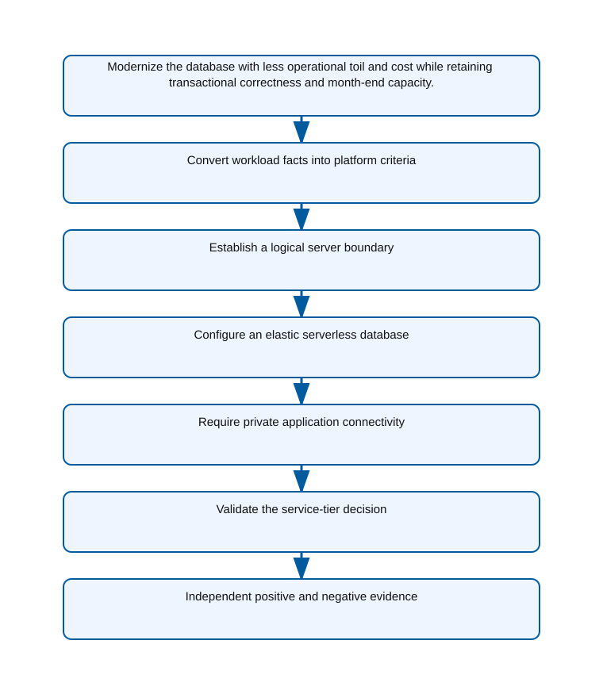

<!-- BEGIN GENERATED AZ305 V1 -->
# LAB-08 — Relational Data Platform and Service-Tier Selection

## 1. Navigation

[← LAB-07](../07-compliance-identity-governance/README.md) · [Lab catalog](../README.md) · [LAB-09 →](../09-relational-scale-protection/README.md)

## 2. Scenario and completion contract

Woodgrove Bank is replacing a small line-of-business database hosted on aging virtual machines. The application uses ordinary SQL transactions and predictable daytime demand, can change connection handling, and has no instance-scoped SQL Server dependency. Demand falls close to zero overnight, yet month-end processing needs temporary compute growth. Architects must compare Azure SQL Database, Azure SQL Managed Instance, and Azure Database for PostgreSQL rather than defaulting to the familiar engine. As the data architect, select the relational platform and service tier, define identity and network boundaries, and provide command evidence that the chosen compute model matches compatibility, operations, elasticity, latency, and cost constraints.

- Architect role: Relational data platform architect
- Outcome: A justified relational service and tier selection with a secure, elastic reference configuration.
- Duration: 155 minutes
- Difficulty: advanced
- Cost class: moderate
- Completion: all five checkpoint assertions, final validation, decision revision, and cleanup review are complete.

## 3. Objective-to-evidence map

| Objective | Requirement | Checkpoint |
| --- | --- | --- |
| `DATA-REL-01` | `LAB08-REQ-01` | [`LAB08-CP01`](#checkpoint-1) |
| `DATA-REL-02` | `LAB08-REQ-02` | [`LAB08-CP02`](#checkpoint-2) |
| `DATA-REL-01` | `LAB08-REQ-03` | [`LAB08-CP03`](#checkpoint-3) |
| `DATA-REL-02` | `LAB08-REQ-04` | [`LAB08-CP04`](#checkpoint-4) |
| `DATA-REL-01` | `LAB08-REQ-05` | [`LAB08-CP05`](#checkpoint-5) |

## 4. Business and quality requirements

Business outcome: Modernize the database with less operational toil and cost while retaining transactional correctness and month-end capacity.

- `LAB08-REQ-01` — Compatibility, transaction, scale, latency, maintenance, and cost facts map to supported current service tiers.
- `LAB08-REQ-02` — The logical server has a group-owned Microsoft Entra administrator and no SQL authentication dependency.
- `LAB08-REQ-03` — General Purpose serverless supplies bounded autoscaling and one-hour autopause for the intermittent workload.
- `LAB08-REQ-04` — The application reaches the logical server through an approved private endpoint and private DNS path.
- `LAB08-REQ-05` — Provisioned configuration matches the selected candidate and all mandatory compatibility and capacity requirements.

Scenario facts:

- **Data:** The source uses relational transactions plus instance-scoped behaviors discovered through compatibility assessment.
- **Scale:** Ordinary utilization is intermittent but month-end capacity is materially higher; measured vCore and storage values remain source evidence.
- **Latency:** Transaction response and month-end batch deadlines require benchmarks; the scenario does not invent a millisecond target.
- **Availability:** Managed service high availability must cover platform faults without confusing backups with service continuity.
- **RTO:** Cutover rollback and database restoration need owner-approved targets before production migration.
- **RPO:** Transaction-loss tolerance is an application requirement to be measured; no numerical value is supplied here.
- **Budget:** Serverless can reduce idle cost, whereas Managed Instance commits baseline capacity to satisfy instance compatibility.

Constraints:

- Transactional correctness and month-end processing must be preserved while reducing database administration.
- SQL Agent, cross-database transactions, and instance-level collation are mandatory after discovery of the acquired application.
- Use only the Azure CLI command lane for learner implementation.
- Keep all live changes behind explicit execution and acknowledgement switches.
- Retain only sanitized command evidence and synthetic fixture identifiers.

Assumptions:

- Compatibility assessment evidence is available before a target platform is provisioned.
- The application owner can schedule migration testing without changing the source database during this lab.
- West Europe is the configurable primary example and North Europe is the configurable secondary example.
- The learner has administrator-level Azure operations knowledge but receives no pre-existing authenticated context.
- Offline fixtures demonstrate contract behavior rather than live Azure service behavior.

## 5. Architecture diagram and walkthrough



The flow begins with the business outcome, crosses five independently validated design capabilities, and ends with positive and negative evidence. The SVG is deterministically rendered from `diagrams/architecture.mmd`.

## 6. Concept primer and candidate architectures

Architecture decisions translate measurable requirements into a deliberate service and operating model. A candidate is viable only when every mandatory constraint is met; convenience or familiarity cannot compensate for a disqualifier.

- **Azure SQL Database General Purpose serverless** (eligible) — Before the acquired dependency is known, serverless SQL Database best matches intermittent load and minimizes platform administration.
- **Azure SQL Managed Instance General Purpose** (eligible) — Managed Instance provides broader instance compatibility and managed operations, with a higher continuously allocated cost floor.
- **Azure Database for PostgreSQL Flexible Server General Purpose** (eligible) — PostgreSQL is a capable managed relational target, but engine conversion expands schema, code, testing, and cutover work.
- **Larger Azure SQL Database tier without compatibility remediation** (ineligible) — More database compute changes capacity but does not add missing instance-scoped compatibility features. Disqualifier: LAB08-REQ-01 requires mandatory engine and instance compatibility to be established before selecting a service tier.

## 7. Decision, ADR, and Well-Architected review

Criteria weights are C1 30, C2 25, C3 20, C4 15, and C5 10. Weighted totals use `sum(weight × score) / 5`.

| Candidate | Eligible | C1 | C2 | C3 | C4 | C5 | Weighted /100 |
| --- | ---: | ---: | ---: | ---: | ---: | ---: | ---: |
| Azure SQL Database General Purpose serverless | yes | 5 | 4 | 4 | 5 | 5 | 91 |
| Azure SQL Managed Instance General Purpose | yes | 4 | 4 | 4 | 4 | 2 | 76 |
| Azure Database for PostgreSQL Flexible Server General Purpose | yes | 2 | 4 | 4 | 3 | 3 | 63 |
| Larger Azure SQL Database tier without compatibility remediation | no | 1 | 4 | 4 | 3 | 2 | 55 |

Selected design: **Azure SQL Database General Purpose serverless**. `ADR-LAB08-001` records the accepted reasoning. Review Reliability, Security, Cost Optimization, Operational Excellence, and Performance Efficiency in `design/decision.yml`; no pillar is implied by another.

Rejected alternatives:

- **Azure SQL Managed Instance General Purpose:** Its initial cost is not justified until SQL Agent and instance-level dependencies become mandatory.
- **Azure Database for PostgreSQL Flexible Server General Purpose:** Engine migration risk is unnecessary for an application whose discovered dependencies remain SQL Server specific.
- **Larger Azure SQL Database tier without compatibility remediation:** The candidate is disqualified because scaling cannot repair a platform compatibility gap.

Architecture risks:

- **Risk:** Compatibility tooling can miss runtime jobs or infrequently used cross-database paths. **Mitigation:** Reconcile assessment output with SQL Agent history, dependency telemetry, and an owner-signed feature inventory.
- **Risk:** Managed Instance baseline cost may exceed the modernization budget during idle periods. **Mitigation:** Size from measured month-end and ordinary load, apply license benefits where eligible, and expose the fixed-cost delta.

Well-Architected consequences:

- **Reliability:** Managed database high availability and tested rollback protect transactions during platform and migration failure.
- **Security:** Private access, managed identity where supported, encryption, and least-privilege database roles remain target requirements.
- **Cost Optimization:** Compute model follows measured utilization while compatibility prevents false savings that reappear as remediation work.
- **Operational Excellence:** Compatibility findings, cutover gates, and post-migration assertions make the target decision auditable.
- **Performance Efficiency:** Month-end benchmarks and workload-specific sizing replace an assumption that a larger tier fixes incompatibility.

ADR consequences:

- The initial serverless recommendation is superseded for the acquired workload after compatibility evidence changes.
- Managed Instance capacity and networking require a longer provisioning and cost-planning lead time.

## 8. Inputs, permissions, licensing, cost, and analogue

Use configurable `Location` (`AZ305_LOCATION`, default West Europe) and `SecondaryLocation` (`AZ305_SECONDARY_LOCATION`, default North Europe). Every public input has an explicit `AZ305_*` fallback. Preview is the default; only Golden Lab 00 writes an intent-only `execute: false` preview record. Before an executed cloud command, the supplied subscription and tenant must exactly match the active CLI, Az, and—where applicable—Microsoft Graph contexts. `-Execute` crosses the execution boundary; cost-bearing and tenant-scoped paths also require their independent acknowledgement switches.

Safe analogue: The reference topology is deployable at bounded scope; preview remains the default and live verification is separate.

Permissions: SQL resource read access supports discovery; server, database, networking, or migration changes require a separately approved SQL control-plane role and database permissions.

Licensing: Azure SQL Database serverless and Azure SQL Managed Instance use different compute, storage, backup, and license-benefit models.

Cost boundary: Compare idle auto-pause savings, month-end compute, managed-instance baseline capacity, backup storage, and migration effort.

## 9. Read-only preflight

```powershell
pwsh ./scripts/azure-cli/Preflight.ps1 -RunId synthetic-080001
```

Synthetic sample: `{"labId":"LAB-08","track":"azure-cli","result":"pass","note":"Local tool discovery only"}`. This is illustrative local output, not evidence captured from Azure.

## 10. Five guided checkpoints

### Checkpoint 1: Convert workload facts into platform criteria

<a id="checkpoint-1"></a>

**Trace:** `DATA-REL-01` → `LAB08-REQ-01` → `LAB08-CP01`

```powershell
az sql db list-editions --location $Location --query "[?name=='GeneralPurpose'].{edition:name,families:supportedFamilies}" -o json
```

Expected evidence: Compatibility, transaction, scale, latency, maintenance, and cost facts map to supported current service tiers. Retain Sanitized workload fact sheet, edition names, supported families, region, and decision criteria.

Positive assertion:

```powershell
az sql db list-editions --location $Location --query '[?name == ''GeneralPurpose'' && zoneRedundant == `true`].name' -o tsv
```

Negative assertion:

```powershell
az sql db list-editions --location $Location --query "[?name=='Web' || name=='Business'].name" -o tsv
```

Failure and retry: A required feature is instance-scoped or unavailable in the target region and tier. Reclassify the requirement as mandatory and rescore Managed Instance before choosing a larger database tier.

Cleanup dependency: This regional capability query creates no resource.

WAF consequence: Performance Efficiency: measured workload demand and compatibility select a supported service tier.

### Checkpoint 2: Establish a logical server boundary

<a id="checkpoint-2"></a>

**Trace:** `DATA-REL-02` → `LAB08-REQ-02` → `LAB08-CP02`

```powershell
az sql server create --name $SqlServerName --resource-group $ResourceGroup --location $Location --enable-ad-only-auth --external-admin-principal-type Group --external-admin-name $AdminGroupName --external-admin-sid $AdminGroupObjectId --tags purpose=az305-lab labId=LAB-08 runId=$RunId expiresOn=$ExpiresOn
```

Expected evidence: The logical server has a group-owned Microsoft Entra administrator and no SQL authentication dependency. Retain Server label, region, administrator group label, authentication mode, and resource ID without credentials.

Positive assertion:

```powershell
az sql server show --name $SqlServerName --resource-group $ResourceGroup --query "{name:name,location:location,publicNetworkAccess:publicNetworkAccess,identity:identity.type}" -o json
```

Negative assertion:

```powershell
az sql server ad-admin list --server-name $SqlServerName --resource-group $ResourceGroup --query "[?administratorType!='ActiveDirectory'].administratorType" -o tsv
```

Failure and retry: Directory object lookup or SQL Entra-only authentication is unavailable to the executing identity. Confirm the group object ID and delegated permission; do not substitute a committed password.

Cleanup dependency: Delete databases and private endpoints before the run-owned logical server.

WAF consequence: Security: Entra-only authentication and group administration remove personal and password-based control paths.

### Checkpoint 3: Configure an elastic serverless database

<a id="checkpoint-3"></a>

**Trace:** `DATA-REL-01` → `LAB08-REQ-03` → `LAB08-CP03`

```powershell
az sql db create --resource-group $ResourceGroup --server $SqlServerName --name $DatabaseName --edition GeneralPurpose --compute-model Serverless --family Gen5 --capacity 2 --min-capacity 0.5 --auto-pause-delay 60 --zone-redundant false --tags purpose=az305-lab labId=LAB-08 runId=$RunId expiresOn=$ExpiresOn
```

Expected evidence: General Purpose serverless supplies bounded autoscaling and one-hour autopause for the intermittent workload. Retain Database label, edition, family, maximum and minimum vCores, autopause delay, and zone decision.

Positive assertion:

```powershell
az sql db show --resource-group $ResourceGroup --server $SqlServerName --name $DatabaseName --query "{edition:edition,computeModel:computeModel,capacity:sku.capacity,minCapacity:minCapacity,autoPause:autoPauseDelay}" -o json
```

Negative assertion:

```powershell
az sql db show --resource-group $ResourceGroup --server $SqlServerName --name $DatabaseName --query "{edition:edition,serviceObjective:currentServiceObjectiveName}" -o json
```

Failure and retry: Features such as geo replicas or sustained minimum activity prevent autopause or serverless use. Measure the blocking dependency and compare provisioned General Purpose without changing database engine.

Cleanup dependency: Delete the run-owned database before its logical server; do not purge backups.

WAF consequence: Cost Optimization: serverless compute scales down during idle periods within an approved capacity ceiling.

### Checkpoint 4: Require private application connectivity

<a id="checkpoint-4"></a>

**Trace:** `DATA-REL-02` → `LAB08-REQ-04` → `LAB08-CP04`

```powershell
az network private-endpoint create --name $PrivateEndpointName --resource-group $ResourceGroup --location $Location --subnet $SubnetId --private-connection-resource-id $SqlServerResourceId --group-id sqlServer --connection-name $PrivateConnectionName --tags purpose=az305-lab labId=LAB-08 runId=$RunId expiresOn=$ExpiresOn
```

Expected evidence: The application reaches the logical server through an approved private endpoint and private DNS path. Retain Private endpoint ID, connection status, subnet ID, DNS zone label, and firewall-rule count.

Positive assertion:

```powershell
az network private-endpoint-connection list --id $SqlServerResourceId --query "[?properties.privateLinkServiceConnectionState.status=='Approved'].id" -o tsv
```

Negative assertion:

```powershell
az sql server firewall-rule list --resource-group $ResourceGroup --server $SqlServerName --query "[?startIpAddress=='0.0.0.0' && endIpAddress=='0.0.0.0'].name" -o tsv
```

Failure and retry: Private DNS resolves incorrectly or the endpoint connection remains pending. Correct DNS linkage and approval independently before disabling or reopening any network path.

Cleanup dependency: Delete private DNS records and endpoint connections before server cleanup; preserve shared zones.

WAF consequence: Reliability: private DNS and endpoint approval are explicit, independently testable application dependencies.

### Checkpoint 5: Validate the service-tier decision

<a id="checkpoint-5"></a>

**Trace:** `DATA-REL-01` → `LAB08-REQ-05` → `LAB08-CP05`

```powershell
az sql db show --resource-group $ResourceGroup --server $SqlServerName --name $DatabaseName --query "{status:status,sku:sku,requestedServiceObjectiveName:requestedServiceObjectiveName,zoneRedundant:zoneRedundant}" -o json
```

Expected evidence: Provisioned configuration matches the selected candidate and all mandatory compatibility and capacity requirements. Retain SKU, status, objective, capacity bounds, utilization assumptions, and selected-candidate traceability.

Positive assertion:

```powershell
az sql db show --resource-group $ResourceGroup --server $SqlServerName --name $DatabaseName --query "status" -o tsv
```

Negative assertion:

```powershell
az sql db list-usages --resource-group $ResourceGroup --server $SqlServerName --name $DatabaseName --query "[?currentValue>=limit].name" -o tsv
```

Failure and retry: Observed capacity demand contradicts the serverless cost or latency assumptions. Re-run the decision matrix with measured demand and choose provisioned compute or another tier deliberately.

Cleanup dependency: Retain only sanitized configuration evidence, then follow database-to-server cleanup order.

WAF consequence: Operational Excellence: configuration and usage evidence tie the deployed database back to the reviewed service decision.

## 11. Final validation and interpretation

Run `Validate.ps1 -Mode Deployment -Execute` only after an executed run has state and you are authorized to issue the ten read-only checkpoint inspections. Without `-Execute`, ordinary deployment validation records `partial` and exits `2`; Golden Lab 00 alone can validate its intent-only preview locally. Exit `0` means all required assertions pass, `1` means at least one failed, and `2` means the outcome is gated or partial. Positive and negative commands execute independently, so one failure never suppresses its paired assertion.

## 12. Material change request

The acquired application reveals a hard dependency on SQL Agent, cross-database transactions, and instance-level collation; revise the platform choice without treating a larger SQL Database tier as compatibility.

Revised solution: select **Azure SQL Managed Instance General Purpose**. LAB08-REQ-05 makes SQL Agent, cross-database transactions, and instance collation mandatory, so compatibility overrides the initial serverless score and selects Managed Instance.

Revised Well-Architected consequences:

- **Reliability:** Managed Instance retains managed high availability while avoiding unsupported job and transaction workarounds.
- **Security:** The target still requires private networking and least-privilege database administration.
- **Cost Optimization:** Higher baseline compute is accepted and must be offset with measured sizing and eligible license benefits.
- **Operational Excellence:** Existing Agent jobs and instance behaviors move into a supported managed operating model.
- **Performance Efficiency:** Capacity is benchmarked for both ordinary and month-end demand after compatibility is established.

## 13. Architect job challenge

Quantify the operational and cost consequences of moving the design to Azure SQL Managed Instance General Purpose.

## 14. Troubleshooting, cleanup, and residual verification

- Separate engine compatibility requirements from performance symptoms when scoring platform candidates.
- Verify regional edition and feature availability before treating a deployment error as invalid syntax.
- Diagnose private endpoint approval, DNS, and SQL authorization as independent connection layers.

Cleanup previews nonempty state in reverse dependency order, writes `partial`, and exits `2`; an already empty run is completed locally and idempotently. Executed cleanup rechecks the exact live ID plus `purpose`, `labId`, `runId`, and `expiresOn` immediately before each removal, persists state after every absent or removed object, stops on the first dependency failure, and refuses unresolved pre-existing settings. It never automates purge. Finish with `Validate.ps1 -Mode PostCleanup`; the required residual count is zero.

## 15. Exam debrief, assessment, sources, and navigation

Explain the recommendation in terms of requirements, rejected alternatives, failure behavior, and all five WAF pillars. Complete `assessment/QUESTIONS.md`, then use the separately excluded answer key for remediation.

- [Choose a data store in Azure](https://learn.microsoft.com/en-us/azure/architecture/guide/technology-choices/data-stores-getting-started)
- [Azure Well-Architected Framework](https://learn.microsoft.com/en-us/azure/well-architected/)

[← LAB-07](../07-compliance-identity-governance/README.md) · [Lab catalog](../README.md) · [LAB-09 →](../09-relational-scale-protection/README.md)

## 16. Synchronized lifecycle-script appendix

### Preflight.ps1

```powershell
[CmdletBinding()]
param(
    [string]$SubscriptionId = $env:AZ305_SUBSCRIPTION_ID,
    [string]$TenantId = $env:AZ305_TENANT_ID,
    [ValidatePattern('^[a-z0-9-]{6,64}$')][string]$RunId = $env:AZ305_RUN_ID,
    [string]$Location = $(if ($env:AZ305_LOCATION) { $env:AZ305_LOCATION } else { 'westeurope' }),
    [string]$SecondaryLocation = $(if ($env:AZ305_SECONDARY_LOCATION) { $env:AZ305_SECONDARY_LOCATION } else { 'northeurope' }),
    [string]$ResourceGroup = $(if ($env:AZ305_RESOURCE_GROUP) { $env:AZ305_RESOURCE_GROUP } else { "rg-az305-$RunId" }),
    [string]$WorkloadName = $(if ($env:AZ305_WORKLOAD_NAME) { $env:AZ305_WORKLOAD_NAME } else { "az305-$RunId" }),
    [string]$ExpiresOn = $(if ($env:AZ305_EXPIRES_ON) { $env:AZ305_EXPIRES_ON } else { (Get-Date).ToUniversalTime().AddDays(1).ToString('yyyy-MM-dd') }),
    [string]$AdminGroupName = $env:AZ305_ADMIN_GROUP_NAME,
    [string]$AdminGroupObjectId = $env:AZ305_ADMIN_GROUP_OBJECT_ID,
    [string]$DatabaseName = $env:AZ305_DATABASE_NAME,
    [string]$PrivateConnectionName = $env:AZ305_PRIVATE_CONNECTION_NAME,
    [string]$PrivateEndpointName = $env:AZ305_PRIVATE_ENDPOINT_NAME,
    [string]$SqlServerName = $env:AZ305_SQL_SERVER_NAME,
    [string]$SqlServerResourceId = $env:AZ305_SQL_SERVER_RESOURCE_ID,
    [string]$SubnetId = $env:AZ305_SUBNET_ID,
    [switch]$Execute,
    [switch]$AcknowledgeCost,
    [switch]$AcknowledgeTenantChange
)

$ErrorActionPreference = 'Stop'
$PSNativeCommandUseErrorActionPreference = $true
if (-not $RunId) { [Console]::Error.WriteLine('RunId or AZ305_RUN_ID is required.'); exit 2 }
# Every lifecycle entrypoint intentionally exposes the same public parameter contract.
@($SubscriptionId, $TenantId, $RunId, $Location, $SecondaryLocation, $ResourceGroup, $WorkloadName, $ExpiresOn, $AdminGroupName, $AdminGroupObjectId, $DatabaseName, $PrivateConnectionName, $PrivateEndpointName, $SqlServerName, $SqlServerResourceId, $SubnetId, $Execute, $AcknowledgeCost, $AcknowledgeTenantChange) | Out-Null

$requiredCommands = @('az', 'pwsh')
$missing = @($requiredCommands | Where-Object { -not (Get-Command $_ -ErrorAction SilentlyContinue) })
if ($missing.Count -gt 0) {
    Write-Error "Missing local commands: $($missing -join ', ')"
    exit 1
}

[pscustomobject]@{
    labId = 'LAB-08'
    track = 'azure-cli'
    implementationMode = 'reference-deployable'
    result = 'pass'
    note = 'Local tool discovery only; no Azure or Microsoft Graph request was made.'
} | ConvertTo-Json
exit 0
```

### Setup.ps1

```powershell
[CmdletBinding()]
param(
    [string]$SubscriptionId = $env:AZ305_SUBSCRIPTION_ID,
    [string]$TenantId = $env:AZ305_TENANT_ID,
    [ValidatePattern('^[a-z0-9-]{6,64}$')][string]$RunId = $env:AZ305_RUN_ID,
    [string]$Location = $(if ($env:AZ305_LOCATION) { $env:AZ305_LOCATION } else { 'westeurope' }),
    [string]$SecondaryLocation = $(if ($env:AZ305_SECONDARY_LOCATION) { $env:AZ305_SECONDARY_LOCATION } else { 'northeurope' }),
    [string]$ResourceGroup = $(if ($env:AZ305_RESOURCE_GROUP) { $env:AZ305_RESOURCE_GROUP } else { "rg-az305-$RunId" }),
    [string]$WorkloadName = $(if ($env:AZ305_WORKLOAD_NAME) { $env:AZ305_WORKLOAD_NAME } else { "az305-$RunId" }),
    [string]$ExpiresOn = $(if ($env:AZ305_EXPIRES_ON) { $env:AZ305_EXPIRES_ON } else { (Get-Date).ToUniversalTime().AddDays(1).ToString('yyyy-MM-dd') }),
    [string]$AdminGroupName = $env:AZ305_ADMIN_GROUP_NAME,
    [string]$AdminGroupObjectId = $env:AZ305_ADMIN_GROUP_OBJECT_ID,
    [string]$DatabaseName = $env:AZ305_DATABASE_NAME,
    [string]$PrivateConnectionName = $env:AZ305_PRIVATE_CONNECTION_NAME,
    [string]$PrivateEndpointName = $env:AZ305_PRIVATE_ENDPOINT_NAME,
    [string]$SqlServerName = $env:AZ305_SQL_SERVER_NAME,
    [string]$SqlServerResourceId = $env:AZ305_SQL_SERVER_RESOURCE_ID,
    [string]$SubnetId = $env:AZ305_SUBNET_ID,
    [switch]$Execute,
    [switch]$AcknowledgeCost,
    [switch]$AcknowledgeTenantChange
)

$ErrorActionPreference = 'Stop'
$PSNativeCommandUseErrorActionPreference = $true
if (-not $RunId) { [Console]::Error.WriteLine('RunId or AZ305_RUN_ID is required.'); exit 2 }
# Every lifecycle entrypoint intentionally exposes the same public parameter contract.
@($SubscriptionId, $TenantId, $RunId, $Location, $SecondaryLocation, $ResourceGroup, $WorkloadName, $ExpiresOn, $AdminGroupName, $AdminGroupObjectId, $DatabaseName, $PrivateConnectionName, $PrivateEndpointName, $SqlServerName, $SqlServerResourceId, $SubnetId, $Execute, $AcknowledgeCost, $AcknowledgeTenantChange) | Out-Null

$LabRoot = Split-Path (Split-Path $PSScriptRoot -Parent) -Parent
$StateRoot = Join-Path $LabRoot ".state/$RunId"
$StatePath = Join-Path $StateRoot 'run.json'

function Invoke-AzCliJson {
    [CmdletBinding()]
    param([Parameter(Mandatory)][string[]]$ArgumentList)
    $savedNativePreference = $PSNativeCommandUseErrorActionPreference
    try {
        # Capture the exit code ourselves so a failed native command cannot be
        # mistaken for an empty but successful JSON response.
        $PSNativeCommandUseErrorActionPreference = $false
        $outputLines = @(& az @ArgumentList)
        $nativeExit = $LASTEXITCODE
    }
    finally {
        $PSNativeCommandUseErrorActionPreference = $savedNativePreference
    }
    if ($nativeExit -ne 0) { throw "Azure CLI exited with code $nativeExit." }
    $raw = @($outputLines) -join "`n"
    if ([string]::IsNullOrWhiteSpace($raw)) { return $null }
    try { return ($raw | ConvertFrom-Json -Depth 100) }
    catch { throw 'Azure CLI returned data that was not valid JSON.' }
}

function Assert-ExactExecutionContext {
    [CmdletBinding()]
    param([string]$ExpectedSubscriptionId, [string]$ExpectedTenantId)
    if ([string]::IsNullOrWhiteSpace($ExpectedSubscriptionId) -or [string]::IsNullOrWhiteSpace($ExpectedTenantId)) {
        throw 'SubscriptionId and TenantId are required before a cloud request.'
    }
    $context = Invoke-AzCliJson -ArgumentList @('account', 'show', '--output', 'json', '--only-show-errors')
    if (-not $context -or [string]$context.id -ine $ExpectedSubscriptionId -or [string]$context.tenantId -ine $ExpectedTenantId) {
        throw 'The active Azure CLI subscription or tenant does not exactly match the requested context.'
    }
}

function Save-RunState {
    [CmdletBinding()]
    param([Parameter(Mandatory)]$State)
    $temporaryPath = "$StatePath.tmp"
    $State | ConvertTo-Json -Depth 20 | Set-Content -LiteralPath $temporaryPath -Encoding utf8NoBOM
    Move-Item -LiteralPath $temporaryPath -Destination $StatePath -Force
}

function Assert-SafeStateValue {
    [CmdletBinding()]
    param($Value)
    $serialized = $Value | ConvertTo-Json -Depth 12 -Compress
    if ($serialized -match '(?i)"(?:token|password|secret|certificate|connectionString|sas|clientSecret|accessToken|refreshToken|accountKey|privateKey)"\s*:') {
        throw 'A prohibited sensitive field name was returned; state capture is refused.'
    }
}

function Convert-CheckpointOutput {
    [CmdletBinding()]
    param($Value)
    if ($Value -is [string]) { $raw = [string]$Value }
    elseif ($Value -is [System.Collections.IEnumerable] -and @($Value | Where-Object { $_ -isnot [string] }).Count -eq 0) { $raw = @($Value) -join "`n" }
    else { return $Value }
    if ([string]::IsNullOrWhiteSpace($raw)) { return $null }
    try { return ($raw | ConvertFrom-Json -Depth 100) } catch { return $Value }
}

function Get-ReturnedResourceId {
    [CmdletBinding()]
    param($Value)
    $seen = [System.Collections.Generic.HashSet[string]]::new([System.StringComparer]::OrdinalIgnoreCase)
    $results = [System.Collections.Generic.List[string]]::new()
    function Add-ArmId {
        param($Candidate)
        if ($Candidate -is [string] -and $Candidate -match '^/subscriptions/[0-9a-f-]+/(?:resourceGroups/[^/]+(?:/providers/.+)?|providers/.+)$' -and $Candidate -notmatch '/providers/Microsoft\.Resources/deployments/') {
            if ($seen.Add($Candidate)) { $results.Add($Candidate) }
        }
    }
    function Find-DeploymentOutputId {
        param($Item, [int]$Depth)
        if ($null -eq $Item -or $Depth -gt 12) { return }
        if ($Item -is [string]) { Add-ArmId -Candidate $Item; return }
        if ($Item -is [System.Collections.IDictionary]) { foreach ($key in $Item.Keys) { Find-DeploymentOutputId -Item $Item[$key] -Depth ($Depth + 1) }; return }
        if ($Item -is [System.Collections.IEnumerable]) { foreach ($entry in $Item) { Find-DeploymentOutputId -Item $entry -Depth ($Depth + 1) }; return }
        foreach ($property in @($Item.PSObject.Properties | Where-Object { $_.MemberType -in @('NoteProperty', 'Property') })) { Find-DeploymentOutputId -Item $property.Value -Depth ($Depth + 1) }
    }
    foreach ($rootItem in @($Value)) {
        if ($rootItem -is [System.Collections.IDictionary]) {
            foreach ($name in @('id', 'resourceId')) { if ($rootItem.Contains($name)) { Add-ArmId -Candidate $rootItem[$name] } }
            if ($rootItem.Contains('properties') -and $rootItem.properties -and $rootItem.properties.outputs) { Find-DeploymentOutputId -Item $rootItem.properties.outputs -Depth 0 }
            continue
        }
        foreach ($name in @('Id', 'ResourceId')) {
            $property = $rootItem.PSObject.Properties[$name]
            if ($property) { Add-ArmId -Candidate $property.Value }
        }
        if ($rootItem.PSObject.Properties['Properties'] -and $rootItem.Properties -and $rootItem.Properties.outputs) {
            Find-DeploymentOutputId -Item $rootItem.Properties.outputs -Depth 0
        }
    }
    return @($results)
}

function Get-PlannedDeploymentResourceId {
    [CmdletBinding()]
    param($Value)
    $seen = [System.Collections.Generic.HashSet[string]]::new([System.StringComparer]::OrdinalIgnoreCase)
    $results = [System.Collections.Generic.List[string]]::new()
    foreach ($change in @($Value.changes)) {
        $candidate = [string]$change.resourceId
        if ($candidate -match '^/subscriptions/[0-9a-f-]+/(?:resourceGroups/[^/]+(?:/providers/.+)?|providers/.+)$' -and $candidate -notmatch '/providers/Microsoft\.Resources/deployments/' -and $seen.Add($candidate)) {
            $results.Add($candidate)
        }
    }
    return @($results)
}

function Assert-InputSubscriptionScope {
    [CmdletBinding()]
    param($Inputs, [string]$ExpectedSubscriptionId)
    $entries = if ($Inputs -is [System.Collections.IDictionary]) {
        @($Inputs.GetEnumerator())
    } else {
        @($Inputs.PSObject.Properties | ForEach-Object { [pscustomobject]@{ Key = $_.Name; Value = $_.Value } })
    }
    foreach ($entry in $entries) {
        if ($entry.Value -is [string] -and [string]$entry.Value -match '^/subscriptions/([^/]+)/') {
            if ($Matches[1] -ine $ExpectedSubscriptionId) { throw "Input $($entry.Key) belongs to a different subscription." }
        }
    }
}

function Assert-ManagedMutation {
    [CmdletBinding()]
    param($State, [string]$CheckpointId, [bool]$CarriesOwnership, [object[]]$TargetResourceIds)
    if ($CarriesOwnership) { return }
    $targets = @($TargetResourceIds | Where-Object { $_ -is [string] -and $_ -match '^/subscriptions/' })
    if ($targets.Count -eq 0) { throw "$CheckpointId refuses an untagged mutation because no exact ARM target ID was supplied." }
    $knownIds = @($State.managedObjects | ForEach-Object { [string]$_.id })
    if ($knownIds.Count -eq 0) { throw "$CheckpointId refuses to modify a pre-existing object because no run-owned parent has been recorded." }
    foreach ($target in $targets) {
        $related = @($knownIds | Where-Object { $target -ieq $_ -or $target.StartsWith("$_/", [System.StringComparison]::OrdinalIgnoreCase) -or $_.StartsWith("$target/", [System.StringComparison]::OrdinalIgnoreCase) }).Count -gt 0
        if (-not $related) { throw "$CheckpointId refuses a mutation outside the exact run-owned resource boundary." }
    }
}

$executionInputs = [ordered]@{ subscriptionId = $SubscriptionId; tenantId = $TenantId; location = $Location; secondaryLocation = $SecondaryLocation; resourceGroup = $ResourceGroup; workloadName = $WorkloadName; expiresOn = $ExpiresOn; AdminGroupName = $AdminGroupName; AdminGroupObjectId = $AdminGroupObjectId; DatabaseName = $DatabaseName; PrivateConnectionName = $PrivateConnectionName; PrivateEndpointName = $PrivateEndpointName; SqlServerName = $SqlServerName; SqlServerResourceId = $SqlServerResourceId; SubnetId = $SubnetId }

if (-not $Execute) {
    Write-Output '[preview] No cloud command was called and no state was created.'
    Write-Output '[preview] Re-run with -Execute only in an authorized disposable environment.'
    exit 0
}
# This setup is compatible with the lab implementation mode.
if (-not $AcknowledgeCost) { [Console]::Error.WriteLine('Cost acknowledgement is required.'); exit 2 }
# This lab does not perform a tenant-scoped change by default.
$requiredLabInputs = [ordered]@{ AdminGroupName = $AdminGroupName; AdminGroupObjectId = $AdminGroupObjectId; DatabaseName = $DatabaseName; PrivateConnectionName = $PrivateConnectionName; PrivateEndpointName = $PrivateEndpointName; SqlServerName = $SqlServerName; SqlServerResourceId = $SqlServerResourceId; SubnetId = $SubnetId }
$missingLabInputs = @($requiredLabInputs.GetEnumerator() | Where-Object { $_.Value -is [string] -and [string]::IsNullOrWhiteSpace([string]$_.Value) } | ForEach-Object Key)
if ($missingLabInputs.Count -gt 0) { [Console]::Error.WriteLine("Execution is gated; supply: $($missingLabInputs -join ', ')."); exit 2 }

try {
    Assert-ExactExecutionContext -ExpectedSubscriptionId $SubscriptionId -ExpectedTenantId $TenantId
    Assert-InputSubscriptionScope -Inputs $executionInputs -ExpectedSubscriptionId $SubscriptionId
    Assert-SafeStateValue -Value $executionInputs
}
catch {
    [Console]::Error.WriteLine("Execution is gated by context or input validation: $($_.Exception.Message)")
    exit 2
}

# Recovery state is persisted before the first possible mutation below.
if (Test-Path -LiteralPath $StatePath) {
    [Console]::Error.WriteLine('Run state already exists. Choose a new RunId or complete the recorded cleanup; existing recovery state will not be overwritten.')
    exit 2
}
New-Item -ItemType Directory -Path $StateRoot -Force | Out-Null
$state = [ordered]@{
    schemaVersion = '1.0.0'; labId = 'LAB-08'; runId = $RunId; track = 'azure-cli'
    implementationMode = 'reference-deployable'; status = 'initialized'
    createdAt = (Get-Date).ToUniversalTime().ToString('o'); execute = $true
    parameters = $executionInputs
    managedObjects = @(); originalSettings = @()
}
Save-RunState -State $state
$state.status = 'deploying'
Save-RunState -State $state

$originalLocation = Get-Location
try {
    Set-Location -LiteralPath $LabRoot
    # 08-CP01: Convert workload facts into platform criteria
    $stepResult = & { az sql db list-editions --location $Location --query "[?name=='GeneralPurpose'].{edition:name,families:supportedFamilies}" -o json }
    if ($LASTEXITCODE -ne 0) { throw 'LAB08-CP01 native command exited with code ' + $LASTEXITCODE + '.' }
    $null = $stepResult

    # 08-CP02: Establish a logical server boundary
    Assert-ManagedMutation -State $state -CheckpointId 'LAB08-CP02' -CarriesOwnership:$true -TargetResourceIds @()
    $stepResult = & { az sql server create --name $SqlServerName --resource-group $ResourceGroup --location $Location --enable-ad-only-auth --external-admin-principal-type Group --external-admin-name $AdminGroupName --external-admin-sid $AdminGroupObjectId --tags purpose=az305-lab labId=LAB-08 runId=$RunId expiresOn=$ExpiresOn }
    if ($LASTEXITCODE -ne 0) { throw 'LAB08-CP02 native command exited with code ' + $LASTEXITCODE + '.' }
    $candidate = Convert-CheckpointOutput -Value $stepResult
    $returnedIds = @(Get-ReturnedResourceId -Value $candidate)
    if ($returnedIds.Count -eq 0) { throw 'LAB08-CP02 created an owned resource but returned no recoverable ARM resource ID.' }
    foreach ($returnedId in $returnedIds) {
        if ($returnedId -notmatch '^/subscriptions/([^/]+)/' -or $Matches[1] -ine $SubscriptionId) { throw 'A returned recovery ID belongs to a different subscription.' }
        if (@($state.managedObjects | Where-Object { $_.id -ieq $returnedId }).Count -eq 0) {
            $state.managedObjects += [pscustomobject]@{
                id = $returnedId
                type = 'azure-resource'
                tags = [ordered]@{ purpose = 'az305-lab'; labId = 'LAB-08'; runId = $RunId; expiresOn = $ExpiresOn }
            }
            Save-RunState -State $state
        }
    }
    $null = $stepResult

    # 08-CP03: Configure an elastic serverless database
    Assert-ManagedMutation -State $state -CheckpointId 'LAB08-CP03' -CarriesOwnership:$true -TargetResourceIds @()
    $stepResult = & { az sql db create --resource-group $ResourceGroup --server $SqlServerName --name $DatabaseName --edition GeneralPurpose --compute-model Serverless --family Gen5 --capacity 2 --min-capacity 0.5 --auto-pause-delay 60 --zone-redundant false --tags purpose=az305-lab labId=LAB-08 runId=$RunId expiresOn=$ExpiresOn }
    if ($LASTEXITCODE -ne 0) { throw 'LAB08-CP03 native command exited with code ' + $LASTEXITCODE + '.' }
    $candidate = Convert-CheckpointOutput -Value $stepResult
    $returnedIds = @(Get-ReturnedResourceId -Value $candidate)
    if ($returnedIds.Count -eq 0) { throw 'LAB08-CP03 created an owned resource but returned no recoverable ARM resource ID.' }
    foreach ($returnedId in $returnedIds) {
        if ($returnedId -notmatch '^/subscriptions/([^/]+)/' -or $Matches[1] -ine $SubscriptionId) { throw 'A returned recovery ID belongs to a different subscription.' }
        if (@($state.managedObjects | Where-Object { $_.id -ieq $returnedId }).Count -eq 0) {
            $state.managedObjects += [pscustomobject]@{
                id = $returnedId
                type = 'azure-resource'
                tags = [ordered]@{ purpose = 'az305-lab'; labId = 'LAB-08'; runId = $RunId; expiresOn = $ExpiresOn }
            }
            Save-RunState -State $state
        }
    }
    $null = $stepResult

    # 08-CP04: Require private application connectivity
    Assert-ManagedMutation -State $state -CheckpointId 'LAB08-CP04' -CarriesOwnership:$true -TargetResourceIds @($SqlServerResourceId)
    $stepResult = & { az network private-endpoint create --name $PrivateEndpointName --resource-group $ResourceGroup --location $Location --subnet $SubnetId --private-connection-resource-id $SqlServerResourceId --group-id sqlServer --connection-name $PrivateConnectionName --tags purpose=az305-lab labId=LAB-08 runId=$RunId expiresOn=$ExpiresOn }
    if ($LASTEXITCODE -ne 0) { throw 'LAB08-CP04 native command exited with code ' + $LASTEXITCODE + '.' }
    $candidate = Convert-CheckpointOutput -Value $stepResult
    $returnedIds = @(Get-ReturnedResourceId -Value $candidate)
    if ($returnedIds.Count -eq 0) { throw 'LAB08-CP04 created an owned resource but returned no recoverable ARM resource ID.' }
    foreach ($returnedId in $returnedIds) {
        if ($returnedId -notmatch '^/subscriptions/([^/]+)/' -or $Matches[1] -ine $SubscriptionId) { throw 'A returned recovery ID belongs to a different subscription.' }
        if (@($state.managedObjects | Where-Object { $_.id -ieq $returnedId }).Count -eq 0) {
            $state.managedObjects += [pscustomobject]@{
                id = $returnedId
                type = 'azure-resource'
                tags = [ordered]@{ purpose = 'az305-lab'; labId = 'LAB-08'; runId = $RunId; expiresOn = $ExpiresOn }
            }
            Save-RunState -State $state
        }
    }
    $null = $stepResult

    # 08-CP05: Validate the service-tier decision
    $stepResult = & { az sql db show --resource-group $ResourceGroup --server $SqlServerName --name $DatabaseName --query "{status:status,sku:sku,requestedServiceObjectiveName:requestedServiceObjectiveName,zoneRedundant:zoneRedundant}" -o json }
    if ($LASTEXITCODE -ne 0) { throw 'LAB08-CP05 native command exited with code ' + $LASTEXITCODE + '.' }
    $null = $stepResult

    $state.status = 'deployed'
    Save-RunState -State $state
} catch {
    $state.status = 'failed'
    Save-RunState -State $state
    Write-Error $_
    exit 1
} finally {
    Set-Location -LiteralPath $originalLocation
}
exit 0
```

### Validate.ps1

```powershell
[CmdletBinding()]
param(
    [string]$SubscriptionId = $env:AZ305_SUBSCRIPTION_ID,
    [string]$TenantId = $env:AZ305_TENANT_ID,
    [ValidatePattern('^[a-z0-9-]{6,64}$')][string]$RunId = $env:AZ305_RUN_ID,
    [string]$Location = $(if ($env:AZ305_LOCATION) { $env:AZ305_LOCATION } else { 'westeurope' }),
    [string]$SecondaryLocation = $(if ($env:AZ305_SECONDARY_LOCATION) { $env:AZ305_SECONDARY_LOCATION } else { 'northeurope' }),
    [string]$ResourceGroup = $(if ($env:AZ305_RESOURCE_GROUP) { $env:AZ305_RESOURCE_GROUP } else { "rg-az305-$RunId" }),
    [string]$WorkloadName = $(if ($env:AZ305_WORKLOAD_NAME) { $env:AZ305_WORKLOAD_NAME } else { "az305-$RunId" }),
    [string]$ExpiresOn = $(if ($env:AZ305_EXPIRES_ON) { $env:AZ305_EXPIRES_ON } else { (Get-Date).ToUniversalTime().AddDays(1).ToString('yyyy-MM-dd') }),
    [string]$AdminGroupName = $env:AZ305_ADMIN_GROUP_NAME,
    [string]$AdminGroupObjectId = $env:AZ305_ADMIN_GROUP_OBJECT_ID,
    [string]$DatabaseName = $env:AZ305_DATABASE_NAME,
    [string]$PrivateConnectionName = $env:AZ305_PRIVATE_CONNECTION_NAME,
    [string]$PrivateEndpointName = $env:AZ305_PRIVATE_ENDPOINT_NAME,
    [string]$SqlServerName = $env:AZ305_SQL_SERVER_NAME,
    [string]$SqlServerResourceId = $env:AZ305_SQL_SERVER_RESOURCE_ID,
    [string]$SubnetId = $env:AZ305_SUBNET_ID,
    [ValidateSet('Deployment', 'PostCleanup')][string]$Mode = 'Deployment',
    [switch]$Execute,
    [switch]$AcknowledgeCost,
    [switch]$AcknowledgeTenantChange
)

$ErrorActionPreference = 'Stop'
$PSNativeCommandUseErrorActionPreference = $true
if (-not $RunId) { [Console]::Error.WriteLine('RunId or AZ305_RUN_ID is required.'); exit 2 }
# Every lifecycle entrypoint intentionally exposes the same public parameter contract.
@($SubscriptionId, $TenantId, $RunId, $Location, $SecondaryLocation, $ResourceGroup, $WorkloadName, $ExpiresOn, $AdminGroupName, $AdminGroupObjectId, $DatabaseName, $PrivateConnectionName, $PrivateEndpointName, $SqlServerName, $SqlServerResourceId, $SubnetId, $Mode, $Execute, $AcknowledgeCost, $AcknowledgeTenantChange) | Out-Null

$LabRoot = Split-Path (Split-Path $PSScriptRoot -Parent) -Parent
$StateRoot = Join-Path $LabRoot ".state/$RunId"
$RunPath = Join-Path $StateRoot 'run.json'
$ValidationPath = Join-Path $StateRoot 'validation.json'

function Invoke-AzCliJson {
    [CmdletBinding()]
    param([Parameter(Mandatory)][string[]]$ArgumentList)
    $savedNativePreference = $PSNativeCommandUseErrorActionPreference
    try {
        # Capture the exit code ourselves so a failed native command cannot be
        # mistaken for an empty but successful JSON response.
        $PSNativeCommandUseErrorActionPreference = $false
        $outputLines = @(& az @ArgumentList)
        $nativeExit = $LASTEXITCODE
    }
    finally {
        $PSNativeCommandUseErrorActionPreference = $savedNativePreference
    }
    if ($nativeExit -ne 0) { throw "Azure CLI exited with code $nativeExit." }
    $raw = @($outputLines) -join "`n"
    if ([string]::IsNullOrWhiteSpace($raw)) { return $null }
    try { return ($raw | ConvertFrom-Json -Depth 100) }
    catch { throw 'Azure CLI returned data that was not valid JSON.' }
}

function Assert-ExactExecutionContext {
    [CmdletBinding()]
    param([string]$ExpectedSubscriptionId, [string]$ExpectedTenantId)
    if ([string]::IsNullOrWhiteSpace($ExpectedSubscriptionId) -or [string]::IsNullOrWhiteSpace($ExpectedTenantId)) {
        throw 'SubscriptionId and TenantId are required before a cloud request.'
    }
    $context = Invoke-AzCliJson -ArgumentList @('account', 'show', '--output', 'json', '--only-show-errors')
    if (-not $context -or [string]$context.id -ine $ExpectedSubscriptionId -or [string]$context.tenantId -ine $ExpectedTenantId) {
        throw 'The active Azure CLI subscription or tenant does not exactly match the requested context.'
    }
}


if (-not (Test-Path -LiteralPath $RunPath)) {
    Write-Warning 'No run state exists; validation is gated.'
    exit 2
}
$state = Get-Content -LiteralPath $RunPath -Raw | ConvertFrom-Json
$assertions = [System.Collections.Generic.List[object]]::new()
function Add-ValidationAssertion {
    [CmdletBinding()]
    param([string]$Id, [ValidateSet('positive', 'negative')][string]$Kind, [bool]$Passed, [string]$Message)
    $assertions.Add([pscustomobject]@{ id = $Id; kind = $Kind; passed = $Passed; message = $Message })
}

function Save-ValidationArtifact {
    [CmdletBinding()]
    param([ValidateSet('pass', 'partial', 'fail')][string]$Result)
    $artifact = [ordered]@{ schemaVersion = '1.0.0'; labId = 'LAB-08'; runId = $RunId; mode = $Mode; result = $Result; validatedAt = (Get-Date).ToUniversalTime().ToString('o'); assertions = @($assertions) }
    $artifact | ConvertTo-Json -Depth 12 | Set-Content -LiteralPath $ValidationPath -Encoding utf8NoBOM
}

function Test-PositiveEvidence {
    [CmdletBinding()]
    param($Value)
    if ($Value -is [bool]) { return $Value }
    if ($null -eq $Value) { return $false }
    if ($Value -is [string]) { return -not [string]::IsNullOrWhiteSpace($Value) }
    if ($Value -is [System.Collections.IEnumerable]) { return @($Value).Count -gt 0 }
    return $true
}

function Test-NegativeEvidence {
    [CmdletBinding()]
    param($Value)
    if ($Value -is [bool]) { return $Value }
    if ($null -eq $Value) { return $true }
    if ($Value -is [string]) { return [string]::IsNullOrWhiteSpace($Value) }
    if ($Value -is [System.Collections.IEnumerable]) { return @($Value).Count -eq 0 }
    $properties = @($Value.PSObject.Properties | Where-Object { $_.MemberType -in @('NoteProperty', 'Property') })
    if ($properties.Count -eq 0) { return $false }
    return @($properties | Where-Object { -not (Test-NegativeEvidence -Value $_.Value) }).Count -eq 0
}

function Test-ProhibitedStateField {
    [CmdletBinding()]
    param($Value)
    $serialized = $Value | ConvertTo-Json -Depth 20
    return $serialized -match '(?i)"(?:token|password|secret|certificate|connectionString|sas|clientSecret|accessToken|refreshToken|accountKey|privateKey)"\s*:'
}

function Assert-InputSubscriptionScope {
    [CmdletBinding()]
    param($Inputs, [string]$ExpectedSubscriptionId)
    $entries = if ($Inputs -is [System.Collections.IDictionary]) {
        @($Inputs.GetEnumerator())
    } else {
        @($Inputs.PSObject.Properties | ForEach-Object { [pscustomobject]@{ Key = $_.Name; Value = $_.Value } })
    }
    foreach ($entry in $entries) {
        if ($entry.Value -is [string] -and [string]$entry.Value -match '^/subscriptions/([^/]+)/' -and $Matches[1] -ine $ExpectedSubscriptionId) {
            throw "Input $($entry.Key) belongs to a different subscription."
        }
    }
}

$stateIdentityMatches = (
    $state.labId -ceq 'LAB-08' -and
    $state.runId -ceq $RunId -and
    $state.track -ceq 'azure-cli' -and
    $state.implementationMode -ceq 'reference-deployable' -and
    ([string]$state.parameters.subscriptionId -ieq $SubscriptionId -and [string]$state.parameters.tenantId -ieq $TenantId)
)
Add-ValidationAssertion -Id 'LAB08-VAL-POS-01' -Kind positive -Passed $stateIdentityMatches -Message 'Run identity, implementation mode, command track, tenant, and subscription exactly match the copied lab and requested run.'
$hasSensitiveName = Test-ProhibitedStateField -Value $state
Add-ValidationAssertion -Id 'LAB08-VAL-NEG-01' -Kind negative -Passed (-not $hasSensitiveName) -Message 'State contains no prohibited sensitive field name.'

if ($Mode -eq 'PostCleanup') {
    $cleanupPath = Join-Path $StateRoot 'cleanup.json'
    $cleanup = if (Test-Path -LiteralPath $cleanupPath) { Get-Content -LiteralPath $cleanupPath -Raw | ConvertFrom-Json } else { $null }
    Add-ValidationAssertion -Id 'LAB08-VAL-POS-02' -Kind positive -Passed ($null -ne $cleanup -and $cleanup.labId -ceq 'LAB-08' -and $cleanup.runId -ceq $RunId -and $cleanup.result -eq 'pass' -and $cleanup.ownershipVerified) -Message 'The exact run cleanup completed with verified ownership.'
    Add-ValidationAssertion -Id 'LAB08-VAL-NEG-02' -Kind negative -Passed ($null -ne $cleanup -and $cleanup.activeManagedObjects -eq 0 -and @($state.managedObjects).Count -eq 0 -and @($state.originalSettings).Count -eq 0 -and $state.status -eq 'cleaned') -Message 'No active managed object or unresolved original setting remains in cleanup or run state.'
    $postCleanupPassed = @($assertions | Where-Object { -not $_.passed }).Count -eq 0
    Save-ValidationArtifact -Result $(if ($postCleanupPassed) { 'pass' } else { 'fail' })
    if ($postCleanupPassed) { exit 0 }
    exit 1
}

Add-ValidationAssertion -Id 'LAB08-VAL-POS-02' -Kind positive -Passed ($state.status -eq 'deployed') -Message 'The executed setup completed successfully; a failed setup can never validate as pass.'
Add-ValidationAssertion -Id 'LAB08-VAL-NEG-02' -Kind negative -Passed (@($state.managedObjects | Where-Object { $_.tags.purpose -ne 'az305-lab' -or $_.tags.labId -ne 'LAB-08' -or $_.tags.runId -ne $RunId }).Count -eq 0) -Message 'No recorded object has a foreign ownership tag.'

if (@($assertions | Where-Object { -not $_.passed }).Count -gt 0) {
    Save-ValidationArtifact -Result 'fail'
    exit 1
}
if (-not $Execute) {
    # This lab has no special intent-only validation path.
    Save-ValidationArtifact -Result 'partial'
    Write-Warning 'Checkpoint validation is gated; re-run with -Execute after confirming the exact read-only context.'
    exit 2
}
# The validation surface is compatible with this lab implementation mode.
$requiredValidationInputs = [ordered]@{ DatabaseName = $DatabaseName; SqlServerName = $SqlServerName; SqlServerResourceId = $SqlServerResourceId }
$missingValidationInputs = @($requiredValidationInputs.GetEnumerator() | Where-Object { $_.Value -is [string] -and [string]::IsNullOrWhiteSpace([string]$_.Value) } | ForEach-Object Key)
if ($missingValidationInputs.Count -gt 0) {
    Add-ValidationAssertion -Id 'LAB08-VAL-POS-CONTEXT' -Kind positive -Passed $false -Message 'One or more required non-secret validation inputs are missing.'
    Save-ValidationArtifact -Result 'partial'
    exit 2
}
try {
    Assert-ExactExecutionContext -ExpectedSubscriptionId $SubscriptionId -ExpectedTenantId $TenantId
    Assert-InputSubscriptionScope -Inputs $state.parameters -ExpectedSubscriptionId $SubscriptionId
    Add-ValidationAssertion -Id 'LAB08-VAL-POS-CONTEXT' -Kind positive -Passed $true -Message 'The active tenant and subscription exactly match the requested validation context.'
}
catch {
    Add-ValidationAssertion -Id 'LAB08-VAL-POS-CONTEXT' -Kind positive -Passed $false -Message 'Exact execution context could not be proven.'
    Save-ValidationArtifact -Result 'partial'
    exit 2
}

$originalLocation = Get-Location
try {
    Set-Location -LiteralPath $LabRoot
# LAB08-CP01: run both polarities even when one fails.
$positivePassed = $false
try {
    $global:LASTEXITCODE = 0
    $positiveEvidence = & { az sql db list-editions --location $Location --query '[?name == ''GeneralPurpose'' && zoneRedundant == `true`].name' -o tsv }
    if ($LASTEXITCODE -ne 0) { throw 'LAB08-CP01 positive native command exited with code ' + $LASTEXITCODE + '.' }
    $positivePassed = (Test-PositiveEvidence -Value $positiveEvidence)
    $null = $positiveEvidence
} catch { $positivePassed = $false }
Add-ValidationAssertion -Id 'LAB08-CP01-POS' -Kind positive -Passed $positivePassed -Message 'Compatibility, transaction, scale, latency, maintenance, and cost facts map to supported current service tiers.'

$negativePassed = $false
try {
    $global:LASTEXITCODE = 0
    $negativeEvidence = & { az sql db list-editions --location $Location --query "[?name=='Web' || name=='Business'].name" -o tsv }
    if ($LASTEXITCODE -ne 0) { throw 'LAB08-CP01 negative native command exited with code ' + $LASTEXITCODE + '.' }
    $negativePassed = (Test-NegativeEvidence -Value $negativeEvidence)
    $null = $negativeEvidence
} catch { $negativePassed = $false }
Add-ValidationAssertion -Id 'LAB08-CP01-NEG' -Kind negative -Passed $negativePassed -Message 'Retired service tiers or unverified regional capabilities are not used in the decision.'

# LAB08-CP02: run both polarities even when one fails.
$positivePassed = $false
try {
    $global:LASTEXITCODE = 0
    $positiveEvidence = & { az sql server show --name $SqlServerName --resource-group $ResourceGroup --query "{name:name,location:location,publicNetworkAccess:publicNetworkAccess,identity:identity.type}" -o json }
    if ($LASTEXITCODE -ne 0) { throw 'LAB08-CP02 positive native command exited with code ' + $LASTEXITCODE + '.' }
    $positivePassed = (Test-PositiveEvidence -Value $positiveEvidence)
    $null = $positiveEvidence
} catch { $positivePassed = $false }
Add-ValidationAssertion -Id 'LAB08-CP02-POS' -Kind positive -Passed $positivePassed -Message 'The logical server has a group-owned Microsoft Entra administrator and no SQL authentication dependency.'

$negativePassed = $false
try {
    $global:LASTEXITCODE = 0
    $negativeEvidence = & { az sql server ad-admin list --server-name $SqlServerName --resource-group $ResourceGroup --query "[?administratorType!='ActiveDirectory'].administratorType" -o tsv }
    if ($LASTEXITCODE -ne 0) { throw 'LAB08-CP02 negative native command exited with code ' + $LASTEXITCODE + '.' }
    $negativePassed = (Test-NegativeEvidence -Value $negativeEvidence)
    $null = $negativeEvidence
} catch { $negativePassed = $false }
Add-ValidationAssertion -Id 'LAB08-CP02-NEG' -Kind negative -Passed $negativePassed -Message 'No personal administrator or legacy SQL administrator is part of the access design.'

# LAB08-CP03: run both polarities even when one fails.
$positivePassed = $false
try {
    $global:LASTEXITCODE = 0
    $positiveEvidence = & { az sql db show --resource-group $ResourceGroup --server $SqlServerName --name $DatabaseName --query "{edition:edition,computeModel:computeModel,capacity:sku.capacity,minCapacity:minCapacity,autoPause:autoPauseDelay}" -o json }
    if ($LASTEXITCODE -ne 0) { throw 'LAB08-CP03 positive native command exited with code ' + $LASTEXITCODE + '.' }
    $positivePassed = (Test-PositiveEvidence -Value $positiveEvidence)
    $null = $positiveEvidence
} catch { $positivePassed = $false }
Add-ValidationAssertion -Id 'LAB08-CP03-POS' -Kind positive -Passed $positivePassed -Message 'General Purpose serverless supplies bounded autoscaling and one-hour autopause for the intermittent workload.'

$negativePassed = $false
try {
    $global:LASTEXITCODE = 0
    $negativeEvidence = & { az sql db show --resource-group $ResourceGroup --server $SqlServerName --name $DatabaseName --query "{edition:edition,serviceObjective:currentServiceObjectiveName}" -o json }
    if ($LASTEXITCODE -ne 0) { throw 'LAB08-CP03 negative native command exited with code ' + $LASTEXITCODE + '.' }
    $negativePassed = (Test-NegativeEvidence -Value $negativeEvidence)
    $null = $negativeEvidence
} catch { $negativePassed = $false }
Add-ValidationAssertion -Id 'LAB08-CP03-NEG' -Kind negative -Passed $negativePassed -Message 'A continuously provisioned premium or warehouse tier is not selected without a requirement.'

# LAB08-CP04: run both polarities even when one fails.
$positivePassed = $false
try {
    $global:LASTEXITCODE = 0
    $positiveEvidence = & { az network private-endpoint-connection list --id $SqlServerResourceId --query "[?properties.privateLinkServiceConnectionState.status=='Approved'].id" -o tsv }
    if ($LASTEXITCODE -ne 0) { throw 'LAB08-CP04 positive native command exited with code ' + $LASTEXITCODE + '.' }
    $positivePassed = (Test-PositiveEvidence -Value $positiveEvidence)
    $null = $positiveEvidence
} catch { $positivePassed = $false }
Add-ValidationAssertion -Id 'LAB08-CP04-POS' -Kind positive -Passed $positivePassed -Message 'The application reaches the logical server through an approved private endpoint and private DNS path.'

$negativePassed = $false
try {
    $global:LASTEXITCODE = 0
    $negativeEvidence = & { az sql server firewall-rule list --resource-group $ResourceGroup --server $SqlServerName --query "[?startIpAddress=='0.0.0.0' && endIpAddress=='0.0.0.0'].name" -o tsv }
    if ($LASTEXITCODE -ne 0) { throw 'LAB08-CP04 negative native command exited with code ' + $LASTEXITCODE + '.' }
    $negativePassed = (Test-NegativeEvidence -Value $negativeEvidence)
    $null = $negativeEvidence
} catch { $negativePassed = $false }
Add-ValidationAssertion -Id 'LAB08-CP04-NEG' -Kind negative -Passed $negativePassed -Message 'The Azure-services firewall bypass is absent and public access is not the recovery path for DNS errors.'

# LAB08-CP05: run both polarities even when one fails.
$positivePassed = $false
try {
    $global:LASTEXITCODE = 0
    $positiveEvidence = & { az sql db show --resource-group $ResourceGroup --server $SqlServerName --name $DatabaseName --query "status" -o tsv }
    if ($LASTEXITCODE -ne 0) { throw 'LAB08-CP05 positive native command exited with code ' + $LASTEXITCODE + '.' }
    $positivePassed = (Test-PositiveEvidence -Value $positiveEvidence)
    $null = $positiveEvidence
} catch { $positivePassed = $false }
Add-ValidationAssertion -Id 'LAB08-CP05-POS' -Kind positive -Passed $positivePassed -Message 'Provisioned configuration matches the selected candidate and all mandatory compatibility and capacity requirements.'

$negativePassed = $false
try {
    $global:LASTEXITCODE = 0
    $negativeEvidence = & { az sql db list-usages --resource-group $ResourceGroup --server $SqlServerName --name $DatabaseName --query "[?currentValue>=limit].name" -o tsv }
    if ($LASTEXITCODE -ne 0) { throw 'LAB08-CP05 negative native command exited with code ' + $LASTEXITCODE + '.' }
    $negativePassed = (Test-NegativeEvidence -Value $negativeEvidence)
    $null = $negativeEvidence
} catch { $negativePassed = $false }
Add-ValidationAssertion -Id 'LAB08-CP05-NEG' -Kind negative -Passed $negativePassed -Message 'No reported database usage dimension is already at its service limit.'

}
finally {
    Set-Location -LiteralPath $originalLocation
}

$passed = @($assertions | Where-Object { -not $_.passed }).Count -eq 0
Save-ValidationArtifact -Result $(if ($passed) { 'pass' } else { 'fail' })
if ($passed) { exit 0 }
exit 1
```

### Cleanup.ps1

```powershell
[CmdletBinding()]
param(
    [string]$SubscriptionId = $env:AZ305_SUBSCRIPTION_ID,
    [string]$TenantId = $env:AZ305_TENANT_ID,
    [ValidatePattern('^[a-z0-9-]{6,64}$')][string]$RunId = $env:AZ305_RUN_ID,
    [string]$Location = $(if ($env:AZ305_LOCATION) { $env:AZ305_LOCATION } else { 'westeurope' }),
    [string]$SecondaryLocation = $(if ($env:AZ305_SECONDARY_LOCATION) { $env:AZ305_SECONDARY_LOCATION } else { 'northeurope' }),
    [string]$ResourceGroup = $(if ($env:AZ305_RESOURCE_GROUP) { $env:AZ305_RESOURCE_GROUP } else { "rg-az305-$RunId" }),
    [string]$WorkloadName = $(if ($env:AZ305_WORKLOAD_NAME) { $env:AZ305_WORKLOAD_NAME } else { "az305-$RunId" }),
    [string]$ExpiresOn = $(if ($env:AZ305_EXPIRES_ON) { $env:AZ305_EXPIRES_ON } else { (Get-Date).ToUniversalTime().AddDays(1).ToString('yyyy-MM-dd') }),
    [string]$AdminGroupName = $env:AZ305_ADMIN_GROUP_NAME,
    [string]$AdminGroupObjectId = $env:AZ305_ADMIN_GROUP_OBJECT_ID,
    [string]$DatabaseName = $env:AZ305_DATABASE_NAME,
    [string]$PrivateConnectionName = $env:AZ305_PRIVATE_CONNECTION_NAME,
    [string]$PrivateEndpointName = $env:AZ305_PRIVATE_ENDPOINT_NAME,
    [string]$SqlServerName = $env:AZ305_SQL_SERVER_NAME,
    [string]$SqlServerResourceId = $env:AZ305_SQL_SERVER_RESOURCE_ID,
    [string]$SubnetId = $env:AZ305_SUBNET_ID,
    [switch]$Execute,
    [switch]$AcknowledgeCost,
    [switch]$AcknowledgeTenantChange
)

$ErrorActionPreference = 'Stop'
$PSNativeCommandUseErrorActionPreference = $true
if (-not $RunId) { [Console]::Error.WriteLine('RunId or AZ305_RUN_ID is required.'); exit 2 }
# Every lifecycle entrypoint intentionally exposes the same public parameter contract.
@($SubscriptionId, $TenantId, $RunId, $Location, $SecondaryLocation, $ResourceGroup, $WorkloadName, $ExpiresOn, $AdminGroupName, $AdminGroupObjectId, $DatabaseName, $PrivateConnectionName, $PrivateEndpointName, $SqlServerName, $SqlServerResourceId, $SubnetId, $Execute, $AcknowledgeCost, $AcknowledgeTenantChange) | Out-Null

$LabRoot = Split-Path (Split-Path $PSScriptRoot -Parent) -Parent
$StateRoot = Join-Path $LabRoot ".state/$RunId"
$RunPath = Join-Path $StateRoot 'run.json'
$CleanupPath = Join-Path $StateRoot 'cleanup.json'

function Invoke-AzCliJson {
    [CmdletBinding()]
    param([Parameter(Mandatory)][string[]]$ArgumentList)
    $savedNativePreference = $PSNativeCommandUseErrorActionPreference
    try {
        # Capture the exit code ourselves so a failed native command cannot be
        # mistaken for an empty but successful JSON response.
        $PSNativeCommandUseErrorActionPreference = $false
        $outputLines = @(& az @ArgumentList)
        $nativeExit = $LASTEXITCODE
    }
    finally {
        $PSNativeCommandUseErrorActionPreference = $savedNativePreference
    }
    if ($nativeExit -ne 0) { throw "Azure CLI exited with code $nativeExit." }
    $raw = @($outputLines) -join "`n"
    if ([string]::IsNullOrWhiteSpace($raw)) { return $null }
    try { return ($raw | ConvertFrom-Json -Depth 100) }
    catch { throw 'Azure CLI returned data that was not valid JSON.' }
}

function Assert-ExactExecutionContext {
    [CmdletBinding()]
    param([string]$ExpectedSubscriptionId, [string]$ExpectedTenantId)
    if ([string]::IsNullOrWhiteSpace($ExpectedSubscriptionId) -or [string]::IsNullOrWhiteSpace($ExpectedTenantId)) {
        throw 'SubscriptionId and TenantId are required before a cloud request.'
    }
    $context = Invoke-AzCliJson -ArgumentList @('account', 'show', '--output', 'json', '--only-show-errors')
    if (-not $context -or [string]$context.id -ine $ExpectedSubscriptionId -or [string]$context.tenantId -ine $ExpectedTenantId) {
        throw 'The active Azure CLI subscription or tenant does not exactly match the requested context.'
    }
}


function Invoke-AzCliCleanupCommand {
    [CmdletBinding()]
    param([Parameter(Mandatory)][string[]]$ArgumentList)
    $savedNativePreference = $PSNativeCommandUseErrorActionPreference
    try {
        $PSNativeCommandUseErrorActionPreference = $false
        $outputLines = @(& az @ArgumentList)
        $nativeExit = $LASTEXITCODE
    }
    finally {
        $PSNativeCommandUseErrorActionPreference = $savedNativePreference
    }
    return [pscustomobject]@{ ExitCode = $nativeExit; Output = @($outputLines) }
}


function Save-RunState {
    [CmdletBinding()]
    param([Parameter(Mandatory)]$State)
    $temporaryPath = "$RunPath.tmp"
    $State | ConvertTo-Json -Depth 20 | Set-Content -LiteralPath $temporaryPath -Encoding utf8NoBOM
    Move-Item -LiteralPath $temporaryPath -Destination $RunPath -Force
}

function Save-CleanupArtifact {
    [CmdletBinding()]
    param(
        [ValidateSet('pass', 'partial', 'fail')][string]$Result,
        [bool]$OwnershipVerified
    )
    $artifact = [ordered]@{
        schemaVersion = '1.0.0'; labId = 'LAB-08'; runId = $RunId; result = $Result
        completedAt = (Get-Date).ToUniversalTime().ToString('o'); ownershipVerified = $OwnershipVerified
        activeManagedObjects = @($state.managedObjects).Count; actions = @($actions)
    }
    $temporaryPath = "$CleanupPath.tmp"
    $artifact | ConvertTo-Json -Depth 12 | Set-Content -LiteralPath $temporaryPath -Encoding utf8NoBOM
    Move-Item -LiteralPath $temporaryPath -Destination $CleanupPath -Force
}

function Assert-ExactLiveOwnership {
    [CmdletBinding()]
    param($Tags, $Managed)
    if ($null -eq $Tags) { throw 'Live resource has no ownership tags.' }
    $valid = (
        [string]$Tags.purpose -ceq 'az305-lab' -and
        [string]$Tags.labId -ceq 'LAB-08' -and
        [string]$Tags.runId -ceq $RunId -and
        [string]$Tags.expiresOn -ceq [string]$Managed.tags.expiresOn
    )
    if (-not $valid) { throw 'Live ownership tags do not exactly match run state.' }
}

function Complete-ManagedObject {
    [CmdletBinding()]
    param([Parameter(Mandatory)][string]$ManagedId, [ValidateSet('removed', 'absent')][string]$Result)
    $state.managedObjects = @($state.managedObjects | Where-Object { [string]$_.id -ine $ManagedId })
    # Settings for a deleted run-owned object or its descendants no longer need restoration.
    $state.originalSettings = @($state.originalSettings | Where-Object {
        $settingId = [string]$_.id
        -not ($settingId -ieq $ManagedId -or $settingId.StartsWith("$ManagedId/", [System.StringComparison]::OrdinalIgnoreCase))
    })
    Save-RunState -State $state
    $actions.Add([pscustomobject]@{ id = $ManagedId; result = $Result })
}

if (-not (Test-Path -LiteralPath $RunPath)) { Write-Warning 'No run state exists; cleanup is gated.'; exit 2 }
try { $state = Get-Content -LiteralPath $RunPath -Raw | ConvertFrom-Json -Depth 100 }
catch { [Console]::Error.WriteLine('Cleanup refused because run state is not valid JSON.'); exit 1 }
$actions = [System.Collections.Generic.List[object]]::new()
$identityValid = (
    $state.labId -ceq 'LAB-08' -and
    $state.runId -ceq $RunId -and
    $state.track -ceq 'azure-cli' -and
    $state.implementationMode -ceq 'reference-deployable'
)
if (-not $identityValid) {
    $actions.Add([pscustomobject]@{ id = 'identity-check'; result = 'refused' })
    Save-CleanupArtifact -Result fail -OwnershipVerified $false
    [Console]::Error.WriteLine('Cleanup refused because the lab, run, track, mode, tenant, or subscription does not exactly match run state.')
    exit 1
}

if (@($state.managedObjects).Count -gt 0 -and (
    [string]::IsNullOrWhiteSpace($SubscriptionId) -or
    [string]::IsNullOrWhiteSpace($TenantId) -or
    [string]$state.parameters.subscriptionId -ine $SubscriptionId -or
    [string]$state.parameters.tenantId -ine $TenantId
)) {
    $actions.Add([pscustomobject]@{ id = 'context-record'; result = 'refused' })
    Save-CleanupArtifact -Result fail -OwnershipVerified $false
    [Console]::Error.WriteLine('Cleanup refused because the requested tenant and subscription do not exactly match run state.')
    exit 1
}

$ownershipValid = $true
foreach ($managed in @($state.managedObjects)) {
    $valid = (
        $managed.id -and
        [string]$managed.id -match '^/subscriptions/([^/]+)/' -and
        $Matches[1] -ieq $SubscriptionId -and
        [string]$managed.tags.purpose -ceq 'az305-lab' -and
        [string]$managed.tags.labId -ceq 'LAB-08' -and
        [string]$managed.tags.runId -ceq $RunId -and
        -not [string]::IsNullOrWhiteSpace([string]$managed.tags.expiresOn) -and
        [string]$managed.tags.expiresOn -ceq [string]$state.parameters.expiresOn
    )
    if (-not $valid) { $ownershipValid = $false }
}
if (-not $ownershipValid) {
    $actions.Add([pscustomobject]@{ id = 'ownership-check'; result = 'refused' })
    Save-CleanupArtifact -Result fail -OwnershipVerified $false
    [Console]::Error.WriteLine('Cleanup refused because recorded IDs and ownership tags could not be proven exactly.')
    exit 1
}

if (@($state.managedObjects).Count -eq 0 -and @($state.originalSettings).Count -gt 0) {
    $state.status = 'failed'
    Save-RunState -State $state
    $actions.Add([pscustomobject]@{ id = 'original-settings'; result = 'refused' })
    Save-CleanupArtifact -Result fail -OwnershipVerified $false
    [Console]::Error.WriteLine('Cleanup refused because original settings remain without a run-owned object whose deletion can safely restore the boundary.')
    exit 1
}

# This implementation mode may clean only exact run-owned cloud objects.

$orderedObjects = @($state.managedObjects)
[array]::Reverse($orderedObjects)
if (@($state.managedObjects).Count -eq 0) {
    $state.status = 'cleaned'
    Save-RunState -State $state
    Save-CleanupArtifact -Result pass -OwnershipVerified $true
    exit 0
}

if (-not $Execute) {
    foreach ($managed in $orderedObjects) { $actions.Add([pscustomobject]@{ id = $managed.id; result = 'planned' }) }
    Save-CleanupArtifact -Result partial -OwnershipVerified $true
    Write-Output '[preview] Dependency-aware cleanup plan written; no cloud command was called.'
    exit 2
}

try {
    Assert-ExactExecutionContext -ExpectedSubscriptionId $SubscriptionId -ExpectedTenantId $TenantId
}
catch {
    $actions.Add([pscustomobject]@{ id = 'context-check'; result = 'refused' })
    Save-CleanupArtifact -Result partial -OwnershipVerified $false
    [Console]::Error.WriteLine("Cleanup is gated by exact context validation: $($_.Exception.Message)")
    exit 2
}

# Persist the cleanup transition before the first possible delete.
$state.status = 'cleaning'
Save-RunState -State $state
$cleanupFailed = $false
foreach ($managed in $orderedObjects) {
    try {
        # State is necessary but not sufficient: inspect the exact live ID and tags immediately before removal.
        $showResult = Invoke-AzCliCleanupCommand -ArgumentList @('resource', 'show', '--ids', $managed.id, '--output', 'json', '--only-show-errors')
        if ($showResult.ExitCode -eq 3) {
            Complete-ManagedObject -ManagedId $managed.id -Result absent
            continue
        }
        if ($showResult.ExitCode -ne 0) { throw "Azure CLI ownership inspection exited with code $($showResult.ExitCode)." }
        $rawResource = @($showResult.Output) -join "`n"
        if ([string]::IsNullOrWhiteSpace($rawResource)) { throw 'Azure CLI ownership inspection returned no resource.' }
        try { $liveResource = $rawResource | ConvertFrom-Json -Depth 100 } catch { throw 'Azure CLI ownership inspection returned invalid JSON.' }
        if ([string]$liveResource.id -ine [string]$managed.id) { throw 'Live resource ID does not exactly match run state.' }
        Assert-ExactLiveOwnership -Tags $liveResource.tags -Managed $managed
        $deleteResult = Invoke-AzCliCleanupCommand -ArgumentList @('resource', 'delete', '--ids', $managed.id, '--only-show-errors')
        if ($deleteResult.ExitCode -ne 0) { throw "Azure CLI deletion exited with code $($deleteResult.ExitCode)." }
        Complete-ManagedObject -ManagedId $managed.id -Result removed
    } catch {
        $actions.Add([pscustomobject]@{ id = $managed.id; result = 'failed' })
        $cleanupFailed = $true
        break
    }
}
if ($cleanupFailed -or @($state.managedObjects).Count -gt 0 -or @($state.originalSettings).Count -gt 0) {
    $state.status = 'failed'
    Save-RunState -State $state
    Save-CleanupArtifact -Result partial -OwnershipVerified $false
    exit 1
}
$state.status = 'cleaned'
Save-RunState -State $state
Save-CleanupArtifact -Result pass -OwnershipVerified $true
exit 0
```
<!-- END GENERATED AZ305 V1 -->
