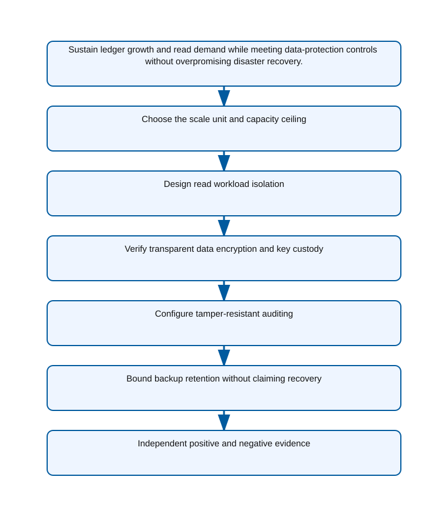

<!-- BEGIN GENERATED AZ305 V1 -->
# LAB-09 — Relational Scalability and Data Protection

## 1. Navigation

[← LAB-08](../08-relational-platform-tier-selection/README.md) · [Lab catalog](../README.md) · [LAB-10 →](../10-semi-structured-data-design/README.md)

## 2. Scenario and completion contract

Proseware operates a rapidly growing software-as-a-service ledger whose largest tenant is outgrowing a conventional Azure SQL Database service objective. Reads dominate during business hours, write volume climbs predictably, and auditors require encryption, database auditing, and bounded backup retention. The continuity program will define failover and recovery objectives later in Lab 16, so this architecture must focus on scale mechanics and protection controls rather than claim an untested recovery outcome. As the relational scalability architect, compare Hyperscale, elastic pools, and Managed Instance Business Critical, then validate capacity, read scale, transparent data encryption, auditing, and retention using Azure PowerShell.

- Architect role: Relational scalability and protection architect
- Outcome: A scalable Azure SQL design with auditable encryption and retention controls, clearly separated from continuity promises.
- Duration: 165 minutes
- Difficulty: advanced
- Cost class: elevated
- Completion: all five checkpoint assertions, final validation, decision revision, and cleanup review are complete.

## 3. Objective-to-evidence map

| Objective | Requirement | Checkpoint |
| --- | --- | --- |
| `DATA-REL-03` | `LAB09-REQ-01` | [`LAB09-CP01`](#checkpoint-1) |
| `DATA-REL-04` | `LAB09-REQ-02` | [`LAB09-CP02`](#checkpoint-2) |
| `DATA-REL-03` | `LAB09-REQ-03` | [`LAB09-CP03`](#checkpoint-3) |
| `DATA-REL-04` | `LAB09-REQ-04` | [`LAB09-CP04`](#checkpoint-4) |
| `DATA-REL-03` | `LAB09-REQ-05` | [`LAB09-CP05`](#checkpoint-5) |

## 4. Business and quality requirements

Business outcome: Sustain ledger growth and read demand while meeting data-protection controls without overpromising disaster recovery.

- `LAB09-REQ-01` — The database uses Hyperscale with an approved initial vCore count and documented vertical and horizontal scale triggers.
- `LAB09-REQ-02` — Read-intent routing and replica count isolate reporting demand within an approved capacity envelope.
- `LAB09-REQ-03` — TDE is enabled and the Microsoft-managed or customer-managed key decision names custody, rotation, and availability dependencies.
- `LAB09-REQ-04` — Database audit events route to the approved protected storage target for the mandated ninety days.
- `LAB09-REQ-05` — Short- and long-term retention satisfy legal and operational protection requirements with an identified cost owner.

Scenario facts:

- **Data:** An append-heavy relational ledger requires encrypted storage, immutable audit evidence, backups, and tenant-attributed query telemetry.
- **Scale:** Storage and read concurrency grow independently; one tenant creates bursty reads while contributing little write volume.
- **Latency:** Transaction writes need predictable primary latency and reporting reads have a separately measured replica-lag tolerance.
- **Availability:** Read replicas must not be presented as disaster recovery unless failover, data-loss, and connection behavior are validated.
- **RTO:** Regional recovery remains an owner-approved continuity requirement; the exercise does not assign an unsupported numerical RTO.
- **RPO:** Ledger protection requires an explicit recovery window and backup validation even when read replicas are healthy.
- **Budget:** Dedicated burst capacity is charged to the tenant only when telemetry can separate its replica and query consumption.

Constraints:

- Ledger growth and read demand must scale without weakening encryption, auditing, or recovery evidence.
- One low-write tenant has unpredictable read bursts and requires strict cost attribution.
- Use only the Azure PowerShell command lane for learner implementation.
- Keep all live changes behind explicit execution and acknowledgement switches.
- Retain only sanitized command evidence and synthetic fixture identifiers.

Assumptions:

- Tenant identity is available in query and telemetry dimensions without exposing ledger content.
- Read-only workloads can be routed separately from transactional writes and tolerate documented replica lag.
- West Europe is the configurable primary example and North Europe is the configurable secondary example.
- The learner has administrator-level Azure operations knowledge but receives no pre-existing authenticated context.
- Offline fixtures demonstrate contract behavior rather than live Azure service behavior.

## 5. Architecture diagram and walkthrough



The flow begins with the business outcome, crosses five independently validated design capabilities, and ends with positive and negative evidence. The SVG is deterministically rendered from `diagrams/architecture.mmd`.

## 6. Concept primer and candidate architectures

Architecture decisions translate measurable requirements into a deliberate service and operating model. A candidate is viable only when every mandatory constraint is met; convenience or familiarity cannot compensate for a disqualifier.

- **Azure SQL Database Hyperscale with named read-scale replicas** (eligible) — Hyperscale decouples storage growth from named read replicas and supports intentional routing of tenant reporting load.
- **Azure SQL Database elastic pool partitioned by tenant** (eligible) — Tenant databases in an elastic pool improve chargeback and isolation but add partition routing and cross-tenant reporting work.
- **Azure SQL Managed Instance Business Critical** (eligible) — Business Critical offers strong local availability and readable secondaries, but its fixed instance footprint is costly for variable reads.
- **One vertically scaled database with no read routing or tenant telemetry** (ineligible) — Vertical scaling is simple but couples writes, all tenant reads, and cost into one opaque capacity ceiling. Disqualifier: LAB09-REQ-02 requires independent read workload isolation inside an approved and attributable capacity envelope.

## 7. Decision, ADR, and Well-Architected review

Criteria weights are C1 30, C2 25, C3 20, C4 15, and C5 10. Weighted totals use `sum(weight × score) / 5`.

| Candidate | Eligible | C1 | C2 | C3 | C4 | C5 | Weighted /100 |
| --- | ---: | ---: | ---: | ---: | ---: | ---: | ---: |
| Azure SQL Database Hyperscale with named read-scale replicas | yes | 5 | 5 | 4 | 4 | 3 | 89 |
| Azure SQL Database elastic pool partitioned by tenant | yes | 4 | 3 | 4 | 3 | 4 | 72 |
| Azure SQL Managed Instance Business Critical | yes | 3 | 5 | 4 | 3 | 2 | 72 |
| One vertically scaled database with no read routing or tenant telemetry | no | 1 | 3 | 2 | 3 | 2 | 42 |

Selected design: **Azure SQL Database Hyperscale with named read-scale replicas**. `ADR-LAB09-001` records the accepted reasoning. Review Reliability, Security, Cost Optimization, Operational Excellence, and Performance Efficiency in `design/decision.yml`; no pillar is implied by another.

Rejected alternatives:

- **Azure SQL Database elastic pool partitioned by tenant:** Pool partitioning does not match the shared ledger model as cleanly and increases operational fragmentation.
- **Azure SQL Managed Instance Business Critical:** The design pays for broad instance capability that the ledger does not require and weakens tenant-specific attribution.
- **One vertically scaled database with no read routing or tenant telemetry:** It is ineligible because it cannot isolate the burst or prove tenant cost attribution.

Architecture risks:

- **Risk:** A named replica can lag and return stale ledger projections during a burst. **Mitigation:** Route only approved read workloads, measure replica delay, and fall back to the primary when freshness exceeds the contract.
- **Risk:** Tenant labels in telemetry may be inconsistent and produce disputed chargeback. **Mitigation:** Validate the tenant dimension at ingress and reconcile replica/query usage against the authoritative tenant registry.

Well-Architected consequences:

- **Reliability:** Primary writes, read routing, backup recovery, and regional continuity are validated as distinct mechanisms.
- **Security:** Encryption, auditing, and tenant-aware access remain mandatory across primary and replica endpoints.
- **Cost Optimization:** Named burst capacity and query telemetry make the exceptional tenant's demand attributable.
- **Operational Excellence:** Replica lag, routing, protection, and audit evidence share one tenant-labeled operating view.
- **Performance Efficiency:** Read replicas absorb unpredictable reporting load without scaling the transactional primary for every burst.

ADR consequences:

- Applications must classify read paths by freshness and support intentional replica routing.
- Finance needs durable tenant dimensions in performance and cost evidence before chargeback is enforceable.

## 8. Inputs, permissions, licensing, cost, and analogue

Use configurable `Location` (`AZ305_LOCATION`, default West Europe) and `SecondaryLocation` (`AZ305_SECONDARY_LOCATION`, default North Europe). Every public input has an explicit `AZ305_*` fallback. Preview is the default; only Golden Lab 00 writes an intent-only `execute: false` preview record. Before an executed cloud command, the supplied subscription and tenant must exactly match the active CLI, Az, and—where applicable—Microsoft Graph contexts. `-Execute` crosses the execution boundary; cost-bearing and tenant-scoped paths also require their independent acknowledgement switches.

Safe analogue: The reference topology is deployable at bounded scope; preview remains the default and live verification is separate.

Permissions: SQL resource read access and database metadata visibility support assessment; replica, audit, key, or scaling changes require separate authorized roles.

Licensing: Hyperscale replicas, elastic pools, Managed Instance Business Critical replicas, audit storage, and customer-managed keys have different billing implications.

Cost boundary: Attribute primary compute, named replica capacity, storage growth, backup retention, auditing, and tenant-specific burst consumption.

## 9. Read-only preflight

```powershell
pwsh ./scripts/azure-powershell/Preflight.ps1 -RunId synthetic-090001
```

Synthetic sample: `{"labId":"LAB-09","track":"azure-powershell","result":"pass","note":"Local tool discovery only"}`. This is illustrative local output, not evidence captured from Azure.

## 10. Five guided checkpoints

### Checkpoint 1: Choose the scale unit and capacity ceiling

<a id="checkpoint-1"></a>

**Trace:** `DATA-REL-03` → `LAB09-REQ-01` → `LAB09-CP01`

```powershell
Get-AzSqlDatabase -ResourceGroupName $ResourceGroup -ServerName $SqlServerName -DatabaseName $DatabaseName | Select-Object ResourceId,Edition,Capacity,ComputeGeneration
```

Expected evidence: The database uses Hyperscale with an approved initial vCore count and documented vertical and horizontal scale triggers. Retain Edition, compute generation, vCores, storage limit, scale trigger, and approval owner.

Positive assertion:

```powershell
Get-AzSqlDatabase -ResourceGroupName $ResourceGroup -ServerName $SqlServerName -DatabaseName $DatabaseName | Select-Object DatabaseName,Edition,CurrentServiceObjectiveName,Capacity,MaxSizeBytes
```

Negative assertion:

```powershell
Get-AzSqlDatabase -ResourceGroupName $ResourceGroup -ServerName $SqlServerName -DatabaseName $DatabaseName | Where-Object { $_.Edition -ne 'Hyperscale' -or $_.Capacity -gt $ApprovedVCoreCeiling }
```

Failure and retry: Migration blockers or regional hardware availability prevent the chosen compute generation. Validate compatibility and regional capacity, then select another supported Hyperscale hardware family.

Cleanup dependency: Return a resized run-owned database to its recorded original objective before deletion or handoff.

WAF consequence: Cost Optimization: an approved initial size and vCore ceiling constrain Hyperscale spend.

### Checkpoint 2: Design read workload isolation

<a id="checkpoint-2"></a>

**Trace:** `DATA-REL-04` → `LAB09-REQ-02` → `LAB09-CP02`

```powershell
Get-AzSqlDatabase -ResourceGroupName $ResourceGroup -ServerName $SqlServerName -DatabaseName $DatabaseName | Select-Object ReadScale,HighAvailabilityReplicaCount
```

Expected evidence: Read-intent routing and replica count isolate reporting demand within an approved capacity envelope. Retain ReadScale state, replica count, read-intent connection design, workload split, and capacity owner.

Positive assertion:

```powershell
Get-AzSqlDatabase -ResourceGroupName $ResourceGroup -ServerName $SqlServerName -DatabaseName $DatabaseName | Where-Object { $_.ReadScale -eq 'Enabled' }
```

Negative assertion:

```powershell
Get-AzSqlDatabase -ResourceGroupName $ResourceGroup -ServerName $SqlServerName -DatabaseName $DatabaseName | Where-Object { $_.HighAvailabilityReplicaCount -gt $ApprovedReplicaCount }
```

Failure and retry: The application connection string does not request read intent or requires read-after-write consistency. Classify query consistency needs and route only tolerant read workloads to replicas.

Cleanup dependency: Restore recorded read-scale and replica settings before disposing of the run-owned database.

WAF consequence: Performance Efficiency: read-intent routing isolates suitable queries and protects primary write capacity.

### Checkpoint 3: Verify transparent data encryption and key custody

<a id="checkpoint-3"></a>

**Trace:** `DATA-REL-03` → `LAB09-REQ-03` → `LAB09-CP03`

```powershell
Get-AzSqlDatabaseTransparentDataEncryption -ResourceGroupName $ResourceGroup -ServerName $SqlServerName -DatabaseName $DatabaseName
```

Expected evidence: TDE is enabled and the Microsoft-managed or customer-managed key decision names custody, rotation, and availability dependencies. Retain Encryption state, protector class, non-secret key URI, rotation owner, and dependency rationale.

Positive assertion:

```powershell
Get-AzSqlDatabaseTransparentDataEncryption -ResourceGroupName $ResourceGroup -ServerName $SqlServerName -DatabaseName $DatabaseName | Where-Object { $_.State -eq 'Enabled' }
```

Negative assertion:

```powershell
Get-AzSqlServerKeyVaultKey -ResourceGroupName $ResourceGroup -ServerName $SqlServerName | Where-Object { $_.Type -eq 'AzureKeyVault' -and $_.Uri -eq $null }
```

Failure and retry: The server identity cannot unwrap a customer-managed key or the vault path is unavailable. Validate managed identity, Key Vault RBAC, key state, and network access independently.

Cleanup dependency: Restore the original protector before removing a run-owned key association; never purge keys.

WAF consequence: Reliability: key identity, vault reachability, and rotation ownership make the external encryption dependency operable.

### Checkpoint 4: Configure tamper-resistant auditing

<a id="checkpoint-4"></a>

**Trace:** `DATA-REL-04` → `LAB09-REQ-04` → `LAB09-CP04`

```powershell
Get-AzSqlDatabaseAudit -ResourceGroupName $ResourceGroup -ServerName $SqlServerName -DatabaseName $DatabaseName | Select-Object BlobStorageTargetState,StorageAccountResourceId,RetentionInDays
```

Expected evidence: Database audit events route to the approved protected storage target for the mandated ninety days. Retain Audit state, sanitized storage resource ID, retention days, event categories, and control owner.

Positive assertion:

```powershell
Get-AzSqlDatabaseAudit -ResourceGroupName $ResourceGroup -ServerName $SqlServerName -DatabaseName $DatabaseName | Select-Object BlobStorageTargetState,StorageAccountResourceId,RetentionInDays
```

Negative assertion:

```powershell
Get-AzSqlDatabaseAudit -ResourceGroupName $ResourceGroup -ServerName $SqlServerName -DatabaseName $DatabaseName | Where-Object { $_.BlobStorageTargetState -ne 'Enabled' -or $_.RetentionInDays -lt 90 }
```

Failure and retry: Storage authorization, firewall rules, or destination immutability prevents audit delivery. Validate identity, network, and storage protection separately before changing the audit control.

Cleanup dependency: Restore recorded audit settings before removing a run-owned destination; retain required evidence lawfully.

WAF consequence: Security: protected auditing creates accountable evidence of material database activity.

### Checkpoint 5: Bound backup retention without claiming recovery

<a id="checkpoint-5"></a>

**Trace:** `DATA-REL-03` → `LAB09-REQ-05` → `LAB09-CP05`

```powershell
Get-AzSqlDatabaseBackupShortTermRetentionPolicy -ResourceGroupName $ResourceGroup -ServerName $SqlServerName -DatabaseName $DatabaseName
```

Expected evidence: Short- and long-term retention satisfy legal and operational protection requirements with an identified cost owner. Retain Retention values, backup storage redundancy choice, legal rationale, cost owner, and Lab 16 dependency.

Positive assertion:

```powershell
Get-AzSqlDatabaseBackupLongTermRetentionPolicy -ResourceGroupName $ResourceGroup -ServerName $SqlServerName -DatabaseName $DatabaseName
```

Negative assertion:

```powershell
Get-AzSqlDatabaseBackupShortTermRetentionPolicy -ResourceGroupName $ResourceGroup -ServerName $SqlServerName -DatabaseName $DatabaseName | Where-Object { $_.RetentionDays -gt $ApprovedShortTermRetentionDays }
```

Failure and retry: Legal-hold needs conflict with the database-native retention limit or cost envelope. Evaluate immutable archive evidence and revise the protection design without inventing a recovery claim.

Cleanup dependency: Never purge service-managed backups; remove only run-owned configuration through supported retention behavior.

WAF consequence: Operational Excellence: explicit retention evidence separates configured protection from recovery claims owned by Lab 16.

## 11. Final validation and interpretation

Run `Validate.ps1 -Mode Deployment -Execute` only after an executed run has state and you are authorized to issue the ten read-only checkpoint inspections. Without `-Execute`, ordinary deployment validation records `partial` and exits `2`; Golden Lab 00 alone can validate its intent-only preview locally. Exit `0` means all required assertions pass, `1` means at least one failed, and `2` means the outcome is gated or partial. Positive and negative commands execute independently, so one failure never suppresses its paired assertion.

## 12. Material change request

A new tenant produces unpredictable read bursts but contributes little write load and requires strict cost attribution; revise replica and tenancy decisions without weakening encryption or audit controls.

Revised solution: select **Azure SQL Database Hyperscale with named read-scale replicas**. LAB09-REQ-02 makes read-workload isolation mandatory, so Hyperscale is retained with a named replica and routing policy dedicated to the bursty tenant's attributable reads.

Revised Well-Architected consequences:

- **Reliability:** Freshness checks keep stale replica results from silently entering ledger workflows.
- **Security:** The tenant replica preserves encryption, audit, and authorization controls from the primary design.
- **Cost Optimization:** Dedicated replica hours and queries can be assigned to the tenant that creates them.
- **Operational Excellence:** Tenant-tagged lag and routing telemetry expose when fallback to the primary occurs.
- **Performance Efficiency:** Bursty reads scale independently while write capacity remains sized for actual ledger traffic.

## 13. Architect job challenge

Compare a named Hyperscale replica with tenant extraction into an elastic pool, including consistency, routing, isolation, and cost evidence.

## 14. Troubleshooting, cleanup, and residual verification

- Verify application read-intent routing before adding replicas to solve a read bottleneck.
- Diagnose TDE state, server identity, vault RBAC, and key reachability as separate layers.
- Treat configured backup retention as protection evidence, not proof that recovery objectives were achieved.

Cleanup previews nonempty state in reverse dependency order, writes `partial`, and exits `2`; an already empty run is completed locally and idempotently. Executed cleanup rechecks the exact live ID plus `purpose`, `labId`, `runId`, and `expiresOn` immediately before each removal, persists state after every absent or removed object, stops on the first dependency failure, and refuses unresolved pre-existing settings. It never automates purge. Finish with `Validate.ps1 -Mode PostCleanup`; the required residual count is zero.

## 15. Exam debrief, assessment, sources, and navigation

Explain the recommendation in terms of requirements, rejected alternatives, failure behavior, and all five WAF pillars. Complete `assessment/QUESTIONS.md`, then use the separately excluded answer key for remediation.

- [Hyperscale service tier](https://learn.microsoft.com/en-us/azure/azure-sql/database/service-tier-hyperscale)
- [Azure Well-Architected Framework](https://learn.microsoft.com/en-us/azure/well-architected/)

[← LAB-08](../08-relational-platform-tier-selection/README.md) · [Lab catalog](../README.md) · [LAB-10 →](../10-semi-structured-data-design/README.md)

## 16. Synchronized lifecycle-script appendix

### Preflight.ps1

```powershell
[CmdletBinding()]
param(
    [string]$SubscriptionId = $env:AZ305_SUBSCRIPTION_ID,
    [string]$TenantId = $env:AZ305_TENANT_ID,
    [ValidatePattern('^[a-z0-9-]{6,64}$')][string]$RunId = $env:AZ305_RUN_ID,
    [string]$Location = $(if ($env:AZ305_LOCATION) { $env:AZ305_LOCATION } else { 'westeurope' }),
    [string]$SecondaryLocation = $(if ($env:AZ305_SECONDARY_LOCATION) { $env:AZ305_SECONDARY_LOCATION } else { 'northeurope' }),
    [string]$ResourceGroup = $(if ($env:AZ305_RESOURCE_GROUP) { $env:AZ305_RESOURCE_GROUP } else { "rg-az305-$RunId" }),
    [string]$WorkloadName = $(if ($env:AZ305_WORKLOAD_NAME) { $env:AZ305_WORKLOAD_NAME } else { "az305-$RunId" }),
    [string]$ExpiresOn = $(if ($env:AZ305_EXPIRES_ON) { $env:AZ305_EXPIRES_ON } else { (Get-Date).ToUniversalTime().AddDays(1).ToString('yyyy-MM-dd') }),
    [int]$ApprovedReplicaCount = $(if ($env:AZ305_APPROVED_REPLICA_COUNT) { [int]$env:AZ305_APPROVED_REPLICA_COUNT } else { 0 }),
    [int]$ApprovedShortTermRetentionDays = $(if ($env:AZ305_APPROVED_SHORT_TERM_RETENTION_DAYS) { [int]$env:AZ305_APPROVED_SHORT_TERM_RETENTION_DAYS } else { 0 }),
    [int]$ApprovedVCoreCeiling = $(if ($env:AZ305_APPROVED_V_CORE_CEILING) { [int]$env:AZ305_APPROVED_V_CORE_CEILING } else { 0 }),
    [string]$DatabaseName = $env:AZ305_DATABASE_NAME,
    [string]$SqlServerName = $env:AZ305_SQL_SERVER_NAME,
    [switch]$Execute,
    [switch]$AcknowledgeCost,
    [switch]$AcknowledgeTenantChange
)

$ErrorActionPreference = 'Stop'
$PSNativeCommandUseErrorActionPreference = $true
if (-not $RunId) { [Console]::Error.WriteLine('RunId or AZ305_RUN_ID is required.'); exit 2 }
# Every lifecycle entrypoint intentionally exposes the same public parameter contract.
@($SubscriptionId, $TenantId, $RunId, $Location, $SecondaryLocation, $ResourceGroup, $WorkloadName, $ExpiresOn, $ApprovedReplicaCount, $ApprovedShortTermRetentionDays, $ApprovedVCoreCeiling, $DatabaseName, $SqlServerName, $Execute, $AcknowledgeCost, $AcknowledgeTenantChange) | Out-Null

$requiredCommands = @('pwsh')
$missing = @($requiredCommands | Where-Object { -not (Get-Command $_ -ErrorAction SilentlyContinue) })
if ($missing.Count -gt 0) {
    Write-Error "Missing local commands: $($missing -join ', ')"
    exit 1
}
$requiredCmdlets = @('Get-AzSqlDatabase', 'Get-AzSqlDatabaseAudit', 'Get-AzSqlDatabaseBackupLongTermRetentionPolicy', 'Get-AzSqlDatabaseBackupShortTermRetentionPolicy', 'Get-AzSqlDatabaseTransparentDataEncryption', 'Get-AzSqlServerKeyVaultKey')
$missingCmdlets = @($requiredCmdlets | Where-Object { -not (Get-Command $_ -ErrorAction SilentlyContinue) })
if ($missingCmdlets.Count -gt 0) {
    Write-Error "Missing local cmdlets: $($missingCmdlets -join ', ')"
    exit 1
}

[pscustomobject]@{
    labId = 'LAB-09'
    track = 'azure-powershell'
    implementationMode = 'reference-deployable'
    result = 'pass'
    note = 'Local tool discovery only; no Azure or Microsoft Graph request was made.'
} | ConvertTo-Json
exit 0
```

### Setup.ps1

```powershell
[CmdletBinding()]
param(
    [string]$SubscriptionId = $env:AZ305_SUBSCRIPTION_ID,
    [string]$TenantId = $env:AZ305_TENANT_ID,
    [ValidatePattern('^[a-z0-9-]{6,64}$')][string]$RunId = $env:AZ305_RUN_ID,
    [string]$Location = $(if ($env:AZ305_LOCATION) { $env:AZ305_LOCATION } else { 'westeurope' }),
    [string]$SecondaryLocation = $(if ($env:AZ305_SECONDARY_LOCATION) { $env:AZ305_SECONDARY_LOCATION } else { 'northeurope' }),
    [string]$ResourceGroup = $(if ($env:AZ305_RESOURCE_GROUP) { $env:AZ305_RESOURCE_GROUP } else { "rg-az305-$RunId" }),
    [string]$WorkloadName = $(if ($env:AZ305_WORKLOAD_NAME) { $env:AZ305_WORKLOAD_NAME } else { "az305-$RunId" }),
    [string]$ExpiresOn = $(if ($env:AZ305_EXPIRES_ON) { $env:AZ305_EXPIRES_ON } else { (Get-Date).ToUniversalTime().AddDays(1).ToString('yyyy-MM-dd') }),
    [int]$ApprovedReplicaCount = $(if ($env:AZ305_APPROVED_REPLICA_COUNT) { [int]$env:AZ305_APPROVED_REPLICA_COUNT } else { 0 }),
    [int]$ApprovedShortTermRetentionDays = $(if ($env:AZ305_APPROVED_SHORT_TERM_RETENTION_DAYS) { [int]$env:AZ305_APPROVED_SHORT_TERM_RETENTION_DAYS } else { 0 }),
    [int]$ApprovedVCoreCeiling = $(if ($env:AZ305_APPROVED_V_CORE_CEILING) { [int]$env:AZ305_APPROVED_V_CORE_CEILING } else { 0 }),
    [string]$DatabaseName = $env:AZ305_DATABASE_NAME,
    [string]$SqlServerName = $env:AZ305_SQL_SERVER_NAME,
    [switch]$Execute,
    [switch]$AcknowledgeCost,
    [switch]$AcknowledgeTenantChange
)

$ErrorActionPreference = 'Stop'
$PSNativeCommandUseErrorActionPreference = $true
if (-not $RunId) { [Console]::Error.WriteLine('RunId or AZ305_RUN_ID is required.'); exit 2 }
# Every lifecycle entrypoint intentionally exposes the same public parameter contract.
@($SubscriptionId, $TenantId, $RunId, $Location, $SecondaryLocation, $ResourceGroup, $WorkloadName, $ExpiresOn, $ApprovedReplicaCount, $ApprovedShortTermRetentionDays, $ApprovedVCoreCeiling, $DatabaseName, $SqlServerName, $Execute, $AcknowledgeCost, $AcknowledgeTenantChange) | Out-Null

$LabRoot = Split-Path (Split-Path $PSScriptRoot -Parent) -Parent
$StateRoot = Join-Path $LabRoot ".state/$RunId"
$StatePath = Join-Path $StateRoot 'run.json'

function Assert-ExactExecutionContext {
    [CmdletBinding()]
    param([string]$ExpectedSubscriptionId, [string]$ExpectedTenantId)
    if ([string]::IsNullOrWhiteSpace($ExpectedSubscriptionId) -or [string]::IsNullOrWhiteSpace($ExpectedTenantId)) { throw 'SubscriptionId and TenantId are required before an Azure request.' }
    $azContext = Get-AzContext -ErrorAction Stop
    if (-not $azContext -or [string]$azContext.Subscription.Id -ine $ExpectedSubscriptionId -or [string]$azContext.Tenant.Id -ine $ExpectedTenantId) {
        throw 'The active Azure PowerShell subscription or tenant does not exactly match the requested context.'
    }
}

function Save-RunState {
    [CmdletBinding()]
    param([Parameter(Mandatory)]$State)
    $temporaryPath = "$StatePath.tmp"
    $State | ConvertTo-Json -Depth 20 | Set-Content -LiteralPath $temporaryPath -Encoding utf8NoBOM
    Move-Item -LiteralPath $temporaryPath -Destination $StatePath -Force
}

function Assert-SafeStateValue {
    [CmdletBinding()]
    param($Value)
    $serialized = $Value | ConvertTo-Json -Depth 12 -Compress
    if ($serialized -match '(?i)"(?:token|password|secret|certificate|connectionString|sas|clientSecret|accessToken|refreshToken|accountKey|privateKey)"\s*:') {
        throw 'A prohibited sensitive field name was returned; state capture is refused.'
    }
}

function Convert-CheckpointOutput {
    [CmdletBinding()]
    param($Value)
    if ($Value -is [string]) { $raw = [string]$Value }
    elseif ($Value -is [System.Collections.IEnumerable] -and @($Value | Where-Object { $_ -isnot [string] }).Count -eq 0) { $raw = @($Value) -join "`n" }
    else { return $Value }
    if ([string]::IsNullOrWhiteSpace($raw)) { return $null }
    try { return ($raw | ConvertFrom-Json -Depth 100) } catch { return $Value }
}

function Get-ReturnedResourceId {
    [CmdletBinding()]
    param($Value)
    $seen = [System.Collections.Generic.HashSet[string]]::new([System.StringComparer]::OrdinalIgnoreCase)
    $results = [System.Collections.Generic.List[string]]::new()
    function Add-ArmId {
        param($Candidate)
        if ($Candidate -is [string] -and $Candidate -match '^/subscriptions/[0-9a-f-]+/(?:resourceGroups/[^/]+(?:/providers/.+)?|providers/.+)$' -and $Candidate -notmatch '/providers/Microsoft\.Resources/deployments/') {
            if ($seen.Add($Candidate)) { $results.Add($Candidate) }
        }
    }
    function Find-DeploymentOutputId {
        param($Item, [int]$Depth)
        if ($null -eq $Item -or $Depth -gt 12) { return }
        if ($Item -is [string]) { Add-ArmId -Candidate $Item; return }
        if ($Item -is [System.Collections.IDictionary]) { foreach ($key in $Item.Keys) { Find-DeploymentOutputId -Item $Item[$key] -Depth ($Depth + 1) }; return }
        if ($Item -is [System.Collections.IEnumerable]) { foreach ($entry in $Item) { Find-DeploymentOutputId -Item $entry -Depth ($Depth + 1) }; return }
        foreach ($property in @($Item.PSObject.Properties | Where-Object { $_.MemberType -in @('NoteProperty', 'Property') })) { Find-DeploymentOutputId -Item $property.Value -Depth ($Depth + 1) }
    }
    foreach ($rootItem in @($Value)) {
        if ($rootItem -is [System.Collections.IDictionary]) {
            foreach ($name in @('id', 'resourceId')) { if ($rootItem.Contains($name)) { Add-ArmId -Candidate $rootItem[$name] } }
            if ($rootItem.Contains('properties') -and $rootItem.properties -and $rootItem.properties.outputs) { Find-DeploymentOutputId -Item $rootItem.properties.outputs -Depth 0 }
            continue
        }
        foreach ($name in @('Id', 'ResourceId')) {
            $property = $rootItem.PSObject.Properties[$name]
            if ($property) { Add-ArmId -Candidate $property.Value }
        }
        if ($rootItem.PSObject.Properties['Properties'] -and $rootItem.Properties -and $rootItem.Properties.outputs) {
            Find-DeploymentOutputId -Item $rootItem.Properties.outputs -Depth 0
        }
    }
    return @($results)
}

function Get-PlannedDeploymentResourceId {
    [CmdletBinding()]
    param($Value)
    $seen = [System.Collections.Generic.HashSet[string]]::new([System.StringComparer]::OrdinalIgnoreCase)
    $results = [System.Collections.Generic.List[string]]::new()
    foreach ($change in @($Value.changes)) {
        $candidate = [string]$change.resourceId
        if ($candidate -match '^/subscriptions/[0-9a-f-]+/(?:resourceGroups/[^/]+(?:/providers/.+)?|providers/.+)$' -and $candidate -notmatch '/providers/Microsoft\.Resources/deployments/' -and $seen.Add($candidate)) {
            $results.Add($candidate)
        }
    }
    return @($results)
}

function Assert-InputSubscriptionScope {
    [CmdletBinding()]
    param($Inputs, [string]$ExpectedSubscriptionId)
    $entries = if ($Inputs -is [System.Collections.IDictionary]) {
        @($Inputs.GetEnumerator())
    } else {
        @($Inputs.PSObject.Properties | ForEach-Object { [pscustomobject]@{ Key = $_.Name; Value = $_.Value } })
    }
    foreach ($entry in $entries) {
        if ($entry.Value -is [string] -and [string]$entry.Value -match '^/subscriptions/([^/]+)/') {
            if ($Matches[1] -ine $ExpectedSubscriptionId) { throw "Input $($entry.Key) belongs to a different subscription." }
        }
    }
}

function Assert-ManagedMutation {
    [CmdletBinding()]
    param($State, [string]$CheckpointId, [bool]$CarriesOwnership, [object[]]$TargetResourceIds)
    if ($CarriesOwnership) { return }
    $targets = @($TargetResourceIds | Where-Object { $_ -is [string] -and $_ -match '^/subscriptions/' })
    if ($targets.Count -eq 0) { throw "$CheckpointId refuses an untagged mutation because no exact ARM target ID was supplied." }
    $knownIds = @($State.managedObjects | ForEach-Object { [string]$_.id })
    if ($knownIds.Count -eq 0) { throw "$CheckpointId refuses to modify a pre-existing object because no run-owned parent has been recorded." }
    foreach ($target in $targets) {
        $related = @($knownIds | Where-Object { $target -ieq $_ -or $target.StartsWith("$_/", [System.StringComparison]::OrdinalIgnoreCase) -or $_.StartsWith("$target/", [System.StringComparison]::OrdinalIgnoreCase) }).Count -gt 0
        if (-not $related) { throw "$CheckpointId refuses a mutation outside the exact run-owned resource boundary." }
    }
}

$executionInputs = [ordered]@{ subscriptionId = $SubscriptionId; tenantId = $TenantId; location = $Location; secondaryLocation = $SecondaryLocation; resourceGroup = $ResourceGroup; workloadName = $WorkloadName; expiresOn = $ExpiresOn; ApprovedReplicaCount = $ApprovedReplicaCount; ApprovedShortTermRetentionDays = $ApprovedShortTermRetentionDays; ApprovedVCoreCeiling = $ApprovedVCoreCeiling; DatabaseName = $DatabaseName; SqlServerName = $SqlServerName }

if (-not $Execute) {
    Write-Output '[preview] No cloud command was called and no state was created.'
    Write-Output '[preview] Re-run with -Execute only in an authorized disposable environment.'
    exit 0
}
# This setup is compatible with the lab implementation mode.
if (-not $AcknowledgeCost) { [Console]::Error.WriteLine('Cost acknowledgement is required.'); exit 2 }
# This lab does not perform a tenant-scoped change by default.
$requiredLabInputs = [ordered]@{ DatabaseName = $DatabaseName; SqlServerName = $SqlServerName }
$missingLabInputs = @($requiredLabInputs.GetEnumerator() | Where-Object { $_.Value -is [string] -and [string]::IsNullOrWhiteSpace([string]$_.Value) } | ForEach-Object Key)
if ($missingLabInputs.Count -gt 0) { [Console]::Error.WriteLine("Execution is gated; supply: $($missingLabInputs -join ', ')."); exit 2 }

try {
    Assert-ExactExecutionContext -ExpectedSubscriptionId $SubscriptionId -ExpectedTenantId $TenantId
    Assert-InputSubscriptionScope -Inputs $executionInputs -ExpectedSubscriptionId $SubscriptionId
    Assert-SafeStateValue -Value $executionInputs
}
catch {
    [Console]::Error.WriteLine("Execution is gated by context or input validation: $($_.Exception.Message)")
    exit 2
}

# Recovery state is persisted before the first possible mutation below.
if (Test-Path -LiteralPath $StatePath) {
    [Console]::Error.WriteLine('Run state already exists. Choose a new RunId or complete the recorded cleanup; existing recovery state will not be overwritten.')
    exit 2
}
New-Item -ItemType Directory -Path $StateRoot -Force | Out-Null
$state = [ordered]@{
    schemaVersion = '1.0.0'; labId = 'LAB-09'; runId = $RunId; track = 'azure-powershell'
    implementationMode = 'reference-deployable'; status = 'initialized'
    createdAt = (Get-Date).ToUniversalTime().ToString('o'); execute = $true
    parameters = $executionInputs
    managedObjects = @(); originalSettings = @()
}
Save-RunState -State $state
$state.status = 'deploying'
Save-RunState -State $state

$originalLocation = Get-Location
try {
    Set-Location -LiteralPath $LabRoot
    # 09-CP01: Choose the scale unit and capacity ceiling
    $stepResult = & { Get-AzSqlDatabase -ResourceGroupName $ResourceGroup -ServerName $SqlServerName -DatabaseName $DatabaseName | Select-Object ResourceId,Edition,Capacity,ComputeGeneration }
    $null = $stepResult

    # 09-CP02: Design read workload isolation
    $stepResult = & { Get-AzSqlDatabase -ResourceGroupName $ResourceGroup -ServerName $SqlServerName -DatabaseName $DatabaseName | Select-Object ReadScale,HighAvailabilityReplicaCount }
    $null = $stepResult

    # 09-CP03: Verify transparent data encryption and key custody
    $stepResult = & { Get-AzSqlDatabaseTransparentDataEncryption -ResourceGroupName $ResourceGroup -ServerName $SqlServerName -DatabaseName $DatabaseName }
    $null = $stepResult

    # 09-CP04: Configure tamper-resistant auditing
    $stepResult = & { Get-AzSqlDatabaseAudit -ResourceGroupName $ResourceGroup -ServerName $SqlServerName -DatabaseName $DatabaseName | Select-Object BlobStorageTargetState,StorageAccountResourceId,RetentionInDays }
    $null = $stepResult

    # 09-CP05: Bound backup retention without claiming recovery
    $stepResult = & { Get-AzSqlDatabaseBackupShortTermRetentionPolicy -ResourceGroupName $ResourceGroup -ServerName $SqlServerName -DatabaseName $DatabaseName }
    $null = $stepResult

    $state.status = 'deployed'
    Save-RunState -State $state
} catch {
    $state.status = 'failed'
    Save-RunState -State $state
    Write-Error $_
    exit 1
} finally {
    Set-Location -LiteralPath $originalLocation
}
exit 0
```

### Validate.ps1

```powershell
[CmdletBinding()]
param(
    [string]$SubscriptionId = $env:AZ305_SUBSCRIPTION_ID,
    [string]$TenantId = $env:AZ305_TENANT_ID,
    [ValidatePattern('^[a-z0-9-]{6,64}$')][string]$RunId = $env:AZ305_RUN_ID,
    [string]$Location = $(if ($env:AZ305_LOCATION) { $env:AZ305_LOCATION } else { 'westeurope' }),
    [string]$SecondaryLocation = $(if ($env:AZ305_SECONDARY_LOCATION) { $env:AZ305_SECONDARY_LOCATION } else { 'northeurope' }),
    [string]$ResourceGroup = $(if ($env:AZ305_RESOURCE_GROUP) { $env:AZ305_RESOURCE_GROUP } else { "rg-az305-$RunId" }),
    [string]$WorkloadName = $(if ($env:AZ305_WORKLOAD_NAME) { $env:AZ305_WORKLOAD_NAME } else { "az305-$RunId" }),
    [string]$ExpiresOn = $(if ($env:AZ305_EXPIRES_ON) { $env:AZ305_EXPIRES_ON } else { (Get-Date).ToUniversalTime().AddDays(1).ToString('yyyy-MM-dd') }),
    [int]$ApprovedReplicaCount = $(if ($env:AZ305_APPROVED_REPLICA_COUNT) { [int]$env:AZ305_APPROVED_REPLICA_COUNT } else { 0 }),
    [int]$ApprovedShortTermRetentionDays = $(if ($env:AZ305_APPROVED_SHORT_TERM_RETENTION_DAYS) { [int]$env:AZ305_APPROVED_SHORT_TERM_RETENTION_DAYS } else { 0 }),
    [int]$ApprovedVCoreCeiling = $(if ($env:AZ305_APPROVED_V_CORE_CEILING) { [int]$env:AZ305_APPROVED_V_CORE_CEILING } else { 0 }),
    [string]$DatabaseName = $env:AZ305_DATABASE_NAME,
    [string]$SqlServerName = $env:AZ305_SQL_SERVER_NAME,
    [ValidateSet('Deployment', 'PostCleanup')][string]$Mode = 'Deployment',
    [switch]$Execute,
    [switch]$AcknowledgeCost,
    [switch]$AcknowledgeTenantChange
)

$ErrorActionPreference = 'Stop'
$PSNativeCommandUseErrorActionPreference = $true
if (-not $RunId) { [Console]::Error.WriteLine('RunId or AZ305_RUN_ID is required.'); exit 2 }
# Every lifecycle entrypoint intentionally exposes the same public parameter contract.
@($SubscriptionId, $TenantId, $RunId, $Location, $SecondaryLocation, $ResourceGroup, $WorkloadName, $ExpiresOn, $ApprovedReplicaCount, $ApprovedShortTermRetentionDays, $ApprovedVCoreCeiling, $DatabaseName, $SqlServerName, $Mode, $Execute, $AcknowledgeCost, $AcknowledgeTenantChange) | Out-Null

$LabRoot = Split-Path (Split-Path $PSScriptRoot -Parent) -Parent
$StateRoot = Join-Path $LabRoot ".state/$RunId"
$RunPath = Join-Path $StateRoot 'run.json'
$ValidationPath = Join-Path $StateRoot 'validation.json'

function Assert-ExactExecutionContext {
    [CmdletBinding()]
    param([string]$ExpectedSubscriptionId, [string]$ExpectedTenantId)
    if ([string]::IsNullOrWhiteSpace($ExpectedSubscriptionId) -or [string]::IsNullOrWhiteSpace($ExpectedTenantId)) { throw 'SubscriptionId and TenantId are required before an Azure request.' }
    $azContext = Get-AzContext -ErrorAction Stop
    if (-not $azContext -or [string]$azContext.Subscription.Id -ine $ExpectedSubscriptionId -or [string]$azContext.Tenant.Id -ine $ExpectedTenantId) {
        throw 'The active Azure PowerShell subscription or tenant does not exactly match the requested context.'
    }
}


if (-not (Test-Path -LiteralPath $RunPath)) {
    Write-Warning 'No run state exists; validation is gated.'
    exit 2
}
$state = Get-Content -LiteralPath $RunPath -Raw | ConvertFrom-Json
$assertions = [System.Collections.Generic.List[object]]::new()
function Add-ValidationAssertion {
    [CmdletBinding()]
    param([string]$Id, [ValidateSet('positive', 'negative')][string]$Kind, [bool]$Passed, [string]$Message)
    $assertions.Add([pscustomobject]@{ id = $Id; kind = $Kind; passed = $Passed; message = $Message })
}

function Save-ValidationArtifact {
    [CmdletBinding()]
    param([ValidateSet('pass', 'partial', 'fail')][string]$Result)
    $artifact = [ordered]@{ schemaVersion = '1.0.0'; labId = 'LAB-09'; runId = $RunId; mode = $Mode; result = $Result; validatedAt = (Get-Date).ToUniversalTime().ToString('o'); assertions = @($assertions) }
    $artifact | ConvertTo-Json -Depth 12 | Set-Content -LiteralPath $ValidationPath -Encoding utf8NoBOM
}

function Test-PositiveEvidence {
    [CmdletBinding()]
    param($Value)
    if ($Value -is [bool]) { return $Value }
    if ($null -eq $Value) { return $false }
    if ($Value -is [string]) { return -not [string]::IsNullOrWhiteSpace($Value) }
    if ($Value -is [System.Collections.IEnumerable]) { return @($Value).Count -gt 0 }
    return $true
}

function Test-NegativeEvidence {
    [CmdletBinding()]
    param($Value)
    if ($Value -is [bool]) { return $Value }
    if ($null -eq $Value) { return $true }
    if ($Value -is [string]) { return [string]::IsNullOrWhiteSpace($Value) }
    if ($Value -is [System.Collections.IEnumerable]) { return @($Value).Count -eq 0 }
    $properties = @($Value.PSObject.Properties | Where-Object { $_.MemberType -in @('NoteProperty', 'Property') })
    if ($properties.Count -eq 0) { return $false }
    return @($properties | Where-Object { -not (Test-NegativeEvidence -Value $_.Value) }).Count -eq 0
}

function Test-ProhibitedStateField {
    [CmdletBinding()]
    param($Value)
    $serialized = $Value | ConvertTo-Json -Depth 20
    return $serialized -match '(?i)"(?:token|password|secret|certificate|connectionString|sas|clientSecret|accessToken|refreshToken|accountKey|privateKey)"\s*:'
}

function Assert-InputSubscriptionScope {
    [CmdletBinding()]
    param($Inputs, [string]$ExpectedSubscriptionId)
    $entries = if ($Inputs -is [System.Collections.IDictionary]) {
        @($Inputs.GetEnumerator())
    } else {
        @($Inputs.PSObject.Properties | ForEach-Object { [pscustomobject]@{ Key = $_.Name; Value = $_.Value } })
    }
    foreach ($entry in $entries) {
        if ($entry.Value -is [string] -and [string]$entry.Value -match '^/subscriptions/([^/]+)/' -and $Matches[1] -ine $ExpectedSubscriptionId) {
            throw "Input $($entry.Key) belongs to a different subscription."
        }
    }
}

$stateIdentityMatches = (
    $state.labId -ceq 'LAB-09' -and
    $state.runId -ceq $RunId -and
    $state.track -ceq 'azure-powershell' -and
    $state.implementationMode -ceq 'reference-deployable' -and
    ([string]$state.parameters.subscriptionId -ieq $SubscriptionId -and [string]$state.parameters.tenantId -ieq $TenantId)
)
Add-ValidationAssertion -Id 'LAB09-VAL-POS-01' -Kind positive -Passed $stateIdentityMatches -Message 'Run identity, implementation mode, command track, tenant, and subscription exactly match the copied lab and requested run.'
$hasSensitiveName = Test-ProhibitedStateField -Value $state
Add-ValidationAssertion -Id 'LAB09-VAL-NEG-01' -Kind negative -Passed (-not $hasSensitiveName) -Message 'State contains no prohibited sensitive field name.'

if ($Mode -eq 'PostCleanup') {
    $cleanupPath = Join-Path $StateRoot 'cleanup.json'
    $cleanup = if (Test-Path -LiteralPath $cleanupPath) { Get-Content -LiteralPath $cleanupPath -Raw | ConvertFrom-Json } else { $null }
    Add-ValidationAssertion -Id 'LAB09-VAL-POS-02' -Kind positive -Passed ($null -ne $cleanup -and $cleanup.labId -ceq 'LAB-09' -and $cleanup.runId -ceq $RunId -and $cleanup.result -eq 'pass' -and $cleanup.ownershipVerified) -Message 'The exact run cleanup completed with verified ownership.'
    Add-ValidationAssertion -Id 'LAB09-VAL-NEG-02' -Kind negative -Passed ($null -ne $cleanup -and $cleanup.activeManagedObjects -eq 0 -and @($state.managedObjects).Count -eq 0 -and @($state.originalSettings).Count -eq 0 -and $state.status -eq 'cleaned') -Message 'No active managed object or unresolved original setting remains in cleanup or run state.'
    $postCleanupPassed = @($assertions | Where-Object { -not $_.passed }).Count -eq 0
    Save-ValidationArtifact -Result $(if ($postCleanupPassed) { 'pass' } else { 'fail' })
    if ($postCleanupPassed) { exit 0 }
    exit 1
}

Add-ValidationAssertion -Id 'LAB09-VAL-POS-02' -Kind positive -Passed ($state.status -eq 'deployed') -Message 'The executed setup completed successfully; a failed setup can never validate as pass.'
Add-ValidationAssertion -Id 'LAB09-VAL-NEG-02' -Kind negative -Passed (@($state.managedObjects | Where-Object { $_.tags.purpose -ne 'az305-lab' -or $_.tags.labId -ne 'LAB-09' -or $_.tags.runId -ne $RunId }).Count -eq 0) -Message 'No recorded object has a foreign ownership tag.'

if (@($assertions | Where-Object { -not $_.passed }).Count -gt 0) {
    Save-ValidationArtifact -Result 'fail'
    exit 1
}
if (-not $Execute) {
    # This lab has no special intent-only validation path.
    Save-ValidationArtifact -Result 'partial'
    Write-Warning 'Checkpoint validation is gated; re-run with -Execute after confirming the exact read-only context.'
    exit 2
}
# The validation surface is compatible with this lab implementation mode.
$requiredValidationInputs = [ordered]@{ ApprovedReplicaCount = $ApprovedReplicaCount; ApprovedShortTermRetentionDays = $ApprovedShortTermRetentionDays; ApprovedVCoreCeiling = $ApprovedVCoreCeiling; DatabaseName = $DatabaseName; SqlServerName = $SqlServerName }
$missingValidationInputs = @($requiredValidationInputs.GetEnumerator() | Where-Object { $_.Value -is [string] -and [string]::IsNullOrWhiteSpace([string]$_.Value) } | ForEach-Object Key)
if ($missingValidationInputs.Count -gt 0) {
    Add-ValidationAssertion -Id 'LAB09-VAL-POS-CONTEXT' -Kind positive -Passed $false -Message 'One or more required non-secret validation inputs are missing.'
    Save-ValidationArtifact -Result 'partial'
    exit 2
}
try {
    Assert-ExactExecutionContext -ExpectedSubscriptionId $SubscriptionId -ExpectedTenantId $TenantId
    Assert-InputSubscriptionScope -Inputs $state.parameters -ExpectedSubscriptionId $SubscriptionId
    Add-ValidationAssertion -Id 'LAB09-VAL-POS-CONTEXT' -Kind positive -Passed $true -Message 'The active tenant and subscription exactly match the requested validation context.'
}
catch {
    Add-ValidationAssertion -Id 'LAB09-VAL-POS-CONTEXT' -Kind positive -Passed $false -Message 'Exact execution context could not be proven.'
    Save-ValidationArtifact -Result 'partial'
    exit 2
}

$originalLocation = Get-Location
try {
    Set-Location -LiteralPath $LabRoot
# LAB09-CP01: run both polarities even when one fails.
$positivePassed = $false
try {
    $global:LASTEXITCODE = 0
    $positiveEvidence = & { Get-AzSqlDatabase -ResourceGroupName $ResourceGroup -ServerName $SqlServerName -DatabaseName $DatabaseName | Select-Object DatabaseName,Edition,CurrentServiceObjectiveName,Capacity,MaxSizeBytes }
    $positivePassed = (Test-PositiveEvidence -Value $positiveEvidence)
    $null = $positiveEvidence
} catch { $positivePassed = $false }
Add-ValidationAssertion -Id 'LAB09-CP01-POS' -Kind positive -Passed $positivePassed -Message 'The database uses Hyperscale with an approved initial vCore count and documented vertical and horizontal scale triggers.'

$negativePassed = $false
try {
    $global:LASTEXITCODE = 0
    $negativeEvidence = & { Get-AzSqlDatabase -ResourceGroupName $ResourceGroup -ServerName $SqlServerName -DatabaseName $DatabaseName | Where-Object { $_.Edition -ne 'Hyperscale' -or $_.Capacity -gt $ApprovedVCoreCeiling } }
    $negativePassed = (Test-NegativeEvidence -Value $negativeEvidence)
    $null = $negativeEvidence
} catch { $negativePassed = $false }
Add-ValidationAssertion -Id 'LAB09-CP01-NEG' -Kind negative -Passed $negativePassed -Message 'Capacity does not exceed the FinOps ceiling and no incompatible edition remains selected.'

# LAB09-CP02: run both polarities even when one fails.
$positivePassed = $false
try {
    $global:LASTEXITCODE = 0
    $positiveEvidence = & { Get-AzSqlDatabase -ResourceGroupName $ResourceGroup -ServerName $SqlServerName -DatabaseName $DatabaseName | Where-Object { $_.ReadScale -eq 'Enabled' } }
    $positivePassed = (Test-PositiveEvidence -Value $positiveEvidence)
    $null = $positiveEvidence
} catch { $positivePassed = $false }
Add-ValidationAssertion -Id 'LAB09-CP02-POS' -Kind positive -Passed $positivePassed -Message 'Read-intent routing and replica count isolate reporting demand within an approved capacity envelope.'

$negativePassed = $false
try {
    $global:LASTEXITCODE = 0
    $negativeEvidence = & { Get-AzSqlDatabase -ResourceGroupName $ResourceGroup -ServerName $SqlServerName -DatabaseName $DatabaseName | Where-Object { $_.HighAvailabilityReplicaCount -gt $ApprovedReplicaCount } }
    $negativePassed = (Test-NegativeEvidence -Value $negativeEvidence)
    $null = $negativeEvidence
} catch { $negativePassed = $false }
Add-ValidationAssertion -Id 'LAB09-CP02-NEG' -Kind negative -Passed $negativePassed -Message 'Replica count does not grow without a measured read-throughput requirement and cost approval.'

# LAB09-CP03: run both polarities even when one fails.
$positivePassed = $false
try {
    $global:LASTEXITCODE = 0
    $positiveEvidence = & { Get-AzSqlDatabaseTransparentDataEncryption -ResourceGroupName $ResourceGroup -ServerName $SqlServerName -DatabaseName $DatabaseName | Where-Object { $_.State -eq 'Enabled' } }
    $positivePassed = (Test-PositiveEvidence -Value $positiveEvidence)
    $null = $positiveEvidence
} catch { $positivePassed = $false }
Add-ValidationAssertion -Id 'LAB09-CP03-POS' -Kind positive -Passed $positivePassed -Message 'TDE is enabled and the Microsoft-managed or customer-managed key decision names custody, rotation, and availability dependencies.'

$negativePassed = $false
try {
    $global:LASTEXITCODE = 0
    $negativeEvidence = & { Get-AzSqlServerKeyVaultKey -ResourceGroupName $ResourceGroup -ServerName $SqlServerName | Where-Object { $_.Type -eq 'AzureKeyVault' -and $_.Uri -eq $null } }
    $negativePassed = (Test-NegativeEvidence -Value $negativeEvidence)
    $null = $negativeEvidence
} catch { $negativePassed = $false }
Add-ValidationAssertion -Id 'LAB09-CP03-NEG' -Kind negative -Passed $negativePassed -Message 'No customer-managed key reference lacks a resolvable vault key URI.'

# LAB09-CP04: run both polarities even when one fails.
$positivePassed = $false
try {
    $global:LASTEXITCODE = 0
    $positiveEvidence = & { Get-AzSqlDatabaseAudit -ResourceGroupName $ResourceGroup -ServerName $SqlServerName -DatabaseName $DatabaseName | Select-Object BlobStorageTargetState,StorageAccountResourceId,RetentionInDays }
    $positivePassed = (Test-PositiveEvidence -Value $positiveEvidence)
    $null = $positiveEvidence
} catch { $positivePassed = $false }
Add-ValidationAssertion -Id 'LAB09-CP04-POS' -Kind positive -Passed $positivePassed -Message 'Database audit events route to the approved protected storage target for the mandated ninety days.'

$negativePassed = $false
try {
    $global:LASTEXITCODE = 0
    $negativeEvidence = & { Get-AzSqlDatabaseAudit -ResourceGroupName $ResourceGroup -ServerName $SqlServerName -DatabaseName $DatabaseName | Where-Object { $_.BlobStorageTargetState -ne 'Enabled' -or $_.RetentionInDays -lt 90 } }
    $negativePassed = (Test-NegativeEvidence -Value $negativeEvidence)
    $null = $negativeEvidence
} catch { $negativePassed = $false }
Add-ValidationAssertion -Id 'LAB09-CP04-NEG' -Kind negative -Passed $negativePassed -Message 'Auditing is not disabled and retention is not shorter than the control requirement.'

# LAB09-CP05: run both polarities even when one fails.
$positivePassed = $false
try {
    $global:LASTEXITCODE = 0
    $positiveEvidence = & { Get-AzSqlDatabaseBackupLongTermRetentionPolicy -ResourceGroupName $ResourceGroup -ServerName $SqlServerName -DatabaseName $DatabaseName }
    $positivePassed = (Test-PositiveEvidence -Value $positiveEvidence)
    $null = $positiveEvidence
} catch { $positivePassed = $false }
Add-ValidationAssertion -Id 'LAB09-CP05-POS' -Kind positive -Passed $positivePassed -Message 'Short- and long-term retention satisfy legal and operational protection requirements with an identified cost owner.'

$negativePassed = $false
try {
    $global:LASTEXITCODE = 0
    $negativeEvidence = & { Get-AzSqlDatabaseBackupShortTermRetentionPolicy -ResourceGroupName $ResourceGroup -ServerName $SqlServerName -DatabaseName $DatabaseName | Where-Object { $_.RetentionDays -gt $ApprovedShortTermRetentionDays } }
    $negativePassed = (Test-NegativeEvidence -Value $negativeEvidence)
    $null = $negativeEvidence
} catch { $negativePassed = $false }
Add-ValidationAssertion -Id 'LAB09-CP05-NEG' -Kind negative -Passed $negativePassed -Message 'Retention is not extended beyond approval and is not presented as proof of tested RPO or restore time.'

}
finally {
    Set-Location -LiteralPath $originalLocation
}

$passed = @($assertions | Where-Object { -not $_.passed }).Count -eq 0
Save-ValidationArtifact -Result $(if ($passed) { 'pass' } else { 'fail' })
if ($passed) { exit 0 }
exit 1
```

### Cleanup.ps1

```powershell
[CmdletBinding()]
param(
    [string]$SubscriptionId = $env:AZ305_SUBSCRIPTION_ID,
    [string]$TenantId = $env:AZ305_TENANT_ID,
    [ValidatePattern('^[a-z0-9-]{6,64}$')][string]$RunId = $env:AZ305_RUN_ID,
    [string]$Location = $(if ($env:AZ305_LOCATION) { $env:AZ305_LOCATION } else { 'westeurope' }),
    [string]$SecondaryLocation = $(if ($env:AZ305_SECONDARY_LOCATION) { $env:AZ305_SECONDARY_LOCATION } else { 'northeurope' }),
    [string]$ResourceGroup = $(if ($env:AZ305_RESOURCE_GROUP) { $env:AZ305_RESOURCE_GROUP } else { "rg-az305-$RunId" }),
    [string]$WorkloadName = $(if ($env:AZ305_WORKLOAD_NAME) { $env:AZ305_WORKLOAD_NAME } else { "az305-$RunId" }),
    [string]$ExpiresOn = $(if ($env:AZ305_EXPIRES_ON) { $env:AZ305_EXPIRES_ON } else { (Get-Date).ToUniversalTime().AddDays(1).ToString('yyyy-MM-dd') }),
    [int]$ApprovedReplicaCount = $(if ($env:AZ305_APPROVED_REPLICA_COUNT) { [int]$env:AZ305_APPROVED_REPLICA_COUNT } else { 0 }),
    [int]$ApprovedShortTermRetentionDays = $(if ($env:AZ305_APPROVED_SHORT_TERM_RETENTION_DAYS) { [int]$env:AZ305_APPROVED_SHORT_TERM_RETENTION_DAYS } else { 0 }),
    [int]$ApprovedVCoreCeiling = $(if ($env:AZ305_APPROVED_V_CORE_CEILING) { [int]$env:AZ305_APPROVED_V_CORE_CEILING } else { 0 }),
    [string]$DatabaseName = $env:AZ305_DATABASE_NAME,
    [string]$SqlServerName = $env:AZ305_SQL_SERVER_NAME,
    [switch]$Execute,
    [switch]$AcknowledgeCost,
    [switch]$AcknowledgeTenantChange
)

$ErrorActionPreference = 'Stop'
$PSNativeCommandUseErrorActionPreference = $true
if (-not $RunId) { [Console]::Error.WriteLine('RunId or AZ305_RUN_ID is required.'); exit 2 }
# Every lifecycle entrypoint intentionally exposes the same public parameter contract.
@($SubscriptionId, $TenantId, $RunId, $Location, $SecondaryLocation, $ResourceGroup, $WorkloadName, $ExpiresOn, $ApprovedReplicaCount, $ApprovedShortTermRetentionDays, $ApprovedVCoreCeiling, $DatabaseName, $SqlServerName, $Execute, $AcknowledgeCost, $AcknowledgeTenantChange) | Out-Null

$LabRoot = Split-Path (Split-Path $PSScriptRoot -Parent) -Parent
$StateRoot = Join-Path $LabRoot ".state/$RunId"
$RunPath = Join-Path $StateRoot 'run.json'
$CleanupPath = Join-Path $StateRoot 'cleanup.json'

function Assert-ExactExecutionContext {
    [CmdletBinding()]
    param([string]$ExpectedSubscriptionId, [string]$ExpectedTenantId)
    if ([string]::IsNullOrWhiteSpace($ExpectedSubscriptionId) -or [string]::IsNullOrWhiteSpace($ExpectedTenantId)) { throw 'SubscriptionId and TenantId are required before an Azure request.' }
    $azContext = Get-AzContext -ErrorAction Stop
    if (-not $azContext -or [string]$azContext.Subscription.Id -ine $ExpectedSubscriptionId -or [string]$azContext.Tenant.Id -ine $ExpectedTenantId) {
        throw 'The active Azure PowerShell subscription or tenant does not exactly match the requested context.'
    }
}


function Save-RunState {
    [CmdletBinding()]
    param([Parameter(Mandatory)]$State)
    $temporaryPath = "$RunPath.tmp"
    $State | ConvertTo-Json -Depth 20 | Set-Content -LiteralPath $temporaryPath -Encoding utf8NoBOM
    Move-Item -LiteralPath $temporaryPath -Destination $RunPath -Force
}

function Save-CleanupArtifact {
    [CmdletBinding()]
    param(
        [ValidateSet('pass', 'partial', 'fail')][string]$Result,
        [bool]$OwnershipVerified
    )
    $artifact = [ordered]@{
        schemaVersion = '1.0.0'; labId = 'LAB-09'; runId = $RunId; result = $Result
        completedAt = (Get-Date).ToUniversalTime().ToString('o'); ownershipVerified = $OwnershipVerified
        activeManagedObjects = @($state.managedObjects).Count; actions = @($actions)
    }
    $temporaryPath = "$CleanupPath.tmp"
    $artifact | ConvertTo-Json -Depth 12 | Set-Content -LiteralPath $temporaryPath -Encoding utf8NoBOM
    Move-Item -LiteralPath $temporaryPath -Destination $CleanupPath -Force
}

function Assert-ExactLiveOwnership {
    [CmdletBinding()]
    param($Tags, $Managed)
    if ($null -eq $Tags) { throw 'Live resource has no ownership tags.' }
    $valid = (
        [string]$Tags.purpose -ceq 'az305-lab' -and
        [string]$Tags.labId -ceq 'LAB-09' -and
        [string]$Tags.runId -ceq $RunId -and
        [string]$Tags.expiresOn -ceq [string]$Managed.tags.expiresOn
    )
    if (-not $valid) { throw 'Live ownership tags do not exactly match run state.' }
}

function Complete-ManagedObject {
    [CmdletBinding()]
    param([Parameter(Mandatory)][string]$ManagedId, [ValidateSet('removed', 'absent')][string]$Result)
    $state.managedObjects = @($state.managedObjects | Where-Object { [string]$_.id -ine $ManagedId })
    # Settings for a deleted run-owned object or its descendants no longer need restoration.
    $state.originalSettings = @($state.originalSettings | Where-Object {
        $settingId = [string]$_.id
        -not ($settingId -ieq $ManagedId -or $settingId.StartsWith("$ManagedId/", [System.StringComparison]::OrdinalIgnoreCase))
    })
    Save-RunState -State $state
    $actions.Add([pscustomobject]@{ id = $ManagedId; result = $Result })
}

if (-not (Test-Path -LiteralPath $RunPath)) { Write-Warning 'No run state exists; cleanup is gated.'; exit 2 }
try { $state = Get-Content -LiteralPath $RunPath -Raw | ConvertFrom-Json -Depth 100 }
catch { [Console]::Error.WriteLine('Cleanup refused because run state is not valid JSON.'); exit 1 }
$actions = [System.Collections.Generic.List[object]]::new()
$identityValid = (
    $state.labId -ceq 'LAB-09' -and
    $state.runId -ceq $RunId -and
    $state.track -ceq 'azure-powershell' -and
    $state.implementationMode -ceq 'reference-deployable'
)
if (-not $identityValid) {
    $actions.Add([pscustomobject]@{ id = 'identity-check'; result = 'refused' })
    Save-CleanupArtifact -Result fail -OwnershipVerified $false
    [Console]::Error.WriteLine('Cleanup refused because the lab, run, track, mode, tenant, or subscription does not exactly match run state.')
    exit 1
}

if (@($state.managedObjects).Count -gt 0 -and (
    [string]::IsNullOrWhiteSpace($SubscriptionId) -or
    [string]::IsNullOrWhiteSpace($TenantId) -or
    [string]$state.parameters.subscriptionId -ine $SubscriptionId -or
    [string]$state.parameters.tenantId -ine $TenantId
)) {
    $actions.Add([pscustomobject]@{ id = 'context-record'; result = 'refused' })
    Save-CleanupArtifact -Result fail -OwnershipVerified $false
    [Console]::Error.WriteLine('Cleanup refused because the requested tenant and subscription do not exactly match run state.')
    exit 1
}

$ownershipValid = $true
foreach ($managed in @($state.managedObjects)) {
    $valid = (
        $managed.id -and
        [string]$managed.id -match '^/subscriptions/([^/]+)/' -and
        $Matches[1] -ieq $SubscriptionId -and
        [string]$managed.tags.purpose -ceq 'az305-lab' -and
        [string]$managed.tags.labId -ceq 'LAB-09' -and
        [string]$managed.tags.runId -ceq $RunId -and
        -not [string]::IsNullOrWhiteSpace([string]$managed.tags.expiresOn) -and
        [string]$managed.tags.expiresOn -ceq [string]$state.parameters.expiresOn
    )
    if (-not $valid) { $ownershipValid = $false }
}
if (-not $ownershipValid) {
    $actions.Add([pscustomobject]@{ id = 'ownership-check'; result = 'refused' })
    Save-CleanupArtifact -Result fail -OwnershipVerified $false
    [Console]::Error.WriteLine('Cleanup refused because recorded IDs and ownership tags could not be proven exactly.')
    exit 1
}

if (@($state.managedObjects).Count -eq 0 -and @($state.originalSettings).Count -gt 0) {
    $state.status = 'failed'
    Save-RunState -State $state
    $actions.Add([pscustomobject]@{ id = 'original-settings'; result = 'refused' })
    Save-CleanupArtifact -Result fail -OwnershipVerified $false
    [Console]::Error.WriteLine('Cleanup refused because original settings remain without a run-owned object whose deletion can safely restore the boundary.')
    exit 1
}

# This implementation mode may clean only exact run-owned cloud objects.

$orderedObjects = @($state.managedObjects)
[array]::Reverse($orderedObjects)
if (@($state.managedObjects).Count -eq 0) {
    $state.status = 'cleaned'
    Save-RunState -State $state
    Save-CleanupArtifact -Result pass -OwnershipVerified $true
    exit 0
}

if (-not $Execute) {
    foreach ($managed in $orderedObjects) { $actions.Add([pscustomobject]@{ id = $managed.id; result = 'planned' }) }
    Save-CleanupArtifact -Result partial -OwnershipVerified $true
    Write-Output '[preview] Dependency-aware cleanup plan written; no cloud command was called.'
    exit 2
}

try {
    Assert-ExactExecutionContext -ExpectedSubscriptionId $SubscriptionId -ExpectedTenantId $TenantId
}
catch {
    $actions.Add([pscustomobject]@{ id = 'context-check'; result = 'refused' })
    Save-CleanupArtifact -Result partial -OwnershipVerified $false
    [Console]::Error.WriteLine("Cleanup is gated by exact context validation: $($_.Exception.Message)")
    exit 2
}

# Persist the cleanup transition before the first possible delete.
$state.status = 'cleaning'
Save-RunState -State $state
$cleanupFailed = $false
foreach ($managed in $orderedObjects) {
    try {
        # State is necessary but not sufficient: inspect the exact live ID and tags immediately before removal.
        $liveResource = $null
        try { $liveResource = Get-AzResource -ResourceId $managed.id -ErrorAction Stop }
        catch {
            $lookupError = "$($_.FullyQualifiedErrorId) $($_.Exception.Message)"
            if ($lookupError -match '(?i)\b(?:ResourceNotFound|ResourceGroupNotFound|could not be found|was not found)\b') {
                Complete-ManagedObject -ManagedId $managed.id -Result absent
                continue
            }
            throw
        }
        if ($null -eq $liveResource) {
            Complete-ManagedObject -ManagedId $managed.id -Result absent
            continue
        }
        if ([string]$liveResource.ResourceId -ine [string]$managed.id) { throw 'Live resource ID does not exactly match run state.' }
        Assert-ExactLiveOwnership -Tags $liveResource.Tags -Managed $managed
        Remove-AzResource -ResourceId $managed.id -Force -ErrorAction Stop | Out-Null
        Complete-ManagedObject -ManagedId $managed.id -Result removed
    } catch {
        $actions.Add([pscustomobject]@{ id = $managed.id; result = 'failed' })
        $cleanupFailed = $true
        break
    }
}
if ($cleanupFailed -or @($state.managedObjects).Count -gt 0 -or @($state.originalSettings).Count -gt 0) {
    $state.status = 'failed'
    Save-RunState -State $state
    Save-CleanupArtifact -Result partial -OwnershipVerified $false
    exit 1
}
$state.status = 'cleaned'
Save-RunState -State $state
Save-CleanupArtifact -Result pass -OwnershipVerified $true
exit 0
```
<!-- END GENERATED AZ305 V1 -->
