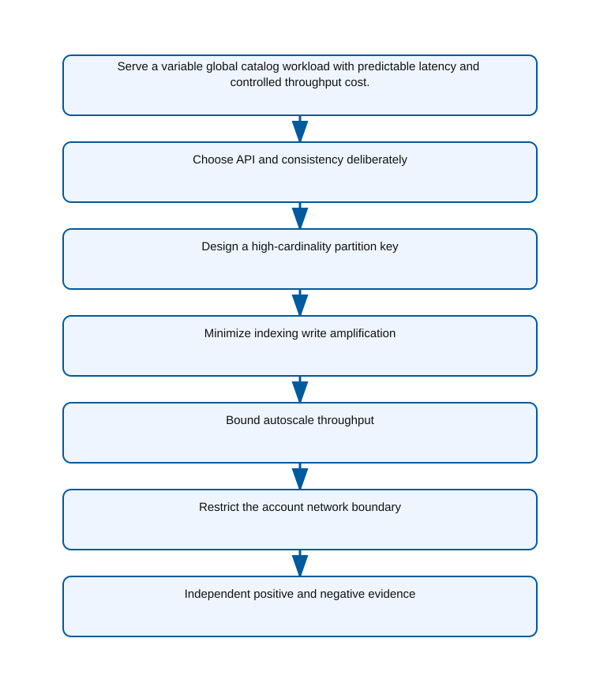

<!-- BEGIN GENERATED AZ305 V1 -->
# LAB-10 — Semi-Structured Data Platform Selection

## 1. Navigation

[← LAB-09](../09-relational-scale-protection/README.md) · [Lab catalog](../README.md) · [LAB-11 →](../11-unstructured-data-design/README.md)

## 2. Scenario and completion contract

Alpine Ski House is designing a global product-catalog API whose items have optional attributes, localized descriptions, and tenant-specific extensions. Reads arrive by tenant and product category, seasonal traffic is highly variable, and the application needs predictable low-latency access without relational joins. The team is considering Azure Cosmos DB for NoSQL, Azure Table Storage, and storing JSON in Azure SQL Database. As the semi-structured data architect, select a model, partition key, consistency level, indexing policy, throughput mode, and network boundary. Commands must expose the architectural choices and avoid treating global distribution or unlimited scale as automatic consequences of selecting a NoSQL service.

- Architect role: Semi-structured data architect
- Outcome: A partition-aware Azure Cosmos DB design whose consistency, indexing, throughput, and security decisions match access patterns.
- Duration: 160 minutes
- Difficulty: advanced
- Cost class: moderate
- Completion: all five checkpoint assertions, final validation, decision revision, and cleanup review are complete.

## 3. Objective-to-evidence map

| Objective | Requirement | Checkpoint |
| --- | --- | --- |
| `DATA-NONREL-01` | `LAB10-REQ-01` | [`LAB10-CP01`](#checkpoint-1) |
| `DATA-NONREL-01` | `LAB10-REQ-02` | [`LAB10-CP02`](#checkpoint-2) |
| `DATA-NONREL-01` | `LAB10-REQ-03` | [`LAB10-CP03`](#checkpoint-3) |
| `DATA-NONREL-01` | `LAB10-REQ-04` | [`LAB10-CP04`](#checkpoint-4) |
| `DATA-NONREL-01` | `LAB10-REQ-05` | [`LAB10-CP05`](#checkpoint-5) |

## 4. Business and quality requirements

Business outcome: Serve a variable global catalog workload with predictable latency and controlled throughput cost.

- `LAB10-REQ-01` — The NoSQL API and Session consistency support session read-your-writes with documented cross-session behavior.
- `LAB10-REQ-02` — The tenant-aware key distributes writes, supports dominant reads, and has a mitigation for exceptionally large tenants.
- `LAB10-REQ-03` — Indexed paths serve known filters and ordering while large descriptive payloads are explicitly excluded.
- `LAB10-REQ-04` — Autoscale absorbs seasonal bursts up to an approved maximum RU/s with alerts for sustained saturation.
- `LAB10-REQ-05` — Application access resolves through an approved private endpoint and the intended private DNS zone.

Scenario facts:

- **Data:** Semi-structured catalog documents vary by product class and carry tenant, category, item, and lifecycle attributes.
- **Scale:** One tenant generates forty percent of traffic; item count and request-unit measurements remain workload-supplied sizing inputs.
- **Latency:** Customer catalog reads need predictable global response, while cross-partition administrative queries may tolerate higher latency.
- **Availability:** Regional reads and writes require an explicit consistency and failover choice rather than assuming distribution alone guarantees continuity.
- **RTO:** Regional service recovery follows the selected replication topology; the scenario does not specify a numerical RTO.
- **RPO:** Consistency and multi-region write choices determine accepted-write loss behavior and require business approval.
- **Budget:** Shared autoscale capacity is economical until the dominant tenant's hot partitions and chargeback justify a dedicated boundary.

Constraints:

- The global catalog needs predictable latency under variable semi-structured demand.
- One enterprise tenant reaches forty percent of traffic and requires both cost attribution and data isolation.
- Use only the Azure CLI command lane for learner implementation.
- Keep all live changes behind explicit execution and acknowledgement switches.
- Retain only sanitized command evidence and synthetic fixture identifiers.

Assumptions:

- Catalog requests include stable tenant and item hierarchy fields suitable for a partition strategy.
- The application can route an exceptional tenant to a dedicated container without changing public identifiers.
- West Europe is the configurable primary example and North Europe is the configurable secondary example.
- The learner has administrator-level Azure operations knowledge but receives no pre-existing authenticated context.
- Offline fixtures demonstrate contract behavior rather than live Azure service behavior.

## 5. Architecture diagram and walkthrough



The flow begins with the business outcome, crosses five independently validated design capabilities, and ends with positive and negative evidence. The SVG is deterministically rendered from `diagrams/architecture.mmd`.

## 6. Concept primer and candidate architectures

Architecture decisions translate measurable requirements into a deliberate service and operating model. A candidate is viable only when every mandatory constraint is met; convenience or familiarity cannot compensate for a disqualifier.

- **Azure Cosmos DB for NoSQL with hierarchical tenant-aware partitioning** (eligible) — Hierarchical partition keys distribute tenant and catalog access while preserving native document evolution and global service capabilities.
- **Azure Table Storage with denormalized entities and account-level scale** (eligible) — Table Storage offers inexpensive key-value access but provides fewer global consistency and tenant-level throughput controls.
- **Azure SQL Database with JSON columns and relational indexes** (eligible) — SQL JSON supports relational governance, although schema variability and global document scaling require more application and index management.
- **One fixed partition containing the entire catalog** (ineligible) — A single partition simplifies queries but imposes one throughput and storage bottleneck for every tenant. Disqualifier: LAB10-REQ-02 requires a partition design that distributes load and isolates the dominant tenant.

## 7. Decision, ADR, and Well-Architected review

Criteria weights are C1 30, C2 25, C3 20, C4 15, and C5 10. Weighted totals use `sum(weight × score) / 5`.

| Candidate | Eligible | C1 | C2 | C3 | C4 | C5 | Weighted /100 |
| --- | ---: | ---: | ---: | ---: | ---: | ---: | ---: |
| Azure Cosmos DB for NoSQL with hierarchical tenant-aware partitioning | yes | 5 | 4 | 4 | 4 | 5 | 88 |
| Azure Table Storage with denormalized entities and account-level scale | yes | 3 | 3 | 3 | 3 | 5 | 64 |
| Azure SQL Database with JSON columns and relational indexes | yes | 3 | 4 | 4 | 4 | 2 | 70 |
| One fixed partition containing the entire catalog | no | 1 | 2 | 2 | 3 | 2 | 37 |

Selected design: **Azure Cosmos DB for NoSQL with hierarchical tenant-aware partitioning**. `ADR-LAB10-001` records the accepted reasoning. Review Reliability, Security, Cost Optimization, Operational Excellence, and Performance Efficiency in `design/decision.yml`; no pillar is implied by another.

Rejected alternatives:

- **Azure Table Storage with denormalized entities and account-level scale:** Lower unit cost does not offset weaker global behavior and limited isolation for the dominant tenant.
- **Azure SQL Database with JSON columns and relational indexes:** It couples variable catalog structure to relational capacity and provides a less direct global partition model.
- **One fixed partition containing the entire catalog:** The proposal is disqualified because it cannot satisfy scale or tenant-isolation acceptance criteria.

Architecture risks:

- **Risk:** A hierarchical key can still concentrate traffic if the leading tenant segment dominates requests. **Mitigation:** Measure normalized RU consumption and move the exceptional tenant to a dedicated container when the threshold is crossed.
- **Risk:** Splitting a tenant can create inconsistent indexing or consistency policies across containers. **Mitigation:** Version a common container baseline and compare policy hashes before routing production traffic.

Well-Architected consequences:

- **Reliability:** Explicit region, consistency, and failover behavior protects accepted catalog changes beyond simple data distribution.
- **Security:** Tenant-aware data roles and an optional dedicated container provide enforceable isolation boundaries.
- **Cost Optimization:** RU attribution and selective tenant separation avoid overprovisioning every catalog partition.
- **Operational Excellence:** Hot-partition, throttling, policy, and tenant-routing evidence supports repeatable scale decisions.
- **Performance Efficiency:** Hierarchical partitioning aligns common reads with physical distribution and isolates exceptional demand.

ADR consequences:

- Application routing and telemetry must preserve the tenant partition dimension on every catalog request.
- A dedicated enterprise container becomes a governed exception with independently tracked throughput and policy.

## 8. Inputs, permissions, licensing, cost, and analogue

Use configurable `Location` (`AZ305_LOCATION`, default West Europe) and `SecondaryLocation` (`AZ305_SECONDARY_LOCATION`, default North Europe). Every public input has an explicit `AZ305_*` fallback. Preview is the default; only Golden Lab 00 writes an intent-only `execute: false` preview record. Before an executed cloud command, the supplied subscription and tenant must exactly match the active CLI, Az, and—where applicable—Microsoft Graph contexts. `-Execute` crosses the execution boundary; cost-bearing and tenant-scoped paths also require their independent acknowledgement switches.

Safe analogue: The reference topology is deployable at bounded scope; preview remains the default and live verification is separate.

Permissions: Cosmos DB Account Reader and data-plane read permissions support inspection; account, container, throughput, role, or partition changes require separate authorization.

Licensing: Request-unit throughput, autoscale ceilings, storage, multi-region distribution, backups, and analytical features are independently billed.

Cost boundary: Model request units by tenant and operation, hot-partition amplification, index cost, retained data, and any dedicated container capacity.

## 9. Read-only preflight

```powershell
pwsh ./scripts/azure-cli/Preflight.ps1 -RunId synthetic-100001
```

Synthetic sample: `{"labId":"LAB-10","track":"azure-cli","result":"pass","note":"Local tool discovery only"}`. This is illustrative local output, not evidence captured from Azure.

## 10. Five guided checkpoints

### Checkpoint 1: Choose API and consistency deliberately

<a id="checkpoint-1"></a>

**Trace:** `DATA-NONREL-01` → `LAB10-REQ-01` → `LAB10-CP01`

```powershell
az cosmosdb create --name $CosmosAccountName --resource-group $ResourceGroup --locations regionName=$Location failoverPriority=0 isZoneRedundant=false --default-consistency-level Session --enable-free-tier false --tags purpose=az305-lab labId=LAB-10 runId=$RunId expiresOn=$ExpiresOn
```

Expected evidence: The NoSQL API and Session consistency support session read-your-writes with documented cross-session behavior. Retain Account label, API kind, consistency, region count, application session boundary, and rationale.

Positive assertion:

```powershell
az cosmosdb show --name $CosmosAccountName --resource-group $ResourceGroup --query "{kind:kind,consistency:consistencyPolicy.defaultConsistencyLevel,locations:locations[].locationName}" -o json
```

Negative assertion:

```powershell
az cosmosdb show --name $CosmosAccountName --resource-group $ResourceGroup --query "{consistency:consistencyPolicy.defaultConsistencyLevel,regionCount:length(locations)}" -o json
```

Failure and retry: A required read guarantee cannot be expressed with Session consistency and session-token propagation. Model the exact anomaly, then compare Bounded Staleness or Strong consistency against latency and availability.

Cleanup dependency: Delete containers and databases before the run-owned account; never treat account deletion as data recovery.

WAF consequence: Reliability: a documented consistency contract makes read behavior predictable across sessions and regions.

### Checkpoint 2: Design a high-cardinality partition key

<a id="checkpoint-2"></a>

**Trace:** `DATA-NONREL-01` → `LAB10-REQ-02` → `LAB10-CP02`

```powershell
$ownedCosmosId = az cosmosdb show --name $CosmosAccountName --resource-group $ResourceGroup --query id -o tsv --only-show-errors; if ($ownedCosmosId -ine $CosmosAccountResourceId) { throw 'The supplied Cosmos DB ID is not the exact run-owned account.' }; az cosmosdb sql database create --account-name $CosmosAccountName --resource-group $ResourceGroup --name $CosmosDatabaseName --only-show-errors | Out-Null; az cosmosdb sql container create --account-name $CosmosAccountName --resource-group $ResourceGroup --database-name $CosmosDatabaseName --name $ContainerName --partition-key-path /tenantId --max-throughput 4000 --only-show-errors
```

Expected evidence: The tenant-aware key distributes writes, supports dominant reads, and has a mitigation for exceptionally large tenants. Retain Partition-key path, cardinality estimate, largest logical partition estimate, query patterns, and hotspot mitigation.

Positive assertion:

```powershell
az cosmosdb sql container show --account-name $CosmosAccountName --resource-group $ResourceGroup --database-name $CosmosDatabaseName --name $ContainerName --query "{partitionKey:resource.partitionKey.paths,maxThroughput:resource.offerThroughput}" -o json
```

Negative assertion:

```powershell
az cosmosdb sql container show --account-name $CosmosAccountName --resource-group $ResourceGroup --database-name $CosmosDatabaseName --name $ContainerName --query "resource.partitionKey.paths[?@=='/status']" -o json
```

Failure and retry: One tenant can exceed logical-partition storage or throughput limits. Evaluate a hierarchical tenant-and-category key or synthetic suffix using measured access patterns.

Cleanup dependency: Delete the run-owned container before its database and account.

WAF consequence: Performance Efficiency: a high-cardinality access-aligned key distributes storage and request units.

### Checkpoint 3: Minimize indexing write amplification

<a id="checkpoint-3"></a>

**Trace:** `DATA-NONREL-01` → `LAB10-REQ-03` → `LAB10-CP03`

```powershell
$ownedCosmosId = az cosmosdb show --name $CosmosAccountName --resource-group $ResourceGroup --query id -o tsv --only-show-errors; if ($ownedCosmosId -ine $CosmosAccountResourceId) { throw 'The supplied Cosmos DB ID is not the exact run-owned account.' }; az cosmosdb sql container update --account-name $CosmosAccountName --resource-group $ResourceGroup --database-name $CosmosDatabaseName --name $ContainerName --idx @artifacts/indexing-policy.json --only-show-errors
```

Expected evidence: Indexed paths serve known filters and ordering while large descriptive payloads are explicitly excluded. Retain Index-policy hash, included and excluded paths, composite indexes, query examples, and RU estimate.

Positive assertion:

```powershell
az cosmosdb sql container show --account-name $CosmosAccountName --resource-group $ResourceGroup --database-name $CosmosDatabaseName --name $ContainerName --query "resource.indexingPolicy.{mode:indexingMode,included:includedPaths,excluded:excludedPaths}" -o json
```

Negative assertion:

```powershell
az cosmosdb sql container show --account-name $CosmosAccountName --resource-group $ResourceGroup --database-name $CosmosDatabaseName --name $ContainerName --query "resource.indexingPolicy.includedPaths[?path=='/*']" -o json
```

Failure and retry: A production query requires a path or composite order omitted from the policy. Add the narrowest supported index after evaluating transformation cost and expected RU reduction.

Cleanup dependency: Restore the original indexing policy before deleting a retained container.

WAF consequence: Operational Excellence: a versioned indexing policy makes query support and write amplification reviewable.

### Checkpoint 4: Bound autoscale throughput

<a id="checkpoint-4"></a>

**Trace:** `DATA-NONREL-01` → `LAB10-REQ-04` → `LAB10-CP04`

```powershell
$ownedCosmosId = az cosmosdb show --name $CosmosAccountName --resource-group $ResourceGroup --query id -o tsv --only-show-errors; if ($ownedCosmosId -ine $CosmosAccountResourceId) { throw 'The supplied Cosmos DB ID is not the exact run-owned account.' }; az cosmosdb sql container throughput migrate --account-name $CosmosAccountName --resource-group $ResourceGroup --database-name $CosmosDatabaseName --name $ContainerName --throughput-type autoscale --only-show-errors
```

Expected evidence: Autoscale absorbs seasonal bursts up to an approved maximum RU/s with alerts for sustained saturation. Retain Throughput mode, maximum RU/s, minimum billing implication, scale trigger, and cost owner.

Positive assertion:

```powershell
az cosmosdb sql container throughput show --account-name $CosmosAccountName --resource-group $ResourceGroup --database-name $CosmosDatabaseName --name $ContainerName --query "resource.autoscaleSettings.maxThroughput" -o tsv
```

Negative assertion:

```powershell
az cosmosdb sql container throughput show --account-name $CosmosAccountName --resource-group $ResourceGroup --database-name $CosmosDatabaseName --name $ContainerName --query "resource.autoscaleSettings.maxThroughput" -o tsv
```

Failure and retry: Shared-container tenants cannot be attributed or one partition consumes the full maximum. Measure normalized RU consumption by tenant and reconsider dedicated containers or partitioning before raising the maximum.

Cleanup dependency: Restore recorded throughput mode only when the service supports reversal; otherwise record the limitation.

WAF consequence: Cost Optimization: a governed autoscale maximum absorbs bursts while bounding throughput spend.

### Checkpoint 5: Restrict the account network boundary

<a id="checkpoint-5"></a>

**Trace:** `DATA-NONREL-01` → `LAB10-REQ-05` → `LAB10-CP05`

```powershell
az network private-endpoint create --name $PrivateEndpointName --resource-group $ResourceGroup --location $Location --subnet $SubnetId --private-connection-resource-id $CosmosAccountResourceId --group-id Sql --connection-name $PrivateConnectionName --tags purpose=az305-lab labId=LAB-10 runId=$RunId expiresOn=$ExpiresOn
```

Expected evidence: Application access resolves through an approved private endpoint and the intended private DNS zone. Retain Account ID, endpoint ID, group ID, approval state, subnet, and private DNS zone label.

Positive assertion:

```powershell
az network private-endpoint-connection list --id $CosmosAccountResourceId --query "[?properties.privateLinkServiceConnectionState.status=='Approved'].id" -o tsv --only-show-errors
```

Negative assertion:

```powershell
az cosmosdb show --name $CosmosAccountName --resource-group $ResourceGroup --query "{publicNetworkAccess:publicNetworkAccess,ipRuleCount:length(ipRules)}" -o json
```

Failure and retry: The wrong subresource group or DNS zone produces a public endpoint resolution. Validate Sql group selection, private DNS linking, and endpoint approval independently.

Cleanup dependency: Remove DNS records and the private endpoint before the account; preserve shared network assets.

WAF consequence: Security: private connectivity prevents unrestricted public access to the semi-structured data account.

## 11. Final validation and interpretation

Run `Validate.ps1 -Mode Deployment -Execute` only after an executed run has state and you are authorized to issue the ten read-only checkpoint inspections. Without `-Execute`, ordinary deployment validation records `partial` and exits `2`; Golden Lab 00 alone can validate its intent-only preview locally. Exit `0` means all required assertions pass, `1` means at least one failed, and `2` means the outcome is gated or partial. Positive and negative commands execute independently, so one failure never suppresses its paired assertion.

## 12. Material change request

One enterprise tenant grows to forty percent of all traffic and requires per-tenant cost attribution and data isolation; revise partition and container strategy without breaking other tenants.

Revised solution: select **Azure Cosmos DB for NoSQL with hierarchical tenant-aware partitioning**. LAB10-REQ-02 requires a partition strategy that mitigates an exceptionally large tenant, so Cosmos DB adds a dedicated container with independently attributable throughput.

Revised Well-Architected consequences:

- **Reliability:** Tenant separation contains throttling and partition pressure to the exceptional workload.
- **Security:** A dedicated data-plane role and container scope strengthen enterprise-tenant isolation.
- **Cost Optimization:** Its provisioned or autoscale RU consumption is measured and charged independently.
- **Operational Excellence:** Versioned routing and policy checks prevent shared and dedicated containers from drifting.
- **Performance Efficiency:** The shared hierarchy stays balanced while the dominant tenant scales on its own ceiling.

## 13. Architect job challenge

Compare hierarchical partition keys, a dedicated container, and a dedicated account for the dominant tenant using scale, blast radius, and cost criteria.

## 14. Troubleshooting, cleanup, and residual verification

- Diagnose partition skew with normalized RU and logical-partition size before raising throughput.
- Validate indexing-path and composite-index needs from real query shapes rather than indexing every field.
- Check private endpoint subresource, approval, and private DNS separately when connectivity fails.

Cleanup previews nonempty state in reverse dependency order, writes `partial`, and exits `2`; an already empty run is completed locally and idempotently. Executed cleanup rechecks the exact live ID plus `purpose`, `labId`, `runId`, and `expiresOn` immediately before each removal, persists state after every absent or removed object, stops on the first dependency failure, and refuses unresolved pre-existing settings. It never automates purge. Finish with `Validate.ps1 -Mode PostCleanup`; the required residual count is zero.

## 15. Exam debrief, assessment, sources, and navigation

Explain the recommendation in terms of requirements, rejected alternatives, failure behavior, and all five WAF pillars. Complete `assessment/QUESTIONS.md`, then use the separately excluded answer key for remediation.

- [Partitioning and horizontal scaling in Azure Cosmos DB](https://learn.microsoft.com/en-us/azure/cosmos-db/partitioning-overview)
- [Azure Well-Architected Framework](https://learn.microsoft.com/en-us/azure/well-architected/)

[← LAB-09](../09-relational-scale-protection/README.md) · [Lab catalog](../README.md) · [LAB-11 →](../11-unstructured-data-design/README.md)

## 16. Synchronized lifecycle-script appendix

### Preflight.ps1

```powershell
[CmdletBinding()]
param(
    [string]$SubscriptionId = $env:AZ305_SUBSCRIPTION_ID,
    [string]$TenantId = $env:AZ305_TENANT_ID,
    [ValidatePattern('^[a-z0-9-]{6,64}$')][string]$RunId = $env:AZ305_RUN_ID,
    [string]$Location = $(if ($env:AZ305_LOCATION) { $env:AZ305_LOCATION } else { 'westeurope' }),
    [string]$SecondaryLocation = $(if ($env:AZ305_SECONDARY_LOCATION) { $env:AZ305_SECONDARY_LOCATION } else { 'northeurope' }),
    [string]$ResourceGroup = $(if ($env:AZ305_RESOURCE_GROUP) { $env:AZ305_RESOURCE_GROUP } else { "rg-az305-$RunId" }),
    [string]$WorkloadName = $(if ($env:AZ305_WORKLOAD_NAME) { $env:AZ305_WORKLOAD_NAME } else { "az305-$RunId" }),
    [string]$ExpiresOn = $(if ($env:AZ305_EXPIRES_ON) { $env:AZ305_EXPIRES_ON } else { (Get-Date).ToUniversalTime().AddDays(1).ToString('yyyy-MM-dd') }),
    [string]$ContainerName = $env:AZ305_CONTAINER_NAME,
    [string]$CosmosAccountName = $env:AZ305_COSMOS_ACCOUNT_NAME,
    [string]$CosmosAccountResourceId = $env:AZ305_COSMOS_ACCOUNT_RESOURCE_ID,
    [string]$CosmosDatabaseName = $env:AZ305_COSMOS_DATABASE_NAME,
    [string]$PrivateConnectionName = $env:AZ305_PRIVATE_CONNECTION_NAME,
    [string]$PrivateEndpointName = $env:AZ305_PRIVATE_ENDPOINT_NAME,
    [string]$SubnetId = $env:AZ305_SUBNET_ID,
    [switch]$Execute,
    [switch]$AcknowledgeCost,
    [switch]$AcknowledgeTenantChange
)

$ErrorActionPreference = 'Stop'
$PSNativeCommandUseErrorActionPreference = $true
if (-not $RunId) { [Console]::Error.WriteLine('RunId or AZ305_RUN_ID is required.'); exit 2 }
# Every lifecycle entrypoint intentionally exposes the same public parameter contract.
@($SubscriptionId, $TenantId, $RunId, $Location, $SecondaryLocation, $ResourceGroup, $WorkloadName, $ExpiresOn, $ContainerName, $CosmosAccountName, $CosmosAccountResourceId, $CosmosDatabaseName, $PrivateConnectionName, $PrivateEndpointName, $SubnetId, $Execute, $AcknowledgeCost, $AcknowledgeTenantChange) | Out-Null

$requiredCommands = @('az', 'pwsh')
$missing = @($requiredCommands | Where-Object { -not (Get-Command $_ -ErrorAction SilentlyContinue) })
if ($missing.Count -gt 0) {
    Write-Error "Missing local commands: $($missing -join ', ')"
    exit 1
}

[pscustomobject]@{
    labId = 'LAB-10'
    track = 'azure-cli'
    implementationMode = 'reference-deployable'
    result = 'pass'
    note = 'Local tool discovery only; no Azure or Microsoft Graph request was made.'
} | ConvertTo-Json
exit 0
```

### Setup.ps1

```powershell
[CmdletBinding()]
param(
    [string]$SubscriptionId = $env:AZ305_SUBSCRIPTION_ID,
    [string]$TenantId = $env:AZ305_TENANT_ID,
    [ValidatePattern('^[a-z0-9-]{6,64}$')][string]$RunId = $env:AZ305_RUN_ID,
    [string]$Location = $(if ($env:AZ305_LOCATION) { $env:AZ305_LOCATION } else { 'westeurope' }),
    [string]$SecondaryLocation = $(if ($env:AZ305_SECONDARY_LOCATION) { $env:AZ305_SECONDARY_LOCATION } else { 'northeurope' }),
    [string]$ResourceGroup = $(if ($env:AZ305_RESOURCE_GROUP) { $env:AZ305_RESOURCE_GROUP } else { "rg-az305-$RunId" }),
    [string]$WorkloadName = $(if ($env:AZ305_WORKLOAD_NAME) { $env:AZ305_WORKLOAD_NAME } else { "az305-$RunId" }),
    [string]$ExpiresOn = $(if ($env:AZ305_EXPIRES_ON) { $env:AZ305_EXPIRES_ON } else { (Get-Date).ToUniversalTime().AddDays(1).ToString('yyyy-MM-dd') }),
    [string]$ContainerName = $env:AZ305_CONTAINER_NAME,
    [string]$CosmosAccountName = $env:AZ305_COSMOS_ACCOUNT_NAME,
    [string]$CosmosAccountResourceId = $env:AZ305_COSMOS_ACCOUNT_RESOURCE_ID,
    [string]$CosmosDatabaseName = $env:AZ305_COSMOS_DATABASE_NAME,
    [string]$PrivateConnectionName = $env:AZ305_PRIVATE_CONNECTION_NAME,
    [string]$PrivateEndpointName = $env:AZ305_PRIVATE_ENDPOINT_NAME,
    [string]$SubnetId = $env:AZ305_SUBNET_ID,
    [switch]$Execute,
    [switch]$AcknowledgeCost,
    [switch]$AcknowledgeTenantChange
)

$ErrorActionPreference = 'Stop'
$PSNativeCommandUseErrorActionPreference = $true
if (-not $RunId) { [Console]::Error.WriteLine('RunId or AZ305_RUN_ID is required.'); exit 2 }
# Every lifecycle entrypoint intentionally exposes the same public parameter contract.
@($SubscriptionId, $TenantId, $RunId, $Location, $SecondaryLocation, $ResourceGroup, $WorkloadName, $ExpiresOn, $ContainerName, $CosmosAccountName, $CosmosAccountResourceId, $CosmosDatabaseName, $PrivateConnectionName, $PrivateEndpointName, $SubnetId, $Execute, $AcknowledgeCost, $AcknowledgeTenantChange) | Out-Null

$LabRoot = Split-Path (Split-Path $PSScriptRoot -Parent) -Parent
$StateRoot = Join-Path $LabRoot ".state/$RunId"
$StatePath = Join-Path $StateRoot 'run.json'

function Invoke-AzCliJson {
    [CmdletBinding()]
    param([Parameter(Mandatory)][string[]]$ArgumentList)
    $savedNativePreference = $PSNativeCommandUseErrorActionPreference
    try {
        # Capture the exit code ourselves so a failed native command cannot be
        # mistaken for an empty but successful JSON response.
        $PSNativeCommandUseErrorActionPreference = $false
        $outputLines = @(& az @ArgumentList)
        $nativeExit = $LASTEXITCODE
    }
    finally {
        $PSNativeCommandUseErrorActionPreference = $savedNativePreference
    }
    if ($nativeExit -ne 0) { throw "Azure CLI exited with code $nativeExit." }
    $raw = @($outputLines) -join "`n"
    if ([string]::IsNullOrWhiteSpace($raw)) { return $null }
    try { return ($raw | ConvertFrom-Json -Depth 100) }
    catch { throw 'Azure CLI returned data that was not valid JSON.' }
}

function Assert-ExactExecutionContext {
    [CmdletBinding()]
    param([string]$ExpectedSubscriptionId, [string]$ExpectedTenantId)
    if ([string]::IsNullOrWhiteSpace($ExpectedSubscriptionId) -or [string]::IsNullOrWhiteSpace($ExpectedTenantId)) {
        throw 'SubscriptionId and TenantId are required before a cloud request.'
    }
    $context = Invoke-AzCliJson -ArgumentList @('account', 'show', '--output', 'json', '--only-show-errors')
    if (-not $context -or [string]$context.id -ine $ExpectedSubscriptionId -or [string]$context.tenantId -ine $ExpectedTenantId) {
        throw 'The active Azure CLI subscription or tenant does not exactly match the requested context.'
    }
}

function Save-RunState {
    [CmdletBinding()]
    param([Parameter(Mandatory)]$State)
    $temporaryPath = "$StatePath.tmp"
    $State | ConvertTo-Json -Depth 20 | Set-Content -LiteralPath $temporaryPath -Encoding utf8NoBOM
    Move-Item -LiteralPath $temporaryPath -Destination $StatePath -Force
}

function Assert-SafeStateValue {
    [CmdletBinding()]
    param($Value)
    $serialized = $Value | ConvertTo-Json -Depth 12 -Compress
    if ($serialized -match '(?i)"(?:token|password|secret|certificate|connectionString|sas|clientSecret|accessToken|refreshToken|accountKey|privateKey)"\s*:') {
        throw 'A prohibited sensitive field name was returned; state capture is refused.'
    }
}

function Convert-CheckpointOutput {
    [CmdletBinding()]
    param($Value)
    if ($Value -is [string]) { $raw = [string]$Value }
    elseif ($Value -is [System.Collections.IEnumerable] -and @($Value | Where-Object { $_ -isnot [string] }).Count -eq 0) { $raw = @($Value) -join "`n" }
    else { return $Value }
    if ([string]::IsNullOrWhiteSpace($raw)) { return $null }
    try { return ($raw | ConvertFrom-Json -Depth 100) } catch { return $Value }
}

function Get-ReturnedResourceId {
    [CmdletBinding()]
    param($Value)
    $seen = [System.Collections.Generic.HashSet[string]]::new([System.StringComparer]::OrdinalIgnoreCase)
    $results = [System.Collections.Generic.List[string]]::new()
    function Add-ArmId {
        param($Candidate)
        if ($Candidate -is [string] -and $Candidate -match '^/subscriptions/[0-9a-f-]+/(?:resourceGroups/[^/]+(?:/providers/.+)?|providers/.+)$' -and $Candidate -notmatch '/providers/Microsoft\.Resources/deployments/') {
            if ($seen.Add($Candidate)) { $results.Add($Candidate) }
        }
    }
    function Find-DeploymentOutputId {
        param($Item, [int]$Depth)
        if ($null -eq $Item -or $Depth -gt 12) { return }
        if ($Item -is [string]) { Add-ArmId -Candidate $Item; return }
        if ($Item -is [System.Collections.IDictionary]) { foreach ($key in $Item.Keys) { Find-DeploymentOutputId -Item $Item[$key] -Depth ($Depth + 1) }; return }
        if ($Item -is [System.Collections.IEnumerable]) { foreach ($entry in $Item) { Find-DeploymentOutputId -Item $entry -Depth ($Depth + 1) }; return }
        foreach ($property in @($Item.PSObject.Properties | Where-Object { $_.MemberType -in @('NoteProperty', 'Property') })) { Find-DeploymentOutputId -Item $property.Value -Depth ($Depth + 1) }
    }
    foreach ($rootItem in @($Value)) {
        if ($rootItem -is [System.Collections.IDictionary]) {
            foreach ($name in @('id', 'resourceId')) { if ($rootItem.Contains($name)) { Add-ArmId -Candidate $rootItem[$name] } }
            if ($rootItem.Contains('properties') -and $rootItem.properties -and $rootItem.properties.outputs) { Find-DeploymentOutputId -Item $rootItem.properties.outputs -Depth 0 }
            continue
        }
        foreach ($name in @('Id', 'ResourceId')) {
            $property = $rootItem.PSObject.Properties[$name]
            if ($property) { Add-ArmId -Candidate $property.Value }
        }
        if ($rootItem.PSObject.Properties['Properties'] -and $rootItem.Properties -and $rootItem.Properties.outputs) {
            Find-DeploymentOutputId -Item $rootItem.Properties.outputs -Depth 0
        }
    }
    return @($results)
}

function Get-PlannedDeploymentResourceId {
    [CmdletBinding()]
    param($Value)
    $seen = [System.Collections.Generic.HashSet[string]]::new([System.StringComparer]::OrdinalIgnoreCase)
    $results = [System.Collections.Generic.List[string]]::new()
    foreach ($change in @($Value.changes)) {
        $candidate = [string]$change.resourceId
        if ($candidate -match '^/subscriptions/[0-9a-f-]+/(?:resourceGroups/[^/]+(?:/providers/.+)?|providers/.+)$' -and $candidate -notmatch '/providers/Microsoft\.Resources/deployments/' -and $seen.Add($candidate)) {
            $results.Add($candidate)
        }
    }
    return @($results)
}

function Assert-InputSubscriptionScope {
    [CmdletBinding()]
    param($Inputs, [string]$ExpectedSubscriptionId)
    $entries = if ($Inputs -is [System.Collections.IDictionary]) {
        @($Inputs.GetEnumerator())
    } else {
        @($Inputs.PSObject.Properties | ForEach-Object { [pscustomobject]@{ Key = $_.Name; Value = $_.Value } })
    }
    foreach ($entry in $entries) {
        if ($entry.Value -is [string] -and [string]$entry.Value -match '^/subscriptions/([^/]+)/') {
            if ($Matches[1] -ine $ExpectedSubscriptionId) { throw "Input $($entry.Key) belongs to a different subscription." }
        }
    }
}

function Assert-ManagedMutation {
    [CmdletBinding()]
    param($State, [string]$CheckpointId, [bool]$CarriesOwnership, [object[]]$TargetResourceIds)
    if ($CarriesOwnership) { return }
    $targets = @($TargetResourceIds | Where-Object { $_ -is [string] -and $_ -match '^/subscriptions/' })
    if ($targets.Count -eq 0) { throw "$CheckpointId refuses an untagged mutation because no exact ARM target ID was supplied." }
    $knownIds = @($State.managedObjects | ForEach-Object { [string]$_.id })
    if ($knownIds.Count -eq 0) { throw "$CheckpointId refuses to modify a pre-existing object because no run-owned parent has been recorded." }
    foreach ($target in $targets) {
        $related = @($knownIds | Where-Object { $target -ieq $_ -or $target.StartsWith("$_/", [System.StringComparison]::OrdinalIgnoreCase) -or $_.StartsWith("$target/", [System.StringComparison]::OrdinalIgnoreCase) }).Count -gt 0
        if (-not $related) { throw "$CheckpointId refuses a mutation outside the exact run-owned resource boundary." }
    }
}

$executionInputs = [ordered]@{ subscriptionId = $SubscriptionId; tenantId = $TenantId; location = $Location; secondaryLocation = $SecondaryLocation; resourceGroup = $ResourceGroup; workloadName = $WorkloadName; expiresOn = $ExpiresOn; ContainerName = $ContainerName; CosmosAccountName = $CosmosAccountName; CosmosAccountResourceId = $CosmosAccountResourceId; CosmosDatabaseName = $CosmosDatabaseName; PrivateConnectionName = $PrivateConnectionName; PrivateEndpointName = $PrivateEndpointName; SubnetId = $SubnetId }

if (-not $Execute) {
    Write-Output '[preview] No cloud command was called and no state was created.'
    Write-Output '[preview] Re-run with -Execute only in an authorized disposable environment.'
    exit 0
}
# This setup is compatible with the lab implementation mode.
if (-not $AcknowledgeCost) { [Console]::Error.WriteLine('Cost acknowledgement is required.'); exit 2 }
# This lab does not perform a tenant-scoped change by default.
$requiredLabInputs = [ordered]@{ ContainerName = $ContainerName; CosmosAccountName = $CosmosAccountName; CosmosAccountResourceId = $CosmosAccountResourceId; CosmosDatabaseName = $CosmosDatabaseName; PrivateConnectionName = $PrivateConnectionName; PrivateEndpointName = $PrivateEndpointName; SubnetId = $SubnetId }
$missingLabInputs = @($requiredLabInputs.GetEnumerator() | Where-Object { $_.Value -is [string] -and [string]::IsNullOrWhiteSpace([string]$_.Value) } | ForEach-Object Key)
if ($missingLabInputs.Count -gt 0) { [Console]::Error.WriteLine("Execution is gated; supply: $($missingLabInputs -join ', ')."); exit 2 }

try {
    Assert-ExactExecutionContext -ExpectedSubscriptionId $SubscriptionId -ExpectedTenantId $TenantId
    Assert-InputSubscriptionScope -Inputs $executionInputs -ExpectedSubscriptionId $SubscriptionId
    Assert-SafeStateValue -Value $executionInputs
}
catch {
    [Console]::Error.WriteLine("Execution is gated by context or input validation: $($_.Exception.Message)")
    exit 2
}

# Recovery state is persisted before the first possible mutation below.
if (Test-Path -LiteralPath $StatePath) {
    [Console]::Error.WriteLine('Run state already exists. Choose a new RunId or complete the recorded cleanup; existing recovery state will not be overwritten.')
    exit 2
}
New-Item -ItemType Directory -Path $StateRoot -Force | Out-Null
$state = [ordered]@{
    schemaVersion = '1.0.0'; labId = 'LAB-10'; runId = $RunId; track = 'azure-cli'
    implementationMode = 'reference-deployable'; status = 'initialized'
    createdAt = (Get-Date).ToUniversalTime().ToString('o'); execute = $true
    parameters = $executionInputs
    managedObjects = @(); originalSettings = @()
}
Save-RunState -State $state
$state.status = 'deploying'
Save-RunState -State $state

$originalLocation = Get-Location
try {
    Set-Location -LiteralPath $LabRoot
    # 10-CP01: Choose API and consistency deliberately
    Assert-ManagedMutation -State $state -CheckpointId 'LAB10-CP01' -CarriesOwnership:$true -TargetResourceIds @()
    $stepResult = & { az cosmosdb create --name $CosmosAccountName --resource-group $ResourceGroup --locations regionName=$Location failoverPriority=0 isZoneRedundant=false --default-consistency-level Session --enable-free-tier false --tags purpose=az305-lab labId=LAB-10 runId=$RunId expiresOn=$ExpiresOn }
    if ($LASTEXITCODE -ne 0) { throw 'LAB10-CP01 native command exited with code ' + $LASTEXITCODE + '.' }
    $candidate = Convert-CheckpointOutput -Value $stepResult
    $returnedIds = @(Get-ReturnedResourceId -Value $candidate)
    if ($returnedIds.Count -eq 0) { throw 'LAB10-CP01 created an owned resource but returned no recoverable ARM resource ID.' }
    foreach ($returnedId in $returnedIds) {
        if ($returnedId -notmatch '^/subscriptions/([^/]+)/' -or $Matches[1] -ine $SubscriptionId) { throw 'A returned recovery ID belongs to a different subscription.' }
        if (@($state.managedObjects | Where-Object { $_.id -ieq $returnedId }).Count -eq 0) {
            $state.managedObjects += [pscustomobject]@{
                id = $returnedId
                type = 'azure-resource'
                tags = [ordered]@{ purpose = 'az305-lab'; labId = 'LAB-10'; runId = $RunId; expiresOn = $ExpiresOn }
            }
            Save-RunState -State $state
        }
    }
    $null = $stepResult

    # 10-CP02: Design a high-cardinality partition key
    Assert-ManagedMutation -State $state -CheckpointId 'LAB10-CP02' -CarriesOwnership:$false -TargetResourceIds @($CosmosAccountResourceId)
    $stepResult = & { $ownedCosmosId = az cosmosdb show --name $CosmosAccountName --resource-group $ResourceGroup --query id -o tsv --only-show-errors; if ($ownedCosmosId -ine $CosmosAccountResourceId) { throw 'The supplied Cosmos DB ID is not the exact run-owned account.' }; az cosmosdb sql database create --account-name $CosmosAccountName --resource-group $ResourceGroup --name $CosmosDatabaseName --only-show-errors | Out-Null; az cosmosdb sql container create --account-name $CosmosAccountName --resource-group $ResourceGroup --database-name $CosmosDatabaseName --name $ContainerName --partition-key-path /tenantId --max-throughput 4000 --only-show-errors }
    if ($LASTEXITCODE -ne 0) { throw 'LAB10-CP02 native command exited with code ' + $LASTEXITCODE + '.' }
    $null = $stepResult

    # 10-CP03: Minimize indexing write amplification
    Assert-ManagedMutation -State $state -CheckpointId 'LAB10-CP03' -CarriesOwnership:$false -TargetResourceIds @($CosmosAccountResourceId)
    # Capture the original non-secret projection before changing an exact run-owned object.
    $originalProjection = & { az cosmosdb sql container show --account-name $CosmosAccountName --resource-group $ResourceGroup --database-name $CosmosDatabaseName --name $ContainerName --query "resource.indexingPolicy.{mode:indexingMode,included:includedPaths,excluded:excludedPaths}" -o json }
    if ($LASTEXITCODE -ne 0) { throw 'LAB10-CP03 original-state native command exited with code ' + $LASTEXITCODE + '.' }
    Assert-SafeStateValue -Value $originalProjection
    foreach ($originalTargetId in @($CosmosAccountResourceId)) {
        $state.originalSettings += [pscustomobject]@{ id = $originalTargetId; setting = 'LAB10-CP03: Minimize indexing write amplification'; value = $originalProjection }
    }
    Save-RunState -State $state
    $stepResult = & { $ownedCosmosId = az cosmosdb show --name $CosmosAccountName --resource-group $ResourceGroup --query id -o tsv --only-show-errors; if ($ownedCosmosId -ine $CosmosAccountResourceId) { throw 'The supplied Cosmos DB ID is not the exact run-owned account.' }; az cosmosdb sql container update --account-name $CosmosAccountName --resource-group $ResourceGroup --database-name $CosmosDatabaseName --name $ContainerName --idx @artifacts/indexing-policy.json --only-show-errors }
    if ($LASTEXITCODE -ne 0) { throw 'LAB10-CP03 native command exited with code ' + $LASTEXITCODE + '.' }
    $null = $stepResult

    # 10-CP04: Bound autoscale throughput
    Assert-ManagedMutation -State $state -CheckpointId 'LAB10-CP04' -CarriesOwnership:$false -TargetResourceIds @($CosmosAccountResourceId)
    # Capture the original non-secret projection before changing an exact run-owned object.
    $originalProjection = & { az cosmosdb sql container throughput show --account-name $CosmosAccountName --resource-group $ResourceGroup --database-name $CosmosDatabaseName --name $ContainerName --query "resource.autoscaleSettings.maxThroughput" -o tsv }
    if ($LASTEXITCODE -ne 0) { throw 'LAB10-CP04 original-state native command exited with code ' + $LASTEXITCODE + '.' }
    Assert-SafeStateValue -Value $originalProjection
    foreach ($originalTargetId in @($CosmosAccountResourceId)) {
        $state.originalSettings += [pscustomobject]@{ id = $originalTargetId; setting = 'LAB10-CP04: Bound autoscale throughput'; value = $originalProjection }
    }
    Save-RunState -State $state
    $stepResult = & { $ownedCosmosId = az cosmosdb show --name $CosmosAccountName --resource-group $ResourceGroup --query id -o tsv --only-show-errors; if ($ownedCosmosId -ine $CosmosAccountResourceId) { throw 'The supplied Cosmos DB ID is not the exact run-owned account.' }; az cosmosdb sql container throughput migrate --account-name $CosmosAccountName --resource-group $ResourceGroup --database-name $CosmosDatabaseName --name $ContainerName --throughput-type autoscale --only-show-errors }
    if ($LASTEXITCODE -ne 0) { throw 'LAB10-CP04 native command exited with code ' + $LASTEXITCODE + '.' }
    $null = $stepResult

    # 10-CP05: Restrict the account network boundary
    Assert-ManagedMutation -State $state -CheckpointId 'LAB10-CP05' -CarriesOwnership:$true -TargetResourceIds @($CosmosAccountResourceId)
    $stepResult = & { az network private-endpoint create --name $PrivateEndpointName --resource-group $ResourceGroup --location $Location --subnet $SubnetId --private-connection-resource-id $CosmosAccountResourceId --group-id Sql --connection-name $PrivateConnectionName --tags purpose=az305-lab labId=LAB-10 runId=$RunId expiresOn=$ExpiresOn }
    if ($LASTEXITCODE -ne 0) { throw 'LAB10-CP05 native command exited with code ' + $LASTEXITCODE + '.' }
    $candidate = Convert-CheckpointOutput -Value $stepResult
    $returnedIds = @(Get-ReturnedResourceId -Value $candidate)
    if ($returnedIds.Count -eq 0) { throw 'LAB10-CP05 created an owned resource but returned no recoverable ARM resource ID.' }
    foreach ($returnedId in $returnedIds) {
        if ($returnedId -notmatch '^/subscriptions/([^/]+)/' -or $Matches[1] -ine $SubscriptionId) { throw 'A returned recovery ID belongs to a different subscription.' }
        if (@($state.managedObjects | Where-Object { $_.id -ieq $returnedId }).Count -eq 0) {
            $state.managedObjects += [pscustomobject]@{
                id = $returnedId
                type = 'azure-resource'
                tags = [ordered]@{ purpose = 'az305-lab'; labId = 'LAB-10'; runId = $RunId; expiresOn = $ExpiresOn }
            }
            Save-RunState -State $state
        }
    }
    $null = $stepResult

    $state.status = 'deployed'
    Save-RunState -State $state
} catch {
    $state.status = 'failed'
    Save-RunState -State $state
    Write-Error $_
    exit 1
} finally {
    Set-Location -LiteralPath $originalLocation
}
exit 0
```

### Validate.ps1

```powershell
[CmdletBinding()]
param(
    [string]$SubscriptionId = $env:AZ305_SUBSCRIPTION_ID,
    [string]$TenantId = $env:AZ305_TENANT_ID,
    [ValidatePattern('^[a-z0-9-]{6,64}$')][string]$RunId = $env:AZ305_RUN_ID,
    [string]$Location = $(if ($env:AZ305_LOCATION) { $env:AZ305_LOCATION } else { 'westeurope' }),
    [string]$SecondaryLocation = $(if ($env:AZ305_SECONDARY_LOCATION) { $env:AZ305_SECONDARY_LOCATION } else { 'northeurope' }),
    [string]$ResourceGroup = $(if ($env:AZ305_RESOURCE_GROUP) { $env:AZ305_RESOURCE_GROUP } else { "rg-az305-$RunId" }),
    [string]$WorkloadName = $(if ($env:AZ305_WORKLOAD_NAME) { $env:AZ305_WORKLOAD_NAME } else { "az305-$RunId" }),
    [string]$ExpiresOn = $(if ($env:AZ305_EXPIRES_ON) { $env:AZ305_EXPIRES_ON } else { (Get-Date).ToUniversalTime().AddDays(1).ToString('yyyy-MM-dd') }),
    [string]$ContainerName = $env:AZ305_CONTAINER_NAME,
    [string]$CosmosAccountName = $env:AZ305_COSMOS_ACCOUNT_NAME,
    [string]$CosmosAccountResourceId = $env:AZ305_COSMOS_ACCOUNT_RESOURCE_ID,
    [string]$CosmosDatabaseName = $env:AZ305_COSMOS_DATABASE_NAME,
    [string]$PrivateConnectionName = $env:AZ305_PRIVATE_CONNECTION_NAME,
    [string]$PrivateEndpointName = $env:AZ305_PRIVATE_ENDPOINT_NAME,
    [string]$SubnetId = $env:AZ305_SUBNET_ID,
    [ValidateSet('Deployment', 'PostCleanup')][string]$Mode = 'Deployment',
    [switch]$Execute,
    [switch]$AcknowledgeCost,
    [switch]$AcknowledgeTenantChange
)

$ErrorActionPreference = 'Stop'
$PSNativeCommandUseErrorActionPreference = $true
if (-not $RunId) { [Console]::Error.WriteLine('RunId or AZ305_RUN_ID is required.'); exit 2 }
# Every lifecycle entrypoint intentionally exposes the same public parameter contract.
@($SubscriptionId, $TenantId, $RunId, $Location, $SecondaryLocation, $ResourceGroup, $WorkloadName, $ExpiresOn, $ContainerName, $CosmosAccountName, $CosmosAccountResourceId, $CosmosDatabaseName, $PrivateConnectionName, $PrivateEndpointName, $SubnetId, $Mode, $Execute, $AcknowledgeCost, $AcknowledgeTenantChange) | Out-Null

$LabRoot = Split-Path (Split-Path $PSScriptRoot -Parent) -Parent
$StateRoot = Join-Path $LabRoot ".state/$RunId"
$RunPath = Join-Path $StateRoot 'run.json'
$ValidationPath = Join-Path $StateRoot 'validation.json'

function Invoke-AzCliJson {
    [CmdletBinding()]
    param([Parameter(Mandatory)][string[]]$ArgumentList)
    $savedNativePreference = $PSNativeCommandUseErrorActionPreference
    try {
        # Capture the exit code ourselves so a failed native command cannot be
        # mistaken for an empty but successful JSON response.
        $PSNativeCommandUseErrorActionPreference = $false
        $outputLines = @(& az @ArgumentList)
        $nativeExit = $LASTEXITCODE
    }
    finally {
        $PSNativeCommandUseErrorActionPreference = $savedNativePreference
    }
    if ($nativeExit -ne 0) { throw "Azure CLI exited with code $nativeExit." }
    $raw = @($outputLines) -join "`n"
    if ([string]::IsNullOrWhiteSpace($raw)) { return $null }
    try { return ($raw | ConvertFrom-Json -Depth 100) }
    catch { throw 'Azure CLI returned data that was not valid JSON.' }
}

function Assert-ExactExecutionContext {
    [CmdletBinding()]
    param([string]$ExpectedSubscriptionId, [string]$ExpectedTenantId)
    if ([string]::IsNullOrWhiteSpace($ExpectedSubscriptionId) -or [string]::IsNullOrWhiteSpace($ExpectedTenantId)) {
        throw 'SubscriptionId and TenantId are required before a cloud request.'
    }
    $context = Invoke-AzCliJson -ArgumentList @('account', 'show', '--output', 'json', '--only-show-errors')
    if (-not $context -or [string]$context.id -ine $ExpectedSubscriptionId -or [string]$context.tenantId -ine $ExpectedTenantId) {
        throw 'The active Azure CLI subscription or tenant does not exactly match the requested context.'
    }
}


if (-not (Test-Path -LiteralPath $RunPath)) {
    Write-Warning 'No run state exists; validation is gated.'
    exit 2
}
$state = Get-Content -LiteralPath $RunPath -Raw | ConvertFrom-Json
$assertions = [System.Collections.Generic.List[object]]::new()
function Add-ValidationAssertion {
    [CmdletBinding()]
    param([string]$Id, [ValidateSet('positive', 'negative')][string]$Kind, [bool]$Passed, [string]$Message)
    $assertions.Add([pscustomobject]@{ id = $Id; kind = $Kind; passed = $Passed; message = $Message })
}

function Save-ValidationArtifact {
    [CmdletBinding()]
    param([ValidateSet('pass', 'partial', 'fail')][string]$Result)
    $artifact = [ordered]@{ schemaVersion = '1.0.0'; labId = 'LAB-10'; runId = $RunId; mode = $Mode; result = $Result; validatedAt = (Get-Date).ToUniversalTime().ToString('o'); assertions = @($assertions) }
    $artifact | ConvertTo-Json -Depth 12 | Set-Content -LiteralPath $ValidationPath -Encoding utf8NoBOM
}

function Test-PositiveEvidence {
    [CmdletBinding()]
    param($Value)
    if ($Value -is [bool]) { return $Value }
    if ($null -eq $Value) { return $false }
    if ($Value -is [string]) { return -not [string]::IsNullOrWhiteSpace($Value) }
    if ($Value -is [System.Collections.IEnumerable]) { return @($Value).Count -gt 0 }
    return $true
}

function Test-NegativeEvidence {
    [CmdletBinding()]
    param($Value)
    if ($Value -is [bool]) { return $Value }
    if ($null -eq $Value) { return $true }
    if ($Value -is [string]) { return [string]::IsNullOrWhiteSpace($Value) }
    if ($Value -is [System.Collections.IEnumerable]) { return @($Value).Count -eq 0 }
    $properties = @($Value.PSObject.Properties | Where-Object { $_.MemberType -in @('NoteProperty', 'Property') })
    if ($properties.Count -eq 0) { return $false }
    return @($properties | Where-Object { -not (Test-NegativeEvidence -Value $_.Value) }).Count -eq 0
}

function Test-ProhibitedStateField {
    [CmdletBinding()]
    param($Value)
    $serialized = $Value | ConvertTo-Json -Depth 20
    return $serialized -match '(?i)"(?:token|password|secret|certificate|connectionString|sas|clientSecret|accessToken|refreshToken|accountKey|privateKey)"\s*:'
}

function Assert-InputSubscriptionScope {
    [CmdletBinding()]
    param($Inputs, [string]$ExpectedSubscriptionId)
    $entries = if ($Inputs -is [System.Collections.IDictionary]) {
        @($Inputs.GetEnumerator())
    } else {
        @($Inputs.PSObject.Properties | ForEach-Object { [pscustomobject]@{ Key = $_.Name; Value = $_.Value } })
    }
    foreach ($entry in $entries) {
        if ($entry.Value -is [string] -and [string]$entry.Value -match '^/subscriptions/([^/]+)/' -and $Matches[1] -ine $ExpectedSubscriptionId) {
            throw "Input $($entry.Key) belongs to a different subscription."
        }
    }
}

$stateIdentityMatches = (
    $state.labId -ceq 'LAB-10' -and
    $state.runId -ceq $RunId -and
    $state.track -ceq 'azure-cli' -and
    $state.implementationMode -ceq 'reference-deployable' -and
    ([string]$state.parameters.subscriptionId -ieq $SubscriptionId -and [string]$state.parameters.tenantId -ieq $TenantId)
)
Add-ValidationAssertion -Id 'LAB10-VAL-POS-01' -Kind positive -Passed $stateIdentityMatches -Message 'Run identity, implementation mode, command track, tenant, and subscription exactly match the copied lab and requested run.'
$hasSensitiveName = Test-ProhibitedStateField -Value $state
Add-ValidationAssertion -Id 'LAB10-VAL-NEG-01' -Kind negative -Passed (-not $hasSensitiveName) -Message 'State contains no prohibited sensitive field name.'

if ($Mode -eq 'PostCleanup') {
    $cleanupPath = Join-Path $StateRoot 'cleanup.json'
    $cleanup = if (Test-Path -LiteralPath $cleanupPath) { Get-Content -LiteralPath $cleanupPath -Raw | ConvertFrom-Json } else { $null }
    Add-ValidationAssertion -Id 'LAB10-VAL-POS-02' -Kind positive -Passed ($null -ne $cleanup -and $cleanup.labId -ceq 'LAB-10' -and $cleanup.runId -ceq $RunId -and $cleanup.result -eq 'pass' -and $cleanup.ownershipVerified) -Message 'The exact run cleanup completed with verified ownership.'
    Add-ValidationAssertion -Id 'LAB10-VAL-NEG-02' -Kind negative -Passed ($null -ne $cleanup -and $cleanup.activeManagedObjects -eq 0 -and @($state.managedObjects).Count -eq 0 -and @($state.originalSettings).Count -eq 0 -and $state.status -eq 'cleaned') -Message 'No active managed object or unresolved original setting remains in cleanup or run state.'
    $postCleanupPassed = @($assertions | Where-Object { -not $_.passed }).Count -eq 0
    Save-ValidationArtifact -Result $(if ($postCleanupPassed) { 'pass' } else { 'fail' })
    if ($postCleanupPassed) { exit 0 }
    exit 1
}

Add-ValidationAssertion -Id 'LAB10-VAL-POS-02' -Kind positive -Passed ($state.status -eq 'deployed') -Message 'The executed setup completed successfully; a failed setup can never validate as pass.'
Add-ValidationAssertion -Id 'LAB10-VAL-NEG-02' -Kind negative -Passed (@($state.managedObjects | Where-Object { $_.tags.purpose -ne 'az305-lab' -or $_.tags.labId -ne 'LAB-10' -or $_.tags.runId -ne $RunId }).Count -eq 0) -Message 'No recorded object has a foreign ownership tag.'

if (@($assertions | Where-Object { -not $_.passed }).Count -gt 0) {
    Save-ValidationArtifact -Result 'fail'
    exit 1
}
if (-not $Execute) {
    # This lab has no special intent-only validation path.
    Save-ValidationArtifact -Result 'partial'
    Write-Warning 'Checkpoint validation is gated; re-run with -Execute after confirming the exact read-only context.'
    exit 2
}
# The validation surface is compatible with this lab implementation mode.
$requiredValidationInputs = [ordered]@{ ContainerName = $ContainerName; CosmosAccountName = $CosmosAccountName; CosmosAccountResourceId = $CosmosAccountResourceId; CosmosDatabaseName = $CosmosDatabaseName }
$missingValidationInputs = @($requiredValidationInputs.GetEnumerator() | Where-Object { $_.Value -is [string] -and [string]::IsNullOrWhiteSpace([string]$_.Value) } | ForEach-Object Key)
if ($missingValidationInputs.Count -gt 0) {
    Add-ValidationAssertion -Id 'LAB10-VAL-POS-CONTEXT' -Kind positive -Passed $false -Message 'One or more required non-secret validation inputs are missing.'
    Save-ValidationArtifact -Result 'partial'
    exit 2
}
try {
    Assert-ExactExecutionContext -ExpectedSubscriptionId $SubscriptionId -ExpectedTenantId $TenantId
    Assert-InputSubscriptionScope -Inputs $state.parameters -ExpectedSubscriptionId $SubscriptionId
    Add-ValidationAssertion -Id 'LAB10-VAL-POS-CONTEXT' -Kind positive -Passed $true -Message 'The active tenant and subscription exactly match the requested validation context.'
}
catch {
    Add-ValidationAssertion -Id 'LAB10-VAL-POS-CONTEXT' -Kind positive -Passed $false -Message 'Exact execution context could not be proven.'
    Save-ValidationArtifact -Result 'partial'
    exit 2
}

$originalLocation = Get-Location
try {
    Set-Location -LiteralPath $LabRoot
# LAB10-CP01: run both polarities even when one fails.
$positivePassed = $false
try {
    $global:LASTEXITCODE = 0
    $positiveEvidence = & { az cosmosdb show --name $CosmosAccountName --resource-group $ResourceGroup --query "{kind:kind,consistency:consistencyPolicy.defaultConsistencyLevel,locations:locations[].locationName}" -o json }
    if ($LASTEXITCODE -ne 0) { throw 'LAB10-CP01 positive native command exited with code ' + $LASTEXITCODE + '.' }
    $positivePassed = (Test-PositiveEvidence -Value $positiveEvidence)
    $null = $positiveEvidence
} catch { $positivePassed = $false }
Add-ValidationAssertion -Id 'LAB10-CP01-POS' -Kind positive -Passed $positivePassed -Message 'The NoSQL API and Session consistency support session read-your-writes with documented cross-session behavior.'

$negativePassed = $false
try {
    $global:LASTEXITCODE = 0
    $negativeEvidence = & { az cosmosdb show --name $CosmosAccountName --resource-group $ResourceGroup --query "{consistency:consistencyPolicy.defaultConsistencyLevel,regionCount:length(locations)}" -o json }
    if ($LASTEXITCODE -ne 0) { throw 'LAB10-CP01 negative native command exited with code ' + $LASTEXITCODE + '.' }
    $negativePassed = (Test-NegativeEvidence -Value $negativeEvidence)
    $null = $negativeEvidence
} catch { $negativePassed = $false }
Add-ValidationAssertion -Id 'LAB10-CP01-NEG' -Kind negative -Passed $negativePassed -Message 'Strong consistency is not selected reflexively for a multi-region catalog without its latency and availability trade-off.'

# LAB10-CP02: run both polarities even when one fails.
$positivePassed = $false
try {
    $global:LASTEXITCODE = 0
    $positiveEvidence = & { az cosmosdb sql container show --account-name $CosmosAccountName --resource-group $ResourceGroup --database-name $CosmosDatabaseName --name $ContainerName --query "{partitionKey:resource.partitionKey.paths,maxThroughput:resource.offerThroughput}" -o json }
    if ($LASTEXITCODE -ne 0) { throw 'LAB10-CP02 positive native command exited with code ' + $LASTEXITCODE + '.' }
    $positivePassed = (Test-PositiveEvidence -Value $positiveEvidence)
    $null = $positiveEvidence
} catch { $positivePassed = $false }
Add-ValidationAssertion -Id 'LAB10-CP02-POS' -Kind positive -Passed $positivePassed -Message 'The tenant-aware key distributes writes, supports dominant reads, and has a mitigation for exceptionally large tenants.'

$negativePassed = $false
try {
    $global:LASTEXITCODE = 0
    $negativeEvidence = & { az cosmosdb sql container show --account-name $CosmosAccountName --resource-group $ResourceGroup --database-name $CosmosDatabaseName --name $ContainerName --query "resource.partitionKey.paths[?@=='/status']" -o json }
    if ($LASTEXITCODE -ne 0) { throw 'LAB10-CP02 negative native command exited with code ' + $LASTEXITCODE + '.' }
    $negativePassed = (Test-NegativeEvidence -Value $negativeEvidence)
    $null = $negativeEvidence
} catch { $negativePassed = $false }
Add-ValidationAssertion -Id 'LAB10-CP02-NEG' -Kind negative -Passed $negativePassed -Message 'A low-cardinality mutable property such as status is not used as the partition key.'

# LAB10-CP03: run both polarities even when one fails.
$positivePassed = $false
try {
    $global:LASTEXITCODE = 0
    $positiveEvidence = & { az cosmosdb sql container show --account-name $CosmosAccountName --resource-group $ResourceGroup --database-name $CosmosDatabaseName --name $ContainerName --query "resource.indexingPolicy.{mode:indexingMode,included:includedPaths,excluded:excludedPaths}" -o json }
    if ($LASTEXITCODE -ne 0) { throw 'LAB10-CP03 positive native command exited with code ' + $LASTEXITCODE + '.' }
    $positivePassed = (Test-PositiveEvidence -Value $positiveEvidence)
    $null = $positiveEvidence
} catch { $positivePassed = $false }
Add-ValidationAssertion -Id 'LAB10-CP03-POS' -Kind positive -Passed $positivePassed -Message 'Indexed paths serve known filters and ordering while large descriptive payloads are explicitly excluded.'

$negativePassed = $false
try {
    $global:LASTEXITCODE = 0
    $negativeEvidence = & { az cosmosdb sql container show --account-name $CosmosAccountName --resource-group $ResourceGroup --database-name $CosmosDatabaseName --name $ContainerName --query "resource.indexingPolicy.includedPaths[?path=='/*']" -o json }
    if ($LASTEXITCODE -ne 0) { throw 'LAB10-CP03 negative native command exited with code ' + $LASTEXITCODE + '.' }
    $negativePassed = (Test-NegativeEvidence -Value $negativeEvidence)
    $null = $negativeEvidence
} catch { $negativePassed = $false }
Add-ValidationAssertion -Id 'LAB10-CP03-NEG' -Kind negative -Passed $negativePassed -Message 'A blanket include-all policy is not retained when measured writes and unused fields make it wasteful.'

# LAB10-CP04: run both polarities even when one fails.
$positivePassed = $false
try {
    $global:LASTEXITCODE = 0
    $positiveEvidence = & { az cosmosdb sql container throughput show --account-name $CosmosAccountName --resource-group $ResourceGroup --database-name $CosmosDatabaseName --name $ContainerName --query "resource.autoscaleSettings.maxThroughput" -o tsv }
    if ($LASTEXITCODE -ne 0) { throw 'LAB10-CP04 positive native command exited with code ' + $LASTEXITCODE + '.' }
    $positivePassed = (Test-PositiveEvidence -Value $positiveEvidence)
    $null = $positiveEvidence
} catch { $positivePassed = $false }
Add-ValidationAssertion -Id 'LAB10-CP04-POS' -Kind positive -Passed $positivePassed -Message 'Autoscale absorbs seasonal bursts up to an approved maximum RU/s with alerts for sustained saturation.'

$negativePassed = $false
try {
    $global:LASTEXITCODE = 0
    $negativeEvidence = & { az cosmosdb sql container throughput show --account-name $CosmosAccountName --resource-group $ResourceGroup --database-name $CosmosDatabaseName --name $ContainerName --query "resource.autoscaleSettings.maxThroughput" -o tsv }
    if ($LASTEXITCODE -ne 0) { throw 'LAB10-CP04 negative native command exited with code ' + $LASTEXITCODE + '.' }
    $negativePassed = (Test-NegativeEvidence -Value $negativeEvidence)
    $null = $negativeEvidence
} catch { $negativePassed = $false }
Add-ValidationAssertion -Id 'LAB10-CP04-NEG' -Kind negative -Passed $negativePassed -Message 'The configured maximum does not exceed the approved cost envelope.'

# LAB10-CP05: run both polarities even when one fails.
$positivePassed = $false
try {
    $global:LASTEXITCODE = 0
    $positiveEvidence = & { az network private-endpoint-connection list --id $CosmosAccountResourceId --query "[?properties.privateLinkServiceConnectionState.status=='Approved'].id" -o tsv --only-show-errors }
    if ($LASTEXITCODE -ne 0) { throw 'LAB10-CP05 positive native command exited with code ' + $LASTEXITCODE + '.' }
    $positivePassed = (Test-PositiveEvidence -Value $positiveEvidence)
    $null = $positiveEvidence
} catch { $positivePassed = $false }
Add-ValidationAssertion -Id 'LAB10-CP05-POS' -Kind positive -Passed $positivePassed -Message 'Application access resolves through an approved private endpoint and the intended private DNS zone.'

$negativePassed = $false
try {
    $global:LASTEXITCODE = 0
    $negativeEvidence = & { az cosmosdb show --name $CosmosAccountName --resource-group $ResourceGroup --query "{publicNetworkAccess:publicNetworkAccess,ipRuleCount:length(ipRules)}" -o json }
    if ($LASTEXITCODE -ne 0) { throw 'LAB10-CP05 negative native command exited with code ' + $LASTEXITCODE + '.' }
    $negativePassed = (Test-NegativeEvidence -Value $negativeEvidence)
    $null = $negativeEvidence
} catch { $negativePassed = $false }
Add-ValidationAssertion -Id 'LAB10-CP05-NEG' -Kind negative -Passed $negativePassed -Message 'Unrestricted public network access is not retained as a fallback.'

}
finally {
    Set-Location -LiteralPath $originalLocation
}

$passed = @($assertions | Where-Object { -not $_.passed }).Count -eq 0
Save-ValidationArtifact -Result $(if ($passed) { 'pass' } else { 'fail' })
if ($passed) { exit 0 }
exit 1
```

### Cleanup.ps1

```powershell
[CmdletBinding()]
param(
    [string]$SubscriptionId = $env:AZ305_SUBSCRIPTION_ID,
    [string]$TenantId = $env:AZ305_TENANT_ID,
    [ValidatePattern('^[a-z0-9-]{6,64}$')][string]$RunId = $env:AZ305_RUN_ID,
    [string]$Location = $(if ($env:AZ305_LOCATION) { $env:AZ305_LOCATION } else { 'westeurope' }),
    [string]$SecondaryLocation = $(if ($env:AZ305_SECONDARY_LOCATION) { $env:AZ305_SECONDARY_LOCATION } else { 'northeurope' }),
    [string]$ResourceGroup = $(if ($env:AZ305_RESOURCE_GROUP) { $env:AZ305_RESOURCE_GROUP } else { "rg-az305-$RunId" }),
    [string]$WorkloadName = $(if ($env:AZ305_WORKLOAD_NAME) { $env:AZ305_WORKLOAD_NAME } else { "az305-$RunId" }),
    [string]$ExpiresOn = $(if ($env:AZ305_EXPIRES_ON) { $env:AZ305_EXPIRES_ON } else { (Get-Date).ToUniversalTime().AddDays(1).ToString('yyyy-MM-dd') }),
    [string]$ContainerName = $env:AZ305_CONTAINER_NAME,
    [string]$CosmosAccountName = $env:AZ305_COSMOS_ACCOUNT_NAME,
    [string]$CosmosAccountResourceId = $env:AZ305_COSMOS_ACCOUNT_RESOURCE_ID,
    [string]$CosmosDatabaseName = $env:AZ305_COSMOS_DATABASE_NAME,
    [string]$PrivateConnectionName = $env:AZ305_PRIVATE_CONNECTION_NAME,
    [string]$PrivateEndpointName = $env:AZ305_PRIVATE_ENDPOINT_NAME,
    [string]$SubnetId = $env:AZ305_SUBNET_ID,
    [switch]$Execute,
    [switch]$AcknowledgeCost,
    [switch]$AcknowledgeTenantChange
)

$ErrorActionPreference = 'Stop'
$PSNativeCommandUseErrorActionPreference = $true
if (-not $RunId) { [Console]::Error.WriteLine('RunId or AZ305_RUN_ID is required.'); exit 2 }
# Every lifecycle entrypoint intentionally exposes the same public parameter contract.
@($SubscriptionId, $TenantId, $RunId, $Location, $SecondaryLocation, $ResourceGroup, $WorkloadName, $ExpiresOn, $ContainerName, $CosmosAccountName, $CosmosAccountResourceId, $CosmosDatabaseName, $PrivateConnectionName, $PrivateEndpointName, $SubnetId, $Execute, $AcknowledgeCost, $AcknowledgeTenantChange) | Out-Null

$LabRoot = Split-Path (Split-Path $PSScriptRoot -Parent) -Parent
$StateRoot = Join-Path $LabRoot ".state/$RunId"
$RunPath = Join-Path $StateRoot 'run.json'
$CleanupPath = Join-Path $StateRoot 'cleanup.json'

function Invoke-AzCliJson {
    [CmdletBinding()]
    param([Parameter(Mandatory)][string[]]$ArgumentList)
    $savedNativePreference = $PSNativeCommandUseErrorActionPreference
    try {
        # Capture the exit code ourselves so a failed native command cannot be
        # mistaken for an empty but successful JSON response.
        $PSNativeCommandUseErrorActionPreference = $false
        $outputLines = @(& az @ArgumentList)
        $nativeExit = $LASTEXITCODE
    }
    finally {
        $PSNativeCommandUseErrorActionPreference = $savedNativePreference
    }
    if ($nativeExit -ne 0) { throw "Azure CLI exited with code $nativeExit." }
    $raw = @($outputLines) -join "`n"
    if ([string]::IsNullOrWhiteSpace($raw)) { return $null }
    try { return ($raw | ConvertFrom-Json -Depth 100) }
    catch { throw 'Azure CLI returned data that was not valid JSON.' }
}

function Assert-ExactExecutionContext {
    [CmdletBinding()]
    param([string]$ExpectedSubscriptionId, [string]$ExpectedTenantId)
    if ([string]::IsNullOrWhiteSpace($ExpectedSubscriptionId) -or [string]::IsNullOrWhiteSpace($ExpectedTenantId)) {
        throw 'SubscriptionId and TenantId are required before a cloud request.'
    }
    $context = Invoke-AzCliJson -ArgumentList @('account', 'show', '--output', 'json', '--only-show-errors')
    if (-not $context -or [string]$context.id -ine $ExpectedSubscriptionId -or [string]$context.tenantId -ine $ExpectedTenantId) {
        throw 'The active Azure CLI subscription or tenant does not exactly match the requested context.'
    }
}


function Invoke-AzCliCleanupCommand {
    [CmdletBinding()]
    param([Parameter(Mandatory)][string[]]$ArgumentList)
    $savedNativePreference = $PSNativeCommandUseErrorActionPreference
    try {
        $PSNativeCommandUseErrorActionPreference = $false
        $outputLines = @(& az @ArgumentList)
        $nativeExit = $LASTEXITCODE
    }
    finally {
        $PSNativeCommandUseErrorActionPreference = $savedNativePreference
    }
    return [pscustomobject]@{ ExitCode = $nativeExit; Output = @($outputLines) }
}


function Save-RunState {
    [CmdletBinding()]
    param([Parameter(Mandatory)]$State)
    $temporaryPath = "$RunPath.tmp"
    $State | ConvertTo-Json -Depth 20 | Set-Content -LiteralPath $temporaryPath -Encoding utf8NoBOM
    Move-Item -LiteralPath $temporaryPath -Destination $RunPath -Force
}

function Save-CleanupArtifact {
    [CmdletBinding()]
    param(
        [ValidateSet('pass', 'partial', 'fail')][string]$Result,
        [bool]$OwnershipVerified
    )
    $artifact = [ordered]@{
        schemaVersion = '1.0.0'; labId = 'LAB-10'; runId = $RunId; result = $Result
        completedAt = (Get-Date).ToUniversalTime().ToString('o'); ownershipVerified = $OwnershipVerified
        activeManagedObjects = @($state.managedObjects).Count; actions = @($actions)
    }
    $temporaryPath = "$CleanupPath.tmp"
    $artifact | ConvertTo-Json -Depth 12 | Set-Content -LiteralPath $temporaryPath -Encoding utf8NoBOM
    Move-Item -LiteralPath $temporaryPath -Destination $CleanupPath -Force
}

function Assert-ExactLiveOwnership {
    [CmdletBinding()]
    param($Tags, $Managed)
    if ($null -eq $Tags) { throw 'Live resource has no ownership tags.' }
    $valid = (
        [string]$Tags.purpose -ceq 'az305-lab' -and
        [string]$Tags.labId -ceq 'LAB-10' -and
        [string]$Tags.runId -ceq $RunId -and
        [string]$Tags.expiresOn -ceq [string]$Managed.tags.expiresOn
    )
    if (-not $valid) { throw 'Live ownership tags do not exactly match run state.' }
}

function Complete-ManagedObject {
    [CmdletBinding()]
    param([Parameter(Mandatory)][string]$ManagedId, [ValidateSet('removed', 'absent')][string]$Result)
    $state.managedObjects = @($state.managedObjects | Where-Object { [string]$_.id -ine $ManagedId })
    # Settings for a deleted run-owned object or its descendants no longer need restoration.
    $state.originalSettings = @($state.originalSettings | Where-Object {
        $settingId = [string]$_.id
        -not ($settingId -ieq $ManagedId -or $settingId.StartsWith("$ManagedId/", [System.StringComparison]::OrdinalIgnoreCase))
    })
    Save-RunState -State $state
    $actions.Add([pscustomobject]@{ id = $ManagedId; result = $Result })
}

if (-not (Test-Path -LiteralPath $RunPath)) { Write-Warning 'No run state exists; cleanup is gated.'; exit 2 }
try { $state = Get-Content -LiteralPath $RunPath -Raw | ConvertFrom-Json -Depth 100 }
catch { [Console]::Error.WriteLine('Cleanup refused because run state is not valid JSON.'); exit 1 }
$actions = [System.Collections.Generic.List[object]]::new()
$identityValid = (
    $state.labId -ceq 'LAB-10' -and
    $state.runId -ceq $RunId -and
    $state.track -ceq 'azure-cli' -and
    $state.implementationMode -ceq 'reference-deployable'
)
if (-not $identityValid) {
    $actions.Add([pscustomobject]@{ id = 'identity-check'; result = 'refused' })
    Save-CleanupArtifact -Result fail -OwnershipVerified $false
    [Console]::Error.WriteLine('Cleanup refused because the lab, run, track, mode, tenant, or subscription does not exactly match run state.')
    exit 1
}

if (@($state.managedObjects).Count -gt 0 -and (
    [string]::IsNullOrWhiteSpace($SubscriptionId) -or
    [string]::IsNullOrWhiteSpace($TenantId) -or
    [string]$state.parameters.subscriptionId -ine $SubscriptionId -or
    [string]$state.parameters.tenantId -ine $TenantId
)) {
    $actions.Add([pscustomobject]@{ id = 'context-record'; result = 'refused' })
    Save-CleanupArtifact -Result fail -OwnershipVerified $false
    [Console]::Error.WriteLine('Cleanup refused because the requested tenant and subscription do not exactly match run state.')
    exit 1
}

$ownershipValid = $true
foreach ($managed in @($state.managedObjects)) {
    $valid = (
        $managed.id -and
        [string]$managed.id -match '^/subscriptions/([^/]+)/' -and
        $Matches[1] -ieq $SubscriptionId -and
        [string]$managed.tags.purpose -ceq 'az305-lab' -and
        [string]$managed.tags.labId -ceq 'LAB-10' -and
        [string]$managed.tags.runId -ceq $RunId -and
        -not [string]::IsNullOrWhiteSpace([string]$managed.tags.expiresOn) -and
        [string]$managed.tags.expiresOn -ceq [string]$state.parameters.expiresOn
    )
    if (-not $valid) { $ownershipValid = $false }
}
if (-not $ownershipValid) {
    $actions.Add([pscustomobject]@{ id = 'ownership-check'; result = 'refused' })
    Save-CleanupArtifact -Result fail -OwnershipVerified $false
    [Console]::Error.WriteLine('Cleanup refused because recorded IDs and ownership tags could not be proven exactly.')
    exit 1
}

if (@($state.managedObjects).Count -eq 0 -and @($state.originalSettings).Count -gt 0) {
    $state.status = 'failed'
    Save-RunState -State $state
    $actions.Add([pscustomobject]@{ id = 'original-settings'; result = 'refused' })
    Save-CleanupArtifact -Result fail -OwnershipVerified $false
    [Console]::Error.WriteLine('Cleanup refused because original settings remain without a run-owned object whose deletion can safely restore the boundary.')
    exit 1
}

# This implementation mode may clean only exact run-owned cloud objects.

$orderedObjects = @($state.managedObjects)
[array]::Reverse($orderedObjects)
if (@($state.managedObjects).Count -eq 0) {
    $state.status = 'cleaned'
    Save-RunState -State $state
    Save-CleanupArtifact -Result pass -OwnershipVerified $true
    exit 0
}

if (-not $Execute) {
    foreach ($managed in $orderedObjects) { $actions.Add([pscustomobject]@{ id = $managed.id; result = 'planned' }) }
    Save-CleanupArtifact -Result partial -OwnershipVerified $true
    Write-Output '[preview] Dependency-aware cleanup plan written; no cloud command was called.'
    exit 2
}

try {
    Assert-ExactExecutionContext -ExpectedSubscriptionId $SubscriptionId -ExpectedTenantId $TenantId
}
catch {
    $actions.Add([pscustomobject]@{ id = 'context-check'; result = 'refused' })
    Save-CleanupArtifact -Result partial -OwnershipVerified $false
    [Console]::Error.WriteLine("Cleanup is gated by exact context validation: $($_.Exception.Message)")
    exit 2
}

# Persist the cleanup transition before the first possible delete.
$state.status = 'cleaning'
Save-RunState -State $state
$cleanupFailed = $false
foreach ($managed in $orderedObjects) {
    try {
        # State is necessary but not sufficient: inspect the exact live ID and tags immediately before removal.
        $showResult = Invoke-AzCliCleanupCommand -ArgumentList @('resource', 'show', '--ids', $managed.id, '--output', 'json', '--only-show-errors')
        if ($showResult.ExitCode -eq 3) {
            Complete-ManagedObject -ManagedId $managed.id -Result absent
            continue
        }
        if ($showResult.ExitCode -ne 0) { throw "Azure CLI ownership inspection exited with code $($showResult.ExitCode)." }
        $rawResource = @($showResult.Output) -join "`n"
        if ([string]::IsNullOrWhiteSpace($rawResource)) { throw 'Azure CLI ownership inspection returned no resource.' }
        try { $liveResource = $rawResource | ConvertFrom-Json -Depth 100 } catch { throw 'Azure CLI ownership inspection returned invalid JSON.' }
        if ([string]$liveResource.id -ine [string]$managed.id) { throw 'Live resource ID does not exactly match run state.' }
        Assert-ExactLiveOwnership -Tags $liveResource.tags -Managed $managed
        $deleteResult = Invoke-AzCliCleanupCommand -ArgumentList @('resource', 'delete', '--ids', $managed.id, '--only-show-errors')
        if ($deleteResult.ExitCode -ne 0) { throw "Azure CLI deletion exited with code $($deleteResult.ExitCode)." }
        Complete-ManagedObject -ManagedId $managed.id -Result removed
    } catch {
        $actions.Add([pscustomobject]@{ id = $managed.id; result = 'failed' })
        $cleanupFailed = $true
        break
    }
}
if ($cleanupFailed -or @($state.managedObjects).Count -gt 0 -or @($state.originalSettings).Count -gt 0) {
    $state.status = 'failed'
    Save-RunState -State $state
    Save-CleanupArtifact -Result partial -OwnershipVerified $false
    exit 1
}
$state.status = 'cleaned'
Save-RunState -State $state
Save-CleanupArtifact -Result pass -OwnershipVerified $true
exit 0
```
<!-- END GENERATED AZ305 V1 -->
