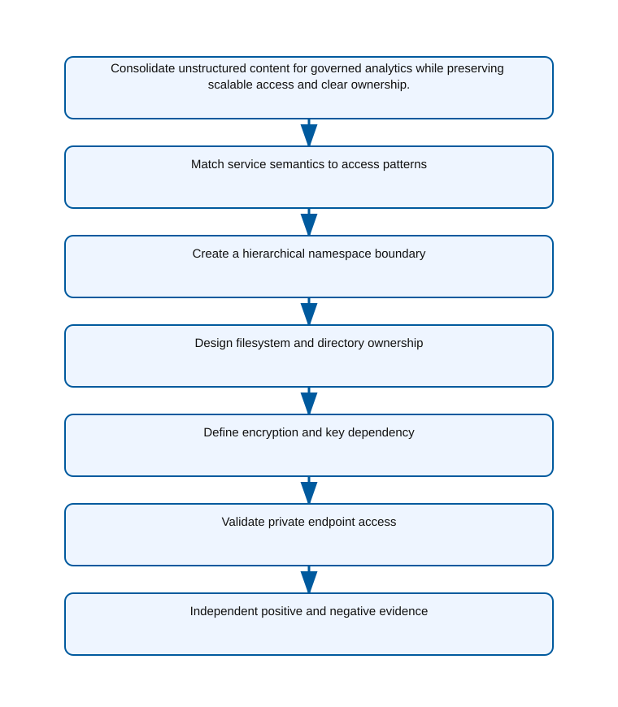

<!-- BEGIN GENERATED AZ305 V1 -->
# LAB-11 — Unstructured Data Platform Selection

## 1. Navigation

[← LAB-10](../10-semi-structured-data-design/README.md) · [Lab catalog](../README.md) · [LAB-12 →](../12-storage-economics-durability/README.md)

## 2. Scenario and completion contract

Wide World Importers is consolidating product images, supplier documents, analytics landing files, and a small set of shared departmental documents. The data varies from kilobytes to multi-gigabyte objects, analytics jobs need directory-like organization and fine-grained access, and no requirement calls for SMB semantics on the primary corpus. Teams disagree between flat Blob Storage, Azure Data Lake Storage Gen2, and Azure Files. As the unstructured-data architect, select the service, namespace, authorization, encryption, and private connectivity model. Keep lifecycle economics and detailed durability choices in Lab 12, and do not treat a hierarchical namespace as a substitute for sound partitioning or ownership boundaries.

- Architect role: Unstructured data platform architect
- Outcome: A secure ADLS Gen2 landing-zone design with deliberate namespace, access, encryption, and network boundaries.
- Duration: 155 minutes
- Difficulty: advanced
- Cost class: moderate
- Completion: all five checkpoint assertions, final validation, decision revision, and cleanup review are complete.

## 3. Objective-to-evidence map

| Objective | Requirement | Checkpoint |
| --- | --- | --- |
| `DATA-NONREL-02` | `LAB11-REQ-01` | [`LAB11-CP01`](#checkpoint-1) |
| `DATA-NONREL-02` | `LAB11-REQ-02` | [`LAB11-CP02`](#checkpoint-2) |
| `DATA-NONREL-02` | `LAB11-REQ-03` | [`LAB11-CP03`](#checkpoint-3) |
| `DATA-NONREL-02` | `LAB11-REQ-04` | [`LAB11-CP04`](#checkpoint-4) |
| `DATA-NONREL-02` | `LAB11-REQ-05` | [`LAB11-CP05`](#checkpoint-5) |

## 4. Business and quality requirements

Business outcome: Consolidate unstructured content for governed analytics while preserving scalable access and clear ownership.

- `LAB11-REQ-01` — Object scale, analytics engines, directory operations, and access patterns justify StorageV2 with hierarchical namespace.
- `LAB11-REQ-02` — The account has hierarchical namespace, blocked public blob access, current TLS minimum, and run ownership tags.
- `LAB11-REQ-03` — Filesystems represent durable data-product boundaries and directories have group-owned default and access ACLs.
- `LAB11-REQ-04` — Service encryption is enabled and any customer-managed-key choice includes managed identity, vault, rotation, and availability ownership.
- `LAB11-REQ-05` — The dfs private endpoint is approved, private DNS resolves correctly, and the default network action is deny.

Scenario facts:

- **Data:** Analytics objects and collaborative legal documents have different protocols, namespace semantics, ACLs, and lifecycle owners.
- **Scale:** Object ingestion grows independently from legal share usage; exact terabytes, file counts, and operation rates remain measured inputs.
- **Latency:** Analytics favors throughput and parallel scans, while interactive SMB users require responsive metadata and locking operations.
- **Availability:** Redundancy and recovery are selected separately for lake data and legal shares based on their business impact.
- **RTO:** Service restoration targets are owner decisions per boundary; a single combined storage RTO would hide differing needs.
- **RPO:** Lake ingestion replay and file-share snapshots provide distinct recovery points and must be validated independently.
- **Budget:** Object storage tiers optimize analytical retention while Azure Files cost is limited to content that needs SMB semantics.

Constraints:

- Analytics content must remain object-native with hierarchical namespace and governed ownership.
- Legal collaboration requires native SMB locking and Windows ACL behavior without converting the analytics lake into a file share.
- Use only the Azure PowerShell command lane for learner implementation.
- Keep all live changes behind explicit execution and acknowledgement switches.
- Retain only sanitized command evidence and synthetic fixture identifiers.

Assumptions:

- Data producers can classify objects and collaborative documents before ingestion.
- Private DNS and network paths can reach both storage service endpoints from authorized clients.
- West Europe is the configurable primary example and North Europe is the configurable secondary example.
- The learner has administrator-level Azure operations knowledge but receives no pre-existing authenticated context.
- Offline fixtures demonstrate contract behavior rather than live Azure service behavior.

## 5. Architecture diagram and walkthrough



The flow begins with the business outcome, crosses five independently validated design capabilities, and ends with positive and negative evidence. The SVG is deterministically rendered from `diagrams/architecture.mmd`.

## 6. Concept primer and candidate architectures

Architecture decisions translate measurable requirements into a deliberate service and operating model. A candidate is viable only when every mandatory constraint is met; convenience or familiarity cannot compensate for a disqualifier.

- **ADLS Gen2 on a hierarchical-namespace StorageV2 account** (eligible) — ADLS Gen2 provides object-scale analytics, directory-aware ACLs, and integration with the governed data pipeline.
- **Flat Azure Blob Storage containers with prefix conventions** (eligible) — Flat blobs are economical for objects, but prefix conventions do not provide the same directory operations and ACL model.
- **Azure Files shares mounted by analytics and document clients** (eligible) — Azure Files supplies SMB behavior for legal users, yet mounting all analytics through file semantics limits object-native processing.
- **One unmanaged file server for lake ingestion and legal collaboration** (ineligible) — A conventional server supports SMB but creates a capacity ceiling and no native object analytics boundary. Disqualifier: LAB11-REQ-01 requires storage service semantics to match object-native analytics engines and access patterns.

## 7. Decision, ADR, and Well-Architected review

Criteria weights are C1 30, C2 25, C3 20, C4 15, and C5 10. Weighted totals use `sum(weight × score) / 5`.

| Candidate | Eligible | C1 | C2 | C3 | C4 | C5 | Weighted /100 |
| --- | ---: | ---: | ---: | ---: | ---: | ---: | ---: |
| ADLS Gen2 on a hierarchical-namespace StorageV2 account | yes | 5 | 4 | 5 | 4 | 5 | 92 |
| Flat Azure Blob Storage containers with prefix conventions | yes | 3 | 4 | 3 | 3 | 5 | 69 |
| Azure Files shares mounted by analytics and document clients | yes | 3 | 4 | 4 | 3 | 2 | 67 |
| One unmanaged file server for lake ingestion and legal collaboration | no | 1 | 2 | 2 | 2 | 3 | 36 |

Selected design: **ADLS Gen2 on a hierarchical-namespace StorageV2 account**. `ADR-LAB11-001` records the accepted reasoning. Review Reliability, Security, Cost Optimization, Operational Excellence, and Performance Efficiency in `design/decision.yml`; no pillar is implied by another.

Rejected alternatives:

- **Flat Azure Blob Storage containers with prefix conventions:** It weakens analytics namespace governance without solving the legal SMB requirement.
- **Azure Files shares mounted by analytics and document clients:** A universal share imposes the wrong access pattern and cost model on the analytics estate.
- **One unmanaged file server for lake ingestion and legal collaboration:** It is ineligible because the analytics access and scale requirements cannot be met.

Architecture risks:

- **Risk:** Users can copy regulated legal documents into the analytics lake and bypass share controls. **Mitigation:** Classify ingress, deny unapproved paths, and reconcile file manifests across the two ownership boundaries.
- **Risk:** Private endpoint or DNS configuration can work for Blob while failing for File. **Mitigation:** Validate each service subresource and protocol independently from every authorized network zone.

Well-Architected consequences:

- **Reliability:** Independent redundancy, snapshots, and replay paths match the failure behavior of lake objects and collaborative files.
- **Security:** ACLs, service-specific private endpoints, and classified ingress keep legal and analytics data in distinct trust boundaries.
- **Cost Optimization:** SMB-priced capacity is reserved for collaboration and lower-cost object tiers serve analytics retention.
- **Operational Excellence:** Separate owners, inventories, lifecycle rules, and restore assertions prevent protocol ambiguity.
- **Performance Efficiency:** Object-native parallelism serves analytics while Azure Files supplies locking and metadata behavior for users.

ADR consequences:

- Legal collaboration becomes a separate Azure Files service boundary instead of a directory inside the data lake.
- Pipelines need an approved transfer process when legal content is intentionally published for analytics.

## 8. Inputs, permissions, licensing, cost, and analogue

Use configurable `Location` (`AZ305_LOCATION`, default West Europe) and `SecondaryLocation` (`AZ305_SECONDARY_LOCATION`, default North Europe). Every public input has an explicit `AZ305_*` fallback. Preview is the default; only Golden Lab 00 writes an intent-only `execute: false` preview record. Before an executed cloud command, the supplied subscription and tenant must exactly match the active CLI, Az, and—where applicable—Microsoft Graph contexts. `-Execute` crosses the execution boundary; cost-bearing and tenant-scoped paths also require their independent acknowledgement switches.

Safe analogue: The reference topology is deployable at bounded scope; preview remains the default and live verification is separate.

Permissions: Storage account and data-plane read roles support discovery; account, filesystem, share, ACL, network, or lifecycle changes need separately approved rights.

Licensing: ADLS Gen2 transactions, Azure Files provisioned or used capacity, redundancy, snapshots, and private connectivity use different meters.

Cost boundary: Separate object-ingestion, analytics scan, namespace operation, SMB share, snapshot, egress, and retained-capacity costs.

## 9. Read-only preflight

```powershell
pwsh ./scripts/azure-powershell/Preflight.ps1 -RunId synthetic-110001
```

Synthetic sample: `{"labId":"LAB-11","track":"azure-powershell","result":"pass","note":"Local tool discovery only"}`. This is illustrative local output, not evidence captured from Azure.

## 10. Five guided checkpoints

### Checkpoint 1: Match service semantics to access patterns

<a id="checkpoint-1"></a>

**Trace:** `DATA-NONREL-02` → `LAB11-REQ-01` → `LAB11-CP01`

```powershell
Get-AzStorageAccountNameAvailability -Name $StorageAccountName
```

Expected evidence: Object scale, analytics engines, directory operations, and access patterns justify StorageV2 with hierarchical namespace. Retain Data classes, object-size distribution, protocol needs, namespace choice, and service-fit matrix.

Positive assertion:

```powershell
Get-AzStorageAccount -ResourceGroupName $ResourceGroup -Name $StorageAccountName | Select-Object StorageAccountName,Kind,PrimaryLocation,EnableHierarchicalNamespace
```

Negative assertion:

```powershell
Get-AzStorageAccount -ResourceGroupName $ResourceGroup -Name $StorageAccountName | Where-Object { $_.Kind -ne 'StorageV2' -or -not $_.EnableHierarchicalNamespace }
```

Failure and retry: A consumer has a mandatory SMB or NFS behavior not supported by the selected endpoint design. Isolate that data class and evaluate Azure Files rather than forcing one service across incompatible protocols.

Cleanup dependency: This selection checkpoint is read-only; subsequent cleanup follows filesystem-to-account order.

WAF consequence: Performance Efficiency: hierarchical namespace semantics align directory operations with analytics access patterns.

### Checkpoint 2: Create a hierarchical namespace boundary

<a id="checkpoint-2"></a>

**Trace:** `DATA-NONREL-02` → `LAB11-REQ-02` → `LAB11-CP02`

```powershell
New-AzStorageAccount -ResourceGroupName $ResourceGroup -Name $StorageAccountName -Location $Location -SkuName Standard_ZRS -Kind StorageV2 -EnableHierarchicalNamespace $true -MinimumTlsVersion TLS1_2 -AllowBlobPublicAccess $false -Tag @{purpose='az305-lab';labId='LAB-11';runId=$RunId;expiresOn=$ExpiresOn}
```

Expected evidence: The account has hierarchical namespace, blocked public blob access, current TLS minimum, and run ownership tags. Retain Account name, kind, namespace state, TLS version, public-access state, SKU, and ownership tags.

Positive assertion:

```powershell
Get-AzStorageAccount -ResourceGroupName $ResourceGroup -Name $StorageAccountName | Where-Object { $_.EnableHierarchicalNamespace -and -not $_.AllowBlobPublicAccess }
```

Negative assertion:

```powershell
Get-AzStorageAccount -ResourceGroupName $ResourceGroup -Name $StorageAccountName | Where-Object { $_.MinimumTlsVersion -ne 'TLS1_2' -or $_.AllowSharedKeyAccess }
```

Failure and retry: Hierarchical namespace cannot be enabled after an incompatible account was already created. Stop before data ingestion, create a correctly designed account, and migrate only synthetic lab data.

Cleanup dependency: Delete run-owned filesystems and private endpoints before deleting the account.

WAF consequence: Reliability: choosing hierarchical namespace before ingestion avoids a disruptive late account migration.

### Checkpoint 3: Design filesystem and directory ownership

<a id="checkpoint-3"></a>

**Trace:** `DATA-NONREL-02` → `LAB11-REQ-03` → `LAB11-CP03`

```powershell
$ownedStorage = Get-AzStorageAccount -ResourceGroupName $ResourceGroup -Name $StorageAccountName; if ($ownedStorage.Id -ine $StorageAccountResourceId) { throw 'The supplied storage account ID is not the exact run-owned account.' }; New-AzStorageContainer -Context $ownedStorage.Context -Name $FileSystemName
```

Expected evidence: Filesystems represent durable data-product boundaries and directories have group-owned default and access ACLs. Retain Synthetic filesystem and path names, owner and group labels, normalized ACL summary, and data-product owner.

Positive assertion:

```powershell
$storageContext = (Get-AzStorageAccount -ResourceGroupName $ResourceGroup -Name $StorageAccountName).Context; Get-AzDataLakeGen2Item -Context $storageContext -FileSystem $FileSystemName -Path $DirectoryPath | Select-Object Path,IsDirectory,Owner,Group,Permissions
```

Negative assertion:

```powershell
$storageContext = (Get-AzStorageAccount -ResourceGroupName $ResourceGroup -Name $StorageAccountName).Context; Get-AzDataLakeGen2ChildItem -Context $storageContext -FileSystem $FileSystemName -Recurse | Where-Object { $_.Permissions -eq 'rwxrwxrwx' }
```

Failure and retry: Azure RBAC grants endpoint access but POSIX ACL traversal denies a child path. Trace execute permission on every parent and apply the minimum group ACL with a corresponding default ACL.

Cleanup dependency: Remove child paths before filesystems and retain no file content as evidence.

WAF consequence: Operational Excellence: data-product filesystem ownership and inherited ACLs create a supportable namespace.

### Checkpoint 4: Define encryption and key dependency

<a id="checkpoint-4"></a>

**Trace:** `DATA-NONREL-02` → `LAB11-REQ-04` → `LAB11-CP04`

```powershell
Get-AzStorageAccount -ResourceGroupName $ResourceGroup -Name $StorageAccountName | Select-Object Encryption,Identity
```

Expected evidence: Service encryption is enabled and any customer-managed-key choice includes managed identity, vault, rotation, and availability ownership. Retain Encryption services, key-source class, identity type, non-secret vault reference, and rotation owner.

Positive assertion:

```powershell
Get-AzStorageAccount -ResourceGroupName $ResourceGroup -Name $StorageAccountName | Where-Object { $_.Encryption.Services.Blob.Enabled }
```

Negative assertion:

```powershell
Get-AzStorageAccount -ResourceGroupName $ResourceGroup -Name $StorageAccountName | Where-Object { $_.Encryption.KeySource -eq 'Microsoft.Keyvault' -and $_.Identity.Type -eq 'None' }
```

Failure and retry: The storage identity lacks key permissions or cannot reach the vault network path. Validate identity, Key Vault RBAC, key state, DNS, and network reachability independently.

Cleanup dependency: Restore the recorded key source before removing any run-owned key association; never purge keys.

WAF consequence: Cost Optimization: customer-managed keys are adopted only when custody requirements justify their lifecycle overhead.

### Checkpoint 5: Validate private endpoint access

<a id="checkpoint-5"></a>

**Trace:** `DATA-NONREL-02` → `LAB11-REQ-05` → `LAB11-CP05`

```powershell
Get-AzPrivateEndpointConnection -PrivateLinkResourceId $StorageAccountResourceId
```

Expected evidence: The dfs private endpoint is approved, private DNS resolves correctly, and the default network action is deny. Retain Endpoint ID, dfs group, approval state, subnet, private DNS label, and network default action.

Positive assertion:

```powershell
Get-AzPrivateEndpointConnection -PrivateLinkResourceId $StorageAccountResourceId | Where-Object { $_.PrivateLinkServiceConnectionState.Status -eq 'Approved' -and $_.GroupId -contains 'dfs' }
```

Negative assertion:

```powershell
Get-AzStorageAccountNetworkRuleSet -ResourceGroupName $ResourceGroup -Name $StorageAccountName | Where-Object { $_.DefaultAction -ne 'Deny' }
```

Failure and retry: Only a blob endpoint exists, so hierarchical namespace operations resolve or authorize inconsistently. Add and validate the dfs private endpoint and DNS zone without opening public access.

Cleanup dependency: Remove private DNS records and endpoints before the account; preserve shared network resources.

WAF consequence: Security: denied public access and explicit dfs connectivity constrain unintended data paths.

## 11. Final validation and interpretation

Run `Validate.ps1 -Mode Deployment -Execute` only after an executed run has state and you are authorized to issue the ten read-only checkpoint inspections. Without `-Execute`, ordinary deployment validation records `partial` and exits `2`; Golden Lab 00 alone can validate its intent-only preview locally. Exit `0` means all required assertions pass, `1` means at least one failed, and `2` means the outcome is gated or partial. Positive and negative commands execute independently, so one failure never suppresses its paired assertion.

## 12. Material change request

The legal department introduces collaborative document shares that require native SMB locking and Windows ACL behavior, but analytics ingestion must remain object-native; revise the service boundaries.

Revised solution: select **ADLS Gen2 on a hierarchical-namespace StorageV2 account**. LAB11-REQ-01 requires service semantics to match access patterns, so ADLS remains the object-analytics decision and Azure Files is added only for native SMB legal collaboration.

Revised Well-Architected consequences:

- **Reliability:** Each service uses recovery controls suited to its protocol and business owner.
- **Security:** Transfers between legal shares and the lake become explicit classified operations.
- **Cost Optimization:** File-service charges apply only to documents that need SMB semantics.
- **Operational Excellence:** Separate inventories and restore tests remove ambiguity about ownership and recovery.
- **Performance Efficiency:** Analytics avoids SMB overhead and legal users retain native locking behavior.

## 13. Architect job challenge

Design a dual-service pattern that avoids synchronizing every object while preserving classification and authoritative ownership.

## 14. Troubleshooting, cleanup, and residual verification

- Distinguish Blob and dfs private endpoints when hierarchical namespace operations fail.
- Trace Azure RBAC and every parent-directory ACL independently for authorization failures.
- Re-evaluate Azure Files only for workloads with true file-protocol semantics, not familiar folder terminology.

Cleanup previews nonempty state in reverse dependency order, writes `partial`, and exits `2`; an already empty run is completed locally and idempotently. Executed cleanup rechecks the exact live ID plus `purpose`, `labId`, `runId`, and `expiresOn` immediately before each removal, persists state after every absent or removed object, stops on the first dependency failure, and refuses unresolved pre-existing settings. It never automates purge. Finish with `Validate.ps1 -Mode PostCleanup`; the required residual count is zero.

## 15. Exam debrief, assessment, sources, and navigation

Explain the recommendation in terms of requirements, rejected alternatives, failure behavior, and all five WAF pillars. Complete `assessment/QUESTIONS.md`, then use the separately excluded answer key for remediation.

- [Introduction to Azure Data Lake Storage](https://learn.microsoft.com/en-us/azure/storage/blobs/data-lake-storage-introduction)
- [Azure Well-Architected Framework](https://learn.microsoft.com/en-us/azure/well-architected/)

[← LAB-10](../10-semi-structured-data-design/README.md) · [Lab catalog](../README.md) · [LAB-12 →](../12-storage-economics-durability/README.md)

## 16. Synchronized lifecycle-script appendix

### Preflight.ps1

```powershell
[CmdletBinding()]
param(
    [string]$SubscriptionId = $env:AZ305_SUBSCRIPTION_ID,
    [string]$TenantId = $env:AZ305_TENANT_ID,
    [ValidatePattern('^[a-z0-9-]{6,64}$')][string]$RunId = $env:AZ305_RUN_ID,
    [string]$Location = $(if ($env:AZ305_LOCATION) { $env:AZ305_LOCATION } else { 'westeurope' }),
    [string]$SecondaryLocation = $(if ($env:AZ305_SECONDARY_LOCATION) { $env:AZ305_SECONDARY_LOCATION } else { 'northeurope' }),
    [string]$ResourceGroup = $(if ($env:AZ305_RESOURCE_GROUP) { $env:AZ305_RESOURCE_GROUP } else { "rg-az305-$RunId" }),
    [string]$WorkloadName = $(if ($env:AZ305_WORKLOAD_NAME) { $env:AZ305_WORKLOAD_NAME } else { "az305-$RunId" }),
    [string]$ExpiresOn = $(if ($env:AZ305_EXPIRES_ON) { $env:AZ305_EXPIRES_ON } else { (Get-Date).ToUniversalTime().AddDays(1).ToString('yyyy-MM-dd') }),
    [string]$DirectoryPath = $env:AZ305_DIRECTORY_PATH,
    [string]$FileSystemName = $env:AZ305_FILE_SYSTEM_NAME,
    [string]$StorageAccountName = $env:AZ305_STORAGE_ACCOUNT_NAME,
    [string]$StorageAccountResourceId = $env:AZ305_STORAGE_ACCOUNT_RESOURCE_ID,
    [switch]$Execute,
    [switch]$AcknowledgeCost,
    [switch]$AcknowledgeTenantChange
)

$ErrorActionPreference = 'Stop'
$PSNativeCommandUseErrorActionPreference = $true
if (-not $RunId) { [Console]::Error.WriteLine('RunId or AZ305_RUN_ID is required.'); exit 2 }
# Every lifecycle entrypoint intentionally exposes the same public parameter contract.
@($SubscriptionId, $TenantId, $RunId, $Location, $SecondaryLocation, $ResourceGroup, $WorkloadName, $ExpiresOn, $DirectoryPath, $FileSystemName, $StorageAccountName, $StorageAccountResourceId, $Execute, $AcknowledgeCost, $AcknowledgeTenantChange) | Out-Null

$requiredCommands = @('pwsh')
$missing = @($requiredCommands | Where-Object { -not (Get-Command $_ -ErrorAction SilentlyContinue) })
if ($missing.Count -gt 0) {
    Write-Error "Missing local commands: $($missing -join ', ')"
    exit 1
}
$requiredCmdlets = @('Get-AzDataLakeGen2ChildItem', 'Get-AzDataLakeGen2Item', 'Get-AzPrivateEndpointConnection', 'Get-AzStorageAccount', 'Get-AzStorageAccountNameAvailability', 'Get-AzStorageAccountNetworkRuleSet', 'New-AzStorageAccount', 'New-AzStorageContainer')
$missingCmdlets = @($requiredCmdlets | Where-Object { -not (Get-Command $_ -ErrorAction SilentlyContinue) })
if ($missingCmdlets.Count -gt 0) {
    Write-Error "Missing local cmdlets: $($missingCmdlets -join ', ')"
    exit 1
}

[pscustomobject]@{
    labId = 'LAB-11'
    track = 'azure-powershell'
    implementationMode = 'reference-deployable'
    result = 'pass'
    note = 'Local tool discovery only; no Azure or Microsoft Graph request was made.'
} | ConvertTo-Json
exit 0
```

### Setup.ps1

```powershell
[CmdletBinding()]
param(
    [string]$SubscriptionId = $env:AZ305_SUBSCRIPTION_ID,
    [string]$TenantId = $env:AZ305_TENANT_ID,
    [ValidatePattern('^[a-z0-9-]{6,64}$')][string]$RunId = $env:AZ305_RUN_ID,
    [string]$Location = $(if ($env:AZ305_LOCATION) { $env:AZ305_LOCATION } else { 'westeurope' }),
    [string]$SecondaryLocation = $(if ($env:AZ305_SECONDARY_LOCATION) { $env:AZ305_SECONDARY_LOCATION } else { 'northeurope' }),
    [string]$ResourceGroup = $(if ($env:AZ305_RESOURCE_GROUP) { $env:AZ305_RESOURCE_GROUP } else { "rg-az305-$RunId" }),
    [string]$WorkloadName = $(if ($env:AZ305_WORKLOAD_NAME) { $env:AZ305_WORKLOAD_NAME } else { "az305-$RunId" }),
    [string]$ExpiresOn = $(if ($env:AZ305_EXPIRES_ON) { $env:AZ305_EXPIRES_ON } else { (Get-Date).ToUniversalTime().AddDays(1).ToString('yyyy-MM-dd') }),
    [string]$DirectoryPath = $env:AZ305_DIRECTORY_PATH,
    [string]$FileSystemName = $env:AZ305_FILE_SYSTEM_NAME,
    [string]$StorageAccountName = $env:AZ305_STORAGE_ACCOUNT_NAME,
    [string]$StorageAccountResourceId = $env:AZ305_STORAGE_ACCOUNT_RESOURCE_ID,
    [switch]$Execute,
    [switch]$AcknowledgeCost,
    [switch]$AcknowledgeTenantChange
)

$ErrorActionPreference = 'Stop'
$PSNativeCommandUseErrorActionPreference = $true
if (-not $RunId) { [Console]::Error.WriteLine('RunId or AZ305_RUN_ID is required.'); exit 2 }
# Every lifecycle entrypoint intentionally exposes the same public parameter contract.
@($SubscriptionId, $TenantId, $RunId, $Location, $SecondaryLocation, $ResourceGroup, $WorkloadName, $ExpiresOn, $DirectoryPath, $FileSystemName, $StorageAccountName, $StorageAccountResourceId, $Execute, $AcknowledgeCost, $AcknowledgeTenantChange) | Out-Null

$LabRoot = Split-Path (Split-Path $PSScriptRoot -Parent) -Parent
$StateRoot = Join-Path $LabRoot ".state/$RunId"
$StatePath = Join-Path $StateRoot 'run.json'

function Assert-ExactExecutionContext {
    [CmdletBinding()]
    param([string]$ExpectedSubscriptionId, [string]$ExpectedTenantId)
    if ([string]::IsNullOrWhiteSpace($ExpectedSubscriptionId) -or [string]::IsNullOrWhiteSpace($ExpectedTenantId)) { throw 'SubscriptionId and TenantId are required before an Azure request.' }
    $azContext = Get-AzContext -ErrorAction Stop
    if (-not $azContext -or [string]$azContext.Subscription.Id -ine $ExpectedSubscriptionId -or [string]$azContext.Tenant.Id -ine $ExpectedTenantId) {
        throw 'The active Azure PowerShell subscription or tenant does not exactly match the requested context.'
    }
}

function Save-RunState {
    [CmdletBinding()]
    param([Parameter(Mandatory)]$State)
    $temporaryPath = "$StatePath.tmp"
    $State | ConvertTo-Json -Depth 20 | Set-Content -LiteralPath $temporaryPath -Encoding utf8NoBOM
    Move-Item -LiteralPath $temporaryPath -Destination $StatePath -Force
}

function Assert-SafeStateValue {
    [CmdletBinding()]
    param($Value)
    $serialized = $Value | ConvertTo-Json -Depth 12 -Compress
    if ($serialized -match '(?i)"(?:token|password|secret|certificate|connectionString|sas|clientSecret|accessToken|refreshToken|accountKey|privateKey)"\s*:') {
        throw 'A prohibited sensitive field name was returned; state capture is refused.'
    }
}

function Convert-CheckpointOutput {
    [CmdletBinding()]
    param($Value)
    if ($Value -is [string]) { $raw = [string]$Value }
    elseif ($Value -is [System.Collections.IEnumerable] -and @($Value | Where-Object { $_ -isnot [string] }).Count -eq 0) { $raw = @($Value) -join "`n" }
    else { return $Value }
    if ([string]::IsNullOrWhiteSpace($raw)) { return $null }
    try { return ($raw | ConvertFrom-Json -Depth 100) } catch { return $Value }
}

function Get-ReturnedResourceId {
    [CmdletBinding()]
    param($Value)
    $seen = [System.Collections.Generic.HashSet[string]]::new([System.StringComparer]::OrdinalIgnoreCase)
    $results = [System.Collections.Generic.List[string]]::new()
    function Add-ArmId {
        param($Candidate)
        if ($Candidate -is [string] -and $Candidate -match '^/subscriptions/[0-9a-f-]+/(?:resourceGroups/[^/]+(?:/providers/.+)?|providers/.+)$' -and $Candidate -notmatch '/providers/Microsoft\.Resources/deployments/') {
            if ($seen.Add($Candidate)) { $results.Add($Candidate) }
        }
    }
    function Find-DeploymentOutputId {
        param($Item, [int]$Depth)
        if ($null -eq $Item -or $Depth -gt 12) { return }
        if ($Item -is [string]) { Add-ArmId -Candidate $Item; return }
        if ($Item -is [System.Collections.IDictionary]) { foreach ($key in $Item.Keys) { Find-DeploymentOutputId -Item $Item[$key] -Depth ($Depth + 1) }; return }
        if ($Item -is [System.Collections.IEnumerable]) { foreach ($entry in $Item) { Find-DeploymentOutputId -Item $entry -Depth ($Depth + 1) }; return }
        foreach ($property in @($Item.PSObject.Properties | Where-Object { $_.MemberType -in @('NoteProperty', 'Property') })) { Find-DeploymentOutputId -Item $property.Value -Depth ($Depth + 1) }
    }
    foreach ($rootItem in @($Value)) {
        if ($rootItem -is [System.Collections.IDictionary]) {
            foreach ($name in @('id', 'resourceId')) { if ($rootItem.Contains($name)) { Add-ArmId -Candidate $rootItem[$name] } }
            if ($rootItem.Contains('properties') -and $rootItem.properties -and $rootItem.properties.outputs) { Find-DeploymentOutputId -Item $rootItem.properties.outputs -Depth 0 }
            continue
        }
        foreach ($name in @('Id', 'ResourceId')) {
            $property = $rootItem.PSObject.Properties[$name]
            if ($property) { Add-ArmId -Candidate $property.Value }
        }
        if ($rootItem.PSObject.Properties['Properties'] -and $rootItem.Properties -and $rootItem.Properties.outputs) {
            Find-DeploymentOutputId -Item $rootItem.Properties.outputs -Depth 0
        }
    }
    return @($results)
}

function Get-PlannedDeploymentResourceId {
    [CmdletBinding()]
    param($Value)
    $seen = [System.Collections.Generic.HashSet[string]]::new([System.StringComparer]::OrdinalIgnoreCase)
    $results = [System.Collections.Generic.List[string]]::new()
    foreach ($change in @($Value.changes)) {
        $candidate = [string]$change.resourceId
        if ($candidate -match '^/subscriptions/[0-9a-f-]+/(?:resourceGroups/[^/]+(?:/providers/.+)?|providers/.+)$' -and $candidate -notmatch '/providers/Microsoft\.Resources/deployments/' -and $seen.Add($candidate)) {
            $results.Add($candidate)
        }
    }
    return @($results)
}

function Assert-InputSubscriptionScope {
    [CmdletBinding()]
    param($Inputs, [string]$ExpectedSubscriptionId)
    $entries = if ($Inputs -is [System.Collections.IDictionary]) {
        @($Inputs.GetEnumerator())
    } else {
        @($Inputs.PSObject.Properties | ForEach-Object { [pscustomobject]@{ Key = $_.Name; Value = $_.Value } })
    }
    foreach ($entry in $entries) {
        if ($entry.Value -is [string] -and [string]$entry.Value -match '^/subscriptions/([^/]+)/') {
            if ($Matches[1] -ine $ExpectedSubscriptionId) { throw "Input $($entry.Key) belongs to a different subscription." }
        }
    }
}

function Assert-ManagedMutation {
    [CmdletBinding()]
    param($State, [string]$CheckpointId, [bool]$CarriesOwnership, [object[]]$TargetResourceIds)
    if ($CarriesOwnership) { return }
    $targets = @($TargetResourceIds | Where-Object { $_ -is [string] -and $_ -match '^/subscriptions/' })
    if ($targets.Count -eq 0) { throw "$CheckpointId refuses an untagged mutation because no exact ARM target ID was supplied." }
    $knownIds = @($State.managedObjects | ForEach-Object { [string]$_.id })
    if ($knownIds.Count -eq 0) { throw "$CheckpointId refuses to modify a pre-existing object because no run-owned parent has been recorded." }
    foreach ($target in $targets) {
        $related = @($knownIds | Where-Object { $target -ieq $_ -or $target.StartsWith("$_/", [System.StringComparison]::OrdinalIgnoreCase) -or $_.StartsWith("$target/", [System.StringComparison]::OrdinalIgnoreCase) }).Count -gt 0
        if (-not $related) { throw "$CheckpointId refuses a mutation outside the exact run-owned resource boundary." }
    }
}

$executionInputs = [ordered]@{ subscriptionId = $SubscriptionId; tenantId = $TenantId; location = $Location; secondaryLocation = $SecondaryLocation; resourceGroup = $ResourceGroup; workloadName = $WorkloadName; expiresOn = $ExpiresOn; DirectoryPath = $DirectoryPath; FileSystemName = $FileSystemName; StorageAccountName = $StorageAccountName; StorageAccountResourceId = $StorageAccountResourceId }

if (-not $Execute) {
    Write-Output '[preview] No cloud command was called and no state was created.'
    Write-Output '[preview] Re-run with -Execute only in an authorized disposable environment.'
    exit 0
}
# This setup is compatible with the lab implementation mode.
if (-not $AcknowledgeCost) { [Console]::Error.WriteLine('Cost acknowledgement is required.'); exit 2 }
# This lab does not perform a tenant-scoped change by default.
$requiredLabInputs = [ordered]@{ FileSystemName = $FileSystemName; StorageAccountName = $StorageAccountName; StorageAccountResourceId = $StorageAccountResourceId }
$missingLabInputs = @($requiredLabInputs.GetEnumerator() | Where-Object { $_.Value -is [string] -and [string]::IsNullOrWhiteSpace([string]$_.Value) } | ForEach-Object Key)
if ($missingLabInputs.Count -gt 0) { [Console]::Error.WriteLine("Execution is gated; supply: $($missingLabInputs -join ', ')."); exit 2 }

try {
    Assert-ExactExecutionContext -ExpectedSubscriptionId $SubscriptionId -ExpectedTenantId $TenantId
    Assert-InputSubscriptionScope -Inputs $executionInputs -ExpectedSubscriptionId $SubscriptionId
    Assert-SafeStateValue -Value $executionInputs
}
catch {
    [Console]::Error.WriteLine("Execution is gated by context or input validation: $($_.Exception.Message)")
    exit 2
}

# Recovery state is persisted before the first possible mutation below.
if (Test-Path -LiteralPath $StatePath) {
    [Console]::Error.WriteLine('Run state already exists. Choose a new RunId or complete the recorded cleanup; existing recovery state will not be overwritten.')
    exit 2
}
New-Item -ItemType Directory -Path $StateRoot -Force | Out-Null
$state = [ordered]@{
    schemaVersion = '1.0.0'; labId = 'LAB-11'; runId = $RunId; track = 'azure-powershell'
    implementationMode = 'reference-deployable'; status = 'initialized'
    createdAt = (Get-Date).ToUniversalTime().ToString('o'); execute = $true
    parameters = $executionInputs
    managedObjects = @(); originalSettings = @()
}
Save-RunState -State $state
$state.status = 'deploying'
Save-RunState -State $state

$originalLocation = Get-Location
try {
    Set-Location -LiteralPath $LabRoot
    # 11-CP01: Match service semantics to access patterns
    $stepResult = & { Get-AzStorageAccountNameAvailability -Name $StorageAccountName }
    $null = $stepResult

    # 11-CP02: Create a hierarchical namespace boundary
    Assert-ManagedMutation -State $state -CheckpointId 'LAB11-CP02' -CarriesOwnership:$true -TargetResourceIds @()
    $stepResult = & { New-AzStorageAccount -ResourceGroupName $ResourceGroup -Name $StorageAccountName -Location $Location -SkuName Standard_ZRS -Kind StorageV2 -EnableHierarchicalNamespace $true -MinimumTlsVersion TLS1_2 -AllowBlobPublicAccess $false -Tag @{purpose='az305-lab';labId='LAB-11';runId=$RunId;expiresOn=$ExpiresOn} }
    $candidate = Convert-CheckpointOutput -Value $stepResult
    $returnedIds = @(Get-ReturnedResourceId -Value $candidate)
    if ($returnedIds.Count -eq 0) { throw 'LAB11-CP02 created an owned resource but returned no recoverable ARM resource ID.' }
    foreach ($returnedId in $returnedIds) {
        if ($returnedId -notmatch '^/subscriptions/([^/]+)/' -or $Matches[1] -ine $SubscriptionId) { throw 'A returned recovery ID belongs to a different subscription.' }
        if (@($state.managedObjects | Where-Object { $_.id -ieq $returnedId }).Count -eq 0) {
            $state.managedObjects += [pscustomobject]@{
                id = $returnedId
                type = 'azure-resource'
                tags = [ordered]@{ purpose = 'az305-lab'; labId = 'LAB-11'; runId = $RunId; expiresOn = $ExpiresOn }
            }
            Save-RunState -State $state
        }
    }
    $null = $stepResult

    # 11-CP03: Design filesystem and directory ownership
    Assert-ManagedMutation -State $state -CheckpointId 'LAB11-CP03' -CarriesOwnership:$false -TargetResourceIds @($StorageAccountResourceId)
    $stepResult = & { $ownedStorage = Get-AzStorageAccount -ResourceGroupName $ResourceGroup -Name $StorageAccountName; if ($ownedStorage.Id -ine $StorageAccountResourceId) { throw 'The supplied storage account ID is not the exact run-owned account.' }; New-AzStorageContainer -Context $ownedStorage.Context -Name $FileSystemName }
    $null = $stepResult

    # 11-CP04: Define encryption and key dependency
    $stepResult = & { Get-AzStorageAccount -ResourceGroupName $ResourceGroup -Name $StorageAccountName | Select-Object Encryption,Identity }
    $null = $stepResult

    # 11-CP05: Validate private endpoint access
    $stepResult = & { Get-AzPrivateEndpointConnection -PrivateLinkResourceId $StorageAccountResourceId }
    $null = $stepResult

    $state.status = 'deployed'
    Save-RunState -State $state
} catch {
    $state.status = 'failed'
    Save-RunState -State $state
    Write-Error $_
    exit 1
} finally {
    Set-Location -LiteralPath $originalLocation
}
exit 0
```

### Validate.ps1

```powershell
[CmdletBinding()]
param(
    [string]$SubscriptionId = $env:AZ305_SUBSCRIPTION_ID,
    [string]$TenantId = $env:AZ305_TENANT_ID,
    [ValidatePattern('^[a-z0-9-]{6,64}$')][string]$RunId = $env:AZ305_RUN_ID,
    [string]$Location = $(if ($env:AZ305_LOCATION) { $env:AZ305_LOCATION } else { 'westeurope' }),
    [string]$SecondaryLocation = $(if ($env:AZ305_SECONDARY_LOCATION) { $env:AZ305_SECONDARY_LOCATION } else { 'northeurope' }),
    [string]$ResourceGroup = $(if ($env:AZ305_RESOURCE_GROUP) { $env:AZ305_RESOURCE_GROUP } else { "rg-az305-$RunId" }),
    [string]$WorkloadName = $(if ($env:AZ305_WORKLOAD_NAME) { $env:AZ305_WORKLOAD_NAME } else { "az305-$RunId" }),
    [string]$ExpiresOn = $(if ($env:AZ305_EXPIRES_ON) { $env:AZ305_EXPIRES_ON } else { (Get-Date).ToUniversalTime().AddDays(1).ToString('yyyy-MM-dd') }),
    [string]$DirectoryPath = $env:AZ305_DIRECTORY_PATH,
    [string]$FileSystemName = $env:AZ305_FILE_SYSTEM_NAME,
    [string]$StorageAccountName = $env:AZ305_STORAGE_ACCOUNT_NAME,
    [string]$StorageAccountResourceId = $env:AZ305_STORAGE_ACCOUNT_RESOURCE_ID,
    [ValidateSet('Deployment', 'PostCleanup')][string]$Mode = 'Deployment',
    [switch]$Execute,
    [switch]$AcknowledgeCost,
    [switch]$AcknowledgeTenantChange
)

$ErrorActionPreference = 'Stop'
$PSNativeCommandUseErrorActionPreference = $true
if (-not $RunId) { [Console]::Error.WriteLine('RunId or AZ305_RUN_ID is required.'); exit 2 }
# Every lifecycle entrypoint intentionally exposes the same public parameter contract.
@($SubscriptionId, $TenantId, $RunId, $Location, $SecondaryLocation, $ResourceGroup, $WorkloadName, $ExpiresOn, $DirectoryPath, $FileSystemName, $StorageAccountName, $StorageAccountResourceId, $Mode, $Execute, $AcknowledgeCost, $AcknowledgeTenantChange) | Out-Null

$LabRoot = Split-Path (Split-Path $PSScriptRoot -Parent) -Parent
$StateRoot = Join-Path $LabRoot ".state/$RunId"
$RunPath = Join-Path $StateRoot 'run.json'
$ValidationPath = Join-Path $StateRoot 'validation.json'

function Assert-ExactExecutionContext {
    [CmdletBinding()]
    param([string]$ExpectedSubscriptionId, [string]$ExpectedTenantId)
    if ([string]::IsNullOrWhiteSpace($ExpectedSubscriptionId) -or [string]::IsNullOrWhiteSpace($ExpectedTenantId)) { throw 'SubscriptionId and TenantId are required before an Azure request.' }
    $azContext = Get-AzContext -ErrorAction Stop
    if (-not $azContext -or [string]$azContext.Subscription.Id -ine $ExpectedSubscriptionId -or [string]$azContext.Tenant.Id -ine $ExpectedTenantId) {
        throw 'The active Azure PowerShell subscription or tenant does not exactly match the requested context.'
    }
}


if (-not (Test-Path -LiteralPath $RunPath)) {
    Write-Warning 'No run state exists; validation is gated.'
    exit 2
}
$state = Get-Content -LiteralPath $RunPath -Raw | ConvertFrom-Json
$assertions = [System.Collections.Generic.List[object]]::new()
function Add-ValidationAssertion {
    [CmdletBinding()]
    param([string]$Id, [ValidateSet('positive', 'negative')][string]$Kind, [bool]$Passed, [string]$Message)
    $assertions.Add([pscustomobject]@{ id = $Id; kind = $Kind; passed = $Passed; message = $Message })
}

function Save-ValidationArtifact {
    [CmdletBinding()]
    param([ValidateSet('pass', 'partial', 'fail')][string]$Result)
    $artifact = [ordered]@{ schemaVersion = '1.0.0'; labId = 'LAB-11'; runId = $RunId; mode = $Mode; result = $Result; validatedAt = (Get-Date).ToUniversalTime().ToString('o'); assertions = @($assertions) }
    $artifact | ConvertTo-Json -Depth 12 | Set-Content -LiteralPath $ValidationPath -Encoding utf8NoBOM
}

function Test-PositiveEvidence {
    [CmdletBinding()]
    param($Value)
    if ($Value -is [bool]) { return $Value }
    if ($null -eq $Value) { return $false }
    if ($Value -is [string]) { return -not [string]::IsNullOrWhiteSpace($Value) }
    if ($Value -is [System.Collections.IEnumerable]) { return @($Value).Count -gt 0 }
    return $true
}

function Test-NegativeEvidence {
    [CmdletBinding()]
    param($Value)
    if ($Value -is [bool]) { return $Value }
    if ($null -eq $Value) { return $true }
    if ($Value -is [string]) { return [string]::IsNullOrWhiteSpace($Value) }
    if ($Value -is [System.Collections.IEnumerable]) { return @($Value).Count -eq 0 }
    $properties = @($Value.PSObject.Properties | Where-Object { $_.MemberType -in @('NoteProperty', 'Property') })
    if ($properties.Count -eq 0) { return $false }
    return @($properties | Where-Object { -not (Test-NegativeEvidence -Value $_.Value) }).Count -eq 0
}

function Test-ProhibitedStateField {
    [CmdletBinding()]
    param($Value)
    $serialized = $Value | ConvertTo-Json -Depth 20
    return $serialized -match '(?i)"(?:token|password|secret|certificate|connectionString|sas|clientSecret|accessToken|refreshToken|accountKey|privateKey)"\s*:'
}

function Assert-InputSubscriptionScope {
    [CmdletBinding()]
    param($Inputs, [string]$ExpectedSubscriptionId)
    $entries = if ($Inputs -is [System.Collections.IDictionary]) {
        @($Inputs.GetEnumerator())
    } else {
        @($Inputs.PSObject.Properties | ForEach-Object { [pscustomobject]@{ Key = $_.Name; Value = $_.Value } })
    }
    foreach ($entry in $entries) {
        if ($entry.Value -is [string] -and [string]$entry.Value -match '^/subscriptions/([^/]+)/' -and $Matches[1] -ine $ExpectedSubscriptionId) {
            throw "Input $($entry.Key) belongs to a different subscription."
        }
    }
}

$stateIdentityMatches = (
    $state.labId -ceq 'LAB-11' -and
    $state.runId -ceq $RunId -and
    $state.track -ceq 'azure-powershell' -and
    $state.implementationMode -ceq 'reference-deployable' -and
    ([string]$state.parameters.subscriptionId -ieq $SubscriptionId -and [string]$state.parameters.tenantId -ieq $TenantId)
)
Add-ValidationAssertion -Id 'LAB11-VAL-POS-01' -Kind positive -Passed $stateIdentityMatches -Message 'Run identity, implementation mode, command track, tenant, and subscription exactly match the copied lab and requested run.'
$hasSensitiveName = Test-ProhibitedStateField -Value $state
Add-ValidationAssertion -Id 'LAB11-VAL-NEG-01' -Kind negative -Passed (-not $hasSensitiveName) -Message 'State contains no prohibited sensitive field name.'

if ($Mode -eq 'PostCleanup') {
    $cleanupPath = Join-Path $StateRoot 'cleanup.json'
    $cleanup = if (Test-Path -LiteralPath $cleanupPath) { Get-Content -LiteralPath $cleanupPath -Raw | ConvertFrom-Json } else { $null }
    Add-ValidationAssertion -Id 'LAB11-VAL-POS-02' -Kind positive -Passed ($null -ne $cleanup -and $cleanup.labId -ceq 'LAB-11' -and $cleanup.runId -ceq $RunId -and $cleanup.result -eq 'pass' -and $cleanup.ownershipVerified) -Message 'The exact run cleanup completed with verified ownership.'
    Add-ValidationAssertion -Id 'LAB11-VAL-NEG-02' -Kind negative -Passed ($null -ne $cleanup -and $cleanup.activeManagedObjects -eq 0 -and @($state.managedObjects).Count -eq 0 -and @($state.originalSettings).Count -eq 0 -and $state.status -eq 'cleaned') -Message 'No active managed object or unresolved original setting remains in cleanup or run state.'
    $postCleanupPassed = @($assertions | Where-Object { -not $_.passed }).Count -eq 0
    Save-ValidationArtifact -Result $(if ($postCleanupPassed) { 'pass' } else { 'fail' })
    if ($postCleanupPassed) { exit 0 }
    exit 1
}

Add-ValidationAssertion -Id 'LAB11-VAL-POS-02' -Kind positive -Passed ($state.status -eq 'deployed') -Message 'The executed setup completed successfully; a failed setup can never validate as pass.'
Add-ValidationAssertion -Id 'LAB11-VAL-NEG-02' -Kind negative -Passed (@($state.managedObjects | Where-Object { $_.tags.purpose -ne 'az305-lab' -or $_.tags.labId -ne 'LAB-11' -or $_.tags.runId -ne $RunId }).Count -eq 0) -Message 'No recorded object has a foreign ownership tag.'

if (@($assertions | Where-Object { -not $_.passed }).Count -gt 0) {
    Save-ValidationArtifact -Result 'fail'
    exit 1
}
if (-not $Execute) {
    # This lab has no special intent-only validation path.
    Save-ValidationArtifact -Result 'partial'
    Write-Warning 'Checkpoint validation is gated; re-run with -Execute after confirming the exact read-only context.'
    exit 2
}
# The validation surface is compatible with this lab implementation mode.
$requiredValidationInputs = [ordered]@{ DirectoryPath = $DirectoryPath; FileSystemName = $FileSystemName; StorageAccountName = $StorageAccountName; StorageAccountResourceId = $StorageAccountResourceId }
$missingValidationInputs = @($requiredValidationInputs.GetEnumerator() | Where-Object { $_.Value -is [string] -and [string]::IsNullOrWhiteSpace([string]$_.Value) } | ForEach-Object Key)
if ($missingValidationInputs.Count -gt 0) {
    Add-ValidationAssertion -Id 'LAB11-VAL-POS-CONTEXT' -Kind positive -Passed $false -Message 'One or more required non-secret validation inputs are missing.'
    Save-ValidationArtifact -Result 'partial'
    exit 2
}
try {
    Assert-ExactExecutionContext -ExpectedSubscriptionId $SubscriptionId -ExpectedTenantId $TenantId
    Assert-InputSubscriptionScope -Inputs $state.parameters -ExpectedSubscriptionId $SubscriptionId
    Add-ValidationAssertion -Id 'LAB11-VAL-POS-CONTEXT' -Kind positive -Passed $true -Message 'The active tenant and subscription exactly match the requested validation context.'
}
catch {
    Add-ValidationAssertion -Id 'LAB11-VAL-POS-CONTEXT' -Kind positive -Passed $false -Message 'Exact execution context could not be proven.'
    Save-ValidationArtifact -Result 'partial'
    exit 2
}

$originalLocation = Get-Location
try {
    Set-Location -LiteralPath $LabRoot
# LAB11-CP01: run both polarities even when one fails.
$positivePassed = $false
try {
    $global:LASTEXITCODE = 0
    $positiveEvidence = & { Get-AzStorageAccount -ResourceGroupName $ResourceGroup -Name $StorageAccountName | Select-Object StorageAccountName,Kind,PrimaryLocation,EnableHierarchicalNamespace }
    $positivePassed = (Test-PositiveEvidence -Value $positiveEvidence)
    $null = $positiveEvidence
} catch { $positivePassed = $false }
Add-ValidationAssertion -Id 'LAB11-CP01-POS' -Kind positive -Passed $positivePassed -Message 'Object scale, analytics engines, directory operations, and access patterns justify StorageV2 with hierarchical namespace.'

$negativePassed = $false
try {
    $global:LASTEXITCODE = 0
    $negativeEvidence = & { Get-AzStorageAccount -ResourceGroupName $ResourceGroup -Name $StorageAccountName | Where-Object { $_.Kind -ne 'StorageV2' -or -not $_.EnableHierarchicalNamespace } }
    $negativePassed = (Test-NegativeEvidence -Value $negativeEvidence)
    $null = $negativeEvidence
} catch { $negativePassed = $false }
Add-ValidationAssertion -Id 'LAB11-CP01-NEG' -Kind negative -Passed $negativePassed -Message 'SMB semantics or arbitrary relational queries are not claimed for the selected data-lake workload.'

# LAB11-CP02: run both polarities even when one fails.
$positivePassed = $false
try {
    $global:LASTEXITCODE = 0
    $positiveEvidence = & { Get-AzStorageAccount -ResourceGroupName $ResourceGroup -Name $StorageAccountName | Where-Object { $_.EnableHierarchicalNamespace -and -not $_.AllowBlobPublicAccess } }
    $positivePassed = (Test-PositiveEvidence -Value $positiveEvidence)
    $null = $positiveEvidence
} catch { $positivePassed = $false }
Add-ValidationAssertion -Id 'LAB11-CP02-POS' -Kind positive -Passed $positivePassed -Message 'The account has hierarchical namespace, blocked public blob access, current TLS minimum, and run ownership tags.'

$negativePassed = $false
try {
    $global:LASTEXITCODE = 0
    $negativeEvidence = & { Get-AzStorageAccount -ResourceGroupName $ResourceGroup -Name $StorageAccountName | Where-Object { $_.MinimumTlsVersion -ne 'TLS1_2' -or $_.AllowSharedKeyAccess } }
    $negativePassed = (Test-NegativeEvidence -Value $negativeEvidence)
    $null = $negativeEvidence
} catch { $negativePassed = $false }
Add-ValidationAssertion -Id 'LAB11-CP02-NEG' -Kind negative -Passed $negativePassed -Message 'Public containers and Shared Key dependence are not accepted for workload access.'

# LAB11-CP03: run both polarities even when one fails.
$positivePassed = $false
try {
    $global:LASTEXITCODE = 0
    $positiveEvidence = & { $storageContext = (Get-AzStorageAccount -ResourceGroupName $ResourceGroup -Name $StorageAccountName).Context; Get-AzDataLakeGen2Item -Context $storageContext -FileSystem $FileSystemName -Path $DirectoryPath | Select-Object Path,IsDirectory,Owner,Group,Permissions }
    $positivePassed = (Test-PositiveEvidence -Value $positiveEvidence)
    $null = $positiveEvidence
} catch { $positivePassed = $false }
Add-ValidationAssertion -Id 'LAB11-CP03-POS' -Kind positive -Passed $positivePassed -Message 'Filesystems represent durable data-product boundaries and directories have group-owned default and access ACLs.'

$negativePassed = $false
try {
    $global:LASTEXITCODE = 0
    $negativeEvidence = & { $storageContext = (Get-AzStorageAccount -ResourceGroupName $ResourceGroup -Name $StorageAccountName).Context; Get-AzDataLakeGen2ChildItem -Context $storageContext -FileSystem $FileSystemName -Recurse | Where-Object { $_.Permissions -eq 'rwxrwxrwx' } }
    $negativePassed = (Test-NegativeEvidence -Value $negativeEvidence)
    $null = $negativeEvidence
} catch { $negativePassed = $false }
Add-ValidationAssertion -Id 'LAB11-CP03-NEG' -Kind negative -Passed $negativePassed -Message 'World-writable paths and user-owned production directories are absent.'

# LAB11-CP04: run both polarities even when one fails.
$positivePassed = $false
try {
    $global:LASTEXITCODE = 0
    $positiveEvidence = & { Get-AzStorageAccount -ResourceGroupName $ResourceGroup -Name $StorageAccountName | Where-Object { $_.Encryption.Services.Blob.Enabled } }
    $positivePassed = (Test-PositiveEvidence -Value $positiveEvidence)
    $null = $positiveEvidence
} catch { $positivePassed = $false }
Add-ValidationAssertion -Id 'LAB11-CP04-POS' -Kind positive -Passed $positivePassed -Message 'Service encryption is enabled and any customer-managed-key choice includes managed identity, vault, rotation, and availability ownership.'

$negativePassed = $false
try {
    $global:LASTEXITCODE = 0
    $negativeEvidence = & { Get-AzStorageAccount -ResourceGroupName $ResourceGroup -Name $StorageAccountName | Where-Object { $_.Encryption.KeySource -eq 'Microsoft.Keyvault' -and $_.Identity.Type -eq 'None' } }
    $negativePassed = (Test-NegativeEvidence -Value $negativeEvidence)
    $null = $negativeEvidence
} catch { $negativePassed = $false }
Add-ValidationAssertion -Id 'LAB11-CP04-NEG' -Kind negative -Passed $negativePassed -Message 'A customer-managed key is not referenced without an identity capable of unwrapping it.'

# LAB11-CP05: run both polarities even when one fails.
$positivePassed = $false
try {
    $global:LASTEXITCODE = 0
    $positiveEvidence = & { Get-AzPrivateEndpointConnection -PrivateLinkResourceId $StorageAccountResourceId | Where-Object { $_.PrivateLinkServiceConnectionState.Status -eq 'Approved' -and $_.GroupId -contains 'dfs' } }
    $positivePassed = (Test-PositiveEvidence -Value $positiveEvidence)
    $null = $positiveEvidence
} catch { $positivePassed = $false }
Add-ValidationAssertion -Id 'LAB11-CP05-POS' -Kind positive -Passed $positivePassed -Message 'The dfs private endpoint is approved, private DNS resolves correctly, and the default network action is deny.'

$negativePassed = $false
try {
    $global:LASTEXITCODE = 0
    $negativeEvidence = & { Get-AzStorageAccountNetworkRuleSet -ResourceGroupName $ResourceGroup -Name $StorageAccountName | Where-Object { $_.DefaultAction -ne 'Deny' } }
    $negativePassed = (Test-NegativeEvidence -Value $negativeEvidence)
    $null = $negativeEvidence
} catch { $negativePassed = $false }
Add-ValidationAssertion -Id 'LAB11-CP05-NEG' -Kind negative -Passed $negativePassed -Message 'Public network access is not retained to compensate for a missing dfs endpoint or DNS record.'

}
finally {
    Set-Location -LiteralPath $originalLocation
}

$passed = @($assertions | Where-Object { -not $_.passed }).Count -eq 0
Save-ValidationArtifact -Result $(if ($passed) { 'pass' } else { 'fail' })
if ($passed) { exit 0 }
exit 1
```

### Cleanup.ps1

```powershell
[CmdletBinding()]
param(
    [string]$SubscriptionId = $env:AZ305_SUBSCRIPTION_ID,
    [string]$TenantId = $env:AZ305_TENANT_ID,
    [ValidatePattern('^[a-z0-9-]{6,64}$')][string]$RunId = $env:AZ305_RUN_ID,
    [string]$Location = $(if ($env:AZ305_LOCATION) { $env:AZ305_LOCATION } else { 'westeurope' }),
    [string]$SecondaryLocation = $(if ($env:AZ305_SECONDARY_LOCATION) { $env:AZ305_SECONDARY_LOCATION } else { 'northeurope' }),
    [string]$ResourceGroup = $(if ($env:AZ305_RESOURCE_GROUP) { $env:AZ305_RESOURCE_GROUP } else { "rg-az305-$RunId" }),
    [string]$WorkloadName = $(if ($env:AZ305_WORKLOAD_NAME) { $env:AZ305_WORKLOAD_NAME } else { "az305-$RunId" }),
    [string]$ExpiresOn = $(if ($env:AZ305_EXPIRES_ON) { $env:AZ305_EXPIRES_ON } else { (Get-Date).ToUniversalTime().AddDays(1).ToString('yyyy-MM-dd') }),
    [string]$DirectoryPath = $env:AZ305_DIRECTORY_PATH,
    [string]$FileSystemName = $env:AZ305_FILE_SYSTEM_NAME,
    [string]$StorageAccountName = $env:AZ305_STORAGE_ACCOUNT_NAME,
    [string]$StorageAccountResourceId = $env:AZ305_STORAGE_ACCOUNT_RESOURCE_ID,
    [switch]$Execute,
    [switch]$AcknowledgeCost,
    [switch]$AcknowledgeTenantChange
)

$ErrorActionPreference = 'Stop'
$PSNativeCommandUseErrorActionPreference = $true
if (-not $RunId) { [Console]::Error.WriteLine('RunId or AZ305_RUN_ID is required.'); exit 2 }
# Every lifecycle entrypoint intentionally exposes the same public parameter contract.
@($SubscriptionId, $TenantId, $RunId, $Location, $SecondaryLocation, $ResourceGroup, $WorkloadName, $ExpiresOn, $DirectoryPath, $FileSystemName, $StorageAccountName, $StorageAccountResourceId, $Execute, $AcknowledgeCost, $AcknowledgeTenantChange) | Out-Null

$LabRoot = Split-Path (Split-Path $PSScriptRoot -Parent) -Parent
$StateRoot = Join-Path $LabRoot ".state/$RunId"
$RunPath = Join-Path $StateRoot 'run.json'
$CleanupPath = Join-Path $StateRoot 'cleanup.json'

function Assert-ExactExecutionContext {
    [CmdletBinding()]
    param([string]$ExpectedSubscriptionId, [string]$ExpectedTenantId)
    if ([string]::IsNullOrWhiteSpace($ExpectedSubscriptionId) -or [string]::IsNullOrWhiteSpace($ExpectedTenantId)) { throw 'SubscriptionId and TenantId are required before an Azure request.' }
    $azContext = Get-AzContext -ErrorAction Stop
    if (-not $azContext -or [string]$azContext.Subscription.Id -ine $ExpectedSubscriptionId -or [string]$azContext.Tenant.Id -ine $ExpectedTenantId) {
        throw 'The active Azure PowerShell subscription or tenant does not exactly match the requested context.'
    }
}


function Save-RunState {
    [CmdletBinding()]
    param([Parameter(Mandatory)]$State)
    $temporaryPath = "$RunPath.tmp"
    $State | ConvertTo-Json -Depth 20 | Set-Content -LiteralPath $temporaryPath -Encoding utf8NoBOM
    Move-Item -LiteralPath $temporaryPath -Destination $RunPath -Force
}

function Save-CleanupArtifact {
    [CmdletBinding()]
    param(
        [ValidateSet('pass', 'partial', 'fail')][string]$Result,
        [bool]$OwnershipVerified
    )
    $artifact = [ordered]@{
        schemaVersion = '1.0.0'; labId = 'LAB-11'; runId = $RunId; result = $Result
        completedAt = (Get-Date).ToUniversalTime().ToString('o'); ownershipVerified = $OwnershipVerified
        activeManagedObjects = @($state.managedObjects).Count; actions = @($actions)
    }
    $temporaryPath = "$CleanupPath.tmp"
    $artifact | ConvertTo-Json -Depth 12 | Set-Content -LiteralPath $temporaryPath -Encoding utf8NoBOM
    Move-Item -LiteralPath $temporaryPath -Destination $CleanupPath -Force
}

function Assert-ExactLiveOwnership {
    [CmdletBinding()]
    param($Tags, $Managed)
    if ($null -eq $Tags) { throw 'Live resource has no ownership tags.' }
    $valid = (
        [string]$Tags.purpose -ceq 'az305-lab' -and
        [string]$Tags.labId -ceq 'LAB-11' -and
        [string]$Tags.runId -ceq $RunId -and
        [string]$Tags.expiresOn -ceq [string]$Managed.tags.expiresOn
    )
    if (-not $valid) { throw 'Live ownership tags do not exactly match run state.' }
}

function Complete-ManagedObject {
    [CmdletBinding()]
    param([Parameter(Mandatory)][string]$ManagedId, [ValidateSet('removed', 'absent')][string]$Result)
    $state.managedObjects = @($state.managedObjects | Where-Object { [string]$_.id -ine $ManagedId })
    # Settings for a deleted run-owned object or its descendants no longer need restoration.
    $state.originalSettings = @($state.originalSettings | Where-Object {
        $settingId = [string]$_.id
        -not ($settingId -ieq $ManagedId -or $settingId.StartsWith("$ManagedId/", [System.StringComparison]::OrdinalIgnoreCase))
    })
    Save-RunState -State $state
    $actions.Add([pscustomobject]@{ id = $ManagedId; result = $Result })
}

if (-not (Test-Path -LiteralPath $RunPath)) { Write-Warning 'No run state exists; cleanup is gated.'; exit 2 }
try { $state = Get-Content -LiteralPath $RunPath -Raw | ConvertFrom-Json -Depth 100 }
catch { [Console]::Error.WriteLine('Cleanup refused because run state is not valid JSON.'); exit 1 }
$actions = [System.Collections.Generic.List[object]]::new()
$identityValid = (
    $state.labId -ceq 'LAB-11' -and
    $state.runId -ceq $RunId -and
    $state.track -ceq 'azure-powershell' -and
    $state.implementationMode -ceq 'reference-deployable'
)
if (-not $identityValid) {
    $actions.Add([pscustomobject]@{ id = 'identity-check'; result = 'refused' })
    Save-CleanupArtifact -Result fail -OwnershipVerified $false
    [Console]::Error.WriteLine('Cleanup refused because the lab, run, track, mode, tenant, or subscription does not exactly match run state.')
    exit 1
}

if (@($state.managedObjects).Count -gt 0 -and (
    [string]::IsNullOrWhiteSpace($SubscriptionId) -or
    [string]::IsNullOrWhiteSpace($TenantId) -or
    [string]$state.parameters.subscriptionId -ine $SubscriptionId -or
    [string]$state.parameters.tenantId -ine $TenantId
)) {
    $actions.Add([pscustomobject]@{ id = 'context-record'; result = 'refused' })
    Save-CleanupArtifact -Result fail -OwnershipVerified $false
    [Console]::Error.WriteLine('Cleanup refused because the requested tenant and subscription do not exactly match run state.')
    exit 1
}

$ownershipValid = $true
foreach ($managed in @($state.managedObjects)) {
    $valid = (
        $managed.id -and
        [string]$managed.id -match '^/subscriptions/([^/]+)/' -and
        $Matches[1] -ieq $SubscriptionId -and
        [string]$managed.tags.purpose -ceq 'az305-lab' -and
        [string]$managed.tags.labId -ceq 'LAB-11' -and
        [string]$managed.tags.runId -ceq $RunId -and
        -not [string]::IsNullOrWhiteSpace([string]$managed.tags.expiresOn) -and
        [string]$managed.tags.expiresOn -ceq [string]$state.parameters.expiresOn
    )
    if (-not $valid) { $ownershipValid = $false }
}
if (-not $ownershipValid) {
    $actions.Add([pscustomobject]@{ id = 'ownership-check'; result = 'refused' })
    Save-CleanupArtifact -Result fail -OwnershipVerified $false
    [Console]::Error.WriteLine('Cleanup refused because recorded IDs and ownership tags could not be proven exactly.')
    exit 1
}

if (@($state.managedObjects).Count -eq 0 -and @($state.originalSettings).Count -gt 0) {
    $state.status = 'failed'
    Save-RunState -State $state
    $actions.Add([pscustomobject]@{ id = 'original-settings'; result = 'refused' })
    Save-CleanupArtifact -Result fail -OwnershipVerified $false
    [Console]::Error.WriteLine('Cleanup refused because original settings remain without a run-owned object whose deletion can safely restore the boundary.')
    exit 1
}

# This implementation mode may clean only exact run-owned cloud objects.

$orderedObjects = @($state.managedObjects)
[array]::Reverse($orderedObjects)
if (@($state.managedObjects).Count -eq 0) {
    $state.status = 'cleaned'
    Save-RunState -State $state
    Save-CleanupArtifact -Result pass -OwnershipVerified $true
    exit 0
}

if (-not $Execute) {
    foreach ($managed in $orderedObjects) { $actions.Add([pscustomobject]@{ id = $managed.id; result = 'planned' }) }
    Save-CleanupArtifact -Result partial -OwnershipVerified $true
    Write-Output '[preview] Dependency-aware cleanup plan written; no cloud command was called.'
    exit 2
}

try {
    Assert-ExactExecutionContext -ExpectedSubscriptionId $SubscriptionId -ExpectedTenantId $TenantId
}
catch {
    $actions.Add([pscustomobject]@{ id = 'context-check'; result = 'refused' })
    Save-CleanupArtifact -Result partial -OwnershipVerified $false
    [Console]::Error.WriteLine("Cleanup is gated by exact context validation: $($_.Exception.Message)")
    exit 2
}

# Persist the cleanup transition before the first possible delete.
$state.status = 'cleaning'
Save-RunState -State $state
$cleanupFailed = $false
foreach ($managed in $orderedObjects) {
    try {
        # State is necessary but not sufficient: inspect the exact live ID and tags immediately before removal.
        $liveResource = $null
        try { $liveResource = Get-AzResource -ResourceId $managed.id -ErrorAction Stop }
        catch {
            $lookupError = "$($_.FullyQualifiedErrorId) $($_.Exception.Message)"
            if ($lookupError -match '(?i)\b(?:ResourceNotFound|ResourceGroupNotFound|could not be found|was not found)\b') {
                Complete-ManagedObject -ManagedId $managed.id -Result absent
                continue
            }
            throw
        }
        if ($null -eq $liveResource) {
            Complete-ManagedObject -ManagedId $managed.id -Result absent
            continue
        }
        if ([string]$liveResource.ResourceId -ine [string]$managed.id) { throw 'Live resource ID does not exactly match run state.' }
        Assert-ExactLiveOwnership -Tags $liveResource.Tags -Managed $managed
        Remove-AzResource -ResourceId $managed.id -Force -ErrorAction Stop | Out-Null
        Complete-ManagedObject -ManagedId $managed.id -Result removed
    } catch {
        $actions.Add([pscustomobject]@{ id = $managed.id; result = 'failed' })
        $cleanupFailed = $true
        break
    }
}
if ($cleanupFailed -or @($state.managedObjects).Count -gt 0 -or @($state.originalSettings).Count -gt 0) {
    $state.status = 'failed'
    Save-RunState -State $state
    Save-CleanupArtifact -Result partial -OwnershipVerified $false
    exit 1
}
$state.status = 'cleaned'
Save-RunState -State $state
Save-CleanupArtifact -Result pass -OwnershipVerified $true
exit 0
```
<!-- END GENERATED AZ305 V1 -->
