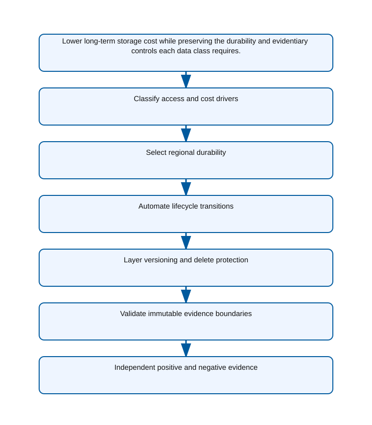

<!-- BEGIN GENERATED AZ305 V1 -->
# LAB-12 — Storage Economics, Protection, and Durability

## 1. Navigation

[← LAB-11](../11-unstructured-data-design/README.md) · [Lab catalog](../README.md) · [LAB-13 →](../13-data-integration-analytics/README.md)

## 2. Scenario and completion contract

Fourth Coffee retains media, transaction exports, and audit packages in a general-purpose storage estate. All objects remain in the Hot tier, replication choices differ by project, deletes are difficult to investigate, and monthly cost grows faster than usable data. The business needs an architecture that balances access frequency, retrieval delay, capacity and transaction charges, regional durability, versioning, soft delete, and immutable evidence. Explicit recovery objectives and failover exercises belong to Lab 17; this lab must recommend protection and durability characteristics without claiming recovery readiness. As the storage economics architect, encode lifecycle and protection decisions with Azure CLI and preserve a cost owner for every retention choice.

- Architect role: Storage economics and durability architect
- Outcome: A cost-aware StorageV2 design with justified redundancy, lifecycle automation, versioning, retention, and immutability.
- Duration: 160 minutes
- Difficulty: advanced
- Cost class: moderate
- Completion: all five checkpoint assertions, final validation, decision revision, and cleanup review are complete.

## 3. Objective-to-evidence map

| Objective | Requirement | Checkpoint |
| --- | --- | --- |
| `DATA-NONREL-03` | `LAB12-REQ-01` | [`LAB12-CP01`](#checkpoint-1) |
| `DATA-NONREL-04` | `LAB12-REQ-02` | [`LAB12-CP02`](#checkpoint-2) |
| `DATA-NONREL-03` | `LAB12-REQ-03` | [`LAB12-CP03`](#checkpoint-3) |
| `DATA-NONREL-04` | `LAB12-REQ-04` | [`LAB12-CP04`](#checkpoint-4) |
| `DATA-NONREL-03` | `LAB12-REQ-05` | [`LAB12-CP05`](#checkpoint-5) |

## 4. Business and quality requirements

Business outcome: Lower long-term storage cost while preserving the durability and evidentiary controls each data class requires.

- `LAB12-REQ-01` — Data classes map age, access frequency, minimum retention, retrieval tolerance, object size, and transaction patterns to cost drivers.
- `LAB12-REQ-02` — GZRS provides zonal durability in the primary region and asynchronous geo-replication to the paired secondary region.
- `LAB12-REQ-03` — Prefix- and tag-scoped rules move objects to cooler tiers and delete only after approved retention.
- `LAB12-REQ-04` — Versioning plus blob and container soft delete protect against routine overwrite and deletion for fourteen days.
- `LAB12-REQ-05` — The evidence container has a documented time-based immutability mode, retention period, and authorized lock procedure.

Scenario facts:

- **Data:** Media, operational objects, and audit packages have distinct retention, mutability, retrieval, and legal-evidence requirements.
- **Scale:** Capacity accumulates over years, but per-class growth and retrieval rates remain measured rather than fabricated.
- **Latency:** Active media needs immediate retrieval; archived audit evidence accepts documented rehydration delay unless legal sets a faster target.
- **Availability:** GZRS protects against zone and regional failure, while immutability protects evidence from change rather than improving service uptime.
- **RTO:** Restore or rehydration time is defined per data class; no single numerical RTO applies to the entire account.
- **RPO:** GZRS replication and versioning objectives differ from the zero-alteration requirement of locked audit evidence.
- **Budget:** Lifecycle tiers and deletion at eighteen months limit media cost, while seven-year immutable evidence is isolated for transparent pricing.

Constraints:

- Durability and evidence controls differ across active media, recoverable working data, and audit packages.
- Audit packages require seven-year immutable retention while media can be deleted after eighteen months.
- Use only the Azure CLI command lane for learner implementation.
- Keep all live changes behind explicit execution and acknowledgement switches.
- Retain only sanitized command evidence and synthetic fixture identifiers.

Assumptions:

- Producers attach a validated data-class value before lifecycle evaluation.
- Legal owners approve retention and immutability scope before a locked production policy is applied.
- West Europe is the configurable primary example and North Europe is the configurable secondary example.
- The learner has administrator-level Azure operations knowledge but receives no pre-existing authenticated context.
- Offline fixtures demonstrate contract behavior rather than live Azure service behavior.

## 5. Architecture diagram and walkthrough



The flow begins with the business outcome, crosses five independently validated design capabilities, and ends with positive and negative evidence. The SVG is deterministically rendered from `diagrams/architecture.mmd`.

## 6. Concept primer and candidate architectures

Architecture decisions translate measurable requirements into a deliberate service and operating model. A candidate is viable only when every mandatory constraint is met; convenience or familiarity cannot compensate for a disqualifier.

- **StorageV2 with GZRS and class-specific lifecycle policies** (eligible) — StorageV2 combines regional durability with data-class lifecycle rules and supports a dedicated immutable evidence boundary.
- **StorageV2 with LRS and application-managed secondary copies** (eligible) — Application copies may lower account pricing but transfer replication ordering, integrity, and failover proof to custom code.
- **Premium block blob accounts with uniform online retention** (eligible) — Premium online storage provides consistent low latency but overpays for cold long-lived packages and does not express class retention alone.
- **One mutable hot-tier container with manual seven-year deletion reminders** (ineligible) — Manual reminders and a mutable container cannot prevent premature alteration or deletion of regulated evidence. Disqualifier: LAB12-REQ-05 requires an enforceable immutable evidence boundary with approved retention and lock procedure.

## 7. Decision, ADR, and Well-Architected review

Criteria weights are C1 30, C2 25, C3 20, C4 15, and C5 10. Weighted totals use `sum(weight × score) / 5`.

| Candidate | Eligible | C1 | C2 | C3 | C4 | C5 | Weighted /100 |
| --- | ---: | ---: | ---: | ---: | ---: | ---: | ---: |
| StorageV2 with GZRS and class-specific lifecycle policies | yes | 5 | 5 | 5 | 3 | 3 | 90 |
| StorageV2 with LRS and application-managed secondary copies | yes | 3 | 2 | 4 | 2 | 4 | 58 |
| Premium block blob accounts with uniform online retention | yes | 3 | 4 | 4 | 4 | 1 | 68 |
| One mutable hot-tier container with manual seven-year deletion reminders | no | 1 | 3 | 1 | 2 | 2 | 35 |

Selected design: **StorageV2 with GZRS and class-specific lifecycle policies**. `ADR-LAB12-001` records the accepted reasoning. Review Reliability, Security, Cost Optimization, Operational Excellence, and Performance Efficiency in `design/decision.yml`; no pillar is implied by another.

Rejected alternatives:

- **StorageV2 with LRS and application-managed secondary copies:** The custom secondary lacks the managed regional durability and auditable behavior required by evidence classes.
- **Premium block blob accounts with uniform online retention:** Uniform premium retention ignores different retrieval and deletion requirements and produces the weakest cost fit.
- **One mutable hot-tier container with manual seven-year deletion reminders:** The candidate is disqualified because procedural intent is not an immutable storage control.

Architecture risks:

- **Risk:** An incorrect data-class tag can archive active media or leave audit evidence mutable. **Mitigation:** Validate classification at ingestion and run policy simulations against representative objects before activation.
- **Risk:** Locked immutability can preserve erroneous or sensitive content for seven years. **Mitigation:** Establish legal approval, narrow the immutable container, and test content validation before final locking.

Well-Architected consequences:

- **Reliability:** GZRS and per-class recovery tests protect durability without confusing immutability with availability.
- **Security:** Locked audit containers, least-privilege data roles, and private access preserve evidence integrity.
- **Cost Optimization:** Lifecycle timing follows actual retention and retrieval behavior for media and audit classes.
- **Operational Excellence:** Classification, policy simulation, lock approval, and exception evidence form a controlled lifecycle process.
- **Performance Efficiency:** Hot access remains available for active media while cold evidence uses capacity-efficient tiers.

ADR consequences:

- Audit evidence moves to a separately approved immutable container or account with restricted administration.
- Data producers become accountable for correct classification before lifecycle policy can act.

## 8. Inputs, permissions, licensing, cost, and analogue

Use configurable `Location` (`AZ305_LOCATION`, default West Europe) and `SecondaryLocation` (`AZ305_SECONDARY_LOCATION`, default North Europe). Every public input has an explicit `AZ305_*` fallback. Preview is the default; only Golden Lab 00 writes an intent-only `execute: false` preview record. Before an executed cloud command, the supplied subscription and tenant must exactly match the active CLI, Az, and—where applicable—Microsoft Graph contexts. `-Execute` crosses the execution boundary; cost-bearing and tenant-scoped paths also require their independent acknowledgement switches.

Safe analogue: The reference topology is deployable at bounded scope; preview remains the default and live verification is separate.

Permissions: Storage account, blob, lifecycle, and immutability read access supports assessment; changing accounts, policies, locks, or redundancy requires explicit authorization.

Licensing: Redundancy, access tiers, early-deletion minimums, rehydration, versioning, immutability, and operations each affect StorageV2 billing.

Cost boundary: Price data classes separately by capacity duration, write and read operations, replication, retrieval, rehydration time, and deletion timing.

## 9. Read-only preflight

```powershell
pwsh ./scripts/azure-cli/Preflight.ps1 -RunId synthetic-120001
```

Synthetic sample: `{"labId":"LAB-12","track":"azure-cli","result":"pass","note":"Local tool discovery only"}`. This is illustrative local output, not evidence captured from Azure.

## 10. Five guided checkpoints

### Checkpoint 1: Classify access and cost drivers

<a id="checkpoint-1"></a>

**Trace:** `DATA-NONREL-03` → `LAB12-REQ-01` → `LAB12-CP01`

```powershell
az storage account show --name $StorageAccountName --resource-group $ResourceGroup --query "{kind:kind,accessTier:accessTier,sku:sku.name,location:primaryLocation}" -o json
```

Expected evidence: Data classes map age, access frequency, minimum retention, retrieval tolerance, object size, and transaction patterns to cost drivers. Retain Synthetic object distribution, age bands, access assumptions, tier mapping, and monthly cost model.

Positive assertion:

```powershell
az storage blob list --account-name $StorageAccountName --container-name $ContainerName --auth-mode login --query "[].{name:name,tier:properties.blobTier,size:properties.contentLength}" -o json
```

Negative assertion:

```powershell
az storage blob list --account-name $StorageAccountName --container-name $ContainerName --auth-mode login --query '[?properties.blobTier == ''Hot'' && properties.contentLength > `1073741824`].name' -o tsv
```

Failure and retry: Access telemetry is incomplete or a minimum storage duration makes an early transition uneconomic. Use a conservative age threshold, document uncertainty, and validate costs before broadening the rule.

Cleanup dependency: Inventory commands create no resources and retained evidence contains names and aggregates only.

WAF consequence: Performance Efficiency: tier mapping respects retrieval latency, rehydration limits, and transaction patterns.

### Checkpoint 2: Select regional durability

<a id="checkpoint-2"></a>

**Trace:** `DATA-NONREL-04` → `LAB12-REQ-02` → `LAB12-CP02`

```powershell
az storage account create --name $StorageAccountName --resource-group $ResourceGroup --location $Location --sku Standard_GZRS --kind StorageV2 --access-tier Hot --https-only true --min-tls-version TLS1_2 --allow-blob-public-access false --tags purpose=az305-lab labId=LAB-12 runId=$RunId expiresOn=$ExpiresOn
```

Expected evidence: GZRS provides zonal durability in the primary region and asynchronous geo-replication to the paired secondary region. Retain SKU, primary and secondary regions, secondary status, durability rationale, and cost owner.

Positive assertion:

```powershell
az storage account show --name $StorageAccountName --resource-group $ResourceGroup --query "{sku:sku.name,primary:primaryLocation,secondary:secondaryLocation,status:statusOfSecondary}" -o json
```

Negative assertion:

```powershell
az storage account show --name $StorageAccountName --resource-group $ResourceGroup --query "{sku:sku.name,allowBlobPublicAccess:allowBlobPublicAccess}" -o json
```

Failure and retry: GZRS or the required account feature is unavailable in the selected region. Compare ZRS plus a separate protected copy or an approved GRS design without overstating availability.

Cleanup dependency: Delete child containers and endpoints before the run-owned account; geo-replicated deletion is not recovery.

WAF consequence: Reliability: GZRS makes zonal and regional durability characteristics explicit.

### Checkpoint 3: Automate lifecycle transitions

<a id="checkpoint-3"></a>

**Trace:** `DATA-NONREL-03` → `LAB12-REQ-03` → `LAB12-CP03`

```powershell
$ownedStorageId = az storage account show --name $StorageAccountName --resource-group $ResourceGroup --query id -o tsv --only-show-errors; if ($ownedStorageId -ine $StorageAccountResourceId) { throw 'The supplied storage account ID is not the exact run-owned account.' }; az storage account management-policy create --account-name $StorageAccountName --resource-group $ResourceGroup --policy @artifacts/lifecycle-policy.json --only-show-errors
```

Expected evidence: Prefix- and tag-scoped rules move objects to cooler tiers and delete only after approved retention. Retain Policy hash, enabled rules, filters, transition ages, deletion ages, and exception owner.

Positive assertion:

```powershell
az storage account management-policy show --account-name $StorageAccountName --resource-group $ResourceGroup --query "policy.rules[?enabled].{name:name,filters:definition.filters,actions:definition.actions}" -o json
```

Negative assertion:

```powershell
az storage account management-policy show --account-name $StorageAccountName --resource-group $ResourceGroup --query 'policy.rules[?enabled == `false` || definition.actions.baseBlob.delete.daysAfterModificationGreaterThan < `30`].name' -o tsv
```

Failure and retry: Overlapping filters apply an unintended earlier transition or deletion to a protected data class. Evaluate rules against synthetic object fixtures and narrow filters before enabling deletion.

Cleanup dependency: Restore the recorded policy or delete only the run-owned policy before account cleanup.

WAF consequence: Operational Excellence: versioned lifecycle rules replace manual object-by-object retention decisions.

### Checkpoint 4: Layer versioning and delete protection

<a id="checkpoint-4"></a>

**Trace:** `DATA-NONREL-04` → `LAB12-REQ-04` → `LAB12-CP04`

```powershell
$ownedStorageId = az storage account show --name $StorageAccountName --resource-group $ResourceGroup --query id -o tsv --only-show-errors; if ($ownedStorageId -ine $StorageAccountResourceId) { throw 'The supplied storage account ID is not the exact run-owned account.' }; az storage account blob-service-properties update --account-name $StorageAccountName --resource-group $ResourceGroup --enable-versioning true --enable-delete-retention true --delete-retention-days 14 --enable-container-delete-retention true --container-delete-retention-days 14 --only-show-errors
```

Expected evidence: Versioning plus blob and container soft delete protect against routine overwrite and deletion for fourteen days. Retain Versioning state, retention days, data-class applicability, restore responsibility, and incremental cost estimate.

Positive assertion:

```powershell
az storage account blob-service-properties show --account-name $StorageAccountName --resource-group $ResourceGroup --query "{versioning:isVersioningEnabled,blobDelete:deleteRetentionPolicy,containerDelete:containerDeleteRetentionPolicy}" -o json
```

Negative assertion:

```powershell
az storage account blob-service-properties show --account-name $StorageAccountName --resource-group $ResourceGroup --query "{versioning:isVersioningEnabled,blobDeleteEnabled:deleteRetentionPolicy.enabled}" -o json
```

Failure and retry: Version accumulation materially exceeds the forecast because high-churn objects lack lifecycle handling. Add a reviewed previous-version lifecycle rule without shortening required recovery windows.

Cleanup dependency: Restore original service properties when safe; never purge retained versions during automated cleanup.

WAF consequence: Cost Optimization: bounded soft-delete and previous-version windows control protection overhead.

### Checkpoint 5: Validate immutable evidence boundaries

<a id="checkpoint-5"></a>

**Trace:** `DATA-NONREL-03` → `LAB12-REQ-05` → `LAB12-CP05`

```powershell
az storage container immutability-policy show --account-name $StorageAccountName --container-name $EvidenceContainerName --auth-mode login -o json
```

Expected evidence: The evidence container has a documented time-based immutability mode, retention period, and authorized lock procedure. Retain Container label, policy state, retention days, protected-append choice, lock authority, and cost owner.

Positive assertion:

```powershell
az storage container immutability-policy show --account-name $StorageAccountName --container-name $EvidenceContainerName --auth-mode login --query "{state:state,period:immutabilityPeriodSinceCreationInDays,append:allowProtectedAppendWrites}" -o json
```

Negative assertion:

```powershell
az storage container legal-hold show --account-name $StorageAccountName --container-name $EvidenceContainerName --auth-mode login --query "tags[?name=='temporary-lab-hold']" -o json
```

Failure and retry: A locked policy conflicts with deletion, lifecycle, or legal retention expectations. Validate policy behavior on a synthetic unlocked container before any authorized lock action.

Cleanup dependency: Never automate legal-hold removal, policy unlock, or purge; report residual protected objects for review.

WAF consequence: Security: time-based immutability protects evidence from unauthorized modification or deletion.

## 11. Final validation and interpretation

Run `Validate.ps1 -Mode Deployment -Execute` only after an executed run has state and you are authorized to issue the ten read-only checkpoint inspections. Without `-Execute`, ordinary deployment validation records `partial` and exits `2`; Golden Lab 00 alone can validate its intent-only preview locally. Exit `0` means all required assertions pass, `1` means at least one failed, and `2` means the outcome is gated or partial. Positive and negative commands execute independently, so one failure never suppresses its paired assertion.

## 12. Material change request

Audit packages become subject to a seven-year immutable retention mandate while media can be deleted after eighteen months; revise account, container, lifecycle, and cost boundaries.

Revised solution: select **StorageV2 with GZRS and class-specific lifecycle policies**. LAB12-REQ-05 requires enforceable seven-year immutability and eighteen-month media deletion, so class-specific GZRS boundaries are retained with a separately locked audit container.

Revised Well-Architected consequences:

- **Reliability:** Regional redundancy remains independent from the immutable evidence control.
- **Security:** Audit objects cannot be altered or deleted by ordinary storage administrators.
- **Cost Optimization:** Media exits storage at eighteen months while long-lived evidence uses an intentional tier.
- **Operational Excellence:** Lock approval and lifecycle simulation become required release evidence.
- **Performance Efficiency:** Active media avoids archive delay and rarely read audit packages avoid premium capacity.

## 13. Architect job challenge

Decide whether regulated evidence deserves a separate account and explain how that affects blast radius, administration, billing, and cleanup.

## 14. Troubleshooting, cleanup, and residual verification

- Evaluate minimum tier duration and retrieval charges before interpreting a lifecycle transition as savings.
- Distinguish versioning, soft delete, time-based immutability, and legal holds by the failure each mitigates.
- Treat geo-replication durability as distinct from tested failover and recovery objectives.

Cleanup previews nonempty state in reverse dependency order, writes `partial`, and exits `2`; an already empty run is completed locally and idempotently. Executed cleanup rechecks the exact live ID plus `purpose`, `labId`, `runId`, and `expiresOn` immediately before each removal, persists state after every absent or removed object, stops on the first dependency failure, and refuses unresolved pre-existing settings. It never automates purge. Finish with `Validate.ps1 -Mode PostCleanup`; the required residual count is zero.

## 15. Exam debrief, assessment, sources, and navigation

Explain the recommendation in terms of requirements, rejected alternatives, failure behavior, and all five WAF pillars. Complete `assessment/QUESTIONS.md`, then use the separately excluded answer key for remediation.

- [Azure Storage redundancy](https://learn.microsoft.com/en-us/azure/storage/common/storage-redundancy)
- [Azure Well-Architected Framework](https://learn.microsoft.com/en-us/azure/well-architected/)

[← LAB-11](../11-unstructured-data-design/README.md) · [Lab catalog](../README.md) · [LAB-13 →](../13-data-integration-analytics/README.md)

## 16. Synchronized lifecycle-script appendix

### Preflight.ps1

```powershell
[CmdletBinding()]
param(
    [string]$SubscriptionId = $env:AZ305_SUBSCRIPTION_ID,
    [string]$TenantId = $env:AZ305_TENANT_ID,
    [ValidatePattern('^[a-z0-9-]{6,64}$')][string]$RunId = $env:AZ305_RUN_ID,
    [string]$Location = $(if ($env:AZ305_LOCATION) { $env:AZ305_LOCATION } else { 'westeurope' }),
    [string]$SecondaryLocation = $(if ($env:AZ305_SECONDARY_LOCATION) { $env:AZ305_SECONDARY_LOCATION } else { 'northeurope' }),
    [string]$ResourceGroup = $(if ($env:AZ305_RESOURCE_GROUP) { $env:AZ305_RESOURCE_GROUP } else { "rg-az305-$RunId" }),
    [string]$WorkloadName = $(if ($env:AZ305_WORKLOAD_NAME) { $env:AZ305_WORKLOAD_NAME } else { "az305-$RunId" }),
    [string]$ExpiresOn = $(if ($env:AZ305_EXPIRES_ON) { $env:AZ305_EXPIRES_ON } else { (Get-Date).ToUniversalTime().AddDays(1).ToString('yyyy-MM-dd') }),
    [string]$ContainerName = $env:AZ305_CONTAINER_NAME,
    [string]$EvidenceContainerName = $env:AZ305_EVIDENCE_CONTAINER_NAME,
    [string]$StorageAccountName = $env:AZ305_STORAGE_ACCOUNT_NAME,
    [string]$StorageAccountResourceId = $env:AZ305_STORAGE_ACCOUNT_RESOURCE_ID,
    [switch]$Execute,
    [switch]$AcknowledgeCost,
    [switch]$AcknowledgeTenantChange
)

$ErrorActionPreference = 'Stop'
$PSNativeCommandUseErrorActionPreference = $true
if (-not $RunId) { [Console]::Error.WriteLine('RunId or AZ305_RUN_ID is required.'); exit 2 }
# Every lifecycle entrypoint intentionally exposes the same public parameter contract.
@($SubscriptionId, $TenantId, $RunId, $Location, $SecondaryLocation, $ResourceGroup, $WorkloadName, $ExpiresOn, $ContainerName, $EvidenceContainerName, $StorageAccountName, $StorageAccountResourceId, $Execute, $AcknowledgeCost, $AcknowledgeTenantChange) | Out-Null

$requiredCommands = @('az', 'pwsh')
$missing = @($requiredCommands | Where-Object { -not (Get-Command $_ -ErrorAction SilentlyContinue) })
if ($missing.Count -gt 0) {
    Write-Error "Missing local commands: $($missing -join ', ')"
    exit 1
}

[pscustomobject]@{
    labId = 'LAB-12'
    track = 'azure-cli'
    implementationMode = 'reference-deployable'
    result = 'pass'
    note = 'Local tool discovery only; no Azure or Microsoft Graph request was made.'
} | ConvertTo-Json
exit 0
```

### Setup.ps1

```powershell
[CmdletBinding()]
param(
    [string]$SubscriptionId = $env:AZ305_SUBSCRIPTION_ID,
    [string]$TenantId = $env:AZ305_TENANT_ID,
    [ValidatePattern('^[a-z0-9-]{6,64}$')][string]$RunId = $env:AZ305_RUN_ID,
    [string]$Location = $(if ($env:AZ305_LOCATION) { $env:AZ305_LOCATION } else { 'westeurope' }),
    [string]$SecondaryLocation = $(if ($env:AZ305_SECONDARY_LOCATION) { $env:AZ305_SECONDARY_LOCATION } else { 'northeurope' }),
    [string]$ResourceGroup = $(if ($env:AZ305_RESOURCE_GROUP) { $env:AZ305_RESOURCE_GROUP } else { "rg-az305-$RunId" }),
    [string]$WorkloadName = $(if ($env:AZ305_WORKLOAD_NAME) { $env:AZ305_WORKLOAD_NAME } else { "az305-$RunId" }),
    [string]$ExpiresOn = $(if ($env:AZ305_EXPIRES_ON) { $env:AZ305_EXPIRES_ON } else { (Get-Date).ToUniversalTime().AddDays(1).ToString('yyyy-MM-dd') }),
    [string]$ContainerName = $env:AZ305_CONTAINER_NAME,
    [string]$EvidenceContainerName = $env:AZ305_EVIDENCE_CONTAINER_NAME,
    [string]$StorageAccountName = $env:AZ305_STORAGE_ACCOUNT_NAME,
    [string]$StorageAccountResourceId = $env:AZ305_STORAGE_ACCOUNT_RESOURCE_ID,
    [switch]$Execute,
    [switch]$AcknowledgeCost,
    [switch]$AcknowledgeTenantChange
)

$ErrorActionPreference = 'Stop'
$PSNativeCommandUseErrorActionPreference = $true
if (-not $RunId) { [Console]::Error.WriteLine('RunId or AZ305_RUN_ID is required.'); exit 2 }
# Every lifecycle entrypoint intentionally exposes the same public parameter contract.
@($SubscriptionId, $TenantId, $RunId, $Location, $SecondaryLocation, $ResourceGroup, $WorkloadName, $ExpiresOn, $ContainerName, $EvidenceContainerName, $StorageAccountName, $StorageAccountResourceId, $Execute, $AcknowledgeCost, $AcknowledgeTenantChange) | Out-Null

$LabRoot = Split-Path (Split-Path $PSScriptRoot -Parent) -Parent
$StateRoot = Join-Path $LabRoot ".state/$RunId"
$StatePath = Join-Path $StateRoot 'run.json'

function Invoke-AzCliJson {
    [CmdletBinding()]
    param([Parameter(Mandatory)][string[]]$ArgumentList)
    $savedNativePreference = $PSNativeCommandUseErrorActionPreference
    try {
        # Capture the exit code ourselves so a failed native command cannot be
        # mistaken for an empty but successful JSON response.
        $PSNativeCommandUseErrorActionPreference = $false
        $outputLines = @(& az @ArgumentList)
        $nativeExit = $LASTEXITCODE
    }
    finally {
        $PSNativeCommandUseErrorActionPreference = $savedNativePreference
    }
    if ($nativeExit -ne 0) { throw "Azure CLI exited with code $nativeExit." }
    $raw = @($outputLines) -join "`n"
    if ([string]::IsNullOrWhiteSpace($raw)) { return $null }
    try { return ($raw | ConvertFrom-Json -Depth 100) }
    catch { throw 'Azure CLI returned data that was not valid JSON.' }
}

function Assert-ExactExecutionContext {
    [CmdletBinding()]
    param([string]$ExpectedSubscriptionId, [string]$ExpectedTenantId)
    if ([string]::IsNullOrWhiteSpace($ExpectedSubscriptionId) -or [string]::IsNullOrWhiteSpace($ExpectedTenantId)) {
        throw 'SubscriptionId and TenantId are required before a cloud request.'
    }
    $context = Invoke-AzCliJson -ArgumentList @('account', 'show', '--output', 'json', '--only-show-errors')
    if (-not $context -or [string]$context.id -ine $ExpectedSubscriptionId -or [string]$context.tenantId -ine $ExpectedTenantId) {
        throw 'The active Azure CLI subscription or tenant does not exactly match the requested context.'
    }
}

function Save-RunState {
    [CmdletBinding()]
    param([Parameter(Mandatory)]$State)
    $temporaryPath = "$StatePath.tmp"
    $State | ConvertTo-Json -Depth 20 | Set-Content -LiteralPath $temporaryPath -Encoding utf8NoBOM
    Move-Item -LiteralPath $temporaryPath -Destination $StatePath -Force
}

function Assert-SafeStateValue {
    [CmdletBinding()]
    param($Value)
    $serialized = $Value | ConvertTo-Json -Depth 12 -Compress
    if ($serialized -match '(?i)"(?:token|password|secret|certificate|connectionString|sas|clientSecret|accessToken|refreshToken|accountKey|privateKey)"\s*:') {
        throw 'A prohibited sensitive field name was returned; state capture is refused.'
    }
}

function Convert-CheckpointOutput {
    [CmdletBinding()]
    param($Value)
    if ($Value -is [string]) { $raw = [string]$Value }
    elseif ($Value -is [System.Collections.IEnumerable] -and @($Value | Where-Object { $_ -isnot [string] }).Count -eq 0) { $raw = @($Value) -join "`n" }
    else { return $Value }
    if ([string]::IsNullOrWhiteSpace($raw)) { return $null }
    try { return ($raw | ConvertFrom-Json -Depth 100) } catch { return $Value }
}

function Get-ReturnedResourceId {
    [CmdletBinding()]
    param($Value)
    $seen = [System.Collections.Generic.HashSet[string]]::new([System.StringComparer]::OrdinalIgnoreCase)
    $results = [System.Collections.Generic.List[string]]::new()
    function Add-ArmId {
        param($Candidate)
        if ($Candidate -is [string] -and $Candidate -match '^/subscriptions/[0-9a-f-]+/(?:resourceGroups/[^/]+(?:/providers/.+)?|providers/.+)$' -and $Candidate -notmatch '/providers/Microsoft\.Resources/deployments/') {
            if ($seen.Add($Candidate)) { $results.Add($Candidate) }
        }
    }
    function Find-DeploymentOutputId {
        param($Item, [int]$Depth)
        if ($null -eq $Item -or $Depth -gt 12) { return }
        if ($Item -is [string]) { Add-ArmId -Candidate $Item; return }
        if ($Item -is [System.Collections.IDictionary]) { foreach ($key in $Item.Keys) { Find-DeploymentOutputId -Item $Item[$key] -Depth ($Depth + 1) }; return }
        if ($Item -is [System.Collections.IEnumerable]) { foreach ($entry in $Item) { Find-DeploymentOutputId -Item $entry -Depth ($Depth + 1) }; return }
        foreach ($property in @($Item.PSObject.Properties | Where-Object { $_.MemberType -in @('NoteProperty', 'Property') })) { Find-DeploymentOutputId -Item $property.Value -Depth ($Depth + 1) }
    }
    foreach ($rootItem in @($Value)) {
        if ($rootItem -is [System.Collections.IDictionary]) {
            foreach ($name in @('id', 'resourceId')) { if ($rootItem.Contains($name)) { Add-ArmId -Candidate $rootItem[$name] } }
            if ($rootItem.Contains('properties') -and $rootItem.properties -and $rootItem.properties.outputs) { Find-DeploymentOutputId -Item $rootItem.properties.outputs -Depth 0 }
            continue
        }
        foreach ($name in @('Id', 'ResourceId')) {
            $property = $rootItem.PSObject.Properties[$name]
            if ($property) { Add-ArmId -Candidate $property.Value }
        }
        if ($rootItem.PSObject.Properties['Properties'] -and $rootItem.Properties -and $rootItem.Properties.outputs) {
            Find-DeploymentOutputId -Item $rootItem.Properties.outputs -Depth 0
        }
    }
    return @($results)
}

function Get-PlannedDeploymentResourceId {
    [CmdletBinding()]
    param($Value)
    $seen = [System.Collections.Generic.HashSet[string]]::new([System.StringComparer]::OrdinalIgnoreCase)
    $results = [System.Collections.Generic.List[string]]::new()
    foreach ($change in @($Value.changes)) {
        $candidate = [string]$change.resourceId
        if ($candidate -match '^/subscriptions/[0-9a-f-]+/(?:resourceGroups/[^/]+(?:/providers/.+)?|providers/.+)$' -and $candidate -notmatch '/providers/Microsoft\.Resources/deployments/' -and $seen.Add($candidate)) {
            $results.Add($candidate)
        }
    }
    return @($results)
}

function Assert-InputSubscriptionScope {
    [CmdletBinding()]
    param($Inputs, [string]$ExpectedSubscriptionId)
    $entries = if ($Inputs -is [System.Collections.IDictionary]) {
        @($Inputs.GetEnumerator())
    } else {
        @($Inputs.PSObject.Properties | ForEach-Object { [pscustomobject]@{ Key = $_.Name; Value = $_.Value } })
    }
    foreach ($entry in $entries) {
        if ($entry.Value -is [string] -and [string]$entry.Value -match '^/subscriptions/([^/]+)/') {
            if ($Matches[1] -ine $ExpectedSubscriptionId) { throw "Input $($entry.Key) belongs to a different subscription." }
        }
    }
}

function Assert-ManagedMutation {
    [CmdletBinding()]
    param($State, [string]$CheckpointId, [bool]$CarriesOwnership, [object[]]$TargetResourceIds)
    if ($CarriesOwnership) { return }
    $targets = @($TargetResourceIds | Where-Object { $_ -is [string] -and $_ -match '^/subscriptions/' })
    if ($targets.Count -eq 0) { throw "$CheckpointId refuses an untagged mutation because no exact ARM target ID was supplied." }
    $knownIds = @($State.managedObjects | ForEach-Object { [string]$_.id })
    if ($knownIds.Count -eq 0) { throw "$CheckpointId refuses to modify a pre-existing object because no run-owned parent has been recorded." }
    foreach ($target in $targets) {
        $related = @($knownIds | Where-Object { $target -ieq $_ -or $target.StartsWith("$_/", [System.StringComparison]::OrdinalIgnoreCase) -or $_.StartsWith("$target/", [System.StringComparison]::OrdinalIgnoreCase) }).Count -gt 0
        if (-not $related) { throw "$CheckpointId refuses a mutation outside the exact run-owned resource boundary." }
    }
}

$executionInputs = [ordered]@{ subscriptionId = $SubscriptionId; tenantId = $TenantId; location = $Location; secondaryLocation = $SecondaryLocation; resourceGroup = $ResourceGroup; workloadName = $WorkloadName; expiresOn = $ExpiresOn; ContainerName = $ContainerName; EvidenceContainerName = $EvidenceContainerName; StorageAccountName = $StorageAccountName; StorageAccountResourceId = $StorageAccountResourceId }

if (-not $Execute) {
    Write-Output '[preview] No cloud command was called and no state was created.'
    Write-Output '[preview] Re-run with -Execute only in an authorized disposable environment.'
    exit 0
}
# This setup is compatible with the lab implementation mode.
if (-not $AcknowledgeCost) { [Console]::Error.WriteLine('Cost acknowledgement is required.'); exit 2 }
# This lab does not perform a tenant-scoped change by default.
$requiredLabInputs = [ordered]@{ EvidenceContainerName = $EvidenceContainerName; StorageAccountName = $StorageAccountName; StorageAccountResourceId = $StorageAccountResourceId }
$missingLabInputs = @($requiredLabInputs.GetEnumerator() | Where-Object { $_.Value -is [string] -and [string]::IsNullOrWhiteSpace([string]$_.Value) } | ForEach-Object Key)
if ($missingLabInputs.Count -gt 0) { [Console]::Error.WriteLine("Execution is gated; supply: $($missingLabInputs -join ', ')."); exit 2 }

try {
    Assert-ExactExecutionContext -ExpectedSubscriptionId $SubscriptionId -ExpectedTenantId $TenantId
    Assert-InputSubscriptionScope -Inputs $executionInputs -ExpectedSubscriptionId $SubscriptionId
    Assert-SafeStateValue -Value $executionInputs
}
catch {
    [Console]::Error.WriteLine("Execution is gated by context or input validation: $($_.Exception.Message)")
    exit 2
}

# Recovery state is persisted before the first possible mutation below.
if (Test-Path -LiteralPath $StatePath) {
    [Console]::Error.WriteLine('Run state already exists. Choose a new RunId or complete the recorded cleanup; existing recovery state will not be overwritten.')
    exit 2
}
New-Item -ItemType Directory -Path $StateRoot -Force | Out-Null
$state = [ordered]@{
    schemaVersion = '1.0.0'; labId = 'LAB-12'; runId = $RunId; track = 'azure-cli'
    implementationMode = 'reference-deployable'; status = 'initialized'
    createdAt = (Get-Date).ToUniversalTime().ToString('o'); execute = $true
    parameters = $executionInputs
    managedObjects = @(); originalSettings = @()
}
Save-RunState -State $state
$state.status = 'deploying'
Save-RunState -State $state

$originalLocation = Get-Location
try {
    Set-Location -LiteralPath $LabRoot
    # 12-CP01: Classify access and cost drivers
    $stepResult = & { az storage account show --name $StorageAccountName --resource-group $ResourceGroup --query "{kind:kind,accessTier:accessTier,sku:sku.name,location:primaryLocation}" -o json }
    if ($LASTEXITCODE -ne 0) { throw 'LAB12-CP01 native command exited with code ' + $LASTEXITCODE + '.' }
    $null = $stepResult

    # 12-CP02: Select regional durability
    Assert-ManagedMutation -State $state -CheckpointId 'LAB12-CP02' -CarriesOwnership:$true -TargetResourceIds @()
    $stepResult = & { az storage account create --name $StorageAccountName --resource-group $ResourceGroup --location $Location --sku Standard_GZRS --kind StorageV2 --access-tier Hot --https-only true --min-tls-version TLS1_2 --allow-blob-public-access false --tags purpose=az305-lab labId=LAB-12 runId=$RunId expiresOn=$ExpiresOn }
    if ($LASTEXITCODE -ne 0) { throw 'LAB12-CP02 native command exited with code ' + $LASTEXITCODE + '.' }
    $candidate = Convert-CheckpointOutput -Value $stepResult
    $returnedIds = @(Get-ReturnedResourceId -Value $candidate)
    if ($returnedIds.Count -eq 0) { throw 'LAB12-CP02 created an owned resource but returned no recoverable ARM resource ID.' }
    foreach ($returnedId in $returnedIds) {
        if ($returnedId -notmatch '^/subscriptions/([^/]+)/' -or $Matches[1] -ine $SubscriptionId) { throw 'A returned recovery ID belongs to a different subscription.' }
        if (@($state.managedObjects | Where-Object { $_.id -ieq $returnedId }).Count -eq 0) {
            $state.managedObjects += [pscustomobject]@{
                id = $returnedId
                type = 'azure-resource'
                tags = [ordered]@{ purpose = 'az305-lab'; labId = 'LAB-12'; runId = $RunId; expiresOn = $ExpiresOn }
            }
            Save-RunState -State $state
        }
    }
    $null = $stepResult

    # 12-CP03: Automate lifecycle transitions
    Assert-ManagedMutation -State $state -CheckpointId 'LAB12-CP03' -CarriesOwnership:$false -TargetResourceIds @($StorageAccountResourceId)
    $stepResult = & { $ownedStorageId = az storage account show --name $StorageAccountName --resource-group $ResourceGroup --query id -o tsv --only-show-errors; if ($ownedStorageId -ine $StorageAccountResourceId) { throw 'The supplied storage account ID is not the exact run-owned account.' }; az storage account management-policy create --account-name $StorageAccountName --resource-group $ResourceGroup --policy @artifacts/lifecycle-policy.json --only-show-errors }
    if ($LASTEXITCODE -ne 0) { throw 'LAB12-CP03 native command exited with code ' + $LASTEXITCODE + '.' }
    $null = $stepResult

    # 12-CP04: Layer versioning and delete protection
    Assert-ManagedMutation -State $state -CheckpointId 'LAB12-CP04' -CarriesOwnership:$false -TargetResourceIds @($StorageAccountResourceId)
    # Capture the original non-secret projection before changing an exact run-owned object.
    $originalProjection = & { az storage account blob-service-properties show --account-name $StorageAccountName --resource-group $ResourceGroup --query "{versioning:isVersioningEnabled,blobDelete:deleteRetentionPolicy,containerDelete:containerDeleteRetentionPolicy}" -o json }
    if ($LASTEXITCODE -ne 0) { throw 'LAB12-CP04 original-state native command exited with code ' + $LASTEXITCODE + '.' }
    Assert-SafeStateValue -Value $originalProjection
    foreach ($originalTargetId in @($StorageAccountResourceId)) {
        $state.originalSettings += [pscustomobject]@{ id = $originalTargetId; setting = 'LAB12-CP04: Layer versioning and delete protection'; value = $originalProjection }
    }
    Save-RunState -State $state
    $stepResult = & { $ownedStorageId = az storage account show --name $StorageAccountName --resource-group $ResourceGroup --query id -o tsv --only-show-errors; if ($ownedStorageId -ine $StorageAccountResourceId) { throw 'The supplied storage account ID is not the exact run-owned account.' }; az storage account blob-service-properties update --account-name $StorageAccountName --resource-group $ResourceGroup --enable-versioning true --enable-delete-retention true --delete-retention-days 14 --enable-container-delete-retention true --container-delete-retention-days 14 --only-show-errors }
    if ($LASTEXITCODE -ne 0) { throw 'LAB12-CP04 native command exited with code ' + $LASTEXITCODE + '.' }
    $null = $stepResult

    # 12-CP05: Validate immutable evidence boundaries
    $stepResult = & { az storage container immutability-policy show --account-name $StorageAccountName --container-name $EvidenceContainerName --auth-mode login -o json }
    if ($LASTEXITCODE -ne 0) { throw 'LAB12-CP05 native command exited with code ' + $LASTEXITCODE + '.' }
    $null = $stepResult

    $state.status = 'deployed'
    Save-RunState -State $state
} catch {
    $state.status = 'failed'
    Save-RunState -State $state
    Write-Error $_
    exit 1
} finally {
    Set-Location -LiteralPath $originalLocation
}
exit 0
```

### Validate.ps1

```powershell
[CmdletBinding()]
param(
    [string]$SubscriptionId = $env:AZ305_SUBSCRIPTION_ID,
    [string]$TenantId = $env:AZ305_TENANT_ID,
    [ValidatePattern('^[a-z0-9-]{6,64}$')][string]$RunId = $env:AZ305_RUN_ID,
    [string]$Location = $(if ($env:AZ305_LOCATION) { $env:AZ305_LOCATION } else { 'westeurope' }),
    [string]$SecondaryLocation = $(if ($env:AZ305_SECONDARY_LOCATION) { $env:AZ305_SECONDARY_LOCATION } else { 'northeurope' }),
    [string]$ResourceGroup = $(if ($env:AZ305_RESOURCE_GROUP) { $env:AZ305_RESOURCE_GROUP } else { "rg-az305-$RunId" }),
    [string]$WorkloadName = $(if ($env:AZ305_WORKLOAD_NAME) { $env:AZ305_WORKLOAD_NAME } else { "az305-$RunId" }),
    [string]$ExpiresOn = $(if ($env:AZ305_EXPIRES_ON) { $env:AZ305_EXPIRES_ON } else { (Get-Date).ToUniversalTime().AddDays(1).ToString('yyyy-MM-dd') }),
    [string]$ContainerName = $env:AZ305_CONTAINER_NAME,
    [string]$EvidenceContainerName = $env:AZ305_EVIDENCE_CONTAINER_NAME,
    [string]$StorageAccountName = $env:AZ305_STORAGE_ACCOUNT_NAME,
    [string]$StorageAccountResourceId = $env:AZ305_STORAGE_ACCOUNT_RESOURCE_ID,
    [ValidateSet('Deployment', 'PostCleanup')][string]$Mode = 'Deployment',
    [switch]$Execute,
    [switch]$AcknowledgeCost,
    [switch]$AcknowledgeTenantChange
)

$ErrorActionPreference = 'Stop'
$PSNativeCommandUseErrorActionPreference = $true
if (-not $RunId) { [Console]::Error.WriteLine('RunId or AZ305_RUN_ID is required.'); exit 2 }
# Every lifecycle entrypoint intentionally exposes the same public parameter contract.
@($SubscriptionId, $TenantId, $RunId, $Location, $SecondaryLocation, $ResourceGroup, $WorkloadName, $ExpiresOn, $ContainerName, $EvidenceContainerName, $StorageAccountName, $StorageAccountResourceId, $Mode, $Execute, $AcknowledgeCost, $AcknowledgeTenantChange) | Out-Null

$LabRoot = Split-Path (Split-Path $PSScriptRoot -Parent) -Parent
$StateRoot = Join-Path $LabRoot ".state/$RunId"
$RunPath = Join-Path $StateRoot 'run.json'
$ValidationPath = Join-Path $StateRoot 'validation.json'

function Invoke-AzCliJson {
    [CmdletBinding()]
    param([Parameter(Mandatory)][string[]]$ArgumentList)
    $savedNativePreference = $PSNativeCommandUseErrorActionPreference
    try {
        # Capture the exit code ourselves so a failed native command cannot be
        # mistaken for an empty but successful JSON response.
        $PSNativeCommandUseErrorActionPreference = $false
        $outputLines = @(& az @ArgumentList)
        $nativeExit = $LASTEXITCODE
    }
    finally {
        $PSNativeCommandUseErrorActionPreference = $savedNativePreference
    }
    if ($nativeExit -ne 0) { throw "Azure CLI exited with code $nativeExit." }
    $raw = @($outputLines) -join "`n"
    if ([string]::IsNullOrWhiteSpace($raw)) { return $null }
    try { return ($raw | ConvertFrom-Json -Depth 100) }
    catch { throw 'Azure CLI returned data that was not valid JSON.' }
}

function Assert-ExactExecutionContext {
    [CmdletBinding()]
    param([string]$ExpectedSubscriptionId, [string]$ExpectedTenantId)
    if ([string]::IsNullOrWhiteSpace($ExpectedSubscriptionId) -or [string]::IsNullOrWhiteSpace($ExpectedTenantId)) {
        throw 'SubscriptionId and TenantId are required before a cloud request.'
    }
    $context = Invoke-AzCliJson -ArgumentList @('account', 'show', '--output', 'json', '--only-show-errors')
    if (-not $context -or [string]$context.id -ine $ExpectedSubscriptionId -or [string]$context.tenantId -ine $ExpectedTenantId) {
        throw 'The active Azure CLI subscription or tenant does not exactly match the requested context.'
    }
}


if (-not (Test-Path -LiteralPath $RunPath)) {
    Write-Warning 'No run state exists; validation is gated.'
    exit 2
}
$state = Get-Content -LiteralPath $RunPath -Raw | ConvertFrom-Json
$assertions = [System.Collections.Generic.List[object]]::new()
function Add-ValidationAssertion {
    [CmdletBinding()]
    param([string]$Id, [ValidateSet('positive', 'negative')][string]$Kind, [bool]$Passed, [string]$Message)
    $assertions.Add([pscustomobject]@{ id = $Id; kind = $Kind; passed = $Passed; message = $Message })
}

function Save-ValidationArtifact {
    [CmdletBinding()]
    param([ValidateSet('pass', 'partial', 'fail')][string]$Result)
    $artifact = [ordered]@{ schemaVersion = '1.0.0'; labId = 'LAB-12'; runId = $RunId; mode = $Mode; result = $Result; validatedAt = (Get-Date).ToUniversalTime().ToString('o'); assertions = @($assertions) }
    $artifact | ConvertTo-Json -Depth 12 | Set-Content -LiteralPath $ValidationPath -Encoding utf8NoBOM
}

function Test-PositiveEvidence {
    [CmdletBinding()]
    param($Value)
    if ($Value -is [bool]) { return $Value }
    if ($null -eq $Value) { return $false }
    if ($Value -is [string]) { return -not [string]::IsNullOrWhiteSpace($Value) }
    if ($Value -is [System.Collections.IEnumerable]) { return @($Value).Count -gt 0 }
    return $true
}

function Test-NegativeEvidence {
    [CmdletBinding()]
    param($Value)
    if ($Value -is [bool]) { return $Value }
    if ($null -eq $Value) { return $true }
    if ($Value -is [string]) { return [string]::IsNullOrWhiteSpace($Value) }
    if ($Value -is [System.Collections.IEnumerable]) { return @($Value).Count -eq 0 }
    $properties = @($Value.PSObject.Properties | Where-Object { $_.MemberType -in @('NoteProperty', 'Property') })
    if ($properties.Count -eq 0) { return $false }
    return @($properties | Where-Object { -not (Test-NegativeEvidence -Value $_.Value) }).Count -eq 0
}

function Test-ProhibitedStateField {
    [CmdletBinding()]
    param($Value)
    $serialized = $Value | ConvertTo-Json -Depth 20
    return $serialized -match '(?i)"(?:token|password|secret|certificate|connectionString|sas|clientSecret|accessToken|refreshToken|accountKey|privateKey)"\s*:'
}

function Assert-InputSubscriptionScope {
    [CmdletBinding()]
    param($Inputs, [string]$ExpectedSubscriptionId)
    $entries = if ($Inputs -is [System.Collections.IDictionary]) {
        @($Inputs.GetEnumerator())
    } else {
        @($Inputs.PSObject.Properties | ForEach-Object { [pscustomobject]@{ Key = $_.Name; Value = $_.Value } })
    }
    foreach ($entry in $entries) {
        if ($entry.Value -is [string] -and [string]$entry.Value -match '^/subscriptions/([^/]+)/' -and $Matches[1] -ine $ExpectedSubscriptionId) {
            throw "Input $($entry.Key) belongs to a different subscription."
        }
    }
}

$stateIdentityMatches = (
    $state.labId -ceq 'LAB-12' -and
    $state.runId -ceq $RunId -and
    $state.track -ceq 'azure-cli' -and
    $state.implementationMode -ceq 'reference-deployable' -and
    ([string]$state.parameters.subscriptionId -ieq $SubscriptionId -and [string]$state.parameters.tenantId -ieq $TenantId)
)
Add-ValidationAssertion -Id 'LAB12-VAL-POS-01' -Kind positive -Passed $stateIdentityMatches -Message 'Run identity, implementation mode, command track, tenant, and subscription exactly match the copied lab and requested run.'
$hasSensitiveName = Test-ProhibitedStateField -Value $state
Add-ValidationAssertion -Id 'LAB12-VAL-NEG-01' -Kind negative -Passed (-not $hasSensitiveName) -Message 'State contains no prohibited sensitive field name.'

if ($Mode -eq 'PostCleanup') {
    $cleanupPath = Join-Path $StateRoot 'cleanup.json'
    $cleanup = if (Test-Path -LiteralPath $cleanupPath) { Get-Content -LiteralPath $cleanupPath -Raw | ConvertFrom-Json } else { $null }
    Add-ValidationAssertion -Id 'LAB12-VAL-POS-02' -Kind positive -Passed ($null -ne $cleanup -and $cleanup.labId -ceq 'LAB-12' -and $cleanup.runId -ceq $RunId -and $cleanup.result -eq 'pass' -and $cleanup.ownershipVerified) -Message 'The exact run cleanup completed with verified ownership.'
    Add-ValidationAssertion -Id 'LAB12-VAL-NEG-02' -Kind negative -Passed ($null -ne $cleanup -and $cleanup.activeManagedObjects -eq 0 -and @($state.managedObjects).Count -eq 0 -and @($state.originalSettings).Count -eq 0 -and $state.status -eq 'cleaned') -Message 'No active managed object or unresolved original setting remains in cleanup or run state.'
    $postCleanupPassed = @($assertions | Where-Object { -not $_.passed }).Count -eq 0
    Save-ValidationArtifact -Result $(if ($postCleanupPassed) { 'pass' } else { 'fail' })
    if ($postCleanupPassed) { exit 0 }
    exit 1
}

Add-ValidationAssertion -Id 'LAB12-VAL-POS-02' -Kind positive -Passed ($state.status -eq 'deployed') -Message 'The executed setup completed successfully; a failed setup can never validate as pass.'
Add-ValidationAssertion -Id 'LAB12-VAL-NEG-02' -Kind negative -Passed (@($state.managedObjects | Where-Object { $_.tags.purpose -ne 'az305-lab' -or $_.tags.labId -ne 'LAB-12' -or $_.tags.runId -ne $RunId }).Count -eq 0) -Message 'No recorded object has a foreign ownership tag.'

if (@($assertions | Where-Object { -not $_.passed }).Count -gt 0) {
    Save-ValidationArtifact -Result 'fail'
    exit 1
}
if (-not $Execute) {
    # This lab has no special intent-only validation path.
    Save-ValidationArtifact -Result 'partial'
    Write-Warning 'Checkpoint validation is gated; re-run with -Execute after confirming the exact read-only context.'
    exit 2
}
# The validation surface is compatible with this lab implementation mode.
$requiredValidationInputs = [ordered]@{ ContainerName = $ContainerName; EvidenceContainerName = $EvidenceContainerName; StorageAccountName = $StorageAccountName }
$missingValidationInputs = @($requiredValidationInputs.GetEnumerator() | Where-Object { $_.Value -is [string] -and [string]::IsNullOrWhiteSpace([string]$_.Value) } | ForEach-Object Key)
if ($missingValidationInputs.Count -gt 0) {
    Add-ValidationAssertion -Id 'LAB12-VAL-POS-CONTEXT' -Kind positive -Passed $false -Message 'One or more required non-secret validation inputs are missing.'
    Save-ValidationArtifact -Result 'partial'
    exit 2
}
try {
    Assert-ExactExecutionContext -ExpectedSubscriptionId $SubscriptionId -ExpectedTenantId $TenantId
    Assert-InputSubscriptionScope -Inputs $state.parameters -ExpectedSubscriptionId $SubscriptionId
    Add-ValidationAssertion -Id 'LAB12-VAL-POS-CONTEXT' -Kind positive -Passed $true -Message 'The active tenant and subscription exactly match the requested validation context.'
}
catch {
    Add-ValidationAssertion -Id 'LAB12-VAL-POS-CONTEXT' -Kind positive -Passed $false -Message 'Exact execution context could not be proven.'
    Save-ValidationArtifact -Result 'partial'
    exit 2
}

$originalLocation = Get-Location
try {
    Set-Location -LiteralPath $LabRoot
# LAB12-CP01: run both polarities even when one fails.
$positivePassed = $false
try {
    $global:LASTEXITCODE = 0
    $positiveEvidence = & { az storage blob list --account-name $StorageAccountName --container-name $ContainerName --auth-mode login --query "[].{name:name,tier:properties.blobTier,size:properties.contentLength}" -o json }
    if ($LASTEXITCODE -ne 0) { throw 'LAB12-CP01 positive native command exited with code ' + $LASTEXITCODE + '.' }
    $positivePassed = (Test-PositiveEvidence -Value $positiveEvidence)
    $null = $positiveEvidence
} catch { $positivePassed = $false }
Add-ValidationAssertion -Id 'LAB12-CP01-POS' -Kind positive -Passed $positivePassed -Message 'Data classes map age, access frequency, minimum retention, retrieval tolerance, object size, and transaction patterns to cost drivers.'

$negativePassed = $false
try {
    $global:LASTEXITCODE = 0
    $negativeEvidence = & { az storage blob list --account-name $StorageAccountName --container-name $ContainerName --auth-mode login --query '[?properties.blobTier == ''Hot'' && properties.contentLength > `1073741824`].name' -o tsv }
    if ($LASTEXITCODE -ne 0) { throw 'LAB12-CP01 negative native command exited with code ' + $LASTEXITCODE + '.' }
    $negativePassed = (Test-NegativeEvidence -Value $negativeEvidence)
    $null = $negativeEvidence
} catch { $negativePassed = $false }
Add-ValidationAssertion -Id 'LAB12-CP01-NEG' -Kind negative -Passed $negativePassed -Message 'Large cold objects are not left in Hot solely because no lifecycle owner was assigned.'

# LAB12-CP02: run both polarities even when one fails.
$positivePassed = $false
try {
    $global:LASTEXITCODE = 0
    $positiveEvidence = & { az storage account show --name $StorageAccountName --resource-group $ResourceGroup --query "{sku:sku.name,primary:primaryLocation,secondary:secondaryLocation,status:statusOfSecondary}" -o json }
    if ($LASTEXITCODE -ne 0) { throw 'LAB12-CP02 positive native command exited with code ' + $LASTEXITCODE + '.' }
    $positivePassed = (Test-PositiveEvidence -Value $positiveEvidence)
    $null = $positiveEvidence
} catch { $positivePassed = $false }
Add-ValidationAssertion -Id 'LAB12-CP02-POS' -Kind positive -Passed $positivePassed -Message 'GZRS provides zonal durability in the primary region and asynchronous geo-replication to the paired secondary region.'

$negativePassed = $false
try {
    $global:LASTEXITCODE = 0
    $negativeEvidence = & { az storage account show --name $StorageAccountName --resource-group $ResourceGroup --query "{sku:sku.name,allowBlobPublicAccess:allowBlobPublicAccess}" -o json }
    if ($LASTEXITCODE -ne 0) { throw 'LAB12-CP02 negative native command exited with code ' + $LASTEXITCODE + '.' }
    $negativePassed = (Test-NegativeEvidence -Value $negativeEvidence)
    $null = $negativeEvidence
} catch { $negativePassed = $false }
Add-ValidationAssertion -Id 'LAB12-CP02-NEG' -Kind negative -Passed $negativePassed -Message 'Locally redundant storage is not substituted where regional durability is mandatory.'

# LAB12-CP03: run both polarities even when one fails.
$positivePassed = $false
try {
    $global:LASTEXITCODE = 0
    $positiveEvidence = & { az storage account management-policy show --account-name $StorageAccountName --resource-group $ResourceGroup --query "policy.rules[?enabled].{name:name,filters:definition.filters,actions:definition.actions}" -o json }
    if ($LASTEXITCODE -ne 0) { throw 'LAB12-CP03 positive native command exited with code ' + $LASTEXITCODE + '.' }
    $positivePassed = (Test-PositiveEvidence -Value $positiveEvidence)
    $null = $positiveEvidence
} catch { $positivePassed = $false }
Add-ValidationAssertion -Id 'LAB12-CP03-POS' -Kind positive -Passed $positivePassed -Message 'Prefix- and tag-scoped rules move objects to cooler tiers and delete only after approved retention.'

$negativePassed = $false
try {
    $global:LASTEXITCODE = 0
    $negativeEvidence = & { az storage account management-policy show --account-name $StorageAccountName --resource-group $ResourceGroup --query 'policy.rules[?enabled == `false` || definition.actions.baseBlob.delete.daysAfterModificationGreaterThan < `30`].name' -o tsv }
    if ($LASTEXITCODE -ne 0) { throw 'LAB12-CP03 negative native command exited with code ' + $LASTEXITCODE + '.' }
    $negativePassed = (Test-NegativeEvidence -Value $negativeEvidence)
    $null = $negativeEvidence
} catch { $negativePassed = $false }
Add-ValidationAssertion -Id 'LAB12-CP03-NEG' -Kind negative -Passed $negativePassed -Message 'Disabled rules and deletion earlier than the control minimum do not satisfy the design.'

# LAB12-CP04: run both polarities even when one fails.
$positivePassed = $false
try {
    $global:LASTEXITCODE = 0
    $positiveEvidence = & { az storage account blob-service-properties show --account-name $StorageAccountName --resource-group $ResourceGroup --query "{versioning:isVersioningEnabled,blobDelete:deleteRetentionPolicy,containerDelete:containerDeleteRetentionPolicy}" -o json }
    if ($LASTEXITCODE -ne 0) { throw 'LAB12-CP04 positive native command exited with code ' + $LASTEXITCODE + '.' }
    $positivePassed = (Test-PositiveEvidence -Value $positiveEvidence)
    $null = $positiveEvidence
} catch { $positivePassed = $false }
Add-ValidationAssertion -Id 'LAB12-CP04-POS' -Kind positive -Passed $positivePassed -Message 'Versioning plus blob and container soft delete protect against routine overwrite and deletion for fourteen days.'

$negativePassed = $false
try {
    $global:LASTEXITCODE = 0
    $negativeEvidence = & { az storage account blob-service-properties show --account-name $StorageAccountName --resource-group $ResourceGroup --query "{versioning:isVersioningEnabled,blobDeleteEnabled:deleteRetentionPolicy.enabled}" -o json }
    if ($LASTEXITCODE -ne 0) { throw 'LAB12-CP04 negative native command exited with code ' + $LASTEXITCODE + '.' }
    $negativePassed = (Test-NegativeEvidence -Value $negativeEvidence)
    $null = $negativeEvidence
} catch { $negativePassed = $false }
Add-ValidationAssertion -Id 'LAB12-CP04-NEG' -Kind negative -Passed $negativePassed -Message 'Soft delete is not described as immutability or a substitute for a separate protected copy.'

# LAB12-CP05: run both polarities even when one fails.
$positivePassed = $false
try {
    $global:LASTEXITCODE = 0
    $positiveEvidence = & { az storage container immutability-policy show --account-name $StorageAccountName --container-name $EvidenceContainerName --auth-mode login --query "{state:state,period:immutabilityPeriodSinceCreationInDays,append:allowProtectedAppendWrites}" -o json }
    if ($LASTEXITCODE -ne 0) { throw 'LAB12-CP05 positive native command exited with code ' + $LASTEXITCODE + '.' }
    $positivePassed = (Test-PositiveEvidence -Value $positiveEvidence)
    $null = $positiveEvidence
} catch { $positivePassed = $false }
Add-ValidationAssertion -Id 'LAB12-CP05-POS' -Kind positive -Passed $positivePassed -Message 'The evidence container has a documented time-based immutability mode, retention period, and authorized lock procedure.'

$negativePassed = $false
try {
    $global:LASTEXITCODE = 0
    $negativeEvidence = & { az storage container legal-hold show --account-name $StorageAccountName --container-name $EvidenceContainerName --auth-mode login --query "tags[?name=='temporary-lab-hold']" -o json }
    if ($LASTEXITCODE -ne 0) { throw 'LAB12-CP05 negative native command exited with code ' + $LASTEXITCODE + '.' }
    $negativePassed = (Test-NegativeEvidence -Value $negativeEvidence)
    $null = $negativeEvidence
} catch { $negativePassed = $false }
Add-ValidationAssertion -Id 'LAB12-CP05-NEG' -Kind negative -Passed $negativePassed -Message 'A synthetic temporary legal hold is not left behind and unlocked configuration is not called immutable evidence.'

}
finally {
    Set-Location -LiteralPath $originalLocation
}

$passed = @($assertions | Where-Object { -not $_.passed }).Count -eq 0
Save-ValidationArtifact -Result $(if ($passed) { 'pass' } else { 'fail' })
if ($passed) { exit 0 }
exit 1
```

### Cleanup.ps1

```powershell
[CmdletBinding()]
param(
    [string]$SubscriptionId = $env:AZ305_SUBSCRIPTION_ID,
    [string]$TenantId = $env:AZ305_TENANT_ID,
    [ValidatePattern('^[a-z0-9-]{6,64}$')][string]$RunId = $env:AZ305_RUN_ID,
    [string]$Location = $(if ($env:AZ305_LOCATION) { $env:AZ305_LOCATION } else { 'westeurope' }),
    [string]$SecondaryLocation = $(if ($env:AZ305_SECONDARY_LOCATION) { $env:AZ305_SECONDARY_LOCATION } else { 'northeurope' }),
    [string]$ResourceGroup = $(if ($env:AZ305_RESOURCE_GROUP) { $env:AZ305_RESOURCE_GROUP } else { "rg-az305-$RunId" }),
    [string]$WorkloadName = $(if ($env:AZ305_WORKLOAD_NAME) { $env:AZ305_WORKLOAD_NAME } else { "az305-$RunId" }),
    [string]$ExpiresOn = $(if ($env:AZ305_EXPIRES_ON) { $env:AZ305_EXPIRES_ON } else { (Get-Date).ToUniversalTime().AddDays(1).ToString('yyyy-MM-dd') }),
    [string]$ContainerName = $env:AZ305_CONTAINER_NAME,
    [string]$EvidenceContainerName = $env:AZ305_EVIDENCE_CONTAINER_NAME,
    [string]$StorageAccountName = $env:AZ305_STORAGE_ACCOUNT_NAME,
    [string]$StorageAccountResourceId = $env:AZ305_STORAGE_ACCOUNT_RESOURCE_ID,
    [switch]$Execute,
    [switch]$AcknowledgeCost,
    [switch]$AcknowledgeTenantChange
)

$ErrorActionPreference = 'Stop'
$PSNativeCommandUseErrorActionPreference = $true
if (-not $RunId) { [Console]::Error.WriteLine('RunId or AZ305_RUN_ID is required.'); exit 2 }
# Every lifecycle entrypoint intentionally exposes the same public parameter contract.
@($SubscriptionId, $TenantId, $RunId, $Location, $SecondaryLocation, $ResourceGroup, $WorkloadName, $ExpiresOn, $ContainerName, $EvidenceContainerName, $StorageAccountName, $StorageAccountResourceId, $Execute, $AcknowledgeCost, $AcknowledgeTenantChange) | Out-Null

$LabRoot = Split-Path (Split-Path $PSScriptRoot -Parent) -Parent
$StateRoot = Join-Path $LabRoot ".state/$RunId"
$RunPath = Join-Path $StateRoot 'run.json'
$CleanupPath = Join-Path $StateRoot 'cleanup.json'

function Invoke-AzCliJson {
    [CmdletBinding()]
    param([Parameter(Mandatory)][string[]]$ArgumentList)
    $savedNativePreference = $PSNativeCommandUseErrorActionPreference
    try {
        # Capture the exit code ourselves so a failed native command cannot be
        # mistaken for an empty but successful JSON response.
        $PSNativeCommandUseErrorActionPreference = $false
        $outputLines = @(& az @ArgumentList)
        $nativeExit = $LASTEXITCODE
    }
    finally {
        $PSNativeCommandUseErrorActionPreference = $savedNativePreference
    }
    if ($nativeExit -ne 0) { throw "Azure CLI exited with code $nativeExit." }
    $raw = @($outputLines) -join "`n"
    if ([string]::IsNullOrWhiteSpace($raw)) { return $null }
    try { return ($raw | ConvertFrom-Json -Depth 100) }
    catch { throw 'Azure CLI returned data that was not valid JSON.' }
}

function Assert-ExactExecutionContext {
    [CmdletBinding()]
    param([string]$ExpectedSubscriptionId, [string]$ExpectedTenantId)
    if ([string]::IsNullOrWhiteSpace($ExpectedSubscriptionId) -or [string]::IsNullOrWhiteSpace($ExpectedTenantId)) {
        throw 'SubscriptionId and TenantId are required before a cloud request.'
    }
    $context = Invoke-AzCliJson -ArgumentList @('account', 'show', '--output', 'json', '--only-show-errors')
    if (-not $context -or [string]$context.id -ine $ExpectedSubscriptionId -or [string]$context.tenantId -ine $ExpectedTenantId) {
        throw 'The active Azure CLI subscription or tenant does not exactly match the requested context.'
    }
}


function Invoke-AzCliCleanupCommand {
    [CmdletBinding()]
    param([Parameter(Mandatory)][string[]]$ArgumentList)
    $savedNativePreference = $PSNativeCommandUseErrorActionPreference
    try {
        $PSNativeCommandUseErrorActionPreference = $false
        $outputLines = @(& az @ArgumentList)
        $nativeExit = $LASTEXITCODE
    }
    finally {
        $PSNativeCommandUseErrorActionPreference = $savedNativePreference
    }
    return [pscustomobject]@{ ExitCode = $nativeExit; Output = @($outputLines) }
}


function Save-RunState {
    [CmdletBinding()]
    param([Parameter(Mandatory)]$State)
    $temporaryPath = "$RunPath.tmp"
    $State | ConvertTo-Json -Depth 20 | Set-Content -LiteralPath $temporaryPath -Encoding utf8NoBOM
    Move-Item -LiteralPath $temporaryPath -Destination $RunPath -Force
}

function Save-CleanupArtifact {
    [CmdletBinding()]
    param(
        [ValidateSet('pass', 'partial', 'fail')][string]$Result,
        [bool]$OwnershipVerified
    )
    $artifact = [ordered]@{
        schemaVersion = '1.0.0'; labId = 'LAB-12'; runId = $RunId; result = $Result
        completedAt = (Get-Date).ToUniversalTime().ToString('o'); ownershipVerified = $OwnershipVerified
        activeManagedObjects = @($state.managedObjects).Count; actions = @($actions)
    }
    $temporaryPath = "$CleanupPath.tmp"
    $artifact | ConvertTo-Json -Depth 12 | Set-Content -LiteralPath $temporaryPath -Encoding utf8NoBOM
    Move-Item -LiteralPath $temporaryPath -Destination $CleanupPath -Force
}

function Assert-ExactLiveOwnership {
    [CmdletBinding()]
    param($Tags, $Managed)
    if ($null -eq $Tags) { throw 'Live resource has no ownership tags.' }
    $valid = (
        [string]$Tags.purpose -ceq 'az305-lab' -and
        [string]$Tags.labId -ceq 'LAB-12' -and
        [string]$Tags.runId -ceq $RunId -and
        [string]$Tags.expiresOn -ceq [string]$Managed.tags.expiresOn
    )
    if (-not $valid) { throw 'Live ownership tags do not exactly match run state.' }
}

function Complete-ManagedObject {
    [CmdletBinding()]
    param([Parameter(Mandatory)][string]$ManagedId, [ValidateSet('removed', 'absent')][string]$Result)
    $state.managedObjects = @($state.managedObjects | Where-Object { [string]$_.id -ine $ManagedId })
    # Settings for a deleted run-owned object or its descendants no longer need restoration.
    $state.originalSettings = @($state.originalSettings | Where-Object {
        $settingId = [string]$_.id
        -not ($settingId -ieq $ManagedId -or $settingId.StartsWith("$ManagedId/", [System.StringComparison]::OrdinalIgnoreCase))
    })
    Save-RunState -State $state
    $actions.Add([pscustomobject]@{ id = $ManagedId; result = $Result })
}

if (-not (Test-Path -LiteralPath $RunPath)) { Write-Warning 'No run state exists; cleanup is gated.'; exit 2 }
try { $state = Get-Content -LiteralPath $RunPath -Raw | ConvertFrom-Json -Depth 100 }
catch { [Console]::Error.WriteLine('Cleanup refused because run state is not valid JSON.'); exit 1 }
$actions = [System.Collections.Generic.List[object]]::new()
$identityValid = (
    $state.labId -ceq 'LAB-12' -and
    $state.runId -ceq $RunId -and
    $state.track -ceq 'azure-cli' -and
    $state.implementationMode -ceq 'reference-deployable'
)
if (-not $identityValid) {
    $actions.Add([pscustomobject]@{ id = 'identity-check'; result = 'refused' })
    Save-CleanupArtifact -Result fail -OwnershipVerified $false
    [Console]::Error.WriteLine('Cleanup refused because the lab, run, track, mode, tenant, or subscription does not exactly match run state.')
    exit 1
}

if (@($state.managedObjects).Count -gt 0 -and (
    [string]::IsNullOrWhiteSpace($SubscriptionId) -or
    [string]::IsNullOrWhiteSpace($TenantId) -or
    [string]$state.parameters.subscriptionId -ine $SubscriptionId -or
    [string]$state.parameters.tenantId -ine $TenantId
)) {
    $actions.Add([pscustomobject]@{ id = 'context-record'; result = 'refused' })
    Save-CleanupArtifact -Result fail -OwnershipVerified $false
    [Console]::Error.WriteLine('Cleanup refused because the requested tenant and subscription do not exactly match run state.')
    exit 1
}

$ownershipValid = $true
foreach ($managed in @($state.managedObjects)) {
    $valid = (
        $managed.id -and
        [string]$managed.id -match '^/subscriptions/([^/]+)/' -and
        $Matches[1] -ieq $SubscriptionId -and
        [string]$managed.tags.purpose -ceq 'az305-lab' -and
        [string]$managed.tags.labId -ceq 'LAB-12' -and
        [string]$managed.tags.runId -ceq $RunId -and
        -not [string]::IsNullOrWhiteSpace([string]$managed.tags.expiresOn) -and
        [string]$managed.tags.expiresOn -ceq [string]$state.parameters.expiresOn
    )
    if (-not $valid) { $ownershipValid = $false }
}
if (-not $ownershipValid) {
    $actions.Add([pscustomobject]@{ id = 'ownership-check'; result = 'refused' })
    Save-CleanupArtifact -Result fail -OwnershipVerified $false
    [Console]::Error.WriteLine('Cleanup refused because recorded IDs and ownership tags could not be proven exactly.')
    exit 1
}

if (@($state.managedObjects).Count -eq 0 -and @($state.originalSettings).Count -gt 0) {
    $state.status = 'failed'
    Save-RunState -State $state
    $actions.Add([pscustomobject]@{ id = 'original-settings'; result = 'refused' })
    Save-CleanupArtifact -Result fail -OwnershipVerified $false
    [Console]::Error.WriteLine('Cleanup refused because original settings remain without a run-owned object whose deletion can safely restore the boundary.')
    exit 1
}

# This implementation mode may clean only exact run-owned cloud objects.

$orderedObjects = @($state.managedObjects)
[array]::Reverse($orderedObjects)
if (@($state.managedObjects).Count -eq 0) {
    $state.status = 'cleaned'
    Save-RunState -State $state
    Save-CleanupArtifact -Result pass -OwnershipVerified $true
    exit 0
}

if (-not $Execute) {
    foreach ($managed in $orderedObjects) { $actions.Add([pscustomobject]@{ id = $managed.id; result = 'planned' }) }
    Save-CleanupArtifact -Result partial -OwnershipVerified $true
    Write-Output '[preview] Dependency-aware cleanup plan written; no cloud command was called.'
    exit 2
}

try {
    Assert-ExactExecutionContext -ExpectedSubscriptionId $SubscriptionId -ExpectedTenantId $TenantId
}
catch {
    $actions.Add([pscustomobject]@{ id = 'context-check'; result = 'refused' })
    Save-CleanupArtifact -Result partial -OwnershipVerified $false
    [Console]::Error.WriteLine("Cleanup is gated by exact context validation: $($_.Exception.Message)")
    exit 2
}

# Persist the cleanup transition before the first possible delete.
$state.status = 'cleaning'
Save-RunState -State $state
$cleanupFailed = $false
foreach ($managed in $orderedObjects) {
    try {
        # State is necessary but not sufficient: inspect the exact live ID and tags immediately before removal.
        $showResult = Invoke-AzCliCleanupCommand -ArgumentList @('resource', 'show', '--ids', $managed.id, '--output', 'json', '--only-show-errors')
        if ($showResult.ExitCode -eq 3) {
            Complete-ManagedObject -ManagedId $managed.id -Result absent
            continue
        }
        if ($showResult.ExitCode -ne 0) { throw "Azure CLI ownership inspection exited with code $($showResult.ExitCode)." }
        $rawResource = @($showResult.Output) -join "`n"
        if ([string]::IsNullOrWhiteSpace($rawResource)) { throw 'Azure CLI ownership inspection returned no resource.' }
        try { $liveResource = $rawResource | ConvertFrom-Json -Depth 100 } catch { throw 'Azure CLI ownership inspection returned invalid JSON.' }
        if ([string]$liveResource.id -ine [string]$managed.id) { throw 'Live resource ID does not exactly match run state.' }
        Assert-ExactLiveOwnership -Tags $liveResource.tags -Managed $managed
        $deleteResult = Invoke-AzCliCleanupCommand -ArgumentList @('resource', 'delete', '--ids', $managed.id, '--only-show-errors')
        if ($deleteResult.ExitCode -ne 0) { throw "Azure CLI deletion exited with code $($deleteResult.ExitCode)." }
        Complete-ManagedObject -ManagedId $managed.id -Result removed
    } catch {
        $actions.Add([pscustomobject]@{ id = $managed.id; result = 'failed' })
        $cleanupFailed = $true
        break
    }
}
if ($cleanupFailed -or @($state.managedObjects).Count -gt 0 -or @($state.originalSettings).Count -gt 0) {
    $state.status = 'failed'
    Save-RunState -State $state
    Save-CleanupArtifact -Result partial -OwnershipVerified $false
    exit 1
}
$state.status = 'cleaned'
Save-RunState -State $state
Save-CleanupArtifact -Result pass -OwnershipVerified $true
exit 0
```
<!-- END GENERATED AZ305 V1 -->
