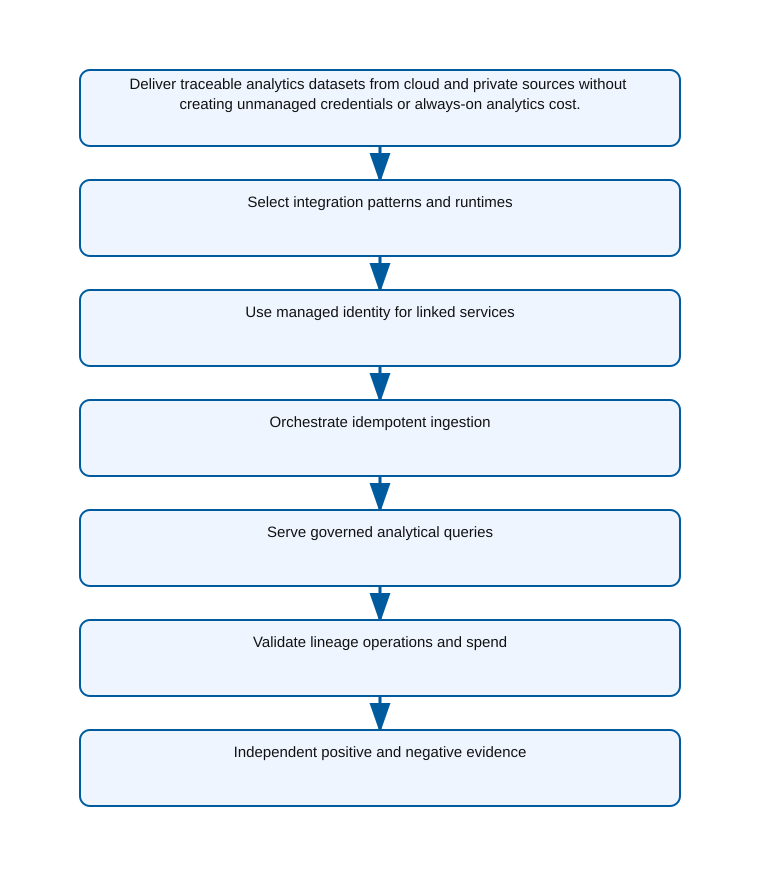

<!-- BEGIN GENERATED AZ305 V1 -->
# LAB-13 — Data Integration and Analytics Architecture

## 1. Navigation

[← LAB-12](../12-storage-economics-durability/README.md) · [Lab catalog](../README.md) · [LAB-14 →](../14-recovery-strategy-hybrid/README.md)

## 2. Scenario and completion contract

Contoso Energy receives hourly files from field partners, change data from operational databases, and telemetry from regional systems. Analysts need governed SQL exploration and curated datasets, while some sources remain on private networks and business owners require lineage from ingestion to published data. The architecture board is comparing Microsoft Fabric, Azure Data Factory with Azure Synapse serverless SQL, and Azure Databricks with orchestration. As the integration and analytics architect, select the platform combination, integration runtime, identity, pipeline, transformation, serving, monitoring, and cost boundaries. The lab uses a safe analogue and must not claim that offline pipeline definitions prove source connectivity, data correctness, or production performance.

- Architect role: Data integration and analytics architect
- Outcome: A governed integration and analytics architecture with explicit hybrid connectivity, orchestration, serving, and evidence boundaries.
- Duration: 175 minutes
- Difficulty: advanced
- Cost class: elevated
- Completion: all five checkpoint assertions, final validation, decision revision, and cleanup review are complete.

## 3. Objective-to-evidence map

| Objective | Requirement | Checkpoint |
| --- | --- | --- |
| `DATA-INT-01` | `LAB13-REQ-01` | [`LAB13-CP01`](#checkpoint-1) |
| `DATA-INT-02` | `LAB13-REQ-02` | [`LAB13-CP02`](#checkpoint-2) |
| `DATA-INT-01` | `LAB13-REQ-03` | [`LAB13-CP03`](#checkpoint-3) |
| `DATA-INT-02` | `LAB13-REQ-04` | [`LAB13-CP04`](#checkpoint-4) |
| `DATA-INT-01` | `LAB13-REQ-05` | [`LAB13-CP05`](#checkpoint-5) |

## 4. Business and quality requirements

Business outcome: Deliver traceable analytics datasets from cloud and private sources without creating unmanaged credentials or always-on analytics cost.

- `LAB13-REQ-01` — Batch, CDC, event, and private-source needs map to appropriate Azure or self-hosted integration runtime boundaries.
- `LAB13-REQ-02` — Supported sources and sinks use the data-factory managed identity or a Key Vault reference with least privilege.
- `LAB13-REQ-03` — The pipeline uses watermarks, deterministic paths, retry policy, and quarantine handling to make reruns safe.
- `LAB13-REQ-04` — Curated lake data is exposed through governed serverless SQL views, with a dedicated pool considered only for measured isolation or performance needs.
- `LAB13-REQ-05` — A synthetic run links source slice, pipeline and activity IDs, curated output, status, duration, owner, and estimated service cost.

Scenario facts:

- **Data:** Partner files, private operational sources, and telemetry events have different arrival, schema, lineage, and replay semantics.
- **Scale:** Hourly batch volume and continuous telemetry throughput are measured per source; no unsupported row-rate estimate is introduced.
- **Latency:** Executive telemetry dashboards require near-real-time updates, while partner-file freshness remains an hourly objective.
- **Availability:** Failed batch slices must resume from watermarks and streaming checkpoints must recover without duplicating accepted events.
- **RTO:** Pipeline restoration is set per flow; the scenario gives no single numerical recovery target.
- **RPO:** Batch reconciliation and stream checkpoint retention define different tolerated replay windows and require owner approval.
- **Budget:** Serverless query and scheduled orchestration avoid always-on analytics cost until Fabric capacity is justified by unified use.

Constraints:

- Cloud and private sources must move without embedded credentials and retain lineage and reconciliation evidence.
- One telemetry stream becomes near-real-time while partner files remain hourly and executives prefer a unified Fabric experience.
- Use only the Azure PowerShell command lane for learner implementation.
- Keep all live changes behind explicit execution and acknowledgement switches.
- Retain only sanitized command evidence and synthetic fixture identifiers.

Assumptions:

- Private sources can reach a hardened self-hosted integration runtime without inbound exposure.
- Source owners provide watermark, schema, and reconciliation rules for batch and stream paths.
- West Europe is the configurable primary example and North Europe is the configurable secondary example.
- The learner has administrator-level Azure operations knowledge but receives no pre-existing authenticated context.
- Offline fixtures demonstrate contract behavior rather than live Azure service behavior.

## 5. Architecture diagram and walkthrough



The flow begins with the business outcome, crosses five independently validated design capabilities, and ends with positive and negative evidence. The SVG is deterministically rendered from `diagrams/architecture.mmd`.

## 6. Concept primer and candidate architectures

Architecture decisions translate measurable requirements into a deliberate service and operating model. A candidate is viable only when every mandatory constraint is met; convenience or familiarity cannot compensate for a disqualifier.

- **Azure Data Factory with ADLS Gen2 and Azure Synapse serverless SQL** (eligible) — Data Factory handles governed batch and private connectivity while ADLS and serverless SQL minimize idle analytics capacity.
- **Microsoft Fabric Data Factory with OneLake and Fabric Warehouse** (eligible) — Fabric provides a unified analytics and dashboard experience, though continuously sized capacity and private-source fit require validation.
- **Azure Databricks with Azure Data Factory orchestration and Delta Lake** (eligible) — Databricks offers powerful stream and lake processing but adds a second engineering and cluster operating model.
- **Self-hosted scripts with embedded source passwords and no checkpoints** (ineligible) — Handwritten transfers may appear inexpensive but expose credentials and cannot prove restart or reconciliation behavior. Disqualifier: LAB13-REQ-02 requires managed identity or protected connections plus replayable lineage evidence.

## 7. Decision, ADR, and Well-Architected review

Criteria weights are C1 30, C2 25, C3 20, C4 15, and C5 10. Weighted totals use `sum(weight × score) / 5`.

| Candidate | Eligible | C1 | C2 | C3 | C4 | C5 | Weighted /100 |
| --- | ---: | ---: | ---: | ---: | ---: | ---: | ---: |
| Azure Data Factory with ADLS Gen2 and Azure Synapse serverless SQL | yes | 5 | 4 | 4 | 4 | 4 | 86 |
| Microsoft Fabric Data Factory with OneLake and Fabric Warehouse | yes | 4 | 4 | 4 | 5 | 2 | 79 |
| Azure Databricks with Azure Data Factory orchestration and Delta Lake | yes | 4 | 4 | 4 | 3 | 2 | 73 |
| Self-hosted scripts with embedded source passwords and no checkpoints | no | 1 | 1 | 1 | 2 | 4 | 29 |

Selected design: **Azure Data Factory with ADLS Gen2 and Azure Synapse serverless SQL**. `ADR-LAB13-001` records the accepted reasoning. Review Reliability, Security, Cost Optimization, Operational Excellence, and Performance Efficiency in `design/decision.yml`; no pillar is implied by another.

Rejected alternatives:

- **Microsoft Fabric Data Factory with OneLake and Fabric Warehouse:** The initial periodic workload does not yet justify moving every flow onto a Fabric capacity commitment.
- **Azure Databricks with Azure Data Factory orchestration and Delta Lake:** Its flexibility exceeds the transformation need and carries more platform ownership for this team.
- **Self-hosted scripts with embedded source passwords and no checkpoints:** It is ineligible because secretless access and recoverable lineage are mandatory.

Architecture risks:

- **Risk:** Forcing hourly partner files through a streaming design can increase cost and duplicate late-arrival handling. **Mitigation:** Keep a batch contract for files and integrate its curated output into the shared semantic layer.
- **Risk:** A Fabric preference can create capacity lock-in before private connectivity and throughput are proven. **Mitigation:** Benchmark the telemetry slice, record capacity utilization, and retain a reversible batch boundary for remaining flows.

Well-Architected consequences:

- **Reliability:** Watermarks, checkpoints, replay rules, and reconciliation distinguish recoverable batch and streaming failures.
- **Security:** Managed identities and hardened private runtimes keep credentials out of pipeline definitions.
- **Cost Optimization:** Batch serverless processing and targeted Fabric capacity align spend with each flow's freshness requirement.
- **Operational Excellence:** Lineage, schema, watermark, and reconciliation evidence give operators a common failure model.
- **Performance Efficiency:** Near-real-time resources serve only the telemetry stream while hourly files retain efficient batch movement.

ADR consequences:

- The analytics platform accepts a hybrid ingestion boundary instead of forcing one cadence onto every source.
- Fabric capacity must be justified and monitored specifically for the executive telemetry experience.

## 8. Inputs, permissions, licensing, cost, and analogue

Use configurable `Location` (`AZ305_LOCATION`, default West Europe) and `SecondaryLocation` (`AZ305_SECONDARY_LOCATION`, default North Europe). Every public input has an explicit `AZ305_*` fallback. Preview is the default; only Golden Lab 00 writes an intent-only `execute: false` preview record. Before an executed cloud command, the supplied subscription and tenant must exactly match the active CLI, Az, and—where applicable—Microsoft Graph contexts. `-Execute` crosses the execution boundary; cost-bearing and tenant-scoped paths also require their independent acknowledgement switches.

Safe analogue: Run local batch and event fixtures through watermark, checkpoint, and reconciliation logic without creating a pipeline or Fabric capacity.

Permissions: Data Factory, storage, Synapse, and Fabric read roles support inventory; pipeline, connection, capacity, or identity changes require separate platform authorization.

Licensing: Data Factory activities, self-hosted integration runtime, Synapse serverless scans, Fabric capacity, and streaming workloads use distinct meters.

Cost boundary: Attribute orchestration runs, data movement, private runtime hours, scanned terabytes, Fabric capacity time, and streaming retention per flow.

## 9. Read-only preflight

```powershell
pwsh ./scripts/azure-powershell/Preflight.ps1 -RunId synthetic-130001
```

Synthetic sample: `{"labId":"LAB-13","track":"azure-powershell","result":"pass","note":"Local tool discovery only"}`. This is illustrative local output, not evidence captured from Azure.

## 10. Five guided checkpoints

### Checkpoint 1: Select integration patterns and runtimes

<a id="checkpoint-1"></a>

**Trace:** `DATA-INT-01` → `LAB13-REQ-01` → `LAB13-CP01`

```powershell
Get-AzDataFactoryV2IntegrationRuntime -ResourceGroupName $ResourceGroup -DataFactoryName $DataFactoryName
```

Expected evidence: Batch, CDC, event, and private-source needs map to appropriate Azure or self-hosted integration runtime boundaries. Retain Source class, integration pattern, runtime type, network boundary, owner, and latency expectation.

Positive assertion:

```powershell
Get-AzDataFactoryV2IntegrationRuntime -ResourceGroupName $ResourceGroup -DataFactoryName $DataFactoryName -Name $IntegrationRuntimeName | Select-Object Name,DataFactoryName,State,Description
```

Negative assertion:

```powershell
Get-AzDataFactoryV2IntegrationRuntime -ResourceGroupName $ResourceGroup -DataFactoryName $DataFactoryName | Where-Object { $_.Name -like '*shared*' -and [string]::IsNullOrWhiteSpace($_.Description) }
```

Failure and retry: A source protocol, firewall, or driver is unsupported by the selected runtime. Validate connector and network prerequisites with synthetic endpoints before changing the platform decision.

Cleanup dependency: Stop and remove only a run-owned synthetic runtime after linked-service dependencies are removed.

WAF consequence: Reliability: explicit runtime ownership and network prerequisites make hybrid data movement recoverable.

### Checkpoint 2: Use managed identity for linked services

<a id="checkpoint-2"></a>

**Trace:** `DATA-INT-02` → `LAB13-REQ-02` → `LAB13-CP02`

```powershell
Get-AzDataFactoryV2LinkedService -ResourceGroupName $ResourceGroup -DataFactoryName $DataFactoryName
```

Expected evidence: Supported sources and sinks use the data-factory managed identity or a Key Vault reference with least privilege. Retain Linked-service name, connector type, authentication class, Key Vault reference label, and target scope.

Positive assertion:

```powershell
Get-AzDataFactoryV2LinkedService -ResourceGroupName $ResourceGroup -DataFactoryName $DataFactoryName -Name $LinkedServiceName | Select-Object Name,@{Name='ConnectorType';Expression={$_.Properties.GetType().Name}}
```

Negative assertion:

```powershell
Get-AzDataFactoryV2LinkedService -ResourceGroupName $ResourceGroup -DataFactoryName $DataFactoryName | Where-Object { $_.Properties.TypeProperties.ConnectionString -or $_.Properties.TypeProperties.AccountKey } | Select-Object -ExpandProperty Name
```

Failure and retry: The connector lacks managed-identity support or the identity cannot traverse a private network boundary. Use a Key Vault-referenced short-lived credential only where required and document rotation and runtime access.

Cleanup dependency: Delete dependent datasets and pipelines before a run-owned linked service; never export secret properties.

WAF consequence: Security: managed identity and Key Vault references keep credentials out of pipeline definitions and evidence.

### Checkpoint 3: Orchestrate idempotent ingestion

<a id="checkpoint-3"></a>

**Trace:** `DATA-INT-01` → `LAB13-REQ-03` → `LAB13-CP03`

```powershell
Get-Content -LiteralPath artifacts/pipeline.json -Raw | ConvertFrom-Json
```

Expected evidence: The pipeline uses watermarks, deterministic paths, retry policy, and quarantine handling to make reruns safe. Retain Definition hash, activity graph, retry policy, watermark owner, quarantine path, and synthetic run result.

Positive assertion:

```powershell
$definition = Get-Content -LiteralPath artifacts/pipeline.json -Raw | ConvertFrom-Json; if ($definition.properties.activities.Count -lt 1) { throw 'The synthetic pipeline has no activity.' }
```

Negative assertion:

```powershell
$definition = Get-Content -LiteralPath artifacts/pipeline.json -Raw | ConvertFrom-Json; if (($definition | ConvertTo-Json -Depth 30) -match '(?i)password|accountKey|connectionString') { throw 'The synthetic pipeline contains an inline credential field.' }
```

Failure and retry: A partial copy advances the watermark or rerun duplicates already committed data. Reconcile the checkpoint table and target partition, then rerun only the idempotent failed slice.

Cleanup dependency: Stop triggers and delete dependent datasets before deleting a run-owned pipeline.

WAF consequence: Operational Excellence: watermarks, quarantine, and idempotent replay make partial pipeline failure supportable.

### Checkpoint 4: Serve governed analytical queries

<a id="checkpoint-4"></a>

**Trace:** `DATA-INT-02` → `LAB13-REQ-04` → `LAB13-CP04`

```powershell
Get-AzSynapseWorkspace -ResourceGroupName $ResourceGroup -Name $SynapseWorkspaceName
```

Expected evidence: Curated lake data is exposed through governed serverless SQL views, with a dedicated pool considered only for measured isolation or performance needs. Retain Workspace label, serving mode, curated-zone path, semantic owner, authorization groups, and query-cost controls.

Positive assertion:

```powershell
Get-AzSynapseWorkspace -ResourceGroupName $ResourceGroup -Name $SynapseWorkspaceName | Select-Object Name,ConnectivityEndpoints,DefaultDataLakeStorage
```

Negative assertion:

```powershell
Get-AzSynapseSqlPool -ResourceGroupName $ResourceGroup -WorkspaceName $SynapseWorkspaceName | Where-Object { $_.Sku.Name -like 'DW*' -and $_.Status -eq 'Online' -and $_.Tags.costOwner -eq $null }
```

Failure and retry: File layout, schema drift, or small-file volume makes serverless queries unstable or expensive. Compact and curate files, enforce schema contracts, and measure scanned bytes before provisioning dedicated capacity.

Cleanup dependency: Remove run-owned SQL artifacts before workspace deletion; retain no source data in evidence.

WAF consequence: Performance Efficiency: curated file layout and serverless views reduce scan amplification for analytical queries.

### Checkpoint 5: Validate lineage operations and spend

<a id="checkpoint-5"></a>

**Trace:** `DATA-INT-01` → `LAB13-REQ-05` → `LAB13-CP05`

```powershell
Get-AzDataFactoryV2PipelineRun -ResourceGroupName $ResourceGroup -DataFactoryName $DataFactoryName -PipelineRunId $PipelineRunId
```

Expected evidence: A synthetic run links source slice, pipeline and activity IDs, curated output, status, duration, owner, and estimated service cost. Retain Sanitized run and activity IDs, statuses, durations, row counts, lineage references, and cost estimate.

Positive assertion:

```powershell
Get-AzDataFactoryV2ActivityRun -ResourceGroupName $ResourceGroup -DataFactoryName $DataFactoryName -PipelineRunId $PipelineRunId -RunStartedAfter $RunStartedAfter -RunStartedBefore $RunStartedBefore
```

Negative assertion:

```powershell
Get-AzDataFactoryV2PipelineRun -ResourceGroupName $ResourceGroup -DataFactoryName $DataFactoryName -LastUpdatedAfter $RunStartedAfter -LastUpdatedBefore $RunStartedBefore | Where-Object { $_.Status -eq 'InProgress' -and $_.RunEnd -lt (Get-Date).AddHours(-2) }
```

Failure and retry: Monitoring records show success while downstream reconciliation detects missing or duplicate rows. Fail the validation, quarantine the slice, and reconcile business counts before republishing.

Cleanup dependency: Cancel run-owned triggers and remove synthetic outputs in dependency order; preserve sanitized validation only.

WAF consequence: Cost Optimization: correlated run, activity, volume, and duration evidence attributes consumption to an owned pipeline.

## 11. Final validation and interpretation

Run `Validate.ps1 -Mode Deployment -Execute` only after an executed run has state and you are authorized to issue the ten read-only checkpoint inspections. Without `-Execute`, ordinary deployment validation records `partial` and exits `2`; Golden Lab 00 alone can validate its intent-only preview locally. Exit `0` means all required assertions pass, `1` means at least one failed, and `2` means the outcome is gated or partial. Positive and negative commands execute independently, so one failure never suppresses its paired assertion.

## 12. Material change request

Executives mandate near-real-time operational dashboards for one telemetry stream while partner files remain hourly and analysts prefer a unified Microsoft Fabric experience; revise the platform boundary without forcing every flow into streaming.

Revised solution: select **Microsoft Fabric Data Factory with OneLake and Fabric Warehouse**. LAB13-REQ-01 requires integration patterns to follow cadence and source boundaries, so Fabric serves the near-real-time telemetry experience while partner files remain hourly batch.

Revised Well-Architected consequences:

- **Reliability:** Stream checkpoints and batch watermarks retain independent replay behavior.
- **Security:** Private-source credentials remain protected even as curated output enters OneLake.
- **Cost Optimization:** Capacity is sized for the dashboard stream instead of converting every file flow to continuous processing.
- **Operational Excellence:** Shared lineage joins both cadences without erasing their distinct failure states.
- **Performance Efficiency:** Telemetry receives low-latency processing and partner files keep throughput-efficient hourly loads.

## 13. Architect job challenge

Compare adding an event-streaming path, adopting Fabric for all workloads, and retaining the selected batch architecture with a separate real-time serving path.

## 14. Troubleshooting, cleanup, and residual verification

- Diagnose connector support, runtime network reachability, and target authorization as distinct integration failures.
- Reconcile source and sink business counts even when orchestration reports a successful activity.
- Measure file layout and scanned bytes before solving serverless query cost with dedicated capacity.

Cleanup previews nonempty state in reverse dependency order, writes `partial`, and exits `2`; an already empty run is completed locally and idempotently. Executed cleanup rechecks the exact live ID plus `purpose`, `labId`, `runId`, and `expiresOn` immediately before each removal, persists state after every absent or removed object, stops on the first dependency failure, and refuses unresolved pre-existing settings. It never automates purge. Finish with `Validate.ps1 -Mode PostCleanup`; the required residual count is zero.

## 15. Exam debrief, assessment, sources, and navigation

Explain the recommendation in terms of requirements, rejected alternatives, failure behavior, and all five WAF pillars. Complete `assessment/QUESTIONS.md`, then use the separately excluded answer key for remediation.

- [Azure Data Architecture Guide](https://learn.microsoft.com/en-us/azure/architecture/data-guide/)
- [Azure Well-Architected Framework](https://learn.microsoft.com/en-us/azure/well-architected/)

[← LAB-12](../12-storage-economics-durability/README.md) · [Lab catalog](../README.md) · [LAB-14 →](../14-recovery-strategy-hybrid/README.md)

## 16. Synchronized lifecycle-script appendix

### Preflight.ps1

```powershell
[CmdletBinding()]
param(
    [string]$SubscriptionId = $env:AZ305_SUBSCRIPTION_ID,
    [string]$TenantId = $env:AZ305_TENANT_ID,
    [ValidatePattern('^[a-z0-9-]{6,64}$')][string]$RunId = $env:AZ305_RUN_ID,
    [string]$Location = $(if ($env:AZ305_LOCATION) { $env:AZ305_LOCATION } else { 'westeurope' }),
    [string]$SecondaryLocation = $(if ($env:AZ305_SECONDARY_LOCATION) { $env:AZ305_SECONDARY_LOCATION } else { 'northeurope' }),
    [string]$ResourceGroup = $(if ($env:AZ305_RESOURCE_GROUP) { $env:AZ305_RESOURCE_GROUP } else { "rg-az305-$RunId" }),
    [string]$WorkloadName = $(if ($env:AZ305_WORKLOAD_NAME) { $env:AZ305_WORKLOAD_NAME } else { "az305-$RunId" }),
    [string]$ExpiresOn = $(if ($env:AZ305_EXPIRES_ON) { $env:AZ305_EXPIRES_ON } else { (Get-Date).ToUniversalTime().AddDays(1).ToString('yyyy-MM-dd') }),
    [string]$DataFactoryName = $env:AZ305_DATA_FACTORY_NAME,
    [string]$IntegrationRuntimeName = $env:AZ305_INTEGRATION_RUNTIME_NAME,
    [string]$LinkedServiceName = $env:AZ305_LINKED_SERVICE_NAME,
    [string]$PipelineRunId = $env:AZ305_PIPELINE_RUN_ID,
    [string]$RunStartedAfter = $env:AZ305_RUN_STARTED_AFTER,
    [string]$RunStartedBefore = $env:AZ305_RUN_STARTED_BEFORE,
    [string]$SynapseWorkspaceName = $env:AZ305_SYNAPSE_WORKSPACE_NAME,
    [switch]$Execute,
    [switch]$AcknowledgeCost,
    [switch]$AcknowledgeTenantChange
)

$ErrorActionPreference = 'Stop'
$PSNativeCommandUseErrorActionPreference = $true
if (-not $RunId) { [Console]::Error.WriteLine('RunId or AZ305_RUN_ID is required.'); exit 2 }
# Every lifecycle entrypoint intentionally exposes the same public parameter contract.
@($SubscriptionId, $TenantId, $RunId, $Location, $SecondaryLocation, $ResourceGroup, $WorkloadName, $ExpiresOn, $DataFactoryName, $IntegrationRuntimeName, $LinkedServiceName, $PipelineRunId, $RunStartedAfter, $RunStartedBefore, $SynapseWorkspaceName, $Execute, $AcknowledgeCost, $AcknowledgeTenantChange) | Out-Null

$requiredCommands = @('pwsh')
$missing = @($requiredCommands | Where-Object { -not (Get-Command $_ -ErrorAction SilentlyContinue) })
if ($missing.Count -gt 0) {
    Write-Error "Missing local commands: $($missing -join ', ')"
    exit 1
}
$requiredCmdlets = @('Get-AzDataFactoryV2ActivityRun', 'Get-AzDataFactoryV2IntegrationRuntime', 'Get-AzDataFactoryV2LinkedService', 'Get-AzDataFactoryV2PipelineRun', 'Get-AzSynapseSqlPool', 'Get-AzSynapseWorkspace')
$missingCmdlets = @($requiredCmdlets | Where-Object { -not (Get-Command $_ -ErrorAction SilentlyContinue) })
if ($missingCmdlets.Count -gt 0) {
    Write-Error "Missing local cmdlets: $($missingCmdlets -join ', ')"
    exit 1
}

[pscustomobject]@{
    labId = 'LAB-13'
    track = 'azure-powershell'
    implementationMode = 'safe-analogue'
    result = 'pass'
    note = 'Local tool discovery only; no Azure or Microsoft Graph request was made.'
} | ConvertTo-Json
exit 0
```

### Setup.ps1

```powershell
[CmdletBinding()]
param(
    [string]$SubscriptionId = $env:AZ305_SUBSCRIPTION_ID,
    [string]$TenantId = $env:AZ305_TENANT_ID,
    [ValidatePattern('^[a-z0-9-]{6,64}$')][string]$RunId = $env:AZ305_RUN_ID,
    [string]$Location = $(if ($env:AZ305_LOCATION) { $env:AZ305_LOCATION } else { 'westeurope' }),
    [string]$SecondaryLocation = $(if ($env:AZ305_SECONDARY_LOCATION) { $env:AZ305_SECONDARY_LOCATION } else { 'northeurope' }),
    [string]$ResourceGroup = $(if ($env:AZ305_RESOURCE_GROUP) { $env:AZ305_RESOURCE_GROUP } else { "rg-az305-$RunId" }),
    [string]$WorkloadName = $(if ($env:AZ305_WORKLOAD_NAME) { $env:AZ305_WORKLOAD_NAME } else { "az305-$RunId" }),
    [string]$ExpiresOn = $(if ($env:AZ305_EXPIRES_ON) { $env:AZ305_EXPIRES_ON } else { (Get-Date).ToUniversalTime().AddDays(1).ToString('yyyy-MM-dd') }),
    [string]$DataFactoryName = $env:AZ305_DATA_FACTORY_NAME,
    [string]$IntegrationRuntimeName = $env:AZ305_INTEGRATION_RUNTIME_NAME,
    [string]$LinkedServiceName = $env:AZ305_LINKED_SERVICE_NAME,
    [string]$PipelineRunId = $env:AZ305_PIPELINE_RUN_ID,
    [string]$RunStartedAfter = $env:AZ305_RUN_STARTED_AFTER,
    [string]$RunStartedBefore = $env:AZ305_RUN_STARTED_BEFORE,
    [string]$SynapseWorkspaceName = $env:AZ305_SYNAPSE_WORKSPACE_NAME,
    [switch]$Execute,
    [switch]$AcknowledgeCost,
    [switch]$AcknowledgeTenantChange
)

$ErrorActionPreference = 'Stop'
$PSNativeCommandUseErrorActionPreference = $true
if (-not $RunId) { [Console]::Error.WriteLine('RunId or AZ305_RUN_ID is required.'); exit 2 }
# Every lifecycle entrypoint intentionally exposes the same public parameter contract.
@($SubscriptionId, $TenantId, $RunId, $Location, $SecondaryLocation, $ResourceGroup, $WorkloadName, $ExpiresOn, $DataFactoryName, $IntegrationRuntimeName, $LinkedServiceName, $PipelineRunId, $RunStartedAfter, $RunStartedBefore, $SynapseWorkspaceName, $Execute, $AcknowledgeCost, $AcknowledgeTenantChange) | Out-Null

$LabRoot = Split-Path (Split-Path $PSScriptRoot -Parent) -Parent
$StateRoot = Join-Path $LabRoot ".state/$RunId"
$StatePath = Join-Path $StateRoot 'run.json'

function Assert-ExactExecutionContext {
    [CmdletBinding()]
    param([string]$ExpectedSubscriptionId, [string]$ExpectedTenantId)
    if ([string]::IsNullOrWhiteSpace($ExpectedSubscriptionId) -or [string]::IsNullOrWhiteSpace($ExpectedTenantId)) { throw 'SubscriptionId and TenantId are required before an Azure request.' }
    $azContext = Get-AzContext -ErrorAction Stop
    if (-not $azContext -or [string]$azContext.Subscription.Id -ine $ExpectedSubscriptionId -or [string]$azContext.Tenant.Id -ine $ExpectedTenantId) {
        throw 'The active Azure PowerShell subscription or tenant does not exactly match the requested context.'
    }
}

function Save-RunState {
    [CmdletBinding()]
    param([Parameter(Mandatory)]$State)
    $temporaryPath = "$StatePath.tmp"
    $State | ConvertTo-Json -Depth 20 | Set-Content -LiteralPath $temporaryPath -Encoding utf8NoBOM
    Move-Item -LiteralPath $temporaryPath -Destination $StatePath -Force
}

function Assert-SafeStateValue {
    [CmdletBinding()]
    param($Value)
    $serialized = $Value | ConvertTo-Json -Depth 12 -Compress
    if ($serialized -match '(?i)"(?:token|password|secret|certificate|connectionString|sas|clientSecret|accessToken|refreshToken|accountKey|privateKey)"\s*:') {
        throw 'A prohibited sensitive field name was returned; state capture is refused.'
    }
}

function Convert-CheckpointOutput {
    [CmdletBinding()]
    param($Value)
    if ($Value -is [string]) { $raw = [string]$Value }
    elseif ($Value -is [System.Collections.IEnumerable] -and @($Value | Where-Object { $_ -isnot [string] }).Count -eq 0) { $raw = @($Value) -join "`n" }
    else { return $Value }
    if ([string]::IsNullOrWhiteSpace($raw)) { return $null }
    try { return ($raw | ConvertFrom-Json -Depth 100) } catch { return $Value }
}

function Get-ReturnedResourceId {
    [CmdletBinding()]
    param($Value)
    $seen = [System.Collections.Generic.HashSet[string]]::new([System.StringComparer]::OrdinalIgnoreCase)
    $results = [System.Collections.Generic.List[string]]::new()
    function Add-ArmId {
        param($Candidate)
        if ($Candidate -is [string] -and $Candidate -match '^/subscriptions/[0-9a-f-]+/(?:resourceGroups/[^/]+(?:/providers/.+)?|providers/.+)$' -and $Candidate -notmatch '/providers/Microsoft\.Resources/deployments/') {
            if ($seen.Add($Candidate)) { $results.Add($Candidate) }
        }
    }
    function Find-DeploymentOutputId {
        param($Item, [int]$Depth)
        if ($null -eq $Item -or $Depth -gt 12) { return }
        if ($Item -is [string]) { Add-ArmId -Candidate $Item; return }
        if ($Item -is [System.Collections.IDictionary]) { foreach ($key in $Item.Keys) { Find-DeploymentOutputId -Item $Item[$key] -Depth ($Depth + 1) }; return }
        if ($Item -is [System.Collections.IEnumerable]) { foreach ($entry in $Item) { Find-DeploymentOutputId -Item $entry -Depth ($Depth + 1) }; return }
        foreach ($property in @($Item.PSObject.Properties | Where-Object { $_.MemberType -in @('NoteProperty', 'Property') })) { Find-DeploymentOutputId -Item $property.Value -Depth ($Depth + 1) }
    }
    foreach ($rootItem in @($Value)) {
        if ($rootItem -is [System.Collections.IDictionary]) {
            foreach ($name in @('id', 'resourceId')) { if ($rootItem.Contains($name)) { Add-ArmId -Candidate $rootItem[$name] } }
            if ($rootItem.Contains('properties') -and $rootItem.properties -and $rootItem.properties.outputs) { Find-DeploymentOutputId -Item $rootItem.properties.outputs -Depth 0 }
            continue
        }
        foreach ($name in @('Id', 'ResourceId')) {
            $property = $rootItem.PSObject.Properties[$name]
            if ($property) { Add-ArmId -Candidate $property.Value }
        }
        if ($rootItem.PSObject.Properties['Properties'] -and $rootItem.Properties -and $rootItem.Properties.outputs) {
            Find-DeploymentOutputId -Item $rootItem.Properties.outputs -Depth 0
        }
    }
    return @($results)
}

function Get-PlannedDeploymentResourceId {
    [CmdletBinding()]
    param($Value)
    $seen = [System.Collections.Generic.HashSet[string]]::new([System.StringComparer]::OrdinalIgnoreCase)
    $results = [System.Collections.Generic.List[string]]::new()
    foreach ($change in @($Value.changes)) {
        $candidate = [string]$change.resourceId
        if ($candidate -match '^/subscriptions/[0-9a-f-]+/(?:resourceGroups/[^/]+(?:/providers/.+)?|providers/.+)$' -and $candidate -notmatch '/providers/Microsoft\.Resources/deployments/' -and $seen.Add($candidate)) {
            $results.Add($candidate)
        }
    }
    return @($results)
}

function Assert-InputSubscriptionScope {
    [CmdletBinding()]
    param($Inputs, [string]$ExpectedSubscriptionId)
    $entries = if ($Inputs -is [System.Collections.IDictionary]) {
        @($Inputs.GetEnumerator())
    } else {
        @($Inputs.PSObject.Properties | ForEach-Object { [pscustomobject]@{ Key = $_.Name; Value = $_.Value } })
    }
    foreach ($entry in $entries) {
        if ($entry.Value -is [string] -and [string]$entry.Value -match '^/subscriptions/([^/]+)/') {
            if ($Matches[1] -ine $ExpectedSubscriptionId) { throw "Input $($entry.Key) belongs to a different subscription." }
        }
    }
}

function Assert-ManagedMutation {
    [CmdletBinding()]
    param($State, [string]$CheckpointId, [bool]$CarriesOwnership, [object[]]$TargetResourceIds)
    if ($CarriesOwnership) { return }
    $targets = @($TargetResourceIds | Where-Object { $_ -is [string] -and $_ -match '^/subscriptions/' })
    if ($targets.Count -eq 0) { throw "$CheckpointId refuses an untagged mutation because no exact ARM target ID was supplied." }
    $knownIds = @($State.managedObjects | ForEach-Object { [string]$_.id })
    if ($knownIds.Count -eq 0) { throw "$CheckpointId refuses to modify a pre-existing object because no run-owned parent has been recorded." }
    foreach ($target in $targets) {
        $related = @($knownIds | Where-Object { $target -ieq $_ -or $target.StartsWith("$_/", [System.StringComparison]::OrdinalIgnoreCase) -or $_.StartsWith("$target/", [System.StringComparison]::OrdinalIgnoreCase) }).Count -gt 0
        if (-not $related) { throw "$CheckpointId refuses a mutation outside the exact run-owned resource boundary." }
    }
}

$executionInputs = [ordered]@{ subscriptionId = $SubscriptionId; tenantId = $TenantId; location = $Location; secondaryLocation = $SecondaryLocation; resourceGroup = $ResourceGroup; workloadName = $WorkloadName; expiresOn = $ExpiresOn; DataFactoryName = $DataFactoryName; IntegrationRuntimeName = $IntegrationRuntimeName; LinkedServiceName = $LinkedServiceName; PipelineRunId = $PipelineRunId; RunStartedAfter = $RunStartedAfter; RunStartedBefore = $RunStartedBefore; SynapseWorkspaceName = $SynapseWorkspaceName }

if (-not $Execute) {
    Write-Output '[preview] No cloud command was called and no state was created.'
    Write-Output '[preview] Re-run with -Execute only in an authorized disposable environment.'
    exit 0
}
# This setup is compatible with the lab implementation mode.
if (-not $AcknowledgeCost) { [Console]::Error.WriteLine('Cost acknowledgement is required.'); exit 2 }
# This lab does not perform a tenant-scoped change by default.
$requiredLabInputs = [ordered]@{ DataFactoryName = $DataFactoryName; PipelineRunId = $PipelineRunId; SynapseWorkspaceName = $SynapseWorkspaceName }
$missingLabInputs = @($requiredLabInputs.GetEnumerator() | Where-Object { $_.Value -is [string] -and [string]::IsNullOrWhiteSpace([string]$_.Value) } | ForEach-Object Key)
if ($missingLabInputs.Count -gt 0) { [Console]::Error.WriteLine("Execution is gated; supply: $($missingLabInputs -join ', ')."); exit 2 }

try {
    Assert-ExactExecutionContext -ExpectedSubscriptionId $SubscriptionId -ExpectedTenantId $TenantId
    Assert-InputSubscriptionScope -Inputs $executionInputs -ExpectedSubscriptionId $SubscriptionId
    Assert-SafeStateValue -Value $executionInputs
}
catch {
    [Console]::Error.WriteLine("Execution is gated by context or input validation: $($_.Exception.Message)")
    exit 2
}

# Recovery state is persisted before the first possible mutation below.
if (Test-Path -LiteralPath $StatePath) {
    [Console]::Error.WriteLine('Run state already exists. Choose a new RunId or complete the recorded cleanup; existing recovery state will not be overwritten.')
    exit 2
}
New-Item -ItemType Directory -Path $StateRoot -Force | Out-Null
$state = [ordered]@{
    schemaVersion = '1.0.0'; labId = 'LAB-13'; runId = $RunId; track = 'azure-powershell'
    implementationMode = 'safe-analogue'; status = 'initialized'
    createdAt = (Get-Date).ToUniversalTime().ToString('o'); execute = $true
    parameters = $executionInputs
    managedObjects = @(); originalSettings = @()
}
Save-RunState -State $state
$state.status = 'deploying'
Save-RunState -State $state

$originalLocation = Get-Location
try {
    Set-Location -LiteralPath $LabRoot
    # 13-CP01: Select integration patterns and runtimes
    $stepResult = & { Get-AzDataFactoryV2IntegrationRuntime -ResourceGroupName $ResourceGroup -DataFactoryName $DataFactoryName }
    $null = $stepResult

    # 13-CP02: Use managed identity for linked services
    $stepResult = & { Get-AzDataFactoryV2LinkedService -ResourceGroupName $ResourceGroup -DataFactoryName $DataFactoryName }
    $null = $stepResult

    # 13-CP03: Orchestrate idempotent ingestion
    $stepResult = & { Get-Content -LiteralPath artifacts/pipeline.json -Raw | ConvertFrom-Json }
    $null = $stepResult

    # 13-CP04: Serve governed analytical queries
    $stepResult = & { Get-AzSynapseWorkspace -ResourceGroupName $ResourceGroup -Name $SynapseWorkspaceName }
    $null = $stepResult

    # 13-CP05: Validate lineage operations and spend
    $stepResult = & { Get-AzDataFactoryV2PipelineRun -ResourceGroupName $ResourceGroup -DataFactoryName $DataFactoryName -PipelineRunId $PipelineRunId }
    $null = $stepResult

    $state.status = 'deployed'
    Save-RunState -State $state
} catch {
    $state.status = 'failed'
    Save-RunState -State $state
    Write-Error $_
    exit 1
} finally {
    Set-Location -LiteralPath $originalLocation
}
exit 0
```

### Validate.ps1

```powershell
[CmdletBinding()]
param(
    [string]$SubscriptionId = $env:AZ305_SUBSCRIPTION_ID,
    [string]$TenantId = $env:AZ305_TENANT_ID,
    [ValidatePattern('^[a-z0-9-]{6,64}$')][string]$RunId = $env:AZ305_RUN_ID,
    [string]$Location = $(if ($env:AZ305_LOCATION) { $env:AZ305_LOCATION } else { 'westeurope' }),
    [string]$SecondaryLocation = $(if ($env:AZ305_SECONDARY_LOCATION) { $env:AZ305_SECONDARY_LOCATION } else { 'northeurope' }),
    [string]$ResourceGroup = $(if ($env:AZ305_RESOURCE_GROUP) { $env:AZ305_RESOURCE_GROUP } else { "rg-az305-$RunId" }),
    [string]$WorkloadName = $(if ($env:AZ305_WORKLOAD_NAME) { $env:AZ305_WORKLOAD_NAME } else { "az305-$RunId" }),
    [string]$ExpiresOn = $(if ($env:AZ305_EXPIRES_ON) { $env:AZ305_EXPIRES_ON } else { (Get-Date).ToUniversalTime().AddDays(1).ToString('yyyy-MM-dd') }),
    [string]$DataFactoryName = $env:AZ305_DATA_FACTORY_NAME,
    [string]$IntegrationRuntimeName = $env:AZ305_INTEGRATION_RUNTIME_NAME,
    [string]$LinkedServiceName = $env:AZ305_LINKED_SERVICE_NAME,
    [string]$PipelineRunId = $env:AZ305_PIPELINE_RUN_ID,
    [string]$RunStartedAfter = $env:AZ305_RUN_STARTED_AFTER,
    [string]$RunStartedBefore = $env:AZ305_RUN_STARTED_BEFORE,
    [string]$SynapseWorkspaceName = $env:AZ305_SYNAPSE_WORKSPACE_NAME,
    [ValidateSet('Deployment', 'PostCleanup')][string]$Mode = 'Deployment',
    [switch]$Execute,
    [switch]$AcknowledgeCost,
    [switch]$AcknowledgeTenantChange
)

$ErrorActionPreference = 'Stop'
$PSNativeCommandUseErrorActionPreference = $true
if (-not $RunId) { [Console]::Error.WriteLine('RunId or AZ305_RUN_ID is required.'); exit 2 }
# Every lifecycle entrypoint intentionally exposes the same public parameter contract.
@($SubscriptionId, $TenantId, $RunId, $Location, $SecondaryLocation, $ResourceGroup, $WorkloadName, $ExpiresOn, $DataFactoryName, $IntegrationRuntimeName, $LinkedServiceName, $PipelineRunId, $RunStartedAfter, $RunStartedBefore, $SynapseWorkspaceName, $Mode, $Execute, $AcknowledgeCost, $AcknowledgeTenantChange) | Out-Null

$LabRoot = Split-Path (Split-Path $PSScriptRoot -Parent) -Parent
$StateRoot = Join-Path $LabRoot ".state/$RunId"
$RunPath = Join-Path $StateRoot 'run.json'
$ValidationPath = Join-Path $StateRoot 'validation.json'

function Assert-ExactExecutionContext {
    [CmdletBinding()]
    param([string]$ExpectedSubscriptionId, [string]$ExpectedTenantId)
    if ([string]::IsNullOrWhiteSpace($ExpectedSubscriptionId) -or [string]::IsNullOrWhiteSpace($ExpectedTenantId)) { throw 'SubscriptionId and TenantId are required before an Azure request.' }
    $azContext = Get-AzContext -ErrorAction Stop
    if (-not $azContext -or [string]$azContext.Subscription.Id -ine $ExpectedSubscriptionId -or [string]$azContext.Tenant.Id -ine $ExpectedTenantId) {
        throw 'The active Azure PowerShell subscription or tenant does not exactly match the requested context.'
    }
}


if (-not (Test-Path -LiteralPath $RunPath)) {
    Write-Warning 'No run state exists; validation is gated.'
    exit 2
}
$state = Get-Content -LiteralPath $RunPath -Raw | ConvertFrom-Json
$assertions = [System.Collections.Generic.List[object]]::new()
function Add-ValidationAssertion {
    [CmdletBinding()]
    param([string]$Id, [ValidateSet('positive', 'negative')][string]$Kind, [bool]$Passed, [string]$Message)
    $assertions.Add([pscustomobject]@{ id = $Id; kind = $Kind; passed = $Passed; message = $Message })
}

function Save-ValidationArtifact {
    [CmdletBinding()]
    param([ValidateSet('pass', 'partial', 'fail')][string]$Result)
    $artifact = [ordered]@{ schemaVersion = '1.0.0'; labId = 'LAB-13'; runId = $RunId; mode = $Mode; result = $Result; validatedAt = (Get-Date).ToUniversalTime().ToString('o'); assertions = @($assertions) }
    $artifact | ConvertTo-Json -Depth 12 | Set-Content -LiteralPath $ValidationPath -Encoding utf8NoBOM
}

function Test-PositiveEvidence {
    [CmdletBinding()]
    param($Value)
    if ($Value -is [bool]) { return $Value }
    if ($null -eq $Value) { return $false }
    if ($Value -is [string]) { return -not [string]::IsNullOrWhiteSpace($Value) }
    if ($Value -is [System.Collections.IEnumerable]) { return @($Value).Count -gt 0 }
    return $true
}

function Test-NegativeEvidence {
    [CmdletBinding()]
    param($Value)
    if ($Value -is [bool]) { return $Value }
    if ($null -eq $Value) { return $true }
    if ($Value -is [string]) { return [string]::IsNullOrWhiteSpace($Value) }
    if ($Value -is [System.Collections.IEnumerable]) { return @($Value).Count -eq 0 }
    $properties = @($Value.PSObject.Properties | Where-Object { $_.MemberType -in @('NoteProperty', 'Property') })
    if ($properties.Count -eq 0) { return $false }
    return @($properties | Where-Object { -not (Test-NegativeEvidence -Value $_.Value) }).Count -eq 0
}

function Test-ProhibitedStateField {
    [CmdletBinding()]
    param($Value)
    $serialized = $Value | ConvertTo-Json -Depth 20
    return $serialized -match '(?i)"(?:token|password|secret|certificate|connectionString|sas|clientSecret|accessToken|refreshToken|accountKey|privateKey)"\s*:'
}

function Assert-InputSubscriptionScope {
    [CmdletBinding()]
    param($Inputs, [string]$ExpectedSubscriptionId)
    $entries = if ($Inputs -is [System.Collections.IDictionary]) {
        @($Inputs.GetEnumerator())
    } else {
        @($Inputs.PSObject.Properties | ForEach-Object { [pscustomobject]@{ Key = $_.Name; Value = $_.Value } })
    }
    foreach ($entry in $entries) {
        if ($entry.Value -is [string] -and [string]$entry.Value -match '^/subscriptions/([^/]+)/' -and $Matches[1] -ine $ExpectedSubscriptionId) {
            throw "Input $($entry.Key) belongs to a different subscription."
        }
    }
}

$stateIdentityMatches = (
    $state.labId -ceq 'LAB-13' -and
    $state.runId -ceq $RunId -and
    $state.track -ceq 'azure-powershell' -and
    $state.implementationMode -ceq 'safe-analogue' -and
    ([string]$state.parameters.subscriptionId -ieq $SubscriptionId -and [string]$state.parameters.tenantId -ieq $TenantId)
)
Add-ValidationAssertion -Id 'LAB13-VAL-POS-01' -Kind positive -Passed $stateIdentityMatches -Message 'Run identity, implementation mode, command track, tenant, and subscription exactly match the copied lab and requested run.'
$hasSensitiveName = Test-ProhibitedStateField -Value $state
Add-ValidationAssertion -Id 'LAB13-VAL-NEG-01' -Kind negative -Passed (-not $hasSensitiveName) -Message 'State contains no prohibited sensitive field name.'

if ($Mode -eq 'PostCleanup') {
    $cleanupPath = Join-Path $StateRoot 'cleanup.json'
    $cleanup = if (Test-Path -LiteralPath $cleanupPath) { Get-Content -LiteralPath $cleanupPath -Raw | ConvertFrom-Json } else { $null }
    Add-ValidationAssertion -Id 'LAB13-VAL-POS-02' -Kind positive -Passed ($null -ne $cleanup -and $cleanup.labId -ceq 'LAB-13' -and $cleanup.runId -ceq $RunId -and $cleanup.result -eq 'pass' -and $cleanup.ownershipVerified) -Message 'The exact run cleanup completed with verified ownership.'
    Add-ValidationAssertion -Id 'LAB13-VAL-NEG-02' -Kind negative -Passed ($null -ne $cleanup -and $cleanup.activeManagedObjects -eq 0 -and @($state.managedObjects).Count -eq 0 -and @($state.originalSettings).Count -eq 0 -and $state.status -eq 'cleaned') -Message 'No active managed object or unresolved original setting remains in cleanup or run state.'
    $postCleanupPassed = @($assertions | Where-Object { -not $_.passed }).Count -eq 0
    Save-ValidationArtifact -Result $(if ($postCleanupPassed) { 'pass' } else { 'fail' })
    if ($postCleanupPassed) { exit 0 }
    exit 1
}

Add-ValidationAssertion -Id 'LAB13-VAL-POS-02' -Kind positive -Passed ($state.status -eq 'deployed') -Message 'The executed setup completed successfully; a failed setup can never validate as pass.'
Add-ValidationAssertion -Id 'LAB13-VAL-NEG-02' -Kind negative -Passed (@($state.managedObjects | Where-Object { $_.tags.purpose -ne 'az305-lab' -or $_.tags.labId -ne 'LAB-13' -or $_.tags.runId -ne $RunId }).Count -eq 0) -Message 'No recorded object has a foreign ownership tag.'

if (@($assertions | Where-Object { -not $_.passed }).Count -gt 0) {
    Save-ValidationArtifact -Result 'fail'
    exit 1
}
if (-not $Execute) {
    # This lab has no special intent-only validation path.
    Save-ValidationArtifact -Result 'partial'
    Write-Warning 'Checkpoint validation is gated; re-run with -Execute after confirming the exact read-only context.'
    exit 2
}
# The validation surface is compatible with this lab implementation mode.
$requiredValidationInputs = [ordered]@{ DataFactoryName = $DataFactoryName; IntegrationRuntimeName = $IntegrationRuntimeName; LinkedServiceName = $LinkedServiceName; PipelineRunId = $PipelineRunId; RunStartedAfter = $RunStartedAfter; RunStartedBefore = $RunStartedBefore; SynapseWorkspaceName = $SynapseWorkspaceName }
$missingValidationInputs = @($requiredValidationInputs.GetEnumerator() | Where-Object { $_.Value -is [string] -and [string]::IsNullOrWhiteSpace([string]$_.Value) } | ForEach-Object Key)
if ($missingValidationInputs.Count -gt 0) {
    Add-ValidationAssertion -Id 'LAB13-VAL-POS-CONTEXT' -Kind positive -Passed $false -Message 'One or more required non-secret validation inputs are missing.'
    Save-ValidationArtifact -Result 'partial'
    exit 2
}
try {
    Assert-ExactExecutionContext -ExpectedSubscriptionId $SubscriptionId -ExpectedTenantId $TenantId
    Assert-InputSubscriptionScope -Inputs $state.parameters -ExpectedSubscriptionId $SubscriptionId
    Add-ValidationAssertion -Id 'LAB13-VAL-POS-CONTEXT' -Kind positive -Passed $true -Message 'The active tenant and subscription exactly match the requested validation context.'
}
catch {
    Add-ValidationAssertion -Id 'LAB13-VAL-POS-CONTEXT' -Kind positive -Passed $false -Message 'Exact execution context could not be proven.'
    Save-ValidationArtifact -Result 'partial'
    exit 2
}

$originalLocation = Get-Location
try {
    Set-Location -LiteralPath $LabRoot
# LAB13-CP01: run both polarities even when one fails.
$positivePassed = $false
try {
    $global:LASTEXITCODE = 0
    $positiveEvidence = & { Get-AzDataFactoryV2IntegrationRuntime -ResourceGroupName $ResourceGroup -DataFactoryName $DataFactoryName -Name $IntegrationRuntimeName | Select-Object Name,DataFactoryName,State,Description }
    $positivePassed = (Test-PositiveEvidence -Value $positiveEvidence)
    $null = $positiveEvidence
} catch { $positivePassed = $false }
Add-ValidationAssertion -Id 'LAB13-CP01-POS' -Kind positive -Passed $positivePassed -Message 'Batch, CDC, event, and private-source needs map to appropriate Azure or self-hosted integration runtime boundaries.'

$negativePassed = $false
try {
    $global:LASTEXITCODE = 0
    $negativeEvidence = & { Get-AzDataFactoryV2IntegrationRuntime -ResourceGroupName $ResourceGroup -DataFactoryName $DataFactoryName | Where-Object { $_.Name -like '*shared*' -and [string]::IsNullOrWhiteSpace($_.Description) } }
    $negativePassed = (Test-NegativeEvidence -Value $negativeEvidence)
    $null = $negativeEvidence
} catch { $negativePassed = $false }
Add-ValidationAssertion -Id 'LAB13-CP01-NEG' -Kind negative -Passed $negativePassed -Message 'An undocumented shared self-hosted runtime is not accepted as a universal connectivity solution.'

# LAB13-CP02: run both polarities even when one fails.
$positivePassed = $false
try {
    $global:LASTEXITCODE = 0
    $positiveEvidence = & { Get-AzDataFactoryV2LinkedService -ResourceGroupName $ResourceGroup -DataFactoryName $DataFactoryName -Name $LinkedServiceName | Select-Object Name,@{Name='ConnectorType';Expression={$_.Properties.GetType().Name}} }
    $positivePassed = (Test-PositiveEvidence -Value $positiveEvidence)
    $null = $positiveEvidence
} catch { $positivePassed = $false }
Add-ValidationAssertion -Id 'LAB13-CP02-POS' -Kind positive -Passed $positivePassed -Message 'Supported sources and sinks use the data-factory managed identity or a Key Vault reference with least privilege.'

$negativePassed = $false
try {
    $global:LASTEXITCODE = 0
    $negativeEvidence = & { Get-AzDataFactoryV2LinkedService -ResourceGroupName $ResourceGroup -DataFactoryName $DataFactoryName | Where-Object { $_.Properties.TypeProperties.ConnectionString -or $_.Properties.TypeProperties.AccountKey } | Select-Object -ExpandProperty Name }
    $negativePassed = (Test-NegativeEvidence -Value $negativeEvidence)
    $null = $negativeEvidence
} catch { $negativePassed = $false }
Add-ValidationAssertion -Id 'LAB13-CP02-NEG' -Kind negative -Passed $negativePassed -Message 'Inline connection strings, account keys, and embedded credentials are absent from pipeline definitions and evidence.'

# LAB13-CP03: run both polarities even when one fails.
$positivePassed = $false
try {
    $global:LASTEXITCODE = 0
    $positiveEvidence = & { $definition = Get-Content -LiteralPath artifacts/pipeline.json -Raw | ConvertFrom-Json; if ($definition.properties.activities.Count -lt 1) { throw 'The synthetic pipeline has no activity.' } }
    $positivePassed = $true
    $null = $positiveEvidence
} catch { $positivePassed = $false }
Add-ValidationAssertion -Id 'LAB13-CP03-POS' -Kind positive -Passed $positivePassed -Message 'The pipeline uses watermarks, deterministic paths, retry policy, and quarantine handling to make reruns safe.'

$negativePassed = $false
try {
    $global:LASTEXITCODE = 0
    $negativeEvidence = & { $definition = Get-Content -LiteralPath artifacts/pipeline.json -Raw | ConvertFrom-Json; if (($definition | ConvertTo-Json -Depth 30) -match '(?i)password|accountKey|connectionString') { throw 'The synthetic pipeline contains an inline credential field.' } }
    $negativePassed = $true
    $null = $negativeEvidence
} catch { $negativePassed = $false }
Add-ValidationAssertion -Id 'LAB13-CP03-NEG' -Kind negative -Passed $negativePassed -Message 'Empty pipelines and blind append operations without duplicate handling do not satisfy ingestion.'

# LAB13-CP04: run both polarities even when one fails.
$positivePassed = $false
try {
    $global:LASTEXITCODE = 0
    $positiveEvidence = & { Get-AzSynapseWorkspace -ResourceGroupName $ResourceGroup -Name $SynapseWorkspaceName | Select-Object Name,ConnectivityEndpoints,DefaultDataLakeStorage }
    $positivePassed = (Test-PositiveEvidence -Value $positiveEvidence)
    $null = $positiveEvidence
} catch { $positivePassed = $false }
Add-ValidationAssertion -Id 'LAB13-CP04-POS' -Kind positive -Passed $positivePassed -Message 'Curated lake data is exposed through governed serverless SQL views, with a dedicated pool considered only for measured isolation or performance needs.'

$negativePassed = $false
try {
    $global:LASTEXITCODE = 0
    $negativeEvidence = & { Get-AzSynapseSqlPool -ResourceGroupName $ResourceGroup -WorkspaceName $SynapseWorkspaceName | Where-Object { $_.Sku.Name -like 'DW*' -and $_.Status -eq 'Online' -and $_.Tags.costOwner -eq $null } }
    $negativePassed = (Test-NegativeEvidence -Value $negativeEvidence)
    $null = $negativeEvidence
} catch { $negativePassed = $false }
Add-ValidationAssertion -Id 'LAB13-CP04-NEG' -Kind negative -Passed $negativePassed -Message 'An always-on dedicated SQL pool without a cost owner is not introduced by default.'

# LAB13-CP05: run both polarities even when one fails.
$positivePassed = $false
try {
    $global:LASTEXITCODE = 0
    $positiveEvidence = & { Get-AzDataFactoryV2ActivityRun -ResourceGroupName $ResourceGroup -DataFactoryName $DataFactoryName -PipelineRunId $PipelineRunId -RunStartedAfter $RunStartedAfter -RunStartedBefore $RunStartedBefore }
    $positivePassed = (Test-PositiveEvidence -Value $positiveEvidence)
    $null = $positiveEvidence
} catch { $positivePassed = $false }
Add-ValidationAssertion -Id 'LAB13-CP05-POS' -Kind positive -Passed $positivePassed -Message 'A synthetic run links source slice, pipeline and activity IDs, curated output, status, duration, owner, and estimated service cost.'

$negativePassed = $false
try {
    $global:LASTEXITCODE = 0
    $negativeEvidence = & { Get-AzDataFactoryV2PipelineRun -ResourceGroupName $ResourceGroup -DataFactoryName $DataFactoryName -LastUpdatedAfter $RunStartedAfter -LastUpdatedBefore $RunStartedBefore | Where-Object { $_.Status -eq 'InProgress' -and $_.RunEnd -lt (Get-Date).AddHours(-2) } }
    $negativePassed = (Test-NegativeEvidence -Value $negativeEvidence)
    $null = $negativeEvidence
} catch { $negativePassed = $false }
Add-ValidationAssertion -Id 'LAB13-CP05-NEG' -Kind negative -Passed $negativePassed -Message 'Stalled runs, sensitive input or output payloads, and unowned spend are not treated as successful evidence.'

}
finally {
    Set-Location -LiteralPath $originalLocation
}

$passed = @($assertions | Where-Object { -not $_.passed }).Count -eq 0
Save-ValidationArtifact -Result $(if ($passed) { 'pass' } else { 'fail' })
if ($passed) { exit 0 }
exit 1
```

### Cleanup.ps1

```powershell
[CmdletBinding()]
param(
    [string]$SubscriptionId = $env:AZ305_SUBSCRIPTION_ID,
    [string]$TenantId = $env:AZ305_TENANT_ID,
    [ValidatePattern('^[a-z0-9-]{6,64}$')][string]$RunId = $env:AZ305_RUN_ID,
    [string]$Location = $(if ($env:AZ305_LOCATION) { $env:AZ305_LOCATION } else { 'westeurope' }),
    [string]$SecondaryLocation = $(if ($env:AZ305_SECONDARY_LOCATION) { $env:AZ305_SECONDARY_LOCATION } else { 'northeurope' }),
    [string]$ResourceGroup = $(if ($env:AZ305_RESOURCE_GROUP) { $env:AZ305_RESOURCE_GROUP } else { "rg-az305-$RunId" }),
    [string]$WorkloadName = $(if ($env:AZ305_WORKLOAD_NAME) { $env:AZ305_WORKLOAD_NAME } else { "az305-$RunId" }),
    [string]$ExpiresOn = $(if ($env:AZ305_EXPIRES_ON) { $env:AZ305_EXPIRES_ON } else { (Get-Date).ToUniversalTime().AddDays(1).ToString('yyyy-MM-dd') }),
    [string]$DataFactoryName = $env:AZ305_DATA_FACTORY_NAME,
    [string]$IntegrationRuntimeName = $env:AZ305_INTEGRATION_RUNTIME_NAME,
    [string]$LinkedServiceName = $env:AZ305_LINKED_SERVICE_NAME,
    [string]$PipelineRunId = $env:AZ305_PIPELINE_RUN_ID,
    [string]$RunStartedAfter = $env:AZ305_RUN_STARTED_AFTER,
    [string]$RunStartedBefore = $env:AZ305_RUN_STARTED_BEFORE,
    [string]$SynapseWorkspaceName = $env:AZ305_SYNAPSE_WORKSPACE_NAME,
    [switch]$Execute,
    [switch]$AcknowledgeCost,
    [switch]$AcknowledgeTenantChange
)

$ErrorActionPreference = 'Stop'
$PSNativeCommandUseErrorActionPreference = $true
if (-not $RunId) { [Console]::Error.WriteLine('RunId or AZ305_RUN_ID is required.'); exit 2 }
# Every lifecycle entrypoint intentionally exposes the same public parameter contract.
@($SubscriptionId, $TenantId, $RunId, $Location, $SecondaryLocation, $ResourceGroup, $WorkloadName, $ExpiresOn, $DataFactoryName, $IntegrationRuntimeName, $LinkedServiceName, $PipelineRunId, $RunStartedAfter, $RunStartedBefore, $SynapseWorkspaceName, $Execute, $AcknowledgeCost, $AcknowledgeTenantChange) | Out-Null

$LabRoot = Split-Path (Split-Path $PSScriptRoot -Parent) -Parent
$StateRoot = Join-Path $LabRoot ".state/$RunId"
$RunPath = Join-Path $StateRoot 'run.json'
$CleanupPath = Join-Path $StateRoot 'cleanup.json'

function Assert-ExactExecutionContext {
    [CmdletBinding()]
    param([string]$ExpectedSubscriptionId, [string]$ExpectedTenantId)
    if ([string]::IsNullOrWhiteSpace($ExpectedSubscriptionId) -or [string]::IsNullOrWhiteSpace($ExpectedTenantId)) { throw 'SubscriptionId and TenantId are required before an Azure request.' }
    $azContext = Get-AzContext -ErrorAction Stop
    if (-not $azContext -or [string]$azContext.Subscription.Id -ine $ExpectedSubscriptionId -or [string]$azContext.Tenant.Id -ine $ExpectedTenantId) {
        throw 'The active Azure PowerShell subscription or tenant does not exactly match the requested context.'
    }
}


function Save-RunState {
    [CmdletBinding()]
    param([Parameter(Mandatory)]$State)
    $temporaryPath = "$RunPath.tmp"
    $State | ConvertTo-Json -Depth 20 | Set-Content -LiteralPath $temporaryPath -Encoding utf8NoBOM
    Move-Item -LiteralPath $temporaryPath -Destination $RunPath -Force
}

function Save-CleanupArtifact {
    [CmdletBinding()]
    param(
        [ValidateSet('pass', 'partial', 'fail')][string]$Result,
        [bool]$OwnershipVerified
    )
    $artifact = [ordered]@{
        schemaVersion = '1.0.0'; labId = 'LAB-13'; runId = $RunId; result = $Result
        completedAt = (Get-Date).ToUniversalTime().ToString('o'); ownershipVerified = $OwnershipVerified
        activeManagedObjects = @($state.managedObjects).Count; actions = @($actions)
    }
    $temporaryPath = "$CleanupPath.tmp"
    $artifact | ConvertTo-Json -Depth 12 | Set-Content -LiteralPath $temporaryPath -Encoding utf8NoBOM
    Move-Item -LiteralPath $temporaryPath -Destination $CleanupPath -Force
}

function Assert-ExactLiveOwnership {
    [CmdletBinding()]
    param($Tags, $Managed)
    if ($null -eq $Tags) { throw 'Live resource has no ownership tags.' }
    $valid = (
        [string]$Tags.purpose -ceq 'az305-lab' -and
        [string]$Tags.labId -ceq 'LAB-13' -and
        [string]$Tags.runId -ceq $RunId -and
        [string]$Tags.expiresOn -ceq [string]$Managed.tags.expiresOn
    )
    if (-not $valid) { throw 'Live ownership tags do not exactly match run state.' }
}

function Complete-ManagedObject {
    [CmdletBinding()]
    param([Parameter(Mandatory)][string]$ManagedId, [ValidateSet('removed', 'absent')][string]$Result)
    $state.managedObjects = @($state.managedObjects | Where-Object { [string]$_.id -ine $ManagedId })
    # Settings for a deleted run-owned object or its descendants no longer need restoration.
    $state.originalSettings = @($state.originalSettings | Where-Object {
        $settingId = [string]$_.id
        -not ($settingId -ieq $ManagedId -or $settingId.StartsWith("$ManagedId/", [System.StringComparison]::OrdinalIgnoreCase))
    })
    Save-RunState -State $state
    $actions.Add([pscustomobject]@{ id = $ManagedId; result = $Result })
}

if (-not (Test-Path -LiteralPath $RunPath)) { Write-Warning 'No run state exists; cleanup is gated.'; exit 2 }
try { $state = Get-Content -LiteralPath $RunPath -Raw | ConvertFrom-Json -Depth 100 }
catch { [Console]::Error.WriteLine('Cleanup refused because run state is not valid JSON.'); exit 1 }
$actions = [System.Collections.Generic.List[object]]::new()
$identityValid = (
    $state.labId -ceq 'LAB-13' -and
    $state.runId -ceq $RunId -and
    $state.track -ceq 'azure-powershell' -and
    $state.implementationMode -ceq 'safe-analogue'
)
if (-not $identityValid) {
    $actions.Add([pscustomobject]@{ id = 'identity-check'; result = 'refused' })
    Save-CleanupArtifact -Result fail -OwnershipVerified $false
    [Console]::Error.WriteLine('Cleanup refused because the lab, run, track, mode, tenant, or subscription does not exactly match run state.')
    exit 1
}

if (@($state.managedObjects).Count -gt 0 -and (
    [string]::IsNullOrWhiteSpace($SubscriptionId) -or
    [string]::IsNullOrWhiteSpace($TenantId) -or
    [string]$state.parameters.subscriptionId -ine $SubscriptionId -or
    [string]$state.parameters.tenantId -ine $TenantId
)) {
    $actions.Add([pscustomobject]@{ id = 'context-record'; result = 'refused' })
    Save-CleanupArtifact -Result fail -OwnershipVerified $false
    [Console]::Error.WriteLine('Cleanup refused because the requested tenant and subscription do not exactly match run state.')
    exit 1
}

$ownershipValid = $true
foreach ($managed in @($state.managedObjects)) {
    $valid = (
        $managed.id -and
        [string]$managed.id -match '^/subscriptions/([^/]+)/' -and
        $Matches[1] -ieq $SubscriptionId -and
        [string]$managed.tags.purpose -ceq 'az305-lab' -and
        [string]$managed.tags.labId -ceq 'LAB-13' -and
        [string]$managed.tags.runId -ceq $RunId -and
        -not [string]::IsNullOrWhiteSpace([string]$managed.tags.expiresOn) -and
        [string]$managed.tags.expiresOn -ceq [string]$state.parameters.expiresOn
    )
    if (-not $valid) { $ownershipValid = $false }
}
if (-not $ownershipValid) {
    $actions.Add([pscustomobject]@{ id = 'ownership-check'; result = 'refused' })
    Save-CleanupArtifact -Result fail -OwnershipVerified $false
    [Console]::Error.WriteLine('Cleanup refused because recorded IDs and ownership tags could not be proven exactly.')
    exit 1
}

if (@($state.managedObjects).Count -eq 0 -and @($state.originalSettings).Count -gt 0) {
    $state.status = 'failed'
    Save-RunState -State $state
    $actions.Add([pscustomobject]@{ id = 'original-settings'; result = 'refused' })
    Save-CleanupArtifact -Result fail -OwnershipVerified $false
    [Console]::Error.WriteLine('Cleanup refused because original settings remain without a run-owned object whose deletion can safely restore the boundary.')
    exit 1
}

# This implementation mode may clean only exact run-owned cloud objects.

$orderedObjects = @($state.managedObjects)
[array]::Reverse($orderedObjects)
if (@($state.managedObjects).Count -eq 0) {
    $state.status = 'cleaned'
    Save-RunState -State $state
    Save-CleanupArtifact -Result pass -OwnershipVerified $true
    exit 0
}

if (-not $Execute) {
    foreach ($managed in $orderedObjects) { $actions.Add([pscustomobject]@{ id = $managed.id; result = 'planned' }) }
    Save-CleanupArtifact -Result partial -OwnershipVerified $true
    Write-Output '[preview] Dependency-aware cleanup plan written; no cloud command was called.'
    exit 2
}

try {
    Assert-ExactExecutionContext -ExpectedSubscriptionId $SubscriptionId -ExpectedTenantId $TenantId
}
catch {
    $actions.Add([pscustomobject]@{ id = 'context-check'; result = 'refused' })
    Save-CleanupArtifact -Result partial -OwnershipVerified $false
    [Console]::Error.WriteLine("Cleanup is gated by exact context validation: $($_.Exception.Message)")
    exit 2
}

# Persist the cleanup transition before the first possible delete.
$state.status = 'cleaning'
Save-RunState -State $state
$cleanupFailed = $false
foreach ($managed in $orderedObjects) {
    try {
        # State is necessary but not sufficient: inspect the exact live ID and tags immediately before removal.
        $liveResource = $null
        try { $liveResource = Get-AzResource -ResourceId $managed.id -ErrorAction Stop }
        catch {
            $lookupError = "$($_.FullyQualifiedErrorId) $($_.Exception.Message)"
            if ($lookupError -match '(?i)\b(?:ResourceNotFound|ResourceGroupNotFound|could not be found|was not found)\b') {
                Complete-ManagedObject -ManagedId $managed.id -Result absent
                continue
            }
            throw
        }
        if ($null -eq $liveResource) {
            Complete-ManagedObject -ManagedId $managed.id -Result absent
            continue
        }
        if ([string]$liveResource.ResourceId -ine [string]$managed.id) { throw 'Live resource ID does not exactly match run state.' }
        Assert-ExactLiveOwnership -Tags $liveResource.Tags -Managed $managed
        Remove-AzResource -ResourceId $managed.id -Force -ErrorAction Stop | Out-Null
        Complete-ManagedObject -ManagedId $managed.id -Result removed
    } catch {
        $actions.Add([pscustomobject]@{ id = $managed.id; result = 'failed' })
        $cleanupFailed = $true
        break
    }
}
if ($cleanupFailed -or @($state.managedObjects).Count -gt 0 -or @($state.originalSettings).Count -gt 0) {
    $state.status = 'failed'
    Save-RunState -State $state
    Save-CleanupArtifact -Result partial -OwnershipVerified $false
    exit 1
}
$state.status = 'cleaned'
Save-RunState -State $state
Save-CleanupArtifact -Result pass -OwnershipVerified $true
exit 0
```
<!-- END GENERATED AZ305 V1 -->
