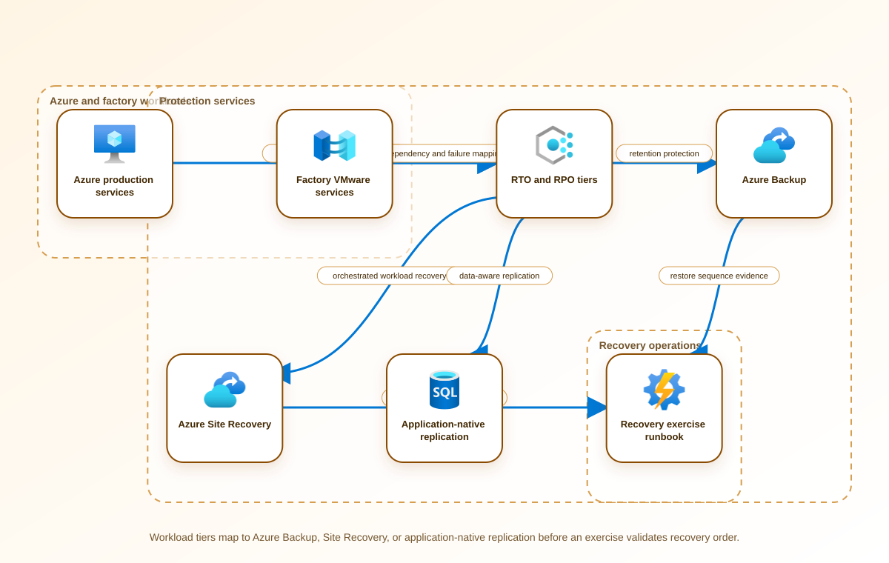

<!-- BEGIN GENERATED AZ305 V1 -->
# LAB-14 — Recovery Strategy for Azure and Hybrid Workloads

## 1. Navigation

[← LAB-13](../13-data-integration-analytics/README.md) · [Lab catalog](../README.md) · [LAB-15 →](../15-compute-backup-ha/README.md)

## 2. Scenario and completion contract

Contoso Industrial operates production-planning services in Azure and two factories that still host latency-sensitive control applications on VMware. A recent regional network incident exposed that recovery plans were organized by technology rather than by business service. The executive resilience committee now requires a single strategy that classifies workloads, maps dependencies, assigns measurable recovery time and recovery point objectives, and distinguishes backup, high availability, disaster recovery, and cyber-recovery controls. Data residency limits cross-border replication, factory connectivity is intermittent, and the annual resilience budget cannot support active-active deployment for every workload. The architecture must be testable without failing over production systems or provisioning the expensive target estate.

- Architect role: Enterprise resilience architect
- Outcome: Produce a tiered Azure and hybrid recovery strategy with dependency-aware recovery waves, measurable objectives, and an evidence-based exercise plan.
- Duration: 150 minutes
- Difficulty: advanced
- Cost class: none
- Completion: all five checkpoint assertions, final validation, decision revision, and cleanup review are complete.

## 3. Objective-to-evidence map

| Objective | Requirement | Checkpoint |
| --- | --- | --- |
| `BC-DR-01` | `LAB14-REQ-01` | [`LAB14-CP01`](#checkpoint-1) |
| `BC-DR-01` | `LAB14-REQ-02` | [`LAB14-CP02`](#checkpoint-2) |
| `BC-DR-01` | `LAB14-REQ-03` | [`LAB14-CP03`](#checkpoint-3) |
| `BC-DR-01` | `LAB14-REQ-04` | [`LAB14-CP04`](#checkpoint-4) |
| `BC-DR-01` | `LAB14-REQ-05` | [`LAB14-CP05`](#checkpoint-5) |

## 4. Business and quality requirements

Business outcome: Restore safety-critical planning and factory services in the required order while controlling recovery cost and meeting residency obligations.

- `LAB14-REQ-01` — Every business service has an owner, impact tier, RTO, RPO, maximum tolerable outage, and data-residency boundary.
- `LAB14-REQ-02` — The dependency map covers identity, DNS, connectivity, secrets, monitoring, data stores, and factory prerequisites across failure domains.
- `LAB14-REQ-03` — Each tier receives the least costly pattern that meets its targets, with backup, replication, and rehydration responsibilities separated.
- `LAB14-REQ-04` — The runbook assigns decision authority, recovery-wave gates, technical actions, stakeholder notifications, and rollback criteria.
- `LAB14-REQ-05` — The exercise independently measures detection, decision, restore, dependency validation, data-loss window, and business acceptance against targets.

Scenario facts:

- **Data:** Workload inventory includes dependency, region, residency, backup, replication, owner, RTO, and RPO attributes.
- **Scale:** Multiple service tiers share identity, network, data, and notification dependencies; exact application count remains an inventory input.
- **Latency:** Recovery sequencing includes detection, authority, infrastructure, data, application, and business-validation elapsed time.
- **Availability:** Tier 1 must tolerate the declared failure domain with warm in-boundary capacity; lower tiers may use slower rehydration.
- **RTO:** Tier 1 changes from four hours to forty-five minutes; other tier targets remain owner-approved inputs.
- **RPO:** Data-loss objectives remain service-specific and cross-border replication is forbidden for the affected data.
- **Budget:** Warm capacity is funded only for Tier 1, with lower tiers retaining backup or staged recovery where their objectives permit.

Constraints:

- Recovery order must follow service dependencies and residency boundaries rather than treating every workload uniformly.
- Tier 1 RTO falls from four hours to forty-five minutes without adding cross-border data replication.
- Use only the Azure CLI command lane for learner implementation.
- Keep all live changes behind explicit execution and acknowledgement switches.
- Retain only sanitized command evidence and synthetic fixture identifiers.

Assumptions:

- Business owners validate tier, maximum outage, data-loss tolerance, and degraded-mode capacity.
- A synthetic dependency inventory accurately represents the recovery ordering problem for offline analysis.
- West Europe is the configurable primary example and North Europe is the configurable secondary example.
- The learner has administrator-level Azure operations knowledge but receives no pre-existing authenticated context.
- Offline fixtures demonstrate contract behavior rather than live Azure service behavior.

## 5. Architecture diagram and walkthrough



The flow begins with the business outcome, crosses five independently validated design capabilities, and ends with positive and negative evidence. The SVG is deterministically rendered from `diagrams/architecture.mmd`.

## 6. Concept primer and candidate architectures

Architecture decisions translate measurable requirements into a deliberate service and operating model. A candidate is viable only when every mandatory constraint is met; convenience or familiarity cannot compensate for a disqualifier.

- **Tiered recovery using Azure Backup, Azure Site Recovery, and application-native replication** (eligible) — Tiering maps recovery technology and retained capacity to business targets while keeping residency and dependency decisions explicit.
- **Uniform paired-region warm standby for every business service** (eligible) — Uniform standby simplifies a headline recovery pattern but overfunds low tiers and can cross regulated data boundaries.
- **Active-active deployment across two Azure regions with independent factory edges** (eligible) — Active-active minimizes outage for suitable services but requires conflict handling, duplicate capacity, and independent edge operations.
- **Untested backup-only plan with no dependency or business validation** (ineligible) — Backup retention preserves copies but does not prove sequencing, application usability, capacity, or business acceptance. Disqualifier: LAB14-REQ-05 requires measured end-to-end recovery against tier RTO and RPO objectives.

## 7. Decision, ADR, and Well-Architected review

Criteria weights are C1 30, C2 25, C3 20, C4 15, and C5 10. Weighted totals use `sum(weight × score) / 5`.

| Candidate | Eligible | C1 | C2 | C3 | C4 | C5 | Weighted /100 |
| --- | ---: | ---: | ---: | ---: | ---: | ---: | ---: |
| Tiered recovery using Azure Backup, Azure Site Recovery, and application-native replication | yes | 5 | 5 | 4 | 4 | 4 | 91 |
| Uniform paired-region warm standby for every business service | yes | 3 | 5 | 3 | 4 | 1 | 69 |
| Active-active deployment across two Azure regions with independent factory edges | yes | 3 | 5 | 3 | 2 | 1 | 63 |
| Untested backup-only plan with no dependency or business validation | no | 1 | 1 | 3 | 1 | 4 | 34 |

Selected design: **Tiered recovery using Azure Backup, Azure Site Recovery, and application-native replication**. `ADR-LAB14-001` records the accepted reasoning. Review Reliability, Security, Cost Optimization, Operational Excellence, and Performance Efficiency in `design/decision.yml`; no pillar is implied by another.

Rejected alternatives:

- **Uniform paired-region warm standby for every business service:** It spends continuously on workloads that tolerate slower recovery and weakens residency fit.
- **Active-active deployment across two Azure regions with independent factory edges:** Its cost and operational complexity exceed most tiers and do not inherently solve residency constraints.
- **Untested backup-only plan with no dependency or business validation:** It is disqualified because restore media alone cannot satisfy end-to-end recovery evidence.

Architecture risks:

- **Risk:** Shared identity or network dependencies can consume most of the forty-five-minute Tier 1 window. **Mitigation:** Place prerequisites in recovery wave zero, assign decision timestamps, and measure their degraded-mode startup independently.
- **Risk:** Warm in-boundary capacity can sit idle and be removed during cost optimization. **Mitigation:** Tag the capacity to the Tier 1 objective, include it in exercises, and report its cost as an explicit resilience control.

Well-Architected consequences:

- **Reliability:** Dependency waves and tier-specific mechanisms align recovery behavior with validated business targets.
- **Security:** Residency, privileged recovery identities, and isolated evidence remain explicit in every recovery pattern.
- **Cost Optimization:** Warm capacity is limited to Tier 1 while slower tiers use lower-cost protection that meets their objectives.
- **Operational Excellence:** Timed authority, technical, communication, and business gates expose where recovery actually spends time.
- **Performance Efficiency:** Degraded-mode sizing reserves enough in-boundary capacity for Tier 1 without duplicating peak capacity everywhere.

ADR consequences:

- Tier owners must fund and exercise the recovery mechanism attached to their declared objective.
- Tier 1 accepts warm capacity cost and residual same-geography correlated risk to preserve residency.

## 8. Inputs, permissions, licensing, cost, and analogue

Use configurable `Location` (`AZ305_LOCATION`, default West Europe) and `SecondaryLocation` (`AZ305_SECONDARY_LOCATION`, default North Europe). Every public input has an explicit `AZ305_*` fallback. Preview is the default; only Golden Lab 00 writes an intent-only `execute: false` preview record. Before an executed cloud command, the supplied subscription and tenant must exactly match the active CLI, Az, and—where applicable—Microsoft Graph contexts. `-Execute` crosses the execution boundary; cost-bearing and tenant-scoped paths also require their independent acknowledgement switches.

Safe analogue: Traverse the synthetic dependency graph, inject failed approvals and services, and calculate recovery waves locally without issuing Azure queries.

Permissions: No Azure role is needed for the simulation; production inventory evidence would require read-only access to backup, replication, monitoring, and dependency metadata.

Licensing: Azure Backup, Site Recovery, replicated data, standby compute, and monitoring costs must be estimated per service tier before approval.

Cost boundary: Price retained recovery points, replication churn, warm capacity, exercise consumption, and operator recovery effort by tier.

## 9. Read-only preflight

```powershell
pwsh ./scripts/azure-cli/Preflight.ps1 -RunId synthetic-140001
```

Synthetic sample: `{"labId":"LAB-14","track":"azure-cli","result":"pass","note":"Local tool discovery only"}`. This is illustrative local output, not evidence captured from Azure.

## 10. Five guided checkpoints

### Checkpoint 1: Classify services and recovery objectives

<a id="checkpoint-1"></a>

**Trace:** `BC-DR-01` → `LAB14-REQ-01` → `LAB14-CP01`

```powershell
$resources = az resource list --subscription $SubscriptionId --output json --only-show-errors | ConvertFrom-Json; $resources | Select-Object name, type, location, @{Name='criticality';Expression={$_.tags.criticality}}
```

Expected evidence: Every business service has an owner, impact tier, RTO, RPO, maximum tolerable outage, and data-residency boundary. Retain Export the classified service register and the signed mapping from business tier to RTO and RPO.

Positive assertion:

```powershell
$classified = az resource list --subscription $SubscriptionId --query "[?tags.criticality]" --output json --only-show-errors | ConvertFrom-Json; if ($classified.Count -lt 1) { throw 'No resource has a criticality classification.' }
```

Negative assertion:

```powershell
$unclassified = az resource list --subscription $SubscriptionId --query "[?!tags.criticality]" --output json --only-show-errors | ConvertFrom-Json; if ($unclassified.Count -gt 0) { throw 'At least one scoped resource lacks a criticality classification.' }
```

Failure and retry: Conflicting objectives or missing dependencies make recovery sequencing unverifiable. Reconcile conflicts with the service owner, then rerun the classification queries against the same scope.

Cleanup dependency: Remove only the locally exported inventory; this design checkpoint creates no Azure resource.

WAF consequence: Reliability: explicit targets prevent both under-engineering and unbounded recovery promises.

### Checkpoint 2: Map hybrid dependencies and failure domains

<a id="checkpoint-2"></a>

**Trace:** `BC-DR-01` → `LAB14-REQ-02` → `LAB14-CP02`

```powershell
$inventory = az resource list --subscription $SubscriptionId --query "[].{id:id,type:type,location:location,dependsOn:tags.dependsOn}" --output json --only-show-errors | ConvertFrom-Json; $inventory | Sort-Object location, type
```

Expected evidence: The dependency map covers identity, DNS, connectivity, secrets, monitoring, data stores, and factory prerequisites across failure domains. Retain Save the dependency graph, failure-domain annotations, and the ordered list of recovery waves.

Positive assertion:

```powershell
$mapped = az resource list --subscription $SubscriptionId --query "[?tags.dependsOn]" --output json --only-show-errors | ConvertFrom-Json; if ($mapped.Count -lt 1) { throw 'No dependency metadata was found.' }
```

Negative assertion:

```powershell
$globalWithoutOwner = az resource list --subscription $SubscriptionId --query '[?location==''global'' && !tags.owner]' --output json --only-show-errors | ConvertFrom-Json; if ($globalWithoutOwner.Count -gt 0) { throw 'A global dependency has no accountable owner.' }
```

Failure and retry: An undiscovered shared dependency can invalidate otherwise achievable workload recovery targets. Add the missing dependency and rerun the inventory projection before resequencing recovery waves.

Cleanup dependency: Delete generated local graph files after assessment if they contain confidential topology details.

WAF consequence: Security: the map identifies privileged recovery dependencies and limits emergency-access sprawl.

### Checkpoint 3: Select recovery patterns by tier

<a id="checkpoint-3"></a>

**Trace:** `BC-DR-01` → `LAB14-REQ-03` → `LAB14-CP03`

```powershell
az backup vault list --subscription $SubscriptionId --query "[].{name:name,location:location,redundancy:properties.redundancySettings.standardTierStorageRedundancy}" --output table --only-show-errors
```

Expected evidence: Each tier receives the least costly pattern that meets its targets, with backup, replication, and rehydration responsibilities separated. Retain Record the scored pattern decision, exclusions, residency checks, and cost assumptions for each service tier.

Positive assertion:

```powershell
$vaults = az backup vault list --subscription $SubscriptionId --output json --only-show-errors | ConvertFrom-Json; if ($vaults.Count -lt 1) { throw 'No backup-vault evidence is available for protected tiers.' }
```

Negative assertion:

```powershell
$localOnly = az backup vault list --subscription $SubscriptionId --query "[?properties.redundancySettings.standardTierStorageRedundancy=='LocallyRedundant']" --output json --only-show-errors | ConvertFrom-Json; if ($localOnly.Count -gt 0) { throw 'Locally redundant vaults require an explicit tier exception.' }
```

Failure and retry: A pattern can satisfy nominal RPO while missing dependency, capacity, or cyber-recovery requirements. Rescore the affected tier with the constraint marked mandatory and document any selection override.

Cleanup dependency: Retain only sanitized decision evidence; no vault or protected item is changed by this checkpoint.

WAF consequence: Cost Optimization: tiering reserves warm or active capacity for workloads that can justify it.

### Checkpoint 4: Design recovery orchestration and communications

<a id="checkpoint-4"></a>

**Trace:** `BC-DR-01` → `LAB14-REQ-04` → `LAB14-CP04`

```powershell
az monitor action-group list --subscription $SubscriptionId --query "[].{name:name,enabled:enabled,emailReceivers:length(emailReceivers),smsReceivers:length(smsReceivers)}" --output table --only-show-errors
```

Expected evidence: The runbook assigns decision authority, recovery-wave gates, technical actions, stakeholder notifications, and rollback criteria. Retain Preserve the tabletop timeline, RACI, escalation matrix, and approval record for every wave transition.

Positive assertion:

```powershell
$enabled = az monitor action-group list --subscription $SubscriptionId --query '[?enabled==`true`]' --output json --only-show-errors | ConvertFrom-Json; if ($enabled.Count -lt 1) { throw 'No enabled recovery communication path was found.' }
```

Negative assertion:

```powershell
$empty = az monitor action-group list --subscription $SubscriptionId --query '[?length(emailReceivers)==`0` && length(smsReceivers)==`0` && length(webhookReceivers)==`0`]' --output json --only-show-errors | ConvertFrom-Json; if ($empty.Count -gt 0) { throw 'An action group has no usable receiver.' }
```

Failure and retry: Ambiguous authority can extend downtime even when technical recovery succeeds. Assign deputies and alternate communication paths, then replay the affected tabletop inject.

Cleanup dependency: Remove test contact data from local evidence and leave production action groups unchanged.

WAF consequence: Operational Excellence: explicit gates and communications make recovery repeatable under pressure.

### Checkpoint 5: Validate objectives with an exercise scorecard

<a id="checkpoint-5"></a>

**Trace:** `BC-DR-01` → `LAB14-REQ-05` → `LAB14-CP05`

```powershell
az monitor metrics list-definitions --resource $RecoveryEvidenceResourceId --query "value[].{name:name.value,unit:unit}" --output table --only-show-errors
```

Expected evidence: The exercise independently measures detection, decision, restore, dependency validation, data-loss window, and business acceptance against targets. Retain Archive timestamped scorecards, failed assertions, improvement owners, and the next exercise date.

Positive assertion:

```powershell
$definitions = az monitor metrics list-definitions --resource $RecoveryEvidenceResourceId --output json --only-show-errors | ConvertFrom-Json; if ($definitions.value.Count -lt 1) { throw 'No measurable recovery evidence source was found.' }
```

Negative assertion:

```powershell
$alerts = az monitor metrics alert list --resource-group $ResourceGroupName --query '[?enabled==`false`]' --output json --only-show-errors | ConvertFrom-Json; if ($alerts.Count -gt 0) { throw 'Disabled evidence alerts need a documented exception before the exercise.' }
```

Failure and retry: Missing timestamps or business acceptance prevents an auditable comparison with RTO and RPO. Correct instrumentation and repeat only the failed recovery wave while preserving the original result.

Cleanup dependency: Delete synthetic exercise records according to evidence policy; do not purge protected production data.

WAF consequence: Performance Efficiency: measured rehydration and validation times expose recovery-capacity bottlenecks.

## 11. Final validation and interpretation

Run `Validate.ps1 -Mode Deployment -Execute` only after an executed run has state and you are authorized to issue the ten read-only checkpoint inspections. Without `-Execute`, ordinary deployment validation records `partial` and exits `2`; Golden Lab 00 alone can validate its intent-only preview locally. Exit `0` means all required assertions pass, `1` means at least one failed, and `2` means the outcome is gated or partial. Positive and negative commands execute independently, so one failure never suppresses its paired assertion.

## 12. Material change request

The board reduces the Tier 1 RTO from four hours to forty-five minutes while prohibiting any additional cross-border data replication.

Revised solution: select **Tiered recovery using Azure Backup, Azure Site Recovery, and application-native replication**. LAB14-REQ-05 now requires a forty-five-minute Tier 1 recovery without cross-border replication, so tiering is retained with warm capacity inside the approved geography and faster orchestration gates.

Revised Well-Architected consequences:

- **Reliability:** Warm Tier 1 capacity removes provisioning from the critical recovery path.
- **Security:** Data remains within the approved geography and emergency identities stay time-bound.
- **Cost Optimization:** Only Tier 1 carries the new standby premium.
- **Operational Excellence:** Shorter authority and dependency gates require more frequent timed exercises.
- **Performance Efficiency:** Degraded-mode capacity is sized to the recovery load rather than ordinary peak demand.

## 13. Architect job challenge

Revise the tiering decision and exercise plan so the new RTO is met through in-boundary warm capacity and faster orchestration, with the cost increase and residual regional risk made explicit.

## 14. Troubleshooting, cleanup, and residual verification

- If Azure CLI queries return an empty array, verify the subscription scope and distinguish a genuinely empty inventory from missing Reader permissions.
- If dependency tags contain inconsistent names, normalize them in the local register without changing production tags during the simulation.
- If RTO evidence omits approval delay, add business decision timestamps rather than reporting only technical restore duration.

Cleanup previews nonempty state in reverse dependency order, writes `partial`, and exits `2`; an already empty run is completed locally and idempotently. Executed cleanup rechecks the exact live ID plus `purpose`, `labId`, `runId`, and `expiresOn` immediately before each removal, persists state after every absent or removed object, stops on the first dependency failure, and refuses unresolved pre-existing settings. It never automates purge. Finish with `Validate.ps1 -Mode PostCleanup`; the required residual count is zero.

## 15. Exam debrief, assessment, sources, and navigation

Explain the recommendation in terms of requirements, rejected alternatives, failure behavior, and all five WAF pillars. Complete `assessment/QUESTIONS.md`, then use the separately excluded answer key for remediation.

- [Azure Well-Architected Framework - Recommendations for defining reliability targets](https://learn.microsoft.com/en-us/azure/well-architected/reliability/metrics)
- [Azure Well-Architected Framework](https://learn.microsoft.com/en-us/azure/well-architected/)

[← LAB-13](../13-data-integration-analytics/README.md) · [Lab catalog](../README.md) · [LAB-15 →](../15-compute-backup-ha/README.md)

## 16. Synchronized lifecycle-script appendix

### Preflight.ps1

```powershell
[CmdletBinding()]
param(
    [string]$SubscriptionId = $env:AZ305_SUBSCRIPTION_ID,
    [string]$TenantId = $env:AZ305_TENANT_ID,
    [ValidatePattern('^[a-z0-9-]{6,64}$')][string]$RunId = $env:AZ305_RUN_ID,
    [string]$Location = $(if ($env:AZ305_LOCATION) { $env:AZ305_LOCATION } else { 'westeurope' }),
    [string]$SecondaryLocation = $(if ($env:AZ305_SECONDARY_LOCATION) { $env:AZ305_SECONDARY_LOCATION } else { 'northeurope' }),
    [string]$ResourceGroup = $(if ($env:AZ305_RESOURCE_GROUP) { $env:AZ305_RESOURCE_GROUP } else { "rg-az305-$RunId" }),
    [string]$WorkloadName = $(if ($env:AZ305_WORKLOAD_NAME) { $env:AZ305_WORKLOAD_NAME } else { "az305-$RunId" }),
    [string]$ExpiresOn = $(if ($env:AZ305_EXPIRES_ON) { $env:AZ305_EXPIRES_ON } else { (Get-Date).ToUniversalTime().AddDays(1).ToString('yyyy-MM-dd') }),
    [string]$RecoveryEvidenceResourceId = $env:AZ305_RECOVERY_EVIDENCE_RESOURCE_ID,
    [string]$ResourceGroupName = $env:AZ305_RESOURCE_GROUP_NAME,
    [switch]$Execute,
    [switch]$AcknowledgeCost,
    [switch]$AcknowledgeTenantChange
)

$ErrorActionPreference = 'Stop'
$PSNativeCommandUseErrorActionPreference = $true
if (-not $RunId) { [Console]::Error.WriteLine('RunId or AZ305_RUN_ID is required.'); exit 2 }
# Every lifecycle entrypoint intentionally exposes the same public parameter contract.
@($SubscriptionId, $TenantId, $RunId, $Location, $SecondaryLocation, $ResourceGroup, $WorkloadName, $ExpiresOn, $RecoveryEvidenceResourceId, $ResourceGroupName, $Execute, $AcknowledgeCost, $AcknowledgeTenantChange) | Out-Null

$requiredCommands = @('az', 'pwsh')
$missing = @($requiredCommands | Where-Object { -not (Get-Command $_ -ErrorAction SilentlyContinue) })
if ($missing.Count -gt 0) {
    Write-Error "Missing local commands: $($missing -join ', ')"
    exit 1
}

[pscustomobject]@{
    labId = 'LAB-14'
    track = 'azure-cli'
    implementationMode = 'design-simulation'
    result = 'pass'
    note = 'Local tool discovery only; no Azure or Microsoft Graph request was made.'
} | ConvertTo-Json
exit 0
```

### Setup.ps1

```powershell
[CmdletBinding()]
param(
    [string]$SubscriptionId = $env:AZ305_SUBSCRIPTION_ID,
    [string]$TenantId = $env:AZ305_TENANT_ID,
    [ValidatePattern('^[a-z0-9-]{6,64}$')][string]$RunId = $env:AZ305_RUN_ID,
    [string]$Location = $(if ($env:AZ305_LOCATION) { $env:AZ305_LOCATION } else { 'westeurope' }),
    [string]$SecondaryLocation = $(if ($env:AZ305_SECONDARY_LOCATION) { $env:AZ305_SECONDARY_LOCATION } else { 'northeurope' }),
    [string]$ResourceGroup = $(if ($env:AZ305_RESOURCE_GROUP) { $env:AZ305_RESOURCE_GROUP } else { "rg-az305-$RunId" }),
    [string]$WorkloadName = $(if ($env:AZ305_WORKLOAD_NAME) { $env:AZ305_WORKLOAD_NAME } else { "az305-$RunId" }),
    [string]$ExpiresOn = $(if ($env:AZ305_EXPIRES_ON) { $env:AZ305_EXPIRES_ON } else { (Get-Date).ToUniversalTime().AddDays(1).ToString('yyyy-MM-dd') }),
    [string]$RecoveryEvidenceResourceId = $env:AZ305_RECOVERY_EVIDENCE_RESOURCE_ID,
    [string]$ResourceGroupName = $env:AZ305_RESOURCE_GROUP_NAME,
    [switch]$Execute,
    [switch]$AcknowledgeCost,
    [switch]$AcknowledgeTenantChange
)

$ErrorActionPreference = 'Stop'
$PSNativeCommandUseErrorActionPreference = $true
if (-not $RunId) { [Console]::Error.WriteLine('RunId or AZ305_RUN_ID is required.'); exit 2 }
# Every lifecycle entrypoint intentionally exposes the same public parameter contract.
@($SubscriptionId, $TenantId, $RunId, $Location, $SecondaryLocation, $ResourceGroup, $WorkloadName, $ExpiresOn, $RecoveryEvidenceResourceId, $ResourceGroupName, $Execute, $AcknowledgeCost, $AcknowledgeTenantChange) | Out-Null

$LabRoot = Split-Path (Split-Path $PSScriptRoot -Parent) -Parent
$StateRoot = Join-Path $LabRoot ".state/$RunId"
$StatePath = Join-Path $StateRoot 'run.json'

function Invoke-AzCliJson {
    [CmdletBinding()]
    param([Parameter(Mandatory)][string[]]$ArgumentList)
    $savedNativePreference = $PSNativeCommandUseErrorActionPreference
    try {
        # Capture the exit code ourselves so a failed native command cannot be
        # mistaken for an empty but successful JSON response.
        $PSNativeCommandUseErrorActionPreference = $false
        $outputLines = @(& az @ArgumentList)
        $nativeExit = $LASTEXITCODE
    }
    finally {
        $PSNativeCommandUseErrorActionPreference = $savedNativePreference
    }
    if ($nativeExit -ne 0) { throw "Azure CLI exited with code $nativeExit." }
    $raw = @($outputLines) -join "`n"
    if ([string]::IsNullOrWhiteSpace($raw)) { return $null }
    try { return ($raw | ConvertFrom-Json -Depth 100) }
    catch { throw 'Azure CLI returned data that was not valid JSON.' }
}

function Assert-ExactExecutionContext {
    [CmdletBinding()]
    param([string]$ExpectedSubscriptionId, [string]$ExpectedTenantId)
    if ([string]::IsNullOrWhiteSpace($ExpectedSubscriptionId) -or [string]::IsNullOrWhiteSpace($ExpectedTenantId)) {
        throw 'SubscriptionId and TenantId are required before a cloud request.'
    }
    $context = Invoke-AzCliJson -ArgumentList @('account', 'show', '--output', 'json', '--only-show-errors')
    if (-not $context -or [string]$context.id -ine $ExpectedSubscriptionId -or [string]$context.tenantId -ine $ExpectedTenantId) {
        throw 'The active Azure CLI subscription or tenant does not exactly match the requested context.'
    }
}

function Save-RunState {
    [CmdletBinding()]
    param([Parameter(Mandatory)]$State)
    $temporaryPath = "$StatePath.tmp"
    $State | ConvertTo-Json -Depth 20 | Set-Content -LiteralPath $temporaryPath -Encoding utf8NoBOM
    Move-Item -LiteralPath $temporaryPath -Destination $StatePath -Force
}

function Assert-SafeStateValue {
    [CmdletBinding()]
    param($Value)
    $serialized = $Value | ConvertTo-Json -Depth 12 -Compress
    if ($serialized -match '(?i)"(?:token|password|secret|certificate|connectionString|sas|clientSecret|accessToken|refreshToken|accountKey|privateKey)"\s*:') {
        throw 'A prohibited sensitive field name was returned; state capture is refused.'
    }
}

function Convert-CheckpointOutput {
    [CmdletBinding()]
    param($Value)
    if ($Value -is [string]) { $raw = [string]$Value }
    elseif ($Value -is [System.Collections.IEnumerable] -and @($Value | Where-Object { $_ -isnot [string] }).Count -eq 0) { $raw = @($Value) -join "`n" }
    else { return $Value }
    if ([string]::IsNullOrWhiteSpace($raw)) { return $null }
    try { return ($raw | ConvertFrom-Json -Depth 100) } catch { return $Value }
}

function Get-ReturnedResourceId {
    [CmdletBinding()]
    param($Value)
    $seen = [System.Collections.Generic.HashSet[string]]::new([System.StringComparer]::OrdinalIgnoreCase)
    $results = [System.Collections.Generic.List[string]]::new()
    function Add-ArmId {
        param($Candidate)
        if ($Candidate -is [string] -and $Candidate -match '^/subscriptions/[0-9a-f-]+/(?:resourceGroups/[^/]+(?:/providers/.+)?|providers/.+)$' -and $Candidate -notmatch '/providers/Microsoft\.Resources/deployments/') {
            if ($seen.Add($Candidate)) { $results.Add($Candidate) }
        }
    }
    function Find-DeploymentOutputId {
        param($Item, [int]$Depth)
        if ($null -eq $Item -or $Depth -gt 12) { return }
        if ($Item -is [string]) { Add-ArmId -Candidate $Item; return }
        if ($Item -is [System.Collections.IDictionary]) { foreach ($key in $Item.Keys) { Find-DeploymentOutputId -Item $Item[$key] -Depth ($Depth + 1) }; return }
        if ($Item -is [System.Collections.IEnumerable]) { foreach ($entry in $Item) { Find-DeploymentOutputId -Item $entry -Depth ($Depth + 1) }; return }
        foreach ($property in @($Item.PSObject.Properties | Where-Object { $_.MemberType -in @('NoteProperty', 'Property') })) { Find-DeploymentOutputId -Item $property.Value -Depth ($Depth + 1) }
    }
    foreach ($rootItem in @($Value)) {
        if ($rootItem -is [System.Collections.IDictionary]) {
            foreach ($name in @('id', 'resourceId')) { if ($rootItem.Contains($name)) { Add-ArmId -Candidate $rootItem[$name] } }
            if ($rootItem.Contains('properties') -and $rootItem.properties -and $rootItem.properties.outputs) { Find-DeploymentOutputId -Item $rootItem.properties.outputs -Depth 0 }
            continue
        }
        foreach ($name in @('Id', 'ResourceId')) {
            $property = $rootItem.PSObject.Properties[$name]
            if ($property) { Add-ArmId -Candidate $property.Value }
        }
        if ($rootItem.PSObject.Properties['Properties'] -and $rootItem.Properties -and $rootItem.Properties.outputs) {
            Find-DeploymentOutputId -Item $rootItem.Properties.outputs -Depth 0
        }
    }
    return @($results)
}

function Get-PlannedDeploymentResourceId {
    [CmdletBinding()]
    param($Value)
    $seen = [System.Collections.Generic.HashSet[string]]::new([System.StringComparer]::OrdinalIgnoreCase)
    $results = [System.Collections.Generic.List[string]]::new()
    foreach ($change in @($Value.changes)) {
        $candidate = [string]$change.resourceId
        if ($candidate -match '^/subscriptions/[0-9a-f-]+/(?:resourceGroups/[^/]+(?:/providers/.+)?|providers/.+)$' -and $candidate -notmatch '/providers/Microsoft\.Resources/deployments/' -and $seen.Add($candidate)) {
            $results.Add($candidate)
        }
    }
    return @($results)
}

function Assert-InputSubscriptionScope {
    [CmdletBinding()]
    param($Inputs, [string]$ExpectedSubscriptionId)
    $entries = if ($Inputs -is [System.Collections.IDictionary]) {
        @($Inputs.GetEnumerator())
    } else {
        @($Inputs.PSObject.Properties | ForEach-Object { [pscustomobject]@{ Key = $_.Name; Value = $_.Value } })
    }
    foreach ($entry in $entries) {
        if ($entry.Value -is [string] -and [string]$entry.Value -match '^/subscriptions/([^/]+)/') {
            if ($Matches[1] -ine $ExpectedSubscriptionId) { throw "Input $($entry.Key) belongs to a different subscription." }
        }
    }
}

function Assert-ManagedMutation {
    [CmdletBinding()]
    param($State, [string]$CheckpointId, [bool]$CarriesOwnership, [object[]]$TargetResourceIds)
    if ($CarriesOwnership) { return }
    $targets = @($TargetResourceIds | Where-Object { $_ -is [string] -and $_ -match '^/subscriptions/' })
    if ($targets.Count -eq 0) { throw "$CheckpointId refuses an untagged mutation because no exact ARM target ID was supplied." }
    $knownIds = @($State.managedObjects | ForEach-Object { [string]$_.id })
    if ($knownIds.Count -eq 0) { throw "$CheckpointId refuses to modify a pre-existing object because no run-owned parent has been recorded." }
    foreach ($target in $targets) {
        $related = @($knownIds | Where-Object { $target -ieq $_ -or $target.StartsWith("$_/", [System.StringComparison]::OrdinalIgnoreCase) -or $_.StartsWith("$target/", [System.StringComparison]::OrdinalIgnoreCase) }).Count -gt 0
        if (-not $related) { throw "$CheckpointId refuses a mutation outside the exact run-owned resource boundary." }
    }
}

$executionInputs = [ordered]@{ subscriptionId = $SubscriptionId; tenantId = $TenantId; location = $Location; secondaryLocation = $SecondaryLocation; resourceGroup = $ResourceGroup; workloadName = $WorkloadName; expiresOn = $ExpiresOn; RecoveryEvidenceResourceId = $RecoveryEvidenceResourceId; ResourceGroupName = $ResourceGroupName }

if (-not $Execute) {
    Write-Output '[preview] No cloud command was called and no state was created.'
    Write-Output '[preview] Re-run with -Execute only in an authorized disposable environment.'
    exit 0
}
[Console]::Error.WriteLine('This design-simulation setup is offline-only and refuses its authored cloud commands.'); exit 2
# This default exercise does not require a cost acknowledgement.
# This lab does not perform a tenant-scoped change by default.
$requiredLabInputs = [ordered]@{ RecoveryEvidenceResourceId = $RecoveryEvidenceResourceId }
$missingLabInputs = @($requiredLabInputs.GetEnumerator() | Where-Object { $_.Value -is [string] -and [string]::IsNullOrWhiteSpace([string]$_.Value) } | ForEach-Object Key)
if ($missingLabInputs.Count -gt 0) { [Console]::Error.WriteLine("Execution is gated; supply: $($missingLabInputs -join ', ')."); exit 2 }

try {
    Assert-ExactExecutionContext -ExpectedSubscriptionId $SubscriptionId -ExpectedTenantId $TenantId
    Assert-InputSubscriptionScope -Inputs $executionInputs -ExpectedSubscriptionId $SubscriptionId
    Assert-SafeStateValue -Value $executionInputs
}
catch {
    [Console]::Error.WriteLine("Execution is gated by context or input validation: $($_.Exception.Message)")
    exit 2
}

# Recovery state is persisted before the first possible mutation below.
if (Test-Path -LiteralPath $StatePath) {
    [Console]::Error.WriteLine('Run state already exists. Choose a new RunId or complete the recorded cleanup; existing recovery state will not be overwritten.')
    exit 2
}
New-Item -ItemType Directory -Path $StateRoot -Force | Out-Null
$state = [ordered]@{
    schemaVersion = '1.0.0'; labId = 'LAB-14'; runId = $RunId; track = 'azure-cli'
    implementationMode = 'design-simulation'; status = 'initialized'
    createdAt = (Get-Date).ToUniversalTime().ToString('o'); execute = $true
    parameters = $executionInputs
    managedObjects = @(); originalSettings = @()
}
Save-RunState -State $state
# Planning-only execution remains initialized until its bounded checks complete.

$originalLocation = Get-Location
try {
    Set-Location -LiteralPath $LabRoot
    # 14-CP01: Classify services and recovery objectives
    $stepResult = & { $resources = az resource list --subscription $SubscriptionId --output json --only-show-errors | ConvertFrom-Json; $resources | Select-Object name, type, location, @{Name='criticality';Expression={$_.tags.criticality}} }
    if ($LASTEXITCODE -ne 0) { throw 'LAB14-CP01 native command exited with code ' + $LASTEXITCODE + '.' }
    $null = $stepResult

    # 14-CP02: Map hybrid dependencies and failure domains
    $stepResult = & { $inventory = az resource list --subscription $SubscriptionId --query "[].{id:id,type:type,location:location,dependsOn:tags.dependsOn}" --output json --only-show-errors | ConvertFrom-Json; $inventory | Sort-Object location, type }
    if ($LASTEXITCODE -ne 0) { throw 'LAB14-CP02 native command exited with code ' + $LASTEXITCODE + '.' }
    $null = $stepResult

    # 14-CP03: Select recovery patterns by tier
    $stepResult = & { az backup vault list --subscription $SubscriptionId --query "[].{name:name,location:location,redundancy:properties.redundancySettings.standardTierStorageRedundancy}" --output table --only-show-errors }
    if ($LASTEXITCODE -ne 0) { throw 'LAB14-CP03 native command exited with code ' + $LASTEXITCODE + '.' }
    $null = $stepResult

    # 14-CP04: Design recovery orchestration and communications
    $stepResult = & { az monitor action-group list --subscription $SubscriptionId --query "[].{name:name,enabled:enabled,emailReceivers:length(emailReceivers),smsReceivers:length(smsReceivers)}" --output table --only-show-errors }
    if ($LASTEXITCODE -ne 0) { throw 'LAB14-CP04 native command exited with code ' + $LASTEXITCODE + '.' }
    $null = $stepResult

    # 14-CP05: Validate objectives with an exercise scorecard
    $stepResult = & { az monitor metrics list-definitions --resource $RecoveryEvidenceResourceId --query "value[].{name:name.value,unit:unit}" --output table --only-show-errors }
    if ($LASTEXITCODE -ne 0) { throw 'LAB14-CP05 native command exited with code ' + $LASTEXITCODE + '.' }
    $null = $stepResult

    $state.status = 'planned'
    Save-RunState -State $state
} catch {
    $state.status = 'failed'
    Save-RunState -State $state
    Write-Error $_
    exit 1
} finally {
    Set-Location -LiteralPath $originalLocation
}
exit 0
```

### Validate.ps1

```powershell
[CmdletBinding()]
param(
    [string]$SubscriptionId = $env:AZ305_SUBSCRIPTION_ID,
    [string]$TenantId = $env:AZ305_TENANT_ID,
    [ValidatePattern('^[a-z0-9-]{6,64}$')][string]$RunId = $env:AZ305_RUN_ID,
    [string]$Location = $(if ($env:AZ305_LOCATION) { $env:AZ305_LOCATION } else { 'westeurope' }),
    [string]$SecondaryLocation = $(if ($env:AZ305_SECONDARY_LOCATION) { $env:AZ305_SECONDARY_LOCATION } else { 'northeurope' }),
    [string]$ResourceGroup = $(if ($env:AZ305_RESOURCE_GROUP) { $env:AZ305_RESOURCE_GROUP } else { "rg-az305-$RunId" }),
    [string]$WorkloadName = $(if ($env:AZ305_WORKLOAD_NAME) { $env:AZ305_WORKLOAD_NAME } else { "az305-$RunId" }),
    [string]$ExpiresOn = $(if ($env:AZ305_EXPIRES_ON) { $env:AZ305_EXPIRES_ON } else { (Get-Date).ToUniversalTime().AddDays(1).ToString('yyyy-MM-dd') }),
    [string]$RecoveryEvidenceResourceId = $env:AZ305_RECOVERY_EVIDENCE_RESOURCE_ID,
    [string]$ResourceGroupName = $env:AZ305_RESOURCE_GROUP_NAME,
    [ValidateSet('Deployment', 'PostCleanup')][string]$Mode = 'Deployment',
    [switch]$Execute,
    [switch]$AcknowledgeCost,
    [switch]$AcknowledgeTenantChange
)

$ErrorActionPreference = 'Stop'
$PSNativeCommandUseErrorActionPreference = $true
if (-not $RunId) { [Console]::Error.WriteLine('RunId or AZ305_RUN_ID is required.'); exit 2 }
# Every lifecycle entrypoint intentionally exposes the same public parameter contract.
@($SubscriptionId, $TenantId, $RunId, $Location, $SecondaryLocation, $ResourceGroup, $WorkloadName, $ExpiresOn, $RecoveryEvidenceResourceId, $ResourceGroupName, $Mode, $Execute, $AcknowledgeCost, $AcknowledgeTenantChange) | Out-Null

$LabRoot = Split-Path (Split-Path $PSScriptRoot -Parent) -Parent
$StateRoot = Join-Path $LabRoot ".state/$RunId"
$RunPath = Join-Path $StateRoot 'run.json'
$ValidationPath = Join-Path $StateRoot 'validation.json'

function Invoke-AzCliJson {
    [CmdletBinding()]
    param([Parameter(Mandatory)][string[]]$ArgumentList)
    $savedNativePreference = $PSNativeCommandUseErrorActionPreference
    try {
        # Capture the exit code ourselves so a failed native command cannot be
        # mistaken for an empty but successful JSON response.
        $PSNativeCommandUseErrorActionPreference = $false
        $outputLines = @(& az @ArgumentList)
        $nativeExit = $LASTEXITCODE
    }
    finally {
        $PSNativeCommandUseErrorActionPreference = $savedNativePreference
    }
    if ($nativeExit -ne 0) { throw "Azure CLI exited with code $nativeExit." }
    $raw = @($outputLines) -join "`n"
    if ([string]::IsNullOrWhiteSpace($raw)) { return $null }
    try { return ($raw | ConvertFrom-Json -Depth 100) }
    catch { throw 'Azure CLI returned data that was not valid JSON.' }
}

function Assert-ExactExecutionContext {
    [CmdletBinding()]
    param([string]$ExpectedSubscriptionId, [string]$ExpectedTenantId)
    if ([string]::IsNullOrWhiteSpace($ExpectedSubscriptionId) -or [string]::IsNullOrWhiteSpace($ExpectedTenantId)) {
        throw 'SubscriptionId and TenantId are required before a cloud request.'
    }
    $context = Invoke-AzCliJson -ArgumentList @('account', 'show', '--output', 'json', '--only-show-errors')
    if (-not $context -or [string]$context.id -ine $ExpectedSubscriptionId -or [string]$context.tenantId -ine $ExpectedTenantId) {
        throw 'The active Azure CLI subscription or tenant does not exactly match the requested context.'
    }
}


if (-not (Test-Path -LiteralPath $RunPath)) {
    Write-Warning 'No run state exists; validation is gated.'
    exit 2
}
$state = Get-Content -LiteralPath $RunPath -Raw | ConvertFrom-Json
$assertions = [System.Collections.Generic.List[object]]::new()
function Add-ValidationAssertion {
    [CmdletBinding()]
    param([string]$Id, [ValidateSet('positive', 'negative')][string]$Kind, [bool]$Passed, [string]$Message)
    $assertions.Add([pscustomobject]@{ id = $Id; kind = $Kind; passed = $Passed; message = $Message })
}

function Save-ValidationArtifact {
    [CmdletBinding()]
    param([ValidateSet('pass', 'partial', 'fail')][string]$Result)
    $artifact = [ordered]@{ schemaVersion = '1.0.0'; labId = 'LAB-14'; runId = $RunId; mode = $Mode; result = $Result; validatedAt = (Get-Date).ToUniversalTime().ToString('o'); assertions = @($assertions) }
    $artifact | ConvertTo-Json -Depth 12 | Set-Content -LiteralPath $ValidationPath -Encoding utf8NoBOM
}

function Test-PositiveEvidence {
    [CmdletBinding()]
    param($Value)
    if ($Value -is [bool]) { return $Value }
    if ($null -eq $Value) { return $false }
    if ($Value -is [string]) { return -not [string]::IsNullOrWhiteSpace($Value) }
    if ($Value -is [System.Collections.IEnumerable]) { return @($Value).Count -gt 0 }
    return $true
}

function Test-NegativeEvidence {
    [CmdletBinding()]
    param($Value)
    if ($Value -is [bool]) { return $Value }
    if ($null -eq $Value) { return $true }
    if ($Value -is [string]) { return [string]::IsNullOrWhiteSpace($Value) }
    if ($Value -is [System.Collections.IEnumerable]) { return @($Value).Count -eq 0 }
    $properties = @($Value.PSObject.Properties | Where-Object { $_.MemberType -in @('NoteProperty', 'Property') })
    if ($properties.Count -eq 0) { return $false }
    return @($properties | Where-Object { -not (Test-NegativeEvidence -Value $_.Value) }).Count -eq 0
}

function Test-ProhibitedStateField {
    [CmdletBinding()]
    param($Value)
    $serialized = $Value | ConvertTo-Json -Depth 20
    return $serialized -match '(?i)"(?:token|password|secret|certificate|connectionString|sas|clientSecret|accessToken|refreshToken|accountKey|privateKey)"\s*:'
}

function Assert-InputSubscriptionScope {
    [CmdletBinding()]
    param($Inputs, [string]$ExpectedSubscriptionId)
    $entries = if ($Inputs -is [System.Collections.IDictionary]) {
        @($Inputs.GetEnumerator())
    } else {
        @($Inputs.PSObject.Properties | ForEach-Object { [pscustomobject]@{ Key = $_.Name; Value = $_.Value } })
    }
    foreach ($entry in $entries) {
        if ($entry.Value -is [string] -and [string]$entry.Value -match '^/subscriptions/([^/]+)/' -and $Matches[1] -ine $ExpectedSubscriptionId) {
            throw "Input $($entry.Key) belongs to a different subscription."
        }
    }
}

$stateIdentityMatches = (
    $state.labId -ceq 'LAB-14' -and
    $state.runId -ceq $RunId -and
    $state.track -ceq 'azure-cli' -and
    $state.implementationMode -ceq 'design-simulation' -and
    ([string]$state.parameters.subscriptionId -ieq $SubscriptionId -and [string]$state.parameters.tenantId -ieq $TenantId)
)
Add-ValidationAssertion -Id 'LAB14-VAL-POS-01' -Kind positive -Passed $stateIdentityMatches -Message 'Run identity, implementation mode, command track, tenant, and subscription exactly match the copied lab and requested run.'
$hasSensitiveName = Test-ProhibitedStateField -Value $state
Add-ValidationAssertion -Id 'LAB14-VAL-NEG-01' -Kind negative -Passed (-not $hasSensitiveName) -Message 'State contains no prohibited sensitive field name.'

if ($Mode -eq 'PostCleanup') {
    $cleanupPath = Join-Path $StateRoot 'cleanup.json'
    $cleanup = if (Test-Path -LiteralPath $cleanupPath) { Get-Content -LiteralPath $cleanupPath -Raw | ConvertFrom-Json } else { $null }
    Add-ValidationAssertion -Id 'LAB14-VAL-POS-02' -Kind positive -Passed ($null -ne $cleanup -and $cleanup.labId -ceq 'LAB-14' -and $cleanup.runId -ceq $RunId -and $cleanup.result -eq 'pass' -and $cleanup.ownershipVerified) -Message 'The exact run cleanup completed with verified ownership.'
    Add-ValidationAssertion -Id 'LAB14-VAL-NEG-02' -Kind negative -Passed ($null -ne $cleanup -and $cleanup.activeManagedObjects -eq 0 -and @($state.managedObjects).Count -eq 0 -and @($state.originalSettings).Count -eq 0 -and $state.status -eq 'cleaned') -Message 'No active managed object or unresolved original setting remains in cleanup or run state.'
    $postCleanupPassed = @($assertions | Where-Object { -not $_.passed }).Count -eq 0
    Save-ValidationArtifact -Result $(if ($postCleanupPassed) { 'pass' } else { 'fail' })
    if ($postCleanupPassed) { exit 0 }
    exit 1
}

Add-ValidationAssertion -Id 'LAB14-VAL-POS-02' -Kind positive -Passed ($state.status -eq 'planned') -Message 'The planning-only setup completed and remains planned; no deployment is implied.'
Add-ValidationAssertion -Id 'LAB14-VAL-NEG-02' -Kind negative -Passed (@($state.managedObjects | Where-Object { $_.tags.purpose -ne 'az305-lab' -or $_.tags.labId -ne 'LAB-14' -or $_.tags.runId -ne $RunId }).Count -eq 0) -Message 'No recorded object has a foreign ownership tag.'

if (@($assertions | Where-Object { -not $_.passed }).Count -gt 0) {
    Save-ValidationArtifact -Result 'fail'
    exit 1
}
if (-not $Execute) {
    # This lab has no special intent-only validation path.
    Save-ValidationArtifact -Result 'partial'
    Write-Warning 'Checkpoint validation is gated; re-run with -Execute after confirming the exact read-only context.'
    exit 2
}
Save-ValidationArtifact -Result 'partial'; [Console]::Error.WriteLine('Design-simulation validation is offline-only and refuses cloud commands.'); exit 2
$requiredValidationInputs = [ordered]@{ RecoveryEvidenceResourceId = $RecoveryEvidenceResourceId; ResourceGroupName = $ResourceGroupName }
$missingValidationInputs = @($requiredValidationInputs.GetEnumerator() | Where-Object { $_.Value -is [string] -and [string]::IsNullOrWhiteSpace([string]$_.Value) } | ForEach-Object Key)
if ($missingValidationInputs.Count -gt 0) {
    Add-ValidationAssertion -Id 'LAB14-VAL-POS-CONTEXT' -Kind positive -Passed $false -Message 'One or more required non-secret validation inputs are missing.'
    Save-ValidationArtifact -Result 'partial'
    exit 2
}
try {
    Assert-ExactExecutionContext -ExpectedSubscriptionId $SubscriptionId -ExpectedTenantId $TenantId
    Assert-InputSubscriptionScope -Inputs $state.parameters -ExpectedSubscriptionId $SubscriptionId
    Add-ValidationAssertion -Id 'LAB14-VAL-POS-CONTEXT' -Kind positive -Passed $true -Message 'The active tenant and subscription exactly match the requested validation context.'
}
catch {
    Add-ValidationAssertion -Id 'LAB14-VAL-POS-CONTEXT' -Kind positive -Passed $false -Message 'Exact execution context could not be proven.'
    Save-ValidationArtifact -Result 'partial'
    exit 2
}

$originalLocation = Get-Location
try {
    Set-Location -LiteralPath $LabRoot
# LAB14-CP01: run both polarities even when one fails.
$positivePassed = $false
try {
    $global:LASTEXITCODE = 0
    $positiveEvidence = & { $classified = az resource list --subscription $SubscriptionId --query "[?tags.criticality]" --output json --only-show-errors | ConvertFrom-Json; if ($classified.Count -lt 1) { throw 'No resource has a criticality classification.' } }
    if ($LASTEXITCODE -ne 0) { throw 'LAB14-CP01 positive native command exited with code ' + $LASTEXITCODE + '.' }
    $positivePassed = $true
    $null = $positiveEvidence
} catch { $positivePassed = $false }
Add-ValidationAssertion -Id 'LAB14-CP01-POS' -Kind positive -Passed $positivePassed -Message 'Every business service has an owner, impact tier, RTO, RPO, maximum tolerable outage, and data-residency boundary.'

$negativePassed = $false
try {
    $global:LASTEXITCODE = 0
    $negativeEvidence = & { $unclassified = az resource list --subscription $SubscriptionId --query "[?!tags.criticality]" --output json --only-show-errors | ConvertFrom-Json; if ($unclassified.Count -gt 0) { throw 'At least one scoped resource lacks a criticality classification.' } }
    if ($LASTEXITCODE -ne 0) { throw 'LAB14-CP01 negative native command exited with code ' + $LASTEXITCODE + '.' }
    $negativePassed = $true
    $null = $negativeEvidence
} catch { $negativePassed = $false }
Add-ValidationAssertion -Id 'LAB14-CP01-NEG' -Kind negative -Passed $negativePassed -Message 'A resource-only inventory with no business owner or recovery objective must fail the checkpoint.'

# LAB14-CP02: run both polarities even when one fails.
$positivePassed = $false
try {
    $global:LASTEXITCODE = 0
    $positiveEvidence = & { $mapped = az resource list --subscription $SubscriptionId --query "[?tags.dependsOn]" --output json --only-show-errors | ConvertFrom-Json; if ($mapped.Count -lt 1) { throw 'No dependency metadata was found.' } }
    if ($LASTEXITCODE -ne 0) { throw 'LAB14-CP02 positive native command exited with code ' + $LASTEXITCODE + '.' }
    $positivePassed = $true
    $null = $positiveEvidence
} catch { $positivePassed = $false }
Add-ValidationAssertion -Id 'LAB14-CP02-POS' -Kind positive -Passed $positivePassed -Message 'The dependency map covers identity, DNS, connectivity, secrets, monitoring, data stores, and factory prerequisites across failure domains.'

$negativePassed = $false
try {
    $global:LASTEXITCODE = 0
    $negativeEvidence = & { $globalWithoutOwner = az resource list --subscription $SubscriptionId --query '[?location==''global'' && !tags.owner]' --output json --only-show-errors | ConvertFrom-Json; if ($globalWithoutOwner.Count -gt 0) { throw 'A global dependency has no accountable owner.' } }
    if ($LASTEXITCODE -ne 0) { throw 'LAB14-CP02 negative native command exited with code ' + $LASTEXITCODE + '.' }
    $negativePassed = $true
    $null = $negativeEvidence
} catch { $negativePassed = $false }
Add-ValidationAssertion -Id 'LAB14-CP02-NEG' -Kind negative -Passed $negativePassed -Message 'A recovery wave that starts an application before identity, name resolution, or its data dependency must be rejected.'

# LAB14-CP03: run both polarities even when one fails.
$positivePassed = $false
try {
    $global:LASTEXITCODE = 0
    $positiveEvidence = & { $vaults = az backup vault list --subscription $SubscriptionId --output json --only-show-errors | ConvertFrom-Json; if ($vaults.Count -lt 1) { throw 'No backup-vault evidence is available for protected tiers.' } }
    if ($LASTEXITCODE -ne 0) { throw 'LAB14-CP03 positive native command exited with code ' + $LASTEXITCODE + '.' }
    $positivePassed = $true
    $null = $positiveEvidence
} catch { $positivePassed = $false }
Add-ValidationAssertion -Id 'LAB14-CP03-POS' -Kind positive -Passed $positivePassed -Message 'Each tier receives the least costly pattern that meets its targets, with backup, replication, and rehydration responsibilities separated.'

$negativePassed = $false
try {
    $global:LASTEXITCODE = 0
    $negativeEvidence = & { $localOnly = az backup vault list --subscription $SubscriptionId --query "[?properties.redundancySettings.standardTierStorageRedundancy=='LocallyRedundant']" --output json --only-show-errors | ConvertFrom-Json; if ($localOnly.Count -gt 0) { throw 'Locally redundant vaults require an explicit tier exception.' } }
    if ($LASTEXITCODE -ne 0) { throw 'LAB14-CP03 negative native command exited with code ' + $LASTEXITCODE + '.' }
    $negativePassed = $true
    $null = $negativeEvidence
} catch { $negativePassed = $false }
Add-ValidationAssertion -Id 'LAB14-CP03-NEG' -Kind negative -Passed $negativePassed -Message 'Treating backup retention as proof of failover readiness, or assuming a region pair removes all correlated risk, must fail review.'

# LAB14-CP04: run both polarities even when one fails.
$positivePassed = $false
try {
    $global:LASTEXITCODE = 0
    $positiveEvidence = & { $enabled = az monitor action-group list --subscription $SubscriptionId --query '[?enabled==`true`]' --output json --only-show-errors | ConvertFrom-Json; if ($enabled.Count -lt 1) { throw 'No enabled recovery communication path was found.' } }
    if ($LASTEXITCODE -ne 0) { throw 'LAB14-CP04 positive native command exited with code ' + $LASTEXITCODE + '.' }
    $positivePassed = $true
    $null = $positiveEvidence
} catch { $positivePassed = $false }
Add-ValidationAssertion -Id 'LAB14-CP04-POS' -Kind positive -Passed $positivePassed -Message 'The runbook assigns decision authority, recovery-wave gates, technical actions, stakeholder notifications, and rollback criteria.'

$negativePassed = $false
try {
    $global:LASTEXITCODE = 0
    $negativeEvidence = & { $empty = az monitor action-group list --subscription $SubscriptionId --query '[?length(emailReceivers)==`0` && length(smsReceivers)==`0` && length(webhookReceivers)==`0`]' --output json --only-show-errors | ConvertFrom-Json; if ($empty.Count -gt 0) { throw 'An action group has no usable receiver.' } }
    if ($LASTEXITCODE -ne 0) { throw 'LAB14-CP04 negative native command exited with code ' + $LASTEXITCODE + '.' }
    $negativePassed = $true
    $null = $negativeEvidence
} catch { $negativePassed = $false }
Add-ValidationAssertion -Id 'LAB14-CP04-NEG' -Kind negative -Passed $negativePassed -Message 'A runbook that relies on one unavailable identity, an unnamed approver, or an untested manual handoff must fail.'

# LAB14-CP05: run both polarities even when one fails.
$positivePassed = $false
try {
    $global:LASTEXITCODE = 0
    $positiveEvidence = & { $definitions = az monitor metrics list-definitions --resource $RecoveryEvidenceResourceId --output json --only-show-errors | ConvertFrom-Json; if ($definitions.value.Count -lt 1) { throw 'No measurable recovery evidence source was found.' } }
    if ($LASTEXITCODE -ne 0) { throw 'LAB14-CP05 positive native command exited with code ' + $LASTEXITCODE + '.' }
    $positivePassed = $true
    $null = $positiveEvidence
} catch { $positivePassed = $false }
Add-ValidationAssertion -Id 'LAB14-CP05-POS' -Kind positive -Passed $positivePassed -Message 'The exercise independently measures detection, decision, restore, dependency validation, data-loss window, and business acceptance against targets.'

$negativePassed = $false
try {
    $global:LASTEXITCODE = 0
    $negativeEvidence = & { $alerts = az monitor metrics alert list --resource-group $ResourceGroupName --query '[?enabled==`false`]' --output json --only-show-errors | ConvertFrom-Json; if ($alerts.Count -gt 0) { throw 'Disabled evidence alerts need a documented exception before the exercise.' } }
    if ($LASTEXITCODE -ne 0) { throw 'LAB14-CP05 negative native command exited with code ' + $LASTEXITCODE + '.' }
    $negativePassed = $true
    $null = $negativeEvidence
} catch { $negativePassed = $false }
Add-ValidationAssertion -Id 'LAB14-CP05-NEG' -Kind negative -Passed $negativePassed -Message 'Declaring success solely because infrastructure reports healthy must fail without application and business assertions.'

}
finally {
    Set-Location -LiteralPath $originalLocation
}

$passed = @($assertions | Where-Object { -not $_.passed }).Count -eq 0
Save-ValidationArtifact -Result $(if ($passed) { 'pass' } else { 'fail' })
if ($passed) { exit 0 }
exit 1
```

### Cleanup.ps1

```powershell
[CmdletBinding()]
param(
    [string]$SubscriptionId = $env:AZ305_SUBSCRIPTION_ID,
    [string]$TenantId = $env:AZ305_TENANT_ID,
    [ValidatePattern('^[a-z0-9-]{6,64}$')][string]$RunId = $env:AZ305_RUN_ID,
    [string]$Location = $(if ($env:AZ305_LOCATION) { $env:AZ305_LOCATION } else { 'westeurope' }),
    [string]$SecondaryLocation = $(if ($env:AZ305_SECONDARY_LOCATION) { $env:AZ305_SECONDARY_LOCATION } else { 'northeurope' }),
    [string]$ResourceGroup = $(if ($env:AZ305_RESOURCE_GROUP) { $env:AZ305_RESOURCE_GROUP } else { "rg-az305-$RunId" }),
    [string]$WorkloadName = $(if ($env:AZ305_WORKLOAD_NAME) { $env:AZ305_WORKLOAD_NAME } else { "az305-$RunId" }),
    [string]$ExpiresOn = $(if ($env:AZ305_EXPIRES_ON) { $env:AZ305_EXPIRES_ON } else { (Get-Date).ToUniversalTime().AddDays(1).ToString('yyyy-MM-dd') }),
    [string]$RecoveryEvidenceResourceId = $env:AZ305_RECOVERY_EVIDENCE_RESOURCE_ID,
    [string]$ResourceGroupName = $env:AZ305_RESOURCE_GROUP_NAME,
    [switch]$Execute,
    [switch]$AcknowledgeCost,
    [switch]$AcknowledgeTenantChange
)

$ErrorActionPreference = 'Stop'
$PSNativeCommandUseErrorActionPreference = $true
if (-not $RunId) { [Console]::Error.WriteLine('RunId or AZ305_RUN_ID is required.'); exit 2 }
# Every lifecycle entrypoint intentionally exposes the same public parameter contract.
@($SubscriptionId, $TenantId, $RunId, $Location, $SecondaryLocation, $ResourceGroup, $WorkloadName, $ExpiresOn, $RecoveryEvidenceResourceId, $ResourceGroupName, $Execute, $AcknowledgeCost, $AcknowledgeTenantChange) | Out-Null

$LabRoot = Split-Path (Split-Path $PSScriptRoot -Parent) -Parent
$StateRoot = Join-Path $LabRoot ".state/$RunId"
$RunPath = Join-Path $StateRoot 'run.json'
$CleanupPath = Join-Path $StateRoot 'cleanup.json'

function Invoke-AzCliJson {
    [CmdletBinding()]
    param([Parameter(Mandatory)][string[]]$ArgumentList)
    $savedNativePreference = $PSNativeCommandUseErrorActionPreference
    try {
        # Capture the exit code ourselves so a failed native command cannot be
        # mistaken for an empty but successful JSON response.
        $PSNativeCommandUseErrorActionPreference = $false
        $outputLines = @(& az @ArgumentList)
        $nativeExit = $LASTEXITCODE
    }
    finally {
        $PSNativeCommandUseErrorActionPreference = $savedNativePreference
    }
    if ($nativeExit -ne 0) { throw "Azure CLI exited with code $nativeExit." }
    $raw = @($outputLines) -join "`n"
    if ([string]::IsNullOrWhiteSpace($raw)) { return $null }
    try { return ($raw | ConvertFrom-Json -Depth 100) }
    catch { throw 'Azure CLI returned data that was not valid JSON.' }
}

function Assert-ExactExecutionContext {
    [CmdletBinding()]
    param([string]$ExpectedSubscriptionId, [string]$ExpectedTenantId)
    if ([string]::IsNullOrWhiteSpace($ExpectedSubscriptionId) -or [string]::IsNullOrWhiteSpace($ExpectedTenantId)) {
        throw 'SubscriptionId and TenantId are required before a cloud request.'
    }
    $context = Invoke-AzCliJson -ArgumentList @('account', 'show', '--output', 'json', '--only-show-errors')
    if (-not $context -or [string]$context.id -ine $ExpectedSubscriptionId -or [string]$context.tenantId -ine $ExpectedTenantId) {
        throw 'The active Azure CLI subscription or tenant does not exactly match the requested context.'
    }
}


function Invoke-AzCliCleanupCommand {
    [CmdletBinding()]
    param([Parameter(Mandatory)][string[]]$ArgumentList)
    $savedNativePreference = $PSNativeCommandUseErrorActionPreference
    try {
        $PSNativeCommandUseErrorActionPreference = $false
        $outputLines = @(& az @ArgumentList)
        $nativeExit = $LASTEXITCODE
    }
    finally {
        $PSNativeCommandUseErrorActionPreference = $savedNativePreference
    }
    return [pscustomobject]@{ ExitCode = $nativeExit; Output = @($outputLines) }
}


function Save-RunState {
    [CmdletBinding()]
    param([Parameter(Mandatory)]$State)
    $temporaryPath = "$RunPath.tmp"
    $State | ConvertTo-Json -Depth 20 | Set-Content -LiteralPath $temporaryPath -Encoding utf8NoBOM
    Move-Item -LiteralPath $temporaryPath -Destination $RunPath -Force
}

function Save-CleanupArtifact {
    [CmdletBinding()]
    param(
        [ValidateSet('pass', 'partial', 'fail')][string]$Result,
        [bool]$OwnershipVerified
    )
    $artifact = [ordered]@{
        schemaVersion = '1.0.0'; labId = 'LAB-14'; runId = $RunId; result = $Result
        completedAt = (Get-Date).ToUniversalTime().ToString('o'); ownershipVerified = $OwnershipVerified
        activeManagedObjects = @($state.managedObjects).Count; actions = @($actions)
    }
    $temporaryPath = "$CleanupPath.tmp"
    $artifact | ConvertTo-Json -Depth 12 | Set-Content -LiteralPath $temporaryPath -Encoding utf8NoBOM
    Move-Item -LiteralPath $temporaryPath -Destination $CleanupPath -Force
}

function Assert-ExactLiveOwnership {
    [CmdletBinding()]
    param($Tags, $Managed)
    if ($null -eq $Tags) { throw 'Live resource has no ownership tags.' }
    $valid = (
        [string]$Tags.purpose -ceq 'az305-lab' -and
        [string]$Tags.labId -ceq 'LAB-14' -and
        [string]$Tags.runId -ceq $RunId -and
        [string]$Tags.expiresOn -ceq [string]$Managed.tags.expiresOn
    )
    if (-not $valid) { throw 'Live ownership tags do not exactly match run state.' }
}

function Complete-ManagedObject {
    [CmdletBinding()]
    param([Parameter(Mandatory)][string]$ManagedId, [ValidateSet('removed', 'absent')][string]$Result)
    $state.managedObjects = @($state.managedObjects | Where-Object { [string]$_.id -ine $ManagedId })
    # Settings for a deleted run-owned object or its descendants no longer need restoration.
    $state.originalSettings = @($state.originalSettings | Where-Object {
        $settingId = [string]$_.id
        -not ($settingId -ieq $ManagedId -or $settingId.StartsWith("$ManagedId/", [System.StringComparison]::OrdinalIgnoreCase))
    })
    Save-RunState -State $state
    $actions.Add([pscustomobject]@{ id = $ManagedId; result = $Result })
}

if (-not (Test-Path -LiteralPath $RunPath)) { Write-Warning 'No run state exists; cleanup is gated.'; exit 2 }
try { $state = Get-Content -LiteralPath $RunPath -Raw | ConvertFrom-Json -Depth 100 }
catch { [Console]::Error.WriteLine('Cleanup refused because run state is not valid JSON.'); exit 1 }
$actions = [System.Collections.Generic.List[object]]::new()
$identityValid = (
    $state.labId -ceq 'LAB-14' -and
    $state.runId -ceq $RunId -and
    $state.track -ceq 'azure-cli' -and
    $state.implementationMode -ceq 'design-simulation'
)
if (-not $identityValid) {
    $actions.Add([pscustomobject]@{ id = 'identity-check'; result = 'refused' })
    Save-CleanupArtifact -Result fail -OwnershipVerified $false
    [Console]::Error.WriteLine('Cleanup refused because the lab, run, track, mode, tenant, or subscription does not exactly match run state.')
    exit 1
}

if (@($state.managedObjects).Count -gt 0 -and (
    [string]::IsNullOrWhiteSpace($SubscriptionId) -or
    [string]::IsNullOrWhiteSpace($TenantId) -or
    [string]$state.parameters.subscriptionId -ine $SubscriptionId -or
    [string]$state.parameters.tenantId -ine $TenantId
)) {
    $actions.Add([pscustomobject]@{ id = 'context-record'; result = 'refused' })
    Save-CleanupArtifact -Result fail -OwnershipVerified $false
    [Console]::Error.WriteLine('Cleanup refused because the requested tenant and subscription do not exactly match run state.')
    exit 1
}

$ownershipValid = $true
foreach ($managed in @($state.managedObjects)) {
    $valid = (
        $managed.id -and
        [string]$managed.id -match '^/subscriptions/([^/]+)/' -and
        $Matches[1] -ieq $SubscriptionId -and
        [string]$managed.tags.purpose -ceq 'az305-lab' -and
        [string]$managed.tags.labId -ceq 'LAB-14' -and
        [string]$managed.tags.runId -ceq $RunId -and
        -not [string]::IsNullOrWhiteSpace([string]$managed.tags.expiresOn) -and
        [string]$managed.tags.expiresOn -ceq [string]$state.parameters.expiresOn
    )
    if (-not $valid) { $ownershipValid = $false }
}
if (-not $ownershipValid) {
    $actions.Add([pscustomobject]@{ id = 'ownership-check'; result = 'refused' })
    Save-CleanupArtifact -Result fail -OwnershipVerified $false
    [Console]::Error.WriteLine('Cleanup refused because recorded IDs and ownership tags could not be proven exactly.')
    exit 1
}

if (@($state.managedObjects).Count -eq 0 -and @($state.originalSettings).Count -gt 0) {
    $state.status = 'failed'
    Save-RunState -State $state
    $actions.Add([pscustomobject]@{ id = 'original-settings'; result = 'refused' })
    Save-CleanupArtifact -Result fail -OwnershipVerified $false
    [Console]::Error.WriteLine('Cleanup refused because original settings remain without a run-owned object whose deletion can safely restore the boundary.')
    exit 1
}

if ($Execute -and @($state.managedObjects).Count -gt 0) { $actions.Add([pscustomobject]@{ id = 'implementation-mode'; result = 'refused' }); Save-CleanupArtifact -Result fail -OwnershipVerified $false; [Console]::Error.WriteLine('Design-simulation cleanup refuses cloud objects and will not issue a query or delete.'); exit 1 }

$orderedObjects = @($state.managedObjects)
[array]::Reverse($orderedObjects)
if (@($state.managedObjects).Count -eq 0) {
    $state.status = 'cleaned'
    Save-RunState -State $state
    Save-CleanupArtifact -Result pass -OwnershipVerified $true
    exit 0
}

if (-not $Execute) {
    foreach ($managed in $orderedObjects) { $actions.Add([pscustomobject]@{ id = $managed.id; result = 'planned' }) }
    Save-CleanupArtifact -Result partial -OwnershipVerified $true
    Write-Output '[preview] Dependency-aware cleanup plan written; no cloud command was called.'
    exit 2
}

try {
    Assert-ExactExecutionContext -ExpectedSubscriptionId $SubscriptionId -ExpectedTenantId $TenantId
}
catch {
    $actions.Add([pscustomobject]@{ id = 'context-check'; result = 'refused' })
    Save-CleanupArtifact -Result partial -OwnershipVerified $false
    [Console]::Error.WriteLine("Cleanup is gated by exact context validation: $($_.Exception.Message)")
    exit 2
}

# Persist the cleanup transition before the first possible delete.
$state.status = 'cleaning'
Save-RunState -State $state
$cleanupFailed = $false
foreach ($managed in $orderedObjects) {
    try {
        # State is necessary but not sufficient: inspect the exact live ID and tags immediately before removal.
        $showResult = Invoke-AzCliCleanupCommand -ArgumentList @('resource', 'show', '--ids', $managed.id, '--output', 'json', '--only-show-errors')
        if ($showResult.ExitCode -eq 3) {
            Complete-ManagedObject -ManagedId $managed.id -Result absent
            continue
        }
        if ($showResult.ExitCode -ne 0) { throw "Azure CLI ownership inspection exited with code $($showResult.ExitCode)." }
        $rawResource = @($showResult.Output) -join "`n"
        if ([string]::IsNullOrWhiteSpace($rawResource)) { throw 'Azure CLI ownership inspection returned no resource.' }
        try { $liveResource = $rawResource | ConvertFrom-Json -Depth 100 } catch { throw 'Azure CLI ownership inspection returned invalid JSON.' }
        if ([string]$liveResource.id -ine [string]$managed.id) { throw 'Live resource ID does not exactly match run state.' }
        Assert-ExactLiveOwnership -Tags $liveResource.tags -Managed $managed
        $deleteResult = Invoke-AzCliCleanupCommand -ArgumentList @('resource', 'delete', '--ids', $managed.id, '--only-show-errors')
        if ($deleteResult.ExitCode -ne 0) { throw "Azure CLI deletion exited with code $($deleteResult.ExitCode)." }
        Complete-ManagedObject -ManagedId $managed.id -Result removed
    } catch {
        $actions.Add([pscustomobject]@{ id = $managed.id; result = 'failed' })
        $cleanupFailed = $true
        break
    }
}
if ($cleanupFailed -or @($state.managedObjects).Count -gt 0 -or @($state.originalSettings).Count -gt 0) {
    $state.status = 'failed'
    Save-RunState -State $state
    Save-CleanupArtifact -Result partial -OwnershipVerified $false
    exit 1
}
$state.status = 'cleaned'
Save-RunState -State $state
Save-CleanupArtifact -Result pass -OwnershipVerified $true
exit 0
```
<!-- END GENERATED AZ305 V1 -->
