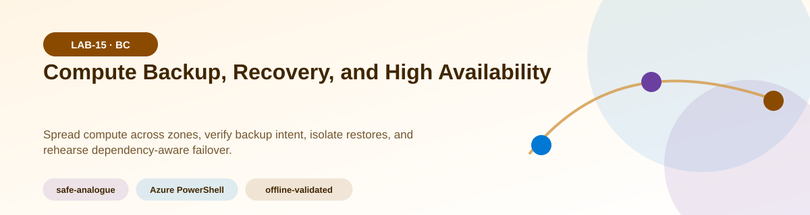
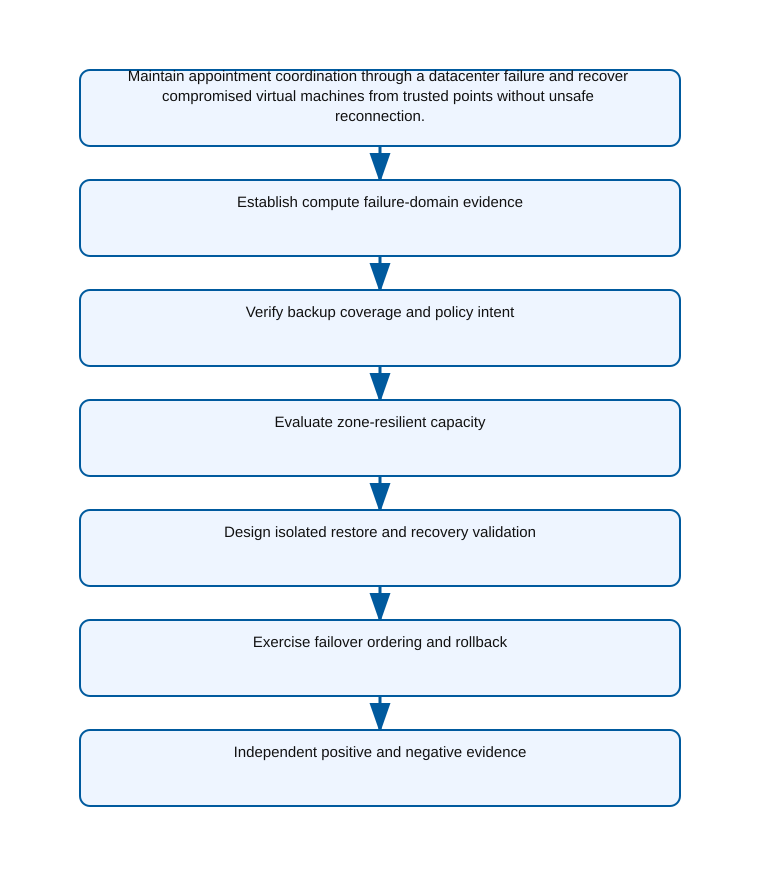
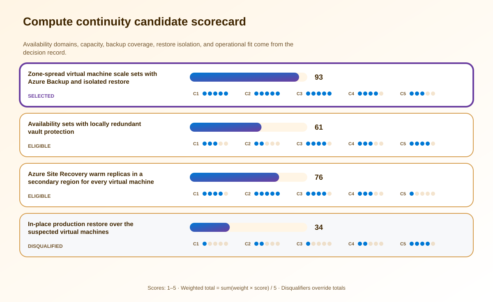

<!-- BEGIN GENERATED AZ305 V1 -->
# LAB-15 — Compute Backup, Recovery, and High Availability



<div class="az305-badges" aria-label="Lab classification">
  <span class="az305-mode-badge">safe-analogue</span>
  <span class="az305-lane-badge">Azure PowerShell</span>
  <span class="az305-status">offline-validated</span>
</div>

## 1. Navigation

[← LAB-14](../14-recovery-strategy-hybrid/README.md) · [Lab catalog](../README.md) · [LAB-16 →](../16-relational-database-continuity/README.md)

## 2. Scenario and completion contract

Fabrikam Health runs appointment and imaging coordination on Windows and Linux virtual machines distributed across one Azure region. Backups exist, but recent restore testing found inconsistent policies, unprotected data disks, and a single application tier confined to one datacenter boundary. The clinical service must survive a zone outage, recover from destructive change, retain immutable recovery points, and prove that restored machines are isolated before reconnecting to production. A full second-region estate is too expensive for the learning environment, so the architecture team will evaluate the production design through read-only discovery, policy evidence, and a safe analogue that models failover ordering without creating standby compute.

- Architect role: Compute continuity architect
- Outcome: Design a zone-resilient VM architecture and an auditable backup, isolated-restore, and failover process that meets clinical recovery targets.
- Duration: 150 minutes
- Difficulty: advanced
- Cost class: low
- Completion: all five checkpoint assertions, final validation, decision revision, and cleanup review are complete.

## 3. Objective-to-evidence map

| Objective | Requirement | Checkpoint |
| --- | --- | --- |
| `BC-DR-02` | `LAB15-REQ-01` | [`LAB15-CP01`](#checkpoint-1) |
| `BC-HA-01` | `LAB15-REQ-02` | [`LAB15-CP02`](#checkpoint-2) |
| `BC-DR-02` | `LAB15-REQ-03` | [`LAB15-CP03`](#checkpoint-3) |
| `BC-HA-01` | `LAB15-REQ-04` | [`LAB15-CP04`](#checkpoint-4) |
| `BC-DR-02` | `LAB15-REQ-05` | [`LAB15-CP05`](#checkpoint-5) |

## 4. Business and quality requirements

Business outcome: Maintain appointment coordination through a datacenter failure and recover compromised virtual machines from trusted points without unsafe reconnection.

- `LAB15-REQ-01` — Every VM is mapped to an application tier, availability target, zone or fault-domain placement, and recovery order.
- `LAB15-REQ-02` — The coverage matrix maps operating system and data disks to policy frequency, retention, vault redundancy, immutability, and soft-delete requirements.
- `LAB15-REQ-03` — The target design documents supported zones, surge capacity, quota, health probes, disk constraints, and degraded-mode capacity.
- `LAB15-REQ-04` — The restore plan uses a quarantined network, malware inspection, identity isolation, application checks, data-consistency checks, and explicit release approval.
- `LAB15-REQ-05` — The safe analogue sequences identity, data, application, and ingress tiers, measures the RTO, and defines rollback and failback gates.

Scenario facts:

- **Data:** VM inventory includes zones, disks, backup policy, recovery points, dependencies, health, and isolation evidence.
- **Scale:** Windows and Linux tiers span several machines; exact disk size, change rate, and restore throughput remain measured inputs.
- **Latency:** Clinical transaction checks and restore transfer time are measured separately from infrastructure boot time.
- **Availability:** Zone distribution covers a datacenter fault while trusted restore handles destructive or compromised state.
- **RTO:** Cyber recovery must deliver a known-clean restore within two hours after excluding the latest three points.
- **RPO:** The acceptable older recovery point depends on backup frequency and forensic confidence and requires clinical owner approval.
- **Budget:** A safe analogue avoids permanent second-region compute while retaining zone capacity and temporary isolated restore cost.

Constraints:

- Clinical coordination must survive a datacenter failure and restore compromised VMs without reconnecting unsafe systems.
- A known-clean point must be restorable within two hours even when the latest three recovery points are suspect.
- Use only the Azure PowerShell command lane for learner implementation.
- Keep all live changes behind explicit execution and acknowledgement switches.
- Retain only sanitized command evidence and synthetic fixture identifiers.

Assumptions:

- Application tiers can run across supported availability zones and have documented startup dependencies.
- Security can classify a recovery point and approve release from a quarantined restore network.
- West Europe is the configurable primary example and North Europe is the configurable secondary example.
- The learner has administrator-level Azure operations knowledge but receives no pre-existing authenticated context.
- Offline fixtures demonstrate contract behavior rather than live Azure service behavior.

## 5. Architecture diagram and walkthrough



A regional load balancer distributes traffic across zone-spread capacity while protected recovery uses an isolated validation network. The labelled nodes, boundaries, and edges are deterministically rendered from the portable `diagrams/architecture.mmd` source and the frozen visual registry.

## 6. Concept primer and candidate architectures

Architecture decisions translate measurable requirements into a deliberate service and operating model. A candidate is viable only when every mandatory constraint is met; convenience or familiarity cannot compensate for a disqualifier.

- **Zone-spread virtual machine scale sets with Azure Backup and isolated restore** (eligible) — Zone-spread compute covers datacenter loss and Azure Backup supplies protected recovery points for a controlled quarantined restore.
- **Availability sets with locally redundant vault protection** (eligible) — Availability sets distribute host faults but do not establish a zone boundary and local vault redundancy enlarges regional-loss exposure.
- **Azure Site Recovery warm replicas in a secondary region for every virtual machine** (eligible) — Warm replicas improve regional recovery but cost more and may replicate compromised state without trusted-point selection.
- **In-place production restore over the suspected virtual machines** (ineligible) — An in-place restore uses fewer resources but destroys rollback evidence and can reconnect compromise to production. Disqualifier: LAB15-REQ-04 requires quarantine, malware inspection, application validation, and release approval before reconnection.

## 7. Decision, ADR, and Well-Architected review

Criteria weights are C1 30, C2 25, C3 20, C4 15, and C5 10. Weighted totals use `sum(weight × score) / 5`.



| Candidate | Eligible | C1 | C2 | C3 | C4 | C5 | Weighted /100 |
| --- | ---: | ---: | ---: | ---: | ---: | ---: | ---: |
| Zone-spread virtual machine scale sets with Azure Backup and isolated restore | yes | 5 | 5 | 5 | 4 | 3 | 93 |
| Availability sets with locally redundant vault protection | yes | 3 | 2 | 4 | 3 | 4 | 61 |
| Azure Site Recovery warm replicas in a secondary region for every virtual machine | yes | 4 | 5 | 4 | 3 | 1 | 76 |
| In-place production restore over the suspected virtual machines | no | 1 | 2 | 1 | 2 | 4 | 34 |

Selected design: **Zone-spread virtual machine scale sets with Azure Backup and isolated restore**. `ADR-LAB15-001` records the accepted reasoning. Review Reliability, Security, Cost Optimization, Operational Excellence, and Performance Efficiency in `design/decision.yml`; no pillar is implied by another.

Rejected alternatives:

- **Availability sets with locally redundant vault protection:** It does not meet the datacenter-failure requirement as directly as zone-spread placement.
- **Azure Site Recovery warm replicas in a secondary region for every virtual machine:** Uniform replication exceeds the lab budget and does not replace immutable clean recovery points.
- **In-place production restore over the suspected virtual machines:** It is disqualified because a trusted isolated-restore boundary is mandatory.

Architecture risks:

- **Risk:** Excluding three recovery points may leave no point inside the two-hour transfer and validation window. **Mitigation:** Increase protected-point frequency or pre-stage isolated restore capacity after measuring older-point restore duration.
- **Risk:** A zone-spread VM set can still depend on a single-zone database or ingress component. **Mitigation:** Map and assert every upstream dependency's failure domain before accepting the compute availability result.

Well-Architected consequences:

<div class="az305-waf-grid">
<article class="az305-waf-card"><h3>Reliability</h3><p>Zone placement, backup coverage, clean-point selection, and dependency-aware startup address distinct failure modes.</p></article>
<article class="az305-waf-card"><h3>Security</h3><p>Immutable recovery points and quarantined validation prevent compromised machines from rejoining automatically.</p></article>
<article class="az305-waf-card"><h3>Cost Optimization</h3><p>Permanent capacity covers zonal availability while secondary-region and restore resources remain risk-based.</p></article>
<article class="az305-waf-card"><h3>Operational Excellence</h3><p>Timed restore, forensic approval, transaction checks, and rollback form one rehearsable recovery record.</p></article>
<article class="az305-waf-card"><h3>Performance Efficiency</h3><p>SKU and degraded-capacity evidence ensure surviving zones and restore hosts can process the clinical load.</p></article>
</div>

ADR consequences:

- Backup policy must retain enough points that rejecting the newest three still leaves a recoverable candidate.
- Security approval becomes part of the measured clinical recovery path, not a post-restore note.

## 8. Inputs, permissions, licensing, cost, and analogue

Use configurable `Location` (`AZ305_LOCATION`, default West Europe) and `SecondaryLocation` (`AZ305_SECONDARY_LOCATION`, default North Europe). Every public input has an explicit `AZ305_*` fallback. Preview is the default; only Golden Lab 00 writes an intent-only `execute: false` preview record. Before an executed cloud command, the supplied subscription and tenant must exactly match the active CLI, Az, and—where applicable—Microsoft Graph contexts. `-Execute` crosses the execution boundary; cost-bearing and tenant-scoped paths also require their independent acknowledgement switches.

Safe analogue: Model recovery-point rejection, isolated-network validation, startup waves, and cleanup with synthetic VM and backup fixtures only.

Permissions: Virtual machine, SKU, and backup read roles support assessment; protection, immutability, restore, failover, or compute changes require separate authorization.

Licensing: Azure Backup protected instances and storage, Site Recovery protected instances, restored disks, and temporary isolated compute are separately billed.

Cost boundary: Compare zone-spread steady capacity, retained recovery points, cross-region replication where allowed, and short-lived isolated restore resources.

## 9. Read-only preflight

```powershell
pwsh ./scripts/azure-powershell/Preflight.ps1 -RunId synthetic-150001
```

Synthetic sample: `{"labId":"LAB-15","track":"azure-powershell","result":"pass","note":"Local tool discovery only"}`. This is illustrative local output, not evidence captured from Azure.

## 10. Five guided checkpoints

<ol class="az305-checkpoint-timeline" aria-label="Five checkpoint learning path">
<li><a href="#checkpoint-1">Establish compute failure-domain evidence</a><span>LAB15-REQ-01 · LAB15-CP01</span></li>
<li><a href="#checkpoint-2">Verify backup coverage and policy intent</a><span>LAB15-REQ-02 · LAB15-CP02</span></li>
<li><a href="#checkpoint-3">Evaluate zone-resilient capacity</a><span>LAB15-REQ-03 · LAB15-CP03</span></li>
<li><a href="#checkpoint-4">Design isolated restore and recovery validation</a><span>LAB15-REQ-04 · LAB15-CP04</span></li>
<li><a href="#checkpoint-5">Exercise failover ordering and rollback</a><span>LAB15-REQ-05 · LAB15-CP05</span></li>
</ol>

### Checkpoint 1: Establish compute failure-domain evidence

<a id="checkpoint-1"></a>

**Trace:** `BC-DR-02` → `LAB15-REQ-01` → `LAB15-CP01`

```powershell
Get-AzVM -ResourceGroupName $ResourceGroupName -Status | Select-Object Name, Location, Zones, @{Name='PowerState';Expression={$_.Statuses[-1].DisplayStatus}}
```

Expected evidence: Every VM is mapped to an application tier, availability target, zone or fault-domain placement, and recovery order. Retain Export the VM placement matrix with tier, zone, disk, dependency, and owner fields.

Positive assertion:

```powershell
$running = Get-AzVM -ResourceGroupName $ResourceGroupName -Status | Where-Object { $_.Statuses.DisplayStatus -contains 'VM running' }; if (-not $running) { throw 'No running VM was found in the assessed scope.' }
```

Negative assertion:

```powershell
$withoutZone = Get-AzVM -ResourceGroupName $ResourceGroupName | Where-Object { -not $_.Zones -and -not $_.AvailabilitySetReference }; if ($withoutZone) { throw 'A VM lacks a zone or availability-set placement decision.' }
```

Failure and retry: Missing placement metadata can conceal a single-zone application dependency. Confirm supported zones and SKU capacity, update the design matrix, and rerun both placement assertions.

Cleanup dependency: Remove the local inventory export after review; do not alter VM placement during discovery.

WAF consequence: Reliability: explicit zone distribution reduces correlated compute failure.

### Checkpoint 2: Verify backup coverage and policy intent

<a id="checkpoint-2"></a>

**Trace:** `BC-HA-01` → `LAB15-REQ-02` → `LAB15-CP02`

```powershell
Get-AzRecoveryServicesVault -ResourceGroupName $ResourceGroupName | Select-Object Name, Location, Id
```

Expected evidence: The coverage matrix maps operating system and data disks to policy frequency, retention, vault redundancy, immutability, and soft-delete requirements. Retain Preserve vault configuration, policy exports, protected-item coverage, and approved exceptions.

Positive assertion:

```powershell
$vault = Get-AzRecoveryServicesVault -ResourceGroupName $ResourceGroupName | Select-Object -First 1; if (-not $vault) { throw 'No Recovery Services vault was found.' }
```

Negative assertion:

```powershell
$vaults = Get-AzRecoveryServicesVault -ResourceGroupName $ResourceGroupName; if ($vaults | Where-Object { $_.Location -ne $Location }) { throw 'A vault location differs from the documented protection design.' }
```

Failure and retry: Vault existence alone does not prove that every required disk is protected or retained correctly. Correct the policy-to-workload mapping in the design and repeat the coverage reconciliation.

Cleanup dependency: Remove sanitized exports only; never disable soft delete, immutability, or protection as cleanup.

WAF consequence: Security: immutable, access-controlled recovery points improve resistance to destructive attacks.

### Checkpoint 3: Evaluate zone-resilient capacity

<a id="checkpoint-3"></a>

**Trace:** `BC-DR-02` → `LAB15-REQ-03` → `LAB15-CP03`

```powershell
Get-AzComputeResourceSku -Location $Location | Where-Object { $_.ResourceType -eq 'virtualMachines' -and $_.Name -eq $VmSku } | Select-Object Name, Locations, LocationInfo, Restrictions
```

Expected evidence: The target design documents supported zones, surge capacity, quota, health probes, disk constraints, and degraded-mode capacity. Retain Save the SKU capability result, capacity calculation, and quota-request lead-time assumption.

Positive assertion:

```powershell
$sku = Get-AzComputeResourceSku -Location $Location | Where-Object { $_.ResourceType -eq 'virtualMachines' -and $_.Name -eq $VmSku -and -not $_.Restrictions }; if (-not $sku) { throw 'The selected VM SKU is unavailable or restricted.' }
```

Negative assertion:

```powershell
$zonal = Get-AzComputeResourceSku -Location $Location | Where-Object { $_.ResourceType -eq 'virtualMachines' -and $_.Name -eq $VmSku -and $_.LocationInfo.Zones.Count -lt 2 }; if ($zonal) { throw 'The selected SKU does not expose the required zone spread.' }
```

Failure and retry: Region-specific SKU restrictions can make a syntactically valid availability design undeployable. Evaluate the approved fallback SKU and recalculate cost and performance before reselection.

Cleanup dependency: Delete local calculation output; this checkpoint requests no quota and provisions no compute.

WAF consequence: Performance Efficiency: right-sized degraded-mode capacity protects clinical latency without permanent overprovisioning.

### Checkpoint 4: Design isolated restore and recovery validation

<a id="checkpoint-4"></a>

**Trace:** `BC-HA-01` → `LAB15-REQ-04` → `LAB15-CP04`

```powershell
Get-AzRecoveryServicesBackupJob -VaultId $VaultId -From (Get-Date).AddDays(-7) | Select-Object WorkloadName, Operation, Status, StartTime, EndTime
```

Expected evidence: The restore plan uses a quarantined network, malware inspection, identity isolation, application checks, data-consistency checks, and explicit release approval. Retain Record the selected recovery point, job timing, isolation controls, assertion results, and approval outcome.

Positive assertion:

```powershell
$completed = Get-AzRecoveryServicesBackupJob -VaultId $VaultId -From (Get-Date).AddDays(-7) | Where-Object { $_.Operation -match 'Backup|Restore' -and $_.Status -eq 'Completed' }; if (-not $completed) { throw 'No completed backup or restore evidence was found.' }
```

Negative assertion:

```powershell
$failed = Get-AzRecoveryServicesBackupJob -VaultId $VaultId -From (Get-Date).AddDays(-7) | Where-Object { $_.Status -in @('Failed','PartiallySucceeded') }; if ($failed) { throw 'Failed backup or restore jobs require resolution.' }
```

Failure and retry: A technically completed restore can reintroduce compromise or inconsistent application state. Select the next trusted recovery point, preserve the failed evidence, and repeat validation in isolation.

Cleanup dependency: Remove only disposable restored resources after exact ownership checks; retain protected recovery points.

WAF consequence: Operational Excellence: a rehearsed isolated-restore workflow produces repeatable and auditable recovery.

### Checkpoint 5: Exercise failover ordering and rollback

<a id="checkpoint-5"></a>

**Trace:** `BC-DR-02` → `LAB15-REQ-05` → `LAB15-CP05`

```powershell
Get-AzRecoveryServicesAsrRecoveryPlan -Name $RecoveryPlanName | Select-Object Name, PrimaryFabricFriendlyName, RecoveryFabricFriendlyName, Groups
```

Expected evidence: The safe analogue sequences identity, data, application, and ingress tiers, measures the RTO, and defines rollback and failback gates. Retain Save the simulated timeline, assertion-level outcomes, dependency delays, and remediation owners.

Positive assertion:

```powershell
$plan = Get-AzRecoveryServicesAsrRecoveryPlan -Name $RecoveryPlanName; if (-not $plan -or $plan.Groups.Count -lt 2) { throw 'The recovery plan does not contain dependency-aware groups.' }
```

Negative assertion:

```powershell
$plan = Get-AzRecoveryServicesAsrRecoveryPlan -Name $RecoveryPlanName; if ($plan.Groups[0].ProtectedItems.FriendlyName -contains $WebTierVmName) { throw 'The web tier starts before its data dependency.' }
```

Failure and retry: Parallel recovery without dependency gates can create misleadingly fast but unusable service restoration. Correct the recovery group order and repeat the failed wave, not the entire exercise, unless state is uncertain.

Cleanup dependency: Remove only run-owned simulation artifacts; do not start a test failover or delete recovery plans.

WAF consequence: Cost Optimization: the safe analogue validates orchestration without maintaining a full secondary compute estate.

## 11. Final validation and interpretation

Run `Validate.ps1 -Mode Deployment -Execute` only after an executed run has state and you are authorized to issue the ten read-only checkpoint inspections. Without `-Execute`, ordinary deployment validation records `partial` and exits `2`; Golden Lab 00 alone can validate its intent-only preview locally. Exit `0` means all required assertions pass, `1` means at least one failed, and `2` means the outcome is gated or partial. Positive and negative commands execute independently, so one failure never suppresses its paired assertion.

## 12. Material change request

Security now requires a known-clean restore to be available within two hours even when the latest three recovery points are considered suspect.

Revised solution: select **Zone-spread virtual machine scale sets with Azure Backup and isolated restore**. LAB15-REQ-04 makes isolated trusted recovery mandatory, so the selected design adds enough immutable points and prevalidated quarantine capacity to reject three suspect copies and finish within two hours.

Revised Well-Architected consequences:

- **Reliability:** A deeper point set and measured restore throughput protect the two-hour target.
- **Security:** Forensic rejection and quarantine remain gates before any production reconnection.
- **Cost Optimization:** Temporary restore capacity is funded instead of a full permanent secondary estate.
- **Operational Excellence:** Exercises record selection, transfer, validation, approval, and rollback timestamps.
- **Performance Efficiency:** Prevalidated restore sizing avoids discovering disk-throughput limits during a cyber event.

## 13. Architect job challenge

Revise retention, immutability, isolated-restore capacity, and recovery-point selection so the cyber-recovery target is credible without selecting the all-workload regional standby candidate.

## 14. Troubleshooting, cleanup, and residual verification

- If vault cmdlets return no items, set the correct vault context and verify Reader access before concluding that protection is absent.
- If a VM SKU reports restrictions, inspect zone and subscription restrictions separately and document the approved fallback SKU.
- If backup job duration exceeds RTO, distinguish restore transfer time from application validation and approval delays.

Cleanup previews nonempty state in reverse dependency order, writes `partial`, and exits `2`; an already empty run is completed locally and idempotently. Executed cleanup rechecks the exact live ID plus `purpose`, `labId`, `runId`, and `expiresOn` immediately before each removal, persists state after every absent or removed object, stops on the first dependency failure, and refuses unresolved pre-existing settings. It never automates purge. Finish with `Validate.ps1 -Mode PostCleanup`; the required residual count is zero.

## 15. Exam debrief, assessment, sources, and navigation

Explain the recommendation in terms of requirements, rejected alternatives, failure behavior, and all five WAF pillars. Complete `assessment/QUESTIONS.md`, then use the separately excluded answer key for remediation.

- [Reliability in Azure Virtual Machines](https://learn.microsoft.com/en-us/azure/reliability/reliability-virtual-machines)
- [Azure Well-Architected Framework](https://learn.microsoft.com/en-us/azure/well-architected/)

[← LAB-14](../14-recovery-strategy-hybrid/README.md) · [Lab catalog](../README.md) · [LAB-16 →](../16-relational-database-continuity/README.md)

## 16. Synchronized lifecycle-script appendix

### Preflight.ps1

```powershell
[CmdletBinding()]
param(
    [string]$SubscriptionId = $env:AZ305_SUBSCRIPTION_ID,
    [string]$TenantId = $env:AZ305_TENANT_ID,
    [ValidatePattern('^[a-z0-9-]{6,64}$')][string]$RunId = $env:AZ305_RUN_ID,
    [string]$Location = $(if ($env:AZ305_LOCATION) { $env:AZ305_LOCATION } else { 'westeurope' }),
    [string]$SecondaryLocation = $(if ($env:AZ305_SECONDARY_LOCATION) { $env:AZ305_SECONDARY_LOCATION } else { 'northeurope' }),
    [string]$ResourceGroup = $(if ($env:AZ305_RESOURCE_GROUP) { $env:AZ305_RESOURCE_GROUP } else { "rg-az305-$RunId" }),
    [string]$WorkloadName = $(if ($env:AZ305_WORKLOAD_NAME) { $env:AZ305_WORKLOAD_NAME } else { "az305-$RunId" }),
    [string]$ExpiresOn = $(if ($env:AZ305_EXPIRES_ON) { $env:AZ305_EXPIRES_ON } else { (Get-Date).ToUniversalTime().AddDays(1).ToString('yyyy-MM-dd') }),
    [string]$RecoveryPlanName = $env:AZ305_RECOVERY_PLAN_NAME,
    [string]$ResourceGroupName = $env:AZ305_RESOURCE_GROUP_NAME,
    [string]$VaultId = $env:AZ305_VAULT_ID,
    [string]$VmSku = $env:AZ305_VM_SKU,
    [string]$WebTierVmName = $env:AZ305_WEB_TIER_VM_NAME,
    [switch]$Execute,
    [switch]$AcknowledgeCost,
    [switch]$AcknowledgeTenantChange
)

$ErrorActionPreference = 'Stop'
$PSNativeCommandUseErrorActionPreference = $true
if (-not $RunId) { [Console]::Error.WriteLine('RunId or AZ305_RUN_ID is required.'); exit 2 }
# Every lifecycle entrypoint intentionally exposes the same public parameter contract.
@($SubscriptionId, $TenantId, $RunId, $Location, $SecondaryLocation, $ResourceGroup, $WorkloadName, $ExpiresOn, $RecoveryPlanName, $ResourceGroupName, $VaultId, $VmSku, $WebTierVmName, $Execute, $AcknowledgeCost, $AcknowledgeTenantChange) | Out-Null

$requiredCommands = @('pwsh')
$missing = @($requiredCommands | Where-Object { -not (Get-Command $_ -ErrorAction SilentlyContinue) })
if ($missing.Count -gt 0) {
    Write-Error "Missing local commands: $($missing -join ', ')"
    exit 1
}
$requiredCmdlets = @('Get-AzComputeResourceSku', 'Get-AzRecoveryServicesAsrRecoveryPlan', 'Get-AzRecoveryServicesBackupJob', 'Get-AzRecoveryServicesVault', 'Get-AzVM')
$missingCmdlets = @($requiredCmdlets | Where-Object { -not (Get-Command $_ -ErrorAction SilentlyContinue) })
if ($missingCmdlets.Count -gt 0) {
    Write-Error "Missing local cmdlets: $($missingCmdlets -join ', ')"
    exit 1
}

[pscustomobject]@{
    labId = 'LAB-15'
    track = 'azure-powershell'
    implementationMode = 'safe-analogue'
    result = 'pass'
    note = 'Local tool discovery only; no Azure or Microsoft Graph request was made.'
} | ConvertTo-Json
exit 0
```

### Setup.ps1

```powershell
[CmdletBinding()]
param(
    [string]$SubscriptionId = $env:AZ305_SUBSCRIPTION_ID,
    [string]$TenantId = $env:AZ305_TENANT_ID,
    [ValidatePattern('^[a-z0-9-]{6,64}$')][string]$RunId = $env:AZ305_RUN_ID,
    [string]$Location = $(if ($env:AZ305_LOCATION) { $env:AZ305_LOCATION } else { 'westeurope' }),
    [string]$SecondaryLocation = $(if ($env:AZ305_SECONDARY_LOCATION) { $env:AZ305_SECONDARY_LOCATION } else { 'northeurope' }),
    [string]$ResourceGroup = $(if ($env:AZ305_RESOURCE_GROUP) { $env:AZ305_RESOURCE_GROUP } else { "rg-az305-$RunId" }),
    [string]$WorkloadName = $(if ($env:AZ305_WORKLOAD_NAME) { $env:AZ305_WORKLOAD_NAME } else { "az305-$RunId" }),
    [string]$ExpiresOn = $(if ($env:AZ305_EXPIRES_ON) { $env:AZ305_EXPIRES_ON } else { (Get-Date).ToUniversalTime().AddDays(1).ToString('yyyy-MM-dd') }),
    [string]$RecoveryPlanName = $env:AZ305_RECOVERY_PLAN_NAME,
    [string]$ResourceGroupName = $env:AZ305_RESOURCE_GROUP_NAME,
    [string]$VaultId = $env:AZ305_VAULT_ID,
    [string]$VmSku = $env:AZ305_VM_SKU,
    [string]$WebTierVmName = $env:AZ305_WEB_TIER_VM_NAME,
    [switch]$Execute,
    [switch]$AcknowledgeCost,
    [switch]$AcknowledgeTenantChange
)

$ErrorActionPreference = 'Stop'
$PSNativeCommandUseErrorActionPreference = $true
if (-not $RunId) { [Console]::Error.WriteLine('RunId or AZ305_RUN_ID is required.'); exit 2 }
# Every lifecycle entrypoint intentionally exposes the same public parameter contract.
@($SubscriptionId, $TenantId, $RunId, $Location, $SecondaryLocation, $ResourceGroup, $WorkloadName, $ExpiresOn, $RecoveryPlanName, $ResourceGroupName, $VaultId, $VmSku, $WebTierVmName, $Execute, $AcknowledgeCost, $AcknowledgeTenantChange) | Out-Null

$LabRoot = Split-Path (Split-Path $PSScriptRoot -Parent) -Parent
$StateRoot = Join-Path $LabRoot ".state/$RunId"
$StatePath = Join-Path $StateRoot 'run.json'

function Assert-ExactExecutionContext {
    [CmdletBinding()]
    param([string]$ExpectedSubscriptionId, [string]$ExpectedTenantId)
    if ([string]::IsNullOrWhiteSpace($ExpectedSubscriptionId) -or [string]::IsNullOrWhiteSpace($ExpectedTenantId)) { throw 'SubscriptionId and TenantId are required before an Azure request.' }
    $azContext = Get-AzContext -ErrorAction Stop
    if (-not $azContext -or [string]$azContext.Subscription.Id -ine $ExpectedSubscriptionId -or [string]$azContext.Tenant.Id -ine $ExpectedTenantId) {
        throw 'The active Azure PowerShell subscription or tenant does not exactly match the requested context.'
    }
}

function Save-RunState {
    [CmdletBinding()]
    param([Parameter(Mandatory)]$State)
    $temporaryPath = "$StatePath.tmp"
    $State | ConvertTo-Json -Depth 20 | Set-Content -LiteralPath $temporaryPath -Encoding utf8NoBOM
    Move-Item -LiteralPath $temporaryPath -Destination $StatePath -Force
}

function Assert-SafeStateValue {
    [CmdletBinding()]
    param($Value)
    $serialized = $Value | ConvertTo-Json -Depth 12 -Compress
    if ($serialized -match '(?i)"(?:token|password|secret|certificate|connectionString|sas|clientSecret|accessToken|refreshToken|accountKey|privateKey)"\s*:') {
        throw 'A prohibited sensitive field name was returned; state capture is refused.'
    }
}

function Convert-CheckpointOutput {
    [CmdletBinding()]
    param($Value)
    if ($Value -is [string]) { $raw = [string]$Value }
    elseif ($Value -is [System.Collections.IEnumerable] -and @($Value | Where-Object { $_ -isnot [string] }).Count -eq 0) { $raw = @($Value) -join "`n" }
    else { return $Value }
    if ([string]::IsNullOrWhiteSpace($raw)) { return $null }
    try { return ($raw | ConvertFrom-Json -Depth 100) } catch { return $Value }
}

function Get-ReturnedResourceId {
    [CmdletBinding()]
    param($Value)
    $seen = [System.Collections.Generic.HashSet[string]]::new([System.StringComparer]::OrdinalIgnoreCase)
    $results = [System.Collections.Generic.List[string]]::new()
    function Add-ArmId {
        param($Candidate)
        if ($Candidate -is [string] -and $Candidate -match '^/subscriptions/[0-9a-f-]+/(?:resourceGroups/[^/]+(?:/providers/.+)?|providers/.+)$' -and $Candidate -notmatch '/providers/Microsoft\.Resources/deployments/') {
            if ($seen.Add($Candidate)) { $results.Add($Candidate) }
        }
    }
    function Find-DeploymentOutputId {
        param($Item, [int]$Depth)
        if ($null -eq $Item -or $Depth -gt 12) { return }
        if ($Item -is [string]) { Add-ArmId -Candidate $Item; return }
        if ($Item -is [System.Collections.IDictionary]) { foreach ($key in $Item.Keys) { Find-DeploymentOutputId -Item $Item[$key] -Depth ($Depth + 1) }; return }
        if ($Item -is [System.Collections.IEnumerable]) { foreach ($entry in $Item) { Find-DeploymentOutputId -Item $entry -Depth ($Depth + 1) }; return }
        foreach ($property in @($Item.PSObject.Properties | Where-Object { $_.MemberType -in @('NoteProperty', 'Property') })) { Find-DeploymentOutputId -Item $property.Value -Depth ($Depth + 1) }
    }
    foreach ($rootItem in @($Value)) {
        if ($rootItem -is [System.Collections.IDictionary]) {
            foreach ($name in @('id', 'resourceId')) { if ($rootItem.Contains($name)) { Add-ArmId -Candidate $rootItem[$name] } }
            if ($rootItem.Contains('properties') -and $rootItem.properties -and $rootItem.properties.outputs) { Find-DeploymentOutputId -Item $rootItem.properties.outputs -Depth 0 }
            continue
        }
        foreach ($name in @('Id', 'ResourceId')) {
            $property = $rootItem.PSObject.Properties[$name]
            if ($property) { Add-ArmId -Candidate $property.Value }
        }
        if ($rootItem.PSObject.Properties['Properties'] -and $rootItem.Properties -and $rootItem.Properties.outputs) {
            Find-DeploymentOutputId -Item $rootItem.Properties.outputs -Depth 0
        }
    }
    return @($results)
}

function Get-PlannedDeploymentResourceId {
    [CmdletBinding()]
    param($Value)
    $seen = [System.Collections.Generic.HashSet[string]]::new([System.StringComparer]::OrdinalIgnoreCase)
    $results = [System.Collections.Generic.List[string]]::new()
    foreach ($change in @($Value.changes)) {
        $candidate = [string]$change.resourceId
        if ($candidate -match '^/subscriptions/[0-9a-f-]+/(?:resourceGroups/[^/]+(?:/providers/.+)?|providers/.+)$' -and $candidate -notmatch '/providers/Microsoft\.Resources/deployments/' -and $seen.Add($candidate)) {
            $results.Add($candidate)
        }
    }
    return @($results)
}

function Assert-InputSubscriptionScope {
    [CmdletBinding()]
    param($Inputs, [string]$ExpectedSubscriptionId)
    $entries = if ($Inputs -is [System.Collections.IDictionary]) {
        @($Inputs.GetEnumerator())
    } else {
        @($Inputs.PSObject.Properties | ForEach-Object { [pscustomobject]@{ Key = $_.Name; Value = $_.Value } })
    }
    foreach ($entry in $entries) {
        if ($entry.Value -is [string] -and [string]$entry.Value -match '^/subscriptions/([^/]+)/') {
            if ($Matches[1] -ine $ExpectedSubscriptionId) { throw "Input $($entry.Key) belongs to a different subscription." }
        }
    }
}

function Assert-ManagedMutation {
    [CmdletBinding()]
    param($State, [string]$CheckpointId, [bool]$CarriesOwnership, [object[]]$TargetResourceIds)
    if ($CarriesOwnership) { return }
    $targets = @($TargetResourceIds | Where-Object { $_ -is [string] -and $_ -match '^/subscriptions/' })
    if ($targets.Count -eq 0) { throw "$CheckpointId refuses an untagged mutation because no exact ARM target ID was supplied." }
    $knownIds = @($State.managedObjects | ForEach-Object { [string]$_.id })
    if ($knownIds.Count -eq 0) { throw "$CheckpointId refuses to modify a pre-existing object because no run-owned parent has been recorded." }
    foreach ($target in $targets) {
        $related = @($knownIds | Where-Object { $target -ieq $_ -or $target.StartsWith("$_/", [System.StringComparison]::OrdinalIgnoreCase) -or $_.StartsWith("$target/", [System.StringComparison]::OrdinalIgnoreCase) }).Count -gt 0
        if (-not $related) { throw "$CheckpointId refuses a mutation outside the exact run-owned resource boundary." }
    }
}

$executionInputs = [ordered]@{ subscriptionId = $SubscriptionId; tenantId = $TenantId; location = $Location; secondaryLocation = $SecondaryLocation; resourceGroup = $ResourceGroup; workloadName = $WorkloadName; expiresOn = $ExpiresOn; RecoveryPlanName = $RecoveryPlanName; ResourceGroupName = $ResourceGroupName; VaultId = $VaultId; VmSku = $VmSku; WebTierVmName = $WebTierVmName }

if (-not $Execute) {
    Write-Output '[preview] No cloud command was called and no state was created.'
    Write-Output '[preview] Re-run with -Execute only in an authorized disposable environment.'
    exit 0
}
# This setup is compatible with the lab implementation mode.
# This default exercise does not require a cost acknowledgement.
# This lab does not perform a tenant-scoped change by default.
$requiredLabInputs = [ordered]@{ RecoveryPlanName = $RecoveryPlanName; ResourceGroupName = $ResourceGroupName; VaultId = $VaultId; VmSku = $VmSku }
$missingLabInputs = @($requiredLabInputs.GetEnumerator() | Where-Object { $_.Value -is [string] -and [string]::IsNullOrWhiteSpace([string]$_.Value) } | ForEach-Object Key)
if ($missingLabInputs.Count -gt 0) { [Console]::Error.WriteLine("Execution is gated; supply: $($missingLabInputs -join ', ')."); exit 2 }

try {
    Assert-ExactExecutionContext -ExpectedSubscriptionId $SubscriptionId -ExpectedTenantId $TenantId
    Assert-InputSubscriptionScope -Inputs $executionInputs -ExpectedSubscriptionId $SubscriptionId
    Assert-SafeStateValue -Value $executionInputs
}
catch {
    [Console]::Error.WriteLine("Execution is gated by context or input validation: $($_.Exception.Message)")
    exit 2
}

# Recovery state is persisted before the first possible mutation below.
if (Test-Path -LiteralPath $StatePath) {
    [Console]::Error.WriteLine('Run state already exists. Choose a new RunId or complete the recorded cleanup; existing recovery state will not be overwritten.')
    exit 2
}
New-Item -ItemType Directory -Path $StateRoot -Force | Out-Null
$state = [ordered]@{
    schemaVersion = '1.0.0'; labId = 'LAB-15'; runId = $RunId; track = 'azure-powershell'
    implementationMode = 'safe-analogue'; status = 'initialized'
    createdAt = (Get-Date).ToUniversalTime().ToString('o'); execute = $true
    parameters = $executionInputs
    managedObjects = @(); originalSettings = @()
}
Save-RunState -State $state
$state.status = 'deploying'
Save-RunState -State $state

$originalLocation = Get-Location
try {
    Set-Location -LiteralPath $LabRoot
    # 15-CP01: Establish compute failure-domain evidence
    $stepResult = & { Get-AzVM -ResourceGroupName $ResourceGroupName -Status | Select-Object Name, Location, Zones, @{Name='PowerState';Expression={$_.Statuses[-1].DisplayStatus}} }
    $null = $stepResult

    # 15-CP02: Verify backup coverage and policy intent
    $stepResult = & { Get-AzRecoveryServicesVault -ResourceGroupName $ResourceGroupName | Select-Object Name, Location, Id }
    $null = $stepResult

    # 15-CP03: Evaluate zone-resilient capacity
    $stepResult = & { Get-AzComputeResourceSku -Location $Location | Where-Object { $_.ResourceType -eq 'virtualMachines' -and $_.Name -eq $VmSku } | Select-Object Name, Locations, LocationInfo, Restrictions }
    $null = $stepResult

    # 15-CP04: Design isolated restore and recovery validation
    $stepResult = & { Get-AzRecoveryServicesBackupJob -VaultId $VaultId -From (Get-Date).AddDays(-7) | Select-Object WorkloadName, Operation, Status, StartTime, EndTime }
    $null = $stepResult

    # 15-CP05: Exercise failover ordering and rollback
    $stepResult = & { Get-AzRecoveryServicesAsrRecoveryPlan -Name $RecoveryPlanName | Select-Object Name, PrimaryFabricFriendlyName, RecoveryFabricFriendlyName, Groups }
    $null = $stepResult

    $state.status = 'deployed'
    Save-RunState -State $state
} catch {
    $state.status = 'failed'
    Save-RunState -State $state
    Write-Error $_
    exit 1
} finally {
    Set-Location -LiteralPath $originalLocation
}
exit 0
```

### Validate.ps1

```powershell
[CmdletBinding()]
param(
    [string]$SubscriptionId = $env:AZ305_SUBSCRIPTION_ID,
    [string]$TenantId = $env:AZ305_TENANT_ID,
    [ValidatePattern('^[a-z0-9-]{6,64}$')][string]$RunId = $env:AZ305_RUN_ID,
    [string]$Location = $(if ($env:AZ305_LOCATION) { $env:AZ305_LOCATION } else { 'westeurope' }),
    [string]$SecondaryLocation = $(if ($env:AZ305_SECONDARY_LOCATION) { $env:AZ305_SECONDARY_LOCATION } else { 'northeurope' }),
    [string]$ResourceGroup = $(if ($env:AZ305_RESOURCE_GROUP) { $env:AZ305_RESOURCE_GROUP } else { "rg-az305-$RunId" }),
    [string]$WorkloadName = $(if ($env:AZ305_WORKLOAD_NAME) { $env:AZ305_WORKLOAD_NAME } else { "az305-$RunId" }),
    [string]$ExpiresOn = $(if ($env:AZ305_EXPIRES_ON) { $env:AZ305_EXPIRES_ON } else { (Get-Date).ToUniversalTime().AddDays(1).ToString('yyyy-MM-dd') }),
    [string]$RecoveryPlanName = $env:AZ305_RECOVERY_PLAN_NAME,
    [string]$ResourceGroupName = $env:AZ305_RESOURCE_GROUP_NAME,
    [string]$VaultId = $env:AZ305_VAULT_ID,
    [string]$VmSku = $env:AZ305_VM_SKU,
    [string]$WebTierVmName = $env:AZ305_WEB_TIER_VM_NAME,
    [ValidateSet('Deployment', 'PostCleanup')][string]$Mode = 'Deployment',
    [switch]$Execute,
    [switch]$AcknowledgeCost,
    [switch]$AcknowledgeTenantChange
)

$ErrorActionPreference = 'Stop'
$PSNativeCommandUseErrorActionPreference = $true
if (-not $RunId) { [Console]::Error.WriteLine('RunId or AZ305_RUN_ID is required.'); exit 2 }
# Every lifecycle entrypoint intentionally exposes the same public parameter contract.
@($SubscriptionId, $TenantId, $RunId, $Location, $SecondaryLocation, $ResourceGroup, $WorkloadName, $ExpiresOn, $RecoveryPlanName, $ResourceGroupName, $VaultId, $VmSku, $WebTierVmName, $Mode, $Execute, $AcknowledgeCost, $AcknowledgeTenantChange) | Out-Null

$LabRoot = Split-Path (Split-Path $PSScriptRoot -Parent) -Parent
$StateRoot = Join-Path $LabRoot ".state/$RunId"
$RunPath = Join-Path $StateRoot 'run.json'
$ValidationPath = Join-Path $StateRoot 'validation.json'

function Assert-ExactExecutionContext {
    [CmdletBinding()]
    param([string]$ExpectedSubscriptionId, [string]$ExpectedTenantId)
    if ([string]::IsNullOrWhiteSpace($ExpectedSubscriptionId) -or [string]::IsNullOrWhiteSpace($ExpectedTenantId)) { throw 'SubscriptionId and TenantId are required before an Azure request.' }
    $azContext = Get-AzContext -ErrorAction Stop
    if (-not $azContext -or [string]$azContext.Subscription.Id -ine $ExpectedSubscriptionId -or [string]$azContext.Tenant.Id -ine $ExpectedTenantId) {
        throw 'The active Azure PowerShell subscription or tenant does not exactly match the requested context.'
    }
}


if (-not (Test-Path -LiteralPath $RunPath)) {
    Write-Warning 'No run state exists; validation is gated.'
    exit 2
}
$state = Get-Content -LiteralPath $RunPath -Raw | ConvertFrom-Json
$assertions = [System.Collections.Generic.List[object]]::new()
function Add-ValidationAssertion {
    [CmdletBinding()]
    param([string]$Id, [ValidateSet('positive', 'negative')][string]$Kind, [bool]$Passed, [string]$Message)
    $assertions.Add([pscustomobject]@{ id = $Id; kind = $Kind; passed = $Passed; message = $Message })
}

function Save-ValidationArtifact {
    [CmdletBinding()]
    param([ValidateSet('pass', 'partial', 'fail')][string]$Result)
    $artifact = [ordered]@{ schemaVersion = '1.0.0'; labId = 'LAB-15'; runId = $RunId; mode = $Mode; result = $Result; validatedAt = (Get-Date).ToUniversalTime().ToString('o'); assertions = @($assertions) }
    $artifact | ConvertTo-Json -Depth 12 | Set-Content -LiteralPath $ValidationPath -Encoding utf8NoBOM
}

function Test-PositiveEvidence {
    [CmdletBinding()]
    param($Value)
    if ($Value -is [bool]) { return $Value }
    if ($null -eq $Value) { return $false }
    if ($Value -is [string]) { return -not [string]::IsNullOrWhiteSpace($Value) }
    if ($Value -is [System.Collections.IEnumerable]) { return @($Value).Count -gt 0 }
    return $true
}

function Test-NegativeEvidence {
    [CmdletBinding()]
    param($Value)
    if ($Value -is [bool]) { return $Value }
    if ($null -eq $Value) { return $true }
    if ($Value -is [string]) { return [string]::IsNullOrWhiteSpace($Value) }
    if ($Value -is [System.Collections.IEnumerable]) { return @($Value).Count -eq 0 }
    $properties = @($Value.PSObject.Properties | Where-Object { $_.MemberType -in @('NoteProperty', 'Property') })
    if ($properties.Count -eq 0) { return $false }
    return @($properties | Where-Object { -not (Test-NegativeEvidence -Value $_.Value) }).Count -eq 0
}

function Test-ProhibitedStateField {
    [CmdletBinding()]
    param($Value)
    $serialized = $Value | ConvertTo-Json -Depth 20
    return $serialized -match '(?i)"(?:token|password|secret|certificate|connectionString|sas|clientSecret|accessToken|refreshToken|accountKey|privateKey)"\s*:'
}

function Assert-InputSubscriptionScope {
    [CmdletBinding()]
    param($Inputs, [string]$ExpectedSubscriptionId)
    $entries = if ($Inputs -is [System.Collections.IDictionary]) {
        @($Inputs.GetEnumerator())
    } else {
        @($Inputs.PSObject.Properties | ForEach-Object { [pscustomobject]@{ Key = $_.Name; Value = $_.Value } })
    }
    foreach ($entry in $entries) {
        if ($entry.Value -is [string] -and [string]$entry.Value -match '^/subscriptions/([^/]+)/' -and $Matches[1] -ine $ExpectedSubscriptionId) {
            throw "Input $($entry.Key) belongs to a different subscription."
        }
    }
}

$stateIdentityMatches = (
    $state.labId -ceq 'LAB-15' -and
    $state.runId -ceq $RunId -and
    $state.track -ceq 'azure-powershell' -and
    $state.implementationMode -ceq 'safe-analogue' -and
    ([string]$state.parameters.subscriptionId -ieq $SubscriptionId -and [string]$state.parameters.tenantId -ieq $TenantId)
)
Add-ValidationAssertion -Id 'LAB15-VAL-POS-01' -Kind positive -Passed $stateIdentityMatches -Message 'Run identity, implementation mode, command track, tenant, and subscription exactly match the copied lab and requested run.'
$hasSensitiveName = Test-ProhibitedStateField -Value $state
Add-ValidationAssertion -Id 'LAB15-VAL-NEG-01' -Kind negative -Passed (-not $hasSensitiveName) -Message 'State contains no prohibited sensitive field name.'

if ($Mode -eq 'PostCleanup') {
    $cleanupPath = Join-Path $StateRoot 'cleanup.json'
    $cleanup = if (Test-Path -LiteralPath $cleanupPath) { Get-Content -LiteralPath $cleanupPath -Raw | ConvertFrom-Json } else { $null }
    Add-ValidationAssertion -Id 'LAB15-VAL-POS-02' -Kind positive -Passed ($null -ne $cleanup -and $cleanup.labId -ceq 'LAB-15' -and $cleanup.runId -ceq $RunId -and $cleanup.result -eq 'pass' -and $cleanup.ownershipVerified) -Message 'The exact run cleanup completed with verified ownership.'
    Add-ValidationAssertion -Id 'LAB15-VAL-NEG-02' -Kind negative -Passed ($null -ne $cleanup -and $cleanup.activeManagedObjects -eq 0 -and @($state.managedObjects).Count -eq 0 -and @($state.originalSettings).Count -eq 0 -and $state.status -eq 'cleaned') -Message 'No active managed object or unresolved original setting remains in cleanup or run state.'
    $postCleanupPassed = @($assertions | Where-Object { -not $_.passed }).Count -eq 0
    Save-ValidationArtifact -Result $(if ($postCleanupPassed) { 'pass' } else { 'fail' })
    if ($postCleanupPassed) { exit 0 }
    exit 1
}

Add-ValidationAssertion -Id 'LAB15-VAL-POS-02' -Kind positive -Passed ($state.status -eq 'deployed') -Message 'The executed setup completed successfully; a failed setup can never validate as pass.'
Add-ValidationAssertion -Id 'LAB15-VAL-NEG-02' -Kind negative -Passed (@($state.managedObjects | Where-Object { $_.tags.purpose -ne 'az305-lab' -or $_.tags.labId -ne 'LAB-15' -or $_.tags.runId -ne $RunId }).Count -eq 0) -Message 'No recorded object has a foreign ownership tag.'

if (@($assertions | Where-Object { -not $_.passed }).Count -gt 0) {
    Save-ValidationArtifact -Result 'fail'
    exit 1
}
if (-not $Execute) {
    # This lab has no special intent-only validation path.
    Save-ValidationArtifact -Result 'partial'
    Write-Warning 'Checkpoint validation is gated; re-run with -Execute after confirming the exact read-only context.'
    exit 2
}
# The validation surface is compatible with this lab implementation mode.
$requiredValidationInputs = [ordered]@{ RecoveryPlanName = $RecoveryPlanName; ResourceGroupName = $ResourceGroupName; VaultId = $VaultId; VmSku = $VmSku; WebTierVmName = $WebTierVmName }
$missingValidationInputs = @($requiredValidationInputs.GetEnumerator() | Where-Object { $_.Value -is [string] -and [string]::IsNullOrWhiteSpace([string]$_.Value) } | ForEach-Object Key)
if ($missingValidationInputs.Count -gt 0) {
    Add-ValidationAssertion -Id 'LAB15-VAL-POS-CONTEXT' -Kind positive -Passed $false -Message 'One or more required non-secret validation inputs are missing.'
    Save-ValidationArtifact -Result 'partial'
    exit 2
}
try {
    Assert-ExactExecutionContext -ExpectedSubscriptionId $SubscriptionId -ExpectedTenantId $TenantId
    Assert-InputSubscriptionScope -Inputs $state.parameters -ExpectedSubscriptionId $SubscriptionId
    Add-ValidationAssertion -Id 'LAB15-VAL-POS-CONTEXT' -Kind positive -Passed $true -Message 'The active tenant and subscription exactly match the requested validation context.'
}
catch {
    Add-ValidationAssertion -Id 'LAB15-VAL-POS-CONTEXT' -Kind positive -Passed $false -Message 'Exact execution context could not be proven.'
    Save-ValidationArtifact -Result 'partial'
    exit 2
}

$originalLocation = Get-Location
try {
    Set-Location -LiteralPath $LabRoot
# LAB15-CP01: run both polarities even when one fails.
$positivePassed = $false
try {
    $global:LASTEXITCODE = 0
    $positiveEvidence = & { $running = Get-AzVM -ResourceGroupName $ResourceGroupName -Status | Where-Object { $_.Statuses.DisplayStatus -contains 'VM running' }; if (-not $running) { throw 'No running VM was found in the assessed scope.' } }
    $positivePassed = $true
    $null = $positiveEvidence
} catch { $positivePassed = $false }
Add-ValidationAssertion -Id 'LAB15-CP01-POS' -Kind positive -Passed $positivePassed -Message 'Every VM is mapped to an application tier, availability target, zone or fault-domain placement, and recovery order.'

$negativePassed = $false
try {
    $global:LASTEXITCODE = 0
    $negativeEvidence = & { $withoutZone = Get-AzVM -ResourceGroupName $ResourceGroupName | Where-Object { -not $_.Zones -and -not $_.AvailabilitySetReference }; if ($withoutZone) { throw 'A VM lacks a zone or availability-set placement decision.' } }
    $negativePassed = $true
    $null = $negativeEvidence
} catch { $negativePassed = $false }
Add-ValidationAssertion -Id 'LAB15-CP01-NEG' -Kind negative -Passed $negativePassed -Message 'Counting multiple VMs as highly available when they share an unexamined failure domain must fail.'

# LAB15-CP02: run both polarities even when one fails.
$positivePassed = $false
try {
    $global:LASTEXITCODE = 0
    $positiveEvidence = & { $vault = Get-AzRecoveryServicesVault -ResourceGroupName $ResourceGroupName | Select-Object -First 1; if (-not $vault) { throw 'No Recovery Services vault was found.' } }
    $positivePassed = $true
    $null = $positiveEvidence
} catch { $positivePassed = $false }
Add-ValidationAssertion -Id 'LAB15-CP02-POS' -Kind positive -Passed $positivePassed -Message 'The coverage matrix maps operating system and data disks to policy frequency, retention, vault redundancy, immutability, and soft-delete requirements.'

$negativePassed = $false
try {
    $global:LASTEXITCODE = 0
    $negativeEvidence = & { $vaults = Get-AzRecoveryServicesVault -ResourceGroupName $ResourceGroupName; if ($vaults | Where-Object { $_.Location -ne $Location }) { throw 'A vault location differs from the documented protection design.' } }
    $negativePassed = $true
    $null = $negativeEvidence
} catch { $negativePassed = $false }
Add-ValidationAssertion -Id 'LAB15-CP02-NEG' -Kind negative -Passed $negativePassed -Message 'A VM shown in inventory but absent from the protected-item register must fail even if another VM has a successful backup.'

# LAB15-CP03: run both polarities even when one fails.
$positivePassed = $false
try {
    $global:LASTEXITCODE = 0
    $positiveEvidence = & { $sku = Get-AzComputeResourceSku -Location $Location | Where-Object { $_.ResourceType -eq 'virtualMachines' -and $_.Name -eq $VmSku -and -not $_.Restrictions }; if (-not $sku) { throw 'The selected VM SKU is unavailable or restricted.' } }
    $positivePassed = $true
    $null = $positiveEvidence
} catch { $positivePassed = $false }
Add-ValidationAssertion -Id 'LAB15-CP03-POS' -Kind positive -Passed $positivePassed -Message 'The target design documents supported zones, surge capacity, quota, health probes, disk constraints, and degraded-mode capacity.'

$negativePassed = $false
try {
    $global:LASTEXITCODE = 0
    $negativeEvidence = & { $zonal = Get-AzComputeResourceSku -Location $Location | Where-Object { $_.ResourceType -eq 'virtualMachines' -and $_.Name -eq $VmSku -and $_.LocationInfo.Zones.Count -lt 2 }; if ($zonal) { throw 'The selected SKU does not expose the required zone spread.' } }
    $negativePassed = $true
    $null = $negativeEvidence
} catch { $negativePassed = $false }
Add-ValidationAssertion -Id 'LAB15-CP03-NEG' -Kind negative -Passed $negativePassed -Message 'A design that needs every zone at peak capacity, or assumes quota appears during an incident, must fail.'

# LAB15-CP04: run both polarities even when one fails.
$positivePassed = $false
try {
    $global:LASTEXITCODE = 0
    $positiveEvidence = & { $completed = Get-AzRecoveryServicesBackupJob -VaultId $VaultId -From (Get-Date).AddDays(-7) | Where-Object { $_.Operation -match 'Backup|Restore' -and $_.Status -eq 'Completed' }; if (-not $completed) { throw 'No completed backup or restore evidence was found.' } }
    $positivePassed = $true
    $null = $positiveEvidence
} catch { $positivePassed = $false }
Add-ValidationAssertion -Id 'LAB15-CP04-POS' -Kind positive -Passed $positivePassed -Message 'The restore plan uses a quarantined network, malware inspection, identity isolation, application checks, data-consistency checks, and explicit release approval.'

$negativePassed = $false
try {
    $global:LASTEXITCODE = 0
    $negativeEvidence = & { $failed = Get-AzRecoveryServicesBackupJob -VaultId $VaultId -From (Get-Date).AddDays(-7) | Where-Object { $_.Status -in @('Failed','PartiallySucceeded') }; if ($failed) { throw 'Failed backup or restore jobs require resolution.' } }
    $negativePassed = $true
    $null = $negativeEvidence
} catch { $negativePassed = $false }
Add-ValidationAssertion -Id 'LAB15-CP04-NEG' -Kind negative -Passed $negativePassed -Message 'Restoring directly onto the original VM or reconnecting before security and application acceptance must fail.'

# LAB15-CP05: run both polarities even when one fails.
$positivePassed = $false
try {
    $global:LASTEXITCODE = 0
    $positiveEvidence = & { $plan = Get-AzRecoveryServicesAsrRecoveryPlan -Name $RecoveryPlanName; if (-not $plan -or $plan.Groups.Count -lt 2) { throw 'The recovery plan does not contain dependency-aware groups.' } }
    $positivePassed = $true
    $null = $positiveEvidence
} catch { $positivePassed = $false }
Add-ValidationAssertion -Id 'LAB15-CP05-POS' -Kind positive -Passed $positivePassed -Message 'The safe analogue sequences identity, data, application, and ingress tiers, measures the RTO, and defines rollback and failback gates.'

$negativePassed = $false
try {
    $global:LASTEXITCODE = 0
    $negativeEvidence = & { $plan = Get-AzRecoveryServicesAsrRecoveryPlan -Name $RecoveryPlanName; if ($plan.Groups[0].ProtectedItems.FriendlyName -contains $WebTierVmName) { throw 'The web tier starts before its data dependency.' } }
    $negativePassed = $true
    $null = $negativeEvidence
} catch { $negativePassed = $false }
Add-ValidationAssertion -Id 'LAB15-CP05-NEG' -Kind negative -Passed $negativePassed -Message 'Passing infrastructure health while a clinical transaction or rollback assertion fails must produce an overall failed result.'

}
finally {
    Set-Location -LiteralPath $originalLocation
}

$passed = @($assertions | Where-Object { -not $_.passed }).Count -eq 0
Save-ValidationArtifact -Result $(if ($passed) { 'pass' } else { 'fail' })
if ($passed) { exit 0 }
exit 1
```

### Cleanup.ps1

```powershell
[CmdletBinding()]
param(
    [string]$SubscriptionId = $env:AZ305_SUBSCRIPTION_ID,
    [string]$TenantId = $env:AZ305_TENANT_ID,
    [ValidatePattern('^[a-z0-9-]{6,64}$')][string]$RunId = $env:AZ305_RUN_ID,
    [string]$Location = $(if ($env:AZ305_LOCATION) { $env:AZ305_LOCATION } else { 'westeurope' }),
    [string]$SecondaryLocation = $(if ($env:AZ305_SECONDARY_LOCATION) { $env:AZ305_SECONDARY_LOCATION } else { 'northeurope' }),
    [string]$ResourceGroup = $(if ($env:AZ305_RESOURCE_GROUP) { $env:AZ305_RESOURCE_GROUP } else { "rg-az305-$RunId" }),
    [string]$WorkloadName = $(if ($env:AZ305_WORKLOAD_NAME) { $env:AZ305_WORKLOAD_NAME } else { "az305-$RunId" }),
    [string]$ExpiresOn = $(if ($env:AZ305_EXPIRES_ON) { $env:AZ305_EXPIRES_ON } else { (Get-Date).ToUniversalTime().AddDays(1).ToString('yyyy-MM-dd') }),
    [string]$RecoveryPlanName = $env:AZ305_RECOVERY_PLAN_NAME,
    [string]$ResourceGroupName = $env:AZ305_RESOURCE_GROUP_NAME,
    [string]$VaultId = $env:AZ305_VAULT_ID,
    [string]$VmSku = $env:AZ305_VM_SKU,
    [string]$WebTierVmName = $env:AZ305_WEB_TIER_VM_NAME,
    [switch]$Execute,
    [switch]$AcknowledgeCost,
    [switch]$AcknowledgeTenantChange
)

$ErrorActionPreference = 'Stop'
$PSNativeCommandUseErrorActionPreference = $true
if (-not $RunId) { [Console]::Error.WriteLine('RunId or AZ305_RUN_ID is required.'); exit 2 }
# Every lifecycle entrypoint intentionally exposes the same public parameter contract.
@($SubscriptionId, $TenantId, $RunId, $Location, $SecondaryLocation, $ResourceGroup, $WorkloadName, $ExpiresOn, $RecoveryPlanName, $ResourceGroupName, $VaultId, $VmSku, $WebTierVmName, $Execute, $AcknowledgeCost, $AcknowledgeTenantChange) | Out-Null

$LabRoot = Split-Path (Split-Path $PSScriptRoot -Parent) -Parent
$StateRoot = Join-Path $LabRoot ".state/$RunId"
$RunPath = Join-Path $StateRoot 'run.json'
$CleanupPath = Join-Path $StateRoot 'cleanup.json'

function Assert-ExactExecutionContext {
    [CmdletBinding()]
    param([string]$ExpectedSubscriptionId, [string]$ExpectedTenantId)
    if ([string]::IsNullOrWhiteSpace($ExpectedSubscriptionId) -or [string]::IsNullOrWhiteSpace($ExpectedTenantId)) { throw 'SubscriptionId and TenantId are required before an Azure request.' }
    $azContext = Get-AzContext -ErrorAction Stop
    if (-not $azContext -or [string]$azContext.Subscription.Id -ine $ExpectedSubscriptionId -or [string]$azContext.Tenant.Id -ine $ExpectedTenantId) {
        throw 'The active Azure PowerShell subscription or tenant does not exactly match the requested context.'
    }
}


function Save-RunState {
    [CmdletBinding()]
    param([Parameter(Mandatory)]$State)
    $temporaryPath = "$RunPath.tmp"
    $State | ConvertTo-Json -Depth 20 | Set-Content -LiteralPath $temporaryPath -Encoding utf8NoBOM
    Move-Item -LiteralPath $temporaryPath -Destination $RunPath -Force
}

function Save-CleanupArtifact {
    [CmdletBinding()]
    param(
        [ValidateSet('pass', 'partial', 'fail')][string]$Result,
        [bool]$OwnershipVerified
    )
    $artifact = [ordered]@{
        schemaVersion = '1.0.0'; labId = 'LAB-15'; runId = $RunId; result = $Result
        completedAt = (Get-Date).ToUniversalTime().ToString('o'); ownershipVerified = $OwnershipVerified
        activeManagedObjects = @($state.managedObjects).Count; actions = @($actions)
    }
    $temporaryPath = "$CleanupPath.tmp"
    $artifact | ConvertTo-Json -Depth 12 | Set-Content -LiteralPath $temporaryPath -Encoding utf8NoBOM
    Move-Item -LiteralPath $temporaryPath -Destination $CleanupPath -Force
}

function Assert-ExactLiveOwnership {
    [CmdletBinding()]
    param($Tags, $Managed)
    if ($null -eq $Tags) { throw 'Live resource has no ownership tags.' }
    $valid = (
        [string]$Tags.purpose -ceq 'az305-lab' -and
        [string]$Tags.labId -ceq 'LAB-15' -and
        [string]$Tags.runId -ceq $RunId -and
        [string]$Tags.expiresOn -ceq [string]$Managed.tags.expiresOn
    )
    if (-not $valid) { throw 'Live ownership tags do not exactly match run state.' }
}

function Complete-ManagedObject {
    [CmdletBinding()]
    param([Parameter(Mandatory)][string]$ManagedId, [ValidateSet('removed', 'absent')][string]$Result)
    $state.managedObjects = @($state.managedObjects | Where-Object { [string]$_.id -ine $ManagedId })
    # Settings for a deleted run-owned object or its descendants no longer need restoration.
    $state.originalSettings = @($state.originalSettings | Where-Object {
        $settingId = [string]$_.id
        -not ($settingId -ieq $ManagedId -or $settingId.StartsWith("$ManagedId/", [System.StringComparison]::OrdinalIgnoreCase))
    })
    Save-RunState -State $state
    $actions.Add([pscustomobject]@{ id = $ManagedId; result = $Result })
}

if (-not (Test-Path -LiteralPath $RunPath)) { Write-Warning 'No run state exists; cleanup is gated.'; exit 2 }
try { $state = Get-Content -LiteralPath $RunPath -Raw | ConvertFrom-Json -Depth 100 }
catch { [Console]::Error.WriteLine('Cleanup refused because run state is not valid JSON.'); exit 1 }
$actions = [System.Collections.Generic.List[object]]::new()
$identityValid = (
    $state.labId -ceq 'LAB-15' -and
    $state.runId -ceq $RunId -and
    $state.track -ceq 'azure-powershell' -and
    $state.implementationMode -ceq 'safe-analogue'
)
if (-not $identityValid) {
    $actions.Add([pscustomobject]@{ id = 'identity-check'; result = 'refused' })
    Save-CleanupArtifact -Result fail -OwnershipVerified $false
    [Console]::Error.WriteLine('Cleanup refused because the lab, run, track, mode, tenant, or subscription does not exactly match run state.')
    exit 1
}

if (@($state.managedObjects).Count -gt 0 -and (
    [string]::IsNullOrWhiteSpace($SubscriptionId) -or
    [string]::IsNullOrWhiteSpace($TenantId) -or
    [string]$state.parameters.subscriptionId -ine $SubscriptionId -or
    [string]$state.parameters.tenantId -ine $TenantId
)) {
    $actions.Add([pscustomobject]@{ id = 'context-record'; result = 'refused' })
    Save-CleanupArtifact -Result fail -OwnershipVerified $false
    [Console]::Error.WriteLine('Cleanup refused because the requested tenant and subscription do not exactly match run state.')
    exit 1
}

$ownershipValid = $true
foreach ($managed in @($state.managedObjects)) {
    $valid = (
        $managed.id -and
        [string]$managed.id -match '^/subscriptions/([^/]+)/' -and
        $Matches[1] -ieq $SubscriptionId -and
        [string]$managed.tags.purpose -ceq 'az305-lab' -and
        [string]$managed.tags.labId -ceq 'LAB-15' -and
        [string]$managed.tags.runId -ceq $RunId -and
        -not [string]::IsNullOrWhiteSpace([string]$managed.tags.expiresOn) -and
        [string]$managed.tags.expiresOn -ceq [string]$state.parameters.expiresOn
    )
    if (-not $valid) { $ownershipValid = $false }
}
if (-not $ownershipValid) {
    $actions.Add([pscustomobject]@{ id = 'ownership-check'; result = 'refused' })
    Save-CleanupArtifact -Result fail -OwnershipVerified $false
    [Console]::Error.WriteLine('Cleanup refused because recorded IDs and ownership tags could not be proven exactly.')
    exit 1
}

if (@($state.managedObjects).Count -eq 0 -and @($state.originalSettings).Count -gt 0) {
    $state.status = 'failed'
    Save-RunState -State $state
    $actions.Add([pscustomobject]@{ id = 'original-settings'; result = 'refused' })
    Save-CleanupArtifact -Result fail -OwnershipVerified $false
    [Console]::Error.WriteLine('Cleanup refused because original settings remain without a run-owned object whose deletion can safely restore the boundary.')
    exit 1
}

# This implementation mode may clean only exact run-owned cloud objects.

$orderedObjects = @($state.managedObjects)
[array]::Reverse($orderedObjects)
if (@($state.managedObjects).Count -eq 0) {
    $state.status = 'cleaned'
    Save-RunState -State $state
    Save-CleanupArtifact -Result pass -OwnershipVerified $true
    exit 0
}

if (-not $Execute) {
    foreach ($managed in $orderedObjects) { $actions.Add([pscustomobject]@{ id = $managed.id; result = 'planned' }) }
    Save-CleanupArtifact -Result partial -OwnershipVerified $true
    Write-Output '[preview] Dependency-aware cleanup plan written; no cloud command was called.'
    exit 2
}

try {
    Assert-ExactExecutionContext -ExpectedSubscriptionId $SubscriptionId -ExpectedTenantId $TenantId
}
catch {
    $actions.Add([pscustomobject]@{ id = 'context-check'; result = 'refused' })
    Save-CleanupArtifact -Result partial -OwnershipVerified $false
    [Console]::Error.WriteLine("Cleanup is gated by exact context validation: $($_.Exception.Message)")
    exit 2
}

# Persist the cleanup transition before the first possible delete.
$state.status = 'cleaning'
Save-RunState -State $state
$cleanupFailed = $false
foreach ($managed in $orderedObjects) {
    try {
        # State is necessary but not sufficient: inspect the exact live ID and tags immediately before removal.
        $liveResource = $null
        try { $liveResource = Get-AzResource -ResourceId $managed.id -ErrorAction Stop }
        catch {
            $lookupError = "$($_.FullyQualifiedErrorId) $($_.Exception.Message)"
            if ($lookupError -match '(?i)\b(?:ResourceNotFound|ResourceGroupNotFound|could not be found|was not found)\b') {
                Complete-ManagedObject -ManagedId $managed.id -Result absent
                continue
            }
            throw
        }
        if ($null -eq $liveResource) {
            Complete-ManagedObject -ManagedId $managed.id -Result absent
            continue
        }
        if ([string]$liveResource.ResourceId -ine [string]$managed.id) { throw 'Live resource ID does not exactly match run state.' }
        Assert-ExactLiveOwnership -Tags $liveResource.Tags -Managed $managed
        Remove-AzResource -ResourceId $managed.id -Force -ErrorAction Stop | Out-Null
        Complete-ManagedObject -ManagedId $managed.id -Result removed
    } catch {
        $actions.Add([pscustomobject]@{ id = $managed.id; result = 'failed' })
        $cleanupFailed = $true
        break
    }
}
if ($cleanupFailed -or @($state.managedObjects).Count -gt 0 -or @($state.originalSettings).Count -gt 0) {
    $state.status = 'failed'
    Save-RunState -State $state
    Save-CleanupArtifact -Result partial -OwnershipVerified $false
    exit 1
}
$state.status = 'cleaned'
Save-RunState -State $state
Save-CleanupArtifact -Result pass -OwnershipVerified $true
exit 0
```
<!-- END GENERATED AZ305 V1 -->
