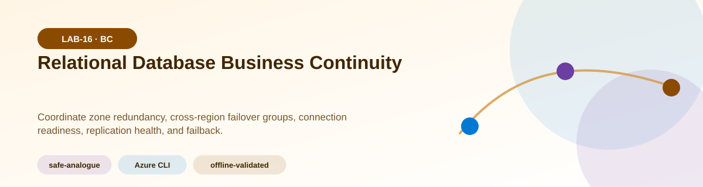
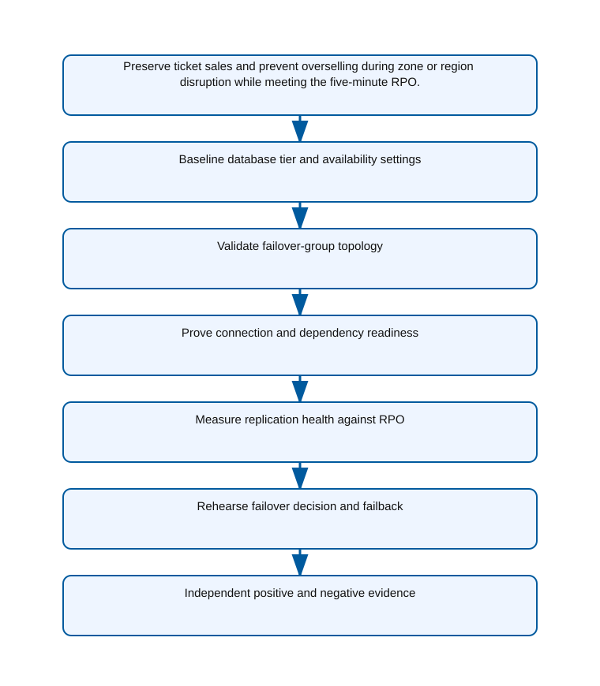
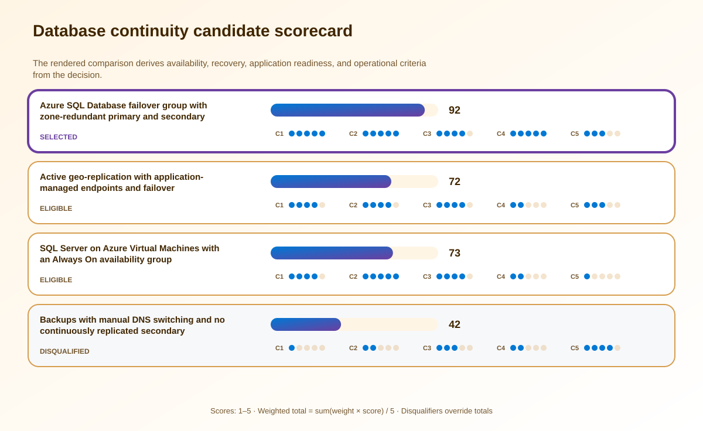

<!-- BEGIN GENERATED AZ305 V1 -->
# LAB-16 — Relational Database Business Continuity



<div class="az305-badges" aria-label="Lab classification">
  <span class="az305-mode-badge">safe-analogue</span>
  <span class="az305-lane-badge">Azure CLI</span>
  <span class="az305-status">offline-validated</span>
</div>

## 1. Navigation

[← LAB-15](../15-compute-backup-ha/README.md) · [Lab catalog](../README.md) · [LAB-17 →](../17-nonrelational-data-resilience/README.md)

## 2. Scenario and completion contract

Northwind Tickets uses Azure SQL Database for reservations, seat inventory, and payment-state coordination. The database is zone redundant in the primary region, but product leaders now require continuity through a complete regional outage and evidence that committed reservations remain within a five-minute data-loss window. Customer traffic can be redirected, yet DNS, connection-string behavior, database dependencies, and failback ownership are poorly documented. A continuously running duplicate application stack is outside the lab budget. The architecture exercise must therefore assess an existing topology with Azure CLI, model failover-group behavior, and validate application-aware recovery criteria without causing an actual failover or modifying production databases.

- Architect role: Relational data continuity architect
- Outcome: Select and validate a relational continuity pattern that covers zonal availability, regional failover, application connectivity, data loss, and controlled failback.
- Duration: 150 minutes
- Difficulty: advanced
- Cost class: low
- Completion: all five checkpoint assertions, final validation, decision revision, and cleanup review are complete.

## 3. Objective-to-evidence map

| Objective | Requirement | Checkpoint |
| --- | --- | --- |
| `BC-DR-03` | `LAB16-REQ-01` | [`LAB16-CP01`](#checkpoint-1) |
| `BC-HA-02` | `LAB16-REQ-02` | [`LAB16-CP02`](#checkpoint-2) |
| `BC-DR-03` | `LAB16-REQ-03` | [`LAB16-CP03`](#checkpoint-3) |
| `BC-HA-02` | `LAB16-REQ-04` | [`LAB16-CP04`](#checkpoint-4) |
| `BC-DR-03` | `LAB16-REQ-05` | [`LAB16-CP05`](#checkpoint-5) |

## 4. Business and quality requirements

Business outcome: Preserve ticket sales and prevent overselling during zone or region disruption while meeting the five-minute RPO.

- `LAB16-REQ-01` — The baseline identifies service tier, zone redundancy, backup redundancy, maintenance constraints, dependencies, and observed workload demand.
- `LAB16-REQ-02` — The partner region, database membership, endpoint policy, grace period, residency, and capacity assumptions match the approved design.
- `LAB16-REQ-03` — Applications use the read-write listener, retry transient failures, preserve idempotency, and can reach every regional dependency after redirection.
- `LAB16-REQ-04` — Replication lag and business transaction markers are measured independently and remain within the five-minute RPO under the modeled load.
- `LAB16-REQ-05` — The exercise defines detection, business authorization, forced-versus-planned choice, validation, stabilization, and data-safe failback gates.

Scenario facts:

- **Data:** Reservation, seat inventory, and payment-state transactions require consistency plus measurable replication and failover evidence.
- **Scale:** A flash sale doubles peak write volume; baseline transactions, database size, and log rate remain measured inputs.
- **Latency:** Write latency and replication delay must stay compatible with the five-minute RPO during doubled demand.
- **Availability:** Zone-redundant primary and secondary databases plus controlled regional failover cover separate fault domains.
- **RTO:** The end-to-end reservation API recovery target changes from one hour to fifteen minutes.
- **RPO:** Accepted reservations may lose no more than five minutes, including replication backlog at peak write rate.
- **Budget:** Continuous secondary compute is accepted for regional continuity, but duplicate application capacity can use a bounded warm strategy.

Constraints:

- Committed reservations must remain inside a five-minute data-loss window through regional disruption.
- Peak writes double and the reservation API recovery target drops from one hour to fifteen minutes.
- Use only the Azure CLI command lane for learner implementation.
- Keep all live changes behind explicit execution and acknowledgement switches.
- Retain only sanitized command evidence and synthetic fixture identifiers.

Assumptions:

- Applications use a failover-group listener and retry transient connection changes safely.
- Dependent identity, network, and secret services have compatible regional recovery behavior.
- West Europe is the configurable primary example and North Europe is the configurable secondary example.
- The learner has administrator-level Azure operations knowledge but receives no pre-existing authenticated context.
- Offline fixtures demonstrate contract behavior rather than live Azure service behavior.

## 5. Architecture diagram and walkthrough



Applications use the failover-group listener while zone-redundant databases replicate across regions and expose measurable health. The labelled nodes, boundaries, and edges are deterministically rendered from the portable `diagrams/architecture.mmd` source and the frozen visual registry.

## 6. Concept primer and candidate architectures

Architecture decisions translate measurable requirements into a deliberate service and operating model. A candidate is viable only when every mandatory constraint is met; convenience or familiarity cannot compensate for a disqualifier.

- **Azure SQL Database failover group with zone-redundant primary and secondary databases** (eligible) — Failover groups provide listener-based application continuity and managed regional database relationships with zonal protection.
- **Active geo-replication with application-managed endpoints and failover** (eligible) — Active geo-replication supports flexible database relationships but shifts endpoint selection and coordinated failover into application operations.
- **SQL Server on Azure Virtual Machines with an Always On availability group** (eligible) — Always On offers deep control but adds operating systems, clustering, patching, quorum, and listener ownership.
- **Backups with manual DNS switching and no continuously replicated secondary** (ineligible) — Restore-based recovery lowers standby cost but cannot reliably restore and redirect the API inside the new target. Disqualifier: LAB16-REQ-04 requires measured regional replication health to remain inside the five-minute RPO.

## 7. Decision, ADR, and Well-Architected review

Criteria weights are C1 30, C2 25, C3 20, C4 15, and C5 10. Weighted totals use `sum(weight × score) / 5`.



| Candidate | Eligible | C1 | C2 | C3 | C4 | C5 | Weighted /100 |
| --- | ---: | ---: | ---: | ---: | ---: | ---: | ---: |
| Azure SQL Database failover group with zone-redundant primary and secondary databases | yes | 5 | 5 | 4 | 5 | 3 | 92 |
| Active geo-replication with application-managed endpoints and failover | yes | 4 | 4 | 4 | 2 | 3 | 72 |
| SQL Server on Azure Virtual Machines with an Always On availability group | yes | 4 | 5 | 4 | 2 | 1 | 73 |
| Backups with manual DNS switching and no continuously replicated secondary | no | 1 | 2 | 3 | 2 | 4 | 42 |

Selected design: **Azure SQL Database failover group with zone-redundant primary and secondary databases**. `ADR-LAB16-001` records the accepted reasoning. Review Reliability, Security, Cost Optimization, Operational Excellence, and Performance Efficiency in `design/decision.yml`; no pillar is implied by another.

Rejected alternatives:

- **Active geo-replication with application-managed endpoints and failover:** Application-managed endpoint and database coordination adds recovery steps that threaten the shorter RTO.
- **SQL Server on Azure Virtual Machines with an Always On availability group:** The extra infrastructure operations are unnecessary for the managed-database workload and increase recovery complexity.
- **Backups with manual DNS switching and no continuously replicated secondary:** It is ineligible because backup restore cannot prove the mandatory RTO and RPO combination.

Architecture risks:

- **Risk:** Doubled log generation can increase replication lag beyond the five-minute data-loss window. **Mitigation:** Load-test the peak write profile, monitor lag, and size both databases and network dependencies for the observed rate.
- **Risk:** The database listener can fail over while application configuration or secrets remain region-bound. **Mitigation:** Test the API transaction through all regional dependencies and treat any failed business assertion as recovery failure.

Well-Architected consequences:

<div class="az305-waf-grid">
<article class="az305-waf-card"><h3>Reliability</h3><p>Zonal databases, regional replication, listener failover, and application checks cover layered failure domains.</p></article>
<article class="az305-waf-card"><h3>Security</h3><p>Encrypted connections, private access, identity, and audit controls apply in both primary and secondary regions.</p></article>
<article class="az305-waf-card"><h3>Cost Optimization</h3><p>Secondary capacity is a funded RPO/RTO control and can serve approved reads rather than remain entirely idle.</p></article>
<article class="az305-waf-card"><h3>Operational Excellence</h3><p>Lag, failover, DNS, API transaction, and failback timestamps form the recovery scorecard.</p></article>
<article class="az305-waf-card"><h3>Performance Efficiency</h3><p>Both regions are sized and tested for doubled write throughput instead of assuming replication keeps pace.</p></article>
</div>

ADR consequences:

- Application connections must use the failover-group listener and bounded retry behavior.
- Both regions require capacity and dependency validation at the doubled flash-sale write rate.

## 8. Inputs, permissions, licensing, cost, and analogue

Use configurable `Location` (`AZ305_LOCATION`, default West Europe) and `SecondaryLocation` (`AZ305_SECONDARY_LOCATION`, default North Europe). Every public input has an explicit `AZ305_*` fallback. Preview is the default; only Golden Lab 00 writes an intent-only `execute: false` preview record. Before an executed cloud command, the supplied subscription and tenant must exactly match the active CLI, Az, and—where applicable—Microsoft Graph contexts. `-Execute` crosses the execution boundary; cost-bearing and tenant-scoped paths also require their independent acknowledgement switches.

Safe analogue: Use local topology, lag, connection, and transaction fixtures to simulate failover and failback without invoking a database operation.

Permissions: SQL account and failover configuration read access supports assessment; database creation, replication, failover, DNS, or connection changes require separate authorization.

Licensing: Primary and secondary database compute, backup storage, zone redundancy, geo-replication traffic, and test capacity affect price.

Cost boundary: Model both regions, readable secondary use, peak write tier, backup retention, failover exercises, and duplicate application dependencies.

## 9. Read-only preflight

```powershell
pwsh ./scripts/azure-cli/Preflight.ps1 -RunId synthetic-160001
```

Synthetic sample: `{"labId":"LAB-16","track":"azure-cli","result":"pass","note":"Local tool discovery only"}`. This is illustrative local output, not evidence captured from Azure.

## 10. Five guided checkpoints

<ol class="az305-checkpoint-timeline" aria-label="Five checkpoint learning path">
<li><a href="#checkpoint-1">Baseline database tier and availability settings</a><span>LAB16-REQ-01 · LAB16-CP01</span></li>
<li><a href="#checkpoint-2">Validate failover-group topology</a><span>LAB16-REQ-02 · LAB16-CP02</span></li>
<li><a href="#checkpoint-3">Prove connection and dependency readiness</a><span>LAB16-REQ-03 · LAB16-CP03</span></li>
<li><a href="#checkpoint-4">Measure replication health against RPO</a><span>LAB16-REQ-04 · LAB16-CP04</span></li>
<li><a href="#checkpoint-5">Rehearse failover decision and failback</a><span>LAB16-REQ-05 · LAB16-CP05</span></li>
</ol>

### Checkpoint 1: Baseline database tier and availability settings

<a id="checkpoint-1"></a>

**Trace:** `BC-DR-03` → `LAB16-REQ-01` → `LAB16-CP01`

```powershell
az sql db show --resource-group $ResourceGroupName --server $SqlServerName --name $DatabaseName --query "{id:id,sku:sku.name,tier:sku.tier,zoneRedundant:zoneRedundant,status:status}" --output json --only-show-errors
```

Expected evidence: The baseline identifies service tier, zone redundancy, backup redundancy, maintenance constraints, dependencies, and observed workload demand. Retain Store the normalized database configuration and the requirement-to-capability comparison.

Positive assertion:

```powershell
$db = az sql db show --resource-group $ResourceGroupName --server $SqlServerName --name $DatabaseName --output json --only-show-errors | ConvertFrom-Json; if ($db.status -ne 'Online') { throw 'The primary database is not online.' }
```

Negative assertion:

```powershell
$db = az sql db show --resource-group $ResourceGroupName --server $SqlServerName --name $DatabaseName --output json --only-show-errors | ConvertFrom-Json; if (-not $db.zoneRedundant) { throw 'The selected primary tier is not zone redundant.' }
```

Failure and retry: Unsupported tier or region combinations can invalidate the selected continuity pattern. Evaluate the nearest qualifying tier, recalculate cost, and rerun the capability assertions.

Cleanup dependency: Delete only the local configuration export; the source database remains unchanged.

WAF consequence: Reliability: local zone resilience prevents a datacenter event from becoming an unnecessary regional failover.

### Checkpoint 2: Validate failover-group topology

<a id="checkpoint-2"></a>

**Trace:** `BC-HA-02` → `LAB16-REQ-02` → `LAB16-CP02`

```powershell
az sql failover-group show --resource-group $ResourceGroupName --server $SqlServerName --name $FailoverGroupName --query "{partner:partnerServers[0].id,policy:readWriteEndpoint.failoverPolicy,grace:readWriteEndpoint.failoverWithDataLossGracePeriodMinutes,databases:databases}" --output json --only-show-errors
```

Expected evidence: The partner region, database membership, endpoint policy, grace period, residency, and capacity assumptions match the approved design. Retain Preserve the failover-group projection and a diagram of primary, secondary, and listener endpoint behavior.

Positive assertion:

```powershell
$fg = az sql failover-group show --resource-group $ResourceGroupName --server $SqlServerName --name $FailoverGroupName --output json --only-show-errors | ConvertFrom-Json; if ($fg.databases.Count -lt 1 -or $fg.partnerServers.Count -ne 1) { throw 'The failover group lacks a database or a single partner.' }
```

Negative assertion:

```powershell
$fg = az sql failover-group show --resource-group $ResourceGroupName --server $SqlServerName --name $FailoverGroupName --output json --only-show-errors | ConvertFrom-Json; if ($fg.readWriteEndpoint.failoverPolicy -eq 'Automatic' -and $fg.readWriteEndpoint.failoverWithDataLossGracePeriodMinutes -lt 60) { throw 'Automatic failover grace is below the approved safety threshold.' }
```

Failure and retry: An incomplete group can redirect the application while leaving a required database behind. Correct the proposed membership or policy in the design fixture and repeat the read-only comparison.

Cleanup dependency: Remove local projections only; do not add databases or alter failover policy during assessment.

WAF consequence: Security: region and membership validation keeps replicated payment data inside approved boundaries.

### Checkpoint 3: Prove connection and dependency readiness

<a id="checkpoint-3"></a>

**Trace:** `BC-DR-03` → `LAB16-REQ-03` → `LAB16-CP03`

```powershell
az sql failover-group list --resource-group $ResourceGroupName --server $SqlServerName --query "[].{name:name,readWriteListener:readWriteEndpoint,readOnlyListener:readOnlyEndpoint}" --output json --only-show-errors
```

Expected evidence: Applications use the read-write listener, retry transient failures, preserve idempotency, and can reach every regional dependency after redirection. Retain Save sanitized connection settings, dependency checks, retry-policy tests, and transaction correlation IDs.

Positive assertion:

```powershell
$groups = az sql failover-group list --resource-group $ResourceGroupName --server $SqlServerName --output json --only-show-errors | ConvertFrom-Json; if (-not ($groups | Where-Object { $_.name -eq $FailoverGroupName })) { throw 'The expected listener configuration was not found.' }
```

Negative assertion:

```powershell
$server = az sql server show --resource-group $ResourceGroupName --name $SqlServerName --output json --only-show-errors | ConvertFrom-Json; if ($server.fullyQualifiedDomainName -eq $ApplicationSqlEndpoint) { throw 'The application is pinned to the regional server rather than the failover-group listener.' }
```

Failure and retry: Database failover can succeed while the application remains pinned to the unavailable primary endpoint. Correct the local configuration fixture and replay connection and idempotency tests.

Cleanup dependency: Remove sanitized test outputs and synthetic transactions; never commit connection secrets.

WAF consequence: Operational Excellence: listener-based configuration and tested retry behavior make failover operable.

### Checkpoint 4: Measure replication health against RPO

<a id="checkpoint-4"></a>

**Trace:** `BC-HA-02` → `LAB16-REQ-04` → `LAB16-CP04`

```powershell
az monitor metrics list --resource $DatabaseResourceId --metric replication_lag_seconds --interval PT1M --aggregation Maximum --output json --only-show-errors
```

Expected evidence: Replication lag and business transaction markers are measured independently and remain within the five-minute RPO under the modeled load. Retain Archive metric samples, transaction watermarks, timestamps, and the calculated worst-case data-loss interval.

Positive assertion:

```powershell
$metric = az monitor metrics list --resource $DatabaseResourceId --metric replication_lag_seconds --interval PT1M --aggregation Maximum --output json --only-show-errors | ConvertFrom-Json; if ($metric.value.timeseries.data.maximum | Where-Object { $_ -gt 300 }) { throw 'Observed replication lag exceeds the five-minute RPO.' }
```

Negative assertion:

```powershell
$metric = az monitor metrics list --resource $DatabaseResourceId --metric replication_lag_seconds --interval PT1M --aggregation Maximum --output json --only-show-errors | ConvertFrom-Json; if (-not $metric.value.timeseries.data) { throw 'Replication lag has no evidence samples.' }
```

Failure and retry: Aggregate metrics can hide short lag spikes that violate the business RPO. Query maximum granularity for the affected window and rerun the synthetic transaction comparison.

Cleanup dependency: Delete synthetic business records according to the test-data policy; retain sanitized metric evidence.

WAF consequence: Performance Efficiency: lag measurement shows whether secondary capacity can sustain the write and replication rate.

### Checkpoint 5: Rehearse failover decision and failback

<a id="checkpoint-5"></a>

**Trace:** `BC-DR-03` → `LAB16-REQ-05` → `LAB16-CP05`

```powershell
az sql failover-group show --resource-group $ResourceGroupName --server $SqlServerName --name $FailoverGroupName --query "{replicationRole:replicationRole,policy:readWriteEndpoint.failoverPolicy,partner:partnerServers[0].id}" --output table --only-show-errors
```

Expected evidence: The exercise defines detection, business authorization, forced-versus-planned choice, validation, stabilization, and data-safe failback gates. Retain Preserve the tabletop decision log, predicted data-loss window, application assertions, and failback checklist.

Positive assertion:

```powershell
$fg = az sql failover-group show --resource-group $ResourceGroupName --server $SqlServerName --name $FailoverGroupName --output json --only-show-errors | ConvertFrom-Json; if ($fg.replicationRole -notin @('Primary','Secondary')) { throw 'The failover role cannot be established.' }
```

Negative assertion:

```powershell
$alerts = az monitor metrics alert list --resource-group $ResourceGroupName --query '[?contains(name,''sql'') && enabled==`false`]' --output json --only-show-errors | ConvertFrom-Json; if ($alerts.Count -gt 0) { throw 'A required SQL continuity alert is disabled.' }
```

Failure and retry: Premature failback can cause a second outage or overwrite the most current data path. Reconcile the authoritative data copy and repeat the decision exercise from the failed gate.

Cleanup dependency: Delete local exercise artifacts; never issue a failover command as part of this safe analogue.

WAF consequence: Cost Optimization: the model validates regional readiness without running a duplicate application tier for the lab.

## 11. Final validation and interpretation

Run `Validate.ps1 -Mode Deployment -Execute` only after an executed run has state and you are authorized to issue the ten read-only checkpoint inspections. Without `-Execute`, ordinary deployment validation records `partial` and exits `2`; Golden Lab 00 alone can validate its intent-only preview locally. Exit `0` means all required assertions pass, `1` means at least one failed, and `2` means the outcome is gated or partial. Positive and negative commands execute independently, so one failure never suppresses its paired assertion.

## 12. Material change request

A new flash-sale contract doubles peak write volume and requires the reservation API to recover within fifteen minutes rather than one hour.

Revised solution: select **Azure SQL Database failover group with zone-redundant primary and secondary databases**. LAB16-REQ-05 now requires fifteen-minute application recovery under doubled writes, so the failover group is retained with peak-tested secondary capacity and prevalidated dependency routing.

Revised Well-Architected consequences:

- **Reliability:** Peak-tested lag and application failover protect both the five-minute RPO and fifteen-minute RTO.
- **Security:** Secondary-region identities, private paths, and auditing are validated before an incident.
- **Cost Optimization:** Higher standby capacity is explicitly tied to the contracted flash-sale continuity target.
- **Operational Excellence:** Automated connection and business checks replace manual endpoint edits.
- **Performance Efficiency:** Capacity evidence covers doubled writes and the replication work they generate.

## 13. Architect job challenge

Recalculate secondary capacity and failover timing, then justify whether the selected failover-group design still wins over active geo-replication with application-managed recovery.

## 14. Troubleshooting, cleanup, and residual verification

- If a metric name is unavailable for the selected resource type, enumerate metric definitions and map the closest supported replication-health signal.
- If the listener test still resolves to the primary region, distinguish expected DNS behavior from an application connection string pinned to a server.
- If failover-group membership is incomplete, report the gap but do not modify production membership during the safe analogue.

Cleanup previews nonempty state in reverse dependency order, writes `partial`, and exits `2`; an already empty run is completed locally and idempotently. Executed cleanup rechecks the exact live ID plus `purpose`, `labId`, `runId`, and `expiresOn` immediately before each removal, persists state after every absent or removed object, stops on the first dependency failure, and refuses unresolved pre-existing settings. It never automates purge. Finish with `Validate.ps1 -Mode PostCleanup`; the required residual count is zero.

## 15. Exam debrief, assessment, sources, and navigation

Explain the recommendation in terms of requirements, rejected alternatives, failure behavior, and all five WAF pillars. Complete `assessment/QUESTIONS.md`, then use the separately excluded answer key for remediation.

- [Business continuity overview with Azure SQL Database](https://learn.microsoft.com/en-us/azure/azure-sql/database/business-continuity-high-availability-disaster-recover-hadr-overview)
- [Azure Well-Architected Framework](https://learn.microsoft.com/en-us/azure/well-architected/)

[← LAB-15](../15-compute-backup-ha/README.md) · [Lab catalog](../README.md) · [LAB-17 →](../17-nonrelational-data-resilience/README.md)

## 16. Synchronized lifecycle-script appendix

### Preflight.ps1

```powershell
[CmdletBinding()]
param(
    [string]$SubscriptionId = $env:AZ305_SUBSCRIPTION_ID,
    [string]$TenantId = $env:AZ305_TENANT_ID,
    [ValidatePattern('^[a-z0-9-]{6,64}$')][string]$RunId = $env:AZ305_RUN_ID,
    [string]$Location = $(if ($env:AZ305_LOCATION) { $env:AZ305_LOCATION } else { 'westeurope' }),
    [string]$SecondaryLocation = $(if ($env:AZ305_SECONDARY_LOCATION) { $env:AZ305_SECONDARY_LOCATION } else { 'northeurope' }),
    [string]$ResourceGroup = $(if ($env:AZ305_RESOURCE_GROUP) { $env:AZ305_RESOURCE_GROUP } else { "rg-az305-$RunId" }),
    [string]$WorkloadName = $(if ($env:AZ305_WORKLOAD_NAME) { $env:AZ305_WORKLOAD_NAME } else { "az305-$RunId" }),
    [string]$ExpiresOn = $(if ($env:AZ305_EXPIRES_ON) { $env:AZ305_EXPIRES_ON } else { (Get-Date).ToUniversalTime().AddDays(1).ToString('yyyy-MM-dd') }),
    [string]$ApplicationSqlEndpoint = $env:AZ305_APPLICATION_SQL_ENDPOINT,
    [string]$DatabaseName = $env:AZ305_DATABASE_NAME,
    [string]$DatabaseResourceId = $env:AZ305_DATABASE_RESOURCE_ID,
    [string]$FailoverGroupName = $env:AZ305_FAILOVER_GROUP_NAME,
    [string]$ResourceGroupName = $env:AZ305_RESOURCE_GROUP_NAME,
    [string]$SqlServerName = $env:AZ305_SQL_SERVER_NAME,
    [switch]$Execute,
    [switch]$AcknowledgeCost,
    [switch]$AcknowledgeTenantChange
)

$ErrorActionPreference = 'Stop'
$PSNativeCommandUseErrorActionPreference = $true
if (-not $RunId) { [Console]::Error.WriteLine('RunId or AZ305_RUN_ID is required.'); exit 2 }
# Every lifecycle entrypoint intentionally exposes the same public parameter contract.
@($SubscriptionId, $TenantId, $RunId, $Location, $SecondaryLocation, $ResourceGroup, $WorkloadName, $ExpiresOn, $ApplicationSqlEndpoint, $DatabaseName, $DatabaseResourceId, $FailoverGroupName, $ResourceGroupName, $SqlServerName, $Execute, $AcknowledgeCost, $AcknowledgeTenantChange) | Out-Null

$requiredCommands = @('az', 'pwsh')
$missing = @($requiredCommands | Where-Object { -not (Get-Command $_ -ErrorAction SilentlyContinue) })
if ($missing.Count -gt 0) {
    Write-Error "Missing local commands: $($missing -join ', ')"
    exit 1
}

[pscustomobject]@{
    labId = 'LAB-16'
    track = 'azure-cli'
    implementationMode = 'safe-analogue'
    result = 'pass'
    note = 'Local tool discovery only; no Azure or Microsoft Graph request was made.'
} | ConvertTo-Json
exit 0
```

### Setup.ps1

```powershell
[CmdletBinding()]
param(
    [string]$SubscriptionId = $env:AZ305_SUBSCRIPTION_ID,
    [string]$TenantId = $env:AZ305_TENANT_ID,
    [ValidatePattern('^[a-z0-9-]{6,64}$')][string]$RunId = $env:AZ305_RUN_ID,
    [string]$Location = $(if ($env:AZ305_LOCATION) { $env:AZ305_LOCATION } else { 'westeurope' }),
    [string]$SecondaryLocation = $(if ($env:AZ305_SECONDARY_LOCATION) { $env:AZ305_SECONDARY_LOCATION } else { 'northeurope' }),
    [string]$ResourceGroup = $(if ($env:AZ305_RESOURCE_GROUP) { $env:AZ305_RESOURCE_GROUP } else { "rg-az305-$RunId" }),
    [string]$WorkloadName = $(if ($env:AZ305_WORKLOAD_NAME) { $env:AZ305_WORKLOAD_NAME } else { "az305-$RunId" }),
    [string]$ExpiresOn = $(if ($env:AZ305_EXPIRES_ON) { $env:AZ305_EXPIRES_ON } else { (Get-Date).ToUniversalTime().AddDays(1).ToString('yyyy-MM-dd') }),
    [string]$ApplicationSqlEndpoint = $env:AZ305_APPLICATION_SQL_ENDPOINT,
    [string]$DatabaseName = $env:AZ305_DATABASE_NAME,
    [string]$DatabaseResourceId = $env:AZ305_DATABASE_RESOURCE_ID,
    [string]$FailoverGroupName = $env:AZ305_FAILOVER_GROUP_NAME,
    [string]$ResourceGroupName = $env:AZ305_RESOURCE_GROUP_NAME,
    [string]$SqlServerName = $env:AZ305_SQL_SERVER_NAME,
    [switch]$Execute,
    [switch]$AcknowledgeCost,
    [switch]$AcknowledgeTenantChange
)

$ErrorActionPreference = 'Stop'
$PSNativeCommandUseErrorActionPreference = $true
if (-not $RunId) { [Console]::Error.WriteLine('RunId or AZ305_RUN_ID is required.'); exit 2 }
# Every lifecycle entrypoint intentionally exposes the same public parameter contract.
@($SubscriptionId, $TenantId, $RunId, $Location, $SecondaryLocation, $ResourceGroup, $WorkloadName, $ExpiresOn, $ApplicationSqlEndpoint, $DatabaseName, $DatabaseResourceId, $FailoverGroupName, $ResourceGroupName, $SqlServerName, $Execute, $AcknowledgeCost, $AcknowledgeTenantChange) | Out-Null

$LabRoot = Split-Path (Split-Path $PSScriptRoot -Parent) -Parent
$StateRoot = Join-Path $LabRoot ".state/$RunId"
$StatePath = Join-Path $StateRoot 'run.json'

function Invoke-AzCliJson {
    [CmdletBinding()]
    param([Parameter(Mandatory)][string[]]$ArgumentList)
    $savedNativePreference = $PSNativeCommandUseErrorActionPreference
    try {
        # Capture the exit code ourselves so a failed native command cannot be
        # mistaken for an empty but successful JSON response.
        $PSNativeCommandUseErrorActionPreference = $false
        $outputLines = @(& az @ArgumentList)
        $nativeExit = $LASTEXITCODE
    }
    finally {
        $PSNativeCommandUseErrorActionPreference = $savedNativePreference
    }
    if ($nativeExit -ne 0) { throw "Azure CLI exited with code $nativeExit." }
    $raw = @($outputLines) -join "`n"
    if ([string]::IsNullOrWhiteSpace($raw)) { return $null }
    try { return ($raw | ConvertFrom-Json -Depth 100) }
    catch { throw 'Azure CLI returned data that was not valid JSON.' }
}

function Assert-ExactExecutionContext {
    [CmdletBinding()]
    param([string]$ExpectedSubscriptionId, [string]$ExpectedTenantId)
    if ([string]::IsNullOrWhiteSpace($ExpectedSubscriptionId) -or [string]::IsNullOrWhiteSpace($ExpectedTenantId)) {
        throw 'SubscriptionId and TenantId are required before a cloud request.'
    }
    $context = Invoke-AzCliJson -ArgumentList @('account', 'show', '--output', 'json', '--only-show-errors')
    if (-not $context -or [string]$context.id -ine $ExpectedSubscriptionId -or [string]$context.tenantId -ine $ExpectedTenantId) {
        throw 'The active Azure CLI subscription or tenant does not exactly match the requested context.'
    }
}

function Save-RunState {
    [CmdletBinding()]
    param([Parameter(Mandatory)]$State)
    $temporaryPath = "$StatePath.tmp"
    $State | ConvertTo-Json -Depth 20 | Set-Content -LiteralPath $temporaryPath -Encoding utf8NoBOM
    Move-Item -LiteralPath $temporaryPath -Destination $StatePath -Force
}

function Assert-SafeStateValue {
    [CmdletBinding()]
    param($Value)
    $serialized = $Value | ConvertTo-Json -Depth 12 -Compress
    if ($serialized -match '(?i)"(?:token|password|secret|certificate|connectionString|sas|clientSecret|accessToken|refreshToken|accountKey|privateKey)"\s*:') {
        throw 'A prohibited sensitive field name was returned; state capture is refused.'
    }
}

function Convert-CheckpointOutput {
    [CmdletBinding()]
    param($Value)
    if ($Value -is [string]) { $raw = [string]$Value }
    elseif ($Value -is [System.Collections.IEnumerable] -and @($Value | Where-Object { $_ -isnot [string] }).Count -eq 0) { $raw = @($Value) -join "`n" }
    else { return $Value }
    if ([string]::IsNullOrWhiteSpace($raw)) { return $null }
    try { return ($raw | ConvertFrom-Json -Depth 100) } catch { return $Value }
}

function Get-ReturnedResourceId {
    [CmdletBinding()]
    param($Value)
    $seen = [System.Collections.Generic.HashSet[string]]::new([System.StringComparer]::OrdinalIgnoreCase)
    $results = [System.Collections.Generic.List[string]]::new()
    function Add-ArmId {
        param($Candidate)
        if ($Candidate -is [string] -and $Candidate -match '^/subscriptions/[0-9a-f-]+/(?:resourceGroups/[^/]+(?:/providers/.+)?|providers/.+)$' -and $Candidate -notmatch '/providers/Microsoft\.Resources/deployments/') {
            if ($seen.Add($Candidate)) { $results.Add($Candidate) }
        }
    }
    function Find-DeploymentOutputId {
        param($Item, [int]$Depth)
        if ($null -eq $Item -or $Depth -gt 12) { return }
        if ($Item -is [string]) { Add-ArmId -Candidate $Item; return }
        if ($Item -is [System.Collections.IDictionary]) { foreach ($key in $Item.Keys) { Find-DeploymentOutputId -Item $Item[$key] -Depth ($Depth + 1) }; return }
        if ($Item -is [System.Collections.IEnumerable]) { foreach ($entry in $Item) { Find-DeploymentOutputId -Item $entry -Depth ($Depth + 1) }; return }
        foreach ($property in @($Item.PSObject.Properties | Where-Object { $_.MemberType -in @('NoteProperty', 'Property') })) { Find-DeploymentOutputId -Item $property.Value -Depth ($Depth + 1) }
    }
    foreach ($rootItem in @($Value)) {
        if ($rootItem -is [System.Collections.IDictionary]) {
            foreach ($name in @('id', 'resourceId')) { if ($rootItem.Contains($name)) { Add-ArmId -Candidate $rootItem[$name] } }
            if ($rootItem.Contains('properties') -and $rootItem.properties -and $rootItem.properties.outputs) { Find-DeploymentOutputId -Item $rootItem.properties.outputs -Depth 0 }
            continue
        }
        foreach ($name in @('Id', 'ResourceId')) {
            $property = $rootItem.PSObject.Properties[$name]
            if ($property) { Add-ArmId -Candidate $property.Value }
        }
        if ($rootItem.PSObject.Properties['Properties'] -and $rootItem.Properties -and $rootItem.Properties.outputs) {
            Find-DeploymentOutputId -Item $rootItem.Properties.outputs -Depth 0
        }
    }
    return @($results)
}

function Get-PlannedDeploymentResourceId {
    [CmdletBinding()]
    param($Value)
    $seen = [System.Collections.Generic.HashSet[string]]::new([System.StringComparer]::OrdinalIgnoreCase)
    $results = [System.Collections.Generic.List[string]]::new()
    foreach ($change in @($Value.changes)) {
        $candidate = [string]$change.resourceId
        if ($candidate -match '^/subscriptions/[0-9a-f-]+/(?:resourceGroups/[^/]+(?:/providers/.+)?|providers/.+)$' -and $candidate -notmatch '/providers/Microsoft\.Resources/deployments/' -and $seen.Add($candidate)) {
            $results.Add($candidate)
        }
    }
    return @($results)
}

function Assert-InputSubscriptionScope {
    [CmdletBinding()]
    param($Inputs, [string]$ExpectedSubscriptionId)
    $entries = if ($Inputs -is [System.Collections.IDictionary]) {
        @($Inputs.GetEnumerator())
    } else {
        @($Inputs.PSObject.Properties | ForEach-Object { [pscustomobject]@{ Key = $_.Name; Value = $_.Value } })
    }
    foreach ($entry in $entries) {
        if ($entry.Value -is [string] -and [string]$entry.Value -match '^/subscriptions/([^/]+)/') {
            if ($Matches[1] -ine $ExpectedSubscriptionId) { throw "Input $($entry.Key) belongs to a different subscription." }
        }
    }
}

function Assert-ManagedMutation {
    [CmdletBinding()]
    param($State, [string]$CheckpointId, [bool]$CarriesOwnership, [object[]]$TargetResourceIds)
    if ($CarriesOwnership) { return }
    $targets = @($TargetResourceIds | Where-Object { $_ -is [string] -and $_ -match '^/subscriptions/' })
    if ($targets.Count -eq 0) { throw "$CheckpointId refuses an untagged mutation because no exact ARM target ID was supplied." }
    $knownIds = @($State.managedObjects | ForEach-Object { [string]$_.id })
    if ($knownIds.Count -eq 0) { throw "$CheckpointId refuses to modify a pre-existing object because no run-owned parent has been recorded." }
    foreach ($target in $targets) {
        $related = @($knownIds | Where-Object { $target -ieq $_ -or $target.StartsWith("$_/", [System.StringComparison]::OrdinalIgnoreCase) -or $_.StartsWith("$target/", [System.StringComparison]::OrdinalIgnoreCase) }).Count -gt 0
        if (-not $related) { throw "$CheckpointId refuses a mutation outside the exact run-owned resource boundary." }
    }
}

$executionInputs = [ordered]@{ subscriptionId = $SubscriptionId; tenantId = $TenantId; location = $Location; secondaryLocation = $SecondaryLocation; resourceGroup = $ResourceGroup; workloadName = $WorkloadName; expiresOn = $ExpiresOn; ApplicationSqlEndpoint = $ApplicationSqlEndpoint; DatabaseName = $DatabaseName; DatabaseResourceId = $DatabaseResourceId; FailoverGroupName = $FailoverGroupName; ResourceGroupName = $ResourceGroupName; SqlServerName = $SqlServerName }

if (-not $Execute) {
    Write-Output '[preview] No cloud command was called and no state was created.'
    Write-Output '[preview] Re-run with -Execute only in an authorized disposable environment.'
    exit 0
}
# This setup is compatible with the lab implementation mode.
# This default exercise does not require a cost acknowledgement.
# This lab does not perform a tenant-scoped change by default.
$requiredLabInputs = [ordered]@{ DatabaseName = $DatabaseName; DatabaseResourceId = $DatabaseResourceId; FailoverGroupName = $FailoverGroupName; ResourceGroupName = $ResourceGroupName; SqlServerName = $SqlServerName }
$missingLabInputs = @($requiredLabInputs.GetEnumerator() | Where-Object { $_.Value -is [string] -and [string]::IsNullOrWhiteSpace([string]$_.Value) } | ForEach-Object Key)
if ($missingLabInputs.Count -gt 0) { [Console]::Error.WriteLine("Execution is gated; supply: $($missingLabInputs -join ', ')."); exit 2 }

try {
    Assert-ExactExecutionContext -ExpectedSubscriptionId $SubscriptionId -ExpectedTenantId $TenantId
    Assert-InputSubscriptionScope -Inputs $executionInputs -ExpectedSubscriptionId $SubscriptionId
    Assert-SafeStateValue -Value $executionInputs
}
catch {
    [Console]::Error.WriteLine("Execution is gated by context or input validation: $($_.Exception.Message)")
    exit 2
}

# Recovery state is persisted before the first possible mutation below.
if (Test-Path -LiteralPath $StatePath) {
    [Console]::Error.WriteLine('Run state already exists. Choose a new RunId or complete the recorded cleanup; existing recovery state will not be overwritten.')
    exit 2
}
New-Item -ItemType Directory -Path $StateRoot -Force | Out-Null
$state = [ordered]@{
    schemaVersion = '1.0.0'; labId = 'LAB-16'; runId = $RunId; track = 'azure-cli'
    implementationMode = 'safe-analogue'; status = 'initialized'
    createdAt = (Get-Date).ToUniversalTime().ToString('o'); execute = $true
    parameters = $executionInputs
    managedObjects = @(); originalSettings = @()
}
Save-RunState -State $state
$state.status = 'deploying'
Save-RunState -State $state

$originalLocation = Get-Location
try {
    Set-Location -LiteralPath $LabRoot
    # 16-CP01: Baseline database tier and availability settings
    $stepResult = & { az sql db show --resource-group $ResourceGroupName --server $SqlServerName --name $DatabaseName --query "{id:id,sku:sku.name,tier:sku.tier,zoneRedundant:zoneRedundant,status:status}" --output json --only-show-errors }
    if ($LASTEXITCODE -ne 0) { throw 'LAB16-CP01 native command exited with code ' + $LASTEXITCODE + '.' }
    $null = $stepResult

    # 16-CP02: Validate failover-group topology
    $stepResult = & { az sql failover-group show --resource-group $ResourceGroupName --server $SqlServerName --name $FailoverGroupName --query "{partner:partnerServers[0].id,policy:readWriteEndpoint.failoverPolicy,grace:readWriteEndpoint.failoverWithDataLossGracePeriodMinutes,databases:databases}" --output json --only-show-errors }
    if ($LASTEXITCODE -ne 0) { throw 'LAB16-CP02 native command exited with code ' + $LASTEXITCODE + '.' }
    $null = $stepResult

    # 16-CP03: Prove connection and dependency readiness
    $stepResult = & { az sql failover-group list --resource-group $ResourceGroupName --server $SqlServerName --query "[].{name:name,readWriteListener:readWriteEndpoint,readOnlyListener:readOnlyEndpoint}" --output json --only-show-errors }
    if ($LASTEXITCODE -ne 0) { throw 'LAB16-CP03 native command exited with code ' + $LASTEXITCODE + '.' }
    $null = $stepResult

    # 16-CP04: Measure replication health against RPO
    $stepResult = & { az monitor metrics list --resource $DatabaseResourceId --metric replication_lag_seconds --interval PT1M --aggregation Maximum --output json --only-show-errors }
    if ($LASTEXITCODE -ne 0) { throw 'LAB16-CP04 native command exited with code ' + $LASTEXITCODE + '.' }
    $null = $stepResult

    # 16-CP05: Rehearse failover decision and failback
    $stepResult = & { az sql failover-group show --resource-group $ResourceGroupName --server $SqlServerName --name $FailoverGroupName --query "{replicationRole:replicationRole,policy:readWriteEndpoint.failoverPolicy,partner:partnerServers[0].id}" --output table --only-show-errors }
    if ($LASTEXITCODE -ne 0) { throw 'LAB16-CP05 native command exited with code ' + $LASTEXITCODE + '.' }
    $null = $stepResult

    $state.status = 'deployed'
    Save-RunState -State $state
} catch {
    $state.status = 'failed'
    Save-RunState -State $state
    Write-Error $_
    exit 1
} finally {
    Set-Location -LiteralPath $originalLocation
}
exit 0
```

### Validate.ps1

```powershell
[CmdletBinding()]
param(
    [string]$SubscriptionId = $env:AZ305_SUBSCRIPTION_ID,
    [string]$TenantId = $env:AZ305_TENANT_ID,
    [ValidatePattern('^[a-z0-9-]{6,64}$')][string]$RunId = $env:AZ305_RUN_ID,
    [string]$Location = $(if ($env:AZ305_LOCATION) { $env:AZ305_LOCATION } else { 'westeurope' }),
    [string]$SecondaryLocation = $(if ($env:AZ305_SECONDARY_LOCATION) { $env:AZ305_SECONDARY_LOCATION } else { 'northeurope' }),
    [string]$ResourceGroup = $(if ($env:AZ305_RESOURCE_GROUP) { $env:AZ305_RESOURCE_GROUP } else { "rg-az305-$RunId" }),
    [string]$WorkloadName = $(if ($env:AZ305_WORKLOAD_NAME) { $env:AZ305_WORKLOAD_NAME } else { "az305-$RunId" }),
    [string]$ExpiresOn = $(if ($env:AZ305_EXPIRES_ON) { $env:AZ305_EXPIRES_ON } else { (Get-Date).ToUniversalTime().AddDays(1).ToString('yyyy-MM-dd') }),
    [string]$ApplicationSqlEndpoint = $env:AZ305_APPLICATION_SQL_ENDPOINT,
    [string]$DatabaseName = $env:AZ305_DATABASE_NAME,
    [string]$DatabaseResourceId = $env:AZ305_DATABASE_RESOURCE_ID,
    [string]$FailoverGroupName = $env:AZ305_FAILOVER_GROUP_NAME,
    [string]$ResourceGroupName = $env:AZ305_RESOURCE_GROUP_NAME,
    [string]$SqlServerName = $env:AZ305_SQL_SERVER_NAME,
    [ValidateSet('Deployment', 'PostCleanup')][string]$Mode = 'Deployment',
    [switch]$Execute,
    [switch]$AcknowledgeCost,
    [switch]$AcknowledgeTenantChange
)

$ErrorActionPreference = 'Stop'
$PSNativeCommandUseErrorActionPreference = $true
if (-not $RunId) { [Console]::Error.WriteLine('RunId or AZ305_RUN_ID is required.'); exit 2 }
# Every lifecycle entrypoint intentionally exposes the same public parameter contract.
@($SubscriptionId, $TenantId, $RunId, $Location, $SecondaryLocation, $ResourceGroup, $WorkloadName, $ExpiresOn, $ApplicationSqlEndpoint, $DatabaseName, $DatabaseResourceId, $FailoverGroupName, $ResourceGroupName, $SqlServerName, $Mode, $Execute, $AcknowledgeCost, $AcknowledgeTenantChange) | Out-Null

$LabRoot = Split-Path (Split-Path $PSScriptRoot -Parent) -Parent
$StateRoot = Join-Path $LabRoot ".state/$RunId"
$RunPath = Join-Path $StateRoot 'run.json'
$ValidationPath = Join-Path $StateRoot 'validation.json'

function Invoke-AzCliJson {
    [CmdletBinding()]
    param([Parameter(Mandatory)][string[]]$ArgumentList)
    $savedNativePreference = $PSNativeCommandUseErrorActionPreference
    try {
        # Capture the exit code ourselves so a failed native command cannot be
        # mistaken for an empty but successful JSON response.
        $PSNativeCommandUseErrorActionPreference = $false
        $outputLines = @(& az @ArgumentList)
        $nativeExit = $LASTEXITCODE
    }
    finally {
        $PSNativeCommandUseErrorActionPreference = $savedNativePreference
    }
    if ($nativeExit -ne 0) { throw "Azure CLI exited with code $nativeExit." }
    $raw = @($outputLines) -join "`n"
    if ([string]::IsNullOrWhiteSpace($raw)) { return $null }
    try { return ($raw | ConvertFrom-Json -Depth 100) }
    catch { throw 'Azure CLI returned data that was not valid JSON.' }
}

function Assert-ExactExecutionContext {
    [CmdletBinding()]
    param([string]$ExpectedSubscriptionId, [string]$ExpectedTenantId)
    if ([string]::IsNullOrWhiteSpace($ExpectedSubscriptionId) -or [string]::IsNullOrWhiteSpace($ExpectedTenantId)) {
        throw 'SubscriptionId and TenantId are required before a cloud request.'
    }
    $context = Invoke-AzCliJson -ArgumentList @('account', 'show', '--output', 'json', '--only-show-errors')
    if (-not $context -or [string]$context.id -ine $ExpectedSubscriptionId -or [string]$context.tenantId -ine $ExpectedTenantId) {
        throw 'The active Azure CLI subscription or tenant does not exactly match the requested context.'
    }
}


if (-not (Test-Path -LiteralPath $RunPath)) {
    Write-Warning 'No run state exists; validation is gated.'
    exit 2
}
$state = Get-Content -LiteralPath $RunPath -Raw | ConvertFrom-Json
$assertions = [System.Collections.Generic.List[object]]::new()
function Add-ValidationAssertion {
    [CmdletBinding()]
    param([string]$Id, [ValidateSet('positive', 'negative')][string]$Kind, [bool]$Passed, [string]$Message)
    $assertions.Add([pscustomobject]@{ id = $Id; kind = $Kind; passed = $Passed; message = $Message })
}

function Save-ValidationArtifact {
    [CmdletBinding()]
    param([ValidateSet('pass', 'partial', 'fail')][string]$Result)
    $artifact = [ordered]@{ schemaVersion = '1.0.0'; labId = 'LAB-16'; runId = $RunId; mode = $Mode; result = $Result; validatedAt = (Get-Date).ToUniversalTime().ToString('o'); assertions = @($assertions) }
    $artifact | ConvertTo-Json -Depth 12 | Set-Content -LiteralPath $ValidationPath -Encoding utf8NoBOM
}

function Test-PositiveEvidence {
    [CmdletBinding()]
    param($Value)
    if ($Value -is [bool]) { return $Value }
    if ($null -eq $Value) { return $false }
    if ($Value -is [string]) { return -not [string]::IsNullOrWhiteSpace($Value) }
    if ($Value -is [System.Collections.IEnumerable]) { return @($Value).Count -gt 0 }
    return $true
}

function Test-NegativeEvidence {
    [CmdletBinding()]
    param($Value)
    if ($Value -is [bool]) { return $Value }
    if ($null -eq $Value) { return $true }
    if ($Value -is [string]) { return [string]::IsNullOrWhiteSpace($Value) }
    if ($Value -is [System.Collections.IEnumerable]) { return @($Value).Count -eq 0 }
    $properties = @($Value.PSObject.Properties | Where-Object { $_.MemberType -in @('NoteProperty', 'Property') })
    if ($properties.Count -eq 0) { return $false }
    return @($properties | Where-Object { -not (Test-NegativeEvidence -Value $_.Value) }).Count -eq 0
}

function Test-ProhibitedStateField {
    [CmdletBinding()]
    param($Value)
    $serialized = $Value | ConvertTo-Json -Depth 20
    return $serialized -match '(?i)"(?:token|password|secret|certificate|connectionString|sas|clientSecret|accessToken|refreshToken|accountKey|privateKey)"\s*:'
}

function Assert-InputSubscriptionScope {
    [CmdletBinding()]
    param($Inputs, [string]$ExpectedSubscriptionId)
    $entries = if ($Inputs -is [System.Collections.IDictionary]) {
        @($Inputs.GetEnumerator())
    } else {
        @($Inputs.PSObject.Properties | ForEach-Object { [pscustomobject]@{ Key = $_.Name; Value = $_.Value } })
    }
    foreach ($entry in $entries) {
        if ($entry.Value -is [string] -and [string]$entry.Value -match '^/subscriptions/([^/]+)/' -and $Matches[1] -ine $ExpectedSubscriptionId) {
            throw "Input $($entry.Key) belongs to a different subscription."
        }
    }
}

$stateIdentityMatches = (
    $state.labId -ceq 'LAB-16' -and
    $state.runId -ceq $RunId -and
    $state.track -ceq 'azure-cli' -and
    $state.implementationMode -ceq 'safe-analogue' -and
    ([string]$state.parameters.subscriptionId -ieq $SubscriptionId -and [string]$state.parameters.tenantId -ieq $TenantId)
)
Add-ValidationAssertion -Id 'LAB16-VAL-POS-01' -Kind positive -Passed $stateIdentityMatches -Message 'Run identity, implementation mode, command track, tenant, and subscription exactly match the copied lab and requested run.'
$hasSensitiveName = Test-ProhibitedStateField -Value $state
Add-ValidationAssertion -Id 'LAB16-VAL-NEG-01' -Kind negative -Passed (-not $hasSensitiveName) -Message 'State contains no prohibited sensitive field name.'

if ($Mode -eq 'PostCleanup') {
    $cleanupPath = Join-Path $StateRoot 'cleanup.json'
    $cleanup = if (Test-Path -LiteralPath $cleanupPath) { Get-Content -LiteralPath $cleanupPath -Raw | ConvertFrom-Json } else { $null }
    Add-ValidationAssertion -Id 'LAB16-VAL-POS-02' -Kind positive -Passed ($null -ne $cleanup -and $cleanup.labId -ceq 'LAB-16' -and $cleanup.runId -ceq $RunId -and $cleanup.result -eq 'pass' -and $cleanup.ownershipVerified) -Message 'The exact run cleanup completed with verified ownership.'
    Add-ValidationAssertion -Id 'LAB16-VAL-NEG-02' -Kind negative -Passed ($null -ne $cleanup -and $cleanup.activeManagedObjects -eq 0 -and @($state.managedObjects).Count -eq 0 -and @($state.originalSettings).Count -eq 0 -and $state.status -eq 'cleaned') -Message 'No active managed object or unresolved original setting remains in cleanup or run state.'
    $postCleanupPassed = @($assertions | Where-Object { -not $_.passed }).Count -eq 0
    Save-ValidationArtifact -Result $(if ($postCleanupPassed) { 'pass' } else { 'fail' })
    if ($postCleanupPassed) { exit 0 }
    exit 1
}

Add-ValidationAssertion -Id 'LAB16-VAL-POS-02' -Kind positive -Passed ($state.status -eq 'deployed') -Message 'The executed setup completed successfully; a failed setup can never validate as pass.'
Add-ValidationAssertion -Id 'LAB16-VAL-NEG-02' -Kind negative -Passed (@($state.managedObjects | Where-Object { $_.tags.purpose -ne 'az305-lab' -or $_.tags.labId -ne 'LAB-16' -or $_.tags.runId -ne $RunId }).Count -eq 0) -Message 'No recorded object has a foreign ownership tag.'

if (@($assertions | Where-Object { -not $_.passed }).Count -gt 0) {
    Save-ValidationArtifact -Result 'fail'
    exit 1
}
if (-not $Execute) {
    # This lab has no special intent-only validation path.
    Save-ValidationArtifact -Result 'partial'
    Write-Warning 'Checkpoint validation is gated; re-run with -Execute after confirming the exact read-only context.'
    exit 2
}
# The validation surface is compatible with this lab implementation mode.
$requiredValidationInputs = [ordered]@{ ApplicationSqlEndpoint = $ApplicationSqlEndpoint; DatabaseName = $DatabaseName; DatabaseResourceId = $DatabaseResourceId; FailoverGroupName = $FailoverGroupName; ResourceGroupName = $ResourceGroupName; SqlServerName = $SqlServerName }
$missingValidationInputs = @($requiredValidationInputs.GetEnumerator() | Where-Object { $_.Value -is [string] -and [string]::IsNullOrWhiteSpace([string]$_.Value) } | ForEach-Object Key)
if ($missingValidationInputs.Count -gt 0) {
    Add-ValidationAssertion -Id 'LAB16-VAL-POS-CONTEXT' -Kind positive -Passed $false -Message 'One or more required non-secret validation inputs are missing.'
    Save-ValidationArtifact -Result 'partial'
    exit 2
}
try {
    Assert-ExactExecutionContext -ExpectedSubscriptionId $SubscriptionId -ExpectedTenantId $TenantId
    Assert-InputSubscriptionScope -Inputs $state.parameters -ExpectedSubscriptionId $SubscriptionId
    Add-ValidationAssertion -Id 'LAB16-VAL-POS-CONTEXT' -Kind positive -Passed $true -Message 'The active tenant and subscription exactly match the requested validation context.'
}
catch {
    Add-ValidationAssertion -Id 'LAB16-VAL-POS-CONTEXT' -Kind positive -Passed $false -Message 'Exact execution context could not be proven.'
    Save-ValidationArtifact -Result 'partial'
    exit 2
}

$originalLocation = Get-Location
try {
    Set-Location -LiteralPath $LabRoot
# LAB16-CP01: run both polarities even when one fails.
$positivePassed = $false
try {
    $global:LASTEXITCODE = 0
    $positiveEvidence = & { $db = az sql db show --resource-group $ResourceGroupName --server $SqlServerName --name $DatabaseName --output json --only-show-errors | ConvertFrom-Json; if ($db.status -ne 'Online') { throw 'The primary database is not online.' } }
    if ($LASTEXITCODE -ne 0) { throw 'LAB16-CP01 positive native command exited with code ' + $LASTEXITCODE + '.' }
    $positivePassed = $true
    $null = $positiveEvidence
} catch { $positivePassed = $false }
Add-ValidationAssertion -Id 'LAB16-CP01-POS' -Kind positive -Passed $positivePassed -Message 'The baseline identifies service tier, zone redundancy, backup redundancy, maintenance constraints, dependencies, and observed workload demand.'

$negativePassed = $false
try {
    $global:LASTEXITCODE = 0
    $negativeEvidence = & { $db = az sql db show --resource-group $ResourceGroupName --server $SqlServerName --name $DatabaseName --output json --only-show-errors | ConvertFrom-Json; if (-not $db.zoneRedundant) { throw 'The selected primary tier is not zone redundant.' } }
    if ($LASTEXITCODE -ne 0) { throw 'LAB16-CP01 negative native command exited with code ' + $LASTEXITCODE + '.' }
    $negativePassed = $true
    $null = $negativeEvidence
} catch { $negativePassed = $false }
Add-ValidationAssertion -Id 'LAB16-CP01-NEG' -Kind negative -Passed $negativePassed -Message 'A regional design based on a tier that cannot satisfy the local availability requirement must fail before failover planning.'

# LAB16-CP02: run both polarities even when one fails.
$positivePassed = $false
try {
    $global:LASTEXITCODE = 0
    $positiveEvidence = & { $fg = az sql failover-group show --resource-group $ResourceGroupName --server $SqlServerName --name $FailoverGroupName --output json --only-show-errors | ConvertFrom-Json; if ($fg.databases.Count -lt 1 -or $fg.partnerServers.Count -ne 1) { throw 'The failover group lacks a database or a single partner.' } }
    if ($LASTEXITCODE -ne 0) { throw 'LAB16-CP02 positive native command exited with code ' + $LASTEXITCODE + '.' }
    $positivePassed = $true
    $null = $positiveEvidence
} catch { $positivePassed = $false }
Add-ValidationAssertion -Id 'LAB16-CP02-POS' -Kind positive -Passed $positivePassed -Message 'The partner region, database membership, endpoint policy, grace period, residency, and capacity assumptions match the approved design.'

$negativePassed = $false
try {
    $global:LASTEXITCODE = 0
    $negativeEvidence = & { $fg = az sql failover-group show --resource-group $ResourceGroupName --server $SqlServerName --name $FailoverGroupName --output json --only-show-errors | ConvertFrom-Json; if ($fg.readWriteEndpoint.failoverPolicy -eq 'Automatic' -and $fg.readWriteEndpoint.failoverWithDataLossGracePeriodMinutes -lt 60) { throw 'Automatic failover grace is below the approved safety threshold.' } }
    if ($LASTEXITCODE -ne 0) { throw 'LAB16-CP02 negative native command exited with code ' + $LASTEXITCODE + '.' }
    $negativePassed = $true
    $null = $negativeEvidence
} catch { $negativePassed = $false }
Add-ValidationAssertion -Id 'LAB16-CP02-NEG' -Kind negative -Passed $negativePassed -Message 'Missing database membership or an automatic policy that accepts unapproved data loss must fail.'

# LAB16-CP03: run both polarities even when one fails.
$positivePassed = $false
try {
    $global:LASTEXITCODE = 0
    $positiveEvidence = & { $groups = az sql failover-group list --resource-group $ResourceGroupName --server $SqlServerName --output json --only-show-errors | ConvertFrom-Json; if (-not ($groups | Where-Object { $_.name -eq $FailoverGroupName })) { throw 'The expected listener configuration was not found.' } }
    if ($LASTEXITCODE -ne 0) { throw 'LAB16-CP03 positive native command exited with code ' + $LASTEXITCODE + '.' }
    $positivePassed = $true
    $null = $positiveEvidence
} catch { $positivePassed = $false }
Add-ValidationAssertion -Id 'LAB16-CP03-POS' -Kind positive -Passed $positivePassed -Message 'Applications use the read-write listener, retry transient failures, preserve idempotency, and can reach every regional dependency after redirection.'

$negativePassed = $false
try {
    $global:LASTEXITCODE = 0
    $negativeEvidence = & { $server = az sql server show --resource-group $ResourceGroupName --name $SqlServerName --output json --only-show-errors | ConvertFrom-Json; if ($server.fullyQualifiedDomainName -eq $ApplicationSqlEndpoint) { throw 'The application is pinned to the regional server rather than the failover-group listener.' } }
    if ($LASTEXITCODE -ne 0) { throw 'LAB16-CP03 negative native command exited with code ' + $LASTEXITCODE + '.' }
    $negativePassed = $true
    $null = $negativeEvidence
} catch { $negativePassed = $false }
Add-ValidationAssertion -Id 'LAB16-CP03-NEG' -Kind negative -Passed $negativePassed -Message 'A hard-coded regional server name, non-idempotent retry, or missing secret in the secondary path must fail.'

# LAB16-CP04: run both polarities even when one fails.
$positivePassed = $false
try {
    $global:LASTEXITCODE = 0
    $positiveEvidence = & { $metric = az monitor metrics list --resource $DatabaseResourceId --metric replication_lag_seconds --interval PT1M --aggregation Maximum --output json --only-show-errors | ConvertFrom-Json; if ($metric.value.timeseries.data.maximum | Where-Object { $_ -gt 300 }) { throw 'Observed replication lag exceeds the five-minute RPO.' } }
    if ($LASTEXITCODE -ne 0) { throw 'LAB16-CP04 positive native command exited with code ' + $LASTEXITCODE + '.' }
    $positivePassed = $true
    $null = $positiveEvidence
} catch { $positivePassed = $false }
Add-ValidationAssertion -Id 'LAB16-CP04-POS' -Kind positive -Passed $positivePassed -Message 'Replication lag and business transaction markers are measured independently and remain within the five-minute RPO under the modeled load.'

$negativePassed = $false
try {
    $global:LASTEXITCODE = 0
    $negativeEvidence = & { $metric = az monitor metrics list --resource $DatabaseResourceId --metric replication_lag_seconds --interval PT1M --aggregation Maximum --output json --only-show-errors | ConvertFrom-Json; if (-not $metric.value.timeseries.data) { throw 'Replication lag has no evidence samples.' } }
    if ($LASTEXITCODE -ne 0) { throw 'LAB16-CP04 negative native command exited with code ' + $LASTEXITCODE + '.' }
    $negativePassed = $true
    $null = $negativeEvidence
} catch { $negativePassed = $false }
Add-ValidationAssertion -Id 'LAB16-CP04-NEG' -Kind negative -Passed $negativePassed -Message 'Missing samples, averaged-away spikes, or infrastructure-only lag with no transaction watermark must fail.'

# LAB16-CP05: run both polarities even when one fails.
$positivePassed = $false
try {
    $global:LASTEXITCODE = 0
    $positiveEvidence = & { $fg = az sql failover-group show --resource-group $ResourceGroupName --server $SqlServerName --name $FailoverGroupName --output json --only-show-errors | ConvertFrom-Json; if ($fg.replicationRole -notin @('Primary','Secondary')) { throw 'The failover role cannot be established.' } }
    if ($LASTEXITCODE -ne 0) { throw 'LAB16-CP05 positive native command exited with code ' + $LASTEXITCODE + '.' }
    $positivePassed = $true
    $null = $positiveEvidence
} catch { $positivePassed = $false }
Add-ValidationAssertion -Id 'LAB16-CP05-POS' -Kind positive -Passed $positivePassed -Message 'The exercise defines detection, business authorization, forced-versus-planned choice, validation, stabilization, and data-safe failback gates.'

$negativePassed = $false
try {
    $global:LASTEXITCODE = 0
    $negativeEvidence = & { $alerts = az monitor metrics alert list --resource-group $ResourceGroupName --query '[?contains(name,''sql'') && enabled==`false`]' --output json --only-show-errors | ConvertFrom-Json; if ($alerts.Count -gt 0) { throw 'A required SQL continuity alert is disabled.' } }
    if ($LASTEXITCODE -ne 0) { throw 'LAB16-CP05 negative native command exited with code ' + $LASTEXITCODE + '.' }
    $negativePassed = $true
    $null = $negativeEvidence
} catch { $negativePassed = $false }
Add-ValidationAssertion -Id 'LAB16-CP05-NEG' -Kind negative -Passed $negativePassed -Message 'Automatic failback, an unmeasured forced failover, or success without reservation and payment assertions must fail.'

}
finally {
    Set-Location -LiteralPath $originalLocation
}

$passed = @($assertions | Where-Object { -not $_.passed }).Count -eq 0
Save-ValidationArtifact -Result $(if ($passed) { 'pass' } else { 'fail' })
if ($passed) { exit 0 }
exit 1
```

### Cleanup.ps1

```powershell
[CmdletBinding()]
param(
    [string]$SubscriptionId = $env:AZ305_SUBSCRIPTION_ID,
    [string]$TenantId = $env:AZ305_TENANT_ID,
    [ValidatePattern('^[a-z0-9-]{6,64}$')][string]$RunId = $env:AZ305_RUN_ID,
    [string]$Location = $(if ($env:AZ305_LOCATION) { $env:AZ305_LOCATION } else { 'westeurope' }),
    [string]$SecondaryLocation = $(if ($env:AZ305_SECONDARY_LOCATION) { $env:AZ305_SECONDARY_LOCATION } else { 'northeurope' }),
    [string]$ResourceGroup = $(if ($env:AZ305_RESOURCE_GROUP) { $env:AZ305_RESOURCE_GROUP } else { "rg-az305-$RunId" }),
    [string]$WorkloadName = $(if ($env:AZ305_WORKLOAD_NAME) { $env:AZ305_WORKLOAD_NAME } else { "az305-$RunId" }),
    [string]$ExpiresOn = $(if ($env:AZ305_EXPIRES_ON) { $env:AZ305_EXPIRES_ON } else { (Get-Date).ToUniversalTime().AddDays(1).ToString('yyyy-MM-dd') }),
    [string]$ApplicationSqlEndpoint = $env:AZ305_APPLICATION_SQL_ENDPOINT,
    [string]$DatabaseName = $env:AZ305_DATABASE_NAME,
    [string]$DatabaseResourceId = $env:AZ305_DATABASE_RESOURCE_ID,
    [string]$FailoverGroupName = $env:AZ305_FAILOVER_GROUP_NAME,
    [string]$ResourceGroupName = $env:AZ305_RESOURCE_GROUP_NAME,
    [string]$SqlServerName = $env:AZ305_SQL_SERVER_NAME,
    [switch]$Execute,
    [switch]$AcknowledgeCost,
    [switch]$AcknowledgeTenantChange
)

$ErrorActionPreference = 'Stop'
$PSNativeCommandUseErrorActionPreference = $true
if (-not $RunId) { [Console]::Error.WriteLine('RunId or AZ305_RUN_ID is required.'); exit 2 }
# Every lifecycle entrypoint intentionally exposes the same public parameter contract.
@($SubscriptionId, $TenantId, $RunId, $Location, $SecondaryLocation, $ResourceGroup, $WorkloadName, $ExpiresOn, $ApplicationSqlEndpoint, $DatabaseName, $DatabaseResourceId, $FailoverGroupName, $ResourceGroupName, $SqlServerName, $Execute, $AcknowledgeCost, $AcknowledgeTenantChange) | Out-Null

$LabRoot = Split-Path (Split-Path $PSScriptRoot -Parent) -Parent
$StateRoot = Join-Path $LabRoot ".state/$RunId"
$RunPath = Join-Path $StateRoot 'run.json'
$CleanupPath = Join-Path $StateRoot 'cleanup.json'

function Invoke-AzCliJson {
    [CmdletBinding()]
    param([Parameter(Mandatory)][string[]]$ArgumentList)
    $savedNativePreference = $PSNativeCommandUseErrorActionPreference
    try {
        # Capture the exit code ourselves so a failed native command cannot be
        # mistaken for an empty but successful JSON response.
        $PSNativeCommandUseErrorActionPreference = $false
        $outputLines = @(& az @ArgumentList)
        $nativeExit = $LASTEXITCODE
    }
    finally {
        $PSNativeCommandUseErrorActionPreference = $savedNativePreference
    }
    if ($nativeExit -ne 0) { throw "Azure CLI exited with code $nativeExit." }
    $raw = @($outputLines) -join "`n"
    if ([string]::IsNullOrWhiteSpace($raw)) { return $null }
    try { return ($raw | ConvertFrom-Json -Depth 100) }
    catch { throw 'Azure CLI returned data that was not valid JSON.' }
}

function Assert-ExactExecutionContext {
    [CmdletBinding()]
    param([string]$ExpectedSubscriptionId, [string]$ExpectedTenantId)
    if ([string]::IsNullOrWhiteSpace($ExpectedSubscriptionId) -or [string]::IsNullOrWhiteSpace($ExpectedTenantId)) {
        throw 'SubscriptionId and TenantId are required before a cloud request.'
    }
    $context = Invoke-AzCliJson -ArgumentList @('account', 'show', '--output', 'json', '--only-show-errors')
    if (-not $context -or [string]$context.id -ine $ExpectedSubscriptionId -or [string]$context.tenantId -ine $ExpectedTenantId) {
        throw 'The active Azure CLI subscription or tenant does not exactly match the requested context.'
    }
}


function Invoke-AzCliCleanupCommand {
    [CmdletBinding()]
    param([Parameter(Mandatory)][string[]]$ArgumentList)
    $savedNativePreference = $PSNativeCommandUseErrorActionPreference
    try {
        $PSNativeCommandUseErrorActionPreference = $false
        $outputLines = @(& az @ArgumentList)
        $nativeExit = $LASTEXITCODE
    }
    finally {
        $PSNativeCommandUseErrorActionPreference = $savedNativePreference
    }
    return [pscustomobject]@{ ExitCode = $nativeExit; Output = @($outputLines) }
}


function Save-RunState {
    [CmdletBinding()]
    param([Parameter(Mandatory)]$State)
    $temporaryPath = "$RunPath.tmp"
    $State | ConvertTo-Json -Depth 20 | Set-Content -LiteralPath $temporaryPath -Encoding utf8NoBOM
    Move-Item -LiteralPath $temporaryPath -Destination $RunPath -Force
}

function Save-CleanupArtifact {
    [CmdletBinding()]
    param(
        [ValidateSet('pass', 'partial', 'fail')][string]$Result,
        [bool]$OwnershipVerified
    )
    $artifact = [ordered]@{
        schemaVersion = '1.0.0'; labId = 'LAB-16'; runId = $RunId; result = $Result
        completedAt = (Get-Date).ToUniversalTime().ToString('o'); ownershipVerified = $OwnershipVerified
        activeManagedObjects = @($state.managedObjects).Count; actions = @($actions)
    }
    $temporaryPath = "$CleanupPath.tmp"
    $artifact | ConvertTo-Json -Depth 12 | Set-Content -LiteralPath $temporaryPath -Encoding utf8NoBOM
    Move-Item -LiteralPath $temporaryPath -Destination $CleanupPath -Force
}

function Assert-ExactLiveOwnership {
    [CmdletBinding()]
    param($Tags, $Managed)
    if ($null -eq $Tags) { throw 'Live resource has no ownership tags.' }
    $valid = (
        [string]$Tags.purpose -ceq 'az305-lab' -and
        [string]$Tags.labId -ceq 'LAB-16' -and
        [string]$Tags.runId -ceq $RunId -and
        [string]$Tags.expiresOn -ceq [string]$Managed.tags.expiresOn
    )
    if (-not $valid) { throw 'Live ownership tags do not exactly match run state.' }
}

function Complete-ManagedObject {
    [CmdletBinding()]
    param([Parameter(Mandatory)][string]$ManagedId, [ValidateSet('removed', 'absent')][string]$Result)
    $state.managedObjects = @($state.managedObjects | Where-Object { [string]$_.id -ine $ManagedId })
    # Settings for a deleted run-owned object or its descendants no longer need restoration.
    $state.originalSettings = @($state.originalSettings | Where-Object {
        $settingId = [string]$_.id
        -not ($settingId -ieq $ManagedId -or $settingId.StartsWith("$ManagedId/", [System.StringComparison]::OrdinalIgnoreCase))
    })
    Save-RunState -State $state
    $actions.Add([pscustomobject]@{ id = $ManagedId; result = $Result })
}

if (-not (Test-Path -LiteralPath $RunPath)) { Write-Warning 'No run state exists; cleanup is gated.'; exit 2 }
try { $state = Get-Content -LiteralPath $RunPath -Raw | ConvertFrom-Json -Depth 100 }
catch { [Console]::Error.WriteLine('Cleanup refused because run state is not valid JSON.'); exit 1 }
$actions = [System.Collections.Generic.List[object]]::new()
$identityValid = (
    $state.labId -ceq 'LAB-16' -and
    $state.runId -ceq $RunId -and
    $state.track -ceq 'azure-cli' -and
    $state.implementationMode -ceq 'safe-analogue'
)
if (-not $identityValid) {
    $actions.Add([pscustomobject]@{ id = 'identity-check'; result = 'refused' })
    Save-CleanupArtifact -Result fail -OwnershipVerified $false
    [Console]::Error.WriteLine('Cleanup refused because the lab, run, track, mode, tenant, or subscription does not exactly match run state.')
    exit 1
}

if (@($state.managedObjects).Count -gt 0 -and (
    [string]::IsNullOrWhiteSpace($SubscriptionId) -or
    [string]::IsNullOrWhiteSpace($TenantId) -or
    [string]$state.parameters.subscriptionId -ine $SubscriptionId -or
    [string]$state.parameters.tenantId -ine $TenantId
)) {
    $actions.Add([pscustomobject]@{ id = 'context-record'; result = 'refused' })
    Save-CleanupArtifact -Result fail -OwnershipVerified $false
    [Console]::Error.WriteLine('Cleanup refused because the requested tenant and subscription do not exactly match run state.')
    exit 1
}

$ownershipValid = $true
foreach ($managed in @($state.managedObjects)) {
    $valid = (
        $managed.id -and
        [string]$managed.id -match '^/subscriptions/([^/]+)/' -and
        $Matches[1] -ieq $SubscriptionId -and
        [string]$managed.tags.purpose -ceq 'az305-lab' -and
        [string]$managed.tags.labId -ceq 'LAB-16' -and
        [string]$managed.tags.runId -ceq $RunId -and
        -not [string]::IsNullOrWhiteSpace([string]$managed.tags.expiresOn) -and
        [string]$managed.tags.expiresOn -ceq [string]$state.parameters.expiresOn
    )
    if (-not $valid) { $ownershipValid = $false }
}
if (-not $ownershipValid) {
    $actions.Add([pscustomobject]@{ id = 'ownership-check'; result = 'refused' })
    Save-CleanupArtifact -Result fail -OwnershipVerified $false
    [Console]::Error.WriteLine('Cleanup refused because recorded IDs and ownership tags could not be proven exactly.')
    exit 1
}

if (@($state.managedObjects).Count -eq 0 -and @($state.originalSettings).Count -gt 0) {
    $state.status = 'failed'
    Save-RunState -State $state
    $actions.Add([pscustomobject]@{ id = 'original-settings'; result = 'refused' })
    Save-CleanupArtifact -Result fail -OwnershipVerified $false
    [Console]::Error.WriteLine('Cleanup refused because original settings remain without a run-owned object whose deletion can safely restore the boundary.')
    exit 1
}

# This implementation mode may clean only exact run-owned cloud objects.

$orderedObjects = @($state.managedObjects)
[array]::Reverse($orderedObjects)
if (@($state.managedObjects).Count -eq 0) {
    $state.status = 'cleaned'
    Save-RunState -State $state
    Save-CleanupArtifact -Result pass -OwnershipVerified $true
    exit 0
}

if (-not $Execute) {
    foreach ($managed in $orderedObjects) { $actions.Add([pscustomobject]@{ id = $managed.id; result = 'planned' }) }
    Save-CleanupArtifact -Result partial -OwnershipVerified $true
    Write-Output '[preview] Dependency-aware cleanup plan written; no cloud command was called.'
    exit 2
}

try {
    Assert-ExactExecutionContext -ExpectedSubscriptionId $SubscriptionId -ExpectedTenantId $TenantId
}
catch {
    $actions.Add([pscustomobject]@{ id = 'context-check'; result = 'refused' })
    Save-CleanupArtifact -Result partial -OwnershipVerified $false
    [Console]::Error.WriteLine("Cleanup is gated by exact context validation: $($_.Exception.Message)")
    exit 2
}

# Persist the cleanup transition before the first possible delete.
$state.status = 'cleaning'
Save-RunState -State $state
$cleanupFailed = $false
foreach ($managed in $orderedObjects) {
    try {
        # State is necessary but not sufficient: inspect the exact live ID and tags immediately before removal.
        $showResult = Invoke-AzCliCleanupCommand -ArgumentList @('resource', 'show', '--ids', $managed.id, '--output', 'json', '--only-show-errors')
        if ($showResult.ExitCode -eq 3) {
            Complete-ManagedObject -ManagedId $managed.id -Result absent
            continue
        }
        if ($showResult.ExitCode -ne 0) { throw "Azure CLI ownership inspection exited with code $($showResult.ExitCode)." }
        $rawResource = @($showResult.Output) -join "`n"
        if ([string]::IsNullOrWhiteSpace($rawResource)) { throw 'Azure CLI ownership inspection returned no resource.' }
        try { $liveResource = $rawResource | ConvertFrom-Json -Depth 100 } catch { throw 'Azure CLI ownership inspection returned invalid JSON.' }
        if ([string]$liveResource.id -ine [string]$managed.id) { throw 'Live resource ID does not exactly match run state.' }
        Assert-ExactLiveOwnership -Tags $liveResource.tags -Managed $managed
        $deleteResult = Invoke-AzCliCleanupCommand -ArgumentList @('resource', 'delete', '--ids', $managed.id, '--only-show-errors')
        if ($deleteResult.ExitCode -ne 0) { throw "Azure CLI deletion exited with code $($deleteResult.ExitCode)." }
        Complete-ManagedObject -ManagedId $managed.id -Result removed
    } catch {
        $actions.Add([pscustomobject]@{ id = $managed.id; result = 'failed' })
        $cleanupFailed = $true
        break
    }
}
if ($cleanupFailed -or @($state.managedObjects).Count -gt 0 -or @($state.originalSettings).Count -gt 0) {
    $state.status = 'failed'
    Save-RunState -State $state
    Save-CleanupArtifact -Result partial -OwnershipVerified $false
    exit 1
}
$state.status = 'cleaned'
Save-RunState -State $state
Save-CleanupArtifact -Result pass -OwnershipVerified $true
exit 0
```
<!-- END GENERATED AZ305 V1 -->
