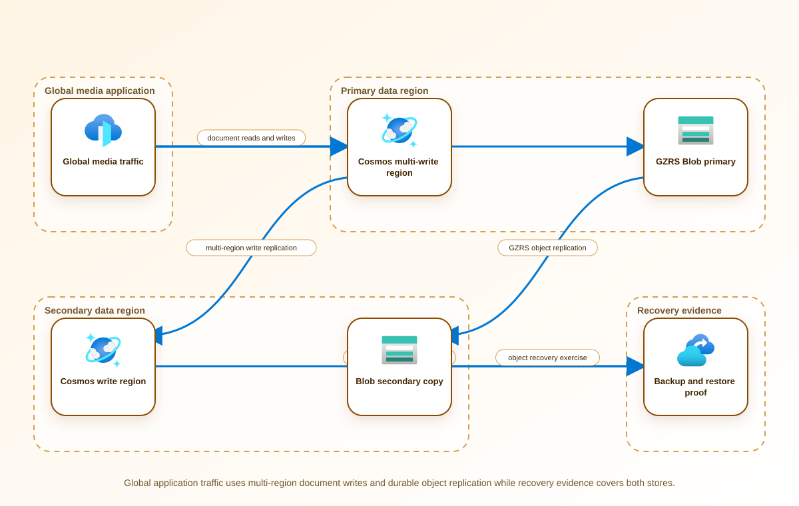

<!-- BEGIN GENERATED AZ305 V1 -->
# LAB-17 — Semi-Structured and Unstructured Data Resilience

## 1. Navigation

[← LAB-16](../16-relational-database-continuity/README.md) · [Lab catalog](../README.md) · [LAB-18 →](../18-compute-vm-batch-architecture/README.md)

## 2. Scenario and completion contract

Adventure Works Media stores personalization documents in Azure Cosmos DB and millions of production assets in Azure Blob Storage. The service has grown across continents, but the current design confuses durability with availability and has no consistent method to demonstrate RPO, restore integrity, or application behavior when a write region is unavailable. Legal policy requires assets for one market to remain within an approved geography, while editorial teams need rapid access to current metadata. Running duplicate high-scale accounts solely for a lab is unjustified. The team will use Azure PowerShell discovery and synthetic evidence to design a safe analogue for multi-region reads, controlled writes, backup recovery, and storage-account failover.

- Architect role: Nonrelational data resilience architect
- Outcome: Design and assess coordinated resilience for Cosmos DB documents and Blob assets, including region placement, consistency, backup, failover, and restore validation.
- Duration: 165 minutes
- Difficulty: advanced
- Cost class: low
- Completion: all five checkpoint assertions, final validation, decision revision, and cleanup review are complete.

## 3. Objective-to-evidence map

| Objective | Requirement | Checkpoint |
| --- | --- | --- |
| `BC-DR-04` | `LAB17-REQ-01` | [`LAB17-CP01`](#checkpoint-1) |
| `BC-HA-03` | `LAB17-REQ-02` | [`LAB17-CP02`](#checkpoint-2) |
| `BC-DR-04` | `LAB17-REQ-03` | [`LAB17-CP03`](#checkpoint-3) |
| `BC-HA-03` | `LAB17-REQ-04` | [`LAB17-CP04`](#checkpoint-4) |
| `BC-DR-04` | `LAB17-REQ-05` | [`LAB17-CP05`](#checkpoint-5) |

## 4. Business and quality requirements

Business outcome: Keep the media platform usable through regional disruption without violating content residency or silently losing accepted editorial changes.

- `LAB17-REQ-01` — Region order, write mode, zone redundancy, consistency, automatic failover, and residency are explicit for the document workload.
- `LAB17-REQ-02` — The selected consistency level, session-token handling, idempotency key, and conflict-resolution ownership preserve accepted edits.
- `LAB17-REQ-03` — Replication SKU, paired geography, read access, object replication boundaries, failover effects, and endpoint behavior are documented.
- `LAB17-REQ-04` — Cosmos DB backup mode and retention plus Blob versioning, soft delete, point-in-time restore, and integrity hashing meet recovery requirements.
- `LAB17-REQ-05` — The tabletop coordinates Cosmos DB write-region behavior, Blob write freeze and failover, endpoint changes, cache invalidation, validation, and rollback.

Scenario facts:

- **Data:** Editorial documents, conflict metadata, restricted rights files, and public media require different consistency and replication boundaries.
- **Scale:** Global consumers heavily read public media while editorial writes are smaller; measured RU and object volume remain owner inputs.
- **Latency:** Public media retrieval has a two-second target; editorial consistency and conflict handling use a separate latency contract.
- **Availability:** Public media needs multi-region delivery, while restricted documents remain available only within their approved country boundary.
- **RTO:** Regional editorial recovery is defined by tested failover; the rights agreement may accept longer restricted-document outage than unlawful replication.
- **RPO:** Accepted editorial changes require explicit consistency and conflict rules rather than an assumed zero-loss promise.
- **Budget:** Global replication is funded for public media and editorial metadata, not automatically for every rights-controlled object.

Constraints:

- Accepted editorial changes cannot be silently lost during a regional disruption.
- Rights-controlled documents cannot replicate outside one country, while public media must remain globally retrievable within two seconds.
- Use only the Azure PowerShell command lane for learner implementation.
- Keep all live changes behind explicit execution and acknowledgement switches.
- Retain only sanitized command evidence and synthetic fixture identifiers.

Assumptions:

- Editorial applications implement conflict resolution and expose committed-version evidence.
- Content classification reliably separates restricted documents from public media before storage.
- West Europe is the configurable primary example and North Europe is the configurable secondary example.
- The learner has administrator-level Azure operations knowledge but receives no pre-existing authenticated context.
- Offline fixtures demonstrate contract behavior rather than live Azure service behavior.

## 5. Architecture diagram and walkthrough



The flow begins with the business outcome, crosses five independently validated design capabilities, and ends with positive and negative evidence. The SVG is deterministically rendered from `diagrams/architecture.mmd`.

## 6. Concept primer and candidate architectures

Architecture decisions translate measurable requirements into a deliberate service and operating model. A candidate is viable only when every mandatory constraint is met; convenience or familiarity cannot compensate for a disqualifier.

- **Cosmos DB multi-region writes with zone redundancy plus GZRS Blob Storage** (eligible) — Multi-write Cosmos DB supports global editorial availability and explicit conflicts while GZRS protects and serves public objects.
- **Single write region with secondary reads plus RA-GRS Blob Storage and manual failover** (eligible) — A single writer simplifies consistency and cost, but manual promotion increases outage and accepted-write risk.
- **Independent regional data stacks synchronized by an application-owned event log** (eligible) — Independent stacks can enforce geography boundaries precisely but transfer ordering, replay, and conflict correctness to application code.
- **Replicate every document and media object to all regions** (ineligible) — Universal replication maximizes reach but ignores content-specific legal boundaries and egress cost. Disqualifier: LAB17-REQ-03 requires explicit object-replication boundaries and documented geography behavior.

## 7. Decision, ADR, and Well-Architected review

Criteria weights are C1 30, C2 25, C3 20, C4 15, and C5 10. Weighted totals use `sum(weight × score) / 5`.

| Candidate | Eligible | C1 | C2 | C3 | C4 | C5 | Weighted /100 |
| --- | ---: | ---: | ---: | ---: | ---: | ---: | ---: |
| Cosmos DB multi-region writes with zone redundancy plus GZRS Blob Storage | yes | 5 | 5 | 4 | 4 | 5 | 93 |
| Single write region with secondary reads plus RA-GRS Blob Storage and manual failover | yes | 4 | 3 | 4 | 3 | 4 | 72 |
| Independent regional data stacks synchronized by an application-owned event log | yes | 4 | 4 | 5 | 2 | 2 | 74 |
| Replicate every document and media object to all regions | no | 1 | 5 | 1 | 4 | 2 | 51 |

Selected design: **Cosmos DB multi-region writes with zone redundancy plus GZRS Blob Storage**. `ADR-LAB17-001` records the accepted reasoning. Review Reliability, Security, Cost Optimization, Operational Excellence, and Performance Efficiency in `design/decision.yml`; no pillar is implied by another.

Rejected alternatives:

- **Single write region with secondary reads plus RA-GRS Blob Storage and manual failover:** Its slower recovery and manual decision path are weaker for active global editorial operations.
- **Independent regional data stacks synchronized by an application-owned event log:** The custom synchronization burden is not justified before the new restricted-content boundary appears.
- **Replicate every document and media object to all regions:** It is disqualified because restricted-document replication would breach the mandatory rights agreement.

Architecture risks:

- **Risk:** Misclassification can send a restricted document into globally replicated public storage. **Mitigation:** Enforce classification at ingestion and assert account, container, and replication placement before publication.
- **Risk:** Multi-write conflict resolution can preserve a technically valid but editorially wrong version. **Mitigation:** Use deterministic domain rules, retain conflicting versions, and require an editor-owned reconciliation workflow.

Well-Architected consequences:

- **Reliability:** Multi-region document writes and global public media delivery reduce regional outage while exposing conflict behavior.
- **Security:** Classification and country-bound storage keep rights-controlled content out of global replication paths.
- **Cost Optimization:** Replication and throughput are allocated by content class instead of copying every object worldwide.
- **Operational Excellence:** Conflict, classification, failover, and publication evidence make regional recovery auditable.
- **Performance Efficiency:** Public objects use globally distributed retrieval while restricted content avoids unnecessary egress and replicas.

ADR consequences:

- Storage topology becomes content-class aware and publishing must verify the classification boundary.
- Editors own conflict outcomes; infrastructure health alone cannot declare recovery successful.

## 8. Inputs, permissions, licensing, cost, and analogue

Use configurable `Location` (`AZ305_LOCATION`, default West Europe) and `SecondaryLocation` (`AZ305_SECONDARY_LOCATION`, default North Europe). Every public input has an explicit `AZ305_*` fallback. Preview is the default; only Golden Lab 00 writes an intent-only `execute: false` preview record. Before an executed cloud command, the supplied subscription and tenant must exactly match the active CLI, Az, and—where applicable—Microsoft Graph contexts. `-Execute` crosses the execution boundary; cost-bearing and tenant-scoped paths also require their independent acknowledgement switches.

Safe analogue: Simulate classification, conflict resolution, regional unavailability, and public-media timing with synthetic documents and object manifests.

Permissions: Cosmos DB and Storage read access supports topology review; region, failover, consistency, container, or replication changes require separately approved data roles.

Licensing: Multi-region Cosmos DB throughput, multi-write regions, zone redundancy, storage replication, egress, and backups all affect recurring cost.

Cost boundary: Separate document request units and replicated writes from public-media capacity, retrieval, CDN transfer, and restricted-content storage.

## 9. Read-only preflight

```powershell
pwsh ./scripts/azure-powershell/Preflight.ps1 -RunId synthetic-170001
```

Synthetic sample: `{"labId":"LAB-17","track":"azure-powershell","result":"pass","note":"Local tool discovery only"}`. This is illustrative local output, not evidence captured from Azure.

## 10. Five guided checkpoints

### Checkpoint 1: Inventory nonrelational region placement

<a id="checkpoint-1"></a>

**Trace:** `BC-DR-04` → `LAB17-REQ-01` → `LAB17-CP01`

```powershell
Get-AzCosmosDBAccount -ResourceGroupName $ResourceGroupName -Name $CosmosAccountName | Select-Object Name, Location, EnableMultipleWriteLocations, EnableAutomaticFailover, ConsistencyPolicy
```

Expected evidence: Region order, write mode, zone redundancy, consistency, automatic failover, and residency are explicit for the document workload. Retain Export a sanitized account projection and map each region to latency, residency, and failure-domain requirements.

Positive assertion:

```powershell
$account = Get-AzCosmosDBAccount -ResourceGroupName $ResourceGroupName -Name $CosmosAccountName; if ($account.Locations.Count -lt 2) { throw 'The account has fewer than two configured regions.' }
```

Negative assertion:

```powershell
$account = Get-AzCosmosDBAccount -ResourceGroupName $ResourceGroupName -Name $CosmosAccountName; if ($account.Locations | Where-Object { $_.LocationName -notin $ApprovedCosmosRegions }) { throw 'A Cosmos DB region is outside the approved geography.' }
```

Failure and retry: Region count alone can conceal an unsafe write topology or an unapproved data boundary. Correct the proposed region and consistency design, then rerun discovery and policy comparisons.

Cleanup dependency: Remove the local account projection; do not add, remove, or reprioritize regions.

WAF consequence: Reliability: deliberate region ordering and write behavior reduce ambiguous failover outcomes.

### Checkpoint 2: Validate document consistency and conflict behavior

<a id="checkpoint-2"></a>

**Trace:** `BC-HA-03` → `LAB17-REQ-02` → `LAB17-CP02`

```powershell
Get-AzCosmosDBSqlDatabase -ResourceGroupName $ResourceGroupName -AccountName $CosmosAccountName | Select-Object Name, Resource, AutoscaleSettings
```

Expected evidence: The selected consistency level, session-token handling, idempotency key, and conflict-resolution ownership preserve accepted edits. Retain Save synthetic concurrent-write cases, expected winners, session-read results, and conflict-handling records.

Positive assertion:

```powershell
$account = Get-AzCosmosDBAccount -ResourceGroupName $ResourceGroupName -Name $CosmosAccountName; if ($account.ConsistencyPolicy.DefaultConsistencyLevel -notin @('Session','BoundedStaleness')) { throw 'Consistency does not match the approved editorial model.' }
```

Negative assertion:

```powershell
$account = Get-AzCosmosDBAccount -ResourceGroupName $ResourceGroupName -Name $CosmosAccountName; if ($account.EnableMultipleWriteLocations -and -not $ConflictResolutionProcedureApproved) { throw 'Multi-write is enabled without an approved conflict-resolution procedure.' }
```

Failure and retry: A healthy account can still return stale content or resolve concurrent edits contrary to business intent. Correct the conflict rule or application token handling and rerun the failed synthetic case.

Cleanup dependency: Delete only synthetic documents bearing the exact lab run identifier.

WAF consequence: Performance Efficiency: consistency is chosen from business semantics instead of paying unnecessary latency for stronger guarantees.

### Checkpoint 3: Assess Blob durability and failover readiness

<a id="checkpoint-3"></a>

**Trace:** `BC-DR-04` → `LAB17-REQ-03` → `LAB17-CP03`

```powershell
Get-AzStorageAccount -ResourceGroupName $ResourceGroupName -Name $StorageAccountName | Select-Object StorageAccountName, Location, Sku, PrimaryLocation, SecondaryLocation, StatusOfPrimary, StatusOfSecondary
```

Expected evidence: Replication SKU, paired geography, read access, object replication boundaries, failover effects, and endpoint behavior are documented. Retain Preserve the storage projection, replication comparison, and worst-case unreplicated-write calculation.

Positive assertion:

```powershell
$storage = Get-AzStorageAccount -ResourceGroupName $ResourceGroupName -Name $StorageAccountName; if ($storage.Sku.Name -notmatch 'GZRS|RAGZRS|GRS|RAGRS') { throw 'The storage account lacks approved geo-redundancy.' }
```

Negative assertion:

```powershell
$storage = Get-AzStorageAccount -ResourceGroupName $ResourceGroupName -Name $StorageAccountName; if (-not $storage.SecondaryLocation -or $storage.SecondaryLocation -notin $ApprovedBlobRegions) { throw 'The secondary location is absent or outside the approved geography.' }
```

Failure and retry: Account failover can convert an availability incident into permanent loss of not-yet-replicated writes. Reassess the write-freeze and business authorization gates with the latest sync evidence.

Cleanup dependency: Remove local evidence only; do not initiate account failover or change the redundancy SKU.

WAF consequence: Cost Optimization: GZRS protects zonal and regional failure without duplicating the entire media application.

### Checkpoint 4: Prove backup and restore integrity

<a id="checkpoint-4"></a>

**Trace:** `BC-HA-03` → `LAB17-REQ-04` → `LAB17-CP04`

```powershell
Get-AzStorageBlobServiceProperty -ResourceGroupName $ResourceGroupName -StorageAccountName $StorageAccountName | Select-Object DeleteRetentionPolicy, ContainerDeleteRetentionPolicy, IsVersioningEnabled, RestorePolicy
```

Expected evidence: Cosmos DB backup mode and retention plus Blob versioning, soft delete, point-in-time restore, and integrity hashing meet recovery requirements. Retain Store synthetic manifest counts, hashes, restore timestamps, and per-assertion pass or fail results.

Positive assertion:

```powershell
$properties = Get-AzStorageBlobServiceProperty -ResourceGroupName $ResourceGroupName -StorageAccountName $StorageAccountName; if (-not $properties.IsVersioningEnabled -or -not $properties.DeleteRetentionPolicy.Enabled) { throw 'Blob versioning or soft delete is not enabled.' }
```

Negative assertion:

```powershell
$properties = Get-AzStorageBlobServiceProperty -ResourceGroupName $ResourceGroupName -StorageAccountName $StorageAccountName; if ($properties.DeleteRetentionPolicy.Days -lt $RequiredRetentionDays) { throw 'Blob soft-delete retention is below the requirement.' }
```

Failure and retry: Retained data can be unusable when metadata and binary assets represent different recovery points. Choose a mutually consistent recovery timestamp and repeat document, manifest, and hash validation.

Cleanup dependency: Remove run-owned restored copies after ownership verification; never purge retained versions.

WAF consequence: Security: versioning, soft delete, and controlled restore reduce destructive-change risk.

### Checkpoint 5: Rehearse coordinated regional recovery

<a id="checkpoint-5"></a>

**Trace:** `BC-DR-04` → `LAB17-REQ-05` → `LAB17-CP05`

```powershell
Get-AzCosmosDBAccount -ResourceGroupName $ResourceGroupName -Name $CosmosAccountName | Select-Object -ExpandProperty Locations | Sort-Object FailoverPriority
```

Expected evidence: The tabletop coordinates Cosmos DB write-region behavior, Blob write freeze and failover, endpoint changes, cache invalidation, validation, and rollback. Retain Archive the recovery timeline, cross-store consistency assertions, business acceptance, and residual data-loss statement.

Positive assertion:

```powershell
$locations = (Get-AzCosmosDBAccount -ResourceGroupName $ResourceGroupName -Name $CosmosAccountName).Locations; if (($locations | Sort-Object FailoverPriority | Select-Object -First 1).ProvisioningState -ne 'Succeeded') { throw 'The preferred Cosmos DB region is not ready.' }
```

Negative assertion:

```powershell
$storage = Get-AzStorageAccount -ResourceGroupName $ResourceGroupName -Name $StorageAccountName; if ($storage.StatusOfSecondary -and $storage.StatusOfSecondary -ne 'Available') { throw 'The Blob secondary is not available for the recovery scenario.' }
```

Failure and retry: Uncoordinated recovery can expose mixed generations of documents and media files. Return to the last consistent synthetic manifest and replay only after both data services meet entry criteria.

Cleanup dependency: Delete local simulation records and run-owned synthetic data; perform no live regional failover.

WAF consequence: Operational Excellence: coordinated gates keep two independently resilient data services consistent at the application boundary.

## 11. Final validation and interpretation

Run `Validate.ps1 -Mode Deployment -Execute` only after an executed run has state and you are authorized to issue the ten read-only checkpoint inspections. Without `-Execute`, ordinary deployment validation records `partial` and exits `2`; Golden Lab 00 alone can validate its intent-only preview locally. Exit `0` means all required assertions pass, `1` means at least one failed, and `2` means the outcome is gated or partial. Positive and negative commands execute independently, so one failure never suppresses its paired assertion.

## 12. Material change request

A new rights agreement forbids document replication outside one country, but global consumers must still retrieve public media within two seconds.

Revised solution: select **Independent regional data stacks synchronized by an application-owned event log**. LAB17-REQ-03 makes object replication boundaries explicit, so restricted documents move to an independent in-country stack while public media remains globally distributed.

Revised Well-Architected consequences:

- **Reliability:** Public media stays multi-region while restricted content accepts the documented in-country failure domain.
- **Security:** Rights-controlled bytes never enter the cross-region event or blob replication path.
- **Cost Optimization:** Only globally consumable media carries worldwide replication and egress cost.
- **Operational Excellence:** Classification and event-contract tests become mandatory publication gates.
- **Performance Efficiency:** Edge-served public media meets the two-second target without exporting restricted documents.

## 13. Architect job challenge

Separate regulated editorial metadata from public delivery assets, revise region and caching choices, and explain why the selected design still meets availability without replicating protected documents globally.

## 14. Troubleshooting, cleanup, and residual verification

- If account properties use a different region-name format, normalize names before comparing them with the approved geography list.
- If metric or backup evidence is unavailable, record the permission gap as a failed assertion rather than assuming a healthy state.
- If cross-store hashes disagree, preserve both manifests and locate the last mutually consistent timestamp before retrying.

Cleanup previews nonempty state in reverse dependency order, writes `partial`, and exits `2`; an already empty run is completed locally and idempotently. Executed cleanup rechecks the exact live ID plus `purpose`, `labId`, `runId`, and `expiresOn` immediately before each removal, persists state after every absent or removed object, stops on the first dependency failure, and refuses unresolved pre-existing settings. It never automates purge. Finish with `Validate.ps1 -Mode PostCleanup`; the required residual count is zero.

## 15. Exam debrief, assessment, sources, and navigation

Explain the recommendation in terms of requirements, rejected alternatives, failure behavior, and all five WAF pillars. Complete `assessment/QUESTIONS.md`, then use the separately excluded answer key for remediation.

- [Reliability in Azure Cosmos DB for NoSQL](https://learn.microsoft.com/en-us/azure/reliability/reliability-cosmos-db)
- [Azure Well-Architected Framework](https://learn.microsoft.com/en-us/azure/well-architected/)

[← LAB-16](../16-relational-database-continuity/README.md) · [Lab catalog](../README.md) · [LAB-18 →](../18-compute-vm-batch-architecture/README.md)

## 16. Synchronized lifecycle-script appendix

### Preflight.ps1

```powershell
[CmdletBinding()]
param(
    [string]$SubscriptionId = $env:AZ305_SUBSCRIPTION_ID,
    [string]$TenantId = $env:AZ305_TENANT_ID,
    [ValidatePattern('^[a-z0-9-]{6,64}$')][string]$RunId = $env:AZ305_RUN_ID,
    [string]$Location = $(if ($env:AZ305_LOCATION) { $env:AZ305_LOCATION } else { 'westeurope' }),
    [string]$SecondaryLocation = $(if ($env:AZ305_SECONDARY_LOCATION) { $env:AZ305_SECONDARY_LOCATION } else { 'northeurope' }),
    [string]$ResourceGroup = $(if ($env:AZ305_RESOURCE_GROUP) { $env:AZ305_RESOURCE_GROUP } else { "rg-az305-$RunId" }),
    [string]$WorkloadName = $(if ($env:AZ305_WORKLOAD_NAME) { $env:AZ305_WORKLOAD_NAME } else { "az305-$RunId" }),
    [string]$ExpiresOn = $(if ($env:AZ305_EXPIRES_ON) { $env:AZ305_EXPIRES_ON } else { (Get-Date).ToUniversalTime().AddDays(1).ToString('yyyy-MM-dd') }),
    [string]$ApprovedBlobRegions = $env:AZ305_APPROVED_BLOB_REGIONS,
    [string]$ApprovedCosmosRegions = $env:AZ305_APPROVED_COSMOS_REGIONS,
    [bool]$ConflictResolutionProcedureApproved = $(if ($env:AZ305_CONFLICT_RESOLUTION_PROCEDURE_APPROVED) { [System.Convert]::ToBoolean($env:AZ305_CONFLICT_RESOLUTION_PROCEDURE_APPROVED) } else { $false }),
    [string]$CosmosAccountName = $env:AZ305_COSMOS_ACCOUNT_NAME,
    [int]$RequiredRetentionDays = $(if ($env:AZ305_REQUIRED_RETENTION_DAYS) { [int]$env:AZ305_REQUIRED_RETENTION_DAYS } else { 0 }),
    [string]$ResourceGroupName = $env:AZ305_RESOURCE_GROUP_NAME,
    [string]$StorageAccountName = $env:AZ305_STORAGE_ACCOUNT_NAME,
    [switch]$Execute,
    [switch]$AcknowledgeCost,
    [switch]$AcknowledgeTenantChange
)

$ErrorActionPreference = 'Stop'
$PSNativeCommandUseErrorActionPreference = $true
if (-not $RunId) { [Console]::Error.WriteLine('RunId or AZ305_RUN_ID is required.'); exit 2 }
# Every lifecycle entrypoint intentionally exposes the same public parameter contract.
@($SubscriptionId, $TenantId, $RunId, $Location, $SecondaryLocation, $ResourceGroup, $WorkloadName, $ExpiresOn, $ApprovedBlobRegions, $ApprovedCosmosRegions, $ConflictResolutionProcedureApproved, $CosmosAccountName, $RequiredRetentionDays, $ResourceGroupName, $StorageAccountName, $Execute, $AcknowledgeCost, $AcknowledgeTenantChange) | Out-Null

$requiredCommands = @('pwsh')
$missing = @($requiredCommands | Where-Object { -not (Get-Command $_ -ErrorAction SilentlyContinue) })
if ($missing.Count -gt 0) {
    Write-Error "Missing local commands: $($missing -join ', ')"
    exit 1
}
$requiredCmdlets = @('Get-AzCosmosDBAccount', 'Get-AzCosmosDBSqlDatabase', 'Get-AzStorageAccount', 'Get-AzStorageBlobServiceProperty')
$missingCmdlets = @($requiredCmdlets | Where-Object { -not (Get-Command $_ -ErrorAction SilentlyContinue) })
if ($missingCmdlets.Count -gt 0) {
    Write-Error "Missing local cmdlets: $($missingCmdlets -join ', ')"
    exit 1
}

[pscustomobject]@{
    labId = 'LAB-17'
    track = 'azure-powershell'
    implementationMode = 'safe-analogue'
    result = 'pass'
    note = 'Local tool discovery only; no Azure or Microsoft Graph request was made.'
} | ConvertTo-Json
exit 0
```

### Setup.ps1

```powershell
[CmdletBinding()]
param(
    [string]$SubscriptionId = $env:AZ305_SUBSCRIPTION_ID,
    [string]$TenantId = $env:AZ305_TENANT_ID,
    [ValidatePattern('^[a-z0-9-]{6,64}$')][string]$RunId = $env:AZ305_RUN_ID,
    [string]$Location = $(if ($env:AZ305_LOCATION) { $env:AZ305_LOCATION } else { 'westeurope' }),
    [string]$SecondaryLocation = $(if ($env:AZ305_SECONDARY_LOCATION) { $env:AZ305_SECONDARY_LOCATION } else { 'northeurope' }),
    [string]$ResourceGroup = $(if ($env:AZ305_RESOURCE_GROUP) { $env:AZ305_RESOURCE_GROUP } else { "rg-az305-$RunId" }),
    [string]$WorkloadName = $(if ($env:AZ305_WORKLOAD_NAME) { $env:AZ305_WORKLOAD_NAME } else { "az305-$RunId" }),
    [string]$ExpiresOn = $(if ($env:AZ305_EXPIRES_ON) { $env:AZ305_EXPIRES_ON } else { (Get-Date).ToUniversalTime().AddDays(1).ToString('yyyy-MM-dd') }),
    [string]$ApprovedBlobRegions = $env:AZ305_APPROVED_BLOB_REGIONS,
    [string]$ApprovedCosmosRegions = $env:AZ305_APPROVED_COSMOS_REGIONS,
    [bool]$ConflictResolutionProcedureApproved = $(if ($env:AZ305_CONFLICT_RESOLUTION_PROCEDURE_APPROVED) { [System.Convert]::ToBoolean($env:AZ305_CONFLICT_RESOLUTION_PROCEDURE_APPROVED) } else { $false }),
    [string]$CosmosAccountName = $env:AZ305_COSMOS_ACCOUNT_NAME,
    [int]$RequiredRetentionDays = $(if ($env:AZ305_REQUIRED_RETENTION_DAYS) { [int]$env:AZ305_REQUIRED_RETENTION_DAYS } else { 0 }),
    [string]$ResourceGroupName = $env:AZ305_RESOURCE_GROUP_NAME,
    [string]$StorageAccountName = $env:AZ305_STORAGE_ACCOUNT_NAME,
    [switch]$Execute,
    [switch]$AcknowledgeCost,
    [switch]$AcknowledgeTenantChange
)

$ErrorActionPreference = 'Stop'
$PSNativeCommandUseErrorActionPreference = $true
if (-not $RunId) { [Console]::Error.WriteLine('RunId or AZ305_RUN_ID is required.'); exit 2 }
# Every lifecycle entrypoint intentionally exposes the same public parameter contract.
@($SubscriptionId, $TenantId, $RunId, $Location, $SecondaryLocation, $ResourceGroup, $WorkloadName, $ExpiresOn, $ApprovedBlobRegions, $ApprovedCosmosRegions, $ConflictResolutionProcedureApproved, $CosmosAccountName, $RequiredRetentionDays, $ResourceGroupName, $StorageAccountName, $Execute, $AcknowledgeCost, $AcknowledgeTenantChange) | Out-Null

$LabRoot = Split-Path (Split-Path $PSScriptRoot -Parent) -Parent
$StateRoot = Join-Path $LabRoot ".state/$RunId"
$StatePath = Join-Path $StateRoot 'run.json'

function Assert-ExactExecutionContext {
    [CmdletBinding()]
    param([string]$ExpectedSubscriptionId, [string]$ExpectedTenantId)
    if ([string]::IsNullOrWhiteSpace($ExpectedSubscriptionId) -or [string]::IsNullOrWhiteSpace($ExpectedTenantId)) { throw 'SubscriptionId and TenantId are required before an Azure request.' }
    $azContext = Get-AzContext -ErrorAction Stop
    if (-not $azContext -or [string]$azContext.Subscription.Id -ine $ExpectedSubscriptionId -or [string]$azContext.Tenant.Id -ine $ExpectedTenantId) {
        throw 'The active Azure PowerShell subscription or tenant does not exactly match the requested context.'
    }
}

function Save-RunState {
    [CmdletBinding()]
    param([Parameter(Mandatory)]$State)
    $temporaryPath = "$StatePath.tmp"
    $State | ConvertTo-Json -Depth 20 | Set-Content -LiteralPath $temporaryPath -Encoding utf8NoBOM
    Move-Item -LiteralPath $temporaryPath -Destination $StatePath -Force
}

function Assert-SafeStateValue {
    [CmdletBinding()]
    param($Value)
    $serialized = $Value | ConvertTo-Json -Depth 12 -Compress
    if ($serialized -match '(?i)"(?:token|password|secret|certificate|connectionString|sas|clientSecret|accessToken|refreshToken|accountKey|privateKey)"\s*:') {
        throw 'A prohibited sensitive field name was returned; state capture is refused.'
    }
}

function Convert-CheckpointOutput {
    [CmdletBinding()]
    param($Value)
    if ($Value -is [string]) { $raw = [string]$Value }
    elseif ($Value -is [System.Collections.IEnumerable] -and @($Value | Where-Object { $_ -isnot [string] }).Count -eq 0) { $raw = @($Value) -join "`n" }
    else { return $Value }
    if ([string]::IsNullOrWhiteSpace($raw)) { return $null }
    try { return ($raw | ConvertFrom-Json -Depth 100) } catch { return $Value }
}

function Get-ReturnedResourceId {
    [CmdletBinding()]
    param($Value)
    $seen = [System.Collections.Generic.HashSet[string]]::new([System.StringComparer]::OrdinalIgnoreCase)
    $results = [System.Collections.Generic.List[string]]::new()
    function Add-ArmId {
        param($Candidate)
        if ($Candidate -is [string] -and $Candidate -match '^/subscriptions/[0-9a-f-]+/(?:resourceGroups/[^/]+(?:/providers/.+)?|providers/.+)$' -and $Candidate -notmatch '/providers/Microsoft\.Resources/deployments/') {
            if ($seen.Add($Candidate)) { $results.Add($Candidate) }
        }
    }
    function Find-DeploymentOutputId {
        param($Item, [int]$Depth)
        if ($null -eq $Item -or $Depth -gt 12) { return }
        if ($Item -is [string]) { Add-ArmId -Candidate $Item; return }
        if ($Item -is [System.Collections.IDictionary]) { foreach ($key in $Item.Keys) { Find-DeploymentOutputId -Item $Item[$key] -Depth ($Depth + 1) }; return }
        if ($Item -is [System.Collections.IEnumerable]) { foreach ($entry in $Item) { Find-DeploymentOutputId -Item $entry -Depth ($Depth + 1) }; return }
        foreach ($property in @($Item.PSObject.Properties | Where-Object { $_.MemberType -in @('NoteProperty', 'Property') })) { Find-DeploymentOutputId -Item $property.Value -Depth ($Depth + 1) }
    }
    foreach ($rootItem in @($Value)) {
        if ($rootItem -is [System.Collections.IDictionary]) {
            foreach ($name in @('id', 'resourceId')) { if ($rootItem.Contains($name)) { Add-ArmId -Candidate $rootItem[$name] } }
            if ($rootItem.Contains('properties') -and $rootItem.properties -and $rootItem.properties.outputs) { Find-DeploymentOutputId -Item $rootItem.properties.outputs -Depth 0 }
            continue
        }
        foreach ($name in @('Id', 'ResourceId')) {
            $property = $rootItem.PSObject.Properties[$name]
            if ($property) { Add-ArmId -Candidate $property.Value }
        }
        if ($rootItem.PSObject.Properties['Properties'] -and $rootItem.Properties -and $rootItem.Properties.outputs) {
            Find-DeploymentOutputId -Item $rootItem.Properties.outputs -Depth 0
        }
    }
    return @($results)
}

function Get-PlannedDeploymentResourceId {
    [CmdletBinding()]
    param($Value)
    $seen = [System.Collections.Generic.HashSet[string]]::new([System.StringComparer]::OrdinalIgnoreCase)
    $results = [System.Collections.Generic.List[string]]::new()
    foreach ($change in @($Value.changes)) {
        $candidate = [string]$change.resourceId
        if ($candidate -match '^/subscriptions/[0-9a-f-]+/(?:resourceGroups/[^/]+(?:/providers/.+)?|providers/.+)$' -and $candidate -notmatch '/providers/Microsoft\.Resources/deployments/' -and $seen.Add($candidate)) {
            $results.Add($candidate)
        }
    }
    return @($results)
}

function Assert-InputSubscriptionScope {
    [CmdletBinding()]
    param($Inputs, [string]$ExpectedSubscriptionId)
    $entries = if ($Inputs -is [System.Collections.IDictionary]) {
        @($Inputs.GetEnumerator())
    } else {
        @($Inputs.PSObject.Properties | ForEach-Object { [pscustomobject]@{ Key = $_.Name; Value = $_.Value } })
    }
    foreach ($entry in $entries) {
        if ($entry.Value -is [string] -and [string]$entry.Value -match '^/subscriptions/([^/]+)/') {
            if ($Matches[1] -ine $ExpectedSubscriptionId) { throw "Input $($entry.Key) belongs to a different subscription." }
        }
    }
}

function Assert-ManagedMutation {
    [CmdletBinding()]
    param($State, [string]$CheckpointId, [bool]$CarriesOwnership, [object[]]$TargetResourceIds)
    if ($CarriesOwnership) { return }
    $targets = @($TargetResourceIds | Where-Object { $_ -is [string] -and $_ -match '^/subscriptions/' })
    if ($targets.Count -eq 0) { throw "$CheckpointId refuses an untagged mutation because no exact ARM target ID was supplied." }
    $knownIds = @($State.managedObjects | ForEach-Object { [string]$_.id })
    if ($knownIds.Count -eq 0) { throw "$CheckpointId refuses to modify a pre-existing object because no run-owned parent has been recorded." }
    foreach ($target in $targets) {
        $related = @($knownIds | Where-Object { $target -ieq $_ -or $target.StartsWith("$_/", [System.StringComparison]::OrdinalIgnoreCase) -or $_.StartsWith("$target/", [System.StringComparison]::OrdinalIgnoreCase) }).Count -gt 0
        if (-not $related) { throw "$CheckpointId refuses a mutation outside the exact run-owned resource boundary." }
    }
}

$executionInputs = [ordered]@{ subscriptionId = $SubscriptionId; tenantId = $TenantId; location = $Location; secondaryLocation = $SecondaryLocation; resourceGroup = $ResourceGroup; workloadName = $WorkloadName; expiresOn = $ExpiresOn; ApprovedBlobRegions = $ApprovedBlobRegions; ApprovedCosmosRegions = $ApprovedCosmosRegions; ConflictResolutionProcedureApproved = $ConflictResolutionProcedureApproved; CosmosAccountName = $CosmosAccountName; RequiredRetentionDays = $RequiredRetentionDays; ResourceGroupName = $ResourceGroupName; StorageAccountName = $StorageAccountName }

if (-not $Execute) {
    Write-Output '[preview] No cloud command was called and no state was created.'
    Write-Output '[preview] Re-run with -Execute only in an authorized disposable environment.'
    exit 0
}
# This setup is compatible with the lab implementation mode.
# This default exercise does not require a cost acknowledgement.
# This lab does not perform a tenant-scoped change by default.
$requiredLabInputs = [ordered]@{ CosmosAccountName = $CosmosAccountName; ResourceGroupName = $ResourceGroupName; StorageAccountName = $StorageAccountName }
$missingLabInputs = @($requiredLabInputs.GetEnumerator() | Where-Object { $_.Value -is [string] -and [string]::IsNullOrWhiteSpace([string]$_.Value) } | ForEach-Object Key)
if ($missingLabInputs.Count -gt 0) { [Console]::Error.WriteLine("Execution is gated; supply: $($missingLabInputs -join ', ')."); exit 2 }

try {
    Assert-ExactExecutionContext -ExpectedSubscriptionId $SubscriptionId -ExpectedTenantId $TenantId
    Assert-InputSubscriptionScope -Inputs $executionInputs -ExpectedSubscriptionId $SubscriptionId
    Assert-SafeStateValue -Value $executionInputs
}
catch {
    [Console]::Error.WriteLine("Execution is gated by context or input validation: $($_.Exception.Message)")
    exit 2
}

# Recovery state is persisted before the first possible mutation below.
if (Test-Path -LiteralPath $StatePath) {
    [Console]::Error.WriteLine('Run state already exists. Choose a new RunId or complete the recorded cleanup; existing recovery state will not be overwritten.')
    exit 2
}
New-Item -ItemType Directory -Path $StateRoot -Force | Out-Null
$state = [ordered]@{
    schemaVersion = '1.0.0'; labId = 'LAB-17'; runId = $RunId; track = 'azure-powershell'
    implementationMode = 'safe-analogue'; status = 'initialized'
    createdAt = (Get-Date).ToUniversalTime().ToString('o'); execute = $true
    parameters = $executionInputs
    managedObjects = @(); originalSettings = @()
}
Save-RunState -State $state
$state.status = 'deploying'
Save-RunState -State $state

$originalLocation = Get-Location
try {
    Set-Location -LiteralPath $LabRoot
    # 17-CP01: Inventory nonrelational region placement
    $stepResult = & { Get-AzCosmosDBAccount -ResourceGroupName $ResourceGroupName -Name $CosmosAccountName | Select-Object Name, Location, EnableMultipleWriteLocations, EnableAutomaticFailover, ConsistencyPolicy }
    $null = $stepResult

    # 17-CP02: Validate document consistency and conflict behavior
    $stepResult = & { Get-AzCosmosDBSqlDatabase -ResourceGroupName $ResourceGroupName -AccountName $CosmosAccountName | Select-Object Name, Resource, AutoscaleSettings }
    $null = $stepResult

    # 17-CP03: Assess Blob durability and failover readiness
    $stepResult = & { Get-AzStorageAccount -ResourceGroupName $ResourceGroupName -Name $StorageAccountName | Select-Object StorageAccountName, Location, Sku, PrimaryLocation, SecondaryLocation, StatusOfPrimary, StatusOfSecondary }
    $null = $stepResult

    # 17-CP04: Prove backup and restore integrity
    $stepResult = & { Get-AzStorageBlobServiceProperty -ResourceGroupName $ResourceGroupName -StorageAccountName $StorageAccountName | Select-Object DeleteRetentionPolicy, ContainerDeleteRetentionPolicy, IsVersioningEnabled, RestorePolicy }
    $null = $stepResult

    # 17-CP05: Rehearse coordinated regional recovery
    $stepResult = & { Get-AzCosmosDBAccount -ResourceGroupName $ResourceGroupName -Name $CosmosAccountName | Select-Object -ExpandProperty Locations | Sort-Object FailoverPriority }
    $null = $stepResult

    $state.status = 'deployed'
    Save-RunState -State $state
} catch {
    $state.status = 'failed'
    Save-RunState -State $state
    Write-Error $_
    exit 1
} finally {
    Set-Location -LiteralPath $originalLocation
}
exit 0
```

### Validate.ps1

```powershell
[CmdletBinding()]
param(
    [string]$SubscriptionId = $env:AZ305_SUBSCRIPTION_ID,
    [string]$TenantId = $env:AZ305_TENANT_ID,
    [ValidatePattern('^[a-z0-9-]{6,64}$')][string]$RunId = $env:AZ305_RUN_ID,
    [string]$Location = $(if ($env:AZ305_LOCATION) { $env:AZ305_LOCATION } else { 'westeurope' }),
    [string]$SecondaryLocation = $(if ($env:AZ305_SECONDARY_LOCATION) { $env:AZ305_SECONDARY_LOCATION } else { 'northeurope' }),
    [string]$ResourceGroup = $(if ($env:AZ305_RESOURCE_GROUP) { $env:AZ305_RESOURCE_GROUP } else { "rg-az305-$RunId" }),
    [string]$WorkloadName = $(if ($env:AZ305_WORKLOAD_NAME) { $env:AZ305_WORKLOAD_NAME } else { "az305-$RunId" }),
    [string]$ExpiresOn = $(if ($env:AZ305_EXPIRES_ON) { $env:AZ305_EXPIRES_ON } else { (Get-Date).ToUniversalTime().AddDays(1).ToString('yyyy-MM-dd') }),
    [string]$ApprovedBlobRegions = $env:AZ305_APPROVED_BLOB_REGIONS,
    [string]$ApprovedCosmosRegions = $env:AZ305_APPROVED_COSMOS_REGIONS,
    [bool]$ConflictResolutionProcedureApproved = $(if ($env:AZ305_CONFLICT_RESOLUTION_PROCEDURE_APPROVED) { [System.Convert]::ToBoolean($env:AZ305_CONFLICT_RESOLUTION_PROCEDURE_APPROVED) } else { $false }),
    [string]$CosmosAccountName = $env:AZ305_COSMOS_ACCOUNT_NAME,
    [int]$RequiredRetentionDays = $(if ($env:AZ305_REQUIRED_RETENTION_DAYS) { [int]$env:AZ305_REQUIRED_RETENTION_DAYS } else { 0 }),
    [string]$ResourceGroupName = $env:AZ305_RESOURCE_GROUP_NAME,
    [string]$StorageAccountName = $env:AZ305_STORAGE_ACCOUNT_NAME,
    [ValidateSet('Deployment', 'PostCleanup')][string]$Mode = 'Deployment',
    [switch]$Execute,
    [switch]$AcknowledgeCost,
    [switch]$AcknowledgeTenantChange
)

$ErrorActionPreference = 'Stop'
$PSNativeCommandUseErrorActionPreference = $true
if (-not $RunId) { [Console]::Error.WriteLine('RunId or AZ305_RUN_ID is required.'); exit 2 }
# Every lifecycle entrypoint intentionally exposes the same public parameter contract.
@($SubscriptionId, $TenantId, $RunId, $Location, $SecondaryLocation, $ResourceGroup, $WorkloadName, $ExpiresOn, $ApprovedBlobRegions, $ApprovedCosmosRegions, $ConflictResolutionProcedureApproved, $CosmosAccountName, $RequiredRetentionDays, $ResourceGroupName, $StorageAccountName, $Mode, $Execute, $AcknowledgeCost, $AcknowledgeTenantChange) | Out-Null

$LabRoot = Split-Path (Split-Path $PSScriptRoot -Parent) -Parent
$StateRoot = Join-Path $LabRoot ".state/$RunId"
$RunPath = Join-Path $StateRoot 'run.json'
$ValidationPath = Join-Path $StateRoot 'validation.json'

function Assert-ExactExecutionContext {
    [CmdletBinding()]
    param([string]$ExpectedSubscriptionId, [string]$ExpectedTenantId)
    if ([string]::IsNullOrWhiteSpace($ExpectedSubscriptionId) -or [string]::IsNullOrWhiteSpace($ExpectedTenantId)) { throw 'SubscriptionId and TenantId are required before an Azure request.' }
    $azContext = Get-AzContext -ErrorAction Stop
    if (-not $azContext -or [string]$azContext.Subscription.Id -ine $ExpectedSubscriptionId -or [string]$azContext.Tenant.Id -ine $ExpectedTenantId) {
        throw 'The active Azure PowerShell subscription or tenant does not exactly match the requested context.'
    }
}


if (-not (Test-Path -LiteralPath $RunPath)) {
    Write-Warning 'No run state exists; validation is gated.'
    exit 2
}
$state = Get-Content -LiteralPath $RunPath -Raw | ConvertFrom-Json
$assertions = [System.Collections.Generic.List[object]]::new()
function Add-ValidationAssertion {
    [CmdletBinding()]
    param([string]$Id, [ValidateSet('positive', 'negative')][string]$Kind, [bool]$Passed, [string]$Message)
    $assertions.Add([pscustomobject]@{ id = $Id; kind = $Kind; passed = $Passed; message = $Message })
}

function Save-ValidationArtifact {
    [CmdletBinding()]
    param([ValidateSet('pass', 'partial', 'fail')][string]$Result)
    $artifact = [ordered]@{ schemaVersion = '1.0.0'; labId = 'LAB-17'; runId = $RunId; mode = $Mode; result = $Result; validatedAt = (Get-Date).ToUniversalTime().ToString('o'); assertions = @($assertions) }
    $artifact | ConvertTo-Json -Depth 12 | Set-Content -LiteralPath $ValidationPath -Encoding utf8NoBOM
}

function Test-PositiveEvidence {
    [CmdletBinding()]
    param($Value)
    if ($Value -is [bool]) { return $Value }
    if ($null -eq $Value) { return $false }
    if ($Value -is [string]) { return -not [string]::IsNullOrWhiteSpace($Value) }
    if ($Value -is [System.Collections.IEnumerable]) { return @($Value).Count -gt 0 }
    return $true
}

function Test-NegativeEvidence {
    [CmdletBinding()]
    param($Value)
    if ($Value -is [bool]) { return $Value }
    if ($null -eq $Value) { return $true }
    if ($Value -is [string]) { return [string]::IsNullOrWhiteSpace($Value) }
    if ($Value -is [System.Collections.IEnumerable]) { return @($Value).Count -eq 0 }
    $properties = @($Value.PSObject.Properties | Where-Object { $_.MemberType -in @('NoteProperty', 'Property') })
    if ($properties.Count -eq 0) { return $false }
    return @($properties | Where-Object { -not (Test-NegativeEvidence -Value $_.Value) }).Count -eq 0
}

function Test-ProhibitedStateField {
    [CmdletBinding()]
    param($Value)
    $serialized = $Value | ConvertTo-Json -Depth 20
    return $serialized -match '(?i)"(?:token|password|secret|certificate|connectionString|sas|clientSecret|accessToken|refreshToken|accountKey|privateKey)"\s*:'
}

function Assert-InputSubscriptionScope {
    [CmdletBinding()]
    param($Inputs, [string]$ExpectedSubscriptionId)
    $entries = if ($Inputs -is [System.Collections.IDictionary]) {
        @($Inputs.GetEnumerator())
    } else {
        @($Inputs.PSObject.Properties | ForEach-Object { [pscustomobject]@{ Key = $_.Name; Value = $_.Value } })
    }
    foreach ($entry in $entries) {
        if ($entry.Value -is [string] -and [string]$entry.Value -match '^/subscriptions/([^/]+)/' -and $Matches[1] -ine $ExpectedSubscriptionId) {
            throw "Input $($entry.Key) belongs to a different subscription."
        }
    }
}

$stateIdentityMatches = (
    $state.labId -ceq 'LAB-17' -and
    $state.runId -ceq $RunId -and
    $state.track -ceq 'azure-powershell' -and
    $state.implementationMode -ceq 'safe-analogue' -and
    ([string]$state.parameters.subscriptionId -ieq $SubscriptionId -and [string]$state.parameters.tenantId -ieq $TenantId)
)
Add-ValidationAssertion -Id 'LAB17-VAL-POS-01' -Kind positive -Passed $stateIdentityMatches -Message 'Run identity, implementation mode, command track, tenant, and subscription exactly match the copied lab and requested run.'
$hasSensitiveName = Test-ProhibitedStateField -Value $state
Add-ValidationAssertion -Id 'LAB17-VAL-NEG-01' -Kind negative -Passed (-not $hasSensitiveName) -Message 'State contains no prohibited sensitive field name.'

if ($Mode -eq 'PostCleanup') {
    $cleanupPath = Join-Path $StateRoot 'cleanup.json'
    $cleanup = if (Test-Path -LiteralPath $cleanupPath) { Get-Content -LiteralPath $cleanupPath -Raw | ConvertFrom-Json } else { $null }
    Add-ValidationAssertion -Id 'LAB17-VAL-POS-02' -Kind positive -Passed ($null -ne $cleanup -and $cleanup.labId -ceq 'LAB-17' -and $cleanup.runId -ceq $RunId -and $cleanup.result -eq 'pass' -and $cleanup.ownershipVerified) -Message 'The exact run cleanup completed with verified ownership.'
    Add-ValidationAssertion -Id 'LAB17-VAL-NEG-02' -Kind negative -Passed ($null -ne $cleanup -and $cleanup.activeManagedObjects -eq 0 -and @($state.managedObjects).Count -eq 0 -and @($state.originalSettings).Count -eq 0 -and $state.status -eq 'cleaned') -Message 'No active managed object or unresolved original setting remains in cleanup or run state.'
    $postCleanupPassed = @($assertions | Where-Object { -not $_.passed }).Count -eq 0
    Save-ValidationArtifact -Result $(if ($postCleanupPassed) { 'pass' } else { 'fail' })
    if ($postCleanupPassed) { exit 0 }
    exit 1
}

Add-ValidationAssertion -Id 'LAB17-VAL-POS-02' -Kind positive -Passed ($state.status -eq 'deployed') -Message 'The executed setup completed successfully; a failed setup can never validate as pass.'
Add-ValidationAssertion -Id 'LAB17-VAL-NEG-02' -Kind negative -Passed (@($state.managedObjects | Where-Object { $_.tags.purpose -ne 'az305-lab' -or $_.tags.labId -ne 'LAB-17' -or $_.tags.runId -ne $RunId }).Count -eq 0) -Message 'No recorded object has a foreign ownership tag.'

if (@($assertions | Where-Object { -not $_.passed }).Count -gt 0) {
    Save-ValidationArtifact -Result 'fail'
    exit 1
}
if (-not $Execute) {
    # This lab has no special intent-only validation path.
    Save-ValidationArtifact -Result 'partial'
    Write-Warning 'Checkpoint validation is gated; re-run with -Execute after confirming the exact read-only context.'
    exit 2
}
# The validation surface is compatible with this lab implementation mode.
$requiredValidationInputs = [ordered]@{ ApprovedBlobRegions = $ApprovedBlobRegions; ApprovedCosmosRegions = $ApprovedCosmosRegions; ConflictResolutionProcedureApproved = $ConflictResolutionProcedureApproved; CosmosAccountName = $CosmosAccountName; RequiredRetentionDays = $RequiredRetentionDays; ResourceGroupName = $ResourceGroupName; StorageAccountName = $StorageAccountName }
$missingValidationInputs = @($requiredValidationInputs.GetEnumerator() | Where-Object { $_.Value -is [string] -and [string]::IsNullOrWhiteSpace([string]$_.Value) } | ForEach-Object Key)
if ($missingValidationInputs.Count -gt 0) {
    Add-ValidationAssertion -Id 'LAB17-VAL-POS-CONTEXT' -Kind positive -Passed $false -Message 'One or more required non-secret validation inputs are missing.'
    Save-ValidationArtifact -Result 'partial'
    exit 2
}
try {
    Assert-ExactExecutionContext -ExpectedSubscriptionId $SubscriptionId -ExpectedTenantId $TenantId
    Assert-InputSubscriptionScope -Inputs $state.parameters -ExpectedSubscriptionId $SubscriptionId
    Add-ValidationAssertion -Id 'LAB17-VAL-POS-CONTEXT' -Kind positive -Passed $true -Message 'The active tenant and subscription exactly match the requested validation context.'
}
catch {
    Add-ValidationAssertion -Id 'LAB17-VAL-POS-CONTEXT' -Kind positive -Passed $false -Message 'Exact execution context could not be proven.'
    Save-ValidationArtifact -Result 'partial'
    exit 2
}

$originalLocation = Get-Location
try {
    Set-Location -LiteralPath $LabRoot
# LAB17-CP01: run both polarities even when one fails.
$positivePassed = $false
try {
    $global:LASTEXITCODE = 0
    $positiveEvidence = & { $account = Get-AzCosmosDBAccount -ResourceGroupName $ResourceGroupName -Name $CosmosAccountName; if ($account.Locations.Count -lt 2) { throw 'The account has fewer than two configured regions.' } }
    $positivePassed = $true
    $null = $positiveEvidence
} catch { $positivePassed = $false }
Add-ValidationAssertion -Id 'LAB17-CP01-POS' -Kind positive -Passed $positivePassed -Message 'Region order, write mode, zone redundancy, consistency, automatic failover, and residency are explicit for the document workload.'

$negativePassed = $false
try {
    $global:LASTEXITCODE = 0
    $negativeEvidence = & { $account = Get-AzCosmosDBAccount -ResourceGroupName $ResourceGroupName -Name $CosmosAccountName; if ($account.Locations | Where-Object { $_.LocationName -notin $ApprovedCosmosRegions }) { throw 'A Cosmos DB region is outside the approved geography.' } }
    $negativePassed = $true
    $null = $negativeEvidence
} catch { $negativePassed = $false }
Add-ValidationAssertion -Id 'LAB17-CP01-NEG' -Kind negative -Passed $negativePassed -Message 'Multiple regions without a documented write-conflict or consistency decision must fail.'

# LAB17-CP02: run both polarities even when one fails.
$positivePassed = $false
try {
    $global:LASTEXITCODE = 0
    $positiveEvidence = & { $account = Get-AzCosmosDBAccount -ResourceGroupName $ResourceGroupName -Name $CosmosAccountName; if ($account.ConsistencyPolicy.DefaultConsistencyLevel -notin @('Session','BoundedStaleness')) { throw 'Consistency does not match the approved editorial model.' } }
    $positivePassed = $true
    $null = $positiveEvidence
} catch { $positivePassed = $false }
Add-ValidationAssertion -Id 'LAB17-CP02-POS' -Kind positive -Passed $positivePassed -Message 'The selected consistency level, session-token handling, idempotency key, and conflict-resolution ownership preserve accepted edits.'

$negativePassed = $false
try {
    $global:LASTEXITCODE = 0
    $negativeEvidence = & { $account = Get-AzCosmosDBAccount -ResourceGroupName $ResourceGroupName -Name $CosmosAccountName; if ($account.EnableMultipleWriteLocations -and -not $ConflictResolutionProcedureApproved) { throw 'Multi-write is enabled without an approved conflict-resolution procedure.' } }
    $negativePassed = $true
    $null = $negativeEvidence
} catch { $negativePassed = $false }
Add-ValidationAssertion -Id 'LAB17-CP02-NEG' -Kind negative -Passed $negativePassed -Message 'Last-write-wins without a suitable ordering property, or retry without idempotency, must fail.'

# LAB17-CP03: run both polarities even when one fails.
$positivePassed = $false
try {
    $global:LASTEXITCODE = 0
    $positiveEvidence = & { $storage = Get-AzStorageAccount -ResourceGroupName $ResourceGroupName -Name $StorageAccountName; if ($storage.Sku.Name -notmatch 'GZRS|RAGZRS|GRS|RAGRS') { throw 'The storage account lacks approved geo-redundancy.' } }
    $positivePassed = $true
    $null = $positiveEvidence
} catch { $positivePassed = $false }
Add-ValidationAssertion -Id 'LAB17-CP03-POS' -Kind positive -Passed $positivePassed -Message 'Replication SKU, paired geography, read access, object replication boundaries, failover effects, and endpoint behavior are documented.'

$negativePassed = $false
try {
    $global:LASTEXITCODE = 0
    $negativeEvidence = & { $storage = Get-AzStorageAccount -ResourceGroupName $ResourceGroupName -Name $StorageAccountName; if (-not $storage.SecondaryLocation -or $storage.SecondaryLocation -notin $ApprovedBlobRegions) { throw 'The secondary location is absent or outside the approved geography.' } }
    $negativePassed = $true
    $null = $negativeEvidence
} catch { $negativePassed = $false }
Add-ValidationAssertion -Id 'LAB17-CP03-NEG' -Kind negative -Passed $negativePassed -Message 'Treating geo-replication as backup, or approving account failover without the last-sync exposure, must fail.'

# LAB17-CP04: run both polarities even when one fails.
$positivePassed = $false
try {
    $global:LASTEXITCODE = 0
    $positiveEvidence = & { $properties = Get-AzStorageBlobServiceProperty -ResourceGroupName $ResourceGroupName -StorageAccountName $StorageAccountName; if (-not $properties.IsVersioningEnabled -or -not $properties.DeleteRetentionPolicy.Enabled) { throw 'Blob versioning or soft delete is not enabled.' } }
    $positivePassed = $true
    $null = $positiveEvidence
} catch { $positivePassed = $false }
Add-ValidationAssertion -Id 'LAB17-CP04-POS' -Kind positive -Passed $positivePassed -Message 'Cosmos DB backup mode and retention plus Blob versioning, soft delete, point-in-time restore, and integrity hashing meet recovery requirements.'

$negativePassed = $false
try {
    $global:LASTEXITCODE = 0
    $negativeEvidence = & { $properties = Get-AzStorageBlobServiceProperty -ResourceGroupName $ResourceGroupName -StorageAccountName $StorageAccountName; if ($properties.DeleteRetentionPolicy.Days -lt $RequiredRetentionDays) { throw 'Blob soft-delete retention is below the requirement.' } }
    $negativePassed = $true
    $null = $negativeEvidence
} catch { $negativePassed = $false }
Add-ValidationAssertion -Id 'LAB17-CP04-NEG' -Kind negative -Passed $negativePassed -Message 'Successful API restoration without record counts, referential checks, and asset hashes must fail.'

# LAB17-CP05: run both polarities even when one fails.
$positivePassed = $false
try {
    $global:LASTEXITCODE = 0
    $positiveEvidence = & { $locations = (Get-AzCosmosDBAccount -ResourceGroupName $ResourceGroupName -Name $CosmosAccountName).Locations; if (($locations | Sort-Object FailoverPriority | Select-Object -First 1).ProvisioningState -ne 'Succeeded') { throw 'The preferred Cosmos DB region is not ready.' } }
    $positivePassed = $true
    $null = $positiveEvidence
} catch { $positivePassed = $false }
Add-ValidationAssertion -Id 'LAB17-CP05-POS' -Kind positive -Passed $positivePassed -Message 'The tabletop coordinates Cosmos DB write-region behavior, Blob write freeze and failover, endpoint changes, cache invalidation, validation, and rollback.'

$negativePassed = $false
try {
    $global:LASTEXITCODE = 0
    $negativeEvidence = & { $storage = Get-AzStorageAccount -ResourceGroupName $ResourceGroupName -Name $StorageAccountName; if ($storage.StatusOfSecondary -and $storage.StatusOfSecondary -ne 'Available') { throw 'The Blob secondary is not available for the recovery scenario.' } }
    $negativePassed = $true
    $null = $negativeEvidence
} catch { $negativePassed = $false }
Add-ValidationAssertion -Id 'LAB17-CP05-NEG' -Kind negative -Passed $negativePassed -Message 'Independent component success must not pass when document metadata points to an unavailable or mismatched asset version.'

}
finally {
    Set-Location -LiteralPath $originalLocation
}

$passed = @($assertions | Where-Object { -not $_.passed }).Count -eq 0
Save-ValidationArtifact -Result $(if ($passed) { 'pass' } else { 'fail' })
if ($passed) { exit 0 }
exit 1
```

### Cleanup.ps1

```powershell
[CmdletBinding()]
param(
    [string]$SubscriptionId = $env:AZ305_SUBSCRIPTION_ID,
    [string]$TenantId = $env:AZ305_TENANT_ID,
    [ValidatePattern('^[a-z0-9-]{6,64}$')][string]$RunId = $env:AZ305_RUN_ID,
    [string]$Location = $(if ($env:AZ305_LOCATION) { $env:AZ305_LOCATION } else { 'westeurope' }),
    [string]$SecondaryLocation = $(if ($env:AZ305_SECONDARY_LOCATION) { $env:AZ305_SECONDARY_LOCATION } else { 'northeurope' }),
    [string]$ResourceGroup = $(if ($env:AZ305_RESOURCE_GROUP) { $env:AZ305_RESOURCE_GROUP } else { "rg-az305-$RunId" }),
    [string]$WorkloadName = $(if ($env:AZ305_WORKLOAD_NAME) { $env:AZ305_WORKLOAD_NAME } else { "az305-$RunId" }),
    [string]$ExpiresOn = $(if ($env:AZ305_EXPIRES_ON) { $env:AZ305_EXPIRES_ON } else { (Get-Date).ToUniversalTime().AddDays(1).ToString('yyyy-MM-dd') }),
    [string]$ApprovedBlobRegions = $env:AZ305_APPROVED_BLOB_REGIONS,
    [string]$ApprovedCosmosRegions = $env:AZ305_APPROVED_COSMOS_REGIONS,
    [bool]$ConflictResolutionProcedureApproved = $(if ($env:AZ305_CONFLICT_RESOLUTION_PROCEDURE_APPROVED) { [System.Convert]::ToBoolean($env:AZ305_CONFLICT_RESOLUTION_PROCEDURE_APPROVED) } else { $false }),
    [string]$CosmosAccountName = $env:AZ305_COSMOS_ACCOUNT_NAME,
    [int]$RequiredRetentionDays = $(if ($env:AZ305_REQUIRED_RETENTION_DAYS) { [int]$env:AZ305_REQUIRED_RETENTION_DAYS } else { 0 }),
    [string]$ResourceGroupName = $env:AZ305_RESOURCE_GROUP_NAME,
    [string]$StorageAccountName = $env:AZ305_STORAGE_ACCOUNT_NAME,
    [switch]$Execute,
    [switch]$AcknowledgeCost,
    [switch]$AcknowledgeTenantChange
)

$ErrorActionPreference = 'Stop'
$PSNativeCommandUseErrorActionPreference = $true
if (-not $RunId) { [Console]::Error.WriteLine('RunId or AZ305_RUN_ID is required.'); exit 2 }
# Every lifecycle entrypoint intentionally exposes the same public parameter contract.
@($SubscriptionId, $TenantId, $RunId, $Location, $SecondaryLocation, $ResourceGroup, $WorkloadName, $ExpiresOn, $ApprovedBlobRegions, $ApprovedCosmosRegions, $ConflictResolutionProcedureApproved, $CosmosAccountName, $RequiredRetentionDays, $ResourceGroupName, $StorageAccountName, $Execute, $AcknowledgeCost, $AcknowledgeTenantChange) | Out-Null

$LabRoot = Split-Path (Split-Path $PSScriptRoot -Parent) -Parent
$StateRoot = Join-Path $LabRoot ".state/$RunId"
$RunPath = Join-Path $StateRoot 'run.json'
$CleanupPath = Join-Path $StateRoot 'cleanup.json'

function Assert-ExactExecutionContext {
    [CmdletBinding()]
    param([string]$ExpectedSubscriptionId, [string]$ExpectedTenantId)
    if ([string]::IsNullOrWhiteSpace($ExpectedSubscriptionId) -or [string]::IsNullOrWhiteSpace($ExpectedTenantId)) { throw 'SubscriptionId and TenantId are required before an Azure request.' }
    $azContext = Get-AzContext -ErrorAction Stop
    if (-not $azContext -or [string]$azContext.Subscription.Id -ine $ExpectedSubscriptionId -or [string]$azContext.Tenant.Id -ine $ExpectedTenantId) {
        throw 'The active Azure PowerShell subscription or tenant does not exactly match the requested context.'
    }
}


function Save-RunState {
    [CmdletBinding()]
    param([Parameter(Mandatory)]$State)
    $temporaryPath = "$RunPath.tmp"
    $State | ConvertTo-Json -Depth 20 | Set-Content -LiteralPath $temporaryPath -Encoding utf8NoBOM
    Move-Item -LiteralPath $temporaryPath -Destination $RunPath -Force
}

function Save-CleanupArtifact {
    [CmdletBinding()]
    param(
        [ValidateSet('pass', 'partial', 'fail')][string]$Result,
        [bool]$OwnershipVerified
    )
    $artifact = [ordered]@{
        schemaVersion = '1.0.0'; labId = 'LAB-17'; runId = $RunId; result = $Result
        completedAt = (Get-Date).ToUniversalTime().ToString('o'); ownershipVerified = $OwnershipVerified
        activeManagedObjects = @($state.managedObjects).Count; actions = @($actions)
    }
    $temporaryPath = "$CleanupPath.tmp"
    $artifact | ConvertTo-Json -Depth 12 | Set-Content -LiteralPath $temporaryPath -Encoding utf8NoBOM
    Move-Item -LiteralPath $temporaryPath -Destination $CleanupPath -Force
}

function Assert-ExactLiveOwnership {
    [CmdletBinding()]
    param($Tags, $Managed)
    if ($null -eq $Tags) { throw 'Live resource has no ownership tags.' }
    $valid = (
        [string]$Tags.purpose -ceq 'az305-lab' -and
        [string]$Tags.labId -ceq 'LAB-17' -and
        [string]$Tags.runId -ceq $RunId -and
        [string]$Tags.expiresOn -ceq [string]$Managed.tags.expiresOn
    )
    if (-not $valid) { throw 'Live ownership tags do not exactly match run state.' }
}

function Complete-ManagedObject {
    [CmdletBinding()]
    param([Parameter(Mandatory)][string]$ManagedId, [ValidateSet('removed', 'absent')][string]$Result)
    $state.managedObjects = @($state.managedObjects | Where-Object { [string]$_.id -ine $ManagedId })
    # Settings for a deleted run-owned object or its descendants no longer need restoration.
    $state.originalSettings = @($state.originalSettings | Where-Object {
        $settingId = [string]$_.id
        -not ($settingId -ieq $ManagedId -or $settingId.StartsWith("$ManagedId/", [System.StringComparison]::OrdinalIgnoreCase))
    })
    Save-RunState -State $state
    $actions.Add([pscustomobject]@{ id = $ManagedId; result = $Result })
}

if (-not (Test-Path -LiteralPath $RunPath)) { Write-Warning 'No run state exists; cleanup is gated.'; exit 2 }
try { $state = Get-Content -LiteralPath $RunPath -Raw | ConvertFrom-Json -Depth 100 }
catch { [Console]::Error.WriteLine('Cleanup refused because run state is not valid JSON.'); exit 1 }
$actions = [System.Collections.Generic.List[object]]::new()
$identityValid = (
    $state.labId -ceq 'LAB-17' -and
    $state.runId -ceq $RunId -and
    $state.track -ceq 'azure-powershell' -and
    $state.implementationMode -ceq 'safe-analogue'
)
if (-not $identityValid) {
    $actions.Add([pscustomobject]@{ id = 'identity-check'; result = 'refused' })
    Save-CleanupArtifact -Result fail -OwnershipVerified $false
    [Console]::Error.WriteLine('Cleanup refused because the lab, run, track, mode, tenant, or subscription does not exactly match run state.')
    exit 1
}

if (@($state.managedObjects).Count -gt 0 -and (
    [string]::IsNullOrWhiteSpace($SubscriptionId) -or
    [string]::IsNullOrWhiteSpace($TenantId) -or
    [string]$state.parameters.subscriptionId -ine $SubscriptionId -or
    [string]$state.parameters.tenantId -ine $TenantId
)) {
    $actions.Add([pscustomobject]@{ id = 'context-record'; result = 'refused' })
    Save-CleanupArtifact -Result fail -OwnershipVerified $false
    [Console]::Error.WriteLine('Cleanup refused because the requested tenant and subscription do not exactly match run state.')
    exit 1
}

$ownershipValid = $true
foreach ($managed in @($state.managedObjects)) {
    $valid = (
        $managed.id -and
        [string]$managed.id -match '^/subscriptions/([^/]+)/' -and
        $Matches[1] -ieq $SubscriptionId -and
        [string]$managed.tags.purpose -ceq 'az305-lab' -and
        [string]$managed.tags.labId -ceq 'LAB-17' -and
        [string]$managed.tags.runId -ceq $RunId -and
        -not [string]::IsNullOrWhiteSpace([string]$managed.tags.expiresOn) -and
        [string]$managed.tags.expiresOn -ceq [string]$state.parameters.expiresOn
    )
    if (-not $valid) { $ownershipValid = $false }
}
if (-not $ownershipValid) {
    $actions.Add([pscustomobject]@{ id = 'ownership-check'; result = 'refused' })
    Save-CleanupArtifact -Result fail -OwnershipVerified $false
    [Console]::Error.WriteLine('Cleanup refused because recorded IDs and ownership tags could not be proven exactly.')
    exit 1
}

if (@($state.managedObjects).Count -eq 0 -and @($state.originalSettings).Count -gt 0) {
    $state.status = 'failed'
    Save-RunState -State $state
    $actions.Add([pscustomobject]@{ id = 'original-settings'; result = 'refused' })
    Save-CleanupArtifact -Result fail -OwnershipVerified $false
    [Console]::Error.WriteLine('Cleanup refused because original settings remain without a run-owned object whose deletion can safely restore the boundary.')
    exit 1
}

# This implementation mode may clean only exact run-owned cloud objects.

$orderedObjects = @($state.managedObjects)
[array]::Reverse($orderedObjects)
if (@($state.managedObjects).Count -eq 0) {
    $state.status = 'cleaned'
    Save-RunState -State $state
    Save-CleanupArtifact -Result pass -OwnershipVerified $true
    exit 0
}

if (-not $Execute) {
    foreach ($managed in $orderedObjects) { $actions.Add([pscustomobject]@{ id = $managed.id; result = 'planned' }) }
    Save-CleanupArtifact -Result partial -OwnershipVerified $true
    Write-Output '[preview] Dependency-aware cleanup plan written; no cloud command was called.'
    exit 2
}

try {
    Assert-ExactExecutionContext -ExpectedSubscriptionId $SubscriptionId -ExpectedTenantId $TenantId
}
catch {
    $actions.Add([pscustomobject]@{ id = 'context-check'; result = 'refused' })
    Save-CleanupArtifact -Result partial -OwnershipVerified $false
    [Console]::Error.WriteLine("Cleanup is gated by exact context validation: $($_.Exception.Message)")
    exit 2
}

# Persist the cleanup transition before the first possible delete.
$state.status = 'cleaning'
Save-RunState -State $state
$cleanupFailed = $false
foreach ($managed in $orderedObjects) {
    try {
        # State is necessary but not sufficient: inspect the exact live ID and tags immediately before removal.
        $liveResource = $null
        try { $liveResource = Get-AzResource -ResourceId $managed.id -ErrorAction Stop }
        catch {
            $lookupError = "$($_.FullyQualifiedErrorId) $($_.Exception.Message)"
            if ($lookupError -match '(?i)\b(?:ResourceNotFound|ResourceGroupNotFound|could not be found|was not found)\b') {
                Complete-ManagedObject -ManagedId $managed.id -Result absent
                continue
            }
            throw
        }
        if ($null -eq $liveResource) {
            Complete-ManagedObject -ManagedId $managed.id -Result absent
            continue
        }
        if ([string]$liveResource.ResourceId -ine [string]$managed.id) { throw 'Live resource ID does not exactly match run state.' }
        Assert-ExactLiveOwnership -Tags $liveResource.Tags -Managed $managed
        Remove-AzResource -ResourceId $managed.id -Force -ErrorAction Stop | Out-Null
        Complete-ManagedObject -ManagedId $managed.id -Result removed
    } catch {
        $actions.Add([pscustomobject]@{ id = $managed.id; result = 'failed' })
        $cleanupFailed = $true
        break
    }
}
if ($cleanupFailed -or @($state.managedObjects).Count -gt 0 -or @($state.originalSettings).Count -gt 0) {
    $state.status = 'failed'
    Save-RunState -State $state
    Save-CleanupArtifact -Result partial -OwnershipVerified $false
    exit 1
}
$state.status = 'cleaned'
Save-RunState -State $state
Save-CleanupArtifact -Result pass -OwnershipVerified $true
exit 0
```
<!-- END GENERATED AZ305 V1 -->
