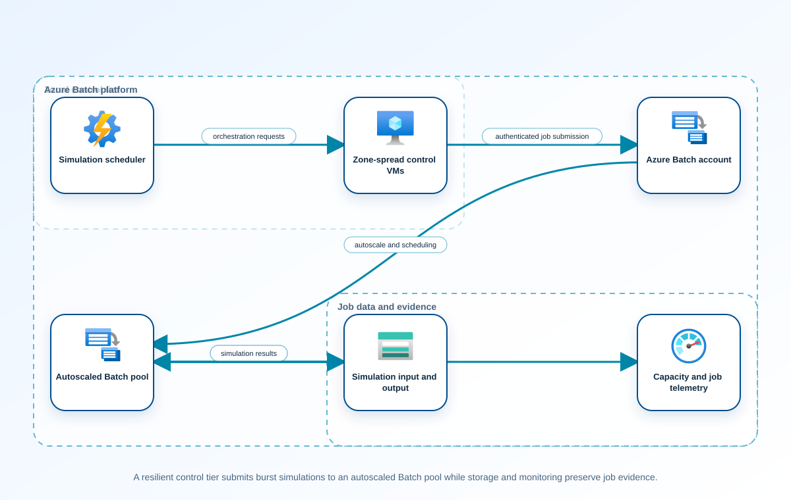

<!-- BEGIN GENERATED AZ305 V1 -->
# LAB-18 — Compute Requirements, Virtual Machines, and Batch Architecture

## 1. Navigation

[← LAB-17](../17-nonrelational-data-resilience/README.md) · [Lab catalog](../README.md) · [LAB-19 →](../19-container-serverless-architecture/README.md)

## 2. Scenario and completion contract

Tailspin Aerospace processes aerodynamic simulations in nightly bursts while a smaller licensing and orchestration tier must remain available during business hours. Jobs range from short CPU-bound calculations to memory-intensive batches that need ephemeral scratch disks, a controlled image, and deterministic retry behavior. Demand is seasonal, permanent peak capacity would be wasteful, and some simulations cannot run on shared infrastructure. The platform team needs a deployable Bicep reference that separates the highly available control plane from elastic workers and records quota, image, and Batch task-recovery assumptions. The lab may create a tightly tagged, time-limited, zero-capacity reference footprint, but it does not submit work or launch production-scale pools.

- Architect role: Compute platform architect
- Outcome: Build and assess a Bicep-defined architecture that matches compute requirements to zonal virtual machines and an autoscaled Azure Batch worker pool.
- Duration: 180 minutes
- Difficulty: advanced
- Cost class: moderate
- Completion: all five checkpoint assertions, final validation, decision revision, and cleanup review are complete.

## 3. Objective-to-evidence map

| Objective | Requirement | Checkpoint |
| --- | --- | --- |
| `INF-COMP-01` | `LAB18-REQ-01` | [`LAB18-CP01`](#checkpoint-1) |
| `INF-COMP-02` | `LAB18-REQ-02` | [`LAB18-CP02`](#checkpoint-2) |
| `INF-COMP-05` | `LAB18-REQ-03` | [`LAB18-CP03`](#checkpoint-3) |
| `INF-COMP-01` | `LAB18-REQ-04` | [`LAB18-CP04`](#checkpoint-4) |
| `INF-COMP-02` | `LAB18-REQ-05` | [`LAB18-CP05`](#checkpoint-5) |

## 4. Business and quality requirements

Business outcome: Complete simulation batches inside the overnight window while keeping orchestration available and paying for burst capacity only when jobs require it.

- `LAB18-REQ-01` — The requirement matrix captures instruction set, vCPU, memory, scratch space, network, image, job duration, concurrency, availability, quota, and data-gravity needs.
- `LAB18-REQ-02` — Compilation succeeds and the template contains a tagged, parameterized, three-zone-capable VMSS at zero capacity plus a private, zero-node Batch pool, networking, identity, and no embedded secret.
- `LAB18-REQ-03` — What-if contains only new run-owned resources, zero control and worker capacity, no public IP allocation, and the required ownership and expiry tags.
- `LAB18-REQ-04` — The bounded reference footprint deploys only after execution and cost acknowledgements, and returned IDs are persisted immediately in run state.
- `LAB18-REQ-05` — The exact pool emitted by the deployment remains at zero nodes, uses no public node IPs, and records the image, VM size, subnet, and later scale prerequisites without running a job.

Scenario facts:

- **Data:** Job packages, input sets, result objects, queue state, node images, and execution logs carry export-control classification.
- **Scale:** Capacity must process the existing eight-hour workload in five hours using measured task parallelism and node throughput.
- **Latency:** Queue wait, pool scale-out, task execution, and result upload all consume the five-hour completion window.
- **Availability:** Zonal control VMs preserve orchestration while Batch task retry and pool replacement handle worker loss.
- **RTO:** Control-plane recovery must not prevent the five-hour batch deadline; an independent numerical control RTO is owner-defined.
- **RPO:** Completed results and accepted task state must survive worker replacement so only incomplete units are rerun.
- **Budget:** Dedicated export-approved nodes cost more than low-priority capacity and should scale down immediately after the bounded batch.

Constraints:

- Simulation batches must complete inside the overnight processing window while orchestration remains available.
- Export-controlled jobs cannot use low-priority capacity and the processing window contracts from eight hours to five.
- Use only the Azure CLI + Bicep command lane for learner implementation.
- Keep all live changes behind explicit execution and acknowledgement switches.
- Retain only sanitized command evidence and synthetic fixture identifiers.

Assumptions:

- The simulation executable can run unattended on an approved Batch node image.
- Historical job duration and node-utilization evidence are available for capacity calculation.
- West Europe is the configurable primary example and North Europe is the configurable secondary example.
- The learner has administrator-level Azure operations knowledge but receives no pre-existing authenticated context.
- Offline fixtures demonstrate contract behavior rather than live Azure service behavior.

## 5. Architecture diagram and walkthrough



The flow begins with the business outcome, crosses five independently validated design capabilities, and ends with positive and negative evidence. The SVG is deterministically rendered from `diagrams/architecture.mmd`.

## 6. Concept primer and candidate architectures

Architecture decisions translate measurable requirements into a deliberate service and operating model. A candidate is viable only when every mandatory constraint is met; convenience or familiarity cannot compensate for a disqualifier.

- **Zonal control virtual machines with an autoscaled Azure Batch pool** (eligible) — Batch supplies queue, pool, task, and retry primitives while zonal control VMs protect orchestration and autoscale bounds worker spend.
- **Flexible Virtual Machine Scale Sets running custom queue workers** (eligible) — Scale sets provide flexible compute and zone placement but require the team to own scheduling, retries, task state, and result coordination.
- **Dedicated zonal virtual machines scheduled for the nightly processing window** (eligible) — Scheduled VMs are straightforward but scale in coarse units and retain more manual task-distribution responsibility.
- **Analyst desktops running jobs with local result files** (ineligible) — Desktop execution avoids platform setup but cannot prove access boundaries, availability, scale, or durable result ownership. Disqualifier: LAB18-REQ-01 requires governed compute, image, capacity, data-gravity, and availability characteristics.

## 7. Decision, ADR, and Well-Architected review

Criteria weights are C1 30, C2 25, C3 20, C4 15, and C5 10. Weighted totals use `sum(weight × score) / 5`.

| Candidate | Eligible | C1 | C2 | C3 | C4 | C5 | Weighted /100 |
| --- | ---: | ---: | ---: | ---: | ---: | ---: | ---: |
| Zonal control virtual machines with an autoscaled Azure Batch pool | yes | 5 | 4 | 4 | 5 | 3 | 87 |
| Flexible Virtual Machine Scale Sets running custom queue workers | yes | 4 | 4 | 4 | 2 | 3 | 72 |
| Dedicated zonal virtual machines scheduled for the nightly processing window | yes | 3 | 4 | 4 | 3 | 2 | 67 |
| Analyst desktops running jobs with local result files | no | 1 | 1 | 1 | 1 | 4 | 26 |

Selected design: **Zonal control virtual machines with an autoscaled Azure Batch pool**. `ADR-LAB18-001` records the accepted reasoning. Review Reliability, Security, Cost Optimization, Operational Excellence, and Performance Efficiency in `design/decision.yml`; no pillar is implied by another.

Rejected alternatives:

- **Flexible Virtual Machine Scale Sets running custom queue workers:** Custom batch orchestration adds operating risk without a workload feature that requires it.
- **Dedicated zonal virtual machines scheduled for the nightly processing window:** Fixed nightly hosts respond less efficiently to queue variation and require more orchestration work.
- **Analyst desktops running jobs with local result files:** It is ineligible because local unmanaged execution violates the workload control boundary.

Architecture risks:

- **Risk:** Dedicated node allocation may not ramp quickly enough to meet the shorter window. **Mitigation:** Measure allocation lead time, maintain approved quota headroom, and begin pool scale before the job release gate.
- **Risk:** Export-controlled packages can leak through general-purpose storage or logs. **Mitigation:** Use run-owned private storage, minimal sanitized telemetry, approved images, and an explicit data-placement assertion.

Well-Architected consequences:

- **Reliability:** Zonal orchestration, durable task state, retry, and worker replacement keep the batch recoverable.
- **Security:** Dedicated approved nodes, private data paths, and classified package handling enforce export controls.
- **Cost Optimization:** Autoscale removes dedicated workers after the five-hour batch while preserving justified control capacity.
- **Operational Excellence:** Queue depth, allocation, task failure, result integrity, and cleanup evidence provide one run ledger.
- **Performance Efficiency:** Measured task throughput and parallelism size dedicated capacity for the shortened completion window.

ADR consequences:

- Quota and approved dedicated-node capacity become release prerequisites for export-controlled runs.
- Batch state and result integrity, rather than individual VM uptime, define successful completion.

## 8. Inputs, permissions, licensing, cost, and analogue

Use configurable `Location` (`AZ305_LOCATION`, default West Europe) and `SecondaryLocation` (`AZ305_SECONDARY_LOCATION`, default North Europe). Every public input has an explicit `AZ305_*` fallback. Preview is the default; only Golden Lab 00 writes an intent-only `execute: false` preview record. Before an executed cloud command, the supplied subscription and tenant must exactly match the active CLI, Az, and—where applicable—Microsoft Graph contexts. `-Execute` crosses the execution boundary; cost-bearing and tenant-scoped paths also require their independent acknowledgement switches.

Safe analogue: The reference topology is deployable at bounded scope; preview remains the default and live verification is separate.

Permissions: Compute, Batch, network, and deployment read access supports assessment; resource-group or template deployment requires an approved contributor role and cost acknowledgement.

Licensing: Azure Batch service orchestration has no separate license, but pool nodes, disks, networking, storage, and control VMs incur usage charges.

Cost boundary: Compare dedicated and low-priority node hours, autoscale ramp time, control-plane VM capacity, storage transfer, and failed-job reruns.

## 9. Read-only preflight

```powershell
pwsh ./scripts/azure-cli/Preflight.ps1 -RunId synthetic-180001
```

Synthetic sample: `{"labId":"LAB-18","track":"azure-cli","result":"pass","note":"Local tool discovery only"}`. This is illustrative local output, not evidence captured from Azure.

## 10. Five guided checkpoints

### Checkpoint 1: Translate workload demand into compute requirements

<a id="checkpoint-1"></a>

**Trace:** `INF-COMP-01` → `LAB18-REQ-01` → `LAB18-CP01`

```powershell
az vm list-skus --location $Location --resource-type virtualMachines --query '[?capabilities[?name==''vCPUs'' && to_number(value)>=`4`]].{name:name,zones:locationInfo[0].zones,restrictions:restrictions}' --output table --only-show-errors
```

Expected evidence: The requirement matrix captures instruction set, vCPU, memory, scratch space, network, image, job duration, concurrency, availability, quota, and data-gravity needs. Retain Save the demand model, SKU capability output, benchmark assumption, and normal-versus-peak capacity calculation.

Positive assertion:

```powershell
$skus = az vm list-skus --location $Location --size $ControlVmSku --all --output json --only-show-errors | ConvertFrom-Json; if (-not $skus -or $skus[0].restrictions.Count -gt 0) { throw 'The selected control VM SKU is unavailable or restricted.' }
```

Negative assertion:

```powershell
$skus = az vm list-skus --location $Location --size $WorkerVmSku --all --output json --only-show-errors | ConvertFrom-Json; if (-not ($skus[0].locationInfo.zones)) { throw 'The worker SKU has no documented zone capability.' }
```

Failure and retry: A technically supported SKU can miss the batch window or be unavailable at the required quota. Substitute the approved fallback SKU, rerun the throughput model, and update the cost comparison.

Cleanup dependency: Remove local SKU exports; this checkpoint creates no compute or quota request.

WAF consequence: Performance Efficiency: requirements drive heterogeneous sizing instead of one oversized worker profile.

### Checkpoint 2: Compile and lint the compute Bicep design

<a id="checkpoint-2"></a>

**Trace:** `INF-COMP-02` → `LAB18-REQ-02` → `LAB18-CP02`

```powershell
az bicep build --file artifacts/main.bicep --stdout --only-show-errors | Out-Null
```

Expected evidence: Compilation succeeds and the template contains a tagged, parameterized, three-zone-capable VMSS at zero capacity plus a private, zero-node Batch pool, networking, identity, and no embedded secret. Retain Preserve the Bicep source hash, compiler output, parameter review, and architecture traceability record.

Positive assertion:

```powershell
$template = az bicep build --file artifacts/main.bicep --stdout --only-show-errors | ConvertFrom-Json; $types = @($template.resources.type); $vmss = $template.resources | Where-Object type -eq 'Microsoft.Compute/virtualMachineScaleSets'; if ('Microsoft.Batch/batchAccounts' -notin $types -or 'Microsoft.Batch/batchAccounts/pools' -notin $types -or -not $vmss.properties.virtualMachineProfile) { throw 'The compiled template lacks the Batch pool or complete VMSS profile.' }
```

Negative assertion:

```powershell
$template = az bicep build --file artifacts/main.bicep --stdout --only-show-errors | ConvertFrom-Json; if ($template.resources | Where-Object { $_.properties -and ($_.properties | ConvertTo-Json -Depth 20) -match 'password|accountKey' }) { throw 'The template appears to contain an inline secret.' }
```

Failure and retry: A template can compile while violating security, ownership, or lifecycle requirements. Correct the smallest failing module and rerun compilation plus semantic assertions before deployment preview.

Cleanup dependency: Delete generated local JSON if retained; keep the authored Bicep source.

WAF consequence: Security: managed identity, restricted ingress, and secret-free templates reduce control-plane exposure.

### Checkpoint 3: Preview the tagged reference deployment

<a id="checkpoint-3"></a>

**Trace:** `INF-COMP-05` → `LAB18-REQ-03` → `LAB18-CP03`

```powershell
az deployment group what-if --resource-group $ResourceGroupName --template-file artifacts/main.bicep --parameters artifacts/parameters.example.json runId=$RunId expiresOn=$ExpiresOn --result-format FullResourcePayloads --output json --only-show-errors
```

Expected evidence: What-if contains only new run-owned resources, zero control and worker capacity, no public IP allocation, and the required ownership and expiry tags. Retain Archive the complete what-if result, reviewer decision, estimated hourly ceiling, and template and parameter hashes.

Positive assertion:

```powershell
$preview = az deployment group what-if --resource-group $ResourceGroupName --template-file artifacts/main.bicep --parameters artifacts/parameters.example.json runId=$RunId expiresOn=$ExpiresOn --result-format ResourceIdOnly --output json --only-show-errors | ConvertFrom-Json; if (-not ($preview.changes | Where-Object changeType -eq 'Create')) { throw 'What-if produced no owned resource creation.' }
```

Negative assertion:

```powershell
$preview = az deployment group what-if --resource-group $ResourceGroupName --template-file artifacts/main.bicep --parameters artifacts/parameters.example.json runId=$RunId expiresOn=$ExpiresOn --result-format FullResourcePayloads --output json --only-show-errors | ConvertFrom-Json; if ($preview.changes | Where-Object changeType -ne 'Create') { throw 'What-if would modify, delete, or reuse a pre-existing resource.' }; if (($preview | ConvertTo-Json -Depth 50) -match '0\.0\.0\.0/0') { throw 'What-if exposes unrestricted network access.' }
```

Failure and retry: Parameter drift can expand cost or affect a pre-existing resource despite a valid template. Correct parameters, regenerate state before any mutation, and obtain a fresh reviewed what-if result.

Cleanup dependency: Remove preview output if it contains sensitive topology; what-if itself creates no resource.

WAF consequence: Cost Optimization: bounded autoscale and reviewed preview make the maximum spend visible before deployment.

### Checkpoint 4: Deploy and verify the compute reference

<a id="checkpoint-4"></a>

**Trace:** `INF-COMP-01` → `LAB18-REQ-04` → `LAB18-CP04`

```powershell
az deployment group create --resource-group $ResourceGroupName --name "lab18-$RunId" --template-file artifacts/main.bicep --parameters artifacts/parameters.example.json runId=$RunId expiresOn=$ExpiresOn --output json --only-show-errors
```

Expected evidence: The bounded reference footprint deploys only after execution and cost acknowledgements, and returned IDs are persisted immediately in run state. Retain Preserve deployment operations, schema-valid run state, exact resource IDs, effective tags, and assertion outcomes.

Positive assertion:

```powershell
$deployment = az deployment group show --resource-group $ResourceGroupName --name "lab18-$RunId" --output json --only-show-errors | ConvertFrom-Json; if ($deployment.properties.provisioningState -ne 'Succeeded') { throw 'The reference deployment did not succeed.' }
```

Negative assertion:

```powershell
$foreign = az resource list --resource-group $ResourceGroupName --query "[?tags.runId!='$RunId' || tags.labId!='LAB-18' || tags.purpose!='az305-lab']" --output json --only-show-errors | ConvertFrom-Json; if ($foreign.Count -gt 0) { throw 'The resource group contains an ownership mismatch.' }
```

Failure and retry: Partial deployment can leave chargeable workers or dependencies even when the top-level operation fails. Reconcile deployment operations with run state, correct the failure, and redeploy idempotently with the same RunId.

Cleanup dependency: Delete only exact run-state IDs whose purpose, labId, runId, and expiresOn tags all match; follow reverse dependency order.

WAF consequence: Operational Excellence: declarative deployment and immediate state capture make partial failure recoverable.

### Checkpoint 5: Validate Batch behavior and graceful degradation

<a id="checkpoint-5"></a>

**Trace:** `INF-COMP-02` → `LAB18-REQ-05` → `LAB18-CP05`

```powershell
$PoolResourceId = az deployment group show --resource-group $ResourceGroupName --name "lab18-$RunId" --query "properties.outputs.cleanupResourceIds.value[?contains(@, '/pools/')]|[0]" --output tsv --only-show-errors; az resource show --ids $PoolResourceId --api-version 2024-07-01 --query "{id:id,vmSize:properties.vmSize,fixedScale:properties.scaleSettings.fixedScale,publicIp:properties.networkConfiguration.publicIPAddressConfiguration.provision}" --output json --only-show-errors
```

Expected evidence: The exact pool emitted by the deployment remains at zero nodes, uses no public node IPs, and records the image, VM size, subnet, and later scale prerequisites without running a job. Retain Store the exact pool ARM ID, zero-node scale settings, image and node-agent pair, subnet, public-IP mode, and documented outbound prerequisite.

Positive assertion:

```powershell
$PoolResourceId = az deployment group show --resource-group $ResourceGroupName --name "lab18-$RunId" --query "properties.outputs.cleanupResourceIds.value[?contains(@, '/pools/')]|[0]" --output tsv --only-show-errors; $pool = az resource show --ids $PoolResourceId --api-version 2024-07-01 --output json --only-show-errors | ConvertFrom-Json; if (-not $pool -or $pool.properties.scaleSettings.fixedScale.targetDedicatedNodes -ne 0 -or $pool.properties.scaleSettings.fixedScale.targetLowPriorityNodes -ne 0) { throw 'The included Batch pool is absent or has nonzero target capacity.' }
```

Negative assertion:

```powershell
$PoolResourceId = az deployment group show --resource-group $ResourceGroupName --name "lab18-$RunId" --query "properties.outputs.cleanupResourceIds.value[?contains(@, '/pools/')]|[0]" --output tsv --only-show-errors; $pool = az resource show --ids $PoolResourceId --api-version 2024-07-01 --output json --only-show-errors | ConvertFrom-Json; if ($pool.properties.networkConfiguration.publicIPAddressConfiguration.provision -ne 'NoPublicIPAddresses' -or $pool.properties.scaleSettings.autoScale) { throw 'The bounded pool permits public node IPs or unbounded autoscale.' }
```

Failure and retry: A syntactically valid pool can allocate billable or unreachable nodes when scale and outbound prerequisites are not checked together. Restore both node targets to zero, validate the current image/SKU pair, and document explicit NAT or inspected-firewall egress before any separately authorized scale test.

Cleanup dependency: Stop and delete the run-owned pool before other dependencies, then verify no active managed object remains.

WAF consequence: Reliability: idempotent tasks and resilient orchestration tolerate individual worker and zone failures.

## 11. Final validation and interpretation

Run `Validate.ps1 -Mode Deployment -Execute` only after an executed run has state and you are authorized to issue the ten read-only checkpoint inspections. Without `-Execute`, ordinary deployment validation records `partial` and exits `2`; Golden Lab 00 alone can validate its intent-only preview locally. Exit `0` means all required assertions pass, `1` means at least one failed, and `2` means the outcome is gated or partial. Positive and negative commands execute independently, so one failure never suppresses its paired assertion.

## 12. Material change request

Export-controlled simulations can no longer use low-priority capacity, and the processing window is shortened from eight hours to five.

Revised solution: select **Zonal control virtual machines with an autoscaled Azure Batch pool**. LAB18-REQ-05 requires a five-hour export-controlled completion window, so Batch remains selected with dedicated-only nodes, quota headroom, and earlier scale-out.

Revised Well-Architected consequences:

- **Reliability:** Dedicated quota and pre-scaling reduce allocation uncertainty inside the batch window.
- **Security:** No export-controlled task can land on low-priority or unapproved worker capacity.
- **Cost Optimization:** Dedicated nodes still scale to zero after results and ownership-checked cleanup complete.
- **Operational Excellence:** Allocation and queue timing become explicit go/no-go evidence before job submission.
- **Performance Efficiency:** Pool size derives from observed task throughput needed to compress eight hours into five.

## 13. Architect job challenge

Recalculate dedicated-node capacity, quota, zone placement, and cost; then compare the selected Azure Batch design with Flexible Virtual Machine Scale Sets without crossing the bounded lab footprint.

## 14. Troubleshooting, cleanup, and residual verification

- If Bicep what-if shows replacements, identify the immutable property and confirm that no pre-existing resource is in scope before execution.
- If the Batch pool remains resizing, inspect quota and node allocation errors rather than increasing the maximum blindly.
- If task outputs are missing, compare the submitted input manifest with per-task exit codes and output hashes.

Cleanup previews nonempty state in reverse dependency order, writes `partial`, and exits `2`; an already empty run is completed locally and idempotently. Executed cleanup rechecks the exact live ID plus `purpose`, `labId`, `runId`, and `expiresOn` immediately before each removal, persists state after every absent or removed object, stops on the first dependency failure, and refuses unresolved pre-existing settings. It never automates purge. Finish with `Validate.ps1 -Mode PostCleanup`; the required residual count is zero.

## 15. Exam debrief, assessment, sources, and navigation

Explain the recommendation in terms of requirements, rejected alternatives, failure behavior, and all five WAF pillars. Complete `assessment/QUESTIONS.md`, then use the separately excluded answer key for remediation.

- [Choose an Azure compute service](https://learn.microsoft.com/en-us/azure/architecture/guide/technology-choices/compute-decision-tree)
- [Azure Well-Architected Framework](https://learn.microsoft.com/en-us/azure/well-architected/)

[← LAB-17](../17-nonrelational-data-resilience/README.md) · [Lab catalog](../README.md) · [LAB-19 →](../19-container-serverless-architecture/README.md)

## 16. Synchronized lifecycle-script appendix

### Preflight.ps1

```powershell
[CmdletBinding()]
param(
    [string]$SubscriptionId = $env:AZ305_SUBSCRIPTION_ID,
    [string]$TenantId = $env:AZ305_TENANT_ID,
    [ValidatePattern('^[a-z0-9-]{6,64}$')][string]$RunId = $env:AZ305_RUN_ID,
    [string]$Location = $(if ($env:AZ305_LOCATION) { $env:AZ305_LOCATION } else { 'westeurope' }),
    [string]$SecondaryLocation = $(if ($env:AZ305_SECONDARY_LOCATION) { $env:AZ305_SECONDARY_LOCATION } else { 'northeurope' }),
    [string]$ResourceGroup = $(if ($env:AZ305_RESOURCE_GROUP) { $env:AZ305_RESOURCE_GROUP } else { "rg-az305-$RunId" }),
    [string]$WorkloadName = $(if ($env:AZ305_WORKLOAD_NAME) { $env:AZ305_WORKLOAD_NAME } else { "az305-$RunId" }),
    [string]$ExpiresOn = $(if ($env:AZ305_EXPIRES_ON) { $env:AZ305_EXPIRES_ON } else { (Get-Date).ToUniversalTime().AddDays(1).ToString('yyyy-MM-dd') }),
    [string]$ControlVmSku = $env:AZ305_CONTROL_VM_SKU,
    [string]$ResourceGroupName = $env:AZ305_RESOURCE_GROUP_NAME,
    [string]$WorkerVmSku = $env:AZ305_WORKER_VM_SKU,
    [switch]$Execute,
    [switch]$AcknowledgeCost,
    [switch]$AcknowledgeTenantChange
)

$ErrorActionPreference = 'Stop'
$PSNativeCommandUseErrorActionPreference = $true
if (-not $RunId) { [Console]::Error.WriteLine('RunId or AZ305_RUN_ID is required.'); exit 2 }
# Every lifecycle entrypoint intentionally exposes the same public parameter contract.
@($SubscriptionId, $TenantId, $RunId, $Location, $SecondaryLocation, $ResourceGroup, $WorkloadName, $ExpiresOn, $ControlVmSku, $ResourceGroupName, $WorkerVmSku, $Execute, $AcknowledgeCost, $AcknowledgeTenantChange) | Out-Null

$requiredCommands = @('az', 'bicep', 'pwsh')
$missing = @($requiredCommands | Where-Object { -not (Get-Command $_ -ErrorAction SilentlyContinue) })
if ($missing.Count -gt 0) {
    Write-Error "Missing local commands: $($missing -join ', ')"
    exit 1
}

[pscustomobject]@{
    labId = 'LAB-18'
    track = 'azure-cli'
    implementationMode = 'reference-deployable'
    result = 'pass'
    note = 'Local tool discovery only; no Azure or Microsoft Graph request was made.'
} | ConvertTo-Json
exit 0
```

### Setup.ps1

```powershell
[CmdletBinding()]
param(
    [string]$SubscriptionId = $env:AZ305_SUBSCRIPTION_ID,
    [string]$TenantId = $env:AZ305_TENANT_ID,
    [ValidatePattern('^[a-z0-9-]{6,64}$')][string]$RunId = $env:AZ305_RUN_ID,
    [string]$Location = $(if ($env:AZ305_LOCATION) { $env:AZ305_LOCATION } else { 'westeurope' }),
    [string]$SecondaryLocation = $(if ($env:AZ305_SECONDARY_LOCATION) { $env:AZ305_SECONDARY_LOCATION } else { 'northeurope' }),
    [string]$ResourceGroup = $(if ($env:AZ305_RESOURCE_GROUP) { $env:AZ305_RESOURCE_GROUP } else { "rg-az305-$RunId" }),
    [string]$WorkloadName = $(if ($env:AZ305_WORKLOAD_NAME) { $env:AZ305_WORKLOAD_NAME } else { "az305-$RunId" }),
    [string]$ExpiresOn = $(if ($env:AZ305_EXPIRES_ON) { $env:AZ305_EXPIRES_ON } else { (Get-Date).ToUniversalTime().AddDays(1).ToString('yyyy-MM-dd') }),
    [string]$ControlVmSku = $env:AZ305_CONTROL_VM_SKU,
    [string]$ResourceGroupName = $env:AZ305_RESOURCE_GROUP_NAME,
    [string]$WorkerVmSku = $env:AZ305_WORKER_VM_SKU,
    [switch]$Execute,
    [switch]$AcknowledgeCost,
    [switch]$AcknowledgeTenantChange
)

$ErrorActionPreference = 'Stop'
$PSNativeCommandUseErrorActionPreference = $true
if (-not $RunId) { [Console]::Error.WriteLine('RunId or AZ305_RUN_ID is required.'); exit 2 }
# Every lifecycle entrypoint intentionally exposes the same public parameter contract.
@($SubscriptionId, $TenantId, $RunId, $Location, $SecondaryLocation, $ResourceGroup, $WorkloadName, $ExpiresOn, $ControlVmSku, $ResourceGroupName, $WorkerVmSku, $Execute, $AcknowledgeCost, $AcknowledgeTenantChange) | Out-Null

$LabRoot = Split-Path (Split-Path $PSScriptRoot -Parent) -Parent
$StateRoot = Join-Path $LabRoot ".state/$RunId"
$StatePath = Join-Path $StateRoot 'run.json'

function Invoke-AzCliJson {
    [CmdletBinding()]
    param([Parameter(Mandatory)][string[]]$ArgumentList)
    $savedNativePreference = $PSNativeCommandUseErrorActionPreference
    try {
        # Capture the exit code ourselves so a failed native command cannot be
        # mistaken for an empty but successful JSON response.
        $PSNativeCommandUseErrorActionPreference = $false
        $outputLines = @(& az @ArgumentList)
        $nativeExit = $LASTEXITCODE
    }
    finally {
        $PSNativeCommandUseErrorActionPreference = $savedNativePreference
    }
    if ($nativeExit -ne 0) { throw "Azure CLI exited with code $nativeExit." }
    $raw = @($outputLines) -join "`n"
    if ([string]::IsNullOrWhiteSpace($raw)) { return $null }
    try { return ($raw | ConvertFrom-Json -Depth 100) }
    catch { throw 'Azure CLI returned data that was not valid JSON.' }
}

function Assert-ExactExecutionContext {
    [CmdletBinding()]
    param([string]$ExpectedSubscriptionId, [string]$ExpectedTenantId)
    if ([string]::IsNullOrWhiteSpace($ExpectedSubscriptionId) -or [string]::IsNullOrWhiteSpace($ExpectedTenantId)) {
        throw 'SubscriptionId and TenantId are required before a cloud request.'
    }
    $context = Invoke-AzCliJson -ArgumentList @('account', 'show', '--output', 'json', '--only-show-errors')
    if (-not $context -or [string]$context.id -ine $ExpectedSubscriptionId -or [string]$context.tenantId -ine $ExpectedTenantId) {
        throw 'The active Azure CLI subscription or tenant does not exactly match the requested context.'
    }
}

function Save-RunState {
    [CmdletBinding()]
    param([Parameter(Mandatory)]$State)
    $temporaryPath = "$StatePath.tmp"
    $State | ConvertTo-Json -Depth 20 | Set-Content -LiteralPath $temporaryPath -Encoding utf8NoBOM
    Move-Item -LiteralPath $temporaryPath -Destination $StatePath -Force
}

function Assert-SafeStateValue {
    [CmdletBinding()]
    param($Value)
    $serialized = $Value | ConvertTo-Json -Depth 12 -Compress
    if ($serialized -match '(?i)"(?:token|password|secret|certificate|connectionString|sas|clientSecret|accessToken|refreshToken|accountKey|privateKey)"\s*:') {
        throw 'A prohibited sensitive field name was returned; state capture is refused.'
    }
}

function Convert-CheckpointOutput {
    [CmdletBinding()]
    param($Value)
    if ($Value -is [string]) { $raw = [string]$Value }
    elseif ($Value -is [System.Collections.IEnumerable] -and @($Value | Where-Object { $_ -isnot [string] }).Count -eq 0) { $raw = @($Value) -join "`n" }
    else { return $Value }
    if ([string]::IsNullOrWhiteSpace($raw)) { return $null }
    try { return ($raw | ConvertFrom-Json -Depth 100) } catch { return $Value }
}

function Get-ReturnedResourceId {
    [CmdletBinding()]
    param($Value)
    $seen = [System.Collections.Generic.HashSet[string]]::new([System.StringComparer]::OrdinalIgnoreCase)
    $results = [System.Collections.Generic.List[string]]::new()
    function Add-ArmId {
        param($Candidate)
        if ($Candidate -is [string] -and $Candidate -match '^/subscriptions/[0-9a-f-]+/(?:resourceGroups/[^/]+(?:/providers/.+)?|providers/.+)$' -and $Candidate -notmatch '/providers/Microsoft\.Resources/deployments/') {
            if ($seen.Add($Candidate)) { $results.Add($Candidate) }
        }
    }
    function Find-DeploymentOutputId {
        param($Item, [int]$Depth)
        if ($null -eq $Item -or $Depth -gt 12) { return }
        if ($Item -is [string]) { Add-ArmId -Candidate $Item; return }
        if ($Item -is [System.Collections.IDictionary]) { foreach ($key in $Item.Keys) { Find-DeploymentOutputId -Item $Item[$key] -Depth ($Depth + 1) }; return }
        if ($Item -is [System.Collections.IEnumerable]) { foreach ($entry in $Item) { Find-DeploymentOutputId -Item $entry -Depth ($Depth + 1) }; return }
        foreach ($property in @($Item.PSObject.Properties | Where-Object { $_.MemberType -in @('NoteProperty', 'Property') })) { Find-DeploymentOutputId -Item $property.Value -Depth ($Depth + 1) }
    }
    foreach ($rootItem in @($Value)) {
        if ($rootItem -is [System.Collections.IDictionary]) {
            foreach ($name in @('id', 'resourceId')) { if ($rootItem.Contains($name)) { Add-ArmId -Candidate $rootItem[$name] } }
            if ($rootItem.Contains('properties') -and $rootItem.properties -and $rootItem.properties.outputs) { Find-DeploymentOutputId -Item $rootItem.properties.outputs -Depth 0 }
            continue
        }
        foreach ($name in @('Id', 'ResourceId')) {
            $property = $rootItem.PSObject.Properties[$name]
            if ($property) { Add-ArmId -Candidate $property.Value }
        }
        if ($rootItem.PSObject.Properties['Properties'] -and $rootItem.Properties -and $rootItem.Properties.outputs) {
            Find-DeploymentOutputId -Item $rootItem.Properties.outputs -Depth 0
        }
    }
    return @($results)
}

function Get-PlannedDeploymentResourceId {
    [CmdletBinding()]
    param($Value)
    $seen = [System.Collections.Generic.HashSet[string]]::new([System.StringComparer]::OrdinalIgnoreCase)
    $results = [System.Collections.Generic.List[string]]::new()
    foreach ($change in @($Value.changes)) {
        $candidate = [string]$change.resourceId
        if ($candidate -match '^/subscriptions/[0-9a-f-]+/(?:resourceGroups/[^/]+(?:/providers/.+)?|providers/.+)$' -and $candidate -notmatch '/providers/Microsoft\.Resources/deployments/' -and $seen.Add($candidate)) {
            $results.Add($candidate)
        }
    }
    return @($results)
}

function Assert-InputSubscriptionScope {
    [CmdletBinding()]
    param($Inputs, [string]$ExpectedSubscriptionId)
    $entries = if ($Inputs -is [System.Collections.IDictionary]) {
        @($Inputs.GetEnumerator())
    } else {
        @($Inputs.PSObject.Properties | ForEach-Object { [pscustomobject]@{ Key = $_.Name; Value = $_.Value } })
    }
    foreach ($entry in $entries) {
        if ($entry.Value -is [string] -and [string]$entry.Value -match '^/subscriptions/([^/]+)/') {
            if ($Matches[1] -ine $ExpectedSubscriptionId) { throw "Input $($entry.Key) belongs to a different subscription." }
        }
    }
}

function Assert-ManagedMutation {
    [CmdletBinding()]
    param($State, [string]$CheckpointId, [bool]$CarriesOwnership, [object[]]$TargetResourceIds)
    if ($CarriesOwnership) { return }
    $targets = @($TargetResourceIds | Where-Object { $_ -is [string] -and $_ -match '^/subscriptions/' })
    if ($targets.Count -eq 0) { throw "$CheckpointId refuses an untagged mutation because no exact ARM target ID was supplied." }
    $knownIds = @($State.managedObjects | ForEach-Object { [string]$_.id })
    if ($knownIds.Count -eq 0) { throw "$CheckpointId refuses to modify a pre-existing object because no run-owned parent has been recorded." }
    foreach ($target in $targets) {
        $related = @($knownIds | Where-Object { $target -ieq $_ -or $target.StartsWith("$_/", [System.StringComparison]::OrdinalIgnoreCase) -or $_.StartsWith("$target/", [System.StringComparison]::OrdinalIgnoreCase) }).Count -gt 0
        if (-not $related) { throw "$CheckpointId refuses a mutation outside the exact run-owned resource boundary." }
    }
}

$executionInputs = [ordered]@{ subscriptionId = $SubscriptionId; tenantId = $TenantId; location = $Location; secondaryLocation = $SecondaryLocation; resourceGroup = $ResourceGroup; workloadName = $WorkloadName; expiresOn = $ExpiresOn; ControlVmSku = $ControlVmSku; ResourceGroupName = $ResourceGroupName; WorkerVmSku = $WorkerVmSku }

if (-not $Execute) {
    Write-Output '[preview] No cloud command was called and no state was created.'
    Write-Output '[preview] Re-run with -Execute only in an authorized disposable environment.'
    exit 0
}
# This setup is compatible with the lab implementation mode.
if (-not $AcknowledgeCost) { [Console]::Error.WriteLine('Cost acknowledgement is required.'); exit 2 }
# This lab does not perform a tenant-scoped change by default.
$requiredLabInputs = [ordered]@{ ResourceGroupName = $ResourceGroupName }
$missingLabInputs = @($requiredLabInputs.GetEnumerator() | Where-Object { $_.Value -is [string] -and [string]::IsNullOrWhiteSpace([string]$_.Value) } | ForEach-Object Key)
if ($missingLabInputs.Count -gt 0) { [Console]::Error.WriteLine("Execution is gated; supply: $($missingLabInputs -join ', ')."); exit 2 }

try {
    Assert-ExactExecutionContext -ExpectedSubscriptionId $SubscriptionId -ExpectedTenantId $TenantId
    Assert-InputSubscriptionScope -Inputs $executionInputs -ExpectedSubscriptionId $SubscriptionId
    Assert-SafeStateValue -Value $executionInputs
}
catch {
    [Console]::Error.WriteLine("Execution is gated by context or input validation: $($_.Exception.Message)")
    exit 2
}

# Recovery state is persisted before the first possible mutation below.
if (Test-Path -LiteralPath $StatePath) {
    [Console]::Error.WriteLine('Run state already exists. Choose a new RunId or complete the recorded cleanup; existing recovery state will not be overwritten.')
    exit 2
}
New-Item -ItemType Directory -Path $StateRoot -Force | Out-Null
$state = [ordered]@{
    schemaVersion = '1.0.0'; labId = 'LAB-18'; runId = $RunId; track = 'azure-cli'
    implementationMode = 'reference-deployable'; status = 'initialized'
    createdAt = (Get-Date).ToUniversalTime().ToString('o'); execute = $true
    parameters = $executionInputs
    managedObjects = @(); originalSettings = @()
}
Save-RunState -State $state
$state.status = 'deploying'
Save-RunState -State $state

$originalLocation = Get-Location
try {
    Set-Location -LiteralPath $LabRoot
    # 18-CP01: Translate workload demand into compute requirements
    $stepResult = & { az vm list-skus --location $Location --resource-type virtualMachines --query '[?capabilities[?name==''vCPUs'' && to_number(value)>=`4`]].{name:name,zones:locationInfo[0].zones,restrictions:restrictions}' --output table --only-show-errors }
    if ($LASTEXITCODE -ne 0) { throw 'LAB18-CP01 native command exited with code ' + $LASTEXITCODE + '.' }
    $null = $stepResult

    # 18-CP02: Compile and lint the compute Bicep design
    $stepResult = & { az bicep build --file artifacts/main.bicep --stdout --only-show-errors | Out-Null }
    if ($LASTEXITCODE -ne 0) { throw 'LAB18-CP02 native command exited with code ' + $LASTEXITCODE + '.' }
    $null = $stepResult

    # 18-CP03: Preview the tagged reference deployment
    $stepResult = & { az deployment group what-if --resource-group $ResourceGroupName --template-file artifacts/main.bicep --parameters artifacts/parameters.example.json runId=$RunId expiresOn=$ExpiresOn --result-format FullResourcePayloads --output json --only-show-errors }
    if ($LASTEXITCODE -ne 0) { throw 'LAB18-CP03 native command exited with code ' + $LASTEXITCODE + '.' }
    # Persist exact what-if resource IDs as recovery locators before the later deployment mutation.
    $plannedCandidate = Convert-CheckpointOutput -Value $stepResult
    $plannedIds = @(Get-PlannedDeploymentResourceId -Value $plannedCandidate)
    if ($plannedIds.Count -eq 0) { throw 'LAB18-CP03 returned no exact planned ARM resource ID for partial-failure recovery.' }
    foreach ($plannedId in $plannedIds) {
        if ($plannedId -notmatch '^/subscriptions/([^/]+)/' -or $Matches[1] -ine $SubscriptionId) { throw 'A planned recovery ID belongs to a different subscription.' }
        if (@($state.managedObjects | Where-Object { $_.id -ieq $plannedId }).Count -eq 0) {
            $state.managedObjects += [pscustomobject]@{
                id = $plannedId
                type = 'planned-azure-resource'
                tags = [ordered]@{ purpose = 'az305-lab'; labId = 'LAB-18'; runId = $RunId; expiresOn = $ExpiresOn }
            }
            Save-RunState -State $state
        }
    }
    $null = $stepResult

    # 18-CP04: Deploy and verify the compute reference
    Assert-ManagedMutation -State $state -CheckpointId 'LAB18-CP04' -CarriesOwnership:$true -TargetResourceIds @()
    $stepResult = & { az deployment group create --resource-group $ResourceGroupName --name "lab18-$RunId" --template-file artifacts/main.bicep --parameters artifacts/parameters.example.json runId=$RunId expiresOn=$ExpiresOn --output json --only-show-errors }
    if ($LASTEXITCODE -ne 0) { throw 'LAB18-CP04 native command exited with code ' + $LASTEXITCODE + '.' }
    $candidate = Convert-CheckpointOutput -Value $stepResult
    $returnedIds = @(Get-ReturnedResourceId -Value $candidate)
    if ($returnedIds.Count -eq 0) { throw 'LAB18-CP04 created an owned resource but returned no recoverable ARM resource ID.' }
    foreach ($returnedId in $returnedIds) {
        if ($returnedId -notmatch '^/subscriptions/([^/]+)/' -or $Matches[1] -ine $SubscriptionId) { throw 'A returned recovery ID belongs to a different subscription.' }
        if (@($state.managedObjects | Where-Object { $_.id -ieq $returnedId }).Count -eq 0) {
            $state.managedObjects += [pscustomobject]@{
                id = $returnedId
                type = 'azure-resource'
                tags = [ordered]@{ purpose = 'az305-lab'; labId = 'LAB-18'; runId = $RunId; expiresOn = $ExpiresOn }
            }
            Save-RunState -State $state
        }
    }
    $null = $stepResult

    # 18-CP05: Validate Batch behavior and graceful degradation
    $stepResult = & { $PoolResourceId = az deployment group show --resource-group $ResourceGroupName --name "lab18-$RunId" --query "properties.outputs.cleanupResourceIds.value[?contains(@, '/pools/')]|[0]" --output tsv --only-show-errors; az resource show --ids $PoolResourceId --api-version 2024-07-01 --query "{id:id,vmSize:properties.vmSize,fixedScale:properties.scaleSettings.fixedScale,publicIp:properties.networkConfiguration.publicIPAddressConfiguration.provision}" --output json --only-show-errors }
    if ($LASTEXITCODE -ne 0) { throw 'LAB18-CP05 native command exited with code ' + $LASTEXITCODE + '.' }
    $null = $stepResult

    $state.status = 'deployed'
    Save-RunState -State $state
} catch {
    $state.status = 'failed'
    Save-RunState -State $state
    Write-Error $_
    exit 1
} finally {
    Set-Location -LiteralPath $originalLocation
}
exit 0
```

### Validate.ps1

```powershell
[CmdletBinding()]
param(
    [string]$SubscriptionId = $env:AZ305_SUBSCRIPTION_ID,
    [string]$TenantId = $env:AZ305_TENANT_ID,
    [ValidatePattern('^[a-z0-9-]{6,64}$')][string]$RunId = $env:AZ305_RUN_ID,
    [string]$Location = $(if ($env:AZ305_LOCATION) { $env:AZ305_LOCATION } else { 'westeurope' }),
    [string]$SecondaryLocation = $(if ($env:AZ305_SECONDARY_LOCATION) { $env:AZ305_SECONDARY_LOCATION } else { 'northeurope' }),
    [string]$ResourceGroup = $(if ($env:AZ305_RESOURCE_GROUP) { $env:AZ305_RESOURCE_GROUP } else { "rg-az305-$RunId" }),
    [string]$WorkloadName = $(if ($env:AZ305_WORKLOAD_NAME) { $env:AZ305_WORKLOAD_NAME } else { "az305-$RunId" }),
    [string]$ExpiresOn = $(if ($env:AZ305_EXPIRES_ON) { $env:AZ305_EXPIRES_ON } else { (Get-Date).ToUniversalTime().AddDays(1).ToString('yyyy-MM-dd') }),
    [string]$ControlVmSku = $env:AZ305_CONTROL_VM_SKU,
    [string]$ResourceGroupName = $env:AZ305_RESOURCE_GROUP_NAME,
    [string]$WorkerVmSku = $env:AZ305_WORKER_VM_SKU,
    [ValidateSet('Deployment', 'PostCleanup')][string]$Mode = 'Deployment',
    [switch]$Execute,
    [switch]$AcknowledgeCost,
    [switch]$AcknowledgeTenantChange
)

$ErrorActionPreference = 'Stop'
$PSNativeCommandUseErrorActionPreference = $true
if (-not $RunId) { [Console]::Error.WriteLine('RunId or AZ305_RUN_ID is required.'); exit 2 }
# Every lifecycle entrypoint intentionally exposes the same public parameter contract.
@($SubscriptionId, $TenantId, $RunId, $Location, $SecondaryLocation, $ResourceGroup, $WorkloadName, $ExpiresOn, $ControlVmSku, $ResourceGroupName, $WorkerVmSku, $Mode, $Execute, $AcknowledgeCost, $AcknowledgeTenantChange) | Out-Null

$LabRoot = Split-Path (Split-Path $PSScriptRoot -Parent) -Parent
$StateRoot = Join-Path $LabRoot ".state/$RunId"
$RunPath = Join-Path $StateRoot 'run.json'
$ValidationPath = Join-Path $StateRoot 'validation.json'

function Invoke-AzCliJson {
    [CmdletBinding()]
    param([Parameter(Mandatory)][string[]]$ArgumentList)
    $savedNativePreference = $PSNativeCommandUseErrorActionPreference
    try {
        # Capture the exit code ourselves so a failed native command cannot be
        # mistaken for an empty but successful JSON response.
        $PSNativeCommandUseErrorActionPreference = $false
        $outputLines = @(& az @ArgumentList)
        $nativeExit = $LASTEXITCODE
    }
    finally {
        $PSNativeCommandUseErrorActionPreference = $savedNativePreference
    }
    if ($nativeExit -ne 0) { throw "Azure CLI exited with code $nativeExit." }
    $raw = @($outputLines) -join "`n"
    if ([string]::IsNullOrWhiteSpace($raw)) { return $null }
    try { return ($raw | ConvertFrom-Json -Depth 100) }
    catch { throw 'Azure CLI returned data that was not valid JSON.' }
}

function Assert-ExactExecutionContext {
    [CmdletBinding()]
    param([string]$ExpectedSubscriptionId, [string]$ExpectedTenantId)
    if ([string]::IsNullOrWhiteSpace($ExpectedSubscriptionId) -or [string]::IsNullOrWhiteSpace($ExpectedTenantId)) {
        throw 'SubscriptionId and TenantId are required before a cloud request.'
    }
    $context = Invoke-AzCliJson -ArgumentList @('account', 'show', '--output', 'json', '--only-show-errors')
    if (-not $context -or [string]$context.id -ine $ExpectedSubscriptionId -or [string]$context.tenantId -ine $ExpectedTenantId) {
        throw 'The active Azure CLI subscription or tenant does not exactly match the requested context.'
    }
}


if (-not (Test-Path -LiteralPath $RunPath)) {
    Write-Warning 'No run state exists; validation is gated.'
    exit 2
}
$state = Get-Content -LiteralPath $RunPath -Raw | ConvertFrom-Json
$assertions = [System.Collections.Generic.List[object]]::new()
function Add-ValidationAssertion {
    [CmdletBinding()]
    param([string]$Id, [ValidateSet('positive', 'negative')][string]$Kind, [bool]$Passed, [string]$Message)
    $assertions.Add([pscustomobject]@{ id = $Id; kind = $Kind; passed = $Passed; message = $Message })
}

function Save-ValidationArtifact {
    [CmdletBinding()]
    param([ValidateSet('pass', 'partial', 'fail')][string]$Result)
    $artifact = [ordered]@{ schemaVersion = '1.0.0'; labId = 'LAB-18'; runId = $RunId; mode = $Mode; result = $Result; validatedAt = (Get-Date).ToUniversalTime().ToString('o'); assertions = @($assertions) }
    $artifact | ConvertTo-Json -Depth 12 | Set-Content -LiteralPath $ValidationPath -Encoding utf8NoBOM
}

function Test-PositiveEvidence {
    [CmdletBinding()]
    param($Value)
    if ($Value -is [bool]) { return $Value }
    if ($null -eq $Value) { return $false }
    if ($Value -is [string]) { return -not [string]::IsNullOrWhiteSpace($Value) }
    if ($Value -is [System.Collections.IEnumerable]) { return @($Value).Count -gt 0 }
    return $true
}

function Test-NegativeEvidence {
    [CmdletBinding()]
    param($Value)
    if ($Value -is [bool]) { return $Value }
    if ($null -eq $Value) { return $true }
    if ($Value -is [string]) { return [string]::IsNullOrWhiteSpace($Value) }
    if ($Value -is [System.Collections.IEnumerable]) { return @($Value).Count -eq 0 }
    $properties = @($Value.PSObject.Properties | Where-Object { $_.MemberType -in @('NoteProperty', 'Property') })
    if ($properties.Count -eq 0) { return $false }
    return @($properties | Where-Object { -not (Test-NegativeEvidence -Value $_.Value) }).Count -eq 0
}

function Test-ProhibitedStateField {
    [CmdletBinding()]
    param($Value)
    $serialized = $Value | ConvertTo-Json -Depth 20
    return $serialized -match '(?i)"(?:token|password|secret|certificate|connectionString|sas|clientSecret|accessToken|refreshToken|accountKey|privateKey)"\s*:'
}

function Assert-InputSubscriptionScope {
    [CmdletBinding()]
    param($Inputs, [string]$ExpectedSubscriptionId)
    $entries = if ($Inputs -is [System.Collections.IDictionary]) {
        @($Inputs.GetEnumerator())
    } else {
        @($Inputs.PSObject.Properties | ForEach-Object { [pscustomobject]@{ Key = $_.Name; Value = $_.Value } })
    }
    foreach ($entry in $entries) {
        if ($entry.Value -is [string] -and [string]$entry.Value -match '^/subscriptions/([^/]+)/' -and $Matches[1] -ine $ExpectedSubscriptionId) {
            throw "Input $($entry.Key) belongs to a different subscription."
        }
    }
}

$stateIdentityMatches = (
    $state.labId -ceq 'LAB-18' -and
    $state.runId -ceq $RunId -and
    $state.track -ceq 'azure-cli' -and
    $state.implementationMode -ceq 'reference-deployable' -and
    ([string]$state.parameters.subscriptionId -ieq $SubscriptionId -and [string]$state.parameters.tenantId -ieq $TenantId)
)
Add-ValidationAssertion -Id 'LAB18-VAL-POS-01' -Kind positive -Passed $stateIdentityMatches -Message 'Run identity, implementation mode, command track, tenant, and subscription exactly match the copied lab and requested run.'
$hasSensitiveName = Test-ProhibitedStateField -Value $state
Add-ValidationAssertion -Id 'LAB18-VAL-NEG-01' -Kind negative -Passed (-not $hasSensitiveName) -Message 'State contains no prohibited sensitive field name.'

if ($Mode -eq 'PostCleanup') {
    $cleanupPath = Join-Path $StateRoot 'cleanup.json'
    $cleanup = if (Test-Path -LiteralPath $cleanupPath) { Get-Content -LiteralPath $cleanupPath -Raw | ConvertFrom-Json } else { $null }
    Add-ValidationAssertion -Id 'LAB18-VAL-POS-02' -Kind positive -Passed ($null -ne $cleanup -and $cleanup.labId -ceq 'LAB-18' -and $cleanup.runId -ceq $RunId -and $cleanup.result -eq 'pass' -and $cleanup.ownershipVerified) -Message 'The exact run cleanup completed with verified ownership.'
    Add-ValidationAssertion -Id 'LAB18-VAL-NEG-02' -Kind negative -Passed ($null -ne $cleanup -and $cleanup.activeManagedObjects -eq 0 -and @($state.managedObjects).Count -eq 0 -and @($state.originalSettings).Count -eq 0 -and $state.status -eq 'cleaned') -Message 'No active managed object or unresolved original setting remains in cleanup or run state.'
    $postCleanupPassed = @($assertions | Where-Object { -not $_.passed }).Count -eq 0
    Save-ValidationArtifact -Result $(if ($postCleanupPassed) { 'pass' } else { 'fail' })
    if ($postCleanupPassed) { exit 0 }
    exit 1
}

Add-ValidationAssertion -Id 'LAB18-VAL-POS-02' -Kind positive -Passed ($state.status -eq 'deployed') -Message 'The executed setup completed successfully; a failed setup can never validate as pass.'
Add-ValidationAssertion -Id 'LAB18-VAL-NEG-02' -Kind negative -Passed (@($state.managedObjects | Where-Object { $_.tags.purpose -ne 'az305-lab' -or $_.tags.labId -ne 'LAB-18' -or $_.tags.runId -ne $RunId }).Count -eq 0) -Message 'No recorded object has a foreign ownership tag.'

if (@($assertions | Where-Object { -not $_.passed }).Count -gt 0) {
    Save-ValidationArtifact -Result 'fail'
    exit 1
}
if (-not $Execute) {
    # This lab has no special intent-only validation path.
    Save-ValidationArtifact -Result 'partial'
    Write-Warning 'Checkpoint validation is gated; re-run with -Execute after confirming the exact read-only context.'
    exit 2
}
# The validation surface is compatible with this lab implementation mode.
$requiredValidationInputs = [ordered]@{ ControlVmSku = $ControlVmSku; ResourceGroupName = $ResourceGroupName; WorkerVmSku = $WorkerVmSku }
$missingValidationInputs = @($requiredValidationInputs.GetEnumerator() | Where-Object { $_.Value -is [string] -and [string]::IsNullOrWhiteSpace([string]$_.Value) } | ForEach-Object Key)
if ($missingValidationInputs.Count -gt 0) {
    Add-ValidationAssertion -Id 'LAB18-VAL-POS-CONTEXT' -Kind positive -Passed $false -Message 'One or more required non-secret validation inputs are missing.'
    Save-ValidationArtifact -Result 'partial'
    exit 2
}
try {
    Assert-ExactExecutionContext -ExpectedSubscriptionId $SubscriptionId -ExpectedTenantId $TenantId
    Assert-InputSubscriptionScope -Inputs $state.parameters -ExpectedSubscriptionId $SubscriptionId
    Add-ValidationAssertion -Id 'LAB18-VAL-POS-CONTEXT' -Kind positive -Passed $true -Message 'The active tenant and subscription exactly match the requested validation context.'
}
catch {
    Add-ValidationAssertion -Id 'LAB18-VAL-POS-CONTEXT' -Kind positive -Passed $false -Message 'Exact execution context could not be proven.'
    Save-ValidationArtifact -Result 'partial'
    exit 2
}

$originalLocation = Get-Location
try {
    Set-Location -LiteralPath $LabRoot
# LAB18-CP01: run both polarities even when one fails.
$positivePassed = $false
try {
    $global:LASTEXITCODE = 0
    $positiveEvidence = & { $skus = az vm list-skus --location $Location --size $ControlVmSku --all --output json --only-show-errors | ConvertFrom-Json; if (-not $skus -or $skus[0].restrictions.Count -gt 0) { throw 'The selected control VM SKU is unavailable or restricted.' } }
    if ($LASTEXITCODE -ne 0) { throw 'LAB18-CP01 positive native command exited with code ' + $LASTEXITCODE + '.' }
    $positivePassed = $true
    $null = $positiveEvidence
} catch { $positivePassed = $false }
Add-ValidationAssertion -Id 'LAB18-CP01-POS' -Kind positive -Passed $positivePassed -Message 'The requirement matrix captures instruction set, vCPU, memory, scratch space, network, image, job duration, concurrency, availability, quota, and data-gravity needs.'

$negativePassed = $false
try {
    $global:LASTEXITCODE = 0
    $negativeEvidence = & { $skus = az vm list-skus --location $Location --size $WorkerVmSku --all --output json --only-show-errors | ConvertFrom-Json; if (-not ($skus[0].locationInfo.zones)) { throw 'The worker SKU has no documented zone capability.' } }
    if ($LASTEXITCODE -ne 0) { throw 'LAB18-CP01 negative native command exited with code ' + $LASTEXITCODE + '.' }
    $negativePassed = $true
    $null = $negativeEvidence
} catch { $negativePassed = $false }
Add-ValidationAssertion -Id 'LAB18-CP01-NEG' -Kind negative -Passed $negativePassed -Message 'Selecting a familiar SKU before checking batch-window throughput, quota, or regional restrictions must fail.'

# LAB18-CP02: run both polarities even when one fails.
$positivePassed = $false
try {
    $global:LASTEXITCODE = 0
    $positiveEvidence = & { $template = az bicep build --file artifacts/main.bicep --stdout --only-show-errors | ConvertFrom-Json; $types = @($template.resources.type); $vmss = $template.resources | Where-Object type -eq 'Microsoft.Compute/virtualMachineScaleSets'; if ('Microsoft.Batch/batchAccounts' -notin $types -or 'Microsoft.Batch/batchAccounts/pools' -notin $types -or -not $vmss.properties.virtualMachineProfile) { throw 'The compiled template lacks the Batch pool or complete VMSS profile.' } }
    if ($LASTEXITCODE -ne 0) { throw 'LAB18-CP02 positive native command exited with code ' + $LASTEXITCODE + '.' }
    $positivePassed = $true
    $null = $positiveEvidence
} catch { $positivePassed = $false }
Add-ValidationAssertion -Id 'LAB18-CP02-POS' -Kind positive -Passed $positivePassed -Message 'Compilation succeeds and the template contains a tagged, parameterized, three-zone-capable VMSS at zero capacity plus a private, zero-node Batch pool, networking, identity, and no embedded secret.'

$negativePassed = $false
try {
    $global:LASTEXITCODE = 0
    $negativeEvidence = & { $template = az bicep build --file artifacts/main.bicep --stdout --only-show-errors | ConvertFrom-Json; if ($template.resources | Where-Object { $_.properties -and ($_.properties | ConvertTo-Json -Depth 20) -match 'password|accountKey' }) { throw 'The template appears to contain an inline secret.' } }
    if ($LASTEXITCODE -ne 0) { throw 'LAB18-CP02 negative native command exited with code ' + $LASTEXITCODE + '.' }
    $negativePassed = $true
    $null = $negativeEvidence
} catch { $negativePassed = $false }
Add-ValidationAssertion -Id 'LAB18-CP02-NEG' -Kind negative -Passed $negativePassed -Message 'An unpinned image, unrestricted management ingress, missing shutdown control, or plaintext credential must fail lint review.'

# LAB18-CP03: run both polarities even when one fails.
$positivePassed = $false
try {
    $global:LASTEXITCODE = 0
    $positiveEvidence = & { $preview = az deployment group what-if --resource-group $ResourceGroupName --template-file artifacts/main.bicep --parameters artifacts/parameters.example.json runId=$RunId expiresOn=$ExpiresOn --result-format ResourceIdOnly --output json --only-show-errors | ConvertFrom-Json; if (-not ($preview.changes | Where-Object changeType -eq 'Create')) { throw 'What-if produced no owned resource creation.' } }
    if ($LASTEXITCODE -ne 0) { throw 'LAB18-CP03 positive native command exited with code ' + $LASTEXITCODE + '.' }
    $positivePassed = $true
    $null = $positiveEvidence
} catch { $positivePassed = $false }
Add-ValidationAssertion -Id 'LAB18-CP03-POS' -Kind positive -Passed $positivePassed -Message 'What-if contains only new run-owned resources, zero control and worker capacity, no public IP allocation, and the required ownership and expiry tags.'

$negativePassed = $false
try {
    $global:LASTEXITCODE = 0
    $negativeEvidence = & { $preview = az deployment group what-if --resource-group $ResourceGroupName --template-file artifacts/main.bicep --parameters artifacts/parameters.example.json runId=$RunId expiresOn=$ExpiresOn --result-format FullResourcePayloads --output json --only-show-errors | ConvertFrom-Json; if ($preview.changes | Where-Object changeType -ne 'Create') { throw 'What-if would modify, delete, or reuse a pre-existing resource.' }; if (($preview | ConvertTo-Json -Depth 50) -match '0\.0\.0\.0/0') { throw 'What-if exposes unrestricted network access.' } }
    if ($LASTEXITCODE -ne 0) { throw 'LAB18-CP03 negative native command exited with code ' + $LASTEXITCODE + '.' }
    $negativePassed = $true
    $null = $negativeEvidence
} catch { $negativePassed = $false }
Add-ValidationAssertion -Id 'LAB18-CP03-NEG' -Kind negative -Passed $negativePassed -Message 'Any destructive change, unbounded autoscale maximum, untagged resource, or unrelated scope must block execution.'

# LAB18-CP04: run both polarities even when one fails.
$positivePassed = $false
try {
    $global:LASTEXITCODE = 0
    $positiveEvidence = & { $deployment = az deployment group show --resource-group $ResourceGroupName --name "lab18-$RunId" --output json --only-show-errors | ConvertFrom-Json; if ($deployment.properties.provisioningState -ne 'Succeeded') { throw 'The reference deployment did not succeed.' } }
    if ($LASTEXITCODE -ne 0) { throw 'LAB18-CP04 positive native command exited with code ' + $LASTEXITCODE + '.' }
    $positivePassed = $true
    $null = $positiveEvidence
} catch { $positivePassed = $false }
Add-ValidationAssertion -Id 'LAB18-CP04-POS' -Kind positive -Passed $positivePassed -Message 'The bounded reference footprint deploys only after execution and cost acknowledgements, and returned IDs are persisted immediately in run state.'

$negativePassed = $false
try {
    $global:LASTEXITCODE = 0
    $negativeEvidence = & { $foreign = az resource list --resource-group $ResourceGroupName --query "[?tags.runId!='$RunId' || tags.labId!='LAB-18' || tags.purpose!='az305-lab']" --output json --only-show-errors | ConvertFrom-Json; if ($foreign.Count -gt 0) { throw 'The resource group contains an ownership mismatch.' } }
    if ($LASTEXITCODE -ne 0) { throw 'LAB18-CP04 negative native command exited with code ' + $LASTEXITCODE + '.' }
    $negativePassed = $true
    $null = $negativeEvidence
} catch { $negativePassed = $false }
Add-ValidationAssertion -Id 'LAB18-CP04-NEG' -Kind negative -Passed $negativePassed -Message 'Missing pre-mutation state, a failed ownership assertion, or an unrecorded returned resource ID makes the deployment unsafe.'

# LAB18-CP05: run both polarities even when one fails.
$positivePassed = $false
try {
    $global:LASTEXITCODE = 0
    $positiveEvidence = & { $PoolResourceId = az deployment group show --resource-group $ResourceGroupName --name "lab18-$RunId" --query "properties.outputs.cleanupResourceIds.value[?contains(@, '/pools/')]|[0]" --output tsv --only-show-errors; $pool = az resource show --ids $PoolResourceId --api-version 2024-07-01 --output json --only-show-errors | ConvertFrom-Json; if (-not $pool -or $pool.properties.scaleSettings.fixedScale.targetDedicatedNodes -ne 0 -or $pool.properties.scaleSettings.fixedScale.targetLowPriorityNodes -ne 0) { throw 'The included Batch pool is absent or has nonzero target capacity.' } }
    if ($LASTEXITCODE -ne 0) { throw 'LAB18-CP05 positive native command exited with code ' + $LASTEXITCODE + '.' }
    $positivePassed = $true
    $null = $positiveEvidence
} catch { $positivePassed = $false }
Add-ValidationAssertion -Id 'LAB18-CP05-POS' -Kind positive -Passed $positivePassed -Message 'The exact pool emitted by the deployment remains at zero nodes, uses no public node IPs, and records the image, VM size, subnet, and later scale prerequisites without running a job.'

$negativePassed = $false
try {
    $global:LASTEXITCODE = 0
    $negativeEvidence = & { $PoolResourceId = az deployment group show --resource-group $ResourceGroupName --name "lab18-$RunId" --query "properties.outputs.cleanupResourceIds.value[?contains(@, '/pools/')]|[0]" --output tsv --only-show-errors; $pool = az resource show --ids $PoolResourceId --api-version 2024-07-01 --output json --only-show-errors | ConvertFrom-Json; if ($pool.properties.networkConfiguration.publicIPAddressConfiguration.provision -ne 'NoPublicIPAddresses' -or $pool.properties.scaleSettings.autoScale) { throw 'The bounded pool permits public node IPs or unbounded autoscale.' } }
    if ($LASTEXITCODE -ne 0) { throw 'LAB18-CP05 negative native command exited with code ' + $LASTEXITCODE + '.' }
    $negativePassed = $true
    $null = $negativeEvidence
} catch { $negativePassed = $false }
Add-ValidationAssertion -Id 'LAB18-CP05-NEG' -Kind negative -Passed $negativePassed -Message 'A nonzero node target, public node IP, autoscale formula, unsupported image pair, or implicit outbound dependency must fail the bounded reference review.'

}
finally {
    Set-Location -LiteralPath $originalLocation
}

$passed = @($assertions | Where-Object { -not $_.passed }).Count -eq 0
Save-ValidationArtifact -Result $(if ($passed) { 'pass' } else { 'fail' })
if ($passed) { exit 0 }
exit 1
```

### Cleanup.ps1

```powershell
[CmdletBinding()]
param(
    [string]$SubscriptionId = $env:AZ305_SUBSCRIPTION_ID,
    [string]$TenantId = $env:AZ305_TENANT_ID,
    [ValidatePattern('^[a-z0-9-]{6,64}$')][string]$RunId = $env:AZ305_RUN_ID,
    [string]$Location = $(if ($env:AZ305_LOCATION) { $env:AZ305_LOCATION } else { 'westeurope' }),
    [string]$SecondaryLocation = $(if ($env:AZ305_SECONDARY_LOCATION) { $env:AZ305_SECONDARY_LOCATION } else { 'northeurope' }),
    [string]$ResourceGroup = $(if ($env:AZ305_RESOURCE_GROUP) { $env:AZ305_RESOURCE_GROUP } else { "rg-az305-$RunId" }),
    [string]$WorkloadName = $(if ($env:AZ305_WORKLOAD_NAME) { $env:AZ305_WORKLOAD_NAME } else { "az305-$RunId" }),
    [string]$ExpiresOn = $(if ($env:AZ305_EXPIRES_ON) { $env:AZ305_EXPIRES_ON } else { (Get-Date).ToUniversalTime().AddDays(1).ToString('yyyy-MM-dd') }),
    [string]$ControlVmSku = $env:AZ305_CONTROL_VM_SKU,
    [string]$ResourceGroupName = $env:AZ305_RESOURCE_GROUP_NAME,
    [string]$WorkerVmSku = $env:AZ305_WORKER_VM_SKU,
    [switch]$Execute,
    [switch]$AcknowledgeCost,
    [switch]$AcknowledgeTenantChange
)

$ErrorActionPreference = 'Stop'
$PSNativeCommandUseErrorActionPreference = $true
if (-not $RunId) { [Console]::Error.WriteLine('RunId or AZ305_RUN_ID is required.'); exit 2 }
# Every lifecycle entrypoint intentionally exposes the same public parameter contract.
@($SubscriptionId, $TenantId, $RunId, $Location, $SecondaryLocation, $ResourceGroup, $WorkloadName, $ExpiresOn, $ControlVmSku, $ResourceGroupName, $WorkerVmSku, $Execute, $AcknowledgeCost, $AcknowledgeTenantChange) | Out-Null

$LabRoot = Split-Path (Split-Path $PSScriptRoot -Parent) -Parent
$StateRoot = Join-Path $LabRoot ".state/$RunId"
$RunPath = Join-Path $StateRoot 'run.json'
$CleanupPath = Join-Path $StateRoot 'cleanup.json'

function Invoke-AzCliJson {
    [CmdletBinding()]
    param([Parameter(Mandatory)][string[]]$ArgumentList)
    $savedNativePreference = $PSNativeCommandUseErrorActionPreference
    try {
        # Capture the exit code ourselves so a failed native command cannot be
        # mistaken for an empty but successful JSON response.
        $PSNativeCommandUseErrorActionPreference = $false
        $outputLines = @(& az @ArgumentList)
        $nativeExit = $LASTEXITCODE
    }
    finally {
        $PSNativeCommandUseErrorActionPreference = $savedNativePreference
    }
    if ($nativeExit -ne 0) { throw "Azure CLI exited with code $nativeExit." }
    $raw = @($outputLines) -join "`n"
    if ([string]::IsNullOrWhiteSpace($raw)) { return $null }
    try { return ($raw | ConvertFrom-Json -Depth 100) }
    catch { throw 'Azure CLI returned data that was not valid JSON.' }
}

function Assert-ExactExecutionContext {
    [CmdletBinding()]
    param([string]$ExpectedSubscriptionId, [string]$ExpectedTenantId)
    if ([string]::IsNullOrWhiteSpace($ExpectedSubscriptionId) -or [string]::IsNullOrWhiteSpace($ExpectedTenantId)) {
        throw 'SubscriptionId and TenantId are required before a cloud request.'
    }
    $context = Invoke-AzCliJson -ArgumentList @('account', 'show', '--output', 'json', '--only-show-errors')
    if (-not $context -or [string]$context.id -ine $ExpectedSubscriptionId -or [string]$context.tenantId -ine $ExpectedTenantId) {
        throw 'The active Azure CLI subscription or tenant does not exactly match the requested context.'
    }
}


function Invoke-AzCliCleanupCommand {
    [CmdletBinding()]
    param([Parameter(Mandatory)][string[]]$ArgumentList)
    $savedNativePreference = $PSNativeCommandUseErrorActionPreference
    try {
        $PSNativeCommandUseErrorActionPreference = $false
        $outputLines = @(& az @ArgumentList)
        $nativeExit = $LASTEXITCODE
    }
    finally {
        $PSNativeCommandUseErrorActionPreference = $savedNativePreference
    }
    return [pscustomobject]@{ ExitCode = $nativeExit; Output = @($outputLines) }
}


function Save-RunState {
    [CmdletBinding()]
    param([Parameter(Mandatory)]$State)
    $temporaryPath = "$RunPath.tmp"
    $State | ConvertTo-Json -Depth 20 | Set-Content -LiteralPath $temporaryPath -Encoding utf8NoBOM
    Move-Item -LiteralPath $temporaryPath -Destination $RunPath -Force
}

function Save-CleanupArtifact {
    [CmdletBinding()]
    param(
        [ValidateSet('pass', 'partial', 'fail')][string]$Result,
        [bool]$OwnershipVerified
    )
    $artifact = [ordered]@{
        schemaVersion = '1.0.0'; labId = 'LAB-18'; runId = $RunId; result = $Result
        completedAt = (Get-Date).ToUniversalTime().ToString('o'); ownershipVerified = $OwnershipVerified
        activeManagedObjects = @($state.managedObjects).Count; actions = @($actions)
    }
    $temporaryPath = "$CleanupPath.tmp"
    $artifact | ConvertTo-Json -Depth 12 | Set-Content -LiteralPath $temporaryPath -Encoding utf8NoBOM
    Move-Item -LiteralPath $temporaryPath -Destination $CleanupPath -Force
}

function Assert-ExactLiveOwnership {
    [CmdletBinding()]
    param($Tags, $Managed)
    if ($null -eq $Tags) { throw 'Live resource has no ownership tags.' }
    $valid = (
        [string]$Tags.purpose -ceq 'az305-lab' -and
        [string]$Tags.labId -ceq 'LAB-18' -and
        [string]$Tags.runId -ceq $RunId -and
        [string]$Tags.expiresOn -ceq [string]$Managed.tags.expiresOn
    )
    if (-not $valid) { throw 'Live ownership tags do not exactly match run state.' }
}

function Complete-ManagedObject {
    [CmdletBinding()]
    param([Parameter(Mandatory)][string]$ManagedId, [ValidateSet('removed', 'absent')][string]$Result)
    $state.managedObjects = @($state.managedObjects | Where-Object { [string]$_.id -ine $ManagedId })
    # Settings for a deleted run-owned object or its descendants no longer need restoration.
    $state.originalSettings = @($state.originalSettings | Where-Object {
        $settingId = [string]$_.id
        -not ($settingId -ieq $ManagedId -or $settingId.StartsWith("$ManagedId/", [System.StringComparison]::OrdinalIgnoreCase))
    })
    Save-RunState -State $state
    $actions.Add([pscustomobject]@{ id = $ManagedId; result = $Result })
}

if (-not (Test-Path -LiteralPath $RunPath)) { Write-Warning 'No run state exists; cleanup is gated.'; exit 2 }
try { $state = Get-Content -LiteralPath $RunPath -Raw | ConvertFrom-Json -Depth 100 }
catch { [Console]::Error.WriteLine('Cleanup refused because run state is not valid JSON.'); exit 1 }
$actions = [System.Collections.Generic.List[object]]::new()
$identityValid = (
    $state.labId -ceq 'LAB-18' -and
    $state.runId -ceq $RunId -and
    $state.track -ceq 'azure-cli' -and
    $state.implementationMode -ceq 'reference-deployable'
)
if (-not $identityValid) {
    $actions.Add([pscustomobject]@{ id = 'identity-check'; result = 'refused' })
    Save-CleanupArtifact -Result fail -OwnershipVerified $false
    [Console]::Error.WriteLine('Cleanup refused because the lab, run, track, mode, tenant, or subscription does not exactly match run state.')
    exit 1
}

if (@($state.managedObjects).Count -gt 0 -and (
    [string]::IsNullOrWhiteSpace($SubscriptionId) -or
    [string]::IsNullOrWhiteSpace($TenantId) -or
    [string]$state.parameters.subscriptionId -ine $SubscriptionId -or
    [string]$state.parameters.tenantId -ine $TenantId
)) {
    $actions.Add([pscustomobject]@{ id = 'context-record'; result = 'refused' })
    Save-CleanupArtifact -Result fail -OwnershipVerified $false
    [Console]::Error.WriteLine('Cleanup refused because the requested tenant and subscription do not exactly match run state.')
    exit 1
}

$ownershipValid = $true
foreach ($managed in @($state.managedObjects)) {
    $valid = (
        $managed.id -and
        [string]$managed.id -match '^/subscriptions/([^/]+)/' -and
        $Matches[1] -ieq $SubscriptionId -and
        [string]$managed.tags.purpose -ceq 'az305-lab' -and
        [string]$managed.tags.labId -ceq 'LAB-18' -and
        [string]$managed.tags.runId -ceq $RunId -and
        -not [string]::IsNullOrWhiteSpace([string]$managed.tags.expiresOn) -and
        [string]$managed.tags.expiresOn -ceq [string]$state.parameters.expiresOn
    )
    if (-not $valid) { $ownershipValid = $false }
}
if (-not $ownershipValid) {
    $actions.Add([pscustomobject]@{ id = 'ownership-check'; result = 'refused' })
    Save-CleanupArtifact -Result fail -OwnershipVerified $false
    [Console]::Error.WriteLine('Cleanup refused because recorded IDs and ownership tags could not be proven exactly.')
    exit 1
}

if (@($state.managedObjects).Count -eq 0 -and @($state.originalSettings).Count -gt 0) {
    $state.status = 'failed'
    Save-RunState -State $state
    $actions.Add([pscustomobject]@{ id = 'original-settings'; result = 'refused' })
    Save-CleanupArtifact -Result fail -OwnershipVerified $false
    [Console]::Error.WriteLine('Cleanup refused because original settings remain without a run-owned object whose deletion can safely restore the boundary.')
    exit 1
}

# This implementation mode may clean only exact run-owned cloud objects.

$orderedObjects = @($state.managedObjects)
[array]::Reverse($orderedObjects)
if (@($state.managedObjects).Count -eq 0) {
    $state.status = 'cleaned'
    Save-RunState -State $state
    Save-CleanupArtifact -Result pass -OwnershipVerified $true
    exit 0
}

if (-not $Execute) {
    foreach ($managed in $orderedObjects) { $actions.Add([pscustomobject]@{ id = $managed.id; result = 'planned' }) }
    Save-CleanupArtifact -Result partial -OwnershipVerified $true
    Write-Output '[preview] Dependency-aware cleanup plan written; no cloud command was called.'
    exit 2
}

try {
    Assert-ExactExecutionContext -ExpectedSubscriptionId $SubscriptionId -ExpectedTenantId $TenantId
}
catch {
    $actions.Add([pscustomobject]@{ id = 'context-check'; result = 'refused' })
    Save-CleanupArtifact -Result partial -OwnershipVerified $false
    [Console]::Error.WriteLine("Cleanup is gated by exact context validation: $($_.Exception.Message)")
    exit 2
}

# Persist the cleanup transition before the first possible delete.
$state.status = 'cleaning'
Save-RunState -State $state
$cleanupFailed = $false
foreach ($managed in $orderedObjects) {
    try {
        # State is necessary but not sufficient: inspect the exact live ID and tags immediately before removal.
        $showResult = Invoke-AzCliCleanupCommand -ArgumentList @('resource', 'show', '--ids', $managed.id, '--output', 'json', '--only-show-errors')
        if ($showResult.ExitCode -eq 3) {
            Complete-ManagedObject -ManagedId $managed.id -Result absent
            continue
        }
        if ($showResult.ExitCode -ne 0) { throw "Azure CLI ownership inspection exited with code $($showResult.ExitCode)." }
        $rawResource = @($showResult.Output) -join "`n"
        if ([string]::IsNullOrWhiteSpace($rawResource)) { throw 'Azure CLI ownership inspection returned no resource.' }
        try { $liveResource = $rawResource | ConvertFrom-Json -Depth 100 } catch { throw 'Azure CLI ownership inspection returned invalid JSON.' }
        if ([string]$liveResource.id -ine [string]$managed.id) { throw 'Live resource ID does not exactly match run state.' }
        Assert-ExactLiveOwnership -Tags $liveResource.tags -Managed $managed
        $deleteResult = Invoke-AzCliCleanupCommand -ArgumentList @('resource', 'delete', '--ids', $managed.id, '--only-show-errors')
        if ($deleteResult.ExitCode -ne 0) { throw "Azure CLI deletion exited with code $($deleteResult.ExitCode)." }
        Complete-ManagedObject -ManagedId $managed.id -Result removed
    } catch {
        $actions.Add([pscustomobject]@{ id = $managed.id; result = 'failed' })
        $cleanupFailed = $true
        break
    }
}
if ($cleanupFailed -or @($state.managedObjects).Count -gt 0 -or @($state.originalSettings).Count -gt 0) {
    $state.status = 'failed'
    Save-RunState -State $state
    Save-CleanupArtifact -Result partial -OwnershipVerified $false
    exit 1
}
$state.status = 'cleaned'
Save-RunState -State $state
Save-CleanupArtifact -Result pass -OwnershipVerified $true
exit 0
```
<!-- END GENERATED AZ305 V1 -->
