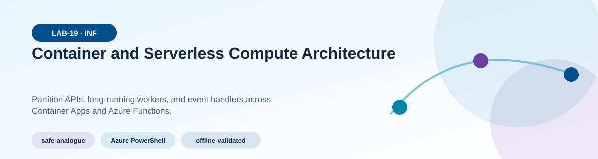
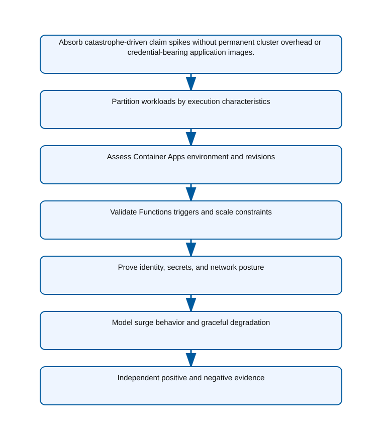
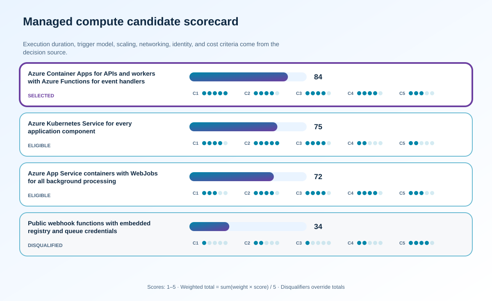

<!-- BEGIN GENERATED AZ305 V1 -->
# LAB-19 — Container and Serverless Compute Architecture



<div class="az305-badges" aria-label="Lab classification">
  <span class="az305-mode-badge">safe-analogue</span>
  <span class="az305-lane-badge">Azure PowerShell</span>
  <span class="az305-status">offline-validated</span>
</div>

## 1. Navigation

[← LAB-18](../18-compute-vm-batch-architecture/README.md) · [Lab catalog](../README.md) · [LAB-20 →](../20-messaging-events-api/README.md)

## 2. Scenario and completion contract

Lucerne Insurance is decomposing a claims application into an HTTP intake API, event-triggered document processors, and long-running risk-scoring workers. Traffic is quiet most of the day but spikes after severe weather, some jobs require custom containers, and no component should hold a cloud credential. The team is debating Kubernetes, managed container hosting, and functions without first separating latency, execution duration, scaling, networking, and operational-control requirements. The lab budget rules out a production-grade cluster, so learners will use Azure PowerShell to inspect a small analogue and produce a decision that assigns each workload to the simplest service that satisfies its constraints.

- Architect role: Cloud-native compute architect
- Outcome: Select a container and serverless architecture with explicit workload boundaries, scaling rules, identity, network controls, and operational tradeoffs.
- Duration: 150 minutes
- Difficulty: advanced
- Cost class: low
- Completion: all five checkpoint assertions, final validation, decision revision, and cleanup review are complete.

## 3. Objective-to-evidence map

| Objective | Requirement | Checkpoint |
| --- | --- | --- |
| `INF-COMP-03` | `LAB19-REQ-01` | [`LAB19-CP01`](#checkpoint-1) |
| `INF-COMP-04` | `LAB19-REQ-02` | [`LAB19-CP02`](#checkpoint-2) |
| `INF-COMP-03` | `LAB19-REQ-03` | [`LAB19-CP03`](#checkpoint-3) |
| `INF-COMP-04` | `LAB19-REQ-04` | [`LAB19-CP04`](#checkpoint-4) |
| `INF-COMP-03` | `LAB19-REQ-05` | [`LAB19-CP05`](#checkpoint-5) |

## 4. Business and quality requirements

Business outcome: Absorb catastrophe-driven claim spikes without permanent cluster overhead or credential-bearing application images.

- `LAB19-REQ-01` — Each component records trigger, latency, duration, state, concurrency, scaling, networking, portability, and operations requirements.
- `LAB19-REQ-02` — The design defines environment boundary, internal and external ingress, revision mode, Dapr need, workload profile, probes, and scale-to-zero behavior.
- `LAB19-REQ-03` — Trigger semantics, concurrency, timeout, cold-start tolerance, poison-message handling, idempotency, and hosting-plan constraints are explicit.
- `LAB19-REQ-04` — Every workload uses least-privilege managed identity, retrieves secrets at runtime, and has only the required ingress and egress paths.
- `LAB19-REQ-05` — The load model proves scale thresholds, downstream back-pressure, degraded-mode behavior, observability, and recovery from a failed revision.

Scenario facts:

- **Data:** Claim requests, documents, events, model artifacts, scoring outputs, and audit records have distinct retention and access needs.
- **Scale:** Catastrophe traffic is burst-driven and GPU demand lasts two hours; measured request rate and model throughput remain sizing inputs.
- **Latency:** Intake response and asynchronous risk-score completion have separate service objectives and scaling triggers.
- **Availability:** Durable messaging decouples API availability from temporary scorer or event-handler capacity loss.
- **RTO:** Worker recovery must preserve queued claims; the scenario does not assign a numerical platform RTO.
- **RPO:** Accepted intake events require durable storage before acknowledgment so scale-to-zero does not lose work.
- **Budget:** Serverless idle behavior is preserved for intake, while scarce GPU capacity is activated only for the catastrophe window.

Constraints:

- Claim intake must absorb catastrophe spikes without permanent cluster overhead or credentials in application images.
- GPU scoring is needed for two hours after an event while the intake API must still scale to zero overnight.
- Use only the Azure PowerShell command lane for learner implementation.
- Keep all live changes behind explicit execution and acknowledgement switches.
- Retain only sanitized command evidence and synthetic fixture identifiers.

Assumptions:

- API, event, and scoring components can be packaged independently and communicate through durable messaging.
- GPU quota and regional availability are verified before any production design is approved.
- West Europe is the configurable primary example and North Europe is the configurable secondary example.
- The learner has administrator-level Azure operations knowledge but receives no pre-existing authenticated context.
- Offline fixtures demonstrate contract behavior rather than live Azure service behavior.

## 5. Architecture diagram and walkthrough



HTTP APIs and long-running workers share a Container Apps environment while event handlers scale independently in Functions. The labelled nodes, boundaries, and edges are deterministically rendered from the portable `diagrams/architecture.mmd` source and the frozen visual registry.

## 6. Concept primer and candidate architectures

Architecture decisions translate measurable requirements into a deliberate service and operating model. A candidate is viable only when every mandatory constraint is met; convenience or familiarity cannot compensate for a disqualifier.

- **Azure Container Apps for APIs and workers with Azure Functions for event handlers** (eligible) — Container Apps and Functions provide event-driven independent scaling, managed identity, revision controls, and low idle consumption.
- **Azure Kubernetes Service for every application component** (eligible) — AKS handles specialized GPU node pools and complex scheduling but imposes cluster capacity and operations on every component.
- **Azure App Service containers with WebJobs for all background processing** (eligible) — App Service is familiar for APIs and background jobs, but GPU specialization and independent event scaling are a weaker fit.
- **Public webhook functions with embedded registry and queue credentials** (ineligible) — Direct public functions can start quickly but expose secret rotation and couple acceptance to downstream availability. Disqualifier: LAB19-REQ-04 requires managed identity, runtime secret retrieval, and only approved network paths.

## 7. Decision, ADR, and Well-Architected review

Criteria weights are C1 30, C2 25, C3 20, C4 15, and C5 10. Weighted totals use `sum(weight × score) / 5`.



| Candidate | Eligible | C1 | C2 | C3 | C4 | C5 | Weighted /100 |
| --- | ---: | ---: | ---: | ---: | ---: | ---: | ---: |
| Azure Container Apps for APIs and workers with Azure Functions for event handlers | yes | 5 | 4 | 4 | 4 | 3 | 84 |
| Azure Kubernetes Service for every application component | yes | 4 | 5 | 4 | 2 | 2 | 75 |
| Azure App Service containers with WebJobs for all background processing | yes | 3 | 4 | 4 | 4 | 3 | 72 |
| Public webhook functions with embedded registry and queue credentials | no | 1 | 2 | 1 | 2 | 4 | 34 |

Selected design: **Azure Container Apps for APIs and workers with Azure Functions for event handlers**. `ADR-LAB19-001` records the accepted reasoning. Review Reliability, Security, Cost Optimization, Operational Excellence, and Performance Efficiency in `design/decision.yml`; no pillar is implied by another.

Rejected alternatives:

- **Azure Kubernetes Service for every application component:** Universal AKS keeps an operational and cost baseline that conflicts with simple overnight scale-to-zero goals.
- **Azure App Service containers with WebJobs for all background processing:** Coupled plan capacity makes the short GPU burst and zero-idle API less efficient.
- **Public webhook functions with embedded registry and queue credentials:** It is ineligible because secretless durable intake is mandatory.

Architecture risks:

- **Risk:** GPU capacity may be unavailable when a catastrophe causes the burst. **Mitigation:** Validate quota and regions, define a CPU degraded mode, and queue work without rejecting accepted claims.
- **Risk:** Independent scaling can overwhelm a downstream claims database. **Mitigation:** Limit concurrency from observed database capacity and monitor queue age rather than scaling only on item count.

Well-Architected consequences:

<div class="az305-waf-grid">
<article class="az305-waf-card"><h3>Reliability</h3><p>Durable queues and independent component revisions keep intake available while scorers recover or scale.</p></article>
<article class="az305-waf-card"><h3>Security</h3><p>Managed identities, private registry access, and secret-free images reduce credential exposure.</p></article>
<article class="az305-waf-card"><h3>Cost Optimization</h3><p>Intake and handlers scale to zero while GPU capacity exists only for the bounded risk-scoring interval.</p></article>
<article class="az305-waf-card"><h3>Operational Excellence</h3><p>Revision, queue-age, retry, model, and dead-letter evidence separate deployment from workload failure.</p></article>
<article class="az305-waf-card"><h3>Performance Efficiency</h3><p>Each component scales on its own demand signal and specialized GPU workers do not dictate API capacity.</p></article>
</div>

ADR consequences:

- The scoring worker needs a separately validated GPU-capable workload profile or bounded specialized execution path.
- Intake acknowledges only durable messages and remains independent from model execution completion.

## 8. Inputs, permissions, licensing, cost, and analogue

Use configurable `Location` (`AZ305_LOCATION`, default West Europe) and `SecondaryLocation` (`AZ305_SECONDARY_LOCATION`, default North Europe). Every public input has an explicit `AZ305_*` fallback. Preview is the default; only Golden Lab 00 writes an intent-only `execute: false` preview record. Before an executed cloud command, the supplied subscription and tenant must exactly match the active CLI, Az, and—where applicable—Microsoft Graph contexts. `-Execute` crosses the execution boundary; cost-bearing and tenant-scoped paths also require their independent acknowledgement switches.

Safe analogue: Replay synthetic claims through local queue and scaling fixtures, including GPU-unavailable and downstream-throttle cases, without deploying compute.

Permissions: Container Apps, Functions, container registry, identity, logging, and quota read roles support assessment; environment or workload deployment requires separate contributor rights.

Licensing: Container Apps workload profiles, executions, Functions plans, GPU capacity, registry, logging, and networking have separate cost behavior.

Cost boundary: Attribute API requests, event-handler executions, worker CPU or GPU seconds, idle profile minimums, images, and observability ingestion.

## 9. Read-only preflight

```powershell
pwsh ./scripts/azure-powershell/Preflight.ps1 -RunId synthetic-190001
```

Synthetic sample: `{"labId":"LAB-19","track":"azure-powershell","result":"pass","note":"Local tool discovery only"}`. This is illustrative local output, not evidence captured from Azure.

## 10. Five guided checkpoints

<ol class="az305-checkpoint-timeline" aria-label="Five checkpoint learning path">
<li><a href="#checkpoint-1">Partition workloads by execution characteristics</a><span>LAB19-REQ-01 · LAB19-CP01</span></li>
<li><a href="#checkpoint-2">Assess Container Apps environment and revisions</a><span>LAB19-REQ-02 · LAB19-CP02</span></li>
<li><a href="#checkpoint-3">Validate Functions triggers and scale constraints</a><span>LAB19-REQ-03 · LAB19-CP03</span></li>
<li><a href="#checkpoint-4">Prove identity, secrets, and network posture</a><span>LAB19-REQ-04 · LAB19-CP04</span></li>
<li><a href="#checkpoint-5">Model surge behavior and graceful degradation</a><span>LAB19-REQ-05 · LAB19-CP05</span></li>
</ol>

### Checkpoint 1: Partition workloads by execution characteristics

<a id="checkpoint-1"></a>

**Trace:** `INF-COMP-03` → `LAB19-REQ-01` → `LAB19-CP01`

```powershell
Get-AzResource -ResourceGroupName $ResourceGroupName | Where-Object { $_.ResourceType -in @('Microsoft.App/containerApps','Microsoft.Web/sites') } | Select-Object Name, ResourceType, Location, Tags
```

Expected evidence: Each component records trigger, latency, duration, state, concurrency, scaling, networking, portability, and operations requirements. Retain Save the component matrix and requirement-to-service mapping with rejected alternatives.

Positive assertion:

```powershell
$compute = Get-AzResource -ResourceGroupName $ResourceGroupName | Where-Object { $_.ResourceType -in @('Microsoft.App/containerApps','Microsoft.Web/sites') }; if (-not $compute) { throw 'No container or serverless compute evidence was found.' }
```

Negative assertion:

```powershell
$unowned = Get-AzResource -ResourceGroupName $ResourceGroupName | Where-Object { $_.ResourceType -in @('Microsoft.App/containerApps','Microsoft.Web/sites') -and -not $_.Tags.owner }; if ($unowned) { throw 'A compute component has no owner tag.' }
```

Failure and retry: A hidden long-running or stateful task can exceed a serverless execution model or complicate scaling. Split the disputed component at a stable interface and rescore only affected candidates.

Cleanup dependency: Remove local matrices; discovery changes no cloud resource.

WAF consequence: Cost Optimization: workload partitioning avoids paying cluster overhead for bursty, event-driven tasks.

### Checkpoint 2: Assess Container Apps environment and revisions

<a id="checkpoint-2"></a>

**Trace:** `INF-COMP-04` → `LAB19-REQ-02` → `LAB19-CP02`

```powershell
Get-AzResource -ResourceGroupName $ResourceGroupName -ResourceType Microsoft.App/containerApps | Select-Object Name, Location, ResourceId, Tags
```

Expected evidence: The design defines environment boundary, internal and external ingress, revision mode, Dapr need, workload profile, probes, and scale-to-zero behavior. Retain Preserve the environment diagram, sanitized resource projection, revision and ingress decisions, and scaling calculation.

Positive assertion:

```powershell
$apps = Get-AzResource -ResourceGroupName $ResourceGroupName -ResourceType Microsoft.App/containerApps; if (-not $apps) { throw 'No Container Apps analogue was found.' }
```

Negative assertion:

```powershell
$apps = Get-AzResource -ResourceGroupName $ResourceGroupName -ResourceType Microsoft.App/containerApps; if ($apps | Where-Object { $_.Tags.expiresOn -lt (Get-Date).ToString('yyyy-MM-dd') }) { throw 'An expired Container App remains active.' }
```

Failure and retry: Incorrect environment or ingress boundaries can expose internal processors and prevent independent lifecycle control. Correct the topology fixture, validate the boundary again, and recalculate baseline replicas.

Cleanup dependency: Delete only run-owned analogue resources after exact tag and state checks; leave shared environments untouched.

WAF consequence: Security: explicit environment and ingress boundaries reduce unintended public exposure.

### Checkpoint 3: Validate Functions triggers and scale constraints

<a id="checkpoint-3"></a>

**Trace:** `INF-COMP-03` → `LAB19-REQ-03` → `LAB19-CP03`

```powershell
Get-AzFunctionApp -ResourceGroupName $ResourceGroupName | Select-Object Name, Location, Runtime, RuntimeVersion, PlanName, State
```

Expected evidence: Trigger semantics, concurrency, timeout, cold-start tolerance, poison-message handling, idempotency, and hosting-plan constraints are explicit. Retain Save trigger contracts, retry and poison-message examples, duration distribution, and hosting-plan rationale.

Positive assertion:

```powershell
$functions = Get-AzFunctionApp -ResourceGroupName $ResourceGroupName; if (-not ($functions | Where-Object { $_.State -eq 'Running' })) { throw 'No running Function App was found.' }
```

Negative assertion:

```powershell
$functions = Get-AzFunctionApp -ResourceGroupName $ResourceGroupName; if ($functions | Where-Object { $_.RuntimeVersion -match 'EOL|unsupported' }) { throw 'A Function App reports an unsupported runtime.' }
```

Failure and retry: Automatic scaling can amplify duplicate side effects or downstream pressure when trigger semantics are ignored. Add idempotency and bounded concurrency, then replay the failed synthetic messages.

Cleanup dependency: Remove run-owned messages and local evidence; do not delete shared Function Apps or storage.

WAF consequence: Performance Efficiency: bounded concurrency protects downstream systems while scaling event handling with demand.

### Checkpoint 4: Prove identity, secrets, and network posture

<a id="checkpoint-4"></a>

**Trace:** `INF-COMP-04` → `LAB19-REQ-04` → `LAB19-CP04`

```powershell
Get-AzResource -ResourceGroupName $ResourceGroupName | Where-Object { $_.ResourceType -in @('Microsoft.App/containerApps','Microsoft.Web/sites') } | ForEach-Object { Get-AzResource -ResourceId $_.ResourceId -ExpandProperties }
```

Expected evidence: Every workload uses least-privilege managed identity, retrieves secrets at runtime, and has only the required ingress and egress paths. Retain Preserve identity IDs, role-scope matrix, network-flow assertions, and a redacted secret-reference review.

Positive assertion:

```powershell
$resources = Get-AzResource -ResourceGroupName $ResourceGroupName | Where-Object { $_.ResourceType -in @('Microsoft.App/containerApps','Microsoft.Web/sites') }; if ($resources | Where-Object { -not (Get-AzResource -ResourceId $_.ResourceId -ExpandProperties).Identity }) { throw 'A compute component lacks managed identity.' }
```

Negative assertion:

```powershell
$expanded = Get-AzResource -ResourceGroupName $ResourceGroupName -ExpandProperties; if (($expanded.Properties | ConvertTo-Json -Depth 30) -match '(?i)password|connectionstring.{0,20}=') { throw 'A resource property appears to expose an inline credential.' }
```

Failure and retry: A sound compute choice can still create material compromise paths through broad identity or network access. Narrow identity scope and network paths in the safe analogue, then repeat each independent assertion.

Cleanup dependency: Remove only run-owned role assignments and analogue resources; never print or store resolved secrets.

WAF consequence: Operational Excellence: identity and network contracts remain observable and consistent across independently deployed revisions.

### Checkpoint 5: Model surge behavior and graceful degradation

<a id="checkpoint-5"></a>

**Trace:** `INF-COMP-03` → `LAB19-REQ-05` → `LAB19-CP05`

```powershell
Get-AzMetricDefinition -ResourceId $ContainerAppResourceId | Select-Object Name, Unit, PrimaryAggregationType
```

Expected evidence: The load model proves scale thresholds, downstream back-pressure, degraded-mode behavior, observability, and recovery from a failed revision. Retain Archive request rate, queue depth, replica trajectory, rejected work, latency percentiles, and recovery timing.

Positive assertion:

```powershell
$definitions = Get-AzMetricDefinition -ResourceId $ContainerAppResourceId; if (-not ($definitions | Where-Object { $_.Name.Value -match 'Request|Replica' })) { throw 'Required demand or replica metrics are unavailable.' }
```

Negative assertion:

```powershell
$alerts = Get-AzMetricAlertRuleV2 -ResourceGroupName $ResourceGroupName; if ($alerts | Where-Object { -not $_.Enabled -and $_.Scopes -contains $ContainerAppResourceId }) { throw 'A compute scaling alert is disabled.' }
```

Failure and retry: Scale-out lag or downstream saturation can violate the intake objective despite healthy compute metrics. Adjust bounded concurrency or queue thresholds and repeat the same synthetic demand profile.

Cleanup dependency: Delete synthetic claims and run-owned analogue resources after preserving sanitized results.

WAF consequence: Reliability: queues, health probes, and graceful degradation preserve accepted work during extreme demand.

## 11. Final validation and interpretation

Run `Validate.ps1 -Mode Deployment -Execute` only after an executed run has state and you are authorized to issue the ten read-only checkpoint inspections. Without `-Execute`, ordinary deployment validation records `partial` and exits `2`; Golden Lab 00 alone can validate its intent-only preview locally. Exit `0` means all required assertions pass, `1` means at least one failed, and `2` means the outcome is gated or partial. Positive and negative commands execute independently, so one failure never suppresses its paired assertion.

## 12. Material change request

The risk-scoring worker now needs GPU acceleration for two hours after a catastrophe, but the intake API must still scale to zero overnight.

Revised solution: select **Azure Container Apps for APIs and workers with Azure Functions for event handlers**. LAB19-REQ-05 requires both two-hour GPU scoring and overnight zero scale, so the selected design adds an approved GPU workload profile only for the scorer while intake remains event-driven.

Revised Well-Architected consequences:

- **Reliability:** Claims remain queued if GPU quota or model execution is temporarily unavailable.
- **Security:** The GPU worker uses managed identity and the same private artifact boundary.
- **Cost Optimization:** Expensive accelerators are active only for the measured catastrophe backlog.
- **Operational Excellence:** GPU availability and CPU degraded mode are explicit runbook decisions.
- **Performance Efficiency:** Queue age and model throughput independently control the specialized worker profile.

## 13. Architect job challenge

Repartition the architecture, compare GPU-capable options and their operational burden, and preserve the selected managed approach for components that do not require specialized compute.

## 14. Troubleshooting, cleanup, and residual verification

- If Az cmdlets do not expose a newly added Container Apps property, use Get-AzResource with expanded properties and record the API shape used.
- If scale evidence looks healthy while queue age rises, correlate demand, concurrency, and downstream throttling rather than raising replicas alone.
- If managed identity validation fails, distinguish identity absence from insufficient permission to read identity metadata.

Cleanup previews nonempty state in reverse dependency order, writes `partial`, and exits `2`; an already empty run is completed locally and idempotently. Executed cleanup rechecks the exact live ID plus `purpose`, `labId`, `runId`, and `expiresOn` immediately before each removal, persists state after every absent or removed object, stops on the first dependency failure, and refuses unresolved pre-existing settings. It never automates purge. Finish with `Validate.ps1 -Mode PostCleanup`; the required residual count is zero.

## 15. Exam debrief, assessment, sources, and navigation

Explain the recommendation in terms of requirements, rejected alternatives, failure behavior, and all five WAF pillars. Complete `assessment/QUESTIONS.md`, then use the separately excluded answer key for remediation.

- [Choose an Azure container service](https://learn.microsoft.com/en-us/azure/architecture/guide/choose-azure-container-service)
- [Azure Well-Architected Framework](https://learn.microsoft.com/en-us/azure/well-architected/)

[← LAB-18](../18-compute-vm-batch-architecture/README.md) · [Lab catalog](../README.md) · [LAB-20 →](../20-messaging-events-api/README.md)

## 16. Synchronized lifecycle-script appendix

### Preflight.ps1

```powershell
[CmdletBinding()]
param(
    [string]$SubscriptionId = $env:AZ305_SUBSCRIPTION_ID,
    [string]$TenantId = $env:AZ305_TENANT_ID,
    [ValidatePattern('^[a-z0-9-]{6,64}$')][string]$RunId = $env:AZ305_RUN_ID,
    [string]$Location = $(if ($env:AZ305_LOCATION) { $env:AZ305_LOCATION } else { 'westeurope' }),
    [string]$SecondaryLocation = $(if ($env:AZ305_SECONDARY_LOCATION) { $env:AZ305_SECONDARY_LOCATION } else { 'northeurope' }),
    [string]$ResourceGroup = $(if ($env:AZ305_RESOURCE_GROUP) { $env:AZ305_RESOURCE_GROUP } else { "rg-az305-$RunId" }),
    [string]$WorkloadName = $(if ($env:AZ305_WORKLOAD_NAME) { $env:AZ305_WORKLOAD_NAME } else { "az305-$RunId" }),
    [string]$ExpiresOn = $(if ($env:AZ305_EXPIRES_ON) { $env:AZ305_EXPIRES_ON } else { (Get-Date).ToUniversalTime().AddDays(1).ToString('yyyy-MM-dd') }),
    [string]$ContainerAppResourceId = $env:AZ305_CONTAINER_APP_RESOURCE_ID,
    [string]$ResourceGroupName = $env:AZ305_RESOURCE_GROUP_NAME,
    [switch]$Execute,
    [switch]$AcknowledgeCost,
    [switch]$AcknowledgeTenantChange
)

$ErrorActionPreference = 'Stop'
$PSNativeCommandUseErrorActionPreference = $true
if (-not $RunId) { [Console]::Error.WriteLine('RunId or AZ305_RUN_ID is required.'); exit 2 }
# Every lifecycle entrypoint intentionally exposes the same public parameter contract.
@($SubscriptionId, $TenantId, $RunId, $Location, $SecondaryLocation, $ResourceGroup, $WorkloadName, $ExpiresOn, $ContainerAppResourceId, $ResourceGroupName, $Execute, $AcknowledgeCost, $AcknowledgeTenantChange) | Out-Null

$requiredCommands = @('pwsh')
$missing = @($requiredCommands | Where-Object { -not (Get-Command $_ -ErrorAction SilentlyContinue) })
if ($missing.Count -gt 0) {
    Write-Error "Missing local commands: $($missing -join ', ')"
    exit 1
}
$requiredCmdlets = @('Get-AzFunctionApp', 'Get-AzMetricAlertRuleV2', 'Get-AzMetricDefinition', 'Get-AzResource')
$missingCmdlets = @($requiredCmdlets | Where-Object { -not (Get-Command $_ -ErrorAction SilentlyContinue) })
if ($missingCmdlets.Count -gt 0) {
    Write-Error "Missing local cmdlets: $($missingCmdlets -join ', ')"
    exit 1
}

[pscustomobject]@{
    labId = 'LAB-19'
    track = 'azure-powershell'
    implementationMode = 'safe-analogue'
    result = 'pass'
    note = 'Local tool discovery only; no Azure or Microsoft Graph request was made.'
} | ConvertTo-Json
exit 0
```

### Setup.ps1

```powershell
[CmdletBinding()]
param(
    [string]$SubscriptionId = $env:AZ305_SUBSCRIPTION_ID,
    [string]$TenantId = $env:AZ305_TENANT_ID,
    [ValidatePattern('^[a-z0-9-]{6,64}$')][string]$RunId = $env:AZ305_RUN_ID,
    [string]$Location = $(if ($env:AZ305_LOCATION) { $env:AZ305_LOCATION } else { 'westeurope' }),
    [string]$SecondaryLocation = $(if ($env:AZ305_SECONDARY_LOCATION) { $env:AZ305_SECONDARY_LOCATION } else { 'northeurope' }),
    [string]$ResourceGroup = $(if ($env:AZ305_RESOURCE_GROUP) { $env:AZ305_RESOURCE_GROUP } else { "rg-az305-$RunId" }),
    [string]$WorkloadName = $(if ($env:AZ305_WORKLOAD_NAME) { $env:AZ305_WORKLOAD_NAME } else { "az305-$RunId" }),
    [string]$ExpiresOn = $(if ($env:AZ305_EXPIRES_ON) { $env:AZ305_EXPIRES_ON } else { (Get-Date).ToUniversalTime().AddDays(1).ToString('yyyy-MM-dd') }),
    [string]$ContainerAppResourceId = $env:AZ305_CONTAINER_APP_RESOURCE_ID,
    [string]$ResourceGroupName = $env:AZ305_RESOURCE_GROUP_NAME,
    [switch]$Execute,
    [switch]$AcknowledgeCost,
    [switch]$AcknowledgeTenantChange
)

$ErrorActionPreference = 'Stop'
$PSNativeCommandUseErrorActionPreference = $true
if (-not $RunId) { [Console]::Error.WriteLine('RunId or AZ305_RUN_ID is required.'); exit 2 }
# Every lifecycle entrypoint intentionally exposes the same public parameter contract.
@($SubscriptionId, $TenantId, $RunId, $Location, $SecondaryLocation, $ResourceGroup, $WorkloadName, $ExpiresOn, $ContainerAppResourceId, $ResourceGroupName, $Execute, $AcknowledgeCost, $AcknowledgeTenantChange) | Out-Null

$LabRoot = Split-Path (Split-Path $PSScriptRoot -Parent) -Parent
$StateRoot = Join-Path $LabRoot ".state/$RunId"
$StatePath = Join-Path $StateRoot 'run.json'

function Assert-ExactExecutionContext {
    [CmdletBinding()]
    param([string]$ExpectedSubscriptionId, [string]$ExpectedTenantId)
    if ([string]::IsNullOrWhiteSpace($ExpectedSubscriptionId) -or [string]::IsNullOrWhiteSpace($ExpectedTenantId)) { throw 'SubscriptionId and TenantId are required before an Azure request.' }
    $azContext = Get-AzContext -ErrorAction Stop
    if (-not $azContext -or [string]$azContext.Subscription.Id -ine $ExpectedSubscriptionId -or [string]$azContext.Tenant.Id -ine $ExpectedTenantId) {
        throw 'The active Azure PowerShell subscription or tenant does not exactly match the requested context.'
    }
}

function Save-RunState {
    [CmdletBinding()]
    param([Parameter(Mandatory)]$State)
    $temporaryPath = "$StatePath.tmp"
    $State | ConvertTo-Json -Depth 20 | Set-Content -LiteralPath $temporaryPath -Encoding utf8NoBOM
    Move-Item -LiteralPath $temporaryPath -Destination $StatePath -Force
}

function Assert-SafeStateValue {
    [CmdletBinding()]
    param($Value)
    $serialized = $Value | ConvertTo-Json -Depth 12 -Compress
    if ($serialized -match '(?i)"(?:token|password|secret|certificate|connectionString|sas|clientSecret|accessToken|refreshToken|accountKey|privateKey)"\s*:') {
        throw 'A prohibited sensitive field name was returned; state capture is refused.'
    }
}

function Convert-CheckpointOutput {
    [CmdletBinding()]
    param($Value)
    if ($Value -is [string]) { $raw = [string]$Value }
    elseif ($Value -is [System.Collections.IEnumerable] -and @($Value | Where-Object { $_ -isnot [string] }).Count -eq 0) { $raw = @($Value) -join "`n" }
    else { return $Value }
    if ([string]::IsNullOrWhiteSpace($raw)) { return $null }
    try { return ($raw | ConvertFrom-Json -Depth 100) } catch { return $Value }
}

function Get-ReturnedResourceId {
    [CmdletBinding()]
    param($Value)
    $seen = [System.Collections.Generic.HashSet[string]]::new([System.StringComparer]::OrdinalIgnoreCase)
    $results = [System.Collections.Generic.List[string]]::new()
    function Add-ArmId {
        param($Candidate)
        if ($Candidate -is [string] -and $Candidate -match '^/subscriptions/[0-9a-f-]+/(?:resourceGroups/[^/]+(?:/providers/.+)?|providers/.+)$' -and $Candidate -notmatch '/providers/Microsoft\.Resources/deployments/') {
            if ($seen.Add($Candidate)) { $results.Add($Candidate) }
        }
    }
    function Find-DeploymentOutputId {
        param($Item, [int]$Depth)
        if ($null -eq $Item -or $Depth -gt 12) { return }
        if ($Item -is [string]) { Add-ArmId -Candidate $Item; return }
        if ($Item -is [System.Collections.IDictionary]) { foreach ($key in $Item.Keys) { Find-DeploymentOutputId -Item $Item[$key] -Depth ($Depth + 1) }; return }
        if ($Item -is [System.Collections.IEnumerable]) { foreach ($entry in $Item) { Find-DeploymentOutputId -Item $entry -Depth ($Depth + 1) }; return }
        foreach ($property in @($Item.PSObject.Properties | Where-Object { $_.MemberType -in @('NoteProperty', 'Property') })) { Find-DeploymentOutputId -Item $property.Value -Depth ($Depth + 1) }
    }
    foreach ($rootItem in @($Value)) {
        if ($rootItem -is [System.Collections.IDictionary]) {
            foreach ($name in @('id', 'resourceId')) { if ($rootItem.Contains($name)) { Add-ArmId -Candidate $rootItem[$name] } }
            if ($rootItem.Contains('properties') -and $rootItem.properties -and $rootItem.properties.outputs) { Find-DeploymentOutputId -Item $rootItem.properties.outputs -Depth 0 }
            continue
        }
        foreach ($name in @('Id', 'ResourceId')) {
            $property = $rootItem.PSObject.Properties[$name]
            if ($property) { Add-ArmId -Candidate $property.Value }
        }
        if ($rootItem.PSObject.Properties['Properties'] -and $rootItem.Properties -and $rootItem.Properties.outputs) {
            Find-DeploymentOutputId -Item $rootItem.Properties.outputs -Depth 0
        }
    }
    return @($results)
}

function Get-PlannedDeploymentResourceId {
    [CmdletBinding()]
    param($Value)
    $seen = [System.Collections.Generic.HashSet[string]]::new([System.StringComparer]::OrdinalIgnoreCase)
    $results = [System.Collections.Generic.List[string]]::new()
    foreach ($change in @($Value.changes)) {
        $candidate = [string]$change.resourceId
        if ($candidate -match '^/subscriptions/[0-9a-f-]+/(?:resourceGroups/[^/]+(?:/providers/.+)?|providers/.+)$' -and $candidate -notmatch '/providers/Microsoft\.Resources/deployments/' -and $seen.Add($candidate)) {
            $results.Add($candidate)
        }
    }
    return @($results)
}

function Assert-InputSubscriptionScope {
    [CmdletBinding()]
    param($Inputs, [string]$ExpectedSubscriptionId)
    $entries = if ($Inputs -is [System.Collections.IDictionary]) {
        @($Inputs.GetEnumerator())
    } else {
        @($Inputs.PSObject.Properties | ForEach-Object { [pscustomobject]@{ Key = $_.Name; Value = $_.Value } })
    }
    foreach ($entry in $entries) {
        if ($entry.Value -is [string] -and [string]$entry.Value -match '^/subscriptions/([^/]+)/') {
            if ($Matches[1] -ine $ExpectedSubscriptionId) { throw "Input $($entry.Key) belongs to a different subscription." }
        }
    }
}

function Assert-ManagedMutation {
    [CmdletBinding()]
    param($State, [string]$CheckpointId, [bool]$CarriesOwnership, [object[]]$TargetResourceIds)
    if ($CarriesOwnership) { return }
    $targets = @($TargetResourceIds | Where-Object { $_ -is [string] -and $_ -match '^/subscriptions/' })
    if ($targets.Count -eq 0) { throw "$CheckpointId refuses an untagged mutation because no exact ARM target ID was supplied." }
    $knownIds = @($State.managedObjects | ForEach-Object { [string]$_.id })
    if ($knownIds.Count -eq 0) { throw "$CheckpointId refuses to modify a pre-existing object because no run-owned parent has been recorded." }
    foreach ($target in $targets) {
        $related = @($knownIds | Where-Object { $target -ieq $_ -or $target.StartsWith("$_/", [System.StringComparison]::OrdinalIgnoreCase) -or $_.StartsWith("$target/", [System.StringComparison]::OrdinalIgnoreCase) }).Count -gt 0
        if (-not $related) { throw "$CheckpointId refuses a mutation outside the exact run-owned resource boundary." }
    }
}

$executionInputs = [ordered]@{ subscriptionId = $SubscriptionId; tenantId = $TenantId; location = $Location; secondaryLocation = $SecondaryLocation; resourceGroup = $ResourceGroup; workloadName = $WorkloadName; expiresOn = $ExpiresOn; ContainerAppResourceId = $ContainerAppResourceId; ResourceGroupName = $ResourceGroupName }

if (-not $Execute) {
    Write-Output '[preview] No cloud command was called and no state was created.'
    Write-Output '[preview] Re-run with -Execute only in an authorized disposable environment.'
    exit 0
}
# This setup is compatible with the lab implementation mode.
# This default exercise does not require a cost acknowledgement.
# This lab does not perform a tenant-scoped change by default.
$requiredLabInputs = [ordered]@{ ContainerAppResourceId = $ContainerAppResourceId; ResourceGroupName = $ResourceGroupName }
$missingLabInputs = @($requiredLabInputs.GetEnumerator() | Where-Object { $_.Value -is [string] -and [string]::IsNullOrWhiteSpace([string]$_.Value) } | ForEach-Object Key)
if ($missingLabInputs.Count -gt 0) { [Console]::Error.WriteLine("Execution is gated; supply: $($missingLabInputs -join ', ')."); exit 2 }

try {
    Assert-ExactExecutionContext -ExpectedSubscriptionId $SubscriptionId -ExpectedTenantId $TenantId
    Assert-InputSubscriptionScope -Inputs $executionInputs -ExpectedSubscriptionId $SubscriptionId
    Assert-SafeStateValue -Value $executionInputs
}
catch {
    [Console]::Error.WriteLine("Execution is gated by context or input validation: $($_.Exception.Message)")
    exit 2
}

# Recovery state is persisted before the first possible mutation below.
if (Test-Path -LiteralPath $StatePath) {
    [Console]::Error.WriteLine('Run state already exists. Choose a new RunId or complete the recorded cleanup; existing recovery state will not be overwritten.')
    exit 2
}
New-Item -ItemType Directory -Path $StateRoot -Force | Out-Null
$state = [ordered]@{
    schemaVersion = '1.0.0'; labId = 'LAB-19'; runId = $RunId; track = 'azure-powershell'
    implementationMode = 'safe-analogue'; status = 'initialized'
    createdAt = (Get-Date).ToUniversalTime().ToString('o'); execute = $true
    parameters = $executionInputs
    managedObjects = @(); originalSettings = @()
}
Save-RunState -State $state
$state.status = 'deploying'
Save-RunState -State $state

$originalLocation = Get-Location
try {
    Set-Location -LiteralPath $LabRoot
    # 19-CP01: Partition workloads by execution characteristics
    $stepResult = & { Get-AzResource -ResourceGroupName $ResourceGroupName | Where-Object { $_.ResourceType -in @('Microsoft.App/containerApps','Microsoft.Web/sites') } | Select-Object Name, ResourceType, Location, Tags }
    $null = $stepResult

    # 19-CP02: Assess Container Apps environment and revisions
    $stepResult = & { Get-AzResource -ResourceGroupName $ResourceGroupName -ResourceType Microsoft.App/containerApps | Select-Object Name, Location, ResourceId, Tags }
    $null = $stepResult

    # 19-CP03: Validate Functions triggers and scale constraints
    $stepResult = & { Get-AzFunctionApp -ResourceGroupName $ResourceGroupName | Select-Object Name, Location, Runtime, RuntimeVersion, PlanName, State }
    $null = $stepResult

    # 19-CP04: Prove identity, secrets, and network posture
    $stepResult = & { Get-AzResource -ResourceGroupName $ResourceGroupName | Where-Object { $_.ResourceType -in @('Microsoft.App/containerApps','Microsoft.Web/sites') } | ForEach-Object { Get-AzResource -ResourceId $_.ResourceId -ExpandProperties } }
    $null = $stepResult

    # 19-CP05: Model surge behavior and graceful degradation
    $stepResult = & { Get-AzMetricDefinition -ResourceId $ContainerAppResourceId | Select-Object Name, Unit, PrimaryAggregationType }
    $null = $stepResult

    $state.status = 'deployed'
    Save-RunState -State $state
} catch {
    $state.status = 'failed'
    Save-RunState -State $state
    Write-Error $_
    exit 1
} finally {
    Set-Location -LiteralPath $originalLocation
}
exit 0
```

### Validate.ps1

```powershell
[CmdletBinding()]
param(
    [string]$SubscriptionId = $env:AZ305_SUBSCRIPTION_ID,
    [string]$TenantId = $env:AZ305_TENANT_ID,
    [ValidatePattern('^[a-z0-9-]{6,64}$')][string]$RunId = $env:AZ305_RUN_ID,
    [string]$Location = $(if ($env:AZ305_LOCATION) { $env:AZ305_LOCATION } else { 'westeurope' }),
    [string]$SecondaryLocation = $(if ($env:AZ305_SECONDARY_LOCATION) { $env:AZ305_SECONDARY_LOCATION } else { 'northeurope' }),
    [string]$ResourceGroup = $(if ($env:AZ305_RESOURCE_GROUP) { $env:AZ305_RESOURCE_GROUP } else { "rg-az305-$RunId" }),
    [string]$WorkloadName = $(if ($env:AZ305_WORKLOAD_NAME) { $env:AZ305_WORKLOAD_NAME } else { "az305-$RunId" }),
    [string]$ExpiresOn = $(if ($env:AZ305_EXPIRES_ON) { $env:AZ305_EXPIRES_ON } else { (Get-Date).ToUniversalTime().AddDays(1).ToString('yyyy-MM-dd') }),
    [string]$ContainerAppResourceId = $env:AZ305_CONTAINER_APP_RESOURCE_ID,
    [string]$ResourceGroupName = $env:AZ305_RESOURCE_GROUP_NAME,
    [ValidateSet('Deployment', 'PostCleanup')][string]$Mode = 'Deployment',
    [switch]$Execute,
    [switch]$AcknowledgeCost,
    [switch]$AcknowledgeTenantChange
)

$ErrorActionPreference = 'Stop'
$PSNativeCommandUseErrorActionPreference = $true
if (-not $RunId) { [Console]::Error.WriteLine('RunId or AZ305_RUN_ID is required.'); exit 2 }
# Every lifecycle entrypoint intentionally exposes the same public parameter contract.
@($SubscriptionId, $TenantId, $RunId, $Location, $SecondaryLocation, $ResourceGroup, $WorkloadName, $ExpiresOn, $ContainerAppResourceId, $ResourceGroupName, $Mode, $Execute, $AcknowledgeCost, $AcknowledgeTenantChange) | Out-Null

$LabRoot = Split-Path (Split-Path $PSScriptRoot -Parent) -Parent
$StateRoot = Join-Path $LabRoot ".state/$RunId"
$RunPath = Join-Path $StateRoot 'run.json'
$ValidationPath = Join-Path $StateRoot 'validation.json'

function Assert-ExactExecutionContext {
    [CmdletBinding()]
    param([string]$ExpectedSubscriptionId, [string]$ExpectedTenantId)
    if ([string]::IsNullOrWhiteSpace($ExpectedSubscriptionId) -or [string]::IsNullOrWhiteSpace($ExpectedTenantId)) { throw 'SubscriptionId and TenantId are required before an Azure request.' }
    $azContext = Get-AzContext -ErrorAction Stop
    if (-not $azContext -or [string]$azContext.Subscription.Id -ine $ExpectedSubscriptionId -or [string]$azContext.Tenant.Id -ine $ExpectedTenantId) {
        throw 'The active Azure PowerShell subscription or tenant does not exactly match the requested context.'
    }
}


if (-not (Test-Path -LiteralPath $RunPath)) {
    Write-Warning 'No run state exists; validation is gated.'
    exit 2
}
$state = Get-Content -LiteralPath $RunPath -Raw | ConvertFrom-Json
$assertions = [System.Collections.Generic.List[object]]::new()
function Add-ValidationAssertion {
    [CmdletBinding()]
    param([string]$Id, [ValidateSet('positive', 'negative')][string]$Kind, [bool]$Passed, [string]$Message)
    $assertions.Add([pscustomobject]@{ id = $Id; kind = $Kind; passed = $Passed; message = $Message })
}

function Save-ValidationArtifact {
    [CmdletBinding()]
    param([ValidateSet('pass', 'partial', 'fail')][string]$Result)
    $artifact = [ordered]@{ schemaVersion = '1.0.0'; labId = 'LAB-19'; runId = $RunId; mode = $Mode; result = $Result; validatedAt = (Get-Date).ToUniversalTime().ToString('o'); assertions = @($assertions) }
    $artifact | ConvertTo-Json -Depth 12 | Set-Content -LiteralPath $ValidationPath -Encoding utf8NoBOM
}

function Test-PositiveEvidence {
    [CmdletBinding()]
    param($Value)
    if ($Value -is [bool]) { return $Value }
    if ($null -eq $Value) { return $false }
    if ($Value -is [string]) { return -not [string]::IsNullOrWhiteSpace($Value) }
    if ($Value -is [System.Collections.IEnumerable]) { return @($Value).Count -gt 0 }
    return $true
}

function Test-NegativeEvidence {
    [CmdletBinding()]
    param($Value)
    if ($Value -is [bool]) { return $Value }
    if ($null -eq $Value) { return $true }
    if ($Value -is [string]) { return [string]::IsNullOrWhiteSpace($Value) }
    if ($Value -is [System.Collections.IEnumerable]) { return @($Value).Count -eq 0 }
    $properties = @($Value.PSObject.Properties | Where-Object { $_.MemberType -in @('NoteProperty', 'Property') })
    if ($properties.Count -eq 0) { return $false }
    return @($properties | Where-Object { -not (Test-NegativeEvidence -Value $_.Value) }).Count -eq 0
}

function Test-ProhibitedStateField {
    [CmdletBinding()]
    param($Value)
    $serialized = $Value | ConvertTo-Json -Depth 20
    return $serialized -match '(?i)"(?:token|password|secret|certificate|connectionString|sas|clientSecret|accessToken|refreshToken|accountKey|privateKey)"\s*:'
}

function Assert-InputSubscriptionScope {
    [CmdletBinding()]
    param($Inputs, [string]$ExpectedSubscriptionId)
    $entries = if ($Inputs -is [System.Collections.IDictionary]) {
        @($Inputs.GetEnumerator())
    } else {
        @($Inputs.PSObject.Properties | ForEach-Object { [pscustomobject]@{ Key = $_.Name; Value = $_.Value } })
    }
    foreach ($entry in $entries) {
        if ($entry.Value -is [string] -and [string]$entry.Value -match '^/subscriptions/([^/]+)/' -and $Matches[1] -ine $ExpectedSubscriptionId) {
            throw "Input $($entry.Key) belongs to a different subscription."
        }
    }
}

$stateIdentityMatches = (
    $state.labId -ceq 'LAB-19' -and
    $state.runId -ceq $RunId -and
    $state.track -ceq 'azure-powershell' -and
    $state.implementationMode -ceq 'safe-analogue' -and
    ([string]$state.parameters.subscriptionId -ieq $SubscriptionId -and [string]$state.parameters.tenantId -ieq $TenantId)
)
Add-ValidationAssertion -Id 'LAB19-VAL-POS-01' -Kind positive -Passed $stateIdentityMatches -Message 'Run identity, implementation mode, command track, tenant, and subscription exactly match the copied lab and requested run.'
$hasSensitiveName = Test-ProhibitedStateField -Value $state
Add-ValidationAssertion -Id 'LAB19-VAL-NEG-01' -Kind negative -Passed (-not $hasSensitiveName) -Message 'State contains no prohibited sensitive field name.'

if ($Mode -eq 'PostCleanup') {
    $cleanupPath = Join-Path $StateRoot 'cleanup.json'
    $cleanup = if (Test-Path -LiteralPath $cleanupPath) { Get-Content -LiteralPath $cleanupPath -Raw | ConvertFrom-Json } else { $null }
    Add-ValidationAssertion -Id 'LAB19-VAL-POS-02' -Kind positive -Passed ($null -ne $cleanup -and $cleanup.labId -ceq 'LAB-19' -and $cleanup.runId -ceq $RunId -and $cleanup.result -eq 'pass' -and $cleanup.ownershipVerified) -Message 'The exact run cleanup completed with verified ownership.'
    Add-ValidationAssertion -Id 'LAB19-VAL-NEG-02' -Kind negative -Passed ($null -ne $cleanup -and $cleanup.activeManagedObjects -eq 0 -and @($state.managedObjects).Count -eq 0 -and @($state.originalSettings).Count -eq 0 -and $state.status -eq 'cleaned') -Message 'No active managed object or unresolved original setting remains in cleanup or run state.'
    $postCleanupPassed = @($assertions | Where-Object { -not $_.passed }).Count -eq 0
    Save-ValidationArtifact -Result $(if ($postCleanupPassed) { 'pass' } else { 'fail' })
    if ($postCleanupPassed) { exit 0 }
    exit 1
}

Add-ValidationAssertion -Id 'LAB19-VAL-POS-02' -Kind positive -Passed ($state.status -eq 'deployed') -Message 'The executed setup completed successfully; a failed setup can never validate as pass.'
Add-ValidationAssertion -Id 'LAB19-VAL-NEG-02' -Kind negative -Passed (@($state.managedObjects | Where-Object { $_.tags.purpose -ne 'az305-lab' -or $_.tags.labId -ne 'LAB-19' -or $_.tags.runId -ne $RunId }).Count -eq 0) -Message 'No recorded object has a foreign ownership tag.'

if (@($assertions | Where-Object { -not $_.passed }).Count -gt 0) {
    Save-ValidationArtifact -Result 'fail'
    exit 1
}
if (-not $Execute) {
    # This lab has no special intent-only validation path.
    Save-ValidationArtifact -Result 'partial'
    Write-Warning 'Checkpoint validation is gated; re-run with -Execute after confirming the exact read-only context.'
    exit 2
}
# The validation surface is compatible with this lab implementation mode.
$requiredValidationInputs = [ordered]@{ ContainerAppResourceId = $ContainerAppResourceId; ResourceGroupName = $ResourceGroupName }
$missingValidationInputs = @($requiredValidationInputs.GetEnumerator() | Where-Object { $_.Value -is [string] -and [string]::IsNullOrWhiteSpace([string]$_.Value) } | ForEach-Object Key)
if ($missingValidationInputs.Count -gt 0) {
    Add-ValidationAssertion -Id 'LAB19-VAL-POS-CONTEXT' -Kind positive -Passed $false -Message 'One or more required non-secret validation inputs are missing.'
    Save-ValidationArtifact -Result 'partial'
    exit 2
}
try {
    Assert-ExactExecutionContext -ExpectedSubscriptionId $SubscriptionId -ExpectedTenantId $TenantId
    Assert-InputSubscriptionScope -Inputs $state.parameters -ExpectedSubscriptionId $SubscriptionId
    Add-ValidationAssertion -Id 'LAB19-VAL-POS-CONTEXT' -Kind positive -Passed $true -Message 'The active tenant and subscription exactly match the requested validation context.'
}
catch {
    Add-ValidationAssertion -Id 'LAB19-VAL-POS-CONTEXT' -Kind positive -Passed $false -Message 'Exact execution context could not be proven.'
    Save-ValidationArtifact -Result 'partial'
    exit 2
}

$originalLocation = Get-Location
try {
    Set-Location -LiteralPath $LabRoot
# LAB19-CP01: run both polarities even when one fails.
$positivePassed = $false
try {
    $global:LASTEXITCODE = 0
    $positiveEvidence = & { $compute = Get-AzResource -ResourceGroupName $ResourceGroupName | Where-Object { $_.ResourceType -in @('Microsoft.App/containerApps','Microsoft.Web/sites') }; if (-not $compute) { throw 'No container or serverless compute evidence was found.' } }
    $positivePassed = $true
    $null = $positiveEvidence
} catch { $positivePassed = $false }
Add-ValidationAssertion -Id 'LAB19-CP01-POS' -Kind positive -Passed $positivePassed -Message 'Each component records trigger, latency, duration, state, concurrency, scaling, networking, portability, and operations requirements.'

$negativePassed = $false
try {
    $global:LASTEXITCODE = 0
    $negativeEvidence = & { $unowned = Get-AzResource -ResourceGroupName $ResourceGroupName | Where-Object { $_.ResourceType -in @('Microsoft.App/containerApps','Microsoft.Web/sites') -and -not $_.Tags.owner }; if ($unowned) { throw 'A compute component has no owner tag.' } }
    $negativePassed = $true
    $null = $negativeEvidence
} catch { $negativePassed = $false }
Add-ValidationAssertion -Id 'LAB19-CP01-NEG' -Kind negative -Passed $negativePassed -Message 'Selecting one service for every component without explaining mismatched execution constraints must fail.'

# LAB19-CP02: run both polarities even when one fails.
$positivePassed = $false
try {
    $global:LASTEXITCODE = 0
    $positiveEvidence = & { $apps = Get-AzResource -ResourceGroupName $ResourceGroupName -ResourceType Microsoft.App/containerApps; if (-not $apps) { throw 'No Container Apps analogue was found.' } }
    $positivePassed = $true
    $null = $positiveEvidence
} catch { $positivePassed = $false }
Add-ValidationAssertion -Id 'LAB19-CP02-POS' -Kind positive -Passed $positivePassed -Message 'The design defines environment boundary, internal and external ingress, revision mode, Dapr need, workload profile, probes, and scale-to-zero behavior.'

$negativePassed = $false
try {
    $global:LASTEXITCODE = 0
    $negativeEvidence = & { $apps = Get-AzResource -ResourceGroupName $ResourceGroupName -ResourceType Microsoft.App/containerApps; if ($apps | Where-Object { $_.Tags.expiresOn -lt (Get-Date).ToString('yyyy-MM-dd') }) { throw 'An expired Container App remains active.' } }
    $negativePassed = $true
    $null = $negativeEvidence
} catch { $negativePassed = $false }
Add-ValidationAssertion -Id 'LAB19-CP02-NEG' -Kind negative -Passed $negativePassed -Message 'Public ingress on an internal worker, missing health probes, or a minimum replica count that defeats cost assumptions must fail.'

# LAB19-CP03: run both polarities even when one fails.
$positivePassed = $false
try {
    $global:LASTEXITCODE = 0
    $positiveEvidence = & { $functions = Get-AzFunctionApp -ResourceGroupName $ResourceGroupName; if (-not ($functions | Where-Object { $_.State -eq 'Running' })) { throw 'No running Function App was found.' } }
    $positivePassed = $true
    $null = $positiveEvidence
} catch { $positivePassed = $false }
Add-ValidationAssertion -Id 'LAB19-CP03-POS' -Kind positive -Passed $positivePassed -Message 'Trigger semantics, concurrency, timeout, cold-start tolerance, poison-message handling, idempotency, and hosting-plan constraints are explicit.'

$negativePassed = $false
try {
    $global:LASTEXITCODE = 0
    $negativeEvidence = & { $functions = Get-AzFunctionApp -ResourceGroupName $ResourceGroupName; if ($functions | Where-Object { $_.RuntimeVersion -match 'EOL|unsupported' }) { throw 'A Function App reports an unsupported runtime.' } }
    $negativePassed = $true
    $null = $negativeEvidence
} catch { $negativePassed = $false }
Add-ValidationAssertion -Id 'LAB19-CP03-NEG' -Kind negative -Passed $negativePassed -Message 'An unbounded retry, non-idempotent handler, or duration beyond the selected hosting limit must fail.'

# LAB19-CP04: run both polarities even when one fails.
$positivePassed = $false
try {
    $global:LASTEXITCODE = 0
    $positiveEvidence = & { $resources = Get-AzResource -ResourceGroupName $ResourceGroupName | Where-Object { $_.ResourceType -in @('Microsoft.App/containerApps','Microsoft.Web/sites') }; if ($resources | Where-Object { -not (Get-AzResource -ResourceId $_.ResourceId -ExpandProperties).Identity }) { throw 'A compute component lacks managed identity.' } }
    $positivePassed = $true
    $null = $positiveEvidence
} catch { $positivePassed = $false }
Add-ValidationAssertion -Id 'LAB19-CP04-POS' -Kind positive -Passed $positivePassed -Message 'Every workload uses least-privilege managed identity, retrieves secrets at runtime, and has only the required ingress and egress paths.'

$negativePassed = $false
try {
    $global:LASTEXITCODE = 0
    $negativeEvidence = & { $expanded = Get-AzResource -ResourceGroupName $ResourceGroupName -ExpandProperties; if (($expanded.Properties | ConvertTo-Json -Depth 30) -match '(?i)password|connectionstring.{0,20}=') { throw 'A resource property appears to expose an inline credential.' } }
    $negativePassed = $true
    $null = $negativeEvidence
} catch { $negativePassed = $false }
Add-ValidationAssertion -Id 'LAB19-CP04-NEG' -Kind negative -Passed $negativePassed -Message 'Embedded credentials, owner-level role assignment, unrestricted administrative ingress, or undocumented egress must fail.'

# LAB19-CP05: run both polarities even when one fails.
$positivePassed = $false
try {
    $global:LASTEXITCODE = 0
    $positiveEvidence = & { $definitions = Get-AzMetricDefinition -ResourceId $ContainerAppResourceId; if (-not ($definitions | Where-Object { $_.Name.Value -match 'Request|Replica' })) { throw 'Required demand or replica metrics are unavailable.' } }
    $positivePassed = $true
    $null = $positiveEvidence
} catch { $positivePassed = $false }
Add-ValidationAssertion -Id 'LAB19-CP05-POS' -Kind positive -Passed $positivePassed -Message 'The load model proves scale thresholds, downstream back-pressure, degraded-mode behavior, observability, and recovery from a failed revision.'

$negativePassed = $false
try {
    $global:LASTEXITCODE = 0
    $negativeEvidence = & { $alerts = Get-AzMetricAlertRuleV2 -ResourceGroupName $ResourceGroupName; if ($alerts | Where-Object { -not $_.Enabled -and $_.Scopes -contains $ContainerAppResourceId }) { throw 'A compute scaling alert is disabled.' } }
    $negativePassed = $true
    $null = $negativeEvidence
} catch { $negativePassed = $false }
Add-ValidationAssertion -Id 'LAB19-CP05-NEG' -Kind negative -Passed $negativePassed -Message 'Meeting API latency while losing claims, overwhelming a dependency, or masking a failed revision must fail overall.'

}
finally {
    Set-Location -LiteralPath $originalLocation
}

$passed = @($assertions | Where-Object { -not $_.passed }).Count -eq 0
Save-ValidationArtifact -Result $(if ($passed) { 'pass' } else { 'fail' })
if ($passed) { exit 0 }
exit 1
```

### Cleanup.ps1

```powershell
[CmdletBinding()]
param(
    [string]$SubscriptionId = $env:AZ305_SUBSCRIPTION_ID,
    [string]$TenantId = $env:AZ305_TENANT_ID,
    [ValidatePattern('^[a-z0-9-]{6,64}$')][string]$RunId = $env:AZ305_RUN_ID,
    [string]$Location = $(if ($env:AZ305_LOCATION) { $env:AZ305_LOCATION } else { 'westeurope' }),
    [string]$SecondaryLocation = $(if ($env:AZ305_SECONDARY_LOCATION) { $env:AZ305_SECONDARY_LOCATION } else { 'northeurope' }),
    [string]$ResourceGroup = $(if ($env:AZ305_RESOURCE_GROUP) { $env:AZ305_RESOURCE_GROUP } else { "rg-az305-$RunId" }),
    [string]$WorkloadName = $(if ($env:AZ305_WORKLOAD_NAME) { $env:AZ305_WORKLOAD_NAME } else { "az305-$RunId" }),
    [string]$ExpiresOn = $(if ($env:AZ305_EXPIRES_ON) { $env:AZ305_EXPIRES_ON } else { (Get-Date).ToUniversalTime().AddDays(1).ToString('yyyy-MM-dd') }),
    [string]$ContainerAppResourceId = $env:AZ305_CONTAINER_APP_RESOURCE_ID,
    [string]$ResourceGroupName = $env:AZ305_RESOURCE_GROUP_NAME,
    [switch]$Execute,
    [switch]$AcknowledgeCost,
    [switch]$AcknowledgeTenantChange
)

$ErrorActionPreference = 'Stop'
$PSNativeCommandUseErrorActionPreference = $true
if (-not $RunId) { [Console]::Error.WriteLine('RunId or AZ305_RUN_ID is required.'); exit 2 }
# Every lifecycle entrypoint intentionally exposes the same public parameter contract.
@($SubscriptionId, $TenantId, $RunId, $Location, $SecondaryLocation, $ResourceGroup, $WorkloadName, $ExpiresOn, $ContainerAppResourceId, $ResourceGroupName, $Execute, $AcknowledgeCost, $AcknowledgeTenantChange) | Out-Null

$LabRoot = Split-Path (Split-Path $PSScriptRoot -Parent) -Parent
$StateRoot = Join-Path $LabRoot ".state/$RunId"
$RunPath = Join-Path $StateRoot 'run.json'
$CleanupPath = Join-Path $StateRoot 'cleanup.json'

function Assert-ExactExecutionContext {
    [CmdletBinding()]
    param([string]$ExpectedSubscriptionId, [string]$ExpectedTenantId)
    if ([string]::IsNullOrWhiteSpace($ExpectedSubscriptionId) -or [string]::IsNullOrWhiteSpace($ExpectedTenantId)) { throw 'SubscriptionId and TenantId are required before an Azure request.' }
    $azContext = Get-AzContext -ErrorAction Stop
    if (-not $azContext -or [string]$azContext.Subscription.Id -ine $ExpectedSubscriptionId -or [string]$azContext.Tenant.Id -ine $ExpectedTenantId) {
        throw 'The active Azure PowerShell subscription or tenant does not exactly match the requested context.'
    }
}


function Save-RunState {
    [CmdletBinding()]
    param([Parameter(Mandatory)]$State)
    $temporaryPath = "$RunPath.tmp"
    $State | ConvertTo-Json -Depth 20 | Set-Content -LiteralPath $temporaryPath -Encoding utf8NoBOM
    Move-Item -LiteralPath $temporaryPath -Destination $RunPath -Force
}

function Save-CleanupArtifact {
    [CmdletBinding()]
    param(
        [ValidateSet('pass', 'partial', 'fail')][string]$Result,
        [bool]$OwnershipVerified
    )
    $artifact = [ordered]@{
        schemaVersion = '1.0.0'; labId = 'LAB-19'; runId = $RunId; result = $Result
        completedAt = (Get-Date).ToUniversalTime().ToString('o'); ownershipVerified = $OwnershipVerified
        activeManagedObjects = @($state.managedObjects).Count; actions = @($actions)
    }
    $temporaryPath = "$CleanupPath.tmp"
    $artifact | ConvertTo-Json -Depth 12 | Set-Content -LiteralPath $temporaryPath -Encoding utf8NoBOM
    Move-Item -LiteralPath $temporaryPath -Destination $CleanupPath -Force
}

function Assert-ExactLiveOwnership {
    [CmdletBinding()]
    param($Tags, $Managed)
    if ($null -eq $Tags) { throw 'Live resource has no ownership tags.' }
    $valid = (
        [string]$Tags.purpose -ceq 'az305-lab' -and
        [string]$Tags.labId -ceq 'LAB-19' -and
        [string]$Tags.runId -ceq $RunId -and
        [string]$Tags.expiresOn -ceq [string]$Managed.tags.expiresOn
    )
    if (-not $valid) { throw 'Live ownership tags do not exactly match run state.' }
}

function Complete-ManagedObject {
    [CmdletBinding()]
    param([Parameter(Mandatory)][string]$ManagedId, [ValidateSet('removed', 'absent')][string]$Result)
    $state.managedObjects = @($state.managedObjects | Where-Object { [string]$_.id -ine $ManagedId })
    # Settings for a deleted run-owned object or its descendants no longer need restoration.
    $state.originalSettings = @($state.originalSettings | Where-Object {
        $settingId = [string]$_.id
        -not ($settingId -ieq $ManagedId -or $settingId.StartsWith("$ManagedId/", [System.StringComparison]::OrdinalIgnoreCase))
    })
    Save-RunState -State $state
    $actions.Add([pscustomobject]@{ id = $ManagedId; result = $Result })
}

if (-not (Test-Path -LiteralPath $RunPath)) { Write-Warning 'No run state exists; cleanup is gated.'; exit 2 }
try { $state = Get-Content -LiteralPath $RunPath -Raw | ConvertFrom-Json -Depth 100 }
catch { [Console]::Error.WriteLine('Cleanup refused because run state is not valid JSON.'); exit 1 }
$actions = [System.Collections.Generic.List[object]]::new()
$identityValid = (
    $state.labId -ceq 'LAB-19' -and
    $state.runId -ceq $RunId -and
    $state.track -ceq 'azure-powershell' -and
    $state.implementationMode -ceq 'safe-analogue'
)
if (-not $identityValid) {
    $actions.Add([pscustomobject]@{ id = 'identity-check'; result = 'refused' })
    Save-CleanupArtifact -Result fail -OwnershipVerified $false
    [Console]::Error.WriteLine('Cleanup refused because the lab, run, track, mode, tenant, or subscription does not exactly match run state.')
    exit 1
}

if (@($state.managedObjects).Count -gt 0 -and (
    [string]::IsNullOrWhiteSpace($SubscriptionId) -or
    [string]::IsNullOrWhiteSpace($TenantId) -or
    [string]$state.parameters.subscriptionId -ine $SubscriptionId -or
    [string]$state.parameters.tenantId -ine $TenantId
)) {
    $actions.Add([pscustomobject]@{ id = 'context-record'; result = 'refused' })
    Save-CleanupArtifact -Result fail -OwnershipVerified $false
    [Console]::Error.WriteLine('Cleanup refused because the requested tenant and subscription do not exactly match run state.')
    exit 1
}

$ownershipValid = $true
foreach ($managed in @($state.managedObjects)) {
    $valid = (
        $managed.id -and
        [string]$managed.id -match '^/subscriptions/([^/]+)/' -and
        $Matches[1] -ieq $SubscriptionId -and
        [string]$managed.tags.purpose -ceq 'az305-lab' -and
        [string]$managed.tags.labId -ceq 'LAB-19' -and
        [string]$managed.tags.runId -ceq $RunId -and
        -not [string]::IsNullOrWhiteSpace([string]$managed.tags.expiresOn) -and
        [string]$managed.tags.expiresOn -ceq [string]$state.parameters.expiresOn
    )
    if (-not $valid) { $ownershipValid = $false }
}
if (-not $ownershipValid) {
    $actions.Add([pscustomobject]@{ id = 'ownership-check'; result = 'refused' })
    Save-CleanupArtifact -Result fail -OwnershipVerified $false
    [Console]::Error.WriteLine('Cleanup refused because recorded IDs and ownership tags could not be proven exactly.')
    exit 1
}

if (@($state.managedObjects).Count -eq 0 -and @($state.originalSettings).Count -gt 0) {
    $state.status = 'failed'
    Save-RunState -State $state
    $actions.Add([pscustomobject]@{ id = 'original-settings'; result = 'refused' })
    Save-CleanupArtifact -Result fail -OwnershipVerified $false
    [Console]::Error.WriteLine('Cleanup refused because original settings remain without a run-owned object whose deletion can safely restore the boundary.')
    exit 1
}

# This implementation mode may clean only exact run-owned cloud objects.

$orderedObjects = @($state.managedObjects)
[array]::Reverse($orderedObjects)
if (@($state.managedObjects).Count -eq 0) {
    $state.status = 'cleaned'
    Save-RunState -State $state
    Save-CleanupArtifact -Result pass -OwnershipVerified $true
    exit 0
}

if (-not $Execute) {
    foreach ($managed in $orderedObjects) { $actions.Add([pscustomobject]@{ id = $managed.id; result = 'planned' }) }
    Save-CleanupArtifact -Result partial -OwnershipVerified $true
    Write-Output '[preview] Dependency-aware cleanup plan written; no cloud command was called.'
    exit 2
}

try {
    Assert-ExactExecutionContext -ExpectedSubscriptionId $SubscriptionId -ExpectedTenantId $TenantId
}
catch {
    $actions.Add([pscustomobject]@{ id = 'context-check'; result = 'refused' })
    Save-CleanupArtifact -Result partial -OwnershipVerified $false
    [Console]::Error.WriteLine("Cleanup is gated by exact context validation: $($_.Exception.Message)")
    exit 2
}

# Persist the cleanup transition before the first possible delete.
$state.status = 'cleaning'
Save-RunState -State $state
$cleanupFailed = $false
foreach ($managed in $orderedObjects) {
    try {
        # State is necessary but not sufficient: inspect the exact live ID and tags immediately before removal.
        $liveResource = $null
        try { $liveResource = Get-AzResource -ResourceId $managed.id -ErrorAction Stop }
        catch {
            $lookupError = "$($_.FullyQualifiedErrorId) $($_.Exception.Message)"
            if ($lookupError -match '(?i)\b(?:ResourceNotFound|ResourceGroupNotFound|could not be found|was not found)\b') {
                Complete-ManagedObject -ManagedId $managed.id -Result absent
                continue
            }
            throw
        }
        if ($null -eq $liveResource) {
            Complete-ManagedObject -ManagedId $managed.id -Result absent
            continue
        }
        if ([string]$liveResource.ResourceId -ine [string]$managed.id) { throw 'Live resource ID does not exactly match run state.' }
        Assert-ExactLiveOwnership -Tags $liveResource.Tags -Managed $managed
        Remove-AzResource -ResourceId $managed.id -Force -ErrorAction Stop | Out-Null
        Complete-ManagedObject -ManagedId $managed.id -Result removed
    } catch {
        $actions.Add([pscustomobject]@{ id = $managed.id; result = 'failed' })
        $cleanupFailed = $true
        break
    }
}
if ($cleanupFailed -or @($state.managedObjects).Count -gt 0 -or @($state.originalSettings).Count -gt 0) {
    $state.status = 'failed'
    Save-RunState -State $state
    Save-CleanupArtifact -Result partial -OwnershipVerified $false
    exit 1
}
$state.status = 'cleaned'
Save-RunState -State $state
Save-CleanupArtifact -Result pass -OwnershipVerified $true
exit 0
```
<!-- END GENERATED AZ305 V1 -->
