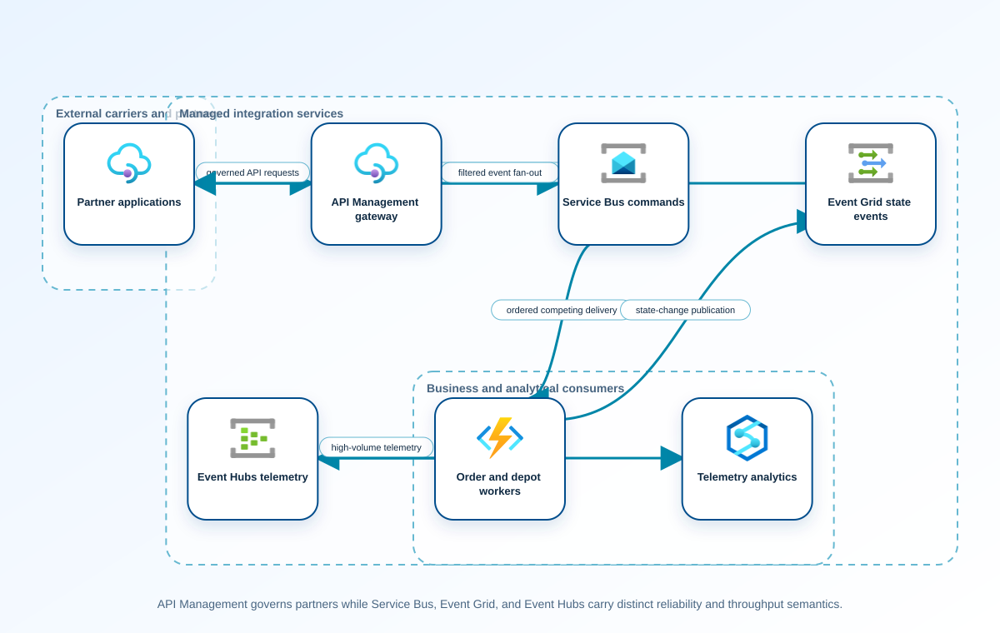

<!-- BEGIN GENERATED AZ305 V1 -->
# LAB-20 — Messaging, Event-Driven, and API Integration Architecture

## 1. Navigation

[← LAB-19](../19-container-serverless-architecture/README.md) · [Lab catalog](../README.md) · [LAB-21 →](../21-cache-configuration-delivery/README.md)

## 2. Scenario and completion contract

Alpine Logistics is replacing synchronous point-to-point calls between order intake, depot systems, route optimization, customer notifications, and external carriers. Orders require durable, ordered processing for each shipment; telemetry is a high-volume stream; status changes should fan out to unknown future subscribers; and partner APIs need authentication, quotas, versioning, and transformation. A previous proposal placed every interaction on one event service and ignored delivery semantics. The architecture team needs a deployable reference that assigns commands, events, streams, and API traffic to suitable Azure services, then validates duplicate handling, dead lettering, replay, filtering, and consumer isolation without confusing service availability with end-to-end business success.

- Architect role: Integration solutions architect
- Outcome: Design and validate a composed integration platform using service-specific delivery semantics, governed APIs, and observable failure handling.
- Duration: 180 minutes
- Difficulty: advanced
- Cost class: moderate
- Completion: all five checkpoint assertions, final validation, decision revision, and cleanup review are complete.

## 3. Objective-to-evidence map

| Objective | Requirement | Checkpoint |
| --- | --- | --- |
| `INF-APP-01` | `LAB20-REQ-01` | [`LAB20-CP01`](#checkpoint-1) |
| `INF-APP-02` | `LAB20-REQ-02` | [`LAB20-CP02`](#checkpoint-2) |
| `INF-APP-03` | `LAB20-REQ-03` | [`LAB20-CP03`](#checkpoint-3) |
| `INF-APP-01` | `LAB20-REQ-04` | [`LAB20-CP04`](#checkpoint-4) |
| `INF-APP-02` | `LAB20-REQ-05` | [`LAB20-CP05`](#checkpoint-5) |

## 4. Business and quality requirements

Business outcome: Decouple depot and partner changes while ensuring accepted shipments are processed once effectively and status events reach authorized consumers.

- `LAB20-REQ-01` — Every interaction records producer, consumer, temporal coupling, ordering, throughput, replay, fan-out, latency, and delivery requirements.
- `LAB20-REQ-02` — Commands use sessions where ordering is required, bounded delivery attempts, duplicate detection, idempotent handlers, and a governed dead-letter workflow.
- `LAB20-REQ-03` — State events use filtered fan-out, telemetry uses partitioned streams and separate consumer groups, and replay ownership is documented.
- `LAB20-REQ-04` — The API contract defines authentication, authorization, quota, rate limit, schema validation, versioning, transformation, correlation, and safe backend retry.
- `LAB20-REQ-05` — A correlated synthetic shipment crosses the API, command, state-event, and telemetry paths with bounded retries and observable business completion.

Scenario facts:

- **Data:** Shipment commands, state-change events, high-volume telemetry, partner requests, and dead letters require distinct delivery semantics.
- **Scale:** Telemetry increases tenfold at peak while command volume follows shipments; measured events per second remain a capacity input.
- **Latency:** Partner command acknowledgement and status-event delivery have service objectives separate from telemetry ingestion delay.
- **Availability:** Durable commands survive processor interruption and subscriptions isolate a failed status consumer from other recipients.
- **RTO:** Integration recovery depends on backlog age and consumer capacity; no numerical platform RTO is supplied.
- **RPO:** Accepted commands require durable settlement and idempotency so broker or consumer retry does not lose or double-apply shipment state.
- **Budget:** Each message class uses the least expensive service that supplies its required ordering, routing, replay, and partner controls.

Constraints:

- Accepted shipments must be processed once effectively and status events reach only authorized consumers.
- Commands for each shipment must remain ordered while peak-season telemetry grows tenfold.
- Use only the Azure CLI command lane for learner implementation.
- Keep all live changes behind explicit execution and acknowledgement switches.
- Retain only sanitized command evidence and synthetic fixture identifiers.

Assumptions:

- Shipment identifiers are stable session keys and consumers implement idempotent state transitions.
- Telemetry is analytically consumed and does not require per-message transactional command settlement.
- West Europe is the configurable primary example and North Europe is the configurable secondary example.
- The learner has administrator-level Azure operations knowledge but receives no pre-existing authenticated context.
- Offline fixtures demonstrate contract behavior rather than live Azure service behavior.

## 5. Architecture diagram and walkthrough



The flow begins with the business outcome, crosses five independently validated design capabilities, and ends with positive and negative evidence. The SVG is deterministically rendered from `diagrams/architecture.mmd`.

## 6. Concept primer and candidate architectures

Architecture decisions translate measurable requirements into a deliberate service and operating model. A candidate is viable only when every mandatory constraint is met; convenience or familiarity cannot compensate for a disqualifier.

- **Service Bus for commands, Event Grid for state events, Event Hubs for telemetry, and API Management for partners** (eligible) — Purpose-specific services map ordered commands, routed events, high-throughput telemetry, and governed partner APIs to their native semantics.
- **Event Hubs as the transport for all commands, events, telemetry, and partner requests** (eligible) — One event log scales well, but command settlement, session ordering, request policy, and per-consumer routing move into application code.
- **Storage queues and direct partner webhooks with application-owned routing** (eligible) — Storage queues are economical, but session ordering, event fan-out, authorization, and webhook retry become bespoke responsibilities.
- **Synchronous depot-to-carrier call chain with no durable broker** (ineligible) — Direct calls minimize components but couple depot acceptance to every carrier and processing dependency. Disqualifier: LAB20-REQ-02 requires accepted commands to remain durable and ordered through downstream interruption.

## 7. Decision, ADR, and Well-Architected review

Criteria weights are C1 30, C2 25, C3 20, C4 15, and C5 10. Weighted totals use `sum(weight × score) / 5`.

| Candidate | Eligible | C1 | C2 | C3 | C4 | C5 | Weighted /100 |
| --- | ---: | ---: | ---: | ---: | ---: | ---: | ---: |
| Service Bus for commands, Event Grid for state events, Event Hubs for telemetry, and API Management for partners | yes | 5 | 5 | 4 | 5 | 4 | 94 |
| Event Hubs as the transport for all commands, events, telemetry, and partner requests | yes | 3 | 3 | 3 | 3 | 4 | 62 |
| Storage queues and direct partner webhooks with application-owned routing | yes | 3 | 3 | 2 | 2 | 5 | 57 |
| Synchronous depot-to-carrier call chain with no durable broker | no | 1 | 1 | 2 | 2 | 4 | 33 |

Selected design: **Service Bus for commands, Event Grid for state events, Event Hubs for telemetry, and API Management for partners**. `ADR-LAB20-001` records the accepted reasoning. Review Reliability, Security, Cost Optimization, Operational Excellence, and Performance Efficiency in `design/decision.yml`; no pillar is implied by another.

Rejected alternatives:

- **Event Hubs as the transport for all commands, events, telemetry, and partner requests:** Uniform transport simplifies inventory at the cost of weak command and partner semantics.
- **Storage queues and direct partner webhooks with application-owned routing:** Custom routing and direct partner exposure produce the weakest security and operating fit.
- **Synchronous depot-to-carrier call chain with no durable broker:** It is ineligible because a downstream outage can lose or reject an accepted shipment command.

Architecture risks:

- **Risk:** A shipment session can block behind one poison command and delay all later updates for that shipment. **Mitigation:** Bound delivery attempts, dead-letter with full correlation, and require an idempotent repair and replay procedure.
- **Risk:** Tenfold telemetry can consume shared namespace or network capacity needed by commands. **Mitigation:** Isolate telemetry units and quotas from Service Bus, then load-test each path independently.

Well-Architected consequences:

- **Reliability:** Durable sessions, dead letters, isolated subscriptions, and idempotent consumers preserve shipment processing.
- **Security:** APIM policy, managed identities, and recipient-specific subscriptions constrain partner and event access.
- **Cost Optimization:** Broker features and capacity are purchased per message class instead of overengineering telemetry or commands.
- **Operational Excellence:** Correlation IDs join API acceptance, command settlement, state events, telemetry, and repair actions.
- **Performance Efficiency:** Event Hubs absorbs tenfold telemetry while Service Bus session capacity scales on ordered shipment demand.

ADR consequences:

- Teams must own four intentional service contracts rather than treating every payload as a generic event.
- Shipment consumers become responsible for idempotency and poison-session repair evidence.

## 8. Inputs, permissions, licensing, cost, and analogue

Use configurable `Location` (`AZ305_LOCATION`, default West Europe) and `SecondaryLocation` (`AZ305_SECONDARY_LOCATION`, default North Europe). Every public input has an explicit `AZ305_*` fallback. Preview is the default; only Golden Lab 00 writes an intent-only `execute: false` preview record. Before an executed cloud command, the supplied subscription and tenant must exactly match the active CLI, Az, and—where applicable—Microsoft Graph contexts. `-Execute` crosses the execution boundary; cost-bearing and tenant-scoped paths also require their independent acknowledgement switches.

Safe analogue: The reference topology is deployable at bounded scope; preview remains the default and live verification is separate.

Permissions: Service Bus, Event Grid, Event Hubs, API Management, identity, and monitoring read roles support discovery; namespace, route, policy, or API changes require separate authorization.

Licensing: Messaging tiers, throughput or processing units, brokered connections, API Management capacity, retention, capture, and networking affect cost.

Cost boundary: Attribute command operations, topic subscriptions, telemetry ingress, retained events, APIM units, retries, and dead-letter processing.

## 9. Read-only preflight

```powershell
pwsh ./scripts/azure-cli/Preflight.ps1 -RunId synthetic-200001
```

Synthetic sample: `{"labId":"LAB-20","track":"azure-cli","result":"pass","note":"Local tool discovery only"}`. This is illustrative local output, not evidence captured from Azure.

## 10. Five guided checkpoints

### Checkpoint 1: Classify every interaction contract

<a id="checkpoint-1"></a>

**Trace:** `INF-APP-01` → `LAB20-REQ-01` → `LAB20-CP01`

```powershell
az resource list --resource-group $ResourceGroupName --query "[?type=='Microsoft.ServiceBus/namespaces' || type=='Microsoft.EventHub/namespaces' || type=='Microsoft.EventGrid/topics' || type=='Microsoft.ApiManagement/service'].{name:name,type:type,location:location}" --output table --only-show-errors
```

Expected evidence: Every interaction records producer, consumer, temporal coupling, ordering, throughput, replay, fan-out, latency, and delivery requirements. Retain Save the interaction catalog, semantic classification, and service-selection matrix.

Positive assertion:

```powershell
$services = az resource list --resource-group $ResourceGroupName --query "[?starts_with(type,'Microsoft.ServiceBus') || starts_with(type,'Microsoft.EventHub') || starts_with(type,'Microsoft.EventGrid') || starts_with(type,'Microsoft.ApiManagement')]" --output json --only-show-errors | ConvertFrom-Json; if ($services.Count -lt 3) { throw 'The composed integration platform is incomplete.' }
```

Negative assertion:

```powershell
$untagged = az resource list --resource-group $ResourceGroupName --query "[?(starts_with(type,'Microsoft.ServiceBus') || starts_with(type,'Microsoft.EventHub') || starts_with(type,'Microsoft.EventGrid') || starts_with(type,'Microsoft.ApiManagement')) && !tags.owner]" --output json --only-show-errors | ConvertFrom-Json; if ($untagged.Count -gt 0) { throw 'An integration service has no owner.' }
```

Failure and retry: Misclassified interactions create brittle retries, lost ordering, or unnecessary coupling. Reclassify the disputed contract with producer and consumer owners, then rescore the candidates.

Cleanup dependency: Remove local catalog exports; discovery changes no service.

WAF consequence: Operational Excellence: explicit contracts make ownership and incident diagnosis clear across service boundaries.

### Checkpoint 2: Validate durable command processing

<a id="checkpoint-2"></a>

**Trace:** `INF-APP-02` → `LAB20-REQ-02` → `LAB20-CP02`

```powershell
az servicebus queue show --resource-group $ResourceGroupName --namespace-name $ServiceBusNamespace --name $CommandQueueName --query "{status:status,lockDuration:lockDuration,maxDeliveryCount:maxDeliveryCount,deadLetteringOnMessageExpiration:deadLetteringOnMessageExpiration,duplicateDetection:requiresDuplicateDetection}" --output json --only-show-errors
```

Expected evidence: Commands use sessions where ordering is required, bounded delivery attempts, duplicate detection, idempotent handlers, and a governed dead-letter workflow. Retain Preserve sanitized message IDs, session ordering, retry counts, dead-letter reason, and handler outcome.

Positive assertion:

```powershell
$queue = az servicebus queue show --resource-group $ResourceGroupName --namespace-name $ServiceBusNamespace --name $CommandQueueName --output json --only-show-errors | ConvertFrom-Json; if ($queue.status -ne 'Active' -or $queue.maxDeliveryCount -lt 3) { throw 'The command queue is not active or has insufficient retry allowance.' }
```

Negative assertion:

```powershell
$queue = az servicebus queue show --resource-group $ResourceGroupName --namespace-name $ServiceBusNamespace --name $CommandQueueName --output json --only-show-errors | ConvertFrom-Json; if (-not $queue.requiresDuplicateDetection -or -not $queue.deadLetteringOnMessageExpiration) { throw 'Duplicate detection or dead lettering is disabled.' }
```

Failure and retry: At-least-once delivery can create duplicate business effects despite a healthy queue. Correct the idempotency record or session key and replay only the quarantined synthetic message.

Cleanup dependency: Purge only run-owned synthetic messages through the documented test receiver; never purge a shared entity.

WAF consequence: Reliability: sessions, dead lettering, and idempotency protect accepted commands through transient failure.

### Checkpoint 3: Prove event fan-out and telemetry separation

<a id="checkpoint-3"></a>

**Trace:** `INF-APP-03` → `LAB20-REQ-03` → `LAB20-CP03`

```powershell
az eventgrid event-subscription list --source-resource-id $EventTopicResourceId --query "[].{name:name,endpointType:destination.endpointType,filter:filter,includedEventTypes:filter.includedEventTypes}" --output json --only-show-errors
```

Expected evidence: State events use filtered fan-out, telemetry uses partitioned streams and separate consumer groups, and replay ownership is documented. Retain Save subscription filters, event schemas, partition-key rationale, consumer groups, and replay tests.

Positive assertion:

```powershell
$subscriptions = az eventgrid event-subscription list --source-resource-id $EventTopicResourceId --output json --only-show-errors | ConvertFrom-Json; if ($subscriptions.Count -lt 2) { throw 'The state-event topic does not demonstrate fan-out.' }
```

Negative assertion:

```powershell
$telemetryGroups = az eventhubs eventhub consumer-group list --resource-group $ResourceGroupName --namespace-name $EventHubNamespace --eventhub-name $TelemetryHubName --output json --only-show-errors | ConvertFrom-Json; if (-not $telemetryGroups -or ($telemetryGroups.name | Group-Object | Where-Object Count -gt 1)) { throw 'Telemetry consumers are not independently isolated.' }
```

Failure and retry: Poor filters or partition keys can overload subscribers or destroy the ordering consumers rely on. Refine the event contract and filter, then replay the same synthetic event set to isolated consumers.

Cleanup dependency: Remove only run-owned subscriptions, consumer groups, and synthetic events after ownership checks.

WAF consequence: Performance Efficiency: streams and partitioning handle telemetry throughput without burdening command processing.

### Checkpoint 4: Govern partner APIs

<a id="checkpoint-4"></a>

**Trace:** `INF-APP-01` → `LAB20-REQ-04` → `LAB20-CP04`

```powershell
az apim api show --resource-group $ResourceGroupName --service-name $ApiManagementName --api-id $PartnerApiId --query "{name:name,path:path,protocols:protocols,subscriptionRequired:subscriptionRequired,apiVersion:apiVersion}" --output json --only-show-errors
```

Expected evidence: The API contract defines authentication, authorization, quota, rate limit, schema validation, versioning, transformation, correlation, and safe backend retry. Retain Preserve the redacted policy export, API specification hash, negative test results, and current revision mapping.

Positive assertion:

```powershell
$api = az apim api show --resource-group $ResourceGroupName --service-name $ApiManagementName --api-id $PartnerApiId --output json --only-show-errors | ConvertFrom-Json; if (-not $api.subscriptionRequired -or $api.protocols -notcontains 'https') { throw 'The partner API lacks subscription enforcement or HTTPS.' }
```

Negative assertion:

```powershell
$revisions = az apim api revision list --resource-group $ResourceGroupName --service-name $ApiManagementName --api-id $PartnerApiId --output json --only-show-errors | ConvertFrom-Json; if (($revisions | Where-Object isCurrent).Count -ne 1) { throw 'The API does not have exactly one current revision.' }
```

Failure and retry: A reachable API can still expose data, overload a backend, or duplicate business transactions. Correct the policy or revision in the controlled reference, then rerun positive and negative partner tests.

Cleanup dependency: Remove only run-owned API revisions and synthetic subscriptions; retain shared service and production APIs.

WAF consequence: Security: centralized authentication, validation, quotas, and redaction reduce partner-facing attack surface.

### Checkpoint 5: Validate end-to-end failure handling

<a id="checkpoint-5"></a>

**Trace:** `INF-APP-02` → `LAB20-REQ-05` → `LAB20-CP05`

```powershell
az monitor metrics list --resource $ServiceBusNamespaceResourceId --metric IncomingMessages,SuccessfulRequests,ServerErrors,DeadletteredMessages --interval PT1M --aggregation Total --output json --only-show-errors
```

Expected evidence: A correlated synthetic shipment crosses the API, command, state-event, and telemetry paths with bounded retries and observable business completion. Retain Archive correlation IDs, timestamps, entity metrics, consumer acknowledgements, dead-letter checks, and business outcome.

Positive assertion:

```powershell
$metrics = az monitor metrics list --resource $ServiceBusNamespaceResourceId --metric IncomingMessages,SuccessfulRequests --interval PT1M --aggregation Total --output json --only-show-errors | ConvertFrom-Json; if (-not $metrics.value.timeseries.data) { throw 'No end-to-end messaging evidence was returned.' }
```

Negative assertion:

```powershell
$errors = az monitor metrics list --resource $ServiceBusNamespaceResourceId --metric ServerErrors,DeadletteredMessages --interval PT1M --aggregation Total --output json --only-show-errors | ConvertFrom-Json; if ($errors.value.timeseries.data.total | Where-Object { $_ -gt 0 }) { throw 'Server errors or dead-lettered messages remain unresolved.' }
```

Failure and retry: Independent service dashboards can all appear healthy while the business transaction stops between boundaries. Resume from the failed idempotent boundary using the same correlation ID and preserve the original trace.

Cleanup dependency: Remove run-owned entities in dependency order only after proving that no synthetic message remains active.

WAF consequence: Cost Optimization: service-specific tiers and retention are sized from measured interaction demand rather than a uniform premium choice.

## 11. Final validation and interpretation

Run `Validate.ps1 -Mode Deployment -Execute` only after an executed run has state and you are authorized to issue the ten read-only checkpoint inspections. Without `-Execute`, ordinary deployment validation records `partial` and exits `2`; Golden Lab 00 alone can validate its intent-only preview locally. Exit `0` means all required assertions pass, `1` means at least one failed, and `2` means the outcome is gated or partial. Positive and negative commands execute independently, so one failure never suppresses its paired assertion.

## 12. Material change request

A carrier contract now requires commands for each shipment to remain ordered while also sustaining ten times the telemetry volume during peak season.

Revised solution: select **Service Bus for commands, Event Grid for state events, Event Hubs for telemetry, and API Management for partners**. LAB20-REQ-05 makes per-shipment ordering and tenfold telemetry isolation mandatory, so the selected split-service design adds Service Bus sessions while scaling Event Hubs separately.

Revised Well-Architected consequences:

- **Reliability:** Session ordering and durable settlement protect shipment state through retries.
- **Security:** Partner APIs and event subscribers retain separate authorization boundaries.
- **Cost Optimization:** Only telemetry processing units rise for the seasonal peak.
- **Operational Excellence:** Correlation and dead-letter evidence expose stalled sessions without hiding later failures.
- **Performance Efficiency:** Commands and telemetry scale on different units and cannot consume the same broker ceiling.

## 13. Architect job challenge

Rework session keys, partitions, throughput units, retention, quotas, and cost while preserving semantic separation and avoiding a single-service design.

## 14. Troubleshooting, cleanup, and residual verification

- If messages remain active, compare lock duration, handler duration, and renewal behavior before increasing delivery attempts.
- If an Event Grid subscriber receives unexpected events, test subject and advanced filters independently with a fixed synthetic set.
- If APIM tests return a generic error, correlate the gateway request ID with backend and messaging traces before retrying.

Cleanup previews nonempty state in reverse dependency order, writes `partial`, and exits `2`; an already empty run is completed locally and idempotently. Executed cleanup rechecks the exact live ID plus `purpose`, `labId`, `runId`, and `expiresOn` immediately before each removal, persists state after every absent or removed object, stops on the first dependency failure, and refuses unresolved pre-existing settings. It never automates purge. Finish with `Validate.ps1 -Mode PostCleanup`; the required residual count is zero.

## 15. Exam debrief, assessment, sources, and navigation

Explain the recommendation in terms of requirements, rejected alternatives, failure behavior, and all five WAF pillars. Complete `assessment/QUESTIONS.md`, then use the separately excluded answer key for remediation.

- [Compare Azure messaging services](https://learn.microsoft.com/en-us/azure/service-bus-messaging/compare-messaging-services)
- [Azure Well-Architected Framework](https://learn.microsoft.com/en-us/azure/well-architected/)

[← LAB-19](../19-container-serverless-architecture/README.md) · [Lab catalog](../README.md) · [LAB-21 →](../21-cache-configuration-delivery/README.md)

## 16. Synchronized lifecycle-script appendix

### Preflight.ps1

```powershell
[CmdletBinding()]
param(
    [string]$SubscriptionId = $env:AZ305_SUBSCRIPTION_ID,
    [string]$TenantId = $env:AZ305_TENANT_ID,
    [ValidatePattern('^[a-z0-9-]{6,64}$')][string]$RunId = $env:AZ305_RUN_ID,
    [string]$Location = $(if ($env:AZ305_LOCATION) { $env:AZ305_LOCATION } else { 'westeurope' }),
    [string]$SecondaryLocation = $(if ($env:AZ305_SECONDARY_LOCATION) { $env:AZ305_SECONDARY_LOCATION } else { 'northeurope' }),
    [string]$ResourceGroup = $(if ($env:AZ305_RESOURCE_GROUP) { $env:AZ305_RESOURCE_GROUP } else { "rg-az305-$RunId" }),
    [string]$WorkloadName = $(if ($env:AZ305_WORKLOAD_NAME) { $env:AZ305_WORKLOAD_NAME } else { "az305-$RunId" }),
    [string]$ExpiresOn = $(if ($env:AZ305_EXPIRES_ON) { $env:AZ305_EXPIRES_ON } else { (Get-Date).ToUniversalTime().AddDays(1).ToString('yyyy-MM-dd') }),
    [string]$ApiManagementName = $env:AZ305_API_MANAGEMENT_NAME,
    [string]$CommandQueueName = $env:AZ305_COMMAND_QUEUE_NAME,
    [string]$EventHubNamespace = $env:AZ305_EVENT_HUB_NAMESPACE,
    [string]$EventTopicResourceId = $env:AZ305_EVENT_TOPIC_RESOURCE_ID,
    [string]$PartnerApiId = $env:AZ305_PARTNER_API_ID,
    [string]$ResourceGroupName = $env:AZ305_RESOURCE_GROUP_NAME,
    [string]$ServiceBusNamespace = $env:AZ305_SERVICE_BUS_NAMESPACE,
    [string]$ServiceBusNamespaceResourceId = $env:AZ305_SERVICE_BUS_NAMESPACE_RESOURCE_ID,
    [string]$TelemetryHubName = $env:AZ305_TELEMETRY_HUB_NAME,
    [switch]$Execute,
    [switch]$AcknowledgeCost,
    [switch]$AcknowledgeTenantChange
)

$ErrorActionPreference = 'Stop'
$PSNativeCommandUseErrorActionPreference = $true
if (-not $RunId) { [Console]::Error.WriteLine('RunId or AZ305_RUN_ID is required.'); exit 2 }
# Every lifecycle entrypoint intentionally exposes the same public parameter contract.
@($SubscriptionId, $TenantId, $RunId, $Location, $SecondaryLocation, $ResourceGroup, $WorkloadName, $ExpiresOn, $ApiManagementName, $CommandQueueName, $EventHubNamespace, $EventTopicResourceId, $PartnerApiId, $ResourceGroupName, $ServiceBusNamespace, $ServiceBusNamespaceResourceId, $TelemetryHubName, $Execute, $AcknowledgeCost, $AcknowledgeTenantChange) | Out-Null

$requiredCommands = @('az', 'pwsh')
$missing = @($requiredCommands | Where-Object { -not (Get-Command $_ -ErrorAction SilentlyContinue) })
if ($missing.Count -gt 0) {
    Write-Error "Missing local commands: $($missing -join ', ')"
    exit 1
}

[pscustomobject]@{
    labId = 'LAB-20'
    track = 'azure-cli'
    implementationMode = 'reference-deployable'
    result = 'pass'
    note = 'Local tool discovery only; no Azure or Microsoft Graph request was made.'
} | ConvertTo-Json
exit 0
```

### Setup.ps1

```powershell
[CmdletBinding()]
param(
    [string]$SubscriptionId = $env:AZ305_SUBSCRIPTION_ID,
    [string]$TenantId = $env:AZ305_TENANT_ID,
    [ValidatePattern('^[a-z0-9-]{6,64}$')][string]$RunId = $env:AZ305_RUN_ID,
    [string]$Location = $(if ($env:AZ305_LOCATION) { $env:AZ305_LOCATION } else { 'westeurope' }),
    [string]$SecondaryLocation = $(if ($env:AZ305_SECONDARY_LOCATION) { $env:AZ305_SECONDARY_LOCATION } else { 'northeurope' }),
    [string]$ResourceGroup = $(if ($env:AZ305_RESOURCE_GROUP) { $env:AZ305_RESOURCE_GROUP } else { "rg-az305-$RunId" }),
    [string]$WorkloadName = $(if ($env:AZ305_WORKLOAD_NAME) { $env:AZ305_WORKLOAD_NAME } else { "az305-$RunId" }),
    [string]$ExpiresOn = $(if ($env:AZ305_EXPIRES_ON) { $env:AZ305_EXPIRES_ON } else { (Get-Date).ToUniversalTime().AddDays(1).ToString('yyyy-MM-dd') }),
    [string]$ApiManagementName = $env:AZ305_API_MANAGEMENT_NAME,
    [string]$CommandQueueName = $env:AZ305_COMMAND_QUEUE_NAME,
    [string]$EventHubNamespace = $env:AZ305_EVENT_HUB_NAMESPACE,
    [string]$EventTopicResourceId = $env:AZ305_EVENT_TOPIC_RESOURCE_ID,
    [string]$PartnerApiId = $env:AZ305_PARTNER_API_ID,
    [string]$ResourceGroupName = $env:AZ305_RESOURCE_GROUP_NAME,
    [string]$ServiceBusNamespace = $env:AZ305_SERVICE_BUS_NAMESPACE,
    [string]$ServiceBusNamespaceResourceId = $env:AZ305_SERVICE_BUS_NAMESPACE_RESOURCE_ID,
    [string]$TelemetryHubName = $env:AZ305_TELEMETRY_HUB_NAME,
    [switch]$Execute,
    [switch]$AcknowledgeCost,
    [switch]$AcknowledgeTenantChange
)

$ErrorActionPreference = 'Stop'
$PSNativeCommandUseErrorActionPreference = $true
if (-not $RunId) { [Console]::Error.WriteLine('RunId or AZ305_RUN_ID is required.'); exit 2 }
# Every lifecycle entrypoint intentionally exposes the same public parameter contract.
@($SubscriptionId, $TenantId, $RunId, $Location, $SecondaryLocation, $ResourceGroup, $WorkloadName, $ExpiresOn, $ApiManagementName, $CommandQueueName, $EventHubNamespace, $EventTopicResourceId, $PartnerApiId, $ResourceGroupName, $ServiceBusNamespace, $ServiceBusNamespaceResourceId, $TelemetryHubName, $Execute, $AcknowledgeCost, $AcknowledgeTenantChange) | Out-Null

$LabRoot = Split-Path (Split-Path $PSScriptRoot -Parent) -Parent
$StateRoot = Join-Path $LabRoot ".state/$RunId"
$StatePath = Join-Path $StateRoot 'run.json'

function Invoke-AzCliJson {
    [CmdletBinding()]
    param([Parameter(Mandatory)][string[]]$ArgumentList)
    $savedNativePreference = $PSNativeCommandUseErrorActionPreference
    try {
        # Capture the exit code ourselves so a failed native command cannot be
        # mistaken for an empty but successful JSON response.
        $PSNativeCommandUseErrorActionPreference = $false
        $outputLines = @(& az @ArgumentList)
        $nativeExit = $LASTEXITCODE
    }
    finally {
        $PSNativeCommandUseErrorActionPreference = $savedNativePreference
    }
    if ($nativeExit -ne 0) { throw "Azure CLI exited with code $nativeExit." }
    $raw = @($outputLines) -join "`n"
    if ([string]::IsNullOrWhiteSpace($raw)) { return $null }
    try { return ($raw | ConvertFrom-Json -Depth 100) }
    catch { throw 'Azure CLI returned data that was not valid JSON.' }
}

function Assert-ExactExecutionContext {
    [CmdletBinding()]
    param([string]$ExpectedSubscriptionId, [string]$ExpectedTenantId)
    if ([string]::IsNullOrWhiteSpace($ExpectedSubscriptionId) -or [string]::IsNullOrWhiteSpace($ExpectedTenantId)) {
        throw 'SubscriptionId and TenantId are required before a cloud request.'
    }
    $context = Invoke-AzCliJson -ArgumentList @('account', 'show', '--output', 'json', '--only-show-errors')
    if (-not $context -or [string]$context.id -ine $ExpectedSubscriptionId -or [string]$context.tenantId -ine $ExpectedTenantId) {
        throw 'The active Azure CLI subscription or tenant does not exactly match the requested context.'
    }
}

function Save-RunState {
    [CmdletBinding()]
    param([Parameter(Mandatory)]$State)
    $temporaryPath = "$StatePath.tmp"
    $State | ConvertTo-Json -Depth 20 | Set-Content -LiteralPath $temporaryPath -Encoding utf8NoBOM
    Move-Item -LiteralPath $temporaryPath -Destination $StatePath -Force
}

function Assert-SafeStateValue {
    [CmdletBinding()]
    param($Value)
    $serialized = $Value | ConvertTo-Json -Depth 12 -Compress
    if ($serialized -match '(?i)"(?:token|password|secret|certificate|connectionString|sas|clientSecret|accessToken|refreshToken|accountKey|privateKey)"\s*:') {
        throw 'A prohibited sensitive field name was returned; state capture is refused.'
    }
}

function Convert-CheckpointOutput {
    [CmdletBinding()]
    param($Value)
    if ($Value -is [string]) { $raw = [string]$Value }
    elseif ($Value -is [System.Collections.IEnumerable] -and @($Value | Where-Object { $_ -isnot [string] }).Count -eq 0) { $raw = @($Value) -join "`n" }
    else { return $Value }
    if ([string]::IsNullOrWhiteSpace($raw)) { return $null }
    try { return ($raw | ConvertFrom-Json -Depth 100) } catch { return $Value }
}

function Get-ReturnedResourceId {
    [CmdletBinding()]
    param($Value)
    $seen = [System.Collections.Generic.HashSet[string]]::new([System.StringComparer]::OrdinalIgnoreCase)
    $results = [System.Collections.Generic.List[string]]::new()
    function Add-ArmId {
        param($Candidate)
        if ($Candidate -is [string] -and $Candidate -match '^/subscriptions/[0-9a-f-]+/(?:resourceGroups/[^/]+(?:/providers/.+)?|providers/.+)$' -and $Candidate -notmatch '/providers/Microsoft\.Resources/deployments/') {
            if ($seen.Add($Candidate)) { $results.Add($Candidate) }
        }
    }
    function Find-DeploymentOutputId {
        param($Item, [int]$Depth)
        if ($null -eq $Item -or $Depth -gt 12) { return }
        if ($Item -is [string]) { Add-ArmId -Candidate $Item; return }
        if ($Item -is [System.Collections.IDictionary]) { foreach ($key in $Item.Keys) { Find-DeploymentOutputId -Item $Item[$key] -Depth ($Depth + 1) }; return }
        if ($Item -is [System.Collections.IEnumerable]) { foreach ($entry in $Item) { Find-DeploymentOutputId -Item $entry -Depth ($Depth + 1) }; return }
        foreach ($property in @($Item.PSObject.Properties | Where-Object { $_.MemberType -in @('NoteProperty', 'Property') })) { Find-DeploymentOutputId -Item $property.Value -Depth ($Depth + 1) }
    }
    foreach ($rootItem in @($Value)) {
        if ($rootItem -is [System.Collections.IDictionary]) {
            foreach ($name in @('id', 'resourceId')) { if ($rootItem.Contains($name)) { Add-ArmId -Candidate $rootItem[$name] } }
            if ($rootItem.Contains('properties') -and $rootItem.properties -and $rootItem.properties.outputs) { Find-DeploymentOutputId -Item $rootItem.properties.outputs -Depth 0 }
            continue
        }
        foreach ($name in @('Id', 'ResourceId')) {
            $property = $rootItem.PSObject.Properties[$name]
            if ($property) { Add-ArmId -Candidate $property.Value }
        }
        if ($rootItem.PSObject.Properties['Properties'] -and $rootItem.Properties -and $rootItem.Properties.outputs) {
            Find-DeploymentOutputId -Item $rootItem.Properties.outputs -Depth 0
        }
    }
    return @($results)
}

function Get-PlannedDeploymentResourceId {
    [CmdletBinding()]
    param($Value)
    $seen = [System.Collections.Generic.HashSet[string]]::new([System.StringComparer]::OrdinalIgnoreCase)
    $results = [System.Collections.Generic.List[string]]::new()
    foreach ($change in @($Value.changes)) {
        $candidate = [string]$change.resourceId
        if ($candidate -match '^/subscriptions/[0-9a-f-]+/(?:resourceGroups/[^/]+(?:/providers/.+)?|providers/.+)$' -and $candidate -notmatch '/providers/Microsoft\.Resources/deployments/' -and $seen.Add($candidate)) {
            $results.Add($candidate)
        }
    }
    return @($results)
}

function Assert-InputSubscriptionScope {
    [CmdletBinding()]
    param($Inputs, [string]$ExpectedSubscriptionId)
    $entries = if ($Inputs -is [System.Collections.IDictionary]) {
        @($Inputs.GetEnumerator())
    } else {
        @($Inputs.PSObject.Properties | ForEach-Object { [pscustomobject]@{ Key = $_.Name; Value = $_.Value } })
    }
    foreach ($entry in $entries) {
        if ($entry.Value -is [string] -and [string]$entry.Value -match '^/subscriptions/([^/]+)/') {
            if ($Matches[1] -ine $ExpectedSubscriptionId) { throw "Input $($entry.Key) belongs to a different subscription." }
        }
    }
}

function Assert-ManagedMutation {
    [CmdletBinding()]
    param($State, [string]$CheckpointId, [bool]$CarriesOwnership, [object[]]$TargetResourceIds)
    if ($CarriesOwnership) { return }
    $targets = @($TargetResourceIds | Where-Object { $_ -is [string] -and $_ -match '^/subscriptions/' })
    if ($targets.Count -eq 0) { throw "$CheckpointId refuses an untagged mutation because no exact ARM target ID was supplied." }
    $knownIds = @($State.managedObjects | ForEach-Object { [string]$_.id })
    if ($knownIds.Count -eq 0) { throw "$CheckpointId refuses to modify a pre-existing object because no run-owned parent has been recorded." }
    foreach ($target in $targets) {
        $related = @($knownIds | Where-Object { $target -ieq $_ -or $target.StartsWith("$_/", [System.StringComparison]::OrdinalIgnoreCase) -or $_.StartsWith("$target/", [System.StringComparison]::OrdinalIgnoreCase) }).Count -gt 0
        if (-not $related) { throw "$CheckpointId refuses a mutation outside the exact run-owned resource boundary." }
    }
}

$executionInputs = [ordered]@{ subscriptionId = $SubscriptionId; tenantId = $TenantId; location = $Location; secondaryLocation = $SecondaryLocation; resourceGroup = $ResourceGroup; workloadName = $WorkloadName; expiresOn = $ExpiresOn; ApiManagementName = $ApiManagementName; CommandQueueName = $CommandQueueName; EventHubNamespace = $EventHubNamespace; EventTopicResourceId = $EventTopicResourceId; PartnerApiId = $PartnerApiId; ResourceGroupName = $ResourceGroupName; ServiceBusNamespace = $ServiceBusNamespace; ServiceBusNamespaceResourceId = $ServiceBusNamespaceResourceId; TelemetryHubName = $TelemetryHubName }

if (-not $Execute) {
    Write-Output '[preview] No cloud command was called and no state was created.'
    Write-Output '[preview] Re-run with -Execute only in an authorized disposable environment.'
    exit 0
}
# This setup is compatible with the lab implementation mode.
if (-not $AcknowledgeCost) { [Console]::Error.WriteLine('Cost acknowledgement is required.'); exit 2 }
# This lab does not perform a tenant-scoped change by default.
$requiredLabInputs = [ordered]@{ ApiManagementName = $ApiManagementName; CommandQueueName = $CommandQueueName; EventTopicResourceId = $EventTopicResourceId; PartnerApiId = $PartnerApiId; ResourceGroupName = $ResourceGroupName; ServiceBusNamespace = $ServiceBusNamespace; ServiceBusNamespaceResourceId = $ServiceBusNamespaceResourceId }
$missingLabInputs = @($requiredLabInputs.GetEnumerator() | Where-Object { $_.Value -is [string] -and [string]::IsNullOrWhiteSpace([string]$_.Value) } | ForEach-Object Key)
if ($missingLabInputs.Count -gt 0) { [Console]::Error.WriteLine("Execution is gated; supply: $($missingLabInputs -join ', ')."); exit 2 }

try {
    Assert-ExactExecutionContext -ExpectedSubscriptionId $SubscriptionId -ExpectedTenantId $TenantId
    Assert-InputSubscriptionScope -Inputs $executionInputs -ExpectedSubscriptionId $SubscriptionId
    Assert-SafeStateValue -Value $executionInputs
}
catch {
    [Console]::Error.WriteLine("Execution is gated by context or input validation: $($_.Exception.Message)")
    exit 2
}

# Recovery state is persisted before the first possible mutation below.
if (Test-Path -LiteralPath $StatePath) {
    [Console]::Error.WriteLine('Run state already exists. Choose a new RunId or complete the recorded cleanup; existing recovery state will not be overwritten.')
    exit 2
}
New-Item -ItemType Directory -Path $StateRoot -Force | Out-Null
$state = [ordered]@{
    schemaVersion = '1.0.0'; labId = 'LAB-20'; runId = $RunId; track = 'azure-cli'
    implementationMode = 'reference-deployable'; status = 'initialized'
    createdAt = (Get-Date).ToUniversalTime().ToString('o'); execute = $true
    parameters = $executionInputs
    managedObjects = @(); originalSettings = @()
}
Save-RunState -State $state
$state.status = 'deploying'
Save-RunState -State $state

$originalLocation = Get-Location
try {
    Set-Location -LiteralPath $LabRoot
    # 20-CP01: Classify every interaction contract
    $stepResult = & { az resource list --resource-group $ResourceGroupName --query "[?type=='Microsoft.ServiceBus/namespaces' || type=='Microsoft.EventHub/namespaces' || type=='Microsoft.EventGrid/topics' || type=='Microsoft.ApiManagement/service'].{name:name,type:type,location:location}" --output table --only-show-errors }
    if ($LASTEXITCODE -ne 0) { throw 'LAB20-CP01 native command exited with code ' + $LASTEXITCODE + '.' }
    $null = $stepResult

    # 20-CP02: Validate durable command processing
    $stepResult = & { az servicebus queue show --resource-group $ResourceGroupName --namespace-name $ServiceBusNamespace --name $CommandQueueName --query "{status:status,lockDuration:lockDuration,maxDeliveryCount:maxDeliveryCount,deadLetteringOnMessageExpiration:deadLetteringOnMessageExpiration,duplicateDetection:requiresDuplicateDetection}" --output json --only-show-errors }
    if ($LASTEXITCODE -ne 0) { throw 'LAB20-CP02 native command exited with code ' + $LASTEXITCODE + '.' }
    $null = $stepResult

    # 20-CP03: Prove event fan-out and telemetry separation
    $stepResult = & { az eventgrid event-subscription list --source-resource-id $EventTopicResourceId --query "[].{name:name,endpointType:destination.endpointType,filter:filter,includedEventTypes:filter.includedEventTypes}" --output json --only-show-errors }
    if ($LASTEXITCODE -ne 0) { throw 'LAB20-CP03 native command exited with code ' + $LASTEXITCODE + '.' }
    $null = $stepResult

    # 20-CP04: Govern partner APIs
    $stepResult = & { az apim api show --resource-group $ResourceGroupName --service-name $ApiManagementName --api-id $PartnerApiId --query "{name:name,path:path,protocols:protocols,subscriptionRequired:subscriptionRequired,apiVersion:apiVersion}" --output json --only-show-errors }
    if ($LASTEXITCODE -ne 0) { throw 'LAB20-CP04 native command exited with code ' + $LASTEXITCODE + '.' }
    $null = $stepResult

    # 20-CP05: Validate end-to-end failure handling
    $stepResult = & { az monitor metrics list --resource $ServiceBusNamespaceResourceId --metric IncomingMessages,SuccessfulRequests,ServerErrors,DeadletteredMessages --interval PT1M --aggregation Total --output json --only-show-errors }
    if ($LASTEXITCODE -ne 0) { throw 'LAB20-CP05 native command exited with code ' + $LASTEXITCODE + '.' }
    $null = $stepResult

    $state.status = 'deployed'
    Save-RunState -State $state
} catch {
    $state.status = 'failed'
    Save-RunState -State $state
    Write-Error $_
    exit 1
} finally {
    Set-Location -LiteralPath $originalLocation
}
exit 0
```

### Validate.ps1

```powershell
[CmdletBinding()]
param(
    [string]$SubscriptionId = $env:AZ305_SUBSCRIPTION_ID,
    [string]$TenantId = $env:AZ305_TENANT_ID,
    [ValidatePattern('^[a-z0-9-]{6,64}$')][string]$RunId = $env:AZ305_RUN_ID,
    [string]$Location = $(if ($env:AZ305_LOCATION) { $env:AZ305_LOCATION } else { 'westeurope' }),
    [string]$SecondaryLocation = $(if ($env:AZ305_SECONDARY_LOCATION) { $env:AZ305_SECONDARY_LOCATION } else { 'northeurope' }),
    [string]$ResourceGroup = $(if ($env:AZ305_RESOURCE_GROUP) { $env:AZ305_RESOURCE_GROUP } else { "rg-az305-$RunId" }),
    [string]$WorkloadName = $(if ($env:AZ305_WORKLOAD_NAME) { $env:AZ305_WORKLOAD_NAME } else { "az305-$RunId" }),
    [string]$ExpiresOn = $(if ($env:AZ305_EXPIRES_ON) { $env:AZ305_EXPIRES_ON } else { (Get-Date).ToUniversalTime().AddDays(1).ToString('yyyy-MM-dd') }),
    [string]$ApiManagementName = $env:AZ305_API_MANAGEMENT_NAME,
    [string]$CommandQueueName = $env:AZ305_COMMAND_QUEUE_NAME,
    [string]$EventHubNamespace = $env:AZ305_EVENT_HUB_NAMESPACE,
    [string]$EventTopicResourceId = $env:AZ305_EVENT_TOPIC_RESOURCE_ID,
    [string]$PartnerApiId = $env:AZ305_PARTNER_API_ID,
    [string]$ResourceGroupName = $env:AZ305_RESOURCE_GROUP_NAME,
    [string]$ServiceBusNamespace = $env:AZ305_SERVICE_BUS_NAMESPACE,
    [string]$ServiceBusNamespaceResourceId = $env:AZ305_SERVICE_BUS_NAMESPACE_RESOURCE_ID,
    [string]$TelemetryHubName = $env:AZ305_TELEMETRY_HUB_NAME,
    [ValidateSet('Deployment', 'PostCleanup')][string]$Mode = 'Deployment',
    [switch]$Execute,
    [switch]$AcknowledgeCost,
    [switch]$AcknowledgeTenantChange
)

$ErrorActionPreference = 'Stop'
$PSNativeCommandUseErrorActionPreference = $true
if (-not $RunId) { [Console]::Error.WriteLine('RunId or AZ305_RUN_ID is required.'); exit 2 }
# Every lifecycle entrypoint intentionally exposes the same public parameter contract.
@($SubscriptionId, $TenantId, $RunId, $Location, $SecondaryLocation, $ResourceGroup, $WorkloadName, $ExpiresOn, $ApiManagementName, $CommandQueueName, $EventHubNamespace, $EventTopicResourceId, $PartnerApiId, $ResourceGroupName, $ServiceBusNamespace, $ServiceBusNamespaceResourceId, $TelemetryHubName, $Mode, $Execute, $AcknowledgeCost, $AcknowledgeTenantChange) | Out-Null

$LabRoot = Split-Path (Split-Path $PSScriptRoot -Parent) -Parent
$StateRoot = Join-Path $LabRoot ".state/$RunId"
$RunPath = Join-Path $StateRoot 'run.json'
$ValidationPath = Join-Path $StateRoot 'validation.json'

function Invoke-AzCliJson {
    [CmdletBinding()]
    param([Parameter(Mandatory)][string[]]$ArgumentList)
    $savedNativePreference = $PSNativeCommandUseErrorActionPreference
    try {
        # Capture the exit code ourselves so a failed native command cannot be
        # mistaken for an empty but successful JSON response.
        $PSNativeCommandUseErrorActionPreference = $false
        $outputLines = @(& az @ArgumentList)
        $nativeExit = $LASTEXITCODE
    }
    finally {
        $PSNativeCommandUseErrorActionPreference = $savedNativePreference
    }
    if ($nativeExit -ne 0) { throw "Azure CLI exited with code $nativeExit." }
    $raw = @($outputLines) -join "`n"
    if ([string]::IsNullOrWhiteSpace($raw)) { return $null }
    try { return ($raw | ConvertFrom-Json -Depth 100) }
    catch { throw 'Azure CLI returned data that was not valid JSON.' }
}

function Assert-ExactExecutionContext {
    [CmdletBinding()]
    param([string]$ExpectedSubscriptionId, [string]$ExpectedTenantId)
    if ([string]::IsNullOrWhiteSpace($ExpectedSubscriptionId) -or [string]::IsNullOrWhiteSpace($ExpectedTenantId)) {
        throw 'SubscriptionId and TenantId are required before a cloud request.'
    }
    $context = Invoke-AzCliJson -ArgumentList @('account', 'show', '--output', 'json', '--only-show-errors')
    if (-not $context -or [string]$context.id -ine $ExpectedSubscriptionId -or [string]$context.tenantId -ine $ExpectedTenantId) {
        throw 'The active Azure CLI subscription or tenant does not exactly match the requested context.'
    }
}


if (-not (Test-Path -LiteralPath $RunPath)) {
    Write-Warning 'No run state exists; validation is gated.'
    exit 2
}
$state = Get-Content -LiteralPath $RunPath -Raw | ConvertFrom-Json
$assertions = [System.Collections.Generic.List[object]]::new()
function Add-ValidationAssertion {
    [CmdletBinding()]
    param([string]$Id, [ValidateSet('positive', 'negative')][string]$Kind, [bool]$Passed, [string]$Message)
    $assertions.Add([pscustomobject]@{ id = $Id; kind = $Kind; passed = $Passed; message = $Message })
}

function Save-ValidationArtifact {
    [CmdletBinding()]
    param([ValidateSet('pass', 'partial', 'fail')][string]$Result)
    $artifact = [ordered]@{ schemaVersion = '1.0.0'; labId = 'LAB-20'; runId = $RunId; mode = $Mode; result = $Result; validatedAt = (Get-Date).ToUniversalTime().ToString('o'); assertions = @($assertions) }
    $artifact | ConvertTo-Json -Depth 12 | Set-Content -LiteralPath $ValidationPath -Encoding utf8NoBOM
}

function Test-PositiveEvidence {
    [CmdletBinding()]
    param($Value)
    if ($Value -is [bool]) { return $Value }
    if ($null -eq $Value) { return $false }
    if ($Value -is [string]) { return -not [string]::IsNullOrWhiteSpace($Value) }
    if ($Value -is [System.Collections.IEnumerable]) { return @($Value).Count -gt 0 }
    return $true
}

function Test-NegativeEvidence {
    [CmdletBinding()]
    param($Value)
    if ($Value -is [bool]) { return $Value }
    if ($null -eq $Value) { return $true }
    if ($Value -is [string]) { return [string]::IsNullOrWhiteSpace($Value) }
    if ($Value -is [System.Collections.IEnumerable]) { return @($Value).Count -eq 0 }
    $properties = @($Value.PSObject.Properties | Where-Object { $_.MemberType -in @('NoteProperty', 'Property') })
    if ($properties.Count -eq 0) { return $false }
    return @($properties | Where-Object { -not (Test-NegativeEvidence -Value $_.Value) }).Count -eq 0
}

function Test-ProhibitedStateField {
    [CmdletBinding()]
    param($Value)
    $serialized = $Value | ConvertTo-Json -Depth 20
    return $serialized -match '(?i)"(?:token|password|secret|certificate|connectionString|sas|clientSecret|accessToken|refreshToken|accountKey|privateKey)"\s*:'
}

function Assert-InputSubscriptionScope {
    [CmdletBinding()]
    param($Inputs, [string]$ExpectedSubscriptionId)
    $entries = if ($Inputs -is [System.Collections.IDictionary]) {
        @($Inputs.GetEnumerator())
    } else {
        @($Inputs.PSObject.Properties | ForEach-Object { [pscustomobject]@{ Key = $_.Name; Value = $_.Value } })
    }
    foreach ($entry in $entries) {
        if ($entry.Value -is [string] -and [string]$entry.Value -match '^/subscriptions/([^/]+)/' -and $Matches[1] -ine $ExpectedSubscriptionId) {
            throw "Input $($entry.Key) belongs to a different subscription."
        }
    }
}

$stateIdentityMatches = (
    $state.labId -ceq 'LAB-20' -and
    $state.runId -ceq $RunId -and
    $state.track -ceq 'azure-cli' -and
    $state.implementationMode -ceq 'reference-deployable' -and
    ([string]$state.parameters.subscriptionId -ieq $SubscriptionId -and [string]$state.parameters.tenantId -ieq $TenantId)
)
Add-ValidationAssertion -Id 'LAB20-VAL-POS-01' -Kind positive -Passed $stateIdentityMatches -Message 'Run identity, implementation mode, command track, tenant, and subscription exactly match the copied lab and requested run.'
$hasSensitiveName = Test-ProhibitedStateField -Value $state
Add-ValidationAssertion -Id 'LAB20-VAL-NEG-01' -Kind negative -Passed (-not $hasSensitiveName) -Message 'State contains no prohibited sensitive field name.'

if ($Mode -eq 'PostCleanup') {
    $cleanupPath = Join-Path $StateRoot 'cleanup.json'
    $cleanup = if (Test-Path -LiteralPath $cleanupPath) { Get-Content -LiteralPath $cleanupPath -Raw | ConvertFrom-Json } else { $null }
    Add-ValidationAssertion -Id 'LAB20-VAL-POS-02' -Kind positive -Passed ($null -ne $cleanup -and $cleanup.labId -ceq 'LAB-20' -and $cleanup.runId -ceq $RunId -and $cleanup.result -eq 'pass' -and $cleanup.ownershipVerified) -Message 'The exact run cleanup completed with verified ownership.'
    Add-ValidationAssertion -Id 'LAB20-VAL-NEG-02' -Kind negative -Passed ($null -ne $cleanup -and $cleanup.activeManagedObjects -eq 0 -and @($state.managedObjects).Count -eq 0 -and @($state.originalSettings).Count -eq 0 -and $state.status -eq 'cleaned') -Message 'No active managed object or unresolved original setting remains in cleanup or run state.'
    $postCleanupPassed = @($assertions | Where-Object { -not $_.passed }).Count -eq 0
    Save-ValidationArtifact -Result $(if ($postCleanupPassed) { 'pass' } else { 'fail' })
    if ($postCleanupPassed) { exit 0 }
    exit 1
}

Add-ValidationAssertion -Id 'LAB20-VAL-POS-02' -Kind positive -Passed ($state.status -eq 'deployed') -Message 'The executed setup completed successfully; a failed setup can never validate as pass.'
Add-ValidationAssertion -Id 'LAB20-VAL-NEG-02' -Kind negative -Passed (@($state.managedObjects | Where-Object { $_.tags.purpose -ne 'az305-lab' -or $_.tags.labId -ne 'LAB-20' -or $_.tags.runId -ne $RunId }).Count -eq 0) -Message 'No recorded object has a foreign ownership tag.'

if (@($assertions | Where-Object { -not $_.passed }).Count -gt 0) {
    Save-ValidationArtifact -Result 'fail'
    exit 1
}
if (-not $Execute) {
    # This lab has no special intent-only validation path.
    Save-ValidationArtifact -Result 'partial'
    Write-Warning 'Checkpoint validation is gated; re-run with -Execute after confirming the exact read-only context.'
    exit 2
}
# The validation surface is compatible with this lab implementation mode.
$requiredValidationInputs = [ordered]@{ ApiManagementName = $ApiManagementName; CommandQueueName = $CommandQueueName; EventHubNamespace = $EventHubNamespace; EventTopicResourceId = $EventTopicResourceId; PartnerApiId = $PartnerApiId; ResourceGroupName = $ResourceGroupName; ServiceBusNamespace = $ServiceBusNamespace; ServiceBusNamespaceResourceId = $ServiceBusNamespaceResourceId; TelemetryHubName = $TelemetryHubName }
$missingValidationInputs = @($requiredValidationInputs.GetEnumerator() | Where-Object { $_.Value -is [string] -and [string]::IsNullOrWhiteSpace([string]$_.Value) } | ForEach-Object Key)
if ($missingValidationInputs.Count -gt 0) {
    Add-ValidationAssertion -Id 'LAB20-VAL-POS-CONTEXT' -Kind positive -Passed $false -Message 'One or more required non-secret validation inputs are missing.'
    Save-ValidationArtifact -Result 'partial'
    exit 2
}
try {
    Assert-ExactExecutionContext -ExpectedSubscriptionId $SubscriptionId -ExpectedTenantId $TenantId
    Assert-InputSubscriptionScope -Inputs $state.parameters -ExpectedSubscriptionId $SubscriptionId
    Add-ValidationAssertion -Id 'LAB20-VAL-POS-CONTEXT' -Kind positive -Passed $true -Message 'The active tenant and subscription exactly match the requested validation context.'
}
catch {
    Add-ValidationAssertion -Id 'LAB20-VAL-POS-CONTEXT' -Kind positive -Passed $false -Message 'Exact execution context could not be proven.'
    Save-ValidationArtifact -Result 'partial'
    exit 2
}

$originalLocation = Get-Location
try {
    Set-Location -LiteralPath $LabRoot
# LAB20-CP01: run both polarities even when one fails.
$positivePassed = $false
try {
    $global:LASTEXITCODE = 0
    $positiveEvidence = & { $services = az resource list --resource-group $ResourceGroupName --query "[?starts_with(type,'Microsoft.ServiceBus') || starts_with(type,'Microsoft.EventHub') || starts_with(type,'Microsoft.EventGrid') || starts_with(type,'Microsoft.ApiManagement')]" --output json --only-show-errors | ConvertFrom-Json; if ($services.Count -lt 3) { throw 'The composed integration platform is incomplete.' } }
    if ($LASTEXITCODE -ne 0) { throw 'LAB20-CP01 positive native command exited with code ' + $LASTEXITCODE + '.' }
    $positivePassed = $true
    $null = $positiveEvidence
} catch { $positivePassed = $false }
Add-ValidationAssertion -Id 'LAB20-CP01-POS' -Kind positive -Passed $positivePassed -Message 'Every interaction records producer, consumer, temporal coupling, ordering, throughput, replay, fan-out, latency, and delivery requirements.'

$negativePassed = $false
try {
    $global:LASTEXITCODE = 0
    $negativeEvidence = & { $untagged = az resource list --resource-group $ResourceGroupName --query "[?(starts_with(type,'Microsoft.ServiceBus') || starts_with(type,'Microsoft.EventHub') || starts_with(type,'Microsoft.EventGrid') || starts_with(type,'Microsoft.ApiManagement')) && !tags.owner]" --output json --only-show-errors | ConvertFrom-Json; if ($untagged.Count -gt 0) { throw 'An integration service has no owner.' } }
    if ($LASTEXITCODE -ne 0) { throw 'LAB20-CP01 negative native command exited with code ' + $LASTEXITCODE + '.' }
    $negativePassed = $true
    $null = $negativeEvidence
} catch { $negativePassed = $false }
Add-ValidationAssertion -Id 'LAB20-CP01-NEG' -Kind negative -Passed $negativePassed -Message 'Routing a command, event, stream, and synchronous API through one service without semantic justification must fail.'

# LAB20-CP02: run both polarities even when one fails.
$positivePassed = $false
try {
    $global:LASTEXITCODE = 0
    $positiveEvidence = & { $queue = az servicebus queue show --resource-group $ResourceGroupName --namespace-name $ServiceBusNamespace --name $CommandQueueName --output json --only-show-errors | ConvertFrom-Json; if ($queue.status -ne 'Active' -or $queue.maxDeliveryCount -lt 3) { throw 'The command queue is not active or has insufficient retry allowance.' } }
    if ($LASTEXITCODE -ne 0) { throw 'LAB20-CP02 positive native command exited with code ' + $LASTEXITCODE + '.' }
    $positivePassed = $true
    $null = $positiveEvidence
} catch { $positivePassed = $false }
Add-ValidationAssertion -Id 'LAB20-CP02-POS' -Kind positive -Passed $positivePassed -Message 'Commands use sessions where ordering is required, bounded delivery attempts, duplicate detection, idempotent handlers, and a governed dead-letter workflow.'

$negativePassed = $false
try {
    $global:LASTEXITCODE = 0
    $negativeEvidence = & { $queue = az servicebus queue show --resource-group $ResourceGroupName --namespace-name $ServiceBusNamespace --name $CommandQueueName --output json --only-show-errors | ConvertFrom-Json; if (-not $queue.requiresDuplicateDetection -or -not $queue.deadLetteringOnMessageExpiration) { throw 'Duplicate detection or dead lettering is disabled.' } }
    if ($LASTEXITCODE -ne 0) { throw 'LAB20-CP02 negative native command exited with code ' + $LASTEXITCODE + '.' }
    $negativePassed = $true
    $null = $negativeEvidence
} catch { $negativePassed = $false }
Add-ValidationAssertion -Id 'LAB20-CP02-NEG' -Kind negative -Passed $negativePassed -Message 'Completing a duplicate shipment, abandoning poison messages indefinitely, or ordering globally when only per-shipment order is needed must fail.'

# LAB20-CP03: run both polarities even when one fails.
$positivePassed = $false
try {
    $global:LASTEXITCODE = 0
    $positiveEvidence = & { $subscriptions = az eventgrid event-subscription list --source-resource-id $EventTopicResourceId --output json --only-show-errors | ConvertFrom-Json; if ($subscriptions.Count -lt 2) { throw 'The state-event topic does not demonstrate fan-out.' } }
    if ($LASTEXITCODE -ne 0) { throw 'LAB20-CP03 positive native command exited with code ' + $LASTEXITCODE + '.' }
    $positivePassed = $true
    $null = $positiveEvidence
} catch { $positivePassed = $false }
Add-ValidationAssertion -Id 'LAB20-CP03-POS' -Kind positive -Passed $positivePassed -Message 'State events use filtered fan-out, telemetry uses partitioned streams and separate consumer groups, and replay ownership is documented.'

$negativePassed = $false
try {
    $global:LASTEXITCODE = 0
    $negativeEvidence = & { $telemetryGroups = az eventhubs eventhub consumer-group list --resource-group $ResourceGroupName --namespace-name $EventHubNamespace --eventhub-name $TelemetryHubName --output json --only-show-errors | ConvertFrom-Json; if (-not $telemetryGroups -or ($telemetryGroups.name | Group-Object | Where-Object Count -gt 1)) { throw 'Telemetry consumers are not independently isolated.' } }
    if ($LASTEXITCODE -ne 0) { throw 'LAB20-CP03 negative native command exited with code ' + $LASTEXITCODE + '.' }
    $negativePassed = $true
    $null = $negativeEvidence
} catch { $negativePassed = $false }
Add-ValidationAssertion -Id 'LAB20-CP03-NEG' -Kind negative -Passed $negativePassed -Message 'Sending high-volume telemetry through the command queue or sharing offsets between unrelated consumers must fail.'

# LAB20-CP04: run both polarities even when one fails.
$positivePassed = $false
try {
    $global:LASTEXITCODE = 0
    $positiveEvidence = & { $api = az apim api show --resource-group $ResourceGroupName --service-name $ApiManagementName --api-id $PartnerApiId --output json --only-show-errors | ConvertFrom-Json; if (-not $api.subscriptionRequired -or $api.protocols -notcontains 'https') { throw 'The partner API lacks subscription enforcement or HTTPS.' } }
    if ($LASTEXITCODE -ne 0) { throw 'LAB20-CP04 positive native command exited with code ' + $LASTEXITCODE + '.' }
    $positivePassed = $true
    $null = $positiveEvidence
} catch { $positivePassed = $false }
Add-ValidationAssertion -Id 'LAB20-CP04-POS' -Kind positive -Passed $positivePassed -Message 'The API contract defines authentication, authorization, quota, rate limit, schema validation, versioning, transformation, correlation, and safe backend retry.'

$negativePassed = $false
try {
    $global:LASTEXITCODE = 0
    $negativeEvidence = & { $revisions = az apim api revision list --resource-group $ResourceGroupName --service-name $ApiManagementName --api-id $PartnerApiId --output json --only-show-errors | ConvertFrom-Json; if (($revisions | Where-Object isCurrent).Count -ne 1) { throw 'The API does not have exactly one current revision.' } }
    if ($LASTEXITCODE -ne 0) { throw 'LAB20-CP04 negative native command exited with code ' + $LASTEXITCODE + '.' }
    $negativePassed = $true
    $null = $negativeEvidence
} catch { $negativePassed = $false }
Add-ValidationAssertion -Id 'LAB20-CP04-NEG' -Kind negative -Passed $negativePassed -Message 'An anonymous operation, unbounded partner traffic, breaking in-place change, or retry of a non-idempotent request must fail.'

# LAB20-CP05: run both polarities even when one fails.
$positivePassed = $false
try {
    $global:LASTEXITCODE = 0
    $positiveEvidence = & { $metrics = az monitor metrics list --resource $ServiceBusNamespaceResourceId --metric IncomingMessages,SuccessfulRequests --interval PT1M --aggregation Total --output json --only-show-errors | ConvertFrom-Json; if (-not $metrics.value.timeseries.data) { throw 'No end-to-end messaging evidence was returned.' } }
    if ($LASTEXITCODE -ne 0) { throw 'LAB20-CP05 positive native command exited with code ' + $LASTEXITCODE + '.' }
    $positivePassed = $true
    $null = $positiveEvidence
} catch { $positivePassed = $false }
Add-ValidationAssertion -Id 'LAB20-CP05-POS' -Kind positive -Passed $positivePassed -Message 'A correlated synthetic shipment crosses the API, command, state-event, and telemetry paths with bounded retries and observable business completion.'

$negativePassed = $false
try {
    $global:LASTEXITCODE = 0
    $negativeEvidence = & { $errors = az monitor metrics list --resource $ServiceBusNamespaceResourceId --metric ServerErrors,DeadletteredMessages --interval PT1M --aggregation Total --output json --only-show-errors | ConvertFrom-Json; if ($errors.value.timeseries.data.total | Where-Object { $_ -gt 0 }) { throw 'Server errors or dead-lettered messages remain unresolved.' } }
    if ($LASTEXITCODE -ne 0) { throw 'LAB20-CP05 negative native command exited with code ' + $LASTEXITCODE + '.' }
    $negativePassed = $true
    $null = $negativeEvidence
} catch { $negativePassed = $false }
Add-ValidationAssertion -Id 'LAB20-CP05-NEG' -Kind negative -Passed $negativePassed -Message 'Infrastructure success with a missing notification, duplicate route, unresolved dead letter, or broken correlation must fail overall.'

}
finally {
    Set-Location -LiteralPath $originalLocation
}

$passed = @($assertions | Where-Object { -not $_.passed }).Count -eq 0
Save-ValidationArtifact -Result $(if ($passed) { 'pass' } else { 'fail' })
if ($passed) { exit 0 }
exit 1
```

### Cleanup.ps1

```powershell
[CmdletBinding()]
param(
    [string]$SubscriptionId = $env:AZ305_SUBSCRIPTION_ID,
    [string]$TenantId = $env:AZ305_TENANT_ID,
    [ValidatePattern('^[a-z0-9-]{6,64}$')][string]$RunId = $env:AZ305_RUN_ID,
    [string]$Location = $(if ($env:AZ305_LOCATION) { $env:AZ305_LOCATION } else { 'westeurope' }),
    [string]$SecondaryLocation = $(if ($env:AZ305_SECONDARY_LOCATION) { $env:AZ305_SECONDARY_LOCATION } else { 'northeurope' }),
    [string]$ResourceGroup = $(if ($env:AZ305_RESOURCE_GROUP) { $env:AZ305_RESOURCE_GROUP } else { "rg-az305-$RunId" }),
    [string]$WorkloadName = $(if ($env:AZ305_WORKLOAD_NAME) { $env:AZ305_WORKLOAD_NAME } else { "az305-$RunId" }),
    [string]$ExpiresOn = $(if ($env:AZ305_EXPIRES_ON) { $env:AZ305_EXPIRES_ON } else { (Get-Date).ToUniversalTime().AddDays(1).ToString('yyyy-MM-dd') }),
    [string]$ApiManagementName = $env:AZ305_API_MANAGEMENT_NAME,
    [string]$CommandQueueName = $env:AZ305_COMMAND_QUEUE_NAME,
    [string]$EventHubNamespace = $env:AZ305_EVENT_HUB_NAMESPACE,
    [string]$EventTopicResourceId = $env:AZ305_EVENT_TOPIC_RESOURCE_ID,
    [string]$PartnerApiId = $env:AZ305_PARTNER_API_ID,
    [string]$ResourceGroupName = $env:AZ305_RESOURCE_GROUP_NAME,
    [string]$ServiceBusNamespace = $env:AZ305_SERVICE_BUS_NAMESPACE,
    [string]$ServiceBusNamespaceResourceId = $env:AZ305_SERVICE_BUS_NAMESPACE_RESOURCE_ID,
    [string]$TelemetryHubName = $env:AZ305_TELEMETRY_HUB_NAME,
    [switch]$Execute,
    [switch]$AcknowledgeCost,
    [switch]$AcknowledgeTenantChange
)

$ErrorActionPreference = 'Stop'
$PSNativeCommandUseErrorActionPreference = $true
if (-not $RunId) { [Console]::Error.WriteLine('RunId or AZ305_RUN_ID is required.'); exit 2 }
# Every lifecycle entrypoint intentionally exposes the same public parameter contract.
@($SubscriptionId, $TenantId, $RunId, $Location, $SecondaryLocation, $ResourceGroup, $WorkloadName, $ExpiresOn, $ApiManagementName, $CommandQueueName, $EventHubNamespace, $EventTopicResourceId, $PartnerApiId, $ResourceGroupName, $ServiceBusNamespace, $ServiceBusNamespaceResourceId, $TelemetryHubName, $Execute, $AcknowledgeCost, $AcknowledgeTenantChange) | Out-Null

$LabRoot = Split-Path (Split-Path $PSScriptRoot -Parent) -Parent
$StateRoot = Join-Path $LabRoot ".state/$RunId"
$RunPath = Join-Path $StateRoot 'run.json'
$CleanupPath = Join-Path $StateRoot 'cleanup.json'

function Invoke-AzCliJson {
    [CmdletBinding()]
    param([Parameter(Mandatory)][string[]]$ArgumentList)
    $savedNativePreference = $PSNativeCommandUseErrorActionPreference
    try {
        # Capture the exit code ourselves so a failed native command cannot be
        # mistaken for an empty but successful JSON response.
        $PSNativeCommandUseErrorActionPreference = $false
        $outputLines = @(& az @ArgumentList)
        $nativeExit = $LASTEXITCODE
    }
    finally {
        $PSNativeCommandUseErrorActionPreference = $savedNativePreference
    }
    if ($nativeExit -ne 0) { throw "Azure CLI exited with code $nativeExit." }
    $raw = @($outputLines) -join "`n"
    if ([string]::IsNullOrWhiteSpace($raw)) { return $null }
    try { return ($raw | ConvertFrom-Json -Depth 100) }
    catch { throw 'Azure CLI returned data that was not valid JSON.' }
}

function Assert-ExactExecutionContext {
    [CmdletBinding()]
    param([string]$ExpectedSubscriptionId, [string]$ExpectedTenantId)
    if ([string]::IsNullOrWhiteSpace($ExpectedSubscriptionId) -or [string]::IsNullOrWhiteSpace($ExpectedTenantId)) {
        throw 'SubscriptionId and TenantId are required before a cloud request.'
    }
    $context = Invoke-AzCliJson -ArgumentList @('account', 'show', '--output', 'json', '--only-show-errors')
    if (-not $context -or [string]$context.id -ine $ExpectedSubscriptionId -or [string]$context.tenantId -ine $ExpectedTenantId) {
        throw 'The active Azure CLI subscription or tenant does not exactly match the requested context.'
    }
}


function Invoke-AzCliCleanupCommand {
    [CmdletBinding()]
    param([Parameter(Mandatory)][string[]]$ArgumentList)
    $savedNativePreference = $PSNativeCommandUseErrorActionPreference
    try {
        $PSNativeCommandUseErrorActionPreference = $false
        $outputLines = @(& az @ArgumentList)
        $nativeExit = $LASTEXITCODE
    }
    finally {
        $PSNativeCommandUseErrorActionPreference = $savedNativePreference
    }
    return [pscustomobject]@{ ExitCode = $nativeExit; Output = @($outputLines) }
}


function Save-RunState {
    [CmdletBinding()]
    param([Parameter(Mandatory)]$State)
    $temporaryPath = "$RunPath.tmp"
    $State | ConvertTo-Json -Depth 20 | Set-Content -LiteralPath $temporaryPath -Encoding utf8NoBOM
    Move-Item -LiteralPath $temporaryPath -Destination $RunPath -Force
}

function Save-CleanupArtifact {
    [CmdletBinding()]
    param(
        [ValidateSet('pass', 'partial', 'fail')][string]$Result,
        [bool]$OwnershipVerified
    )
    $artifact = [ordered]@{
        schemaVersion = '1.0.0'; labId = 'LAB-20'; runId = $RunId; result = $Result
        completedAt = (Get-Date).ToUniversalTime().ToString('o'); ownershipVerified = $OwnershipVerified
        activeManagedObjects = @($state.managedObjects).Count; actions = @($actions)
    }
    $temporaryPath = "$CleanupPath.tmp"
    $artifact | ConvertTo-Json -Depth 12 | Set-Content -LiteralPath $temporaryPath -Encoding utf8NoBOM
    Move-Item -LiteralPath $temporaryPath -Destination $CleanupPath -Force
}

function Assert-ExactLiveOwnership {
    [CmdletBinding()]
    param($Tags, $Managed)
    if ($null -eq $Tags) { throw 'Live resource has no ownership tags.' }
    $valid = (
        [string]$Tags.purpose -ceq 'az305-lab' -and
        [string]$Tags.labId -ceq 'LAB-20' -and
        [string]$Tags.runId -ceq $RunId -and
        [string]$Tags.expiresOn -ceq [string]$Managed.tags.expiresOn
    )
    if (-not $valid) { throw 'Live ownership tags do not exactly match run state.' }
}

function Complete-ManagedObject {
    [CmdletBinding()]
    param([Parameter(Mandatory)][string]$ManagedId, [ValidateSet('removed', 'absent')][string]$Result)
    $state.managedObjects = @($state.managedObjects | Where-Object { [string]$_.id -ine $ManagedId })
    # Settings for a deleted run-owned object or its descendants no longer need restoration.
    $state.originalSettings = @($state.originalSettings | Where-Object {
        $settingId = [string]$_.id
        -not ($settingId -ieq $ManagedId -or $settingId.StartsWith("$ManagedId/", [System.StringComparison]::OrdinalIgnoreCase))
    })
    Save-RunState -State $state
    $actions.Add([pscustomobject]@{ id = $ManagedId; result = $Result })
}

if (-not (Test-Path -LiteralPath $RunPath)) { Write-Warning 'No run state exists; cleanup is gated.'; exit 2 }
try { $state = Get-Content -LiteralPath $RunPath -Raw | ConvertFrom-Json -Depth 100 }
catch { [Console]::Error.WriteLine('Cleanup refused because run state is not valid JSON.'); exit 1 }
$actions = [System.Collections.Generic.List[object]]::new()
$identityValid = (
    $state.labId -ceq 'LAB-20' -and
    $state.runId -ceq $RunId -and
    $state.track -ceq 'azure-cli' -and
    $state.implementationMode -ceq 'reference-deployable'
)
if (-not $identityValid) {
    $actions.Add([pscustomobject]@{ id = 'identity-check'; result = 'refused' })
    Save-CleanupArtifact -Result fail -OwnershipVerified $false
    [Console]::Error.WriteLine('Cleanup refused because the lab, run, track, mode, tenant, or subscription does not exactly match run state.')
    exit 1
}

if (@($state.managedObjects).Count -gt 0 -and (
    [string]::IsNullOrWhiteSpace($SubscriptionId) -or
    [string]::IsNullOrWhiteSpace($TenantId) -or
    [string]$state.parameters.subscriptionId -ine $SubscriptionId -or
    [string]$state.parameters.tenantId -ine $TenantId
)) {
    $actions.Add([pscustomobject]@{ id = 'context-record'; result = 'refused' })
    Save-CleanupArtifact -Result fail -OwnershipVerified $false
    [Console]::Error.WriteLine('Cleanup refused because the requested tenant and subscription do not exactly match run state.')
    exit 1
}

$ownershipValid = $true
foreach ($managed in @($state.managedObjects)) {
    $valid = (
        $managed.id -and
        [string]$managed.id -match '^/subscriptions/([^/]+)/' -and
        $Matches[1] -ieq $SubscriptionId -and
        [string]$managed.tags.purpose -ceq 'az305-lab' -and
        [string]$managed.tags.labId -ceq 'LAB-20' -and
        [string]$managed.tags.runId -ceq $RunId -and
        -not [string]::IsNullOrWhiteSpace([string]$managed.tags.expiresOn) -and
        [string]$managed.tags.expiresOn -ceq [string]$state.parameters.expiresOn
    )
    if (-not $valid) { $ownershipValid = $false }
}
if (-not $ownershipValid) {
    $actions.Add([pscustomobject]@{ id = 'ownership-check'; result = 'refused' })
    Save-CleanupArtifact -Result fail -OwnershipVerified $false
    [Console]::Error.WriteLine('Cleanup refused because recorded IDs and ownership tags could not be proven exactly.')
    exit 1
}

if (@($state.managedObjects).Count -eq 0 -and @($state.originalSettings).Count -gt 0) {
    $state.status = 'failed'
    Save-RunState -State $state
    $actions.Add([pscustomobject]@{ id = 'original-settings'; result = 'refused' })
    Save-CleanupArtifact -Result fail -OwnershipVerified $false
    [Console]::Error.WriteLine('Cleanup refused because original settings remain without a run-owned object whose deletion can safely restore the boundary.')
    exit 1
}

# This implementation mode may clean only exact run-owned cloud objects.

$orderedObjects = @($state.managedObjects)
[array]::Reverse($orderedObjects)
if (@($state.managedObjects).Count -eq 0) {
    $state.status = 'cleaned'
    Save-RunState -State $state
    Save-CleanupArtifact -Result pass -OwnershipVerified $true
    exit 0
}

if (-not $Execute) {
    foreach ($managed in $orderedObjects) { $actions.Add([pscustomobject]@{ id = $managed.id; result = 'planned' }) }
    Save-CleanupArtifact -Result partial -OwnershipVerified $true
    Write-Output '[preview] Dependency-aware cleanup plan written; no cloud command was called.'
    exit 2
}

try {
    Assert-ExactExecutionContext -ExpectedSubscriptionId $SubscriptionId -ExpectedTenantId $TenantId
}
catch {
    $actions.Add([pscustomobject]@{ id = 'context-check'; result = 'refused' })
    Save-CleanupArtifact -Result partial -OwnershipVerified $false
    [Console]::Error.WriteLine("Cleanup is gated by exact context validation: $($_.Exception.Message)")
    exit 2
}

# Persist the cleanup transition before the first possible delete.
$state.status = 'cleaning'
Save-RunState -State $state
$cleanupFailed = $false
foreach ($managed in $orderedObjects) {
    try {
        # State is necessary but not sufficient: inspect the exact live ID and tags immediately before removal.
        $showResult = Invoke-AzCliCleanupCommand -ArgumentList @('resource', 'show', '--ids', $managed.id, '--output', 'json', '--only-show-errors')
        if ($showResult.ExitCode -eq 3) {
            Complete-ManagedObject -ManagedId $managed.id -Result absent
            continue
        }
        if ($showResult.ExitCode -ne 0) { throw "Azure CLI ownership inspection exited with code $($showResult.ExitCode)." }
        $rawResource = @($showResult.Output) -join "`n"
        if ([string]::IsNullOrWhiteSpace($rawResource)) { throw 'Azure CLI ownership inspection returned no resource.' }
        try { $liveResource = $rawResource | ConvertFrom-Json -Depth 100 } catch { throw 'Azure CLI ownership inspection returned invalid JSON.' }
        if ([string]$liveResource.id -ine [string]$managed.id) { throw 'Live resource ID does not exactly match run state.' }
        Assert-ExactLiveOwnership -Tags $liveResource.tags -Managed $managed
        $deleteResult = Invoke-AzCliCleanupCommand -ArgumentList @('resource', 'delete', '--ids', $managed.id, '--only-show-errors')
        if ($deleteResult.ExitCode -ne 0) { throw "Azure CLI deletion exited with code $($deleteResult.ExitCode)." }
        Complete-ManagedObject -ManagedId $managed.id -Result removed
    } catch {
        $actions.Add([pscustomobject]@{ id = $managed.id; result = 'failed' })
        $cleanupFailed = $true
        break
    }
}
if ($cleanupFailed -or @($state.managedObjects).Count -gt 0 -or @($state.originalSettings).Count -gt 0) {
    $state.status = 'failed'
    Save-RunState -State $state
    Save-CleanupArtifact -Result partial -OwnershipVerified $false
    exit 1
}
$state.status = 'cleaned'
Save-RunState -State $state
Save-CleanupArtifact -Result pass -OwnershipVerified $true
exit 0
```
<!-- END GENERATED AZ305 V1 -->
