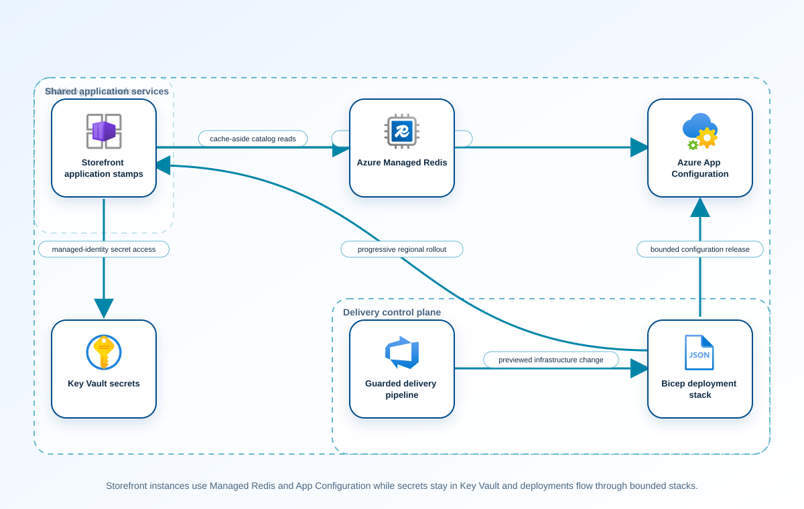

<!-- BEGIN GENERATED AZ305 V1 -->
# LAB-21 — Application Caching, Configuration, and Automated Delivery

## 1. Navigation

[← LAB-20](../20-messaging-events-api/README.md) · [Lab catalog](../README.md) · [LAB-22 →](../22-migration-strategy-assessment/README.md)

## 2. Scenario and completion contract

Woodgrove Commerce is standardizing deployment of a multi-region storefront. Product catalog reads need low-latency caching, operators require centrally managed feature flags and non-secret settings, secrets must remain in Key Vault, and all infrastructure changes need repeatable preview and rollback evidence. The existing proposal relies on an aging cache service, mutable scripts, and configuration files baked into application images. The team must adopt Azure Managed Redis for new cache architecture, Azure App Configuration for runtime settings, and Bicep for declarative delivery. A bounded deployment preview is allowed, but provisioning cache capacity and uncontrolled feature rollout are outside the lab scope.

- Architect role: Application platform and delivery architect
- Outcome: Deliver a Bicep-defined caching, configuration, and deployment architecture with safe rollout, managed identity, observability, and recoverable state.
- Duration: 180 minutes
- Difficulty: advanced
- Cost class: moderate
- Completion: all five checkpoint assertions, final validation, decision revision, and cleanup review are complete.

## 3. Objective-to-evidence map

| Objective | Requirement | Checkpoint |
| --- | --- | --- |
| `INF-APP-04` | `LAB21-REQ-01` | [`LAB21-CP01`](#checkpoint-1) |
| `INF-APP-05` | `LAB21-REQ-02` | [`LAB21-CP02`](#checkpoint-2) |
| `INF-APP-06` | `LAB21-REQ-03` | [`LAB21-CP03`](#checkpoint-3) |
| `INF-APP-04` | `LAB21-REQ-04` | [`LAB21-CP04`](#checkpoint-4) |
| `INF-APP-05` | `LAB21-REQ-05` | [`LAB21-CP05`](#checkpoint-5) |

## 4. Business and quality requirements

Business outcome: Accelerate storefront reads and release features consistently across regions without embedding secrets or relying on manual configuration drift.

- `LAB21-REQ-01` — The design states cache-aside behavior, key ownership, TTL, eviction, invalidation, stampede control, regional scope, and source-of-truth fallback.
- `LAB21-REQ-02` — Non-secret settings and feature flags live in App Configuration, secrets remain Key Vault references, and labels encode environment rather than tenant secrets.
- `LAB21-REQ-03` — The Bicep template compiles, pins GA resource APIs, includes the required Managed Redis database child, disables public access on both service parents, defines secret-free outputs, and states that private endpoints and DNS remain a required design step outside this what-if-only analogue.
- `LAB21-REQ-04` — Template validation and reviewed what-if describe only the bounded analogue, with explicit ownership, expiry, identity, network, and capacity settings and no mutation.
- `LAB21-REQ-05` — Synthetic clients refresh non-secret settings, feature exposure advances by a deterministic ring, cache fallback works, and a failed ring stops and rolls back.

Scenario facts:

- **Data:** Catalog cache entries, feature and configuration values, deployment manifests, versions, and secret references have separate owners.
- **Scale:** Read-heavy storefront traffic spans regions; measured working set, operations per second, and miss rate determine cache size.
- **Latency:** Cache serves the interactive read target and stale-mode activation must occur before dependency timeout cascades.
- **Availability:** Regional application stamps retain a last-known-safe cache path when App Configuration or the source database is unavailable.
- **RTO:** Dependency restoration may take thirty minutes without stopping reads; write-path recovery remains a separate owner objective.
- **RPO:** The degraded read path intentionally accepts up to the approved catalog staleness boundary rather than inventing current source data.
- **Budget:** Managed cache and configuration replicas are justified against database load, latency, and the value of thirty-minute read continuity.

Constraints:

- Storefront reads and releases must work across regions without embedded secrets or imperative configuration drift.
- Last-known-safe catalog data must be served for thirty minutes during configuration-store or source-database unavailability.
- Use only the Azure PowerShell + Bicep command lane for learner implementation.
- Keep all live changes behind explicit execution and acknowledgement switches.
- Retain only sanitized command evidence and synthetic fixture identifiers.

Assumptions:

- Catalog entries carry version and freshness metadata and are safe to serve within an approved staleness window.
- Application revisions can bundle a tested configuration snapshot reference without exposing secret values.
- West Europe is the configurable primary example and North Europe is the configurable secondary example.
- The learner has administrator-level Azure operations knowledge but receives no pre-existing authenticated context.
- Offline fixtures demonstrate contract behavior rather than live Azure service behavior.

## 5. Architecture diagram and walkthrough



The flow begins with the business outcome, crosses five independently validated design capabilities, and ends with positive and negative evidence. The SVG is deterministically rendered from `diagrams/architecture.mmd`.

## 6. Concept primer and candidate architectures

Architecture decisions translate measurable requirements into a deliberate service and operating model. A candidate is viable only when every mandatory constraint is met; convenience or familiarity cannot compensate for a disqualifier.

- **Azure Managed Redis with Azure App Configuration and Bicep deployment stacks** (eligible) — Managed Redis accelerates catalog reads, App Configuration versions settings, and Bicep deployment stacks make regional release state declarative.
- **Per-instance memory caches with image-baked configuration and imperative scripts** (eligible) — Local caches are inexpensive but fragment state across replicas and require image releases for configuration change or rollback.
- **Cosmos DB integrated cache with Key Vault references and Terraform delivery** (eligible) — An integrated cache can suit Cosmos-backed workloads, but this catalog architecture needs a source-neutral cache and existing Bicep delivery contract.
- **New Azure Cache for Redis deployment with mutable portal configuration** (ineligible) — The retiring service direction and manual configuration create lifecycle and drift risk for a new platform. Disqualifier: LAB21-REQ-03 requires Azure Managed Redis for new caching designs and declarative drift-controlled delivery.

## 7. Decision, ADR, and Well-Architected review

Criteria weights are C1 30, C2 25, C3 20, C4 15, and C5 10. Weighted totals use `sum(weight × score) / 5`.

| Candidate | Eligible | C1 | C2 | C3 | C4 | C5 | Weighted /100 |
| --- | ---: | ---: | ---: | ---: | ---: | ---: | ---: |
| Azure Managed Redis with Azure App Configuration and Bicep deployment stacks | yes | 5 | 4 | 5 | 5 | 5 | 95 |
| Per-instance memory caches with image-baked configuration and imperative scripts | yes | 2 | 2 | 2 | 2 | 4 | 44 |
| Cosmos DB integrated cache with Key Vault references and Terraform delivery | yes | 4 | 4 | 5 | 3 | 2 | 77 |
| New Azure Cache for Redis deployment with mutable portal configuration | no | 1 | 3 | 2 | 1 | 3 | 38 |

Selected design: **Azure Managed Redis with Azure App Configuration and Bicep deployment stacks**. `ADR-LAB21-001` records the accepted reasoning. Review Reliability, Security, Cost Optimization, Operational Excellence, and Performance Efficiency in `design/decision.yml`; no pillar is implied by another.

Rejected alternatives:

- **Per-instance memory caches with image-baked configuration and imperative scripts:** Inconsistent caches and baked settings undermine regional release consistency and degraded-mode proof.
- **Cosmos DB integrated cache with Key Vault references and Terraform delivery:** Coupling cache choice to a new database platform and delivery tool expands the decision without a requirement.
- **New Azure Cache for Redis deployment with mutable portal configuration:** It is disqualified by the current-service and declarative-delivery requirements.

Architecture risks:

- **Risk:** A stale cache can serve a recalled or legally invalid catalog item for the full thirty-minute window. **Mitigation:** Define noncacheable emergency flags and a signed invalidation path independent of the source database.
- **Risk:** Configuration refresh failure can leave regions on different feature versions. **Mitigation:** Pin a last-known-safe snapshot identifier and assert regional version convergence during every release.

Well-Architected consequences:

- **Reliability:** Versioned safe snapshots and cache fallback maintain catalog reads through configuration or source failure.
- **Security:** Managed identities, private paths, and external secret references keep credentials out of images and templates.
- **Cost Optimization:** Cache capacity is tied to the measured working set and avoids scaling the source for repeated reads.
- **Operational Excellence:** Declarative stacks, configuration labels, snapshot versions, and rollback evidence control regional drift.
- **Performance Efficiency:** Managed Redis handles the read working set while refresh and invalidation protect data freshness.

ADR consequences:

- Product owners must define which catalog fields may be stale and which require emergency invalidation.
- Releases promote a configuration snapshot and infrastructure declaration as independently verifiable artifacts.

## 8. Inputs, permissions, licensing, cost, and analogue

Use configurable `Location` (`AZ305_LOCATION`, default West Europe) and `SecondaryLocation` (`AZ305_SECONDARY_LOCATION`, default North Europe). Every public input has an explicit `AZ305_*` fallback. Preview is the default; only Golden Lab 00 writes an intent-only `execute: false` preview record. Before an executed cloud command, the supplied subscription and tenant must exactly match the active CLI, Az, and—where applicable—Microsoft Graph contexts. `-Execute` crosses the execution boundary; cost-bearing and tenant-scoped paths also require their independent acknowledgement switches.

Safe analogue: Deploy only the self-contained low-cost Bicep analogue when explicitly authorized; otherwise test snapshot, fallback, and drift behavior with local fixtures.

Permissions: Managed Redis, App Configuration, deployment, identity, and monitoring read access supports review; resource or key-value mutation requires separate contributor and data roles.

Licensing: Azure Managed Redis tiers, App Configuration replicas and request quotas, deployment-stack resources, private networking, and monitoring affect price.

Cost boundary: Model cache capacity and operations, regional replicas, configuration requests, deployment resources, data transfer, and stale-data protection value.

## 9. Read-only preflight

```powershell
pwsh ./scripts/azure-powershell/Preflight.ps1 -RunId synthetic-210001
```

Synthetic sample: `{"labId":"LAB-21","track":"azure-powershell","result":"pass","note":"Local tool discovery only"}`. This is illustrative local output, not evidence captured from Azure.

## 10. Five guided checkpoints

### Checkpoint 1: Define cache semantics and failure behavior

<a id="checkpoint-1"></a>

**Trace:** `INF-APP-04` → `LAB21-REQ-01` → `LAB21-CP01`

```powershell
Get-AzResource -ResourceGroupName $ResourceGroupName -ResourceType Microsoft.Cache/redisEnterprise | Select-Object Name, Location, ResourceId, Tags
```

Expected evidence: The design states cache-aside behavior, key ownership, TTL, eviction, invalidation, stampede control, regional scope, and source-of-truth fallback. Retain Preserve access-pattern calculations, key and TTL examples, failure-mode tests, and service-selection rationale.

Positive assertion:

```powershell
$cache = Get-AzResource -ResourceGroupName $ResourceGroupName -ResourceType Microsoft.Cache/redisEnterprise | Select-Object -First 1; if (-not $cache) { throw 'No Azure Managed Redis resource was found.' }
```

Negative assertion:

```powershell
$legacy = Get-AzResource -ResourceGroupName $ResourceGroupName -ResourceType Microsoft.Cache/Redis; if ($legacy) { throw 'A legacy Azure Cache for Redis resource remains in the new-design scope.' }
```

Failure and retry: Poor invalidation can serve stale prices while aggressive expiry overloads the database. Adjust TTL and single-flight behavior, then replay the same read and invalidation workload.

Cleanup dependency: Delete only run-owned synthetic cache keys; never flush a shared cache.

WAF consequence: Performance Efficiency: cache-aside with measured TTL reduces source latency and load while retaining a durable authority.

### Checkpoint 2: Separate configuration, features, and secrets

<a id="checkpoint-2"></a>

**Trace:** `INF-APP-05` → `LAB21-REQ-02` → `LAB21-CP02`

```powershell
Get-AzAppConfigurationStore -ResourceGroupName $ResourceGroupName -Name $AppConfigurationName | Select-Object Name, Location, Endpoint, PublicNetworkAccess, DisableLocalAuth, SkuName
```

Expected evidence: Non-secret settings and feature flags live in App Configuration, secrets remain Key Vault references, and labels encode environment rather than tenant secrets. Retain Save redacted key naming, label and feature-filter conventions, identity access matrix, and network decision.

Positive assertion:

```powershell
$store = Get-AzAppConfigurationStore -ResourceGroupName $ResourceGroupName -Name $AppConfigurationName; if ($store.DisableLocalAuth -ne $true) { throw 'App Configuration local authentication is not disabled.' }
```

Negative assertion:

```powershell
$store = Get-AzAppConfigurationStore -ResourceGroupName $ResourceGroupName -Name $AppConfigurationName; if ($store.PublicNetworkAccess -eq 'Enabled' -and $RequirePrivateAccess) { throw 'Public network access violates the approved configuration boundary.' }
```

Failure and retry: Mixing secrets with ordinary configuration increases disclosure risk and complicates rotation. Replace the sensitive value with a Key Vault reference and rerun recursive sensitive-field checks.

Cleanup dependency: Remove only run-owned non-secret keys and flags; never export or delete resolved secrets.

WAF consequence: Security: managed identity, local-auth disablement, and Key Vault references keep secrets out of deployment artifacts.

### Checkpoint 3: Compile the delivery contract

<a id="checkpoint-3"></a>

**Trace:** `INF-APP-06` → `LAB21-REQ-03` → `LAB21-CP03`

```powershell
bicep build artifacts/main.bicep --stdout | Out-Null
```

Expected evidence: The Bicep template compiles, pins GA resource APIs, includes the required Managed Redis database child, disables public access on both service parents, defines secret-free outputs, and states that private endpoints and DNS remain a required design step outside this what-if-only analogue. Retain Preserve source and parameter hashes, compiler output, resource inventory, and traceability to configuration requirements.

Positive assertion:

```powershell
$template = bicep build artifacts/main.bicep --stdout | ConvertFrom-Json; $types = @($template.resources.type); if ('Microsoft.Cache/redisEnterprise' -notin $types -or 'Microsoft.Cache/redisEnterprise/databases' -notin $types -or 'Microsoft.AppConfiguration/configurationStores' -notin $types) { throw 'The template lacks Managed Redis, its required database child, or App Configuration.' }
```

Negative assertion:

```powershell
$templateText = bicep build artifacts/main.bicep --stdout; if ($templateText -match '(?i)password|primaryKey|connectionString') { throw 'The compiled delivery contract appears to expose secret material.' }
```

Failure and retry: Declarative syntax alone does not prevent insecure defaults, oversized capacity, or destructive replacement. Correct the failing declaration and repeat compile plus semantic assertions before preview.

Cleanup dependency: Remove generated local JSON if retained; keep Bicep and the example parameter file.

WAF consequence: Operational Excellence: a versioned declarative contract makes environment differences reviewable and repeatable.

### Checkpoint 4: Preview a bounded deployment

<a id="checkpoint-4"></a>

**Trace:** `INF-APP-04` → `LAB21-REQ-04` → `LAB21-CP04`

```powershell
New-AzResourceGroupDeployment -ResourceGroupName $ResourceGroupName -Name "lab21-$RunId" -TemplateFile artifacts/main.bicep -TemplateParameterFile artifacts/parameters.example.json -runId $RunId -expiresOn $ExpiresOn -WhatIf
```

Expected evidence: Template validation and reviewed what-if describe only the bounded analogue, with explicit ownership, expiry, identity, network, and capacity settings and no mutation. Retain Archive template validation, reviewed what-if, cost estimate, policy outcomes, and exact source and parameter hashes.

Positive assertion:

```powershell
$validationErrors = Test-AzResourceGroupDeployment -ResourceGroupName $ResourceGroupName -TemplateFile artifacts/main.bicep -TemplateParameterFile artifacts/parameters.example.json -runId $RunId -expiresOn $ExpiresOn; if ($validationErrors) { throw 'The bounded reference template failed deployment validation.' }
```

Negative assertion:

```powershell
$deployment = Get-AzResourceGroupDeployment -ResourceGroupName $ResourceGroupName -Name "lab21-$RunId" -ErrorAction SilentlyContinue; if ($deployment -and $deployment.ProvisioningState -eq 'Succeeded') { throw 'The safe analogue unexpectedly created a deployment.' }
```

Failure and retry: An invalid scope or unsafe default can make a later authorized deployment costly or expose shared configuration. Correct the template or parameters and rerun validation and what-if using the same deterministic inputs.

Cleanup dependency: Delete local preview output only; the safe analogue must create no cloud object and never purge shared stores.

WAF consequence: Cost Optimization: bounded capacity, expiry tags, and gated execution constrain the deployable reference footprint.

### Checkpoint 5: Validate progressive configuration delivery

<a id="checkpoint-5"></a>

**Trace:** `INF-APP-05` → `LAB21-REQ-05` → `LAB21-CP05`

```powershell
Get-AzMetricDefinition -ResourceId $ManagedRedisResourceId | Select-Object Name, Unit, PrimaryAggregationType
```

Expected evidence: Synthetic clients refresh non-secret settings, feature exposure advances by a deterministic ring, cache fallback works, and a failed ring stops and rolls back. Retain Save flag versions, ring membership, refresh timestamps, cache and source latency, assertion results, and rollback record.

Positive assertion:

```powershell
$definitions = Get-AzMetricDefinition -ResourceId $ManagedRedisResourceId; if (-not ($definitions | Where-Object { $_.Name.Value -match 'Hit|Miss|Latency|Connected' })) { throw 'Required cache rollout metrics are unavailable.' }
```

Negative assertion:

```powershell
$alerts = Get-AzMetricAlertRuleV2 -ResourceGroupName $ResourceGroupName; if (-not ($alerts | Where-Object { $_.Scopes -contains $ManagedRedisResourceId -and $_.Enabled })) { throw 'No enabled cache-health alert protects progressive rollout.' }
```

Failure and retry: Configuration propagation can create inconsistent behavior even after infrastructure deployment succeeds. Restore the last approved flag state and replay only the failed ring after fixing the assertion.

Cleanup dependency: Disable and remove run-owned flags and synthetic keys before deleting run-owned infrastructure.

WAF consequence: Reliability: progressive exposure and tested fallback limit blast radius from configuration and cache faults.

## 11. Final validation and interpretation

Run `Validate.ps1 -Mode Deployment -Execute` only after an executed run has state and you are authorized to issue the ten read-only checkpoint inspections. Without `-Execute`, ordinary deployment validation records `partial` and exits `2`; Golden Lab 00 alone can validate its intent-only preview locally. Exit `0` means all required assertions pass, `1` means at least one failed, and `2` means the outcome is gated or partial. Positive and negative commands execute independently, so one failure never suppresses its paired assertion.

## 12. Material change request

A regulatory review requires the storefront to keep serving last-known-safe catalog data for thirty minutes during configuration-store or source-database unavailability.

Revised solution: select **Azure Managed Redis with Azure App Configuration and Bicep deployment stacks**. LAB21-REQ-01 requires explicit cache failure behavior, so the selected design retains a versioned thirty-minute last-known-safe snapshot plus a source-independent invalidation control.

Revised Well-Architected consequences:

- **Reliability:** Catalog reads continue through temporary configuration or database loss.
- **Security:** Emergency invalidation is narrowly authorized and does not expose configuration secrets.
- **Cost Optimization:** Existing cache capacity supplies continuity without a duplicate active database.
- **Operational Excellence:** Snapshot version, activation, expiry, and recovery are recorded in the release runbook.
- **Performance Efficiency:** Bounded stale reads prevent dependency retry storms and protect storefront latency.

## 13. Architect job challenge

Revise TTL, refresh, stale-data labeling, circuit breaking, feature rollback, and monitoring while ensuring that prices beyond the allowed age are never presented as current.

## 14. Troubleshooting, cleanup, and residual verification

- If Bicep compilation succeeds but semantic checks fail, inspect the compiled resource type and API version before changing assertions.
- If clients observe different feature states, compare label, snapshot, refresh interval, and ring identity rather than forcing a global refresh.
- If cleanup detects a tag mismatch, stop and reconcile run state; never broaden deletion scope to make cleanup pass.

Cleanup previews nonempty state in reverse dependency order, writes `partial`, and exits `2`; an already empty run is completed locally and idempotently. Executed cleanup rechecks the exact live ID plus `purpose`, `labId`, `runId`, and `expiresOn` immediately before each removal, persists state after every absent or removed object, stops on the first dependency failure, and refuses unresolved pre-existing settings. It never automates purge. Finish with `Validate.ps1 -Mode PostCleanup`; the required residual count is zero.

## 15. Exam debrief, assessment, sources, and navigation

Explain the recommendation in terms of requirements, rejected alternatives, failure behavior, and all five WAF pillars. Complete `assessment/QUESTIONS.md`, then use the separately excluded answer key for remediation.

- [Azure Managed Redis documentation](https://learn.microsoft.com/en-us/azure/redis/)
- [Azure Well-Architected Framework](https://learn.microsoft.com/en-us/azure/well-architected/)

[← LAB-20](../20-messaging-events-api/README.md) · [Lab catalog](../README.md) · [LAB-22 →](../22-migration-strategy-assessment/README.md)

## 16. Synchronized lifecycle-script appendix

### Preflight.ps1

```powershell
[CmdletBinding()]
param(
    [string]$SubscriptionId = $env:AZ305_SUBSCRIPTION_ID,
    [string]$TenantId = $env:AZ305_TENANT_ID,
    [ValidatePattern('^[a-z0-9-]{6,64}$')][string]$RunId = $env:AZ305_RUN_ID,
    [string]$Location = $(if ($env:AZ305_LOCATION) { $env:AZ305_LOCATION } else { 'westeurope' }),
    [string]$SecondaryLocation = $(if ($env:AZ305_SECONDARY_LOCATION) { $env:AZ305_SECONDARY_LOCATION } else { 'northeurope' }),
    [string]$ResourceGroup = $(if ($env:AZ305_RESOURCE_GROUP) { $env:AZ305_RESOURCE_GROUP } else { "rg-az305-$RunId" }),
    [string]$WorkloadName = $(if ($env:AZ305_WORKLOAD_NAME) { $env:AZ305_WORKLOAD_NAME } else { "az305-$RunId" }),
    [string]$ExpiresOn = $(if ($env:AZ305_EXPIRES_ON) { $env:AZ305_EXPIRES_ON } else { (Get-Date).ToUniversalTime().AddDays(1).ToString('yyyy-MM-dd') }),
    [string]$AppConfigurationName = $env:AZ305_APP_CONFIGURATION_NAME,
    [string]$ManagedRedisResourceId = $env:AZ305_MANAGED_REDIS_RESOURCE_ID,
    [bool]$RequirePrivateAccess = $(if ($env:AZ305_REQUIRE_PRIVATE_ACCESS) { [System.Convert]::ToBoolean($env:AZ305_REQUIRE_PRIVATE_ACCESS) } else { $false }),
    [string]$ResourceGroupName = $env:AZ305_RESOURCE_GROUP_NAME,
    [switch]$Execute,
    [switch]$AcknowledgeCost,
    [switch]$AcknowledgeTenantChange
)

$ErrorActionPreference = 'Stop'
$PSNativeCommandUseErrorActionPreference = $true
if (-not $RunId) { [Console]::Error.WriteLine('RunId or AZ305_RUN_ID is required.'); exit 2 }
# Every lifecycle entrypoint intentionally exposes the same public parameter contract.
@($SubscriptionId, $TenantId, $RunId, $Location, $SecondaryLocation, $ResourceGroup, $WorkloadName, $ExpiresOn, $AppConfigurationName, $ManagedRedisResourceId, $RequirePrivateAccess, $ResourceGroupName, $Execute, $AcknowledgeCost, $AcknowledgeTenantChange) | Out-Null

$requiredCommands = @('bicep', 'pwsh')
$missing = @($requiredCommands | Where-Object { -not (Get-Command $_ -ErrorAction SilentlyContinue) })
if ($missing.Count -gt 0) {
    Write-Error "Missing local commands: $($missing -join ', ')"
    exit 1
}
$requiredCmdlets = @('Get-AzAppConfigurationStore', 'Get-AzMetricAlertRuleV2', 'Get-AzMetricDefinition', 'Get-AzResource', 'Get-AzResourceGroupDeployment', 'New-AzResourceGroupDeployment', 'Test-AzResourceGroupDeployment')
$missingCmdlets = @($requiredCmdlets | Where-Object { -not (Get-Command $_ -ErrorAction SilentlyContinue) })
if ($missingCmdlets.Count -gt 0) {
    Write-Error "Missing local cmdlets: $($missingCmdlets -join ', ')"
    exit 1
}

[pscustomobject]@{
    labId = 'LAB-21'
    track = 'azure-powershell'
    implementationMode = 'safe-analogue'
    result = 'pass'
    note = 'Local tool discovery only; no Azure or Microsoft Graph request was made.'
} | ConvertTo-Json
exit 0
```

### Setup.ps1

```powershell
[CmdletBinding()]
param(
    [string]$SubscriptionId = $env:AZ305_SUBSCRIPTION_ID,
    [string]$TenantId = $env:AZ305_TENANT_ID,
    [ValidatePattern('^[a-z0-9-]{6,64}$')][string]$RunId = $env:AZ305_RUN_ID,
    [string]$Location = $(if ($env:AZ305_LOCATION) { $env:AZ305_LOCATION } else { 'westeurope' }),
    [string]$SecondaryLocation = $(if ($env:AZ305_SECONDARY_LOCATION) { $env:AZ305_SECONDARY_LOCATION } else { 'northeurope' }),
    [string]$ResourceGroup = $(if ($env:AZ305_RESOURCE_GROUP) { $env:AZ305_RESOURCE_GROUP } else { "rg-az305-$RunId" }),
    [string]$WorkloadName = $(if ($env:AZ305_WORKLOAD_NAME) { $env:AZ305_WORKLOAD_NAME } else { "az305-$RunId" }),
    [string]$ExpiresOn = $(if ($env:AZ305_EXPIRES_ON) { $env:AZ305_EXPIRES_ON } else { (Get-Date).ToUniversalTime().AddDays(1).ToString('yyyy-MM-dd') }),
    [string]$AppConfigurationName = $env:AZ305_APP_CONFIGURATION_NAME,
    [string]$ManagedRedisResourceId = $env:AZ305_MANAGED_REDIS_RESOURCE_ID,
    [bool]$RequirePrivateAccess = $(if ($env:AZ305_REQUIRE_PRIVATE_ACCESS) { [System.Convert]::ToBoolean($env:AZ305_REQUIRE_PRIVATE_ACCESS) } else { $false }),
    [string]$ResourceGroupName = $env:AZ305_RESOURCE_GROUP_NAME,
    [switch]$Execute,
    [switch]$AcknowledgeCost,
    [switch]$AcknowledgeTenantChange
)

$ErrorActionPreference = 'Stop'
$PSNativeCommandUseErrorActionPreference = $true
if (-not $RunId) { [Console]::Error.WriteLine('RunId or AZ305_RUN_ID is required.'); exit 2 }
# Every lifecycle entrypoint intentionally exposes the same public parameter contract.
@($SubscriptionId, $TenantId, $RunId, $Location, $SecondaryLocation, $ResourceGroup, $WorkloadName, $ExpiresOn, $AppConfigurationName, $ManagedRedisResourceId, $RequirePrivateAccess, $ResourceGroupName, $Execute, $AcknowledgeCost, $AcknowledgeTenantChange) | Out-Null

$LabRoot = Split-Path (Split-Path $PSScriptRoot -Parent) -Parent
$StateRoot = Join-Path $LabRoot ".state/$RunId"
$StatePath = Join-Path $StateRoot 'run.json'

function Assert-ExactExecutionContext {
    [CmdletBinding()]
    param([string]$ExpectedSubscriptionId, [string]$ExpectedTenantId)
    if ([string]::IsNullOrWhiteSpace($ExpectedSubscriptionId) -or [string]::IsNullOrWhiteSpace($ExpectedTenantId)) { throw 'SubscriptionId and TenantId are required before an Azure request.' }
    $azContext = Get-AzContext -ErrorAction Stop
    if (-not $azContext -or [string]$azContext.Subscription.Id -ine $ExpectedSubscriptionId -or [string]$azContext.Tenant.Id -ine $ExpectedTenantId) {
        throw 'The active Azure PowerShell subscription or tenant does not exactly match the requested context.'
    }
}

function Save-RunState {
    [CmdletBinding()]
    param([Parameter(Mandatory)]$State)
    $temporaryPath = "$StatePath.tmp"
    $State | ConvertTo-Json -Depth 20 | Set-Content -LiteralPath $temporaryPath -Encoding utf8NoBOM
    Move-Item -LiteralPath $temporaryPath -Destination $StatePath -Force
}

function Assert-SafeStateValue {
    [CmdletBinding()]
    param($Value)
    $serialized = $Value | ConvertTo-Json -Depth 12 -Compress
    if ($serialized -match '(?i)"(?:token|password|secret|certificate|connectionString|sas|clientSecret|accessToken|refreshToken|accountKey|privateKey)"\s*:') {
        throw 'A prohibited sensitive field name was returned; state capture is refused.'
    }
}

function Convert-CheckpointOutput {
    [CmdletBinding()]
    param($Value)
    if ($Value -is [string]) { $raw = [string]$Value }
    elseif ($Value -is [System.Collections.IEnumerable] -and @($Value | Where-Object { $_ -isnot [string] }).Count -eq 0) { $raw = @($Value) -join "`n" }
    else { return $Value }
    if ([string]::IsNullOrWhiteSpace($raw)) { return $null }
    try { return ($raw | ConvertFrom-Json -Depth 100) } catch { return $Value }
}

function Get-ReturnedResourceId {
    [CmdletBinding()]
    param($Value)
    $seen = [System.Collections.Generic.HashSet[string]]::new([System.StringComparer]::OrdinalIgnoreCase)
    $results = [System.Collections.Generic.List[string]]::new()
    function Add-ArmId {
        param($Candidate)
        if ($Candidate -is [string] -and $Candidate -match '^/subscriptions/[0-9a-f-]+/(?:resourceGroups/[^/]+(?:/providers/.+)?|providers/.+)$' -and $Candidate -notmatch '/providers/Microsoft\.Resources/deployments/') {
            if ($seen.Add($Candidate)) { $results.Add($Candidate) }
        }
    }
    function Find-DeploymentOutputId {
        param($Item, [int]$Depth)
        if ($null -eq $Item -or $Depth -gt 12) { return }
        if ($Item -is [string]) { Add-ArmId -Candidate $Item; return }
        if ($Item -is [System.Collections.IDictionary]) { foreach ($key in $Item.Keys) { Find-DeploymentOutputId -Item $Item[$key] -Depth ($Depth + 1) }; return }
        if ($Item -is [System.Collections.IEnumerable]) { foreach ($entry in $Item) { Find-DeploymentOutputId -Item $entry -Depth ($Depth + 1) }; return }
        foreach ($property in @($Item.PSObject.Properties | Where-Object { $_.MemberType -in @('NoteProperty', 'Property') })) { Find-DeploymentOutputId -Item $property.Value -Depth ($Depth + 1) }
    }
    foreach ($rootItem in @($Value)) {
        if ($rootItem -is [System.Collections.IDictionary]) {
            foreach ($name in @('id', 'resourceId')) { if ($rootItem.Contains($name)) { Add-ArmId -Candidate $rootItem[$name] } }
            if ($rootItem.Contains('properties') -and $rootItem.properties -and $rootItem.properties.outputs) { Find-DeploymentOutputId -Item $rootItem.properties.outputs -Depth 0 }
            continue
        }
        foreach ($name in @('Id', 'ResourceId')) {
            $property = $rootItem.PSObject.Properties[$name]
            if ($property) { Add-ArmId -Candidate $property.Value }
        }
        if ($rootItem.PSObject.Properties['Properties'] -and $rootItem.Properties -and $rootItem.Properties.outputs) {
            Find-DeploymentOutputId -Item $rootItem.Properties.outputs -Depth 0
        }
    }
    return @($results)
}

function Get-PlannedDeploymentResourceId {
    [CmdletBinding()]
    param($Value)
    $seen = [System.Collections.Generic.HashSet[string]]::new([System.StringComparer]::OrdinalIgnoreCase)
    $results = [System.Collections.Generic.List[string]]::new()
    foreach ($change in @($Value.changes)) {
        $candidate = [string]$change.resourceId
        if ($candidate -match '^/subscriptions/[0-9a-f-]+/(?:resourceGroups/[^/]+(?:/providers/.+)?|providers/.+)$' -and $candidate -notmatch '/providers/Microsoft\.Resources/deployments/' -and $seen.Add($candidate)) {
            $results.Add($candidate)
        }
    }
    return @($results)
}

function Assert-InputSubscriptionScope {
    [CmdletBinding()]
    param($Inputs, [string]$ExpectedSubscriptionId)
    $entries = if ($Inputs -is [System.Collections.IDictionary]) {
        @($Inputs.GetEnumerator())
    } else {
        @($Inputs.PSObject.Properties | ForEach-Object { [pscustomobject]@{ Key = $_.Name; Value = $_.Value } })
    }
    foreach ($entry in $entries) {
        if ($entry.Value -is [string] -and [string]$entry.Value -match '^/subscriptions/([^/]+)/') {
            if ($Matches[1] -ine $ExpectedSubscriptionId) { throw "Input $($entry.Key) belongs to a different subscription." }
        }
    }
}

function Assert-ManagedMutation {
    [CmdletBinding()]
    param($State, [string]$CheckpointId, [bool]$CarriesOwnership, [object[]]$TargetResourceIds)
    if ($CarriesOwnership) { return }
    $targets = @($TargetResourceIds | Where-Object { $_ -is [string] -and $_ -match '^/subscriptions/' })
    if ($targets.Count -eq 0) { throw "$CheckpointId refuses an untagged mutation because no exact ARM target ID was supplied." }
    $knownIds = @($State.managedObjects | ForEach-Object { [string]$_.id })
    if ($knownIds.Count -eq 0) { throw "$CheckpointId refuses to modify a pre-existing object because no run-owned parent has been recorded." }
    foreach ($target in $targets) {
        $related = @($knownIds | Where-Object { $target -ieq $_ -or $target.StartsWith("$_/", [System.StringComparison]::OrdinalIgnoreCase) -or $_.StartsWith("$target/", [System.StringComparison]::OrdinalIgnoreCase) }).Count -gt 0
        if (-not $related) { throw "$CheckpointId refuses a mutation outside the exact run-owned resource boundary." }
    }
}

$executionInputs = [ordered]@{ subscriptionId = $SubscriptionId; tenantId = $TenantId; location = $Location; secondaryLocation = $SecondaryLocation; resourceGroup = $ResourceGroup; workloadName = $WorkloadName; expiresOn = $ExpiresOn; AppConfigurationName = $AppConfigurationName; ManagedRedisResourceId = $ManagedRedisResourceId; RequirePrivateAccess = $RequirePrivateAccess; ResourceGroupName = $ResourceGroupName }

if (-not $Execute) {
    Write-Output '[preview] No cloud command was called and no state was created.'
    Write-Output '[preview] Re-run with -Execute only in an authorized disposable environment.'
    exit 0
}
# This setup is compatible with the lab implementation mode.
if (-not $AcknowledgeCost) { [Console]::Error.WriteLine('Cost acknowledgement is required.'); exit 2 }
# This lab does not perform a tenant-scoped change by default.
$requiredLabInputs = [ordered]@{ AppConfigurationName = $AppConfigurationName; ManagedRedisResourceId = $ManagedRedisResourceId; ResourceGroupName = $ResourceGroupName }
$missingLabInputs = @($requiredLabInputs.GetEnumerator() | Where-Object { $_.Value -is [string] -and [string]::IsNullOrWhiteSpace([string]$_.Value) } | ForEach-Object Key)
if ($missingLabInputs.Count -gt 0) { [Console]::Error.WriteLine("Execution is gated; supply: $($missingLabInputs -join ', ')."); exit 2 }

try {
    Assert-ExactExecutionContext -ExpectedSubscriptionId $SubscriptionId -ExpectedTenantId $TenantId
    Assert-InputSubscriptionScope -Inputs $executionInputs -ExpectedSubscriptionId $SubscriptionId
    Assert-SafeStateValue -Value $executionInputs
}
catch {
    [Console]::Error.WriteLine("Execution is gated by context or input validation: $($_.Exception.Message)")
    exit 2
}

# Recovery state is persisted before the first possible mutation below.
if (Test-Path -LiteralPath $StatePath) {
    [Console]::Error.WriteLine('Run state already exists. Choose a new RunId or complete the recorded cleanup; existing recovery state will not be overwritten.')
    exit 2
}
New-Item -ItemType Directory -Path $StateRoot -Force | Out-Null
$state = [ordered]@{
    schemaVersion = '1.0.0'; labId = 'LAB-21'; runId = $RunId; track = 'azure-powershell'
    implementationMode = 'safe-analogue'; status = 'initialized'
    createdAt = (Get-Date).ToUniversalTime().ToString('o'); execute = $true
    parameters = $executionInputs
    managedObjects = @(); originalSettings = @()
}
Save-RunState -State $state
# Planning-only execution remains initialized until its bounded checks complete.

$originalLocation = Get-Location
try {
    Set-Location -LiteralPath $LabRoot
    # 21-CP01: Define cache semantics and failure behavior
    $stepResult = & { Get-AzResource -ResourceGroupName $ResourceGroupName -ResourceType Microsoft.Cache/redisEnterprise | Select-Object Name, Location, ResourceId, Tags }
    $null = $stepResult

    # 21-CP02: Separate configuration, features, and secrets
    $stepResult = & { Get-AzAppConfigurationStore -ResourceGroupName $ResourceGroupName -Name $AppConfigurationName | Select-Object Name, Location, Endpoint, PublicNetworkAccess, DisableLocalAuth, SkuName }
    $null = $stepResult

    # 21-CP03: Compile the delivery contract
    $stepResult = & { bicep build artifacts/main.bicep --stdout | Out-Null }
    if ($LASTEXITCODE -ne 0) { throw 'LAB21-CP03 native command exited with code ' + $LASTEXITCODE + '.' }
    $null = $stepResult

    # 21-CP04: Preview a bounded deployment
    $stepResult = & { New-AzResourceGroupDeployment -ResourceGroupName $ResourceGroupName -Name "lab21-$RunId" -TemplateFile artifacts/main.bicep -TemplateParameterFile artifacts/parameters.example.json -runId $RunId -expiresOn $ExpiresOn -WhatIf }
    $null = $stepResult

    # 21-CP05: Validate progressive configuration delivery
    $stepResult = & { Get-AzMetricDefinition -ResourceId $ManagedRedisResourceId | Select-Object Name, Unit, PrimaryAggregationType }
    $null = $stepResult

    $state.status = 'planned'
    Save-RunState -State $state
} catch {
    $state.status = 'failed'
    Save-RunState -State $state
    Write-Error $_
    exit 1
} finally {
    Set-Location -LiteralPath $originalLocation
}
exit 0
```

### Validate.ps1

```powershell
[CmdletBinding()]
param(
    [string]$SubscriptionId = $env:AZ305_SUBSCRIPTION_ID,
    [string]$TenantId = $env:AZ305_TENANT_ID,
    [ValidatePattern('^[a-z0-9-]{6,64}$')][string]$RunId = $env:AZ305_RUN_ID,
    [string]$Location = $(if ($env:AZ305_LOCATION) { $env:AZ305_LOCATION } else { 'westeurope' }),
    [string]$SecondaryLocation = $(if ($env:AZ305_SECONDARY_LOCATION) { $env:AZ305_SECONDARY_LOCATION } else { 'northeurope' }),
    [string]$ResourceGroup = $(if ($env:AZ305_RESOURCE_GROUP) { $env:AZ305_RESOURCE_GROUP } else { "rg-az305-$RunId" }),
    [string]$WorkloadName = $(if ($env:AZ305_WORKLOAD_NAME) { $env:AZ305_WORKLOAD_NAME } else { "az305-$RunId" }),
    [string]$ExpiresOn = $(if ($env:AZ305_EXPIRES_ON) { $env:AZ305_EXPIRES_ON } else { (Get-Date).ToUniversalTime().AddDays(1).ToString('yyyy-MM-dd') }),
    [string]$AppConfigurationName = $env:AZ305_APP_CONFIGURATION_NAME,
    [string]$ManagedRedisResourceId = $env:AZ305_MANAGED_REDIS_RESOURCE_ID,
    [bool]$RequirePrivateAccess = $(if ($env:AZ305_REQUIRE_PRIVATE_ACCESS) { [System.Convert]::ToBoolean($env:AZ305_REQUIRE_PRIVATE_ACCESS) } else { $false }),
    [string]$ResourceGroupName = $env:AZ305_RESOURCE_GROUP_NAME,
    [ValidateSet('Deployment', 'PostCleanup')][string]$Mode = 'Deployment',
    [switch]$Execute,
    [switch]$AcknowledgeCost,
    [switch]$AcknowledgeTenantChange
)

$ErrorActionPreference = 'Stop'
$PSNativeCommandUseErrorActionPreference = $true
if (-not $RunId) { [Console]::Error.WriteLine('RunId or AZ305_RUN_ID is required.'); exit 2 }
# Every lifecycle entrypoint intentionally exposes the same public parameter contract.
@($SubscriptionId, $TenantId, $RunId, $Location, $SecondaryLocation, $ResourceGroup, $WorkloadName, $ExpiresOn, $AppConfigurationName, $ManagedRedisResourceId, $RequirePrivateAccess, $ResourceGroupName, $Mode, $Execute, $AcknowledgeCost, $AcknowledgeTenantChange) | Out-Null

$LabRoot = Split-Path (Split-Path $PSScriptRoot -Parent) -Parent
$StateRoot = Join-Path $LabRoot ".state/$RunId"
$RunPath = Join-Path $StateRoot 'run.json'
$ValidationPath = Join-Path $StateRoot 'validation.json'

function Assert-ExactExecutionContext {
    [CmdletBinding()]
    param([string]$ExpectedSubscriptionId, [string]$ExpectedTenantId)
    if ([string]::IsNullOrWhiteSpace($ExpectedSubscriptionId) -or [string]::IsNullOrWhiteSpace($ExpectedTenantId)) { throw 'SubscriptionId and TenantId are required before an Azure request.' }
    $azContext = Get-AzContext -ErrorAction Stop
    if (-not $azContext -or [string]$azContext.Subscription.Id -ine $ExpectedSubscriptionId -or [string]$azContext.Tenant.Id -ine $ExpectedTenantId) {
        throw 'The active Azure PowerShell subscription or tenant does not exactly match the requested context.'
    }
}


if (-not (Test-Path -LiteralPath $RunPath)) {
    Write-Warning 'No run state exists; validation is gated.'
    exit 2
}
$state = Get-Content -LiteralPath $RunPath -Raw | ConvertFrom-Json
$assertions = [System.Collections.Generic.List[object]]::new()
function Add-ValidationAssertion {
    [CmdletBinding()]
    param([string]$Id, [ValidateSet('positive', 'negative')][string]$Kind, [bool]$Passed, [string]$Message)
    $assertions.Add([pscustomobject]@{ id = $Id; kind = $Kind; passed = $Passed; message = $Message })
}

function Save-ValidationArtifact {
    [CmdletBinding()]
    param([ValidateSet('pass', 'partial', 'fail')][string]$Result)
    $artifact = [ordered]@{ schemaVersion = '1.0.0'; labId = 'LAB-21'; runId = $RunId; mode = $Mode; result = $Result; validatedAt = (Get-Date).ToUniversalTime().ToString('o'); assertions = @($assertions) }
    $artifact | ConvertTo-Json -Depth 12 | Set-Content -LiteralPath $ValidationPath -Encoding utf8NoBOM
}

function Test-PositiveEvidence {
    [CmdletBinding()]
    param($Value)
    if ($Value -is [bool]) { return $Value }
    if ($null -eq $Value) { return $false }
    if ($Value -is [string]) { return -not [string]::IsNullOrWhiteSpace($Value) }
    if ($Value -is [System.Collections.IEnumerable]) { return @($Value).Count -gt 0 }
    return $true
}

function Test-NegativeEvidence {
    [CmdletBinding()]
    param($Value)
    if ($Value -is [bool]) { return $Value }
    if ($null -eq $Value) { return $true }
    if ($Value -is [string]) { return [string]::IsNullOrWhiteSpace($Value) }
    if ($Value -is [System.Collections.IEnumerable]) { return @($Value).Count -eq 0 }
    $properties = @($Value.PSObject.Properties | Where-Object { $_.MemberType -in @('NoteProperty', 'Property') })
    if ($properties.Count -eq 0) { return $false }
    return @($properties | Where-Object { -not (Test-NegativeEvidence -Value $_.Value) }).Count -eq 0
}

function Test-ProhibitedStateField {
    [CmdletBinding()]
    param($Value)
    $serialized = $Value | ConvertTo-Json -Depth 20
    return $serialized -match '(?i)"(?:token|password|secret|certificate|connectionString|sas|clientSecret|accessToken|refreshToken|accountKey|privateKey)"\s*:'
}

function Assert-InputSubscriptionScope {
    [CmdletBinding()]
    param($Inputs, [string]$ExpectedSubscriptionId)
    $entries = if ($Inputs -is [System.Collections.IDictionary]) {
        @($Inputs.GetEnumerator())
    } else {
        @($Inputs.PSObject.Properties | ForEach-Object { [pscustomobject]@{ Key = $_.Name; Value = $_.Value } })
    }
    foreach ($entry in $entries) {
        if ($entry.Value -is [string] -and [string]$entry.Value -match '^/subscriptions/([^/]+)/' -and $Matches[1] -ine $ExpectedSubscriptionId) {
            throw "Input $($entry.Key) belongs to a different subscription."
        }
    }
}

$stateIdentityMatches = (
    $state.labId -ceq 'LAB-21' -and
    $state.runId -ceq $RunId -and
    $state.track -ceq 'azure-powershell' -and
    $state.implementationMode -ceq 'safe-analogue' -and
    ([string]$state.parameters.subscriptionId -ieq $SubscriptionId -and [string]$state.parameters.tenantId -ieq $TenantId)
)
Add-ValidationAssertion -Id 'LAB21-VAL-POS-01' -Kind positive -Passed $stateIdentityMatches -Message 'Run identity, implementation mode, command track, tenant, and subscription exactly match the copied lab and requested run.'
$hasSensitiveName = Test-ProhibitedStateField -Value $state
Add-ValidationAssertion -Id 'LAB21-VAL-NEG-01' -Kind negative -Passed (-not $hasSensitiveName) -Message 'State contains no prohibited sensitive field name.'

if ($Mode -eq 'PostCleanup') {
    $cleanupPath = Join-Path $StateRoot 'cleanup.json'
    $cleanup = if (Test-Path -LiteralPath $cleanupPath) { Get-Content -LiteralPath $cleanupPath -Raw | ConvertFrom-Json } else { $null }
    Add-ValidationAssertion -Id 'LAB21-VAL-POS-02' -Kind positive -Passed ($null -ne $cleanup -and $cleanup.labId -ceq 'LAB-21' -and $cleanup.runId -ceq $RunId -and $cleanup.result -eq 'pass' -and $cleanup.ownershipVerified) -Message 'The exact run cleanup completed with verified ownership.'
    Add-ValidationAssertion -Id 'LAB21-VAL-NEG-02' -Kind negative -Passed ($null -ne $cleanup -and $cleanup.activeManagedObjects -eq 0 -and @($state.managedObjects).Count -eq 0 -and @($state.originalSettings).Count -eq 0 -and $state.status -eq 'cleaned') -Message 'No active managed object or unresolved original setting remains in cleanup or run state.'
    $postCleanupPassed = @($assertions | Where-Object { -not $_.passed }).Count -eq 0
    Save-ValidationArtifact -Result $(if ($postCleanupPassed) { 'pass' } else { 'fail' })
    if ($postCleanupPassed) { exit 0 }
    exit 1
}

Add-ValidationAssertion -Id 'LAB21-VAL-POS-02' -Kind positive -Passed ($state.status -eq 'planned') -Message 'The planning-only setup completed and remains planned; no deployment is implied.'
Add-ValidationAssertion -Id 'LAB21-VAL-NEG-02' -Kind negative -Passed (@($state.managedObjects | Where-Object { $_.tags.purpose -ne 'az305-lab' -or $_.tags.labId -ne 'LAB-21' -or $_.tags.runId -ne $RunId }).Count -eq 0) -Message 'No recorded object has a foreign ownership tag.'

if (@($assertions | Where-Object { -not $_.passed }).Count -gt 0) {
    Save-ValidationArtifact -Result 'fail'
    exit 1
}
if (-not $Execute) {
    # This lab has no special intent-only validation path.
    Save-ValidationArtifact -Result 'partial'
    Write-Warning 'Checkpoint validation is gated; re-run with -Execute after confirming the exact read-only context.'
    exit 2
}
# The validation surface is compatible with this lab implementation mode.
$requiredValidationInputs = [ordered]@{ AppConfigurationName = $AppConfigurationName; ManagedRedisResourceId = $ManagedRedisResourceId; RequirePrivateAccess = $RequirePrivateAccess; ResourceGroupName = $ResourceGroupName }
$missingValidationInputs = @($requiredValidationInputs.GetEnumerator() | Where-Object { $_.Value -is [string] -and [string]::IsNullOrWhiteSpace([string]$_.Value) } | ForEach-Object Key)
if ($missingValidationInputs.Count -gt 0) {
    Add-ValidationAssertion -Id 'LAB21-VAL-POS-CONTEXT' -Kind positive -Passed $false -Message 'One or more required non-secret validation inputs are missing.'
    Save-ValidationArtifact -Result 'partial'
    exit 2
}
try {
    Assert-ExactExecutionContext -ExpectedSubscriptionId $SubscriptionId -ExpectedTenantId $TenantId
    Assert-InputSubscriptionScope -Inputs $state.parameters -ExpectedSubscriptionId $SubscriptionId
    Add-ValidationAssertion -Id 'LAB21-VAL-POS-CONTEXT' -Kind positive -Passed $true -Message 'The active tenant and subscription exactly match the requested validation context.'
}
catch {
    Add-ValidationAssertion -Id 'LAB21-VAL-POS-CONTEXT' -Kind positive -Passed $false -Message 'Exact execution context could not be proven.'
    Save-ValidationArtifact -Result 'partial'
    exit 2
}

$originalLocation = Get-Location
try {
    Set-Location -LiteralPath $LabRoot
# LAB21-CP01: run both polarities even when one fails.
$positivePassed = $false
try {
    $global:LASTEXITCODE = 0
    $positiveEvidence = & { $cache = Get-AzResource -ResourceGroupName $ResourceGroupName -ResourceType Microsoft.Cache/redisEnterprise | Select-Object -First 1; if (-not $cache) { throw 'No Azure Managed Redis resource was found.' } }
    $positivePassed = $true
    $null = $positiveEvidence
} catch { $positivePassed = $false }
Add-ValidationAssertion -Id 'LAB21-CP01-POS' -Kind positive -Passed $positivePassed -Message 'The design states cache-aside behavior, key ownership, TTL, eviction, invalidation, stampede control, regional scope, and source-of-truth fallback.'

$negativePassed = $false
try {
    $global:LASTEXITCODE = 0
    $negativeEvidence = & { $legacy = Get-AzResource -ResourceGroupName $ResourceGroupName -ResourceType Microsoft.Cache/Redis; if ($legacy) { throw 'A legacy Azure Cache for Redis resource remains in the new-design scope.' } }
    $negativePassed = $true
    $null = $negativeEvidence
} catch { $negativePassed = $false }
Add-ValidationAssertion -Id 'LAB21-CP01-NEG' -Kind negative -Passed $negativePassed -Message 'Treating cache contents as durable system of record, allowing unbounded keys, or failing closed on cache loss must fail.'

# LAB21-CP02: run both polarities even when one fails.
$positivePassed = $false
try {
    $global:LASTEXITCODE = 0
    $positiveEvidence = & { $store = Get-AzAppConfigurationStore -ResourceGroupName $ResourceGroupName -Name $AppConfigurationName; if ($store.DisableLocalAuth -ne $true) { throw 'App Configuration local authentication is not disabled.' } }
    $positivePassed = $true
    $null = $positiveEvidence
} catch { $positivePassed = $false }
Add-ValidationAssertion -Id 'LAB21-CP02-POS' -Kind positive -Passed $positivePassed -Message 'Non-secret settings and feature flags live in App Configuration, secrets remain Key Vault references, and labels encode environment rather than tenant secrets.'

$negativePassed = $false
try {
    $global:LASTEXITCODE = 0
    $negativeEvidence = & { $store = Get-AzAppConfigurationStore -ResourceGroupName $ResourceGroupName -Name $AppConfigurationName; if ($store.PublicNetworkAccess -eq 'Enabled' -and $RequirePrivateAccess) { throw 'Public network access violates the approved configuration boundary.' } }
    $negativePassed = $true
    $null = $negativeEvidence
} catch { $negativePassed = $false }
Add-ValidationAssertion -Id 'LAB21-CP02-NEG' -Kind negative -Passed $negativePassed -Message 'A resolved secret value, connection string, or environment-specific credential in Bicep parameters or application settings must fail.'

# LAB21-CP03: run both polarities even when one fails.
$positivePassed = $false
try {
    $global:LASTEXITCODE = 0
    $positiveEvidence = & { $template = bicep build artifacts/main.bicep --stdout | ConvertFrom-Json; $types = @($template.resources.type); if ('Microsoft.Cache/redisEnterprise' -notin $types -or 'Microsoft.Cache/redisEnterprise/databases' -notin $types -or 'Microsoft.AppConfiguration/configurationStores' -notin $types) { throw 'The template lacks Managed Redis, its required database child, or App Configuration.' } }
    if ($LASTEXITCODE -ne 0) { throw 'LAB21-CP03 positive native command exited with code ' + $LASTEXITCODE + '.' }
    $positivePassed = $true
    $null = $positiveEvidence
} catch { $positivePassed = $false }
Add-ValidationAssertion -Id 'LAB21-CP03-POS' -Kind positive -Passed $positivePassed -Message 'The Bicep template compiles, pins GA resource APIs, includes the required Managed Redis database child, disables public access on both service parents, defines secret-free outputs, and states that private endpoints and DNS remain a required design step outside this what-if-only analogue.'

$negativePassed = $false
try {
    $global:LASTEXITCODE = 0
    $negativeEvidence = & { $templateText = bicep build artifacts/main.bicep --stdout; if ($templateText -match '(?i)password|primaryKey|connectionString') { throw 'The compiled delivery contract appears to expose secret material.' } }
    if ($LASTEXITCODE -ne 0) { throw 'LAB21-CP03 negative native command exited with code ' + $LASTEXITCODE + '.' }
    $negativePassed = $true
    $null = $negativeEvidence
} catch { $negativePassed = $false }
Add-ValidationAssertion -Id 'LAB21-CP03-NEG' -Kind negative -Passed $negativePassed -Message 'Hard-coded region names, plaintext secrets, missing expiry tags, or an unbounded production-sized cache must fail.'

# LAB21-CP04: run both polarities even when one fails.
$positivePassed = $false
try {
    $global:LASTEXITCODE = 0
    $positiveEvidence = & { $validationErrors = Test-AzResourceGroupDeployment -ResourceGroupName $ResourceGroupName -TemplateFile artifacts/main.bicep -TemplateParameterFile artifacts/parameters.example.json -runId $RunId -expiresOn $ExpiresOn; if ($validationErrors) { throw 'The bounded reference template failed deployment validation.' } }
    $positivePassed = $true
    $null = $positiveEvidence
} catch { $positivePassed = $false }
Add-ValidationAssertion -Id 'LAB21-CP04-POS' -Kind positive -Passed $positivePassed -Message 'Template validation and reviewed what-if describe only the bounded analogue, with explicit ownership, expiry, identity, network, and capacity settings and no mutation.'

$negativePassed = $false
try {
    $global:LASTEXITCODE = 0
    $negativeEvidence = & { $deployment = Get-AzResourceGroupDeployment -ResourceGroupName $ResourceGroupName -Name "lab21-$RunId" -ErrorAction SilentlyContinue; if ($deployment -and $deployment.ProvisioningState -eq 'Succeeded') { throw 'The safe analogue unexpectedly created a deployment.' } }
    $negativePassed = $true
    $null = $negativeEvidence
} catch { $negativePassed = $false }
Add-ValidationAssertion -Id 'LAB21-CP04-NEG' -Kind negative -Passed $negativePassed -Message 'A destructive what-if, policy denial, production-scale cache, missing lifecycle tag, or persisted deployment from this safe analogue must fail.'

# LAB21-CP05: run both polarities even when one fails.
$positivePassed = $false
try {
    $global:LASTEXITCODE = 0
    $positiveEvidence = & { $definitions = Get-AzMetricDefinition -ResourceId $ManagedRedisResourceId; if (-not ($definitions | Where-Object { $_.Name.Value -match 'Hit|Miss|Latency|Connected' })) { throw 'Required cache rollout metrics are unavailable.' } }
    $positivePassed = $true
    $null = $positiveEvidence
} catch { $positivePassed = $false }
Add-ValidationAssertion -Id 'LAB21-CP05-POS' -Kind positive -Passed $positivePassed -Message 'Synthetic clients refresh non-secret settings, feature exposure advances by a deterministic ring, cache fallback works, and a failed ring stops and rolls back.'

$negativePassed = $false
try {
    $global:LASTEXITCODE = 0
    $negativeEvidence = & { $alerts = Get-AzMetricAlertRuleV2 -ResourceGroupName $ResourceGroupName; if (-not ($alerts | Where-Object { $_.Scopes -contains $ManagedRedisResourceId -and $_.Enabled })) { throw 'No enabled cache-health alert protects progressive rollout.' } }
    $negativePassed = $true
    $null = $negativeEvidence
} catch { $negativePassed = $false }
Add-ValidationAssertion -Id 'LAB21-CP05-NEG' -Kind negative -Passed $negativePassed -Message 'Global flag activation, stale secret material, cache-failure outage, or rollout continuation after a failed assertion must fail.'

}
finally {
    Set-Location -LiteralPath $originalLocation
}

$passed = @($assertions | Where-Object { -not $_.passed }).Count -eq 0
Save-ValidationArtifact -Result $(if ($passed) { 'pass' } else { 'fail' })
if ($passed) { exit 0 }
exit 1
```

### Cleanup.ps1

```powershell
[CmdletBinding()]
param(
    [string]$SubscriptionId = $env:AZ305_SUBSCRIPTION_ID,
    [string]$TenantId = $env:AZ305_TENANT_ID,
    [ValidatePattern('^[a-z0-9-]{6,64}$')][string]$RunId = $env:AZ305_RUN_ID,
    [string]$Location = $(if ($env:AZ305_LOCATION) { $env:AZ305_LOCATION } else { 'westeurope' }),
    [string]$SecondaryLocation = $(if ($env:AZ305_SECONDARY_LOCATION) { $env:AZ305_SECONDARY_LOCATION } else { 'northeurope' }),
    [string]$ResourceGroup = $(if ($env:AZ305_RESOURCE_GROUP) { $env:AZ305_RESOURCE_GROUP } else { "rg-az305-$RunId" }),
    [string]$WorkloadName = $(if ($env:AZ305_WORKLOAD_NAME) { $env:AZ305_WORKLOAD_NAME } else { "az305-$RunId" }),
    [string]$ExpiresOn = $(if ($env:AZ305_EXPIRES_ON) { $env:AZ305_EXPIRES_ON } else { (Get-Date).ToUniversalTime().AddDays(1).ToString('yyyy-MM-dd') }),
    [string]$AppConfigurationName = $env:AZ305_APP_CONFIGURATION_NAME,
    [string]$ManagedRedisResourceId = $env:AZ305_MANAGED_REDIS_RESOURCE_ID,
    [bool]$RequirePrivateAccess = $(if ($env:AZ305_REQUIRE_PRIVATE_ACCESS) { [System.Convert]::ToBoolean($env:AZ305_REQUIRE_PRIVATE_ACCESS) } else { $false }),
    [string]$ResourceGroupName = $env:AZ305_RESOURCE_GROUP_NAME,
    [switch]$Execute,
    [switch]$AcknowledgeCost,
    [switch]$AcknowledgeTenantChange
)

$ErrorActionPreference = 'Stop'
$PSNativeCommandUseErrorActionPreference = $true
if (-not $RunId) { [Console]::Error.WriteLine('RunId or AZ305_RUN_ID is required.'); exit 2 }
# Every lifecycle entrypoint intentionally exposes the same public parameter contract.
@($SubscriptionId, $TenantId, $RunId, $Location, $SecondaryLocation, $ResourceGroup, $WorkloadName, $ExpiresOn, $AppConfigurationName, $ManagedRedisResourceId, $RequirePrivateAccess, $ResourceGroupName, $Execute, $AcknowledgeCost, $AcknowledgeTenantChange) | Out-Null

$LabRoot = Split-Path (Split-Path $PSScriptRoot -Parent) -Parent
$StateRoot = Join-Path $LabRoot ".state/$RunId"
$RunPath = Join-Path $StateRoot 'run.json'
$CleanupPath = Join-Path $StateRoot 'cleanup.json'

function Assert-ExactExecutionContext {
    [CmdletBinding()]
    param([string]$ExpectedSubscriptionId, [string]$ExpectedTenantId)
    if ([string]::IsNullOrWhiteSpace($ExpectedSubscriptionId) -or [string]::IsNullOrWhiteSpace($ExpectedTenantId)) { throw 'SubscriptionId and TenantId are required before an Azure request.' }
    $azContext = Get-AzContext -ErrorAction Stop
    if (-not $azContext -or [string]$azContext.Subscription.Id -ine $ExpectedSubscriptionId -or [string]$azContext.Tenant.Id -ine $ExpectedTenantId) {
        throw 'The active Azure PowerShell subscription or tenant does not exactly match the requested context.'
    }
}


function Save-RunState {
    [CmdletBinding()]
    param([Parameter(Mandatory)]$State)
    $temporaryPath = "$RunPath.tmp"
    $State | ConvertTo-Json -Depth 20 | Set-Content -LiteralPath $temporaryPath -Encoding utf8NoBOM
    Move-Item -LiteralPath $temporaryPath -Destination $RunPath -Force
}

function Save-CleanupArtifact {
    [CmdletBinding()]
    param(
        [ValidateSet('pass', 'partial', 'fail')][string]$Result,
        [bool]$OwnershipVerified
    )
    $artifact = [ordered]@{
        schemaVersion = '1.0.0'; labId = 'LAB-21'; runId = $RunId; result = $Result
        completedAt = (Get-Date).ToUniversalTime().ToString('o'); ownershipVerified = $OwnershipVerified
        activeManagedObjects = @($state.managedObjects).Count; actions = @($actions)
    }
    $temporaryPath = "$CleanupPath.tmp"
    $artifact | ConvertTo-Json -Depth 12 | Set-Content -LiteralPath $temporaryPath -Encoding utf8NoBOM
    Move-Item -LiteralPath $temporaryPath -Destination $CleanupPath -Force
}

function Assert-ExactLiveOwnership {
    [CmdletBinding()]
    param($Tags, $Managed)
    if ($null -eq $Tags) { throw 'Live resource has no ownership tags.' }
    $valid = (
        [string]$Tags.purpose -ceq 'az305-lab' -and
        [string]$Tags.labId -ceq 'LAB-21' -and
        [string]$Tags.runId -ceq $RunId -and
        [string]$Tags.expiresOn -ceq [string]$Managed.tags.expiresOn
    )
    if (-not $valid) { throw 'Live ownership tags do not exactly match run state.' }
}

function Complete-ManagedObject {
    [CmdletBinding()]
    param([Parameter(Mandatory)][string]$ManagedId, [ValidateSet('removed', 'absent')][string]$Result)
    $state.managedObjects = @($state.managedObjects | Where-Object { [string]$_.id -ine $ManagedId })
    # Settings for a deleted run-owned object or its descendants no longer need restoration.
    $state.originalSettings = @($state.originalSettings | Where-Object {
        $settingId = [string]$_.id
        -not ($settingId -ieq $ManagedId -or $settingId.StartsWith("$ManagedId/", [System.StringComparison]::OrdinalIgnoreCase))
    })
    Save-RunState -State $state
    $actions.Add([pscustomobject]@{ id = $ManagedId; result = $Result })
}

if (-not (Test-Path -LiteralPath $RunPath)) { Write-Warning 'No run state exists; cleanup is gated.'; exit 2 }
try { $state = Get-Content -LiteralPath $RunPath -Raw | ConvertFrom-Json -Depth 100 }
catch { [Console]::Error.WriteLine('Cleanup refused because run state is not valid JSON.'); exit 1 }
$actions = [System.Collections.Generic.List[object]]::new()
$identityValid = (
    $state.labId -ceq 'LAB-21' -and
    $state.runId -ceq $RunId -and
    $state.track -ceq 'azure-powershell' -and
    $state.implementationMode -ceq 'safe-analogue'
)
if (-not $identityValid) {
    $actions.Add([pscustomobject]@{ id = 'identity-check'; result = 'refused' })
    Save-CleanupArtifact -Result fail -OwnershipVerified $false
    [Console]::Error.WriteLine('Cleanup refused because the lab, run, track, mode, tenant, or subscription does not exactly match run state.')
    exit 1
}

if (@($state.managedObjects).Count -gt 0 -and (
    [string]::IsNullOrWhiteSpace($SubscriptionId) -or
    [string]::IsNullOrWhiteSpace($TenantId) -or
    [string]$state.parameters.subscriptionId -ine $SubscriptionId -or
    [string]$state.parameters.tenantId -ine $TenantId
)) {
    $actions.Add([pscustomobject]@{ id = 'context-record'; result = 'refused' })
    Save-CleanupArtifact -Result fail -OwnershipVerified $false
    [Console]::Error.WriteLine('Cleanup refused because the requested tenant and subscription do not exactly match run state.')
    exit 1
}

$ownershipValid = $true
foreach ($managed in @($state.managedObjects)) {
    $valid = (
        $managed.id -and
        [string]$managed.id -match '^/subscriptions/([^/]+)/' -and
        $Matches[1] -ieq $SubscriptionId -and
        [string]$managed.tags.purpose -ceq 'az305-lab' -and
        [string]$managed.tags.labId -ceq 'LAB-21' -and
        [string]$managed.tags.runId -ceq $RunId -and
        -not [string]::IsNullOrWhiteSpace([string]$managed.tags.expiresOn) -and
        [string]$managed.tags.expiresOn -ceq [string]$state.parameters.expiresOn
    )
    if (-not $valid) { $ownershipValid = $false }
}
if (-not $ownershipValid) {
    $actions.Add([pscustomobject]@{ id = 'ownership-check'; result = 'refused' })
    Save-CleanupArtifact -Result fail -OwnershipVerified $false
    [Console]::Error.WriteLine('Cleanup refused because recorded IDs and ownership tags could not be proven exactly.')
    exit 1
}

if (@($state.managedObjects).Count -eq 0 -and @($state.originalSettings).Count -gt 0) {
    $state.status = 'failed'
    Save-RunState -State $state
    $actions.Add([pscustomobject]@{ id = 'original-settings'; result = 'refused' })
    Save-CleanupArtifact -Result fail -OwnershipVerified $false
    [Console]::Error.WriteLine('Cleanup refused because original settings remain without a run-owned object whose deletion can safely restore the boundary.')
    exit 1
}

# This implementation mode may clean only exact run-owned cloud objects.

$orderedObjects = @($state.managedObjects)
[array]::Reverse($orderedObjects)
if (@($state.managedObjects).Count -eq 0) {
    $state.status = 'cleaned'
    Save-RunState -State $state
    Save-CleanupArtifact -Result pass -OwnershipVerified $true
    exit 0
}

if (-not $Execute) {
    foreach ($managed in $orderedObjects) { $actions.Add([pscustomobject]@{ id = $managed.id; result = 'planned' }) }
    Save-CleanupArtifact -Result partial -OwnershipVerified $true
    Write-Output '[preview] Dependency-aware cleanup plan written; no cloud command was called.'
    exit 2
}

try {
    Assert-ExactExecutionContext -ExpectedSubscriptionId $SubscriptionId -ExpectedTenantId $TenantId
}
catch {
    $actions.Add([pscustomobject]@{ id = 'context-check'; result = 'refused' })
    Save-CleanupArtifact -Result partial -OwnershipVerified $false
    [Console]::Error.WriteLine("Cleanup is gated by exact context validation: $($_.Exception.Message)")
    exit 2
}

# Persist the cleanup transition before the first possible delete.
$state.status = 'cleaning'
Save-RunState -State $state
$cleanupFailed = $false
foreach ($managed in $orderedObjects) {
    try {
        # State is necessary but not sufficient: inspect the exact live ID and tags immediately before removal.
        $liveResource = $null
        try { $liveResource = Get-AzResource -ResourceId $managed.id -ErrorAction Stop }
        catch {
            $lookupError = "$($_.FullyQualifiedErrorId) $($_.Exception.Message)"
            if ($lookupError -match '(?i)\b(?:ResourceNotFound|ResourceGroupNotFound|could not be found|was not found)\b') {
                Complete-ManagedObject -ManagedId $managed.id -Result absent
                continue
            }
            throw
        }
        if ($null -eq $liveResource) {
            Complete-ManagedObject -ManagedId $managed.id -Result absent
            continue
        }
        if ([string]$liveResource.ResourceId -ine [string]$managed.id) { throw 'Live resource ID does not exactly match run state.' }
        Assert-ExactLiveOwnership -Tags $liveResource.Tags -Managed $managed
        Remove-AzResource -ResourceId $managed.id -Force -ErrorAction Stop | Out-Null
        Complete-ManagedObject -ManagedId $managed.id -Result removed
    } catch {
        $actions.Add([pscustomobject]@{ id = $managed.id; result = 'failed' })
        $cleanupFailed = $true
        break
    }
}
if ($cleanupFailed -or @($state.managedObjects).Count -gt 0 -or @($state.originalSettings).Count -gt 0) {
    $state.status = 'failed'
    Save-RunState -State $state
    Save-CleanupArtifact -Result partial -OwnershipVerified $false
    exit 1
}
$state.status = 'cleaned'
Save-RunState -State $state
Save-CleanupArtifact -Result pass -OwnershipVerified $true
exit 0
```
<!-- END GENERATED AZ305 V1 -->
