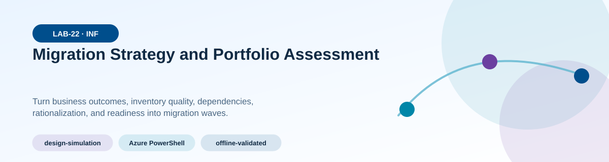
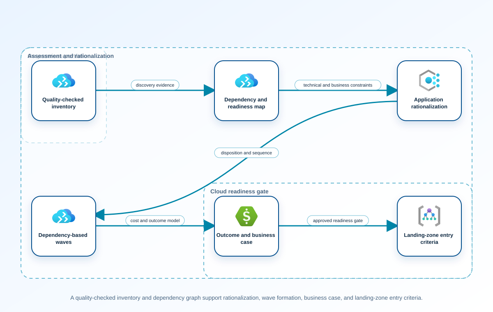
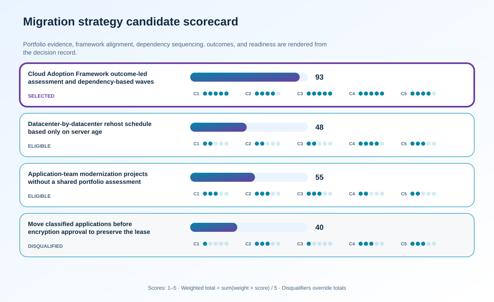

<!-- BEGIN GENERATED AZ305 V1 -->
# LAB-22 — Migration Strategy and Portfolio Assessment



<div class="az305-badges" aria-label="Lab classification">
  <span class="az305-mode-badge">design-simulation</span>
  <span class="az305-lane-badge">Azure PowerShell</span>
  <span class="az305-status">offline-validated</span>
</div>

## 1. Navigation

[← LAB-21](../21-cache-configuration-delivery/README.md) · [Lab catalog](../README.md) · [LAB-23 →](../23-workload-data-migration/README.md)

## 2. Scenario and completion contract

Proseware Energy must leave two leased datacenters within thirty months while improving security and reducing operational toil. Its portfolio contains commercial packages, custom web systems, tightly coupled databases, unsupported operating systems, engineering file shares, and applications whose owners or dependencies are uncertain. Executives initially asked for a simple server-count migration schedule, but that would hide business outcomes, compliance constraints, application affinity, readiness gaps, and landing-zone dependencies. The architecture team needs an offline assessment that follows the Cloud Adoption Framework, creates defensible rationalization decisions, and produces prioritized migration waves. This lab ends with approved scope and wave sequencing; it does not execute workload or data migration.

- Architect role: Cloud adoption and migration strategy architect
- Outcome: Create an outcome-led migration strategy, assessed portfolio, rationalization record, business case, and dependency-aware wave plan ready for detailed execution design.
- Duration: 165 minutes
- Difficulty: advanced
- Cost class: none
- Completion: all five checkpoint assertions, final validation, decision revision, and cleanup review are complete.

## 3. Objective-to-evidence map

| Objective | Requirement | Checkpoint |
| --- | --- | --- |
| `INF-MIG-01` | `LAB22-REQ-01` | [`LAB22-CP01`](#checkpoint-1) |
| `INF-MIG-02` | `LAB22-REQ-02` | [`LAB22-CP02`](#checkpoint-2) |
| `INF-MIG-01` | `LAB22-REQ-03` | [`LAB22-CP03`](#checkpoint-3) |
| `INF-MIG-02` | `LAB22-REQ-04` | [`LAB22-CP04`](#checkpoint-4) |
| `INF-MIG-01` | `LAB22-REQ-05` | [`LAB22-CP05`](#checkpoint-5) |

## 4. Business and quality requirements

Business outcome: Exit the datacenters on schedule while prioritizing measurable value and preventing unsupported or highly coupled workloads from entering unsafe migration waves.

- `LAB22-REQ-01` — The strategy connects datacenter exit, resilience, security, sustainability, and cost outcomes to owners, measures, constraints, and decision dates.
- `LAB22-REQ-02` — The inventory covers applications, servers, databases, file data, owners, lifecycle, support, classification, performance, cost, and business criticality.
- `LAB22-REQ-03` — The assessment maps runtime, identity, DNS, network, database, batch, licensing, operational, and business-process dependencies with confidence levels.
- `LAB22-REQ-04` — Every application has a justified disposition, target concept, remediation, wave, exit criterion, rollback option, and owner; waves respect dependencies and team capacity.
- `LAB22-REQ-05` — The business case includes migration and parallel-run costs, licenses, people, risk contingency, benefits, assumptions, and landing-zone readiness gates.

Scenario facts:

- **Data:** Portfolio records contain dependency, classification, owner, cost, readiness, disposition, risk, and outcome measures.
- **Scale:** Multiple datacenters and coupled applications form migration waves; exact server count is intentionally inventory-derived.
- **Latency:** Migration program latency is measured as assessment-to-wave lead time and cutover outage, not end-user request latency.
- **Availability:** Coexistence and rollback preserve service while dependencies move; unsupported wave splits are explicitly blocked.
- **RTO:** Each workload retains its business continuity target during migration; the portfolio has no single meaningful RTO.
- **RPO:** Data synchronization and rollback points are chosen per workload and cannot be inferred from the wave schedule.
- **Budget:** The earlier lease exit raises temporary coexistence and acceleration cost, which is balanced against six months of avoided facility expense.

Constraints:

- Migration waves must prioritize measurable outcomes and dependency safety rather than server age alone.
- One lease ends six months earlier while two classified applications cannot move until encryption evidence is approved.
- Use only the Azure PowerShell command lane for learner implementation.
- Keep all live changes behind explicit execution and acknowledgement switches.
- Retain only sanitized command evidence and synthetic fixture identifiers.

Assumptions:

- Application owners validate dependencies, disposition, business value, and blackout periods in the portfolio register.
- Classified workloads can remain temporarily in an approved source or coexistence location after the first lease exit.
- West Europe is the configurable primary example and North Europe is the configurable secondary example.
- The learner has administrator-level Azure operations knowledge but receives no pre-existing authenticated context.
- Offline fixtures demonstrate contract behavior rather than live Azure service behavior.

## 5. Architecture diagram and walkthrough



A quality-checked inventory and dependency graph support rationalization, wave formation, business case, and landing-zone entry criteria. The labelled nodes, boundaries, and edges are deterministically rendered from the portable `diagrams/architecture.mmd` source and the frozen visual registry.

## 6. Concept primer and candidate architectures

Architecture decisions translate measurable requirements into a deliberate service and operating model. A candidate is viable only when every mandatory constraint is met; convenience or familiarity cannot compensate for a disqualifier.

- **Cloud Adoption Framework outcome-led assessment and dependency-based waves** (eligible) — Outcome-led assessment joins readiness, value, dependency, governance, and measurable success before workloads enter waves.
- **Datacenter-by-datacenter rehost schedule based only on server age** (eligible) — Facility ordering supports lease planning but can split applications from dependencies and carry unresolved risk into Azure.
- **Application-team modernization projects without a shared portfolio assessment** (eligible) — Team autonomy can accelerate local redesign, though shared dependencies, landing-zone readiness, and value reporting become fragmented.
- **Move classified applications before encryption approval to preserve the lease schedule** (ineligible) — Advancing classified systems may simplify facility closure but knowingly crosses a regulatory release gate. Disqualifier: LAB22-REQ-04 requires mandatory compliance evidence before a classified workload can enter a migration wave.

## 7. Decision, ADR, and Well-Architected review

Criteria weights are C1 30, C2 25, C3 20, C4 15, and C5 10. Weighted totals use `sum(weight × score) / 5`.



| Candidate | Eligible | C1 | C2 | C3 | C4 | C5 | Weighted /100 |
| --- | ---: | ---: | ---: | ---: | ---: | ---: | ---: |
| Cloud Adoption Framework outcome-led assessment and dependency-based waves | yes | 5 | 4 | 5 | 5 | 4 | 93 |
| Datacenter-by-datacenter rehost schedule based only on server age | yes | 2 | 2 | 2 | 4 | 3 | 48 |
| Application-team modernization projects without a shared portfolio assessment | yes | 3 | 3 | 3 | 2 | 2 | 55 |
| Move classified applications before encryption approval to preserve the lease schedule | no | 1 | 3 | 1 | 3 | 3 | 40 |

Selected design: **Cloud Adoption Framework outcome-led assessment and dependency-based waves**. `ADR-LAB22-001` records the accepted reasoning. Review Reliability, Security, Cost Optimization, Operational Excellence, and Performance Efficiency in `design/decision.yml`; no pillar is implied by another.

Rejected alternatives:

- **Datacenter-by-datacenter rehost schedule based only on server age:** Server age is not a sufficient readiness or value measure and produces unsafe dependency cuts.
- **Application-team modernization projects without a shared portfolio assessment:** Uncoordinated projects cannot reliably satisfy the fixed lease exit or portfolio risk controls.
- **Move classified applications before encryption approval to preserve the lease schedule:** It is disqualified because lease pressure cannot override mandatory encryption approval.

Architecture risks:

- **Risk:** The accelerated facility wave can strand an application whose dependency is blocked by classification review. **Mitigation:** Model temporary coexistence, dependency proxies, or an approved alternate hosting location before wave approval.
- **Risk:** Outcome measures may be replaced by completion counts once schedule pressure rises. **Mitigation:** Keep value, reliability, cost, and risk measures in the wave exit gate alongside migrated-server count.

Well-Architected consequences:

<div class="az305-waf-grid">
<article class="az305-waf-card"><h3>Reliability</h3><p>Dependency-based waves, coexistence, and rollback protect service during portfolio transition.</p></article>
<article class="az305-waf-card"><h3>Security</h3><p>Classification and encryption evidence are hard gates rather than schedule-adjustable preferences.</p></article>
<article class="az305-waf-card"><h3>Cost Optimization</h3><p>Lease avoidance, dual running, remediation, and target run cost are evaluated in one wave business case.</p></article>
<article class="az305-waf-card"><h3>Operational Excellence</h3><p>Owners, decisions, readiness evidence, and outcome measures make wave approval reviewable.</p></article>
<article class="az305-waf-card"><h3>Performance Efficiency</h3><p>Migration-factory capacity is allocated to ready waves instead of blocked or low-value server batches.</p></article>
</div>

ADR consequences:

- The first facility wave accelerates only workloads whose dependencies and landing-zone controls are ready.
- Classified applications receive a documented coexistence path and cannot move on a schedule exception.

## 8. Inputs, permissions, licensing, cost, and analogue

Use configurable `Location` (`AZ305_LOCATION`, default West Europe) and `SecondaryLocation` (`AZ305_SECONDARY_LOCATION`, default North Europe). Every public input has an explicit `AZ305_*` fallback. Preview is the default; only Golden Lab 00 writes an intent-only `execute: false` preview record. Before an executed cloud command, the supplied subscription and tenant must exactly match the active CLI, Az, and—where applicable—Microsoft Graph contexts. `-Execute` crosses the execution boundary; cost-bearing and tenant-scoped paths also require their independent acknowledgement switches.

Safe analogue: Score the supplied synthetic portfolio and dependency graph, inject the lease and compliance changes, and produce revised waves offline.

Permissions: No Azure role is required for the portfolio simulation; production discovery would use read-only inventory, cost, dependency, and security evidence.

Licensing: Assessment tooling, migration services, hybrid management, target platforms, and extended datacenter operation require workload-specific estimates.

Cost boundary: Compare lease deadlines, dual-running periods, remediation, migration factory throughput, target run cost, and delayed value by wave.

## 9. Read-only preflight

```powershell
pwsh ./scripts/azure-powershell/Preflight.ps1 -RunId synthetic-220001
```

Synthetic sample: `{"labId":"LAB-22","track":"azure-powershell","result":"pass","note":"Local tool discovery only"}`. This is illustrative local output, not evidence captured from Azure.

## 10. Five guided checkpoints

<ol class="az305-checkpoint-timeline" aria-label="Five checkpoint learning path">
<li><a href="#checkpoint-1">Define strategy, outcomes, and constraints</a><span>LAB22-REQ-01 · LAB22-CP01</span></li>
<li><a href="#checkpoint-2">Build and quality-check the portfolio inventory</a><span>LAB22-REQ-02 · LAB22-CP02</span></li>
<li><a href="#checkpoint-3">Assess dependencies and readiness</a><span>LAB22-REQ-03 · LAB22-CP03</span></li>
<li><a href="#checkpoint-4">Rationalize applications and form waves</a><span>LAB22-REQ-04 · LAB22-CP04</span></li>
<li><a href="#checkpoint-5">Validate the business case and landing-zone entry criteria</a><span>LAB22-REQ-05 · LAB22-CP05</span></li>
</ol>

### Checkpoint 1: Define strategy, outcomes, and constraints

<a id="checkpoint-1"></a>

**Trace:** `INF-MIG-01` → `LAB22-REQ-01` → `LAB22-CP01`

```powershell
Get-AzSubscription -SubscriptionId $SubscriptionId | Select-Object Id, Name, State, TenantId
```

Expected evidence: The strategy connects datacenter exit, resilience, security, sustainability, and cost outcomes to owners, measures, constraints, and decision dates. Retain Save the strategy brief, outcome measures, mandatory constraints, accountable owners, and approval record.

Positive assertion:

```powershell
$subscription = Get-AzSubscription -SubscriptionId $SubscriptionId; if ($subscription.State -ne 'Enabled') { throw 'The proposed Azure subscription is not enabled.' }
```

Negative assertion:

```powershell
$context = Get-AzContext; if ($context.Subscription.Id -ne $SubscriptionId -or $context.Tenant.Id -ne $TenantId) { throw 'The current context does not match the assessed landing-zone scope.' }
```

Failure and retry: Undefined value and guardrails lead teams to optimize speed while creating risk or unnecessary cost. Reconcile outcomes with executive and workload owners, then repeat the constraint completeness review.

Cleanup dependency: Remove local subscription metadata from the assessment package if it is not required; no Azure state changes.

WAF consequence: Operational Excellence: explicit outcomes and ownership create durable governance for migration decisions.

### Checkpoint 2: Build and quality-check the portfolio inventory

<a id="checkpoint-2"></a>

**Trace:** `INF-MIG-02` → `LAB22-REQ-02` → `LAB22-CP02`

```powershell
$portfolio = Import-Csv artifacts/portfolio.csv; $portfolio | Group-Object businessCriticality, environment | Select-Object Name, Count
```

Expected evidence: The inventory covers applications, servers, databases, file data, owners, lifecycle, support, classification, performance, cost, and business criticality. Retain Preserve the normalized portfolio, provenance per field, data-quality score, and explicit unknowns register.

Positive assertion:

```powershell
$portfolio = Import-Csv artifacts/portfolio.csv; $required = @('applicationId','owner','businessCriticality','hosting','operatingSystem','dataClassification','monthlyCost'); foreach ($column in $required) { if ($column -notin $portfolio[0].PSObject.Properties.Name) { throw "Missing portfolio column: $column" } }
```

Negative assertion:

```powershell
$portfolio = Import-Csv artifacts/portfolio.csv; $invalid = $portfolio | Where-Object { [string]::IsNullOrWhiteSpace($_.applicationId) -or [string]::IsNullOrWhiteSpace($_.owner) -or $_.businessCriticality -notin @('tier-1','tier-2','tier-3') }; if ($invalid) { throw 'The portfolio contains incomplete or invalid records.' }
```

Failure and retry: False precision in incomplete inventory produces unreliable cost and wave estimates. Resolve the highest-impact unknowns with owners and rerun deterministic completeness and uniqueness checks.

Cleanup dependency: Delete raw exports containing sensitive hostnames after producing the approved sanitized portfolio.

WAF consequence: Security: classification and support-state evidence prevents regulated or vulnerable systems from entering an unsuitable path.

### Checkpoint 3: Assess dependencies and readiness

<a id="checkpoint-3"></a>

**Trace:** `INF-MIG-01` → `LAB22-REQ-03` → `LAB22-CP03`

```powershell
$dependencies = Import-Csv artifacts/dependencies.csv; $dependencies | Sort-Object sourceApplicationId, targetApplicationId | Format-Table sourceApplicationId, targetApplicationId, protocol, criticality
```

Expected evidence: The assessment maps runtime, identity, DNS, network, database, batch, licensing, operational, and business-process dependencies with confidence levels. Retain Save the dependency graph, confidence ratings, readiness blockers, remediation owners, and discovery limitations.

Positive assertion:

```powershell
$portfolio = Import-Csv artifacts/portfolio.csv; $dependencies = Import-Csv artifacts/dependencies.csv; $ids = @($portfolio.applicationId); if ($dependencies | Where-Object { $_.sourceApplicationId -notin $ids -or $_.targetApplicationId -notin $ids }) { throw 'A dependency references an unknown application.' }
```

Negative assertion:

```powershell
$dependencies = Import-Csv artifacts/dependencies.csv; if ($dependencies | Where-Object { $_.criticality -eq 'required' -and [string]::IsNullOrWhiteSpace($_.protocol) }) { throw 'A required dependency has no protocol or interface evidence.' }
```

Failure and retry: Hidden coupling can extend an outage, force emergency rollback, or preserve expensive hybrid dependencies. Run targeted owner interviews or discovery against the disputed cluster and regenerate its connected component.

Cleanup dependency: Remove raw network-flow and hostname exports according to classification policy; retain the sanitized graph.

WAF consequence: Reliability: dependency-aware waves keep recoverable business services together during transition.

### Checkpoint 4: Rationalize applications and form waves

<a id="checkpoint-4"></a>

**Trace:** `INF-MIG-02` → `LAB22-REQ-04` → `LAB22-CP04`

```powershell
$portfolio = Import-Csv artifacts/portfolio.csv; $portfolio | Group-Object disposition | Sort-Object Name | Select-Object Name, Count
```

Expected evidence: Every application has a justified disposition, target concept, remediation, wave, exit criterion, rollback option, and owner; waves respect dependencies and team capacity. Retain Preserve the rationalization matrix, scored priorities, wave map, exception approvals, and rejected sequencing alternatives.

Positive assertion:

```powershell
$portfolio = Import-Csv artifacts/portfolio.csv; $allowed = @('rehost','replatform','refactor','repurchase','retain','retire'); if ($portfolio | Where-Object { $_.disposition -notin $allowed -or [string]::IsNullOrWhiteSpace($_.wave) }) { throw 'A portfolio record lacks a valid disposition or wave.' }
```

Negative assertion:

```powershell
$portfolio = Import-Csv artifacts/portfolio.csv; if ($portfolio | Where-Object { $_.supportStatus -eq 'unsupported' -and $_.disposition -eq 'rehost' -and [string]::IsNullOrWhiteSpace($_.exceptionId) }) { throw 'An unsupported system is slated for rehost without an exception.' }
```

Failure and retry: A migration factory cannot compensate for poor disposition choices or an overloaded wave. Resolve mandatory blockers, regroup dependency clusters, and recompute capacity and value scores.

Cleanup dependency: Remove superseded local wave drafts while retaining the approved decision history.

WAF consequence: Cost Optimization: rationalization avoids migrating systems that should be retired or repurchased and exposes retained hybrid cost.

### Checkpoint 5: Validate the business case and landing-zone entry criteria

<a id="checkpoint-5"></a>

**Trace:** `INF-MIG-01` → `LAB22-REQ-05` → `LAB22-CP05`

```powershell
Get-AzPolicyAssignment -Scope "/subscriptions/$SubscriptionId" | Select-Object Name, DisplayName, EnforcementMode, Scope
```

Expected evidence: The business case includes migration and parallel-run costs, licenses, people, risk contingency, benefits, assumptions, and landing-zone readiness gates. Retain Archive scenario cash flows, assumptions, sensitivity ranges, required policy evidence, decision gates, and finance approval.

Positive assertion:

```powershell
$assignments = Get-AzPolicyAssignment -Scope "/subscriptions/$SubscriptionId"; if (-not $assignments) { throw 'No policy-assignment evidence supports landing-zone readiness.' }
```

Negative assertion:

```powershell
$groups = Get-AzResourceGroup; if ($groups | Where-Object { $_.Tags.purpose -eq 'migration-target' -and (-not $_.Tags.owner -or -not $_.Tags.costCenter) }) { throw 'A migration target resource group lacks ownership or cost attribution.' }
```

Failure and retry: An incomplete business case can make an infeasible schedule appear economically attractive. Correct the missing cost or readiness assumption and rerun base, downside, and delay scenarios.

Cleanup dependency: Remove detailed billing exports from the learning package and retain only normalized synthetic figures.

WAF consequence: Performance Efficiency: landing-zone capacity and service limits are validated before workload teams commit to a wave.

## 11. Final validation and interpretation

Run `Validate.ps1 -Mode Deployment -Execute` only after an executed run has state and you are authorized to issue the ten read-only checkpoint inspections. Without `-Execute`, ordinary deployment validation records `partial` and exits `2`; Golden Lab 00 alone can validate its intent-only preview locally. Exit `0` means all required assertions pass, `1` means at least one failed, and `2` means the outcome is gated or partial. Positive and negative commands execute independently, so one failure never suppresses its paired assertion.

## 12. Material change request

The first datacenter lease now ends six months earlier, but the regulator prohibits moving two classified applications until encryption evidence is approved.

Revised solution: select **Cloud Adoption Framework outcome-led assessment and dependency-based waves**. LAB22-REQ-04 requires dependency-safe waves and explicit readiness gates, so ready workloads advance for the lease exit while classified systems remain behind encryption approval.

Revised Well-Architected consequences:

- **Reliability:** Coexistence prevents an accelerated wave from severing blocked dependencies.
- **Security:** Classified applications remain behind the encryption-evidence gate.
- **Cost Optimization:** Six months of facility cost is compared transparently with temporary hosting and acceleration expense.
- **Operational Excellence:** Revised wave decisions record owner, blocker, exit evidence, and outcome measure.
- **Performance Efficiency:** Migration teams focus on ready dependency groups instead of spending capacity on compliance-blocked systems.

## 13. Architect job challenge

Rebalance the waves to accelerate independent workloads, retain the classified dependency cluster temporarily, quantify dual-running cost, and preserve a credible exit milestone without disguising the exception.

## 14. Troubleshooting, cleanup, and residual verification

- If portfolio totals differ between worksheets, establish one application identifier and reconcile duplicates before scoring.
- If dependency discovery conflicts with owner interviews, retain both sources and lower confidence until a targeted test resolves the difference.
- If the business case changes dramatically with one assumption, report sensitivity rather than presenting a single deterministic savings number.

Cleanup previews nonempty state in reverse dependency order, writes `partial`, and exits `2`; an already empty run is completed locally and idempotently. Executed cleanup rechecks the exact live ID plus `purpose`, `labId`, `runId`, and `expiresOn` immediately before each removal, persists state after every absent or removed object, stops on the first dependency failure, and refuses unresolved pre-existing settings. It never automates purge. Finish with `Validate.ps1 -Mode PostCleanup`; the required residual count is zero.

## 15. Exam debrief, assessment, sources, and navigation

Explain the recommendation in terms of requirements, rejected alternatives, failure behavior, and all five WAF pillars. Complete `assessment/QUESTIONS.md`, then use the separately excluded answer key for remediation.

- [Plan your migration with the Cloud Adoption Framework](https://learn.microsoft.com/en-us/azure/cloud-adoption-framework/migrate/plan-migration)
- [Azure Well-Architected Framework](https://learn.microsoft.com/en-us/azure/well-architected/)

[← LAB-21](../21-cache-configuration-delivery/README.md) · [Lab catalog](../README.md) · [LAB-23 →](../23-workload-data-migration/README.md)

## 16. Synchronized lifecycle-script appendix

### Preflight.ps1

```powershell
[CmdletBinding()]
param(
    [string]$SubscriptionId = $env:AZ305_SUBSCRIPTION_ID,
    [string]$TenantId = $env:AZ305_TENANT_ID,
    [ValidatePattern('^[a-z0-9-]{6,64}$')][string]$RunId = $env:AZ305_RUN_ID,
    [string]$Location = $(if ($env:AZ305_LOCATION) { $env:AZ305_LOCATION } else { 'westeurope' }),
    [string]$SecondaryLocation = $(if ($env:AZ305_SECONDARY_LOCATION) { $env:AZ305_SECONDARY_LOCATION } else { 'northeurope' }),
    [string]$ResourceGroup = $(if ($env:AZ305_RESOURCE_GROUP) { $env:AZ305_RESOURCE_GROUP } else { "rg-az305-$RunId" }),
    [string]$WorkloadName = $(if ($env:AZ305_WORKLOAD_NAME) { $env:AZ305_WORKLOAD_NAME } else { "az305-$RunId" }),
    [string]$ExpiresOn = $(if ($env:AZ305_EXPIRES_ON) { $env:AZ305_EXPIRES_ON } else { (Get-Date).ToUniversalTime().AddDays(1).ToString('yyyy-MM-dd') }),
    [switch]$Execute,
    [switch]$AcknowledgeCost,
    [switch]$AcknowledgeTenantChange
)

$ErrorActionPreference = 'Stop'
$PSNativeCommandUseErrorActionPreference = $true
if (-not $RunId) { [Console]::Error.WriteLine('RunId or AZ305_RUN_ID is required.'); exit 2 }
# Every lifecycle entrypoint intentionally exposes the same public parameter contract.
@($SubscriptionId, $TenantId, $RunId, $Location, $SecondaryLocation, $ResourceGroup, $WorkloadName, $ExpiresOn, $Execute, $AcknowledgeCost, $AcknowledgeTenantChange) | Out-Null

$requiredCommands = @('pwsh')
$missing = @($requiredCommands | Where-Object { -not (Get-Command $_ -ErrorAction SilentlyContinue) })
if ($missing.Count -gt 0) {
    Write-Error "Missing local commands: $($missing -join ', ')"
    exit 1
}
$requiredCmdlets = @('Get-AzContext', 'Get-AzPolicyAssignment', 'Get-AzResourceGroup', 'Get-AzSubscription')
$missingCmdlets = @($requiredCmdlets | Where-Object { -not (Get-Command $_ -ErrorAction SilentlyContinue) })
if ($missingCmdlets.Count -gt 0) {
    Write-Error "Missing local cmdlets: $($missingCmdlets -join ', ')"
    exit 1
}

[pscustomobject]@{
    labId = 'LAB-22'
    track = 'azure-powershell'
    implementationMode = 'design-simulation'
    result = 'pass'
    note = 'Local tool discovery only; no Azure or Microsoft Graph request was made.'
} | ConvertTo-Json
exit 0
```

### Setup.ps1

```powershell
[CmdletBinding()]
param(
    [string]$SubscriptionId = $env:AZ305_SUBSCRIPTION_ID,
    [string]$TenantId = $env:AZ305_TENANT_ID,
    [ValidatePattern('^[a-z0-9-]{6,64}$')][string]$RunId = $env:AZ305_RUN_ID,
    [string]$Location = $(if ($env:AZ305_LOCATION) { $env:AZ305_LOCATION } else { 'westeurope' }),
    [string]$SecondaryLocation = $(if ($env:AZ305_SECONDARY_LOCATION) { $env:AZ305_SECONDARY_LOCATION } else { 'northeurope' }),
    [string]$ResourceGroup = $(if ($env:AZ305_RESOURCE_GROUP) { $env:AZ305_RESOURCE_GROUP } else { "rg-az305-$RunId" }),
    [string]$WorkloadName = $(if ($env:AZ305_WORKLOAD_NAME) { $env:AZ305_WORKLOAD_NAME } else { "az305-$RunId" }),
    [string]$ExpiresOn = $(if ($env:AZ305_EXPIRES_ON) { $env:AZ305_EXPIRES_ON } else { (Get-Date).ToUniversalTime().AddDays(1).ToString('yyyy-MM-dd') }),
    [switch]$Execute,
    [switch]$AcknowledgeCost,
    [switch]$AcknowledgeTenantChange
)

$ErrorActionPreference = 'Stop'
$PSNativeCommandUseErrorActionPreference = $true
if (-not $RunId) { [Console]::Error.WriteLine('RunId or AZ305_RUN_ID is required.'); exit 2 }
# Every lifecycle entrypoint intentionally exposes the same public parameter contract.
@($SubscriptionId, $TenantId, $RunId, $Location, $SecondaryLocation, $ResourceGroup, $WorkloadName, $ExpiresOn, $Execute, $AcknowledgeCost, $AcknowledgeTenantChange) | Out-Null

$LabRoot = Split-Path (Split-Path $PSScriptRoot -Parent) -Parent
$StateRoot = Join-Path $LabRoot ".state/$RunId"
$StatePath = Join-Path $StateRoot 'run.json'

function Assert-ExactExecutionContext {
    [CmdletBinding()]
    param([string]$ExpectedSubscriptionId, [string]$ExpectedTenantId)
    if ([string]::IsNullOrWhiteSpace($ExpectedSubscriptionId) -or [string]::IsNullOrWhiteSpace($ExpectedTenantId)) { throw 'SubscriptionId and TenantId are required before an Azure request.' }
    $azContext = Get-AzContext -ErrorAction Stop
    if (-not $azContext -or [string]$azContext.Subscription.Id -ine $ExpectedSubscriptionId -or [string]$azContext.Tenant.Id -ine $ExpectedTenantId) {
        throw 'The active Azure PowerShell subscription or tenant does not exactly match the requested context.'
    }
}

function Save-RunState {
    [CmdletBinding()]
    param([Parameter(Mandatory)]$State)
    $temporaryPath = "$StatePath.tmp"
    $State | ConvertTo-Json -Depth 20 | Set-Content -LiteralPath $temporaryPath -Encoding utf8NoBOM
    Move-Item -LiteralPath $temporaryPath -Destination $StatePath -Force
}

function Assert-SafeStateValue {
    [CmdletBinding()]
    param($Value)
    $serialized = $Value | ConvertTo-Json -Depth 12 -Compress
    if ($serialized -match '(?i)"(?:token|password|secret|certificate|connectionString|sas|clientSecret|accessToken|refreshToken|accountKey|privateKey)"\s*:') {
        throw 'A prohibited sensitive field name was returned; state capture is refused.'
    }
}

function Convert-CheckpointOutput {
    [CmdletBinding()]
    param($Value)
    if ($Value -is [string]) { $raw = [string]$Value }
    elseif ($Value -is [System.Collections.IEnumerable] -and @($Value | Where-Object { $_ -isnot [string] }).Count -eq 0) { $raw = @($Value) -join "`n" }
    else { return $Value }
    if ([string]::IsNullOrWhiteSpace($raw)) { return $null }
    try { return ($raw | ConvertFrom-Json -Depth 100) } catch { return $Value }
}

function Get-ReturnedResourceId {
    [CmdletBinding()]
    param($Value)
    $seen = [System.Collections.Generic.HashSet[string]]::new([System.StringComparer]::OrdinalIgnoreCase)
    $results = [System.Collections.Generic.List[string]]::new()
    function Add-ArmId {
        param($Candidate)
        if ($Candidate -is [string] -and $Candidate -match '^/subscriptions/[0-9a-f-]+/(?:resourceGroups/[^/]+(?:/providers/.+)?|providers/.+)$' -and $Candidate -notmatch '/providers/Microsoft\.Resources/deployments/') {
            if ($seen.Add($Candidate)) { $results.Add($Candidate) }
        }
    }
    function Find-DeploymentOutputId {
        param($Item, [int]$Depth)
        if ($null -eq $Item -or $Depth -gt 12) { return }
        if ($Item -is [string]) { Add-ArmId -Candidate $Item; return }
        if ($Item -is [System.Collections.IDictionary]) { foreach ($key in $Item.Keys) { Find-DeploymentOutputId -Item $Item[$key] -Depth ($Depth + 1) }; return }
        if ($Item -is [System.Collections.IEnumerable]) { foreach ($entry in $Item) { Find-DeploymentOutputId -Item $entry -Depth ($Depth + 1) }; return }
        foreach ($property in @($Item.PSObject.Properties | Where-Object { $_.MemberType -in @('NoteProperty', 'Property') })) { Find-DeploymentOutputId -Item $property.Value -Depth ($Depth + 1) }
    }
    foreach ($rootItem in @($Value)) {
        if ($rootItem -is [System.Collections.IDictionary]) {
            foreach ($name in @('id', 'resourceId')) { if ($rootItem.Contains($name)) { Add-ArmId -Candidate $rootItem[$name] } }
            if ($rootItem.Contains('properties') -and $rootItem.properties -and $rootItem.properties.outputs) { Find-DeploymentOutputId -Item $rootItem.properties.outputs -Depth 0 }
            continue
        }
        foreach ($name in @('Id', 'ResourceId')) {
            $property = $rootItem.PSObject.Properties[$name]
            if ($property) { Add-ArmId -Candidate $property.Value }
        }
        if ($rootItem.PSObject.Properties['Properties'] -and $rootItem.Properties -and $rootItem.Properties.outputs) {
            Find-DeploymentOutputId -Item $rootItem.Properties.outputs -Depth 0
        }
    }
    return @($results)
}

function Get-PlannedDeploymentResourceId {
    [CmdletBinding()]
    param($Value)
    $seen = [System.Collections.Generic.HashSet[string]]::new([System.StringComparer]::OrdinalIgnoreCase)
    $results = [System.Collections.Generic.List[string]]::new()
    foreach ($change in @($Value.changes)) {
        $candidate = [string]$change.resourceId
        if ($candidate -match '^/subscriptions/[0-9a-f-]+/(?:resourceGroups/[^/]+(?:/providers/.+)?|providers/.+)$' -and $candidate -notmatch '/providers/Microsoft\.Resources/deployments/' -and $seen.Add($candidate)) {
            $results.Add($candidate)
        }
    }
    return @($results)
}

function Assert-InputSubscriptionScope {
    [CmdletBinding()]
    param($Inputs, [string]$ExpectedSubscriptionId)
    $entries = if ($Inputs -is [System.Collections.IDictionary]) {
        @($Inputs.GetEnumerator())
    } else {
        @($Inputs.PSObject.Properties | ForEach-Object { [pscustomobject]@{ Key = $_.Name; Value = $_.Value } })
    }
    foreach ($entry in $entries) {
        if ($entry.Value -is [string] -and [string]$entry.Value -match '^/subscriptions/([^/]+)/') {
            if ($Matches[1] -ine $ExpectedSubscriptionId) { throw "Input $($entry.Key) belongs to a different subscription." }
        }
    }
}

function Assert-ManagedMutation {
    [CmdletBinding()]
    param($State, [string]$CheckpointId, [bool]$CarriesOwnership, [object[]]$TargetResourceIds)
    if ($CarriesOwnership) { return }
    $targets = @($TargetResourceIds | Where-Object { $_ -is [string] -and $_ -match '^/subscriptions/' })
    if ($targets.Count -eq 0) { throw "$CheckpointId refuses an untagged mutation because no exact ARM target ID was supplied." }
    $knownIds = @($State.managedObjects | ForEach-Object { [string]$_.id })
    if ($knownIds.Count -eq 0) { throw "$CheckpointId refuses to modify a pre-existing object because no run-owned parent has been recorded." }
    foreach ($target in $targets) {
        $related = @($knownIds | Where-Object { $target -ieq $_ -or $target.StartsWith("$_/", [System.StringComparison]::OrdinalIgnoreCase) -or $_.StartsWith("$target/", [System.StringComparison]::OrdinalIgnoreCase) }).Count -gt 0
        if (-not $related) { throw "$CheckpointId refuses a mutation outside the exact run-owned resource boundary." }
    }
}

$executionInputs = [ordered]@{ subscriptionId = $SubscriptionId; tenantId = $TenantId; location = $Location; secondaryLocation = $SecondaryLocation; resourceGroup = $ResourceGroup; workloadName = $WorkloadName; expiresOn = $ExpiresOn }

if (-not $Execute) {
    Write-Output '[preview] No cloud command was called and no state was created.'
    Write-Output '[preview] Re-run with -Execute only in an authorized disposable environment.'
    exit 0
}
[Console]::Error.WriteLine('This design-simulation setup is offline-only and refuses its authored cloud commands.'); exit 2
# This default exercise does not require a cost acknowledgement.
# This lab does not perform a tenant-scoped change by default.
# This execution path has no additional required lab input.

try {
    Assert-ExactExecutionContext -ExpectedSubscriptionId $SubscriptionId -ExpectedTenantId $TenantId
    Assert-InputSubscriptionScope -Inputs $executionInputs -ExpectedSubscriptionId $SubscriptionId
    Assert-SafeStateValue -Value $executionInputs
}
catch {
    [Console]::Error.WriteLine("Execution is gated by context or input validation: $($_.Exception.Message)")
    exit 2
}

# Recovery state is persisted before the first possible mutation below.
if (Test-Path -LiteralPath $StatePath) {
    [Console]::Error.WriteLine('Run state already exists. Choose a new RunId or complete the recorded cleanup; existing recovery state will not be overwritten.')
    exit 2
}
New-Item -ItemType Directory -Path $StateRoot -Force | Out-Null
$state = [ordered]@{
    schemaVersion = '1.0.0'; labId = 'LAB-22'; runId = $RunId; track = 'azure-powershell'
    implementationMode = 'design-simulation'; status = 'initialized'
    createdAt = (Get-Date).ToUniversalTime().ToString('o'); execute = $true
    parameters = $executionInputs
    managedObjects = @(); originalSettings = @()
}
Save-RunState -State $state
# Planning-only execution remains initialized until its bounded checks complete.

$originalLocation = Get-Location
try {
    Set-Location -LiteralPath $LabRoot
    # 22-CP01: Define strategy, outcomes, and constraints
    $stepResult = & { Get-AzSubscription -SubscriptionId $SubscriptionId | Select-Object Id, Name, State, TenantId }
    $null = $stepResult

    # 22-CP02: Build and quality-check the portfolio inventory
    $stepResult = & { $portfolio = Import-Csv artifacts/portfolio.csv; $portfolio | Group-Object businessCriticality, environment | Select-Object Name, Count }
    $null = $stepResult

    # 22-CP03: Assess dependencies and readiness
    $stepResult = & { $dependencies = Import-Csv artifacts/dependencies.csv; $dependencies | Sort-Object sourceApplicationId, targetApplicationId | Format-Table sourceApplicationId, targetApplicationId, protocol, criticality }
    $null = $stepResult

    # 22-CP04: Rationalize applications and form waves
    $stepResult = & { $portfolio = Import-Csv artifacts/portfolio.csv; $portfolio | Group-Object disposition | Sort-Object Name | Select-Object Name, Count }
    $null = $stepResult

    # 22-CP05: Validate the business case and landing-zone entry criteria
    $stepResult = & { Get-AzPolicyAssignment -Scope "/subscriptions/$SubscriptionId" | Select-Object Name, DisplayName, EnforcementMode, Scope }
    $null = $stepResult

    $state.status = 'planned'
    Save-RunState -State $state
} catch {
    $state.status = 'failed'
    Save-RunState -State $state
    Write-Error $_
    exit 1
} finally {
    Set-Location -LiteralPath $originalLocation
}
exit 0
```

### Validate.ps1

```powershell
[CmdletBinding()]
param(
    [string]$SubscriptionId = $env:AZ305_SUBSCRIPTION_ID,
    [string]$TenantId = $env:AZ305_TENANT_ID,
    [ValidatePattern('^[a-z0-9-]{6,64}$')][string]$RunId = $env:AZ305_RUN_ID,
    [string]$Location = $(if ($env:AZ305_LOCATION) { $env:AZ305_LOCATION } else { 'westeurope' }),
    [string]$SecondaryLocation = $(if ($env:AZ305_SECONDARY_LOCATION) { $env:AZ305_SECONDARY_LOCATION } else { 'northeurope' }),
    [string]$ResourceGroup = $(if ($env:AZ305_RESOURCE_GROUP) { $env:AZ305_RESOURCE_GROUP } else { "rg-az305-$RunId" }),
    [string]$WorkloadName = $(if ($env:AZ305_WORKLOAD_NAME) { $env:AZ305_WORKLOAD_NAME } else { "az305-$RunId" }),
    [string]$ExpiresOn = $(if ($env:AZ305_EXPIRES_ON) { $env:AZ305_EXPIRES_ON } else { (Get-Date).ToUniversalTime().AddDays(1).ToString('yyyy-MM-dd') }),
    [ValidateSet('Deployment', 'PostCleanup')][string]$Mode = 'Deployment',
    [switch]$Execute,
    [switch]$AcknowledgeCost,
    [switch]$AcknowledgeTenantChange
)

$ErrorActionPreference = 'Stop'
$PSNativeCommandUseErrorActionPreference = $true
if (-not $RunId) { [Console]::Error.WriteLine('RunId or AZ305_RUN_ID is required.'); exit 2 }
# Every lifecycle entrypoint intentionally exposes the same public parameter contract.
@($SubscriptionId, $TenantId, $RunId, $Location, $SecondaryLocation, $ResourceGroup, $WorkloadName, $ExpiresOn, $Mode, $Execute, $AcknowledgeCost, $AcknowledgeTenantChange) | Out-Null

$LabRoot = Split-Path (Split-Path $PSScriptRoot -Parent) -Parent
$StateRoot = Join-Path $LabRoot ".state/$RunId"
$RunPath = Join-Path $StateRoot 'run.json'
$ValidationPath = Join-Path $StateRoot 'validation.json'

function Assert-ExactExecutionContext {
    [CmdletBinding()]
    param([string]$ExpectedSubscriptionId, [string]$ExpectedTenantId)
    if ([string]::IsNullOrWhiteSpace($ExpectedSubscriptionId) -or [string]::IsNullOrWhiteSpace($ExpectedTenantId)) { throw 'SubscriptionId and TenantId are required before an Azure request.' }
    $azContext = Get-AzContext -ErrorAction Stop
    if (-not $azContext -or [string]$azContext.Subscription.Id -ine $ExpectedSubscriptionId -or [string]$azContext.Tenant.Id -ine $ExpectedTenantId) {
        throw 'The active Azure PowerShell subscription or tenant does not exactly match the requested context.'
    }
}


if (-not (Test-Path -LiteralPath $RunPath)) {
    Write-Warning 'No run state exists; validation is gated.'
    exit 2
}
$state = Get-Content -LiteralPath $RunPath -Raw | ConvertFrom-Json
$assertions = [System.Collections.Generic.List[object]]::new()
function Add-ValidationAssertion {
    [CmdletBinding()]
    param([string]$Id, [ValidateSet('positive', 'negative')][string]$Kind, [bool]$Passed, [string]$Message)
    $assertions.Add([pscustomobject]@{ id = $Id; kind = $Kind; passed = $Passed; message = $Message })
}

function Save-ValidationArtifact {
    [CmdletBinding()]
    param([ValidateSet('pass', 'partial', 'fail')][string]$Result)
    $artifact = [ordered]@{ schemaVersion = '1.0.0'; labId = 'LAB-22'; runId = $RunId; mode = $Mode; result = $Result; validatedAt = (Get-Date).ToUniversalTime().ToString('o'); assertions = @($assertions) }
    $artifact | ConvertTo-Json -Depth 12 | Set-Content -LiteralPath $ValidationPath -Encoding utf8NoBOM
}

function Test-PositiveEvidence {
    [CmdletBinding()]
    param($Value)
    if ($Value -is [bool]) { return $Value }
    if ($null -eq $Value) { return $false }
    if ($Value -is [string]) { return -not [string]::IsNullOrWhiteSpace($Value) }
    if ($Value -is [System.Collections.IEnumerable]) { return @($Value).Count -gt 0 }
    return $true
}

function Test-NegativeEvidence {
    [CmdletBinding()]
    param($Value)
    if ($Value -is [bool]) { return $Value }
    if ($null -eq $Value) { return $true }
    if ($Value -is [string]) { return [string]::IsNullOrWhiteSpace($Value) }
    if ($Value -is [System.Collections.IEnumerable]) { return @($Value).Count -eq 0 }
    $properties = @($Value.PSObject.Properties | Where-Object { $_.MemberType -in @('NoteProperty', 'Property') })
    if ($properties.Count -eq 0) { return $false }
    return @($properties | Where-Object { -not (Test-NegativeEvidence -Value $_.Value) }).Count -eq 0
}

function Test-ProhibitedStateField {
    [CmdletBinding()]
    param($Value)
    $serialized = $Value | ConvertTo-Json -Depth 20
    return $serialized -match '(?i)"(?:token|password|secret|certificate|connectionString|sas|clientSecret|accessToken|refreshToken|accountKey|privateKey)"\s*:'
}

function Assert-InputSubscriptionScope {
    [CmdletBinding()]
    param($Inputs, [string]$ExpectedSubscriptionId)
    $entries = if ($Inputs -is [System.Collections.IDictionary]) {
        @($Inputs.GetEnumerator())
    } else {
        @($Inputs.PSObject.Properties | ForEach-Object { [pscustomobject]@{ Key = $_.Name; Value = $_.Value } })
    }
    foreach ($entry in $entries) {
        if ($entry.Value -is [string] -and [string]$entry.Value -match '^/subscriptions/([^/]+)/' -and $Matches[1] -ine $ExpectedSubscriptionId) {
            throw "Input $($entry.Key) belongs to a different subscription."
        }
    }
}

$stateIdentityMatches = (
    $state.labId -ceq 'LAB-22' -and
    $state.runId -ceq $RunId -and
    $state.track -ceq 'azure-powershell' -and
    $state.implementationMode -ceq 'design-simulation' -and
    ([string]$state.parameters.subscriptionId -ieq $SubscriptionId -and [string]$state.parameters.tenantId -ieq $TenantId)
)
Add-ValidationAssertion -Id 'LAB22-VAL-POS-01' -Kind positive -Passed $stateIdentityMatches -Message 'Run identity, implementation mode, command track, tenant, and subscription exactly match the copied lab and requested run.'
$hasSensitiveName = Test-ProhibitedStateField -Value $state
Add-ValidationAssertion -Id 'LAB22-VAL-NEG-01' -Kind negative -Passed (-not $hasSensitiveName) -Message 'State contains no prohibited sensitive field name.'

if ($Mode -eq 'PostCleanup') {
    $cleanupPath = Join-Path $StateRoot 'cleanup.json'
    $cleanup = if (Test-Path -LiteralPath $cleanupPath) { Get-Content -LiteralPath $cleanupPath -Raw | ConvertFrom-Json } else { $null }
    Add-ValidationAssertion -Id 'LAB22-VAL-POS-02' -Kind positive -Passed ($null -ne $cleanup -and $cleanup.labId -ceq 'LAB-22' -and $cleanup.runId -ceq $RunId -and $cleanup.result -eq 'pass' -and $cleanup.ownershipVerified) -Message 'The exact run cleanup completed with verified ownership.'
    Add-ValidationAssertion -Id 'LAB22-VAL-NEG-02' -Kind negative -Passed ($null -ne $cleanup -and $cleanup.activeManagedObjects -eq 0 -and @($state.managedObjects).Count -eq 0 -and @($state.originalSettings).Count -eq 0 -and $state.status -eq 'cleaned') -Message 'No active managed object or unresolved original setting remains in cleanup or run state.'
    $postCleanupPassed = @($assertions | Where-Object { -not $_.passed }).Count -eq 0
    Save-ValidationArtifact -Result $(if ($postCleanupPassed) { 'pass' } else { 'fail' })
    if ($postCleanupPassed) { exit 0 }
    exit 1
}

Add-ValidationAssertion -Id 'LAB22-VAL-POS-02' -Kind positive -Passed ($state.status -eq 'planned') -Message 'The planning-only setup completed and remains planned; no deployment is implied.'
Add-ValidationAssertion -Id 'LAB22-VAL-NEG-02' -Kind negative -Passed (@($state.managedObjects | Where-Object { $_.tags.purpose -ne 'az305-lab' -or $_.tags.labId -ne 'LAB-22' -or $_.tags.runId -ne $RunId }).Count -eq 0) -Message 'No recorded object has a foreign ownership tag.'

if (@($assertions | Where-Object { -not $_.passed }).Count -gt 0) {
    Save-ValidationArtifact -Result 'fail'
    exit 1
}
if (-not $Execute) {
    # This lab has no special intent-only validation path.
    Save-ValidationArtifact -Result 'partial'
    Write-Warning 'Checkpoint validation is gated; re-run with -Execute after confirming the exact read-only context.'
    exit 2
}
Save-ValidationArtifact -Result 'partial'; [Console]::Error.WriteLine('Design-simulation validation is offline-only and refuses cloud commands.'); exit 2
$missingValidationInputs = @()
if ($missingValidationInputs.Count -gt 0) {
    Add-ValidationAssertion -Id 'LAB22-VAL-POS-CONTEXT' -Kind positive -Passed $false -Message 'One or more required non-secret validation inputs are missing.'
    Save-ValidationArtifact -Result 'partial'
    exit 2
}
try {
    Assert-ExactExecutionContext -ExpectedSubscriptionId $SubscriptionId -ExpectedTenantId $TenantId
    Assert-InputSubscriptionScope -Inputs $state.parameters -ExpectedSubscriptionId $SubscriptionId
    Add-ValidationAssertion -Id 'LAB22-VAL-POS-CONTEXT' -Kind positive -Passed $true -Message 'The active tenant and subscription exactly match the requested validation context.'
}
catch {
    Add-ValidationAssertion -Id 'LAB22-VAL-POS-CONTEXT' -Kind positive -Passed $false -Message 'Exact execution context could not be proven.'
    Save-ValidationArtifact -Result 'partial'
    exit 2
}

$originalLocation = Get-Location
try {
    Set-Location -LiteralPath $LabRoot
# LAB22-CP01: run both polarities even when one fails.
$positivePassed = $false
try {
    $global:LASTEXITCODE = 0
    $positiveEvidence = & { $subscription = Get-AzSubscription -SubscriptionId $SubscriptionId; if ($subscription.State -ne 'Enabled') { throw 'The proposed Azure subscription is not enabled.' } }
    $positivePassed = $true
    $null = $positiveEvidence
} catch { $positivePassed = $false }
Add-ValidationAssertion -Id 'LAB22-CP01-POS' -Kind positive -Passed $positivePassed -Message 'The strategy connects datacenter exit, resilience, security, sustainability, and cost outcomes to owners, measures, constraints, and decision dates.'

$negativePassed = $false
try {
    $global:LASTEXITCODE = 0
    $negativeEvidence = & { $context = Get-AzContext; if ($context.Subscription.Id -ne $SubscriptionId -or $context.Tenant.Id -ne $TenantId) { throw 'The current context does not match the assessed landing-zone scope.' } }
    $negativePassed = $true
    $null = $negativeEvidence
} catch { $negativePassed = $false }
Add-ValidationAssertion -Id 'LAB22-CP01-NEG' -Kind negative -Passed $negativePassed -Message 'A migration target stated only as a server count or deadline, with no measurable business outcome, must fail.'

# LAB22-CP02: run both polarities even when one fails.
$positivePassed = $false
try {
    $global:LASTEXITCODE = 0
    $positiveEvidence = & { $portfolio = Import-Csv artifacts/portfolio.csv; $required = @('applicationId','owner','businessCriticality','hosting','operatingSystem','dataClassification','monthlyCost'); foreach ($column in $required) { if ($column -notin $portfolio[0].PSObject.Properties.Name) { throw "Missing portfolio column: $column" } } }
    $positivePassed = $true
    $null = $positiveEvidence
} catch { $positivePassed = $false }
Add-ValidationAssertion -Id 'LAB22-CP02-POS' -Kind positive -Passed $positivePassed -Message 'The inventory covers applications, servers, databases, file data, owners, lifecycle, support, classification, performance, cost, and business criticality.'

$negativePassed = $false
try {
    $global:LASTEXITCODE = 0
    $negativeEvidence = & { $portfolio = Import-Csv artifacts/portfolio.csv; $invalid = $portfolio | Where-Object { [string]::IsNullOrWhiteSpace($_.applicationId) -or [string]::IsNullOrWhiteSpace($_.owner) -or $_.businessCriticality -notin @('tier-1','tier-2','tier-3') }; if ($invalid) { throw 'The portfolio contains incomplete or invalid records.' } }
    $negativePassed = $true
    $null = $negativeEvidence
} catch { $negativePassed = $false }
Add-ValidationAssertion -Id 'LAB22-CP02-NEG' -Kind negative -Passed $negativePassed -Message 'Duplicate IDs, absent owners, unknown licensing, or performance estimates presented as measurements must fail quality review.'

# LAB22-CP03: run both polarities even when one fails.
$positivePassed = $false
try {
    $global:LASTEXITCODE = 0
    $positiveEvidence = & { $portfolio = Import-Csv artifacts/portfolio.csv; $dependencies = Import-Csv artifacts/dependencies.csv; $ids = @($portfolio.applicationId); if ($dependencies | Where-Object { $_.sourceApplicationId -notin $ids -or $_.targetApplicationId -notin $ids }) { throw 'A dependency references an unknown application.' } }
    $positivePassed = $true
    $null = $positiveEvidence
} catch { $positivePassed = $false }
Add-ValidationAssertion -Id 'LAB22-CP03-POS' -Kind positive -Passed $positivePassed -Message 'The assessment maps runtime, identity, DNS, network, database, batch, licensing, operational, and business-process dependencies with confidence levels.'

$negativePassed = $false
try {
    $global:LASTEXITCODE = 0
    $negativeEvidence = & { $dependencies = Import-Csv artifacts/dependencies.csv; if ($dependencies | Where-Object { $_.criticality -eq 'required' -and [string]::IsNullOrWhiteSpace($_.protocol) }) { throw 'A required dependency has no protocol or interface evidence.' } }
    $negativePassed = $true
    $null = $negativeEvidence
} catch { $negativePassed = $false }
Add-ValidationAssertion -Id 'LAB22-CP03-NEG' -Kind negative -Passed $negativePassed -Message 'A wave that splits a hard dependency or treats low-confidence discovery as complete must fail.'

# LAB22-CP04: run both polarities even when one fails.
$positivePassed = $false
try {
    $global:LASTEXITCODE = 0
    $positiveEvidence = & { $portfolio = Import-Csv artifacts/portfolio.csv; $allowed = @('rehost','replatform','refactor','repurchase','retain','retire'); if ($portfolio | Where-Object { $_.disposition -notin $allowed -or [string]::IsNullOrWhiteSpace($_.wave) }) { throw 'A portfolio record lacks a valid disposition or wave.' } }
    $positivePassed = $true
    $null = $positiveEvidence
} catch { $positivePassed = $false }
Add-ValidationAssertion -Id 'LAB22-CP04-POS' -Kind positive -Passed $positivePassed -Message 'Every application has a justified disposition, target concept, remediation, wave, exit criterion, rollback option, and owner; waves respect dependencies and team capacity.'

$negativePassed = $false
try {
    $global:LASTEXITCODE = 0
    $negativeEvidence = & { $portfolio = Import-Csv artifacts/portfolio.csv; if ($portfolio | Where-Object { $_.supportStatus -eq 'unsupported' -and $_.disposition -eq 'rehost' -and [string]::IsNullOrWhiteSpace($_.exceptionId) }) { throw 'An unsupported system is slated for rehost without an exception.' } }
    $negativePassed = $true
    $null = $negativeEvidence
} catch { $negativePassed = $false }
Add-ValidationAssertion -Id 'LAB22-CP04-NEG' -Kind negative -Passed $negativePassed -Message 'Defaulting all systems to rehost, placing unresolved blockers in Wave 1, or separating a hard dependency must fail.'

# LAB22-CP05: run both polarities even when one fails.
$positivePassed = $false
try {
    $global:LASTEXITCODE = 0
    $positiveEvidence = & { $assignments = Get-AzPolicyAssignment -Scope "/subscriptions/$SubscriptionId"; if (-not $assignments) { throw 'No policy-assignment evidence supports landing-zone readiness.' } }
    $positivePassed = $true
    $null = $positiveEvidence
} catch { $positivePassed = $false }
Add-ValidationAssertion -Id 'LAB22-CP05-POS' -Kind positive -Passed $positivePassed -Message 'The business case includes migration and parallel-run costs, licenses, people, risk contingency, benefits, assumptions, and landing-zone readiness gates.'

$negativePassed = $false
try {
    $global:LASTEXITCODE = 0
    $negativeEvidence = & { $groups = Get-AzResourceGroup; if ($groups | Where-Object { $_.Tags.purpose -eq 'migration-target' -and (-not $_.Tags.owner -or -not $_.Tags.costCenter) }) { throw 'A migration target resource group lacks ownership or cost attribution.' } }
    $negativePassed = $true
    $null = $negativeEvidence
} catch { $negativePassed = $false }
Add-ValidationAssertion -Id 'LAB22-CP05-NEG' -Kind negative -Passed $negativePassed -Message 'Savings that omit dual running, remediation, support, connectivity, or decommission cost must fail.'

}
finally {
    Set-Location -LiteralPath $originalLocation
}

$passed = @($assertions | Where-Object { -not $_.passed }).Count -eq 0
Save-ValidationArtifact -Result $(if ($passed) { 'pass' } else { 'fail' })
if ($passed) { exit 0 }
exit 1
```

### Cleanup.ps1

```powershell
[CmdletBinding()]
param(
    [string]$SubscriptionId = $env:AZ305_SUBSCRIPTION_ID,
    [string]$TenantId = $env:AZ305_TENANT_ID,
    [ValidatePattern('^[a-z0-9-]{6,64}$')][string]$RunId = $env:AZ305_RUN_ID,
    [string]$Location = $(if ($env:AZ305_LOCATION) { $env:AZ305_LOCATION } else { 'westeurope' }),
    [string]$SecondaryLocation = $(if ($env:AZ305_SECONDARY_LOCATION) { $env:AZ305_SECONDARY_LOCATION } else { 'northeurope' }),
    [string]$ResourceGroup = $(if ($env:AZ305_RESOURCE_GROUP) { $env:AZ305_RESOURCE_GROUP } else { "rg-az305-$RunId" }),
    [string]$WorkloadName = $(if ($env:AZ305_WORKLOAD_NAME) { $env:AZ305_WORKLOAD_NAME } else { "az305-$RunId" }),
    [string]$ExpiresOn = $(if ($env:AZ305_EXPIRES_ON) { $env:AZ305_EXPIRES_ON } else { (Get-Date).ToUniversalTime().AddDays(1).ToString('yyyy-MM-dd') }),
    [switch]$Execute,
    [switch]$AcknowledgeCost,
    [switch]$AcknowledgeTenantChange
)

$ErrorActionPreference = 'Stop'
$PSNativeCommandUseErrorActionPreference = $true
if (-not $RunId) { [Console]::Error.WriteLine('RunId or AZ305_RUN_ID is required.'); exit 2 }
# Every lifecycle entrypoint intentionally exposes the same public parameter contract.
@($SubscriptionId, $TenantId, $RunId, $Location, $SecondaryLocation, $ResourceGroup, $WorkloadName, $ExpiresOn, $Execute, $AcknowledgeCost, $AcknowledgeTenantChange) | Out-Null

$LabRoot = Split-Path (Split-Path $PSScriptRoot -Parent) -Parent
$StateRoot = Join-Path $LabRoot ".state/$RunId"
$RunPath = Join-Path $StateRoot 'run.json'
$CleanupPath = Join-Path $StateRoot 'cleanup.json'

function Assert-ExactExecutionContext {
    [CmdletBinding()]
    param([string]$ExpectedSubscriptionId, [string]$ExpectedTenantId)
    if ([string]::IsNullOrWhiteSpace($ExpectedSubscriptionId) -or [string]::IsNullOrWhiteSpace($ExpectedTenantId)) { throw 'SubscriptionId and TenantId are required before an Azure request.' }
    $azContext = Get-AzContext -ErrorAction Stop
    if (-not $azContext -or [string]$azContext.Subscription.Id -ine $ExpectedSubscriptionId -or [string]$azContext.Tenant.Id -ine $ExpectedTenantId) {
        throw 'The active Azure PowerShell subscription or tenant does not exactly match the requested context.'
    }
}


function Save-RunState {
    [CmdletBinding()]
    param([Parameter(Mandatory)]$State)
    $temporaryPath = "$RunPath.tmp"
    $State | ConvertTo-Json -Depth 20 | Set-Content -LiteralPath $temporaryPath -Encoding utf8NoBOM
    Move-Item -LiteralPath $temporaryPath -Destination $RunPath -Force
}

function Save-CleanupArtifact {
    [CmdletBinding()]
    param(
        [ValidateSet('pass', 'partial', 'fail')][string]$Result,
        [bool]$OwnershipVerified
    )
    $artifact = [ordered]@{
        schemaVersion = '1.0.0'; labId = 'LAB-22'; runId = $RunId; result = $Result
        completedAt = (Get-Date).ToUniversalTime().ToString('o'); ownershipVerified = $OwnershipVerified
        activeManagedObjects = @($state.managedObjects).Count; actions = @($actions)
    }
    $temporaryPath = "$CleanupPath.tmp"
    $artifact | ConvertTo-Json -Depth 12 | Set-Content -LiteralPath $temporaryPath -Encoding utf8NoBOM
    Move-Item -LiteralPath $temporaryPath -Destination $CleanupPath -Force
}

function Assert-ExactLiveOwnership {
    [CmdletBinding()]
    param($Tags, $Managed)
    if ($null -eq $Tags) { throw 'Live resource has no ownership tags.' }
    $valid = (
        [string]$Tags.purpose -ceq 'az305-lab' -and
        [string]$Tags.labId -ceq 'LAB-22' -and
        [string]$Tags.runId -ceq $RunId -and
        [string]$Tags.expiresOn -ceq [string]$Managed.tags.expiresOn
    )
    if (-not $valid) { throw 'Live ownership tags do not exactly match run state.' }
}

function Complete-ManagedObject {
    [CmdletBinding()]
    param([Parameter(Mandatory)][string]$ManagedId, [ValidateSet('removed', 'absent')][string]$Result)
    $state.managedObjects = @($state.managedObjects | Where-Object { [string]$_.id -ine $ManagedId })
    # Settings for a deleted run-owned object or its descendants no longer need restoration.
    $state.originalSettings = @($state.originalSettings | Where-Object {
        $settingId = [string]$_.id
        -not ($settingId -ieq $ManagedId -or $settingId.StartsWith("$ManagedId/", [System.StringComparison]::OrdinalIgnoreCase))
    })
    Save-RunState -State $state
    $actions.Add([pscustomobject]@{ id = $ManagedId; result = $Result })
}

if (-not (Test-Path -LiteralPath $RunPath)) { Write-Warning 'No run state exists; cleanup is gated.'; exit 2 }
try { $state = Get-Content -LiteralPath $RunPath -Raw | ConvertFrom-Json -Depth 100 }
catch { [Console]::Error.WriteLine('Cleanup refused because run state is not valid JSON.'); exit 1 }
$actions = [System.Collections.Generic.List[object]]::new()
$identityValid = (
    $state.labId -ceq 'LAB-22' -and
    $state.runId -ceq $RunId -and
    $state.track -ceq 'azure-powershell' -and
    $state.implementationMode -ceq 'design-simulation'
)
if (-not $identityValid) {
    $actions.Add([pscustomobject]@{ id = 'identity-check'; result = 'refused' })
    Save-CleanupArtifact -Result fail -OwnershipVerified $false
    [Console]::Error.WriteLine('Cleanup refused because the lab, run, track, mode, tenant, or subscription does not exactly match run state.')
    exit 1
}

if (@($state.managedObjects).Count -gt 0 -and (
    [string]::IsNullOrWhiteSpace($SubscriptionId) -or
    [string]::IsNullOrWhiteSpace($TenantId) -or
    [string]$state.parameters.subscriptionId -ine $SubscriptionId -or
    [string]$state.parameters.tenantId -ine $TenantId
)) {
    $actions.Add([pscustomobject]@{ id = 'context-record'; result = 'refused' })
    Save-CleanupArtifact -Result fail -OwnershipVerified $false
    [Console]::Error.WriteLine('Cleanup refused because the requested tenant and subscription do not exactly match run state.')
    exit 1
}

$ownershipValid = $true
foreach ($managed in @($state.managedObjects)) {
    $valid = (
        $managed.id -and
        [string]$managed.id -match '^/subscriptions/([^/]+)/' -and
        $Matches[1] -ieq $SubscriptionId -and
        [string]$managed.tags.purpose -ceq 'az305-lab' -and
        [string]$managed.tags.labId -ceq 'LAB-22' -and
        [string]$managed.tags.runId -ceq $RunId -and
        -not [string]::IsNullOrWhiteSpace([string]$managed.tags.expiresOn) -and
        [string]$managed.tags.expiresOn -ceq [string]$state.parameters.expiresOn
    )
    if (-not $valid) { $ownershipValid = $false }
}
if (-not $ownershipValid) {
    $actions.Add([pscustomobject]@{ id = 'ownership-check'; result = 'refused' })
    Save-CleanupArtifact -Result fail -OwnershipVerified $false
    [Console]::Error.WriteLine('Cleanup refused because recorded IDs and ownership tags could not be proven exactly.')
    exit 1
}

if (@($state.managedObjects).Count -eq 0 -and @($state.originalSettings).Count -gt 0) {
    $state.status = 'failed'
    Save-RunState -State $state
    $actions.Add([pscustomobject]@{ id = 'original-settings'; result = 'refused' })
    Save-CleanupArtifact -Result fail -OwnershipVerified $false
    [Console]::Error.WriteLine('Cleanup refused because original settings remain without a run-owned object whose deletion can safely restore the boundary.')
    exit 1
}

if ($Execute -and @($state.managedObjects).Count -gt 0) { $actions.Add([pscustomobject]@{ id = 'implementation-mode'; result = 'refused' }); Save-CleanupArtifact -Result fail -OwnershipVerified $false; [Console]::Error.WriteLine('Design-simulation cleanup refuses cloud objects and will not issue a query or delete.'); exit 1 }

$orderedObjects = @($state.managedObjects)
[array]::Reverse($orderedObjects)
if (@($state.managedObjects).Count -eq 0) {
    $state.status = 'cleaned'
    Save-RunState -State $state
    Save-CleanupArtifact -Result pass -OwnershipVerified $true
    exit 0
}

if (-not $Execute) {
    foreach ($managed in $orderedObjects) { $actions.Add([pscustomobject]@{ id = $managed.id; result = 'planned' }) }
    Save-CleanupArtifact -Result partial -OwnershipVerified $true
    Write-Output '[preview] Dependency-aware cleanup plan written; no cloud command was called.'
    exit 2
}

try {
    Assert-ExactExecutionContext -ExpectedSubscriptionId $SubscriptionId -ExpectedTenantId $TenantId
}
catch {
    $actions.Add([pscustomobject]@{ id = 'context-check'; result = 'refused' })
    Save-CleanupArtifact -Result partial -OwnershipVerified $false
    [Console]::Error.WriteLine("Cleanup is gated by exact context validation: $($_.Exception.Message)")
    exit 2
}

# Persist the cleanup transition before the first possible delete.
$state.status = 'cleaning'
Save-RunState -State $state
$cleanupFailed = $false
foreach ($managed in $orderedObjects) {
    try {
        # State is necessary but not sufficient: inspect the exact live ID and tags immediately before removal.
        $liveResource = $null
        try { $liveResource = Get-AzResource -ResourceId $managed.id -ErrorAction Stop }
        catch {
            $lookupError = "$($_.FullyQualifiedErrorId) $($_.Exception.Message)"
            if ($lookupError -match '(?i)\b(?:ResourceNotFound|ResourceGroupNotFound|could not be found|was not found)\b') {
                Complete-ManagedObject -ManagedId $managed.id -Result absent
                continue
            }
            throw
        }
        if ($null -eq $liveResource) {
            Complete-ManagedObject -ManagedId $managed.id -Result absent
            continue
        }
        if ([string]$liveResource.ResourceId -ine [string]$managed.id) { throw 'Live resource ID does not exactly match run state.' }
        Assert-ExactLiveOwnership -Tags $liveResource.Tags -Managed $managed
        Remove-AzResource -ResourceId $managed.id -Force -ErrorAction Stop | Out-Null
        Complete-ManagedObject -ManagedId $managed.id -Result removed
    } catch {
        $actions.Add([pscustomobject]@{ id = $managed.id; result = 'failed' })
        $cleanupFailed = $true
        break
    }
}
if ($cleanupFailed -or @($state.managedObjects).Count -gt 0 -or @($state.originalSettings).Count -gt 0) {
    $state.status = 'failed'
    Save-RunState -State $state
    Save-CleanupArtifact -Result partial -OwnershipVerified $false
    exit 1
}
$state.status = 'cleaned'
Save-RunState -State $state
Save-CleanupArtifact -Result pass -OwnershipVerified $true
exit 0
```
<!-- END GENERATED AZ305 V1 -->
