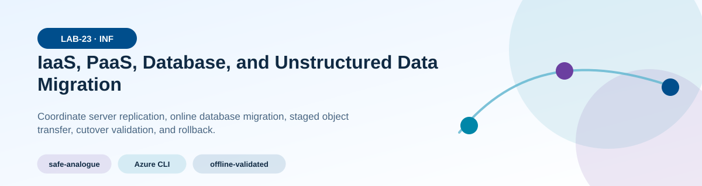
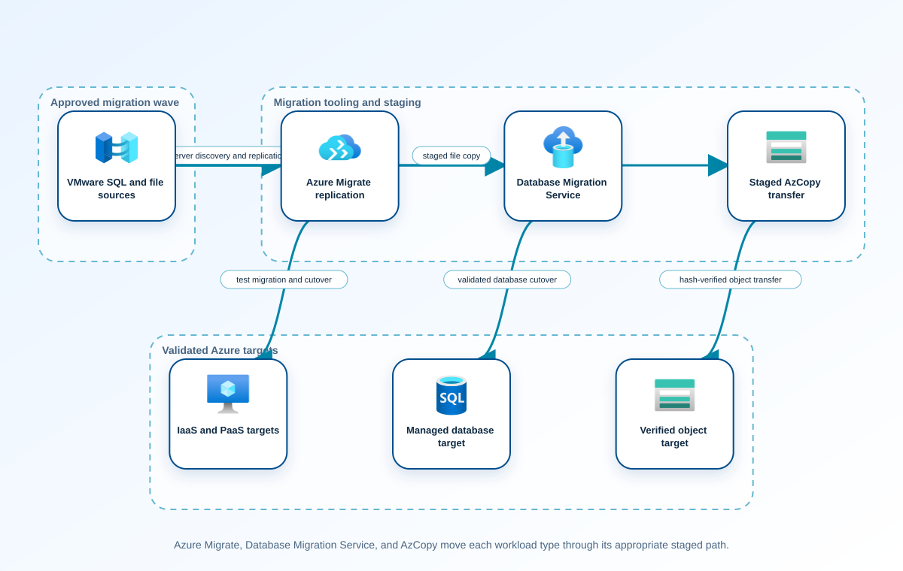
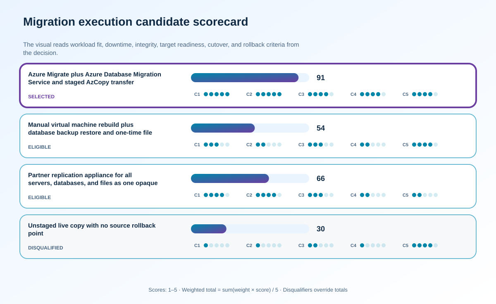

<!-- BEGIN GENERATED AZ305 V1 -->
# LAB-23 — IaaS, PaaS, Database, and Unstructured Data Migration



<div class="az305-badges" aria-label="Lab classification">
  <span class="az305-mode-badge">safe-analogue</span>
  <span class="az305-lane-badge">Azure CLI</span>
  <span class="az305-status">offline-validated</span>
</div>

## 1. Navigation

[← LAB-22](../22-migration-strategy-assessment/README.md) · [Lab catalog](../README.md) · [LAB-24 →](../24-internet-hybrid-connectivity/README.md)

## 2. Scenario and completion contract

Contoso Manufacturing has approved a migration wave containing a three-tier line-of-business application, two VMware servers, a SQL Server database, and twelve terabytes of engineering files. The target landing zone and wave sequence are already approved; the remaining work is to choose concrete migration paths, rehearse cutover, validate data, and define rollback. Production downtime is limited to four hours, the file set changes continuously, and the database contains regulated records. The learning environment cannot replicate the full estate, so learners use Azure CLI, AzCopy dry-run output, synthetic manifests, and read-only service evidence to model Azure Migrate, Azure Database Migration Service, and staged Blob transfer safely.

- Architect role: Workload and data migration architect
- Outcome: Produce an executable migration runbook for an approved wave covering IaaS, PaaS, relational database, and unstructured data with validation and rollback gates.
- Duration: 180 minutes
- Difficulty: advanced
- Cost class: low
- Completion: all five checkpoint assertions, final validation, decision revision, and cleanup review are complete.

## 3. Objective-to-evidence map

| Objective | Requirement | Checkpoint |
| --- | --- | --- |
| `INF-MIG-03` | `LAB23-REQ-01` | [`LAB23-CP01`](#checkpoint-1) |
| `INF-MIG-04` | `LAB23-REQ-02` | [`LAB23-CP02`](#checkpoint-2) |
| `INF-MIG-05` | `LAB23-REQ-03` | [`LAB23-CP03`](#checkpoint-3) |
| `INF-MIG-03` | `LAB23-REQ-04` | [`LAB23-CP04`](#checkpoint-4) |
| `INF-MIG-04` | `LAB23-REQ-05` | [`LAB23-CP05`](#checkpoint-5) |

## 4. Business and quality requirements

Business outcome: Move the approved manufacturing workload inside the outage window with provable data integrity and a controlled return path.

- `LAB23-REQ-01` — Scope, quotas, policy, DNS, identity, connectivity, encryption, monitoring, ownership, and rollback capacity satisfy the wave entry criteria.
- `LAB23-REQ-02` — Appliance placement, discovery boundary, replication cadence, rightsizing, disk handling, test network, agent impact, and rollback are explicit for each server.
- `LAB23-REQ-03` — Compatibility, target tier, schema, continuous synchronization, encryption, logins, jobs, cutover lag, application freeze, and rollback are covered.
- `LAB23-REQ-04` — Baseline and delta transfers preserve hierarchy, metadata, access tier, hashes, timestamps where required, encryption, and an auditable manifest.
- `LAB23-REQ-05` — The runbook freezes writes, performs final deltas, redirects by an approved mechanism, validates infrastructure, data, security, performance, and business transactions, then gates rollback.

Scenario facts:

- **Data:** Virtual machines, relational data, and large engineering files use distinct replication, integrity, and cutover mechanisms.
- **Scale:** Bulk files are preseeded and only the final fifteen-minute delta enters the outage path; measured bytes and change rate determine feasibility.
- **Latency:** The critical path includes final synchronization, validation, redirection, and business acceptance inside ninety minutes.
- **Availability:** Source systems remain the rollback authority until target integrity and manufacturing transactions pass.
- **RTO:** The migration outage ceiling is ninety minutes from the approved freeze to service redirection.
- **RPO:** Engineering-file writes continue until fifteen minutes before redirection, defining the maximum planned file delta window.
- **Budget:** Staged replication and temporary dual running are funded to reduce outage risk and avoid emergency transfer capacity.

Constraints:

- Manufacturing compute, databases, and engineering files need integrity evidence and a controlled return path.
- The outage window drops from four hours to ninety minutes and file writes continue until fifteen minutes before redirection.
- Use only the Azure CLI command lane for learner implementation.
- Keep all live changes behind explicit execution and acknowledgement switches.
- Retain only sanitized command evidence and synthetic fixture identifiers.

Assumptions:

- Network throughput and source change rates can be measured before the migration event.
- Application owners can freeze database and file changes at separately defined cutover gates.
- West Europe is the configurable primary example and North Europe is the configurable secondary example.
- The learner has administrator-level Azure operations knowledge but receives no pre-existing authenticated context.
- Offline fixtures demonstrate contract behavior rather than live Azure service behavior.

## 5. Architecture diagram and walkthrough



Azure Migrate, Database Migration Service, and AzCopy move each workload type through its appropriate staged path. The labelled nodes, boundaries, and edges are deterministically rendered from the portable `diagrams/architecture.mmd` source and the frozen visual registry.

## 6. Concept primer and candidate architectures

Architecture decisions translate measurable requirements into a deliberate service and operating model. A candidate is viable only when every mandatory constraint is met; convenience or familiarity cannot compensate for a disqualifier.

- **Azure Migrate plus Azure Database Migration Service and staged AzCopy transfer** (eligible) — Specialized migration paths preseed each workload type, preserve assessment and integrity evidence, and constrain final deltas.
- **Manual virtual machine rebuild plus database backup restore and one-time file copy** (eligible) — Manual rebuild and restore are familiar but put full transfer, configuration, and troubleshooting into the outage window.
- **Partner replication appliance for all servers, databases, and files as one opaque unit** (eligible) — An appliance can simplify bulk movement but obscures workload-specific consistency, integrity, and rollback evidence.
- **Unstaged live copy with no source rollback point** (ineligible) — Copying once during outage avoids temporary storage but makes duration unpredictable and destroys a safe decision point. Disqualifier: LAB23-REQ-05 requires a timed cutover with integrity proof and an executable rollback decision.

## 7. Decision, ADR, and Well-Architected review

Criteria weights are C1 30, C2 25, C3 20, C4 15, and C5 10. Weighted totals use `sum(weight × score) / 5`.



| Candidate | Eligible | C1 | C2 | C3 | C4 | C5 | Weighted /100 |
| --- | ---: | ---: | ---: | ---: | ---: | ---: | ---: |
| Azure Migrate plus Azure Database Migration Service and staged AzCopy transfer | yes | 5 | 5 | 4 | 4 | 4 | 91 |
| Manual virtual machine rebuild plus database backup restore and one-time file copy | yes | 3 | 2 | 3 | 2 | 4 | 54 |
| Partner replication appliance for all servers, databases, and files as one opaque unit | yes | 4 | 4 | 3 | 2 | 2 | 66 |
| Unstaged live copy with no source rollback point | no | 1 | 1 | 2 | 1 | 4 | 30 |

Selected design: **Azure Migrate plus Azure Database Migration Service and staged AzCopy transfer**. `ADR-LAB23-001` records the accepted reasoning. Review Reliability, Security, Cost Optimization, Operational Excellence, and Performance Efficiency in `design/decision.yml`; no pillar is implied by another.

Rejected alternatives:

- **Manual virtual machine rebuild plus database backup restore and one-time file copy:** The shortened window cannot absorb full database and engineering-file copies plus manual validation.
- **Partner replication appliance for all servers, databases, and files as one opaque unit:** Opaque replication weakens independent database, file, and VM acceptance even if transfer completes.
- **Unstaged live copy with no source rollback point:** It is ineligible because neither the ninety-minute window nor reversibility can be proven.

Architecture risks:

- **Risk:** Engineering-file churn in the final fifteen minutes can exceed available transfer throughput. **Mitigation:** Measure change rate, journal final deltas, set a go/no-go threshold, and preserve source write logs for reconciliation.
- **Risk:** A successful infrastructure cutover can hide database or file inconsistency. **Mitigation:** Run workload-specific row, checksum, and manufacturing transaction assertions before redirecting users.

Well-Architected consequences:

<div class="az305-waf-grid">
<article class="az305-waf-card"><h3>Reliability</h3><p>Preseeding, independent consistency checks, and preserved source rollback reduce cutover failure impact.</p></article>
<article class="az305-waf-card"><h3>Security</h3><p>Managed identities, private transfer paths, sanitized evidence, and least-privilege migration roles protect source data.</p></article>
<article class="az305-waf-card"><h3>Cost Optimization</h3><p>Temporary replication and dual running are bounded to the period that buys a shorter controlled outage.</p></article>
<article class="az305-waf-card"><h3>Operational Excellence</h3><p>Timed gates, owners, integrity results, redirection, and rollback criteria create an executable cutover record.</p></article>
<article class="az305-waf-card"><h3>Performance Efficiency</h3><p>Only measured final deltas and validation remain inside the ninety-minute critical path.</p></article>
</div>

ADR consequences:

- Source systems remain authoritative until every workload-specific acceptance check passes.
- File change rate and network throughput become explicit go/no-go evidence fifteen minutes before redirection.

## 8. Inputs, permissions, licensing, cost, and analogue

Use configurable `Location` (`AZ305_LOCATION`, default West Europe) and `SecondaryLocation` (`AZ305_SECONDARY_LOCATION`, default North Europe). Every public input has an explicit `AZ305_*` fallback. Preview is the default; only Golden Lab 00 writes an intent-only `execute: false` preview record. Before an executed cloud command, the supplied subscription and tenant must exactly match the active CLI, Az, and—where applicable—Microsoft Graph contexts. `-Execute` crosses the execution boundary; cost-bearing and tenant-scoped paths also require their independent acknowledgement switches.

Safe analogue: Replay synthetic VM, database, and file manifests through preseed, delta, checksum, cutover, and rollback gates without starting a migration.

Permissions: Azure Migrate, Database Migration Service, storage, network, and target read access supports planning; replication, transfer, migration, or cutover requires separate authorization.

Licensing: Migration tooling may be free for assessment periods, while replication storage, DMS SKUs, AzCopy transfer, target compute, and egress can incur charges.

Cost boundary: Model assessment, replication duration, target validation, transfer churn, dual running, outage labor, rollback retention, and post-cutover scale.

## 9. Read-only preflight

```powershell
pwsh ./scripts/azure-cli/Preflight.ps1 -RunId synthetic-230001
```

Synthetic sample: `{"labId":"LAB-23","track":"azure-cli","result":"pass","note":"Local tool discovery only"}`. This is illustrative local output, not evidence captured from Azure.

## 10. Five guided checkpoints

<ol class="az305-checkpoint-timeline" aria-label="Five checkpoint learning path">
<li><a href="#checkpoint-1">Confirm approved wave and target prerequisites</a><span>LAB23-REQ-01 · LAB23-CP01</span></li>
<li><a href="#checkpoint-2">Design server replication and test migration</a><span>LAB23-REQ-02 · LAB23-CP02</span></li>
<li><a href="#checkpoint-3">Plan online relational database migration</a><span>LAB23-REQ-03 · LAB23-CP03</span></li>
<li><a href="#checkpoint-4">Stage and verify unstructured data transfer</a><span>LAB23-REQ-04 · LAB23-CP04</span></li>
<li><a href="#checkpoint-5">Rehearse cutover, validation, and rollback</a><span>LAB23-REQ-05 · LAB23-CP05</span></li>
</ol>

### Checkpoint 1: Confirm approved wave and target prerequisites

<a id="checkpoint-1"></a>

**Trace:** `INF-MIG-03` → `LAB23-REQ-01` → `LAB23-CP01`

```powershell
az group show --name $TargetResourceGroupName --query "{id:id,location:location,tags:tags,provisioningState:properties.provisioningState}" --output json --only-show-errors
```

Expected evidence: Scope, quotas, policy, DNS, identity, connectivity, encryption, monitoring, ownership, and rollback capacity satisfy the wave entry criteria. Retain Save the entry checklist, resource-group projection, approvals, exceptions, and pre-cutover decision record.

Positive assertion:

```powershell
$group = az group show --name $TargetResourceGroupName --output json --only-show-errors | ConvertFrom-Json; if ($group.properties.provisioningState -ne 'Succeeded' -or $group.tags.wave -ne $ApprovedWave) { throw 'The target scope is not ready for the approved wave.' }
```

Negative assertion:

```powershell
$locks = az lock list --resource-group $TargetResourceGroupName --output json --only-show-errors | ConvertFrom-Json; if ($locks | Where-Object { $_.level -eq 'ReadOnly' }) { throw 'A read-only lock blocks migration deployment.' }
```

Failure and retry: Starting replication before target readiness can waste the outage window and create stranded resources. Resolve the specific entry gate and repeat all prerequisite assertions before rescheduling cutover.

Cleanup dependency: Delete local prerequisite exports; do not remove landing-zone policy, locks, or shared networking.

WAF consequence: Security: entry gates verify identity, encryption, and private connectivity before regulated data moves.

### Checkpoint 2: Design server replication and test migration

<a id="checkpoint-2"></a>

**Trace:** `INF-MIG-04` → `LAB23-REQ-02` → `LAB23-CP02`

```powershell
az resource show --resource-group $MigrationResourceGroupName --resource-type Microsoft.Migrate/migrateProjects --name $MigrateProjectName --api-version 2020-05-01 --output json --only-show-errors
```

Expected evidence: Appliance placement, discovery boundary, replication cadence, rightsizing, disk handling, test network, agent impact, and rollback are explicit for each server. Retain Preserve assessment recommendations, replication-health samples, test-migration assertions, target sizing, and exact migration IDs.

Positive assertion:

```powershell
$project = az resource show --resource-group $MigrationResourceGroupName --resource-type Microsoft.Migrate/migrateProjects --name $MigrateProjectName --api-version 2020-05-01 --output json --only-show-errors | ConvertFrom-Json; if ($project.properties.provisioningState -ne 'Succeeded') { throw 'The Azure Migrate project is not ready.' }
```

Negative assertion:

```powershell
$targets = az vm list --resource-group $TargetResourceGroupName --query "[?tags.wave=='$ApprovedWave' && tags.runId!='$RunId']" --output json --only-show-errors | ConvertFrom-Json; if ($targets.Count -gt 0) { throw 'The target contains a wave VM owned by another run.' }
```

Failure and retry: A successful boot does not prove application reachability, performance, or dependency readiness. Correct mapping or sizing and repeat an isolated test migration while preserving the failed evidence.

Cleanup dependency: Remove only run-owned test VMs, NICs, disks, and snapshots in dependency order; keep replication configuration.

WAF consequence: Reliability: isolated test migration and rollback evidence reduce cutover uncertainty without touching the source.

### Checkpoint 3: Plan online relational database migration

<a id="checkpoint-3"></a>

**Trace:** `INF-MIG-05` → `LAB23-REQ-03` → `LAB23-CP03`

```powershell
az resource list --resource-group $MigrationResourceGroupName --resource-type Microsoft.DataMigration/services --query "[].{id:id,name:name,location:location,sku:sku.name,provisioningState:properties.provisioningState}" --output json --only-show-errors
```

Expected evidence: Compatibility, target tier, schema, continuous synchronization, encryption, logins, jobs, cutover lag, application freeze, and rollback are covered. Retain Save compatibility results, schema hash, row and checksum samples, synchronization lag, identity mapping, and cutover authorization.

Positive assertion:

```powershell
$services = az resource list --resource-group $MigrationResourceGroupName --resource-type Microsoft.DataMigration/services --output json --only-show-errors | ConvertFrom-Json; if (-not ($services | Where-Object { $_.properties.provisioningState -eq 'Succeeded' })) { throw 'No ready database migration service was found.' }
```

Negative assertion:

```powershell
$targets = az sql db list --resource-group $TargetResourceGroupName --server $TargetSqlServerName --output json --only-show-errors | ConvertFrom-Json; if ($targets | Where-Object { $_.name -eq $TargetDatabaseName -and $_.status -ne 'Online' }) { throw 'The target database exists but is not online.' }
```

Failure and retry: Data copy can complete while server-level objects or application connection behavior remain incomplete. Resolve the failed object class, resynchronize, and rerun independent schema, data, login, and application checks.

Cleanup dependency: Remove only run-owned migration activities and empty test databases; never drop a source or purge backups.

WAF consequence: Performance Efficiency: representative workload evidence validates target tier sizing before irreversible cutover.

### Checkpoint 4: Stage and verify unstructured data transfer

<a id="checkpoint-4"></a>

**Trace:** `INF-MIG-03` → `LAB23-REQ-04` → `LAB23-CP04`

```powershell
azcopy copy $SourceDataUrl $DestinationDataUrl --recursive --dry-run
```

Expected evidence: Baseline and delta transfers preserve hierarchy, metadata, access tier, hashes, timestamps where required, encryption, and an auditable manifest. Retain Preserve dry-run scope, sanitized transfer logs, source and target manifests, failed-object list, hash samples, and delta timing.

Positive assertion:

```powershell
$blobs = az storage blob list --account-name $TargetStorageAccountName --container-name $TargetContainerName --auth-mode login --query "[?metadata.runId=='$RunId'].{name:name,size:properties.contentLength,md5:properties.contentSettings.contentMd5}" --output json --only-show-errors | ConvertFrom-Json; if ($blobs.Count -lt 1) { throw 'No run-owned target blobs were found.' }
```

Negative assertion:

```powershell
$unexpected = az storage blob list --account-name $TargetStorageAccountName --container-name $TargetContainerName --auth-mode login --query "[?metadata.wave!='$ApprovedWave']" --output json --only-show-errors | ConvertFrom-Json; if ($unexpected.Count -gt 0) { throw 'The target container contains data outside the approved wave.' }
```

Failure and retry: A nominally successful bulk copy can omit inaccessible files, metadata, or late source changes. Correct only failed objects, run a final delta after write freeze, and regenerate both manifests.

Cleanup dependency: Delete only run-owned target prefixes after manifest and ownership verification; never purge the source.

WAF consequence: Cost Optimization: staged transfer, lifecycle tiering, and delta cutover reduce network and parallel-storage cost.

### Checkpoint 5: Rehearse cutover, validation, and rollback

<a id="checkpoint-5"></a>

**Trace:** `INF-MIG-04` → `LAB23-REQ-05` → `LAB23-CP05`

```powershell
az monitor metrics list --resource $TargetApplicationResourceId --metric Availability,Requests,ResponseTime --interval PT1M --aggregation Average --output json --only-show-errors
```

Expected evidence: The runbook freezes writes, performs final deltas, redirects by an approved mechanism, validates infrastructure, data, security, performance, and business transactions, then gates rollback. Retain Archive a timestamped cutover timeline, assertion-level results, data delta, decision log, communications, and rollback disposition.

Positive assertion:

```powershell
$metrics = az monitor metrics list --resource $TargetApplicationResourceId --metric Availability,Requests --interval PT1M --aggregation Average --output json --only-show-errors | ConvertFrom-Json; if (-not $metrics.value.timeseries.data) { throw 'No target application validation metrics were returned.' }
```

Negative assertion:

```powershell
$failed = az monitor activity-log list --resource-group $TargetResourceGroupName --status Failed --offset 2h --output json --only-show-errors | ConvertFrom-Json; if ($failed.Count -gt 0) { throw 'Failed target operations remain unresolved before cutover.' }
```

Failure and retry: Teams can cross the point of no return while individual technical checks still appear green. Invoke the documented rollback while the source remains authoritative, resolve the failed gate, and schedule a new window.

Cleanup dependency: Remove run-owned test targets only after rollback or acceptance is complete; decommission sources in a separately approved process.

WAF consequence: Operational Excellence: explicit stop/go and rollback gates keep a multi-technology cutover controlled.

## 11. Final validation and interpretation

Run `Validate.ps1 -Mode Deployment -Execute` only after an executed run has state and you are authorized to issue the ten read-only checkpoint inspections. Without `-Execute`, ordinary deployment validation records `partial` and exits `2`; Golden Lab 00 alone can validate its intent-only preview locally. Exit `0` means all required assertions pass, `1` means at least one failed, and `2` means the outcome is gated or partial. Positive and negative commands execute independently, so one failure never suppresses its paired assertion.

## 12. Material change request

Plant leadership reduces the outage window from four hours to ninety minutes and requires engineering-file writes to continue until fifteen minutes before redirection.

Revised solution: select **Azure Migrate plus Azure Database Migration Service and staged AzCopy transfer**. LAB23-REQ-05 requires a ninety-minute outage with writes continuing to minute fifteen, so staged services remain selected and only recorded deltas plus acceptance enter the critical path.

Revised Well-Architected consequences:

- **Reliability:** A preserved source and explicit abort threshold keep the shortened event reversible.
- **Security:** Final deltas travel through the same approved protected transfer boundary.
- **Cost Optimization:** Temporary staging cost avoids emergency bandwidth and extended factory downtime.
- **Operational Excellence:** Minute-by-minute gates expose when to continue, abort, or roll back.
- **Performance Efficiency:** Preseeded bulk data leaves a measured fifteen-minute write delta for final transfer.

## 13. Architect job challenge

Revise continuous database synchronization, file deltas, write-freeze sequencing, validation sampling, and rollback deadlines while preserving integrity evidence.

## 14. Troubleshooting, cleanup, and residual verification

- If test-migrated servers boot but the application fails, validate DNS, identity, certificates, and dependency reachability separately.
- If database lag will not converge, inspect source transaction rate and target capacity before extending the outage assumption.
- If AzCopy manifests differ, separate skipped, changed-during-copy, metadata-only, and hash mismatches before retrying.

Cleanup previews nonempty state in reverse dependency order, writes `partial`, and exits `2`; an already empty run is completed locally and idempotently. Executed cleanup rechecks the exact live ID plus `purpose`, `labId`, `runId`, and `expiresOn` immediately before each removal, persists state after every absent or removed object, stops on the first dependency failure, and refuses unresolved pre-existing settings. It never automates purge. Finish with `Validate.ps1 -Mode PostCleanup`; the required residual count is zero.

## 15. Exam debrief, assessment, sources, and navigation

Explain the recommendation in terms of requirements, rejected alternatives, failure behavior, and all five WAF pillars. Complete `assessment/QUESTIONS.md`, then use the separately excluded answer key for remediation.

- [Azure Migrate service overview](https://learn.microsoft.com/en-us/azure/migrate/migrate-services-overview)
- [Azure Well-Architected Framework](https://learn.microsoft.com/en-us/azure/well-architected/)

[← LAB-22](../22-migration-strategy-assessment/README.md) · [Lab catalog](../README.md) · [LAB-24 →](../24-internet-hybrid-connectivity/README.md)

## 16. Synchronized lifecycle-script appendix

### Preflight.ps1

```powershell
[CmdletBinding()]
param(
    [string]$SubscriptionId = $env:AZ305_SUBSCRIPTION_ID,
    [string]$TenantId = $env:AZ305_TENANT_ID,
    [ValidatePattern('^[a-z0-9-]{6,64}$')][string]$RunId = $env:AZ305_RUN_ID,
    [string]$Location = $(if ($env:AZ305_LOCATION) { $env:AZ305_LOCATION } else { 'westeurope' }),
    [string]$SecondaryLocation = $(if ($env:AZ305_SECONDARY_LOCATION) { $env:AZ305_SECONDARY_LOCATION } else { 'northeurope' }),
    [string]$ResourceGroup = $(if ($env:AZ305_RESOURCE_GROUP) { $env:AZ305_RESOURCE_GROUP } else { "rg-az305-$RunId" }),
    [string]$WorkloadName = $(if ($env:AZ305_WORKLOAD_NAME) { $env:AZ305_WORKLOAD_NAME } else { "az305-$RunId" }),
    [string]$ExpiresOn = $(if ($env:AZ305_EXPIRES_ON) { $env:AZ305_EXPIRES_ON } else { (Get-Date).ToUniversalTime().AddDays(1).ToString('yyyy-MM-dd') }),
    [string]$ApprovedWave = $env:AZ305_APPROVED_WAVE,
    [string]$DestinationDataUrl = $env:AZ305_DESTINATION_DATA_URL,
    [string]$MigrateProjectName = $env:AZ305_MIGRATE_PROJECT_NAME,
    [string]$MigrationResourceGroupName = $env:AZ305_MIGRATION_RESOURCE_GROUP_NAME,
    [string]$SourceDataUrl = $env:AZ305_SOURCE_DATA_URL,
    [string]$TargetApplicationResourceId = $env:AZ305_TARGET_APPLICATION_RESOURCE_ID,
    [string]$TargetContainerName = $env:AZ305_TARGET_CONTAINER_NAME,
    [string]$TargetDatabaseName = $env:AZ305_TARGET_DATABASE_NAME,
    [string]$TargetResourceGroupName = $env:AZ305_TARGET_RESOURCE_GROUP_NAME,
    [string]$TargetSqlServerName = $env:AZ305_TARGET_SQL_SERVER_NAME,
    [string]$TargetStorageAccountName = $env:AZ305_TARGET_STORAGE_ACCOUNT_NAME,
    [switch]$Execute,
    [switch]$AcknowledgeCost,
    [switch]$AcknowledgeTenantChange
)

$ErrorActionPreference = 'Stop'
$PSNativeCommandUseErrorActionPreference = $true
if (-not $RunId) { [Console]::Error.WriteLine('RunId or AZ305_RUN_ID is required.'); exit 2 }
# Every lifecycle entrypoint intentionally exposes the same public parameter contract.
@($SubscriptionId, $TenantId, $RunId, $Location, $SecondaryLocation, $ResourceGroup, $WorkloadName, $ExpiresOn, $ApprovedWave, $DestinationDataUrl, $MigrateProjectName, $MigrationResourceGroupName, $SourceDataUrl, $TargetApplicationResourceId, $TargetContainerName, $TargetDatabaseName, $TargetResourceGroupName, $TargetSqlServerName, $TargetStorageAccountName, $Execute, $AcknowledgeCost, $AcknowledgeTenantChange) | Out-Null

$requiredCommands = @('az', 'azcopy', 'pwsh')
$missing = @($requiredCommands | Where-Object { -not (Get-Command $_ -ErrorAction SilentlyContinue) })
if ($missing.Count -gt 0) {
    Write-Error "Missing local commands: $($missing -join ', ')"
    exit 1
}

[pscustomobject]@{
    labId = 'LAB-23'
    track = 'azure-cli'
    implementationMode = 'safe-analogue'
    result = 'pass'
    note = 'Local tool discovery only; no Azure or Microsoft Graph request was made.'
} | ConvertTo-Json
exit 0
```

### Setup.ps1

```powershell
[CmdletBinding()]
param(
    [string]$SubscriptionId = $env:AZ305_SUBSCRIPTION_ID,
    [string]$TenantId = $env:AZ305_TENANT_ID,
    [ValidatePattern('^[a-z0-9-]{6,64}$')][string]$RunId = $env:AZ305_RUN_ID,
    [string]$Location = $(if ($env:AZ305_LOCATION) { $env:AZ305_LOCATION } else { 'westeurope' }),
    [string]$SecondaryLocation = $(if ($env:AZ305_SECONDARY_LOCATION) { $env:AZ305_SECONDARY_LOCATION } else { 'northeurope' }),
    [string]$ResourceGroup = $(if ($env:AZ305_RESOURCE_GROUP) { $env:AZ305_RESOURCE_GROUP } else { "rg-az305-$RunId" }),
    [string]$WorkloadName = $(if ($env:AZ305_WORKLOAD_NAME) { $env:AZ305_WORKLOAD_NAME } else { "az305-$RunId" }),
    [string]$ExpiresOn = $(if ($env:AZ305_EXPIRES_ON) { $env:AZ305_EXPIRES_ON } else { (Get-Date).ToUniversalTime().AddDays(1).ToString('yyyy-MM-dd') }),
    [string]$ApprovedWave = $env:AZ305_APPROVED_WAVE,
    [string]$DestinationDataUrl = $env:AZ305_DESTINATION_DATA_URL,
    [string]$MigrateProjectName = $env:AZ305_MIGRATE_PROJECT_NAME,
    [string]$MigrationResourceGroupName = $env:AZ305_MIGRATION_RESOURCE_GROUP_NAME,
    [string]$SourceDataUrl = $env:AZ305_SOURCE_DATA_URL,
    [string]$TargetApplicationResourceId = $env:AZ305_TARGET_APPLICATION_RESOURCE_ID,
    [string]$TargetContainerName = $env:AZ305_TARGET_CONTAINER_NAME,
    [string]$TargetDatabaseName = $env:AZ305_TARGET_DATABASE_NAME,
    [string]$TargetResourceGroupName = $env:AZ305_TARGET_RESOURCE_GROUP_NAME,
    [string]$TargetSqlServerName = $env:AZ305_TARGET_SQL_SERVER_NAME,
    [string]$TargetStorageAccountName = $env:AZ305_TARGET_STORAGE_ACCOUNT_NAME,
    [switch]$Execute,
    [switch]$AcknowledgeCost,
    [switch]$AcknowledgeTenantChange
)

$ErrorActionPreference = 'Stop'
$PSNativeCommandUseErrorActionPreference = $true
if (-not $RunId) { [Console]::Error.WriteLine('RunId or AZ305_RUN_ID is required.'); exit 2 }
# Every lifecycle entrypoint intentionally exposes the same public parameter contract.
@($SubscriptionId, $TenantId, $RunId, $Location, $SecondaryLocation, $ResourceGroup, $WorkloadName, $ExpiresOn, $ApprovedWave, $DestinationDataUrl, $MigrateProjectName, $MigrationResourceGroupName, $SourceDataUrl, $TargetApplicationResourceId, $TargetContainerName, $TargetDatabaseName, $TargetResourceGroupName, $TargetSqlServerName, $TargetStorageAccountName, $Execute, $AcknowledgeCost, $AcknowledgeTenantChange) | Out-Null

$LabRoot = Split-Path (Split-Path $PSScriptRoot -Parent) -Parent
$StateRoot = Join-Path $LabRoot ".state/$RunId"
$StatePath = Join-Path $StateRoot 'run.json'

function Invoke-AzCliJson {
    [CmdletBinding()]
    param([Parameter(Mandatory)][string[]]$ArgumentList)
    $savedNativePreference = $PSNativeCommandUseErrorActionPreference
    try {
        # Capture the exit code ourselves so a failed native command cannot be
        # mistaken for an empty but successful JSON response.
        $PSNativeCommandUseErrorActionPreference = $false
        $outputLines = @(& az @ArgumentList)
        $nativeExit = $LASTEXITCODE
    }
    finally {
        $PSNativeCommandUseErrorActionPreference = $savedNativePreference
    }
    if ($nativeExit -ne 0) { throw "Azure CLI exited with code $nativeExit." }
    $raw = @($outputLines) -join "`n"
    if ([string]::IsNullOrWhiteSpace($raw)) { return $null }
    try { return ($raw | ConvertFrom-Json -Depth 100) }
    catch { throw 'Azure CLI returned data that was not valid JSON.' }
}

function Assert-ExactExecutionContext {
    [CmdletBinding()]
    param([string]$ExpectedSubscriptionId, [string]$ExpectedTenantId)
    if ([string]::IsNullOrWhiteSpace($ExpectedSubscriptionId) -or [string]::IsNullOrWhiteSpace($ExpectedTenantId)) {
        throw 'SubscriptionId and TenantId are required before a cloud request.'
    }
    $context = Invoke-AzCliJson -ArgumentList @('account', 'show', '--output', 'json', '--only-show-errors')
    if (-not $context -or [string]$context.id -ine $ExpectedSubscriptionId -or [string]$context.tenantId -ine $ExpectedTenantId) {
        throw 'The active Azure CLI subscription or tenant does not exactly match the requested context.'
    }
}

function Save-RunState {
    [CmdletBinding()]
    param([Parameter(Mandatory)]$State)
    $temporaryPath = "$StatePath.tmp"
    $State | ConvertTo-Json -Depth 20 | Set-Content -LiteralPath $temporaryPath -Encoding utf8NoBOM
    Move-Item -LiteralPath $temporaryPath -Destination $StatePath -Force
}

function Assert-SafeStateValue {
    [CmdletBinding()]
    param($Value)
    $serialized = $Value | ConvertTo-Json -Depth 12 -Compress
    if ($serialized -match '(?i)"(?:token|password|secret|certificate|connectionString|sas|clientSecret|accessToken|refreshToken|accountKey|privateKey)"\s*:') {
        throw 'A prohibited sensitive field name was returned; state capture is refused.'
    }
}

function Convert-CheckpointOutput {
    [CmdletBinding()]
    param($Value)
    if ($Value -is [string]) { $raw = [string]$Value }
    elseif ($Value -is [System.Collections.IEnumerable] -and @($Value | Where-Object { $_ -isnot [string] }).Count -eq 0) { $raw = @($Value) -join "`n" }
    else { return $Value }
    if ([string]::IsNullOrWhiteSpace($raw)) { return $null }
    try { return ($raw | ConvertFrom-Json -Depth 100) } catch { return $Value }
}

function Get-ReturnedResourceId {
    [CmdletBinding()]
    param($Value)
    $seen = [System.Collections.Generic.HashSet[string]]::new([System.StringComparer]::OrdinalIgnoreCase)
    $results = [System.Collections.Generic.List[string]]::new()
    function Add-ArmId {
        param($Candidate)
        if ($Candidate -is [string] -and $Candidate -match '^/subscriptions/[0-9a-f-]+/(?:resourceGroups/[^/]+(?:/providers/.+)?|providers/.+)$' -and $Candidate -notmatch '/providers/Microsoft\.Resources/deployments/') {
            if ($seen.Add($Candidate)) { $results.Add($Candidate) }
        }
    }
    function Find-DeploymentOutputId {
        param($Item, [int]$Depth)
        if ($null -eq $Item -or $Depth -gt 12) { return }
        if ($Item -is [string]) { Add-ArmId -Candidate $Item; return }
        if ($Item -is [System.Collections.IDictionary]) { foreach ($key in $Item.Keys) { Find-DeploymentOutputId -Item $Item[$key] -Depth ($Depth + 1) }; return }
        if ($Item -is [System.Collections.IEnumerable]) { foreach ($entry in $Item) { Find-DeploymentOutputId -Item $entry -Depth ($Depth + 1) }; return }
        foreach ($property in @($Item.PSObject.Properties | Where-Object { $_.MemberType -in @('NoteProperty', 'Property') })) { Find-DeploymentOutputId -Item $property.Value -Depth ($Depth + 1) }
    }
    foreach ($rootItem in @($Value)) {
        if ($rootItem -is [System.Collections.IDictionary]) {
            foreach ($name in @('id', 'resourceId')) { if ($rootItem.Contains($name)) { Add-ArmId -Candidate $rootItem[$name] } }
            if ($rootItem.Contains('properties') -and $rootItem.properties -and $rootItem.properties.outputs) { Find-DeploymentOutputId -Item $rootItem.properties.outputs -Depth 0 }
            continue
        }
        foreach ($name in @('Id', 'ResourceId')) {
            $property = $rootItem.PSObject.Properties[$name]
            if ($property) { Add-ArmId -Candidate $property.Value }
        }
        if ($rootItem.PSObject.Properties['Properties'] -and $rootItem.Properties -and $rootItem.Properties.outputs) {
            Find-DeploymentOutputId -Item $rootItem.Properties.outputs -Depth 0
        }
    }
    return @($results)
}

function Get-PlannedDeploymentResourceId {
    [CmdletBinding()]
    param($Value)
    $seen = [System.Collections.Generic.HashSet[string]]::new([System.StringComparer]::OrdinalIgnoreCase)
    $results = [System.Collections.Generic.List[string]]::new()
    foreach ($change in @($Value.changes)) {
        $candidate = [string]$change.resourceId
        if ($candidate -match '^/subscriptions/[0-9a-f-]+/(?:resourceGroups/[^/]+(?:/providers/.+)?|providers/.+)$' -and $candidate -notmatch '/providers/Microsoft\.Resources/deployments/' -and $seen.Add($candidate)) {
            $results.Add($candidate)
        }
    }
    return @($results)
}

function Assert-InputSubscriptionScope {
    [CmdletBinding()]
    param($Inputs, [string]$ExpectedSubscriptionId)
    $entries = if ($Inputs -is [System.Collections.IDictionary]) {
        @($Inputs.GetEnumerator())
    } else {
        @($Inputs.PSObject.Properties | ForEach-Object { [pscustomobject]@{ Key = $_.Name; Value = $_.Value } })
    }
    foreach ($entry in $entries) {
        if ($entry.Value -is [string] -and [string]$entry.Value -match '^/subscriptions/([^/]+)/') {
            if ($Matches[1] -ine $ExpectedSubscriptionId) { throw "Input $($entry.Key) belongs to a different subscription." }
        }
    }
}

function Assert-ManagedMutation {
    [CmdletBinding()]
    param($State, [string]$CheckpointId, [bool]$CarriesOwnership, [object[]]$TargetResourceIds)
    if ($CarriesOwnership) { return }
    $targets = @($TargetResourceIds | Where-Object { $_ -is [string] -and $_ -match '^/subscriptions/' })
    if ($targets.Count -eq 0) { throw "$CheckpointId refuses an untagged mutation because no exact ARM target ID was supplied." }
    $knownIds = @($State.managedObjects | ForEach-Object { [string]$_.id })
    if ($knownIds.Count -eq 0) { throw "$CheckpointId refuses to modify a pre-existing object because no run-owned parent has been recorded." }
    foreach ($target in $targets) {
        $related = @($knownIds | Where-Object { $target -ieq $_ -or $target.StartsWith("$_/", [System.StringComparison]::OrdinalIgnoreCase) -or $_.StartsWith("$target/", [System.StringComparison]::OrdinalIgnoreCase) }).Count -gt 0
        if (-not $related) { throw "$CheckpointId refuses a mutation outside the exact run-owned resource boundary." }
    }
}

$executionInputs = [ordered]@{ subscriptionId = $SubscriptionId; tenantId = $TenantId; location = $Location; secondaryLocation = $SecondaryLocation; resourceGroup = $ResourceGroup; workloadName = $WorkloadName; expiresOn = $ExpiresOn; ApprovedWave = $ApprovedWave; DestinationDataUrl = $DestinationDataUrl; MigrateProjectName = $MigrateProjectName; MigrationResourceGroupName = $MigrationResourceGroupName; SourceDataUrl = $SourceDataUrl; TargetApplicationResourceId = $TargetApplicationResourceId; TargetContainerName = $TargetContainerName; TargetDatabaseName = $TargetDatabaseName; TargetResourceGroupName = $TargetResourceGroupName; TargetSqlServerName = $TargetSqlServerName; TargetStorageAccountName = $TargetStorageAccountName }

if (-not $Execute) {
    Write-Output '[preview] No cloud command was called and no state was created.'
    Write-Output '[preview] Re-run with -Execute only in an authorized disposable environment.'
    exit 0
}
# This setup is compatible with the lab implementation mode.
# This default exercise does not require a cost acknowledgement.
# This lab does not perform a tenant-scoped change by default.
$requiredLabInputs = [ordered]@{ DestinationDataUrl = $DestinationDataUrl; MigrateProjectName = $MigrateProjectName; MigrationResourceGroupName = $MigrationResourceGroupName; SourceDataUrl = $SourceDataUrl; TargetApplicationResourceId = $TargetApplicationResourceId; TargetResourceGroupName = $TargetResourceGroupName }
$missingLabInputs = @($requiredLabInputs.GetEnumerator() | Where-Object { $_.Value -is [string] -and [string]::IsNullOrWhiteSpace([string]$_.Value) } | ForEach-Object Key)
if ($missingLabInputs.Count -gt 0) { [Console]::Error.WriteLine("Execution is gated; supply: $($missingLabInputs -join ', ')."); exit 2 }

try {
    Assert-ExactExecutionContext -ExpectedSubscriptionId $SubscriptionId -ExpectedTenantId $TenantId
    Assert-InputSubscriptionScope -Inputs $executionInputs -ExpectedSubscriptionId $SubscriptionId
    Assert-SafeStateValue -Value $executionInputs
}
catch {
    [Console]::Error.WriteLine("Execution is gated by context or input validation: $($_.Exception.Message)")
    exit 2
}

# Recovery state is persisted before the first possible mutation below.
if (Test-Path -LiteralPath $StatePath) {
    [Console]::Error.WriteLine('Run state already exists. Choose a new RunId or complete the recorded cleanup; existing recovery state will not be overwritten.')
    exit 2
}
New-Item -ItemType Directory -Path $StateRoot -Force | Out-Null
$state = [ordered]@{
    schemaVersion = '1.0.0'; labId = 'LAB-23'; runId = $RunId; track = 'azure-cli'
    implementationMode = 'safe-analogue'; status = 'initialized'
    createdAt = (Get-Date).ToUniversalTime().ToString('o'); execute = $true
    parameters = $executionInputs
    managedObjects = @(); originalSettings = @()
}
Save-RunState -State $state
$state.status = 'deploying'
Save-RunState -State $state

$originalLocation = Get-Location
try {
    Set-Location -LiteralPath $LabRoot
    # 23-CP01: Confirm approved wave and target prerequisites
    $stepResult = & { az group show --name $TargetResourceGroupName --query "{id:id,location:location,tags:tags,provisioningState:properties.provisioningState}" --output json --only-show-errors }
    if ($LASTEXITCODE -ne 0) { throw 'LAB23-CP01 native command exited with code ' + $LASTEXITCODE + '.' }
    $null = $stepResult

    # 23-CP02: Design server replication and test migration
    $stepResult = & { az resource show --resource-group $MigrationResourceGroupName --resource-type Microsoft.Migrate/migrateProjects --name $MigrateProjectName --api-version 2020-05-01 --output json --only-show-errors }
    if ($LASTEXITCODE -ne 0) { throw 'LAB23-CP02 native command exited with code ' + $LASTEXITCODE + '.' }
    $null = $stepResult

    # 23-CP03: Plan online relational database migration
    $stepResult = & { az resource list --resource-group $MigrationResourceGroupName --resource-type Microsoft.DataMigration/services --query "[].{id:id,name:name,location:location,sku:sku.name,provisioningState:properties.provisioningState}" --output json --only-show-errors }
    if ($LASTEXITCODE -ne 0) { throw 'LAB23-CP03 native command exited with code ' + $LASTEXITCODE + '.' }
    $null = $stepResult

    # 23-CP04: Stage and verify unstructured data transfer
    $stepResult = & { azcopy copy $SourceDataUrl $DestinationDataUrl --recursive --dry-run }
    if ($LASTEXITCODE -ne 0) { throw 'LAB23-CP04 native command exited with code ' + $LASTEXITCODE + '.' }
    $null = $stepResult

    # 23-CP05: Rehearse cutover, validation, and rollback
    $stepResult = & { az monitor metrics list --resource $TargetApplicationResourceId --metric Availability,Requests,ResponseTime --interval PT1M --aggregation Average --output json --only-show-errors }
    if ($LASTEXITCODE -ne 0) { throw 'LAB23-CP05 native command exited with code ' + $LASTEXITCODE + '.' }
    $null = $stepResult

    $state.status = 'deployed'
    Save-RunState -State $state
} catch {
    $state.status = 'failed'
    Save-RunState -State $state
    Write-Error $_
    exit 1
} finally {
    Set-Location -LiteralPath $originalLocation
}
exit 0
```

### Validate.ps1

```powershell
[CmdletBinding()]
param(
    [string]$SubscriptionId = $env:AZ305_SUBSCRIPTION_ID,
    [string]$TenantId = $env:AZ305_TENANT_ID,
    [ValidatePattern('^[a-z0-9-]{6,64}$')][string]$RunId = $env:AZ305_RUN_ID,
    [string]$Location = $(if ($env:AZ305_LOCATION) { $env:AZ305_LOCATION } else { 'westeurope' }),
    [string]$SecondaryLocation = $(if ($env:AZ305_SECONDARY_LOCATION) { $env:AZ305_SECONDARY_LOCATION } else { 'northeurope' }),
    [string]$ResourceGroup = $(if ($env:AZ305_RESOURCE_GROUP) { $env:AZ305_RESOURCE_GROUP } else { "rg-az305-$RunId" }),
    [string]$WorkloadName = $(if ($env:AZ305_WORKLOAD_NAME) { $env:AZ305_WORKLOAD_NAME } else { "az305-$RunId" }),
    [string]$ExpiresOn = $(if ($env:AZ305_EXPIRES_ON) { $env:AZ305_EXPIRES_ON } else { (Get-Date).ToUniversalTime().AddDays(1).ToString('yyyy-MM-dd') }),
    [string]$ApprovedWave = $env:AZ305_APPROVED_WAVE,
    [string]$DestinationDataUrl = $env:AZ305_DESTINATION_DATA_URL,
    [string]$MigrateProjectName = $env:AZ305_MIGRATE_PROJECT_NAME,
    [string]$MigrationResourceGroupName = $env:AZ305_MIGRATION_RESOURCE_GROUP_NAME,
    [string]$SourceDataUrl = $env:AZ305_SOURCE_DATA_URL,
    [string]$TargetApplicationResourceId = $env:AZ305_TARGET_APPLICATION_RESOURCE_ID,
    [string]$TargetContainerName = $env:AZ305_TARGET_CONTAINER_NAME,
    [string]$TargetDatabaseName = $env:AZ305_TARGET_DATABASE_NAME,
    [string]$TargetResourceGroupName = $env:AZ305_TARGET_RESOURCE_GROUP_NAME,
    [string]$TargetSqlServerName = $env:AZ305_TARGET_SQL_SERVER_NAME,
    [string]$TargetStorageAccountName = $env:AZ305_TARGET_STORAGE_ACCOUNT_NAME,
    [ValidateSet('Deployment', 'PostCleanup')][string]$Mode = 'Deployment',
    [switch]$Execute,
    [switch]$AcknowledgeCost,
    [switch]$AcknowledgeTenantChange
)

$ErrorActionPreference = 'Stop'
$PSNativeCommandUseErrorActionPreference = $true
if (-not $RunId) { [Console]::Error.WriteLine('RunId or AZ305_RUN_ID is required.'); exit 2 }
# Every lifecycle entrypoint intentionally exposes the same public parameter contract.
@($SubscriptionId, $TenantId, $RunId, $Location, $SecondaryLocation, $ResourceGroup, $WorkloadName, $ExpiresOn, $ApprovedWave, $DestinationDataUrl, $MigrateProjectName, $MigrationResourceGroupName, $SourceDataUrl, $TargetApplicationResourceId, $TargetContainerName, $TargetDatabaseName, $TargetResourceGroupName, $TargetSqlServerName, $TargetStorageAccountName, $Mode, $Execute, $AcknowledgeCost, $AcknowledgeTenantChange) | Out-Null

$LabRoot = Split-Path (Split-Path $PSScriptRoot -Parent) -Parent
$StateRoot = Join-Path $LabRoot ".state/$RunId"
$RunPath = Join-Path $StateRoot 'run.json'
$ValidationPath = Join-Path $StateRoot 'validation.json'

function Invoke-AzCliJson {
    [CmdletBinding()]
    param([Parameter(Mandatory)][string[]]$ArgumentList)
    $savedNativePreference = $PSNativeCommandUseErrorActionPreference
    try {
        # Capture the exit code ourselves so a failed native command cannot be
        # mistaken for an empty but successful JSON response.
        $PSNativeCommandUseErrorActionPreference = $false
        $outputLines = @(& az @ArgumentList)
        $nativeExit = $LASTEXITCODE
    }
    finally {
        $PSNativeCommandUseErrorActionPreference = $savedNativePreference
    }
    if ($nativeExit -ne 0) { throw "Azure CLI exited with code $nativeExit." }
    $raw = @($outputLines) -join "`n"
    if ([string]::IsNullOrWhiteSpace($raw)) { return $null }
    try { return ($raw | ConvertFrom-Json -Depth 100) }
    catch { throw 'Azure CLI returned data that was not valid JSON.' }
}

function Assert-ExactExecutionContext {
    [CmdletBinding()]
    param([string]$ExpectedSubscriptionId, [string]$ExpectedTenantId)
    if ([string]::IsNullOrWhiteSpace($ExpectedSubscriptionId) -or [string]::IsNullOrWhiteSpace($ExpectedTenantId)) {
        throw 'SubscriptionId and TenantId are required before a cloud request.'
    }
    $context = Invoke-AzCliJson -ArgumentList @('account', 'show', '--output', 'json', '--only-show-errors')
    if (-not $context -or [string]$context.id -ine $ExpectedSubscriptionId -or [string]$context.tenantId -ine $ExpectedTenantId) {
        throw 'The active Azure CLI subscription or tenant does not exactly match the requested context.'
    }
}


if (-not (Test-Path -LiteralPath $RunPath)) {
    Write-Warning 'No run state exists; validation is gated.'
    exit 2
}
$state = Get-Content -LiteralPath $RunPath -Raw | ConvertFrom-Json
$assertions = [System.Collections.Generic.List[object]]::new()
function Add-ValidationAssertion {
    [CmdletBinding()]
    param([string]$Id, [ValidateSet('positive', 'negative')][string]$Kind, [bool]$Passed, [string]$Message)
    $assertions.Add([pscustomobject]@{ id = $Id; kind = $Kind; passed = $Passed; message = $Message })
}

function Save-ValidationArtifact {
    [CmdletBinding()]
    param([ValidateSet('pass', 'partial', 'fail')][string]$Result)
    $artifact = [ordered]@{ schemaVersion = '1.0.0'; labId = 'LAB-23'; runId = $RunId; mode = $Mode; result = $Result; validatedAt = (Get-Date).ToUniversalTime().ToString('o'); assertions = @($assertions) }
    $artifact | ConvertTo-Json -Depth 12 | Set-Content -LiteralPath $ValidationPath -Encoding utf8NoBOM
}

function Test-PositiveEvidence {
    [CmdletBinding()]
    param($Value)
    if ($Value -is [bool]) { return $Value }
    if ($null -eq $Value) { return $false }
    if ($Value -is [string]) { return -not [string]::IsNullOrWhiteSpace($Value) }
    if ($Value -is [System.Collections.IEnumerable]) { return @($Value).Count -gt 0 }
    return $true
}

function Test-NegativeEvidence {
    [CmdletBinding()]
    param($Value)
    if ($Value -is [bool]) { return $Value }
    if ($null -eq $Value) { return $true }
    if ($Value -is [string]) { return [string]::IsNullOrWhiteSpace($Value) }
    if ($Value -is [System.Collections.IEnumerable]) { return @($Value).Count -eq 0 }
    $properties = @($Value.PSObject.Properties | Where-Object { $_.MemberType -in @('NoteProperty', 'Property') })
    if ($properties.Count -eq 0) { return $false }
    return @($properties | Where-Object { -not (Test-NegativeEvidence -Value $_.Value) }).Count -eq 0
}

function Test-ProhibitedStateField {
    [CmdletBinding()]
    param($Value)
    $serialized = $Value | ConvertTo-Json -Depth 20
    return $serialized -match '(?i)"(?:token|password|secret|certificate|connectionString|sas|clientSecret|accessToken|refreshToken|accountKey|privateKey)"\s*:'
}

function Assert-InputSubscriptionScope {
    [CmdletBinding()]
    param($Inputs, [string]$ExpectedSubscriptionId)
    $entries = if ($Inputs -is [System.Collections.IDictionary]) {
        @($Inputs.GetEnumerator())
    } else {
        @($Inputs.PSObject.Properties | ForEach-Object { [pscustomobject]@{ Key = $_.Name; Value = $_.Value } })
    }
    foreach ($entry in $entries) {
        if ($entry.Value -is [string] -and [string]$entry.Value -match '^/subscriptions/([^/]+)/' -and $Matches[1] -ine $ExpectedSubscriptionId) {
            throw "Input $($entry.Key) belongs to a different subscription."
        }
    }
}

$stateIdentityMatches = (
    $state.labId -ceq 'LAB-23' -and
    $state.runId -ceq $RunId -and
    $state.track -ceq 'azure-cli' -and
    $state.implementationMode -ceq 'safe-analogue' -and
    ([string]$state.parameters.subscriptionId -ieq $SubscriptionId -and [string]$state.parameters.tenantId -ieq $TenantId)
)
Add-ValidationAssertion -Id 'LAB23-VAL-POS-01' -Kind positive -Passed $stateIdentityMatches -Message 'Run identity, implementation mode, command track, tenant, and subscription exactly match the copied lab and requested run.'
$hasSensitiveName = Test-ProhibitedStateField -Value $state
Add-ValidationAssertion -Id 'LAB23-VAL-NEG-01' -Kind negative -Passed (-not $hasSensitiveName) -Message 'State contains no prohibited sensitive field name.'

if ($Mode -eq 'PostCleanup') {
    $cleanupPath = Join-Path $StateRoot 'cleanup.json'
    $cleanup = if (Test-Path -LiteralPath $cleanupPath) { Get-Content -LiteralPath $cleanupPath -Raw | ConvertFrom-Json } else { $null }
    Add-ValidationAssertion -Id 'LAB23-VAL-POS-02' -Kind positive -Passed ($null -ne $cleanup -and $cleanup.labId -ceq 'LAB-23' -and $cleanup.runId -ceq $RunId -and $cleanup.result -eq 'pass' -and $cleanup.ownershipVerified) -Message 'The exact run cleanup completed with verified ownership.'
    Add-ValidationAssertion -Id 'LAB23-VAL-NEG-02' -Kind negative -Passed ($null -ne $cleanup -and $cleanup.activeManagedObjects -eq 0 -and @($state.managedObjects).Count -eq 0 -and @($state.originalSettings).Count -eq 0 -and $state.status -eq 'cleaned') -Message 'No active managed object or unresolved original setting remains in cleanup or run state.'
    $postCleanupPassed = @($assertions | Where-Object { -not $_.passed }).Count -eq 0
    Save-ValidationArtifact -Result $(if ($postCleanupPassed) { 'pass' } else { 'fail' })
    if ($postCleanupPassed) { exit 0 }
    exit 1
}

Add-ValidationAssertion -Id 'LAB23-VAL-POS-02' -Kind positive -Passed ($state.status -eq 'deployed') -Message 'The executed setup completed successfully; a failed setup can never validate as pass.'
Add-ValidationAssertion -Id 'LAB23-VAL-NEG-02' -Kind negative -Passed (@($state.managedObjects | Where-Object { $_.tags.purpose -ne 'az305-lab' -or $_.tags.labId -ne 'LAB-23' -or $_.tags.runId -ne $RunId }).Count -eq 0) -Message 'No recorded object has a foreign ownership tag.'

if (@($assertions | Where-Object { -not $_.passed }).Count -gt 0) {
    Save-ValidationArtifact -Result 'fail'
    exit 1
}
if (-not $Execute) {
    # This lab has no special intent-only validation path.
    Save-ValidationArtifact -Result 'partial'
    Write-Warning 'Checkpoint validation is gated; re-run with -Execute after confirming the exact read-only context.'
    exit 2
}
# The validation surface is compatible with this lab implementation mode.
$requiredValidationInputs = [ordered]@{ ApprovedWave = $ApprovedWave; MigrateProjectName = $MigrateProjectName; MigrationResourceGroupName = $MigrationResourceGroupName; TargetApplicationResourceId = $TargetApplicationResourceId; TargetContainerName = $TargetContainerName; TargetDatabaseName = $TargetDatabaseName; TargetResourceGroupName = $TargetResourceGroupName; TargetSqlServerName = $TargetSqlServerName; TargetStorageAccountName = $TargetStorageAccountName }
$missingValidationInputs = @($requiredValidationInputs.GetEnumerator() | Where-Object { $_.Value -is [string] -and [string]::IsNullOrWhiteSpace([string]$_.Value) } | ForEach-Object Key)
if ($missingValidationInputs.Count -gt 0) {
    Add-ValidationAssertion -Id 'LAB23-VAL-POS-CONTEXT' -Kind positive -Passed $false -Message 'One or more required non-secret validation inputs are missing.'
    Save-ValidationArtifact -Result 'partial'
    exit 2
}
try {
    Assert-ExactExecutionContext -ExpectedSubscriptionId $SubscriptionId -ExpectedTenantId $TenantId
    Assert-InputSubscriptionScope -Inputs $state.parameters -ExpectedSubscriptionId $SubscriptionId
    Add-ValidationAssertion -Id 'LAB23-VAL-POS-CONTEXT' -Kind positive -Passed $true -Message 'The active tenant and subscription exactly match the requested validation context.'
}
catch {
    Add-ValidationAssertion -Id 'LAB23-VAL-POS-CONTEXT' -Kind positive -Passed $false -Message 'Exact execution context could not be proven.'
    Save-ValidationArtifact -Result 'partial'
    exit 2
}

$originalLocation = Get-Location
try {
    Set-Location -LiteralPath $LabRoot
# LAB23-CP01: run both polarities even when one fails.
$positivePassed = $false
try {
    $global:LASTEXITCODE = 0
    $positiveEvidence = & { $group = az group show --name $TargetResourceGroupName --output json --only-show-errors | ConvertFrom-Json; if ($group.properties.provisioningState -ne 'Succeeded' -or $group.tags.wave -ne $ApprovedWave) { throw 'The target scope is not ready for the approved wave.' } }
    if ($LASTEXITCODE -ne 0) { throw 'LAB23-CP01 positive native command exited with code ' + $LASTEXITCODE + '.' }
    $positivePassed = $true
    $null = $positiveEvidence
} catch { $positivePassed = $false }
Add-ValidationAssertion -Id 'LAB23-CP01-POS' -Kind positive -Passed $positivePassed -Message 'Scope, quotas, policy, DNS, identity, connectivity, encryption, monitoring, ownership, and rollback capacity satisfy the wave entry criteria.'

$negativePassed = $false
try {
    $global:LASTEXITCODE = 0
    $negativeEvidence = & { $locks = az lock list --resource-group $TargetResourceGroupName --output json --only-show-errors | ConvertFrom-Json; if ($locks | Where-Object { $_.level -eq 'ReadOnly' }) { throw 'A read-only lock blocks migration deployment.' } }
    if ($LASTEXITCODE -ne 0) { throw 'LAB23-CP01 negative native command exited with code ' + $LASTEXITCODE + '.' }
    $negativePassed = $true
    $null = $negativeEvidence
} catch { $negativePassed = $false }
Add-ValidationAssertion -Id 'LAB23-CP01-NEG' -Kind negative -Passed $negativePassed -Message 'An unapproved resource group, unresolved policy denial, missing private resolution, or absent rollback capacity must block migration.'

# LAB23-CP02: run both polarities even when one fails.
$positivePassed = $false
try {
    $global:LASTEXITCODE = 0
    $positiveEvidence = & { $project = az resource show --resource-group $MigrationResourceGroupName --resource-type Microsoft.Migrate/migrateProjects --name $MigrateProjectName --api-version 2020-05-01 --output json --only-show-errors | ConvertFrom-Json; if ($project.properties.provisioningState -ne 'Succeeded') { throw 'The Azure Migrate project is not ready.' } }
    if ($LASTEXITCODE -ne 0) { throw 'LAB23-CP02 positive native command exited with code ' + $LASTEXITCODE + '.' }
    $positivePassed = $true
    $null = $positiveEvidence
} catch { $positivePassed = $false }
Add-ValidationAssertion -Id 'LAB23-CP02-POS' -Kind positive -Passed $positivePassed -Message 'Appliance placement, discovery boundary, replication cadence, rightsizing, disk handling, test network, agent impact, and rollback are explicit for each server.'

$negativePassed = $false
try {
    $global:LASTEXITCODE = 0
    $negativeEvidence = & { $targets = az vm list --resource-group $TargetResourceGroupName --query "[?tags.wave=='$ApprovedWave' && tags.runId!='$RunId']" --output json --only-show-errors | ConvertFrom-Json; if ($targets.Count -gt 0) { throw 'The target contains a wave VM owned by another run.' } }
    if ($LASTEXITCODE -ne 0) { throw 'LAB23-CP02 negative native command exited with code ' + $LASTEXITCODE + '.' }
    $negativePassed = $true
    $null = $negativeEvidence
} catch { $negativePassed = $false }
Add-ValidationAssertion -Id 'LAB23-CP02-NEG' -Kind negative -Passed $negativePassed -Message 'A test migration connected to production, an unsupported disk, missing dependency, or overwrite of an existing target VM must fail.'

# LAB23-CP03: run both polarities even when one fails.
$positivePassed = $false
try {
    $global:LASTEXITCODE = 0
    $positiveEvidence = & { $services = az resource list --resource-group $MigrationResourceGroupName --resource-type Microsoft.DataMigration/services --output json --only-show-errors | ConvertFrom-Json; if (-not ($services | Where-Object { $_.properties.provisioningState -eq 'Succeeded' })) { throw 'No ready database migration service was found.' } }
    if ($LASTEXITCODE -ne 0) { throw 'LAB23-CP03 positive native command exited with code ' + $LASTEXITCODE + '.' }
    $positivePassed = $true
    $null = $positiveEvidence
} catch { $positivePassed = $false }
Add-ValidationAssertion -Id 'LAB23-CP03-POS' -Kind positive -Passed $positivePassed -Message 'Compatibility, target tier, schema, continuous synchronization, encryption, logins, jobs, cutover lag, application freeze, and rollback are covered.'

$negativePassed = $false
try {
    $global:LASTEXITCODE = 0
    $negativeEvidence = & { $targets = az sql db list --resource-group $TargetResourceGroupName --server $TargetSqlServerName --output json --only-show-errors | ConvertFrom-Json; if ($targets | Where-Object { $_.name -eq $TargetDatabaseName -and $_.status -ne 'Online' }) { throw 'The target database exists but is not online.' } }
    if ($LASTEXITCODE -ne 0) { throw 'LAB23-CP03 negative native command exited with code ' + $LASTEXITCODE + '.' }
    $negativePassed = $true
    $null = $negativeEvidence
} catch { $negativePassed = $false }
Add-ValidationAssertion -Id 'LAB23-CP03-NEG' -Kind negative -Passed $negativePassed -Message 'Unresolved blocking compatibility findings, missing principals, excessive replication lag, or a writable source after the cutover gate must fail.'

# LAB23-CP04: run both polarities even when one fails.
$positivePassed = $false
try {
    $global:LASTEXITCODE = 0
    $positiveEvidence = & { $blobs = az storage blob list --account-name $TargetStorageAccountName --container-name $TargetContainerName --auth-mode login --query "[?metadata.runId=='$RunId'].{name:name,size:properties.contentLength,md5:properties.contentSettings.contentMd5}" --output json --only-show-errors | ConvertFrom-Json; if ($blobs.Count -lt 1) { throw 'No run-owned target blobs were found.' } }
    if ($LASTEXITCODE -ne 0) { throw 'LAB23-CP04 positive native command exited with code ' + $LASTEXITCODE + '.' }
    $positivePassed = $true
    $null = $positiveEvidence
} catch { $positivePassed = $false }
Add-ValidationAssertion -Id 'LAB23-CP04-POS' -Kind positive -Passed $positivePassed -Message 'Baseline and delta transfers preserve hierarchy, metadata, access tier, hashes, timestamps where required, encryption, and an auditable manifest.'

$negativePassed = $false
try {
    $global:LASTEXITCODE = 0
    $negativeEvidence = & { $unexpected = az storage blob list --account-name $TargetStorageAccountName --container-name $TargetContainerName --auth-mode login --query "[?metadata.wave!='$ApprovedWave']" --output json --only-show-errors | ConvertFrom-Json; if ($unexpected.Count -gt 0) { throw 'The target container contains data outside the approved wave.' } }
    if ($LASTEXITCODE -ne 0) { throw 'LAB23-CP04 negative native command exited with code ' + $LASTEXITCODE + '.' }
    $negativePassed = $true
    $null = $negativeEvidence
} catch { $negativePassed = $false }
Add-ValidationAssertion -Id 'LAB23-CP04-NEG' -Kind negative -Passed $negativePassed -Message 'A copy count without byte totals and hashes, a source URL with embedded credentials, or data outside the approved prefix must fail.'

# LAB23-CP05: run both polarities even when one fails.
$positivePassed = $false
try {
    $global:LASTEXITCODE = 0
    $positiveEvidence = & { $metrics = az monitor metrics list --resource $TargetApplicationResourceId --metric Availability,Requests --interval PT1M --aggregation Average --output json --only-show-errors | ConvertFrom-Json; if (-not $metrics.value.timeseries.data) { throw 'No target application validation metrics were returned.' } }
    if ($LASTEXITCODE -ne 0) { throw 'LAB23-CP05 positive native command exited with code ' + $LASTEXITCODE + '.' }
    $positivePassed = $true
    $null = $positiveEvidence
} catch { $positivePassed = $false }
Add-ValidationAssertion -Id 'LAB23-CP05-POS' -Kind positive -Passed $positivePassed -Message 'The runbook freezes writes, performs final deltas, redirects by an approved mechanism, validates infrastructure, data, security, performance, and business transactions, then gates rollback.'

$negativePassed = $false
try {
    $global:LASTEXITCODE = 0
    $negativeEvidence = & { $failed = az monitor activity-log list --resource-group $TargetResourceGroupName --status Failed --offset 2h --output json --only-show-errors | ConvertFrom-Json; if ($failed.Count -gt 0) { throw 'Failed target operations remain unresolved before cutover.' } }
    if ($LASTEXITCODE -ne 0) { throw 'LAB23-CP05 negative native command exited with code ' + $LASTEXITCODE + '.' }
    $negativePassed = $true
    $null = $negativeEvidence
} catch { $negativePassed = $false }
Add-ValidationAssertion -Id 'LAB23-CP05-NEG' -Kind negative -Passed $negativePassed -Message 'Proceeding after outage budget, unresolved checksum difference, failed business transaction, or uncertain authoritative write location must fail.'

}
finally {
    Set-Location -LiteralPath $originalLocation
}

$passed = @($assertions | Where-Object { -not $_.passed }).Count -eq 0
Save-ValidationArtifact -Result $(if ($passed) { 'pass' } else { 'fail' })
if ($passed) { exit 0 }
exit 1
```

### Cleanup.ps1

```powershell
[CmdletBinding()]
param(
    [string]$SubscriptionId = $env:AZ305_SUBSCRIPTION_ID,
    [string]$TenantId = $env:AZ305_TENANT_ID,
    [ValidatePattern('^[a-z0-9-]{6,64}$')][string]$RunId = $env:AZ305_RUN_ID,
    [string]$Location = $(if ($env:AZ305_LOCATION) { $env:AZ305_LOCATION } else { 'westeurope' }),
    [string]$SecondaryLocation = $(if ($env:AZ305_SECONDARY_LOCATION) { $env:AZ305_SECONDARY_LOCATION } else { 'northeurope' }),
    [string]$ResourceGroup = $(if ($env:AZ305_RESOURCE_GROUP) { $env:AZ305_RESOURCE_GROUP } else { "rg-az305-$RunId" }),
    [string]$WorkloadName = $(if ($env:AZ305_WORKLOAD_NAME) { $env:AZ305_WORKLOAD_NAME } else { "az305-$RunId" }),
    [string]$ExpiresOn = $(if ($env:AZ305_EXPIRES_ON) { $env:AZ305_EXPIRES_ON } else { (Get-Date).ToUniversalTime().AddDays(1).ToString('yyyy-MM-dd') }),
    [string]$ApprovedWave = $env:AZ305_APPROVED_WAVE,
    [string]$DestinationDataUrl = $env:AZ305_DESTINATION_DATA_URL,
    [string]$MigrateProjectName = $env:AZ305_MIGRATE_PROJECT_NAME,
    [string]$MigrationResourceGroupName = $env:AZ305_MIGRATION_RESOURCE_GROUP_NAME,
    [string]$SourceDataUrl = $env:AZ305_SOURCE_DATA_URL,
    [string]$TargetApplicationResourceId = $env:AZ305_TARGET_APPLICATION_RESOURCE_ID,
    [string]$TargetContainerName = $env:AZ305_TARGET_CONTAINER_NAME,
    [string]$TargetDatabaseName = $env:AZ305_TARGET_DATABASE_NAME,
    [string]$TargetResourceGroupName = $env:AZ305_TARGET_RESOURCE_GROUP_NAME,
    [string]$TargetSqlServerName = $env:AZ305_TARGET_SQL_SERVER_NAME,
    [string]$TargetStorageAccountName = $env:AZ305_TARGET_STORAGE_ACCOUNT_NAME,
    [switch]$Execute,
    [switch]$AcknowledgeCost,
    [switch]$AcknowledgeTenantChange
)

$ErrorActionPreference = 'Stop'
$PSNativeCommandUseErrorActionPreference = $true
if (-not $RunId) { [Console]::Error.WriteLine('RunId or AZ305_RUN_ID is required.'); exit 2 }
# Every lifecycle entrypoint intentionally exposes the same public parameter contract.
@($SubscriptionId, $TenantId, $RunId, $Location, $SecondaryLocation, $ResourceGroup, $WorkloadName, $ExpiresOn, $ApprovedWave, $DestinationDataUrl, $MigrateProjectName, $MigrationResourceGroupName, $SourceDataUrl, $TargetApplicationResourceId, $TargetContainerName, $TargetDatabaseName, $TargetResourceGroupName, $TargetSqlServerName, $TargetStorageAccountName, $Execute, $AcknowledgeCost, $AcknowledgeTenantChange) | Out-Null

$LabRoot = Split-Path (Split-Path $PSScriptRoot -Parent) -Parent
$StateRoot = Join-Path $LabRoot ".state/$RunId"
$RunPath = Join-Path $StateRoot 'run.json'
$CleanupPath = Join-Path $StateRoot 'cleanup.json'

function Invoke-AzCliJson {
    [CmdletBinding()]
    param([Parameter(Mandatory)][string[]]$ArgumentList)
    $savedNativePreference = $PSNativeCommandUseErrorActionPreference
    try {
        # Capture the exit code ourselves so a failed native command cannot be
        # mistaken for an empty but successful JSON response.
        $PSNativeCommandUseErrorActionPreference = $false
        $outputLines = @(& az @ArgumentList)
        $nativeExit = $LASTEXITCODE
    }
    finally {
        $PSNativeCommandUseErrorActionPreference = $savedNativePreference
    }
    if ($nativeExit -ne 0) { throw "Azure CLI exited with code $nativeExit." }
    $raw = @($outputLines) -join "`n"
    if ([string]::IsNullOrWhiteSpace($raw)) { return $null }
    try { return ($raw | ConvertFrom-Json -Depth 100) }
    catch { throw 'Azure CLI returned data that was not valid JSON.' }
}

function Assert-ExactExecutionContext {
    [CmdletBinding()]
    param([string]$ExpectedSubscriptionId, [string]$ExpectedTenantId)
    if ([string]::IsNullOrWhiteSpace($ExpectedSubscriptionId) -or [string]::IsNullOrWhiteSpace($ExpectedTenantId)) {
        throw 'SubscriptionId and TenantId are required before a cloud request.'
    }
    $context = Invoke-AzCliJson -ArgumentList @('account', 'show', '--output', 'json', '--only-show-errors')
    if (-not $context -or [string]$context.id -ine $ExpectedSubscriptionId -or [string]$context.tenantId -ine $ExpectedTenantId) {
        throw 'The active Azure CLI subscription or tenant does not exactly match the requested context.'
    }
}


function Invoke-AzCliCleanupCommand {
    [CmdletBinding()]
    param([Parameter(Mandatory)][string[]]$ArgumentList)
    $savedNativePreference = $PSNativeCommandUseErrorActionPreference
    try {
        $PSNativeCommandUseErrorActionPreference = $false
        $outputLines = @(& az @ArgumentList)
        $nativeExit = $LASTEXITCODE
    }
    finally {
        $PSNativeCommandUseErrorActionPreference = $savedNativePreference
    }
    return [pscustomobject]@{ ExitCode = $nativeExit; Output = @($outputLines) }
}


function Save-RunState {
    [CmdletBinding()]
    param([Parameter(Mandatory)]$State)
    $temporaryPath = "$RunPath.tmp"
    $State | ConvertTo-Json -Depth 20 | Set-Content -LiteralPath $temporaryPath -Encoding utf8NoBOM
    Move-Item -LiteralPath $temporaryPath -Destination $RunPath -Force
}

function Save-CleanupArtifact {
    [CmdletBinding()]
    param(
        [ValidateSet('pass', 'partial', 'fail')][string]$Result,
        [bool]$OwnershipVerified
    )
    $artifact = [ordered]@{
        schemaVersion = '1.0.0'; labId = 'LAB-23'; runId = $RunId; result = $Result
        completedAt = (Get-Date).ToUniversalTime().ToString('o'); ownershipVerified = $OwnershipVerified
        activeManagedObjects = @($state.managedObjects).Count; actions = @($actions)
    }
    $temporaryPath = "$CleanupPath.tmp"
    $artifact | ConvertTo-Json -Depth 12 | Set-Content -LiteralPath $temporaryPath -Encoding utf8NoBOM
    Move-Item -LiteralPath $temporaryPath -Destination $CleanupPath -Force
}

function Assert-ExactLiveOwnership {
    [CmdletBinding()]
    param($Tags, $Managed)
    if ($null -eq $Tags) { throw 'Live resource has no ownership tags.' }
    $valid = (
        [string]$Tags.purpose -ceq 'az305-lab' -and
        [string]$Tags.labId -ceq 'LAB-23' -and
        [string]$Tags.runId -ceq $RunId -and
        [string]$Tags.expiresOn -ceq [string]$Managed.tags.expiresOn
    )
    if (-not $valid) { throw 'Live ownership tags do not exactly match run state.' }
}

function Complete-ManagedObject {
    [CmdletBinding()]
    param([Parameter(Mandatory)][string]$ManagedId, [ValidateSet('removed', 'absent')][string]$Result)
    $state.managedObjects = @($state.managedObjects | Where-Object { [string]$_.id -ine $ManagedId })
    # Settings for a deleted run-owned object or its descendants no longer need restoration.
    $state.originalSettings = @($state.originalSettings | Where-Object {
        $settingId = [string]$_.id
        -not ($settingId -ieq $ManagedId -or $settingId.StartsWith("$ManagedId/", [System.StringComparison]::OrdinalIgnoreCase))
    })
    Save-RunState -State $state
    $actions.Add([pscustomobject]@{ id = $ManagedId; result = $Result })
}

if (-not (Test-Path -LiteralPath $RunPath)) { Write-Warning 'No run state exists; cleanup is gated.'; exit 2 }
try { $state = Get-Content -LiteralPath $RunPath -Raw | ConvertFrom-Json -Depth 100 }
catch { [Console]::Error.WriteLine('Cleanup refused because run state is not valid JSON.'); exit 1 }
$actions = [System.Collections.Generic.List[object]]::new()
$identityValid = (
    $state.labId -ceq 'LAB-23' -and
    $state.runId -ceq $RunId -and
    $state.track -ceq 'azure-cli' -and
    $state.implementationMode -ceq 'safe-analogue'
)
if (-not $identityValid) {
    $actions.Add([pscustomobject]@{ id = 'identity-check'; result = 'refused' })
    Save-CleanupArtifact -Result fail -OwnershipVerified $false
    [Console]::Error.WriteLine('Cleanup refused because the lab, run, track, mode, tenant, or subscription does not exactly match run state.')
    exit 1
}

if (@($state.managedObjects).Count -gt 0 -and (
    [string]::IsNullOrWhiteSpace($SubscriptionId) -or
    [string]::IsNullOrWhiteSpace($TenantId) -or
    [string]$state.parameters.subscriptionId -ine $SubscriptionId -or
    [string]$state.parameters.tenantId -ine $TenantId
)) {
    $actions.Add([pscustomobject]@{ id = 'context-record'; result = 'refused' })
    Save-CleanupArtifact -Result fail -OwnershipVerified $false
    [Console]::Error.WriteLine('Cleanup refused because the requested tenant and subscription do not exactly match run state.')
    exit 1
}

$ownershipValid = $true
foreach ($managed in @($state.managedObjects)) {
    $valid = (
        $managed.id -and
        [string]$managed.id -match '^/subscriptions/([^/]+)/' -and
        $Matches[1] -ieq $SubscriptionId -and
        [string]$managed.tags.purpose -ceq 'az305-lab' -and
        [string]$managed.tags.labId -ceq 'LAB-23' -and
        [string]$managed.tags.runId -ceq $RunId -and
        -not [string]::IsNullOrWhiteSpace([string]$managed.tags.expiresOn) -and
        [string]$managed.tags.expiresOn -ceq [string]$state.parameters.expiresOn
    )
    if (-not $valid) { $ownershipValid = $false }
}
if (-not $ownershipValid) {
    $actions.Add([pscustomobject]@{ id = 'ownership-check'; result = 'refused' })
    Save-CleanupArtifact -Result fail -OwnershipVerified $false
    [Console]::Error.WriteLine('Cleanup refused because recorded IDs and ownership tags could not be proven exactly.')
    exit 1
}

if (@($state.managedObjects).Count -eq 0 -and @($state.originalSettings).Count -gt 0) {
    $state.status = 'failed'
    Save-RunState -State $state
    $actions.Add([pscustomobject]@{ id = 'original-settings'; result = 'refused' })
    Save-CleanupArtifact -Result fail -OwnershipVerified $false
    [Console]::Error.WriteLine('Cleanup refused because original settings remain without a run-owned object whose deletion can safely restore the boundary.')
    exit 1
}

# This implementation mode may clean only exact run-owned cloud objects.

$orderedObjects = @($state.managedObjects)
[array]::Reverse($orderedObjects)
if (@($state.managedObjects).Count -eq 0) {
    $state.status = 'cleaned'
    Save-RunState -State $state
    Save-CleanupArtifact -Result pass -OwnershipVerified $true
    exit 0
}

if (-not $Execute) {
    foreach ($managed in $orderedObjects) { $actions.Add([pscustomobject]@{ id = $managed.id; result = 'planned' }) }
    Save-CleanupArtifact -Result partial -OwnershipVerified $true
    Write-Output '[preview] Dependency-aware cleanup plan written; no cloud command was called.'
    exit 2
}

try {
    Assert-ExactExecutionContext -ExpectedSubscriptionId $SubscriptionId -ExpectedTenantId $TenantId
}
catch {
    $actions.Add([pscustomobject]@{ id = 'context-check'; result = 'refused' })
    Save-CleanupArtifact -Result partial -OwnershipVerified $false
    [Console]::Error.WriteLine("Cleanup is gated by exact context validation: $($_.Exception.Message)")
    exit 2
}

# Persist the cleanup transition before the first possible delete.
$state.status = 'cleaning'
Save-RunState -State $state
$cleanupFailed = $false
foreach ($managed in $orderedObjects) {
    try {
        # State is necessary but not sufficient: inspect the exact live ID and tags immediately before removal.
        $showResult = Invoke-AzCliCleanupCommand -ArgumentList @('resource', 'show', '--ids', $managed.id, '--output', 'json', '--only-show-errors')
        if ($showResult.ExitCode -eq 3) {
            Complete-ManagedObject -ManagedId $managed.id -Result absent
            continue
        }
        if ($showResult.ExitCode -ne 0) { throw "Azure CLI ownership inspection exited with code $($showResult.ExitCode)." }
        $rawResource = @($showResult.Output) -join "`n"
        if ([string]::IsNullOrWhiteSpace($rawResource)) { throw 'Azure CLI ownership inspection returned no resource.' }
        try { $liveResource = $rawResource | ConvertFrom-Json -Depth 100 } catch { throw 'Azure CLI ownership inspection returned invalid JSON.' }
        if ([string]$liveResource.id -ine [string]$managed.id) { throw 'Live resource ID does not exactly match run state.' }
        Assert-ExactLiveOwnership -Tags $liveResource.tags -Managed $managed
        $deleteResult = Invoke-AzCliCleanupCommand -ArgumentList @('resource', 'delete', '--ids', $managed.id, '--only-show-errors')
        if ($deleteResult.ExitCode -ne 0) { throw "Azure CLI deletion exited with code $($deleteResult.ExitCode)." }
        Complete-ManagedObject -ManagedId $managed.id -Result removed
    } catch {
        $actions.Add([pscustomobject]@{ id = $managed.id; result = 'failed' })
        $cleanupFailed = $true
        break
    }
}
if ($cleanupFailed -or @($state.managedObjects).Count -gt 0 -or @($state.originalSettings).Count -gt 0) {
    $state.status = 'failed'
    Save-RunState -State $state
    Save-CleanupArtifact -Result partial -OwnershipVerified $false
    exit 1
}
$state.status = 'cleaned'
Save-RunState -State $state
Save-CleanupArtifact -Result pass -OwnershipVerified $true
exit 0
```
<!-- END GENERATED AZ305 V1 -->
