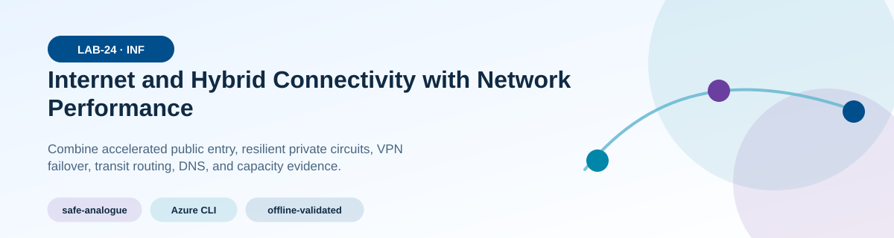
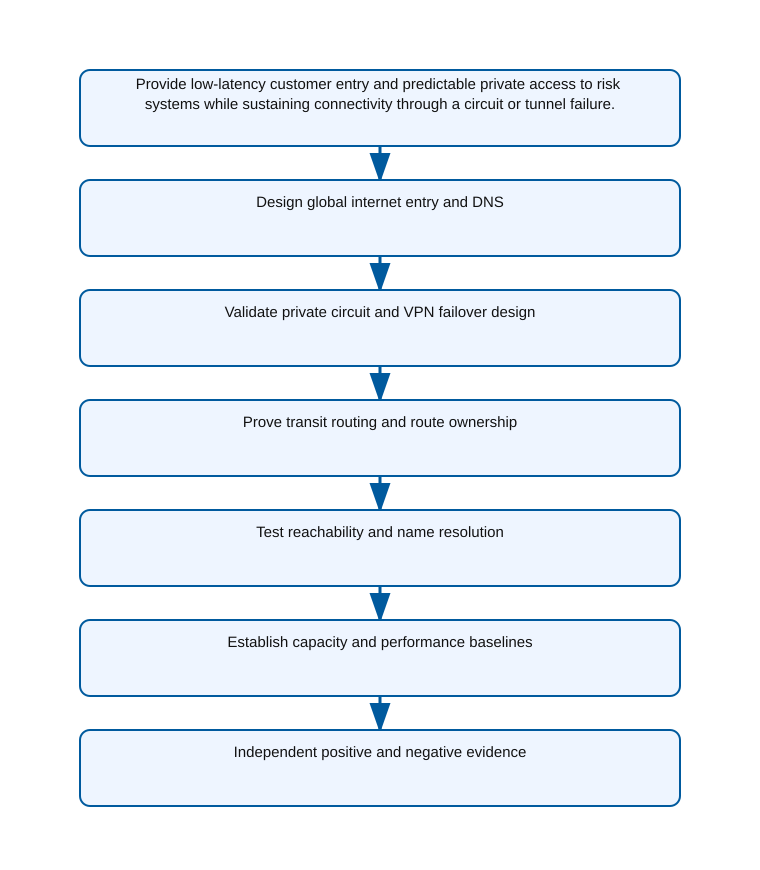
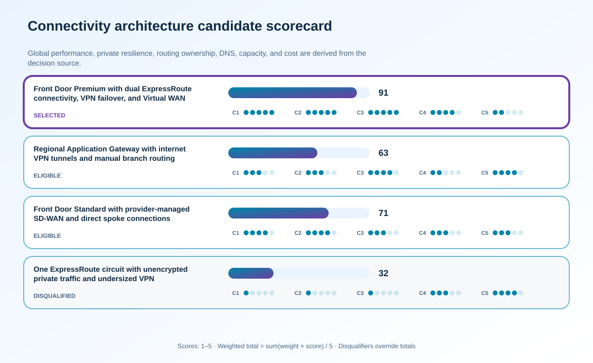

<!-- BEGIN GENERATED AZ305 V1 -->
# LAB-24 — Internet and Hybrid Connectivity with Network Performance



<div class="az305-badges" aria-label="Lab classification">
  <span class="az305-mode-badge">safe-analogue</span>
  <span class="az305-lane-badge">Azure CLI</span>
  <span class="az305-status">offline-validated</span>
</div>

## 1. Navigation

[← LAB-23](../23-workload-data-migration/README.md) · [Lab catalog](../README.md) · [LAB-25 →](../25-network-security-traffic-delivery/README.md)

## 2. Scenario and completion contract

Coho Bank serves customers through public web and API endpoints while core risk systems remain in two private datacenters. Internet users need globally accelerated TLS entry, branches need reliable access to Azure services, and high-volume transaction flows require predictable private connectivity with encrypted backup when a circuit fails. Teams currently discuss ExpressRoute, VPN, Virtual WAN, Front Door, and DNS as isolated products, leaving route propagation, asymmetric paths, name resolution, latency, bandwidth, and failover behavior unowned. The lab uses Azure CLI to inspect a safe network analogue, measure reachability, and compare designs without provisioning a circuit or production-scale gateway.

- Architect role: Hybrid connectivity architect
- Outcome: Design a resilient internet and hybrid connectivity architecture with explicit routing, DNS, failover, performance, and operational evidence.
- Duration: 165 minutes
- Difficulty: advanced
- Cost class: low
- Completion: all five checkpoint assertions, final validation, decision revision, and cleanup review are complete.

## 3. Objective-to-evidence map

| Objective | Requirement | Checkpoint |
| --- | --- | --- |
| `INF-NET-01` | `LAB24-REQ-01` | [`LAB24-CP01`](#checkpoint-1) |
| `INF-NET-02` | `LAB24-REQ-02` | [`LAB24-CP02`](#checkpoint-2) |
| `INF-NET-03` | `LAB24-REQ-03` | [`LAB24-CP03`](#checkpoint-3) |
| `INF-NET-01` | `LAB24-REQ-04` | [`LAB24-CP04`](#checkpoint-4) |
| `INF-NET-02` | `LAB24-REQ-05` | [`LAB24-CP05`](#checkpoint-5) |

## 4. Business and quality requirements

Business outcome: Provide low-latency customer entry and predictable private access to risk systems while sustaining connectivity through a circuit or tunnel failure.

- `LAB24-REQ-01` — The design covers authoritative DNS, Front Door Standard or Premium, TLS, origin naming, health probes, caching boundary, IPv4 and IPv6, and regional-origin failure.
- `LAB24-REQ-02` — Dual private paths, diverse provider locations, BGP, gateway scale, FastPath decision, VPN encryption, and deterministic preference and failback are documented.
- `LAB24-REQ-03` — Advertised and learned prefixes, propagation labels, next hops, default-route intent, DNS forwarders, and ownership are explicit for every path.
- `LAB24-REQ-04` — Independent tests prove approved branch, datacenter, spoke, private endpoint, DNS, and internet paths while disallowed public paths remain unreachable.
- `LAB24-REQ-05` — Latency percentiles, jitter, loss, throughput, connection scale, gateway and circuit headroom, and failover convergence meet documented targets.

Scenario facts:

- **Data:** Customer HTTPS traffic and private transaction flows cross distinct edge, WAN, routing, inspection, and encryption boundaries.
- **Scale:** Backup VPN is sized for one hundred percent of measured peak transaction traffic for four hours; circuit throughput remains measured evidence.
- **Latency:** Front Door optimizes customer entry and ExpressRoute serves private latency, with encrypted VPN failover tested against the workload target.
- **Availability:** Dual circuits, independent paths, VPN fallback, and hub routing cover provider, gateway, and connection failures separately.
- **RTO:** Path convergence must occur within the risk-system recovery objective; no unsupported numerical target is assigned.
- **RPO:** Connectivity carries transactions but does not define their data RPO; in-flight retry and idempotency remain application requirements.
- **Budget:** Full-size VPN standby and encrypted circuit paths are explicit regulatory continuity costs rather than assumed free redundancy.

Constraints:

- Customer entry must remain globally available while risk-system access follows predictable private paths through circuit or tunnel failure.
- Private transaction traffic must be encrypted over ExpressRoute and the backup VPN must carry four hours of full peak load.
- Use only the Azure CLI command lane for learner implementation.
- Keep all live changes behind explicit execution and acknowledgement switches.
- Retain only sanitized command evidence and synthetic fixture identifiers.

Assumptions:

- Colocation and network providers support the selected ExpressRoute encryption option or application-layer encryption.
- Branch and hub address spaces permit deterministic routing without overlapping prefixes.
- West Europe is the configurable primary example and North Europe is the configurable secondary example.
- The learner has administrator-level Azure operations knowledge but receives no pre-existing authenticated context.
- Offline fixtures demonstrate contract behavior rather than live Azure service behavior.

## 5. Architecture diagram and walkthrough



Front Door accelerates internet entry while dual ExpressRoute circuits, VPN failover, and Virtual WAN provide governed hybrid transit. The labelled nodes, boundaries, and edges are deterministically rendered from the portable `diagrams/architecture.mmd` source and the frozen visual registry.

## 6. Concept primer and candidate architectures

Architecture decisions translate measurable requirements into a deliberate service and operating model. A candidate is viable only when every mandatory constraint is met; convenience or familiarity cannot compensate for a disqualifier.

- **Front Door Premium with dual ExpressRoute connectivity, VPN failover, and Virtual WAN transit** (eligible) — Premium edge security, redundant private circuits, scaled VPN fallback, and managed transit form explicit customer and private failure paths.
- **Regional Application Gateway with internet VPN tunnels and manual branch routing** (eligible) — Regional ingress and VPN can reduce cost, but global entry, route convergence, and manual branch failover are weaker.
- **Front Door Standard with provider-managed SD-WAN and direct spoke connections** (eligible) — Provider SD-WAN may simplify branch operations, but direct spokes fragment route and security ownership and Standard lacks Premium private-origin capabilities.
- **One ExpressRoute circuit with unencrypted private traffic and undersized VPN** (ineligible) — Minimal redundant capacity lowers cost but leaves a circuit failure and unencrypted path outside the regulatory contract. Disqualifier: LAB24-REQ-02 requires encrypted private paths and a VPN failover design sized to the approved traffic load.

## 7. Decision, ADR, and Well-Architected review

Criteria weights are C1 30, C2 25, C3 20, C4 15, and C5 10. Weighted totals use `sum(weight × score) / 5`.



| Candidate | Eligible | C1 | C2 | C3 | C4 | C5 | Weighted /100 |
| --- | ---: | ---: | ---: | ---: | ---: | ---: | ---: |
| Front Door Premium with dual ExpressRoute connectivity, VPN failover, and Virtual WAN transit | yes | 5 | 5 | 5 | 4 | 2 | 91 |
| Regional Application Gateway with internet VPN tunnels and manual branch routing | yes | 3 | 3 | 4 | 2 | 4 | 63 |
| Front Door Standard with provider-managed SD-WAN and direct spoke connections | yes | 4 | 4 | 3 | 3 | 3 | 71 |
| One ExpressRoute circuit with unencrypted private traffic and undersized VPN | no | 1 | 1 | 1 | 3 | 4 | 32 |

Selected design: **Front Door Premium with dual ExpressRoute connectivity, VPN failover, and Virtual WAN transit**. `ADR-LAB24-001` records the accepted reasoning. Review Reliability, Security, Cost Optimization, Operational Excellence, and Performance Efficiency in `design/decision.yml`; no pillar is implied by another.

Rejected alternatives:

- **Regional Application Gateway with internet VPN tunnels and manual branch routing:** It lacks the selected design's global edge and predictable automated transit behavior.
- **Front Door Standard with provider-managed SD-WAN and direct spoke connections:** Split provider and spoke controls make end-to-end private path evidence harder to establish.
- **One ExpressRoute circuit with unencrypted private traffic and undersized VPN:** It is ineligible because both encryption and backup-capacity requirements are mandatory.

Architecture risks:

- **Risk:** Encryption overhead can reduce effective throughput below the four-hour peak requirement. **Mitigation:** Load-test encrypted circuit and VPN paths with production packet sizes and reserve measured headroom.
- **Risk:** Advertised routes can prefer an unintended path and bypass inspection during failover. **Mitigation:** Capture effective routes and next hops for normal, circuit-loss, and recovery states before approval.

Well-Architected consequences:

<div class="az305-waf-grid">
<article class="az305-waf-card"><h3>Reliability</h3><p>Independent edge, dual-circuit, VPN, gateway, and route tests expose each connectivity failure domain.</p></article>
<article class="az305-waf-card"><h3>Security</h3><p>Premium edge controls and encrypted private transport protect both public entry and regulated transactions.</p></article>
<article class="az305-waf-card"><h3>Cost Optimization</h3><p>Redundant circuits and full VPN capacity are tied to regulatory continuity instead of duplicated indiscriminately.</p></article>
<article class="az305-waf-card"><h3>Operational Excellence</h3><p>Route, encryption, health, failover, and restoration evidence provide a deterministic network runbook.</p></article>
<article class="az305-waf-card"><h3>Performance Efficiency</h3><p>Measured encrypted throughput sizes gateways and tunnels for the full four-hour peak.</p></article>
</div>

ADR consequences:

- Network owners must operate and exercise both circuit and VPN encryption paths at production-equivalent load.
- Effective-route evidence becomes a release artifact because nominal connection health cannot prove path choice.

## 8. Inputs, permissions, licensing, cost, and analogue

Use configurable `Location` (`AZ305_LOCATION`, default West Europe) and `SecondaryLocation` (`AZ305_SECONDARY_LOCATION`, default North Europe). Every public input has an explicit `AZ305_*` fallback. Preview is the default; only Golden Lab 00 writes an intent-only `execute: false` preview record. Before an executed cloud command, the supplied subscription and tenant must exactly match the active CLI, Az, and—where applicable—Microsoft Graph contexts. `-Execute` crosses the execution boundary; cost-bearing and tenant-scoped paths also require their independent acknowledgement switches.

Safe analogue: Inspect synthetic topology, routes, cipher requirements, and capacity calculations; use the offline Front Door REST fixture and issue no network change.

Permissions: Front Door, ExpressRoute, VPN, Virtual WAN, routing, and network monitoring read roles support inspection; profile, circuit, gateway, route, or encryption changes require separate authorization.

Licensing: Front Door Premium, ExpressRoute circuits and gateways, Virtual WAN hubs, VPN gateways, bandwidth, and monitoring each have recurring charges.

Cost boundary: Include dual circuits, provider ports, gateway scale units, VPN peak capacity, Front Door requests and transfer, and encrypted-path operations.

## 9. Read-only preflight

```powershell
pwsh ./scripts/azure-cli/Preflight.ps1 -RunId synthetic-240001
```

Synthetic sample: `{"labId":"LAB-24","track":"azure-cli","result":"pass","note":"Local tool discovery only"}`. This is illustrative local output, not evidence captured from Azure.

## 10. Five guided checkpoints

<ol class="az305-checkpoint-timeline" aria-label="Five checkpoint learning path">
<li><a href="#checkpoint-1">Design global internet entry and DNS</a><span>LAB24-REQ-01 · LAB24-CP01</span></li>
<li><a href="#checkpoint-2">Validate private circuit and VPN failover design</a><span>LAB24-REQ-02 · LAB24-CP02</span></li>
<li><a href="#checkpoint-3">Prove transit routing and route ownership</a><span>LAB24-REQ-03 · LAB24-CP03</span></li>
<li><a href="#checkpoint-4">Test reachability and name resolution</a><span>LAB24-REQ-04 · LAB24-CP04</span></li>
<li><a href="#checkpoint-5">Establish capacity and performance baselines</a><span>LAB24-REQ-05 · LAB24-CP05</span></li>
</ol>

### Checkpoint 1: Design global internet entry and DNS

<a id="checkpoint-1"></a>

**Trace:** `INF-NET-01` → `LAB24-REQ-01` → `LAB24-CP01`

```powershell
az rest --method get --url "https://management.azure.com/subscriptions/$SubscriptionId/resourceGroups/$ResourceGroupName/providers/Microsoft.Cdn/profiles/$FrontDoorProfileName?api-version=2024-09-01" --query "{id:id,sku:sku.name,provisioningState:properties.provisioningState,frontDoorId:properties.frontDoorId}" --output json --only-show-errors
```

Expected evidence: The design covers authoritative DNS, Front Door Standard or Premium, TLS, origin naming, health probes, caching boundary, IPv4 and IPv6, and regional-origin failure. Retain Preserve the DNS chain, profile and endpoint projection, probe design, origin matrix, and failure-routing expectations.

Positive assertion:

```powershell
$frontDoorProfile = az rest --method get --url "https://management.azure.com/subscriptions/$SubscriptionId/resourceGroups/$ResourceGroupName/providers/Microsoft.Cdn/profiles/$FrontDoorProfileName?api-version=2024-09-01" --output json --only-show-errors | ConvertFrom-Json; if ($frontDoorProfile.properties.provisioningState -ne 'Succeeded' -or $frontDoorProfile.sku.name -notin @('Standard_AzureFrontDoor','Premium_AzureFrontDoor')) { throw 'The Front Door profile is not a supported ready tier.' }
```

Negative assertion:

```powershell
$response = az rest --method get --url "https://management.azure.com/subscriptions/$SubscriptionId/resourceGroups/$ResourceGroupName/providers/Microsoft.Cdn/profiles/$FrontDoorProfileName/afdEndpoints?api-version=2024-09-01" --output json --only-show-errors | ConvertFrom-Json; if ($response.value | Where-Object { $_.properties.enabledState -ne 'Enabled' }) { throw 'A required Front Door endpoint is disabled.' }
```

Failure and retry: Global service availability can still be lost through a mis-scoped DNS zone or unhealthy common origin dependency. Correct the DNS or origin model and repeat resolution plus endpoint-health assertions from each test vantage point.

Cleanup dependency: Remove local DNS captures; do not modify public records or Front Door configuration in the safe analogue.

WAF consequence: Performance Efficiency: anycast entry and edge acceleration reduce global connection latency while health-based routing avoids failed origins.

### Checkpoint 2: Validate private circuit and VPN failover design

<a id="checkpoint-2"></a>

**Trace:** `INF-NET-02` → `LAB24-REQ-02` → `LAB24-CP02`

```powershell
az network express-route show --resource-group $ResourceGroupName --name $ExpressRouteCircuitName --query "{serviceProvider:serviceProviderProperties.serviceProviderName,bandwidth:serviceProviderProperties.bandwidthInMbps,state:serviceProviderProvisioningState,circuitStatus:circuitProvisioningState,peerings:peerings[].peeringType}" --output json --only-show-errors
```

Expected evidence: Dual private paths, diverse provider locations, BGP, gateway scale, FastPath decision, VPN encryption, and deterministic preference and failback are documented. Retain Save circuit and gateway projections, provider diversity statement, prefix table, BGP preference, and failover timing target.

Positive assertion:

```powershell
$circuit = az network express-route show --resource-group $ResourceGroupName --name $ExpressRouteCircuitName --output json --only-show-errors | ConvertFrom-Json; if ($circuit.serviceProviderProvisioningState -ne 'Provisioned' -or $circuit.circuitProvisioningState -ne 'Enabled') { throw 'The ExpressRoute circuit is not ready.' }
```

Negative assertion:

```powershell
$gateways = az network vnet-gateway list --resource-group $ResourceGroupName --output json --only-show-errors | ConvertFrom-Json; if (-not ($gateways | Where-Object { $_.gatewayType -eq 'Vpn' -and $_.provisioningState -eq 'Succeeded' })) { throw 'No ready VPN failover gateway was found.' }
```

Failure and retry: Nominal redundancy can share a physical or routing failure domain and provide no effective continuity. Correct path diversity or route preference in the model and replay circuit-withdrawal scenarios.

Cleanup dependency: Delete local projections; never disconnect a circuit or tunnel during assessment.

WAF consequence: Reliability: physically and logically diverse private and encrypted backup paths remove single connectivity dependencies.

### Checkpoint 3: Prove transit routing and route ownership

<a id="checkpoint-3"></a>

**Trace:** `INF-NET-03` → `LAB24-REQ-03` → `LAB24-CP03`

```powershell
az network vhub show --resource-group $ResourceGroupName --name $VirtualHubName --query "{id:id,addressPrefix:addressPrefix,routingState:routingState,virtualRouterAsn:virtualRouterAsn,provisioningState:provisioningState}" --output json --only-show-errors
```

Expected evidence: Advertised and learned prefixes, propagation labels, next hops, default-route intent, DNS forwarders, and ownership are explicit for every path. Retain Preserve effective route projections, prefix ownership, path diagrams, DNS query flow, and asymmetric-path tests.

Positive assertion:

```powershell
$hub = az network vhub show --resource-group $ResourceGroupName --name $VirtualHubName --output json --only-show-errors | ConvertFrom-Json; if ($hub.provisioningState -ne 'Succeeded' -or $hub.routingState -notin @('Provisioned','Provisioning')) { throw 'The virtual hub is not ready for transit.' }
```

Negative assertion:

```powershell
$routes = az network vhub route-table route list --resource-group $ResourceGroupName --vhub-name $VirtualHubName --route-table-name $HubRouteTableName --output json --only-show-errors | ConvertFrom-Json; if ($routes | Where-Object { $_.destinations -contains '0.0.0.0/0' -and $_.nextHopType -eq 'ResourceId' -and -not $_.nextHops }) { throw 'A default route has no valid next hop.' }
```

Failure and retry: Control-plane connectivity can report provisioned while data follows an unintended or asymmetric route. Correct propagation association or prefix ownership and rerun source-to-destination path evaluation.

Cleanup dependency: Remove local route exports; do not update hub route tables during the safe analogue.

WAF consequence: Security: explicit route ownership prevents accidental bypass of approved inspection and private paths.

### Checkpoint 4: Test reachability and name resolution

<a id="checkpoint-4"></a>

**Trace:** `INF-NET-01` → `LAB24-REQ-04` → `LAB24-CP04`

```powershell
az network watcher test-connectivity --resource-group $ResourceGroupName --source-resource $SourceVmId --dest-address $PrivateServiceFqdn --dest-port 443 --protocol Tcp --output json --only-show-errors
```

Expected evidence: Independent tests prove approved branch, datacenter, spoke, private endpoint, DNS, and internet paths while disallowed public paths remain unreachable. Retain Save source, destination, resolved addresses, hops, latency, expected path, and positive and negative assertion results.

Positive assertion:

```powershell
$test = az network watcher test-connectivity --resource-group $ResourceGroupName --source-resource $SourceVmId --dest-address $PrivateServiceFqdn --dest-port 443 --protocol Tcp --output json --only-show-errors | ConvertFrom-Json; if ($test.connectionStatus -ne 'Reachable') { throw 'The approved private endpoint is not reachable.' }
```

Negative assertion:

```powershell
$publicTest = az network watcher test-connectivity --resource-group $ResourceGroupName --source-resource $SourceVmId --dest-address $DisallowedPublicEndpoint --dest-port 443 --protocol Tcp --output json --only-show-errors | ConvertFrom-Json; if ($publicTest.connectionStatus -eq 'Reachable') { throw 'A disallowed public endpoint is reachable.' }
```

Failure and retry: Network reachability without correct name resolution and path intent can bypass security or break applications. Diagnose DNS, effective routes, NSGs, and next-hop state separately before repeating the exact test.

Cleanup dependency: Delete diagnostic output containing topology details; test-connectivity creates no persistent resource.

WAF consequence: Operational Excellence: repeatable positive and negative probes turn connectivity intent into observable evidence.

### Checkpoint 5: Establish capacity and performance baselines

<a id="checkpoint-5"></a>

**Trace:** `INF-NET-02` → `LAB24-REQ-05` → `LAB24-CP05`

```powershell
az monitor metrics list --resource $ExpressRouteCircuitResourceId --metric ArpAvailability,BgpAvailability,BitsInPerSecond,BitsOutPerSecond --interval PT5M --aggregation Average,Maximum --output json --only-show-errors
```

Expected evidence: Latency percentiles, jitter, loss, throughput, connection scale, gateway and circuit headroom, and failover convergence meet documented targets. Retain Archive timestamped metric samples, endpoint timings, utilization percentiles, failover convergence, and capacity forecast.

Positive assertion:

```powershell
$metrics = az monitor metrics list --resource $ExpressRouteCircuitResourceId --metric ArpAvailability,BgpAvailability --interval PT5M --aggregation Average --output json --only-show-errors | ConvertFrom-Json; if ($metrics.value.timeseries.data.average | Where-Object { $_ -lt 100 }) { throw 'Circuit availability evidence is below target.' }
```

Negative assertion:

```powershell
$throughput = az monitor metrics list --resource $ExpressRouteCircuitResourceId --metric BitsInPerSecond,BitsOutPerSecond --interval PT5M --aggregation Maximum --output json --only-show-errors | ConvertFrom-Json; if ($throughput.value.timeseries.data.maximum | Where-Object { $_ -gt $ApprovedBitsPerSecond }) { throw 'Observed throughput exceeds approved headroom.' }
```

Failure and retry: A path can remain reachable while congestion or failover capacity violates application objectives. Isolate the constrained segment, correct sizing or routing in the design, and repeat the same load profile.

Cleanup dependency: Remove synthetic performance data and sanitized captures according to evidence policy.

WAF consequence: Cost Optimization: measured headroom supports the least expensive circuit and gateway capacity that still meets degraded-mode demand.

## 11. Final validation and interpretation

Run `Validate.ps1 -Mode Deployment -Execute` only after an executed run has state and you are authorized to issue the ten read-only checkpoint inspections. Without `-Execute`, ordinary deployment validation records `partial` and exits `2`; Golden Lab 00 alone can validate its intent-only preview locally. Exit `0` means all required assertions pass, `1` means at least one failed, and `2` means the outcome is gated or partial. Positive and negative commands execute independently, so one failure never suppresses its paired assertion.

## 12. Material change request

The payment regulator requires all private transaction traffic to remain encrypted in transit even over ExpressRoute, and the backup VPN must carry the full peak load for four hours.

Revised solution: select **Front Door Premium with dual ExpressRoute connectivity, VPN failover, and Virtual WAN transit**. LAB24-REQ-02 requires explicit private-circuit and VPN failover design, so the selected path adds ExpressRoute encryption and a load-tested full-peak VPN capacity floor.

Revised Well-Architected consequences:

- **Reliability:** Full-capacity VPN prevents regulatory traffic from becoming a partial service during circuit loss.
- **Security:** Transaction traffic remains encrypted on primary and fallback private paths.
- **Cost Optimization:** Higher gateway and encryption cost is attributed to the four-hour compliance objective.
- **Operational Excellence:** Normal, failure, and restoration route captures prove the intended path.
- **Performance Efficiency:** Gateway selection follows encrypted throughput measurements rather than nominal SKU bandwidth.

## 13. Architect job challenge

Add an encryption approach, recalculate gateway and tunnel scale, update route preference and failover tests, and quantify the performance and cost impact.

## 14. Troubleshooting, cleanup, and residual verification

- If control-plane status is healthy but connectivity fails, inspect effective routes, BGP advertisements, DNS answers, and stateful return path separately.
- If Front Door reports an unhealthy origin, compare probe host header, certificate name, path, response code, and origin firewall rules.
- If metrics show no samples, verify resource ID, supported metric definitions, aggregation, and time window before concluding there is no traffic.

Cleanup previews nonempty state in reverse dependency order, writes `partial`, and exits `2`; an already empty run is completed locally and idempotently. Executed cleanup rechecks the exact live ID plus `purpose`, `labId`, `runId`, and `expiresOn` immediately before each removal, persists state after every absent or removed object, stops on the first dependency failure, and refuses unresolved pre-existing settings. It never automates purge. Finish with `Validate.ps1 -Mode PostCleanup`; the required residual count is zero.

## 15. Exam debrief, assessment, sources, and navigation

Explain the recommendation in terms of requirements, rejected alternatives, failure behavior, and all five WAF pillars. Complete `assessment/QUESTIONS.md`, then use the separately excluded answer key for remediation.

- [Azure networking plan and design overview](https://learn.microsoft.com/en-us/azure/networking/design-guide/overview)
- [Azure Well-Architected Framework](https://learn.microsoft.com/en-us/azure/well-architected/)

[← LAB-23](../23-workload-data-migration/README.md) · [Lab catalog](../README.md) · [LAB-25 →](../25-network-security-traffic-delivery/README.md)

## 16. Synchronized lifecycle-script appendix

### Preflight.ps1

```powershell
[CmdletBinding()]
param(
    [string]$SubscriptionId = $env:AZ305_SUBSCRIPTION_ID,
    [string]$TenantId = $env:AZ305_TENANT_ID,
    [ValidatePattern('^[a-z0-9-]{6,64}$')][string]$RunId = $env:AZ305_RUN_ID,
    [string]$Location = $(if ($env:AZ305_LOCATION) { $env:AZ305_LOCATION } else { 'westeurope' }),
    [string]$SecondaryLocation = $(if ($env:AZ305_SECONDARY_LOCATION) { $env:AZ305_SECONDARY_LOCATION } else { 'northeurope' }),
    [string]$ResourceGroup = $(if ($env:AZ305_RESOURCE_GROUP) { $env:AZ305_RESOURCE_GROUP } else { "rg-az305-$RunId" }),
    [string]$WorkloadName = $(if ($env:AZ305_WORKLOAD_NAME) { $env:AZ305_WORKLOAD_NAME } else { "az305-$RunId" }),
    [string]$ExpiresOn = $(if ($env:AZ305_EXPIRES_ON) { $env:AZ305_EXPIRES_ON } else { (Get-Date).ToUniversalTime().AddDays(1).ToString('yyyy-MM-dd') }),
    [int]$ApprovedBitsPerSecond = $(if ($env:AZ305_APPROVED_BITS_PER_SECOND) { [int]$env:AZ305_APPROVED_BITS_PER_SECOND } else { 0 }),
    [string]$DisallowedPublicEndpoint = $env:AZ305_DISALLOWED_PUBLIC_ENDPOINT,
    [string]$ExpressRouteCircuitName = $env:AZ305_EXPRESS_ROUTE_CIRCUIT_NAME,
    [string]$ExpressRouteCircuitResourceId = $env:AZ305_EXPRESS_ROUTE_CIRCUIT_RESOURCE_ID,
    [string]$FrontDoorProfileName = $env:AZ305_FRONT_DOOR_PROFILE_NAME,
    [string]$HubRouteTableName = $env:AZ305_HUB_ROUTE_TABLE_NAME,
    [string]$PrivateServiceFqdn = $env:AZ305_PRIVATE_SERVICE_FQDN,
    [string]$ResourceGroupName = $env:AZ305_RESOURCE_GROUP_NAME,
    [string]$SourceVmId = $env:AZ305_SOURCE_VM_ID,
    [string]$VirtualHubName = $env:AZ305_VIRTUAL_HUB_NAME,
    [switch]$Execute,
    [switch]$AcknowledgeCost,
    [switch]$AcknowledgeTenantChange
)

$ErrorActionPreference = 'Stop'
$PSNativeCommandUseErrorActionPreference = $true
if (-not $RunId) { [Console]::Error.WriteLine('RunId or AZ305_RUN_ID is required.'); exit 2 }
# Every lifecycle entrypoint intentionally exposes the same public parameter contract.
@($SubscriptionId, $TenantId, $RunId, $Location, $SecondaryLocation, $ResourceGroup, $WorkloadName, $ExpiresOn, $ApprovedBitsPerSecond, $DisallowedPublicEndpoint, $ExpressRouteCircuitName, $ExpressRouteCircuitResourceId, $FrontDoorProfileName, $HubRouteTableName, $PrivateServiceFqdn, $ResourceGroupName, $SourceVmId, $VirtualHubName, $Execute, $AcknowledgeCost, $AcknowledgeTenantChange) | Out-Null

$requiredCommands = @('az', 'pwsh')
$missing = @($requiredCommands | Where-Object { -not (Get-Command $_ -ErrorAction SilentlyContinue) })
if ($missing.Count -gt 0) {
    Write-Error "Missing local commands: $($missing -join ', ')"
    exit 1
}

[pscustomobject]@{
    labId = 'LAB-24'
    track = 'azure-cli'
    implementationMode = 'safe-analogue'
    result = 'pass'
    note = 'Local tool discovery only; no Azure or Microsoft Graph request was made.'
} | ConvertTo-Json
exit 0
```

### Setup.ps1

```powershell
[CmdletBinding()]
param(
    [string]$SubscriptionId = $env:AZ305_SUBSCRIPTION_ID,
    [string]$TenantId = $env:AZ305_TENANT_ID,
    [ValidatePattern('^[a-z0-9-]{6,64}$')][string]$RunId = $env:AZ305_RUN_ID,
    [string]$Location = $(if ($env:AZ305_LOCATION) { $env:AZ305_LOCATION } else { 'westeurope' }),
    [string]$SecondaryLocation = $(if ($env:AZ305_SECONDARY_LOCATION) { $env:AZ305_SECONDARY_LOCATION } else { 'northeurope' }),
    [string]$ResourceGroup = $(if ($env:AZ305_RESOURCE_GROUP) { $env:AZ305_RESOURCE_GROUP } else { "rg-az305-$RunId" }),
    [string]$WorkloadName = $(if ($env:AZ305_WORKLOAD_NAME) { $env:AZ305_WORKLOAD_NAME } else { "az305-$RunId" }),
    [string]$ExpiresOn = $(if ($env:AZ305_EXPIRES_ON) { $env:AZ305_EXPIRES_ON } else { (Get-Date).ToUniversalTime().AddDays(1).ToString('yyyy-MM-dd') }),
    [int]$ApprovedBitsPerSecond = $(if ($env:AZ305_APPROVED_BITS_PER_SECOND) { [int]$env:AZ305_APPROVED_BITS_PER_SECOND } else { 0 }),
    [string]$DisallowedPublicEndpoint = $env:AZ305_DISALLOWED_PUBLIC_ENDPOINT,
    [string]$ExpressRouteCircuitName = $env:AZ305_EXPRESS_ROUTE_CIRCUIT_NAME,
    [string]$ExpressRouteCircuitResourceId = $env:AZ305_EXPRESS_ROUTE_CIRCUIT_RESOURCE_ID,
    [string]$FrontDoorProfileName = $env:AZ305_FRONT_DOOR_PROFILE_NAME,
    [string]$HubRouteTableName = $env:AZ305_HUB_ROUTE_TABLE_NAME,
    [string]$PrivateServiceFqdn = $env:AZ305_PRIVATE_SERVICE_FQDN,
    [string]$ResourceGroupName = $env:AZ305_RESOURCE_GROUP_NAME,
    [string]$SourceVmId = $env:AZ305_SOURCE_VM_ID,
    [string]$VirtualHubName = $env:AZ305_VIRTUAL_HUB_NAME,
    [switch]$Execute,
    [switch]$AcknowledgeCost,
    [switch]$AcknowledgeTenantChange
)

$ErrorActionPreference = 'Stop'
$PSNativeCommandUseErrorActionPreference = $true
if (-not $RunId) { [Console]::Error.WriteLine('RunId or AZ305_RUN_ID is required.'); exit 2 }
# Every lifecycle entrypoint intentionally exposes the same public parameter contract.
@($SubscriptionId, $TenantId, $RunId, $Location, $SecondaryLocation, $ResourceGroup, $WorkloadName, $ExpiresOn, $ApprovedBitsPerSecond, $DisallowedPublicEndpoint, $ExpressRouteCircuitName, $ExpressRouteCircuitResourceId, $FrontDoorProfileName, $HubRouteTableName, $PrivateServiceFqdn, $ResourceGroupName, $SourceVmId, $VirtualHubName, $Execute, $AcknowledgeCost, $AcknowledgeTenantChange) | Out-Null

$LabRoot = Split-Path (Split-Path $PSScriptRoot -Parent) -Parent
$StateRoot = Join-Path $LabRoot ".state/$RunId"
$StatePath = Join-Path $StateRoot 'run.json'

function Invoke-AzCliJson {
    [CmdletBinding()]
    param([Parameter(Mandatory)][string[]]$ArgumentList)
    $savedNativePreference = $PSNativeCommandUseErrorActionPreference
    try {
        # Capture the exit code ourselves so a failed native command cannot be
        # mistaken for an empty but successful JSON response.
        $PSNativeCommandUseErrorActionPreference = $false
        $outputLines = @(& az @ArgumentList)
        $nativeExit = $LASTEXITCODE
    }
    finally {
        $PSNativeCommandUseErrorActionPreference = $savedNativePreference
    }
    if ($nativeExit -ne 0) { throw "Azure CLI exited with code $nativeExit." }
    $raw = @($outputLines) -join "`n"
    if ([string]::IsNullOrWhiteSpace($raw)) { return $null }
    try { return ($raw | ConvertFrom-Json -Depth 100) }
    catch { throw 'Azure CLI returned data that was not valid JSON.' }
}

function Assert-ExactExecutionContext {
    [CmdletBinding()]
    param([string]$ExpectedSubscriptionId, [string]$ExpectedTenantId)
    if ([string]::IsNullOrWhiteSpace($ExpectedSubscriptionId) -or [string]::IsNullOrWhiteSpace($ExpectedTenantId)) {
        throw 'SubscriptionId and TenantId are required before a cloud request.'
    }
    $context = Invoke-AzCliJson -ArgumentList @('account', 'show', '--output', 'json', '--only-show-errors')
    if (-not $context -or [string]$context.id -ine $ExpectedSubscriptionId -or [string]$context.tenantId -ine $ExpectedTenantId) {
        throw 'The active Azure CLI subscription or tenant does not exactly match the requested context.'
    }
}

function Save-RunState {
    [CmdletBinding()]
    param([Parameter(Mandatory)]$State)
    $temporaryPath = "$StatePath.tmp"
    $State | ConvertTo-Json -Depth 20 | Set-Content -LiteralPath $temporaryPath -Encoding utf8NoBOM
    Move-Item -LiteralPath $temporaryPath -Destination $StatePath -Force
}

function Assert-SafeStateValue {
    [CmdletBinding()]
    param($Value)
    $serialized = $Value | ConvertTo-Json -Depth 12 -Compress
    if ($serialized -match '(?i)"(?:token|password|secret|certificate|connectionString|sas|clientSecret|accessToken|refreshToken|accountKey|privateKey)"\s*:') {
        throw 'A prohibited sensitive field name was returned; state capture is refused.'
    }
}

function Convert-CheckpointOutput {
    [CmdletBinding()]
    param($Value)
    if ($Value -is [string]) { $raw = [string]$Value }
    elseif ($Value -is [System.Collections.IEnumerable] -and @($Value | Where-Object { $_ -isnot [string] }).Count -eq 0) { $raw = @($Value) -join "`n" }
    else { return $Value }
    if ([string]::IsNullOrWhiteSpace($raw)) { return $null }
    try { return ($raw | ConvertFrom-Json -Depth 100) } catch { return $Value }
}

function Get-ReturnedResourceId {
    [CmdletBinding()]
    param($Value)
    $seen = [System.Collections.Generic.HashSet[string]]::new([System.StringComparer]::OrdinalIgnoreCase)
    $results = [System.Collections.Generic.List[string]]::new()
    function Add-ArmId {
        param($Candidate)
        if ($Candidate -is [string] -and $Candidate -match '^/subscriptions/[0-9a-f-]+/(?:resourceGroups/[^/]+(?:/providers/.+)?|providers/.+)$' -and $Candidate -notmatch '/providers/Microsoft\.Resources/deployments/') {
            if ($seen.Add($Candidate)) { $results.Add($Candidate) }
        }
    }
    function Find-DeploymentOutputId {
        param($Item, [int]$Depth)
        if ($null -eq $Item -or $Depth -gt 12) { return }
        if ($Item -is [string]) { Add-ArmId -Candidate $Item; return }
        if ($Item -is [System.Collections.IDictionary]) { foreach ($key in $Item.Keys) { Find-DeploymentOutputId -Item $Item[$key] -Depth ($Depth + 1) }; return }
        if ($Item -is [System.Collections.IEnumerable]) { foreach ($entry in $Item) { Find-DeploymentOutputId -Item $entry -Depth ($Depth + 1) }; return }
        foreach ($property in @($Item.PSObject.Properties | Where-Object { $_.MemberType -in @('NoteProperty', 'Property') })) { Find-DeploymentOutputId -Item $property.Value -Depth ($Depth + 1) }
    }
    foreach ($rootItem in @($Value)) {
        if ($rootItem -is [System.Collections.IDictionary]) {
            foreach ($name in @('id', 'resourceId')) { if ($rootItem.Contains($name)) { Add-ArmId -Candidate $rootItem[$name] } }
            if ($rootItem.Contains('properties') -and $rootItem.properties -and $rootItem.properties.outputs) { Find-DeploymentOutputId -Item $rootItem.properties.outputs -Depth 0 }
            continue
        }
        foreach ($name in @('Id', 'ResourceId')) {
            $property = $rootItem.PSObject.Properties[$name]
            if ($property) { Add-ArmId -Candidate $property.Value }
        }
        if ($rootItem.PSObject.Properties['Properties'] -and $rootItem.Properties -and $rootItem.Properties.outputs) {
            Find-DeploymentOutputId -Item $rootItem.Properties.outputs -Depth 0
        }
    }
    return @($results)
}

function Get-PlannedDeploymentResourceId {
    [CmdletBinding()]
    param($Value)
    $seen = [System.Collections.Generic.HashSet[string]]::new([System.StringComparer]::OrdinalIgnoreCase)
    $results = [System.Collections.Generic.List[string]]::new()
    foreach ($change in @($Value.changes)) {
        $candidate = [string]$change.resourceId
        if ($candidate -match '^/subscriptions/[0-9a-f-]+/(?:resourceGroups/[^/]+(?:/providers/.+)?|providers/.+)$' -and $candidate -notmatch '/providers/Microsoft\.Resources/deployments/' -and $seen.Add($candidate)) {
            $results.Add($candidate)
        }
    }
    return @($results)
}

function Assert-InputSubscriptionScope {
    [CmdletBinding()]
    param($Inputs, [string]$ExpectedSubscriptionId)
    $entries = if ($Inputs -is [System.Collections.IDictionary]) {
        @($Inputs.GetEnumerator())
    } else {
        @($Inputs.PSObject.Properties | ForEach-Object { [pscustomobject]@{ Key = $_.Name; Value = $_.Value } })
    }
    foreach ($entry in $entries) {
        if ($entry.Value -is [string] -and [string]$entry.Value -match '^/subscriptions/([^/]+)/') {
            if ($Matches[1] -ine $ExpectedSubscriptionId) { throw "Input $($entry.Key) belongs to a different subscription." }
        }
    }
}

function Assert-ManagedMutation {
    [CmdletBinding()]
    param($State, [string]$CheckpointId, [bool]$CarriesOwnership, [object[]]$TargetResourceIds)
    if ($CarriesOwnership) { return }
    $targets = @($TargetResourceIds | Where-Object { $_ -is [string] -and $_ -match '^/subscriptions/' })
    if ($targets.Count -eq 0) { throw "$CheckpointId refuses an untagged mutation because no exact ARM target ID was supplied." }
    $knownIds = @($State.managedObjects | ForEach-Object { [string]$_.id })
    if ($knownIds.Count -eq 0) { throw "$CheckpointId refuses to modify a pre-existing object because no run-owned parent has been recorded." }
    foreach ($target in $targets) {
        $related = @($knownIds | Where-Object { $target -ieq $_ -or $target.StartsWith("$_/", [System.StringComparison]::OrdinalIgnoreCase) -or $_.StartsWith("$target/", [System.StringComparison]::OrdinalIgnoreCase) }).Count -gt 0
        if (-not $related) { throw "$CheckpointId refuses a mutation outside the exact run-owned resource boundary." }
    }
}

$executionInputs = [ordered]@{ subscriptionId = $SubscriptionId; tenantId = $TenantId; location = $Location; secondaryLocation = $SecondaryLocation; resourceGroup = $ResourceGroup; workloadName = $WorkloadName; expiresOn = $ExpiresOn; ApprovedBitsPerSecond = $ApprovedBitsPerSecond; DisallowedPublicEndpoint = $DisallowedPublicEndpoint; ExpressRouteCircuitName = $ExpressRouteCircuitName; ExpressRouteCircuitResourceId = $ExpressRouteCircuitResourceId; FrontDoorProfileName = $FrontDoorProfileName; HubRouteTableName = $HubRouteTableName; PrivateServiceFqdn = $PrivateServiceFqdn; ResourceGroupName = $ResourceGroupName; SourceVmId = $SourceVmId; VirtualHubName = $VirtualHubName }

if (-not $Execute) {
    Write-Output '[preview] No cloud command was called and no state was created.'
    Write-Output '[preview] Re-run with -Execute only in an authorized disposable environment.'
    exit 0
}
# This setup is compatible with the lab implementation mode.
# This default exercise does not require a cost acknowledgement.
# This lab does not perform a tenant-scoped change by default.
$requiredLabInputs = [ordered]@{ ExpressRouteCircuitName = $ExpressRouteCircuitName; ExpressRouteCircuitResourceId = $ExpressRouteCircuitResourceId; FrontDoorProfileName = $FrontDoorProfileName; PrivateServiceFqdn = $PrivateServiceFqdn; ResourceGroupName = $ResourceGroupName; SourceVmId = $SourceVmId; VirtualHubName = $VirtualHubName }
$missingLabInputs = @($requiredLabInputs.GetEnumerator() | Where-Object { $_.Value -is [string] -and [string]::IsNullOrWhiteSpace([string]$_.Value) } | ForEach-Object Key)
if ($missingLabInputs.Count -gt 0) { [Console]::Error.WriteLine("Execution is gated; supply: $($missingLabInputs -join ', ')."); exit 2 }

try {
    Assert-ExactExecutionContext -ExpectedSubscriptionId $SubscriptionId -ExpectedTenantId $TenantId
    Assert-InputSubscriptionScope -Inputs $executionInputs -ExpectedSubscriptionId $SubscriptionId
    Assert-SafeStateValue -Value $executionInputs
}
catch {
    [Console]::Error.WriteLine("Execution is gated by context or input validation: $($_.Exception.Message)")
    exit 2
}

# Recovery state is persisted before the first possible mutation below.
if (Test-Path -LiteralPath $StatePath) {
    [Console]::Error.WriteLine('Run state already exists. Choose a new RunId or complete the recorded cleanup; existing recovery state will not be overwritten.')
    exit 2
}
New-Item -ItemType Directory -Path $StateRoot -Force | Out-Null
$state = [ordered]@{
    schemaVersion = '1.0.0'; labId = 'LAB-24'; runId = $RunId; track = 'azure-cli'
    implementationMode = 'safe-analogue'; status = 'initialized'
    createdAt = (Get-Date).ToUniversalTime().ToString('o'); execute = $true
    parameters = $executionInputs
    managedObjects = @(); originalSettings = @()
}
Save-RunState -State $state
$state.status = 'deploying'
Save-RunState -State $state

$originalLocation = Get-Location
try {
    Set-Location -LiteralPath $LabRoot
    # 24-CP01: Design global internet entry and DNS
    $stepResult = & { az rest --method get --url "https://management.azure.com/subscriptions/$SubscriptionId/resourceGroups/$ResourceGroupName/providers/Microsoft.Cdn/profiles/$FrontDoorProfileName?api-version=2024-09-01" --query "{id:id,sku:sku.name,provisioningState:properties.provisioningState,frontDoorId:properties.frontDoorId}" --output json --only-show-errors }
    if ($LASTEXITCODE -ne 0) { throw 'LAB24-CP01 native command exited with code ' + $LASTEXITCODE + '.' }
    $null = $stepResult

    # 24-CP02: Validate private circuit and VPN failover design
    $stepResult = & { az network express-route show --resource-group $ResourceGroupName --name $ExpressRouteCircuitName --query "{serviceProvider:serviceProviderProperties.serviceProviderName,bandwidth:serviceProviderProperties.bandwidthInMbps,state:serviceProviderProvisioningState,circuitStatus:circuitProvisioningState,peerings:peerings[].peeringType}" --output json --only-show-errors }
    if ($LASTEXITCODE -ne 0) { throw 'LAB24-CP02 native command exited with code ' + $LASTEXITCODE + '.' }
    $null = $stepResult

    # 24-CP03: Prove transit routing and route ownership
    $stepResult = & { az network vhub show --resource-group $ResourceGroupName --name $VirtualHubName --query "{id:id,addressPrefix:addressPrefix,routingState:routingState,virtualRouterAsn:virtualRouterAsn,provisioningState:provisioningState}" --output json --only-show-errors }
    if ($LASTEXITCODE -ne 0) { throw 'LAB24-CP03 native command exited with code ' + $LASTEXITCODE + '.' }
    $null = $stepResult

    # 24-CP04: Test reachability and name resolution
    $stepResult = & { az network watcher test-connectivity --resource-group $ResourceGroupName --source-resource $SourceVmId --dest-address $PrivateServiceFqdn --dest-port 443 --protocol Tcp --output json --only-show-errors }
    if ($LASTEXITCODE -ne 0) { throw 'LAB24-CP04 native command exited with code ' + $LASTEXITCODE + '.' }
    $null = $stepResult

    # 24-CP05: Establish capacity and performance baselines
    $stepResult = & { az monitor metrics list --resource $ExpressRouteCircuitResourceId --metric ArpAvailability,BgpAvailability,BitsInPerSecond,BitsOutPerSecond --interval PT5M --aggregation Average,Maximum --output json --only-show-errors }
    if ($LASTEXITCODE -ne 0) { throw 'LAB24-CP05 native command exited with code ' + $LASTEXITCODE + '.' }
    $null = $stepResult

    $state.status = 'deployed'
    Save-RunState -State $state
} catch {
    $state.status = 'failed'
    Save-RunState -State $state
    Write-Error $_
    exit 1
} finally {
    Set-Location -LiteralPath $originalLocation
}
exit 0
```

### Validate.ps1

```powershell
[CmdletBinding()]
param(
    [string]$SubscriptionId = $env:AZ305_SUBSCRIPTION_ID,
    [string]$TenantId = $env:AZ305_TENANT_ID,
    [ValidatePattern('^[a-z0-9-]{6,64}$')][string]$RunId = $env:AZ305_RUN_ID,
    [string]$Location = $(if ($env:AZ305_LOCATION) { $env:AZ305_LOCATION } else { 'westeurope' }),
    [string]$SecondaryLocation = $(if ($env:AZ305_SECONDARY_LOCATION) { $env:AZ305_SECONDARY_LOCATION } else { 'northeurope' }),
    [string]$ResourceGroup = $(if ($env:AZ305_RESOURCE_GROUP) { $env:AZ305_RESOURCE_GROUP } else { "rg-az305-$RunId" }),
    [string]$WorkloadName = $(if ($env:AZ305_WORKLOAD_NAME) { $env:AZ305_WORKLOAD_NAME } else { "az305-$RunId" }),
    [string]$ExpiresOn = $(if ($env:AZ305_EXPIRES_ON) { $env:AZ305_EXPIRES_ON } else { (Get-Date).ToUniversalTime().AddDays(1).ToString('yyyy-MM-dd') }),
    [int]$ApprovedBitsPerSecond = $(if ($env:AZ305_APPROVED_BITS_PER_SECOND) { [int]$env:AZ305_APPROVED_BITS_PER_SECOND } else { 0 }),
    [string]$DisallowedPublicEndpoint = $env:AZ305_DISALLOWED_PUBLIC_ENDPOINT,
    [string]$ExpressRouteCircuitName = $env:AZ305_EXPRESS_ROUTE_CIRCUIT_NAME,
    [string]$ExpressRouteCircuitResourceId = $env:AZ305_EXPRESS_ROUTE_CIRCUIT_RESOURCE_ID,
    [string]$FrontDoorProfileName = $env:AZ305_FRONT_DOOR_PROFILE_NAME,
    [string]$HubRouteTableName = $env:AZ305_HUB_ROUTE_TABLE_NAME,
    [string]$PrivateServiceFqdn = $env:AZ305_PRIVATE_SERVICE_FQDN,
    [string]$ResourceGroupName = $env:AZ305_RESOURCE_GROUP_NAME,
    [string]$SourceVmId = $env:AZ305_SOURCE_VM_ID,
    [string]$VirtualHubName = $env:AZ305_VIRTUAL_HUB_NAME,
    [ValidateSet('Deployment', 'PostCleanup')][string]$Mode = 'Deployment',
    [switch]$Execute,
    [switch]$AcknowledgeCost,
    [switch]$AcknowledgeTenantChange
)

$ErrorActionPreference = 'Stop'
$PSNativeCommandUseErrorActionPreference = $true
if (-not $RunId) { [Console]::Error.WriteLine('RunId or AZ305_RUN_ID is required.'); exit 2 }
# Every lifecycle entrypoint intentionally exposes the same public parameter contract.
@($SubscriptionId, $TenantId, $RunId, $Location, $SecondaryLocation, $ResourceGroup, $WorkloadName, $ExpiresOn, $ApprovedBitsPerSecond, $DisallowedPublicEndpoint, $ExpressRouteCircuitName, $ExpressRouteCircuitResourceId, $FrontDoorProfileName, $HubRouteTableName, $PrivateServiceFqdn, $ResourceGroupName, $SourceVmId, $VirtualHubName, $Mode, $Execute, $AcknowledgeCost, $AcknowledgeTenantChange) | Out-Null

$LabRoot = Split-Path (Split-Path $PSScriptRoot -Parent) -Parent
$StateRoot = Join-Path $LabRoot ".state/$RunId"
$RunPath = Join-Path $StateRoot 'run.json'
$ValidationPath = Join-Path $StateRoot 'validation.json'

function Invoke-AzCliJson {
    [CmdletBinding()]
    param([Parameter(Mandatory)][string[]]$ArgumentList)
    $savedNativePreference = $PSNativeCommandUseErrorActionPreference
    try {
        # Capture the exit code ourselves so a failed native command cannot be
        # mistaken for an empty but successful JSON response.
        $PSNativeCommandUseErrorActionPreference = $false
        $outputLines = @(& az @ArgumentList)
        $nativeExit = $LASTEXITCODE
    }
    finally {
        $PSNativeCommandUseErrorActionPreference = $savedNativePreference
    }
    if ($nativeExit -ne 0) { throw "Azure CLI exited with code $nativeExit." }
    $raw = @($outputLines) -join "`n"
    if ([string]::IsNullOrWhiteSpace($raw)) { return $null }
    try { return ($raw | ConvertFrom-Json -Depth 100) }
    catch { throw 'Azure CLI returned data that was not valid JSON.' }
}

function Assert-ExactExecutionContext {
    [CmdletBinding()]
    param([string]$ExpectedSubscriptionId, [string]$ExpectedTenantId)
    if ([string]::IsNullOrWhiteSpace($ExpectedSubscriptionId) -or [string]::IsNullOrWhiteSpace($ExpectedTenantId)) {
        throw 'SubscriptionId and TenantId are required before a cloud request.'
    }
    $context = Invoke-AzCliJson -ArgumentList @('account', 'show', '--output', 'json', '--only-show-errors')
    if (-not $context -or [string]$context.id -ine $ExpectedSubscriptionId -or [string]$context.tenantId -ine $ExpectedTenantId) {
        throw 'The active Azure CLI subscription or tenant does not exactly match the requested context.'
    }
}


if (-not (Test-Path -LiteralPath $RunPath)) {
    Write-Warning 'No run state exists; validation is gated.'
    exit 2
}
$state = Get-Content -LiteralPath $RunPath -Raw | ConvertFrom-Json
$assertions = [System.Collections.Generic.List[object]]::new()
function Add-ValidationAssertion {
    [CmdletBinding()]
    param([string]$Id, [ValidateSet('positive', 'negative')][string]$Kind, [bool]$Passed, [string]$Message)
    $assertions.Add([pscustomobject]@{ id = $Id; kind = $Kind; passed = $Passed; message = $Message })
}

function Save-ValidationArtifact {
    [CmdletBinding()]
    param([ValidateSet('pass', 'partial', 'fail')][string]$Result)
    $artifact = [ordered]@{ schemaVersion = '1.0.0'; labId = 'LAB-24'; runId = $RunId; mode = $Mode; result = $Result; validatedAt = (Get-Date).ToUniversalTime().ToString('o'); assertions = @($assertions) }
    $artifact | ConvertTo-Json -Depth 12 | Set-Content -LiteralPath $ValidationPath -Encoding utf8NoBOM
}

function Test-PositiveEvidence {
    [CmdletBinding()]
    param($Value)
    if ($Value -is [bool]) { return $Value }
    if ($null -eq $Value) { return $false }
    if ($Value -is [string]) { return -not [string]::IsNullOrWhiteSpace($Value) }
    if ($Value -is [System.Collections.IEnumerable]) { return @($Value).Count -gt 0 }
    return $true
}

function Test-NegativeEvidence {
    [CmdletBinding()]
    param($Value)
    if ($Value -is [bool]) { return $Value }
    if ($null -eq $Value) { return $true }
    if ($Value -is [string]) { return [string]::IsNullOrWhiteSpace($Value) }
    if ($Value -is [System.Collections.IEnumerable]) { return @($Value).Count -eq 0 }
    $properties = @($Value.PSObject.Properties | Where-Object { $_.MemberType -in @('NoteProperty', 'Property') })
    if ($properties.Count -eq 0) { return $false }
    return @($properties | Where-Object { -not (Test-NegativeEvidence -Value $_.Value) }).Count -eq 0
}

function Test-ProhibitedStateField {
    [CmdletBinding()]
    param($Value)
    $serialized = $Value | ConvertTo-Json -Depth 20
    return $serialized -match '(?i)"(?:token|password|secret|certificate|connectionString|sas|clientSecret|accessToken|refreshToken|accountKey|privateKey)"\s*:'
}

function Assert-InputSubscriptionScope {
    [CmdletBinding()]
    param($Inputs, [string]$ExpectedSubscriptionId)
    $entries = if ($Inputs -is [System.Collections.IDictionary]) {
        @($Inputs.GetEnumerator())
    } else {
        @($Inputs.PSObject.Properties | ForEach-Object { [pscustomobject]@{ Key = $_.Name; Value = $_.Value } })
    }
    foreach ($entry in $entries) {
        if ($entry.Value -is [string] -and [string]$entry.Value -match '^/subscriptions/([^/]+)/' -and $Matches[1] -ine $ExpectedSubscriptionId) {
            throw "Input $($entry.Key) belongs to a different subscription."
        }
    }
}

$stateIdentityMatches = (
    $state.labId -ceq 'LAB-24' -and
    $state.runId -ceq $RunId -and
    $state.track -ceq 'azure-cli' -and
    $state.implementationMode -ceq 'safe-analogue' -and
    ([string]$state.parameters.subscriptionId -ieq $SubscriptionId -and [string]$state.parameters.tenantId -ieq $TenantId)
)
Add-ValidationAssertion -Id 'LAB24-VAL-POS-01' -Kind positive -Passed $stateIdentityMatches -Message 'Run identity, implementation mode, command track, tenant, and subscription exactly match the copied lab and requested run.'
$hasSensitiveName = Test-ProhibitedStateField -Value $state
Add-ValidationAssertion -Id 'LAB24-VAL-NEG-01' -Kind negative -Passed (-not $hasSensitiveName) -Message 'State contains no prohibited sensitive field name.'

if ($Mode -eq 'PostCleanup') {
    $cleanupPath = Join-Path $StateRoot 'cleanup.json'
    $cleanup = if (Test-Path -LiteralPath $cleanupPath) { Get-Content -LiteralPath $cleanupPath -Raw | ConvertFrom-Json } else { $null }
    Add-ValidationAssertion -Id 'LAB24-VAL-POS-02' -Kind positive -Passed ($null -ne $cleanup -and $cleanup.labId -ceq 'LAB-24' -and $cleanup.runId -ceq $RunId -and $cleanup.result -eq 'pass' -and $cleanup.ownershipVerified) -Message 'The exact run cleanup completed with verified ownership.'
    Add-ValidationAssertion -Id 'LAB24-VAL-NEG-02' -Kind negative -Passed ($null -ne $cleanup -and $cleanup.activeManagedObjects -eq 0 -and @($state.managedObjects).Count -eq 0 -and @($state.originalSettings).Count -eq 0 -and $state.status -eq 'cleaned') -Message 'No active managed object or unresolved original setting remains in cleanup or run state.'
    $postCleanupPassed = @($assertions | Where-Object { -not $_.passed }).Count -eq 0
    Save-ValidationArtifact -Result $(if ($postCleanupPassed) { 'pass' } else { 'fail' })
    if ($postCleanupPassed) { exit 0 }
    exit 1
}

Add-ValidationAssertion -Id 'LAB24-VAL-POS-02' -Kind positive -Passed ($state.status -eq 'deployed') -Message 'The executed setup completed successfully; a failed setup can never validate as pass.'
Add-ValidationAssertion -Id 'LAB24-VAL-NEG-02' -Kind negative -Passed (@($state.managedObjects | Where-Object { $_.tags.purpose -ne 'az305-lab' -or $_.tags.labId -ne 'LAB-24' -or $_.tags.runId -ne $RunId }).Count -eq 0) -Message 'No recorded object has a foreign ownership tag.'

if (@($assertions | Where-Object { -not $_.passed }).Count -gt 0) {
    Save-ValidationArtifact -Result 'fail'
    exit 1
}
if (-not $Execute) {
    # This lab has no special intent-only validation path.
    Save-ValidationArtifact -Result 'partial'
    Write-Warning 'Checkpoint validation is gated; re-run with -Execute after confirming the exact read-only context.'
    exit 2
}
# The validation surface is compatible with this lab implementation mode.
$requiredValidationInputs = [ordered]@{ ApprovedBitsPerSecond = $ApprovedBitsPerSecond; DisallowedPublicEndpoint = $DisallowedPublicEndpoint; ExpressRouteCircuitName = $ExpressRouteCircuitName; ExpressRouteCircuitResourceId = $ExpressRouteCircuitResourceId; FrontDoorProfileName = $FrontDoorProfileName; HubRouteTableName = $HubRouteTableName; PrivateServiceFqdn = $PrivateServiceFqdn; ResourceGroupName = $ResourceGroupName; SourceVmId = $SourceVmId; VirtualHubName = $VirtualHubName }
$missingValidationInputs = @($requiredValidationInputs.GetEnumerator() | Where-Object { $_.Value -is [string] -and [string]::IsNullOrWhiteSpace([string]$_.Value) } | ForEach-Object Key)
if ($missingValidationInputs.Count -gt 0) {
    Add-ValidationAssertion -Id 'LAB24-VAL-POS-CONTEXT' -Kind positive -Passed $false -Message 'One or more required non-secret validation inputs are missing.'
    Save-ValidationArtifact -Result 'partial'
    exit 2
}
try {
    Assert-ExactExecutionContext -ExpectedSubscriptionId $SubscriptionId -ExpectedTenantId $TenantId
    Assert-InputSubscriptionScope -Inputs $state.parameters -ExpectedSubscriptionId $SubscriptionId
    Add-ValidationAssertion -Id 'LAB24-VAL-POS-CONTEXT' -Kind positive -Passed $true -Message 'The active tenant and subscription exactly match the requested validation context.'
}
catch {
    Add-ValidationAssertion -Id 'LAB24-VAL-POS-CONTEXT' -Kind positive -Passed $false -Message 'Exact execution context could not be proven.'
    Save-ValidationArtifact -Result 'partial'
    exit 2
}

$originalLocation = Get-Location
try {
    Set-Location -LiteralPath $LabRoot
# LAB24-CP01: run both polarities even when one fails.
$positivePassed = $false
try {
    $global:LASTEXITCODE = 0
    $positiveEvidence = & { $frontDoorProfile = az rest --method get --url "https://management.azure.com/subscriptions/$SubscriptionId/resourceGroups/$ResourceGroupName/providers/Microsoft.Cdn/profiles/$FrontDoorProfileName?api-version=2024-09-01" --output json --only-show-errors | ConvertFrom-Json; if ($frontDoorProfile.properties.provisioningState -ne 'Succeeded' -or $frontDoorProfile.sku.name -notin @('Standard_AzureFrontDoor','Premium_AzureFrontDoor')) { throw 'The Front Door profile is not a supported ready tier.' } }
    if ($LASTEXITCODE -ne 0) { throw 'LAB24-CP01 positive native command exited with code ' + $LASTEXITCODE + '.' }
    $positivePassed = $true
    $null = $positiveEvidence
} catch { $positivePassed = $false }
Add-ValidationAssertion -Id 'LAB24-CP01-POS' -Kind positive -Passed $positivePassed -Message 'The design covers authoritative DNS, Front Door Standard or Premium, TLS, origin naming, health probes, caching boundary, IPv4 and IPv6, and regional-origin failure.'

$negativePassed = $false
try {
    $global:LASTEXITCODE = 0
    $negativeEvidence = & { $response = az rest --method get --url "https://management.azure.com/subscriptions/$SubscriptionId/resourceGroups/$ResourceGroupName/providers/Microsoft.Cdn/profiles/$FrontDoorProfileName/afdEndpoints?api-version=2024-09-01" --output json --only-show-errors | ConvertFrom-Json; if ($response.value | Where-Object { $_.properties.enabledState -ne 'Enabled' }) { throw 'A required Front Door endpoint is disabled.' } }
    if ($LASTEXITCODE -ne 0) { throw 'LAB24-CP01 negative native command exited with code ' + $LASTEXITCODE + '.' }
    $negativePassed = $true
    $null = $negativeEvidence
} catch { $negativePassed = $false }
Add-ValidationAssertion -Id 'LAB24-CP01-NEG' -Kind negative -Passed $negativePassed -Message 'A single regional public IP, circular DNS dependency, disabled health probe, or origin reachable outside the intended entry path must fail.'

# LAB24-CP02: run both polarities even when one fails.
$positivePassed = $false
try {
    $global:LASTEXITCODE = 0
    $positiveEvidence = & { $circuit = az network express-route show --resource-group $ResourceGroupName --name $ExpressRouteCircuitName --output json --only-show-errors | ConvertFrom-Json; if ($circuit.serviceProviderProvisioningState -ne 'Provisioned' -or $circuit.circuitProvisioningState -ne 'Enabled') { throw 'The ExpressRoute circuit is not ready.' } }
    if ($LASTEXITCODE -ne 0) { throw 'LAB24-CP02 positive native command exited with code ' + $LASTEXITCODE + '.' }
    $positivePassed = $true
    $null = $positiveEvidence
} catch { $positivePassed = $false }
Add-ValidationAssertion -Id 'LAB24-CP02-POS' -Kind positive -Passed $positivePassed -Message 'Dual private paths, diverse provider locations, BGP, gateway scale, FastPath decision, VPN encryption, and deterministic preference and failback are documented.'

$negativePassed = $false
try {
    $global:LASTEXITCODE = 0
    $negativeEvidence = & { $gateways = az network vnet-gateway list --resource-group $ResourceGroupName --output json --only-show-errors | ConvertFrom-Json; if (-not ($gateways | Where-Object { $_.gatewayType -eq 'Vpn' -and $_.provisioningState -eq 'Succeeded' })) { throw 'No ready VPN failover gateway was found.' } }
    if ($LASTEXITCODE -ne 0) { throw 'LAB24-CP02 negative native command exited with code ' + $LASTEXITCODE + '.' }
    $negativePassed = $true
    $null = $negativeEvidence
} catch { $negativePassed = $false }
Add-ValidationAssertion -Id 'LAB24-CP02-NEG' -Kind negative -Passed $negativePassed -Message 'Two links sharing one provider edge, overlapping prefixes, static routes that defeat failover, or untested VPN capacity must fail.'

# LAB24-CP03: run both polarities even when one fails.
$positivePassed = $false
try {
    $global:LASTEXITCODE = 0
    $positiveEvidence = & { $hub = az network vhub show --resource-group $ResourceGroupName --name $VirtualHubName --output json --only-show-errors | ConvertFrom-Json; if ($hub.provisioningState -ne 'Succeeded' -or $hub.routingState -notin @('Provisioned','Provisioning')) { throw 'The virtual hub is not ready for transit.' } }
    if ($LASTEXITCODE -ne 0) { throw 'LAB24-CP03 positive native command exited with code ' + $LASTEXITCODE + '.' }
    $positivePassed = $true
    $null = $positiveEvidence
} catch { $positivePassed = $false }
Add-ValidationAssertion -Id 'LAB24-CP03-POS' -Kind positive -Passed $positivePassed -Message 'Advertised and learned prefixes, propagation labels, next hops, default-route intent, DNS forwarders, and ownership are explicit for every path.'

$negativePassed = $false
try {
    $global:LASTEXITCODE = 0
    $negativeEvidence = & { $routes = az network vhub route-table route list --resource-group $ResourceGroupName --vhub-name $VirtualHubName --route-table-name $HubRouteTableName --output json --only-show-errors | ConvertFrom-Json; if ($routes | Where-Object { $_.destinations -contains '0.0.0.0/0' -and $_.nextHopType -eq 'ResourceId' -and -not $_.nextHops }) { throw 'A default route has no valid next hop.' } }
    if ($LASTEXITCODE -ne 0) { throw 'LAB24-CP03 negative native command exited with code ' + $LASTEXITCODE + '.' }
    $negativePassed = $true
    $null = $negativeEvidence
} catch { $negativePassed = $false }
Add-ValidationAssertion -Id 'LAB24-CP03-NEG' -Kind negative -Passed $negativePassed -Message 'Overlap, an orphaned next hop, asymmetric stateful path, unintended branch transit, or DNS forwarding loop must fail.'

# LAB24-CP04: run both polarities even when one fails.
$positivePassed = $false
try {
    $global:LASTEXITCODE = 0
    $positiveEvidence = & { $test = az network watcher test-connectivity --resource-group $ResourceGroupName --source-resource $SourceVmId --dest-address $PrivateServiceFqdn --dest-port 443 --protocol Tcp --output json --only-show-errors | ConvertFrom-Json; if ($test.connectionStatus -ne 'Reachable') { throw 'The approved private endpoint is not reachable.' } }
    if ($LASTEXITCODE -ne 0) { throw 'LAB24-CP04 positive native command exited with code ' + $LASTEXITCODE + '.' }
    $positivePassed = $true
    $null = $positiveEvidence
} catch { $positivePassed = $false }
Add-ValidationAssertion -Id 'LAB24-CP04-POS' -Kind positive -Passed $positivePassed -Message 'Independent tests prove approved branch, datacenter, spoke, private endpoint, DNS, and internet paths while disallowed public paths remain unreachable.'

$negativePassed = $false
try {
    $global:LASTEXITCODE = 0
    $negativeEvidence = & { $publicTest = az network watcher test-connectivity --resource-group $ResourceGroupName --source-resource $SourceVmId --dest-address $DisallowedPublicEndpoint --dest-port 443 --protocol Tcp --output json --only-show-errors | ConvertFrom-Json; if ($publicTest.connectionStatus -eq 'Reachable') { throw 'A disallowed public endpoint is reachable.' } }
    if ($LASTEXITCODE -ne 0) { throw 'LAB24-CP04 negative native command exited with code ' + $LASTEXITCODE + '.' }
    $negativePassed = $true
    $null = $negativeEvidence
} catch { $negativePassed = $false }
Add-ValidationAssertion -Id 'LAB24-CP04-NEG' -Kind negative -Passed $negativePassed -Message 'A successful ping alone, name resolution to a public address, or reachability that bypasses the required path must fail.'

# LAB24-CP05: run both polarities even when one fails.
$positivePassed = $false
try {
    $global:LASTEXITCODE = 0
    $positiveEvidence = & { $metrics = az monitor metrics list --resource $ExpressRouteCircuitResourceId --metric ArpAvailability,BgpAvailability --interval PT5M --aggregation Average --output json --only-show-errors | ConvertFrom-Json; if ($metrics.value.timeseries.data.average | Where-Object { $_ -lt 100 }) { throw 'Circuit availability evidence is below target.' } }
    if ($LASTEXITCODE -ne 0) { throw 'LAB24-CP05 positive native command exited with code ' + $LASTEXITCODE + '.' }
    $positivePassed = $true
    $null = $positiveEvidence
} catch { $positivePassed = $false }
Add-ValidationAssertion -Id 'LAB24-CP05-POS' -Kind positive -Passed $positivePassed -Message 'Latency percentiles, jitter, loss, throughput, connection scale, gateway and circuit headroom, and failover convergence meet documented targets.'

$negativePassed = $false
try {
    $global:LASTEXITCODE = 0
    $negativeEvidence = & { $throughput = az monitor metrics list --resource $ExpressRouteCircuitResourceId --metric BitsInPerSecond,BitsOutPerSecond --interval PT5M --aggregation Maximum --output json --only-show-errors | ConvertFrom-Json; if ($throughput.value.timeseries.data.maximum | Where-Object { $_ -gt $ApprovedBitsPerSecond }) { throw 'Observed throughput exceeds approved headroom.' } }
    if ($LASTEXITCODE -ne 0) { throw 'LAB24-CP05 negative native command exited with code ' + $LASTEXITCODE + '.' }
    $negativePassed = $true
    $null = $negativeEvidence
} catch { $negativePassed = $false }
Add-ValidationAssertion -Id 'LAB24-CP05-NEG' -Kind negative -Passed $negativePassed -Message 'Relying on averages that hide saturation, measuring only Azure-side latency, or omitting backup-path capacity must fail.'

}
finally {
    Set-Location -LiteralPath $originalLocation
}

$passed = @($assertions | Where-Object { -not $_.passed }).Count -eq 0
Save-ValidationArtifact -Result $(if ($passed) { 'pass' } else { 'fail' })
if ($passed) { exit 0 }
exit 1
```

### Cleanup.ps1

```powershell
[CmdletBinding()]
param(
    [string]$SubscriptionId = $env:AZ305_SUBSCRIPTION_ID,
    [string]$TenantId = $env:AZ305_TENANT_ID,
    [ValidatePattern('^[a-z0-9-]{6,64}$')][string]$RunId = $env:AZ305_RUN_ID,
    [string]$Location = $(if ($env:AZ305_LOCATION) { $env:AZ305_LOCATION } else { 'westeurope' }),
    [string]$SecondaryLocation = $(if ($env:AZ305_SECONDARY_LOCATION) { $env:AZ305_SECONDARY_LOCATION } else { 'northeurope' }),
    [string]$ResourceGroup = $(if ($env:AZ305_RESOURCE_GROUP) { $env:AZ305_RESOURCE_GROUP } else { "rg-az305-$RunId" }),
    [string]$WorkloadName = $(if ($env:AZ305_WORKLOAD_NAME) { $env:AZ305_WORKLOAD_NAME } else { "az305-$RunId" }),
    [string]$ExpiresOn = $(if ($env:AZ305_EXPIRES_ON) { $env:AZ305_EXPIRES_ON } else { (Get-Date).ToUniversalTime().AddDays(1).ToString('yyyy-MM-dd') }),
    [int]$ApprovedBitsPerSecond = $(if ($env:AZ305_APPROVED_BITS_PER_SECOND) { [int]$env:AZ305_APPROVED_BITS_PER_SECOND } else { 0 }),
    [string]$DisallowedPublicEndpoint = $env:AZ305_DISALLOWED_PUBLIC_ENDPOINT,
    [string]$ExpressRouteCircuitName = $env:AZ305_EXPRESS_ROUTE_CIRCUIT_NAME,
    [string]$ExpressRouteCircuitResourceId = $env:AZ305_EXPRESS_ROUTE_CIRCUIT_RESOURCE_ID,
    [string]$FrontDoorProfileName = $env:AZ305_FRONT_DOOR_PROFILE_NAME,
    [string]$HubRouteTableName = $env:AZ305_HUB_ROUTE_TABLE_NAME,
    [string]$PrivateServiceFqdn = $env:AZ305_PRIVATE_SERVICE_FQDN,
    [string]$ResourceGroupName = $env:AZ305_RESOURCE_GROUP_NAME,
    [string]$SourceVmId = $env:AZ305_SOURCE_VM_ID,
    [string]$VirtualHubName = $env:AZ305_VIRTUAL_HUB_NAME,
    [switch]$Execute,
    [switch]$AcknowledgeCost,
    [switch]$AcknowledgeTenantChange
)

$ErrorActionPreference = 'Stop'
$PSNativeCommandUseErrorActionPreference = $true
if (-not $RunId) { [Console]::Error.WriteLine('RunId or AZ305_RUN_ID is required.'); exit 2 }
# Every lifecycle entrypoint intentionally exposes the same public parameter contract.
@($SubscriptionId, $TenantId, $RunId, $Location, $SecondaryLocation, $ResourceGroup, $WorkloadName, $ExpiresOn, $ApprovedBitsPerSecond, $DisallowedPublicEndpoint, $ExpressRouteCircuitName, $ExpressRouteCircuitResourceId, $FrontDoorProfileName, $HubRouteTableName, $PrivateServiceFqdn, $ResourceGroupName, $SourceVmId, $VirtualHubName, $Execute, $AcknowledgeCost, $AcknowledgeTenantChange) | Out-Null

$LabRoot = Split-Path (Split-Path $PSScriptRoot -Parent) -Parent
$StateRoot = Join-Path $LabRoot ".state/$RunId"
$RunPath = Join-Path $StateRoot 'run.json'
$CleanupPath = Join-Path $StateRoot 'cleanup.json'

function Invoke-AzCliJson {
    [CmdletBinding()]
    param([Parameter(Mandatory)][string[]]$ArgumentList)
    $savedNativePreference = $PSNativeCommandUseErrorActionPreference
    try {
        # Capture the exit code ourselves so a failed native command cannot be
        # mistaken for an empty but successful JSON response.
        $PSNativeCommandUseErrorActionPreference = $false
        $outputLines = @(& az @ArgumentList)
        $nativeExit = $LASTEXITCODE
    }
    finally {
        $PSNativeCommandUseErrorActionPreference = $savedNativePreference
    }
    if ($nativeExit -ne 0) { throw "Azure CLI exited with code $nativeExit." }
    $raw = @($outputLines) -join "`n"
    if ([string]::IsNullOrWhiteSpace($raw)) { return $null }
    try { return ($raw | ConvertFrom-Json -Depth 100) }
    catch { throw 'Azure CLI returned data that was not valid JSON.' }
}

function Assert-ExactExecutionContext {
    [CmdletBinding()]
    param([string]$ExpectedSubscriptionId, [string]$ExpectedTenantId)
    if ([string]::IsNullOrWhiteSpace($ExpectedSubscriptionId) -or [string]::IsNullOrWhiteSpace($ExpectedTenantId)) {
        throw 'SubscriptionId and TenantId are required before a cloud request.'
    }
    $context = Invoke-AzCliJson -ArgumentList @('account', 'show', '--output', 'json', '--only-show-errors')
    if (-not $context -or [string]$context.id -ine $ExpectedSubscriptionId -or [string]$context.tenantId -ine $ExpectedTenantId) {
        throw 'The active Azure CLI subscription or tenant does not exactly match the requested context.'
    }
}


function Invoke-AzCliCleanupCommand {
    [CmdletBinding()]
    param([Parameter(Mandatory)][string[]]$ArgumentList)
    $savedNativePreference = $PSNativeCommandUseErrorActionPreference
    try {
        $PSNativeCommandUseErrorActionPreference = $false
        $outputLines = @(& az @ArgumentList)
        $nativeExit = $LASTEXITCODE
    }
    finally {
        $PSNativeCommandUseErrorActionPreference = $savedNativePreference
    }
    return [pscustomobject]@{ ExitCode = $nativeExit; Output = @($outputLines) }
}


function Save-RunState {
    [CmdletBinding()]
    param([Parameter(Mandatory)]$State)
    $temporaryPath = "$RunPath.tmp"
    $State | ConvertTo-Json -Depth 20 | Set-Content -LiteralPath $temporaryPath -Encoding utf8NoBOM
    Move-Item -LiteralPath $temporaryPath -Destination $RunPath -Force
}

function Save-CleanupArtifact {
    [CmdletBinding()]
    param(
        [ValidateSet('pass', 'partial', 'fail')][string]$Result,
        [bool]$OwnershipVerified
    )
    $artifact = [ordered]@{
        schemaVersion = '1.0.0'; labId = 'LAB-24'; runId = $RunId; result = $Result
        completedAt = (Get-Date).ToUniversalTime().ToString('o'); ownershipVerified = $OwnershipVerified
        activeManagedObjects = @($state.managedObjects).Count; actions = @($actions)
    }
    $temporaryPath = "$CleanupPath.tmp"
    $artifact | ConvertTo-Json -Depth 12 | Set-Content -LiteralPath $temporaryPath -Encoding utf8NoBOM
    Move-Item -LiteralPath $temporaryPath -Destination $CleanupPath -Force
}

function Assert-ExactLiveOwnership {
    [CmdletBinding()]
    param($Tags, $Managed)
    if ($null -eq $Tags) { throw 'Live resource has no ownership tags.' }
    $valid = (
        [string]$Tags.purpose -ceq 'az305-lab' -and
        [string]$Tags.labId -ceq 'LAB-24' -and
        [string]$Tags.runId -ceq $RunId -and
        [string]$Tags.expiresOn -ceq [string]$Managed.tags.expiresOn
    )
    if (-not $valid) { throw 'Live ownership tags do not exactly match run state.' }
}

function Complete-ManagedObject {
    [CmdletBinding()]
    param([Parameter(Mandatory)][string]$ManagedId, [ValidateSet('removed', 'absent')][string]$Result)
    $state.managedObjects = @($state.managedObjects | Where-Object { [string]$_.id -ine $ManagedId })
    # Settings for a deleted run-owned object or its descendants no longer need restoration.
    $state.originalSettings = @($state.originalSettings | Where-Object {
        $settingId = [string]$_.id
        -not ($settingId -ieq $ManagedId -or $settingId.StartsWith("$ManagedId/", [System.StringComparison]::OrdinalIgnoreCase))
    })
    Save-RunState -State $state
    $actions.Add([pscustomobject]@{ id = $ManagedId; result = $Result })
}

if (-not (Test-Path -LiteralPath $RunPath)) { Write-Warning 'No run state exists; cleanup is gated.'; exit 2 }
try { $state = Get-Content -LiteralPath $RunPath -Raw | ConvertFrom-Json -Depth 100 }
catch { [Console]::Error.WriteLine('Cleanup refused because run state is not valid JSON.'); exit 1 }
$actions = [System.Collections.Generic.List[object]]::new()
$identityValid = (
    $state.labId -ceq 'LAB-24' -and
    $state.runId -ceq $RunId -and
    $state.track -ceq 'azure-cli' -and
    $state.implementationMode -ceq 'safe-analogue'
)
if (-not $identityValid) {
    $actions.Add([pscustomobject]@{ id = 'identity-check'; result = 'refused' })
    Save-CleanupArtifact -Result fail -OwnershipVerified $false
    [Console]::Error.WriteLine('Cleanup refused because the lab, run, track, mode, tenant, or subscription does not exactly match run state.')
    exit 1
}

if (@($state.managedObjects).Count -gt 0 -and (
    [string]::IsNullOrWhiteSpace($SubscriptionId) -or
    [string]::IsNullOrWhiteSpace($TenantId) -or
    [string]$state.parameters.subscriptionId -ine $SubscriptionId -or
    [string]$state.parameters.tenantId -ine $TenantId
)) {
    $actions.Add([pscustomobject]@{ id = 'context-record'; result = 'refused' })
    Save-CleanupArtifact -Result fail -OwnershipVerified $false
    [Console]::Error.WriteLine('Cleanup refused because the requested tenant and subscription do not exactly match run state.')
    exit 1
}

$ownershipValid = $true
foreach ($managed in @($state.managedObjects)) {
    $valid = (
        $managed.id -and
        [string]$managed.id -match '^/subscriptions/([^/]+)/' -and
        $Matches[1] -ieq $SubscriptionId -and
        [string]$managed.tags.purpose -ceq 'az305-lab' -and
        [string]$managed.tags.labId -ceq 'LAB-24' -and
        [string]$managed.tags.runId -ceq $RunId -and
        -not [string]::IsNullOrWhiteSpace([string]$managed.tags.expiresOn) -and
        [string]$managed.tags.expiresOn -ceq [string]$state.parameters.expiresOn
    )
    if (-not $valid) { $ownershipValid = $false }
}
if (-not $ownershipValid) {
    $actions.Add([pscustomobject]@{ id = 'ownership-check'; result = 'refused' })
    Save-CleanupArtifact -Result fail -OwnershipVerified $false
    [Console]::Error.WriteLine('Cleanup refused because recorded IDs and ownership tags could not be proven exactly.')
    exit 1
}

if (@($state.managedObjects).Count -eq 0 -and @($state.originalSettings).Count -gt 0) {
    $state.status = 'failed'
    Save-RunState -State $state
    $actions.Add([pscustomobject]@{ id = 'original-settings'; result = 'refused' })
    Save-CleanupArtifact -Result fail -OwnershipVerified $false
    [Console]::Error.WriteLine('Cleanup refused because original settings remain without a run-owned object whose deletion can safely restore the boundary.')
    exit 1
}

# This implementation mode may clean only exact run-owned cloud objects.

$orderedObjects = @($state.managedObjects)
[array]::Reverse($orderedObjects)
if (@($state.managedObjects).Count -eq 0) {
    $state.status = 'cleaned'
    Save-RunState -State $state
    Save-CleanupArtifact -Result pass -OwnershipVerified $true
    exit 0
}

if (-not $Execute) {
    foreach ($managed in $orderedObjects) { $actions.Add([pscustomobject]@{ id = $managed.id; result = 'planned' }) }
    Save-CleanupArtifact -Result partial -OwnershipVerified $true
    Write-Output '[preview] Dependency-aware cleanup plan written; no cloud command was called.'
    exit 2
}

try {
    Assert-ExactExecutionContext -ExpectedSubscriptionId $SubscriptionId -ExpectedTenantId $TenantId
}
catch {
    $actions.Add([pscustomobject]@{ id = 'context-check'; result = 'refused' })
    Save-CleanupArtifact -Result partial -OwnershipVerified $false
    [Console]::Error.WriteLine("Cleanup is gated by exact context validation: $($_.Exception.Message)")
    exit 2
}

# Persist the cleanup transition before the first possible delete.
$state.status = 'cleaning'
Save-RunState -State $state
$cleanupFailed = $false
foreach ($managed in $orderedObjects) {
    try {
        # State is necessary but not sufficient: inspect the exact live ID and tags immediately before removal.
        $showResult = Invoke-AzCliCleanupCommand -ArgumentList @('resource', 'show', '--ids', $managed.id, '--output', 'json', '--only-show-errors')
        if ($showResult.ExitCode -eq 3) {
            Complete-ManagedObject -ManagedId $managed.id -Result absent
            continue
        }
        if ($showResult.ExitCode -ne 0) { throw "Azure CLI ownership inspection exited with code $($showResult.ExitCode)." }
        $rawResource = @($showResult.Output) -join "`n"
        if ([string]::IsNullOrWhiteSpace($rawResource)) { throw 'Azure CLI ownership inspection returned no resource.' }
        try { $liveResource = $rawResource | ConvertFrom-Json -Depth 100 } catch { throw 'Azure CLI ownership inspection returned invalid JSON.' }
        if ([string]$liveResource.id -ine [string]$managed.id) { throw 'Live resource ID does not exactly match run state.' }
        Assert-ExactLiveOwnership -Tags $liveResource.tags -Managed $managed
        $deleteResult = Invoke-AzCliCleanupCommand -ArgumentList @('resource', 'delete', '--ids', $managed.id, '--only-show-errors')
        if ($deleteResult.ExitCode -ne 0) { throw "Azure CLI deletion exited with code $($deleteResult.ExitCode)." }
        Complete-ManagedObject -ManagedId $managed.id -Result removed
    } catch {
        $actions.Add([pscustomobject]@{ id = $managed.id; result = 'failed' })
        $cleanupFailed = $true
        break
    }
}
if ($cleanupFailed -or @($state.managedObjects).Count -gt 0 -or @($state.originalSettings).Count -gt 0) {
    $state.status = 'failed'
    Save-RunState -State $state
    Save-CleanupArtifact -Result partial -OwnershipVerified $false
    exit 1
}
$state.status = 'cleaned'
Save-RunState -State $state
Save-CleanupArtifact -Result pass -OwnershipVerified $true
exit 0
```
<!-- END GENERATED AZ305 V1 -->
