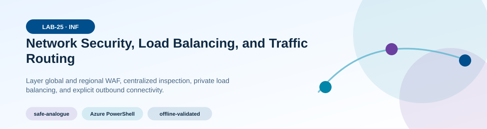
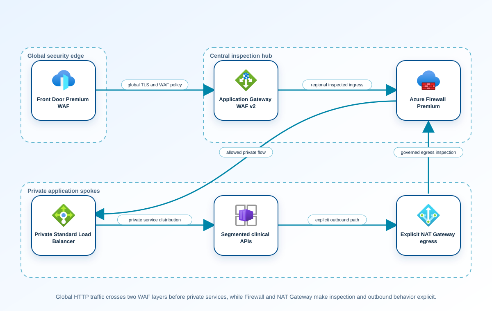
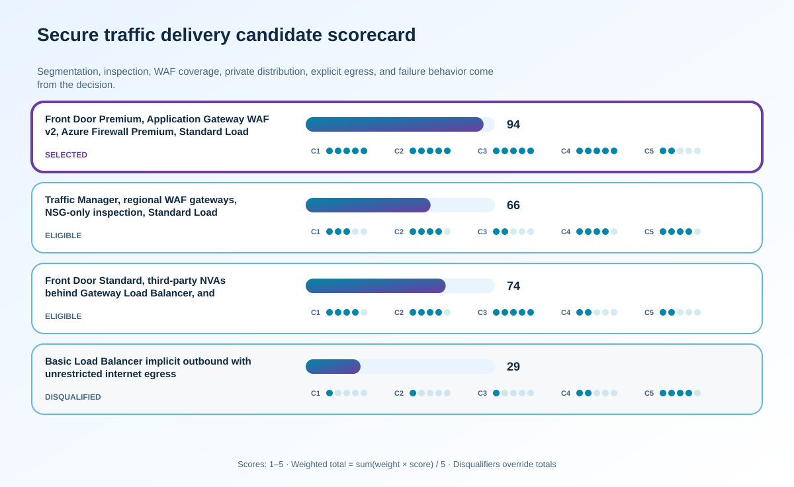

<!-- BEGIN GENERATED AZ305 V1 -->
# LAB-25 — Network Security, Load Balancing, and Traffic Routing



<div class="az305-badges" aria-label="Lab classification">
  <span class="az305-mode-badge">safe-analogue</span>
  <span class="az305-lane-badge">Azure PowerShell</span>
  <span class="az305-status">offline-validated</span>
</div>

## 1. Navigation

[← LAB-24](../24-internet-hybrid-connectivity/README.md) · [Lab catalog](../README.md) · [LAB-26 →](../26-capstone-greenfield-platform/README.md)

## 2. Scenario and completion contract

Fourth Coffee Health exposes appointment services globally and connects them to private clinical APIs in a hub-and-spoke Azure network. Security requires segmented environments, centralized inspection, application-layer protection, controlled east-west flows, and explicit outbound connectivity. Operations also need the correct load-balancing service at each layer: global HTTP entry, regional web routing, private TCP distribution, and deterministic egress. Earlier diagrams used a Basic Load Balancer and assumed default outbound access, creating retirement and reliability risk. Learners will inspect a safe PowerShell analogue built around Front Door Premium, Azure Firewall Premium, Application Gateway WAF v2, Standard Load Balancer, and NAT Gateway without altering production policy.

- Architect role: Network security and traffic-delivery architect
- Outcome: Design and validate segmented, inspected traffic paths with current load-balancing services, explicit outbound connectivity, and independent allow and deny evidence.
- Duration: 180 minutes
- Difficulty: advanced
- Cost class: low
- Completion: all five checkpoint assertions, final validation, decision revision, and cleanup review are complete.

## 3. Objective-to-evidence map

| Objective | Requirement | Checkpoint |
| --- | --- | --- |
| `INF-NET-04` | `LAB25-REQ-01` | [`LAB25-CP01`](#checkpoint-1) |
| `INF-NET-05` | `LAB25-REQ-02` | [`LAB25-CP02`](#checkpoint-2) |
| `INF-NET-04` | `LAB25-REQ-03` | [`LAB25-CP03`](#checkpoint-3) |
| `INF-NET-05` | `LAB25-REQ-04` | [`LAB25-CP04`](#checkpoint-4) |
| `INF-NET-04` | `LAB25-REQ-05` | [`LAB25-CP05`](#checkpoint-5) |

## 4. Business and quality requirements

Business outcome: Protect clinical services and maintain predictable inbound, east-west, and outbound traffic through zonal or regional component failure.

- `LAB25-REQ-01` — Environment, tier, management, private endpoint, firewall, and gateway boundaries have nonoverlapping prefixes, owned route intent, and minimum required flows.
- `LAB25-REQ-02` — Hierarchical policy, DNS proxy, TLS inspection decision, IDPS, threat intelligence, rule ownership, logging, and exception expiry are explicit.
- `LAB25-REQ-03` — Front Door Premium provides global WAF and private origin access; Application Gateway WAF v2 provides regional routing, probes, TLS policy, and backend isolation.
- `LAB25-REQ-04` — Standard Load Balancer distributes private TCP traffic with HA Ports only where justified, while NAT Gateway or inspected firewall egress provides stable outbound addresses and scale.
- `LAB25-REQ-05` — Required flows traverse the intended WAF, firewall, or load-balancer path; prohibited flows are denied; zone and origin failure route only to healthy targets.

Scenario facts:

- **Data:** Flow inventory covers patient-facing HTTPS, internal service paths, health probes, update destinations, logs, and certificate exceptions.
- **Scale:** Gateway, firewall, and NAT capacity follow measured concurrent connections, throughput, and source-port demand.
- **Latency:** TLS inspection and multiple traffic hops must preserve the clinical response target, which remains an owner-supplied value.
- **Availability:** Global edge, zonal gateways, firewall scaling, explicit Standard Load Balancer outbound design, and NAT cover separate failures.
- **RTO:** Regional ingress and egress restoration must meet the clinical service objective; no fabricated numerical RTO is introduced.
- **RPO:** Network controls do not set clinical-data RPO; connection retry must avoid duplicating state-changing requests.
- **Budget:** Premium inspection and redundant components are limited to flows whose security and continuity classification requires them.

Constraints:

- Clinical ingress, east-west, and outbound traffic must remain controlled through zonal or regional component failure.
- Outbound updates require FQDN allowlisting and TLS inspection except one certificate-pinned vendor that cannot be intercepted.
- Use only the Azure PowerShell command lane for learner implementation.
- Keep all live changes behind explicit execution and acknowledgement switches.
- Retain only sanitized command evidence and synthetic fixture identifiers.

Assumptions:

- Clinical flows have named owners, source, destination, protocol, inspection need, and failure behavior.
- The pinned vendor endpoint can be narrowly identified and monitored without granting a broad inspection bypass.
- West Europe is the configurable primary example and North Europe is the configurable secondary example.
- The learner has administrator-level Azure operations knowledge but receives no pre-existing authenticated context.
- Offline fixtures demonstrate contract behavior rather than live Azure service behavior.

## 5. Architecture diagram and walkthrough



Global HTTP traffic crosses two WAF layers before private services, while Firewall and NAT Gateway make inspection and outbound behavior explicit. The labelled nodes, boundaries, and edges are deterministically rendered from the portable `diagrams/architecture.mmd` source and the frozen visual registry.

## 6. Concept primer and candidate architectures

Architecture decisions translate measurable requirements into a deliberate service and operating model. A candidate is viable only when every mandatory constraint is met; convenience or familiarity cannot compensate for a disqualifier.

- **Front Door Premium, Application Gateway WAF v2, Azure Firewall Premium, Standard Load Balancer, and NAT Gateway** (eligible) — Layered global, regional, east-west, and explicit outbound services provide native WAF, TLS inspection, FQDN policy, and failure-domain controls.
- **Traffic Manager, regional WAF gateways, NSG-only inspection, Standard Load Balancer, and NAT Gateway** (eligible) — DNS steering and NSGs lower cost but cannot provide centralized FQDN filtering or TLS inspection for outbound content.
- **Front Door Standard, third-party NVAs behind Gateway Load Balancer, and centralized proxy egress** (eligible) — NVAs can deliver advanced inspection and vendor features, though appliance scaling, patching, routes, and support become customer responsibilities.
- **Basic Load Balancer implicit outbound with unrestricted internet egress** (ineligible) — Implicit outbound and unrestricted egress avoid policy configuration but provide neither the supported availability baseline nor destination control. Disqualifier: LAB25-REQ-04 requires Standard Load Balancer with explicit outbound connectivity and governed destination policy.

## 7. Decision, ADR, and Well-Architected review

Criteria weights are C1 30, C2 25, C3 20, C4 15, and C5 10. Weighted totals use `sum(weight × score) / 5`.



| Candidate | Eligible | C1 | C2 | C3 | C4 | C5 | Weighted /100 |
| --- | ---: | ---: | ---: | ---: | ---: | ---: | ---: |
| Front Door Premium, Application Gateway WAF v2, Azure Firewall Premium, Standard Load Balancer, and NAT Gateway | yes | 5 | 5 | 5 | 5 | 2 | 94 |
| Traffic Manager, regional WAF gateways, NSG-only inspection, Standard Load Balancer, and NAT Gateway | yes | 3 | 4 | 2 | 4 | 4 | 66 |
| Front Door Standard, third-party NVAs behind Gateway Load Balancer, and centralized proxy egress | yes | 4 | 4 | 5 | 2 | 2 | 74 |
| Basic Load Balancer implicit outbound with unrestricted internet egress | no | 1 | 1 | 1 | 2 | 4 | 29 |

Selected design: **Front Door Premium, Application Gateway WAF v2, Azure Firewall Premium, Standard Load Balancer, and NAT Gateway**. `ADR-LAB25-001` records the accepted reasoning. Review Reliability, Security, Cost Optimization, Operational Excellence, and Performance Efficiency in `design/decision.yml`; no pillar is implied by another.

Rejected alternatives:

- **Traffic Manager, regional WAF gateways, NSG-only inspection, Standard Load Balancer, and NAT Gateway:** The model cannot meet the new outbound inspection requirement without adding another control plane.
- **Front Door Standard, third-party NVAs behind Gateway Load Balancer, and centralized proxy egress:** Equivalent controls carry greater lifecycle and routing complexity than the managed-service design.
- **Basic Load Balancer implicit outbound with unrestricted internet egress:** It is ineligible because current-service and mandatory outbound requirements are unmet.

Architecture risks:

- **Risk:** A broad TLS bypass for the pinned vendor can become an unmonitored exfiltration route. **Mitigation:** Scope bypass to exact FQDN and flow identity, retain SNI and connection logs, and review vendor certificate changes.
- **Risk:** Centralized inspection can exhaust SNAT ports or throughput during a regional event. **Mitigation:** Calculate peak concurrent flows, distribute NAT capacity, and load-test the surviving zone and regional path.

Well-Architected consequences:

<div class="az305-waf-grid">
<article class="az305-waf-card"><h3>Reliability</h3><p>Layered health probes, zonal capacity, regional routing, and explicit outbound remove implicit traffic dependencies.</p></article>
<article class="az305-waf-card"><h3>Security</h3><p>Premium WAF, firewall FQDN policy, TLS inspection, and a narrow pinned-certificate exception enforce flow intent.</p></article>
<article class="az305-waf-card"><h3>Cost Optimization</h3><p>Premium controls apply to classified clinical paths and capacity follows measured throughput and connection demand.</p></article>
<article class="az305-waf-card"><h3>Operational Excellence</h3><p>Effective routes, rule hits, certificates, probes, NAT ports, and exception ownership form the network evidence set.</p></article>
<article class="az305-waf-card"><h3>Performance Efficiency</h3><p>Each hop and inspection stage is measured so security does not silently consume the clinical latency budget.</p></article>
</div>

ADR consequences:

- The certificate-pinned vendor receives a narrowly governed TLS-inspection exception with an owner and review date.
- Standard Load Balancer never supplies accidental outbound access; NAT and firewall routing are deliberate dependencies.

## 8. Inputs, permissions, licensing, cost, and analogue

Use configurable `Location` (`AZ305_LOCATION`, default West Europe) and `SecondaryLocation` (`AZ305_SECONDARY_LOCATION`, default North Europe). Every public input has an explicit `AZ305_*` fallback. Preview is the default; only Golden Lab 00 writes an intent-only `execute: false` preview record. Before an executed cloud command, the supplied subscription and tenant must exactly match the active CLI, Az, and—where applicable—Microsoft Graph contexts. `-Execute` crosses the execution boundary; cost-bearing and tenant-scoped paths also require their independent acknowledgement switches.

Safe analogue: Evaluate synthetic flows, routes, rules, health, NAT-port, and pinned-certificate fixtures; make no network or policy change.

Permissions: Front Door, Application Gateway, Firewall, Load Balancer, NAT Gateway, NSG, route, and Network Watcher read roles support review; rule or resource changes require separate authorization.

Licensing: Premium WAF and Firewall tiers, inspection data, gateway capacity, NAT processing and addresses, logs, and Front Door requests contribute recurring cost.

Cost boundary: Attribute global edge, regional WAF units, firewall scale, TLS inspection, outbound data, NAT ports, logs, and redundant-zone capacity.

## 9. Read-only preflight

```powershell
pwsh ./scripts/azure-powershell/Preflight.ps1 -RunId synthetic-250001
```

Synthetic sample: `{"labId":"LAB-25","track":"azure-powershell","result":"pass","note":"Local tool discovery only"}`. This is illustrative local output, not evidence captured from Azure.

## 10. Five guided checkpoints

<ol class="az305-checkpoint-timeline" aria-label="Five checkpoint learning path">
<li><a href="#checkpoint-1">Establish segmentation and least-access flows</a><span>LAB25-REQ-01 · LAB25-CP01</span></li>
<li><a href="#checkpoint-2">Validate centralized inspection and policy hierarchy</a><span>LAB25-REQ-02 · LAB25-CP02</span></li>
<li><a href="#checkpoint-3">Prove global and regional HTTP protection</a><span>LAB25-REQ-03 · LAB25-CP03</span></li>
<li><a href="#checkpoint-4">Validate private load balancing and explicit egress</a><span>LAB25-REQ-04 · LAB25-CP04</span></li>
<li><a href="#checkpoint-5">Verify end-to-end routes and failure behavior</a><span>LAB25-REQ-05 · LAB25-CP05</span></li>
</ol>

### Checkpoint 1: Establish segmentation and least-access flows

<a id="checkpoint-1"></a>

**Trace:** `INF-NET-04` → `LAB25-REQ-01` → `LAB25-CP01`

```powershell
Get-AzVirtualNetwork -ResourceGroupName $ResourceGroupName | Select-Object Name, Location, AddressSpace, Subnets, VirtualNetworkPeerings
```

Expected evidence: Environment, tier, management, private endpoint, firewall, and gateway boundaries have nonoverlapping prefixes, owned route intent, and minimum required flows. Retain Preserve the segmentation diagram, subnet and NSG projections, flow matrix, ownership, and deny-by-default rationale.

Positive assertion:

```powershell
$vnet = Get-AzVirtualNetwork -ResourceGroupName $ResourceGroupName -Name $SpokeVnetName; if (-not ($vnet.Subnets | Where-Object Name -eq $ApplicationSubnetName)) { throw 'The application subnet is absent.' }
```

Negative assertion:

```powershell
$nsgs = Get-AzNetworkSecurityGroup -ResourceGroupName $ResourceGroupName; if ($nsgs.SecurityRules | Where-Object { $_.Direction -eq 'Inbound' -and $_.Access -eq 'Allow' -and $_.SourceAddressPrefix -eq '*' -and $_.DestinationPortRange -eq '*' }) { throw 'An unrestricted inbound NSG rule exists.' }
```

Failure and retry: Nominal subnet separation provides little protection when routes or rules permit uncontrolled lateral movement. Narrow the disputed flow and rerun independent required-allow and prohibited-deny tests.

Cleanup dependency: Delete local topology exports; do not change NSGs, peerings, or subnets during assessment.

WAF consequence: Security: segmentation and least-access rules constrain lateral movement and data exposure.

### Checkpoint 2: Validate centralized inspection and policy hierarchy

<a id="checkpoint-2"></a>

**Trace:** `INF-NET-05` → `LAB25-REQ-02` → `LAB25-CP02`

```powershell
Get-AzFirewall -ResourceGroupName $ResourceGroupName -Name $FirewallName | Select-Object Name, Location, Sku, ThreatIntelMode, FirewallPolicy, Zones, ProvisioningState
```

Expected evidence: Hierarchical policy, DNS proxy, TLS inspection decision, IDPS, threat intelligence, rule ownership, logging, and exception expiry are explicit. Retain Save redacted policy hierarchy, effective rule order, route projections, logging destinations, and approved exceptions.

Positive assertion:

```powershell
$firewall = Get-AzFirewall -ResourceGroupName $ResourceGroupName -Name $FirewallName; if ($firewall.ProvisioningState -ne 'Succeeded' -or $firewall.Sku.Tier -ne 'Premium') { throw 'Azure Firewall Premium is not ready.' }
```

Negative assertion:

```powershell
$policy = Get-AzFirewallPolicy -ResourceGroupName $ResourceGroupName -Name $FirewallPolicyName; if ($policy.ThreatIntelMode -eq 'Off' -or -not $policy.DnsSetting) { throw 'Threat intelligence or governed DNS proxy configuration is absent.' }
```

Failure and retry: A configured firewall can be bypassed by routing or an overly broad higher-priority rule. Correct route or priority in the design fixture and repeat both permitted and prohibited flow evaluation.

Cleanup dependency: Remove sanitized policy exports according to classification; never delete shared firewall policy.

WAF consequence: Operational Excellence: centralized policy, ownership, diagnostics, and expiry make inspection changes reviewable.

### Checkpoint 3: Prove global and regional HTTP protection

<a id="checkpoint-3"></a>

**Trace:** `INF-NET-04` → `LAB25-REQ-03` → `LAB25-CP03`

```powershell
Get-AzFrontDoorCdnProfile -ResourceGroupName $ResourceGroupName -Name $FrontDoorProfileName | Select-Object Name, Location, SkuName, ProvisioningState
```

Expected evidence: Front Door Premium provides global WAF and private origin access; Application Gateway WAF v2 provides regional routing, probes, TLS policy, and backend isolation. Retain Preserve profile and gateway projections, WAF policy mapping, origin restrictions, TLS settings, probe results, and negative-request evidence.

Positive assertion:

```powershell
$frontDoorProfile = Get-AzFrontDoorCdnProfile -ResourceGroupName $ResourceGroupName -Name $FrontDoorProfileName; if ($frontDoorProfile.SkuName -ne 'Premium_AzureFrontDoor' -or $frontDoorProfile.ProvisioningState -ne 'Succeeded') { throw 'Front Door Premium is not ready.' }
```

Negative assertion:

```powershell
$gateways = Get-AzApplicationGateway -ResourceGroupName $ResourceGroupName; if ($gateways | Where-Object { $_.WebApplicationFirewallConfiguration.Enabled -eq $false }) { throw 'A regional application gateway has WAF disabled.' }
```

Failure and retry: Multiple healthy routing layers can still expose an origin directly or block legitimate clinical requests through inconsistent policy. Correct the narrow WAF, certificate, host-header, or origin issue and replay the same positive and negative requests.

Cleanup dependency: Remove only run-owned custom domains or test routes; never disable shared WAF protections.

WAF consequence: Reliability: layered health probes and zone-resilient regional routing prevent failed instances from receiving traffic.

### Checkpoint 4: Validate private load balancing and explicit egress

<a id="checkpoint-4"></a>

**Trace:** `INF-NET-05` → `LAB25-REQ-04` → `LAB25-CP04`

```powershell
Get-AzLoadBalancer -ResourceGroupName $ResourceGroupName -Name $InternalLoadBalancerName | Select-Object Name, Sku, FrontendIpConfigurations, BackendAddressPools, LoadBalancingRules, Probes
```

Expected evidence: Standard Load Balancer distributes private TCP traffic with HA Ports only where justified, while NAT Gateway or inspected firewall egress provides stable outbound addresses and scale. Retain Save SKU, frontends, pools, rules, probes, outbound design, SNAT calculation, and degraded-mode capacity.

Positive assertion:

```powershell
$lb = Get-AzLoadBalancer -ResourceGroupName $ResourceGroupName -Name $InternalLoadBalancerName; if ($lb.Sku.Name -ne 'Standard' -or -not $lb.Probes) { throw 'The internal load balancer is not Standard or has no probe.' }
```

Negative assertion:

```powershell
$subnet = (Get-AzVirtualNetwork -ResourceGroupName $ResourceGroupName -Name $SpokeVnetName).Subnets | Where-Object Name -eq $ApplicationSubnetName; if (-not $subnet.NatGateway -and -not $ApprovedFirewallEgressRoute) { throw 'The application subnet lacks explicit outbound connectivity.' }
```

Failure and retry: Inbound distribution can remain healthy while outbound connections intermittently fail from SNAT exhaustion. Correct explicit egress or port allocation and replay the connection-scale scenario.

Cleanup dependency: Delete only run-owned analogue rules and IPs after exact ownership checks; retain shared NAT and firewall resources.

WAF consequence: Performance Efficiency: explicit egress sizing and appropriate layer-four distribution sustain connection volume predictably.

### Checkpoint 5: Verify end-to-end routes and failure behavior

<a id="checkpoint-5"></a>

**Trace:** `INF-NET-04` → `LAB25-REQ-05` → `LAB25-CP05`

```powershell
$networkWatcher = Get-AzNetworkWatcher -ResourceGroupName $ResourceGroupName -Name $NetworkWatcherName; Test-AzNetworkWatcherIPFlow -NetworkWatcher $networkWatcher -TargetVirtualMachineId $SourceVmId -Direction Outbound -Protocol TCP -LocalIPAddress $SourceIp -LocalPort 50000 -RemoteIPAddress $DestinationIp -RemotePort 443
```

Expected evidence: Required flows traverse the intended WAF, firewall, or load-balancer path; prohibited flows are denied; zone and origin failure route only to healthy targets. Retain Archive effective route and IP-flow results, hop intent, probe health, failover timing, and identifying rule names.

Positive assertion:

```powershell
$networkWatcher = Get-AzNetworkWatcher -ResourceGroupName $ResourceGroupName -Name $NetworkWatcherName; $allow = Test-AzNetworkWatcherIPFlow -NetworkWatcher $networkWatcher -TargetVirtualMachineId $SourceVmId -Direction Outbound -Protocol TCP -LocalIPAddress $SourceIp -LocalPort 50000 -RemoteIPAddress $ApprovedDestinationIp -RemotePort 443; if ($allow.Access -ne 'Allow') { throw 'The required clinical flow is denied.' }
```

Negative assertion:

```powershell
$networkWatcher = Get-AzNetworkWatcher -ResourceGroupName $ResourceGroupName -Name $NetworkWatcherName; $deny = Test-AzNetworkWatcherIPFlow -NetworkWatcher $networkWatcher -TargetVirtualMachineId $SourceVmId -Direction Outbound -Protocol TCP -LocalIPAddress $SourceIp -LocalPort 50000 -RemoteIPAddress $DisallowedDestinationIp -RemotePort 22; if ($deny.Access -ne 'Deny') { throw 'A prohibited administrative flow is allowed.' }
```

Failure and retry: Passing reachability without verifying the enforcing rule and path can conceal accidental exposure. Isolate DNS, route, NSG, firewall, probe, and backend health one layer at a time, then repeat exact flows.

Cleanup dependency: Remove diagnostic exports and run-owned synthetic endpoints; network-watcher tests create no persistent resource.

WAF consequence: Cost Optimization: the selected managed controls consolidate policy while avoiding duplicate appliances at every spoke.

## 11. Final validation and interpretation

Run `Validate.ps1 -Mode Deployment -Execute` only after an executed run has state and you are authorized to issue the ten read-only checkpoint inspections. Without `-Execute`, ordinary deployment validation records `partial` and exits `2`; Golden Lab 00 alone can validate its intent-only preview locally. Exit `0` means all required assertions pass, `1` means at least one failed, and `2` means the outcome is gated or partial. Positive and negative commands execute independently, so one failure never suppresses its paired assertion.

## 12. Material change request

Clinical security now requires outbound allowlisting by FQDN and TLS inspection for update traffic, but one vendor uses certificate pinning and cannot tolerate interception.

Revised solution: select **Front Door Premium, Application Gateway WAF v2, Azure Firewall Premium, Standard Load Balancer, and NAT Gateway**. LAB25-REQ-02 requires owned FQDN and TLS inspection policy, so the selected design adds an exact pinned-vendor bypass with independent logging and expiry review.

Revised Well-Architected consequences:

- **Reliability:** The vendor exception remains reachable through explicit redundant outbound paths.
- **Security:** All other update traffic is inspected and the bypass is constrained to the exact destination.
- **Cost Optimization:** Premium inspection spend remains tied to clinical flows instead of a blanket enterprise rollout.
- **Operational Excellence:** Rule hits, certificates, owner, and review date make the exceptional path auditable.
- **Performance Efficiency:** Inspection and bypass latency are tested independently against clinical response needs.

## 13. Architect job challenge

Revise firewall policy, routes, exception scope and expiry, logging, certificate governance, and negative tests while preventing a broad bypass for the pinned vendor.

## 14. Troubleshooting, cleanup, and residual verification

- If IP flow verification differs from observed traffic, verify NIC, direction, source address, effective routes, and stateful return path.
- If Front Door and Application Gateway disagree on health, compare probe path, host header, certificate name, status code, and timeout independently.
- If outbound connections fail intermittently, measure SNAT usage and connection reuse before increasing frontend addresses.

Cleanup previews nonempty state in reverse dependency order, writes `partial`, and exits `2`; an already empty run is completed locally and idempotently. Executed cleanup rechecks the exact live ID plus `purpose`, `labId`, `runId`, and `expiresOn` immediately before each removal, persists state after every absent or removed object, stops on the first dependency failure, and refuses unresolved pre-existing settings. It never automates purge. Finish with `Validate.ps1 -Mode PostCleanup`; the required residual count is zero.

## 15. Exam debrief, assessment, sources, and navigation

Explain the recommendation in terms of requirements, rejected alternatives, failure behavior, and all five WAF pillars. Complete `assessment/QUESTIONS.md`, then use the separately excluded answer key for remediation.

- [Azure load-balancing options](https://learn.microsoft.com/en-us/azure/architecture/guide/technology-choices/load-balancing-overview)
- [Azure Well-Architected Framework](https://learn.microsoft.com/en-us/azure/well-architected/)

[← LAB-24](../24-internet-hybrid-connectivity/README.md) · [Lab catalog](../README.md) · [LAB-26 →](../26-capstone-greenfield-platform/README.md)

## 16. Synchronized lifecycle-script appendix

### Preflight.ps1

```powershell
[CmdletBinding()]
param(
    [string]$SubscriptionId = $env:AZ305_SUBSCRIPTION_ID,
    [string]$TenantId = $env:AZ305_TENANT_ID,
    [ValidatePattern('^[a-z0-9-]{6,64}$')][string]$RunId = $env:AZ305_RUN_ID,
    [string]$Location = $(if ($env:AZ305_LOCATION) { $env:AZ305_LOCATION } else { 'westeurope' }),
    [string]$SecondaryLocation = $(if ($env:AZ305_SECONDARY_LOCATION) { $env:AZ305_SECONDARY_LOCATION } else { 'northeurope' }),
    [string]$ResourceGroup = $(if ($env:AZ305_RESOURCE_GROUP) { $env:AZ305_RESOURCE_GROUP } else { "rg-az305-$RunId" }),
    [string]$WorkloadName = $(if ($env:AZ305_WORKLOAD_NAME) { $env:AZ305_WORKLOAD_NAME } else { "az305-$RunId" }),
    [string]$ExpiresOn = $(if ($env:AZ305_EXPIRES_ON) { $env:AZ305_EXPIRES_ON } else { (Get-Date).ToUniversalTime().AddDays(1).ToString('yyyy-MM-dd') }),
    [string]$ApplicationSubnetName = $env:AZ305_APPLICATION_SUBNET_NAME,
    [string]$ApprovedDestinationIp = $env:AZ305_APPROVED_DESTINATION_IP,
    [bool]$ApprovedFirewallEgressRoute = $(if ($env:AZ305_APPROVED_FIREWALL_EGRESS_ROUTE) { [System.Convert]::ToBoolean($env:AZ305_APPROVED_FIREWALL_EGRESS_ROUTE) } else { $false }),
    [string]$DestinationIp = $env:AZ305_DESTINATION_IP,
    [string]$DisallowedDestinationIp = $env:AZ305_DISALLOWED_DESTINATION_IP,
    [string]$FirewallName = $env:AZ305_FIREWALL_NAME,
    [string]$FirewallPolicyName = $env:AZ305_FIREWALL_POLICY_NAME,
    [string]$FrontDoorProfileName = $env:AZ305_FRONT_DOOR_PROFILE_NAME,
    [string]$InternalLoadBalancerName = $env:AZ305_INTERNAL_LOAD_BALANCER_NAME,
    [string]$NetworkWatcherName = $env:AZ305_NETWORK_WATCHER_NAME,
    [string]$ResourceGroupName = $env:AZ305_RESOURCE_GROUP_NAME,
    [string]$SourceIp = $env:AZ305_SOURCE_IP,
    [string]$SourceVmId = $env:AZ305_SOURCE_VM_ID,
    [string]$SpokeVnetName = $env:AZ305_SPOKE_VNET_NAME,
    [switch]$Execute,
    [switch]$AcknowledgeCost,
    [switch]$AcknowledgeTenantChange
)

$ErrorActionPreference = 'Stop'
$PSNativeCommandUseErrorActionPreference = $true
if (-not $RunId) { [Console]::Error.WriteLine('RunId or AZ305_RUN_ID is required.'); exit 2 }
# Every lifecycle entrypoint intentionally exposes the same public parameter contract.
@($SubscriptionId, $TenantId, $RunId, $Location, $SecondaryLocation, $ResourceGroup, $WorkloadName, $ExpiresOn, $ApplicationSubnetName, $ApprovedDestinationIp, $ApprovedFirewallEgressRoute, $DestinationIp, $DisallowedDestinationIp, $FirewallName, $FirewallPolicyName, $FrontDoorProfileName, $InternalLoadBalancerName, $NetworkWatcherName, $ResourceGroupName, $SourceIp, $SourceVmId, $SpokeVnetName, $Execute, $AcknowledgeCost, $AcknowledgeTenantChange) | Out-Null

$requiredCommands = @('pwsh')
$missing = @($requiredCommands | Where-Object { -not (Get-Command $_ -ErrorAction SilentlyContinue) })
if ($missing.Count -gt 0) {
    Write-Error "Missing local commands: $($missing -join ', ')"
    exit 1
}
$requiredCmdlets = @('Get-AzApplicationGateway', 'Get-AzFirewall', 'Get-AzFirewallPolicy', 'Get-AzFrontDoorCdnProfile', 'Get-AzLoadBalancer', 'Get-AzNetworkSecurityGroup', 'Get-AzNetworkWatcher', 'Get-AzVirtualNetwork', 'Test-AzNetworkWatcherIPFlow')
$missingCmdlets = @($requiredCmdlets | Where-Object { -not (Get-Command $_ -ErrorAction SilentlyContinue) })
if ($missingCmdlets.Count -gt 0) {
    Write-Error "Missing local cmdlets: $($missingCmdlets -join ', ')"
    exit 1
}

[pscustomobject]@{
    labId = 'LAB-25'
    track = 'azure-powershell'
    implementationMode = 'safe-analogue'
    result = 'pass'
    note = 'Local tool discovery only; no Azure or Microsoft Graph request was made.'
} | ConvertTo-Json
exit 0
```

### Setup.ps1

```powershell
[CmdletBinding()]
param(
    [string]$SubscriptionId = $env:AZ305_SUBSCRIPTION_ID,
    [string]$TenantId = $env:AZ305_TENANT_ID,
    [ValidatePattern('^[a-z0-9-]{6,64}$')][string]$RunId = $env:AZ305_RUN_ID,
    [string]$Location = $(if ($env:AZ305_LOCATION) { $env:AZ305_LOCATION } else { 'westeurope' }),
    [string]$SecondaryLocation = $(if ($env:AZ305_SECONDARY_LOCATION) { $env:AZ305_SECONDARY_LOCATION } else { 'northeurope' }),
    [string]$ResourceGroup = $(if ($env:AZ305_RESOURCE_GROUP) { $env:AZ305_RESOURCE_GROUP } else { "rg-az305-$RunId" }),
    [string]$WorkloadName = $(if ($env:AZ305_WORKLOAD_NAME) { $env:AZ305_WORKLOAD_NAME } else { "az305-$RunId" }),
    [string]$ExpiresOn = $(if ($env:AZ305_EXPIRES_ON) { $env:AZ305_EXPIRES_ON } else { (Get-Date).ToUniversalTime().AddDays(1).ToString('yyyy-MM-dd') }),
    [string]$ApplicationSubnetName = $env:AZ305_APPLICATION_SUBNET_NAME,
    [string]$ApprovedDestinationIp = $env:AZ305_APPROVED_DESTINATION_IP,
    [bool]$ApprovedFirewallEgressRoute = $(if ($env:AZ305_APPROVED_FIREWALL_EGRESS_ROUTE) { [System.Convert]::ToBoolean($env:AZ305_APPROVED_FIREWALL_EGRESS_ROUTE) } else { $false }),
    [string]$DestinationIp = $env:AZ305_DESTINATION_IP,
    [string]$DisallowedDestinationIp = $env:AZ305_DISALLOWED_DESTINATION_IP,
    [string]$FirewallName = $env:AZ305_FIREWALL_NAME,
    [string]$FirewallPolicyName = $env:AZ305_FIREWALL_POLICY_NAME,
    [string]$FrontDoorProfileName = $env:AZ305_FRONT_DOOR_PROFILE_NAME,
    [string]$InternalLoadBalancerName = $env:AZ305_INTERNAL_LOAD_BALANCER_NAME,
    [string]$NetworkWatcherName = $env:AZ305_NETWORK_WATCHER_NAME,
    [string]$ResourceGroupName = $env:AZ305_RESOURCE_GROUP_NAME,
    [string]$SourceIp = $env:AZ305_SOURCE_IP,
    [string]$SourceVmId = $env:AZ305_SOURCE_VM_ID,
    [string]$SpokeVnetName = $env:AZ305_SPOKE_VNET_NAME,
    [switch]$Execute,
    [switch]$AcknowledgeCost,
    [switch]$AcknowledgeTenantChange
)

$ErrorActionPreference = 'Stop'
$PSNativeCommandUseErrorActionPreference = $true
if (-not $RunId) { [Console]::Error.WriteLine('RunId or AZ305_RUN_ID is required.'); exit 2 }
# Every lifecycle entrypoint intentionally exposes the same public parameter contract.
@($SubscriptionId, $TenantId, $RunId, $Location, $SecondaryLocation, $ResourceGroup, $WorkloadName, $ExpiresOn, $ApplicationSubnetName, $ApprovedDestinationIp, $ApprovedFirewallEgressRoute, $DestinationIp, $DisallowedDestinationIp, $FirewallName, $FirewallPolicyName, $FrontDoorProfileName, $InternalLoadBalancerName, $NetworkWatcherName, $ResourceGroupName, $SourceIp, $SourceVmId, $SpokeVnetName, $Execute, $AcknowledgeCost, $AcknowledgeTenantChange) | Out-Null

$LabRoot = Split-Path (Split-Path $PSScriptRoot -Parent) -Parent
$StateRoot = Join-Path $LabRoot ".state/$RunId"
$StatePath = Join-Path $StateRoot 'run.json'

function Assert-ExactExecutionContext {
    [CmdletBinding()]
    param([string]$ExpectedSubscriptionId, [string]$ExpectedTenantId)
    if ([string]::IsNullOrWhiteSpace($ExpectedSubscriptionId) -or [string]::IsNullOrWhiteSpace($ExpectedTenantId)) { throw 'SubscriptionId and TenantId are required before an Azure request.' }
    $azContext = Get-AzContext -ErrorAction Stop
    if (-not $azContext -or [string]$azContext.Subscription.Id -ine $ExpectedSubscriptionId -or [string]$azContext.Tenant.Id -ine $ExpectedTenantId) {
        throw 'The active Azure PowerShell subscription or tenant does not exactly match the requested context.'
    }
}

function Save-RunState {
    [CmdletBinding()]
    param([Parameter(Mandatory)]$State)
    $temporaryPath = "$StatePath.tmp"
    $State | ConvertTo-Json -Depth 20 | Set-Content -LiteralPath $temporaryPath -Encoding utf8NoBOM
    Move-Item -LiteralPath $temporaryPath -Destination $StatePath -Force
}

function Assert-SafeStateValue {
    [CmdletBinding()]
    param($Value)
    $serialized = $Value | ConvertTo-Json -Depth 12 -Compress
    if ($serialized -match '(?i)"(?:token|password|secret|certificate|connectionString|sas|clientSecret|accessToken|refreshToken|accountKey|privateKey)"\s*:') {
        throw 'A prohibited sensitive field name was returned; state capture is refused.'
    }
}

function Convert-CheckpointOutput {
    [CmdletBinding()]
    param($Value)
    if ($Value -is [string]) { $raw = [string]$Value }
    elseif ($Value -is [System.Collections.IEnumerable] -and @($Value | Where-Object { $_ -isnot [string] }).Count -eq 0) { $raw = @($Value) -join "`n" }
    else { return $Value }
    if ([string]::IsNullOrWhiteSpace($raw)) { return $null }
    try { return ($raw | ConvertFrom-Json -Depth 100) } catch { return $Value }
}

function Get-ReturnedResourceId {
    [CmdletBinding()]
    param($Value)
    $seen = [System.Collections.Generic.HashSet[string]]::new([System.StringComparer]::OrdinalIgnoreCase)
    $results = [System.Collections.Generic.List[string]]::new()
    function Add-ArmId {
        param($Candidate)
        if ($Candidate -is [string] -and $Candidate -match '^/subscriptions/[0-9a-f-]+/(?:resourceGroups/[^/]+(?:/providers/.+)?|providers/.+)$' -and $Candidate -notmatch '/providers/Microsoft\.Resources/deployments/') {
            if ($seen.Add($Candidate)) { $results.Add($Candidate) }
        }
    }
    function Find-DeploymentOutputId {
        param($Item, [int]$Depth)
        if ($null -eq $Item -or $Depth -gt 12) { return }
        if ($Item -is [string]) { Add-ArmId -Candidate $Item; return }
        if ($Item -is [System.Collections.IDictionary]) { foreach ($key in $Item.Keys) { Find-DeploymentOutputId -Item $Item[$key] -Depth ($Depth + 1) }; return }
        if ($Item -is [System.Collections.IEnumerable]) { foreach ($entry in $Item) { Find-DeploymentOutputId -Item $entry -Depth ($Depth + 1) }; return }
        foreach ($property in @($Item.PSObject.Properties | Where-Object { $_.MemberType -in @('NoteProperty', 'Property') })) { Find-DeploymentOutputId -Item $property.Value -Depth ($Depth + 1) }
    }
    foreach ($rootItem in @($Value)) {
        if ($rootItem -is [System.Collections.IDictionary]) {
            foreach ($name in @('id', 'resourceId')) { if ($rootItem.Contains($name)) { Add-ArmId -Candidate $rootItem[$name] } }
            if ($rootItem.Contains('properties') -and $rootItem.properties -and $rootItem.properties.outputs) { Find-DeploymentOutputId -Item $rootItem.properties.outputs -Depth 0 }
            continue
        }
        foreach ($name in @('Id', 'ResourceId')) {
            $property = $rootItem.PSObject.Properties[$name]
            if ($property) { Add-ArmId -Candidate $property.Value }
        }
        if ($rootItem.PSObject.Properties['Properties'] -and $rootItem.Properties -and $rootItem.Properties.outputs) {
            Find-DeploymentOutputId -Item $rootItem.Properties.outputs -Depth 0
        }
    }
    return @($results)
}

function Get-PlannedDeploymentResourceId {
    [CmdletBinding()]
    param($Value)
    $seen = [System.Collections.Generic.HashSet[string]]::new([System.StringComparer]::OrdinalIgnoreCase)
    $results = [System.Collections.Generic.List[string]]::new()
    foreach ($change in @($Value.changes)) {
        $candidate = [string]$change.resourceId
        if ($candidate -match '^/subscriptions/[0-9a-f-]+/(?:resourceGroups/[^/]+(?:/providers/.+)?|providers/.+)$' -and $candidate -notmatch '/providers/Microsoft\.Resources/deployments/' -and $seen.Add($candidate)) {
            $results.Add($candidate)
        }
    }
    return @($results)
}

function Assert-InputSubscriptionScope {
    [CmdletBinding()]
    param($Inputs, [string]$ExpectedSubscriptionId)
    $entries = if ($Inputs -is [System.Collections.IDictionary]) {
        @($Inputs.GetEnumerator())
    } else {
        @($Inputs.PSObject.Properties | ForEach-Object { [pscustomobject]@{ Key = $_.Name; Value = $_.Value } })
    }
    foreach ($entry in $entries) {
        if ($entry.Value -is [string] -and [string]$entry.Value -match '^/subscriptions/([^/]+)/') {
            if ($Matches[1] -ine $ExpectedSubscriptionId) { throw "Input $($entry.Key) belongs to a different subscription." }
        }
    }
}

function Assert-ManagedMutation {
    [CmdletBinding()]
    param($State, [string]$CheckpointId, [bool]$CarriesOwnership, [object[]]$TargetResourceIds)
    if ($CarriesOwnership) { return }
    $targets = @($TargetResourceIds | Where-Object { $_ -is [string] -and $_ -match '^/subscriptions/' })
    if ($targets.Count -eq 0) { throw "$CheckpointId refuses an untagged mutation because no exact ARM target ID was supplied." }
    $knownIds = @($State.managedObjects | ForEach-Object { [string]$_.id })
    if ($knownIds.Count -eq 0) { throw "$CheckpointId refuses to modify a pre-existing object because no run-owned parent has been recorded." }
    foreach ($target in $targets) {
        $related = @($knownIds | Where-Object { $target -ieq $_ -or $target.StartsWith("$_/", [System.StringComparison]::OrdinalIgnoreCase) -or $_.StartsWith("$target/", [System.StringComparison]::OrdinalIgnoreCase) }).Count -gt 0
        if (-not $related) { throw "$CheckpointId refuses a mutation outside the exact run-owned resource boundary." }
    }
}

$executionInputs = [ordered]@{ subscriptionId = $SubscriptionId; tenantId = $TenantId; location = $Location; secondaryLocation = $SecondaryLocation; resourceGroup = $ResourceGroup; workloadName = $WorkloadName; expiresOn = $ExpiresOn; ApplicationSubnetName = $ApplicationSubnetName; ApprovedDestinationIp = $ApprovedDestinationIp; ApprovedFirewallEgressRoute = $ApprovedFirewallEgressRoute; DestinationIp = $DestinationIp; DisallowedDestinationIp = $DisallowedDestinationIp; FirewallName = $FirewallName; FirewallPolicyName = $FirewallPolicyName; FrontDoorProfileName = $FrontDoorProfileName; InternalLoadBalancerName = $InternalLoadBalancerName; NetworkWatcherName = $NetworkWatcherName; ResourceGroupName = $ResourceGroupName; SourceIp = $SourceIp; SourceVmId = $SourceVmId; SpokeVnetName = $SpokeVnetName }

if (-not $Execute) {
    Write-Output '[preview] No cloud command was called and no state was created.'
    Write-Output '[preview] Re-run with -Execute only in an authorized disposable environment.'
    exit 0
}
# This setup is compatible with the lab implementation mode.
# This default exercise does not require a cost acknowledgement.
# This lab does not perform a tenant-scoped change by default.
$requiredLabInputs = [ordered]@{ DestinationIp = $DestinationIp; FirewallName = $FirewallName; FrontDoorProfileName = $FrontDoorProfileName; InternalLoadBalancerName = $InternalLoadBalancerName; NetworkWatcherName = $NetworkWatcherName; ResourceGroupName = $ResourceGroupName; SourceIp = $SourceIp; SourceVmId = $SourceVmId }
$missingLabInputs = @($requiredLabInputs.GetEnumerator() | Where-Object { $_.Value -is [string] -and [string]::IsNullOrWhiteSpace([string]$_.Value) } | ForEach-Object Key)
if ($missingLabInputs.Count -gt 0) { [Console]::Error.WriteLine("Execution is gated; supply: $($missingLabInputs -join ', ')."); exit 2 }

try {
    Assert-ExactExecutionContext -ExpectedSubscriptionId $SubscriptionId -ExpectedTenantId $TenantId
    Assert-InputSubscriptionScope -Inputs $executionInputs -ExpectedSubscriptionId $SubscriptionId
    Assert-SafeStateValue -Value $executionInputs
}
catch {
    [Console]::Error.WriteLine("Execution is gated by context or input validation: $($_.Exception.Message)")
    exit 2
}

# Recovery state is persisted before the first possible mutation below.
if (Test-Path -LiteralPath $StatePath) {
    [Console]::Error.WriteLine('Run state already exists. Choose a new RunId or complete the recorded cleanup; existing recovery state will not be overwritten.')
    exit 2
}
New-Item -ItemType Directory -Path $StateRoot -Force | Out-Null
$state = [ordered]@{
    schemaVersion = '1.0.0'; labId = 'LAB-25'; runId = $RunId; track = 'azure-powershell'
    implementationMode = 'safe-analogue'; status = 'initialized'
    createdAt = (Get-Date).ToUniversalTime().ToString('o'); execute = $true
    parameters = $executionInputs
    managedObjects = @(); originalSettings = @()
}
Save-RunState -State $state
$state.status = 'deploying'
Save-RunState -State $state

$originalLocation = Get-Location
try {
    Set-Location -LiteralPath $LabRoot
    # 25-CP01: Establish segmentation and least-access flows
    $stepResult = & { Get-AzVirtualNetwork -ResourceGroupName $ResourceGroupName | Select-Object Name, Location, AddressSpace, Subnets, VirtualNetworkPeerings }
    $null = $stepResult

    # 25-CP02: Validate centralized inspection and policy hierarchy
    $stepResult = & { Get-AzFirewall -ResourceGroupName $ResourceGroupName -Name $FirewallName | Select-Object Name, Location, Sku, ThreatIntelMode, FirewallPolicy, Zones, ProvisioningState }
    $null = $stepResult

    # 25-CP03: Prove global and regional HTTP protection
    $stepResult = & { Get-AzFrontDoorCdnProfile -ResourceGroupName $ResourceGroupName -Name $FrontDoorProfileName | Select-Object Name, Location, SkuName, ProvisioningState }
    $null = $stepResult

    # 25-CP04: Validate private load balancing and explicit egress
    $stepResult = & { Get-AzLoadBalancer -ResourceGroupName $ResourceGroupName -Name $InternalLoadBalancerName | Select-Object Name, Sku, FrontendIpConfigurations, BackendAddressPools, LoadBalancingRules, Probes }
    $null = $stepResult

    # 25-CP05: Verify end-to-end routes and failure behavior
    $stepResult = & { $networkWatcher = Get-AzNetworkWatcher -ResourceGroupName $ResourceGroupName -Name $NetworkWatcherName; Test-AzNetworkWatcherIPFlow -NetworkWatcher $networkWatcher -TargetVirtualMachineId $SourceVmId -Direction Outbound -Protocol TCP -LocalIPAddress $SourceIp -LocalPort 50000 -RemoteIPAddress $DestinationIp -RemotePort 443 }
    $null = $stepResult

    $state.status = 'deployed'
    Save-RunState -State $state
} catch {
    $state.status = 'failed'
    Save-RunState -State $state
    Write-Error $_
    exit 1
} finally {
    Set-Location -LiteralPath $originalLocation
}
exit 0
```

### Validate.ps1

```powershell
[CmdletBinding()]
param(
    [string]$SubscriptionId = $env:AZ305_SUBSCRIPTION_ID,
    [string]$TenantId = $env:AZ305_TENANT_ID,
    [ValidatePattern('^[a-z0-9-]{6,64}$')][string]$RunId = $env:AZ305_RUN_ID,
    [string]$Location = $(if ($env:AZ305_LOCATION) { $env:AZ305_LOCATION } else { 'westeurope' }),
    [string]$SecondaryLocation = $(if ($env:AZ305_SECONDARY_LOCATION) { $env:AZ305_SECONDARY_LOCATION } else { 'northeurope' }),
    [string]$ResourceGroup = $(if ($env:AZ305_RESOURCE_GROUP) { $env:AZ305_RESOURCE_GROUP } else { "rg-az305-$RunId" }),
    [string]$WorkloadName = $(if ($env:AZ305_WORKLOAD_NAME) { $env:AZ305_WORKLOAD_NAME } else { "az305-$RunId" }),
    [string]$ExpiresOn = $(if ($env:AZ305_EXPIRES_ON) { $env:AZ305_EXPIRES_ON } else { (Get-Date).ToUniversalTime().AddDays(1).ToString('yyyy-MM-dd') }),
    [string]$ApplicationSubnetName = $env:AZ305_APPLICATION_SUBNET_NAME,
    [string]$ApprovedDestinationIp = $env:AZ305_APPROVED_DESTINATION_IP,
    [bool]$ApprovedFirewallEgressRoute = $(if ($env:AZ305_APPROVED_FIREWALL_EGRESS_ROUTE) { [System.Convert]::ToBoolean($env:AZ305_APPROVED_FIREWALL_EGRESS_ROUTE) } else { $false }),
    [string]$DestinationIp = $env:AZ305_DESTINATION_IP,
    [string]$DisallowedDestinationIp = $env:AZ305_DISALLOWED_DESTINATION_IP,
    [string]$FirewallName = $env:AZ305_FIREWALL_NAME,
    [string]$FirewallPolicyName = $env:AZ305_FIREWALL_POLICY_NAME,
    [string]$FrontDoorProfileName = $env:AZ305_FRONT_DOOR_PROFILE_NAME,
    [string]$InternalLoadBalancerName = $env:AZ305_INTERNAL_LOAD_BALANCER_NAME,
    [string]$NetworkWatcherName = $env:AZ305_NETWORK_WATCHER_NAME,
    [string]$ResourceGroupName = $env:AZ305_RESOURCE_GROUP_NAME,
    [string]$SourceIp = $env:AZ305_SOURCE_IP,
    [string]$SourceVmId = $env:AZ305_SOURCE_VM_ID,
    [string]$SpokeVnetName = $env:AZ305_SPOKE_VNET_NAME,
    [ValidateSet('Deployment', 'PostCleanup')][string]$Mode = 'Deployment',
    [switch]$Execute,
    [switch]$AcknowledgeCost,
    [switch]$AcknowledgeTenantChange
)

$ErrorActionPreference = 'Stop'
$PSNativeCommandUseErrorActionPreference = $true
if (-not $RunId) { [Console]::Error.WriteLine('RunId or AZ305_RUN_ID is required.'); exit 2 }
# Every lifecycle entrypoint intentionally exposes the same public parameter contract.
@($SubscriptionId, $TenantId, $RunId, $Location, $SecondaryLocation, $ResourceGroup, $WorkloadName, $ExpiresOn, $ApplicationSubnetName, $ApprovedDestinationIp, $ApprovedFirewallEgressRoute, $DestinationIp, $DisallowedDestinationIp, $FirewallName, $FirewallPolicyName, $FrontDoorProfileName, $InternalLoadBalancerName, $NetworkWatcherName, $ResourceGroupName, $SourceIp, $SourceVmId, $SpokeVnetName, $Mode, $Execute, $AcknowledgeCost, $AcknowledgeTenantChange) | Out-Null

$LabRoot = Split-Path (Split-Path $PSScriptRoot -Parent) -Parent
$StateRoot = Join-Path $LabRoot ".state/$RunId"
$RunPath = Join-Path $StateRoot 'run.json'
$ValidationPath = Join-Path $StateRoot 'validation.json'

function Assert-ExactExecutionContext {
    [CmdletBinding()]
    param([string]$ExpectedSubscriptionId, [string]$ExpectedTenantId)
    if ([string]::IsNullOrWhiteSpace($ExpectedSubscriptionId) -or [string]::IsNullOrWhiteSpace($ExpectedTenantId)) { throw 'SubscriptionId and TenantId are required before an Azure request.' }
    $azContext = Get-AzContext -ErrorAction Stop
    if (-not $azContext -or [string]$azContext.Subscription.Id -ine $ExpectedSubscriptionId -or [string]$azContext.Tenant.Id -ine $ExpectedTenantId) {
        throw 'The active Azure PowerShell subscription or tenant does not exactly match the requested context.'
    }
}


if (-not (Test-Path -LiteralPath $RunPath)) {
    Write-Warning 'No run state exists; validation is gated.'
    exit 2
}
$state = Get-Content -LiteralPath $RunPath -Raw | ConvertFrom-Json
$assertions = [System.Collections.Generic.List[object]]::new()
function Add-ValidationAssertion {
    [CmdletBinding()]
    param([string]$Id, [ValidateSet('positive', 'negative')][string]$Kind, [bool]$Passed, [string]$Message)
    $assertions.Add([pscustomobject]@{ id = $Id; kind = $Kind; passed = $Passed; message = $Message })
}

function Save-ValidationArtifact {
    [CmdletBinding()]
    param([ValidateSet('pass', 'partial', 'fail')][string]$Result)
    $artifact = [ordered]@{ schemaVersion = '1.0.0'; labId = 'LAB-25'; runId = $RunId; mode = $Mode; result = $Result; validatedAt = (Get-Date).ToUniversalTime().ToString('o'); assertions = @($assertions) }
    $artifact | ConvertTo-Json -Depth 12 | Set-Content -LiteralPath $ValidationPath -Encoding utf8NoBOM
}

function Test-PositiveEvidence {
    [CmdletBinding()]
    param($Value)
    if ($Value -is [bool]) { return $Value }
    if ($null -eq $Value) { return $false }
    if ($Value -is [string]) { return -not [string]::IsNullOrWhiteSpace($Value) }
    if ($Value -is [System.Collections.IEnumerable]) { return @($Value).Count -gt 0 }
    return $true
}

function Test-NegativeEvidence {
    [CmdletBinding()]
    param($Value)
    if ($Value -is [bool]) { return $Value }
    if ($null -eq $Value) { return $true }
    if ($Value -is [string]) { return [string]::IsNullOrWhiteSpace($Value) }
    if ($Value -is [System.Collections.IEnumerable]) { return @($Value).Count -eq 0 }
    $properties = @($Value.PSObject.Properties | Where-Object { $_.MemberType -in @('NoteProperty', 'Property') })
    if ($properties.Count -eq 0) { return $false }
    return @($properties | Where-Object { -not (Test-NegativeEvidence -Value $_.Value) }).Count -eq 0
}

function Test-ProhibitedStateField {
    [CmdletBinding()]
    param($Value)
    $serialized = $Value | ConvertTo-Json -Depth 20
    return $serialized -match '(?i)"(?:token|password|secret|certificate|connectionString|sas|clientSecret|accessToken|refreshToken|accountKey|privateKey)"\s*:'
}

function Assert-InputSubscriptionScope {
    [CmdletBinding()]
    param($Inputs, [string]$ExpectedSubscriptionId)
    $entries = if ($Inputs -is [System.Collections.IDictionary]) {
        @($Inputs.GetEnumerator())
    } else {
        @($Inputs.PSObject.Properties | ForEach-Object { [pscustomobject]@{ Key = $_.Name; Value = $_.Value } })
    }
    foreach ($entry in $entries) {
        if ($entry.Value -is [string] -and [string]$entry.Value -match '^/subscriptions/([^/]+)/' -and $Matches[1] -ine $ExpectedSubscriptionId) {
            throw "Input $($entry.Key) belongs to a different subscription."
        }
    }
}

$stateIdentityMatches = (
    $state.labId -ceq 'LAB-25' -and
    $state.runId -ceq $RunId -and
    $state.track -ceq 'azure-powershell' -and
    $state.implementationMode -ceq 'safe-analogue' -and
    ([string]$state.parameters.subscriptionId -ieq $SubscriptionId -and [string]$state.parameters.tenantId -ieq $TenantId)
)
Add-ValidationAssertion -Id 'LAB25-VAL-POS-01' -Kind positive -Passed $stateIdentityMatches -Message 'Run identity, implementation mode, command track, tenant, and subscription exactly match the copied lab and requested run.'
$hasSensitiveName = Test-ProhibitedStateField -Value $state
Add-ValidationAssertion -Id 'LAB25-VAL-NEG-01' -Kind negative -Passed (-not $hasSensitiveName) -Message 'State contains no prohibited sensitive field name.'

if ($Mode -eq 'PostCleanup') {
    $cleanupPath = Join-Path $StateRoot 'cleanup.json'
    $cleanup = if (Test-Path -LiteralPath $cleanupPath) { Get-Content -LiteralPath $cleanupPath -Raw | ConvertFrom-Json } else { $null }
    Add-ValidationAssertion -Id 'LAB25-VAL-POS-02' -Kind positive -Passed ($null -ne $cleanup -and $cleanup.labId -ceq 'LAB-25' -and $cleanup.runId -ceq $RunId -and $cleanup.result -eq 'pass' -and $cleanup.ownershipVerified) -Message 'The exact run cleanup completed with verified ownership.'
    Add-ValidationAssertion -Id 'LAB25-VAL-NEG-02' -Kind negative -Passed ($null -ne $cleanup -and $cleanup.activeManagedObjects -eq 0 -and @($state.managedObjects).Count -eq 0 -and @($state.originalSettings).Count -eq 0 -and $state.status -eq 'cleaned') -Message 'No active managed object or unresolved original setting remains in cleanup or run state.'
    $postCleanupPassed = @($assertions | Where-Object { -not $_.passed }).Count -eq 0
    Save-ValidationArtifact -Result $(if ($postCleanupPassed) { 'pass' } else { 'fail' })
    if ($postCleanupPassed) { exit 0 }
    exit 1
}

Add-ValidationAssertion -Id 'LAB25-VAL-POS-02' -Kind positive -Passed ($state.status -eq 'deployed') -Message 'The executed setup completed successfully; a failed setup can never validate as pass.'
Add-ValidationAssertion -Id 'LAB25-VAL-NEG-02' -Kind negative -Passed (@($state.managedObjects | Where-Object { $_.tags.purpose -ne 'az305-lab' -or $_.tags.labId -ne 'LAB-25' -or $_.tags.runId -ne $RunId }).Count -eq 0) -Message 'No recorded object has a foreign ownership tag.'

if (@($assertions | Where-Object { -not $_.passed }).Count -gt 0) {
    Save-ValidationArtifact -Result 'fail'
    exit 1
}
if (-not $Execute) {
    # This lab has no special intent-only validation path.
    Save-ValidationArtifact -Result 'partial'
    Write-Warning 'Checkpoint validation is gated; re-run with -Execute after confirming the exact read-only context.'
    exit 2
}
# The validation surface is compatible with this lab implementation mode.
$requiredValidationInputs = [ordered]@{ ApplicationSubnetName = $ApplicationSubnetName; ApprovedDestinationIp = $ApprovedDestinationIp; ApprovedFirewallEgressRoute = $ApprovedFirewallEgressRoute; DisallowedDestinationIp = $DisallowedDestinationIp; FirewallName = $FirewallName; FirewallPolicyName = $FirewallPolicyName; FrontDoorProfileName = $FrontDoorProfileName; InternalLoadBalancerName = $InternalLoadBalancerName; NetworkWatcherName = $NetworkWatcherName; ResourceGroupName = $ResourceGroupName; SourceIp = $SourceIp; SourceVmId = $SourceVmId; SpokeVnetName = $SpokeVnetName }
$missingValidationInputs = @($requiredValidationInputs.GetEnumerator() | Where-Object { $_.Value -is [string] -and [string]::IsNullOrWhiteSpace([string]$_.Value) } | ForEach-Object Key)
if ($missingValidationInputs.Count -gt 0) {
    Add-ValidationAssertion -Id 'LAB25-VAL-POS-CONTEXT' -Kind positive -Passed $false -Message 'One or more required non-secret validation inputs are missing.'
    Save-ValidationArtifact -Result 'partial'
    exit 2
}
try {
    Assert-ExactExecutionContext -ExpectedSubscriptionId $SubscriptionId -ExpectedTenantId $TenantId
    Assert-InputSubscriptionScope -Inputs $state.parameters -ExpectedSubscriptionId $SubscriptionId
    Add-ValidationAssertion -Id 'LAB25-VAL-POS-CONTEXT' -Kind positive -Passed $true -Message 'The active tenant and subscription exactly match the requested validation context.'
}
catch {
    Add-ValidationAssertion -Id 'LAB25-VAL-POS-CONTEXT' -Kind positive -Passed $false -Message 'Exact execution context could not be proven.'
    Save-ValidationArtifact -Result 'partial'
    exit 2
}

$originalLocation = Get-Location
try {
    Set-Location -LiteralPath $LabRoot
# LAB25-CP01: run both polarities even when one fails.
$positivePassed = $false
try {
    $global:LASTEXITCODE = 0
    $positiveEvidence = & { $vnet = Get-AzVirtualNetwork -ResourceGroupName $ResourceGroupName -Name $SpokeVnetName; if (-not ($vnet.Subnets | Where-Object Name -eq $ApplicationSubnetName)) { throw 'The application subnet is absent.' } }
    $positivePassed = $true
    $null = $positiveEvidence
} catch { $positivePassed = $false }
Add-ValidationAssertion -Id 'LAB25-CP01-POS' -Kind positive -Passed $positivePassed -Message 'Environment, tier, management, private endpoint, firewall, and gateway boundaries have nonoverlapping prefixes, owned route intent, and minimum required flows.'

$negativePassed = $false
try {
    $global:LASTEXITCODE = 0
    $negativeEvidence = & { $nsgs = Get-AzNetworkSecurityGroup -ResourceGroupName $ResourceGroupName; if ($nsgs.SecurityRules | Where-Object { $_.Direction -eq 'Inbound' -and $_.Access -eq 'Allow' -and $_.SourceAddressPrefix -eq '*' -and $_.DestinationPortRange -eq '*' }) { throw 'An unrestricted inbound NSG rule exists.' } }
    $negativePassed = $true
    $null = $negativeEvidence
} catch { $negativePassed = $false }
Add-ValidationAssertion -Id 'LAB25-CP01-NEG' -Kind negative -Passed $negativePassed -Message 'Flat address space, broad any-to-any rule, unmanaged peering transit, or a private endpoint sharing an application subnet must fail.'

# LAB25-CP02: run both polarities even when one fails.
$positivePassed = $false
try {
    $global:LASTEXITCODE = 0
    $positiveEvidence = & { $firewall = Get-AzFirewall -ResourceGroupName $ResourceGroupName -Name $FirewallName; if ($firewall.ProvisioningState -ne 'Succeeded' -or $firewall.Sku.Tier -ne 'Premium') { throw 'Azure Firewall Premium is not ready.' } }
    $positivePassed = $true
    $null = $positiveEvidence
} catch { $positivePassed = $false }
Add-ValidationAssertion -Id 'LAB25-CP02-POS' -Kind positive -Passed $positivePassed -Message 'Hierarchical policy, DNS proxy, TLS inspection decision, IDPS, threat intelligence, rule ownership, logging, and exception expiry are explicit.'

$negativePassed = $false
try {
    $global:LASTEXITCODE = 0
    $negativeEvidence = & { $policy = Get-AzFirewallPolicy -ResourceGroupName $ResourceGroupName -Name $FirewallPolicyName; if ($policy.ThreatIntelMode -eq 'Off' -or -not $policy.DnsSetting) { throw 'Threat intelligence or governed DNS proxy configuration is absent.' } }
    $negativePassed = $true
    $null = $negativeEvidence
} catch { $negativePassed = $false }
Add-ValidationAssertion -Id 'LAB25-CP02-NEG' -Kind negative -Passed $negativePassed -Message 'An application rule bypassed by a broad network rule, permanent exception, missing diagnostics, or asymmetric route around inspection must fail.'

# LAB25-CP03: run both polarities even when one fails.
$positivePassed = $false
try {
    $global:LASTEXITCODE = 0
    $positiveEvidence = & { $frontDoorProfile = Get-AzFrontDoorCdnProfile -ResourceGroupName $ResourceGroupName -Name $FrontDoorProfileName; if ($frontDoorProfile.SkuName -ne 'Premium_AzureFrontDoor' -or $frontDoorProfile.ProvisioningState -ne 'Succeeded') { throw 'Front Door Premium is not ready.' } }
    $positivePassed = $true
    $null = $positiveEvidence
} catch { $positivePassed = $false }
Add-ValidationAssertion -Id 'LAB25-CP03-POS' -Kind positive -Passed $positivePassed -Message 'Front Door Premium provides global WAF and private origin access; Application Gateway WAF v2 provides regional routing, probes, TLS policy, and backend isolation.'

$negativePassed = $false
try {
    $global:LASTEXITCODE = 0
    $negativeEvidence = & { $gateways = Get-AzApplicationGateway -ResourceGroupName $ResourceGroupName; if ($gateways | Where-Object { $_.WebApplicationFirewallConfiguration.Enabled -eq $false }) { throw 'A regional application gateway has WAF disabled.' } }
    $negativePassed = $true
    $null = $negativeEvidence
} catch { $negativePassed = $false }
Add-ValidationAssertion -Id 'LAB25-CP03-NEG' -Kind negative -Passed $negativePassed -Message 'Direct public origin reachability, WAF detection-only mode without approval, mismatched TLS name, or health probe that bypasses application readiness must fail.'

# LAB25-CP04: run both polarities even when one fails.
$positivePassed = $false
try {
    $global:LASTEXITCODE = 0
    $positiveEvidence = & { $lb = Get-AzLoadBalancer -ResourceGroupName $ResourceGroupName -Name $InternalLoadBalancerName; if ($lb.Sku.Name -ne 'Standard' -or -not $lb.Probes) { throw 'The internal load balancer is not Standard or has no probe.' } }
    $positivePassed = $true
    $null = $positiveEvidence
} catch { $positivePassed = $false }
Add-ValidationAssertion -Id 'LAB25-CP04-POS' -Kind positive -Passed $positivePassed -Message 'Standard Load Balancer distributes private TCP traffic with HA Ports only where justified, while NAT Gateway or inspected firewall egress provides stable outbound addresses and scale.'

$negativePassed = $false
try {
    $global:LASTEXITCODE = 0
    $negativeEvidence = & { $subnet = (Get-AzVirtualNetwork -ResourceGroupName $ResourceGroupName -Name $SpokeVnetName).Subnets | Where-Object Name -eq $ApplicationSubnetName; if (-not $subnet.NatGateway -and -not $ApprovedFirewallEgressRoute) { throw 'The application subnet lacks explicit outbound connectivity.' } }
    $negativePassed = $true
    $null = $negativeEvidence
} catch { $negativePassed = $false }
Add-ValidationAssertion -Id 'LAB25-CP04-NEG' -Kind negative -Passed $negativePassed -Message 'Basic Load Balancer, implicit default outbound access, shared inbound rule for egress, exhausted SNAT ports, or probe mismatch must fail.'

# LAB25-CP05: run both polarities even when one fails.
$positivePassed = $false
try {
    $global:LASTEXITCODE = 0
    $positiveEvidence = & { $networkWatcher = Get-AzNetworkWatcher -ResourceGroupName $ResourceGroupName -Name $NetworkWatcherName; $allow = Test-AzNetworkWatcherIPFlow -NetworkWatcher $networkWatcher -TargetVirtualMachineId $SourceVmId -Direction Outbound -Protocol TCP -LocalIPAddress $SourceIp -LocalPort 50000 -RemoteIPAddress $ApprovedDestinationIp -RemotePort 443; if ($allow.Access -ne 'Allow') { throw 'The required clinical flow is denied.' } }
    $positivePassed = $true
    $null = $positiveEvidence
} catch { $positivePassed = $false }
Add-ValidationAssertion -Id 'LAB25-CP05-POS' -Kind positive -Passed $positivePassed -Message 'Required flows traverse the intended WAF, firewall, or load-balancer path; prohibited flows are denied; zone and origin failure route only to healthy targets.'

$negativePassed = $false
try {
    $global:LASTEXITCODE = 0
    $negativeEvidence = & { $networkWatcher = Get-AzNetworkWatcher -ResourceGroupName $ResourceGroupName -Name $NetworkWatcherName; $deny = Test-AzNetworkWatcherIPFlow -NetworkWatcher $networkWatcher -TargetVirtualMachineId $SourceVmId -Direction Outbound -Protocol TCP -LocalIPAddress $SourceIp -LocalPort 50000 -RemoteIPAddress $DisallowedDestinationIp -RemotePort 22; if ($deny.Access -ne 'Deny') { throw 'A prohibited administrative flow is allowed.' } }
    $negativePassed = $true
    $null = $negativeEvidence
} catch { $negativePassed = $false }
Add-ValidationAssertion -Id 'LAB25-CP05-NEG' -Kind negative -Passed $negativePassed -Message 'A required allow with unintended bypass, a denied health probe, a permitted prohibited flow, or asymmetric return path must fail.'

}
finally {
    Set-Location -LiteralPath $originalLocation
}

$passed = @($assertions | Where-Object { -not $_.passed }).Count -eq 0
Save-ValidationArtifact -Result $(if ($passed) { 'pass' } else { 'fail' })
if ($passed) { exit 0 }
exit 1
```

### Cleanup.ps1

```powershell
[CmdletBinding()]
param(
    [string]$SubscriptionId = $env:AZ305_SUBSCRIPTION_ID,
    [string]$TenantId = $env:AZ305_TENANT_ID,
    [ValidatePattern('^[a-z0-9-]{6,64}$')][string]$RunId = $env:AZ305_RUN_ID,
    [string]$Location = $(if ($env:AZ305_LOCATION) { $env:AZ305_LOCATION } else { 'westeurope' }),
    [string]$SecondaryLocation = $(if ($env:AZ305_SECONDARY_LOCATION) { $env:AZ305_SECONDARY_LOCATION } else { 'northeurope' }),
    [string]$ResourceGroup = $(if ($env:AZ305_RESOURCE_GROUP) { $env:AZ305_RESOURCE_GROUP } else { "rg-az305-$RunId" }),
    [string]$WorkloadName = $(if ($env:AZ305_WORKLOAD_NAME) { $env:AZ305_WORKLOAD_NAME } else { "az305-$RunId" }),
    [string]$ExpiresOn = $(if ($env:AZ305_EXPIRES_ON) { $env:AZ305_EXPIRES_ON } else { (Get-Date).ToUniversalTime().AddDays(1).ToString('yyyy-MM-dd') }),
    [string]$ApplicationSubnetName = $env:AZ305_APPLICATION_SUBNET_NAME,
    [string]$ApprovedDestinationIp = $env:AZ305_APPROVED_DESTINATION_IP,
    [bool]$ApprovedFirewallEgressRoute = $(if ($env:AZ305_APPROVED_FIREWALL_EGRESS_ROUTE) { [System.Convert]::ToBoolean($env:AZ305_APPROVED_FIREWALL_EGRESS_ROUTE) } else { $false }),
    [string]$DestinationIp = $env:AZ305_DESTINATION_IP,
    [string]$DisallowedDestinationIp = $env:AZ305_DISALLOWED_DESTINATION_IP,
    [string]$FirewallName = $env:AZ305_FIREWALL_NAME,
    [string]$FirewallPolicyName = $env:AZ305_FIREWALL_POLICY_NAME,
    [string]$FrontDoorProfileName = $env:AZ305_FRONT_DOOR_PROFILE_NAME,
    [string]$InternalLoadBalancerName = $env:AZ305_INTERNAL_LOAD_BALANCER_NAME,
    [string]$NetworkWatcherName = $env:AZ305_NETWORK_WATCHER_NAME,
    [string]$ResourceGroupName = $env:AZ305_RESOURCE_GROUP_NAME,
    [string]$SourceIp = $env:AZ305_SOURCE_IP,
    [string]$SourceVmId = $env:AZ305_SOURCE_VM_ID,
    [string]$SpokeVnetName = $env:AZ305_SPOKE_VNET_NAME,
    [switch]$Execute,
    [switch]$AcknowledgeCost,
    [switch]$AcknowledgeTenantChange
)

$ErrorActionPreference = 'Stop'
$PSNativeCommandUseErrorActionPreference = $true
if (-not $RunId) { [Console]::Error.WriteLine('RunId or AZ305_RUN_ID is required.'); exit 2 }
# Every lifecycle entrypoint intentionally exposes the same public parameter contract.
@($SubscriptionId, $TenantId, $RunId, $Location, $SecondaryLocation, $ResourceGroup, $WorkloadName, $ExpiresOn, $ApplicationSubnetName, $ApprovedDestinationIp, $ApprovedFirewallEgressRoute, $DestinationIp, $DisallowedDestinationIp, $FirewallName, $FirewallPolicyName, $FrontDoorProfileName, $InternalLoadBalancerName, $NetworkWatcherName, $ResourceGroupName, $SourceIp, $SourceVmId, $SpokeVnetName, $Execute, $AcknowledgeCost, $AcknowledgeTenantChange) | Out-Null

$LabRoot = Split-Path (Split-Path $PSScriptRoot -Parent) -Parent
$StateRoot = Join-Path $LabRoot ".state/$RunId"
$RunPath = Join-Path $StateRoot 'run.json'
$CleanupPath = Join-Path $StateRoot 'cleanup.json'

function Assert-ExactExecutionContext {
    [CmdletBinding()]
    param([string]$ExpectedSubscriptionId, [string]$ExpectedTenantId)
    if ([string]::IsNullOrWhiteSpace($ExpectedSubscriptionId) -or [string]::IsNullOrWhiteSpace($ExpectedTenantId)) { throw 'SubscriptionId and TenantId are required before an Azure request.' }
    $azContext = Get-AzContext -ErrorAction Stop
    if (-not $azContext -or [string]$azContext.Subscription.Id -ine $ExpectedSubscriptionId -or [string]$azContext.Tenant.Id -ine $ExpectedTenantId) {
        throw 'The active Azure PowerShell subscription or tenant does not exactly match the requested context.'
    }
}


function Save-RunState {
    [CmdletBinding()]
    param([Parameter(Mandatory)]$State)
    $temporaryPath = "$RunPath.tmp"
    $State | ConvertTo-Json -Depth 20 | Set-Content -LiteralPath $temporaryPath -Encoding utf8NoBOM
    Move-Item -LiteralPath $temporaryPath -Destination $RunPath -Force
}

function Save-CleanupArtifact {
    [CmdletBinding()]
    param(
        [ValidateSet('pass', 'partial', 'fail')][string]$Result,
        [bool]$OwnershipVerified
    )
    $artifact = [ordered]@{
        schemaVersion = '1.0.0'; labId = 'LAB-25'; runId = $RunId; result = $Result
        completedAt = (Get-Date).ToUniversalTime().ToString('o'); ownershipVerified = $OwnershipVerified
        activeManagedObjects = @($state.managedObjects).Count; actions = @($actions)
    }
    $temporaryPath = "$CleanupPath.tmp"
    $artifact | ConvertTo-Json -Depth 12 | Set-Content -LiteralPath $temporaryPath -Encoding utf8NoBOM
    Move-Item -LiteralPath $temporaryPath -Destination $CleanupPath -Force
}

function Assert-ExactLiveOwnership {
    [CmdletBinding()]
    param($Tags, $Managed)
    if ($null -eq $Tags) { throw 'Live resource has no ownership tags.' }
    $valid = (
        [string]$Tags.purpose -ceq 'az305-lab' -and
        [string]$Tags.labId -ceq 'LAB-25' -and
        [string]$Tags.runId -ceq $RunId -and
        [string]$Tags.expiresOn -ceq [string]$Managed.tags.expiresOn
    )
    if (-not $valid) { throw 'Live ownership tags do not exactly match run state.' }
}

function Complete-ManagedObject {
    [CmdletBinding()]
    param([Parameter(Mandatory)][string]$ManagedId, [ValidateSet('removed', 'absent')][string]$Result)
    $state.managedObjects = @($state.managedObjects | Where-Object { [string]$_.id -ine $ManagedId })
    # Settings for a deleted run-owned object or its descendants no longer need restoration.
    $state.originalSettings = @($state.originalSettings | Where-Object {
        $settingId = [string]$_.id
        -not ($settingId -ieq $ManagedId -or $settingId.StartsWith("$ManagedId/", [System.StringComparison]::OrdinalIgnoreCase))
    })
    Save-RunState -State $state
    $actions.Add([pscustomobject]@{ id = $ManagedId; result = $Result })
}

if (-not (Test-Path -LiteralPath $RunPath)) { Write-Warning 'No run state exists; cleanup is gated.'; exit 2 }
try { $state = Get-Content -LiteralPath $RunPath -Raw | ConvertFrom-Json -Depth 100 }
catch { [Console]::Error.WriteLine('Cleanup refused because run state is not valid JSON.'); exit 1 }
$actions = [System.Collections.Generic.List[object]]::new()
$identityValid = (
    $state.labId -ceq 'LAB-25' -and
    $state.runId -ceq $RunId -and
    $state.track -ceq 'azure-powershell' -and
    $state.implementationMode -ceq 'safe-analogue'
)
if (-not $identityValid) {
    $actions.Add([pscustomobject]@{ id = 'identity-check'; result = 'refused' })
    Save-CleanupArtifact -Result fail -OwnershipVerified $false
    [Console]::Error.WriteLine('Cleanup refused because the lab, run, track, mode, tenant, or subscription does not exactly match run state.')
    exit 1
}

if (@($state.managedObjects).Count -gt 0 -and (
    [string]::IsNullOrWhiteSpace($SubscriptionId) -or
    [string]::IsNullOrWhiteSpace($TenantId) -or
    [string]$state.parameters.subscriptionId -ine $SubscriptionId -or
    [string]$state.parameters.tenantId -ine $TenantId
)) {
    $actions.Add([pscustomobject]@{ id = 'context-record'; result = 'refused' })
    Save-CleanupArtifact -Result fail -OwnershipVerified $false
    [Console]::Error.WriteLine('Cleanup refused because the requested tenant and subscription do not exactly match run state.')
    exit 1
}

$ownershipValid = $true
foreach ($managed in @($state.managedObjects)) {
    $valid = (
        $managed.id -and
        [string]$managed.id -match '^/subscriptions/([^/]+)/' -and
        $Matches[1] -ieq $SubscriptionId -and
        [string]$managed.tags.purpose -ceq 'az305-lab' -and
        [string]$managed.tags.labId -ceq 'LAB-25' -and
        [string]$managed.tags.runId -ceq $RunId -and
        -not [string]::IsNullOrWhiteSpace([string]$managed.tags.expiresOn) -and
        [string]$managed.tags.expiresOn -ceq [string]$state.parameters.expiresOn
    )
    if (-not $valid) { $ownershipValid = $false }
}
if (-not $ownershipValid) {
    $actions.Add([pscustomobject]@{ id = 'ownership-check'; result = 'refused' })
    Save-CleanupArtifact -Result fail -OwnershipVerified $false
    [Console]::Error.WriteLine('Cleanup refused because recorded IDs and ownership tags could not be proven exactly.')
    exit 1
}

if (@($state.managedObjects).Count -eq 0 -and @($state.originalSettings).Count -gt 0) {
    $state.status = 'failed'
    Save-RunState -State $state
    $actions.Add([pscustomobject]@{ id = 'original-settings'; result = 'refused' })
    Save-CleanupArtifact -Result fail -OwnershipVerified $false
    [Console]::Error.WriteLine('Cleanup refused because original settings remain without a run-owned object whose deletion can safely restore the boundary.')
    exit 1
}

# This implementation mode may clean only exact run-owned cloud objects.

$orderedObjects = @($state.managedObjects)
[array]::Reverse($orderedObjects)
if (@($state.managedObjects).Count -eq 0) {
    $state.status = 'cleaned'
    Save-RunState -State $state
    Save-CleanupArtifact -Result pass -OwnershipVerified $true
    exit 0
}

if (-not $Execute) {
    foreach ($managed in $orderedObjects) { $actions.Add([pscustomobject]@{ id = $managed.id; result = 'planned' }) }
    Save-CleanupArtifact -Result partial -OwnershipVerified $true
    Write-Output '[preview] Dependency-aware cleanup plan written; no cloud command was called.'
    exit 2
}

try {
    Assert-ExactExecutionContext -ExpectedSubscriptionId $SubscriptionId -ExpectedTenantId $TenantId
}
catch {
    $actions.Add([pscustomobject]@{ id = 'context-check'; result = 'refused' })
    Save-CleanupArtifact -Result partial -OwnershipVerified $false
    [Console]::Error.WriteLine("Cleanup is gated by exact context validation: $($_.Exception.Message)")
    exit 2
}

# Persist the cleanup transition before the first possible delete.
$state.status = 'cleaning'
Save-RunState -State $state
$cleanupFailed = $false
foreach ($managed in $orderedObjects) {
    try {
        # State is necessary but not sufficient: inspect the exact live ID and tags immediately before removal.
        $liveResource = $null
        try { $liveResource = Get-AzResource -ResourceId $managed.id -ErrorAction Stop }
        catch {
            $lookupError = "$($_.FullyQualifiedErrorId) $($_.Exception.Message)"
            if ($lookupError -match '(?i)\b(?:ResourceNotFound|ResourceGroupNotFound|could not be found|was not found)\b') {
                Complete-ManagedObject -ManagedId $managed.id -Result absent
                continue
            }
            throw
        }
        if ($null -eq $liveResource) {
            Complete-ManagedObject -ManagedId $managed.id -Result absent
            continue
        }
        if ([string]$liveResource.ResourceId -ine [string]$managed.id) { throw 'Live resource ID does not exactly match run state.' }
        Assert-ExactLiveOwnership -Tags $liveResource.Tags -Managed $managed
        Remove-AzResource -ResourceId $managed.id -Force -ErrorAction Stop | Out-Null
        Complete-ManagedObject -ManagedId $managed.id -Result removed
    } catch {
        $actions.Add([pscustomobject]@{ id = $managed.id; result = 'failed' })
        $cleanupFailed = $true
        break
    }
}
if ($cleanupFailed -or @($state.managedObjects).Count -gt 0 -or @($state.originalSettings).Count -gt 0) {
    $state.status = 'failed'
    Save-RunState -State $state
    Save-CleanupArtifact -Result partial -OwnershipVerified $false
    exit 1
}
$state.status = 'cleaned'
Save-RunState -State $state
Save-CleanupArtifact -Result pass -OwnershipVerified $true
exit 0
```
<!-- END GENERATED AZ305 V1 -->
