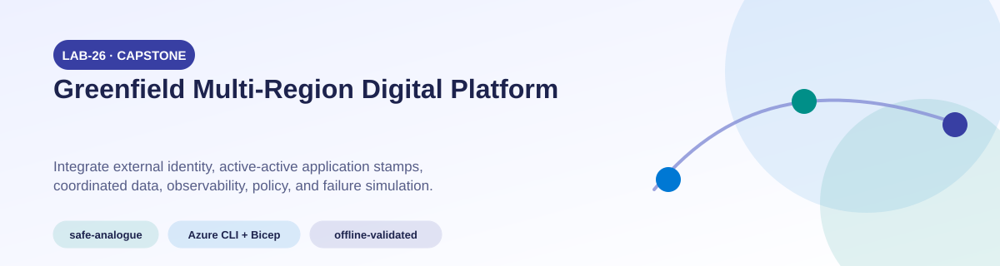
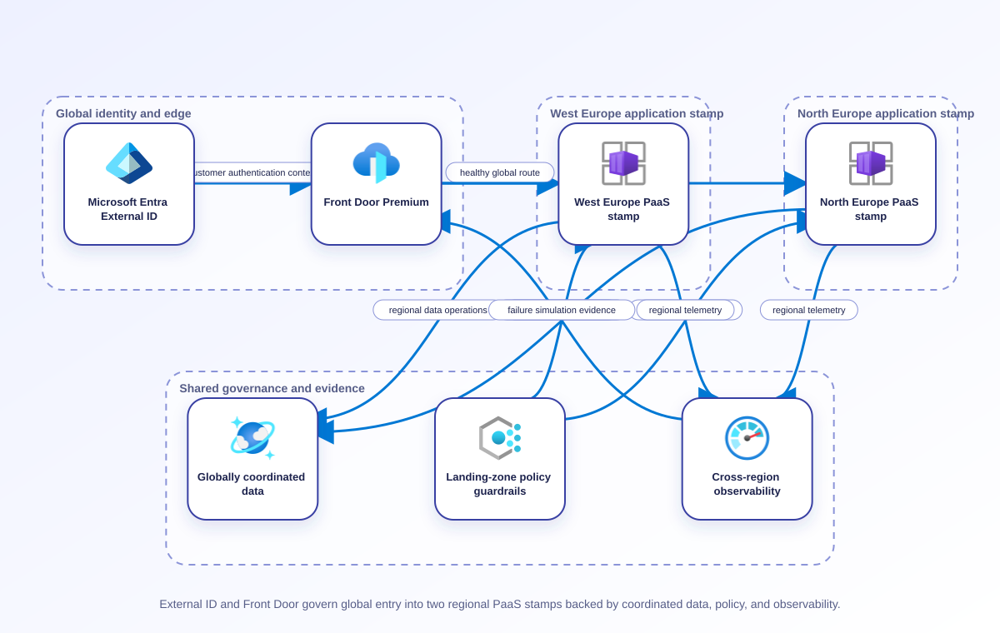
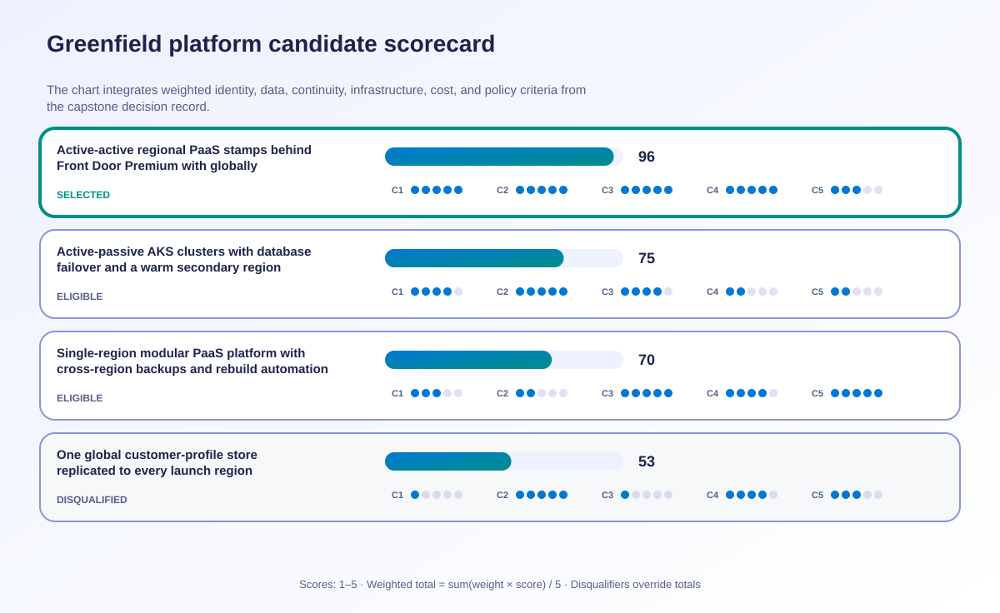

<!-- BEGIN GENERATED AZ305 V1 -->
# LAB-26 — Greenfield Multi-Region Digital Platform




<div class="az305-badges" aria-label="Lab classification">
  <span class="az305-mode-badge">safe-analogue</span>
  <span class="az305-lane-badge">Azure CLI + Bicep</span>
  <span class="az305-status">offline-validated</span>
</div>

## 1. Navigation

[← LAB-25](../25-network-security-traffic-delivery/README.md) · [Lab catalog](../README.md) · [LAB-27 →](../27-capstone-hybrid-modernization/README.md)

## 2. Scenario and completion contract

Trey Research is launching a regulated consumer analytics platform in two Azure regions with no legacy application constraint. Customers sign in through Microsoft Entra External ID, APIs and event processors scale independently, operational data spans relational and document stores, global traffic must survive a regional outage, and product teams need safe automated delivery. Executives want high availability but require an evidence-based cost ceiling before funding production. Learners must integrate governance, identity, observability, data, continuity, compute, messaging, caching, networking, and security decisions into one coherent architecture. The supplied Bicep is deliberately only a non-production foundation slice for compile, lint, and subscription-level what-if: it does not provision the full platform and the lifecycle scripts contain no deployment command.

- Architect role: Lead Azure solutions architect
- Outcome: Produce and validate a traceable greenfield multi-region platform design and Bicep reference that balances all five Well-Architected Framework pillars.
- Duration: 240 minutes
- Difficulty: expert
- Cost class: low
- Completion: all five checkpoint assertions, final validation, decision revision, and cleanup review are complete.

## 3. Objective-to-evidence map

| Objective | Requirement | Checkpoint |
| --- | --- | --- |
| `IGM-LOG-01` | `LAB26-REQ-01` | [`LAB26-CP01`](#checkpoint-1) |
| `IGM-AUTHZ-01` | `LAB26-REQ-01` | [`LAB26-CP01`](#checkpoint-1) |
| `IGM-GOV-03` | `LAB26-REQ-01` | [`LAB26-CP01`](#checkpoint-1) |
| `DATA-NONREL-01` | `LAB26-REQ-01` | [`LAB26-CP01`](#checkpoint-1) |
| `DATA-INT-02` | `LAB26-REQ-01` | [`LAB26-CP01`](#checkpoint-1) |
| `BC-HA-01` | `LAB26-REQ-01` | [`LAB26-CP01`](#checkpoint-1) |
| `INF-COMP-03` | `LAB26-REQ-01` | [`LAB26-CP01`](#checkpoint-1) |
| `INF-APP-03` | `LAB26-REQ-01` | [`LAB26-CP01`](#checkpoint-1) |
| `INF-MIG-02` | `LAB26-REQ-01` | [`LAB26-CP01`](#checkpoint-1) |
| `INF-NET-02` | `LAB26-REQ-01` | [`LAB26-CP01`](#checkpoint-1) |
| `IGM-LOG-02` | `LAB26-REQ-02` | [`LAB26-CP02`](#checkpoint-2) |
| `IGM-AUTHZ-02` | `LAB26-REQ-02` | [`LAB26-CP02`](#checkpoint-2) |
| `DATA-REL-01` | `LAB26-REQ-02` | [`LAB26-CP02`](#checkpoint-2) |
| `DATA-NONREL-02` | `LAB26-REQ-02` | [`LAB26-CP02`](#checkpoint-2) |
| `BC-DR-01` | `LAB26-REQ-02` | [`LAB26-CP02`](#checkpoint-2) |
| `BC-HA-02` | `LAB26-REQ-02` | [`LAB26-CP02`](#checkpoint-2) |
| `INF-COMP-04` | `LAB26-REQ-02` | [`LAB26-CP02`](#checkpoint-2) |
| `INF-APP-04` | `LAB26-REQ-02` | [`LAB26-CP02`](#checkpoint-2) |
| `INF-MIG-03` | `LAB26-REQ-02` | [`LAB26-CP02`](#checkpoint-2) |
| `INF-NET-03` | `LAB26-REQ-02` | [`LAB26-CP02`](#checkpoint-2) |
| `IGM-MON-01` | `LAB26-REQ-03` | [`LAB26-CP03`](#checkpoint-3) |
| `IGM-KEY-01` | `LAB26-REQ-03` | [`LAB26-CP03`](#checkpoint-3) |
| `DATA-REL-02` | `LAB26-REQ-03` | [`LAB26-CP03`](#checkpoint-3) |
| `DATA-NONREL-03` | `LAB26-REQ-03` | [`LAB26-CP03`](#checkpoint-3) |
| `BC-DR-02` | `LAB26-REQ-03` | [`LAB26-CP03`](#checkpoint-3) |
| `BC-HA-03` | `LAB26-REQ-03` | [`LAB26-CP03`](#checkpoint-3) |
| `INF-COMP-05` | `LAB26-REQ-03` | [`LAB26-CP03`](#checkpoint-3) |
| `INF-APP-05` | `LAB26-REQ-03` | [`LAB26-CP03`](#checkpoint-3) |
| `INF-MIG-04` | `LAB26-REQ-03` | [`LAB26-CP03`](#checkpoint-3) |
| `INF-NET-04` | `LAB26-REQ-03` | [`LAB26-CP03`](#checkpoint-3) |
| `IGM-AUTH-01` | `LAB26-REQ-04` | [`LAB26-CP04`](#checkpoint-4) |
| `IGM-GOV-01` | `LAB26-REQ-04` | [`LAB26-CP04`](#checkpoint-4) |
| `DATA-REL-03` | `LAB26-REQ-04` | [`LAB26-CP04`](#checkpoint-4) |
| `DATA-NONREL-04` | `LAB26-REQ-04` | [`LAB26-CP04`](#checkpoint-4) |
| `BC-DR-03` | `LAB26-REQ-04` | [`LAB26-CP04`](#checkpoint-4) |
| `INF-COMP-01` | `LAB26-REQ-04` | [`LAB26-CP04`](#checkpoint-4) |
| `INF-APP-01` | `LAB26-REQ-04` | [`LAB26-CP04`](#checkpoint-4) |
| `INF-APP-06` | `LAB26-REQ-04` | [`LAB26-CP04`](#checkpoint-4) |
| `INF-MIG-05` | `LAB26-REQ-04` | [`LAB26-CP04`](#checkpoint-4) |
| `INF-NET-05` | `LAB26-REQ-04` | [`LAB26-CP04`](#checkpoint-4) |
| `IGM-AUTH-02` | `LAB26-REQ-05` | [`LAB26-CP05`](#checkpoint-5) |
| `IGM-GOV-02` | `LAB26-REQ-05` | [`LAB26-CP05`](#checkpoint-5) |
| `DATA-REL-04` | `LAB26-REQ-05` | [`LAB26-CP05`](#checkpoint-5) |
| `DATA-INT-01` | `LAB26-REQ-05` | [`LAB26-CP05`](#checkpoint-5) |
| `BC-DR-04` | `LAB26-REQ-05` | [`LAB26-CP05`](#checkpoint-5) |
| `INF-COMP-02` | `LAB26-REQ-05` | [`LAB26-CP05`](#checkpoint-5) |
| `INF-APP-02` | `LAB26-REQ-05` | [`LAB26-CP05`](#checkpoint-5) |
| `INF-MIG-01` | `LAB26-REQ-05` | [`LAB26-CP05`](#checkpoint-5) |
| `INF-NET-01` | `LAB26-REQ-05` | [`LAB26-CP05`](#checkpoint-5) |

## 4. Business and quality requirements

Business outcome: Launch a secure global platform with controlled regional-failure behavior, fast product delivery, auditable governance, and a defensible production cost envelope.

- `LAB26-REQ-01` — Requirements, assumptions, mandatory constraints, objective traceability, candidates, scores, risks, architecture decisions, and all five WAF pillars agree.
- `LAB26-REQ-02` — Subscription-scope Bicep compiles a bounded foundation slice with three tagged resource groups, two regional identity/network/empty-monitoring/storage/serverless-document/messaging scaffolds, and a disabled Front Door Standard endpoint; its output explicitly lists every omitted production capability.
- `LAB26-REQ-03` — The foundation slice contains an empty DCR wired to a workspace and locked-down regional data scaffolds; DCRA, data sources and flows, diagnostics, alerts, backups, replication, compute, cache, private endpoints, and live recovery behavior are explicitly deferred to the production design.
- `LAB26-REQ-04` — The reviewed what-if describes only the tagged foundation slice, reports no deletion or unrelated modification, exposes all three resource-group IDs for dependency-safe review, and is never followed by a deployment command.
- `LAB26-REQ-05` — The simulation covers identity, global routing, regional ingress, messaging, cache loss, data consistency, degraded capacity, alerting, business validation, recovery, and rollback.

Scenario facts:

- **Data:** Customer profiles are geography-bound; anonymous catalog, configuration, events, audit, and operational telemetry have separate distribution rules.
- **Scale:** Global launch demand varies by market; request rate, profile volume, catalog size, and regional concurrency are measured sizing inputs.
- **Latency:** Anonymous catalog uses global edge and regional stamps, while profile operations route only to their authorized geography.
- **Availability:** Two regional PaaS stamps and global routing preserve catalog service; profile continuity remains inside its legal geography.
- **RTO:** Catalog regional failover follows an owner-tested target; profile recovery cannot violate residency to improve restoration time.
- **RPO:** Profile replication stays within geography and catalog rebuild or replication has an independently approved freshness tolerance.
- **Budget:** Active regional catalog capacity is justified by launch continuity, while profile stacks and premium features are scoped by market.

Constraints:

- The launch platform needs secure global delivery, controlled regional failure, auditable governance, and a defensible production budget.
- Customer profiles must remain in one geography while anonymous catalog traffic survives a complete regional outage globally.
- Use only the Azure CLI + Bicep command lane for learner implementation.
- Keep all live changes behind explicit execution and acknowledgement switches.
- Retain only sanitized command evidence and synthetic fixture identifiers.

Assumptions:

- The application separates profile identity and personalization from anonymous catalog content at API and data layers.
- Target regions support the selected PaaS, availability-zone, private endpoint, and monitoring capabilities.
- West Europe is the configurable primary example and North Europe is the configurable secondary example.
- The learner has administrator-level Azure operations knowledge but receives no pre-existing authenticated context.
- Offline fixtures demonstrate contract behavior rather than live Azure service behavior.

## 5. Architecture diagram and walkthrough



External ID and Front Door govern global entry into two regional PaaS stamps backed by coordinated data, policy, and observability. The labelled nodes, boundaries, and edges are deterministically rendered from the portable `diagrams/architecture.mmd` source and the frozen visual registry.

## 6. Concept primer and candidate architectures

Architecture decisions translate measurable requirements into a deliberate service and operating model. A candidate is viable only when every mandatory constraint is met; convenience or familiarity cannot compensate for a disqualifier.

- **Active-active regional PaaS stamps behind Front Door Premium with globally coordinated data services** (eligible) — PaaS stamps and Premium edge controls support independent regional release and routing while data services can be split by residency class.
- **Active-passive AKS clusters with database failover and a warm secondary region** (eligible) — AKS offers application portability and warm recovery but adds cluster, upgrade, policy, and capacity operations to launch readiness.
- **Single-region modular PaaS platform with cross-region backups and rebuild automation** (eligible) — A single region lowers steady cost and keeps modules clear, but backup rebuild cannot sustain catalog traffic through a full regional outage.
- **One global customer-profile store replicated to every launch region** (ineligible) — Universal profile replication simplifies failover but ignores the mandatory geography boundary. Disqualifier: LAB26-REQ-01 requires mandatory residency constraints to be reconciled with the selected architecture.

## 7. Decision, ADR, and Well-Architected review

Criteria weights are C1 30, C2 25, C3 20, C4 15, and C5 10. Weighted totals use `sum(weight × score) / 5`.



| Candidate | Eligible | C1 | C2 | C3 | C4 | C5 | Weighted /100 |
| --- | ---: | ---: | ---: | ---: | ---: | ---: | ---: |
| Active-active regional PaaS stamps behind Front Door Premium with globally coordinated data services | yes | 5 | 5 | 5 | 5 | 3 | 96 |
| Active-passive AKS clusters with database failover and a warm secondary region | yes | 4 | 5 | 4 | 2 | 2 | 75 |
| Single-region modular PaaS platform with cross-region backups and rebuild automation | yes | 3 | 2 | 5 | 4 | 5 | 70 |
| One global customer-profile store replicated to every launch region | no | 1 | 5 | 1 | 4 | 3 | 53 |

Selected design: **Active-active regional PaaS stamps behind Front Door Premium with globally coordinated data services**. `ADR-LAB26-001` records the accepted reasoning. Review Reliability, Security, Cost Optimization, Operational Excellence, and Performance Efficiency in `design/decision.yml`; no pillar is implied by another.

Rejected alternatives:

- **Active-passive AKS clusters with database failover and a warm secondary region:** The platform does not need Kubernetes-specific control enough to justify its operational burden and slower passive activation.
- **Single-region modular PaaS platform with cross-region backups and rebuild automation:** Its recovery behavior misses the anonymous-catalog continuity outcome despite attractive economics.
- **One global customer-profile store replicated to every launch region:** It is ineligible because profile availability cannot override residency.

Architecture risks:

- **Risk:** Anonymous responses can accidentally include profile-derived fields and enter the global cache or logs. **Mitigation:** Enforce separate contracts, classify fields, and assert that global responses and telemetry contain no profile attributes.
- **Risk:** Active-active stamps can drift in policy, secret references, or feature configuration. **Mitigation:** Promote immutable Bicep and configuration versions and block release when regional evidence hashes differ.

Well-Architected consequences:

<div class="az305-waf-grid">
<article class="az305-waf-card"><h3>Reliability</h3><p>Independent stamps and global routing keep catalog service available through regional loss while honoring profile boundaries.</p></article>
<article class="az305-waf-card"><h3>Security</h3><p>Premium edge controls, private origins, managed identities, policy, and geography-scoped data reduce exposure.</p></article>
<article class="az305-waf-card"><h3>Cost Optimization</h3><p>Shared global catalog capacity and market-specific profile stacks make continuity and residency spend attributable.</p></article>
<article class="az305-waf-card"><h3>Operational Excellence</h3><p>Declarative releases, regional assertions, failover exercises, governance evidence, and rollback support fast controlled delivery.</p></article>
<article class="az305-waf-card"><h3>Performance Efficiency</h3><p>Edge caching and regional PaaS autoscale serve anonymous demand while profile calls remain geography-local.</p></article>
</div>

ADR consequences:

- APIs and data contracts permanently separate anonymous catalog content from geography-bound customer profiles.
- Regional releases must prove parity without copying regulated profile data across the boundary.

## 8. Inputs, permissions, licensing, cost, and analogue

Use configurable `Location` (`AZ305_LOCATION`, default West Europe) and `SecondaryLocation` (`AZ305_SECONDARY_LOCATION`, default North Europe). Every public input has an explicit `AZ305_*` fallback. Preview is the default; only Golden Lab 00 writes an intent-only `execute: false` preview record. Before an executed cloud command, the supplied subscription and tenant must exactly match the active CLI, Az, and—where applicable—Microsoft Graph contexts. `-Execute` crosses the execution boundary; cost-bearing and tenant-scoped paths also require their independent acknowledgement switches.

Safe analogue: Use the self-contained Bicep template only as a bounded tagged topology analogue; validate data-boundary and failover decisions primarily with offline fixtures.

Permissions: Architecture review uses read-only identity, policy, network, application, data, and monitoring evidence; the safe analogue needs only a bounded resource-group deployment role when explicitly authorized.

Licensing: Front Door Premium, regional PaaS, managed data replicas, private networking, monitoring, governance, and security tiers all require current regional estimates.

Cost boundary: Model two regional stamps, global edge, geography-isolated profiles, anonymous catalog replicas, reserved baselines, burst capacity, logs, and exercises.

## 9. Read-only preflight

```powershell
pwsh ./scripts/azure-cli/Preflight.ps1 -RunId synthetic-260001
```

Synthetic sample: `{"labId":"LAB-26","track":"azure-cli","result":"pass","note":"Local tool discovery only"}`. This is illustrative local output, not evidence captured from Azure.

## 10. Five guided checkpoints

<ol class="az305-checkpoint-timeline" aria-label="Five checkpoint learning path">
<li><a href="#checkpoint-1">Reconcile requirements and architecture decisions</a><span>LAB26-REQ-01 · LAB26-CP01</span></li>
<li><a href="#checkpoint-2">Compile the multi-region Bicep reference</a><span>LAB26-REQ-02 · LAB26-CP02</span></li>
<li><a href="#checkpoint-3">Verify foundation observability and data guardrails</a><span>LAB26-REQ-03 · LAB26-CP03</span></li>
<li><a href="#checkpoint-4">Preview cost and policy impact</a><span>LAB26-REQ-04 · LAB26-CP04</span></li>
<li><a href="#checkpoint-5">Run the integrated regional-failure simulation</a><span>LAB26-REQ-05 · LAB26-CP05</span></li>
</ol>

### Checkpoint 1: Reconcile requirements and architecture decisions

<a id="checkpoint-1"></a>

**Trace:** `IGM-LOG-01`, `IGM-AUTHZ-01`, `IGM-GOV-03`, `DATA-NONREL-01`, `DATA-INT-02`, `BC-HA-01`, `INF-COMP-03`, `INF-APP-03`, `INF-MIG-02`, `INF-NET-02` → `LAB26-REQ-01` → `LAB26-CP01`

```powershell
$requirements = Get-Content design/requirements.yml -Raw; $decisions = Get-Content design/decision.yml -Raw; if ([string]::IsNullOrWhiteSpace($requirements) -or [string]::IsNullOrWhiteSpace($decisions)) { throw 'Architecture inputs are empty.' }
```

Expected evidence: Requirements, assumptions, mandatory constraints, objective traceability, candidates, scores, risks, architecture decisions, and all five WAF pillars agree. Retain Preserve the requirement and decision hashes, traceability report, score recalculation, exception log, and architecture review approval.

Positive assertion:

```powershell
$text = Get-Content design/decision.yml -Raw; $requiredPillars = @('Reliability','Security','Cost Optimization','Operational Excellence','Performance Efficiency'); foreach ($pillar in $requiredPillars) { if ($text -notmatch [regex]::Escape($pillar)) { throw "Missing WAF pillar: $pillar" } }
```

Negative assertion:

```powershell
$text = Get-Content design/decision.yml -Raw; if ($text -match '(?i)Azure AD B2C|Azure Cache for Redis|Basic Load Balancer|Log Analytics agent') { throw 'The design contains a retired or superseded default.' }
```

Failure and retry: A polished diagram can conceal contradictory decisions and unowned requirements across domains. Resolve the smallest inconsistent decision with its stakeholder and rerun complete traceability and arithmetic checks.

Cleanup dependency: Remove generated comparison output only; authoritative design sources remain tracked.

WAF consequence: Operational Excellence: decision traceability turns a broad platform architecture into reviewable, owned contracts.

### Checkpoint 2: Compile the multi-region Bicep reference

<a id="checkpoint-2"></a>

**Trace:** `IGM-LOG-02`, `IGM-AUTHZ-02`, `DATA-REL-01`, `DATA-NONREL-02`, `BC-DR-01`, `BC-HA-02`, `INF-COMP-04`, `INF-APP-04`, `INF-MIG-03`, `INF-NET-03` → `LAB26-REQ-02` → `LAB26-CP02`

```powershell
az bicep build --file artifacts/main.bicep --stdout --only-show-errors | Out-Null
```

Expected evidence: Subscription-scope Bicep compiles a bounded foundation slice with three tagged resource groups, two regional identity/network/empty-monitoring/storage/serverless-document/messaging scaffolds, and a disabled Front Door Standard endpoint; its output explicitly lists every omitted production capability. Retain Save compiler output, source and parameter hashes, resource-type manifest, module dependency graph, and current-service guardrail results.

Positive assertion:

```powershell
$main = az bicep build --file artifacts/main.bicep --stdout --only-show-errors | ConvertFrom-Json; $regional = az bicep build --file artifacts/modules/regional-stamp.bicep --stdout --only-show-errors | ConvertFrom-Json; $global = az bicep build --file artifacts/modules/global-entry.bicep --stdout --only-show-errors | ConvertFrom-Json; $types = @($main.resources.type) + @($regional.resources.type) + @($global.resources.type); foreach ($requiredType in @('Microsoft.Resources/resourceGroups','Microsoft.Cdn/profiles','Microsoft.ManagedIdentity/userAssignedIdentities')) { if ($requiredType -notin $types) { throw "Missing required resource type: $requiredType" } }; if ($main.outputs.referenceBoundary.value.productionReady -ne $false -or $main.outputs.referenceBoundary.value.omittedCapabilities.Count -lt 6) { throw 'The compiled foundation slice does not disclose its non-production boundary.' }
```

Negative assertion:

```powershell
$templateText = az bicep build --file artifacts/main.bicep --stdout --only-show-errors; if ($templateText -match '(?i)password|clientSecret|accountKey|0\.0\.0\.0/0') { throw 'The compiled template contains a secret-like field or unrestricted network rule.' }
```

Failure and retry: Individual modules can compile while cross-region outputs, scopes, identities, or dependencies remain inconsistent. Fix the failing interface or scope and compile the root plus every module before generating a new preview.

Cleanup dependency: Delete generated local JSON if retained; keep the Bicep source and example parameters.

WAF consequence: Security: private data paths, managed identities, External ID, and secret-free outputs establish secure defaults.

### Checkpoint 3: Verify foundation observability and data guardrails

<a id="checkpoint-3"></a>

**Trace:** `IGM-MON-01`, `IGM-KEY-01`, `DATA-REL-02`, `DATA-NONREL-03`, `BC-DR-02`, `BC-HA-03`, `INF-COMP-05`, `INF-APP-05`, `INF-MIG-04`, `INF-NET-04` → `LAB26-REQ-03` → `LAB26-CP03`

```powershell
$template = az bicep build --file artifacts/modules/regional-stamp.bicep --stdout --only-show-errors | ConvertFrom-Json; $template.resources | Where-Object { $_.type -match 'diagnosticSettings|dataCollectionRules|databaseAccounts|servers/databases|backupVaults' } | Select-Object type, name
```

Expected evidence: The foundation slice contains an empty DCR wired to a workspace and locked-down regional data scaffolds; DCRA, data sources and flows, diagnostics, alerts, backups, replication, compute, cache, private endpoints, and live recovery behavior are explicitly deferred to the production design. Retain Preserve the resource manifest, explicit omission list, objective-to-future-signal mapping, recovery design, data-consistency assumptions, and cost boundaries without presenting them as deployed evidence.

Positive assertion:

```powershell
$template = az bicep build --file artifacts/modules/regional-stamp.bicep --stdout --only-show-errors | ConvertFrom-Json; if (-not ($template.resources | Where-Object type -match 'Microsoft.Insights/dataCollectionRules') -or -not ($template.resources | Where-Object type -match 'Microsoft.DocumentDB/databaseAccounts')) { throw 'The empty DCR declaration or regional serverless document-store scaffold is missing.' }
```

Negative assertion:

```powershell
$template = az bicep build --file artifacts/modules/regional-stamp.bicep --stdout --only-show-errors | ConvertFrom-Json; if ($template.resources | Where-Object { $_.type -match 'databaseAccounts|servers/databases|storageAccounts' -and $_.properties.publicNetworkAccess -eq 'Enabled' }) { throw 'A data service permits public network access.' }
```

Failure and retry: Component resilience can leave the platform unavailable or inconsistent when dependency order is ignored. Correct the missing diagnostic or continuity relationship and replay its independent positive and negative assertions.

Cleanup dependency: Remove local compiled templates and synthetic evidence; this checkpoint changes no service.

WAF consequence: Reliability: coordinated health, data, and recovery contracts protect the complete customer journey rather than isolated components.

### Checkpoint 4: Preview cost and policy impact

<a id="checkpoint-4"></a>

**Trace:** `IGM-AUTH-01`, `IGM-GOV-01`, `DATA-REL-03`, `DATA-NONREL-04`, `BC-DR-03`, `INF-COMP-01`, `INF-APP-01`, `INF-APP-06`, `INF-MIG-05`, `INF-NET-05` → `LAB26-REQ-04` → `LAB26-CP04`

```powershell
az deployment sub what-if --location $Location --name "lab26-$RunId" --template-file artifacts/main.bicep --parameters artifacts/parameters.example.json runId=$RunId expiresOn=$ExpiresOn --result-format FullResourcePayloads --only-show-errors
```

Expected evidence: The reviewed what-if describes only the tagged foundation slice, reports no deletion or unrelated modification, exposes all three resource-group IDs for dependency-safe review, and is never followed by a deployment command. Retain Archive complete what-if output, policy results, cost estimate, reviewer disposition, and exact source and parameter hashes.

Positive assertion:

```powershell
$preview = az deployment sub what-if --location $Location --name "lab26-$RunId" --template-file artifacts/main.bicep --parameters artifacts/parameters.example.json runId=$RunId expiresOn=$ExpiresOn --result-format ResourceIdOnly --output json --only-show-errors | ConvertFrom-Json; if (-not ($preview.changes | Where-Object changeType -in @('Create','Deploy','Modify','NoChange'))) { throw 'What-if produced no expected platform changes.' }
```

Negative assertion:

```powershell
$preview = az deployment sub what-if --location $Location --name "lab26-$RunId" --template-file artifacts/main.bicep --parameters artifacts/parameters.example.json runId=$RunId expiresOn=$ExpiresOn --result-format FullResourcePayloads --output json --only-show-errors | ConvertFrom-Json; if ($preview.changes | Where-Object { $_.changeType -eq 'Delete' -or $_.resourceId -notmatch $RunId }) { throw 'Preview contains deletion or a resource outside run ownership.' }
```

Failure and retry: Cross-scope module or parameter errors can unexpectedly affect shared subscription resources. Correct scope, tier, or policy compliance and generate a fresh preview; never waive an unexplained deletion.

Cleanup dependency: Remove local preview output after review if it contains topology data; what-if provisions nothing.

WAF consequence: Cost Optimization: the high-cost production architecture is evaluated with bounded parameters and an explicit funding envelope.

### Checkpoint 5: Run the integrated regional-failure simulation

<a id="checkpoint-5"></a>

**Trace:** `IGM-AUTH-02`, `IGM-GOV-02`, `DATA-REL-04`, `DATA-INT-01`, `BC-DR-04`, `INF-COMP-02`, `INF-APP-02`, `INF-MIG-01`, `INF-NET-01` → `LAB26-REQ-05` → `LAB26-CP05`

```powershell
$fixtures = Get-Content tests/fixtures/regional-failure.json -Raw | ConvertFrom-Json; $fixtures.assertions | Select-Object id, domain, expected, simulatedActual
```

Expected evidence: The simulation covers identity, global routing, regional ingress, messaging, cache loss, data consistency, degraded capacity, alerting, business validation, recovery, and rollback. Retain Preserve the immutable fixture hash, assertion-level output, recovery timeline, architectural consequence, remediation owner, and retest result.

Positive assertion:

```powershell
$fixtures = Get-Content tests/fixtures/regional-failure.json -Raw | ConvertFrom-Json; if ($fixtures.assertions | Where-Object { $_.polarity -eq 'positive' -and $_.simulatedActual -ne $_.expected }) { throw 'A required platform behavior failed.' }
```

Negative assertion:

```powershell
$fixtures = Get-Content tests/fixtures/regional-failure.json -Raw | ConvertFrom-Json; if ($fixtures.assertions | Where-Object { $_.polarity -eq 'negative' -and $_.simulatedActual -ne $_.expected }) { throw 'A prohibited platform behavior was observed.' }
```

Failure and retry: Cross-domain dependencies create emergent failures that isolated component tests do not reveal. Correct the responsible architecture contract and rerun the same deterministic fixture before introducing another scenario.

Cleanup dependency: Delete generated simulation output only; the capstone performs no deployment or live failover.

WAF consequence: Performance Efficiency: degraded-mode simulation proves that surviving regional capacity protects priority journeys within defined limits.

## 11. Final validation and interpretation

Run `Validate.ps1 -Mode Deployment -Execute` only after an executed run has state and you are authorized to issue the ten read-only checkpoint inspections. Without `-Execute`, ordinary deployment validation records `partial` and exits `2`; Golden Lab 00 alone can validate its intent-only preview locally. Exit `0` means all required assertions pass, `1` means at least one failed, and `2` means the outcome is gated or partial. Positive and negative commands execute independently, so one failure never suppresses its paired assertion.

## 12. Material change request

A launch-market regulator now requires all customer profiles to remain in one geography, while anonymous catalog traffic must continue globally through a complete regional outage.

Revised solution: select **Active-active regional PaaS stamps behind Front Door Premium with globally coordinated data services**. LAB26-REQ-01 requires mandatory constraints to drive the architecture decision, so active-active stamps split into geography-specific profile planes and a separate global anonymous catalog plane.

Revised Well-Architected consequences:

- **Reliability:** Anonymous catalog survives a regional loss without failing over restricted profile data unlawfully.
- **Security:** Profile routes, stores, caches, and logs are constrained to the assigned geography.
- **Cost Optimization:** Global replication is purchased for catalog data, while profile capacity is funded per regulated market.
- **Operational Excellence:** Contract and routing assertions detect profile leakage before regional release.
- **Performance Efficiency:** Catalog requests use edge and nearest healthy stamp; profile calls remain within geography.

## 13. Architect job challenge

Split customer and public data boundaries, revise External ID, routing, cache, replication, recovery, monitoring, and cost decisions, and update Bicep what-if evidence without weakening global catalog availability.

## 14. Troubleshooting, cleanup, and residual verification

- If subscription what-if reports scope errors, inspect module target scopes and resource-group dependencies before changing deployment scope.
- If a current-service assertion fails, distinguish an intentional compatibility resource from a new-design default and document any mandatory exception.
- If the integrated scenario has conflicting pass results, business and security assertions take precedence over aggregate infrastructure health.

Cleanup previews nonempty state in reverse dependency order, writes `partial`, and exits `2`; an already empty run is completed locally and idempotently. Executed cleanup rechecks the exact live ID plus `purpose`, `labId`, `runId`, and `expiresOn` immediately before each removal, persists state after every absent or removed object, stops on the first dependency failure, and refuses unresolved pre-existing settings. It never automates purge. Finish with `Validate.ps1 -Mode PostCleanup`; the required residual count is zero.

## 15. Exam debrief, assessment, sources, and navigation

Explain the recommendation in terms of requirements, rejected alternatives, failure behavior, and all five WAF pillars. This foundation or capstone reinforces the curriculum and has no scored question bank.

- [Mission-critical workload design methodology](https://learn.microsoft.com/en-us/azure/well-architected/mission-critical/mission-critical-design-methodology)
- [Azure Well-Architected Framework](https://learn.microsoft.com/en-us/azure/well-architected/)

[← LAB-25](../25-network-security-traffic-delivery/README.md) · [Lab catalog](../README.md) · [LAB-27 →](../27-capstone-hybrid-modernization/README.md)

## 16. Synchronized lifecycle-script appendix

### Preflight.ps1

```powershell
[CmdletBinding()]
param(
    [string]$SubscriptionId = $env:AZ305_SUBSCRIPTION_ID,
    [string]$TenantId = $env:AZ305_TENANT_ID,
    [ValidatePattern('^[a-z0-9-]{6,64}$')][string]$RunId = $env:AZ305_RUN_ID,
    [string]$Location = $(if ($env:AZ305_LOCATION) { $env:AZ305_LOCATION } else { 'westeurope' }),
    [string]$SecondaryLocation = $(if ($env:AZ305_SECONDARY_LOCATION) { $env:AZ305_SECONDARY_LOCATION } else { 'northeurope' }),
    [string]$ResourceGroup = $(if ($env:AZ305_RESOURCE_GROUP) { $env:AZ305_RESOURCE_GROUP } else { "rg-az305-$RunId" }),
    [string]$WorkloadName = $(if ($env:AZ305_WORKLOAD_NAME) { $env:AZ305_WORKLOAD_NAME } else { "az305-$RunId" }),
    [string]$ExpiresOn = $(if ($env:AZ305_EXPIRES_ON) { $env:AZ305_EXPIRES_ON } else { (Get-Date).ToUniversalTime().AddDays(1).ToString('yyyy-MM-dd') }),
    [switch]$Execute,
    [switch]$AcknowledgeCost,
    [switch]$AcknowledgeTenantChange
)

$ErrorActionPreference = 'Stop'
$PSNativeCommandUseErrorActionPreference = $true
if (-not $RunId) { [Console]::Error.WriteLine('RunId or AZ305_RUN_ID is required.'); exit 2 }
# Every lifecycle entrypoint intentionally exposes the same public parameter contract.
@($SubscriptionId, $TenantId, $RunId, $Location, $SecondaryLocation, $ResourceGroup, $WorkloadName, $ExpiresOn, $Execute, $AcknowledgeCost, $AcknowledgeTenantChange) | Out-Null

$requiredCommands = @('az', 'bicep', 'pwsh')
$missing = @($requiredCommands | Where-Object { -not (Get-Command $_ -ErrorAction SilentlyContinue) })
if ($missing.Count -gt 0) {
    Write-Error "Missing local commands: $($missing -join ', ')"
    exit 1
}

[pscustomobject]@{
    labId = 'LAB-26'
    track = 'azure-cli'
    implementationMode = 'safe-analogue'
    result = 'pass'
    note = 'Local tool discovery only; no Azure or Microsoft Graph request was made.'
} | ConvertTo-Json
exit 0
```

### Setup.ps1

```powershell
[CmdletBinding()]
param(
    [string]$SubscriptionId = $env:AZ305_SUBSCRIPTION_ID,
    [string]$TenantId = $env:AZ305_TENANT_ID,
    [ValidatePattern('^[a-z0-9-]{6,64}$')][string]$RunId = $env:AZ305_RUN_ID,
    [string]$Location = $(if ($env:AZ305_LOCATION) { $env:AZ305_LOCATION } else { 'westeurope' }),
    [string]$SecondaryLocation = $(if ($env:AZ305_SECONDARY_LOCATION) { $env:AZ305_SECONDARY_LOCATION } else { 'northeurope' }),
    [string]$ResourceGroup = $(if ($env:AZ305_RESOURCE_GROUP) { $env:AZ305_RESOURCE_GROUP } else { "rg-az305-$RunId" }),
    [string]$WorkloadName = $(if ($env:AZ305_WORKLOAD_NAME) { $env:AZ305_WORKLOAD_NAME } else { "az305-$RunId" }),
    [string]$ExpiresOn = $(if ($env:AZ305_EXPIRES_ON) { $env:AZ305_EXPIRES_ON } else { (Get-Date).ToUniversalTime().AddDays(1).ToString('yyyy-MM-dd') }),
    [switch]$Execute,
    [switch]$AcknowledgeCost,
    [switch]$AcknowledgeTenantChange
)

$ErrorActionPreference = 'Stop'
$PSNativeCommandUseErrorActionPreference = $true
if (-not $RunId) { [Console]::Error.WriteLine('RunId or AZ305_RUN_ID is required.'); exit 2 }
# Every lifecycle entrypoint intentionally exposes the same public parameter contract.
@($SubscriptionId, $TenantId, $RunId, $Location, $SecondaryLocation, $ResourceGroup, $WorkloadName, $ExpiresOn, $Execute, $AcknowledgeCost, $AcknowledgeTenantChange) | Out-Null

$LabRoot = Split-Path (Split-Path $PSScriptRoot -Parent) -Parent
$StateRoot = Join-Path $LabRoot ".state/$RunId"
$StatePath = Join-Path $StateRoot 'run.json'

function Invoke-AzCliJson {
    [CmdletBinding()]
    param([Parameter(Mandatory)][string[]]$ArgumentList)
    $savedNativePreference = $PSNativeCommandUseErrorActionPreference
    try {
        # Capture the exit code ourselves so a failed native command cannot be
        # mistaken for an empty but successful JSON response.
        $PSNativeCommandUseErrorActionPreference = $false
        $outputLines = @(& az @ArgumentList)
        $nativeExit = $LASTEXITCODE
    }
    finally {
        $PSNativeCommandUseErrorActionPreference = $savedNativePreference
    }
    if ($nativeExit -ne 0) { throw "Azure CLI exited with code $nativeExit." }
    $raw = @($outputLines) -join "`n"
    if ([string]::IsNullOrWhiteSpace($raw)) { return $null }
    try { return ($raw | ConvertFrom-Json -Depth 100) }
    catch { throw 'Azure CLI returned data that was not valid JSON.' }
}

function Assert-ExactExecutionContext {
    [CmdletBinding()]
    param([string]$ExpectedSubscriptionId, [string]$ExpectedTenantId)
    if ([string]::IsNullOrWhiteSpace($ExpectedSubscriptionId) -or [string]::IsNullOrWhiteSpace($ExpectedTenantId)) {
        throw 'SubscriptionId and TenantId are required before a cloud request.'
    }
    $context = Invoke-AzCliJson -ArgumentList @('account', 'show', '--output', 'json', '--only-show-errors')
    if (-not $context -or [string]$context.id -ine $ExpectedSubscriptionId -or [string]$context.tenantId -ine $ExpectedTenantId) {
        throw 'The active Azure CLI subscription or tenant does not exactly match the requested context.'
    }
}

function Save-RunState {
    [CmdletBinding()]
    param([Parameter(Mandatory)]$State)
    $temporaryPath = "$StatePath.tmp"
    $State | ConvertTo-Json -Depth 20 | Set-Content -LiteralPath $temporaryPath -Encoding utf8NoBOM
    Move-Item -LiteralPath $temporaryPath -Destination $StatePath -Force
}

function Assert-SafeStateValue {
    [CmdletBinding()]
    param($Value)
    $serialized = $Value | ConvertTo-Json -Depth 12 -Compress
    if ($serialized -match '(?i)"(?:token|password|secret|certificate|connectionString|sas|clientSecret|accessToken|refreshToken|accountKey|privateKey)"\s*:') {
        throw 'A prohibited sensitive field name was returned; state capture is refused.'
    }
}

function Convert-CheckpointOutput {
    [CmdletBinding()]
    param($Value)
    if ($Value -is [string]) { $raw = [string]$Value }
    elseif ($Value -is [System.Collections.IEnumerable] -and @($Value | Where-Object { $_ -isnot [string] }).Count -eq 0) { $raw = @($Value) -join "`n" }
    else { return $Value }
    if ([string]::IsNullOrWhiteSpace($raw)) { return $null }
    try { return ($raw | ConvertFrom-Json -Depth 100) } catch { return $Value }
}

function Get-ReturnedResourceId {
    [CmdletBinding()]
    param($Value)
    $seen = [System.Collections.Generic.HashSet[string]]::new([System.StringComparer]::OrdinalIgnoreCase)
    $results = [System.Collections.Generic.List[string]]::new()
    function Add-ArmId {
        param($Candidate)
        if ($Candidate -is [string] -and $Candidate -match '^/subscriptions/[0-9a-f-]+/(?:resourceGroups/[^/]+(?:/providers/.+)?|providers/.+)$' -and $Candidate -notmatch '/providers/Microsoft\.Resources/deployments/') {
            if ($seen.Add($Candidate)) { $results.Add($Candidate) }
        }
    }
    function Find-DeploymentOutputId {
        param($Item, [int]$Depth)
        if ($null -eq $Item -or $Depth -gt 12) { return }
        if ($Item -is [string]) { Add-ArmId -Candidate $Item; return }
        if ($Item -is [System.Collections.IDictionary]) { foreach ($key in $Item.Keys) { Find-DeploymentOutputId -Item $Item[$key] -Depth ($Depth + 1) }; return }
        if ($Item -is [System.Collections.IEnumerable]) { foreach ($entry in $Item) { Find-DeploymentOutputId -Item $entry -Depth ($Depth + 1) }; return }
        foreach ($property in @($Item.PSObject.Properties | Where-Object { $_.MemberType -in @('NoteProperty', 'Property') })) { Find-DeploymentOutputId -Item $property.Value -Depth ($Depth + 1) }
    }
    foreach ($rootItem in @($Value)) {
        if ($rootItem -is [System.Collections.IDictionary]) {
            foreach ($name in @('id', 'resourceId')) { if ($rootItem.Contains($name)) { Add-ArmId -Candidate $rootItem[$name] } }
            if ($rootItem.Contains('properties') -and $rootItem.properties -and $rootItem.properties.outputs) { Find-DeploymentOutputId -Item $rootItem.properties.outputs -Depth 0 }
            continue
        }
        foreach ($name in @('Id', 'ResourceId')) {
            $property = $rootItem.PSObject.Properties[$name]
            if ($property) { Add-ArmId -Candidate $property.Value }
        }
        if ($rootItem.PSObject.Properties['Properties'] -and $rootItem.Properties -and $rootItem.Properties.outputs) {
            Find-DeploymentOutputId -Item $rootItem.Properties.outputs -Depth 0
        }
    }
    return @($results)
}

function Get-PlannedDeploymentResourceId {
    [CmdletBinding()]
    param($Value)
    $seen = [System.Collections.Generic.HashSet[string]]::new([System.StringComparer]::OrdinalIgnoreCase)
    $results = [System.Collections.Generic.List[string]]::new()
    foreach ($change in @($Value.changes)) {
        $candidate = [string]$change.resourceId
        if ($candidate -match '^/subscriptions/[0-9a-f-]+/(?:resourceGroups/[^/]+(?:/providers/.+)?|providers/.+)$' -and $candidate -notmatch '/providers/Microsoft\.Resources/deployments/' -and $seen.Add($candidate)) {
            $results.Add($candidate)
        }
    }
    return @($results)
}

function Assert-InputSubscriptionScope {
    [CmdletBinding()]
    param($Inputs, [string]$ExpectedSubscriptionId)
    $entries = if ($Inputs -is [System.Collections.IDictionary]) {
        @($Inputs.GetEnumerator())
    } else {
        @($Inputs.PSObject.Properties | ForEach-Object { [pscustomobject]@{ Key = $_.Name; Value = $_.Value } })
    }
    foreach ($entry in $entries) {
        if ($entry.Value -is [string] -and [string]$entry.Value -match '^/subscriptions/([^/]+)/') {
            if ($Matches[1] -ine $ExpectedSubscriptionId) { throw "Input $($entry.Key) belongs to a different subscription." }
        }
    }
}

function Assert-ManagedMutation {
    [CmdletBinding()]
    param($State, [string]$CheckpointId, [bool]$CarriesOwnership, [object[]]$TargetResourceIds)
    if ($CarriesOwnership) { return }
    $targets = @($TargetResourceIds | Where-Object { $_ -is [string] -and $_ -match '^/subscriptions/' })
    if ($targets.Count -eq 0) { throw "$CheckpointId refuses an untagged mutation because no exact ARM target ID was supplied." }
    $knownIds = @($State.managedObjects | ForEach-Object { [string]$_.id })
    if ($knownIds.Count -eq 0) { throw "$CheckpointId refuses to modify a pre-existing object because no run-owned parent has been recorded." }
    foreach ($target in $targets) {
        $related = @($knownIds | Where-Object { $target -ieq $_ -or $target.StartsWith("$_/", [System.StringComparison]::OrdinalIgnoreCase) -or $_.StartsWith("$target/", [System.StringComparison]::OrdinalIgnoreCase) }).Count -gt 0
        if (-not $related) { throw "$CheckpointId refuses a mutation outside the exact run-owned resource boundary." }
    }
}

$executionInputs = [ordered]@{ subscriptionId = $SubscriptionId; tenantId = $TenantId; location = $Location; secondaryLocation = $SecondaryLocation; resourceGroup = $ResourceGroup; workloadName = $WorkloadName; expiresOn = $ExpiresOn }

if (-not $Execute) {
    Write-Output '[preview] No cloud command was called and no state was created.'
    Write-Output '[preview] Re-run with -Execute only in an authorized disposable environment.'
    exit 0
}
# This setup is compatible with the lab implementation mode.
# This default exercise does not require a cost acknowledgement.
# This lab does not perform a tenant-scoped change by default.
# This execution path has no additional required lab input.

try {
    Assert-ExactExecutionContext -ExpectedSubscriptionId $SubscriptionId -ExpectedTenantId $TenantId
    Assert-InputSubscriptionScope -Inputs $executionInputs -ExpectedSubscriptionId $SubscriptionId
    Assert-SafeStateValue -Value $executionInputs
}
catch {
    [Console]::Error.WriteLine("Execution is gated by context or input validation: $($_.Exception.Message)")
    exit 2
}

# Recovery state is persisted before the first possible mutation below.
if (Test-Path -LiteralPath $StatePath) {
    [Console]::Error.WriteLine('Run state already exists. Choose a new RunId or complete the recorded cleanup; existing recovery state will not be overwritten.')
    exit 2
}
New-Item -ItemType Directory -Path $StateRoot -Force | Out-Null
$state = [ordered]@{
    schemaVersion = '1.0.0'; labId = 'LAB-26'; runId = $RunId; track = 'azure-cli'
    implementationMode = 'safe-analogue'; status = 'initialized'
    createdAt = (Get-Date).ToUniversalTime().ToString('o'); execute = $true
    parameters = $executionInputs
    managedObjects = @(); originalSettings = @()
}
Save-RunState -State $state
# Planning-only execution remains initialized until its bounded checks complete.

$originalLocation = Get-Location
try {
    Set-Location -LiteralPath $LabRoot
    # 26-CP01: Reconcile requirements and architecture decisions
    $stepResult = & { $requirements = Get-Content design/requirements.yml -Raw; $decisions = Get-Content design/decision.yml -Raw; if ([string]::IsNullOrWhiteSpace($requirements) -or [string]::IsNullOrWhiteSpace($decisions)) { throw 'Architecture inputs are empty.' } }
    $null = $stepResult

    # 26-CP02: Compile the multi-region Bicep reference
    $stepResult = & { az bicep build --file artifacts/main.bicep --stdout --only-show-errors | Out-Null }
    if ($LASTEXITCODE -ne 0) { throw 'LAB26-CP02 native command exited with code ' + $LASTEXITCODE + '.' }
    $null = $stepResult

    # 26-CP03: Verify foundation observability and data guardrails
    $stepResult = & { $template = az bicep build --file artifacts/modules/regional-stamp.bicep --stdout --only-show-errors | ConvertFrom-Json; $template.resources | Where-Object { $_.type -match 'diagnosticSettings|dataCollectionRules|databaseAccounts|servers/databases|backupVaults' } | Select-Object type, name }
    if ($LASTEXITCODE -ne 0) { throw 'LAB26-CP03 native command exited with code ' + $LASTEXITCODE + '.' }
    $null = $stepResult

    # 26-CP04: Preview cost and policy impact
    $stepResult = & { az deployment sub what-if --location $Location --name "lab26-$RunId" --template-file artifacts/main.bicep --parameters artifacts/parameters.example.json runId=$RunId expiresOn=$ExpiresOn --result-format FullResourcePayloads --only-show-errors }
    if ($LASTEXITCODE -ne 0) { throw 'LAB26-CP04 native command exited with code ' + $LASTEXITCODE + '.' }
    $null = $stepResult

    # 26-CP05: Run the integrated regional-failure simulation
    $stepResult = & { $fixtures = Get-Content tests/fixtures/regional-failure.json -Raw | ConvertFrom-Json; $fixtures.assertions | Select-Object id, domain, expected, simulatedActual }
    $null = $stepResult

    $state.status = 'planned'
    Save-RunState -State $state
} catch {
    $state.status = 'failed'
    Save-RunState -State $state
    Write-Error $_
    exit 1
} finally {
    Set-Location -LiteralPath $originalLocation
}
exit 0
```

### Validate.ps1

```powershell
[CmdletBinding()]
param(
    [string]$SubscriptionId = $env:AZ305_SUBSCRIPTION_ID,
    [string]$TenantId = $env:AZ305_TENANT_ID,
    [ValidatePattern('^[a-z0-9-]{6,64}$')][string]$RunId = $env:AZ305_RUN_ID,
    [string]$Location = $(if ($env:AZ305_LOCATION) { $env:AZ305_LOCATION } else { 'westeurope' }),
    [string]$SecondaryLocation = $(if ($env:AZ305_SECONDARY_LOCATION) { $env:AZ305_SECONDARY_LOCATION } else { 'northeurope' }),
    [string]$ResourceGroup = $(if ($env:AZ305_RESOURCE_GROUP) { $env:AZ305_RESOURCE_GROUP } else { "rg-az305-$RunId" }),
    [string]$WorkloadName = $(if ($env:AZ305_WORKLOAD_NAME) { $env:AZ305_WORKLOAD_NAME } else { "az305-$RunId" }),
    [string]$ExpiresOn = $(if ($env:AZ305_EXPIRES_ON) { $env:AZ305_EXPIRES_ON } else { (Get-Date).ToUniversalTime().AddDays(1).ToString('yyyy-MM-dd') }),
    [ValidateSet('Deployment', 'PostCleanup')][string]$Mode = 'Deployment',
    [switch]$Execute,
    [switch]$AcknowledgeCost,
    [switch]$AcknowledgeTenantChange
)

$ErrorActionPreference = 'Stop'
$PSNativeCommandUseErrorActionPreference = $true
if (-not $RunId) { [Console]::Error.WriteLine('RunId or AZ305_RUN_ID is required.'); exit 2 }
# Every lifecycle entrypoint intentionally exposes the same public parameter contract.
@($SubscriptionId, $TenantId, $RunId, $Location, $SecondaryLocation, $ResourceGroup, $WorkloadName, $ExpiresOn, $Mode, $Execute, $AcknowledgeCost, $AcknowledgeTenantChange) | Out-Null

$LabRoot = Split-Path (Split-Path $PSScriptRoot -Parent) -Parent
$StateRoot = Join-Path $LabRoot ".state/$RunId"
$RunPath = Join-Path $StateRoot 'run.json'
$ValidationPath = Join-Path $StateRoot 'validation.json'

function Invoke-AzCliJson {
    [CmdletBinding()]
    param([Parameter(Mandatory)][string[]]$ArgumentList)
    $savedNativePreference = $PSNativeCommandUseErrorActionPreference
    try {
        # Capture the exit code ourselves so a failed native command cannot be
        # mistaken for an empty but successful JSON response.
        $PSNativeCommandUseErrorActionPreference = $false
        $outputLines = @(& az @ArgumentList)
        $nativeExit = $LASTEXITCODE
    }
    finally {
        $PSNativeCommandUseErrorActionPreference = $savedNativePreference
    }
    if ($nativeExit -ne 0) { throw "Azure CLI exited with code $nativeExit." }
    $raw = @($outputLines) -join "`n"
    if ([string]::IsNullOrWhiteSpace($raw)) { return $null }
    try { return ($raw | ConvertFrom-Json -Depth 100) }
    catch { throw 'Azure CLI returned data that was not valid JSON.' }
}

function Assert-ExactExecutionContext {
    [CmdletBinding()]
    param([string]$ExpectedSubscriptionId, [string]$ExpectedTenantId)
    if ([string]::IsNullOrWhiteSpace($ExpectedSubscriptionId) -or [string]::IsNullOrWhiteSpace($ExpectedTenantId)) {
        throw 'SubscriptionId and TenantId are required before a cloud request.'
    }
    $context = Invoke-AzCliJson -ArgumentList @('account', 'show', '--output', 'json', '--only-show-errors')
    if (-not $context -or [string]$context.id -ine $ExpectedSubscriptionId -or [string]$context.tenantId -ine $ExpectedTenantId) {
        throw 'The active Azure CLI subscription or tenant does not exactly match the requested context.'
    }
}


if (-not (Test-Path -LiteralPath $RunPath)) {
    Write-Warning 'No run state exists; validation is gated.'
    exit 2
}
$state = Get-Content -LiteralPath $RunPath -Raw | ConvertFrom-Json
$assertions = [System.Collections.Generic.List[object]]::new()
function Add-ValidationAssertion {
    [CmdletBinding()]
    param([string]$Id, [ValidateSet('positive', 'negative')][string]$Kind, [bool]$Passed, [string]$Message)
    $assertions.Add([pscustomobject]@{ id = $Id; kind = $Kind; passed = $Passed; message = $Message })
}

function Save-ValidationArtifact {
    [CmdletBinding()]
    param([ValidateSet('pass', 'partial', 'fail')][string]$Result)
    $artifact = [ordered]@{ schemaVersion = '1.0.0'; labId = 'LAB-26'; runId = $RunId; mode = $Mode; result = $Result; validatedAt = (Get-Date).ToUniversalTime().ToString('o'); assertions = @($assertions) }
    $artifact | ConvertTo-Json -Depth 12 | Set-Content -LiteralPath $ValidationPath -Encoding utf8NoBOM
}

function Test-PositiveEvidence {
    [CmdletBinding()]
    param($Value)
    if ($Value -is [bool]) { return $Value }
    if ($null -eq $Value) { return $false }
    if ($Value -is [string]) { return -not [string]::IsNullOrWhiteSpace($Value) }
    if ($Value -is [System.Collections.IEnumerable]) { return @($Value).Count -gt 0 }
    return $true
}

function Test-NegativeEvidence {
    [CmdletBinding()]
    param($Value)
    if ($Value -is [bool]) { return $Value }
    if ($null -eq $Value) { return $true }
    if ($Value -is [string]) { return [string]::IsNullOrWhiteSpace($Value) }
    if ($Value -is [System.Collections.IEnumerable]) { return @($Value).Count -eq 0 }
    $properties = @($Value.PSObject.Properties | Where-Object { $_.MemberType -in @('NoteProperty', 'Property') })
    if ($properties.Count -eq 0) { return $false }
    return @($properties | Where-Object { -not (Test-NegativeEvidence -Value $_.Value) }).Count -eq 0
}

function Test-ProhibitedStateField {
    [CmdletBinding()]
    param($Value)
    $serialized = $Value | ConvertTo-Json -Depth 20
    return $serialized -match '(?i)"(?:token|password|secret|certificate|connectionString|sas|clientSecret|accessToken|refreshToken|accountKey|privateKey)"\s*:'
}

function Assert-InputSubscriptionScope {
    [CmdletBinding()]
    param($Inputs, [string]$ExpectedSubscriptionId)
    $entries = if ($Inputs -is [System.Collections.IDictionary]) {
        @($Inputs.GetEnumerator())
    } else {
        @($Inputs.PSObject.Properties | ForEach-Object { [pscustomobject]@{ Key = $_.Name; Value = $_.Value } })
    }
    foreach ($entry in $entries) {
        if ($entry.Value -is [string] -and [string]$entry.Value -match '^/subscriptions/([^/]+)/' -and $Matches[1] -ine $ExpectedSubscriptionId) {
            throw "Input $($entry.Key) belongs to a different subscription."
        }
    }
}

$stateIdentityMatches = (
    $state.labId -ceq 'LAB-26' -and
    $state.runId -ceq $RunId -and
    $state.track -ceq 'azure-cli' -and
    $state.implementationMode -ceq 'safe-analogue' -and
    ([string]$state.parameters.subscriptionId -ieq $SubscriptionId -and [string]$state.parameters.tenantId -ieq $TenantId)
)
Add-ValidationAssertion -Id 'LAB26-VAL-POS-01' -Kind positive -Passed $stateIdentityMatches -Message 'Run identity, implementation mode, command track, tenant, and subscription exactly match the copied lab and requested run.'
$hasSensitiveName = Test-ProhibitedStateField -Value $state
Add-ValidationAssertion -Id 'LAB26-VAL-NEG-01' -Kind negative -Passed (-not $hasSensitiveName) -Message 'State contains no prohibited sensitive field name.'

if ($Mode -eq 'PostCleanup') {
    $cleanupPath = Join-Path $StateRoot 'cleanup.json'
    $cleanup = if (Test-Path -LiteralPath $cleanupPath) { Get-Content -LiteralPath $cleanupPath -Raw | ConvertFrom-Json } else { $null }
    Add-ValidationAssertion -Id 'LAB26-VAL-POS-02' -Kind positive -Passed ($null -ne $cleanup -and $cleanup.labId -ceq 'LAB-26' -and $cleanup.runId -ceq $RunId -and $cleanup.result -eq 'pass' -and $cleanup.ownershipVerified) -Message 'The exact run cleanup completed with verified ownership.'
    Add-ValidationAssertion -Id 'LAB26-VAL-NEG-02' -Kind negative -Passed ($null -ne $cleanup -and $cleanup.activeManagedObjects -eq 0 -and @($state.managedObjects).Count -eq 0 -and @($state.originalSettings).Count -eq 0 -and $state.status -eq 'cleaned') -Message 'No active managed object or unresolved original setting remains in cleanup or run state.'
    $postCleanupPassed = @($assertions | Where-Object { -not $_.passed }).Count -eq 0
    Save-ValidationArtifact -Result $(if ($postCleanupPassed) { 'pass' } else { 'fail' })
    if ($postCleanupPassed) { exit 0 }
    exit 1
}

Add-ValidationAssertion -Id 'LAB26-VAL-POS-02' -Kind positive -Passed ($state.status -eq 'planned') -Message 'The planning-only setup completed and remains planned; no deployment is implied.'
Add-ValidationAssertion -Id 'LAB26-VAL-NEG-02' -Kind negative -Passed (@($state.managedObjects | Where-Object { $_.tags.purpose -ne 'az305-lab' -or $_.tags.labId -ne 'LAB-26' -or $_.tags.runId -ne $RunId }).Count -eq 0) -Message 'No recorded object has a foreign ownership tag.'

if (@($assertions | Where-Object { -not $_.passed }).Count -gt 0) {
    Save-ValidationArtifact -Result 'fail'
    exit 1
}
if (-not $Execute) {
    # This lab has no special intent-only validation path.
    Save-ValidationArtifact -Result 'partial'
    Write-Warning 'Checkpoint validation is gated; re-run with -Execute after confirming the exact read-only context.'
    exit 2
}
# The validation surface is compatible with this lab implementation mode.
$missingValidationInputs = @()
if ($missingValidationInputs.Count -gt 0) {
    Add-ValidationAssertion -Id 'LAB26-VAL-POS-CONTEXT' -Kind positive -Passed $false -Message 'One or more required non-secret validation inputs are missing.'
    Save-ValidationArtifact -Result 'partial'
    exit 2
}
try {
    Assert-ExactExecutionContext -ExpectedSubscriptionId $SubscriptionId -ExpectedTenantId $TenantId
    Assert-InputSubscriptionScope -Inputs $state.parameters -ExpectedSubscriptionId $SubscriptionId
    Add-ValidationAssertion -Id 'LAB26-VAL-POS-CONTEXT' -Kind positive -Passed $true -Message 'The active tenant and subscription exactly match the requested validation context.'
}
catch {
    Add-ValidationAssertion -Id 'LAB26-VAL-POS-CONTEXT' -Kind positive -Passed $false -Message 'Exact execution context could not be proven.'
    Save-ValidationArtifact -Result 'partial'
    exit 2
}

$originalLocation = Get-Location
try {
    Set-Location -LiteralPath $LabRoot
# LAB26-CP01: run both polarities even when one fails.
$positivePassed = $false
try {
    $global:LASTEXITCODE = 0
    $positiveEvidence = & { $text = Get-Content design/decision.yml -Raw; $requiredPillars = @('Reliability','Security','Cost Optimization','Operational Excellence','Performance Efficiency'); foreach ($pillar in $requiredPillars) { if ($text -notmatch [regex]::Escape($pillar)) { throw "Missing WAF pillar: $pillar" } } }
    $positivePassed = $true
    $null = $positiveEvidence
} catch { $positivePassed = $false }
Add-ValidationAssertion -Id 'LAB26-CP01-POS' -Kind positive -Passed $positivePassed -Message 'Requirements, assumptions, mandatory constraints, objective traceability, candidates, scores, risks, architecture decisions, and all five WAF pillars agree.'

$negativePassed = $false
try {
    $global:LASTEXITCODE = 0
    $negativeEvidence = & { $text = Get-Content design/decision.yml -Raw; if ($text -match '(?i)Azure AD B2C|Azure Cache for Redis|Basic Load Balancer|Log Analytics agent') { throw 'The design contains a retired or superseded default.' } }
    $negativePassed = $true
    $null = $negativeEvidence
} catch { $negativePassed = $false }
Add-ValidationAssertion -Id 'LAB26-CP01-NEG' -Kind negative -Passed $negativePassed -Message 'A selected service with no requirement, an unmet mandatory constraint, inconsistent RTO or RPO, or unsupported legacy default must fail.'

# LAB26-CP02: run both polarities even when one fails.
$positivePassed = $false
try {
    $global:LASTEXITCODE = 0
    $positiveEvidence = & { $main = az bicep build --file artifacts/main.bicep --stdout --only-show-errors | ConvertFrom-Json; $regional = az bicep build --file artifacts/modules/regional-stamp.bicep --stdout --only-show-errors | ConvertFrom-Json; $global = az bicep build --file artifacts/modules/global-entry.bicep --stdout --only-show-errors | ConvertFrom-Json; $types = @($main.resources.type) + @($regional.resources.type) + @($global.resources.type); foreach ($requiredType in @('Microsoft.Resources/resourceGroups','Microsoft.Cdn/profiles','Microsoft.ManagedIdentity/userAssignedIdentities')) { if ($requiredType -notin $types) { throw "Missing required resource type: $requiredType" } }; if ($main.outputs.referenceBoundary.value.productionReady -ne $false -or $main.outputs.referenceBoundary.value.omittedCapabilities.Count -lt 6) { throw 'The compiled foundation slice does not disclose its non-production boundary.' } }
    if ($LASTEXITCODE -ne 0) { throw 'LAB26-CP02 positive native command exited with code ' + $LASTEXITCODE + '.' }
    $positivePassed = $true
    $null = $positiveEvidence
} catch { $positivePassed = $false }
Add-ValidationAssertion -Id 'LAB26-CP02-POS' -Kind positive -Passed $positivePassed -Message 'Subscription-scope Bicep compiles a bounded foundation slice with three tagged resource groups, two regional identity/network/empty-monitoring/storage/serverless-document/messaging scaffolds, and a disabled Front Door Standard endpoint; its output explicitly lists every omitted production capability.'

$negativePassed = $false
try {
    $global:LASTEXITCODE = 0
    $negativeEvidence = & { $templateText = az bicep build --file artifacts/main.bicep --stdout --only-show-errors; if ($templateText -match '(?i)password|clientSecret|accountKey|0\.0\.0\.0/0') { throw 'The compiled template contains a secret-like field or unrestricted network rule.' } }
    if ($LASTEXITCODE -ne 0) { throw 'LAB26-CP02 negative native command exited with code ' + $LASTEXITCODE + '.' }
    $negativePassed = $true
    $null = $negativeEvidence
} catch { $negativePassed = $false }
Add-ValidationAssertion -Id 'LAB26-CP02-NEG' -Kind negative -Passed $negativePassed -Message 'Treating the slice as production-ready, hiding an omitted capability, embedded credentials, public data endpoints, or region literals outside parameters must fail.'

# LAB26-CP03: run both polarities even when one fails.
$positivePassed = $false
try {
    $global:LASTEXITCODE = 0
    $positiveEvidence = & { $template = az bicep build --file artifacts/modules/regional-stamp.bicep --stdout --only-show-errors | ConvertFrom-Json; if (-not ($template.resources | Where-Object type -match 'Microsoft.Insights/dataCollectionRules') -or -not ($template.resources | Where-Object type -match 'Microsoft.DocumentDB/databaseAccounts')) { throw 'The empty DCR declaration or regional serverless document-store scaffold is missing.' } }
    if ($LASTEXITCODE -ne 0) { throw 'LAB26-CP03 positive native command exited with code ' + $LASTEXITCODE + '.' }
    $positivePassed = $true
    $null = $positiveEvidence
} catch { $positivePassed = $false }
Add-ValidationAssertion -Id 'LAB26-CP03-POS' -Kind positive -Passed $positivePassed -Message 'The foundation slice contains an empty DCR wired to a workspace and locked-down regional data scaffolds; DCRA, data sources and flows, diagnostics, alerts, backups, replication, compute, cache, private endpoints, and live recovery behavior are explicitly deferred to the production design.'

$negativePassed = $false
try {
    $global:LASTEXITCODE = 0
    $negativeEvidence = & { $template = az bicep build --file artifacts/modules/regional-stamp.bicep --stdout --only-show-errors | ConvertFrom-Json; if ($template.resources | Where-Object { $_.type -match 'databaseAccounts|servers/databases|storageAccounts' -and $_.properties.publicNetworkAccess -eq 'Enabled' }) { throw 'A data service permits public network access.' } }
    if ($LASTEXITCODE -ne 0) { throw 'LAB26-CP03 negative native command exited with code ' + $LASTEXITCODE + '.' }
    $negativePassed = $true
    $null = $negativeEvidence
} catch { $negativePassed = $false }
Add-ValidationAssertion -Id 'LAB26-CP03-NEG' -Kind negative -Passed $negativePassed -Message 'Claiming AMA collection, global data coordination, backup, recovery, or alert coverage from these scaffold resources must fail.'

# LAB26-CP04: run both polarities even when one fails.
$positivePassed = $false
try {
    $global:LASTEXITCODE = 0
    $positiveEvidence = & { $preview = az deployment sub what-if --location $Location --name "lab26-$RunId" --template-file artifacts/main.bicep --parameters artifacts/parameters.example.json runId=$RunId expiresOn=$ExpiresOn --result-format ResourceIdOnly --output json --only-show-errors | ConvertFrom-Json; if (-not ($preview.changes | Where-Object changeType -in @('Create','Deploy','Modify','NoChange'))) { throw 'What-if produced no expected platform changes.' } }
    if ($LASTEXITCODE -ne 0) { throw 'LAB26-CP04 positive native command exited with code ' + $LASTEXITCODE + '.' }
    $positivePassed = $true
    $null = $positiveEvidence
} catch { $positivePassed = $false }
Add-ValidationAssertion -Id 'LAB26-CP04-POS' -Kind positive -Passed $positivePassed -Message 'The reviewed what-if describes only the tagged foundation slice, reports no deletion or unrelated modification, exposes all three resource-group IDs for dependency-safe review, and is never followed by a deployment command.'

$negativePassed = $false
try {
    $global:LASTEXITCODE = 0
    $negativeEvidence = & { $preview = az deployment sub what-if --location $Location --name "lab26-$RunId" --template-file artifacts/main.bicep --parameters artifacts/parameters.example.json runId=$RunId expiresOn=$ExpiresOn --result-format FullResourcePayloads --output json --only-show-errors | ConvertFrom-Json; if ($preview.changes | Where-Object { $_.changeType -eq 'Delete' -or $_.resourceId -notmatch $RunId }) { throw 'Preview contains deletion or a resource outside run ownership.' } }
    if ($LASTEXITCODE -ne 0) { throw 'LAB26-CP04 negative native command exited with code ' + $LASTEXITCODE + '.' }
    $negativePassed = $true
    $null = $negativeEvidence
} catch { $negativePassed = $false }
Add-ValidationAssertion -Id 'LAB26-CP04-NEG' -Kind negative -Passed $negativePassed -Message 'A destructive change, production-scale tier, missing tag, undisclosed omission, unrelated resource modification, or any attempt to treat what-if as deployment evidence must block completion.'

# LAB26-CP05: run both polarities even when one fails.
$positivePassed = $false
try {
    $global:LASTEXITCODE = 0
    $positiveEvidence = & { $fixtures = Get-Content tests/fixtures/regional-failure.json -Raw | ConvertFrom-Json; if ($fixtures.assertions | Where-Object { $_.polarity -eq 'positive' -and $_.simulatedActual -ne $_.expected }) { throw 'A required platform behavior failed.' } }
    $positivePassed = $true
    $null = $positiveEvidence
} catch { $positivePassed = $false }
Add-ValidationAssertion -Id 'LAB26-CP05-POS' -Kind positive -Passed $positivePassed -Message 'The simulation covers identity, global routing, regional ingress, messaging, cache loss, data consistency, degraded capacity, alerting, business validation, recovery, and rollback.'

$negativePassed = $false
try {
    $global:LASTEXITCODE = 0
    $negativeEvidence = & { $fixtures = Get-Content tests/fixtures/regional-failure.json -Raw | ConvertFrom-Json; if ($fixtures.assertions | Where-Object { $_.polarity -eq 'negative' -and $_.simulatedActual -ne $_.expected }) { throw 'A prohibited platform behavior was observed.' } }
    $negativePassed = $true
    $null = $negativeEvidence
} catch { $negativePassed = $false }
Add-ValidationAssertion -Id 'LAB26-CP05-NEG' -Kind negative -Passed $negativePassed -Message 'Passing infrastructure assertions while authentication, purchase completion, data-loss, security, or cost-limit assertions fail must fail overall.'

}
finally {
    Set-Location -LiteralPath $originalLocation
}

$passed = @($assertions | Where-Object { -not $_.passed }).Count -eq 0
Save-ValidationArtifact -Result $(if ($passed) { 'pass' } else { 'fail' })
if ($passed) { exit 0 }
exit 1
```

### Cleanup.ps1

```powershell
[CmdletBinding()]
param(
    [string]$SubscriptionId = $env:AZ305_SUBSCRIPTION_ID,
    [string]$TenantId = $env:AZ305_TENANT_ID,
    [ValidatePattern('^[a-z0-9-]{6,64}$')][string]$RunId = $env:AZ305_RUN_ID,
    [string]$Location = $(if ($env:AZ305_LOCATION) { $env:AZ305_LOCATION } else { 'westeurope' }),
    [string]$SecondaryLocation = $(if ($env:AZ305_SECONDARY_LOCATION) { $env:AZ305_SECONDARY_LOCATION } else { 'northeurope' }),
    [string]$ResourceGroup = $(if ($env:AZ305_RESOURCE_GROUP) { $env:AZ305_RESOURCE_GROUP } else { "rg-az305-$RunId" }),
    [string]$WorkloadName = $(if ($env:AZ305_WORKLOAD_NAME) { $env:AZ305_WORKLOAD_NAME } else { "az305-$RunId" }),
    [string]$ExpiresOn = $(if ($env:AZ305_EXPIRES_ON) { $env:AZ305_EXPIRES_ON } else { (Get-Date).ToUniversalTime().AddDays(1).ToString('yyyy-MM-dd') }),
    [switch]$Execute,
    [switch]$AcknowledgeCost,
    [switch]$AcknowledgeTenantChange
)

$ErrorActionPreference = 'Stop'
$PSNativeCommandUseErrorActionPreference = $true
if (-not $RunId) { [Console]::Error.WriteLine('RunId or AZ305_RUN_ID is required.'); exit 2 }
# Every lifecycle entrypoint intentionally exposes the same public parameter contract.
@($SubscriptionId, $TenantId, $RunId, $Location, $SecondaryLocation, $ResourceGroup, $WorkloadName, $ExpiresOn, $Execute, $AcknowledgeCost, $AcknowledgeTenantChange) | Out-Null

$LabRoot = Split-Path (Split-Path $PSScriptRoot -Parent) -Parent
$StateRoot = Join-Path $LabRoot ".state/$RunId"
$RunPath = Join-Path $StateRoot 'run.json'
$CleanupPath = Join-Path $StateRoot 'cleanup.json'

function Invoke-AzCliJson {
    [CmdletBinding()]
    param([Parameter(Mandatory)][string[]]$ArgumentList)
    $savedNativePreference = $PSNativeCommandUseErrorActionPreference
    try {
        # Capture the exit code ourselves so a failed native command cannot be
        # mistaken for an empty but successful JSON response.
        $PSNativeCommandUseErrorActionPreference = $false
        $outputLines = @(& az @ArgumentList)
        $nativeExit = $LASTEXITCODE
    }
    finally {
        $PSNativeCommandUseErrorActionPreference = $savedNativePreference
    }
    if ($nativeExit -ne 0) { throw "Azure CLI exited with code $nativeExit." }
    $raw = @($outputLines) -join "`n"
    if ([string]::IsNullOrWhiteSpace($raw)) { return $null }
    try { return ($raw | ConvertFrom-Json -Depth 100) }
    catch { throw 'Azure CLI returned data that was not valid JSON.' }
}

function Assert-ExactExecutionContext {
    [CmdletBinding()]
    param([string]$ExpectedSubscriptionId, [string]$ExpectedTenantId)
    if ([string]::IsNullOrWhiteSpace($ExpectedSubscriptionId) -or [string]::IsNullOrWhiteSpace($ExpectedTenantId)) {
        throw 'SubscriptionId and TenantId are required before a cloud request.'
    }
    $context = Invoke-AzCliJson -ArgumentList @('account', 'show', '--output', 'json', '--only-show-errors')
    if (-not $context -or [string]$context.id -ine $ExpectedSubscriptionId -or [string]$context.tenantId -ine $ExpectedTenantId) {
        throw 'The active Azure CLI subscription or tenant does not exactly match the requested context.'
    }
}


function Invoke-AzCliCleanupCommand {
    [CmdletBinding()]
    param([Parameter(Mandatory)][string[]]$ArgumentList)
    $savedNativePreference = $PSNativeCommandUseErrorActionPreference
    try {
        $PSNativeCommandUseErrorActionPreference = $false
        $outputLines = @(& az @ArgumentList)
        $nativeExit = $LASTEXITCODE
    }
    finally {
        $PSNativeCommandUseErrorActionPreference = $savedNativePreference
    }
    return [pscustomobject]@{ ExitCode = $nativeExit; Output = @($outputLines) }
}


function Save-RunState {
    [CmdletBinding()]
    param([Parameter(Mandatory)]$State)
    $temporaryPath = "$RunPath.tmp"
    $State | ConvertTo-Json -Depth 20 | Set-Content -LiteralPath $temporaryPath -Encoding utf8NoBOM
    Move-Item -LiteralPath $temporaryPath -Destination $RunPath -Force
}

function Save-CleanupArtifact {
    [CmdletBinding()]
    param(
        [ValidateSet('pass', 'partial', 'fail')][string]$Result,
        [bool]$OwnershipVerified
    )
    $artifact = [ordered]@{
        schemaVersion = '1.0.0'; labId = 'LAB-26'; runId = $RunId; result = $Result
        completedAt = (Get-Date).ToUniversalTime().ToString('o'); ownershipVerified = $OwnershipVerified
        activeManagedObjects = @($state.managedObjects).Count; actions = @($actions)
    }
    $temporaryPath = "$CleanupPath.tmp"
    $artifact | ConvertTo-Json -Depth 12 | Set-Content -LiteralPath $temporaryPath -Encoding utf8NoBOM
    Move-Item -LiteralPath $temporaryPath -Destination $CleanupPath -Force
}

function Assert-ExactLiveOwnership {
    [CmdletBinding()]
    param($Tags, $Managed)
    if ($null -eq $Tags) { throw 'Live resource has no ownership tags.' }
    $valid = (
        [string]$Tags.purpose -ceq 'az305-lab' -and
        [string]$Tags.labId -ceq 'LAB-26' -and
        [string]$Tags.runId -ceq $RunId -and
        [string]$Tags.expiresOn -ceq [string]$Managed.tags.expiresOn
    )
    if (-not $valid) { throw 'Live ownership tags do not exactly match run state.' }
}

function Complete-ManagedObject {
    [CmdletBinding()]
    param([Parameter(Mandatory)][string]$ManagedId, [ValidateSet('removed', 'absent')][string]$Result)
    $state.managedObjects = @($state.managedObjects | Where-Object { [string]$_.id -ine $ManagedId })
    # Settings for a deleted run-owned object or its descendants no longer need restoration.
    $state.originalSettings = @($state.originalSettings | Where-Object {
        $settingId = [string]$_.id
        -not ($settingId -ieq $ManagedId -or $settingId.StartsWith("$ManagedId/", [System.StringComparison]::OrdinalIgnoreCase))
    })
    Save-RunState -State $state
    $actions.Add([pscustomobject]@{ id = $ManagedId; result = $Result })
}

if (-not (Test-Path -LiteralPath $RunPath)) { Write-Warning 'No run state exists; cleanup is gated.'; exit 2 }
try { $state = Get-Content -LiteralPath $RunPath -Raw | ConvertFrom-Json -Depth 100 }
catch { [Console]::Error.WriteLine('Cleanup refused because run state is not valid JSON.'); exit 1 }
$actions = [System.Collections.Generic.List[object]]::new()
$identityValid = (
    $state.labId -ceq 'LAB-26' -and
    $state.runId -ceq $RunId -and
    $state.track -ceq 'azure-cli' -and
    $state.implementationMode -ceq 'safe-analogue'
)
if (-not $identityValid) {
    $actions.Add([pscustomobject]@{ id = 'identity-check'; result = 'refused' })
    Save-CleanupArtifact -Result fail -OwnershipVerified $false
    [Console]::Error.WriteLine('Cleanup refused because the lab, run, track, mode, tenant, or subscription does not exactly match run state.')
    exit 1
}

if (@($state.managedObjects).Count -gt 0 -and (
    [string]::IsNullOrWhiteSpace($SubscriptionId) -or
    [string]::IsNullOrWhiteSpace($TenantId) -or
    [string]$state.parameters.subscriptionId -ine $SubscriptionId -or
    [string]$state.parameters.tenantId -ine $TenantId
)) {
    $actions.Add([pscustomobject]@{ id = 'context-record'; result = 'refused' })
    Save-CleanupArtifact -Result fail -OwnershipVerified $false
    [Console]::Error.WriteLine('Cleanup refused because the requested tenant and subscription do not exactly match run state.')
    exit 1
}

$ownershipValid = $true
foreach ($managed in @($state.managedObjects)) {
    $valid = (
        $managed.id -and
        [string]$managed.id -match '^/subscriptions/([^/]+)/' -and
        $Matches[1] -ieq $SubscriptionId -and
        [string]$managed.tags.purpose -ceq 'az305-lab' -and
        [string]$managed.tags.labId -ceq 'LAB-26' -and
        [string]$managed.tags.runId -ceq $RunId -and
        -not [string]::IsNullOrWhiteSpace([string]$managed.tags.expiresOn) -and
        [string]$managed.tags.expiresOn -ceq [string]$state.parameters.expiresOn
    )
    if (-not $valid) { $ownershipValid = $false }
}
if (-not $ownershipValid) {
    $actions.Add([pscustomobject]@{ id = 'ownership-check'; result = 'refused' })
    Save-CleanupArtifact -Result fail -OwnershipVerified $false
    [Console]::Error.WriteLine('Cleanup refused because recorded IDs and ownership tags could not be proven exactly.')
    exit 1
}

if (@($state.managedObjects).Count -eq 0 -and @($state.originalSettings).Count -gt 0) {
    $state.status = 'failed'
    Save-RunState -State $state
    $actions.Add([pscustomobject]@{ id = 'original-settings'; result = 'refused' })
    Save-CleanupArtifact -Result fail -OwnershipVerified $false
    [Console]::Error.WriteLine('Cleanup refused because original settings remain without a run-owned object whose deletion can safely restore the boundary.')
    exit 1
}

# This implementation mode may clean only exact run-owned cloud objects.

$orderedObjects = @($state.managedObjects)
[array]::Reverse($orderedObjects)
if (@($state.managedObjects).Count -eq 0) {
    $state.status = 'cleaned'
    Save-RunState -State $state
    Save-CleanupArtifact -Result pass -OwnershipVerified $true
    exit 0
}

if (-not $Execute) {
    foreach ($managed in $orderedObjects) { $actions.Add([pscustomobject]@{ id = $managed.id; result = 'planned' }) }
    Save-CleanupArtifact -Result partial -OwnershipVerified $true
    Write-Output '[preview] Dependency-aware cleanup plan written; no cloud command was called.'
    exit 2
}

try {
    Assert-ExactExecutionContext -ExpectedSubscriptionId $SubscriptionId -ExpectedTenantId $TenantId
}
catch {
    $actions.Add([pscustomobject]@{ id = 'context-check'; result = 'refused' })
    Save-CleanupArtifact -Result partial -OwnershipVerified $false
    [Console]::Error.WriteLine("Cleanup is gated by exact context validation: $($_.Exception.Message)")
    exit 2
}

# Persist the cleanup transition before the first possible delete.
$state.status = 'cleaning'
Save-RunState -State $state
$cleanupFailed = $false
foreach ($managed in $orderedObjects) {
    try {
        # State is necessary but not sufficient: inspect the exact live ID and tags immediately before removal.
        $showResult = Invoke-AzCliCleanupCommand -ArgumentList @('resource', 'show', '--ids', $managed.id, '--output', 'json', '--only-show-errors')
        if ($showResult.ExitCode -eq 3) {
            Complete-ManagedObject -ManagedId $managed.id -Result absent
            continue
        }
        if ($showResult.ExitCode -ne 0) { throw "Azure CLI ownership inspection exited with code $($showResult.ExitCode)." }
        $rawResource = @($showResult.Output) -join "`n"
        if ([string]::IsNullOrWhiteSpace($rawResource)) { throw 'Azure CLI ownership inspection returned no resource.' }
        try { $liveResource = $rawResource | ConvertFrom-Json -Depth 100 } catch { throw 'Azure CLI ownership inspection returned invalid JSON.' }
        if ([string]$liveResource.id -ine [string]$managed.id) { throw 'Live resource ID does not exactly match run state.' }
        Assert-ExactLiveOwnership -Tags $liveResource.tags -Managed $managed
        $deleteResult = Invoke-AzCliCleanupCommand -ArgumentList @('resource', 'delete', '--ids', $managed.id, '--only-show-errors')
        if ($deleteResult.ExitCode -ne 0) { throw "Azure CLI deletion exited with code $($deleteResult.ExitCode)." }
        Complete-ManagedObject -ManagedId $managed.id -Result removed
    } catch {
        $actions.Add([pscustomobject]@{ id = $managed.id; result = 'failed' })
        $cleanupFailed = $true
        break
    }
}
if ($cleanupFailed -or @($state.managedObjects).Count -gt 0 -or @($state.originalSettings).Count -gt 0) {
    $state.status = 'failed'
    Save-RunState -State $state
    Save-CleanupArtifact -Result partial -OwnershipVerified $false
    exit 1
}
$state.status = 'cleaned'
Save-RunState -State $state
Save-CleanupArtifact -Result pass -OwnershipVerified $true
exit 0
```
<!-- END GENERATED AZ305 V1 -->
